This card treats Christmas like a corrupted GIF. A reindeer leaps across the
moon as a **zoetrope** sequence, the way an early animation toy or a Muybridge
photo strip shows motion, one frame at a time. The newest frame is clean, and
each older frame is a little more broken, from a red/cyan channel split through
Pixel Stretch bands to blocky pixelation. The advent calendar becomes a
24-cell loading bar.

Glitch art works best when the damage is *controlled*. Keep to a small palette
and put the effects in zones instead of spraying them everywhere:

- Night sky: `#05060F` → `#11113C` → `#4A1760`
- Cream: `#F4ECD8` / `#F2E6C9` (type and moon)
- Channel red: `#FF2A4D`
- Channel cyan: `#19E3E3`
- Ink: `#0B0C1C` and `#070811`

Everything is drawn in Lopsy. The reindeer is a stack of Lasso selections,
and every glitch comes from filters, layer effects and blend modes.

## Start a 1500 × 2100 card

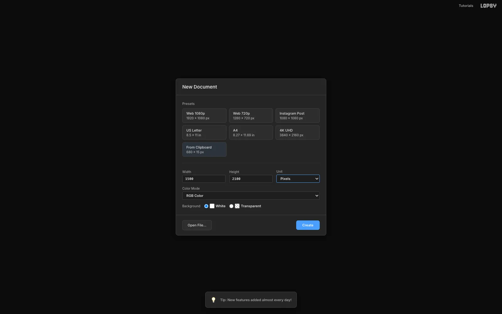

Choose **File → New**, check that **Unit** is **Pixels**, and enter
**1500 × 2100**. That's a 5 × 7 portrait card. Click **Create**.

## Paint the night sky

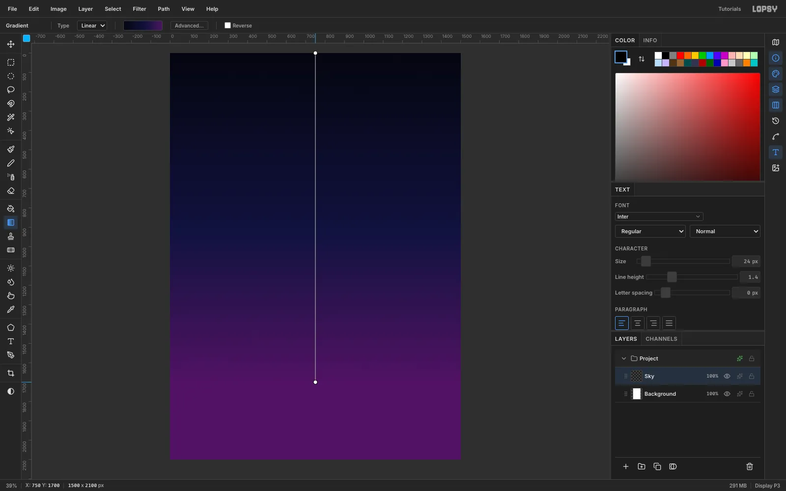

Rename **Layer 1** to **Sky**. Pick the **Gradient** tool, set **Type** to
**Linear**, and open **Advanced…** to set three stops:

1. `#05060F` at 0%
2. `#11113C` at 55%
3. `#4A1760` at 100%

Drag straight down from the top edge to about four-fifths of the way down
(around 1700 on the left ruler), where the ground will start. The violet
glow then sits just above the horizon.

## Add guides for the grid

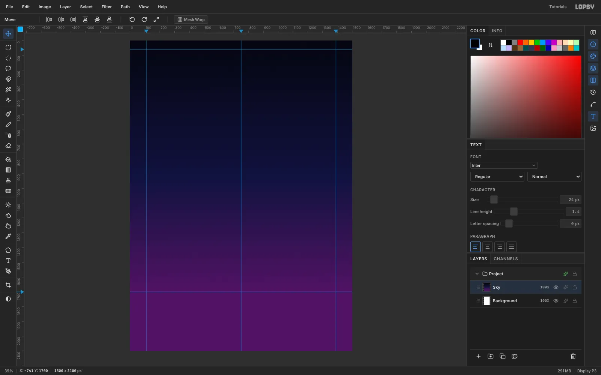

A single click on a ruler drops a guide there. Click the top ruler about
**110 px** in from each side for the margins, then [[⌘]]-click it near the
middle so the guide snaps to the centre. On the left ruler, click about
**60 px** from the top for the header line, and at the bottom of the
gradient (about 1700) for the horizon. Every block of type will hang off
these lines.

## Draw the moon

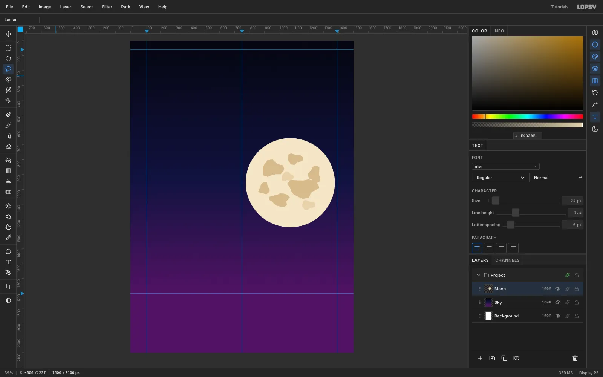

Click **Add Layer** and rename it **Moon**. With the **Elliptical Marquee**,
[[⌘]]-drag a circle about **600 px** across in the upper right: its right
edge just inside the right margin guide and its top a little under a third
of the way down. Set the foreground to `#F2E6C9` and choose **Edit → Fill**.

> **Tip:** For an exact circle, press [[⌘D]] and *click* once with the
> Elliptical Marquee instead of dragging. Type From **775, 655** To
> **1375, 1255** in the dialog.

Then add the maria, the moon's dark patches. The Lasso draws as you drag,
so press, drag round each shape and release to close it:

1. Lasso six soft blobs and fill them with `#D2BC92`.
2. Lasso two lighter patches and fill them with `#E4D2AE`.

Don't worry about smooth edges. The next step turns everything into pixels.

## Pixelate the moon

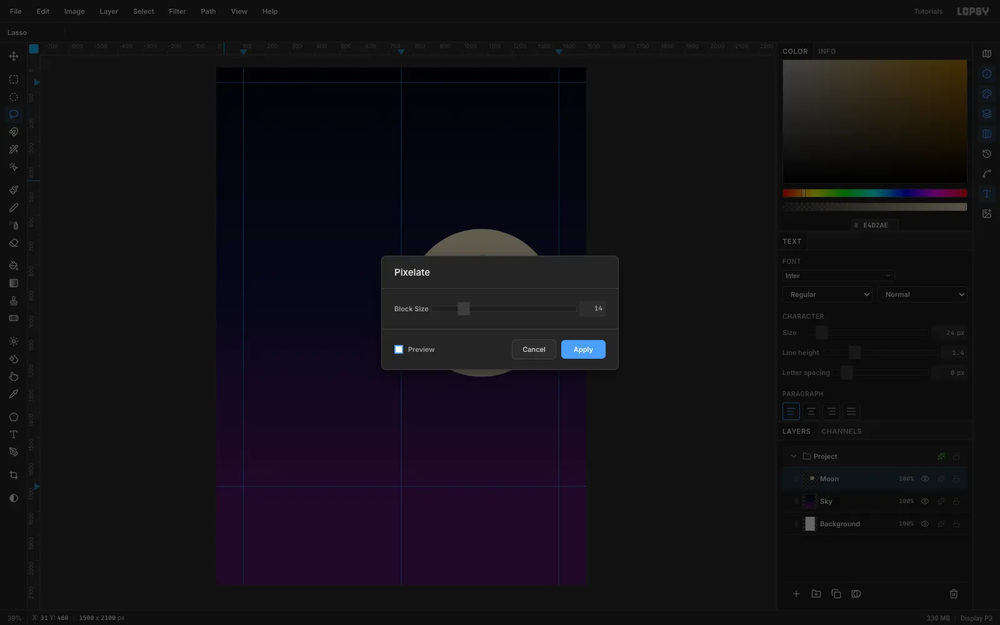

Press [[⌘D]] to drop the selection. With **Moon** selected, choose
**Filter → Pixelate…** and set **Block Size** to **14**. The circle becomes a stepped 8-bit disc, and the maria become
chunky tiles. This is the first "low-res" zone of the card.

## Build a pixel pine treeline

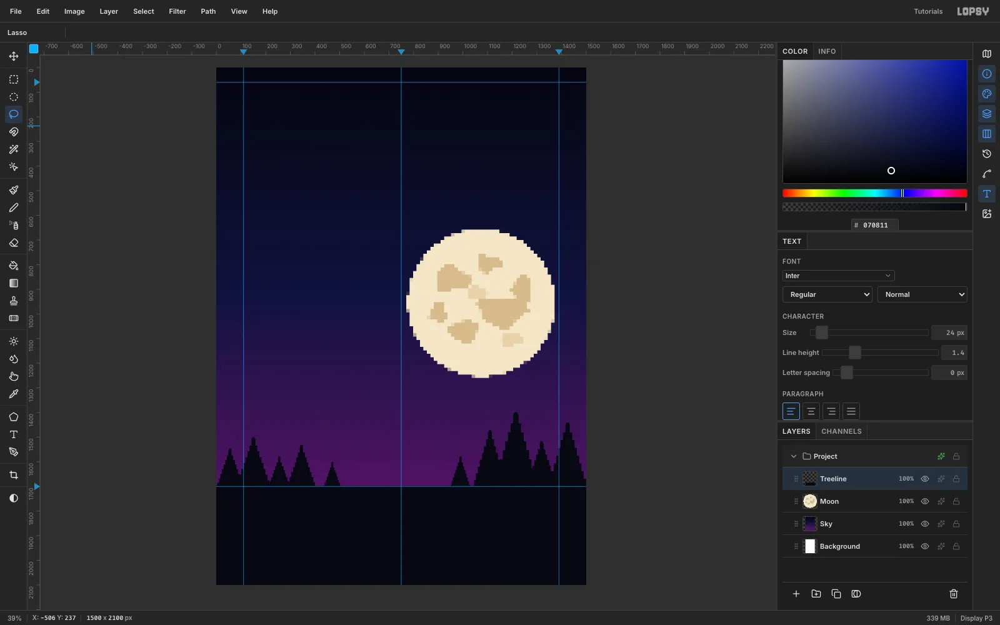

Add a **Treeline** layer. Marquee from the left edge, just above the
horizon guide, down to the bottom-right corner, and fill it with `#070811`
for the ground.

Each pine is a staircase: 8 steps that narrow as they go up, with a small
cap at the tip. Drag the **Lasso** round each staircase outline and fill it
with the same ink. Keep the trees on the left short (under about 190 px), so
the reindeer trail has room above them. Let the ones on the right grow up to
290 px.

> **Tip:** For perfectly square steps, build each tree from stacked
> rectangles instead. Marquee and fill a wide bar for the bottom step, then
> a narrower one sitting on top of it, and so on up to the cap.

## Lasso the reindeer's body

Add a **Reindeer** layer and set the foreground to cream `#F4ECD8`. Build the
silhouette from separate lasso selections, each filled with **Edit → Fill**.
Overlapping fills merge into one clean shape.

Start with the barrel-shaped **body**, with a deep chest on the right and a
slimmer rump on the left. Tip the whole animal about 14° nose-up, so it's
leaping toward the upper right.

## Finish the silhouette

Keep adding pieces in the same colour:

- A thick neck with a smooth throat.
- A long head with a blunt muzzle, and a small ear pointing back.
- Two antlers. Each is a thick beam swept back about 35°, with four tines
  fanning forward and a flat brow tine over the face. Draw the far antler
  smaller and offset behind the near one.
- One foreleg folded under the chest and one reaching forward.
- Two hind legs stretched back, each with a big thigh.
- A short flicked tail.

## Duplicate and scale the ghost frames

Press [[⌘D]] to drop the last selection. With **Reindeer** selected, click
**Duplicate Layer** four times. Each copy lands exactly on top of the one
it came from. You'll move them all later. Rename the top layer **Hero** and the four below it, top to bottom,
**Frame 4**, **Frame 3**, **Frame 2** and **Frame 1**. Frame 4 is the newest
ghost, closest to the hero.

For each frame, click its row, then:

1. Draw a marquee a little larger than the reindeer.
2. Switch to the **Move** tool.
3. Hold [[⌘]] and drag the bottom-right handle inward to scale the copy
   uniformly. Aim for roughly **85%**, **72%**, **60%** and **50%** of the
   hero's size for Frames 4 → 1.
4. Rotate it before you commit, as in the next step.

## Rotate each frame

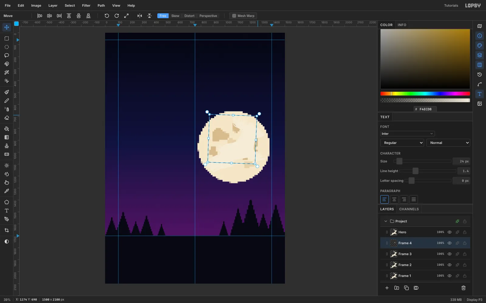

While the scale is still live, drag the round handle just outside the
top-right corner to rotate the frame clockwise by a few degrees: about **2°** for Frame 4,
then **4°**, **6°** and **8°**. Older frames should flatten out, as if they're still on the upswing
of the leap. Press [[⌘D]] to commit, then scale and rotate the next frame.

## Space the frames along an arc

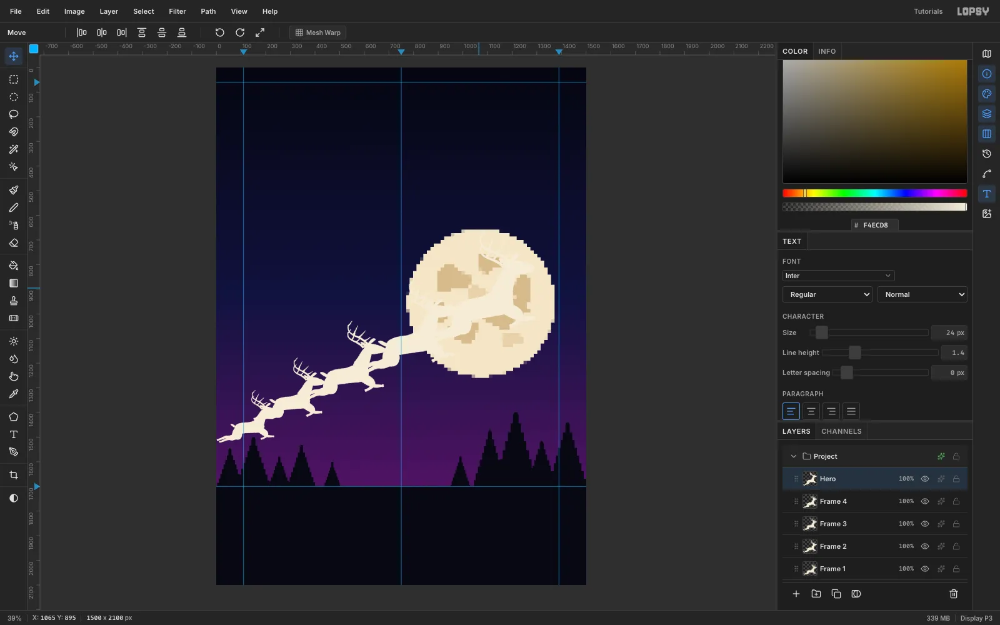

Click each frame's row and drag it with the **Move** tool so the sequence
steps down and to the left in an arc, each one smaller than the last. Let frames overlap only a
little, around a tenth of their area, so each silhouette still reads on its
own. Keep the last frame fully on the canvas, at least 60 px in from the
left edge and above the pine tips.

## Corrupt the older frames

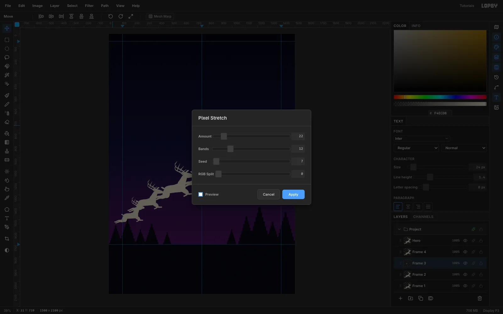

Each frame gets a little more broken than the one before:

- **Frame 4:** leave it clean.
- **Frame 3:** **Filter → Pixel Stretch…**, with Amount **22**, Bands **12**,
  Seed **7** and RGB Split **0**.
- **Frame 2:** **Filter → Pixelate…** with Block Size **6**, then
  **Pixel Stretch…** with Amount **30**, Bands **9** and Seed **21**.
- **Frame 1:** **Pixelate…** with Block Size **12**, then **Pixel Stretch…**
  with Amount **36**, Bands **7** and Seed **5**.

Click the frame's row before each filter, and keep RGB Split at 0 every
time (it defaults to 0.5). The colour comes from the next step.

## Review the corruption gradient

Read the trail from right to left: clean, then smeared, then blocky, then
nearly dissolved. That gradient is what makes this look like a failing
animation and not random noise.

## Split each frame into red and cyan

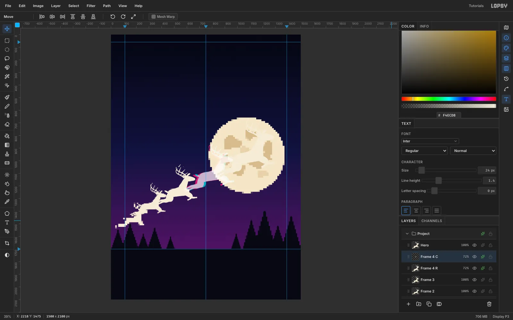

For each frame:

1. Click **Duplicate Layer**.
2. Rename the original **Frame N R** and the copy **Frame N C**.
3. Open **Layer effects** (✦). Turn on **Color Overlay** with `#FF2A4D` on
   the R layer and `#19E3E3` on the C layer.
4. Set the blend mode of both layers to **Screen**.
5. With the **Move** tool and nothing selected, nudge the R layer left and
   the C layer right with the arrow keys ([[→]] moves 1 px, [[Shift+→]]
   10 px). Use **8 px** each way for Frame 4, then 10, 12 and 14 px for the
   older frames.

Where red and cyan overlap in Screen mode they add up to near-white. So each
ghost gets a pale core with a red fringe on the left and a cyan fringe on
the right, like a 3D anaglyph.

> **Tip:** **Filter → Chromatic Aberration…** can split a single layer too,
> but a Color Overlay pair lets you pick the exact red and cyan and set each
> offset and opacity on its own.

## Fade the trail

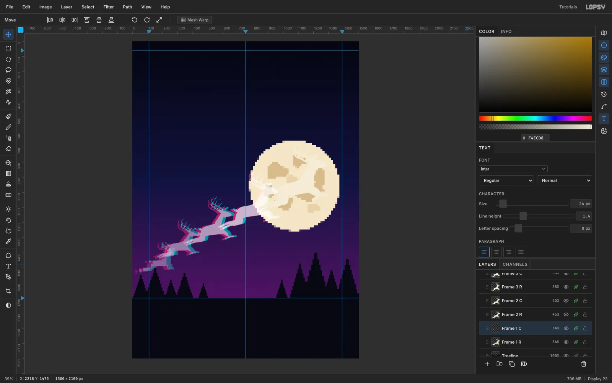

Set both layers of each pair to the same opacity: **72%** for Frame 4, then
**58%**, **45%** and **34%**. The oldest frames now sink into the sky, and
the hero stays the focus.

## Ink the hero

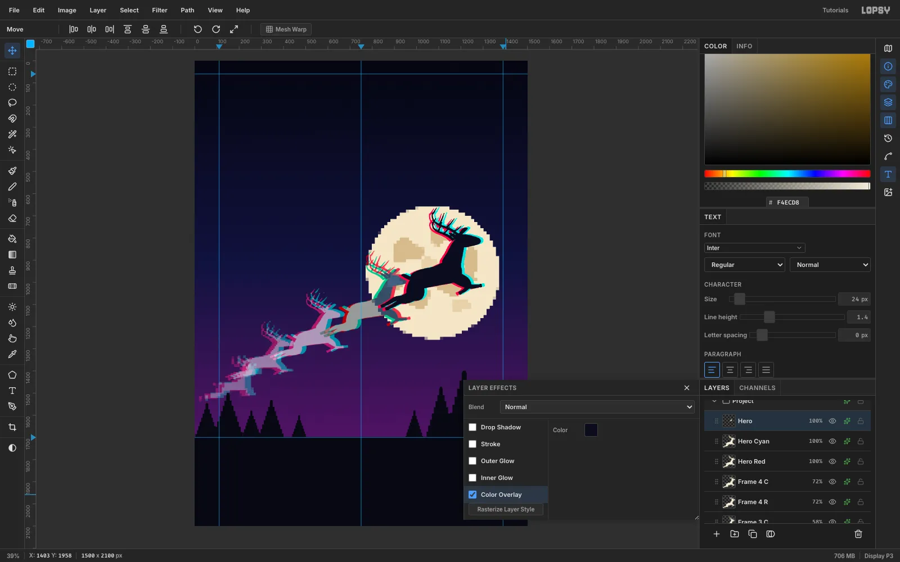

Duplicate **Hero** twice. Name the bottom layer **Hero Red**, the middle one
**Hero Cyan** and the top one **Hero**:

- Move **Hero Red** 12 px left and 3 px down, with a `#FF2A4D` Color Overlay.
- Move **Hero Cyan** 12 px right and 3 px up, with a `#19E3E3` Color Overlay.
- Give **Hero** a `#0B0C1C` Color Overlay.

Leave all three in **Normal** mode. Screen would vanish against the cream
moon, but Normal keeps a sharp red and cyan edge on the black silhouette.

## Give him a red nose

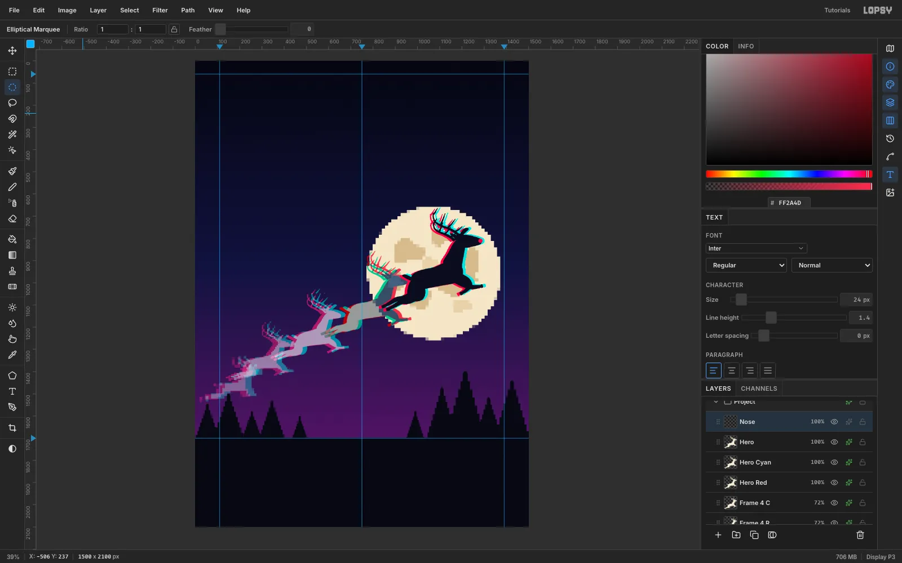

Add a **Nose** layer. Pick the **Brush** at Size **19** and Hardness **100**,
set the foreground to `#FF2A4D` and click once on the tip of the muzzle. This is the one warm spot in the scene; you'll
give it a glow in the last steps.

## Group the zoetrope

Click **Frame 1 R**, [[Shift]]-click **Nose**, and choose
**Layer → Group Layers**. Name the group **Zoetrope**.

With the group row selected, you can drag the whole animation with the
**Move** tool to try other positions. [[⌘Z]] puts it back exactly, and
[[⇧⌘Z]] redoes the move.

## Make pixel snow

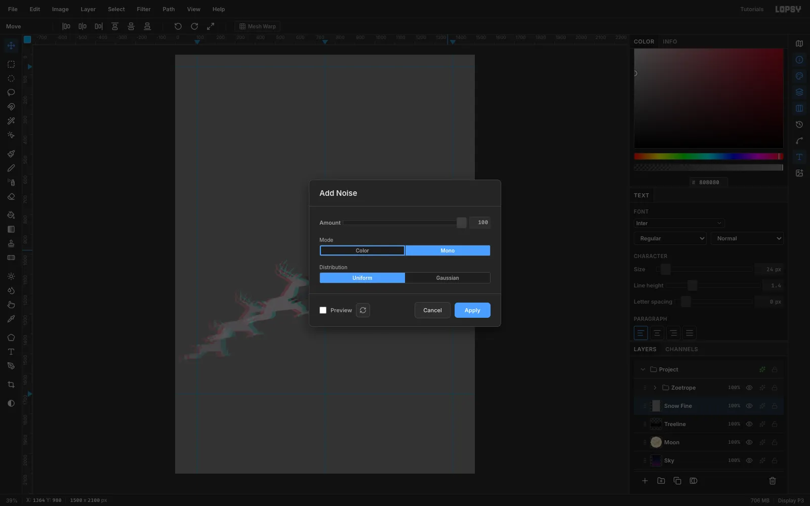

Click **Treeline** and add a layer called **Snow Fine**:

1. With nothing selected, set the foreground to `#808080` and choose
   **Edit → Fill** to fill the whole layer.
2. **Filter → Add Noise…** with **Amount 100** and Mode **Mono**.
3. **Filter → Pixelate…** with Block Size **6**. The noise becomes 6 px tiles.
4. **Filter → Threshold…** with Level at about **160**, so only about 1% of
   the tiles stay white.
5. Set the layer's blend mode to **Screen** in the ✦ drawer. The black
   disappears.

Repeat on a **Snow Coarse** layer with Block Size **10** and a Threshold
Level of about **156**, which leaves a handful of bigger flakes.

## Keep the snow off the ground

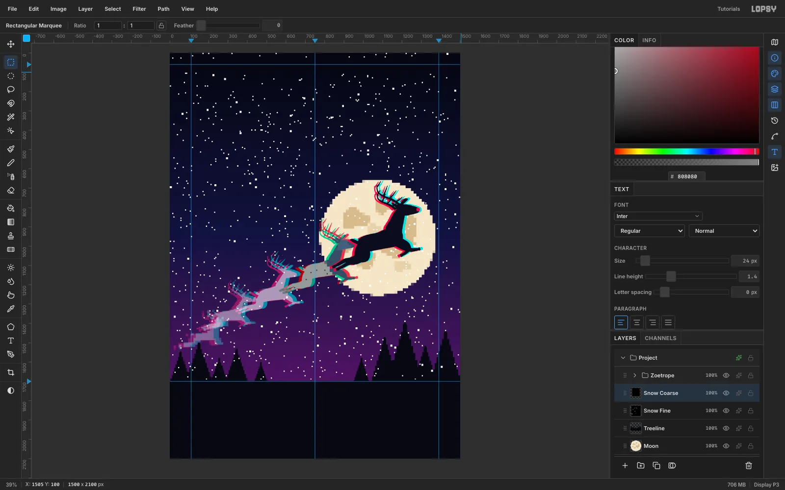

On both snow layers:

1. Marquee from just above the horizon guide down to the bottom of the
   card and press [[Delete]].
2. Do the same for the thin header strip above the header guide.

Then drag **Treeline** above both snow layers in the Layers panel, so the
pines hide any flakes behind them. The type area stays clean.

## Draw a scanline tile

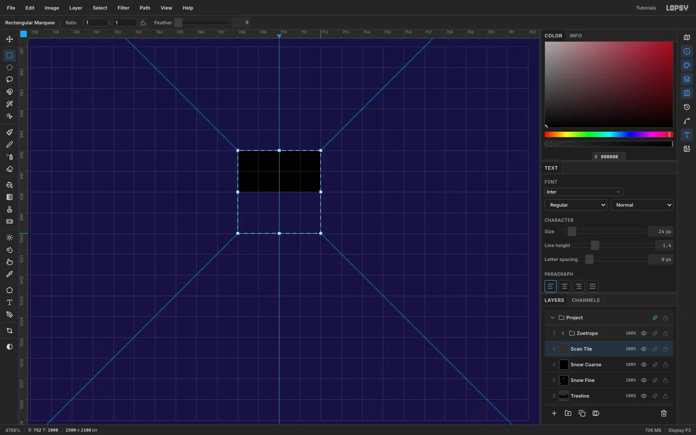

Add a temporary layer. Hold [[Ctrl]] and scroll up to zoom in all the way.

1. Marquee a **4 × 2** px rectangle and fill it black.
2. Marquee the **4 × 4** square that contains it.
3. Choose **Edit → Define Pattern**.

That's one CRT scanline: 2 px dark, 2 px clear. Delete the temporary layer
and press [[⌘0]] to fit the canvas again.

> **Tip:** Tiny marquees are easier to type than to drag. With nothing
> selected, click once (don't drag) with the Rectangular Marquee and enter
> From **0, 0** To **4, 2** for the bar, then From **0, 0** To **4, 4** for
> the tile.

## Fill the card with scanlines

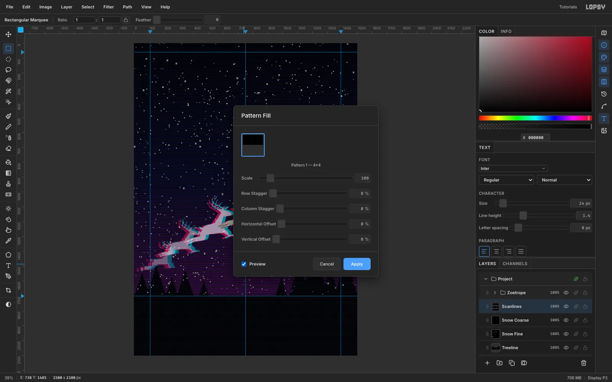

Press [[⌘D]] so nothing is selected, then add a **Scanlines** layer. Choose
**Edit → Fill with Pattern…**, pick the **4×4** pattern and tick
**Preview**. Click **Apply**.

Drop the layer's opacity to **22%**, then drag it above the **Zoetrope**
group, so the lines run over everything and flatten it like a CRT screen.

## Set the headline

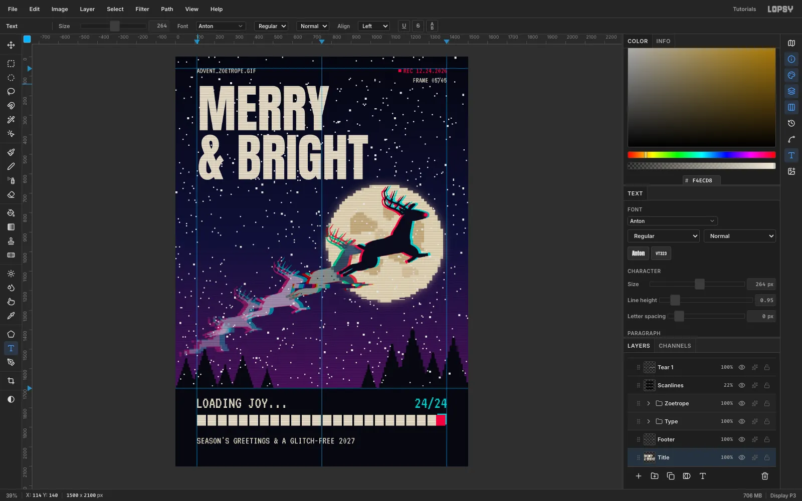

Click **Snow Coarse** and set the foreground to `#F4ECD8`. Pick the **Text** tool, set the font to
**Anton** and Size to **264** in the options bar, and set **Line height** to
**0.95** in the Text panel. Click in the sky, type **MERRY**, press [[Enter]], then type
**& BRIGHT**.

Click **Rasterize Layer** in the Layers panel, so you can cut slices out of
the letters in the next step. Then move the title so its left edge sits a
few pixels right of the left margin guide and its top is about 130 px down,
well below the header line. That leaves room for the red copy you'll add
later, which sits 10 px further left, like a misregistered print.

## Datamosh the title

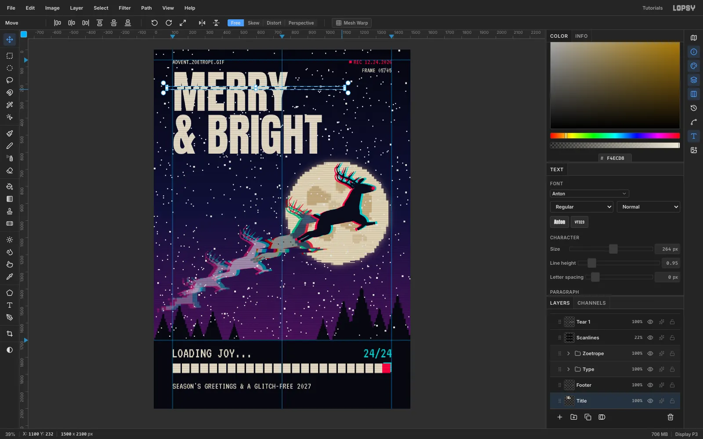

Glitch slices only work when the title stays readable, so make just two:

1. Marquee a thin band, about **18 px** tall, right across **MERRY** a
   little above the middle of the letters. With the **Move** tool, nudge it
   **16 px** right with the arrow keys ([[Shift+→]] moves 10 px, [[→]] 1 px).
   Press [[⌘D]].
2. Marquee a **16 px** band across **BRIGHT**, again a little above the
   middle. Start it just right of the **&** so the ampersand stays whole,
   and run it past the end of the word. Shift it **14 px** left and press
   [[⌘D]].

Keep the slices thin and the shifts small. At 30 px or more, the shifted
strokes start to read as doubled letters.

## Split the title's channels

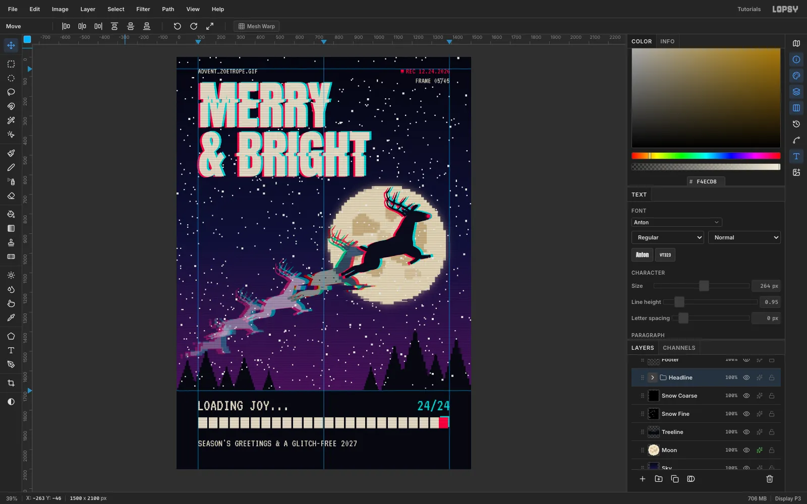

Treat the title like the hero. Click **Duplicate Layer** twice and name the
layers **Title Red** (bottom), **Title Cyan** and **Title** (top):

- **Title Red:** 10 px left and 3 px down, with a `#FF2A4D` Color Overlay.
- **Title Cyan:** 10 px right and 3 px up, with a `#19E3E3` Color Overlay.

Because the slices were cut *before* you duplicated, all three layers glitch
in the same places. Group them as **Headline**.

> **Tip:** Keep the three layers separate rather than merging them. That way
> you can still adjust each channel's offset or colour at the end.

## Add the terminal type

Use **VT323**, a pixel terminal face, for everything else. Hang the left
blocks on the left margin guide, and set the right blocks with **Align** set to **Right** in the options
bar, so their right edges sit on the right margin guide:

- **ADVENT_ZOETROPE.GIF:** 40 px cream, on the left margin with its top on
  the header guide.
- **REC 12.24.2026:** 40 px red, on the right margin, level with it. On a new
  layer, fill a 16 px red square just left of it as a recording light.
- **FRAME 05/05:** 40 px cream, right-aligned under REC.
- **LOADING JOY...:** 84 px cream on the left margin, about 50 px below the
  horizon guide.
- **24/24:** 84 px cyan, on the right margin, on the same line.
- **SEASON'S GREETINGS & A GLITCH-FREE 2027:** 52 px cream on the left
  margin, near the bottom of the card. Leave room above it for the loading
  bar.

Start each block by clicking a layer that isn't text, then set its size
and colour and click to type. Nudge each block into place with
the **Move** tool and the arrow keys.

## Build the advent loading bar

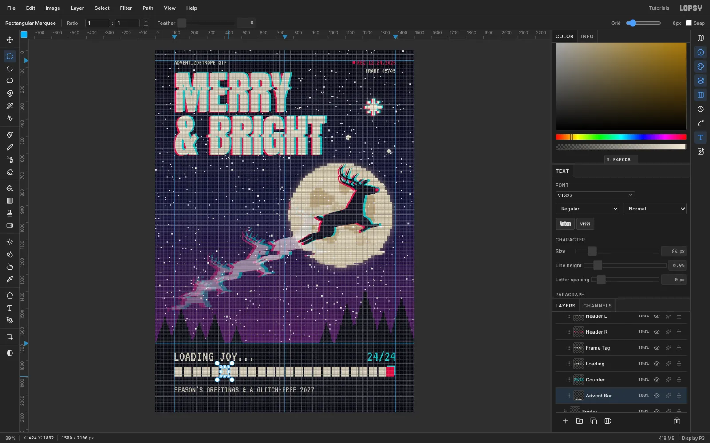

Turn on **View → Show Grid** to check alignment, and untick **Snap** in the
options bar. These cells don't fall on grid lines.

Add an **Advent Bar** layer. The bar is **56 px** tall, sits between
LOADING JOY... and the greeting, and runs from margin guide to margin guide.
Marquee-fill 24 cells along it, each about **46 px** wide with an **8 px**
gap. Twenty-four cells and 23 gaps fill the 1280 px between the margins
exactly, so each cell starts about 53.7 px after the last.

> **Tip:** To type each cell's corners, press [[⌘D]] and click once with
> the Rectangular Marquee. Cell 1 runs From **110, 1836** To **156, 1892**.
> Add 53.7 to both X values for every cell after it, rounding to whole
> pixels.

Fill 23 cells cream. If you drag them, hold [[Shift]] as you start each cell
after the first, and one fill covers them all. For the 24th, first fill a cyan cell 6 px up and to the
right, then a red `#FF2A4D` cell on top. Christmas Eve is the one cell that's
still flickering. Group all the type layers as **Type**.

## Tear the image with Copy Merged

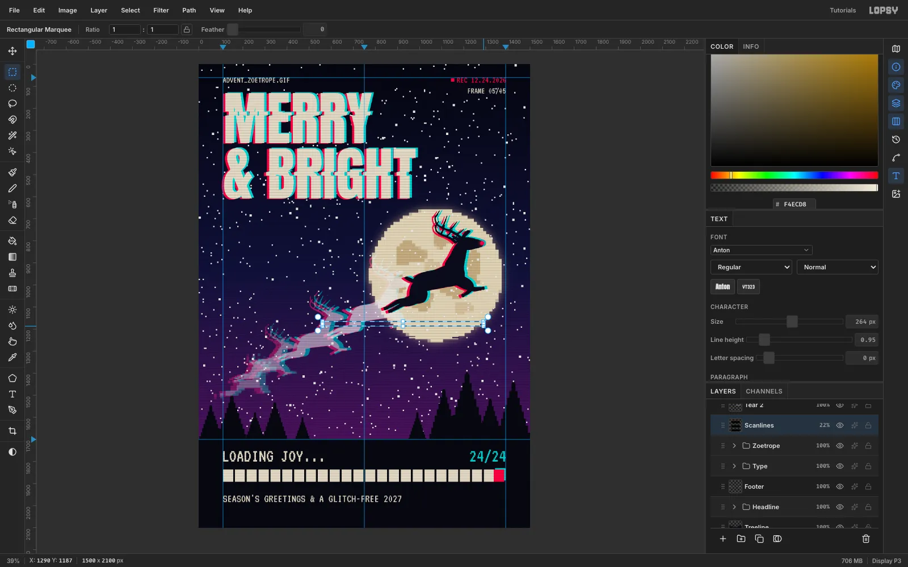

Real datamosh artefacts cut across *everything*, so copy from the whole
composite:

1. Click the top layer. Marquee a thin band, about **22 px** tall, across
   the lower part of the moon just below the hero's hooves. Start it over
   the nearest ghost frame on the left and end it a little inside the moon's
   right edge. Press [[⇧⌘C]] (**Edit → Copy Merged**).
2. Press [[⌘V]]. The band pastes in place as a new layer.
3. With the **Move** tool, nudge it **40 px** right with the arrow keys,
   then press [[⌘D]].

## Add a second tear

Make a second, 6 px band across the bottom of the moon the same way, shift
it **28 px** left and press [[⌘D]]. Then trim both bands so they end inside
the moon: on each band's layer, marquee the part that sticks out past the
moon's edge and press [[Delete]]. Glitches that spill into the empty sky just
look like dead pixels.

## Balance the corner with a pixel star

The top right is empty, so add a Christmas star. On a **Pixel Star** layer,
build an 8-bit sparkle from 14 px squares:

- A cross 7 blocks tall and 7 blocks wide.
- A 3-block row just above and just below the centre.
- Four single blocks on the diagonals.

Draw it three times: in red 6 px to the left, in cyan 6 px to the right,
then in cream on top. Add two small cream crosses nearby, then give the
layer an **Outer Glow** in cream (Size 28, Opacity 45).

## Make the moon glow

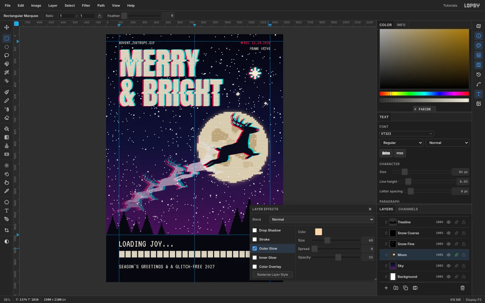

On **Moon**, turn on **Outer Glow** with
`#FFD9A8` (Size **60**, Spread **0**, Opacity **55**). On **Nose**, add an
**Outer Glow** in `#FF2A4D` (Size **22**, Spread **10**, Opacity **90**).
Rudolph now lights the frame.

Check the whole card at [[⌘0]]. Save the project with
**File → Save Project**, then export with **File → Quick Export PNG**.
