Gothic design runs on contrast: cold stone and hot coloured light, black lead against glowing glass, a heavy blackletter title against a quiet, readable menu. In this tutorial you'll make a 1400 × 2000 px menu for **Crow & Ember**, an imaginary candlelit chophouse.

The page has:

- an ashlar stone wall tiled with **Pattern Fill**
- a pointed window drawn the way medieval masons did it, from **two overlapping circles**
- stained glass made with the **Voronoi** filter, and lead lines built from a second Voronoi pass with **Find Edges** and **Threshold**
- a raven silhouette made from a photo with **Threshold** and the **Magic Wand**
- a stone frame with voussoir joints, a sill and warm light bouncing off the glass
- two candles in wrought-iron sconces, with sparks made with the **Spray** tool
- a gold blackletter title, a two-column parchment menu and a rotated **wax seal**

The fonts are free Google Fonts:

- **UnifrakturMaguntia** for the title and the section headings
- **IM Fell English SC** for the subtitle and the footer
- **Spectral** (SemiBold and Italic) for the dishes, notes and prices
- **Cinzel Decorative** Bold for the seal's monogram

The palette:

- Stone `#1C1D25`, warm frame stone `#6B625A`, iron `#1A1820`
- Glass `#FFD27A` → `#F59A2A` → `#D9541E` → `#8E1530` → `#2A2F8C` → `#101848`
- Ember light `#FF8A2A`, spill `#E0561A`
- Gold title `#FFE9A8` → `#F2B54A` → `#B9541C`
- Parchment `#E2D0A8`, ink `#2A1810`, notes `#5E4028`
- Ruby `#7E1426`, wax `#8E1530`

The raven is a public-domain photo from Wikimedia Commons, *Raven perched on a snag* by Yellowstone National Park. Any photo of a dark bird against a pale sky will work.

Each part of the page gets its own group (`Window`, `Candles` and `Menu`). New layers appear above whichever layer is selected, so select a layer inside a group before you add to it. A few screenshots were re-taken from the finished file, so the Layers panel sometimes lists a group you haven't made yet.

## Lay a dark stone wall

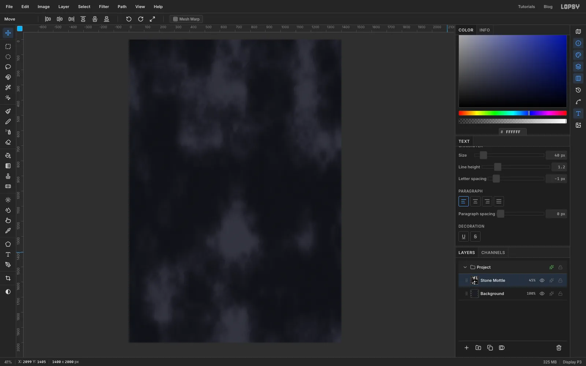

Create a **1400 × 2000** document. Select `Background`, set the foreground to `#1C1D25` and choose **Edit → Fill**. Run **Filter → Add Noise…** at **6**, **Mono**, for a little grit.

Rename `Layer 1` to `Stone Mottle`. Set the foreground to white and the background to black, then run **Filter → Clouds…** at **Scale 6**. Set the layer's blend mode to **Soft Light** and its opacity to **45%**. The wall now has the uneven light and dark patches of real stone.

## Draw one stone block

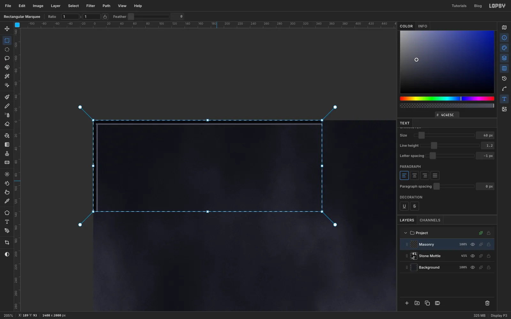

Add a layer called `Masonry`. You'll draw a single block's joints and repeat it across the wall.

1. Choose the **Pencil** at **Size 4** with a near-black `#08080B`. Click at the top-left corner of the canvas, then [[Shift]]-click about 350 px to the right. Draw a second line from the same corner straight down about 140 px.
2. Switch the Pencil to **Size 2** and a lighter grey `#4C4E5C`. Draw the same two lines again, about 4 px inside the dark ones. This thin highlight is what makes the joint look cut into the stone.
3. With the **Rectangular Marquee**, select the block from the corner to **350 × 140**. Click once on the canvas without dragging if you want to type the corners exactly.

Choose **Edit → Define Pattern**.

## Tile the wall with Pattern Fill

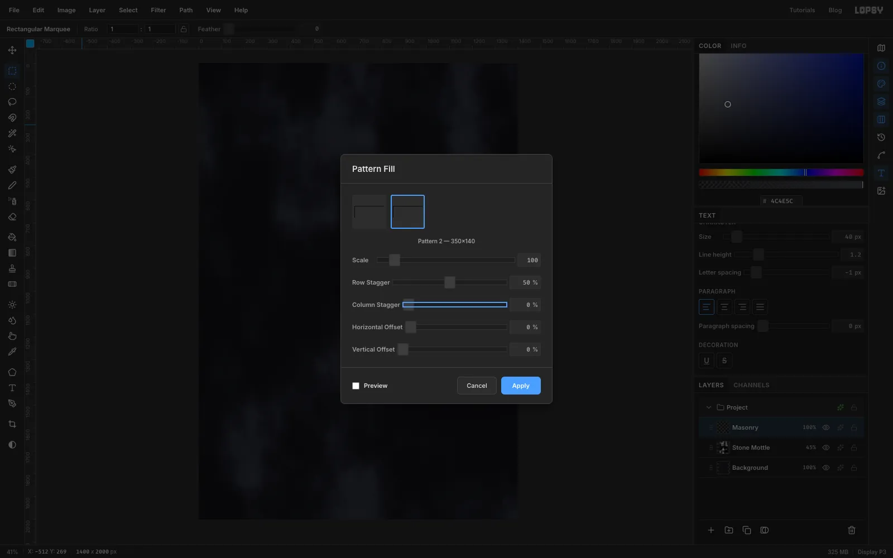

Select all, press [[Delete]] to clear the block you drew, and choose **Edit → Fill with Pattern…**. Pick the new pattern and set **Row Stagger** to **50%**. Each course of blocks now sits half a block over from the one below, like real ashlar masonry. Click **Apply** and set the layer to **85%** opacity.

## Add guides

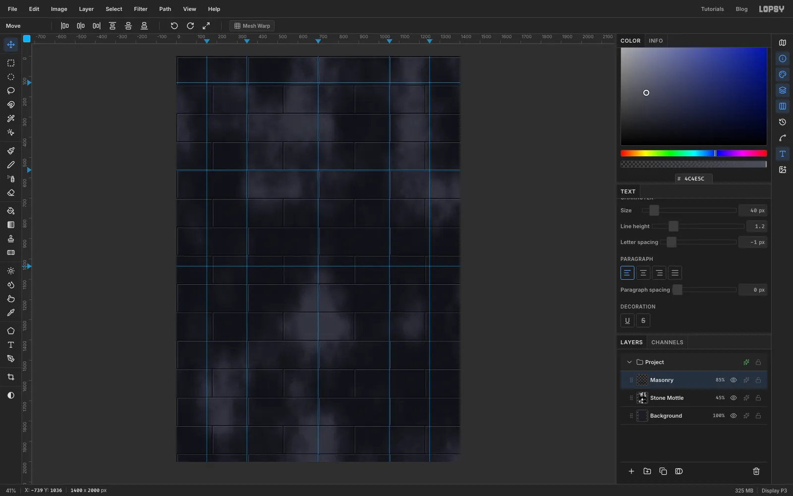

Click the top ruler at **150**, **348**, **700**, **1052** and **1250** to make vertical guides, and the left ruler at **130**, **561** and **1036** for horizontal ones. The outer pair mark where the candles go. The inner pair are the sides of the window, 700 is the centre line, and the horizontal guides are the window's point, the top of its straight sides, and its bottom.

Turn off **View → Snap to Guides** for the next few steps. The circles you're about to draw have edges close to the guides, and you don't want them pulled out of shape.

## Draw a pointed arch from two circles

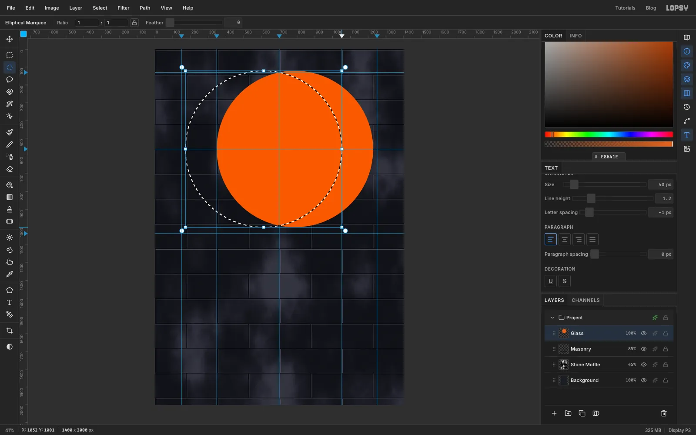

A gothic arch is two circular arcs that meet at a point. Masons drew it with a compass, and you can do the same with two circles.

Add a layer called `Glass` and set the foreground to orange `#E8641E`.

1. Choose the **Elliptical Marquee** and, with nothing selected, click once on the canvas without dragging. That opens a dialog where you type the corners exactly. Enter From **348, 121** to **1228, 1001**: an 880 px circle centred at 788, 561, whose left edge touches the guide at 348. Choose **Edit → Fill**, then deselect.
2. Click again and enter **172, 121** to **1052, 1001** for a second circle of the same size, centred at 612, 561, whose right edge touches the guide at 1052.
3. Choose **Select → Inverse** and press [[Delete]]. Only the lens where the two circles overlap is left.

## Finish the window shape

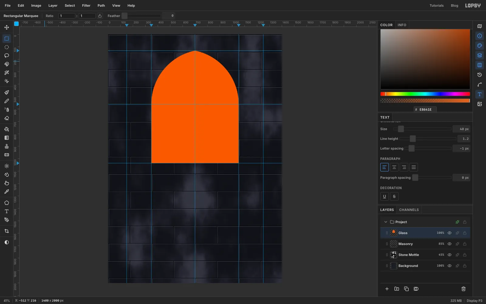

Marquee everything below the 561 guide and press [[Delete]] to cut off the bottom of the lens. Then marquee from the guides at **348, 561** to **1052, 1036** and fill it. The point of the arch lands exactly on the 130 guide.

Choose **Layer → Duplicate Layer**, rename the copy `Arch Template` and hide it. You'll [[Cmd]]-click its thumbnail many times to get the window's outline back as a selection.

## Fill the glass with a radial gradient

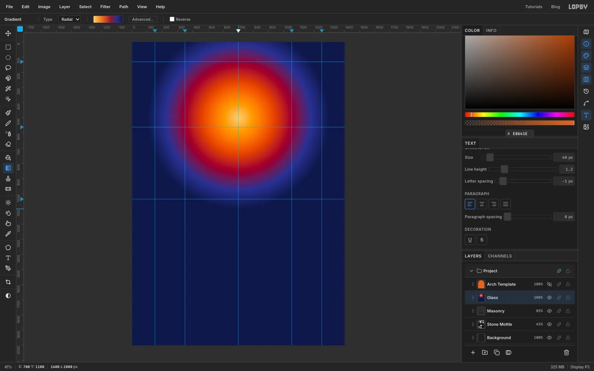

Deselect, then choose the **Gradient** tool, set **Type** to **Radial** and click **Advanced…**. Make six stops: `#FFD27A`, `#F59A2A`, `#D9541E`, `#8E1530`, `#2A2F8C` and `#101848`, at about 0, 18, 38, 60, 80 and 100%.

Drag from about **700, 500** straight down to about **700, 1100**, a little below the window. Fill the **whole layer**, not just the arch. The next filter breaks the image into cells, and cells along the arch's edge need colour on both sides to come out whole.

## Break the gradient into glass

Run **Filter → Add Noise…** at **16** with **Color** and **Uniform**. On its own this just looks grainy. Its job is to give every piece of glass a slightly different tint.

Now run **Filter → Voronoi…** with **Cells 34**, **Edge Width 0** and **Seed 128**. Each cell takes the colour at its centre, so the noise turns into hand-picked glass: no two neighbouring pieces quite match.

> **Tip:** Leave Edge Width at 0. Voronoi's own edge lines go soft and smudgy where cells meet at shallow angles, so you'll make cleaner lead lines yourself in the next steps.

## Make a matching cell map for the lead

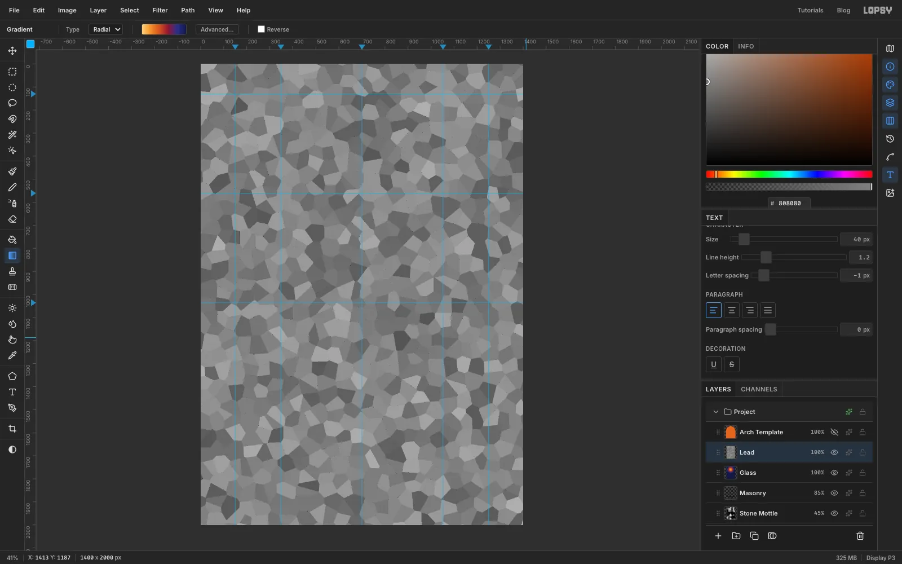

The Voronoi **Seed** is repeatable: run it again with the same settings on a layer of the same size, and you get exactly the same cells. You'll use that to draw lead lines along every edge.

1. Add a layer called `Lead` above `Glass`.
2. Fill it with mid grey `#808080`.
3. Run **Add Noise** at **100**, **Mono**, **Uniform**.
4. Run **Voronoi** again with **Cells 34**, **Edge Width 0**, **Seed 128**.

The cells match the glass exactly, but neighbouring cells now have very different greys, which makes their edges easy to find.

## Trace the cell edges

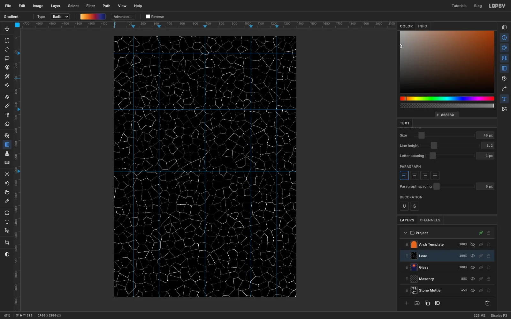

Run **Filter → Find Edges**. Every boundary between two cells becomes a thin bright line on black.

## Turn the edges into lead

Now thicken those lines and make them black:

1. **Threshold** at **8**, so every edge becomes pure white.
2. **Gaussian Blur** at **2**.
3. **Threshold** again at **60**. The blur spreads each line, and the second threshold cuts it back to a solid line about 5 px wide.
4. **Filter → Invert**, so you have black lines on white.
5. Set the layer to **Multiply**. The white disappears and only the lead shows.

To trim both layers to the window, [[Cmd]]-click the `Arch Template` thumbnail, choose **Select → Inverse**, and press [[Delete]] on `Lead` and then on `Glass`.

## Touch up missing leads

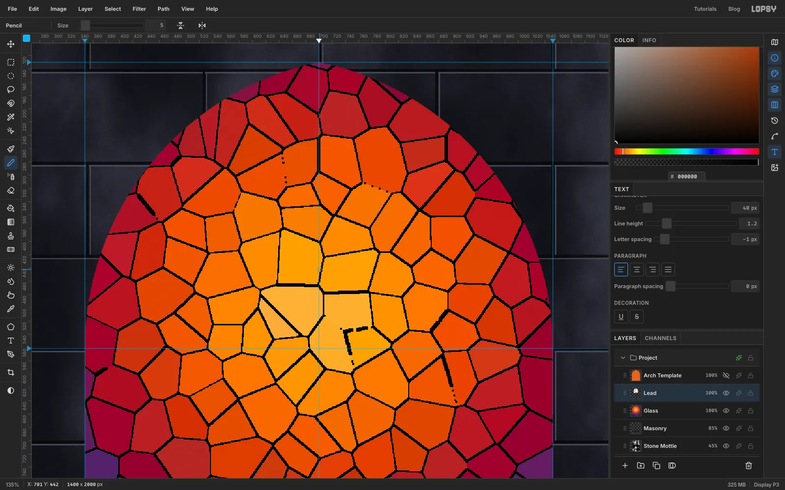

Zoom in and look over the window. Here and there two cells will have had nearly the same grey, so Find Edges skipped their boundary and left a gap or a dotted line. Fix those by hand on the `Lead` layer: **Pencil**, **Size 5**, black, click one end of the missing edge and [[Shift]]-click the other.

Also look for short stubs of lead that don't join anything, especially along the edge of the arch. Lasso them and press [[Delete]].

## Give the glass some depth

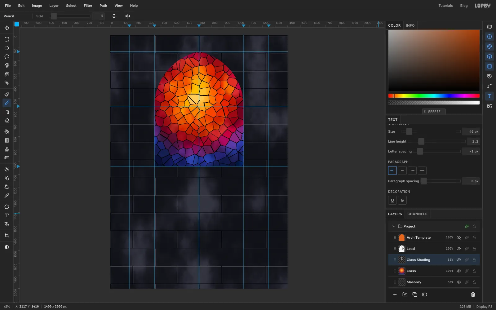

Real glass isn't evenly coloured. Add a layer called `Glass Shading` between `Glass` and `Lead`. [[Cmd]]-click the `Arch Template` thumbnail, run **Clouds** at **Scale 10** with white and black, and deselect. Set it to **Overlay** at **35%**.

## Build the stone frame

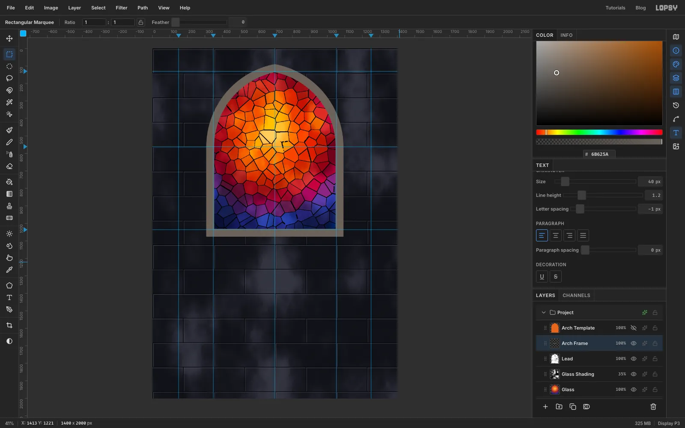

The frame is a bigger version of the same arch. Add a layer called `Arch Frame` above `Lead` and set the foreground to warm stone `#6B625A`.

1. Use the exact-corners dialog again for two **960 px** circles on the same centres as before: **308, 81** to **1268, 1041**, and **132, 81** to **1092, 1041**. Fill the first, deselect, then select the second, **Inverse** it and delete, exactly as you did for the window.
2. Delete everything below 561, then fill a rectangle from **308, 561** to **1092, 1076** for the sides.
3. [[Cmd]]-click `Arch Template`, choose **Select → Shrink…** by **5**, and press [[Delete]] on `Arch Frame`. That opens the window up and leaves the frame overlapping the glass by a few pixels, like a real rebate.

[[Cmd]]-click the frame's thumbnail and run **Add Noise** at **16**, **Mono**, so it reads as stone instead of plastic.

## Cut the voussoir joints

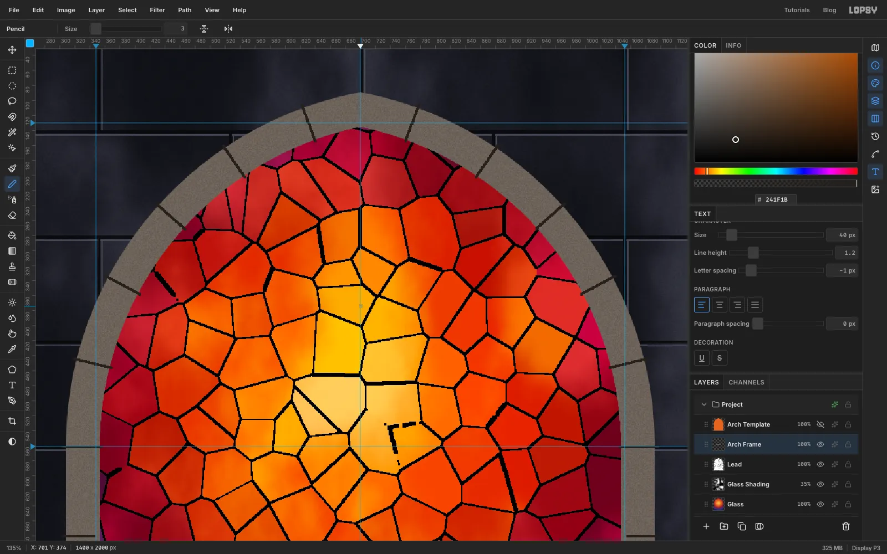

A stone arch is built from wedge-shaped blocks called voussoirs. Pick the **Pencil** at **Size 3** in dark `#241F1B`. Across the left arc, draw short lines that point back towards the right circle's centre. Space them evenly, about six on each side. Click the inner edge of the frame, then [[Shift]]-click the outer edge. Do the same on the right arc, pointing back towards the left circle's centre. Add three level joints across each straight side.

Then open the layer's effects and add:

- **Inner Glow**: near-black `#0A0806`, Size **24**, Opacity **90%**, so the frame's inner and outer edges curve away
- **Drop Shadow**: black, offset **0, 14**, Blur **28**, Opacity **75%**

## Add the sill and the glow

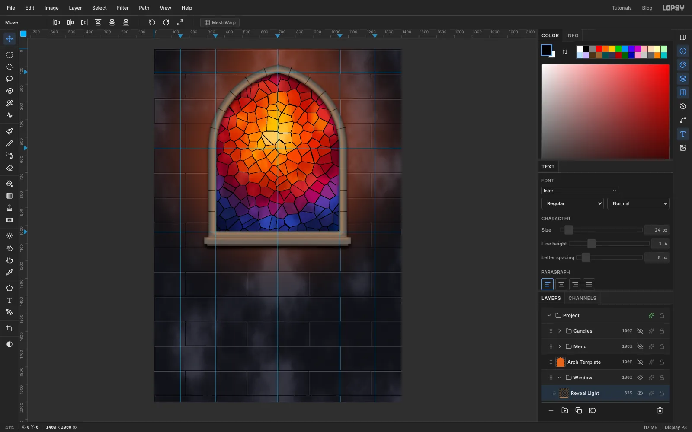

Add a layer called `Sill`. Fill a slab a little wider than the frame (**284, 1066** to **1116, 1104**) with `#6B625A`, and a slightly narrower, darker lip under it in `#463F39`. Give it the same noise, an **Inner Glow** of Size **10**, and a **Drop Shadow** of **0, 16**, Blur **22**.

Light from the glass should warm the stone next to it. Add a layer called `Reveal Light`. [[Cmd]]-click `Arch Template`, **Grow…** by **18** and fill with `#FF8A2A`. [[Cmd]]-click `Arch Template` again and press [[Delete]], leaving a thin orange ring. Marquee a strip along the top of the sill and fill that too. Run **Gaussian Blur** at **16** and set the layer to **Screen** at about **32%**. Keep it faint: you want warm stone, not a glowing tube.

Finally, select `Masonry` and add a layer called `Light Spill`. Fill an ellipse about 1100 × 1300 px centred on the window with `#E0561A`, run **Gaussian Blur** at **140**, and set it to **Screen** at **45%**. The wall now looks lit by the window.

## Bring in the raven

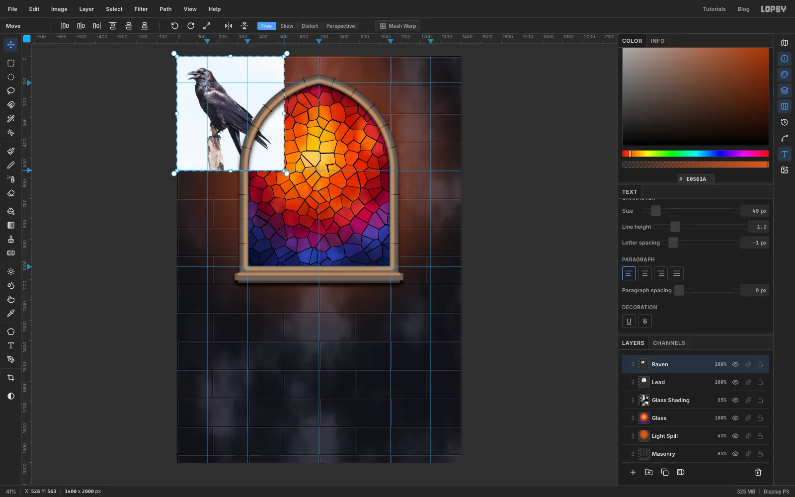

Copy your raven photo and paste it with [[Cmd+V]] while `Lead` is selected, so it lands just above the glass. Rename the layer `Raven`.

The paste comes in selected, with handles. Hold [[Cmd]] and drag a corner handle inwards to scale it evenly, until the bird is about 450 px from the top of its head to the tip of its tail. Then drag from inside the box to move the bird so its head is near the top of the window, its chest is over the brightest part of the glass, and its tail hangs towards the lower right. Press [[Enter]] to commit.

## Turn the photo into a silhouette

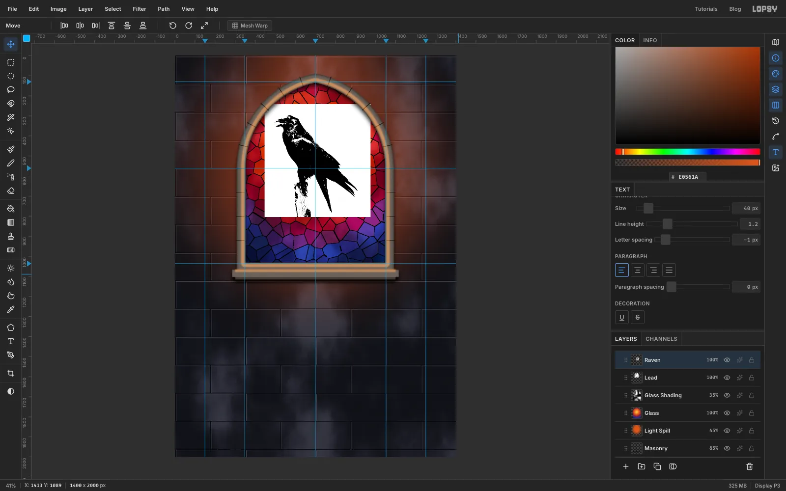

Run **Filter → Threshold…** at **150**. The sky goes white and the bird goes black.

The edge of a thresholded photo is jagged. To smooth it, run **Gaussian Blur** at **1.5** and then **Threshold** again at **128**.

If the bird is standing on a post or perch in the photo, lasso the part below its feet and press [[Delete]].

## Cut it out and add a rim light

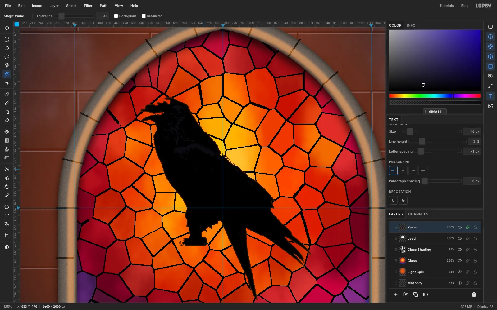

Choose the **Magic Wand** with **Contiguous** on and click the white sky. Press [[Delete]], then deselect.

There are still white feather highlights inside the bird. Turn **Contiguous** off, click one of them, and fill the selection with near-black `#0B0A10`. Then [[Cmd]]-click the `Raven` thumbnail and fill once more, which flattens any grey sheen left from the photo. Now the raven is one solid silhouette, like a piece of black glass.

Give the layer an **Inner Glow** in `#FF7A1A`, Size **5**, Opacity **75%**. It catches the edges as if the bird were backlit by the window.

## Add a branch for it to perch on

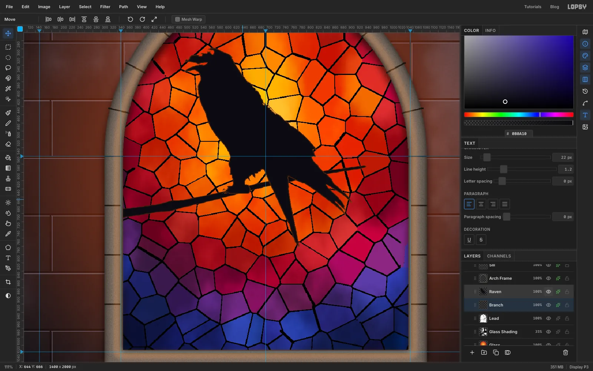

Add a layer called `Branch` between `Lead` and `Raven`, so the bird's feet sit on top of it. With the **Lasso**, draw the branch's outline:

- start under the frame on the left at about the height of the window's middle
- rise gently to the right, passing just under the raven's feet
- end in a point about 100 px before the right side of the window
- make it about 20 px thick on the left and 6 px at the tip, with a bump for a knot

Fill it with `#0B0A10` and add the same orange **Inner Glow** at Size **4**. Keep it to one clean branch: extra twigs crossing the glass get confused with the lead lines.

## Group the window

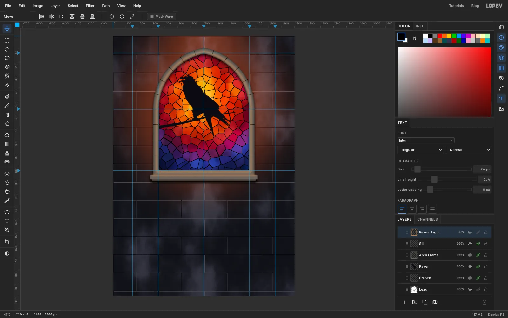

Click `Glass` in the Layers panel, [[Shift]]-click `Reveal Light`, and choose **Layer → Group Layers**. Name the group `Window`. Now you can hide or move the whole window as one piece.

## Light the left candle

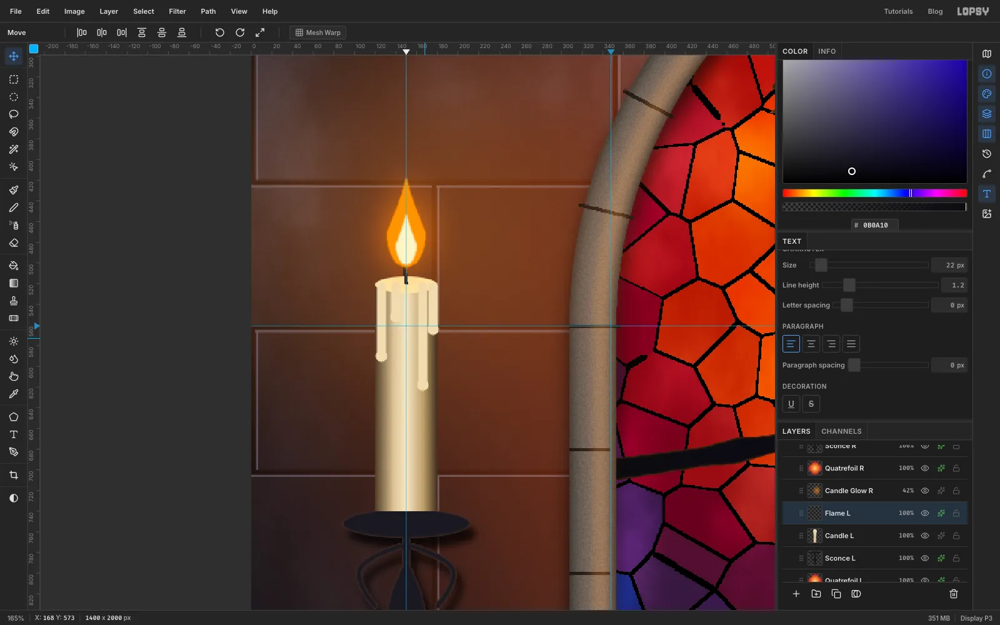

Select `Arch Template` and click **New Group**. Name it `Candles`. Build the left candle on the 150 guide, one layer at a time:

1. **Candle Glow L**: a soft ellipse of `#FF8A2A` where the flame will be, blurred at **60** and set to **Screen** at **50%**.
2. **Quatrefoil L**: with the Elliptical Marquee, draw a circle about 48 px across, then [[Shift]]-drag three more around it so they overlap in a four-leafed shape about 90 px wide, centred on the 150 guide at about y 215. Fill it with any colour, [[Cmd]]-click the thumbnail and drag a **Radial** gradient from the centre outwards, from `#FFD27A` through `#E8641E` to `#8E1530`. Add an outside **Stroke** of **9** in frame stone `#6B625A`, a dark **Inner Glow** and a soft orange **Outer Glow**.
3. **Sconce L**: in iron `#1A1820`, lasso a pointed backplate about 40 px wide hanging from y 785 to about y 905. Fill a short stem above it, a small cup, and a flat ellipse about 125 × 28 px at y 752 for the drip pan. Use the **Pen** at **Stroke 6** for two curling arms from the stem to the plate; press [[Enter]] after each one to stroke it. Add a thin warm **Inner Glow** (`#7A5236`, Size **3**) to catch the candlelight, and a **Drop Shadow**.
4. **Candle L**: marquee the candle body, about 60 px wide from y 520 down to the drip pan, and drag a horizontal **Linear** gradient across it from dark tan to cream and back to dark. That makes it look round. Fill a pale ellipse on top for the melted pool. Paint drips straight down with a **Brush** at **Size 10**, and click a slightly bigger dot at the end of each. Pencil a short black wick.
5. **Flame L**: lasso a teardrop and fill it orange `#FF9A2E`. Lasso a smaller teardrop lower down and fill it pale `#FFF4C8`. Run **Gaussian Blur** at **2** and add an **Outer Glow** of `#FF8A2A` at Size **50**.

## Light the right candle

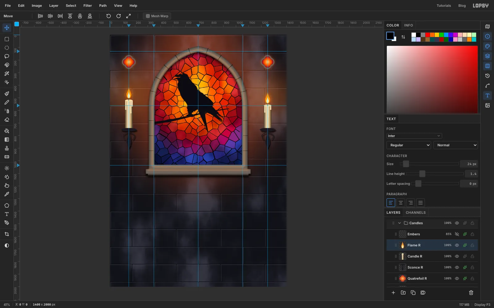

Make the right-hand set the same way on the 1250 guide, but make that candle a little shorter and give it different drips, so the two sides aren't mirror copies.

To set the quatrefoils into the wall, [[Cmd]]-click each quatrefoil's thumbnail, **Grow…** by **12**, select `Masonry` and press [[Delete]]. The joints stop at the stone surround instead of running behind it.

## Set the title

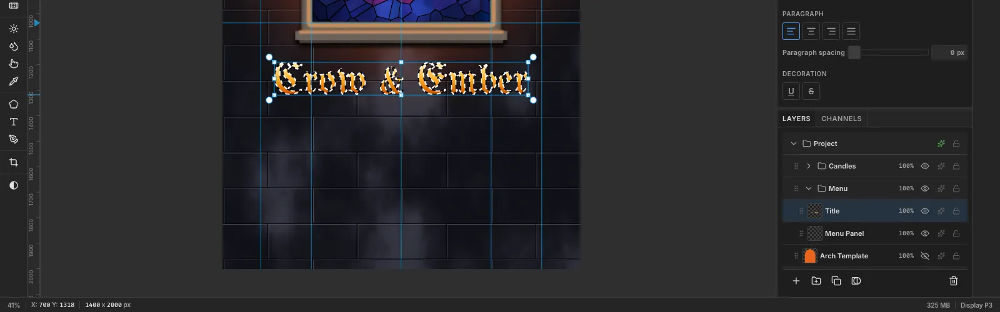

Select `Arch Template` and click **New Group**. Name it `Menu`, and add an empty layer in it called `Menu Panel`.

Choose the **Text** tool, set the font to **UnifrakturMaguntia** at **170 px** and click on empty canvas. Type `Crow & Ember` and press [[Tab]]. Move it so its top is about 75 px below the sill, then click **Align center horizontally** in the Move options.

Rename the layer `Title` and click **Rasterize Layer** in the Layers panel footer. [[Cmd]]-click the title's thumbnail and drag a **Linear** gradient from the top of the letters to the bottom: `#FFE9A8`, `#F2B54A`, `#B9541C`. Deselect and add:

- **Stroke**: outside, **2**, dark brown `#4A1E0A`
- **Outer Glow**: `#FF5A14`, Size **40**, Opacity **55%**
- **Drop Shadow**: **0, 7**, Blur **10**, Opacity **85%**

## Add the subtitle

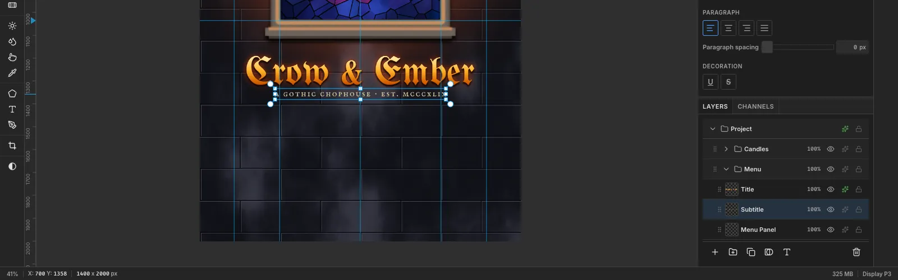

With `Menu Panel` selected, set the Text tool to **IM Fell English SC** at **40 px** in `#D9CAA6`, and type `a gothic chophouse · est. mcccxlix` in lowercase; this font turns it into small capitals. Name the layer `Subtitle`. In the Text panel, set **Letter spacing** to **5**. Place it about 30 px below the title and centre it.

## Make the parchment panel

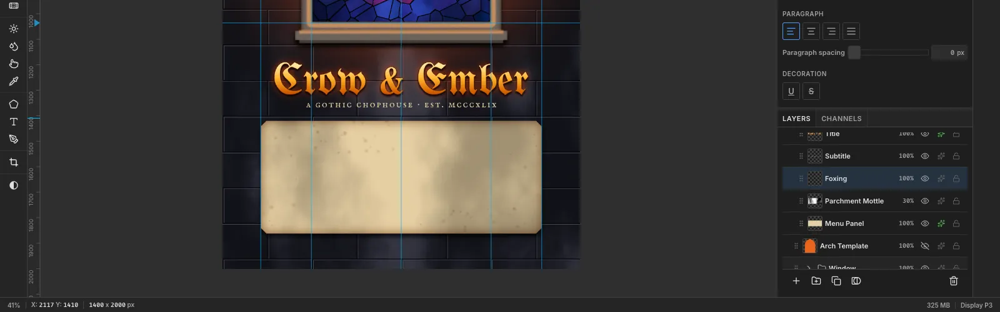

Select `Menu Panel`. With the **Rectangular Marquee**, select from **150** to **1250** across, starting about 55 px below the subtitle and about 440 px tall, and fill it with `#E2D0A8`. To clip the corners, drag the **Lasso** around a small triangle about 22 px deep on each corner and press [[Delete]]. Select the panel again by [[Cmd]]-clicking its thumbnail and run **Add Noise** at **6**, **Mono**, **Gaussian**. Add an **Inner Glow** of `#6E3F1C`, Size **60**, Opacity **80%** to darken the edges, and a **Drop Shadow**.

Two more layers age it:

- **Parchment Mottle**: [[Cmd]]-click the panel, run **Clouds** at **Scale 4** with white and a brown `#5A3A1A`, and set it to **Multiply** at **30%**.
- **Foxing**: [[Cmd]]-click the panel again and use the **Spray** tool (Size **220**, Density **3**, Opacity **30**, Softness **100**) in `#8A5A2A` along the edges and corners. Set the layer to **Multiply**.

## Set the left column

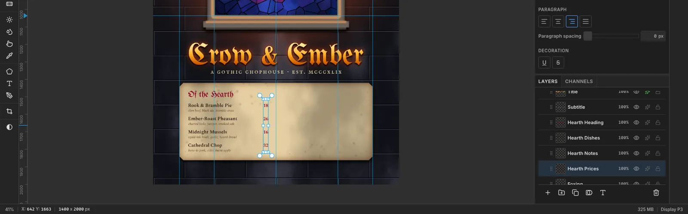

Each column is four text layers. Keep 50 px of padding inside the panel, and create every text layer on empty canvas before you move it into place. Name the layers as you go (`Hearth Heading`, `Hearth Dishes`, `Hearth Notes`, `Hearth Prices`), so the panel stays easy to work in.

- **Heading**: `Of the Hearth` in UnifrakturMaguntia, **48 px**, ruby `#7E1426`, about 45 px below the panel's top edge.
- **Dishes**: *Rook & Bramble Pie*, *Ember-Roast Pheasant*, *Midnight Mussels* and *Cathedral Chop* on separate lines, in Spectral **SemiBold**, **27 px**, ink `#2A1810`. Set **Line height** to **2.815**, which gives a row every 76 px.
- **Notes**: *slow beef, black ale, bramble crust*, *charred leeks, juniper, smoked salt*, *squid-ink broth, garlic, hearth bread* and *bone-in pork, cider, burnt apple*, in Spectral **Italic**, **19 px**, `#5E4028`, with **Line height** **4** (also 76 px). Move it so each note sits just under its dish.
- **Prices**: `18`, `26`, `16` and `32` on separate lines in Spectral SemiBold, **27 px**, ruby, with **Line height** 2.815 and **Align right**. Line up its right edge 45 px left of the centre line, and its baselines with the dish names.

> **Tip:** The Text tool remembers the last line height, letter spacing and alignment you used. Check them before you type each new layer.

## Set the right column

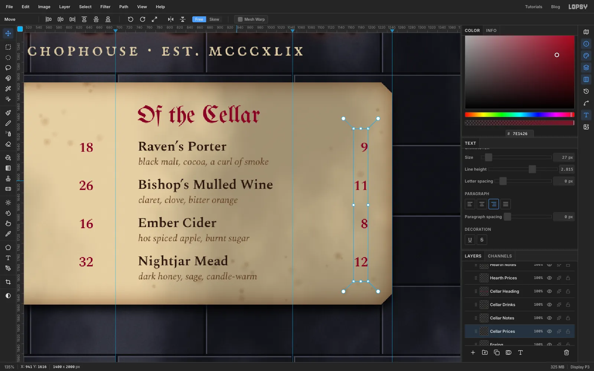

Repeat for the drinks, starting 45 px right of the centre line: `Of the Cellar`, then *Raven’s Porter*, *Bishop’s Mulled Wine*, *Ember Cider* and *Nightjar Mead*, with the notes *black malt, cocoa, a curl of smoke*, *claret, clove, bitter orange*, *hot spiced apple, burnt sugar* and *dark honey, sage, candle-warm*, and prices `9`, `11`, `8` and `12` right-aligned 50 px in from the panel's right edge. Use a real apostrophe (’) rather than a straight one.

## Add rules, a divider and the footer

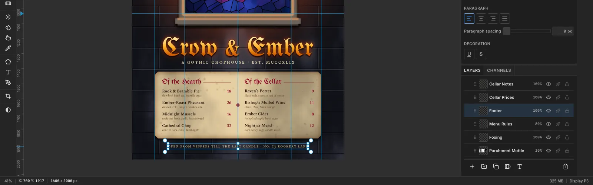

Add a layer called `Menu Rules`. With the **Pencil** at **Size 2** in ruby:

- [[Shift]]-click a line from just after each heading to the column's right edge, level with the middle of the heading.
- Draw a vertical line down the centre, starting and ending 45 px inside the panel. Leave a short gap in the middle, and lasso a small diamond there and fill it.

Set the layer to **80%**.

For the footer, type `open from vespers till the last candle · no. 13 rookery lane` in IM Fell English SC at **30 px**, `#C9B990`, letter spacing **3**. Centre it about 45 px below the panel.

## Press a wax seal

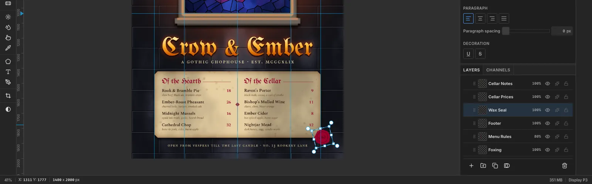

Add a layer called `Wax Seal`. Lasso a wobbly circle about 100 px across over the panel's bottom-right corner, at least 50 px from the last price and clear of the footer line, and fill it with `#8E1530`. Fill a circle about 74 px across in darker `#5E0B1C` on the same centre. **Shrink** it by **3** and fill it with the wax colour again, leaving a thin pressed ring.

Type `C&E` in **Cinzel Decorative Bold** at **22 px** in `#4A0814` and centre it on the seal. Rasterize it and choose **Layer → Merge Down**.

Marquee the seal, switch to the **Move** tool and drag the rotation handle to turn it about **14°** anticlockwise. Press [[Enter]].

## Finish the seal

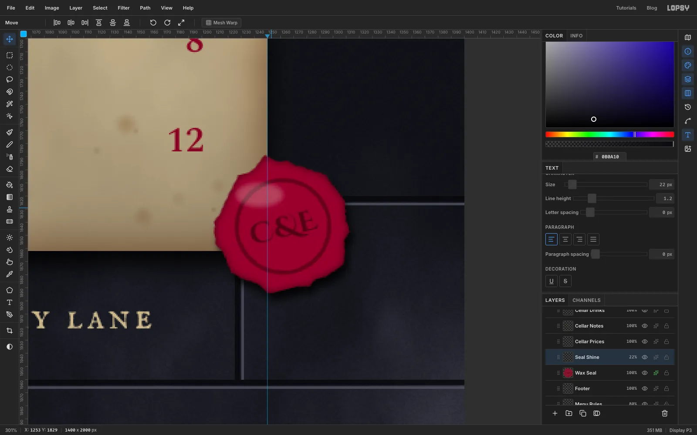

Give the seal an **Inner Glow** of `#2A0008` at Size **9** and a **Drop Shadow** of **3, 6**, Blur **8**. For the shine, add a layer called `Seal Shine`, fill a small white ellipse on the upper left of the seal, blur it at **6** and set it to about **22%**. Any brighter and the wax looks like plastic.

## Send sparks up from the flames

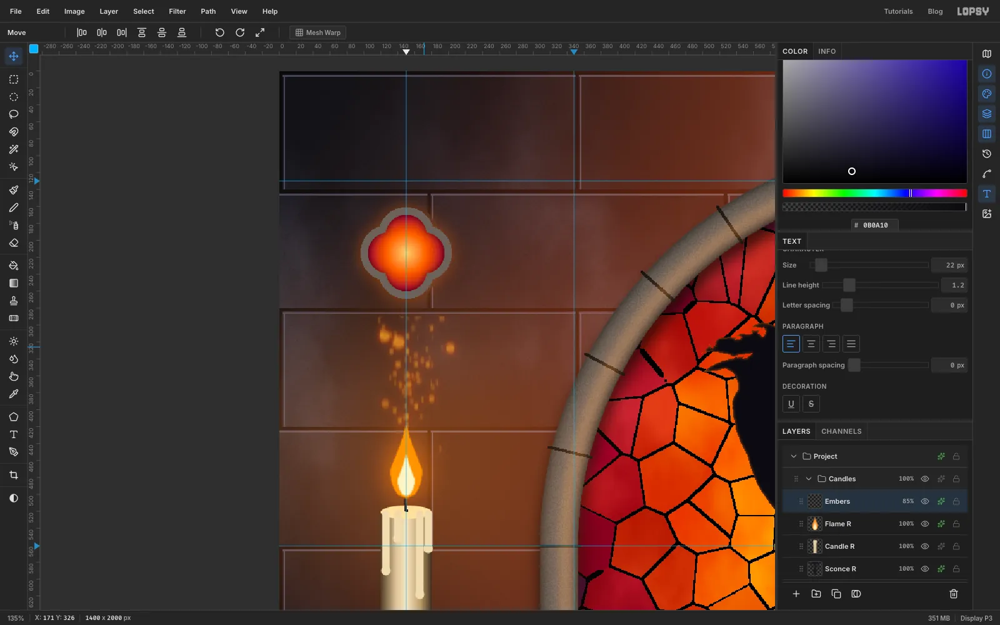

Open the `Candles` group, select the top layer and add a layer called `Embers`. Choose the **Spray** tool at **Size 60**, **Density 3**, **Opacity 100**, **Softness 30**, in `#FFB347`.

Make one short drag just above each flame, then one long, wavering drag upwards from the flame. The sparks pile up near the flame and thin out as they rise. Switch to **Size 140**, **Density 1** and make one more pass for a few bigger embers.

Sparks that drift right up to the quatrefoils look like they're pouring out of them. Marquee from the top of the canvas down to about 60 px below each quatrefoil and press [[Delete]], then set the layer to **85%**.

Run **Motion Blur** at **90°**, **7 px**, so each spark gets a short upward streak, and add an **Outer Glow** of `#FF5A14` at Size **12**.

## Soften the candle glows

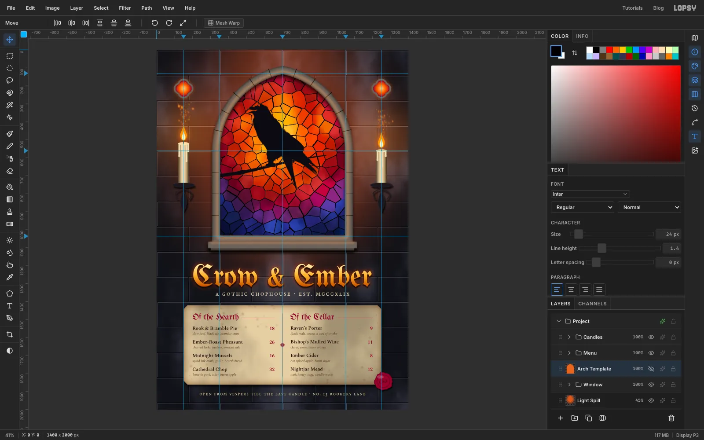

Last of all, look at the candle glows on the wall. If you can still see where each one ends, select `Candle Glow L` and `Candle Glow R` in turn, run **Gaussian Blur** again at **90** and lower it to about **42%**. They should fade into the warm light from the window.

Save with **File → Save Project**, then **File → Quick Export PNG**.

> **Tip:** Gothic pages get busy quickly. Here the window is the only big colourful shape, the title is the only gold, and the menu itself stays calm on plain parchment, so the eye goes from the raven to the name to the food.
