Early-90s Seattle sleeves were made with scissors, a photocopier and whatever turned up in a junk shop. Art Chantry's Sub Pop covers are the classic examples. This tutorial rebuilds that cut-and-paste process digitally for a made-up band, Mildew Parish, and their album *Lukewarm Quicksand*.

The idea: a comfy recliner (complacency) slowly sinking into a desert. Everything is photocopied. There are two public-domain photos, both from Wikimedia Commons:
- US National Park Service dunes at Great Sand Dunes National Park (`Great_Sand_Dunes_National_Park_and_Preserve_GRSA4390.jpg`).
- A `Black_Recliner.jpg` product shot on white.

The palette is dirty manila, mustard, toner black, rust and one olive tint.

The one rule that makes it look real rather than filtered: **every texture has hard edges.** Toner either sticks or it doesn't, so use **Threshold** after every noise or blur, not soft opacity.

## Lay down dirty manila paper

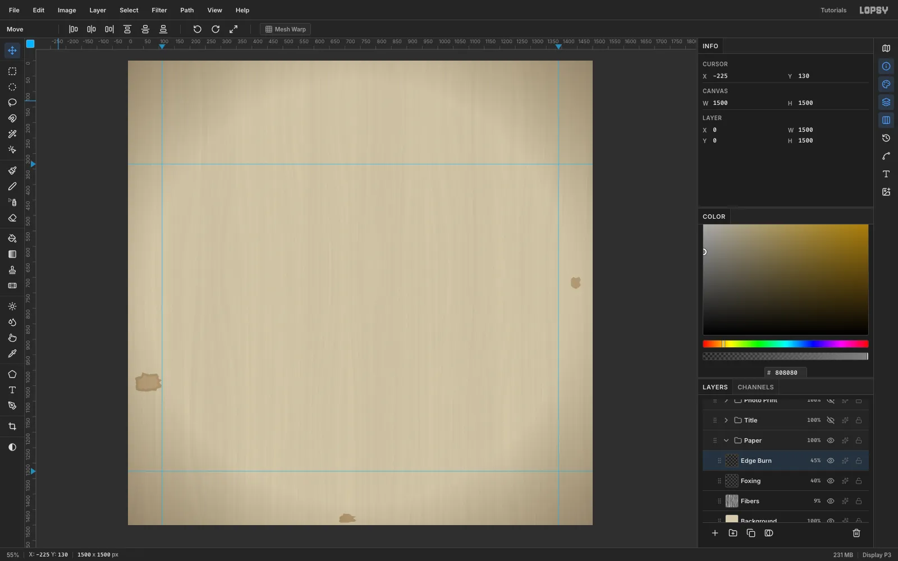

Create a **1500 × 1500** document. Make sure **Unit** is **Pixels** before you type the size. Build the paper in a `Paper` group:
1. **Background.** Fill with `#D6CBAE`, then run **Filter → Add Noise…** at **Amount 10**, **Mono**, **Gaussian**.
2. **Fibers.** On a new layer, run **Filter → Fibers…** with **Variance 24** and **Strength 40**. Set it to **Multiply** at **9%**. This gives the paper a faint grain direction.
3. **Foxing.** On a `Foxing` layer, lasso three stains of different sizes and shapes in browns (`#8E6A3A`, `#A07C4C`, `#94703F`). Give the biggest one a paler centre: **Select → Shrink…** by 7, then fill `#B8966A`. Apply **Gaussian Blur** at its smallest **Radius**, **1**, and set the layer to **40%**.
4. **Edge Burn.** On an `Edge Burn` layer, set the **Gradient** tool to **Radial**. In **Advanced…**, use three `#4A3A24` stops at 0%, 0% and 100% opacity, with the middle stop at 62%. Drag from the centre to just past a corner. Set the layer to **Multiply** at **45%**, so only the edges darken.

## Snap a print area to guides

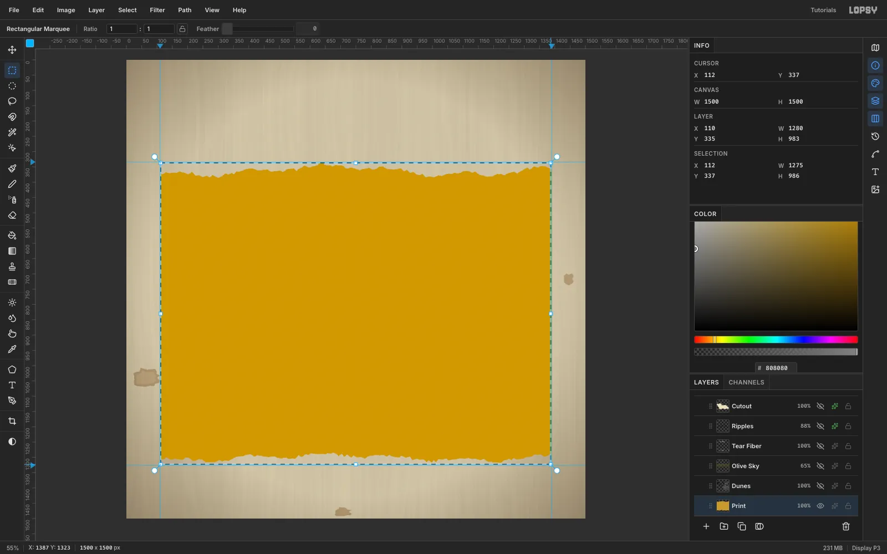

Turn on **View → Show Grid**, choose the **Move** tool, and in the options bar set **Grid** to **32 px** and tick **Snap**. Click the top ruler at about **110** and **1390**, and the left ruler at about **334** and **1326**. These four guides frame a 1280 × 992 photo print, and each one sits on a grid line.

On a `Print` layer, marquee from guide to guide. Guides don't pull on anything themselves, but Snap pulls the marquee's corners onto the grid lines underneath them. Fill the marquee with mustard `#C99A2E`. This is the ink colour that shows through the halftone later.

> **Tip:** You can also type the rectangle. With nothing selected, click once with the **Rectangular Marquee** and enter From 110, 334 To 1390, 1326.

## Halftone the desert photo

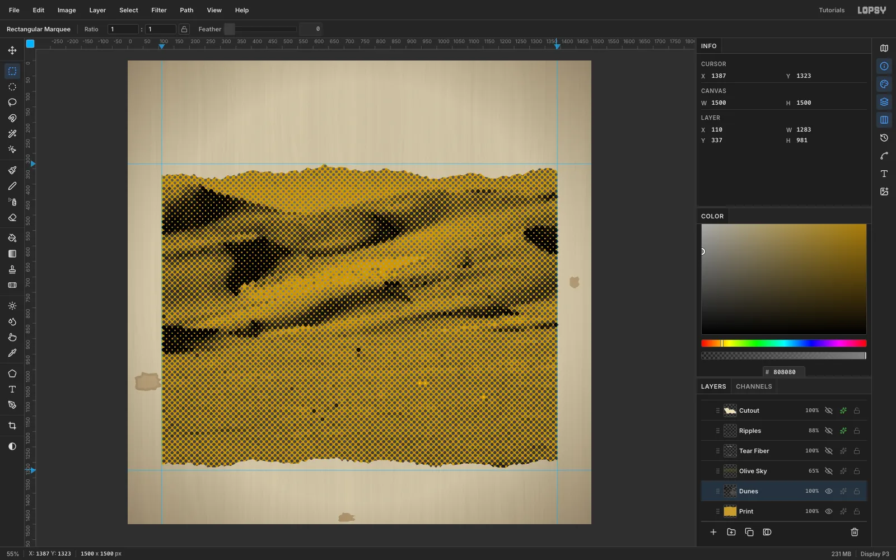

Crop the dune photo to 1280 × 992 and paste it with [[Cmd+V]]. Lopsy drops external images at the canvas origin and switches to the **Move** tool. Drag the photo down to the guides, and grid snap lands its top-left corner exactly on the guide crossing.

If the photo has a stray dark shape at an edge, remove it first. Pick the **Clone Stamp**, [[Alt]]-click some clean sky to set the source, and paint over the shape.

Then photocopy the photo:
1. **Filter → Desaturate.**
2. **Filter → Brightness/Contrast…** at **Brightness −14**, **Contrast 55**. Push it until the shadows almost plug, but keep the dune ridges visible.
3. **Filter → Halftone…** with **Dot Size 14**, **Density 1.1**, **Angle 45**, **Softness 0.4**.

The halftone paints black dots over white, so on this layer the white gaps become the mustard of the `Print` layer below. Group `Dunes` and `Print` into a `Photo Print` group.

## Tear the print's top and bottom edges

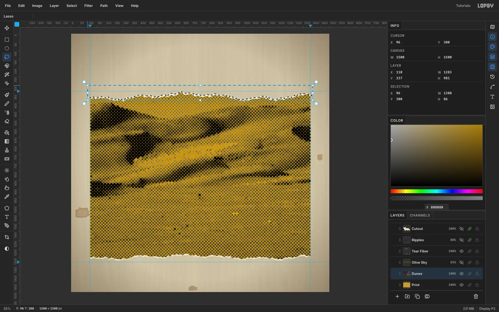

A ruler-straight edge gives the collage away. Lasso a strip above a jagged line that wobbles about 10–20 px along the top of the photo, then press [[Delete]] on **both** `Dunes` and `Print`. Do the same along the bottom edge.

For the paper fibre that shows where a print tears, add a `Tear Fiber` layer. Lasso a thin band, 3–10 px deep, following each torn line, and fill it with off-white `#EFE8D6`.

## Cut the recliner out with the Magic Wand

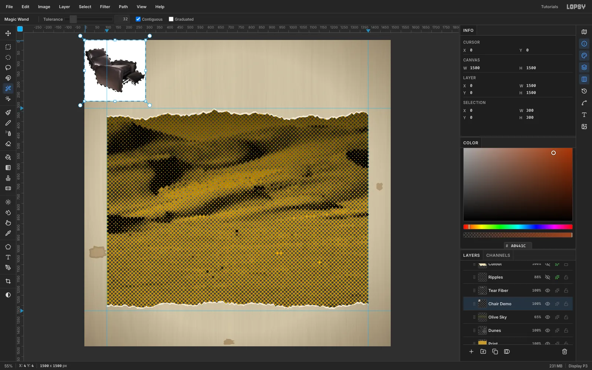

Paste the recliner photo. Pick the **Magic Wand** with **Contiguous** on and **Tolerance 32**. Click the white background and press [[Delete]].

A pale halo usually survives around the edges. Click the background again, run **Select → Grow…** by **2**, and delete once more. This removes the fringe.

## Scale and rotate the chair

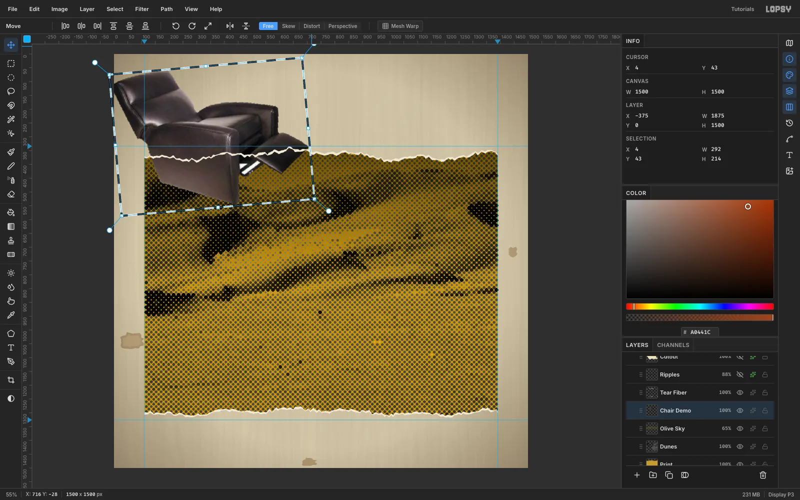

Turn **Snap** off for this step. Marquee around the chair and switch to the **Move** tool. Hold [[Cmd]] and drag the bottom-right handle to scale it to about **240%**. Then drag the rotation handle outside the corner to tip it back about **5°**, as if it's already sagging into the sand. Press [[Cmd+D]] to commit.

Move the chair so its seat sits just above the middle of the dunes.

## Photocopy the chair

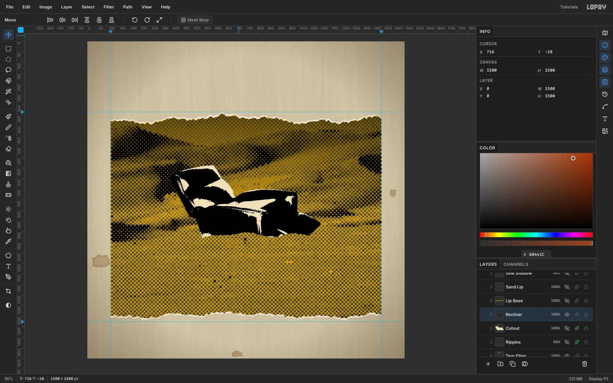

1. Run **Filter → Desaturate**.
2. Run **Brightness/Contrast** at **+25 / +45**.
3. Run **Filter → Threshold…** with **Preview** ticked. Level **104** keeps the highlights on the headrest, arm and footrest, so it still reads as a recliner.
4. With the **Magic Wand**, turn **Contiguous** off and click one of the white highlights. Fill with cream `#EDE0BC`.

The chair is now two flat inks, like a real photocopy.

## Give it a scissor-cut paper border

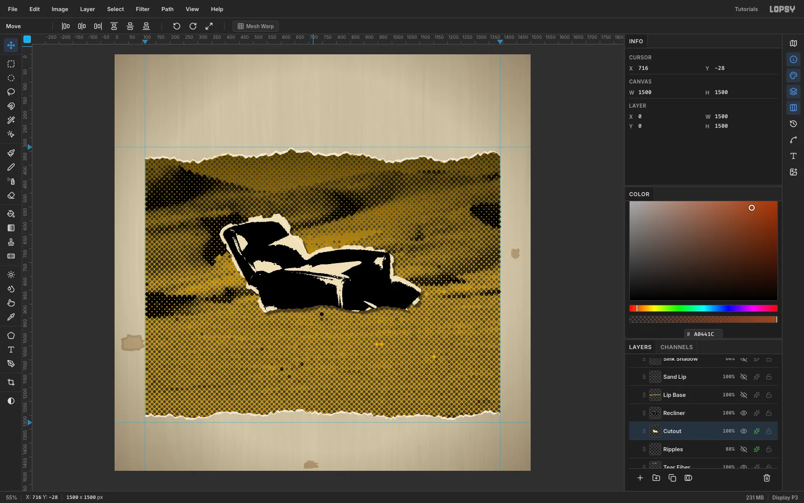

Draw the border on a `Cutout` layer below the chair, so the chair looks cut out of paper by hand:
1. Add a temporary `Border Helper` layer and fill it with black. Then [[Cmd]]-click the `Recliner` layer's thumbnail to load the chair's shape.
2. Run **Select → Grow…** by **13** and fill the selection white.
3. Deselect, then run **Filter → Voronoi…** on the helper with **Cells 42**, **Edge Width 0**, **Seed 12**, followed by **Threshold 128**. The Voronoi cells break the smooth outline into straight facets, the way scissors cut.
4. Wand the white shape, select the `Cutout` layer and fill it cream. Delete the helper.
5. Trim the border back to about 11 px: select `Cutout`, [[Cmd]]-click the `Recliner` thumbnail, then run **Grow 11** and **Select → Inverse**, and press [[Delete]]. That keeps the scissor facets but cuts off the big spikes.

## Sink the chair into the sand

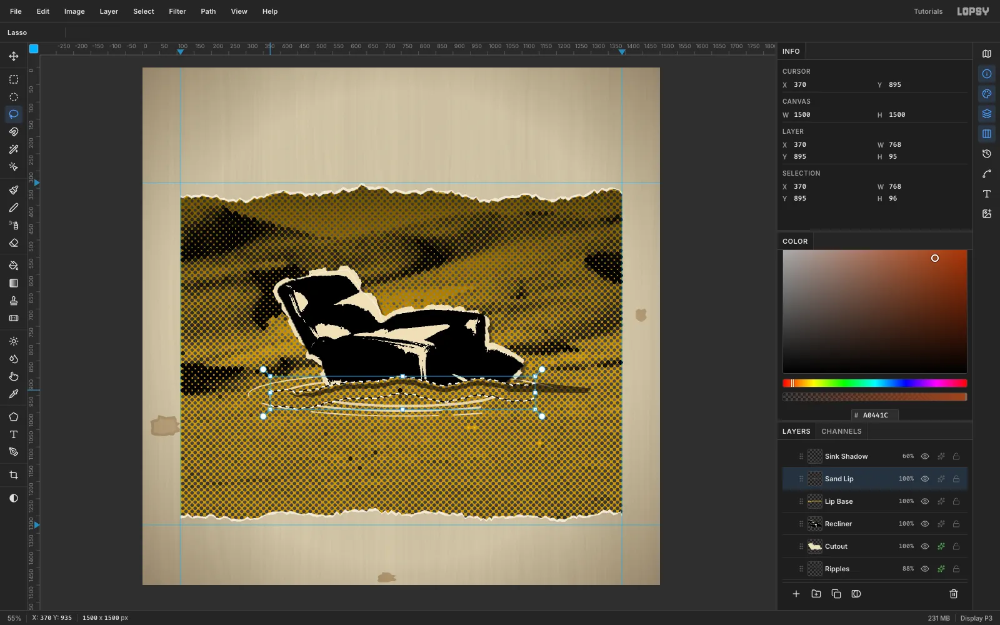

Pick a lumpy sand line across the chair's base, rising slightly in the middle where the sand heaps up. Lasso from that line down, and press [[Delete]] on both `Recliner` and `Cutout`.

Now lay sand over the cut, so the chair sinks *into* the dunes instead of stopping at a flat edge:
1. On the `Dunes` layer, lasso a 40 px band that runs along the same line. Give its top edge a little extra wobble.
2. Press [[Cmd+C]] and [[Cmd+V]]. The band pastes back in place as `Sand Lip`.
3. Drag `Sand Lip` above `Recliner`, and put a mustard `Lip Base` fill of the same band under it.
4. On a `Sink Shadow` layer, fill a thin hard-edged dark band just under the sand line, plus a short cast shadow to the right. Set it to **60%**.

## Add quicksand ripples

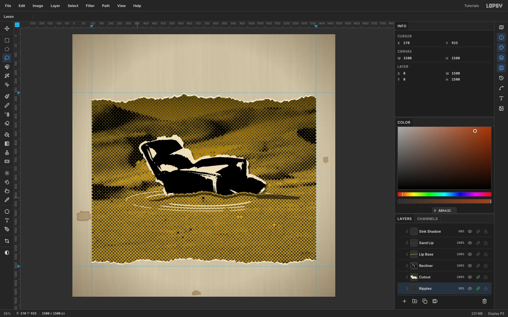

On a `Ripples` layer behind the chair, draw three nested rings with the **Shape** tool ([[U]]). Set **Shape** to **Ellipse** and **Output** to **Pixels**, remove the fill, and give it a stroke in any colour. Click once to type each ring's size, or drag it, and set the stroke **Width** for each:
- 570 × 82, Width 3.
- 470 × 62, Width 4.
- 380 × 45, Width 5.

Break the rings into arcs with a few dabs of a 46 px **Eraser**. Then give the layer a cream **Color Overlay** (`#EDE0BC`) and set its opacity to **88%**, so the rings catch the light on the dark sand.

## Xerox the title

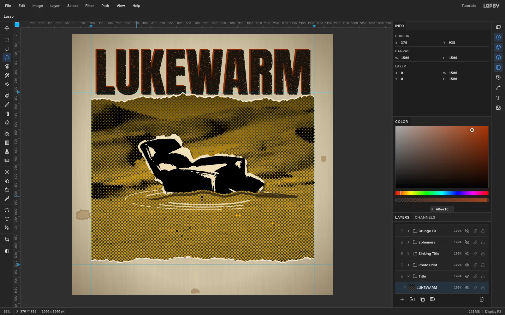

In a `Title` group, type `LUKEWARM` in **Anton** at **300 px**, `#17140F`. Create it in empty canvas, then move it so its baseline tucks just under the torn top edge of the photo.

Rasterize it and build the toner dropout:
1. Add a `Speckle` helper: marquee just the title area and fill it grey.
2. Run **Add Noise 100** and **Gaussian Blur 3.2**, then **Threshold** at a level that leaves about **7%** white.
3. **Magic Wand** a white speck with Contiguous off, and press [[Delete]] on `LUKEWARM`. Delete the helper afterwards.

For the misregistered second plate:
1. **Duplicate** the title, add a rust **Color Overlay** `#A0441C`, and set it to **Multiply**.
2. Drag it under the black copy.
3. With the **Move** tool, nudge it **8 px left and 6 px up** with the arrow keys. A down-right offset would read as a drop shadow.

## Sink QUICKSAND into the foreground

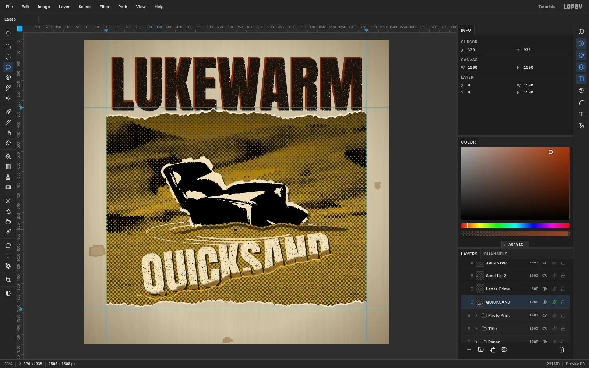

In a `Sinking Title` group, type `QUICKSAND` in **Anton** at **230 px** in cream `#EDE0BC`. Move it into the foreground sand, starting a little under a fifth of the way in from the left edge and about two-thirds of the way down. Rasterize it, then rotate it **−7°** with a marquee and the rotation handle, and press [[Cmd+D]].

Lasso everything below a sand line that stays flat under the **Q** (so its tail survives) and then climbs toward the **D**. Press [[Delete]], so the right end of the word sinks deepest. Then:
1. **Toner specks.** Make another speckle helper that leaves about 4% white, and delete those specks from the letters. Keep the damage light, because the word has to read at thumbnail size.
2. **Shadow.** Add a hard **Drop Shadow**: `#17140F`, offset 7 / 7, Blur 0, Opacity 85.
3. **Sand band.** Hide the word, lasso a lumpy band along the cut, and **Copy Merged** [[Cmd+Shift+C]]. Show the word again and paste the band above it.
4. **Grime.** Add a blurred brown band on **Multiply**, plus a few sand-coloured dots on the letter faces, clipped to the letters. The sand then clings to the letters.

## Tape on the band name and stamp it

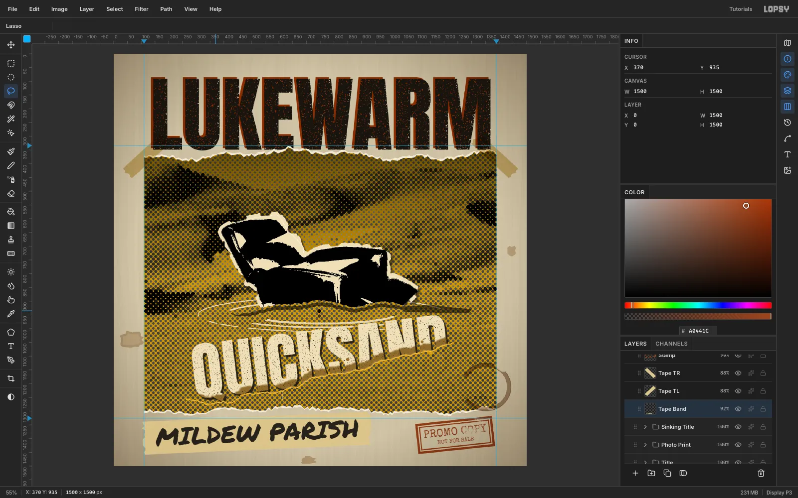

In an `Ephemera` group:
1. **Tape Band.** Lasso a strip about 820 × 120 with ragged ends, fill it `#D9C690`, and add **Mono noise 14**.
2. **Band name.** Type `MILDEW PARISH` in **Permanent Marker** at **88 px**. Centre it on the tape and **Merge Down** onto the tape, which rasterizes the text for you. Rotate the tape −2.5°.
3. **Corner tapes.** Draw one short tape across the photo's top-left corner. Copy it, paste it, and use the **Move** tool's **Flip Horizontal** for the other corner. Set both to **Multiply** at 88%.
4. **Stamp.** Make two rust `#A0441C` frames with **fill → Shrink → Delete**. Add `PROMO COPY` and `NOT FOR SALE` in **Special Elite**, and merge them into the stamp.
5. **Stamp ink.** Delete a speckle selection from the stamp for uneven ink, set it to **Multiply**, and rotate it **−6°**. Keep every word of the stamp legible.
6. **Coffee ring.** Build a broken ring from three thin rings in browns, with a darker rim. Place it straddling the photo's bottom-right edge on **Multiply** at 55%.

## Finish with grain, dust and scratches

Build these in a `Grunge FX` group on top:
1. **Grain.** Fill a layer grey, run **Add Noise 70** (Mono, Gaussian), and set it to **Overlay** at 45%.
2. **Dust.** Fill a layer black, run **Add Noise 100** and **Gaussian Blur 1.2**, then **Threshold** so only about 0.4% of pixels stay white. Set it to **Screen** at 80%.
3. **Scratches.** Use a 3 px **Brush** with **Fade 240** and paint short, mostly vertical strokes in `#F4EEDC`, so each scratch tapers off. Set the layer to **Screen** at 60%.

Save the project, and use **File → Quick Export PNG** for the finished cover.
