Most app mockups sit on a clean gradient. This one sits on a basement wall. You'll design **Wax Yard**, an imaginary app for buying, selling and swapping used vinyl. The presentation borrows from 90s grunge print: stencils, spray paint, photocopier dust and David Carson-style rough edges. The app screens underneath still follow real UI rules, so the type lines up, the tap targets are a sensible size and the hierarchy reads.

There are three parts on an 1800 × 1200 canvas:

- **The wall:** concrete built from Clouds, Emboss and noise, with sprayed grime, water stains and cracks, and a WAX YARD logo sprayed through a stencil made from type.
- **Browse screen:** a light phone with a header, a search bar, filter chips and a grid of four album covers, each made with a different filter: **Kaleidoscope**, a woven plaid, **Pixel Stretch** and **Voronoi**.
- **Listing screen:** a dark phone with a record sliding out of its flannel sleeve and a big SWAP IT button. The whole phone is grouped and tilted with one transform.

Everything is drawn in Lopsy. The fonts are **Anton** for display type, **Special Elite** for typewriter text, **Barlow Condensed** for UI labels and **Permanent Marker** for hand-written prices.

The palette:

- Concrete `#4A4943`, grime `#14130F`, cracks `#0E0D0B`
- Bone `#E6DFCB`, light screen `#E2DACA`, stickers `#F1ECDD`
- Ink `#141412`, phone body `#1B1B19`, dark screen `#161512`
- Flannel red `#8E241D`, plaid bands `#1A1210`, pinstripe `#E0C98A`
- Cover gradient map `#0F2524` → `#7A1E1E` → `#DCCB9E`
- Chartreuse accent `#C8D43A`, label rim `#9EA82B`
- Mud tint `#B08850`, grey text `#5E5A50` / `#9C968A`

> **Tip:** Keep chartreuse for things a user can act on or should notice first: the active tab, the price and the main button. The fewer places it appears, the more it means.

Every Lopsy document starts with a top-level **Project** group, and the parts below are built as groups inside it. The screenshots were taken from the finished project file with the later layers hidden, so the Layers panel sometimes lists layers you haven't made yet.

## Pour a concrete wall

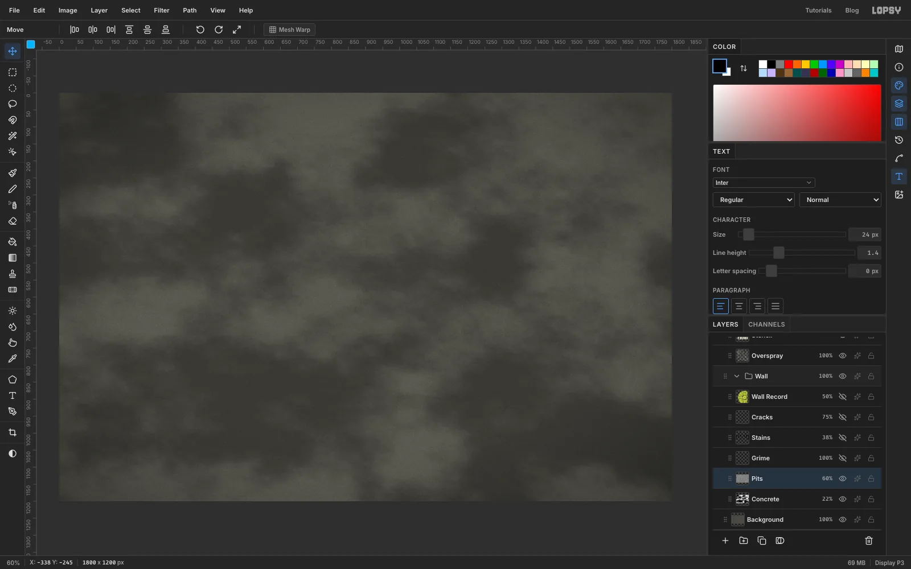

Open [Lopsy](/) and create an **1800 × 1200** pixel document.

1. **Base.** Select **Background**, set the foreground to `#4A4943` and choose **Edit → Fill**. Run **Filter → Add Noise…** at **Amount 9**, **Mono**, **Gaussian**.
2. **Mottling.** Rename **Layer 1** to `Concrete`. Set the foreground to black and the background to white, then run **Filter → Clouds…** at **Scale 7**. Follow it with **Filter → Emboss…** at **Angle 135** and **Strength 40**. Set the layer to **Overlay** at **22%**.
3. **Pits.** Add a layer called `Pits` and fill it with mid grey `#808080`. Run **Add Noise** at **45** (Mono, Gaussian), **Gaussian Blur** at **1**, then **Emboss** at **135 / 55**. Set it to **Overlay** at **60%**. The tiny bumps catch the light from the top left, like poured concrete.

Select `Concrete` and `Pits` and choose **Layer → Group Layers**. Name the group `Wall`. **Background** stays outside it.

> **Tip:** Emboss adds relief on top of the image instead of replacing it. Soft clouds have very gentle slopes, so on its own the clouds layer barely changes. Fine noise gives Emboss sharp edges to work with.

## Add grime, water stains and cracks

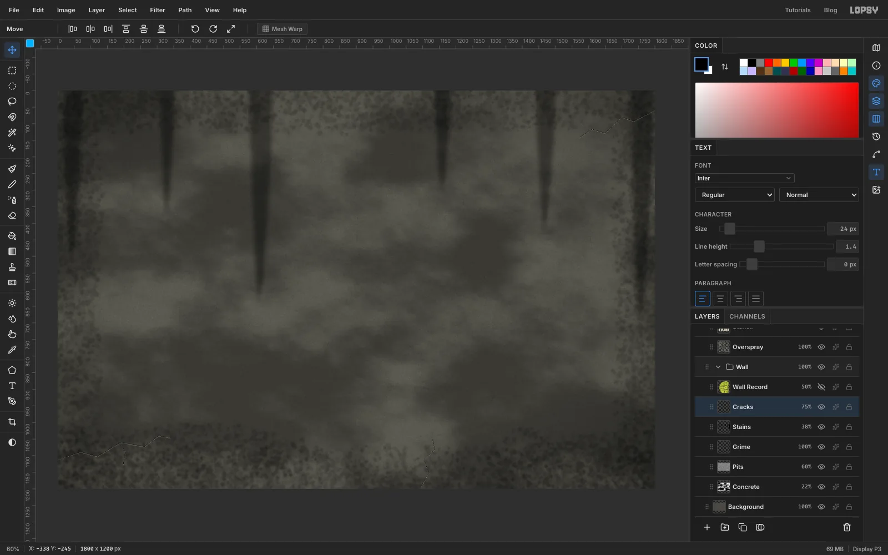

Add three more layers inside `Wall`:

- **Grime.** Pick the **Spray** tool with foreground `#14130F`, **Size 220**, **Density 90**, **Opacity 35** and **Softness 85**. Spray along all four edges and heaviest along the bottom. Run **Gaussian Blur** at **5** and set the layer to **Multiply**.
- **Stains.** With the **Lasso**, draw a long thin wedge that starts above the top edge and tapers to a point lower down. Choose **Select → Feather…** at **14** and fill it with black. Make five or six of these, all different lengths. Run **Add Noise** at **30** and a **Motion Blur** at **Angle 90**, **Distance 18**, so the streaks look wet. Set the layer to **Multiply** at **38%**.
- **Cracks.** With the **Pencil** at **Size 1**, click and [[Shift]]-click a jagged zig-zag in a corner, with one short branch. Draw it once in `#9A978C`, then again 1–2 px higher in `#0E0D0B`, so each crack has a dark line with a light lip underneath. Set the layer to **75%**.

## Turn type into a stencil

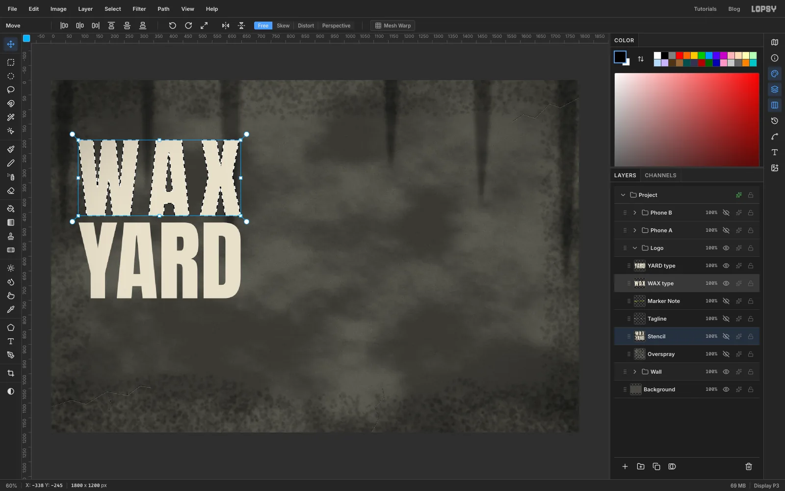

A real stencil gives you hard edges where the card was, and soft overspray around it. You'll get both by spraying through a selection made from type.

Click the **Project** group and click **New Group**. Name it `Logo` and add a layer inside it called `Stencil`.

Pick the **Text** tool, choose **Anton** at **300** px in bone `#E6DFCB`, and click near the left edge, about halfway down. Type `YARD` and press [[Tab]]. Then click above it to type `WAX`. Creating the lower line first means your click for the second line can't land inside the first text box. In the **Text** panel, give WAX a **Letter spacing** of **30**, so both words are the same width.

With the `Stencil` layer active, [[Cmd]]-click the **WAX** thumbnail to load the letters as a selection. Then spray two passes:

1. **Overspray.** **Select → Grow…** by **12** and **Select → Feather…** by **16**. Spray across the word at **Size 140**, **Density 50**, **Opacity 22**, **Softness 100**.
2. **Paint.** [[Cmd]]-click the thumbnail again for a crisp selection. Spray back and forth over it at **Size 200**, **Density 100**, **Opacity 100**, **Softness 40** until the letters are solid, with a bit of spray texture left.

Do the same for **YARD**, then hide both text layers.

## Cut stencil bridges and add drips

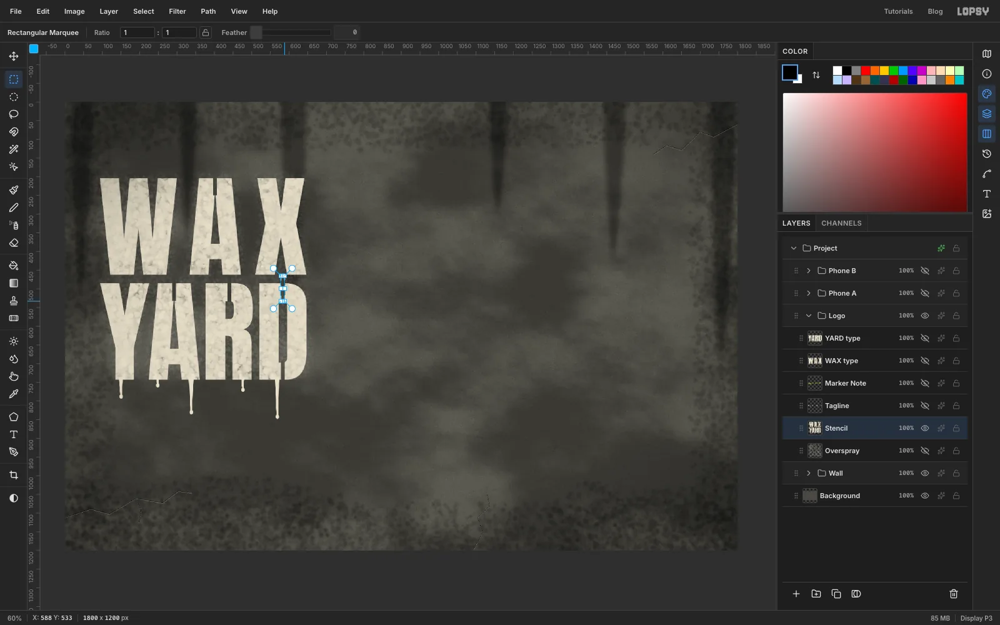

A cardboard stencil can't hold the floating middle of an **A**, **R** or **D**, so stencil letters have little bridges cut through them. On `Stencil`, drag a narrow **Rectangular Marquee**, about 10 px wide, from the outside edge of the letter into each enclosed counter and press [[Delete]]. WAX needs one bridge through the top of the A. YARD needs one in the A, one at the top of the R and one at the top and bottom of the D.

Then make the paint run. With the **Lasso**, draw each drip as a long, narrow wedge hanging from the bottom edge of a letter: wide at the top and pinched to a few pixels at the bottom. Fill it with bone. Then use the **Elliptical Marquee** to add a slightly taller-than-wide blob at the tip. Make five drips with different lengths and widths, offset from the centres of the letters. Short ones look as convincing as long ones.

## Speckle the overspray and add the tagline

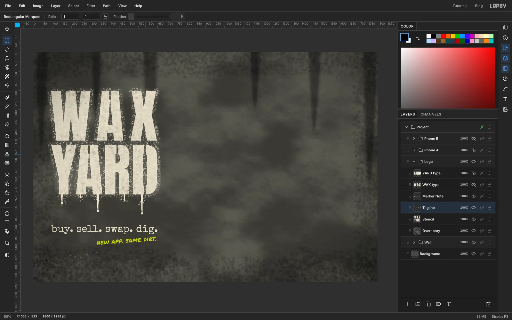

Add a layer called `Overspray` and drag it **below** `Stencil` in the Layers panel.

1. **Halo.** [[Cmd]]-click the `Stencil` thumbnail, **Grow** by **4** and **Feather** by **22**. Spray in bone at **Size 120**, **Density 80**, **Opacity 45**, **Softness 100**.
2. **Speckle.** [[Cmd]]-click `Stencil` again, **Grow** by **16** and **Feather** by **6**. Spray in bone at **Size 70**, **Density 10**, **Opacity 85**, **Softness 0**. Hard, separate dots are what real aerosol leaves behind.

For the tagline, set `buy. sell. swap. dig.` in **Special Elite** at **54** px in bone, about 150 px below the bottom of YARD, and line up its left edge with the W. Set `new app. same dirt.` in **Permanent Marker** at **34** in chartreuse `#C8D43A`, and line up its right edge with the D. Rasterize the note (the **Rasterize Layer** button in the Layers panel), marquee it, and drag the **Move** tool's rotate handle about 4° counter-clockwise.

## Build the first phone

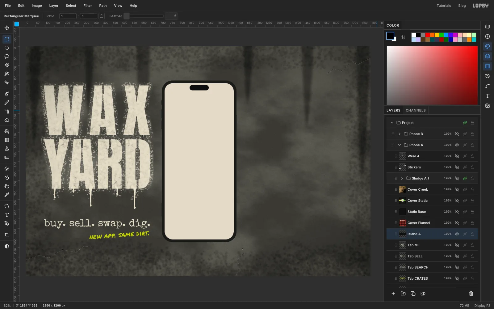

Click **Project** and make a new group called `Phone A`. Everything in a phone uses the **Shape** tool set to **Rectangle**. It draws from the centre outwards, so start each drag at the point where you want the middle of the phone, just right of the canvas centre.

1. **Body.** On a layer called `Body A`, set the shape fill to `#1B1B19` and **Corner Radius** to **56**. Drag out a 390 × 844 rectangle.
2. **Screen.** On a new layer `Screen A`, use `#E2DACA` and **Corner Radius 44**, and draw it 14 px smaller on every side.
3. **Camera island.** On `Island A`, draw a 100 × 28 pill in `#0E0E0D` with **Corner Radius 14**, 12 px below the top of the screen.
4. **Buttons.** Back on `Body A`, marquee three small slivers on the left edge (silent switch and volume) and one longer one on the right, and fill them with `#2E2E2B`.

Draw a dark `Phone B` group the same way, leaving a 100 px gap to its right. Name its layers `Body B`, `Screen B` and `Island B`, and use a `#161512` screen and a pure black island.

## Make a kaleidoscope album cover

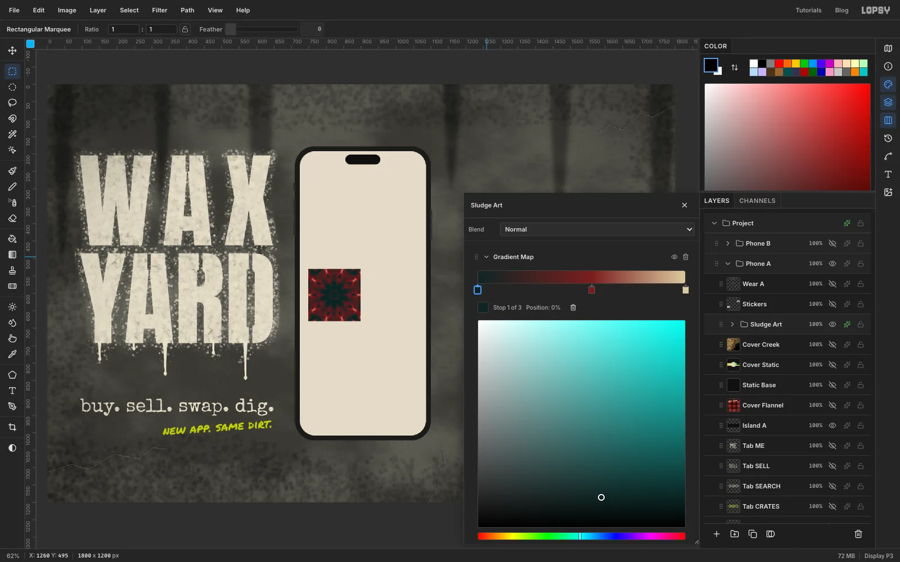

The browse screen shows a two-by-two grid of 150 px album covers with a 14 px gap. The grid starts 24 px in from the left edge of the screen, about 340 px below its top. Leave room above it for the header, search bar and chips, which come later. The first cover is psychedelic sludge.

1. Inside `Phone A`, add a layer called `Cover Sludge`. Press [[D]] for black and white, then run **Filter → Clouds…** at **Scale 14**, then **Filter → Kaleidoscope…** with **Segments 10** and **Rotation 0**.
2. The mandala fills the whole canvas, so shrink it. Marquee a square around its centre, switch to the **Move** tool and [[Cmd]]-drag the bottom-right corner handle inwards to about a fifth of the size. Drag the mandala up into the top-left slot of the grid and press [[Cmd+D]] to commit.
3. Marquee the 150 × 150 slot, choose **Select → Inverse** and press [[Delete]] to trim everything outside the cover.

Clouds paints in greys, so the colour comes from an adjustment. With `Cover Sludge` selected, choose **Layer → Group Layers** and name the group `Sludge Art`. In the group's effects drawer, click **Add Adjustment → Gradient Map**. Set the stops to `#0F2524`, `#7A1E1E` at about 55% and `#DCCB9E`. The shadows turn to a deep teal and the highlights to bone, with oxblood in between. Click a stop and type its colour into the **Hex** field.

## Weave a flannel sleeve

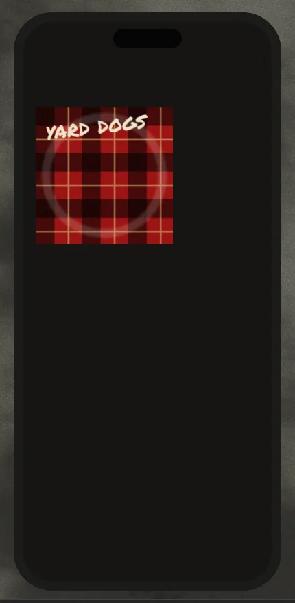

Nothing says grunge like flannel. Build the sleeve big on the dark phone, so it can be the listing screen's hero, and copy it into the grid later.

1. On a layer called `Sleeve` inside `Phone B`, marquee a 250 px square near the top of the screen and fill it with `#8E241D`.
2. On a layer called `Plaid H`, marquee a 34 px horizontal band across the square. Hold [[Shift]] and drag two more bands, evenly spaced, to add them to the selection. Fill with `#1A1210`, then set the layer to **Multiply** at **62%**.
3. Do the same with three vertical bands on a layer called `Plaid V`. Where the bands cross, the colour goes darker, which is how woven checks look.
4. On a layer called `Plaid Lines`, use the **Pencil** at **Size 3** in `#E0C98A`. Click and [[Shift]]-click a thin line through the middle of every red gap. Set the layer to **55%**.
5. Merge from the bottom up: select `Plaid H` and choose **Layer → Merge Down**, then do the same for `Plaid V` and `Plaid Lines`. Merge Down keeps the *lower* layer's blend mode, so merging into the Normal `Sleeve` layer bakes everything in as you see it.
6. Marquee the sleeve and give it a fabric weave: **Add Noise** at **18** (Mono, Gaussian), then **Motion Blur** at **Angle 45**, **Distance 2**.

**Ring wear.** Real sleeves wear a pale ring where the record pushes against them. Drag an elliptical marquee almost the size of the sleeve, then hold [[Alt]] and drag a slightly smaller one on the same centre to leave a thin ring. **Feather** it by **4**. Pick the **Dodge** tool at **Exposure 14** and **Size 40**, and trace once around the ring.

**Band name.** Type `yard dogs` in **Permanent Marker** at **40** in bone, rasterize it, tilt it about −7° with the rotate handle, and **Merge Down** onto the sleeve. Finally, marquee the sleeve and [[Cmd]]-drag a corner to shrink it to about 200 px.

## Fill the grid with covers

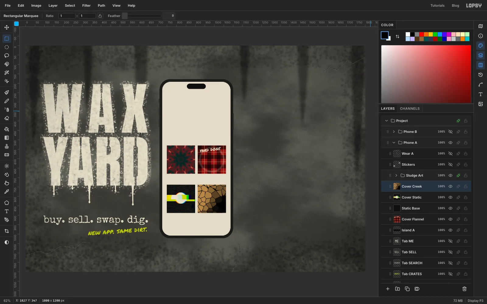

**Flannel God.** Marquee the sleeve and press [[Cmd+C]]. Click a layer inside `Phone A` and press [[Cmd+V]]. Lopsy pastes in place, selects the pasted pixels and switches to the **Move** tool. [[Cmd]]-drag the corner handle in to about 75% (150 px), drag the copy into the top-right slot and press [[Cmd+D]].

**Spit & Static.** Add a layer called `Static Base` and fill the bottom-left slot with `#121211`. Add a layer above it called `Cover Static`.
1. Fill the slot with `#121211` again and run **Add Noise** at **55** (Mono, Uniform) for TV static.
2. Marquee a 34 px bar across the middle and fill it with chartreuse. Then fill a 60 px circle in the centre with bone.
3. Run **Filter → Pixel Stretch…** with **Amount 40**, **Bands 50**, **Seed 88** and **RGB Split 0.5**. Then run **Filter → Chromatic Aberration…** at **Amount 3**.
4. Trim it with **Select → Inverse** and [[Delete]]. The black base fills the gaps that the stretched bands leave behind.

Pixel Stretch has a **Seed** slider, so try a few seeds until one breaks the disc in an interesting place.

**Dry Creek.** On a layer called `Cover Creek`, marquee a square about 50 px *bigger* than the bottom-right slot all round. Run **Clouds** at **Scale 10**, then **Filter → Voronoi…** with **Cells 45**, **Edge Width 3** and **Seed 12**. Voronoi colours each cell from the pixel at its centre, so it needs content around the edges too, or the outer cells come out empty. Trim back to the slot. Then add a layer filled with `#B08850` over the slot, set it to **Multiply**, and **Merge Down**. Now the cells look like dried mud.

## Lay out the browse screen

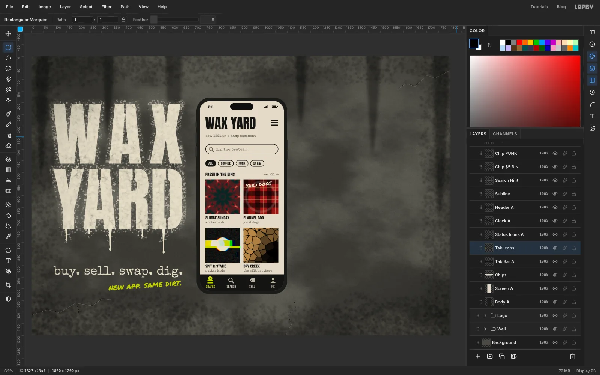

Work from the **bottom of the screen upwards**. A text-tool click inside an existing text box edits that text instead of starting a new one, so placing the lower lines first keeps your clicks in empty space.

- **Tab bar.** Add a layer called `Tab Bar A`. [[Cmd]]-click the `Screen A` thumbnail, then hold [[Shift+Alt]] and drag a rectangle across the bottom 70 px of the screen. That keeps only the overlap, so the bar inherits the screen's rounded corners. Fill it with `#141412`.
- **Tab icons.** On a `Tab Icons` layer, build four simple icons from marquees: a record on a crate in chartreuse for the active tab, and a magnifier, a price tag and a person in `#B9B3A3`. Hold [[Alt]] while dragging to cut holes, such as the record's centre and the magnifier's lens.
- **Tab labels.** Set `CRATES`, `SEARCH`, `SELL` and `ME` in **Barlow Condensed** 600 at **15**, centred under each icon. Make `CRATES` chartreuse and the rest `#B9B3A3`.
- **Cover captions.** Under each cover, set the title in **Barlow Condensed** 700 at **18** in `#141412`. Put the artist just below it in **Special Elite** at **14** in `#5E5A50`, with both aligned to the cover's left edge. The four are *SLUDGE SUNDAY* / mother mold, *FLANNEL GOD* / yard dogs, *SPIT & STATIC* / gutter kids and *DRY CREEK* / the silt brothers.
- **Section label.** Set `FRESH IN THE BINS` in Barlow Condensed 700 at **19**, and `see all →` in Special Elite at **14**, right-aligned to the grid.
- **Chips.** Type `ALL`, `GRUNGE`, `PUNK` and `$5 BIN` in Barlow Condensed 600 at **15**, about 13 px apart. On a `Chips` layer underneath, use the Shape tool to draw a 29 px tall black pill behind each one, with the corner radius set to half its height. Then draw a slightly smaller bone pill on top of each, leaving a 2 px outline. Leave `ALL` as a solid black pill with bone text, to show it's selected.
- **Search bar.** Draw a larger 44 px tall pill the same way, with a magnifier ring and handle at its left end and `dig the crates…` in Special Elite at **17** in `#7A7466`.
- **Header.** Set `WAX YARD` in **Anton** at **58** in `#141412` and `est. 1991 in a damp basement` in Special Elite at **15** below it. Draw a three-line menu icon with the **Pencil** at **Size 4**, right-aligned to the grid.
- **Status bar.** Add `9:41` in Barlow Condensed 700 at **17**, plus four signal bars and a battery icon drawn from small marquees.

## Price stickers and photocopy dust

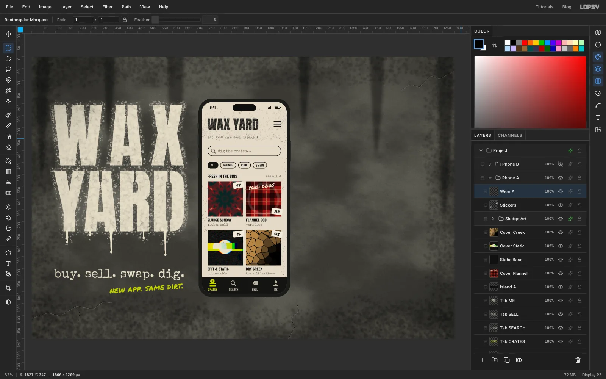

**Price stickers.** For each cover:
1. Add a layer at the top of `Phone A` and draw a 46 × 26 bone `#F1ECDD` rectangle with **Corner Radius 3**.
2. Write the price (`$8`, `$12`, `$6`, `$15`) in **Permanent Marker** at **17** in `#141412` and centre it on the sticker.
3. Rasterize the price, **Merge Down** onto the sticker, and rotate the sticker 5–9° with the rotate handle. Alternate the direction from one cover to the next.

Put the sticker in a corner that doesn't hide anything. On the flannel cover, the bottom-right corner keeps `yard dogs` readable.

**Toner dust.** Add a layer called `Wear A`:
1. With bone selected, spray over the header at **Size 70**, **Density 30**, **Opacity 100**, **Softness 0**. This knocks pinholes into the black letters, like a tired photocopier.
2. Switch to black and spray lightly around the header at **Density 6**.
3. [[Cmd]]-click the `Screen A` thumbnail and give the whole screen one pass at **Size 40**, **Density 2**, **Opacity 45**.
4. Choose **Select → Inverse** and press [[Delete]], so no dust lands on the bezel.

Keep the dust sparse. If the small caption text starts to break up, undo and go lighter.

## Slide a record out of the sleeve

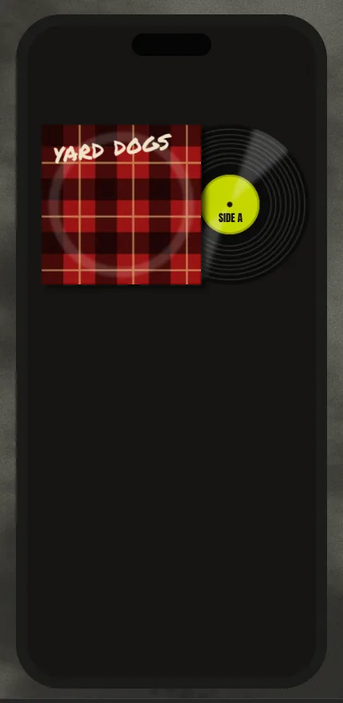

Add a layer called `Record` **below** `Sleeve`.

1. Fill a circle about 236 px across, centred just right of the sleeve, with `#0B0B0A`.
2. **Grooves.** Zoom in. Use the **Elliptical Marquee** to drag a circle on the same centre, then hold [[Alt]] and drag one just a couple of pixels smaller, to leave a hairline ring. Fill it with `#2A2926`. Make eight of these rings, a little unevenly spaced, from just inside the rim to about halfway in.
3. **Label.** Fill a circle about 88 px across with chartreuse. Give it a thin rim of `#9EA82B` (the same circle with a slightly smaller one cut out), and delete a small spindle hole in the middle.
4. **Sheen.** On a `Record Sheen` layer, lasso two thin wedges from the centre out to the rim, on opposite sides. **Feather** them by **6** and fill with white. [[Cmd]]-click the `Record` thumbnail, **Select → Inverse** and [[Delete]] to clip the sheen to the disc, then set the layer to **20%**.
5. **Label text.** Set `SIDE A` in **Anton** at **13** in `#141412`, just below the spindle hole.

Now give the sleeve its depth. Marquee the record, [[Cmd]]-drag its corner in to about 85% and drag it right until the whole label clears the sleeve. Press [[Cmd+D]] to commit. Then add a **Drop Shadow** to `Sleeve` with **Offset X 6**, **Offset Y 4**, **Blur 10** and **Opacity 70**, so the sleeve sits on top of the record.

## Lay out the listing screen

Again, work up from the bottom. Keep everything on a 38 px left margin.

- **Button.** On a `UI B` layer, draw a 314 × 54 chartreuse pill with **Corner Radius 27**, 30 px above the bottom of the screen. Set `SWAP IT` in **Anton** at **26** in `#141412`, centred on it both ways. Add a 100 × 5 grey home bar under it.
- **Quote.** Type `"smells like a basement.` on one line and `plays like a dream."` on the next, in **Special Elite** at **15** in `#CFC8B6`.
- **Seller row.** Draw two hairline dividers with the **Pencil** at **Size 1** in `#3A3833`. Between them, add a bone circle 36 px across with `BS` in Anton, the name `basement_steve` in Barlow Condensed 700 at **17**, and `★ 4.9 · 212 swaps` in Special Elite at **13** in `#9C968A`.
- **Price.** Set `$12` in **Permanent Marker** at **54** in chartreuse. Put `or best swap` (Special Elite **15**) right next to it, sitting on the same baseline. Text floating far from what it describes is easy to miss.
- **Chips.** `VG+`, `SLEEVE: TAPED` and `33 RPM` in Barlow Condensed 600 at **15** in bone, with thin outlined pills made like the browse screen's: a `#6E6A60` pill with a `#161512` one on top. Outline the VG+ chip and its text in chartreuse to flag the condition.
- **Title.** `FLANNEL GOD` in **Anton** at **50** in bone, with `the yard dogs · 1993 · LP` in Special Elite at **14** under it.
- **Top bar.** `‹ CRATES` on the left and `LISTING #0451` on the right, then the clock, signal and battery as on the first phone, in bone.

> **Tip:** Set symbols like `★` and `→` in Special Elite, as the rating line does, rather than in Barlow Condensed. Barlow Condensed draws empty boxes for characters it doesn't have, such as `⅓`, so write `33 RPM`.

## Tilt the listing phone

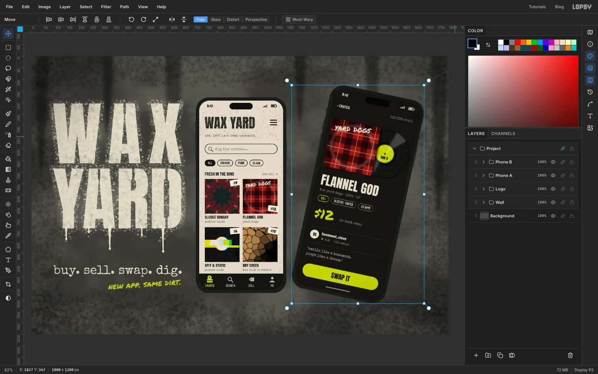

A second phone at exactly the same angle and size makes a mockup look like a spreadsheet. Give the listing phone some attitude.

1. Click the `Phone B` group row and choose the **Move** tool with nothing selected. Lopsy draws one transform box around everything in the group.
2. Drag the rotation handle (just outside the top-right corner) about **12°** clockwise.
3. [[Cmd]]-drag a corner handle out about 6%, so the listing phone is slightly bigger than the browse phone and clearly the hero.
4. Drag inside the box to set it beside the browse phone, about 25 px away, and nudge it up so it sits a little higher. Press [[Cmd+D]] to commit.

> **Tip:** Finish every text edit on the screen *before* you rotate the group. If you change a text layer's font, size or spacing afterwards, that layer re-renders upright and drops out of the tilt.

## Crack the glass and spray a record on the wall

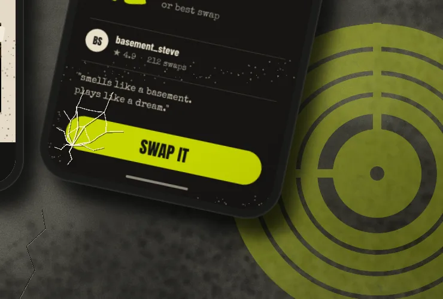

**Cracked glass.** Inside `Phone B`, add a layer called `Glass B`, and [[Cmd]]-click the `Screen B` thumbnail so nothing spills onto the bezel.
1. Pick a point just inside the bottom-left corner of the screen as the impact. Choose the **Brush** with the **Hard Round** preset.
2. Draw seven or eight cracks out from that point in black at **Size 2**, **Opacity 45**.
3. Go over each crack again in `#F4F0E4`, a hair up and to the left of the dark line. Start thick (about **Size 3**) near the impact and drop to **Size 1** for the tips, so the lines taper.
4. Join neighbouring cracks with a few short, kinked lines to make the spiderweb.
5. Spray a little bone dust over the screen at **Density 2**, **Opacity 40**.

**Wall record.** In the `Wall` group, add a layer called `Wall Record` and build one compound selection centred near the bottom-right corner:
1. Drag an elliptical marquee about 500 px across.
2. Hold [[Alt]] and drag a slightly smaller circle on the same centre, then hold [[Shift]] and drag one a little smaller again. That leaves a solid outer ring and adds the next one back.
3. Keep alternating [[Alt]] and [[Shift]] towards the centre until you have four rings with thin gaps between them. Finish with a solid label in the middle and a small spindle hole cut out of it.
4. [[Shift]]-drag two narrow bars, one up from the label and one to its left. These are the stencil bridges that hold the rings together.

Spray the selection solid in chartreuse, then add a feathered overspray pass like the logo's. Set the layer to **50%**, so it reads as old paint behind the phone rather than another button.

## Shadows and a vignette

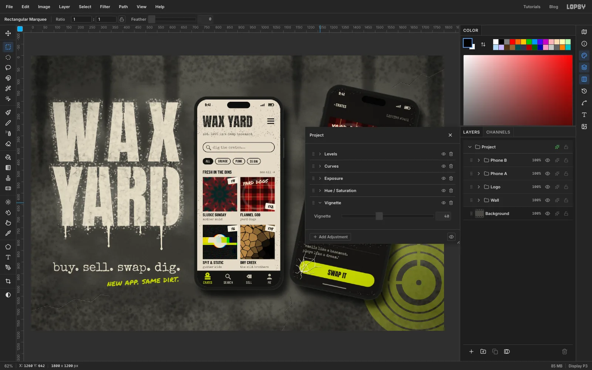

Add the phone effects last, so they don't distract you while you lay out the screens.

- Give `Body A` and `Body B` the same **Drop Shadow**: **Offset X 22**, **Offset Y 32**, **Blur 40**, **Opacity 75**. One light source for both phones keeps the scene believable.
- Add an **Inner Glow** to each body in `#8A8A82` at **Size 5**, **Opacity 55**. It reads as a metal rim catching light.
- Choose **Layer → Adjustment Layer…**. In Lopsy that opens the **Project** group's adjustments, which already holds neutral Levels, Curves, Exposure and Hue / Saturation nodes. Click **Add Adjustment → Vignette** and set it to **40** to darken the corners and pull the eye to the phones.

Save with **File → Save Project**, then **File → Quick Export PNG**.

> **Tip:** Check the app type at 100% zoom before you export. A presentation that looks grungy from across the room still has to pass as a real interface up close.
