Mid-century Christmas cards were printed in two or three flat inks, and all
the shading was done with **halftone dots**. The plates rarely lined up
perfectly, so a sliver of red peeked out from behind the moon and the
lettering. This tutorial rebuilds that look in Lopsy for **Noël Village**, a
1200 × 1600 px card.

The whole trick is one idea you'll reuse six times. Paint a **grayscale
gradient** inside a selection, run **Filter → Halftone**, then recolor the
dots with a **Color Overlay**. Dark gray becomes big dots, light gray becomes
small dots, and white disappears.

Along the way you'll also use:

- **guides**, the **Gradient Editor** and the **Sunburst** filter
- **Lasso** fills, **copy / paste in place**, **Flip Horizontal**, scaling and rotating with the **transform handles**
- the **Magic Wand** with **Select → Grow** to recolor a copy
- **groups**, a **Snap to Grid** group drag, and **undo**
- **text**: a tilted script title with dots inside the letters, and small caps seated in a ribbon

The palette is four inks on cream paper:

- Paper `#F3EAD6`, snow `#F7F1E3` / `#FBF6EA`
- Navy `#1D2B4F` and night `#131D38`, dot inks `#3A4F85` and `#8A9CC0`
- Red `#C9362B`, teal `#2F6E62`, gold `#F2BE4B`

## Set up the card and its guides

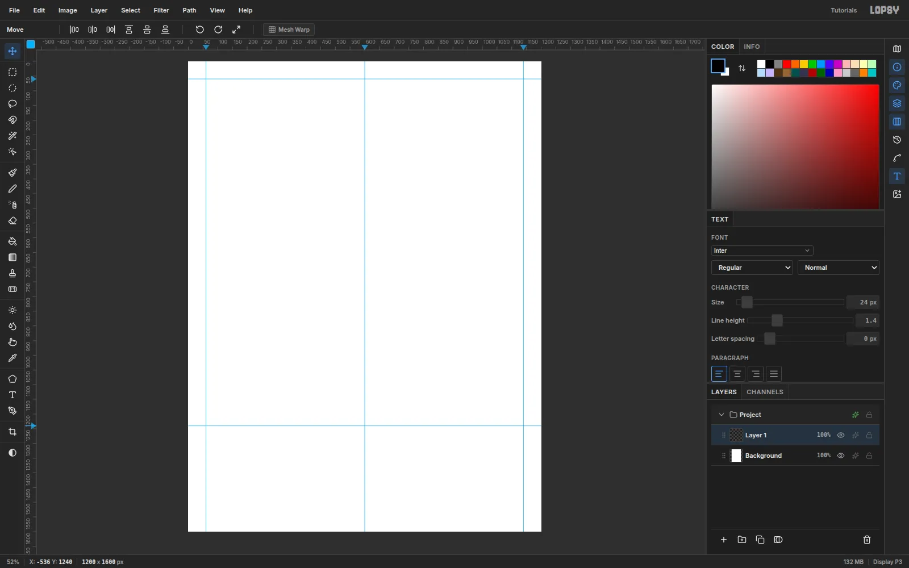

Choose **File → New** and make a **1200 × 1600** px document with a white
background.

Make sure **View → Show Rulers** and **Show Guides** are on. Then click the
top ruler about 60 px in from each side, and [[Cmd]]-click its middle to drop
a guide exactly at the centre. On the left ruler, click about 60 px from the
top and again at about **1240**, a little over three-quarters of the way
down. The rectangle between the outer guides is the picture. The cream
border outside it and the band under it hold the lettering. The center guide
lines up the star, the steeple and the title.

## Paper and night sky

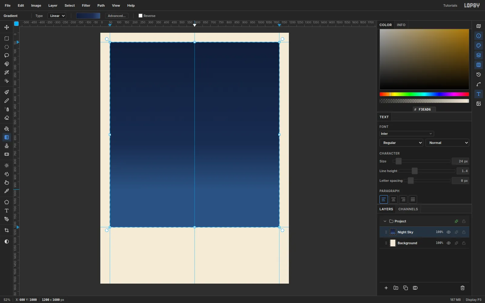

Select **Background**, set the foreground to `#F3EAD6` and choose
**Edit → Fill**. Run **Filter → Add Noise…** at **Amount 6** with **Mono**
on for a faint paper tooth.

Rename **Layer 1** to *Night Sky* by double-clicking its name. Drag a
**Rectangular Marquee** ([[M]]) from guide to guide around the picture.

Pick the **Gradient** tool, set **Type** to Linear, and open **Advanced…** to
build three stops: `#131D38`, `#1D2B4F` at 70% and `#34507F`. Drag straight
down the centre guide, from the top of the picture to about 1000 on the left
ruler, where the hills will start. Hold [[Cmd]] to keep the drag vertical.

## Screen the sky with halftone dots

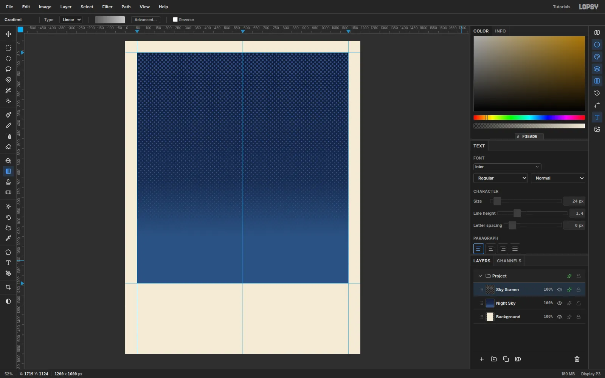

This is the core technique, so take it slowly.

1. Add a layer called *Sky Screen*. Marquee the sky rectangle again.
2. With the Gradient tool, make a two-stop gradient from `#5A5A5A` to `#C8C8C8` and make the same drag as before, from the top of the picture down to about 1000.
3. Choose **Filter → Halftone…** and set **Dot Size** 14, **Density** 1, **Angle** 45, **Softness** 0.6. Click **Apply**.
4. Press [[Cmd+D]]. Open the layer's effects and turn on **Color Overlay** with `#3A4F85`.

Halftone turns every cell of a rotated grid into one dot, sized by how dark
the cell is. The gray gradient becomes dots that shrink toward the horizon.
The overlay then recolors them in a lighter ink than the sky, like a second
screen printed over the navy.

> **Tip:** Keep **Dot Size** and **Angle** the same on every halftone layer that shares an area. The dots then land on one shared grid, like a single printing screen.

## Add a halo of pale dots around the moon

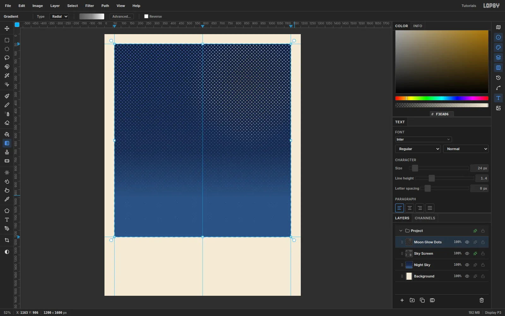

Add a layer called *Moon Glow Dots* and marquee the sky again. Set the
Gradient tool to **Radial**, with stops `#000000`, `#8A8A8A` at 50% and
`#FFFFFF`. Drag from where the moon will sit, in the upper right (about
280 px right of the centre guide and 290 px down), straight out to the right
about 440 px, past the edge of the canvas.

Run **Halftone** with the same settings (Dot Size 14, Angle 45). Deselect,
then give the layer a **Color Overlay** of `#8A9CC0` and set its opacity to
**80%**. The dots are big near the moon and fade to nothing, which makes a
glow without any blur.

## Print the moon slightly out of register

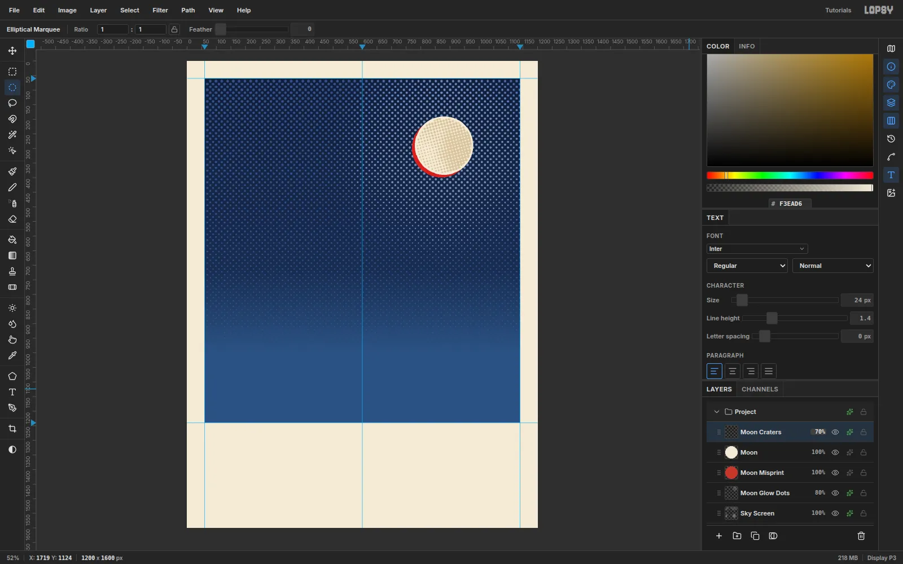

1. Add a *Moon Misprint* layer. Hold [[Cmd]] as you drag the **Elliptical Marquee** to make a 200 px circle, centred a little left of and below the middle of the halo, and fill it with red `#C9362B`.
2. Add a *Moon* layer. Keep the marquee tool and nudge the selection 10 px right and 9 px up with the arrow keys ([[Shift]]+arrow moves 10 px), so it sits on the halo's centre. Fill it with the paper color `#F3EAD6`. The red plate now shows as a thin crescent at the lower left.
3. Add *Moon Craters*. With the moon's circle still selected, choose **Select → Shrink…** by **6**. Run **Filter → Clouds…** at **Scale 5**, then **Halftone** at **Dot Size 10**, **Angle 15**.
4. Deselect, add a **Color Overlay** of `#C9B68C`, and set the layer to **70%**.

The Clouds filter's light and dark patches turn into large and small dots,
which read as the moon's seas.

## Scatter stars and raise the guiding star

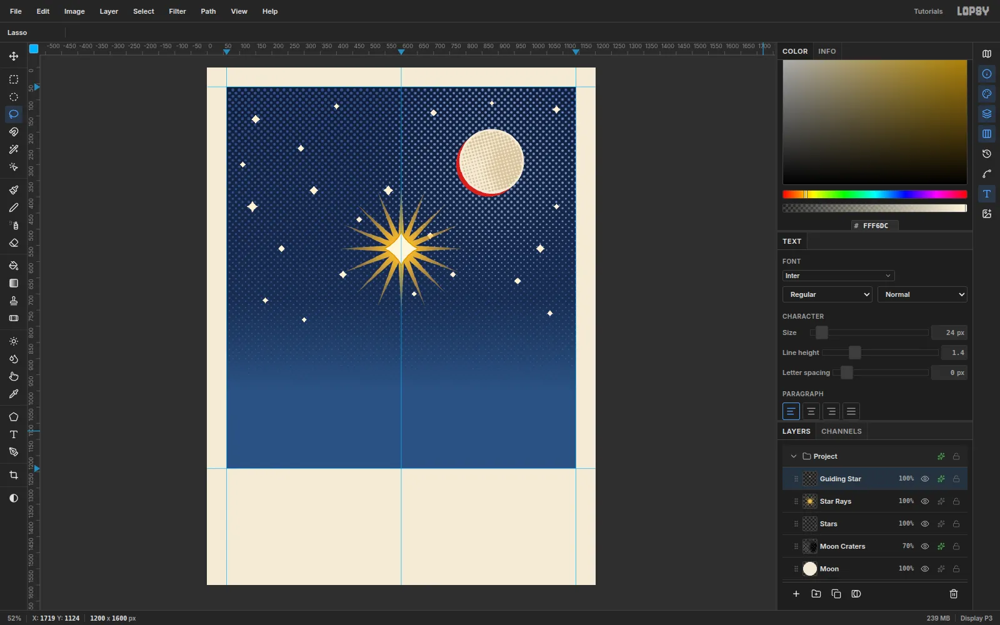

Add a *Stars* layer. With the **Lasso** ([[L]]), draw small four-point
sparkles (concave diamonds 10 – 18 px across) and fill each one with
`#FFF3D6`. Scatter about twenty. Put a few in the empty upper left and keep
them away from the moon.

For the guiding star:

1. Add *Star Rays*, set the foreground to gold `#F2BE4B` and choose **Filter → Sunburst…**. Use **Rays** 16, **Length** 16, **Width** 30, **Taper** 100, **Fade** 60, **Softness** 10, **Center X** 50, **Center Y** 35. Taper 100 turns the wedges into needle-sharp spikes.
2. Add *Guiding Star* and lasso a larger sparkle, 100 px across, centered where the sunburst's rays meet on the centre guide. Fill it with `#FFF6DC` and give it a 3 px **Stroke** of `#D89A2A`.

## Lay down the snow drifts

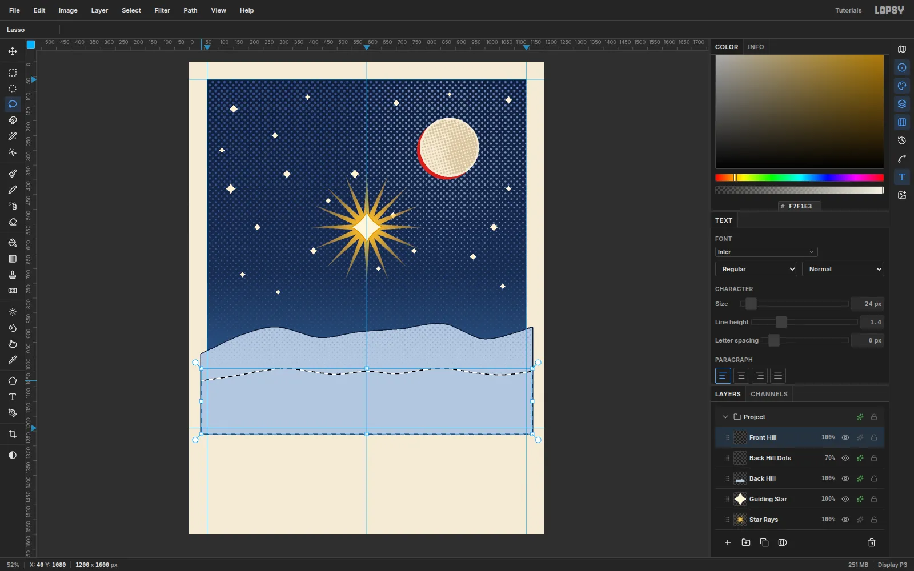

Real screen prints have a dark **key line** around every shape. You'll give
each shape a 3 px **Stroke** in night `#131D38`.

1. Add *Back Hill*. Start about 20 px outside the left edge of the picture, just above the 1000 mark. Lasso a gently rolling horizon that rises and falls between about 890 and 940 on the left ruler, across to 20 px outside the right edge, then down past the bottom of the picture. Fill it with `#B7C6DD` and add the stroke.
2. Add *Front Hill* and lasso a second, lower drift whose top edge rolls between about 1040 and 1080. Fill it with `#F7F1E3` and add the stroke.

Start and end both drifts 20 px outside the picture. The border you add later
hides their outer key lines.

## Shade the drifts with dots

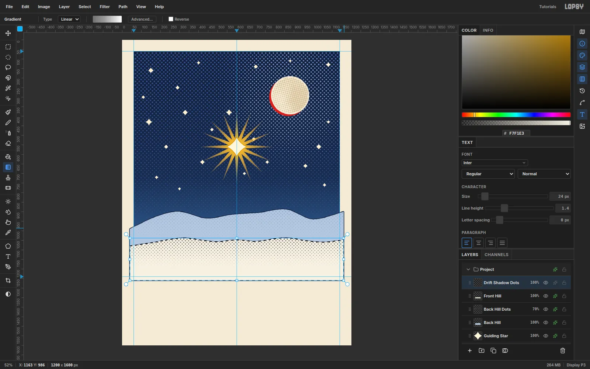

Use the same halftone recipe, but load the drift's shape as the selection.

1. Add *Drift Shadow Dots*. [[Cmd]]-click the *Front Hill* thumbnail to select its pixels.
2. Drag a linear gradient (`#000000` → `#9A9A9A` at 40% → `#FFFFFF`) from the top of the drift down to the bottom of the picture.
3. Run **Halftone** at **Dot Size 12**, **Angle 45**, deselect, and add a **Color Overlay** of `#7F95BA` at **70%**.

Do the same for the back hill on a *Back Hill Dots* layer. Use a
`#707070` → white gradient from the top of the back hill down to about 1080,
the overlay `#8C9FC4`, and 70% opacity.

## Build the first cottage

Select *Back Hill Dots* and add a *Cottage Red* layer, so the village sits
behind the front drift. Build the house from lasso fills, centred about
270 px left of the centre guide and standing on the back hill:

- Walls `#C9362B`: 120 px wide, with their top about 90 px above the 1000 mark. Run them down behind the front drift, which hides the bottom.
- Roof `#1D2B4F`: a triangle 148 px wide and 74 px tall sitting on the walls, so it overhangs 14 px on each side
- Chimney `#8E2A22`: 18 px wide and about 55 px tall, rising out of the right slope of the roof
- Snow `#FBF6EA`: a chevron hugging the roof edge, plus a cap on the chimney
- Windows `#F2BE4B`: two 24 × 30 px windows and one small gable window

Keep all the colors flat. The halftone layers do the shading.

## Copy, flip, move and scale a second cottage

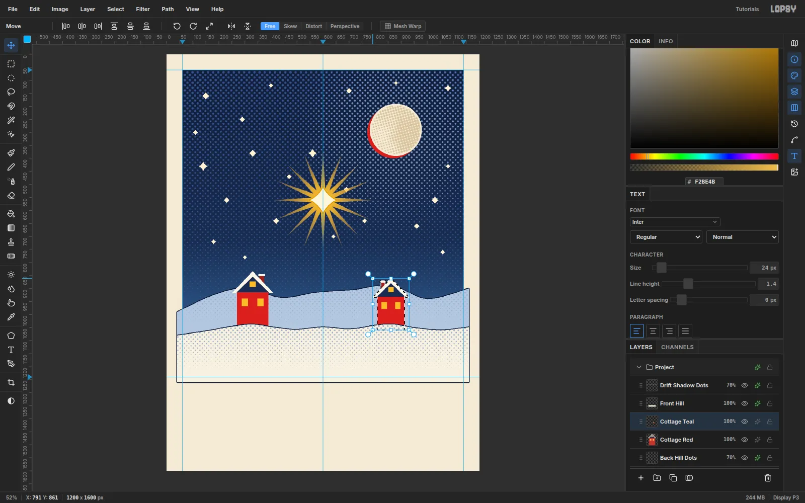

Marquee the cottage and press [[Cmd+C]], then [[Cmd+D]] and [[Cmd+V]]. The
copy is pasted in place on a new layer. Name it *Cottage Teal*.

1. [[Cmd]]-click its thumbnail to select it. The transform handles appear.
2. Press [[V]] and click **Flip Horizontal** in the options bar. The chimney moves to the left.
3. Drag from inside the selection 520 px to the right.
4. Hold [[Cmd]] and drag the top-left corner handle 20 px in to scale it evenly to about 87%.
5. Press [[Cmd+D]] to commit the flip, move and scale.

## Recolor the copy with the Magic Wand

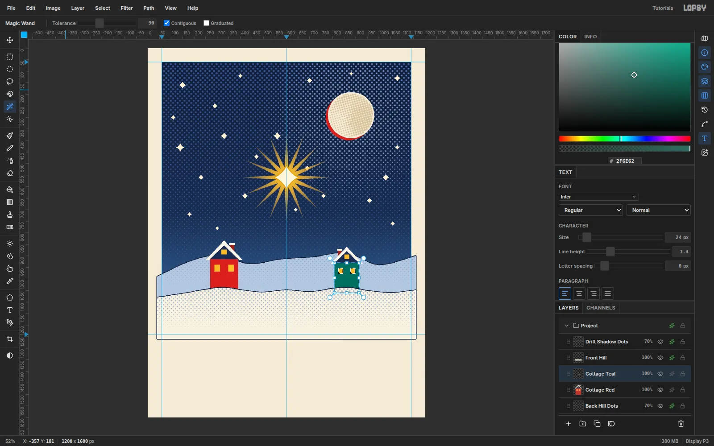

Choose the **Magic Wand** ([[W]]), set **Tolerance** to 90 and click the
red wall. Scaling softened the edges into a 1 px red fringe, so choose
**Select → Grow…** and grow the selection by **1 px** before you fill. Then
fill with teal `#2F6E62`.

The windows, roof and snow stay as they were. Only the walls change color.

## Add two more cottages and tilt one

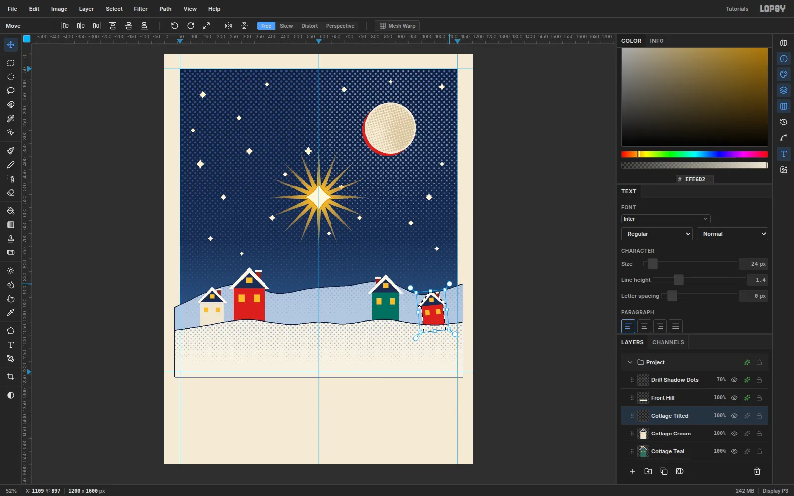

Paste twice more:

- *Cottage Cream*: move it 165 px left, scale it to 75%, and wand-recolor the walls `#EFE6D2`.
- *Cottage Tilted*: move it 690 px right and scale it to 70%. Keep it red.

Select the tilted cottage's pixels and drag the top-right **rotation handle**
(the circle outside the corner) about 6°. A slightly crooked house gives the
village a hand-drawn feel. Press [[Cmd+D]].

> **Tip:** Each paste, move, scale and rotation is its own history step. If a transform goes wrong, [[Cmd+Z]] steps back one change at a time and [[Cmd+Shift+Z]] brings it back.

## Raise the chapel

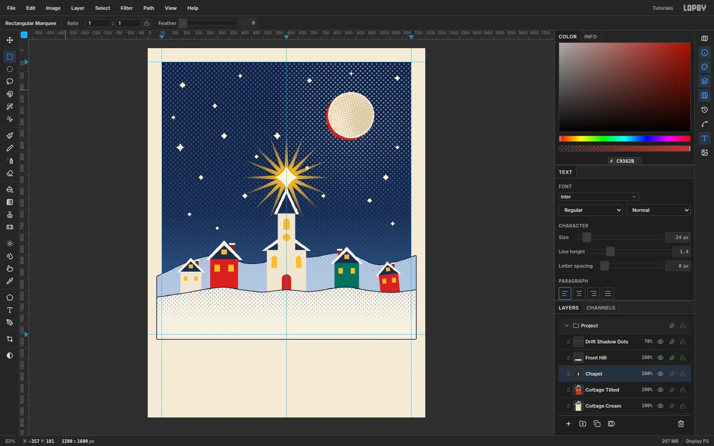

Add a *Chapel* layer and build it on the center guide:

- Nave `#EFE6D2`: 170 px wide, centred on the guide, with its top about 130 px above the 1000 mark. Give it a navy roof and a snow chevron.
- Tower `#EFE6D2`: 76 px wide, rising about 155 px above the nave
- Spire `#1D2B4F`: a triangle 96 px wide and about 100 px tall on top of the tower, edged in snow that runs a few pixels past its tip
- Gold arched windows (circle plus rectangle) in the tower and the nave, and a red arched door

The snow tip of the spire ends just inside the bottom point of the guiding
star, so the star appears to rest on the steeple.

## Paint the window light

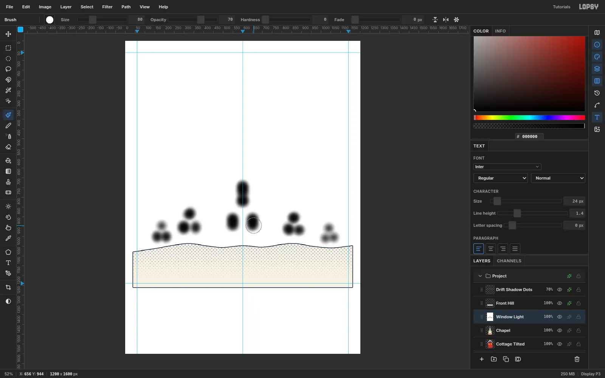

A soft glow would break the print look, so the window light is made of dots
too.

1. Add a *Window Light* layer, set the foreground to white and choose **Edit → Fill** with nothing selected to fill the whole layer.
2. Pick the **Brush** ([[B]]). In the brush settings, use **Size** 80, **Hardness** 0, **Opacity** 70.
3. With black selected, click once on every gold window.

> **Tip:** Fill the whole layer, not a rectangle. A hard white edge in the middle of the picture would print as a line of half dots.

## Screen the light into gold dots

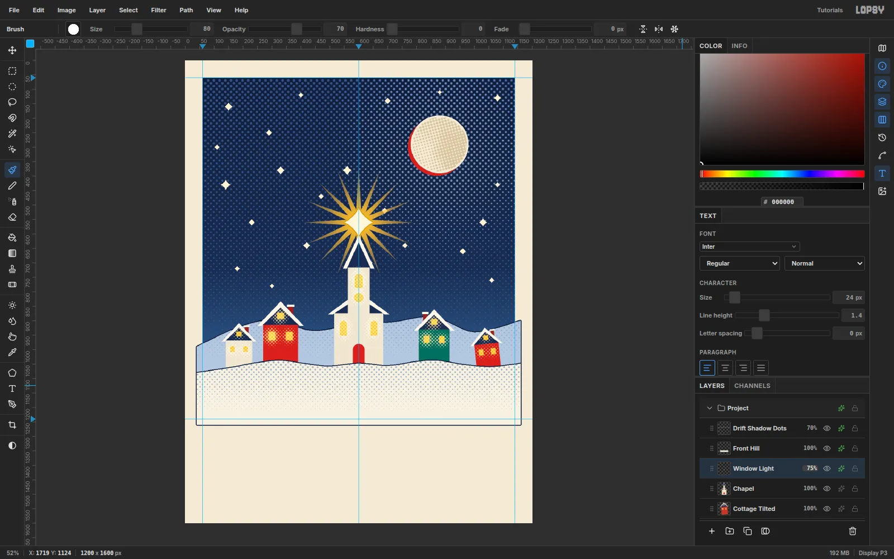

Run **Halftone** at **Dot Size 8**, **Softness 0**. The white area turns into
nothing, and each soft dab becomes a cluster of dots that shrink as the dab
fades.

Give the layer a **Color Overlay** of `#F2D06B`, set its **Blend** to
**Screen**, and set its opacity to **75%**.

## Key-line the village and move it as a group

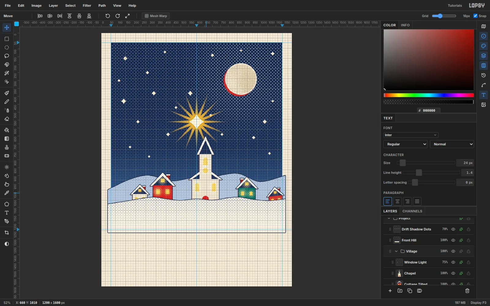

Give each cottage and the chapel two effects:

- **Stroke**: 3 px, `#131D38`
- **Drop Shadow**: Offset X −4, Offset Y 4, Blur 0, Opacity 60, color red `#C9362B`. This is a red plate printed slightly out of register.

Click *Cottage Red*, [[Shift]]-click *Window Light*, and choose
**Layer → Group Layers**. Name the group *Village* and select it.

To try a different spot, turn on **View → Show Grid** and **Snap to Grid**,
then drag the group with the Move tool. Everything moves together in grid
steps. This village looks best where it started, so press [[Cmd+Z]], then
turn the grid and snapping back off.

## Draw a pine and shade it with dots

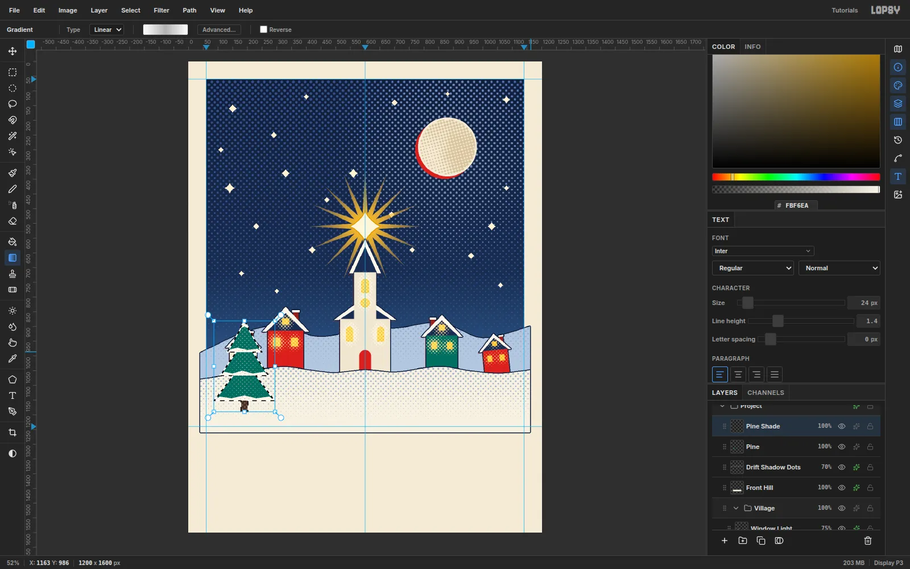

Select *Drift Shadow Dots* and add a *Pine* layer above it. Stand it at the
lower left, about 190 px in from the left edge, with its base about 50 px
above the bottom of the picture. Lasso-fill:

- a brown trunk `#4A3226`, 24 × 40 px
- three overlapping teal `#2F6E62` triangles: 200 px wide and 135 px tall at the bottom, 160 × 120 px above it, and 112 × 100 px at the top
- a wavy snow ledge `#FBF6EA` under each tier and a cap on the tip

For the shading, add a *Pine Shade* layer and [[Cmd]]-click the pine's
thumbnail. Drag a linear gradient (white → `#B0B0B0` → black) from left to
right across the tree. Then run **Halftone** at **Dot Size 10** and deselect.

Add a **Color Overlay** of `#1F4F46` and click **Rasterize Layer Style**.
Then choose **Layer → Merge Down** to bake the dots into *Pine*.

## Clone the pine

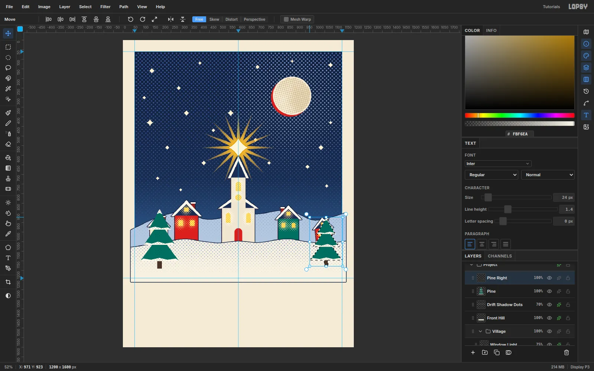

Marquee the pine and copy it. Use the cottage routine again:

- *Pine Right*: paste, flip, move it 850 px right and scale it to 84%.
- *Pine Small*: paste, move it up behind the front drift, about 145 px left of the centre guide, and scale it to 45%.

## Place the trees and key-line them

Drag each tree with the Move tool so the cottages can breathe. Move the big
pines out past the picture edges, and move the small pine left of the chapel
so it doesn't touch the chapel wall.

Add the same **3 px Stroke** (`#131D38`) to all three. Adding it after
scaling keeps the key line the same weight on the small tree as on the big
ones.

## Mat the picture with a paper border

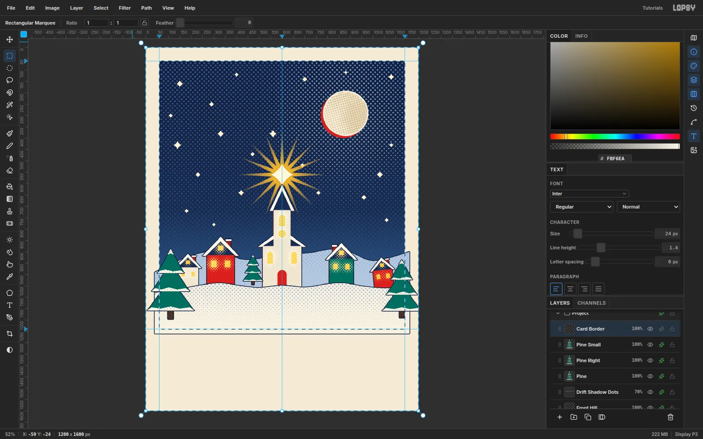

Select *Pine Small* and add a *Card Border* layer above everything so far.
Marquee the picture rectangle from guide to guide and choose
**Select → Inverse**.

Fill with paper `#F3EAD6` and run **Add Noise** at **Amount 6**, **Mono**.
Everything that hangs past the picture edge disappears under the mat, like
art trimmed by a printed border.

## Add a keyline frame

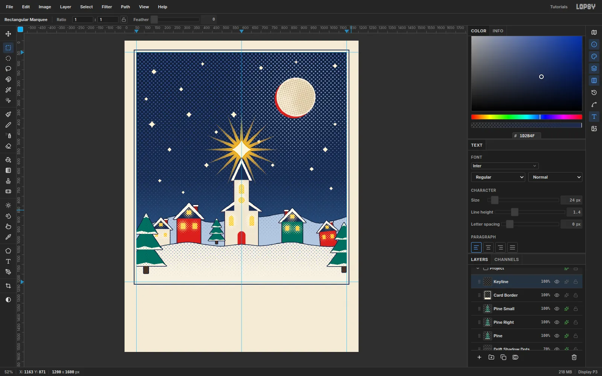

Add a *Keyline* layer. Marquee a rectangle 14 px outside the picture on
every side and fill it with navy `#1D2B4F`. Then choose **Select → Shrink…**
by **3 px** and press [[Delete]]. What's left is a crisp 3 px rule.

> **Tip:** To get the 14 px exactly, click once (don't drag) with the **Rectangular Marquee** while nothing is selected, and enter From 46, 46 To 1154, 1254.

## Let it snow

Select *Pine Small* and add a *Snowfall* layer (so it stays under the
border). Choose the **Brush**, set **Hardness** 85 and pick white. Click
single flakes across the sky, about 70 at **Size 7**, 40 at **Size 11** and 16
at **Size 16**. Keep them off the moon and the star.

Set the layer to **85%**.

## Type the title

Select *Keyline*. Pick the **Text** tool ([[T]]), set **Size** 138 and the font
to **Lobster**, and choose red `#C9362B`. Click in the lower band and type
`Joyeux Noël`. Press [[Tab]] to commit, and rename the layer *Title*.

Center it in the band under the picture with the Move tool. **Align center
horizontally** in the options bar centres it across the card. Arrow keys
nudge 1 px, and [[Shift]]+arrow nudges 10 px.

## Tilt the title

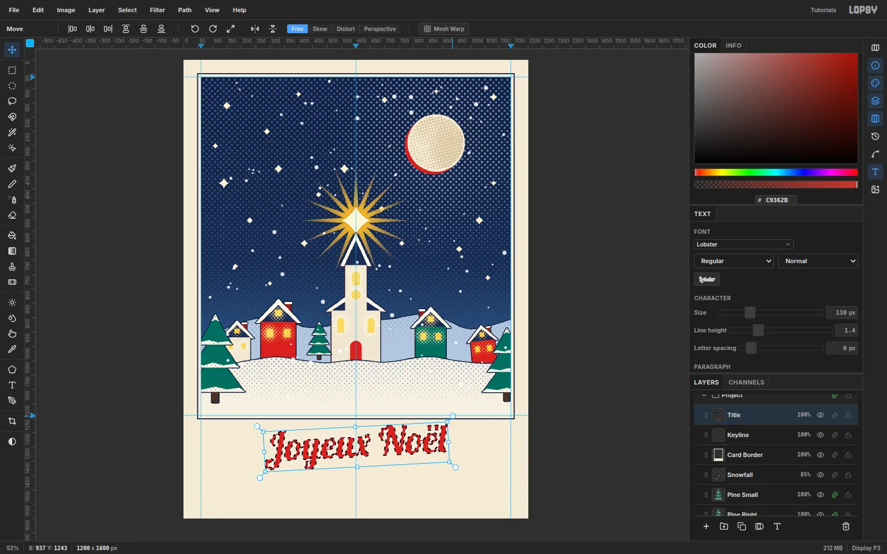

[[Cmd]]-click the *Title* thumbnail to select the lettering. Press [[V]] and
drag the top-right rotation handle up by about **3°**, so the baseline rises
to the right. Press [[Cmd+D]].

Now **seat it**. Nudge the title until its highest point (the dots on the ë)
is about **36 px** below the keyline, and the inked width is centered on the
centre guide. Check the gap below the J's descender too. It should be about
the same as the gap above.

Add a **Drop Shadow**: Offset X 6, Offset Y 6, **Blur 0**, opacity 100,
navy `#1D2B4F`. With no blur, it reads as a second ink plate slipping out of
register.

## Screen dots into the letters

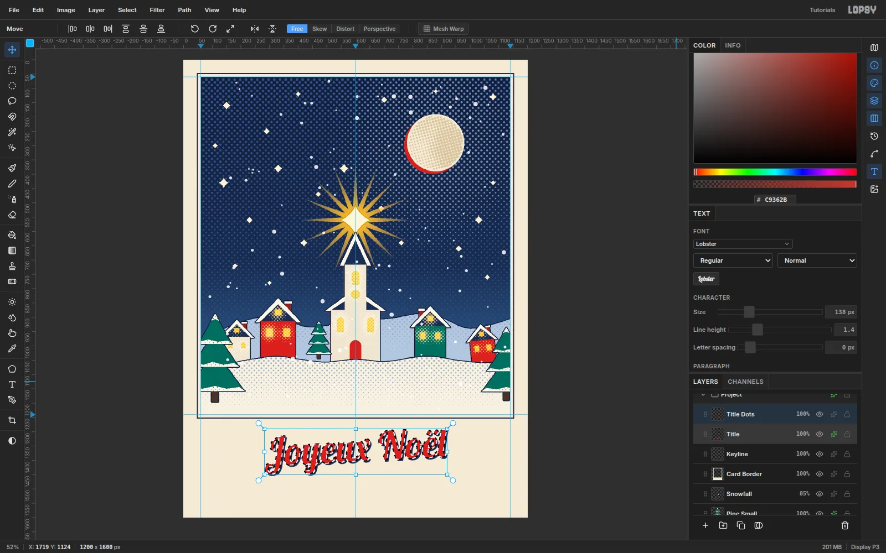

Add a *Title Dots* layer and [[Cmd]]-click the *Title* thumbnail to select the
letter shapes.

Drag a linear gradient (white → `#C4C4C4` at 35% → `#202020`) from the top of
the lettering to the bottom. Run **Halftone** at **Dot Size 9**, then
deselect and add a **Color Overlay** of dark red `#7E211B`.

The script now shades from clean red at the top to a dotted lower half, like
a screen-printed sign.

## Build the ribbon

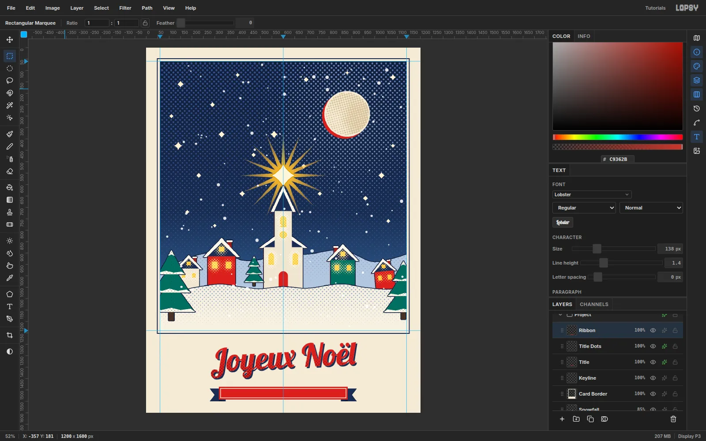

Add a *Ribbon* layer. The band is 564 × 56 px, centred on the centre guide
below the title.

1. **Tails:** lasso-fill two navy `#1D2B4F` swallowtails behind the band ends. Each is 70 px long, starts 30 px under the band and sticks out 40 px past its end, sits 8 px lower than the band, and has a 22 px notch.
2. **Folds:** fill a small triangle in `#121B35` where each tail tucks under the band.
3. **Band:** marquee the 564 × 56 band (typed corners: From 318, 1486 To 882, 1542) and fill it red.
4. **Inner rule:** **Select → Shrink** by 5 px and fill with paper. Then shrink by 2 px more and fill red again.

## Recolor the greeting with Select All

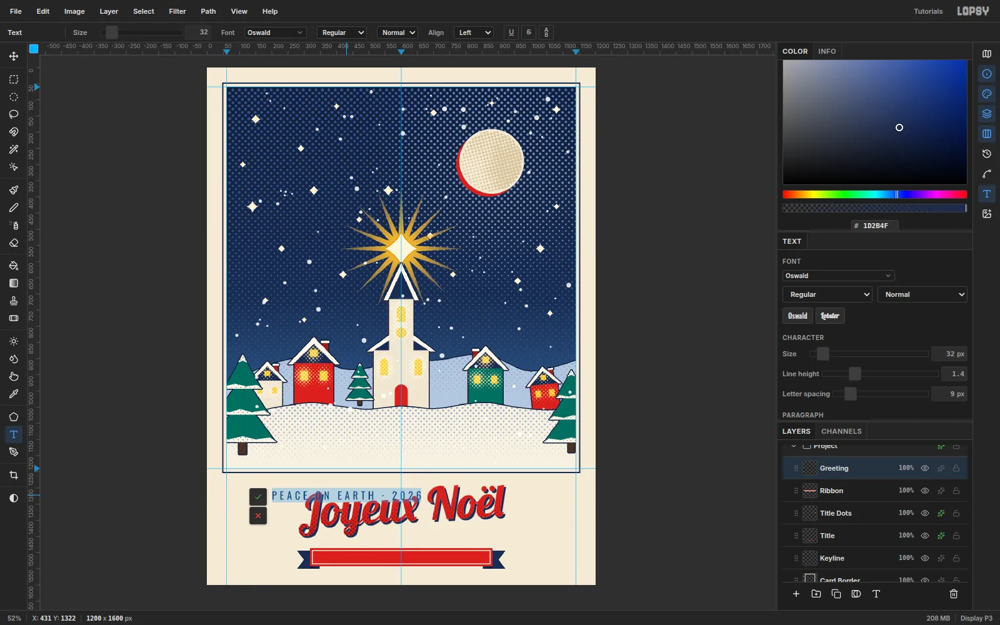

With the Text tool, set **Size** 32 and the font to **Oswald**, and type
`PEACE ON EARTH · 2026` in navy. Commit it and name the layer *Greeting*. In
the **Text** panel, set **Letter spacing** to **9 px**. Wide tracking suits
small capitals.

To recolor it, click into the text, press [[Cmd+A]] to select every
character, and pick paper `#F3EAD6`. Press [[Tab]] to commit. The layer keeps
the *Greeting* name you gave it.

## Seat the greeting in the ribbon

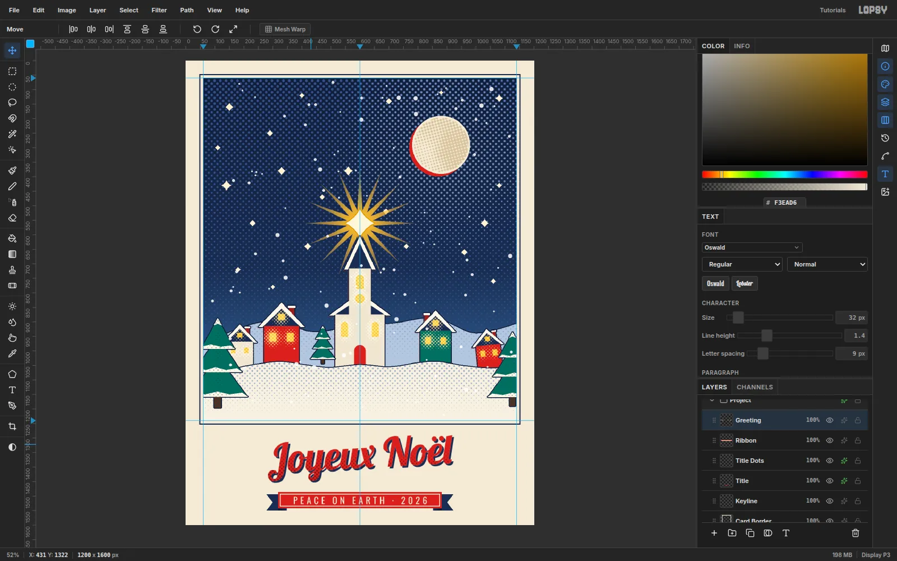

Nudge the greeting so the inked caps sit halfway between the inner rules.
The caps are about 25 px tall and the space inside the rules is about 42 px,
so aim for 8–9 px of red above and below them. Center them horizontally on
the centre guide.

Capitals have no descenders, so centering the inked box also centers them
optically.

## Clean the flakes off the chapel

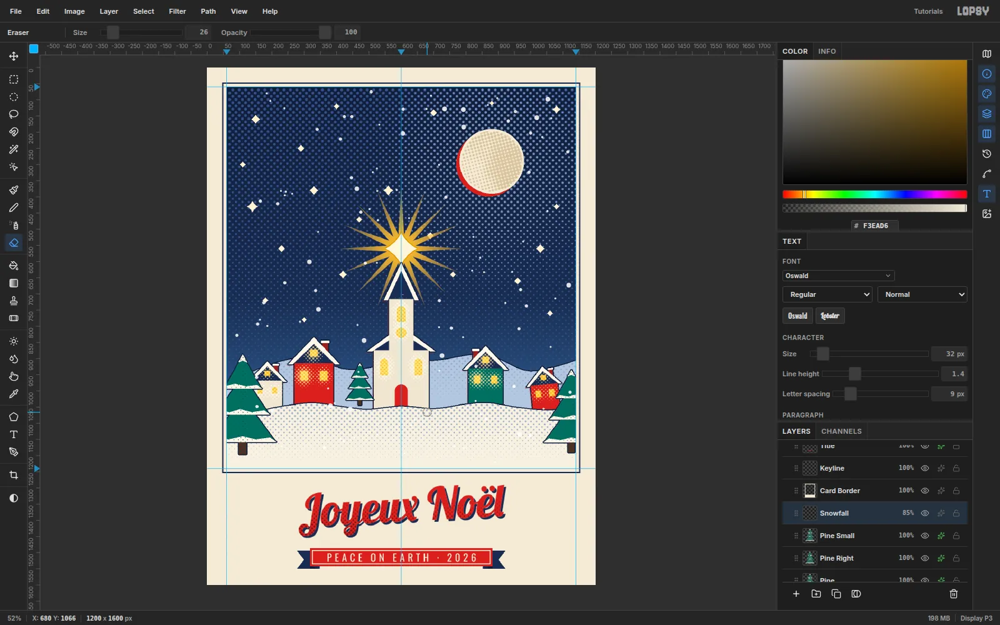

A few flakes landed on the chapel and disappear into its cream walls. Select
*Snowfall*, pick the **Eraser** ([[E]]) at **Size 26**, and sweep over the
chapel facade.

## Add print grain

Select *Greeting* and add a *Print Grain* layer at the very top. Fill it with
`#808080`, then run **Add Noise** at **Amount 22** with **Mono** and
**Gaussian**. Set **Blend** to **Overlay** and the opacity to **30%**.

The mid-gray disappears in Overlay, and only the grain is left, over the
paper and the inks alike.

## Export the card

Turn off **View → Show Guides** and choose **File → Quick Export PNG**.

At 1200 × 1600 it prints at 4 × 5.3 in at 300 dpi. For a 5 × 7 in card, start
at 1500 × 2100 and scale every size, offset and distance by 1.25.
