Travel posters of the 1960s and 70s were printed in a handful of flat inks,
and every shadow was made of **halftone dots**. A tiny dot reads as a light
tone and a fat dot reads as a dark one, so five colours were enough to paint
a whole landscape. This tutorial rebuilds that look in Lopsy for **GEYSIR**,
a 1500 × 2100 px poster of an Icelandic geyser mid-eruption.

The trick is one move that you'll repeat about ten times. Paint a
**black-to-white gradient** in a selection on its own layer, run
**Filter → Halftone**, then recolour the dots with a **Color Overlay** and
bake it in with **Rasterize Layer Style**. Black becomes big dots, white
vanishes, and the gradient turns into a screen of dots that fades out.

Along the way you'll also use:

- **Rectangular Marquee**, **Elliptical Marquee** and **Lasso** fills
- **Linear** and **Radial** gradients, and **Select → Inverse**
- the **Pencil** with [[Shift]]-click straight lines, and a **Brush** for spray droplets
- **Stroke** layer effects on text, and **Space Mono**, **Anton** and **Playfair Display** type
- **groups**, **Snap to Layers**, **guides**, **undo / redo**, and layer reordering by dragging
- **Merge Down**, the **transform handles** for rotation, and **Nudge** with the arrow keys

The palette is five inks on cream paper:

- Paper `#F3EBDA`
- Indigo `#1C2B6B` and deep night `#0F1640`
- Coral `#F0482B`
- Saffron `#FBB13C`
- Teal `#4FB3BF`

## Set up the paper

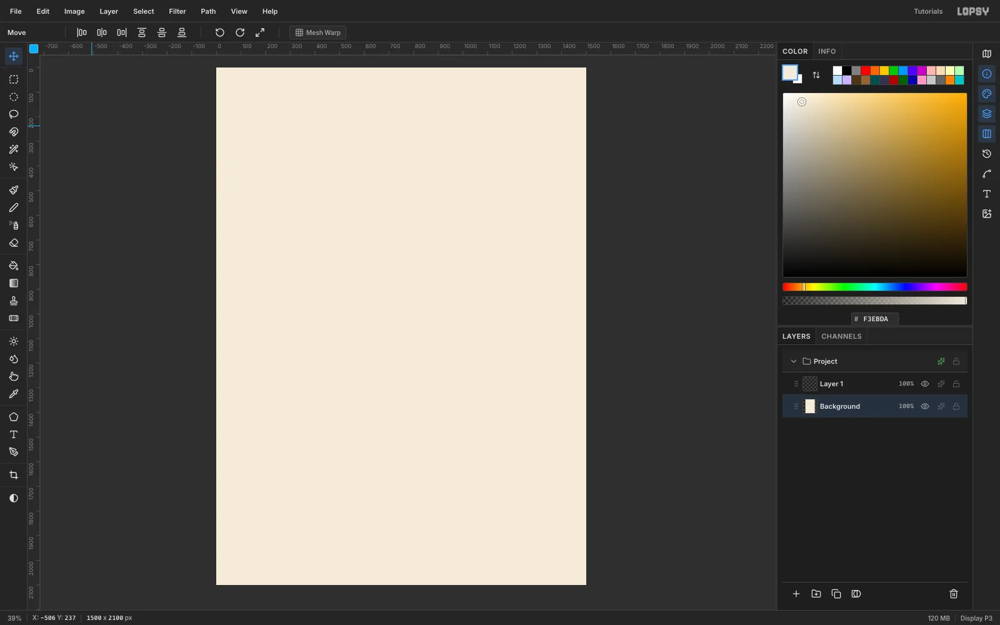

Choose **File → New**, set the units to **Pixels**, make the document
**1500 × 2100** and click **Create**. Select the **Background** layer, set
the foreground colour to `#F3EBDA` and choose **Edit → Fill**. The whole
sheet turns to cream. This is the paper colour, and the unprinted border
around the picture will stay this colour at the end.

## Mark out the picture

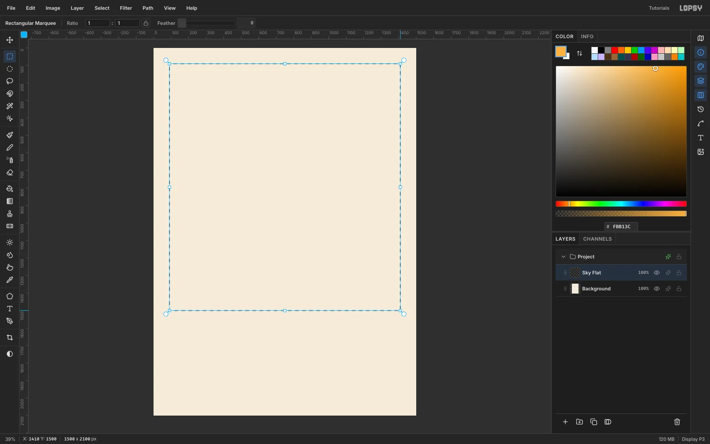

Rename **Layer 1** to *Sky Flat* by double-clicking its name. Set the
foreground to saffron `#FBB13C`. Pick the **Rectangular Marquee**
([[M]]) and drag out the picture area. Leave an even cream border on the
left, right and top, and a much deeper band at the bottom for the title.
The Marquee options show the exact size if you want to check it.

## Fill the sky

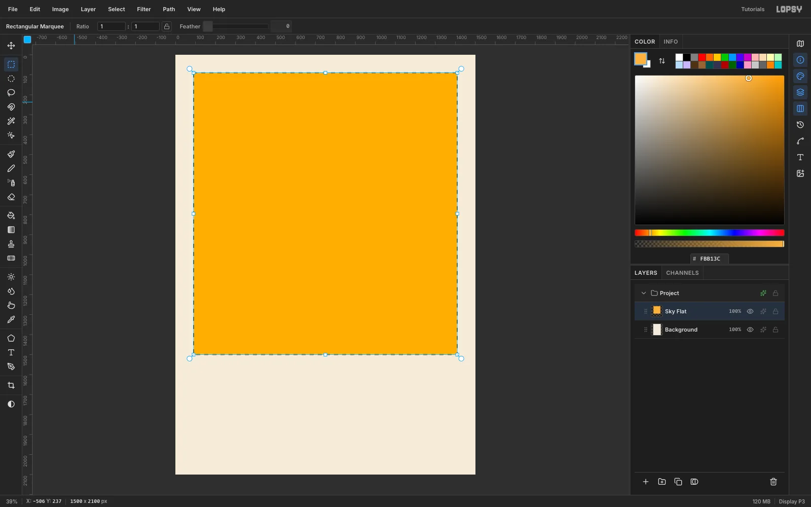

With the marquee still active, choose **Edit → Fill**. This flat saffron is
the first ink. Keep the selection. You'll reuse it for the next layer.

## Screen the sky with coral dots

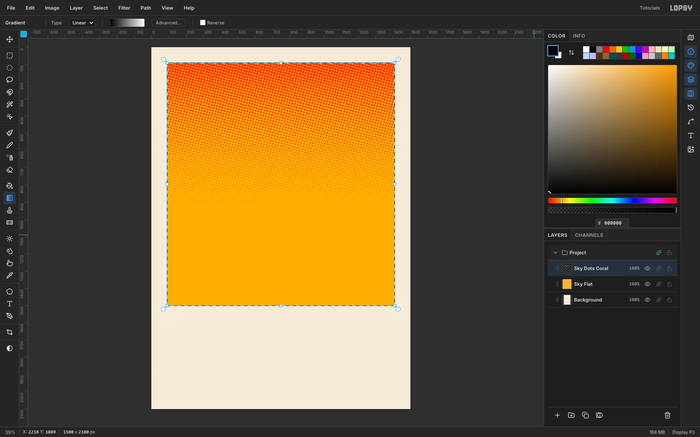

1. Add a layer and rename it *Sky Dots Coral*. The selection survives the new layer.
2. Set the foreground to black and the background to white. Pick the **Gradient** tool, set it to **Linear**, and drag from the top of the picture down about halfway.
3. Choose **Filter → Halftone…**. Set **Dot Size** 16, **Angle** 75 and leave **Density** and **Softness** at their defaults. Click **Apply**.
4. Open the layer's effects, switch on **Color Overlay** and pick coral `#F0482B`.
5. Click **Rasterize Layer Style** so the colour is baked into the dots.

The gradient started black at the top, so the dots are biggest there. Because
the dots are coral on saffron, the sky already glows like a hot dawn.

## Draw the halo for the sun

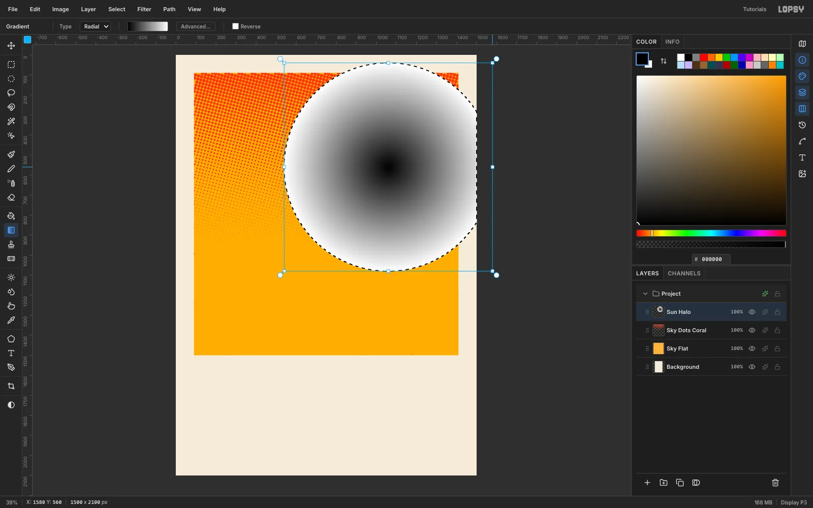

Add a layer called *Sun Halo*. With the **Elliptical Marquee**, drag a big
circle out from the upper right of the sky so it reaches past the edge of the
picture. Pick the **Gradient** tool again and switch its type to **Radial**.
Drag from the centre of the circle out to its edge. The gradient is black in
the middle and white at the rim.

## Turn the halo into dots

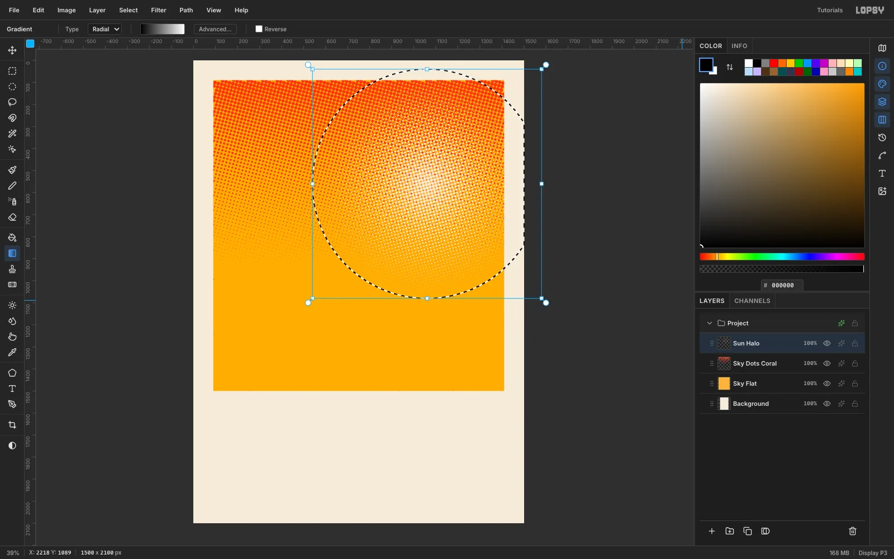

Run **Filter → Halftone…** with **Dot Size** 14 and **Angle** 15. Turn on
**Color Overlay** in cream `#F3EBDA` and click **Rasterize Layer Style**.
The glow around the sun is made of dots that thin out toward the edge. No
blur was needed.

Using a different angle from the sky dots (15° instead of 75°) keeps the two
screens from forming a distracting moiré.

## Add the sun disc

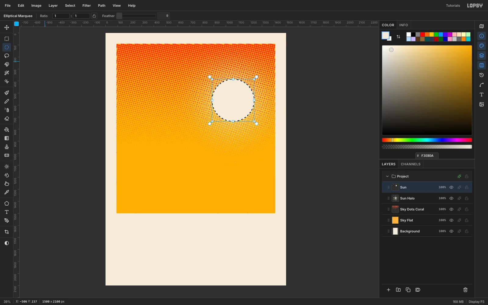

Add a layer called *Sun*, set the foreground to cream and draw a smaller
**Elliptical Marquee** circle in the centre of the halo. Choose **Edit → Fill**.
This flat disc is the sun.

## Shade the sun with dots

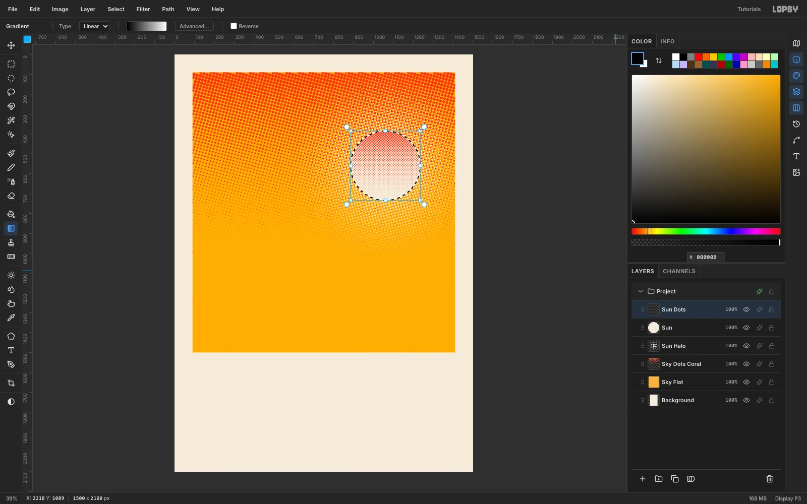

Add *Sun Dots* with the same circle still selected. Reset the colours to
black and white, then set the Gradient tool back to **Linear** and drag from
the top of the disc to its bottom. Run **Halftone** at **Dot Size** 9 and
**Angle** 45, add a **Color Overlay** of coral `#F0482B`, and **Rasterize
Layer Style**. The top of the sun is shaded with coral dots and the bottom
stays clean cream, which makes it look like it's setting into the heat.

## Cut the far mountains with the Lasso

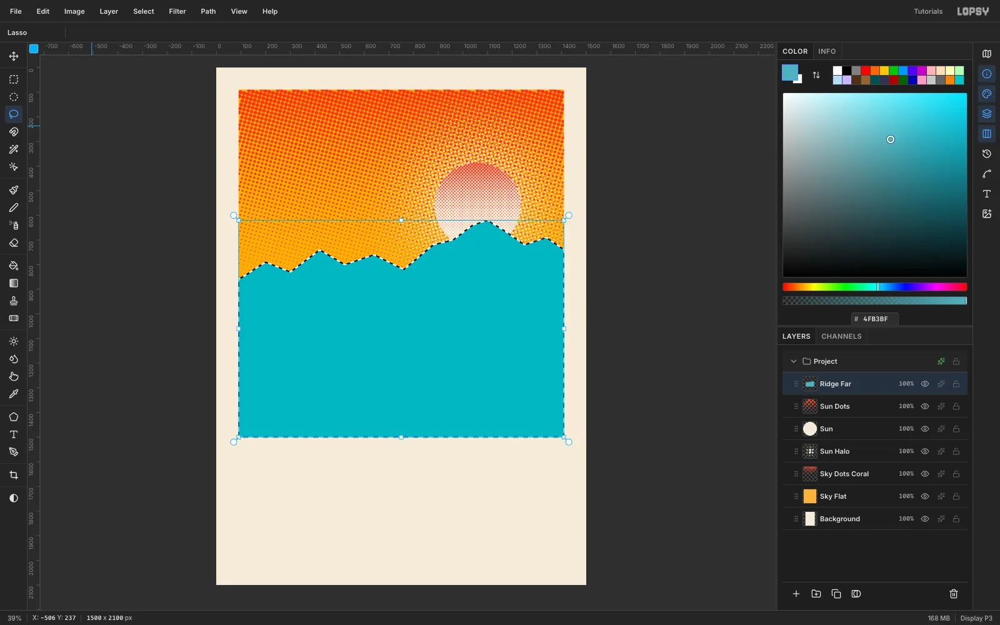

Add a layer called *Ridge Far* and set the foreground to teal `#4FB3BF`.
Pick the **Lasso** ([[L]]) and click a zigzag of peaks across the picture,
low on the left, one tall peak a little right of the middle, then down the
right. Click down the right edge, along the bottom, and back up the left edge
to close the shape, so the lasso covers everything below the skyline. Choose
**Edit → Fill**.

## Print dots on the far mountains

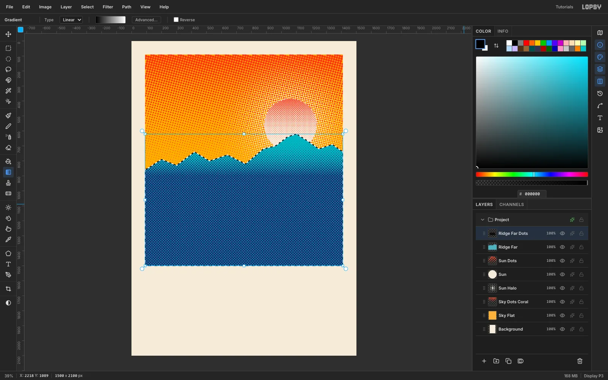

Add *Ridge Far Dots*. Keep the same selection, switch to the **Linear**
gradient with black and white, and drag **upward**, from the base of the
mountains to just under the tallest peak. Run **Halftone** at **Dot Size** 12
and **Angle** 45. Colour the dots indigo `#1C2B6B` with a **Color Overlay**
and **Rasterize Layer Style**. This puts the mist at the foot of the range.

## Cut the nearer ridge

Add *Ridge Mid* and set the foreground to indigo `#1C2B6B`. Use the Lasso
the same way as before, but make this skyline lower and gentler. Close the
shape along the bottom of the picture and fill it.

## Give the ridge a teal rim light

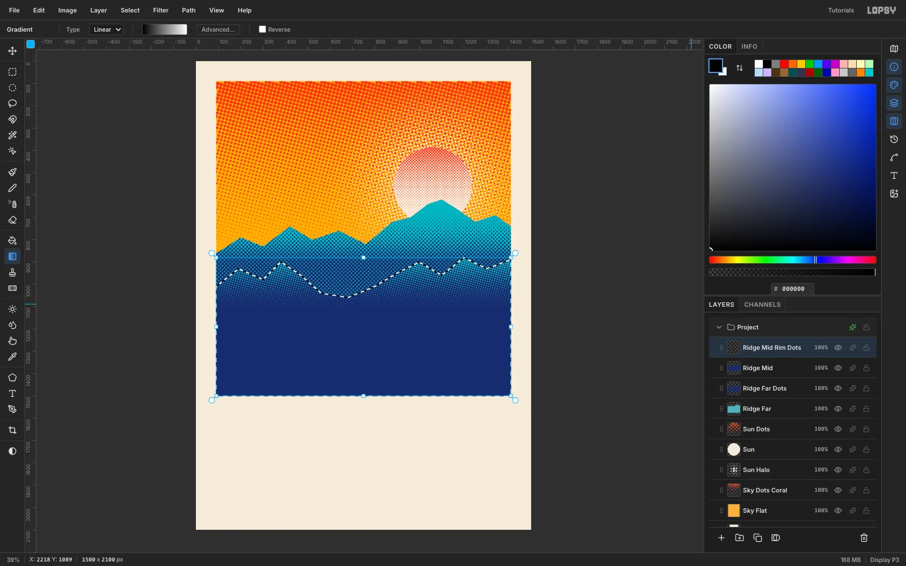

Add *Ridge Mid Rim Dots*. This time drag the Linear gradient **downward**
from the top of the ridge, so black sits on the crest. Run **Halftone** at
**Dot Size** 10 and **Angle** 75, colour the dots teal `#4FB3BF`, and
**Rasterize Layer Style**. The dots read as light catching the ridge from
the sunset.

## Lay down the basin

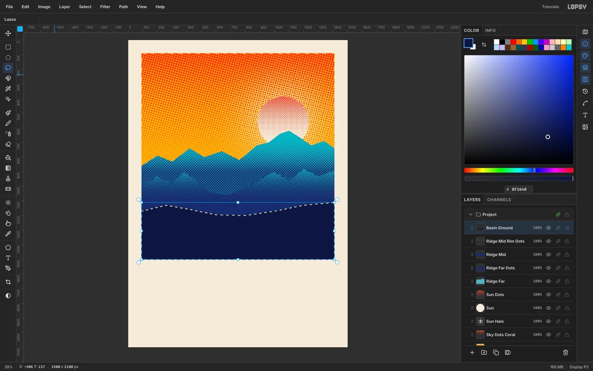

Add *Basin Ground*, set the foreground to deep night `#0F1640` and Lasso a
low, gently wavy horizon across the picture, closing it along the bottom
edge. Fill it. This dark plain is where the geyser will sit.

## Build the terraces

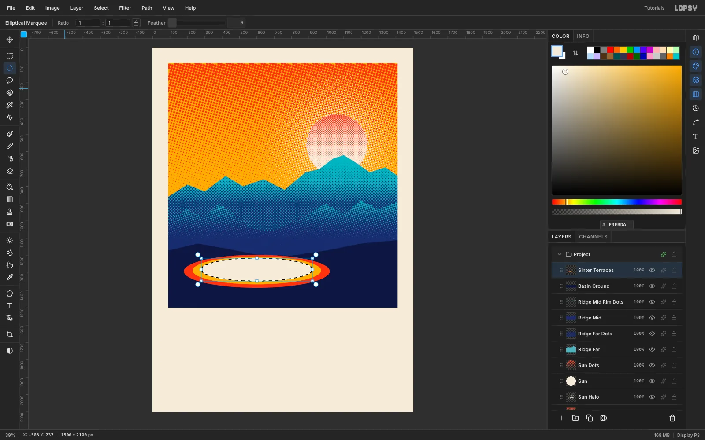

Add *Sinter Terraces*. Use the **Elliptical Marquee** to draw a wide, flat
oval just left of the centre of the basin and fill it coral. Draw a slightly
smaller oval inside it and fill it saffron, then a smaller one still and
fill it cream. Each oval is shorter than the last, so you see three coloured
rings like the stepped pools around a real geyser.

## Add the pool

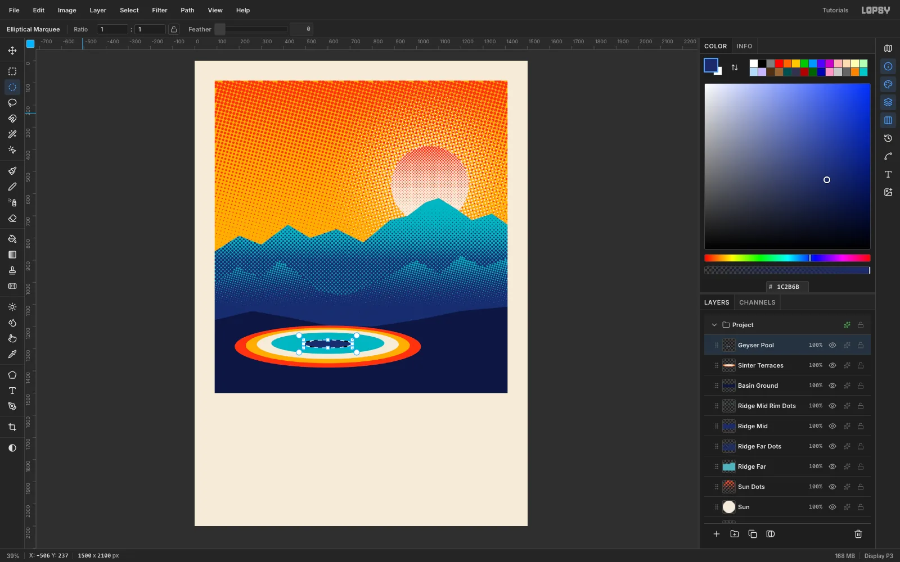

Add *Geyser Pool*. Fill a smaller flat oval in teal `#4FB3BF` inside the
cream ring, then a tiny dark indigo oval, `#1C2B6B`, in its centre. That
dark spot is the vent.

## Build the steam column

Add a layer called *Plume* and set the foreground to cream. With the
**Elliptical Marquee**, fill about eighteen overlapping ovals, fill after
each one. Start with narrow, tall ones at the vent and make them wider and
shorter as you climb. At the top, cluster four or five big ovals into a
cloud, then add a few smaller ovals trailing off to the right, which is the
way the wind is blowing. Deselect with [[Cmd+D]].

The overlapping ovals give the column its bumpy silhouette, and you can
always [[Cmd+Z]] a bad one.

## Flare the base

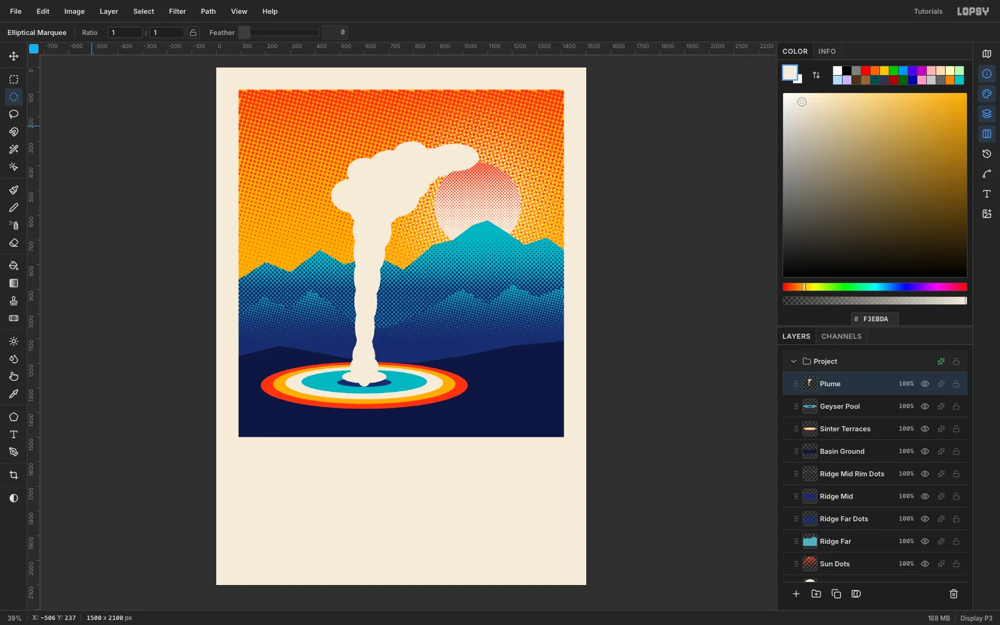

Still on *Plume*, fill three more ovals at the bottom: a wide, flat one
across the pool, a medium one above it, and a taller one on top. This flares
the base the way a real eruption spreads at the vent.

## Select the plume

Hold [[Cmd]] and click the *Plume* layer's thumbnail. Lopsy turns the
layer's pixels into a selection. Every shading layer for the plume will be
clipped to this shape, so it never spills past the edge.

## Shade the plume with indigo dots

Add *Plume Shade*. Reset to black and white, choose the **Linear** gradient
and drag **left to right** across the column, from past its left edge to a
little beyond its centre. Run **Halftone** at **Dot Size** 11 and **Angle**
15, colour it indigo `#1C2B6B` and **Rasterize Layer Style**. The shadow side
of the plume is now a screen of dots.

## Rim light the plume with coral dots

Add *Plume Rim*. Keep the selection and drag the gradient the other way,
**right to left**, from beyond the sun side of the column into its middle.
Run **Halftone** at **Dot Size** 9 and **Angle** 75, tint the dots coral
`#F0482B` and **Rasterize Layer Style**. Press [[Cmd+D]] to deselect.

Using a different angle from the shadow makes the two screens look like
separate plates, the way real overprinting does.

## Add a glow to the ground

Hold [[Cmd]] and click the thumbnail of *Basin Ground* to select the ground.
Add *Ground Glow Dots*. Drag a Linear gradient **downward** from the
horizon to the foot of the picture, run **Halftone** at **Dot Size** 12 and
**Angle** 15, tint it saffron `#FBB13C` and **Rasterize Layer Style**. Press
[[Cmd+D]] to deselect.

The glow is above the terraces in the stack, so it overprints the pool, which
is wrong. You'll fix that in a couple of steps, but first a quick test.

## Test undo

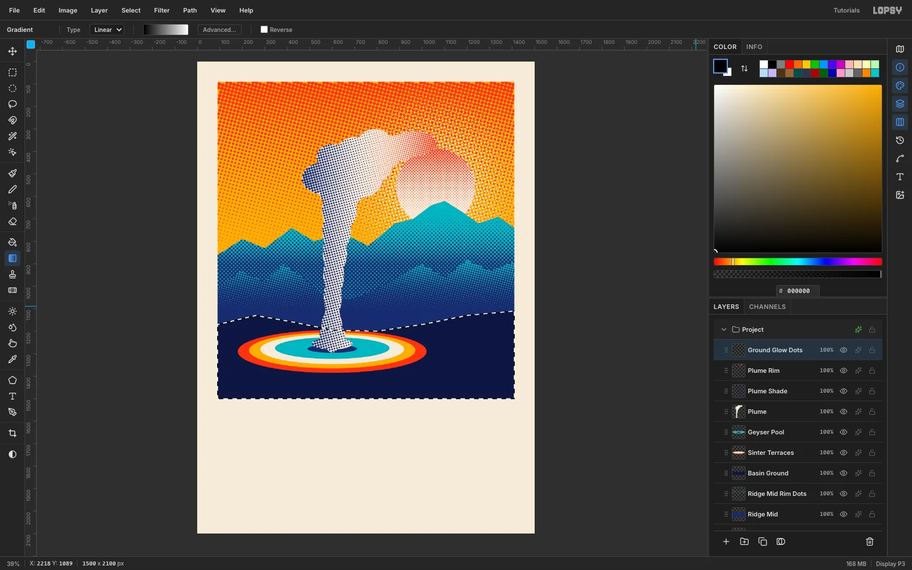

Press [[Cmd+Z]] four times. Only the ground-glow work peels back (the
Rasterize Layer Style, the Color Overlay, the Halftone and the gradient), so
the saffron dots vanish and the basin selection is still there. The plume
shading is untouched. Doing an undo test now and then is a good habit, so you
know your history is trustworthy.

## Redo it all

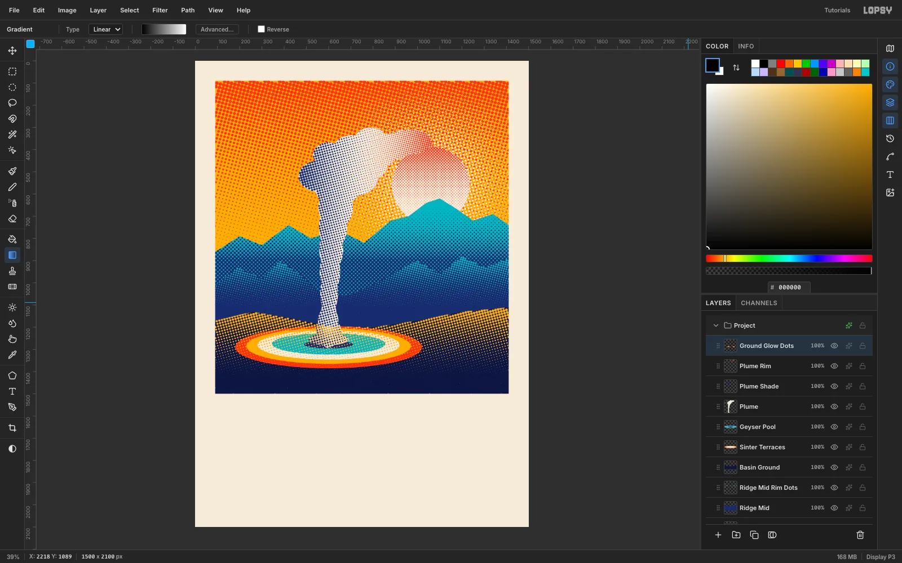

Press [[Cmd+Shift+Z]] four times. The ground glow comes back exactly as it
was. Compare the dots to the earlier screenshot. They should look
identical.

## Slide the glow under the terraces

In the Layers panel, drag *Ground Glow Dots* down until it sits just below
*Sinter Terraces*. The coloured rings now stand clear of the dots, and the
glow reads as light spilling out of the pool across the dark ground.

## Cap the peaks with snow

Select *Ridge Far Dots* in the Layers panel so the new layer lands above
the mountains, and add *Snow Caps*. Set the foreground to cream, pick the
**Lasso**, and click a small jagged cap around the top of the tallest peak.
Click back to the start to close it and fill it. Repeat for three of the other
peaks, making those caps smaller.

## Spatter the spray

Select *Plume Rim*, the top plume layer, so the new layer lands above
it, and add *Spray Droplets*. Pick the **Brush**, set the foreground to cream,
the **Hardness** to 100 and click once for each droplet. Change the **Size**
between clicks, from about 12 px to 32 px, and scatter the drops above and
around the cloud. Put a few bigger ones near the top and smaller ones near
the plume.

## Draw the height scale

Add a layer called *Height Scale*. With the **Rectangular Marquee**, fill a
very narrow cream vertical bar (about 6 px wide) up the left side of the
picture, from the dark ground near the bottom to nearly the top. Then draw
nine short, thin horizontal rectangles across it at even gaps, alternating
long and short ticks, and fill each one.

## Outline the scale

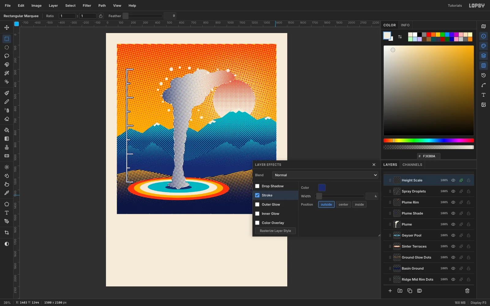

Open the layer's effects, add **Stroke** with indigo `#1C2B6B` and set the
**Width** to **4**. The outline keeps the cream bars legible over the sky and
the mountain dots.

## Label the scale

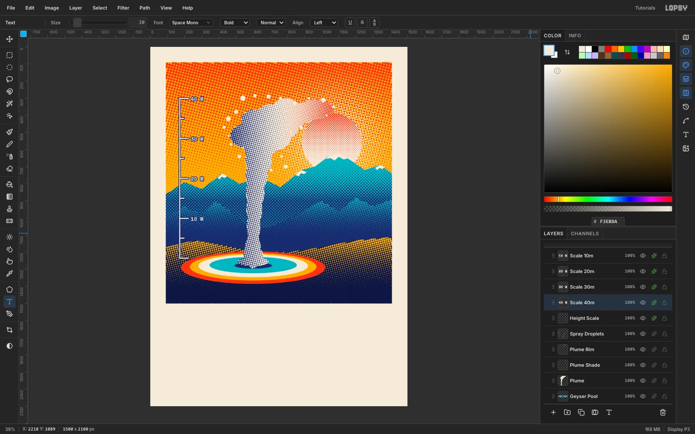

Pick the **Text** tool. Select the *Height Scale* layer first, so the text is
created next to it, and click in the empty sky right of the first long tick.
Type *10 M*, then set the font to **Space Mono**, the weight to **Bold** and the
size to **30**, with a cream colour. Add a **Stroke** effect to the label, width
4 in indigo, and press [[Esc]]. Rename the layer *Scale 10m*. Repeat for *20 M*, *30 M* and *40 M* (naming them *Scale 20m*, *Scale 30m* and *Scale 40m*), using
every second tick and always clicking on an empty bit of sky, never on
another label. Clicking inside an existing label would edit it.

> **Tip:** Set the font and size before you place the first label. With a text layer active, changing the font or size on the Text tool restyles *that* layer. Select a non-text layer when you want to start fresh text.

## Plant the fence posts

Select the *Scale 10m* label layer and add *Fence Posts*, so the layer
sits above the labels. Set the foreground to saffron. With the **Rectangular Marquee**,
fill a narrow, tall rectangle, then repeat about ten times. Space the
posts evenly across the front of the pool and make the middle posts a touch
lower than the end ones so they bow along the curve of the terrace.

## String the rope with the Pencil

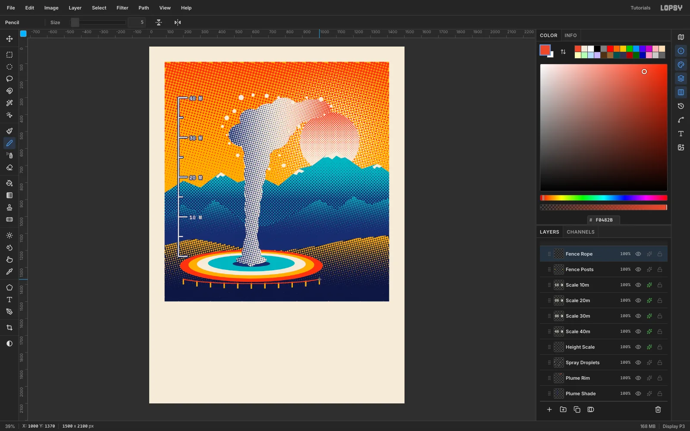

Add *Fence Rope*, set the foreground to coral `#F0482B`, pick the **Pencil**
and set the **Size** to **5**. Click once on the first post top. Now hold
[[Shift]] and click on the next post top, and the Pencil draws a straight
line between them. Keep holding [[Shift]] and click on each remaining post
in turn. The rope bends a little at each post, like a real sagging line.

## Sketch the tourists

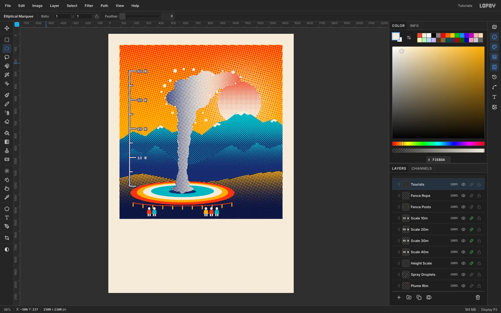

Add *Tourists*. For each figure, use the **Rectangular Marquee** to fill two
narrow cream legs, use the **Lasso** to fill a four-point trapezoid coat in
coral, teal or saffron, and use the **Elliptical Marquee** to fill a small
cream head. Make two figures on the left and three on the right. At this
size they're only about 80 px tall, which is exactly what makes the geyser
look huge.

## Frame the picture

Add *Frame Mask*. Set the foreground to cream and marquee the picture
rectangle again, with the same edges you used for the sky. Choose
**Select → Inverse** and **Edit → Fill**. Everything outside the picture
becomes clean paper again, which hides any dots or tourists that bled over
the edges. Deselect.

## Add a keyline

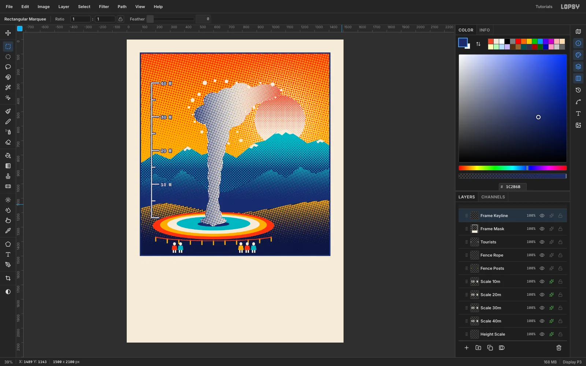

Add *Frame Keyline* and set the foreground to indigo `#1C2B6B`. Marquee the
picture rectangle again, **Edit → Fill** it, then choose **Select → Shrink…**
by **8** and press [[Delete]]. What remains is an 8 px indigo outline. Deselect.

## Set the title

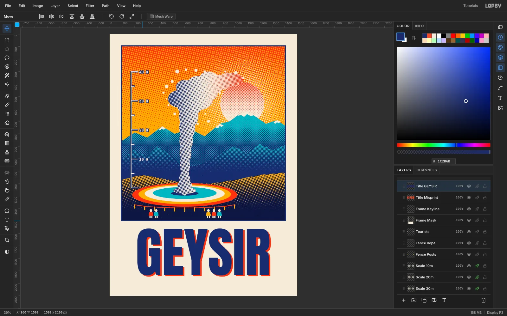

Select *Frame Keyline* so text lands above it. Pick the **Text** tool and
click in the band under the picture. Use **Anton**, weight **Regular**, size
about **430**, in coral `#F0482B`, and type *GEYSIR*. Rename the layer *Title
Misprint*. With the Move tool, click **Align center horizontally** in the
options bar.

Select *Frame Keyline* again so the next text doesn't land on the first one,
and make another *GEYSIR* in indigo `#1C2B6B` at the same size, clicking in
an empty part of the band. Name it *Title GEYSIR* and centre it too. If it
landed below the coral copy, drag it above the coral copy in the Layers panel.
Then nudge the indigo word up and to the left with the arrow keys (the
coral copy ends up about 8 px right and 8 px down from it) so a thin edge of
coral peeks from the lower right of each letter. This is the **misprint**
look, a second plate that missed registration.

## Add the tagline

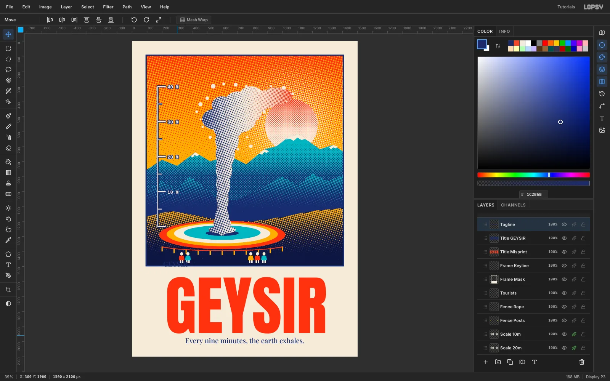

Select *Frame Keyline* so the text lands above it, pick the **Text** tool and
click in the empty cream space under the title. Choose **Playfair Display**,
weight **Medium**, size **46**, in indigo, and type *Every nine minutes, the
earth exhales.* Press [[Esc]], then use **Align center horizontally**.
Rename it *Tagline*.

## Add the data strip

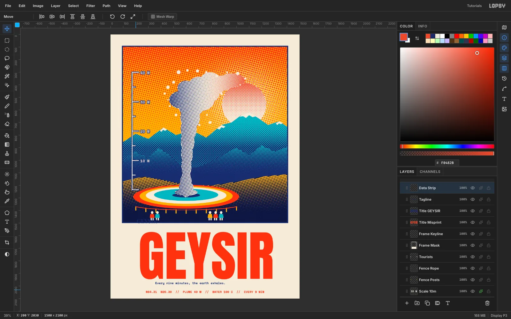

Select *Frame Keyline* again, pick the **Text** tool and click in the
margin at the very bottom. Choose **Space Mono**, weight **Bold**, size **24**,
coral `#F0482B` and type *N64.31  W20.30  //  PLUME 40 M  //  WATER 100 C  //  EVERY
9 MIN*. Centre it. A serif tagline over a monospaced strip mixes a
poster-like voice with a field-guide one. Don't worry if the strip sits
tight against the bottom edge. You'll adjust it at the end.

## Drop guides to check the margins

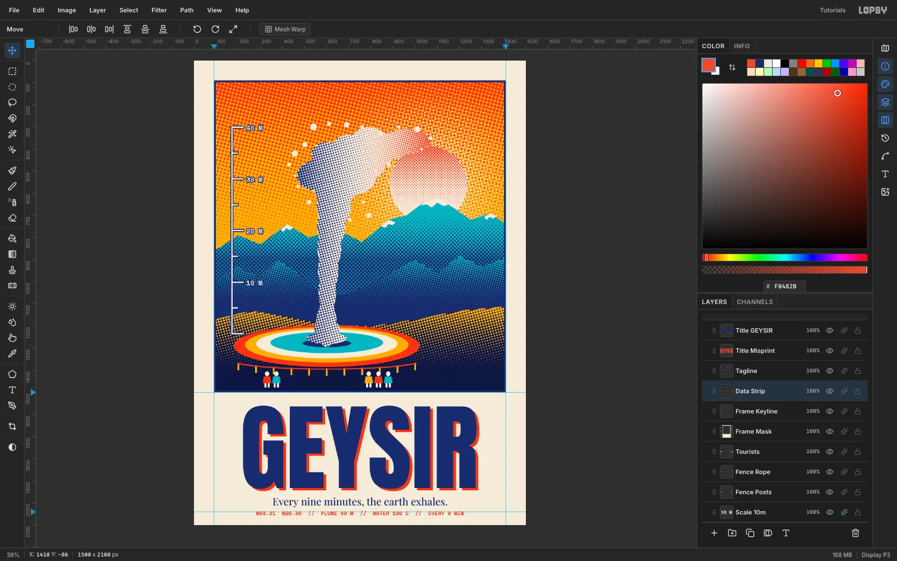

Make sure **View → Show Rulers** and **Show Guides** are on. Click once on
the top ruler near each edge of the picture to drop a vertical guide, then
click the left ruler at the top of the title band and again near the bottom.
(Dragging from a ruler doesn't make a guide. You click.) The title should
sit centred between the vertical guides, and the lines of text should sit
between the horizontal ones.

## Group the title

Click *Title GEYSIR* in the Layers panel, then [[Shift]]-click *Title
Misprint*, and choose **Layer → Group Layers** ([[Cmd+G]]). Rename the
group *Title Lockup*. Now the two halves of the title travel together and
the misprint offset can't drift.

## Move the group with Snap to Layers

Turn on **View → Snap to Layers**. Select *Title Lockup*, pick the **Move**
tool, then drag from inside the lettering a short way up. Both halves of the
title move together, and the group's edges will snap to nearby layers and
guides as it passes them. Release the mouse to drop it.

## Undo and redo the group move

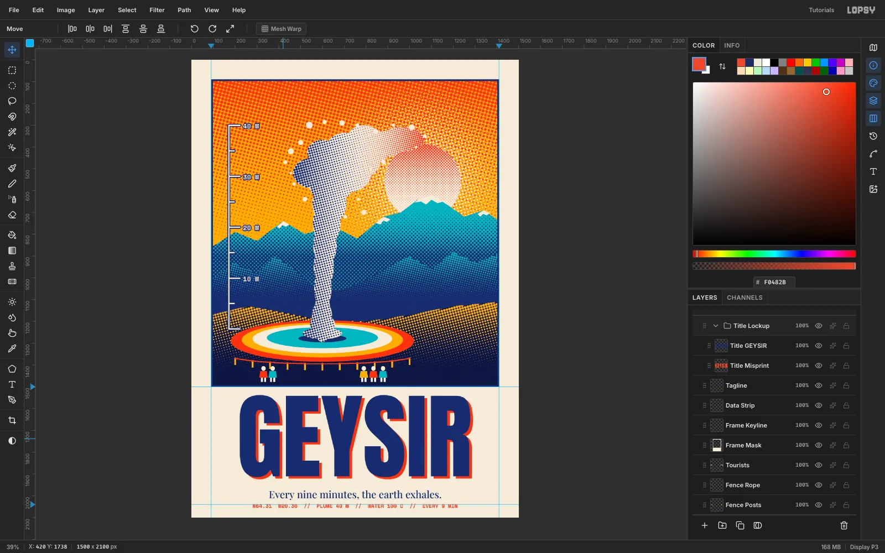

Press [[Cmd+Z]] once. Both halves of the title jump back together. Then
press [[Cmd+Shift+Z]] and they land back where you dropped them, with the
coral copy still offset from the indigo one by the same amount. A group move
is one history step.

## Draw the badge

Select *Frame Keyline* and add a layer called *Badge Disc*. Set the
foreground to cream. With the **Elliptical Marquee**, draw a circle about
200 px across over the top right corner of the picture, overlapping the
frame a little. (You'll pull it inside at the end.) Press **Edit → Fill**.
Don't deselect yet.

## Layer the badge rings

Draw a second circle from the same centre that's 10 px smaller on every side
(about 184 px across) and fill it indigo. Then draw a third that's 12 px
smaller again on every side (about 160 px across) and fill it coral.
Deselect. Three concentric fills give the cream, indigo
and coral rings of a printed seal.

## Letter the badge

Select *Badge Disc* and, using the **Text** tool, click on an empty part of
the canvas for each of three labels, so you don't hit another text's box.
Make *EVERY* in **Space Mono** Bold 22, a big *9* in **Anton** at size 100, and
*MINUTES* in Space Mono Bold 22, all in cream. Then select each text layer and
drag it with the **Move** tool onto the disc. Fine-tune with the arrow keys
([[Shift]] moves 10 px) until *EVERY* sits above the *9* and *MINUTES* below
it, all centred on the disc.

Keep the nudges few. Every arrow press adds a history step, so a long run of
them is slow. Drag close first, then tap.

## Merge the badge

Text can't be rotated cleanly once it's merged, so merge first. Select
*MINUTES*, which sits directly above *Badge Disc*, click **Rasterize Layer**
at the bottom of the Layers panel, then choose **Layer → Merge Down**. Do
the same with *9* and then *EVERY*. Each label sinks into *Badge Disc*, which
now holds the whole badge. Drag a **Rectangular Marquee** around the badge, pick the
**Move** tool, and the transform handles appear.

## Rotate the badge

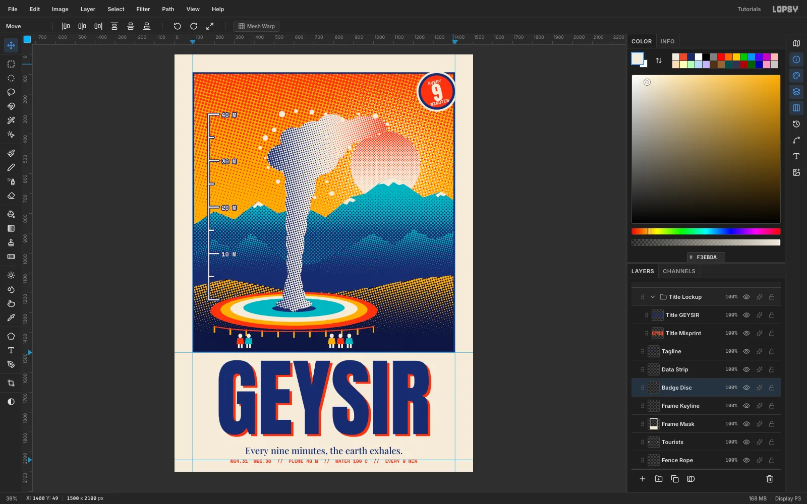

Move the pointer just outside a corner handle until the cursor changes to the
rotate icon. Drag counter-clockwise by about 14 degrees. Release, and press
[[Cmd+D]] to commit and deselect. A badge a little off-level always looks
more hand-stamped than one that's straight.

## Tighten the layout and finish

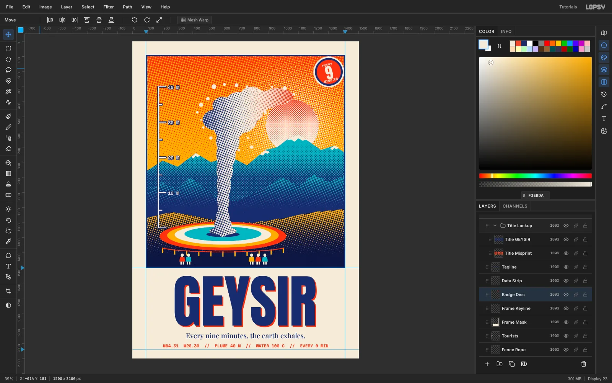

Make a last pass, because the title is a little too big and crowds the
bottom. Select *Title GEYSIR* with the **Text** tool and set the **Size** to
**380**, then do the same for *Title Misprint* and set the data strip to
**28**. With the **Move** tool, nudge the title lockup a little right and
down so it's centred under the picture, lift the tagline up a little, pull
the data strip up so it clears the bottom edge, and pull the badge a little
way down and left, so it sits inside the keyline. Use the arrow keys, and
[[Shift]] with an arrow for a 10 px jump. Then choose
**File → Quick Export PNG** to save the poster.

Zoom in and out one last time and check the dots at 100%. If every
shading layer shares one of two angles (15° and 75°, plus 45° on the sun and
mountain), the screens will look like separate plates and the poster will
feel printed rather than painted.
