Jazz records of the 1950s mostly had the same ingredients on the cover: one strong photo, printed as a coarse halftone in one or two inks, big type, and a lot of empty paper. This tutorial builds an imaginary reissue LP called **GHOST (notes)** in that style.

A *ghost note* is a drum stroke played so quietly you feel it more than hear it. In drum notation it's written in parentheses. That idea runs through the whole cover:

- the drummer's arm leaves a faint cobalt **echo**, like a stroboscopic photo;
- *(notes)* is set in brackets under the title;
- one bar of real **snare notation**, with its ghost notes bracketed, runs across the bottom.

The photo is William P. Gottlieb's 1947 portrait of the drummer **Sid Catlett**. It's in the public domain through the Library of Congress, and you can download it from [Wikimedia Commons](https://commons.wikimedia.org/wiki/File:Sid_Catlett,_New_York,_ca._Mar._1947_%28William_P._Gottlieb_01181%29.jpg).

You'll print it as three "plates", one per ink:

- **Black plate:** the photo as 8 px dots at 45°.
- **Cobalt plate:** the echo of the raised arm, at 15°.
- **Orange plate:** a sun of 16 px dots at 75°.

Using a different screen angle for each ink is what stops the dots from clashing into a moiré pattern. That's the same reason real four-colour printing uses different angles.

Along the way you'll use:

- **Lasso** cut-outs, **Select → Inverse**, **Feather**, **Shrink** and intersecting selections
- **Filter → Halftone**, **Unsharp Mask**, **Brightness/Contrast** and **Add Noise**
- **Color Overlay** and the **Multiply** blend mode for overprinting inks
- [[Cmd]]-click thumbnails to load a layer's shape as a selection, for clean knockouts
- the **Move tool** to scale and rotate, plus copy and paste
- the **Pencil** with [[Shift]]-click lines for the notation
- the **Pen tool** and **text on a path** for the badge
- **guides**, the **grid**, **groups**, and **undo / redo**

The fonts are free Google Fonts:

- **Anton** for GHOST and the 33⅓
- **Instrument Serif** Italic for *(notes)*, plus the regular style for the ghost-note brackets
- **Barlow Condensed** for the name, tracklist, credits and badge

The palette is three inks on newsprint:

- Paper `#EEE4CC`
- Black ink `#1B1A1F`
- Cobalt ink `#2747C9`
- Orange ink `#E8562A`

## Make the newsprint

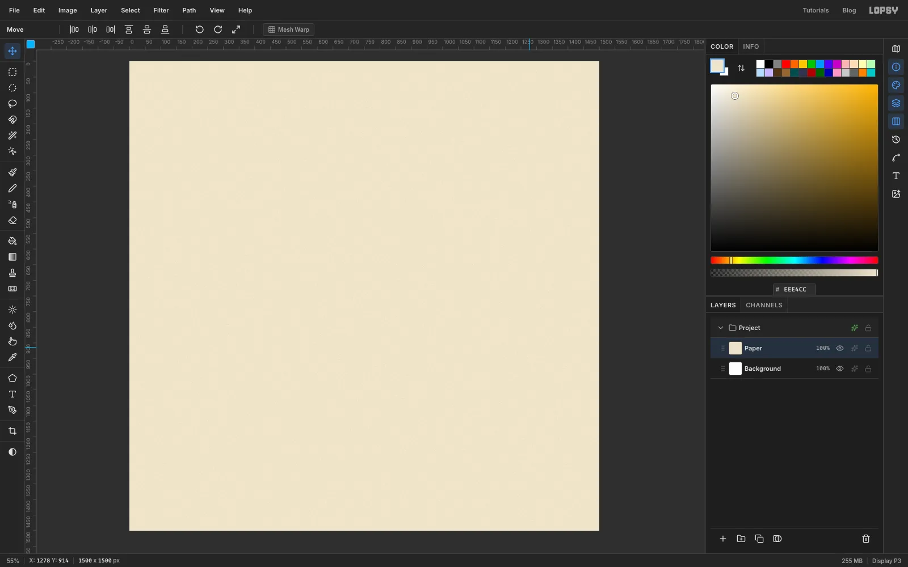

Choose **File → New**, make a **1500 × 1500** px document and click **Create**. Record covers are square, and 1500 px is plenty for the coarse dots you'll use.

Double-click **Layer 1** and rename it *Paper*. Set the foreground colour to `#EEE4CC` and choose **Edit → Fill**. Then run **Filter → Add Noise...** with Amount **20**, **Mono** and **Gaussian**. That gives the cream a faint newsprint grain, so the finished cover looks printed rather than flat.

## Set the margins with guides

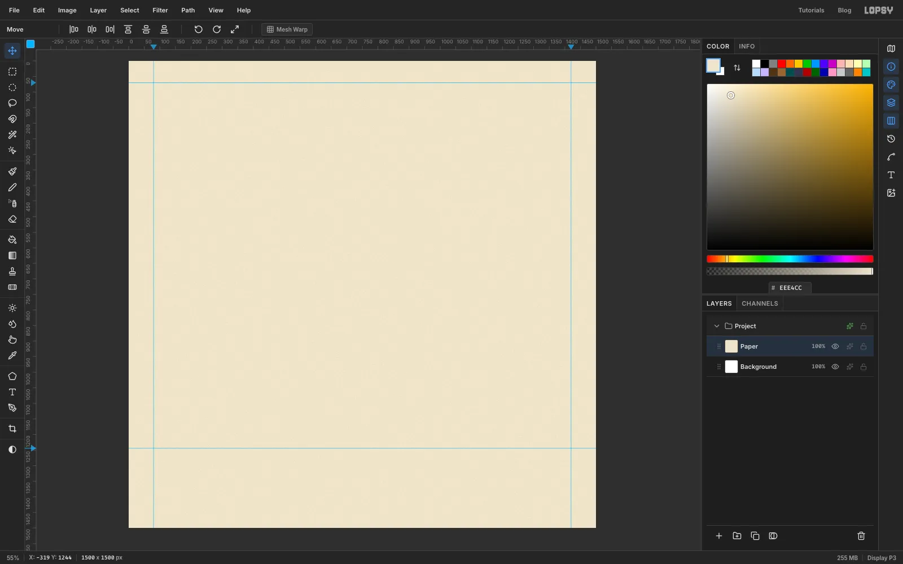

With **View → Show Rulers** on, click once on the top ruler at **80** and again at **1420** to drop two vertical guides. Those are the left and right margins. Then click the left-hand ruler at **70** for the top margin, and at **1244** to mark the top of the black band that will run along the bottom.

Guides are clicks, not drags. To remove one, click the ruler on the same spot.

## Paste in the photo

On the Wikimedia Commons file page, open the 1,024 px preview, copy it and press [[Cmd+V]] in Lopsy. It lands at full size (about 1,024 px wide) in the top-left corner on a new layer. Press [[Cmd+D]] to drop the transform handles, then rename the layer *Drummer*.

## Lasso the drummer

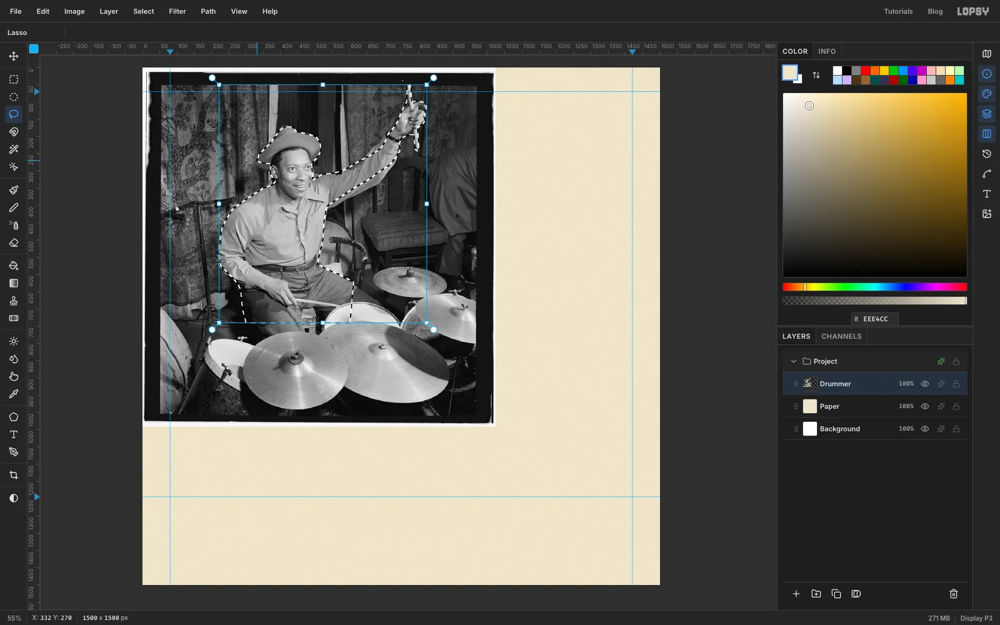

Pick the **Lasso** and trace around the drummer:

- up the edge of the hat;
- along the top of his raised arm;
- around his fist and up and down the stick;
- back down the underside of the arm and his side;
- across his lap just below the hands.

Zoom in to follow the hat brim and the fingers carefully. Leave the cymbals and the background behind. The bottom edge can be a straight line, because the black band will cover it later.

## Cut him out

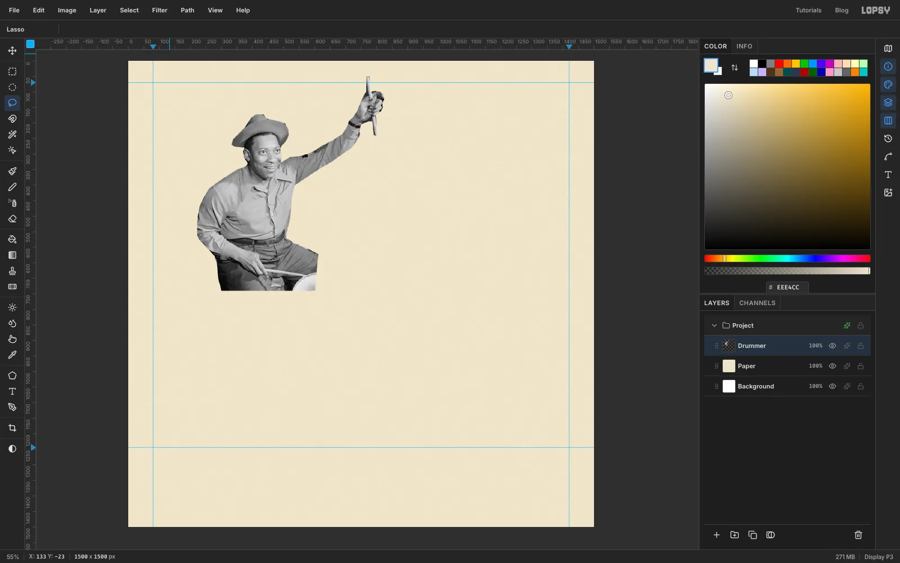

Choose **Select → Inverse**, which selects everything *except* the drummer, and press [[Delete]]. Then [[Cmd+D]] to deselect. Only the drummer is left on the layer.

## Select the face

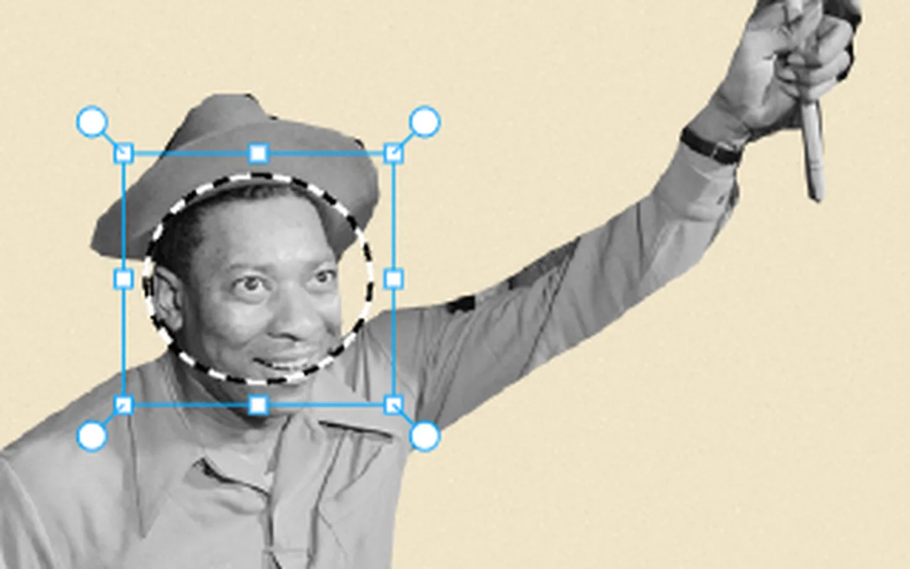

The flash in the original photo has lit Catlett's face so brightly that it would halftone almost blank. You'll put the tone back before turning anything into dots.

Draw an **Elliptical Marquee** around his face, from the hat brim to the chin. Choose **Select → Feather…** and give it **14** px, so the change blends softly into the neck and hat.

## Bring back the skin tone

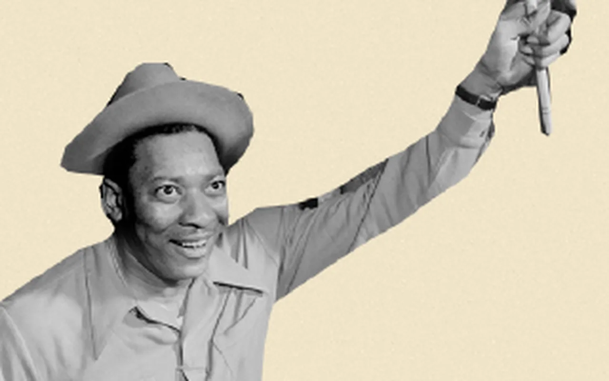

Run **Filter → Brightness/Contrast...** with Brightness **−18** and Contrast **+25**, then deselect.

The face is now a true mid-tone, which halftones to medium dots. Keeping the dark tones dark matters for an honest likeness. If you brighten a dark-skinned face here, the dots will make it look pale.

## Scale him up

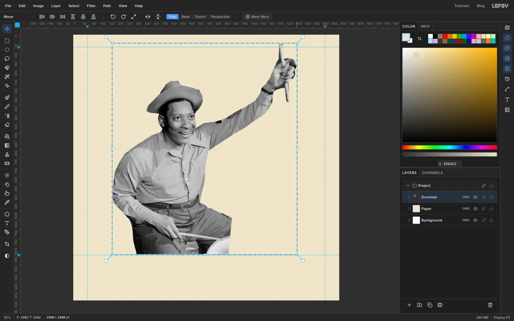

Draw a **Rectangular Marquee** around the whole figure and switch to the **Move tool**. Transform handles appear on the selection.

Hold [[Cmd]] and drag the **bottom-right** handle down and to the right until the drummer is about 1.7 times bigger, roughly 1,040 px wide. Holding [[Cmd]] keeps the proportions. Press [[Cmd+D]] to commit the scale.

## Place him on the page

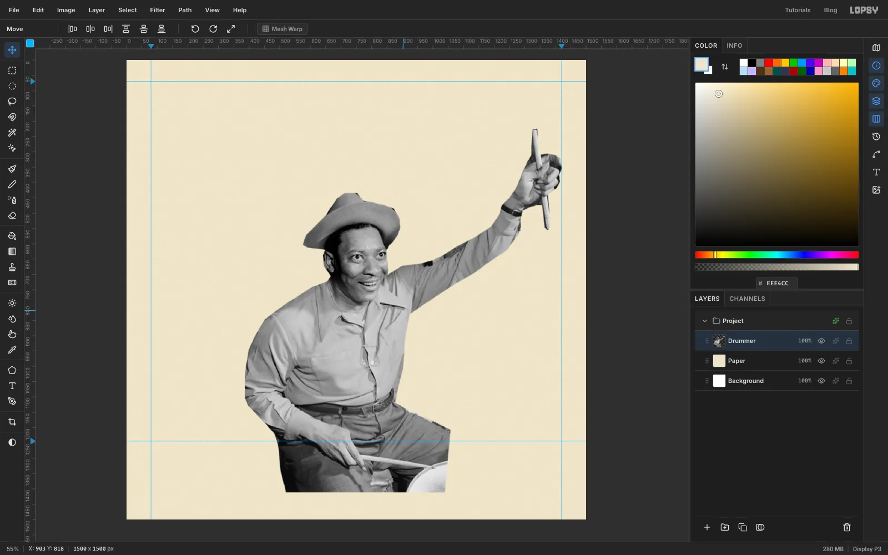

Drag the drummer with the Move tool until:
- his raised fist touches the right-hand guide;
- his hat sits roughly in the middle of the page, a little below where the bottom of the title will be;
- his lap runs below the band guide.

The top of the drumstick ends up well below the top guide. The title will sit behind his hat and fist.

## Start the black plate

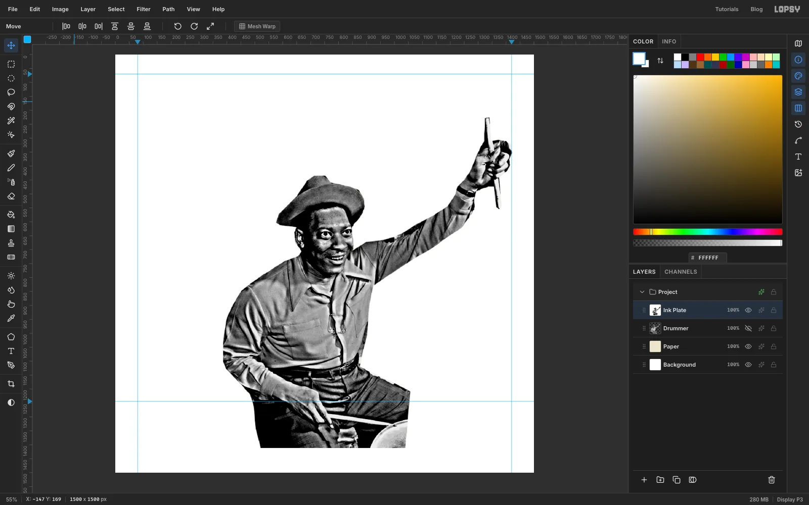

Choose **Layer → Duplicate Layer**, click the copy in the Layers panel, rename it *Ink Plate* and hide the original *Drummer* with its eye icon. Keep the original: you'll use its outline several times.

On *Ink Plate*, run:
1. **Filter → Unsharp Mask...** with Radius **14** and Amount **1.6**, to boost the local contrast that halftones need;
2. **Brightness/Contrast** at **−22 / +30**.

Then [[Cmd]]-click the *Ink Plate* thumbnail to load its outline, choose **Select → Inverse**, set the foreground to white and **Edit → Fill**.

The white surround gives the edges of the figure clean, full-strength dots instead of half-transparent grey ones. Do this fill *after* the tone changes, so the white stays pure white.

## Turn it into dots

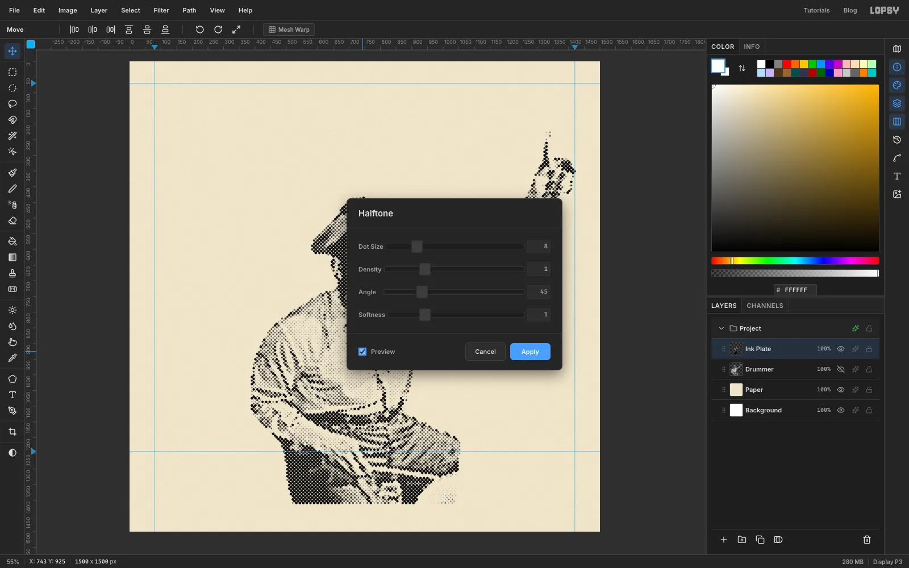

Choose **Filter → Halftone...** and set:
- **Dot Size** to 8;
- **Angle** to 45;
- **Softness** to 1.

Tick **Preview** to check the face, then click **Apply**.

Dark areas become fat dots that run together, and light areas become pinpricks. 45° is the classic angle for the black plate.

## Clear the white area

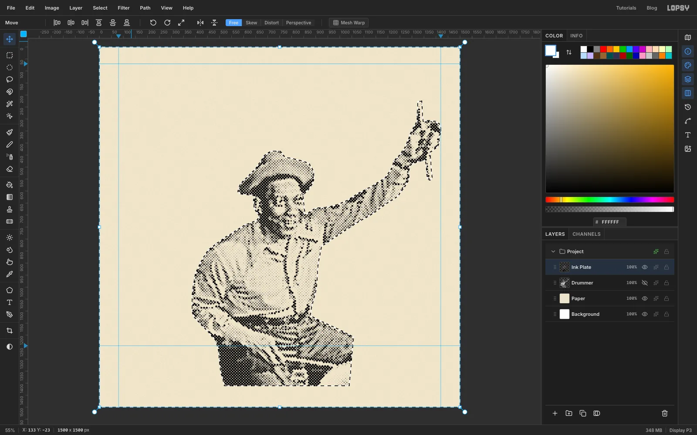

Halftone leaves a faint speck in the middle of every white cell, so the white surround is now covered in a light dot screen. To clear it, [[Cmd]]-click the hidden *Drummer* thumbnail, choose **Select → Inverse**, click *Ink Plate* and press [[Delete]].

## Ink the black plate

Deselect. Click the effects (fx) icon on the *Ink Plate* row in the Layers panel to open the Layer Effects drawer. Turn on **Color Overlay** and set it to `#1B1A1F`, then set the drawer's **Blend** dropdown to **Multiply**. Every dot is now one flat ink colour. On Multiply, the black dots overprint anything you put underneath them, the same way real ink does.

## Isolate the raised arm

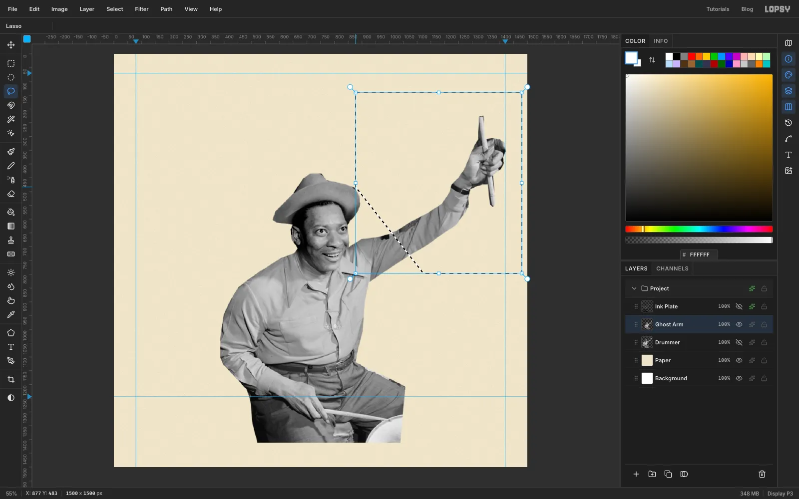

Now for the echo. Duplicate the *Drummer* layer again, click the copy, rename it *Ghost Arm*, and hide *Drummer* and *Ink Plate* while you work.

With the Lasso, draw a shape around the raised forearm, fist and stick. Cut across the upper arm near the shoulder, and leave plenty of room around the stick. Then **Select → Inverse** and [[Delete]], so only the arm is left.

## Swing the arm down

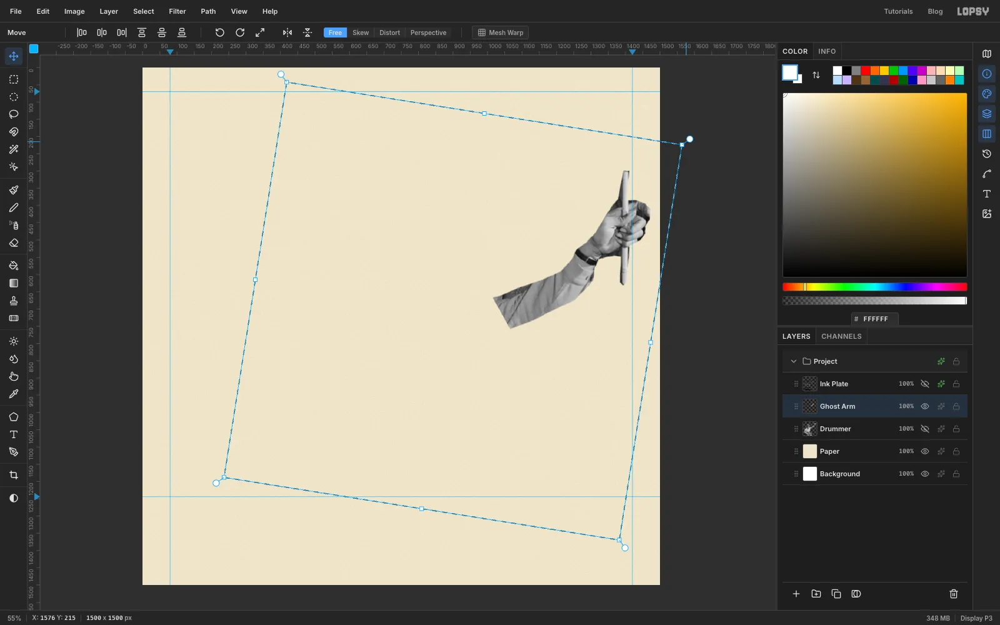

A stroboscopic photo shows the same arm at several points in its swing. To swing this one around the shoulder, draw a big square **Rectangular Marquee** centred on the shoulder. With the Move tool, transforms rotate around the centre of the selection, so the shoulder becomes the pivot.

Grab the round rotate handle just outside the top-right corner and drag clockwise about **9°**, then press [[Cmd+D]].

## Fade the cut end

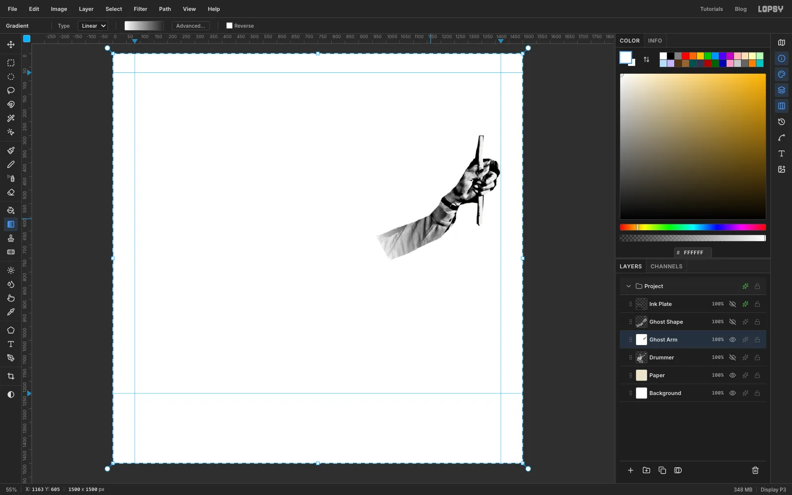

An echo should fade out towards the shoulder rather than stop at a hard cut. Here's how:
1. Duplicate *Ghost Arm*, name the copy *Ghost Shape* and hide it. You'll use its outline in a moment.
2. On *Ghost Arm*, repeat the Unsharp Mask and Brightness/Contrast settings from the black plate, then fill the surround white the same way.
3. In the **Gradient** tool's **Advanced...** editor, make a two-stop gradient from white at full opacity to white at zero opacity.
4. Choose **Select → All**, then drag the gradient from the cut end of the sleeve about a third of the way up the arm.

The sleeve now fades to white. White prints no dots, so the echo will dissolve into smaller and smaller dots. (The white surround hides the paper for now; it goes away in the next step.)

## Ink the cobalt echo

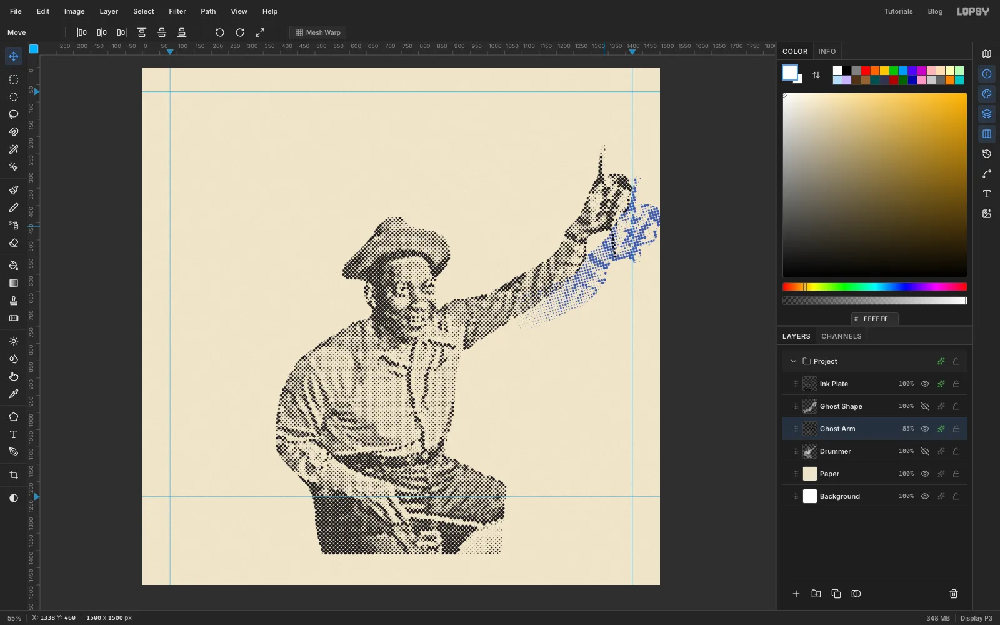

This is the same routine as the black plate, with a different angle and ink:

1. Run **Halftone** with Dot Size **8**, Angle **15** and Softness **1**.
2. [[Cmd]]-click the *Ghost Shape* thumbnail, choose **Select → Inverse**, click *Ghost Arm* and press [[Delete]] to clear the specks. Deselect.
3. Open the arm's Layer Effects drawer, turn on a **Color Overlay** of cobalt `#2747C9` and set **Blend** to **Multiply**.
4. Set the layer's opacity to **85%**, and show *Ink Plate* again.

The echo should read as a second, lower position of the arm, not a misprint. With the Move tool, drag *Ghost Arm* to the right until its hand runs off the edge of the cover. Then marquee the bit of stick that pokes out below the echo fist and delete it, because on its own it looks like a drip.

## Paint the sun

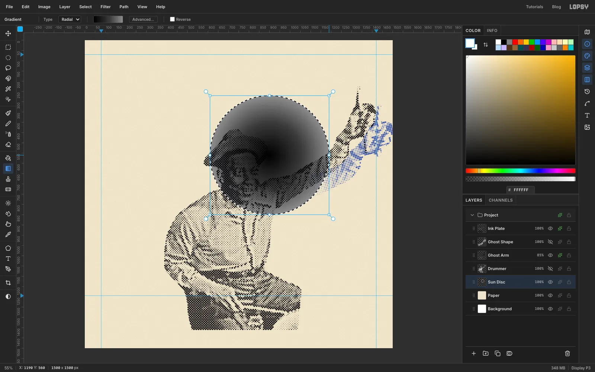

Click *Paper* and add a new layer above it called *Sun Disc*.

In the Gradient tool's **Advanced...** editor, set three stops:
- black at the left end;
- `#3A3A3A` at about 55%;
- `#8C8C8C` at the right end.

Set the type to **Radial**.

Draw an Elliptical Marquee circle about 580 px across, centred just right of the drummer's head. Keep its left edge clear of the text column. Drag the gradient from the centre of the circle to its edge.

Ending on grey rather than white gives the sun a crisp round rim of medium dots instead of fading away.

## Dot the sun

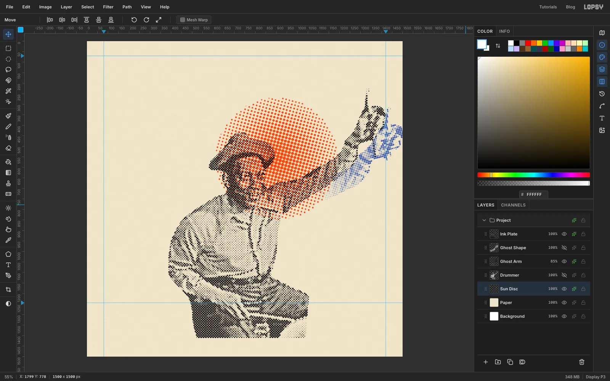

Deselect and run **Halftone** with Dot Size **16** and Angle **75**. Add a **Color Overlay** of orange `#E8562A`.

With the Move tool, nudge the layer two pixels right and one up with the arrow keys. Real presses never line their plates up perfectly, and that tiny misregistration is part of the look. Where the black dots cross the orange, you get overprint for free.

## Select behind the head

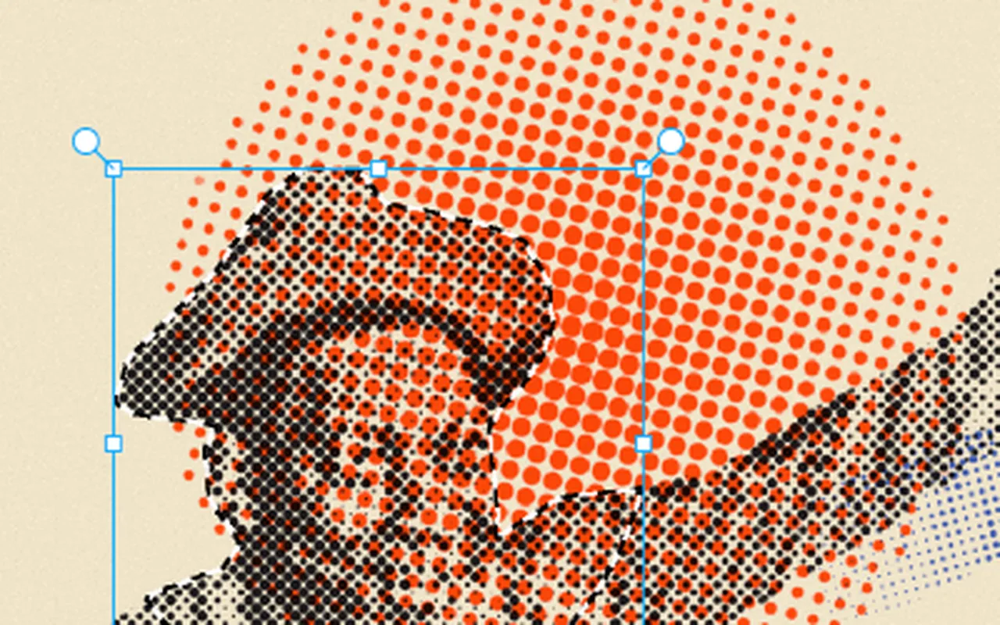

With orange dots behind his face, he looks speckled. The fix is a *knockout*: remove the orange ink under the head only.

1. [[Cmd]]-click the *Drummer* thumbnail to load his whole outline.
2. Pick the **Elliptical Marquee**, hold [[Shift]] and [[Alt]], and drag an oval around his hat and face, down to the collar.

[[Shift]]+[[Alt]] *intersects*, so you're left with just the head part of the silhouette.

## Knock out the head

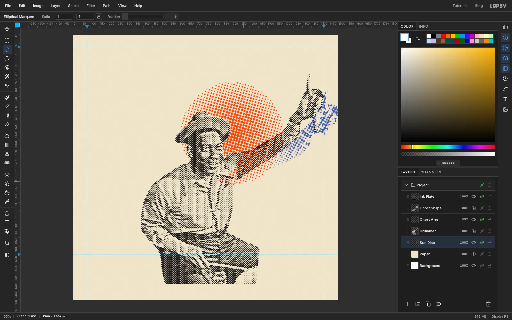

Click *Sun Disc* and press [[Delete]], then deselect. His face now prints on clean paper inside an orange halo, while his shoulder and arm still overprint the sun.

## Set the title

Click *Sun Disc* so the new type lands just above it in the layer stack.

Pick the **Text** tool and set:
- font **Anton**, size **586**;
- colour `#1B1A1F`.

Click in an empty spot near the top and type **GHOST**, then press [[Tab]] to commit. Switch to the Move tool and drag it so its left edge sits on the left guide and its top on the top guide, then fine-tune with the arrow keys. At this size it runs right across to the right guide.

Rename the layer *Title GHOST*. Click **Rasterize Layer** at the bottom of the Layers panel, then run **Add Noise** at **10** so the solid black has a little ink texture too.

## Knock the drummer out of the title

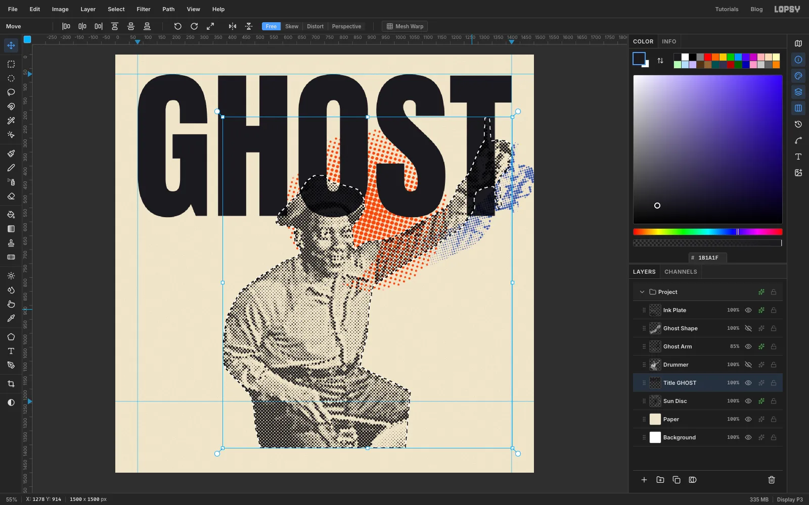

The drummer should sit *in front of* the title, with his hat breaking into the O and S and his fist into the T. [[Cmd]]-click the *Drummer* thumbnail again, click *Title GHOST* and press [[Delete]] to knock his silhouette out of the letters. Then deselect.

## Delete the stray T stem

One piece of the T's stem is left floating below his wrist, where it reads as a stray black block. Drag a Rectangular Marquee over that part of the stem, from the wrist down to the baseline, and press [[Delete]].

## Check the knockout

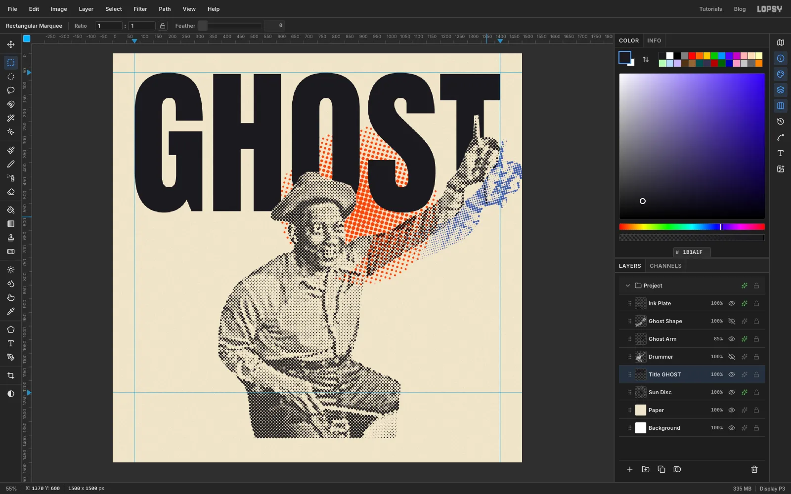

Deselect and look at the edges. The letters should stop crisply at his outline, with no dots showing through. The word still reads as GHOST, and the drummer now sits in front of it.

## Add (notes)

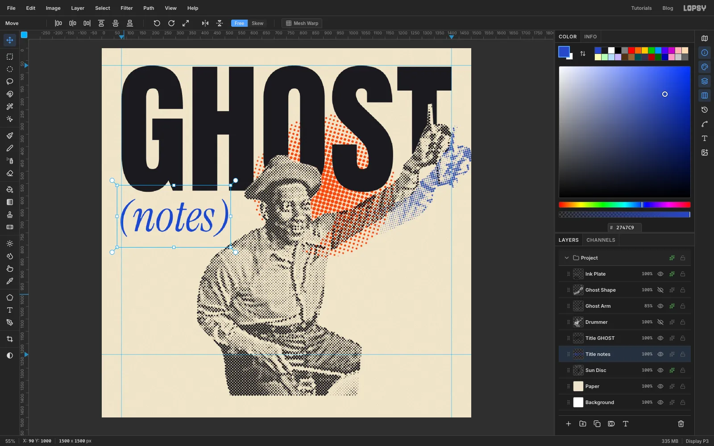

Click *Sun Disc* again. In the Text tool, choose **Instrument Serif**, set **Font style** to **Italic**, size **180**, colour cobalt `#2747C9`, and type **(notes)** in an empty spot. Rename the layer *Title notes*.

Place it under the G about 30 px below GHOST. Let the opening bracket hang a few pixels past the left guide: round and slanted shapes look indented if they sit exactly on the line.

## Add the name and tracklist

The leader's name is the second thing a jazz fan looks for. Click *Sun Disc*, then set **BIG SID CATLETT** in **Barlow Condensed**, **Bold**, size **54**, black. Give it Letter spacing **2** in the Text panel, rename the layer *Leader*, and place it on the left guide about 40 px under *(notes)*.

For the tracklist, click *Sun Disc* again and set Barlow Condensed **SemiBold** at size **22**, Letter spacing **1** and Line height **1.82**, which gives 40 px between lines. Type the seven titles in black as one text layer, each on its own line, and rename it *Tracks*:

1. BRUSH FIRE
2. RIMSHOT WALTZ
3. PARADIDDLE FOR PEARL
4. GHOST NOTES
5. FOUR ON THE FLOOR
6. THE QUIET HAND
7. BACKBEAT, NEW YORK

Then set the numbers **01** to **07**, one per line, as a second text layer in Barlow Condensed **Bold**, size **22**, Line height **1.82**, in orange `#E8562A`, and rename it *Track Numbers*. Matching the size and line height keeps every number level with its title. Put the numbers on the left guide and the titles about 12 px to their right.

Keep the longest title at least 70 px clear of the drummer's elbow.

## Group and move the tracklist

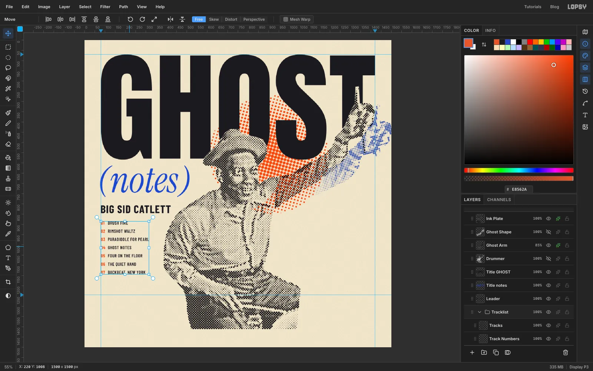

Click *Track Numbers*, [[Shift]]-click *Tracks* and choose **Layer → Group Layers**. Rename the group *Tracklist*.

With the group selected, drag it with the Move tool so the list starts about 40 px under the name. Both columns move together and stay aligned.

## Lay down the black band

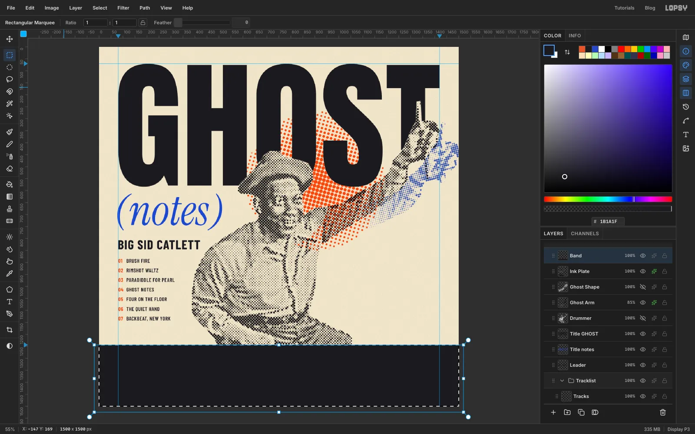

Click *Ink Plate* and add a layer called *Band* above it, so the band covers the bottom of the photo.

Drag a Rectangular Marquee from just off the left edge of the canvas at the band guide to beyond the bottom-right corner. It snaps to the guide. Fill it with `#1B1A1F` and run **Add Noise** at **10**, just as you did on the title.

## Draw a notehead

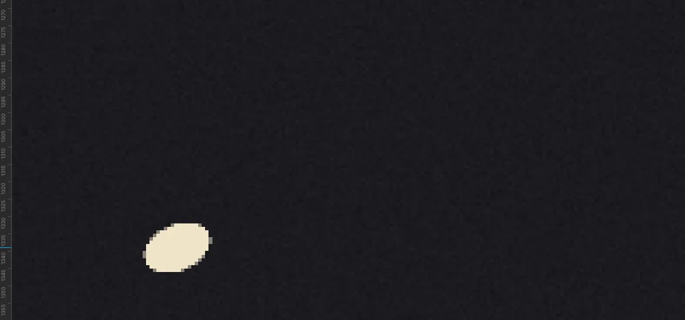

Add a layer called *Notation* above *Band*. Zoom right in on the left end of the band.

With the Lasso, draw a small tilted oval, about 20 px wide and 14 px tall, slanting up to the right like a printed notehead. At this zoom it's an easy shape to trace. Fill it with the paper colour `#EEE4CC` and deselect.

## Copy it into a beat

Marquee the notehead, then press [[Cmd+C]] and [[Cmd+V]]. The copy pastes in place on a new layer. Drag it with the Move tool about **74 px** to the right, and choose **Layer → Merge Down**.

Do it twice more, so you have four heads for one beat of sixteenth notes.

## Add stems and beams

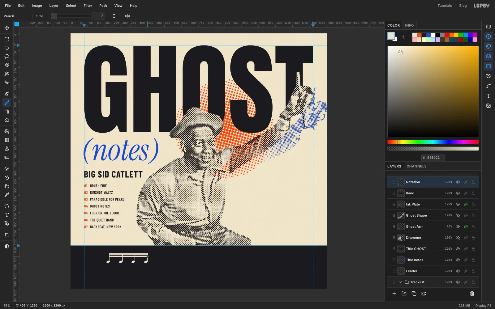

Pick the **Pencil** at size **3**. For each notehead, click just right of the head, then hold [[Shift]] and click about 46 px straight above it. That draws a straight stem.

Switch the Pencil to size **7** and draw two beams the same way, joining the tops of the four stems. Two beams mean sixteenth notes.

## Bracket the ghost notes

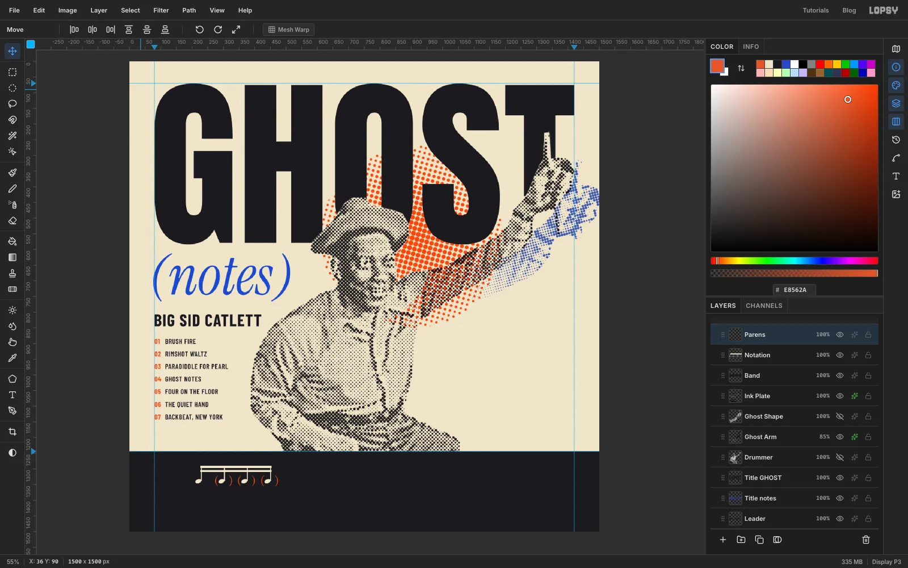

Drummers write ghost notes in parentheses. The groove here is the classic one: a normal stroke on the beat and three quiet ones in between.

Click *Notation*, pick the Text tool and click in an empty part of the canvas. Type `(    )` (a bracket, four spaces, a bracket) in **Instrument Serif** regular, size **40**, orange. Rasterize it and rename the layer *Parens*.

Move it so the brackets hug the second notehead and its stem. Then copy it, paste a copy onto the third head and another onto the fourth, and **Merge Down** each copy so all the brackets stay on *Parens*.

## Copy the beat across the bar

Marquee the whole beat on the *Notation* layer and copy it. Paste it three times, moving each copy about **295 px** further right (the width of one beat), and Merge Down each one. Then do the same on the *Parens* layer. You now have a full 4/4 bar.

## Draw the staff

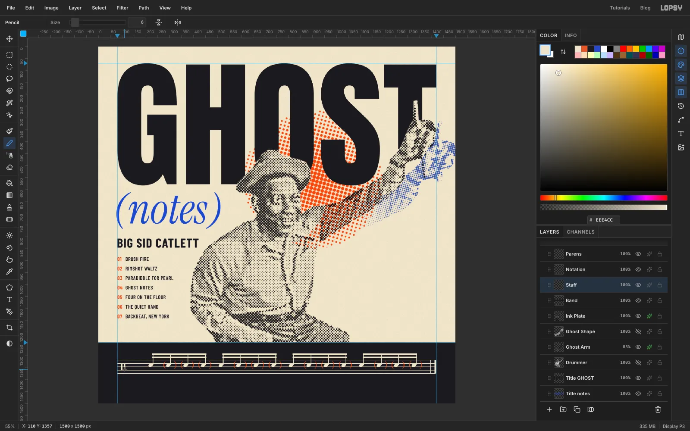

Add a *Staff* layer just above *Band*, so the lines sit behind the notes. With the Pencil at size **2**, [[Shift]]-click five lines **14 px** apart, from the left guide to the right guide. Place them so the noteheads sit in the third space up, which is where snare drum is written.

Add a thin final barline at size **2** just before the end, then a thick one at size **7** right at the end. Finally, at size **6**, draw two short upright bars across the middle two spaces at the start of the staff. That's the percussion clef.

## Finish the notation

Finish the bar:
- **Accents:** on the *Notation* layer, with the Pencil at size 3, draw two [[Shift]]-click strokes to make a small `>` under the first note of beats two and four. Those are the backbeats.
- **Time signature:** set a **4** in Anton at size 32 in cream, rasterize it and rename it *Time Sig*. Move it just right of the clef so it fills the top two spaces, then copy and paste a second 4 into the bottom two spaces and Merge Down.

The bar now really is snare drum notation: a backbeat groove with ghost notes in between.

## Add the credits

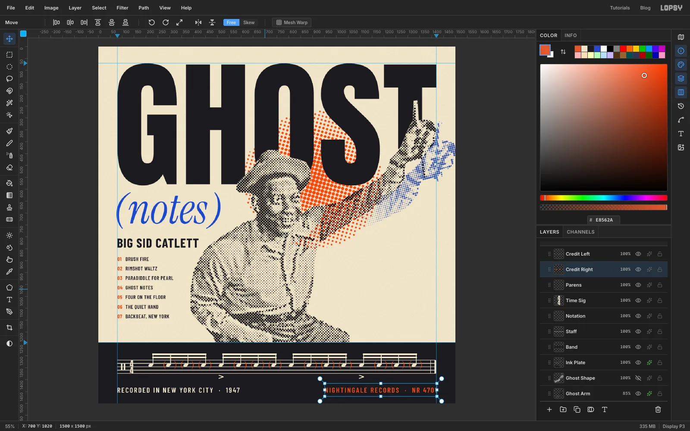

In **Barlow Condensed SemiBold**, size **30**, Letter spacing **4**, set:
- **RECORDED IN NEW YORK CITY · 1947** in cream, starting on the left guide;
- **NIGHTINGALE RECORDS · NR 4701** in orange, ending on the right guide.

Seat both lines so the space below them matches the space above the beams, about 45 px each.

## Make the badge

Add a *Badge* layer above *Ink Plate*. Draw a circle with the Elliptical Marquee, about 176 px across. Line its right edge up with the right guide and its bottom with the last line of the tracklist. Then:
1. fill it with cobalt;
2. choose **Select → Shrink…** by **7** and fill with cream;
3. shrink by **3** more and fill with cobalt again.

That leaves a thin cream ring just inside the edge. Add two small cream dots at 3 and 9 o'clock with tiny elliptical selections.

## Draw the top arc

Pick the **Pen tool**. You'll draw the arc in three click-drags, each one dragging in the direction the text should travel:
- start at about 10 o'clock, a little inside the cream ring, and drag up and to the right;
- at 12 o'clock, drag straight to the right;
- at about 2 o'clock, drag down and to the right.

Click the ✓ on the options bar to commit the path. Don't press [[Enter]]: that strokes the path onto the active layer. Shorter drags give flatter curves.

## Draw the bottom arc

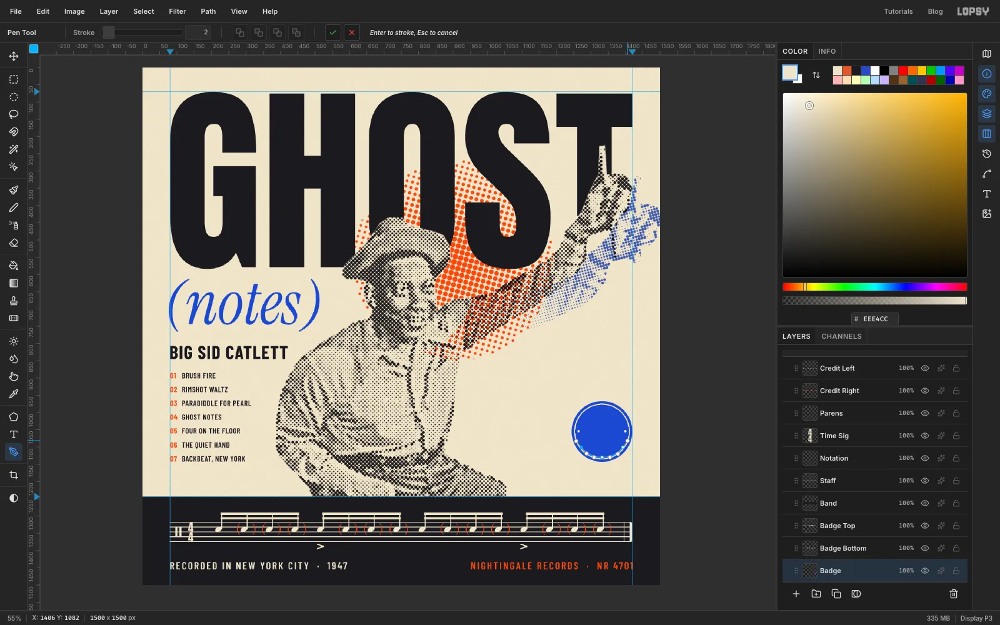

Text runs along a path in the direction it was drawn. If the bottom text followed the circle clockwise, it would be upside down. So draw the bottom arc **left to right** under the centre:
- start at about 8 o'clock and drag down and to the right;
- at 6 o'clock, drag straight to the right;
- at about 4 o'clock, drag up and to the right.

Make this arc slightly bigger than the top one. The letters will stand *on* it, pointing inwards, so they fill the same ring as the top text. Commit it with ✓.

## Put the text on the arcs

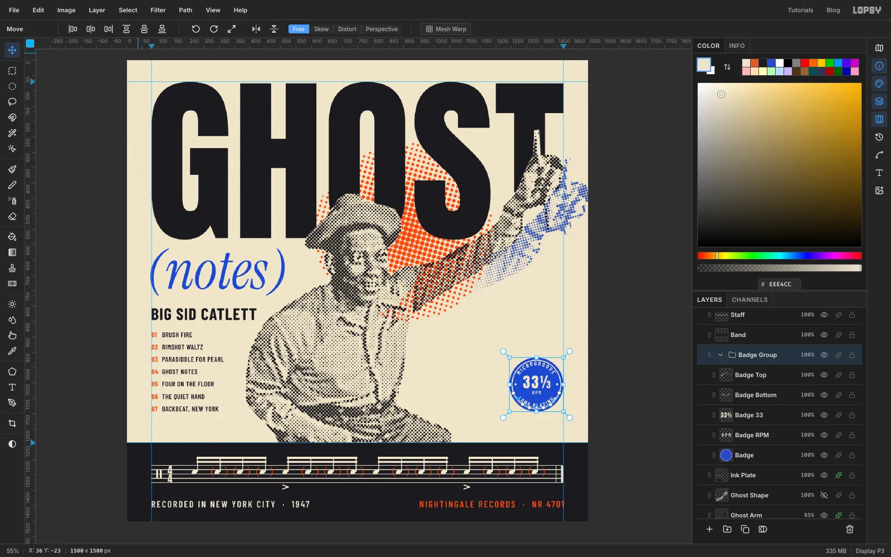

Click *Badge*, then type **MICROGROOVE** and **LONG PLAYING** as two separate text layers in Barlow Condensed SemiBold, size **18**, Letter spacing **4**, cream, anywhere for now.

Click the MICROGROOVE layer, pick the Text tool and choose the first path in the **Text path** dropdown on the options bar. Do the same for LONG PLAYING with the second path.

Both words should be centred on 12 and 6 o'clock. If one isn't, drag its arc's first anchor with the Pen tool until it is.

In the middle, set **33⅓** in Anton at size **48**, with **RPM** in Barlow Condensed at size **16** underneath, both cream and centred. Then select all the badge layers, group them, and deselect the path in the Paths panel.

## Check the layout on the grid

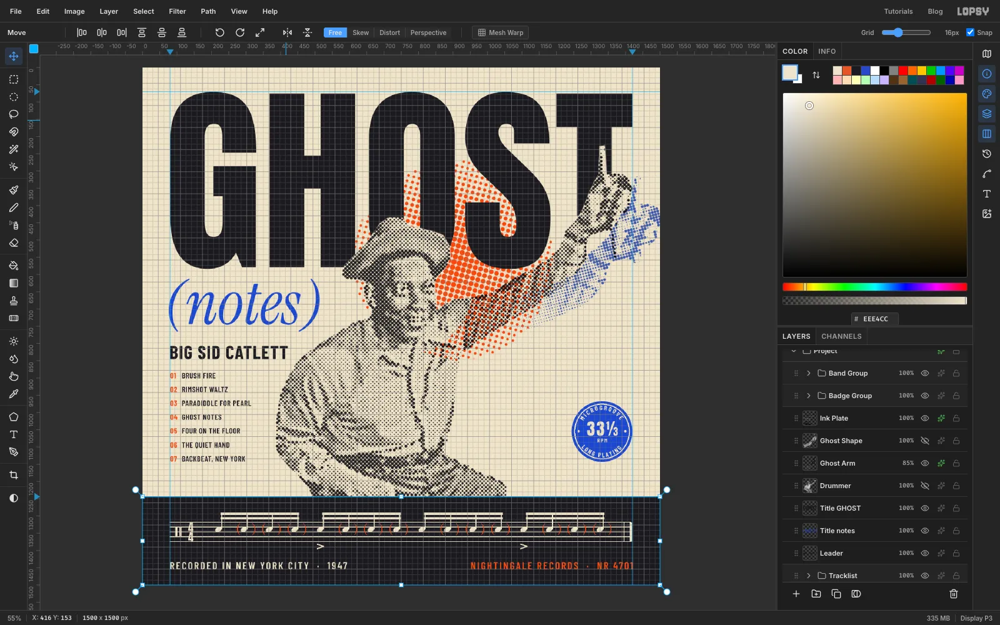

Group the band, staff, notation and credit layers too, and collapse the groups to tidy the Layers panel.

Then turn on **View → Show Grid** for a last alignment check. Look for:
- the left edges of GHOST, *(notes)* (allowing for the bracket's overhang), the name, the tracklist and the band credits all on the same line;
- the badge and the right-hand credit on the right guide.

Turn the grid off again. As a last check, press [[Cmd+Z]] ten times and then [[Cmd+Shift+Z]] ten times: you should step back through the grouping and the badge and land on exactly the same cover.

Save with **File → Save Project**, then export with **File → Quick Export PNG**.
