Vernacular design is the everyday lettering of roadside America: shack menus,
bait-shop boards and hand-painted arrows, made by sign painters rather than
design studios. It looks bold and a little crooked. Every letter carries a hard
"shade" block, the colours are plain enamel, and sun and rain have
worn the paint back to bare wood.

In this tutorial you'll paint a 1000 × 1400 menu board for an imaginary Louisiana
crawfish shack, **Bayou Lunch**. You'll make wood grain from the Fibers filter,
peel turquoise paint away with Clouds and Threshold, and letter an arched header
sign. Then you'll draw a naive crawfish mascot with the Symmetry brush and set
two menu boards with dot-leader prices. On the way you'll use filters, the Magic
Wand, Select → Shrink, the Burn tool, copy and paste, transforms, groups, grid
snapping, layer effects and a group adjustment.

The palette has six enamel colours:

- Turquoise paint `#3A9C94`
- Sign red `#C23A2B`
- Cream `#F1E4C0`
- Mustard `#F4B63A`
- Crawfish red `#CF4A2E`
- Shade brown `#2A120C`

Fonts: **Sancreek** for the header, **Yellowtail** for the scripts,
**Alfa Slab One** for the headings, **Caveat Brush** for the menu items and
**Permanent Marker** for the plaque.

## Grow wood grain with Fibers

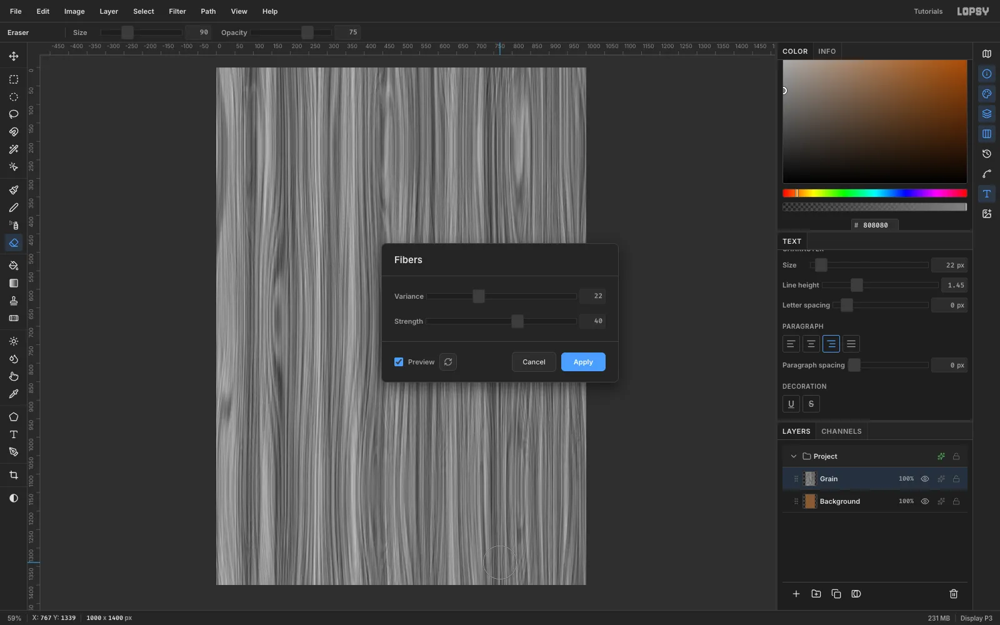

Choose **File → New** and make a **1000 × 1400** document with a white background.

1. Select the **Background** layer, set the foreground colour to `#8A5A34` and
   choose **Edit → Fill**. This is the raw plywood colour.
2. Rename `Layer 1` to **Grain**. Fill it with mid grey `#808080`, then open
   **Filter → Fibers…** and set **Variance 22** and **Strength 40**. High
   Strength keeps the strands long and straight, like sawn boards.
3. Click **Apply**. Open the layer's effects (the ✦ button on its row) and set
   **Blend** to **Multiply**. The grey fibers now darken the brown into grain.

> **Tip:** Fibers is randomized. Click the circular **Regenerate** arrow in the
> dialog until the strands look right before you apply.

## Mark the plank seams with guides

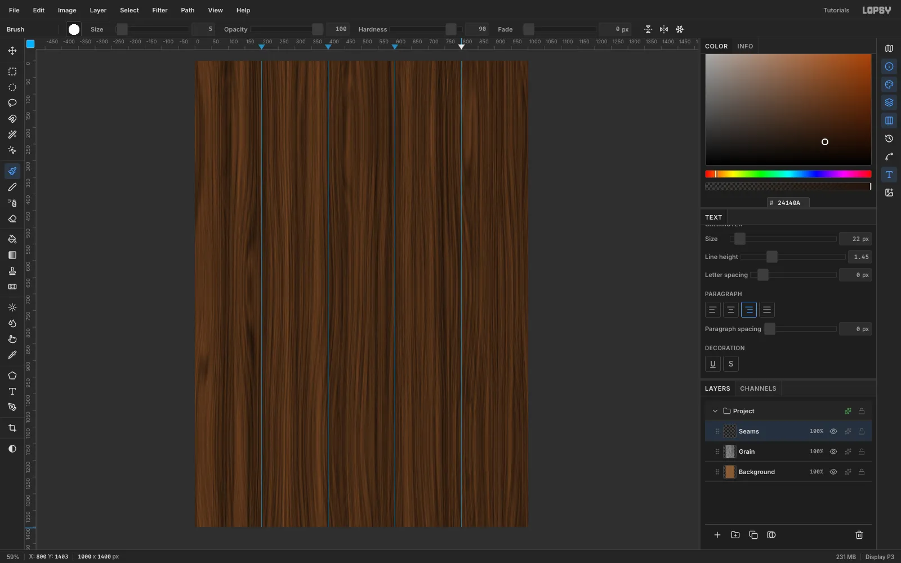

Plywood signs are built from planks. Click the top ruler at **200**, **400**,
**600** and **800** to drop four vertical guides.

Add a layer called **Seams** and pick the **Brush** with Size **5**,
Hardness **90** and colour `#24140A`. For each guide, click at the top of the
canvas, hold [[Shift]] and click at the bottom. Shift-click draws a perfectly
straight line between the two points.

When the seams are done, turn guides off again with **View → Show Guides**.

## Start a paint-wear map with Clouds

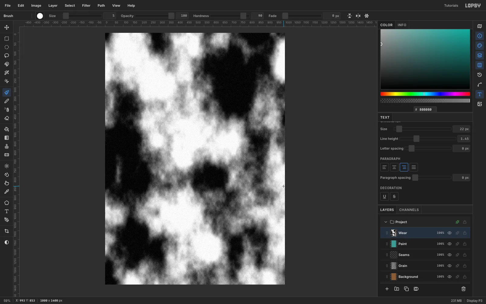

Add a layer called **Paint** and fill it with turquoise `#3A9C94`. It covers
the wood completely for now.

Add another layer above it called **Wear** and fill it with `#808080`. Then:

1. **Filter → Clouds…** with **Scale 7**, then **Apply**.
2. **Filter → Add Noise…**, choose **Mono**, set **Amount 45**, then **Apply**.
   The noise gives the peeled edges a ragged, flaky border.

This greyscale layer is a map. The darkest patches will become places where the
paint has flaked off.

## Protect the middle with a soft white brush

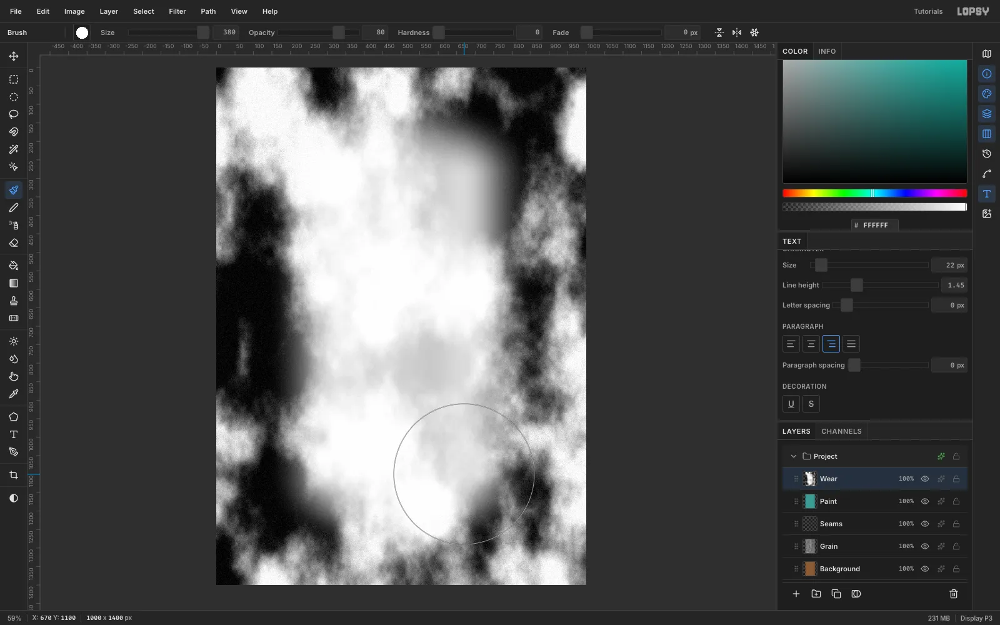

On a real board, paint wears worst at the edges and seams, where the weather
gets in. Choose the **Brush** with colour white, Size **520**, Hardness **0** and
Opacity **80**. Paint one long vertical stroke down the centre. Then set Size
**380** and paint one stroke down each side, around x 330 and x 670.

The middle of the map is now light, so it will keep its paint.

## Threshold the map into hard peel shapes

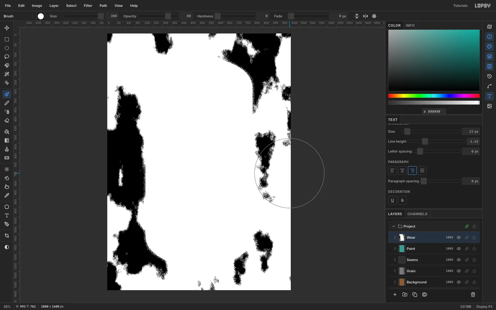

Choose **Filter → Threshold…**, set **Level** to **60** and click **Apply**.
Everything darker than the level turns black, and everything else turns white.
You now have crisp peel shapes that cluster around the edges.

## Select the peel with the Magic Wand

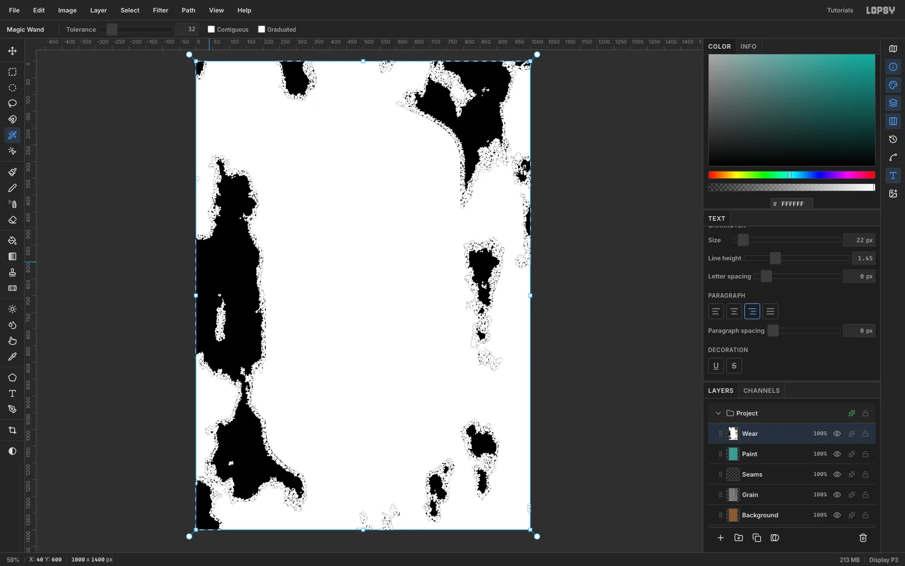

Pick the **Magic Wand** and **untick Contiguous**, so one click selects every
black patch at once. Click any black area near the left edge.

Hide the **Wear** layer with its eye icon. Select the **Paint** layer and press
[[Delete]]. The turquoise is removed wherever the map was black, and the plywood
shows through. Press [[Cmd+D]] to deselect.

## Soften the paint and let the grain through

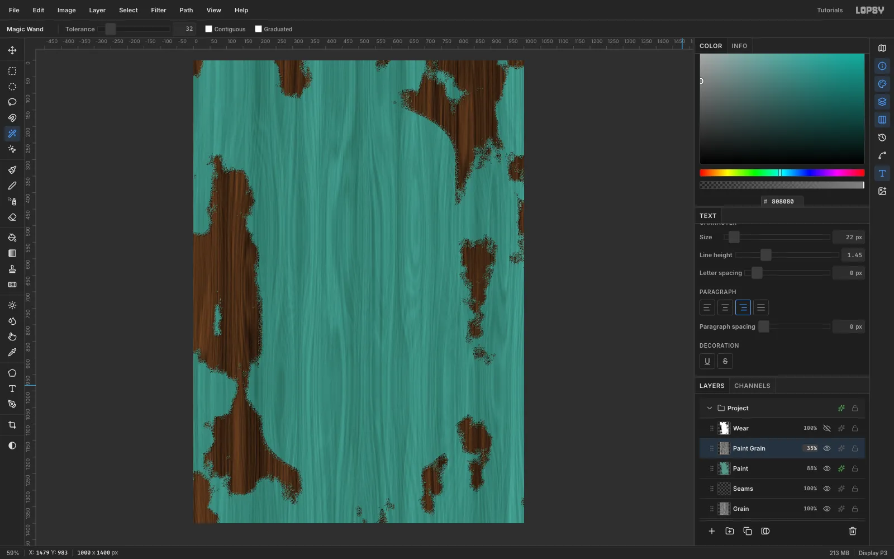

Freshly filled paint looks like plastic, so age it:

1. With **Paint** selected, choose **Filter → Hue/Saturation…** and set
   Hue **−6**, Saturation **−38** and Lightness **+4**.
2. Lower the layer's opacity to **88%** so a whisper of wood grain shows through.
3. In the layer effects, turn on **Drop Shadow** with colour `#1A0E06`, Offset
   **3 / 3**, Blur **2** and Opacity **70**. That tiny shadow gives each peeled
   edge the thickness of old paint.
4. Add a layer **Paint Grain**, fill it with `#808080`, run **Fibers**
   (Variance **30**, Strength **24**), set its blend mode to **Overlay** and
   its opacity to **35%**. Now the paint has brush streaks.
5. Add a layer **Grooves** and repeat the four shift-click seam lines with
   Size **3** and colour `#1E2A26`, at **55%** opacity. The seams now show
   *through* the paint as grooves.

## Cut the arched header sign

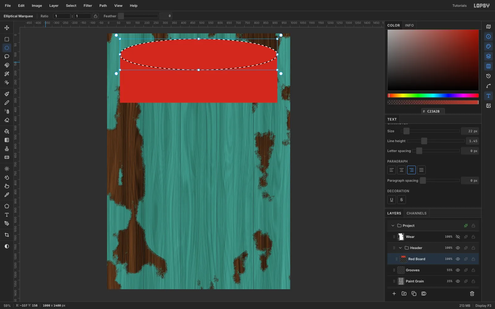

Click **New Group** in the Layers panel and name it **Header**. Inside it, add a
layer called **Red Board** and set the foreground to sign red `#C23A2B`.

1. With the **Rectangular Marquee**, drag from **70, 110** to **930, 380** and
   choose **Edit → Fill**.
2. With the **Elliptical Marquee**, drag from **70, 30** to **930, 200** and fill
   again. The ellipse caps the rectangle with an arch.

## Paint a pinstripe with Select → Shrink

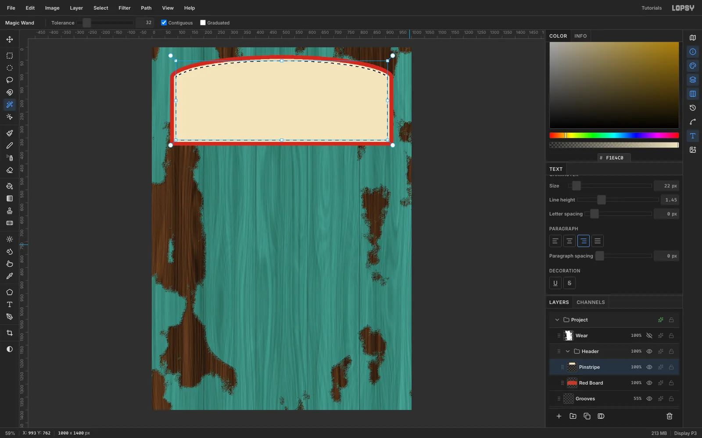

Sign painters frame every panel with a thin pinstripe. You can build one from
the board's own shape:

1. Pick the **Magic Wand**, tick **Contiguous** again, and click inside the red
   board. This selects the arch shape exactly.
2. Choose **Select → Shrink…** and enter **14** px.
3. Add a layer **Pinstripe** and fill the selection with cream `#F1E4C0`.
4. Choose **Select → Shrink…** again with **6** px, then press [[Delete]].

Only a 6 px cream ring is left, inset 14 px from the edge.

## Letter BAYOU with a sign-painter shade

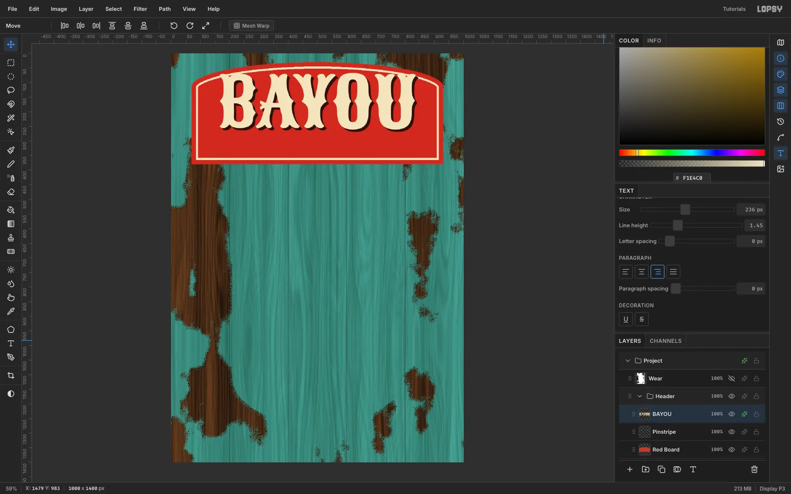

Select the **Pinstripe** layer first, so the new type isn't styled from another
text layer. Pick the **Text** tool, set **Sancreek** at **236 px** in cream
`#F1E4C0`, click in the upper left of the board and type **BAYOU**. Press
[[Tab]] to commit.

Use the **Move** tool to centre the word on the board. Then open its layer
effects and turn on **Drop Shadow** with colour `#2A120C`, Offset **8 / 8**,
Blur **0**, Spread **0** and Opacity **100**. A blur of zero makes a hard,
solid block, the classic hand-painted "shade".

## Add the Lunch script and rotate it

Select **Pinstripe** again. Set the Text tool to **Yellowtail**, **190 px**,
mustard `#F4B63A`, click in empty space lower on the canvas, type **Lunch** and
press [[Tab]].

Drag it with the **Move** tool so it overlaps the bottom-right corner of the
sign. Let it hang well below the frame so the overlap reads as deliberate. In its
effects, add a **Stroke** of cream `#F1E4C0`, Width **4**, Outside, plus a
**Drop Shadow** of `#2A120C` at **9 / 9**, Blur **0**. The cream keyline
separates the yellow from both the red and the turquoise.

To tilt it, drag a **Rectangular Marquee** around the word and switch to the
**Move** tool. Drag just outside the top-right corner handle to rotate it about
**−6°**, then press [[Cmd+D]] to commit.

## Age the header with the Burn tool

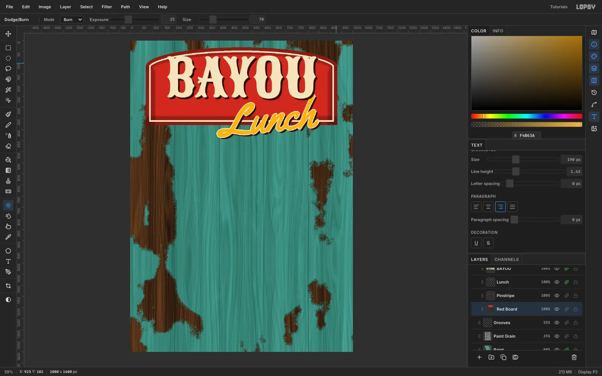

Select **Red Board** and pick the **Dodge/Burn** tool. Set **Mode** to
**Burn**, Exposure **35** and Size **70**. Drag along the bottom edge, both
sides and the top of the arch. The edges darken the way old enamel does where
dirt collects.

## Block in the crawfish mascot

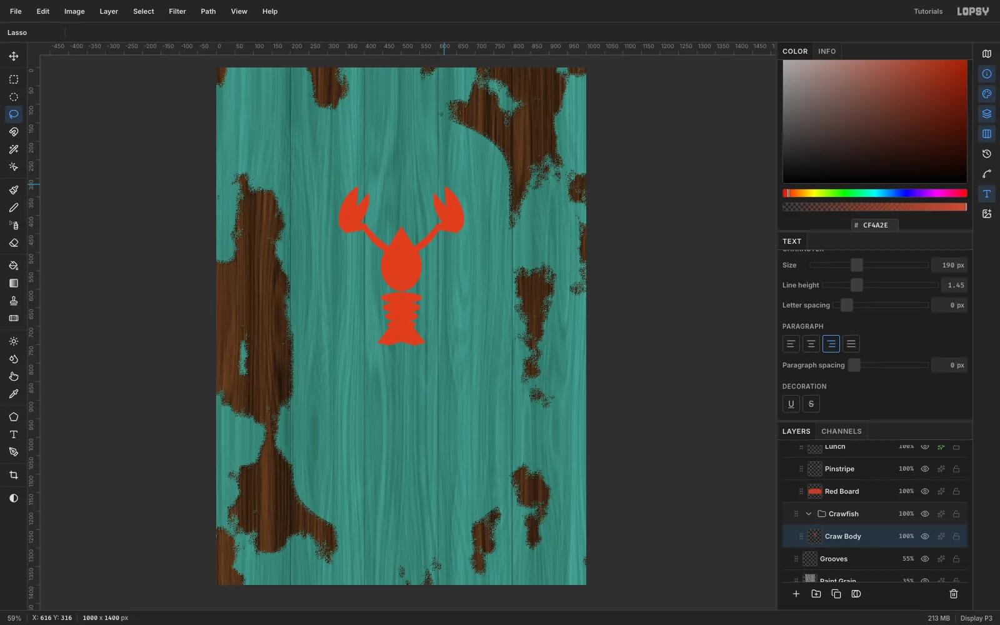

Hide the **Header** group for a moment so you can see what you're drawing. Make
a new group, **Crawfish**, below it, add a layer **Craw Body**, and set the
foreground to crawfish red `#CF4A2E`. Every part is a selection plus
**Edit → Fill**:

- **Body:** an elliptical marquee from 445, 470, 110 wide and 135 tall.
- **Head:** a lasso triangle pointing up to 500, 430.
- **Tail:** four ellipses stacked below the body, each a little narrower (112,
  102, 90 and 76 px wide), and a lasso **fan** at the bottom.
- **Arms and claws:** a lasso arm running up and out to each side, a tilted oval
  claw at the end, and a small lasso "wrist" joining them.
- **Pincers:** lasso a thin wedge into the top of each claw and press
  [[Delete]] to split it into two fingers.

## Add legs and antennae with Symmetry

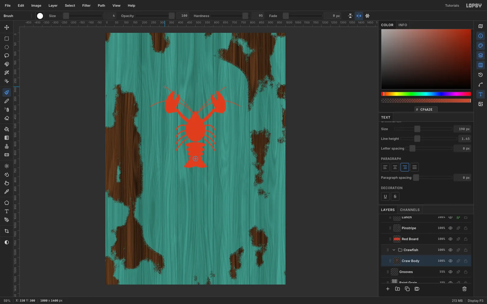

Deselect first, because an active selection clips the brush. Choose the
**Brush** (Size **7**, Hardness **95**) and switch on **Symmetry Vertical** in
the options bar. It mirrors every stroke left to right around the canvas
centre, which is exactly where the crawfish sits.

Draw four curved legs down one side of the body. Then drop to Size **4** and
draw two long sweeping antennae from the head. Each stroke appears on both sides
at once. Turn Symmetry off when you're done.

## Give it a face and a shine

Add a layer **Craw Detail**. With the Brush at Size **4** in dark red `#7A1E12`,
draw a curved line across each tail segment, lines on the fan, and a happy
smiling mouth. Fill two small **14 px** elliptical marquees with `#1B0D08` for
the eyes.

Add a layer **Craw Shine** and paint short cream `#F6D9B0` highlight strokes on
the body, both claws and the tail at Size **6**. Naive sign art always has one
glint.

Then press **Layer → Merge Down** twice, from the top, so the whole crawfish is
one layer, **Craw Body**.

## Scale the crawfish down

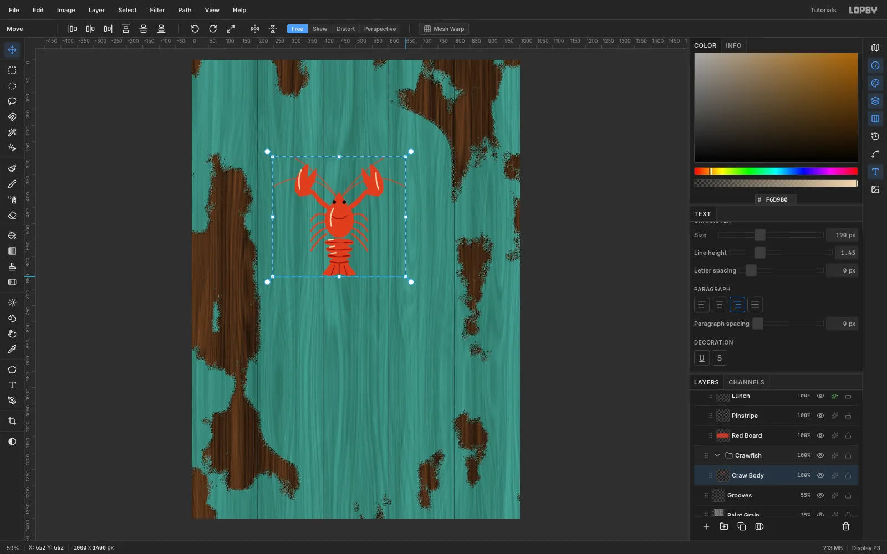

Drag a **Rectangular Marquee** that fully contains the crawfish, from 246, 296
to 754, 754, and switch to the **Move** tool. Hold [[Cmd]] and drag the
bottom-right handle up and in to about **80%**. [[Cmd]] keeps both axes in
proportion. Press [[Cmd+D]] to commit the scale.

> **Tip:** Make the marquee a pixel or two larger than the artwork. Any pixel
> row outside the selection stays behind when you transform.

## Rotate the crawfish

Marquee around the scaled crawfish again, switch to **Move**, and drag just
outside the top-right corner to rotate it about **−16°**. A tilted mascot looks
like it's waving at passing cars. Press [[Cmd+D]].

## Place it and add a cream keyline

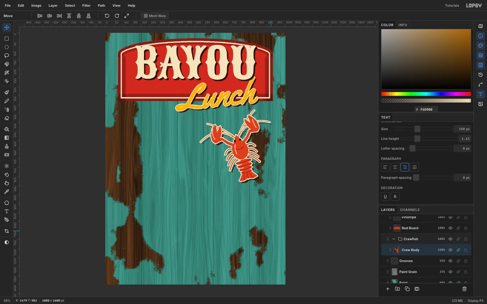

With nothing selected, drag the crawfish with the **Move** tool to the right
side, below the header, so its tail just reaches the top of where the menu
boards will go. Show the **Header** group again.

In its layer effects, add **Stroke** in cream `#F1E4C0`, Width **5**,
**Outside**, and a **Drop Shadow** of `#2A120C` at **11 / 11**, Blur **0**,
Opacity **90**. Lopsy draws the stroke on top of the shadow, so the shadow
offset has to be bigger than the stroke width, or the stroke covers it.

## Letter the special

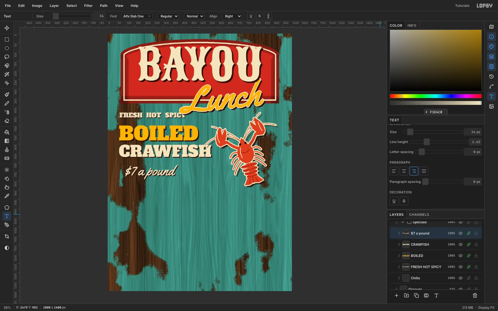

Make a group **Specials** with a raster layer **Chilis** inside it, and select
**Chilis** before you create each line of type, so each new line starts from a
raster layer. Create the lines **from the bottom up**. A click inside an
existing text layer's box edits that layer instead of starting a new one.

- **$7 a pound:** Yellowtail, 76 px, cream.
- **CRAWFISH:** Alfa Slab One, 84 px, cream.
- **BOILED:** Alfa Slab One, 104 px, mustard `#F4B63A`.
- **FRESH  HOT  SPICY:** Alfa Slab One, 34 px, cream, with two spaces between
  words.

Give each one a hard `#2A120C` drop shadow with Blur **0**: offset **6** for
BOILED, **5** for CRAWFISH, **4** for the price and **3** for the small line.

## Knock the lines off level

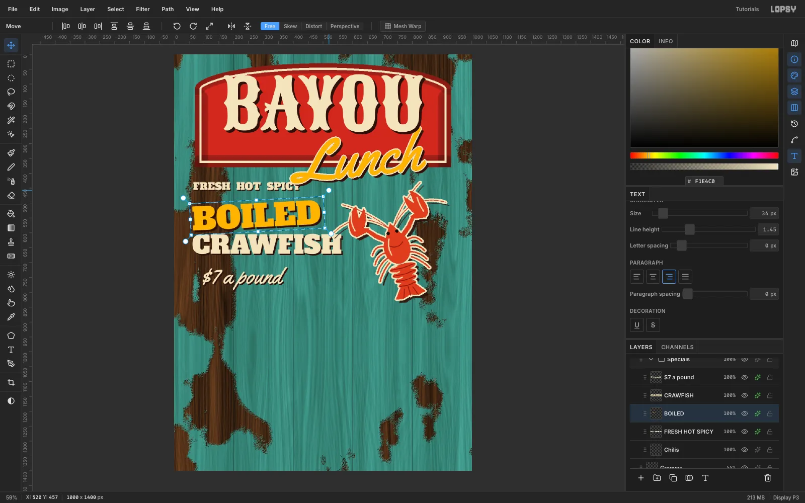

A hand-painted sign is never perfectly level. Marquee each line and rotate it
with the Move tool's corner handle, pressing [[Cmd+D]] after each one:

- **BOILED:** about **−3°**.
- **CRAWFISH:** about **+1.5°**.
- **$7 a pound:** about **−5°**.

The tilts are tiny, but together they make the stack look hand-painted
rather than typeset.

## Underline the price with a swash

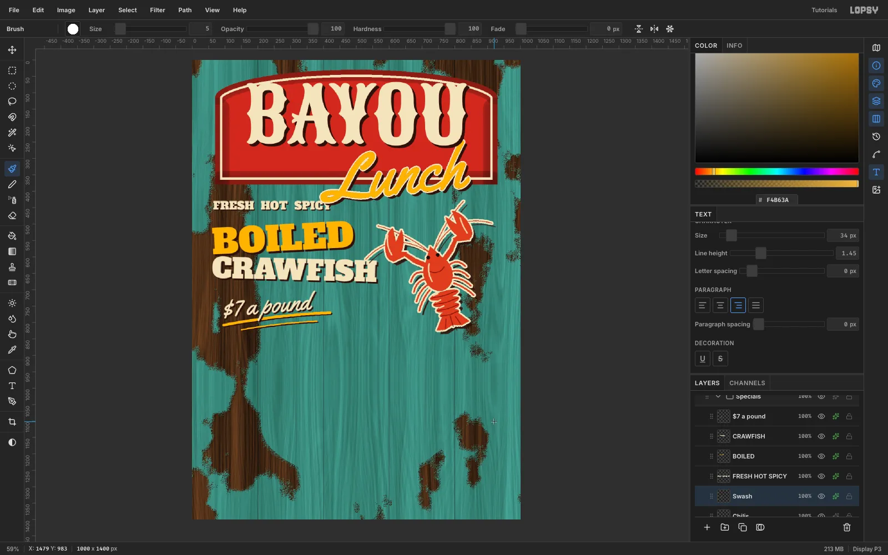

Add a layer **Swash** above **Chilis**. With the Brush in mustard at Size **9**
and Hardness **100**, drag one long, slightly rising curve under
**$7 a pound**. Add a shorter, thinner stroke (Size **5**) beneath it, then give
the layer a **3 / 3** hard shadow. It's the flourish a sign painter adds without
thinking.

## Draw one chili, then paste two more

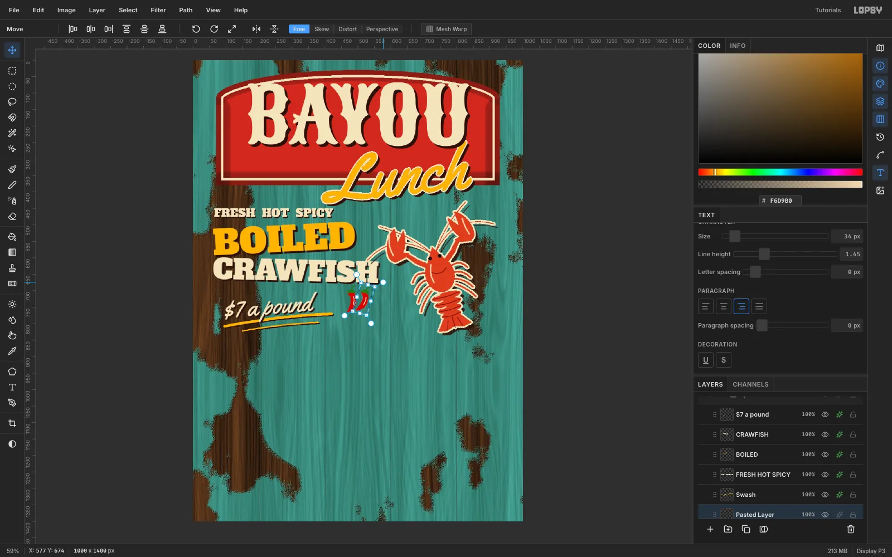

On the **Chilis** layer, lasso a curved red `#C8261C` chili about 30 × 65 px next
to the price, lasso a green `#3E7A2A` cap, and brush a short stem and one cream
highlight.

To make a row of three:

1. Marquee the chili and press [[Cmd+C]], then [[Cmd+V]]. The copy is pasted in
   place on a new layer.
2. With the **Move** tool, drag it about 36 px to the right and press
   [[Cmd+D]].
3. Marquee the copy and rotate it about **16°**. Press [[Cmd+D]].
4. Repeat from the original for the third chili, 72 px to the right, rotated
   about **32°**.

Merge the pasted layers down into **Chilis** and give it a **3 / 3** hard
shadow. Three chilis mean "hot" on any menu board.

## Nail up the menu boards

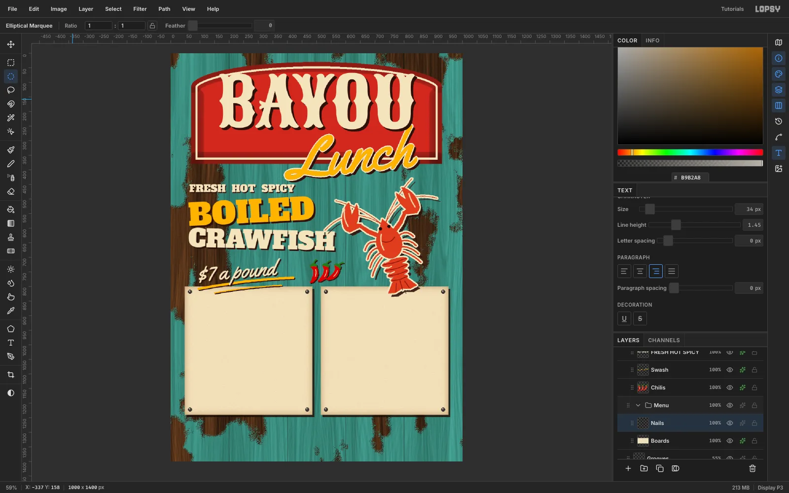

Make a group **Menu** and add a layer **Boards**. With the foreground at
`#EFE0BC`, fill two rectangular marquees: **48, 800** and **514, 800**, each
**438 × 440**.

- Run **Filter → Add Noise…** (Mono, Amount **10**) so the boards aren't flat.
- Add **Inner Glow** in `#8A5A2E`, Size **34**, Opacity **55**. It browns the
  edges like old varnished board.
- Add a **Drop Shadow** of `#1A0E06` at **6 / 8**, Blur **0**, Opacity **80**.

On a layer **Nails**, fill a **14 px** dark `#3B3632` ellipse in each corner and
add a **5 px** light-grey glint to each one.

## Set the items, prices and dot leaders

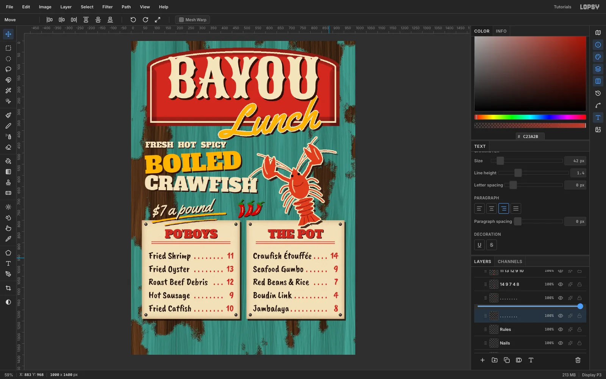

1. **Headings:** Alfa Slab One, **50 px**, sign red, **PO'BOYS** and
   **THE POT**, each with a 3 px hard shadow. Under each, draw two red
   shift-click rules, 8 px apart.
2. **Dishes:** drag with the Text tool to make an *area* text box on each board.
   Set **Caveat Brush**, **42 px**, near-black `#1E120A`, **Line height 1.4** in
   the Text panel, and paste five dishes, one per line.
3. **Prices:** make a narrow area text box at the right edge of each board, set
   **Align right** in the Text panel, and type the prices in sign red.
   Right-aligned area text keeps the numbers flush.
4. **Leaders:** make one more right-aligned area box between the dishes and the
   prices, in red. Each line is `. . . .` with as many dots as fit after that
   line's dish name.

> **Tip:** Point text ignores alignment. Use drag-created area text boxes
> whenever you need a right-aligned column.

## Paint the arrow and snap the plaque to the grid

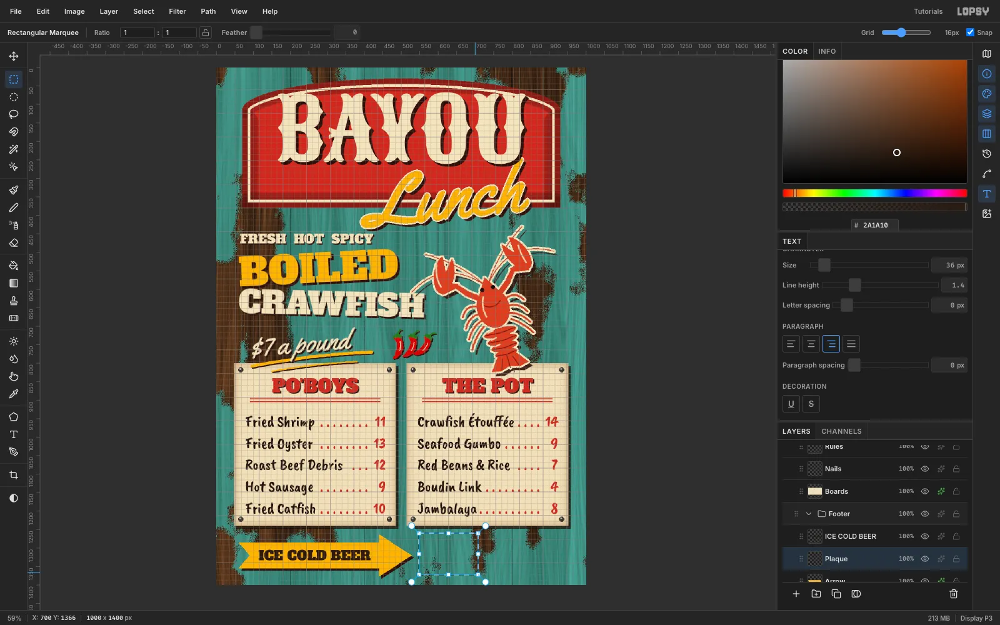

In a group **Footer**, add a layer **Arrow**. Lasso a mustard arrow with a
notched tail from x 60 to a point at x 528, around y 1320. Give it a hard
`#2A120C` shadow, and letter **ICE COLD BEER** on it in Alfa Slab One, 36 px,
`#2A1A10`.

Add a layer **Plaque** and choose **View → Show Grid**. Showing the grid also
switches on **Snap**. Drag a marquee beside the arrow. It snaps to the 16 px
grid, here landing at 548, 1260 and 160 × 112. Fill it with sign red, then turn
the grid off again. Give the plaque an inside cream Stroke (**3 px**) and a hard
shadow, and letter **SINCE** (Permanent Marker, 26 px, cream) over **1974**
(Permanent Marker, 48 px, mustard).

## Stamp CASH ONLY

On a layer **Stamp**, fill a **150 px** elliptical marquee in sign red, then use
**Select → Shrink** to cut rings:

1. Shrink **7**, press [[Delete]].
2. Shrink **5**, **Edit → Fill**.
3. Shrink **3**, press [[Delete]].

That leaves a bold outer ring and a thin inner ring. Letter **CASH** and
**ONLY** in Alfa Slab One at **34 px**. Click **Rasterize Layer** on both, then
**Layer → Merge Down** them into the stamp. Marquee the stamp and rotate it
about **−10°**, so it looks slapped on in a hurry.

## Scuff everything with a grime layer

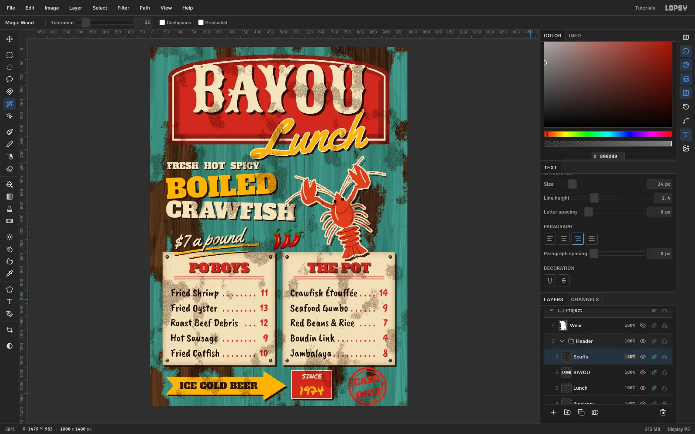

Select **BAYOU**, the top layer in the Header group, and add a layer
**Scuffs**. It sits above all the artwork.

1. Fill it with `#808080`. Run **Clouds** (Scale **16**), then
   **Add Noise** (Mono, **60**), then **Threshold** at **17**.
2. With the Magic Wand (Contiguous off), click a white area and press
   [[Delete]], so only the dark speckles are left.
3. Add a **Color Overlay** of `#4A2A16`, set the blend mode to **Multiply**, and
   drop the layer to **40%** opacity.

Now the chips and grime cross every painted surface, the way real weather does.

## Erase the grime off what must be read

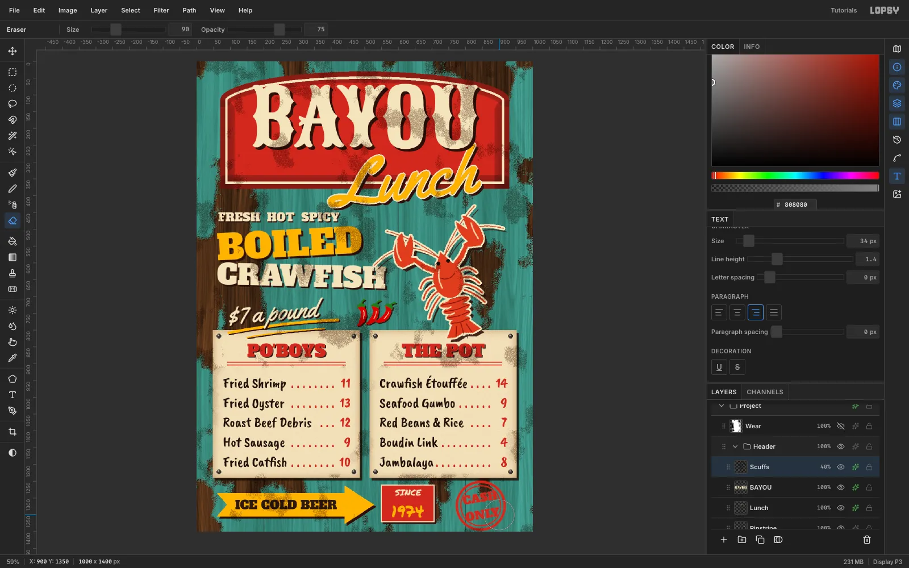

Wear is charming until nobody can read the prices. Pick the **Eraser** at Size
**90** and Opacity **75**. With **Scuffs** selected, sweep across each line of
dishes on both boards, then across the plaque and the stamp. The headings and
the header keep their grime, and the information stays clean.

## Finish with a vignette

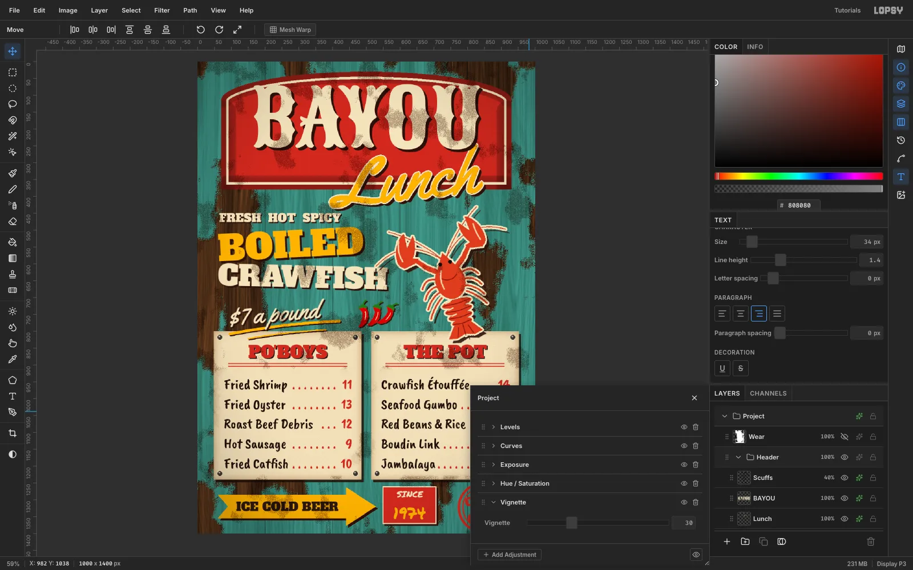

Click the **Project** group row and open its effects drawer, then click
**Add Adjustment → Vignette** and set it to **30**. The corners darken
slightly and pull the eye towards the crawfish and the boards.

## Export the menu

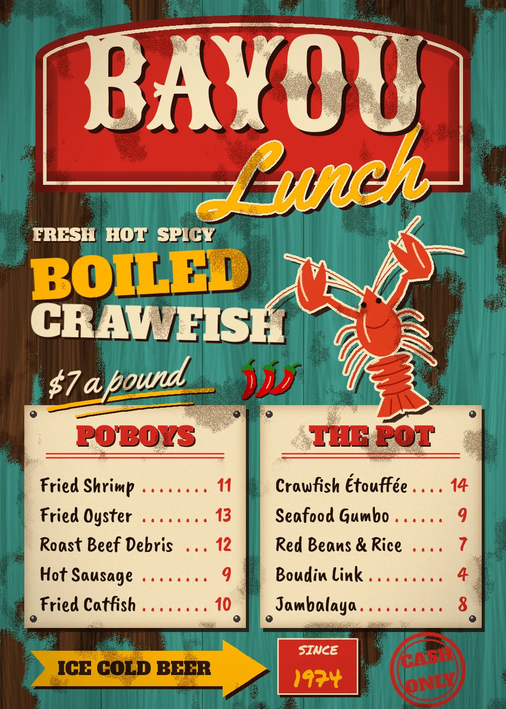

Choose **File → Quick Export PNG** to save the image, and **File → Save Project**
to keep every layer editable. A roadside sign usually gets repainted every
season, so you'll want the layers when the prices go up.

**Where to take it next:**

- Swap the turquoise for a faded barn red, or sun-bleached yellow.
- Paint a second arrow sign on its own layer, pointing to *Live Bait*.
- Duplicate the Menu group's boards for a *Daily Specials* chalkboard.
