Holographic foil prints work because they fake light: pale thin-film colors,
sharp white glints, and a dark shirt that makes them glow. In this tutorial
you'll make **MOTH DISCO**, a 1500 × 1800 graphic for a black tee. A Luna
moth flies to a mirror ball, the way moths fly to a porch light.

You'll build the mirror ball from a gradient, Add Noise, Pixelate and a
pattern-filled grid, then bulge it with Lens Distortion. You'll cut the wings
with the Lasso and fill them with pastel "thin-film" gradients. The veins
and antennae are painted with the Symmetry brush, with Taper on the veins.
To finish, you'll set a Monoton title with a holographic fill, and use
copy, paste, rotate and scale to turn a four-point sparkle into an
eight-point star.

The palette:

- Shirt ink `#100C24` (the background, not an ink)
- Holographic ramp `#FF9ED8` → `#B9A2FF` → `#8CEBFF` → `#A8FFD2` → `#FFE0A8`
- Forewing thin-film `#B8F5C8` → `#C8FFF0` → `#E6C8FF` → `#FFC8E8` → `#C8E8FF`
- Hindwing thin-film `#9FE8FF` → `#D2BFFF` → `#FFC2E6` → `#FFE3B8`
- Outline ink `#100C24`, accent violet `#5B3BE8` / `#8A5CFF`

## Set the shirt color

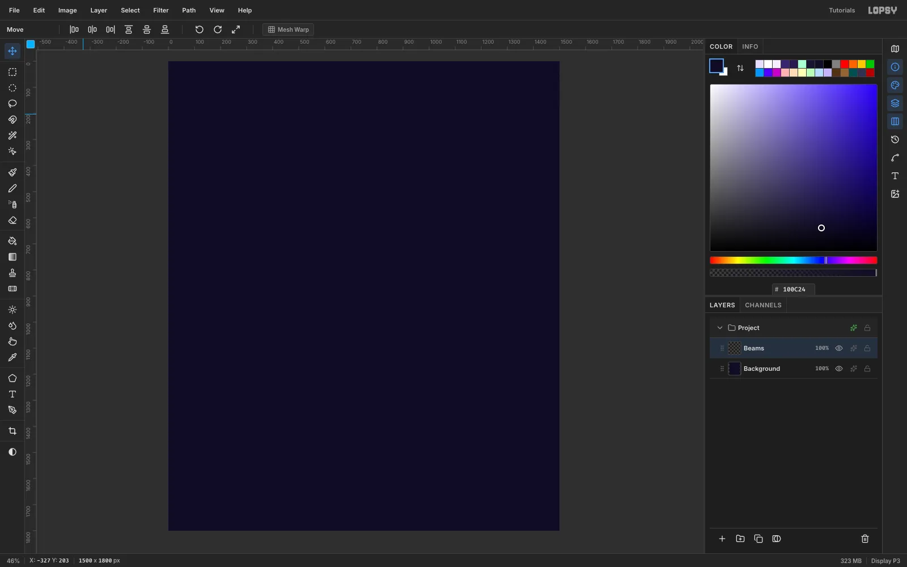

Choose **File → New**, enter **1500 × 1800** with **Unit: Pixels**, pick a
**White** background and click **Create**. Click the **Background** row, set
the foreground to `#100C24` and choose **Edit → Fill** with nothing selected.
Designing on the real shirt color stops pastels from looking washed out
later. Rename **Layer 1** to **Beams**.

## Cut the light beams

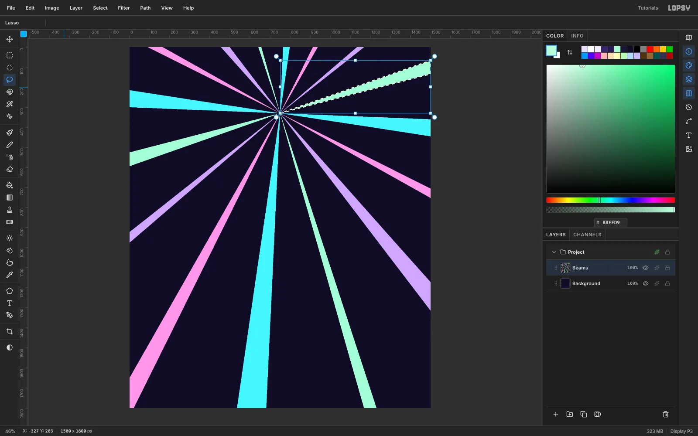

The mirror ball will hang on the canvas's vertical centre line, with its
centre about 330 px down from the top, so every beam starts from that point.
With the **Lasso** (L), drag a thin triangle from that point out past the
canvas edge and use **Edit → Fill**. Repeat around the circle to make 16
beams. Vary the width so the far ends range from about 40 to 140 px, and
rotate through `#7FF3FF`, `#FF9BE8`, `#C9A7FF` and `#B8FFD9`. Uneven widths
look like real stage light. Even ones look like sunburst clip art.

> **Tip:** Cmd-click (Ctrl-click) the middle of the top ruler to drop a guide
> exactly on the centre line, then click the left ruler about 330 px down.
> The crossing gives you a target to start every wedge from.

## Soften and fade the beams

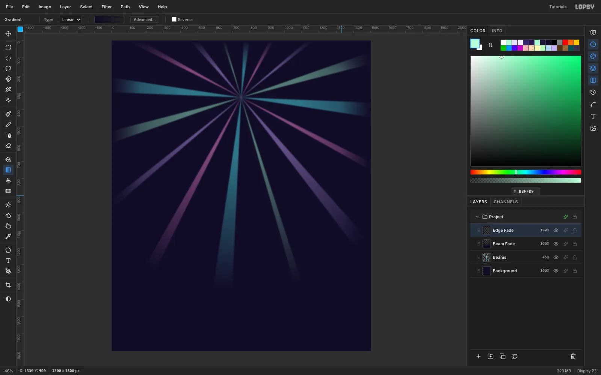

Press [[Cmd+D]], run **Filter → Gaussian Blur…** at **Radius 8**, and set
the Beams layer opacity to **45%**. Add a **Beam Fade** layer and draw a
**Radial** gradient from the beams' starting point straight down to about
350 px above the bottom edge, with ink stops: transparent up to 30%, then
solid `#100C24`.

Next, add an **Edge Fade** layer. For each side, marquee a band about 170 px
deep along that edge and draw a **Linear** gradient from solid ink at the
edge to transparent inward. On a t-shirt, a beam that runs off the artboard
prints as a hard rectangle, so every beam has to fade out before it reaches
an edge.

## Fill the ball with a holographic gradient

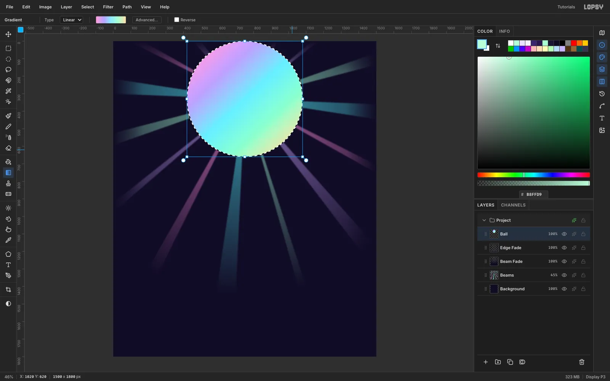

Add a **Ball** layer. With the **Elliptical Marquee**, [[Cmd]]-drag a circle
about **660 px** across, centred on the beams' starting point, so its top
just touches the top edge. Pick the **Gradient** tool, open **Advanced…** and
set five stops: `#FF9ED8`, `#B9A2FF`, `#8CEBFF`, `#A8FFD2` and `#FFE0A8`.
Drag a **Linear** gradient diagonally across the circle, from just inside its
upper-left edge to just inside its lower-right edge.

> **Tip:** For an exact circle, press [[Cmd+D]] so nothing is selected and
> *click* (don't drag) with the Elliptical Marquee. A dialog opens where you
> can type the corners: **From 420, 0** and **To 1080, 660**.

## Turn it into mirror tiles

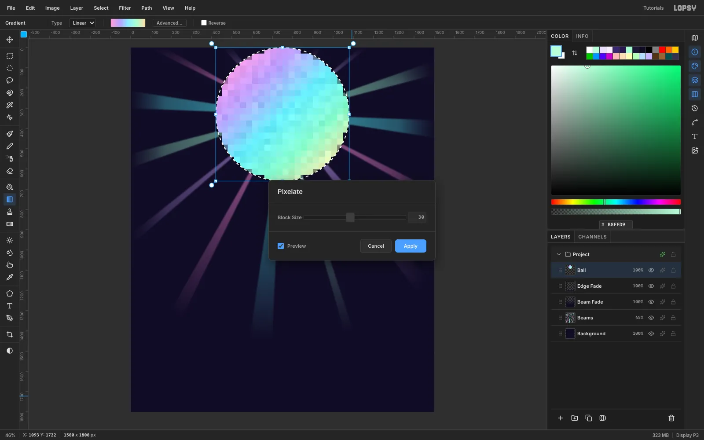

Keep the selection. Run **Filter → Add Noise…** with **Mono**, **Uniform**
and **Amount 40**, then **Filter → Pixelate…** with **Block Size 30**. The
noise gives each 30 px tile its own brightness once it is averaged, so the
tiles glint unevenly like real mirrors.

## Add the grout grid with a pattern

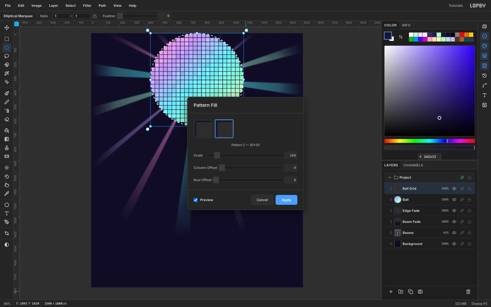

Add a **Ball Grid** layer and set the foreground to `#1A1433`. The grid tile
has to be exact, so build it in the top-left corner with the marquee's
corner dialog: press [[Cmd+D]], click with the **Rectangular Marquee**, enter
**From 0, 0** and **To 30, 3**, and fill it. Do the same for **From 0, 0**
**To 3, 30**. Then select the whole **30 × 30** tile (**From 0, 0 To 30, 30**),
choose **Edit → Define Pattern**, and press [[Delete]] to clear the tile.
Pattern fills are anchored at the document's top-left corner, the same place
as the Pixelate grid, so the lines fall exactly between the tiles.

Select the ball's circle again the same way you drew it. Choose **Edit →
Fill with Pattern…**, pick the new 30 × 30 pattern, click **Apply**, then
choose **Layer → Merge Down** to merge it into **Ball**.

## Bulge it into a sphere

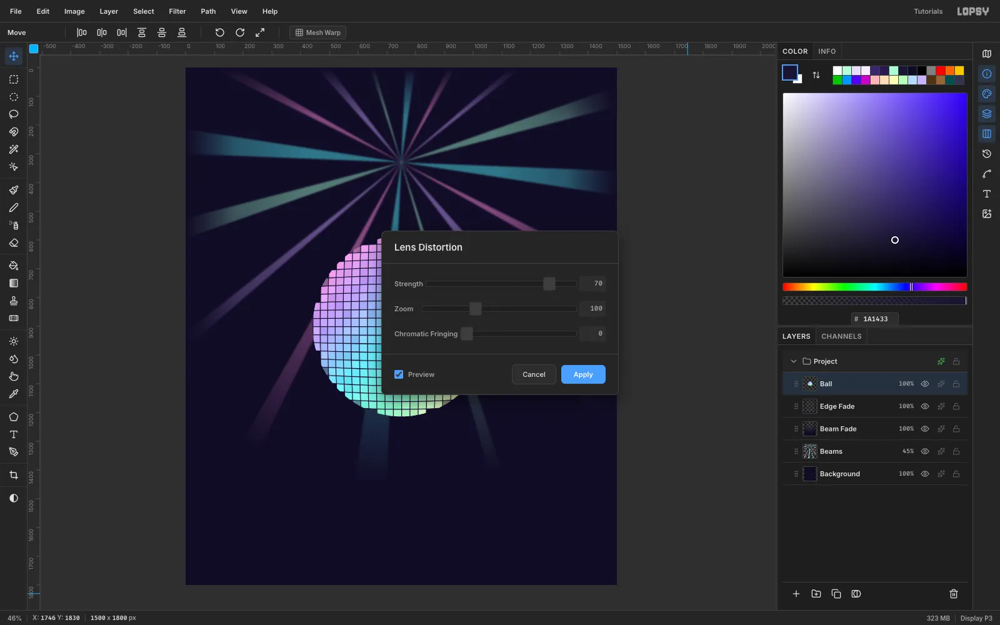

Lens Distortion bends around the middle of the layer, so move the ball
there first. With the **Move** tool (V), drag it straight down until it sits
in the centre of the canvas. Run **Filter → Lens Distortion…** with
**Strength 70**, **Zoom 100** and **Chromatic Fringing 0**. The edge tiles
squeeze together, so the flat disc starts to read as a sphere.

Then clip it to a clean circle. [[Cmd]]-drag a circle about **600 px** across,
centred on the ball, so it sits just inside the bulged edge. Choose
**Select → Inverse**, press [[Delete]], and press [[Cmd+D]]. Drag the ball
back up to where it started, centred on the beams' starting point.

## Shade it, add a hotspot and a glow

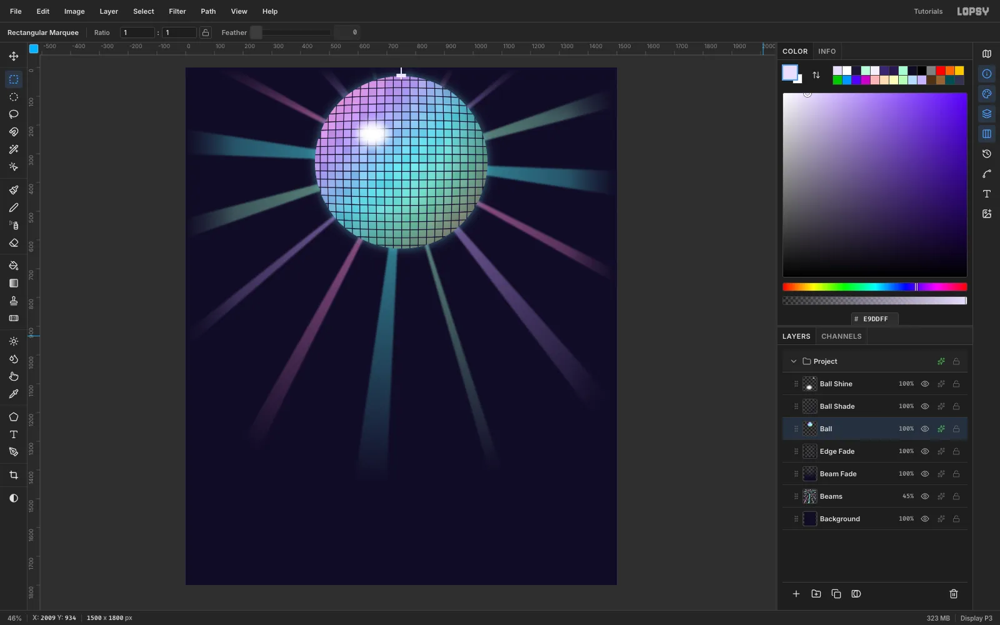

Add a **Ball Shade** layer. [[Cmd]]-click the **Ball** layer's thumbnail to
select the ball, then, with **Ball Shade** active, draw a **Radial** gradient
from a point up and to the left of the ball's centre (where the light hits)
out past its lower-right edge. Use ink `#100C24` stops at 0%, 12% and 85%
opacity, so the ball darkens away from the light.

Add a **Ball Shine** layer. Set the Elliptical Marquee's **Feather** to
**28**, select a small oval (about **110 × 84**) on the upper left of the
ball, fill it white and set the layer's blend mode to **Screen**. Reset
Feather to **0**. Finally, open the **Ball** layer's effects and add an
**Outer Glow** in `#8CEBFF` with **Size 48** and **Opacity 45**. The short
stub at the top of this screenshot is a placeholder chain: a 5 px brush line
and a small cap on **Ball Shine**. You will replace it later.

## Group the ball, then make a Moth group

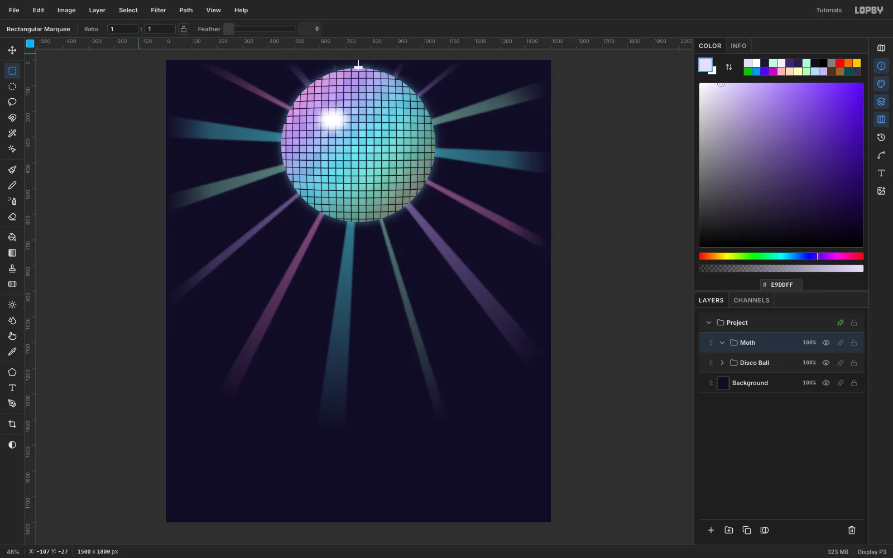

Click **Beams**, Shift-click **Ball Shine** and choose
**Layer → Group Layers**. Rename the group **Disco Ball** and collapse it.
Next, click **Background**, click **New Group**, name it **Moth**, and drag
its row above the Disco Ball group. Every moth layer goes inside it.

## Cut the wings with thin-film gradients

A Luna moth has broad forewings and hindwings that end in long, curling
tails. Inside **Moth**, add a **Hindwings** layer. Lasso the right
hindwing: start just right of the centre line, sweep out about 430 px to the
right, then curve down into a long tail whose tip ends about three-quarters
of the way down the canvas. Fill it with a **Linear** gradient of `#9FE8FF`,
`#D2BFFF`, `#FFC2E6` and `#FFE3B8`, dragged from the body toward the tail.
Repeat on the left, mirrored across the centre line.

Add a **Forewings** layer above it. Lasso each forewing from the shoulder up
and out to a pointed tip near the upper corner, level with the bottom of the
ball. Fill it with `#B8F5C8`, `#C8FFF0`, `#E6C8FF`, `#FFC8E8` and `#C8E8FF`,
dragged from the body to the tip. Pale mint, lilac and pink next to each
other read as thin-film iridescence. Saturated neon doesn't.

## Outline the wings

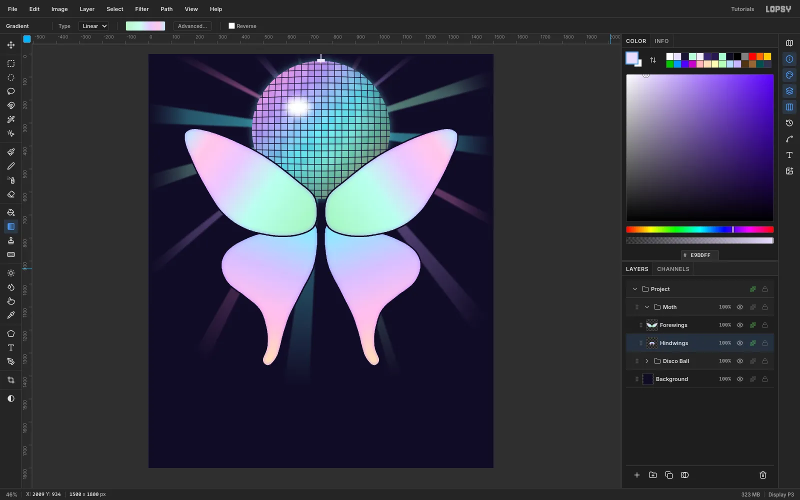

On both wing layers, add a **Stroke** effect in `#100C24` with **Width 6**
and **Position outside**. Also add an **Inner Glow** in `#8A5CFF` with
**Size 30** and **Opacity 50**. The dark outline separates the pastel wings
from the pastel ball behind them. The violet rim gives each wing a little
depth.

## Add foil sheen streaks

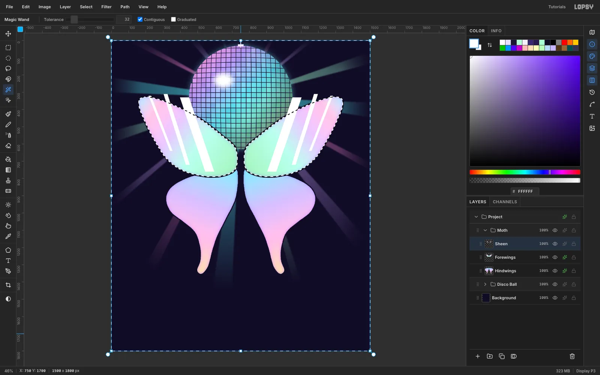

Add a **Sheen** layer above **Forewings**. Lasso three slanted white bars
across each forewing, using different widths, and fill them white. Next,
click **Forewings**. With the **Magic Wand** (Contiguous on), click the
empty ground below the moth to select everything outside the wings, click
**Sheen**, and press [[Delete]]. Set Sheen to **Screen** at **60%**. Sharp
diagonal glints are what make foil read as foil.

## Give the brush a taper

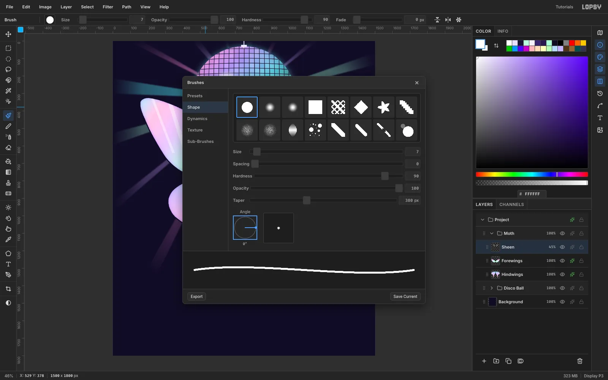

Choose the **Brush** (B), click the brush preview to open **Brushes**, go to
the **Shape** tab, and set **Size 7** and **Taper 380**. Each stroke now
thins to a point over its last 380 px, the way a real wing vein does.

## Paint the veins with Symmetry

Add a **Veins** layer and turn on **Symmetry Vertical** in the options bar.
The mirror line is the document's vertical centre line, which is the moth's
spine. Set the foreground to `#5A3FB8` and paint seven curved veins on the
right wings only, each starting at the body and ending short of the edge.
The left side paints itself. Turn Symmetry off afterwards.

## Add the eyespots

Add an **Eyespots** layer and build each spot from stacked circles, largest
first, each centred on the one before. On the widest part of each hindwing,
make a **92 px** ink circle, then **80 px** in peach `#FFD59A`, **58 px** in
pink `#FF6FB5`, **36 px** in ink, and a 6 px white catch-light up and to the
left. Near each forewing tip, make smaller spots: **60 px** ink, **48 px**
`#FFC2E6` and **28 px** `#5B3BE8`. Keep them small and toward the outer
edge, or the two big spots read as a cartoon face.

> **Tip:** Stacked circles only look right if they share a centre. Clicking
> with the Elliptical Marquee (with nothing selected) lets you type each
> circle's corners, so you can keep every ring on the same centre.

## Build the body

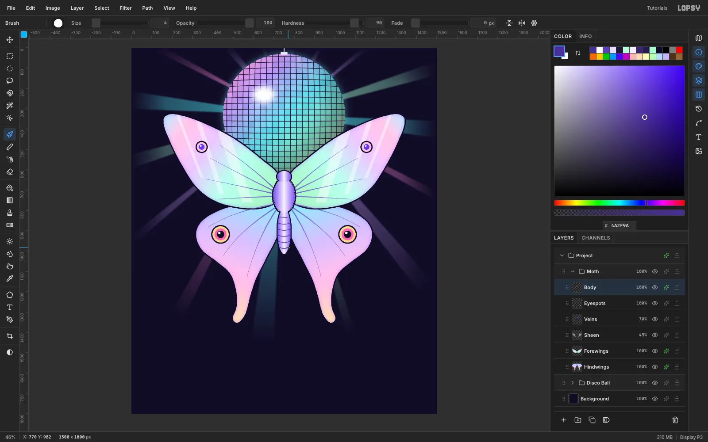

Add a **Body** layer. Down the centre line, select and fill three ovals one
at a time with the **Elliptical Marquee**: a long abdomen (about 64 × 224)
in the middle of the wings, a thorax (about 114 × 174) above it, and a small
head (about 68 × 56) on top. Fill each with a left-to-right `#6A45E6` →
`#F6EEFF` → `#6A45E6` gradient for a pearly cylinder. Give the layer a 5 px
ink **Stroke**, then brush six curved `#4A2F9A` bands across the abdomen.
The head just touches the bottom of the ball, which tells the story: the
moth has reached the light.

## Paint feathered antennae

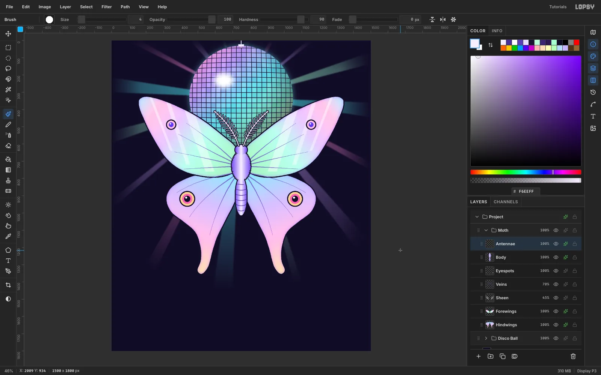

Add an **Antennae** layer. With **Symmetry Vertical** on and Taper back at
0, paint a 6 px `#F6EEFF` curve from the head up and out across the lower
right of the ball. Then add a row of short 4 px barbs on both sides of it,
longest in the middle. Add a 4 px ink **Stroke** effect so the pale feathers
stay readable over the bright ball.

## Set the title in Monoton

Collapse **Moth**, create a **Type** group above it the same way, and add a
**Sparkles** layer inside it. Choose the **Text** tool (T) and set **Size
180** and the font **Monoton**. Its inline stripes look like disco neon.
Click in empty space and type `MOTH    DISCO` with four spaces, so the gap
between the words is clearly wider than the gaps between letters. Press
[[Tab]] to commit, then click **Rasterize Layer** in the Layers panel.

## Fill the title with the holographic ramp

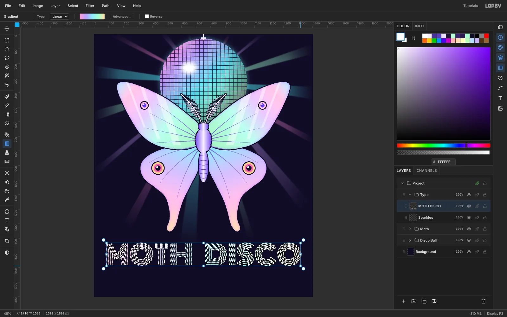

With the **Magic Wand** set to **Contiguous off**, click a white stripe to
select every stripe at once. Then drag a **Linear** gradient across the
whole word using the ball's five holographic stops. Press [[Cmd+D]].

## Add a violet shadow and glow

Open the title's effects. Add a **Drop Shadow** in `#5B3BE8` with
**Offset X 6**, **Offset Y 6**, **Blur 0** and **Opacity 100**, and an
**Outer Glow** in `#8A5CFF` with **Size 26** and **Opacity 60**. A hard,
diagonal offset looks deliberate. A pink shadow straight underneath looks
like a misregistered print.

## Add the subtitle

Click the **Sparkles** row so the new text doesn't restyle the title. Set
**Syncopate**, weight **700**, **Size 52** and color `#E9DDFF`. Type
`NOCTURNAL    GROOVE    SOCIETY` in empty space, then drag it with the
**Move** tool until it sits low on the canvas with a clear bottom margin of
about 110 px. Click **Align center horizontally** in the Move options bar to
centre it exactly.

## Scatter sparkle glints near the light

On **Sparkles**, lasso four-point stars with pinched, concave sides and fill
them. Put a big white one just off the ball's upper-right edge, smaller ones
in `#8CEBFF`, `#FF9ED8` and `#A8FFD2` around the ball's upper-right rim, and
a white one on the hotspot. Add two small stars (about 30 px) in the gaps
between the subtitle words as separators. Keeping the glints near the light
source, instead of scattering them across the canvas, makes them read as
reflections.

## Rotate a copy of the big glint

Marquee a square around the big star, about 100 × 100. Press [[Cmd+C]], then
[[Cmd+V]]; the copy pastes in place on its own layer. Marquee the same
square again, switch to **Move**, hover just outside the top-right corner
until the cursor becomes a crosshair, and drag around to rotate **45°**.
Holding [[Cmd]] snaps the rotation to 15° steps. Press [[Cmd+D]] to commit.

## Scale it and merge it into an eight-point star

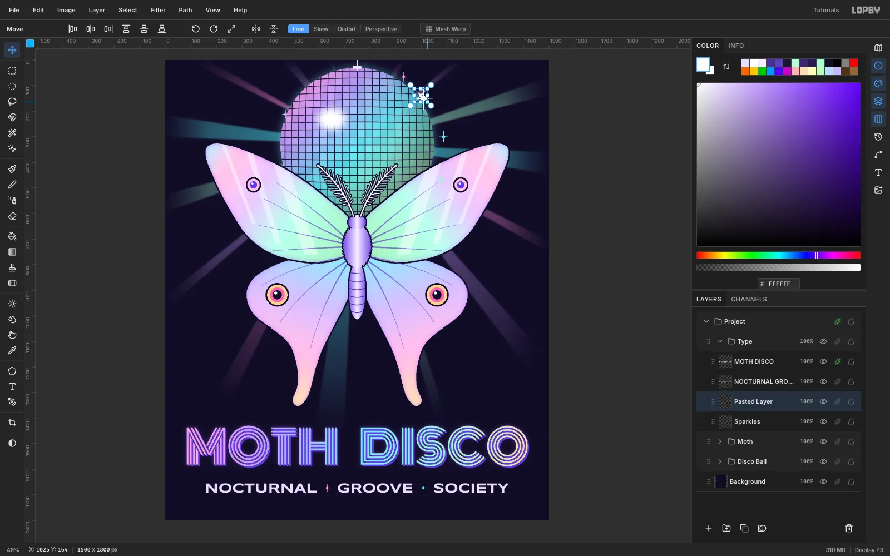

Marquee the rotated copy. [[Cmd]]-drag its bottom-right handle inward to
about **70%** (Cmd keeps the scale uniform), then press [[Cmd+D]]. Drag the
copy back over the original so both stars share a centre. Choose
**Layer → Merge Down**, then give **Sparkles** an **Outer Glow** in white
with **Size 16** and **Opacity 80**.

## Give the ball room at the top

A ball that touches the top edge looks cropped. First remove the stub
chain: on **Ball Shine**, marquee the small stub at the top centre and press
[[Delete]]. Then click the **Disco Ball** group row and, with the **Move**
tool, drag it about **60 px** down. The ball, its shading, the beams and the
fades all move together.

## Hang it on a fading chain

Click **Edge Fade** inside the group and add a **Chain** layer above it.
Marquee a thin strip, about 4 px wide, on the centre line from the top edge
down to the top of the ball. Draw a **Linear** gradient from transparent
`#B9A8E8` at the top edge to solid `#B9A8E8` about two-thirds of the way down
the strip. The chain disappears into the darkness instead of stopping at the
canvas edge. Also click once in the centre of the hotspot on **Ball Shine**
with a white **Brush** at **Size 12**, **Hardness 100**, so the highlight
has a sharp core.

## Smooth the thorax and add fur

On **Body**, select the thorax again with the **Elliptical Marquee** (the
same **114 × 174** oval) and refill it with the pearly gradient, so it reads
as one smooth segment under the bands and stroke. With **Symmetry
Vertical** on, brush five short, curved 4 px `#C9B8FF` tufts along its right
side. The left side mirrors them.

## Match the title to the moth's width

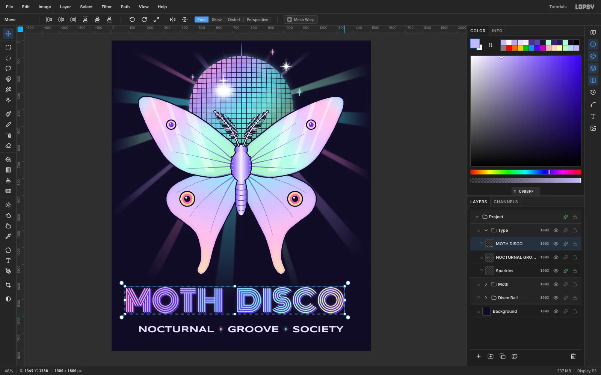

The title should be about as wide as the wingspan. Marquee the title with a
few pixels to spare and [[Cmd]]-drag the bottom-right handle in to about
**94.5%**. Press [[Cmd+D]], drag it down so it sits just above the subtitle,
and click **Align center horizontally** so the margins at both sides match.

## Lighten the title ramp

The violet-blue in "TH" was the lowest-contrast part of the title on the
dark shirt. With the **Magic Wand** (Contiguous off), click empty ground on
the title layer and choose **Select → Inverse** to select every stripe.
Refill it with a lighter ramp: `#FFA8DE`, `#D4C2FF`, `#96EEFF`, `#B0FFD8`,
`#FFE4B0`. Press [[Cmd+D]], set **Veins** to **100%** so the fine lines
survive screen printing, and export with **File → Quick Export PNG**.

> **Tip:** Save a `.lopsy` project before exporting. Every layer, group and
> effect reopens exactly as you left it, so you can recolor the wings for a
> second shirt color.
