Holographic packaging works best when the shimmer is rationed. Give the
foil a single hero object and keep everything around it matte and calm. In
this tutorial you'll make **CRYSTAL SODA**, a 2100 × 900 billboard for a
made-up sparkling water. A foil can sits inside a thin iridescent ring, and
faceted crystals float around it. The navy headline gets a rainbow "echo"
offset behind it.

For the foil you don't paint a rainbow. You render grey **Clouds**, swirl
them with **Liquify**, and let a group **Gradient Map** turn the tones into
holographic bands. The crystals are Lasso facets filled with small
gradients, then duplicated, scaled and rotated with the Move tool.

The palette:

- Pearl background `#F3EFF8` → `#D8D0E9`
- Ink navy `#1B1530`
- Holographic ramp `#8E7BEA` → `#8FE3F5` → `#A8F5C8` → `#FFF0A8` → `#FFB3D9` → `#C4AEFF` → `#9EEBFF` → `#FFE6F4`
- Echo ramp `#6FD8F2` → `#B49BFF` → `#FF9FCF` → `#FFE58A` → `#8FF0B8`
- Accent violet `#8C7AE6`, shadow violet `#3A2A70`

## Lay down a pearl background and guides

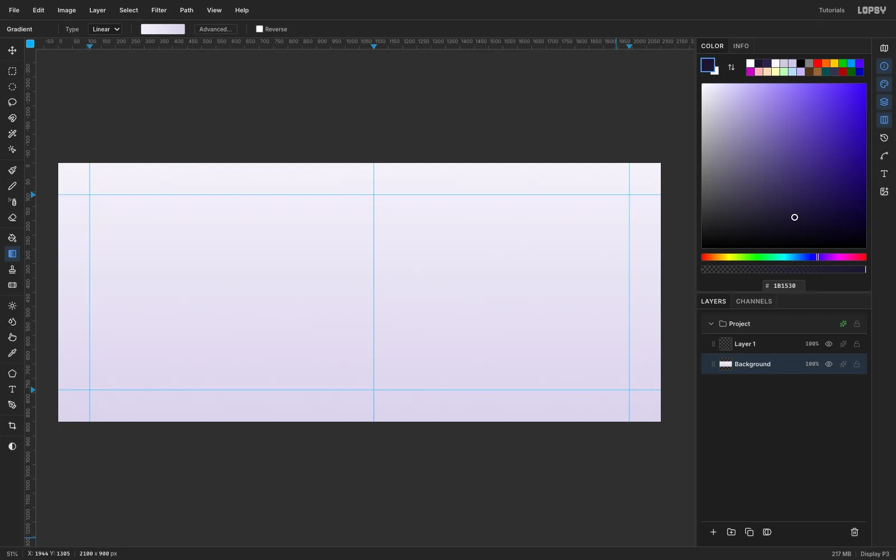

Choose **File → New**, set **Unit: Pixels**, enter **2100 × 900** and pick a
White background.

1. Select the Background layer and switch to the **Gradient** tool.
2. Click **Advanced…** and set two stops, `#F3EFF8` at the top and
   `#D8D0E9` at the bottom.
3. Hold [[Cmd]] and drag straight down from the top edge to the bottom edge.

Next, click the rulers to drop guides. On the top ruler, click about 110 px
in from each side for the margins, and once just right of the middle (about
1100) for the edge of the type column. On the left ruler, click about 110 px
from the top and from the bottom. The type goes in the left column, and the
can sits in the right-hand space, centred roughly halfway between the column
guide and the right margin.

## Add a glowing disc and an iridescent ring

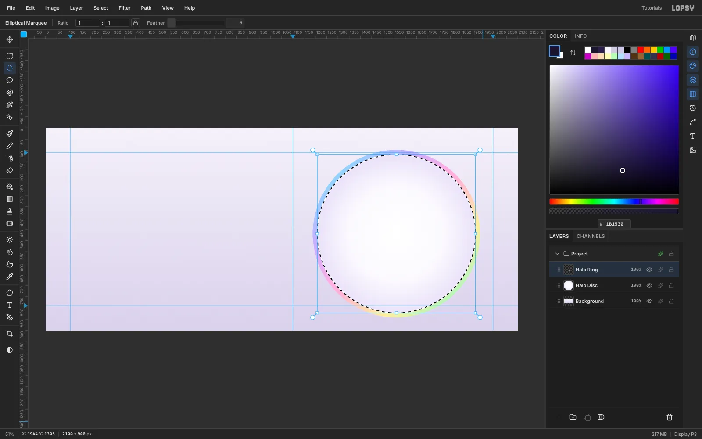

Rename *Layer 1* to **Halo Disc**. Pick the **Elliptical Marquee** and
[[Cmd]]-drag a circle about **700 px** across in the right-hand space, a
little below the vertical middle. Pick the Gradient tool and set its **Type**
to **Radial**. Use white at the centre, `#FBF8FE` at 60% and `#E9E1F7` at the
edge, then drag from the centre out to the rim. The disc lifts the can off
the background without a hard edge.

Add a layer called **Halo Ring**. Select a **744 px** circle around the same
centre and fill it with a **Linear** gradient that runs the pastel ramp from
the top left to the bottom right. Then select a **704 px** circle on the same
centre and press [[Delete]]. What's left is a 20 px iridescent ring. The
screenshot shows the inner circle still selected just before the Delete.

> **Tip:** Concentric circles are easiest to get right by typing them. With
> nothing selected, *click* (don't drag) with the Elliptical Marquee to open
> the corner dialog. The disc is **From 1210, 120 To 1910, 820**, the ring's
> outer circle **From 1188, 98 To 1932, 842**, and its inner circle
> **From 1208, 118 To 1912, 822**.

## Soften a shadow under the can

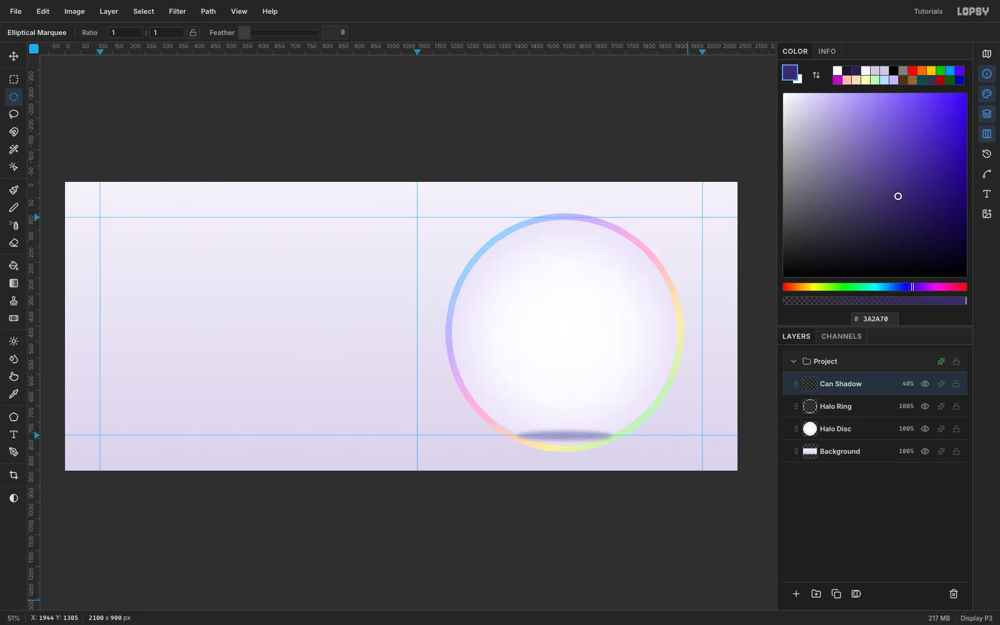

Add a **Can Shadow** layer. Marquee a flat ellipse, about **300 × 30**,
centred under the disc near the bottom of the ring, and use **Edit → Fill**
with `#3A2A70`. Deselect with [[Cmd+D]].

- Run **Filter → Gaussian Blur…** with **Radius 18**.
- In the layer's effects drawer, set **Blend** to **Multiply**.
- Drag the row's opacity down to **40%**.

A flattened, blurred ellipse reads as contact with a surface, where a
round blob would just look like a stain.

## Lasso the can silhouette

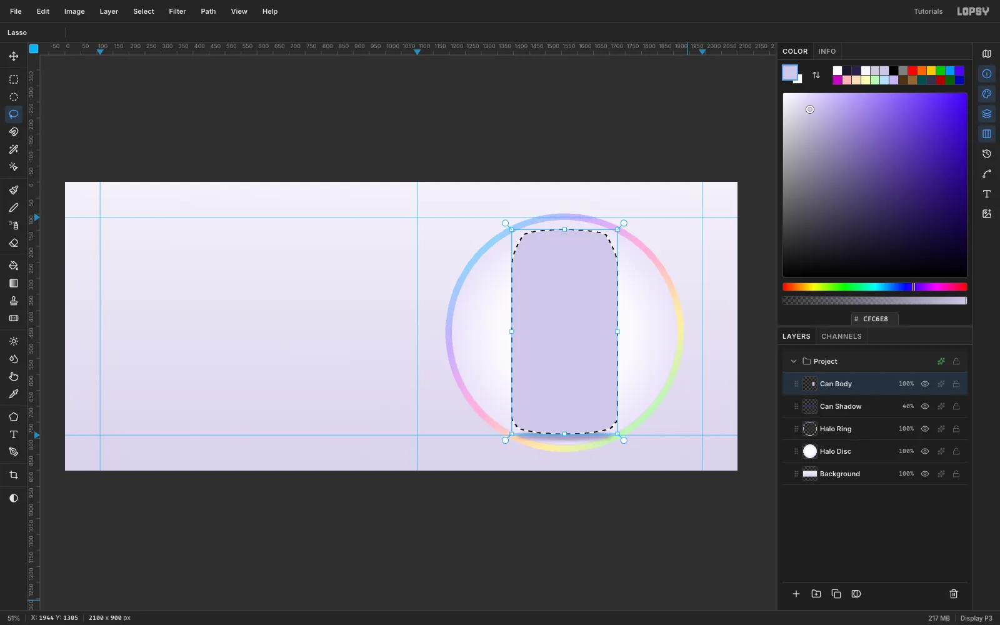

Add a **Can Body** layer and draw the can with the **Lasso**, centred in the
ring:

- **Top:** trace the upper half of a narrow ellipse, about 264 px wide, a
  little below the top of the ring.
- **Neck:** flare out to the body sides, about 330 px apart.
- **Chime:** run the sides straight down to just above the shadow, pull them
  in slightly, and close along the lower half of a slightly wider ellipse
  (about 300 px) that rests on the shadow.

**Edit → Fill** it with `#CFC6E8`. It's only a base colour, because the foil
will cover it.

Open **Can Body**'s effects and enable **Outer Glow**. Set the colour to
`#B9A8FF`, **Size** to **26** and **Opacity** to **40**. The lavender glow
separates the can from the white disc.

## Rotate the can lettering

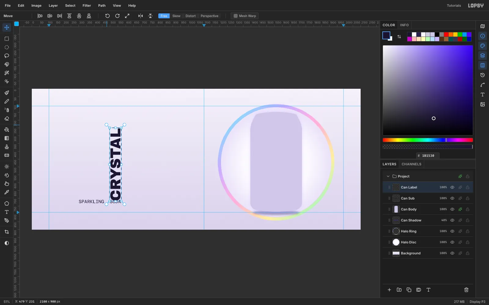

Set the can type in empty canvas first, where it's easy to grab.

1. With **Can Body** selected, pick the **Text** tool. Set **Archivo
   Black** at **92** in ink `#1B1530`, click in the empty left half of the
   canvas and type `CRYSTAL`. Press [[Tab]] to commit, and rename the layer
   **Can Label**.
2. Select **Can Body** again and add a second line lower down, in **DM
   Mono 30**, that reads `SPARKLING  SODA`. Rename it **Can Sub**.
3. Draw a Rectangular Marquee a few pixels larger than CRYSTAL and switch
   to the **Move** tool ([[V]]).
4. Hold [[Cmd]] and drag the round handle past the top-right corner. [[Cmd]]
   snaps rotation to 15° steps, so stop at **−90°**, which reads from the
   bottom up.
5. Press [[Cmd+D]] to commit, then do the same for the second line.

## Place the label on the can

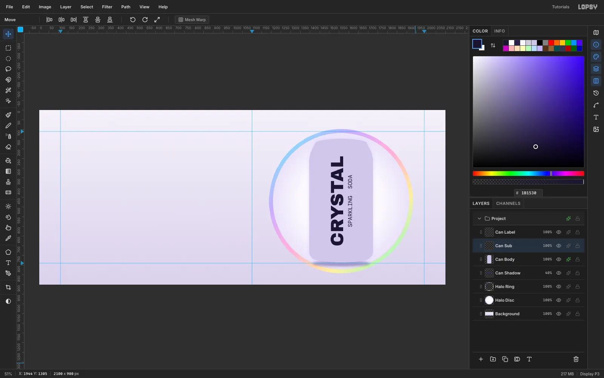

Drag each rotated line onto the can with the Move tool:

- **CRYSTAL:** just left of the can's centre line, centred top to bottom.
- **SPARKLING SODA:** just right of it, at the same height.

Together the pair should sit centred on the can, with about 40 px clear above
and below. Leave both layers *above* Can Body. The foil goes between them in
the next steps, and the shading goes over the top, so the lettering wraps
with the cylinder.

## Build the foil group with a Gradient Map

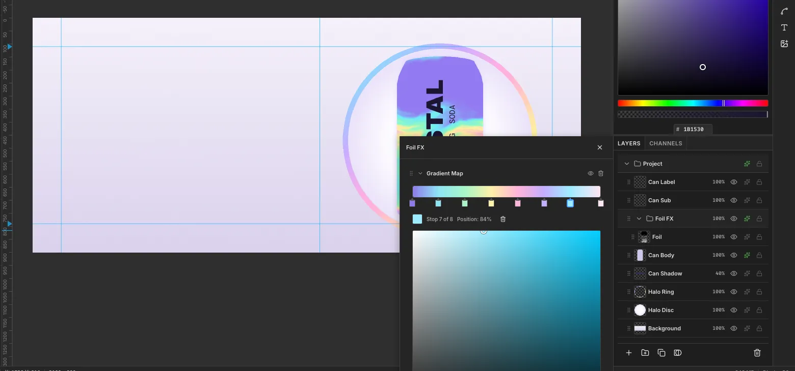

1. Select **Can Body**, add a layer called **Foil**, and run **Filter →
   Clouds…** at **Scale 4** with nothing selected. The clouds fill the whole
   layer.
2. With Foil selected, click **New Group** in the Layers footer and rename
   the group **Foil FX**.
3. Drag Foil's grip onto the Foil FX row so it moves into the group.

> **Tip:** **Layer → Group Layers** ([[Cmd+G]]) with only Foil selected does
> steps 2 and 3 in one go: it wraps the layer in a new group.

Open **Foil FX**'s drawer and choose **Add Adjustment → Gradient Map**.
Click the handle row under the bar to add stops, and pick each colour on
the hue strip and SV square:

1. `#8E7BEA` at 0
2. `#8FE3F5` at 14%
3. `#A8F5C8` at 28%
4. `#FFF0A8` at 42%
5. `#FFB3D9` at 56%
6. `#C4AEFF` at 70%
7. `#9EEBFF` at 84%
8. `#FFE6F4` at 100%

The ramp cycles through the spectrum twice. Every soft grey step in the
clouds becomes a thin band of colour, and that is what makes it look
like foil.

> **Tip:** An expanded Gradient Map makes the drawer tall. It scrolls, and
> you can drag it by its header to give it more room.

## Re-roll the clouds if a big area goes flat

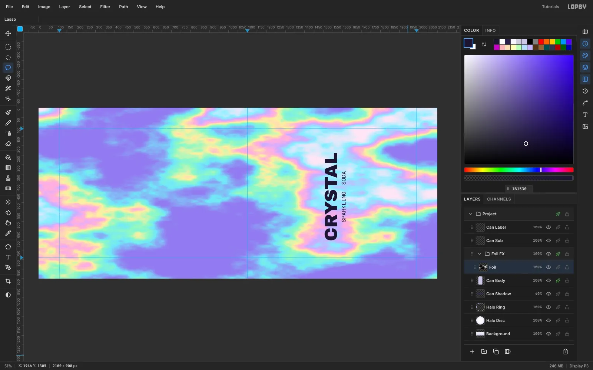

Clouds renders a new random pattern every time. In the previous step's
screenshot, the top of the can landed on solid black and mapped to a flat
purple slab. If that happens, press [[Cmd+Z]] and run **Filter → Clouds…**
again until the area behind the can is mostly mid-greys.

Because Foil now sits inside the mapped group, you see the holographic
result straight away while you re-roll.

## Swirl the foil with Liquify

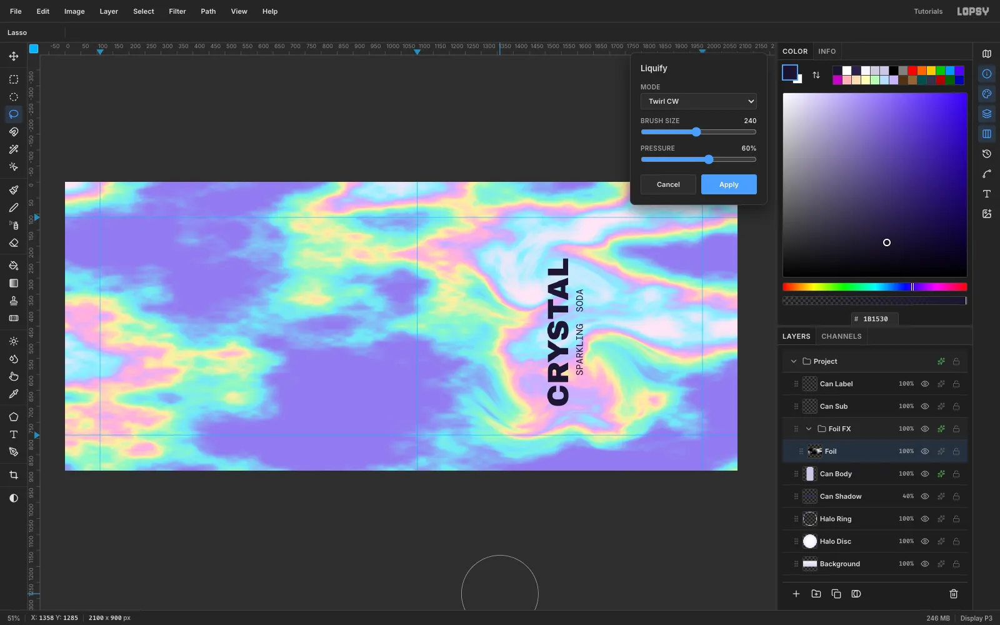

Open **Filter → Liquify…** ([[Cmd+Shift+X]]).

1. In **Push Forward** mode, set **Brush Size 170** and **Pressure 70**.
   Make four long, gently wavy strokes across the can, alternating
   direction.
2. Switch to **Twirl CW** and set **Brush Size 240** and **Pressure 60**.
3. Hold the mouse on three spots on the can (upper left, middle right,
   lower left) and wiggle it slightly so the twirl builds up.
4. Click **Apply**.

Liquify ignores selections and moves the whole layer. That's why the
clouds were rendered on the full layer: the warp has real texture to pull
in from outside the can.

## Clip the foil to the can

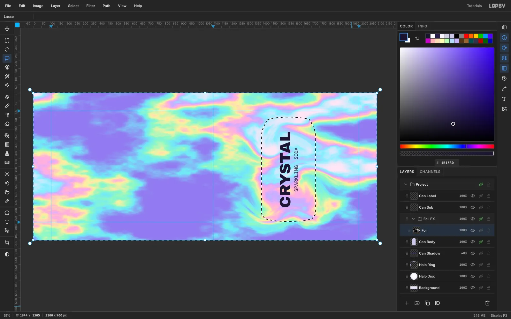

With **Foil** active, trace the can's outline again with the **Lasso** and
choose **Select → Inverse**. Then press [[Delete]] and [[Cmd+D]]. Only the
can keeps its foil.

> **Tip:** Instead of tracing the can again, [[Cmd]]-click the **Can Body**
> thumbnail in the Layers panel to select its exact outline. The same trick
> works for the shading and gloss steps below.

## Tone the foil

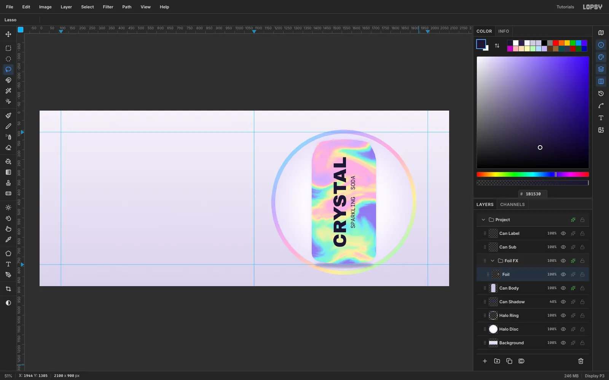

Select **Foil** and run **Filter → Hue/Saturation…** with **Lightness −32**.
Darker greys push more of the can into the middle of the ramp, so you get
more distinct bands and less pale pink.

## Shade the cylinder

Select **Can Label** and add a **Shade** layer above it. Select the can's
outline again and hold [[Cmd]] while you drag a horizontal **Linear**
gradient from the can's left edge to its right edge, with these stops, all in
`#2A1F4A`:

- 60% opacity at 0
- 0% at 20%
- 0% at 66%
- 70% at 100%

Deselect, then set **Blend** to **Multiply**. The edges roll away, and the
label wraps with them.

## Add gloss, the lid and the rim

**Gloss.** Add a **Gloss** layer and set the Rectangular Marquee
**Feather** to **10**.

1. Fill three tall white strips that run the height of the can: a wide one
   (about 38 px) a little in from the left edge, a thin one (about 8 px)
   just right of it, and a narrow rim light (about 12 px) near the right
   edge.
2. Set Feather back to 0.
3. Select the can's outline, choose **Select → Inverse** and press
   [[Delete]] to trim the strips.
4. Set the layer to **70%**.

**Lid.** On a **Lid** layer, marquee a **264 × 44** ellipse over the top of
the can. Fill it with a silver gradient: `#7D7A92`, `#F6F4FB`, `#A6A2BA`,
`#EAE7F3`, `#6F6C84`.

1. Add a slightly smaller, darker ellipse inside it for the recess.
2. Add a `#5E5A73` ellipse for the pull tab.
3. Add a tiny pale ellipse on the tab for its hole.

**Rim.** Lasso a thin crescent along the bottom of the can and fill it with
the same silver gradient.

## Cut crystal facets

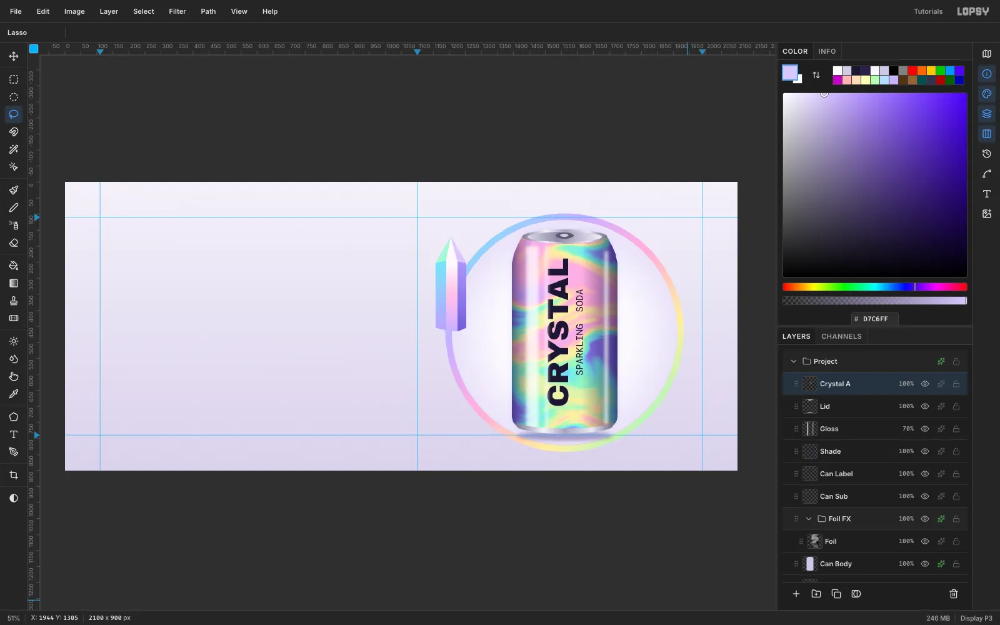

Add a **Crystal A** layer. Each face is a Lasso shape with its own fill:

- **Left face:** a vertical gradient from cyan `#8FE3F5` to `#B7A2FF`.
- **Centre face:** white to `#FFC4E3` to `#C4AEFF`, so it reads as the lit
  face.
- **Right face:** `#A898F4` to `#6F5CD0`, the shadow side.
- **Tip triangles:** flat mint, near-white and lilac.

Add three bottom triangles so the crystal has a point at each end.

Keep the light coming from the upper left on every facet you draw. That
consistency is what makes a flat polygon read as glass.

## Rotate the crystal

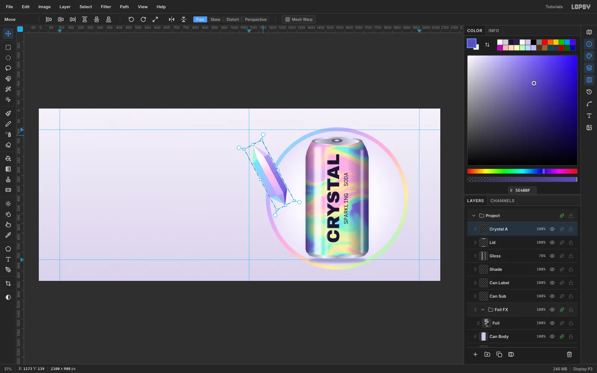

Marquee the crystal a few pixels larger than its edges and switch to
**Move**. Drag the rotation handle past the top-right corner about
**−28°**, so the top leans toward the headline. Press [[Cmd+D]] to
commit.

In Crystal A's effects, enable **Drop Shadow** with colour `#4A3A86`,
**Offset X 14**, **Offset Y 22**, **Blur 22** and **Opacity 28**. The
crystal seems to hover over the disc. Skip Outer Glow here: a white glow
disappears on a pale background.

## Duplicate and scale a copy

1. Choose **Layer → Duplicate Layer**. The copy becomes the active layer.
   Rename it **Crystal B**.
2. With the Move tool, drag it to the right of the can, a little below the
   ring's middle.
3. Marquee it and hold [[Cmd]] while you drag the bottom-right handle
   inward. [[Cmd]] keeps the scale uniform. Stop at about **62%**.
4. Press [[Cmd+D]].

## Rotate the copy

Marquee Crystal B again and rotate it **+70°**, so it leans away from the
can. Press [[Cmd+D]] to commit.

Commit each transform before you start the next one: scale, [[Cmd+D]],
then rotate, [[Cmd+D]]. Each step then starts from settled pixels.

## Scatter four crystals

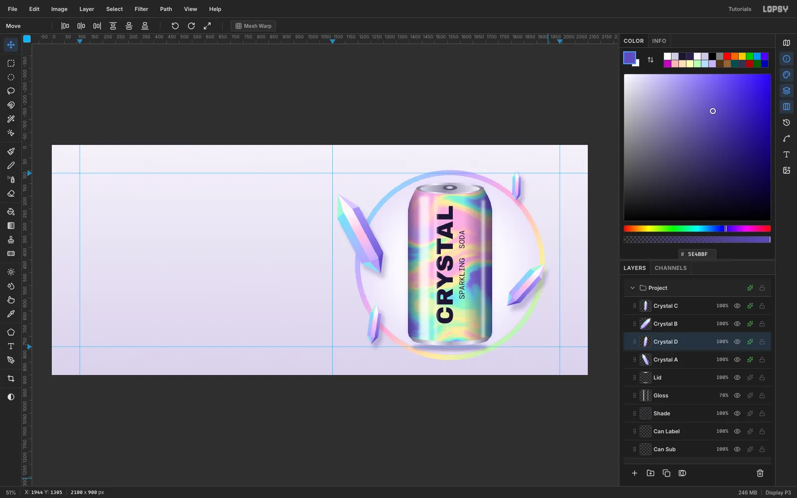

Make two more crystals the same way:

- **Crystal C:** duplicate Crystal B, scale it to **55%**, rotate it
  **−40°** and put it at the top right, overlapping the ring.
- **Crystal D:** duplicate Crystal A, scale it to **45%**, rotate it
  **+36°** and drop it at the lower left of the ring.

Four crystals in three sizes, all tilted differently, keep the orbit
lively without feeling random.

## Add bubbles and sparkles

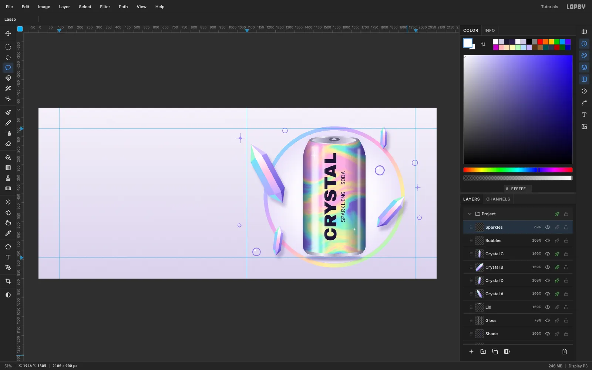

**Bubbles.** On a **Bubbles** layer, make six rings in three sizes:

1. Marquee a circle and fill it with `#8C7AE6`.
2. Choose **Select → Shrink…** by about 14% of the radius and press
   [[Delete]].
3. Add a small white ellipse at the upper left for the highlight.

Keep the bubbles off the ring line and away from the can's edges, so
nothing touches at a tangent.

**Sparkles.** On a **Sparkles** layer at **80%**, Lasso-fill four-point
stars. Make two in violet `#8A7CF0` beside the headline and ring, and two
small white ones on the can's gloss.

## Set the headline type

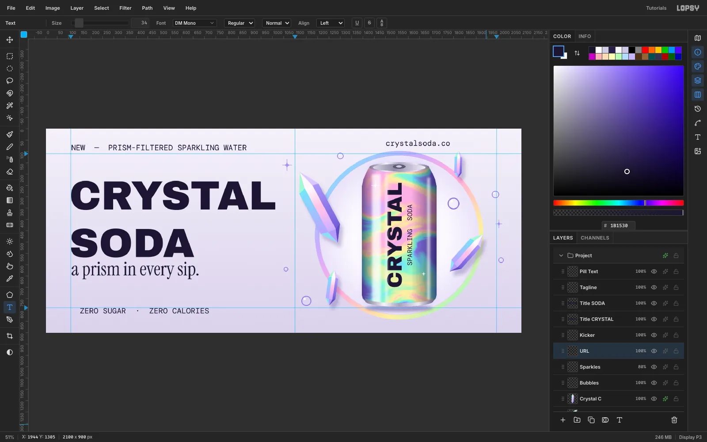

Select the Sparkles layer first so the new type lands on top. Make each
text layer by clicking in empty canvas. A click on existing text reopens it
for editing, so work from the bottom of the column up: each new line then
starts in open space above the last one.

- `ZERO SUGAR  ·  ZERO CALORIES` in **DM Mono 34**
- `a prism in every sip.` in **Instrument Serif 84**
- `SODA` and `CRYSTAL` in **Archivo Black 180**
- `NEW  —  PRISM-FILTERED SPARKLING WATER` in **DM Mono 34**
- `crystalsoda.co` in **DM Mono 34**

All of them are in ink `#1B1530`. For the `·` and `—`, use your system's
character viewer or paste them in.

## Align the column and draw the pill

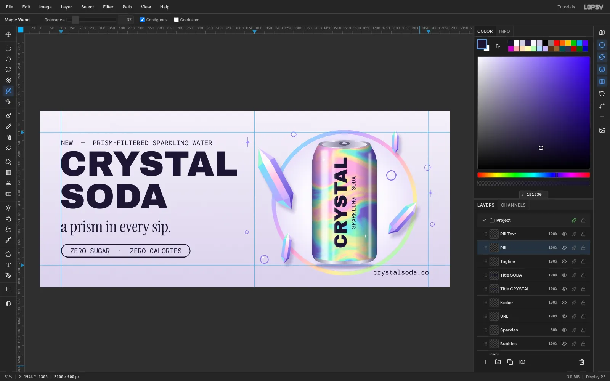

Move each line so its glyphs start on the left margin guide. Use Move-tool
drags for the big jumps and arrow-key nudges for the last pixels ([[Shift]]
plus an arrow moves 10 px). From the top, stack:

- the kicker, just under the top margin guide
- CRYSTAL, a small gap below it
- SODA, tucked close under CRYSTAL
- the tagline, a little further down

Aim for the whole column to sit centred on the canvas height.

For the pill, select **Tagline** and add a **Pill** layer.

1. Below the tagline, build a capsule about **662 × 70** with its left end
   on the margin guide, from a rectangle and two end circles, and fill it
   with ink.
2. Click inside it with the **Magic Wand** and choose **Select → Shrink…**
   at **3**.
3. Press [[Delete]] to leave a 3 px outline.

Centre the caption inside it, with equal space at both ends and the caps
vertically centred. Right-align the URL to the right margin guide below the
ring.

## Paint the holographic echo

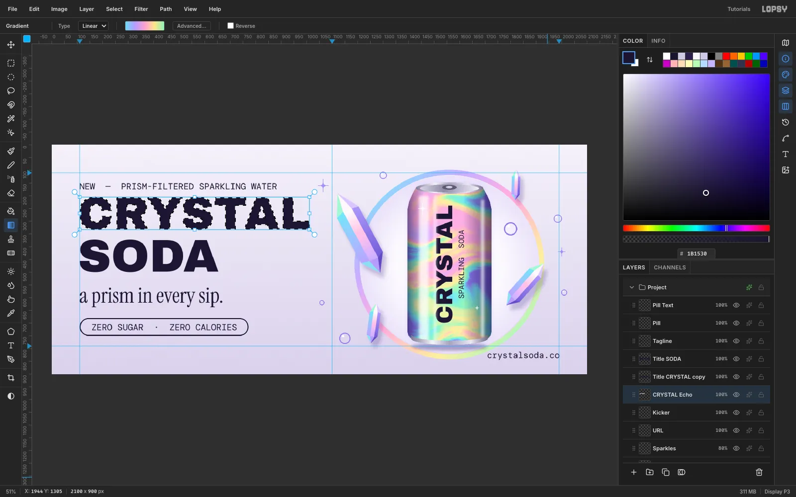

Each headline word gets a rainbow twin behind it:

1. Select **CRYSTAL** and choose **Layer → Duplicate Layer**. The copy
   lands 10 px right and down, so with the Move tool press [[Shift]]+[[←]]
   and [[Shift]]+[[↑]] once each to put it exactly over the original.
2. Select the original, which is now *under* the copy. Click **Rasterize
   Layer** in the Layers footer and rename it **CRYSTAL Echo**.
3. With the **Magic Wand**, untick **Contiguous** and click one letter.
   All the letters are selected.
4. Drag a diagonal **Linear** gradient across the word using the echo
   ramp: `#6FD8F2`, `#B49BFF`, `#FF9FCF`, `#FFE58A`, `#8FF0B8`.

## Offset the echoes

Deselect and nudge **CRYSTAL Echo** **12 px right and 12 px down** with the
arrow keys. Add a **Stroke** effect in `#1B1530` at **Width 2** so the
pastel edges stay crisp against the lilac background.

Repeat the whole echo process for **SODA**. With both words treated the
same, it reads as a deliberate 3D extrusion rather than a misprint.

## Group the type block

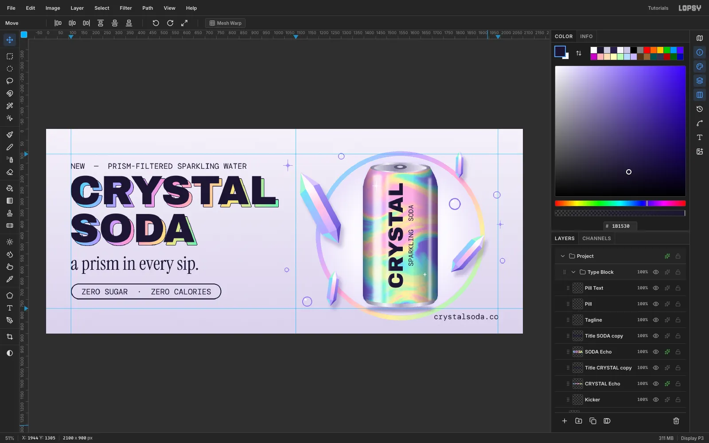

[[Cmd]]-click every layer in the left column except the URL:

- kicker
- both headline copies and both echoes
- tagline
- pill and caption

Choose **Layer → Group Layers** and rename the group **Type Block**. The
layers keep their stacking order, and you can now move the whole column as
one piece.

## Add grain and export

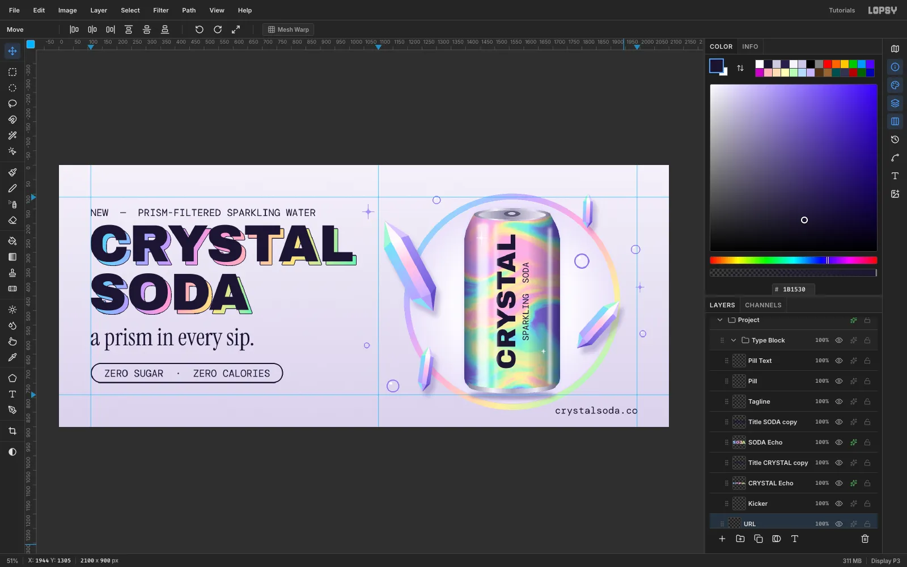

Select **Background** and run **Filter → Add Noise…** with **Mono**,
**Gaussian** and **Amount 5**. The fine grain turns the pale gradient into
matte paper, which makes the foil look shinier by contrast.

Nudge the URL down to clear the ring. Then use **File → Quick Export PNG**
for the billboard file and **File → Save Project** to keep every layer
editable.
