Holographic stickers are everywhere in tattoo shops: flash designs printed on rainbow foil and die-cut with a white border. This tutorial builds a whole sheet of them. The star is a **blue morpho**, the butterfly whose wings flash electric blue, and around it are six small classics of flash: a sleepy moon, crystals, a pierced heart, a scarab, an all-seeing eye and cherries.

The whole look comes from one trick. You make a single sheet of **holographic foil** once, then copy a piece of it into each design and tint it. Every sticker is built the same way, as a stack of layers inside its own group:

- **Ink**: the shape's selection grown by 9 px and filled near-black. This is the tattoo outline.
- **Foil**: a copy of the foil pasted into the shape itself.
- **Tint**: a gradient set to **Hard Light**, which pushes the foil towards the sticker's colour without flattening it. (A few stickers use Hue/Saturation instead, and the crystals use shading layers.)
- **Details**: veins, highlights and so on, each on its own layer.
- **Die-cut**: the silhouette grown by 22 px, filled white, with a drop shadow. This layer sits at the bottom of the group.

The fonts are free Google Fonts:

- **Pacifico** for the title
- **Unbounded** for the footer

The palette:

- Sheet `#2C2468` → `#1E1945` → `#141030` (radial)
- Outline ink `#0D0B1A`
- Die-cut white `#F5F2FF`
- Foil `#3A2C8F` → `#5FA8FF` → `#7FF5DC` → `#FFF1A8` → `#FFA8D8` → `#B99CFF` → `#F6F8FF`
- Morpho tint `#0A2BFF` → `#19C9FF` → `#2F6BFF` → `#8B5CFF` → `#FF4FD8`
- Heart pink `#FF2E8A` → `#C455FF`, blood `#FF3D9A`
- Gold `#FFC94A` → `#FF8F5A`
- Footer lavender `#B9A6FF`

Lopsy keeps everything inside a top-level **Project** group. New layers land just above whichever layer is selected, inside its group, so check which row is selected before you add one.

> **Note:** A few screenshots (the wing tint, the wing margins and the blade) were re-taken after later steps, with those layers hidden. If you see hidden rows in the Layers panel that you haven't made yet, that's why.

## Create an 1800 × 2400 document

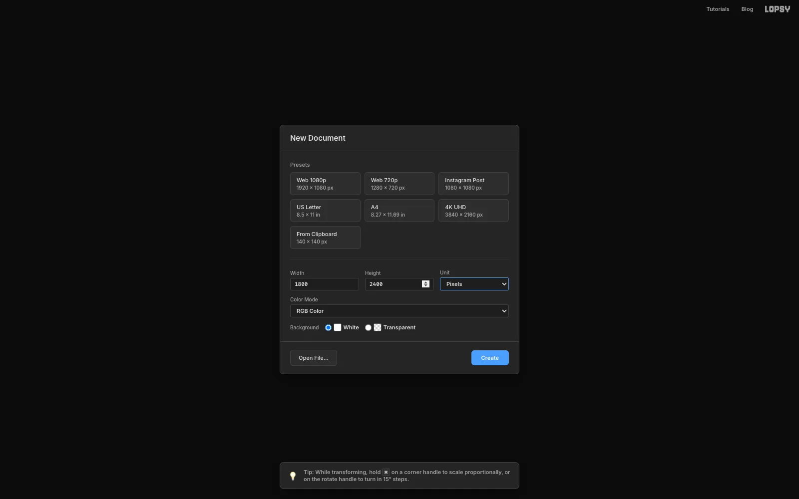

Open [Lopsy](/). In the **New Document** dialog, set **Width** to `1800` and **Height** to `2400` pixels and click **Create**. That's a 3:4 portrait sheet.

Select **Background**, set the foreground colour to `#120F26` and choose **Edit → Fill**. This dark indigo only shows in the thin margin round the sheet.

## Start the foil with Clouds and Solarize

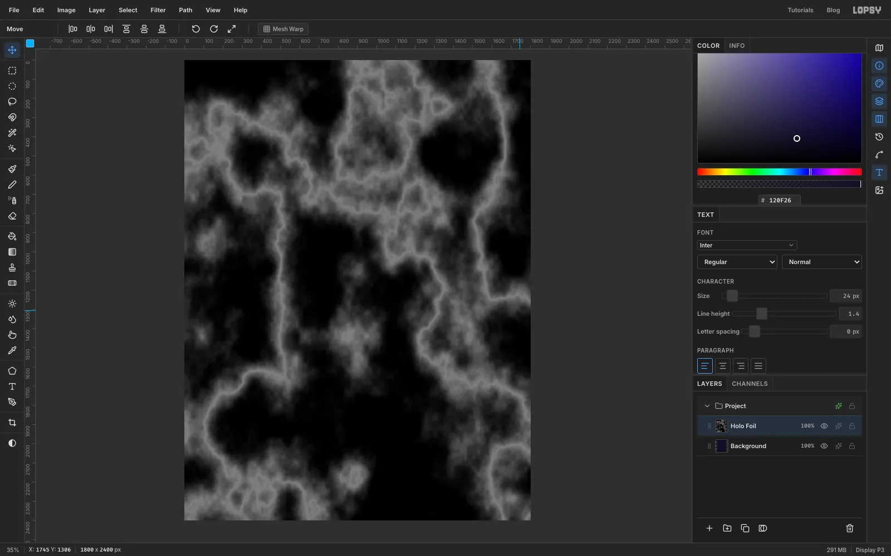

Rename **Layer 1** to `Holo Foil`. Run **Filter → Clouds…** with **Scale** `5`. It always renders in greys, whatever your colours are set to.

Now run **Filter → Solarize…** with **Threshold** `128`. Solarize flips every tone above the threshold, so the soft clouds turn into bright crinkled ridges that wander across the page. Those ridges become the rainbow bands of the foil.

## Stretch and soften the ridges

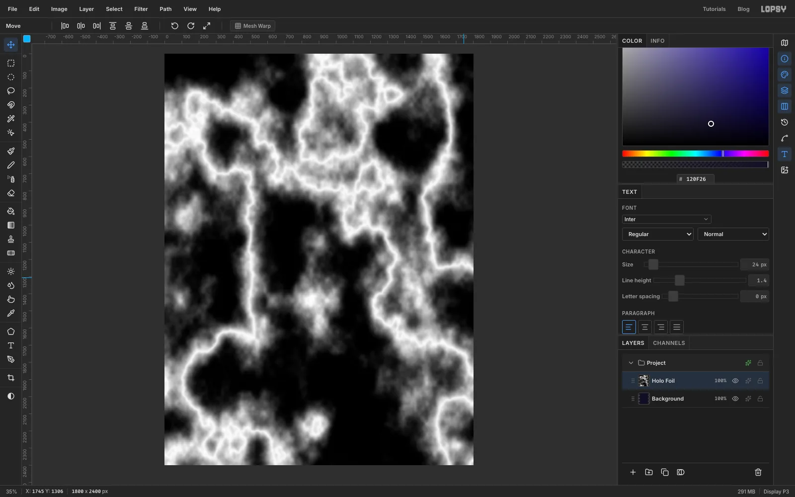

Solarize leaves everything in the darker half of the range. Spread it back out with **Filter → Brightness/Contrast…**: **Brightness** `50`, **Contrast** `100`.

Then run **Filter → Gaussian Blur…** with **Radius** `12`, so the bands flow into each other smoothly. Do any tonal tweaks now, while the layer is still plain grey. Once the colour map goes on in the next step, it's much easier to judge the result.

## Map the greys to a rainbow

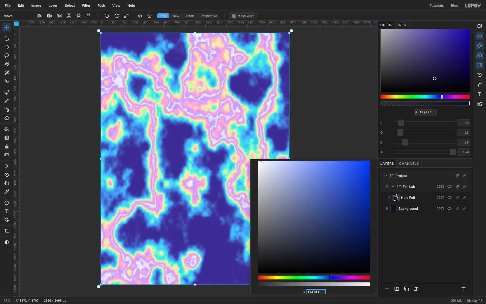

With **Holo Foil** selected, choose **Layer → Group Layers** and rename the group `Foil Lab`. Click the group's effects button to open its drawer, click **Add Adjustment** and pick **Gradient Map**.

Click the handle row under the gradient bar to add stops, then select each stop and type its hex code:

- 0%: `#3A2C8F`
- 18%: `#5FA8FF`
- 36%: `#7FF5DC`
- 54%: `#FFF1A8`
- 70%: `#FFA8D8`
- 86%: `#B99CFF`
- 100%: `#F6F8FF`

Each grey becomes a colour, so the ridges turn into thin-film rainbow bands with dark indigo pools between them.

## Add a diagonal sheen

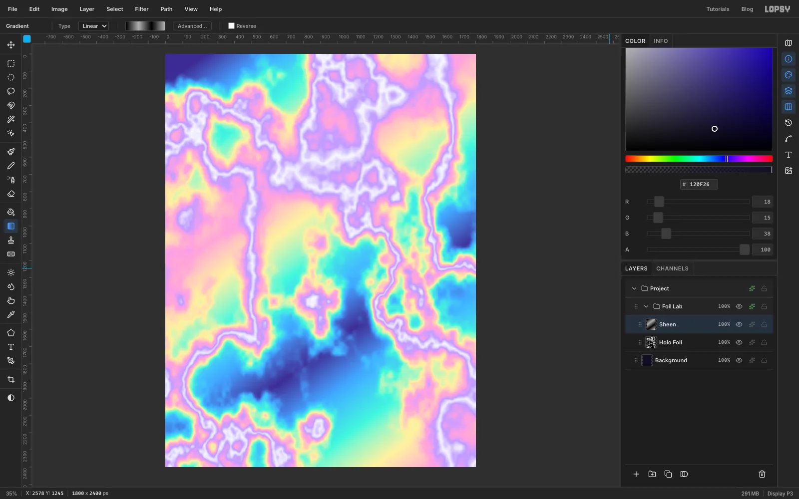

Real foil catches the light in broad stripes. With **Holo Foil** selected, click **Add Layer** (it goes inside Foil Lab) and name it `Sheen`.

Pick the **Gradient** tool, set it to **Linear** and open **Advanced…**. Make four stops: black at 0%, `#B0B0B0` at 33%, black at 66% and `#B0B0B0` at 100%. Drag from the top-left corner of the canvas to the bottom-right, then set the layer's blend mode to **Screen**. The stripes go through the Gradient Map too, so they come out as bright passes of colour rather than grey.

## Bake the foil into one layer

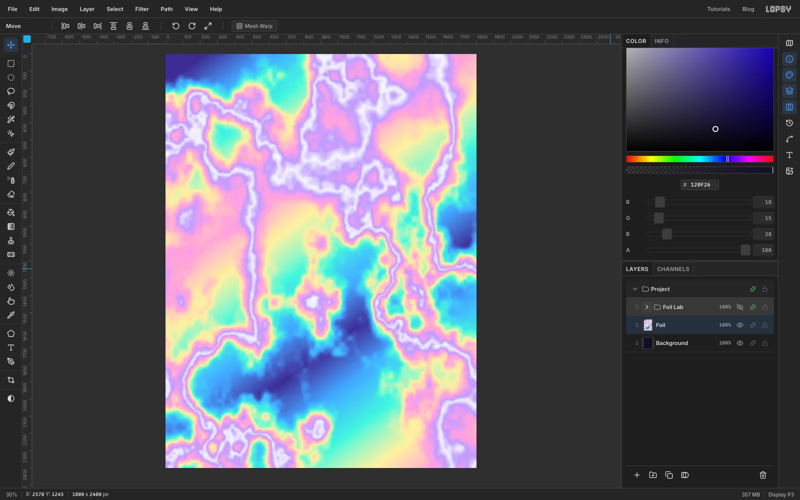

Deselect, then choose **Edit → Copy Merged** ([[Cmd+Shift+C]]). Select **Background** and paste ([[Cmd+V]]). The flattened foil lands on a new layer just above Background, outside the group. Rename it `Foil`.

Hide **Foil Lab**, then hide **Foil** too. From now on you'll copy pieces of this hidden layer into each sticker.

## Draw the sticker sheet

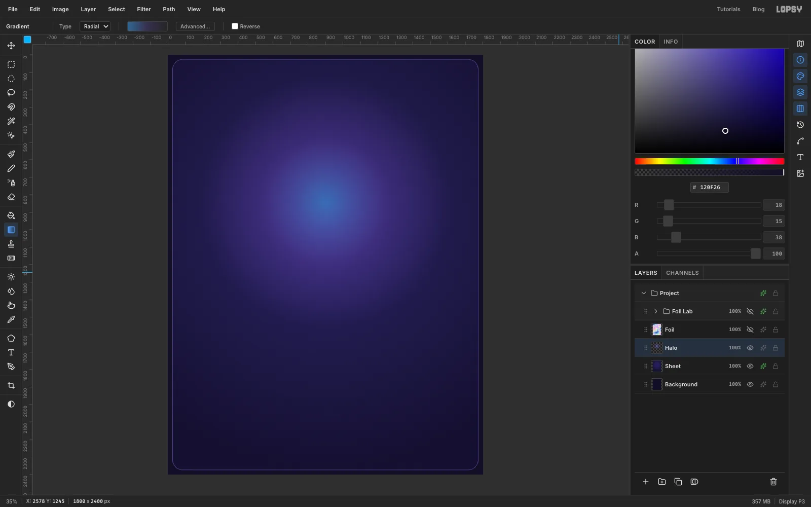

Select **Background**, click **Add Layer** and name it `Sheet`. With the **Shape** tool set to **Rectangle**, a **Corner Radius** of `56` and the fill `#1E1A3A`, drag out a rectangle that leaves a narrow margin, about 28 px, on every side.

Give it some depth:

- [[Cmd]]-click the Sheet thumbnail to select it. Then drag a **Radial** gradient (`#2C2468` → `#1E1945` → `#141030`) from just above the centre down to the bottom edge.
- Run **Filter → Add Noise…** with **Amount** `6`, **Mono** and **Gaussian**, for a printed-card grain.
- In the effects drawer, turn on **Stroke** at **Width** `3` in `#4A4385`.

Last, add a layer called `Halo` and drag a radial gradient from the middle of the upper half outwards. Use `#3FA9FF` at 50% opacity, then `#8B5CFF` at 18%, then fully transparent. Set the layer to **Screen**. This glow will sit behind the butterfly.

## Lasso the left wings

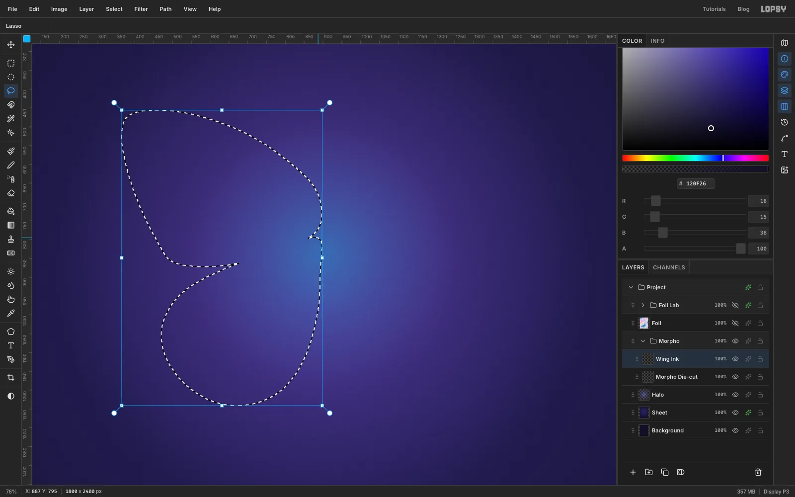

Select **Halo**, click **New Group** and name it `Morpho`. Inside it, click **Add Layer** twice and name the layers `Morpho Die-cut` and then `Wing Ink`. Wing Ink should sit above the die-cut layer.

Zoom in on the upper half. You only need to draw the **left** wings; the right ones will be a mirror copy. Keep the wings' inner edge on the vertical centre of the page (900 on the top ruler). The body will cover that seam, and the mirror copy will meet it exactly. With the **Lasso**:

- Draw the forewing. Start next to the body, about a third of the way down the sheet. Sweep up and out to a pointed tip near the top left, then come down the outer edge and back in to the body.
- Hold [[Shift]] and draw the hindwing below it: a rounded lobe that bulges out to the left and down. Shift adds it to the forewing selection.

## Ink the outline

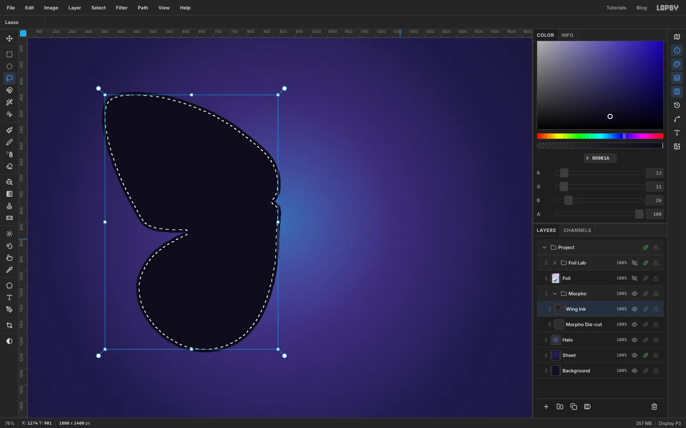

Choose **Select → Grow…** with **Amount** `9`. Set the foreground to `#0D0B1A` and choose **Edit → Fill**. Then **Select → Shrink…** by `9` to get back to the original wing shape, leaving a 9 px ink rim showing outside it. Keep the selection.

## Paste the foil into the wing

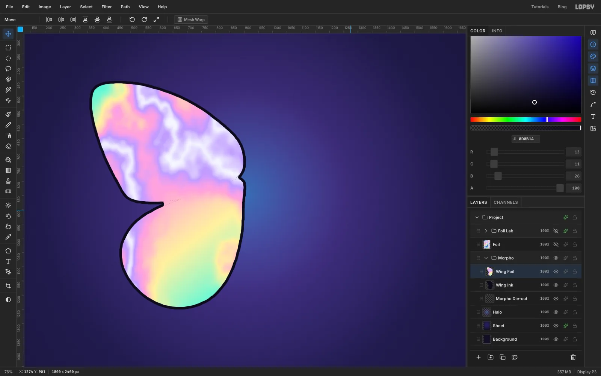

Select the hidden **Foil** layer and copy ([[Cmd+C]]). The selection limits the copy to the wing shape. Select **Wing Ink** and paste ([[Cmd+V]]). Pasting from inside Lopsy puts the piece back exactly where it was copied from, so the foil drops neatly inside the ink. Rename the new layer `Wing Foil` and deselect.

You'll repeat this **copy from Foil, paste above the Ink** move for every sticker.

## Tint it iridescent blue

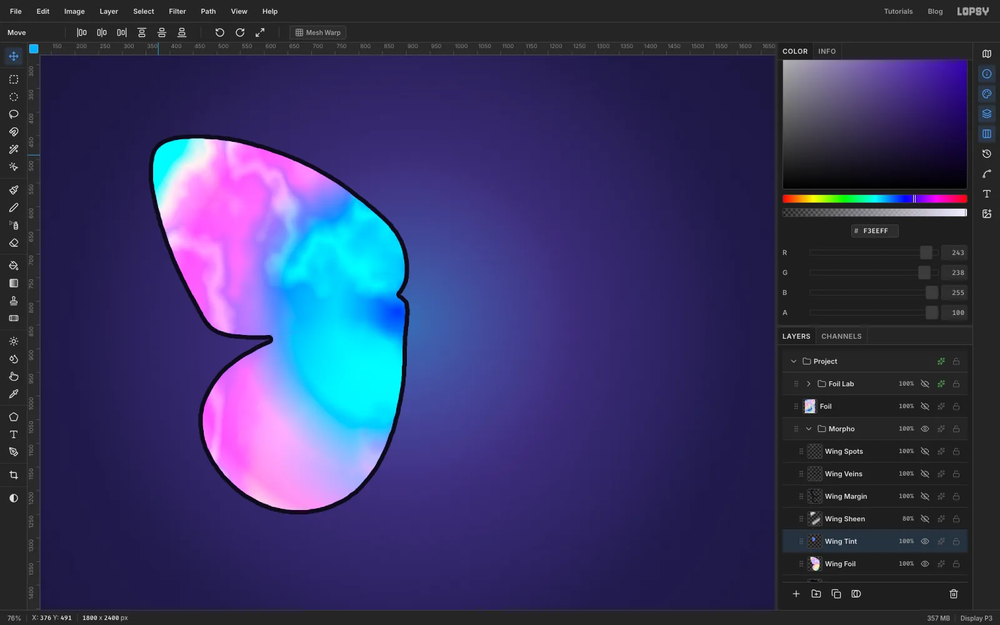

Add a layer above Wing Foil called `Wing Tint`. [[Cmd]]-click the Wing Foil thumbnail to select the wing. Then drag a **Radial** gradient from where the wings meet the body out towards the forewing tip. Use these stops:

- `#0A2BFF` at 0%
- `#19C9FF` at 22%
- `#2F6BFF` at 42%
- `#8B5CFF` at 60%
- `#FF4FD8` at 76%
- `#19C9FF` at 100%

Deselect and set the layer to **Hard Light**. Hard Light keeps the foil's light-and-dark bands and lays the hue rings over them, so the wing shimmers from blue to violet to pink instead of turning flat.

## Add an Overlay sheen

Add a layer called `Wing Sheen` and [[Cmd]]-click Wing Foil again. In **Advanced…**, make an all-white **Linear** gradient with two bright bands, one about a fifth of the way along and one about two-thirds. Each band fades to fully transparent on both sides, which you set with the stop's opacity. Drag it from the top-left of the wing to where it meets the body.

Deselect, set the layer to **Overlay** and drop its opacity to `80%`. The bright streaks only show on the colour, not on the black margins you're about to add.

## Cut the black margins

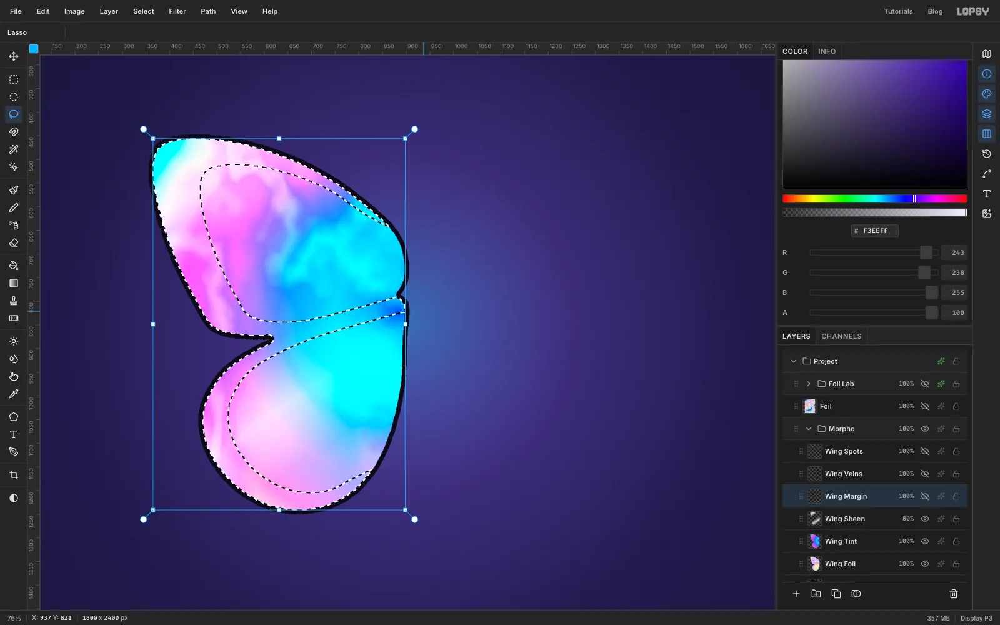

Real morphos have a black border round the blue. Add a layer called `Wing Margin` and [[Cmd]]-click Wing Foil. With the **Lasso**, hold [[Alt]] (Option) and draw round the inner blue panel of the forewing to subtract it from the selection. Keep about 80–100 px from the outer edge at the tip, and less further in. Let the lasso run past the body on the right. Do the same for the hindwing.

What's left is a band along the outer edges. Choose **Select → Grow…** by `2` so the band overlaps the outline cleanly, then fill it with `#0D0B1A`.

> **Tip:** If you see a faint light hairline along the old edge of the wing, [[Cmd]]-click the Wing Margin thumbnail and choose **Edit → Fill** once more.

## Paint veins and white spots

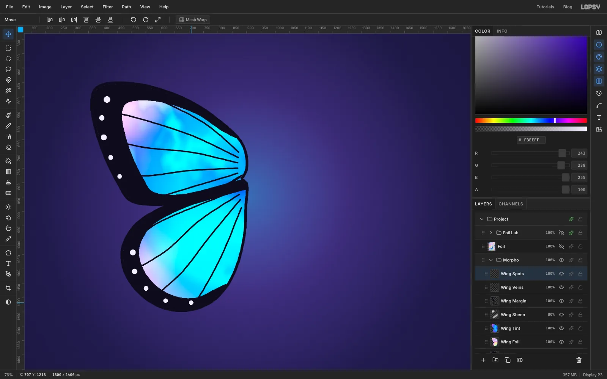

Add a layer called `Wing Veins` and [[Cmd]]-click Wing Foil, so the brush can't stray outside the wing. With a hard **Brush** at **Size** `6` in ink colour, paint veins fanning out from the body to the edges: five across the forewing and four across the hindwing. Use a `9` px brush along the forewing's lower edge so the two wings read as overlapping.

Deselect, add a layer called `Wing Spots`, and click white `#F3EEFF` dots along the margin with brush sizes between 16 and 24. Use five on the forewing and five on the hindwing, smaller towards the body.

## Merge and mirror the wing

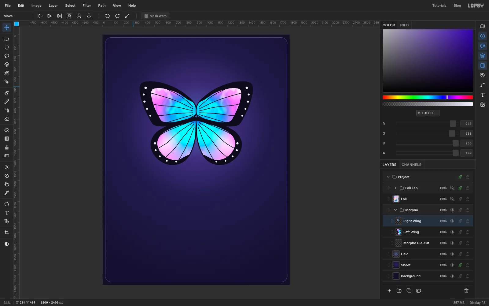

Merge the wing into one layer. Select each of these in turn and choose **Layer → Merge Down**: Wing Tint, Wing Sheen, Wing Margin, Wing Veins and Wing Spots, then Wing Foil. Merging bakes in each layer's blend mode. Rename the result `Left Wing`.

Choose **Layer → Duplicate Layer**, rename the copy `Right Wing`, and choose **Image → Flip Horizontal**. It mirrors the layer across the centre of the page, so the copy lands exactly opposite the original, with no lining up to do.

## Add the body and antennae

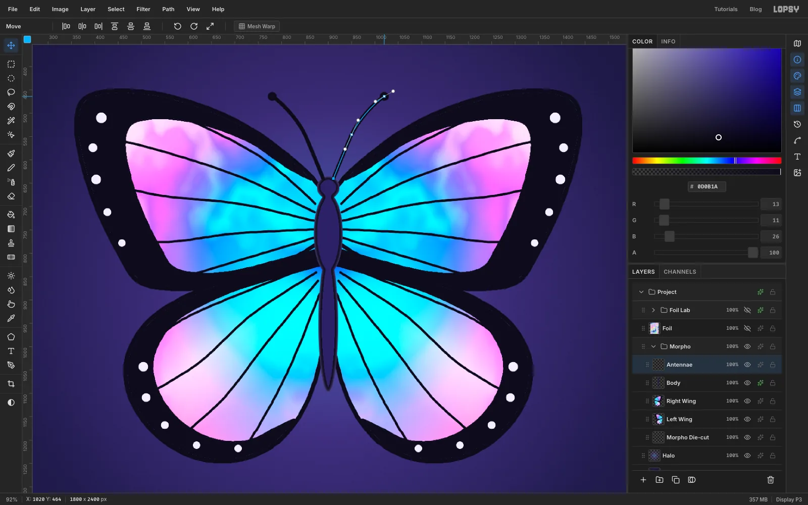

Add a layer called `Body`. With the **Elliptical Marquee**, draw a small round head. Then hold [[Shift]] and add a taller oval for the thorax below it and a long thin one for the abdomen. Fill the whole shape with ink, **Shrink** by `7`, and fill again with `#2B2163`. Add an **Inner Glow** at **Size** `10` in `#A88BFF`.

Add a layer called `Antennae`. With the **Pen** tool set to a **Stroke** of `8`:

- Click on the head and click again halfway up.
- Drag a smooth point at the tip, curving out and up.
- Press [[Enter]] to stroke the path.

Do the same on the other side. Finish each tip with a single 20 px brush dot.

## Cut the white die-cut border

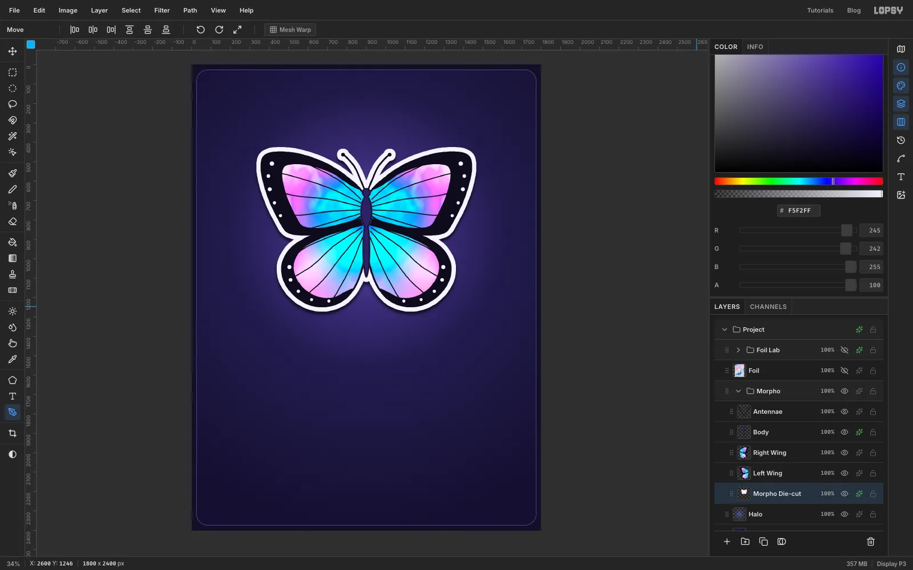

[[Cmd]]-click the **Left Wing** thumbnail. Select **Morpho Die-cut**, **Grow** by `22` and fill with `#F5F2FF`. Do the same for Right Wing, Antennae and Body. Each fill adds to the same white shape, which gives you one rounded sticker outline.

Turn on **Drop Shadow** for the die-cut layer: **Offset X** `0`, **Offset Y** `14`, **Blur** `24`, **Opacity** `80`, colour `#05040C`.

## Make the sleepy moon

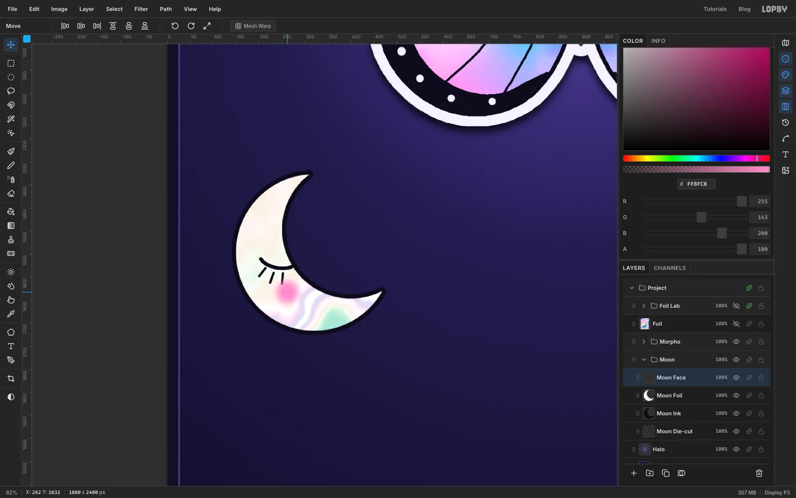

Collapse the Morpho group to keep the panel tidy. Each small sticker gets the same setup as the butterfly. Select **Halo**, make a **New Group** (here `Moon`), and add two layers inside it, `Moon Die-cut` and then `Moon Ink`.

With the **Elliptical Marquee**, hold [[Cmd]] and drag a circle about 340 px across, below the butterfly on the left. Then hold [[Alt]] and drag a slightly smaller circle offset up and to the right; subtracting it leaves a crescent.

Ink and foil it as before: Grow 9, fill ink, Shrink 9, then copy from Foil and paste above the ink. For a pearly opal moon, use **Filter → Hue/Saturation…** instead of a tint: Hue `-20`, Saturation `-35`, Lightness `12`.

On a `Moon Face` layer:

- Draw the closed eye with the **Pen**: two points with curved handles, stroked at `8`.
- Add three short lashes. Click, then [[Shift]]-click with a 6 px brush.
- Add a soft pink `#FF8FC8` blush with a 70 px brush at **Hardness** `0`, clicked twice.

Then cut the die-cut the same way as the butterfly's.

## Facet the crystal cluster

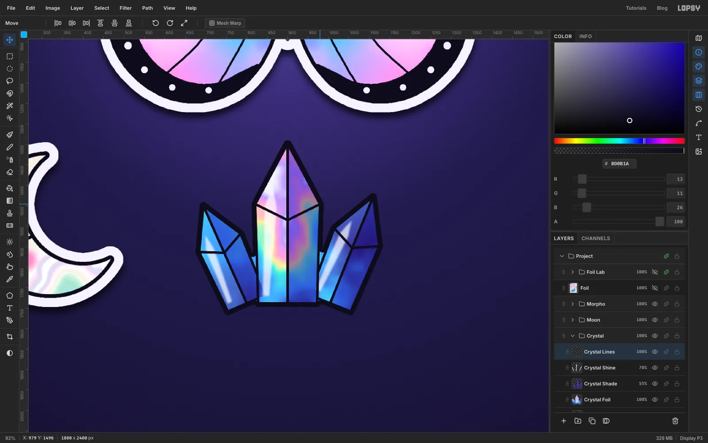

In a `Crystal` group, lasso three pointed shards in the centre of the row with straight clicks:

- a tall upright one in the middle
- a shorter one leaning left
- one leaning right

Hold [[Shift]] for the second and third. Ink and paste the foil as usual.

Shade the facets:

- **Crystal Shade**: lasso the right half of each shard and fill with `#4B2FB8`, set to **Multiply** at `55%`.
- **Crystal Shine**: lasso a thin sliver on each left face, **Select → Feather…** `4`, and fill white, set to **Screen** at `70%`.

For the facet lines, add `Crystal Lines`. Lasso the middle shard, then choose **Select → Inverse**. Now the lines for the two back shards stop where they pass behind the front one. Draw them with a 7 px brush using click-then-[[Shift]]-click straight lines: each outline, a centre ridge and a V across the tip. Deselect and draw the front shard's lines.

## Put the blade behind the heart

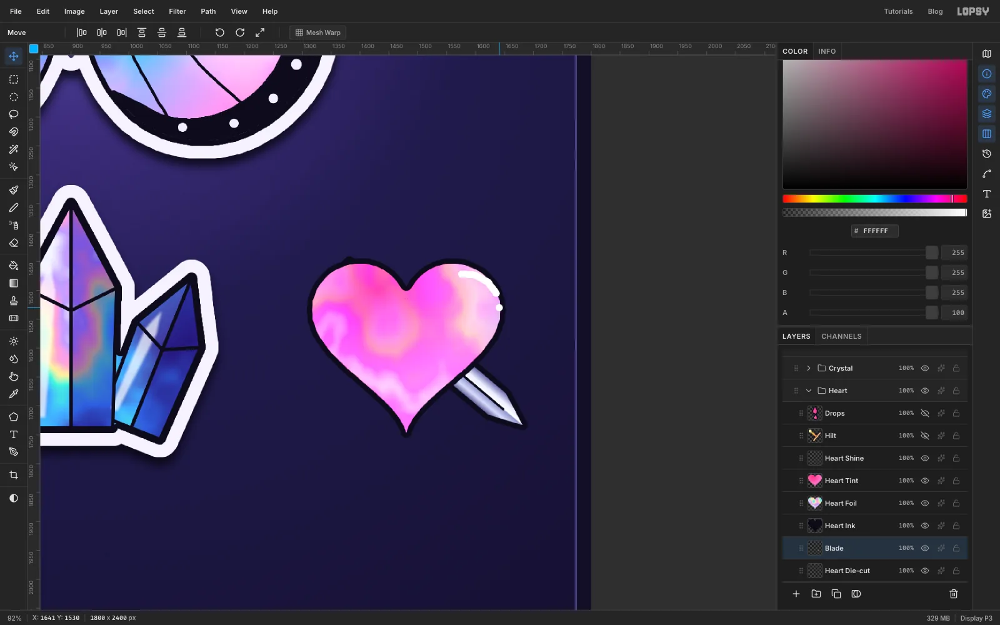

In a `Heart` group, lasso a heart shape on the right of the row. Ink it, paste the foil, and add a **Hard Light** radial tint from `#FF2E8A` through `#FF6FB5` to `#C455FF`. On a new layer above the tint called `Heart Shine`, brush a white highlight stroke round the right lobe and add a dot below it.

The trick to a dagger that *pierces* the heart: the blade goes on a layer **under** the heart, and the hilt on a layer above it.

- Select **Heart Die-cut** and add a layer called `Blade`. It sits under the heart ink.
- Lasso a long blade running diagonally from the upper left of the heart to a point past its lower right.
- Ink it, then fill it with a chrome **Linear** gradient dragged **across** the blade, not along it. Use alternating light and dark greys: `#5B5A9A`, `#E9ECFF`, white, `#8E93C8`, `#D8DCF8`, `#4A4785`.
- Add a 5 px centre line.

The heart covers the middle, so only the tip shows where it comes out.

## Add the hilt and the blood drops

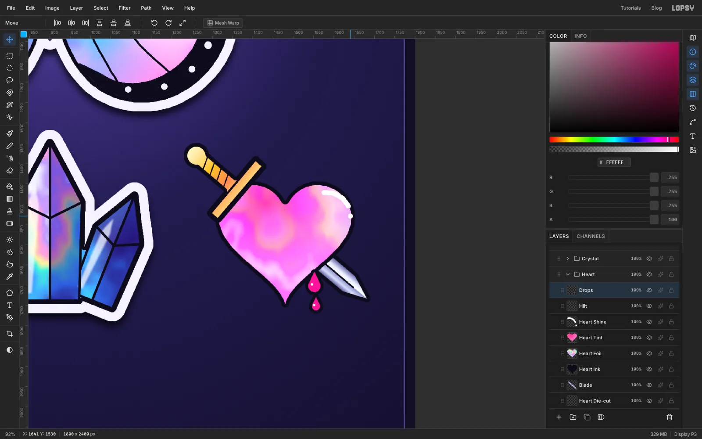

Select **Heart Shine** and add a layer called `Hilt`, so it sits above the heart. Lasso the crossguard as a short bar that rests across the heart's upper-left edge, where the blade goes in. [[Shift]]-add the grip, then [[Shift]]-add a round pommel at the end with the **Elliptical Marquee** (hold [[Cmd]] too to keep it a circle).

Ink the hilt, then fill it with a gold gradient (`#FFF4C2` → `#FFC94A` → `#FF8F5A` → `#FFE08A`) running along the dagger. Outline the guard and add four short wrap lines across the grip with the brush.

On a `Drops` layer, lasso two teardrops hanging under the spot where the blade comes out. Ink them, fill them `#FF3D9A`, and add a white glint to each. Die-cut **Heart Ink**, **Blade**, **Hilt** and **Drops** together.

## Build the scarab

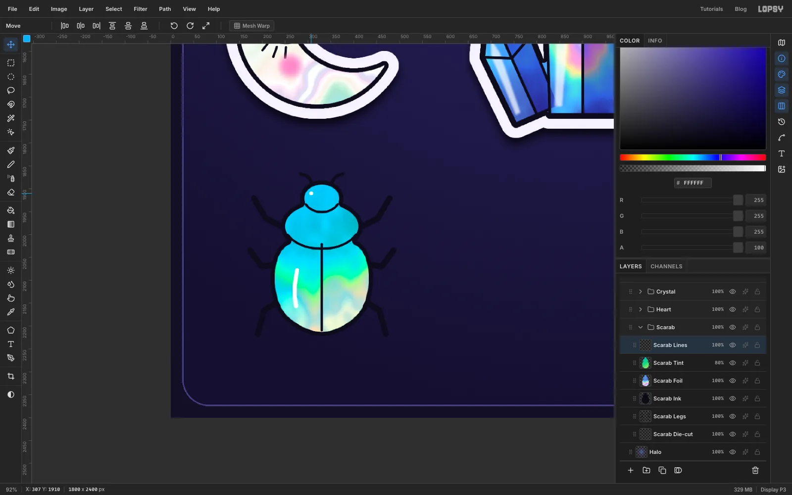

Start the bottom row with a `Scarab` group. With the **Elliptical Marquee**, make a small head and [[Shift]]-add a wider oval for the thorax. Then [[Shift]]-lasso a rounded shield for the wing cases. Ink it, paste the foil, and add a **Hard Light** tint from `#00B8C8` to `#14D97A` to `#D6F25A` at `80%`.

Select **Scarab Die-cut** and add a layer called `Scarab Legs`, so it sits **between** the die-cut and the ink and the legs tuck under the body. Draw six legs with a 14 px brush as click-and-Shift-click zigzags, and two short 8 px antennae.

On a `Scarab Lines` layer above the tint:

- Draw a straight line down the middle of the wing cases.
- Draw two curved lines where the head meets the thorax and the thorax meets the wing cases.
- Add a white streak and a white dot for shine.

Die-cut **Scarab Ink** and **Scarab Legs** together.

## Draw the eye's rays with Sunburst

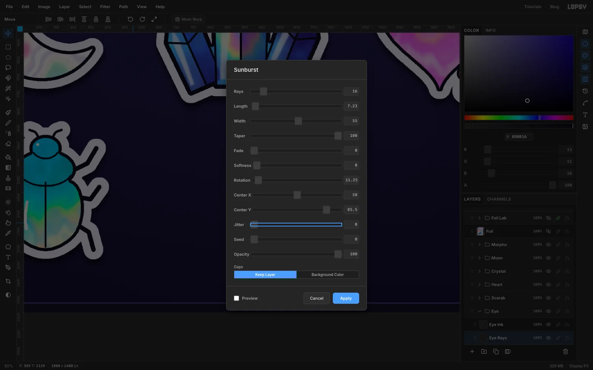

In an `Eye` group, select **Eye Die-cut** and add a layer called `Eye Rays`. Set the foreground to ink and open **Filter → Sunburst…**. Set:

- **Rays** `16`
- **Width** `55`
- **Taper** `100`, for pointed rays
- **Rotation** `11.25`, so no ray points straight up

Move the centre onto the eye: keep **Center X** at `50` and set **Center Y** to about `85`. **Length** is a percentage of the distance to the farthest corner, so about `7` gives rays roughly 160 px long.

## Finish the sun-eye

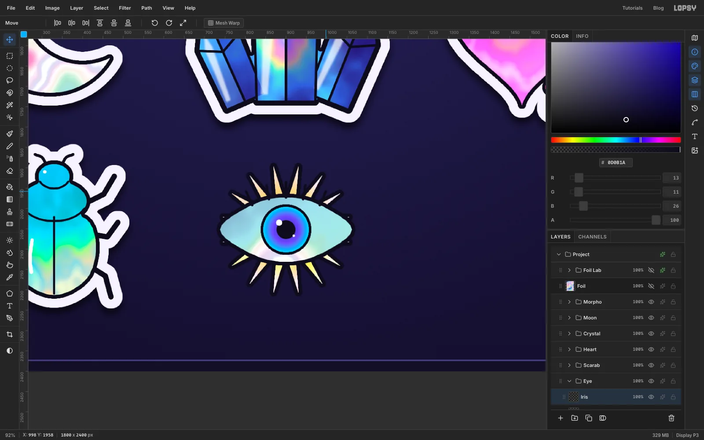

Give the rays an outline and a foil fill:

1. [[Cmd]]-click the Eye Rays thumbnail, keep **Eye Rays** selected, **Grow** by `9` and fill with ink. Growing outwards keeps the thin ray tips intact.
2. **Shrink** by `9`, copy from **Foil**, select **Eye Rays** and paste. Rename the paste `Ray Foil`.
3. Add a `Ray Tint` layer above it, [[Cmd]]-click Ray Foil, and drag a radial gold gradient (`#FF9F43` → `#FFD84D` → `#FFF4B8`) out from the centre. Set it to **Hard Light**.

Then the almond. Lasso an almond shape across the middle of the rays and ink it on **Eye Ink**, which sits above the ray layers. Paste foil into it as usual, and give that foil the moon's pearly Hue/Saturation settings.

On an `Iris` layer:

- Draw a circle, ink it, and fill it with a radial gradient from `#2A1A8F` to `#6B4BFF` to `#36D6FF`.
- Add a black pupil and two white glints.
- Add five short lashes along the upper lid.

Die-cut **Eye Rays** and **Eye Ink**.

## Add the cherries

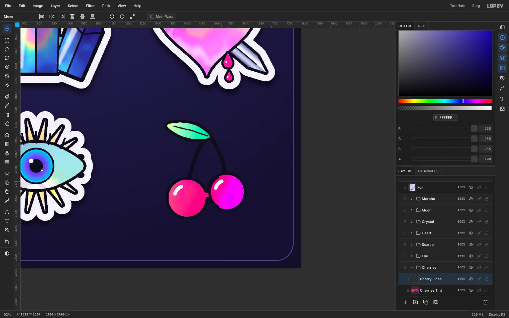

In a `Cherries` group, add a `Stems` layer above the die-cut. Brush two curved 14 px stems that meet at the top. Lasso a leaf that comes off the join, then ink it, fill it with a mint gradient (`#3BE8A0` → `#E6FFB0`) and give it a centre vein.

Draw two circles with the **Elliptical Marquee** and [[Shift]], ink them and paste the foil. Tint them **Hard Light** from `#FF2E63` to `#E0115F` to `#7A1FFF`. Add a 9 px ink arc on a new layer where the two cherries touch, and a curved white highlight on each. Die-cut **Cherries Ink** and **Stems**.

## Set the title as a sticker

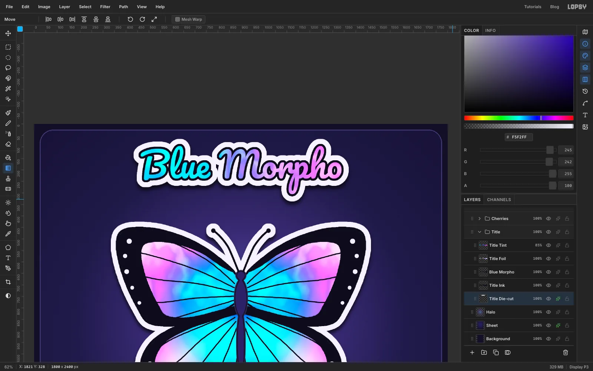

Select **Halo**, make a `Title` group, and add `Title Die-cut` and `Title Ink` layers inside it. With the **Text** tool, pick **Pacifico** at **Size** `150`, click in an empty area and type `Blue Morpho`. Move it with the arrow keys so it's centred across the page, close to the top. Leave room above it for the white border.

Text can be used like any other shape:

- [[Cmd]]-click the text layer's thumbnail to select the letters.
- Select **Title Ink**, Grow `9` and fill with ink.
- [[Cmd]]-click the text thumbnail again, copy from Foil and paste above the text. Rename the paste `Title Foil`.
- Add a `Title Tint` layer above it, [[Cmd]]-click Title Foil, and drag a linear gradient from left to right: `#19C9FF`, `#2F6BFF`, `#8B5CFF`, `#FF5FB8`. Set it to **Hard Light** at `85%`.
- Die-cut the Title Ink layer.

## Add the footer line

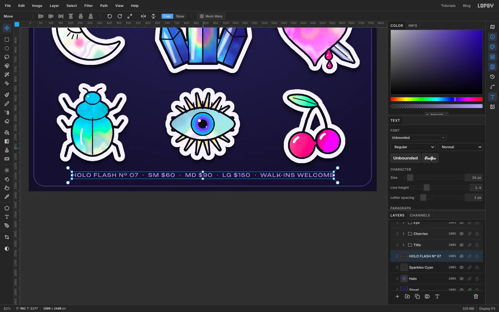

Select **Halo** and add a layer called `Sparkles Cyan`; you'll draw sparkles on it next. With it selected, new text lands at the top level instead of inside a sticker group. With the **Text** tool, choose **Unbounded** at `26`, colour `#B9A6FF`. Click in an empty area and type the prices and details, with a spaced middle dot between every item:

`HOLO FLASH Nº 07  ·  SM $60  ·  MD $90  ·  LG $150  ·  WALK-INS WELCOME`

In the **Text** panel, set **Letter spacing** to `3`. Nudge the line with the arrow keys until it's centred, halfway between the bottom row of stickers and the sheet's edge.

## Scatter sparkle clusters

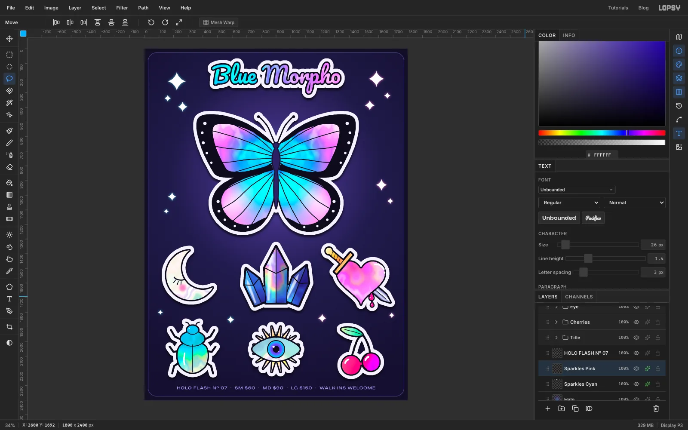

Select the `Sparkles Cyan` layer you made for the footer. Lasso four-point stars: go from tip to tip, bowing each side in towards the centre, like a diamond pinched at the waist. [[Shift]]-add the next ones as you go:

- a big one and two small ones to the left of the title
- a couple more beside the butterfly's left wing
- a few small ones in the gaps round the lower rows (you'll prune them at the end)

Mix three sizes, roughly 130, 70 and 40 px across. Fill them white and give the layer an **Outer Glow** at **Size** `24` in `#5FE3FF`.

Add a `Sparkles Pink` layer above it for the ones on the right, with an `#FF7FD8` glow. Keep them in clusters near the title and wingtips rather than sprinkling them evenly.

## Paste, scale and rotate one more sparkle

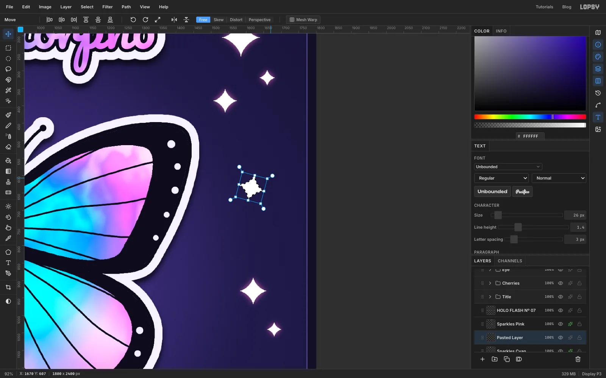

On **Sparkles Cyan**, drag a **Rectangular Marquee** round the big sparkle by the title. Copy and paste it; the paste is selected and the **Move** tool is active. Then:

1. Drag it into the empty margin to the right of the butterfly's forewing.
2. Hold [[Cmd]] and drag a corner handle inwards to scale it to about 60%, keeping its proportions.
3. Hold [[Cmd]] and drag the round handle just outside a corner to rotate it. Cmd snaps to 15° steps, so stop at one step.
4. Press [[Cmd+D]] to commit the transform, then **Merge Down** the pasted layer into Sparkles Cyan, so it gets the cyan glow.

## Final polish

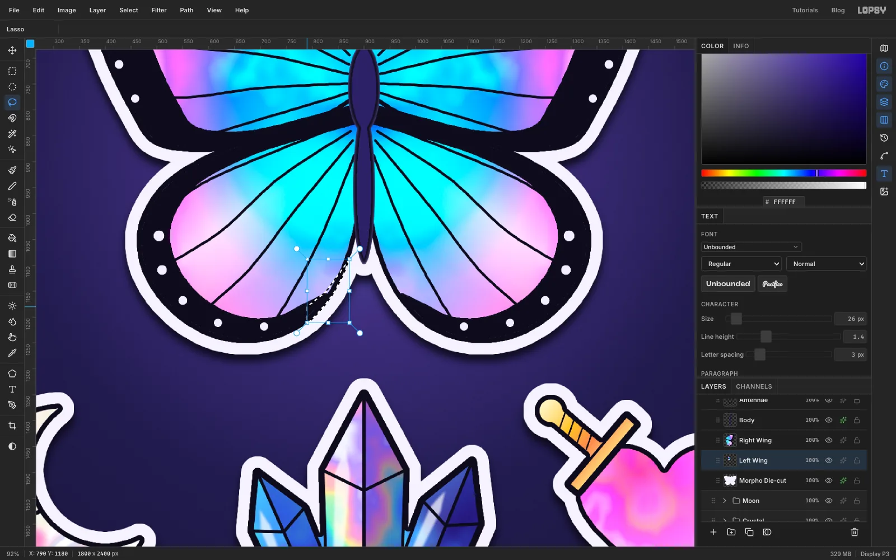

Step back and fix the small things:

- **Close the margin gap.** At the inner bottom of each hindwing, the black margin stops short of the body. Select **Left Wing** and [[Cmd]]-click its thumbnail. Hold [[Shift]]+[[Alt]] and lasso a wedge from the end of the margin up to the body; that keeps only the overlap. Fill it with ink. Repeat on **Right Wing**.
- **Even out the space.** The title sits too close to the top edge. Select the **Title** group and, with the **Move** tool, nudge it down about 20 px with the arrow keys ([[Shift]] + arrow moves 10 px at a time). Move the two big sparkles beside it the same way: marquee each one, then nudge it.
- **Clear the gutter.** If a sparkle crowds a sticker between the rows, marquee it and press [[Delete]].
- **Read the footer.** Raise the footer to `30` px and re-centre it.

Save the project with **File → Save Project**, then use **File → Quick Export PNG** for the finished sheet.
