Infographic Christmas cards are a nerdy genre with a big payoff. The tree is
a real chart, the ornaments are data points, and the season's greetings come
with a legend and an axis. The joke only works if the chart is honest, so every
number on the card matches what's drawn.

In this tutorial you'll make **Ornament Geometry**, a 1500 × 2100 px card
(5 × 7 in at 300 dpi). Along the way you'll use:

- **Define Pattern** and **Fill with Pattern** to make graph paper
- stacked **marquee** fills for the bar chart
- the **Shape** tool, **Color Overlay** and **Alt-drag** duplication for the ornaments
- the **transform handles** to rotate a diamond and a badge
- **Add Noise**, **Threshold** and the **Magic Wand** to make snow
- **text layers**, **groups** and **copy/paste** for the typography, legend and axis

The palette:

- Pine paper `#10352A`, grid cream `#F3E9D2`, grid sage `#6F8F80`
- Bars `#8CC08A` → `#1F6B48` (a ten-step ramp)
- Ornament red `#E0452B`, ornament gold `#F2B233`, ice `#BFE3EE` / `#7FB9CE`
- Type cream `#F3E9D2`, type sage `#9FC7B0`, type gold `#F2B233`

The whole layout runs on a **100 px = 10 cm** scale, and the trunk stands on
the card's vertical centre line. Because the chart has to be honest, this is
the one kind of design where exact positions matter. The graph paper you make
first does most of the measuring for you.

## Set up the card, guides and background

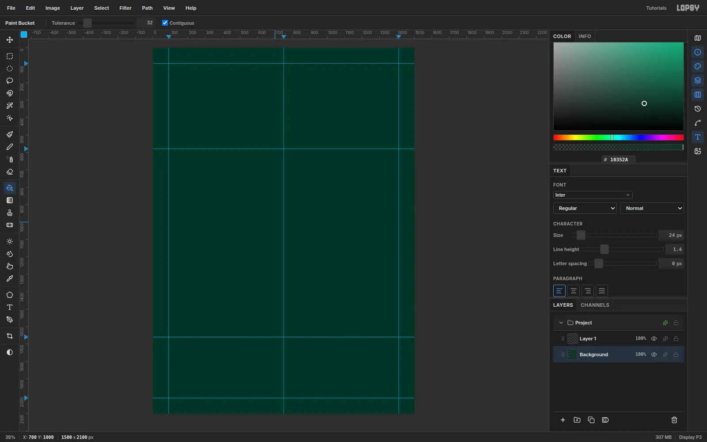

Choose **File → New** and make a **1500 × 2100** px document.

1. On the top ruler, click about 90 px in from each side for the margins, then [[Cmd]]-click (Ctrl-click) the middle of the ruler. Cmd snaps the guide to exactly half the width, so the centre line lands on 750.
2. On the left ruler, click about 90 px from the top and from the bottom for the margins. Add two more: one at **580** for the top of the chart and one at **1660** for the axis baseline. The ruler readout shows the position as you hover.
3. Select **Background**, set the foreground to `#10352A`, and click the canvas with the **Paint Bucket** ([[G]]).

Rename **Layer 1** to *Graph Paper* by double-clicking its name.

## Draw one graph-paper tile

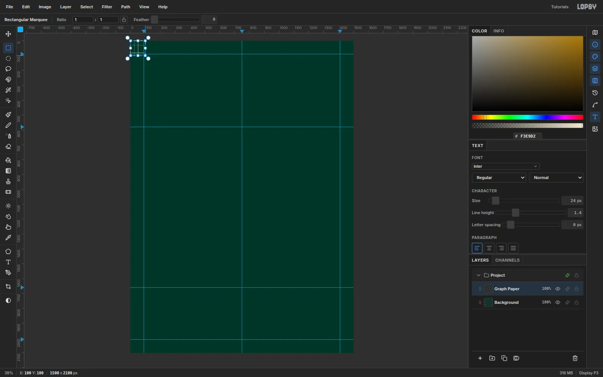

On *Graph Paper*, draw a 100 × 100 px tile in the top-left corner of the
canvas. Zoom in and use the **Pencil** ([[N]]): click at one end of each
line, then [[Cmd+Shift]]-click at the other end for a dead-straight line.
Each line runs the full 100 px of the tile, measured from its top-left
corner:

- **Minor lines**, `#6F8F80`, Size 1: vertical at 0, 25 and 75 px, horizontal at 5, 30 and 55 px.
- **Major lines**, `#F3E9D2`, Size 2: vertical at 50 px, horizontal at 80 px.

The major lines sit off-centre in the tile on purpose. Once it tiles, they
land exactly on the chart's 10 cm ticks either side of the centre line and on
the top edge of every bar.

Select the whole tile and choose **Edit → Define Pattern**.

> **Tip:** A tile needs to be pixel-exact. With nothing selected, *click*
> (don't drag) with the Rectangular Marquee ([[M]]) to open a dialog where
> you type the corners: **From 0, 0 To 100, 100** selects the whole tile.

> **Tip:** Here the alignment is baked into the tile itself. In Fill with Pattern, Row / Column Stagger offset alternate rows or columns like bricks, while Horizontal / Vertical Offset shift the whole grid's origin; leave all four at 0 for this tile.

## Tile the pattern across the card

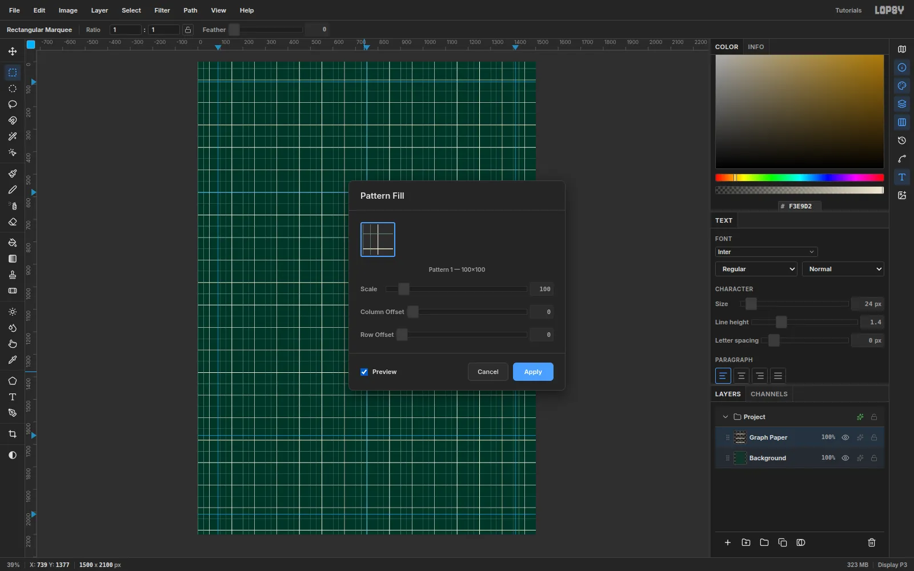

Press [[Cmd+A]], then [[Delete]] to clear the tile, and [[Cmd+D]].

Choose **Edit → Fill with Pattern…**, pick the new tile, turn on **Preview**,
and click **Apply**. Leave Scale at 100 and both offsets at 0.

Click the layer's opacity readout and drag it to **14%**. Then open its
effects drawer and set **Blend** to **Screen**. The grid should be barely
there.

## Add a soft center glow

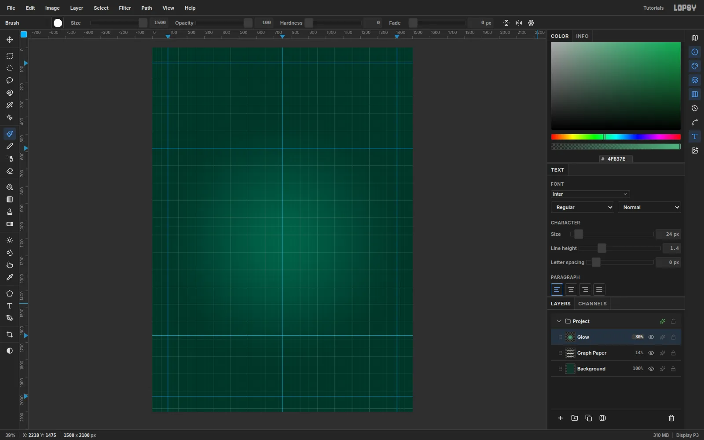

Add a layer called *Glow*. Pick the **Brush** ([[B]]) and set **Size** 1500,
**Hardness** 0, **Opacity** 100.

With `#4FB37E`, click once on the centre line, about halfway down the card,
where the middle of the tree will be. Set the layer to **Screen** at
**30%**. It lifts the middle of the card without looking like a gradient.

## Marquee the first chart bars

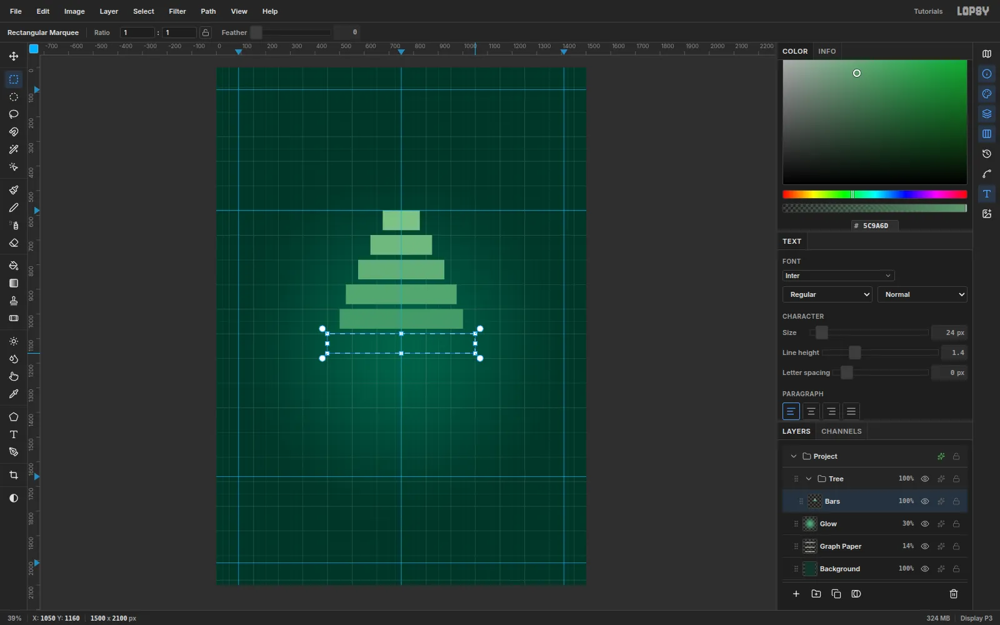

Click **New Group** in the Layers panel and name it *Tree*. Inside it, add a
layer called *Bars*.

Each tier is a bar **80 px** tall, centred on the centre line. The top bar
starts on the 580 guide, and each bar below starts 100 px lower, on the next
major grid line. The widths in px are the spans in cm × 10:

`150, 250, 350, 450, 500, 600, 700, 800, 900, 1000`

For each bar, drag the marquee from the top-left corner to the bottom-right
corner, set the foreground to the next ramp color, and click inside with the
Paint Bucket. Every bar edge lands on a line of the graph paper, so zoom in
and follow the grid. The ramp runs in ten even steps from `#8CC08A` at the
top to `#1F6B48` at the bottom.

> **Tip:** For exact bars, press [[Cmd+D]] and *click* with the marquee to
> type the corners. The top bar is **From 675, 580 To 825, 660**. For each bar
> after it, add 100 to both Y values and move both X values out by half the
> extra width.

## Finish the stack

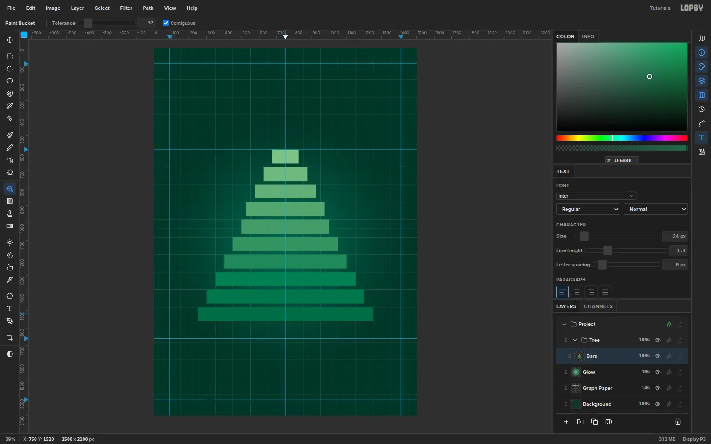

Press [[Cmd+D]] when the last bar is filled. The stack already reads as a
tree, and each bar's top edge sits on a major grid line.

Keep the width list handy. The tier table later on quotes the same numbers.

## Add bar highlights, a trunk and the axis

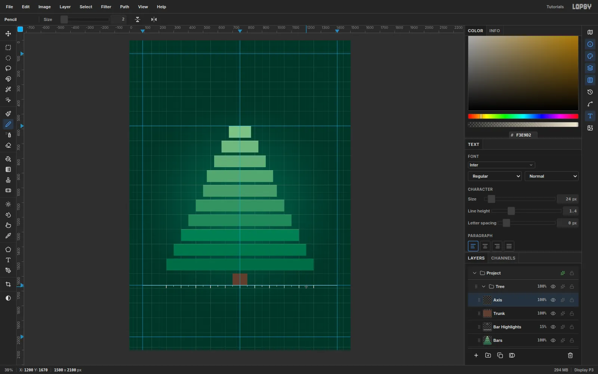

1. **Highlights:** add a *Bar Highlights* layer. With the **Pencil** ([[N]]) at **Size 3** in white, click just inside the top-left corner of each bar and [[Cmd+Shift]]-click just inside its top-right corner, so a 3 px line runs along the bar's top edge. Set the layer to **15%**.
2. **Trunk:** add a *Trunk* layer. Marquee a block 100 px wide, centred on the centre line, from just under the bottom bar down to the axis guide, and fill it with `#5E4030`. You'll warm it up later.
3. **Axis:** add an *Axis* layer and pick the **Pencil** ([[N]]) at **Size 3** in `#F3E9D2`. Click where the left margin guide meets the axis guide, then [[Shift]]-click where the right margin guide meets it for a dead-straight baseline.

For the major ticks, click the baseline wherever a major grid line crosses it
between the tree's outer edges (every 10 cm, eleven in all), then
[[Shift]]-click about 18 px below. For the minor ticks, switch to Size 2 and
draw 10 px ticks halfway between them.

## Draw the star with the Lasso

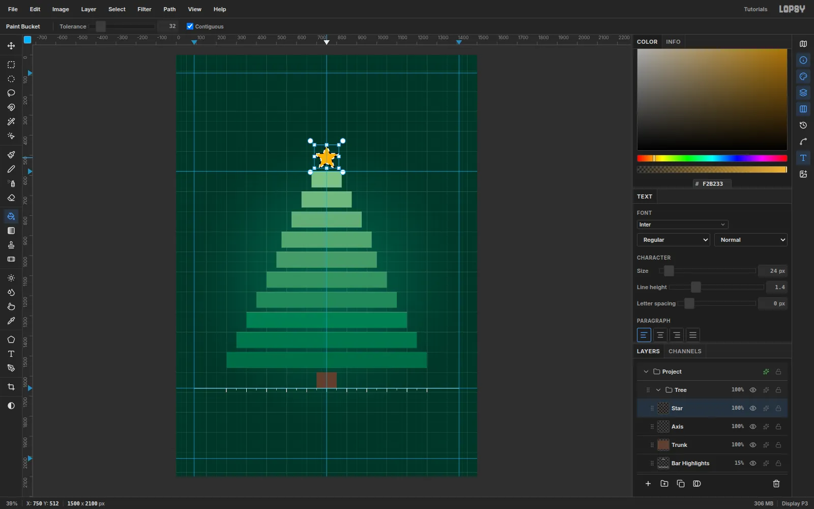

Add a *Star* layer. With the **Lasso** ([[L]]), drag through the ten points of
a five-pointed star, centred on the centre line just above the top bar. Keep
the outer points about 64 px from the centre and the inner points about
27 px.

Fill it with `#F2B233` and deselect.

## Soften and light the star

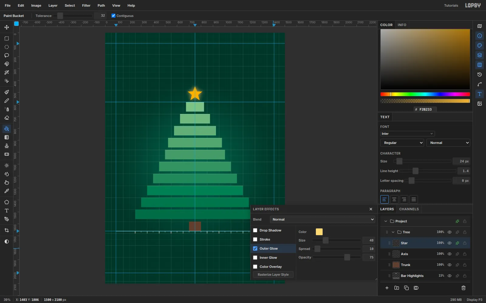

Run **Filter → Gaussian Blur…** at **Radius 2**. A slightly soft edge melts
into the glow instead of cutting a hard outline through it.

Open the star's effects and enable **Outer Glow**: color `#FFD873`,
**Size** 48, **Spread** 10, **Opacity** 75.

## Make the first bauble

Ornaments sit in fixed slots, so their positions carry data:

- **Red baubles:** ±10 cm (one major grid line either side of the centre line), on T03 – T10
- **Gold baubles:** ±25 cm (two and a half grid lines out), on T06 – T10
- **Ice diamonds:** ±40 cm (four grid lines out), on T09 and T10

Each ornament is centred on its bar's vertical middle, 40 px below the bar's
top edge.

Add a *Baubles Red* layer. Choose the **Shape** tool ([[U]]), set **Shape**
to Ellipse, **Fill** white and **Stroke** none. Click (don't drag) the centre
of the left-hand red slot on T03, one grid line left of the centre line. The
**Shape Size** dialog opens; enter **44 × 44** and click **Create** for a
circle centred on the click.

Then open the layer's effects and turn on **Color Overlay** with `#E0452B`.
The overlay gives you an exact hex color without touching the pixels.

> **Tip:** You can also drag the shape out: it grows from where you press,
> so press on the slot's centre and [[Cmd]]-drag out 22 px for a 44 px circle.

## Stamp the other red baubles with Alt-drag

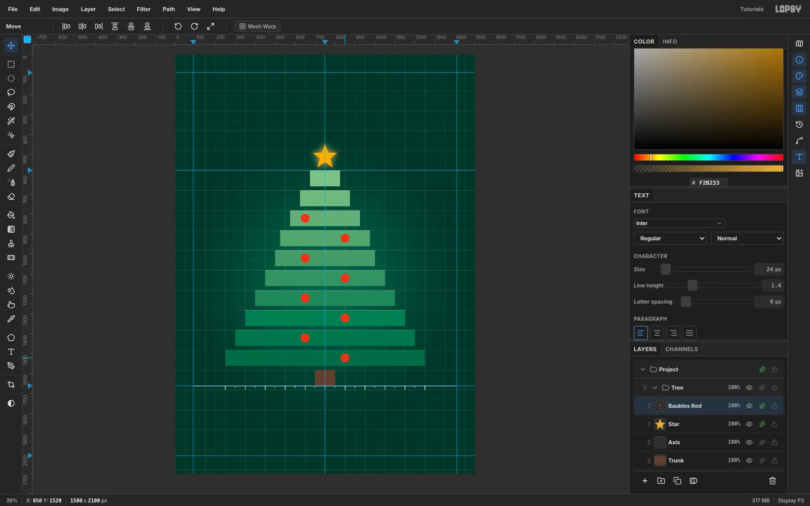

For each remaining red slot:

1. Draw an **Elliptical Marquee** just around the first bauble, about 50 px across.
2. Press [[V]] and [[Alt]]-drag from its center to the new slot.
3. Press [[Cmd+D]].

Alternate sides from tier to tier: right of the centre line on T04, left on
T05, and so on down to the right on T10.

> **Tip:** You don't have to re-marquee between copies. While a copy is still floating, another [[Alt]]-drag drops it where it is and pulls off a fresh copy.

Repeat on a new *Baubles Gold* layer with a `#F2B233` overlay, starting with
the left-hand slot on T06.

## Rotate a square into a diamond

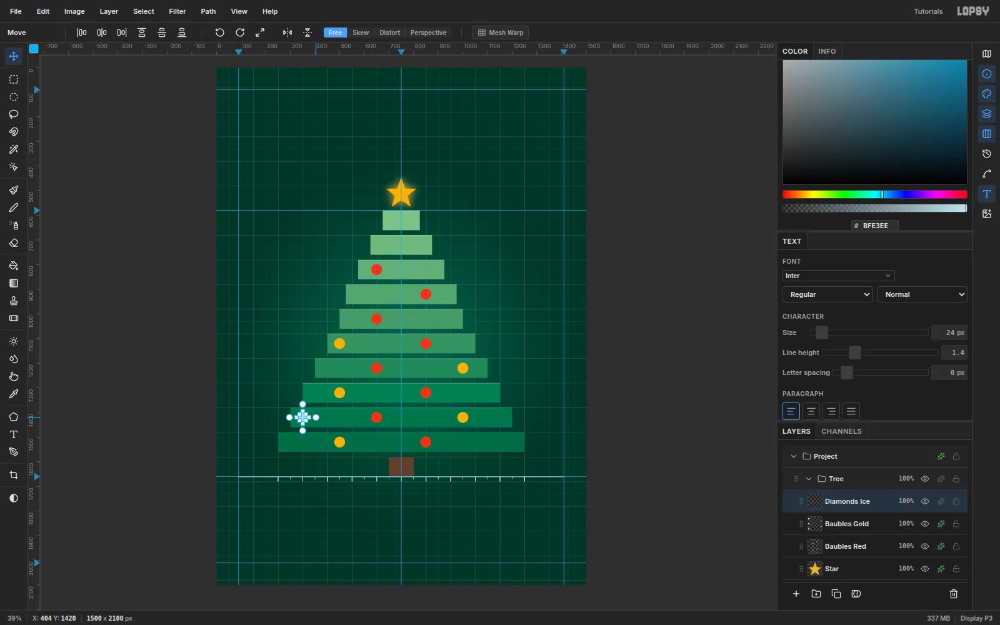

Add a *Diamonds Ice* layer. [[Cmd]]-drag a 36 px square marquee centred on
the left-hand ice slot of T09 and fill it with `#BFE3EE`.

Keep the marquee and press [[V]]. Hold [[Cmd]] and drag the top-right
**rotation handle** clockwise. Cmd snaps rotation to 15° steps, so stop at
**45°**. Press [[Cmd+D]] to commit.

## Facet the diamond and place all four

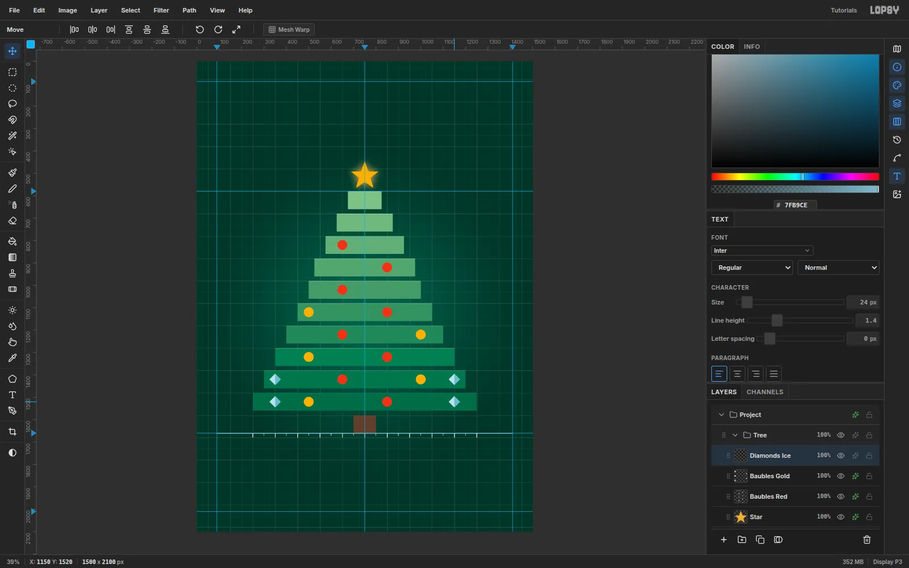

Give the diamond a cut-glass look. Marquee its right half, from its vertical
centre line out past its right point, and fill it with the darker `#7FB9CE`.

Then stamp it to the other three ice slots (the right end of T09 and both
ends of T10) with the same marquee + Alt-drag routine, using a rectangular
marquee this time.

That makes 8 red, 5 gold and 4 ice: **17 ornaments**.

## Shade the ornaments with effects

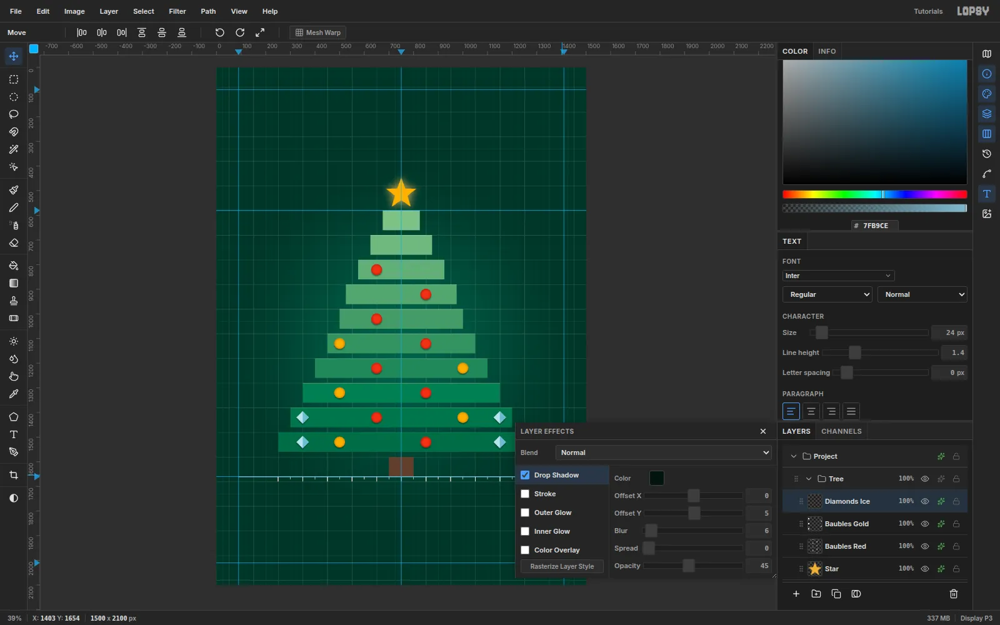

Add effects to each ornament layer:

- **Baubles Red:** **Inner Glow** `#6E1409`, Size 15, Spread 0, Opacity 80, and **Drop Shadow** `#04150F`, Offset 0 / 5, Blur 6, Opacity 45.
- **Baubles Gold:** Inner Glow `#8A5206` with the same settings, and the same drop shadow.
- **Diamonds Ice:** the drop shadow only. The facet already gives it form.

The inner glow darkens each rim, so flat discs turn into spheres.

## Add specular highlights

Add a *Shine* layer. Pick the Brush at **Size 11**, **Hardness 40** in
`#FFF6E0`. Click once a little up and to the left of every bauble's center,
then set the layer to **80%**.

## Generate snow from noise

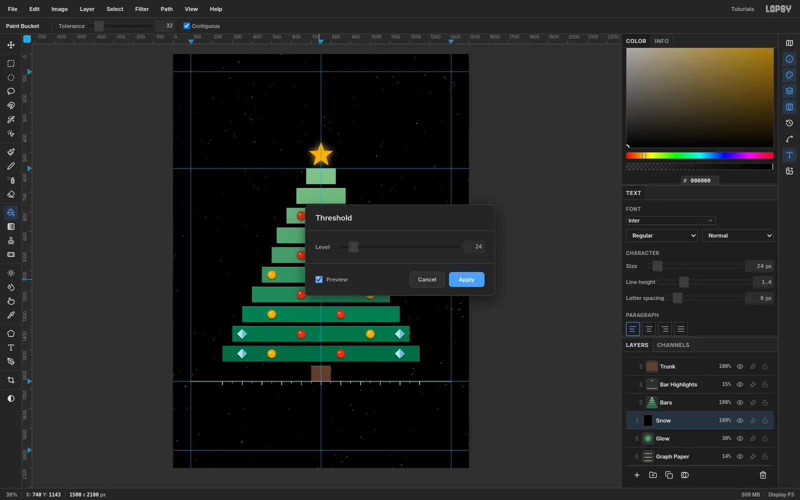

Select *Glow* and add a *Snow* layer above it. Fill the layer with black.

1. **Filter → Add Noise…**: Amount 100, Mono, Uniform.
2. **Filter → Gaussian Blur…**: Radius 3. Run it twice.
3. **Filter → Threshold…** with Preview on. Adjust the Level until only a sparse scatter of white specks is left. That was around **24** here.

The blur clumps the noise, so the survivors are round specks rather than
single pixels.

## Turn the specks into snowflakes

1. Pick the **Magic Wand** ([[W]]), turn **Contiguous** off, set **Tolerance** 20, and click the black.
2. **Select → Inverse** ([[Shift+Cmd+I]]), then **Select → Grow…** by **2** px.
3. Set the foreground to `#F4EBDA` and choose **Edit → Fill**. Then [[Cmd+D]].

Set *Snow* to **Screen** at **75%**. Screen drops the black and leaves just
the flakes.

## Make a Type group above the tree

With *Snow* selected, click **New Group** and name it *Type*. It lands under
*Tree*. Collapse *Tree*, then drag *Type* by its grip above the *Tree* row.

Every text layer goes in this group, so type always sits on top of the
chart.

## Set the headline

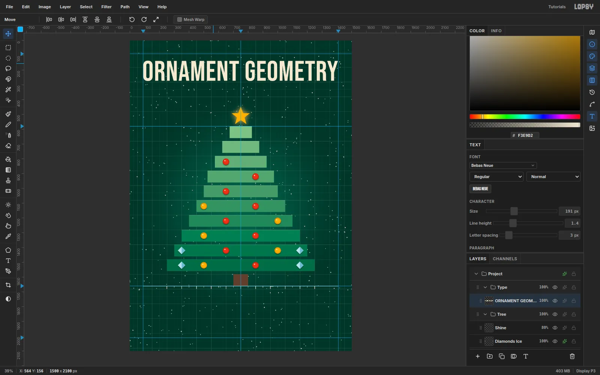

Pick the **Text** tool ([[T]]) and choose **Bebas Neue** in the font browser,
Size **191**, color `#F3E9D2`. Open the **Text** panel and set **Letter
spacing** to 3.

Click in empty canvas, type `ORNAMENT GEOMETRY`, and press [[Shift+Enter]]
to commit. Then drag it with the Move tool so its left edge sits on the left
margin guide, with the cap tops a little below the top margin. At that size
it runs almost exactly margin to margin.

> **Tip:** Create each new line of text in open canvas, then drag it into place with the Move tool.

## Add a misregistered red shadow

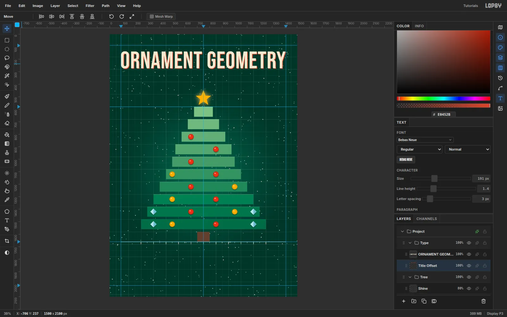

1. [[Cmd]]-click the title's thumbnail in the Layers panel to select its letter shapes.
2. Add a layer called *Title Offset*, set the foreground to `#E0452B`, and choose **Edit → Fill**.
3. [[Cmd+D]], press [[V]], then nudge the layer **4 px right** and **4 px down** with the arrow keys.
4. Drag *Title Offset* below the title in the Layers panel.

Keep it to 4 px. A thicker extrusion makes the letters touch each other.

## Add the kicker, dateline and rule

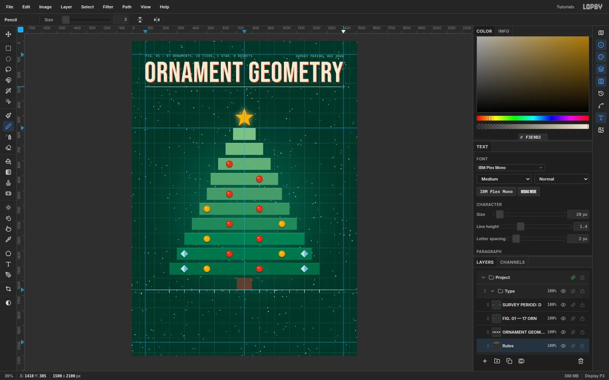

In **IBM Plex Mono** Medium, Size 20, `#9FC7B0`, Letter spacing 2:

- `FIG. 01 — 17 ORNAMENTS, 10 TIERS, 1 STAR, 0 REGRETS`, tucked into the top-left corner where the margin guides meet
- `SURVEY PERIOD: DEC 2026`, with its right edge on the right margin guide

Add a *Rules* layer and draw a 3 px Pencil line from margin to margin a
little below the headline: click on the left margin guide, then
[[Shift]]-click on the right one at the same height.

## Copy real ornaments into a legend

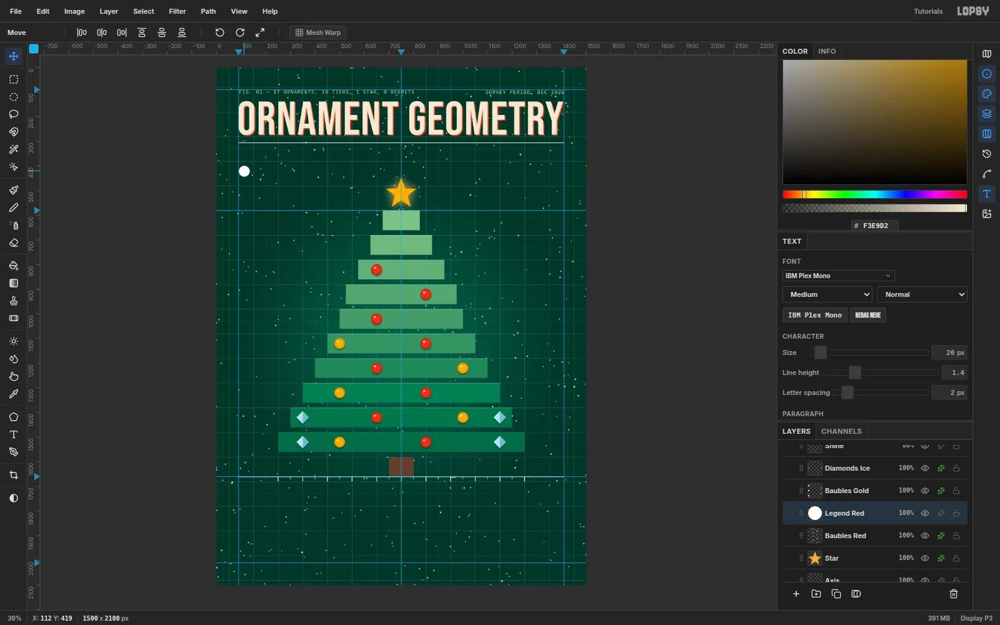

Legend swatches should be the real ornaments, not new drawings.

1. On *Baubles Red*, draw an elliptical marquee around one bauble and press [[Cmd+C]].
2. Click *Rules* in the *Type* group and press [[Cmd+V]], so the copy lands in *Type* above *Rules*.
3. Rename the pasted layer *Legend Red* and drag it into the legend row under the rule, against the left margin.

Layer effects don't come along with a paste, so the swatch arrives white. Give
it the same Color Overlay and Inner Glow as the tree baubles. Do the same for
the gold bauble and an ice diamond: copy each one from its own layer, then
click *Rules* before you paste.

## Label the legend and move it as a group

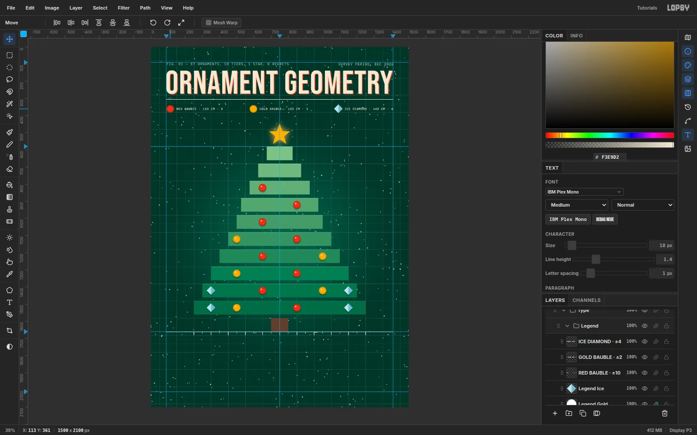

Next to each swatch, add a label in IBM Plex Mono Medium 18, `#F3E9D2`,
Letter spacing 1:

- `RED BAUBLE · ±10 CM · 8`
- `GOLD BAUBLE · ±25 CM · 5`
- `ICE DIAMOND · ±40 CM · 4`

Leave 16 px between each swatch and its label. Make the gaps between the three
pairs equal so the row spans the full width between the margin guides.

[[Cmd]]-click the six legend rows in the Layers panel and choose **Layer →
Group Layers**. Name the group *Legend*. With the group selected, one Move
drag positions all six layers at once, and a single [[Cmd+Z]] undoes the
whole move.

## Label the tiers and spans

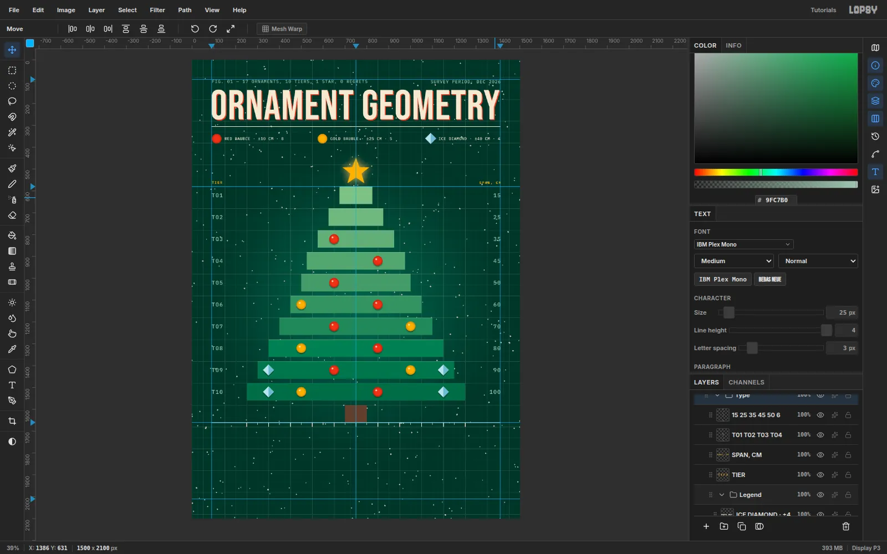

1. **Headers:** select *Rules*, then set `TIER` and `SPAN, CM` in Plex Mono SemiBold 16, `#F2B233`, Letter spacing 3, sitting just above the chart-top guide. Put `TIER` on the left margin and right-align `SPAN, CM` to the right margin guide.
2. **Tier column:** select *Rules* again, then set one text layer, `T01` to `T10` on separate lines, in Plex Mono 25 `#9FC7B0`. In the Text panel, set **Line height** to **4**: 25 px × 4 = 100 px, the bar pitch. Nudge it so each label is vertically centered on its bar.
3. **Span column:** drag out an area-text box, set **Align** to Right, type the ten values (`15`, `25`, `35`, `45`, `50`, `60` … `100`), and give it the same line height. Move it so the right edge sits on the right margin guide.

Right-aligned area text keeps `100` flush with the two-digit values.

## Label the axis

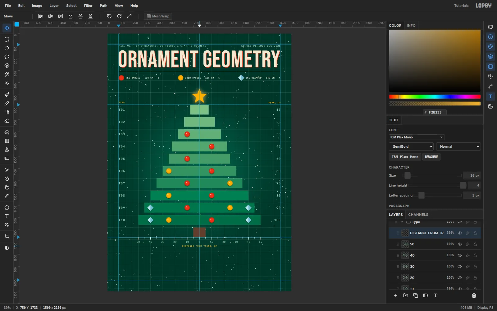

Select *Rules*. Under each major tick, add its value in Plex Mono 18
`#9FC7B0`, centered on the tick: `50 40 30 20 10 0 10 20 30 40 50`. Keep
the labels' tops level, a little below the tick ends.

Select *Rules* again and center `DISTANCE FROM TRUNK, CM` on the centre line
just below them, in SemiBold 16 gold with Letter spacing 3.

## Add callouts with dotted leaders

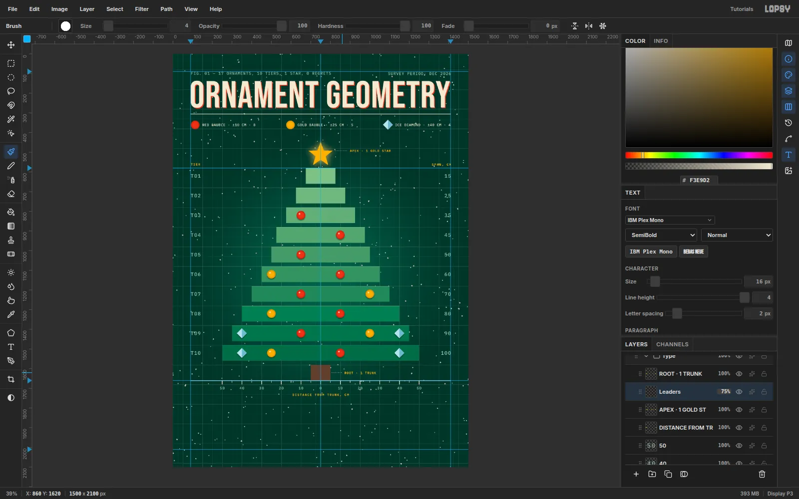

Select *Rules* and add two callouts in Plex Mono SemiBold 16 gold, Letter
spacing 2:

- `APEX · 1 GOLD STAR`, to the right of the star and level with its centre
- `ROOT · 1 TRUNK`, to the right of the trunk and level with it

For the leaders, add a *Leaders* layer. Open the Brush's **Brushes** window
and, on the **Shape** tab, set **Size** 4, **Hardness** 100 and
**Spacing 200**, so each dab lands as a separate dot. [[Shift]]-click a short
line from just right of the star to just before its label, and another from
the trunk to its label. Set the layer to 75%.

## Build a tilted n = 1 badge

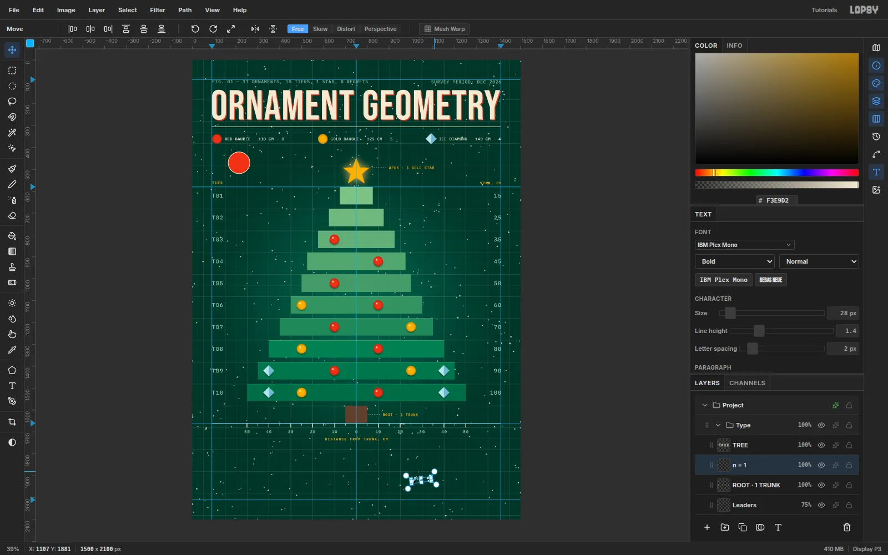

Add a *Badge Disc* layer. Draw a white 96 px circle with the Shape tool (a
click opens the size dialog), then add effects:

- **Color Overlay** `#E0452B`
- **Stroke** 3 px `#F3E9D2`
- **Drop Shadow**: 0 / 3, Blur 10, Opacity 50

Set `n = 1` in Plex Mono Bold 28. Select *Badge Disc* again and set `TREE`
in Bold 16 with Letter spacing 3. Rotate both **−8°** at once:

1. With `TREE` selected, [[Cmd]]-click the `n = 1` row and press [[Cmd+D]] so nothing is marqueed.
2. Press [[V]], drag a rotation handle counter-clockwise, and press [[Cmd+D]].

Then drag both lines onto the disc, stacked along the tilt: `n = 1` above
center, `TREE` below it.

## Set the greeting

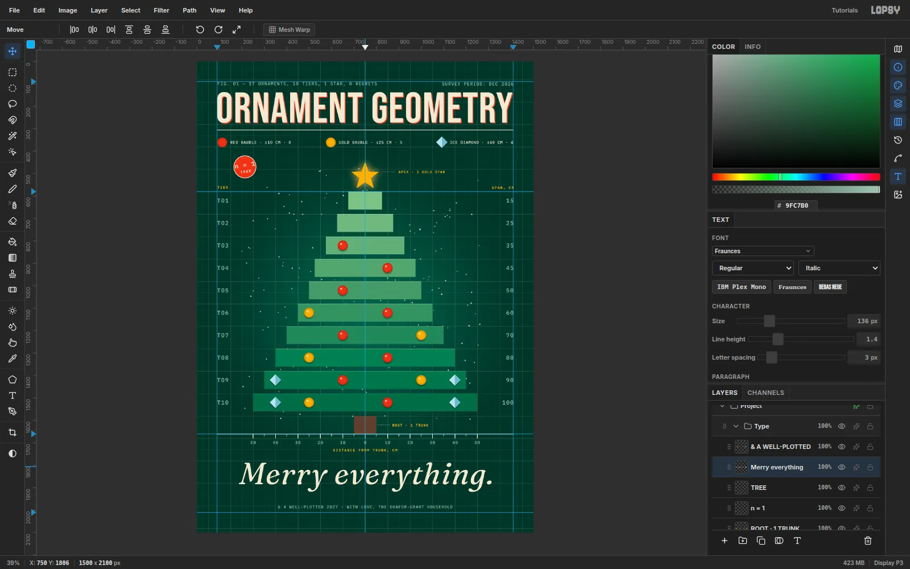

Select *Rules*, choose **Fraunces**, then set **Style** to Italic and
**Weight** to Regular in the Text panel. Set it at Size 136 in `#F3E9D2` and
type `Merry everything.`. Center it on the centre line, just below the axis caption.

Select *Rules* again and add the sign-off below it in Plex Mono 18,
`#9FC7B0`, Letter spacing 2:
`& A WELL-PLOTTED 2027 · WITH LOVE, THE OKAFOR-GRANT HOUSEHOLD`. Center it
just above the bottom margin guide.

> **Tip:** With the Move tool, **Align center horizontally** in the options bar centres the active layer on the card in one click.

## Scale the badge and group it

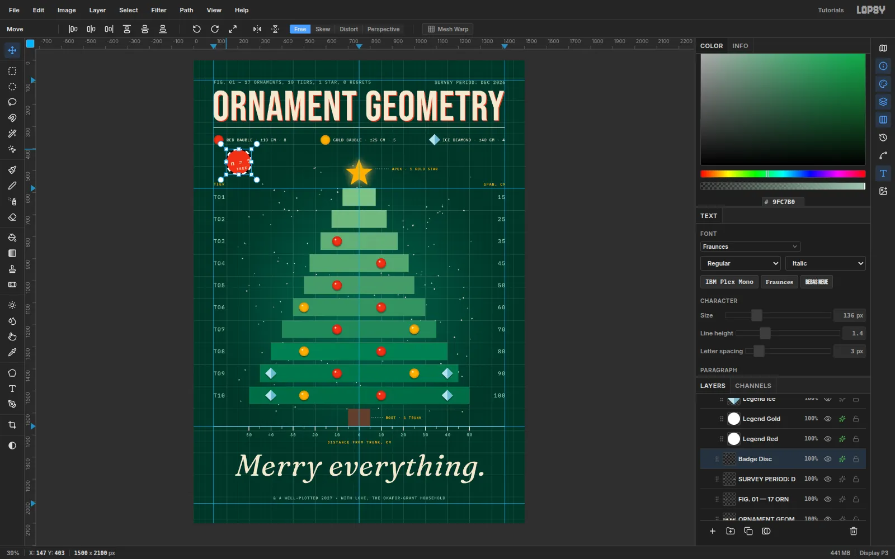

The badge needs more presence. [[Cmd]]-click *Badge Disc*'s thumbnail, press
[[V]], and [[Cmd]]-drag the top-left corner handle outward to about
**120%**. Cmd keeps the scale uniform. Press [[Cmd+D]].

Re-center the two text lines on the disc. Then select all three layers and
choose **Layer → Group Layers**. Name the group *Badge* so it moves as one.

## Clear snow from the type

Snow behind small type looks like dust on a scan. Select the *Snow* layer
and the Rectangular Marquee, and set **Feather** to 40.

1. Marquee a full-width band from the top edge down to just below the legend, and press [[Delete]].
2. Marquee a full-width band from just above the axis down to the bottom edge, and press [[Delete]].
3. At Feather 20, clear the two side columns behind the tier and span labels, each about 180 px wide.
4. At Feather 12, clear small boxes behind both callouts.

The feather lets the snow fade out gently instead of stopping at a hard line.

## Refine the details

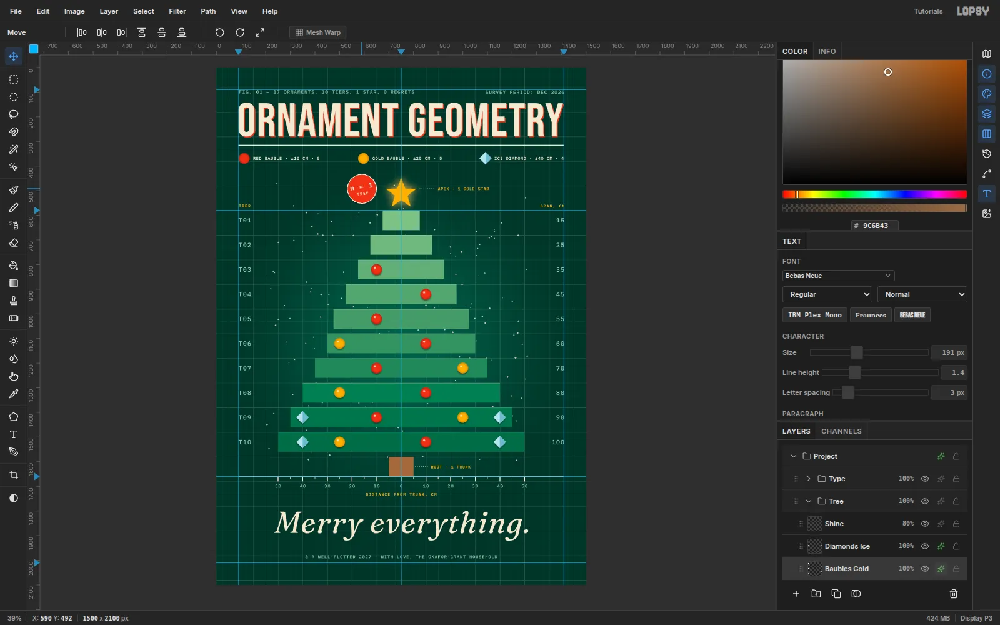

Step back and check the chart like a reviewer would.

- **T05:** the jump from 45 to 50 cm kinks the outline. Widen the bar 25 px on each side with the marquee and bucket (`#5C9A6D`, plus its highlight strip). With the Text tool, double-click `50` in the span column and type `55`.
- **Trunk:** bucket-fill it `#9C6B43` so it reads against the dark green.
- **Greeting:** reduce it to Size **124** so it stops competing with the headline, and re-center it under the axis caption.
- **Badge:** drag the *Badge* group to the left of the star, level with it.
- **Title block:** [[Cmd]]-click the title and *Title Offset* rows and nudge both 6 px down. Nudge *Rules* 10 px down and the *Legend* group 8 px down.

## Export the card

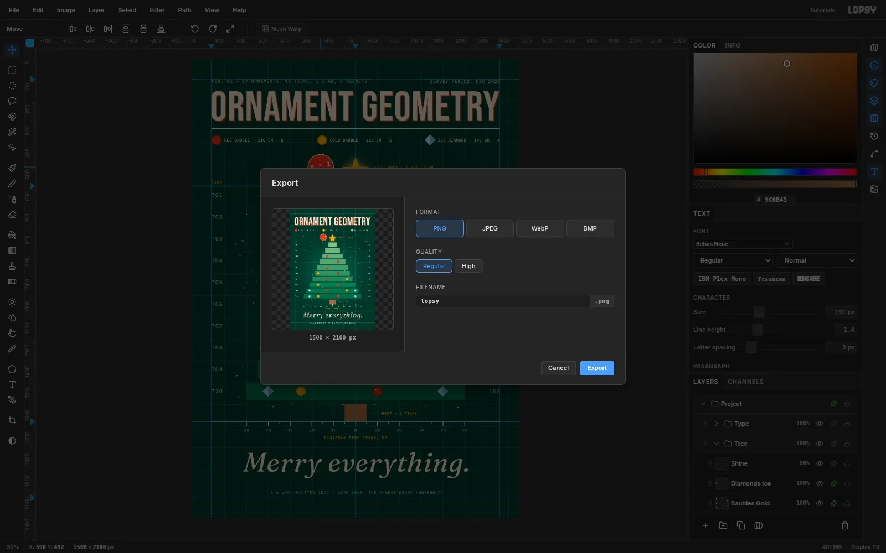

Choose **File → Export…**, pick **PNG**, and click **Export**. For print,
send the 1500 × 2100 px file to a 5 × 7 in card at 300 dpi.

Want a different card? Swap the data. Tiers could be family members and
ornaments cookies eaten, and the chart still decorates the tree.
