An isometric logo draws a small 3D object with no vanishing point. Every edge runs along one of three axes, so the whole mark is built from flat, evenly shaded faces. It looks precise and architectural, which suits a studio that designs buildings.

This tutorial makes an identity sheet for **Urban Utopia**, an invented architecture and civic-design studio. The mark is a park block with two U-shaped buildings on it. One is two towers joined by a low podium, the other its mirror image. Together they spell **UU**, with the sun rising in the gap. Around the mark you'll lay out the pieces a real brand sheet shows:

- faint construction lines
- a wordmark and tagline
- three small versions of the mark
- the colour palette

Along the way you'll use:

- the Lasso for every face, plus add and intersect selections
- **Move → Distort** to wrap flat window bands onto the towers
- **Copy Merged**, paste and scale
- **Group Layers** with a **Gradient Map** adjustment
- the **Shape** tool for rounded tiles
- text with letter spacing, and **Add Noise** for paper grain

The palette is cool blues and park greens on cream paper, with one yellow accent:

- Paper `#F2ECDF`
- Ink navy `#1B2266`, shade face `#232F92`
- Ultramarine `#4D61E3`
- Roofs `#AEBBFF`, podium roofs `#8A9CF5`
- Lawn `#8FDCA9`, slab sides `#3FAE73` / `#237A4D`
- Sun `#FFC845`
- Fountain `#6FB6F2`

> **Tip:** This is true 30° isometric. One step along either ground axis moves about 25.5 px across and 14.7 px down. Vertical edges stay vertical. All the corner coordinates below come from that rule, and the status bar shows your pointer position while you work.

## Set up the paper and guides

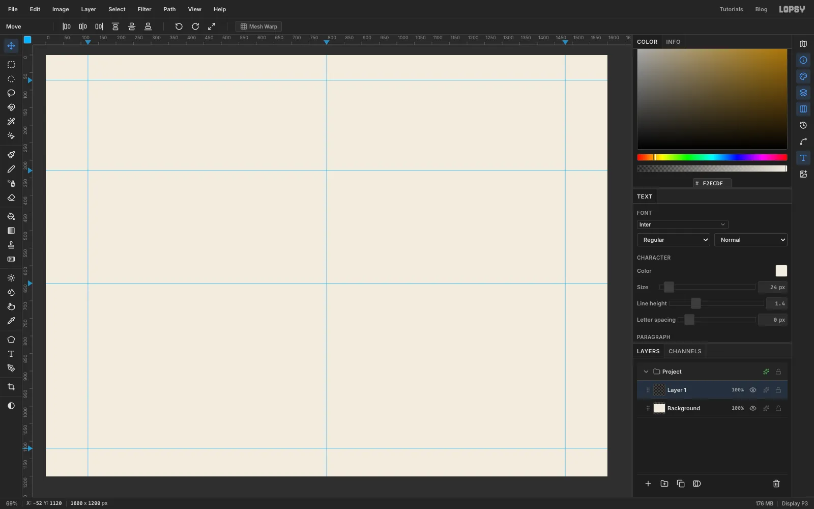

Open [Lopsy](/). In the **New Document** dialog set **Width** to `1600` and **Height** to `1200`, leave **Background** on **White** and click **Create**.

1. Select the **Background** layer and set the foreground colour to `#F2ECDF` in the Color panel's hex field. With nothing selected, **Edit → Fill** floods the whole layer.
2. Click the top ruler at `120`, `800` and `1480` to make vertical guides for the side margins and the centre line.
3. Click the left ruler at `72`, `329`, `650` and `1120`. Those mark the top margin, the back corner of the park slab, its front-bottom corner and the bottom margin.

## Draw the construction rays

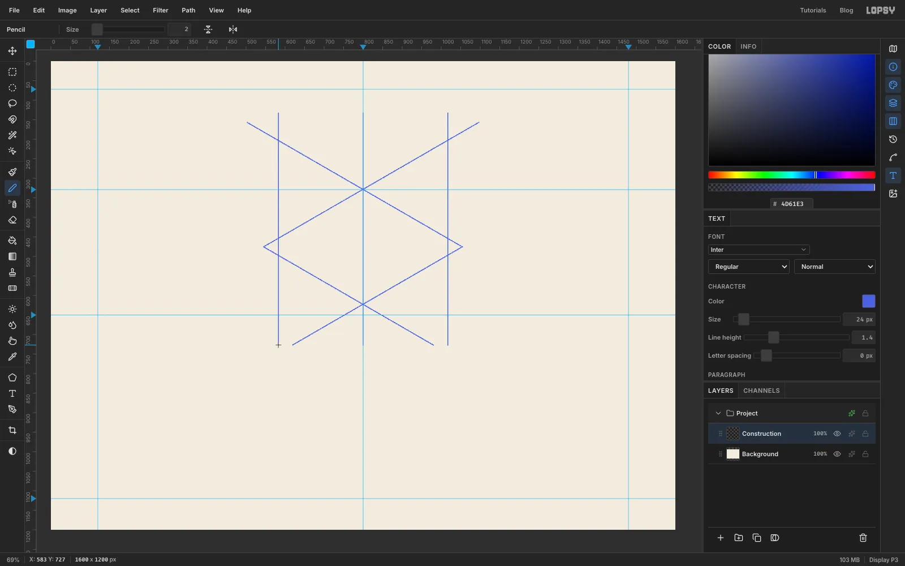

Logo sheets often show the geometry the mark was built on. Here that's four 30° rays that meet at the slab's corners.

1. Double-click **Layer 1** and rename it `Construction`.
2. Pick the **Pencil**, set **Size** to `2` and use `#4D61E3`.
3. To draw each line, click its start and then **Shift-click** its end.
4. Draw the four rays:
   - from (503, 157) to (1055, 476), which passes through the slab's back corner at (800, 329)
   - from (1097, 157) to (545, 476)
   - from (620, 727) up to (1055, 476)
   - from (980, 727) up to (545, 476)
5. Add three verticals from y `133` to y `727`, at x `800`, `583` and `1017`. The outer two line up with the outside edges of the outer towers.

Every ray stops exactly on the slab's left or right corner, so no stray ends stick out past it.

## Trim the lines to a circle

1. Pick the **Elliptical Marquee** and drag from (515, 145) to (1085, 715). That's a circle 570 px across, centred on (800, 430).
2. Choose **Select → Inverse** and press [[Delete]]. Every line now ends on the circle.
3. Press [[Cmd+D]] to deselect.

## Add the construction ring

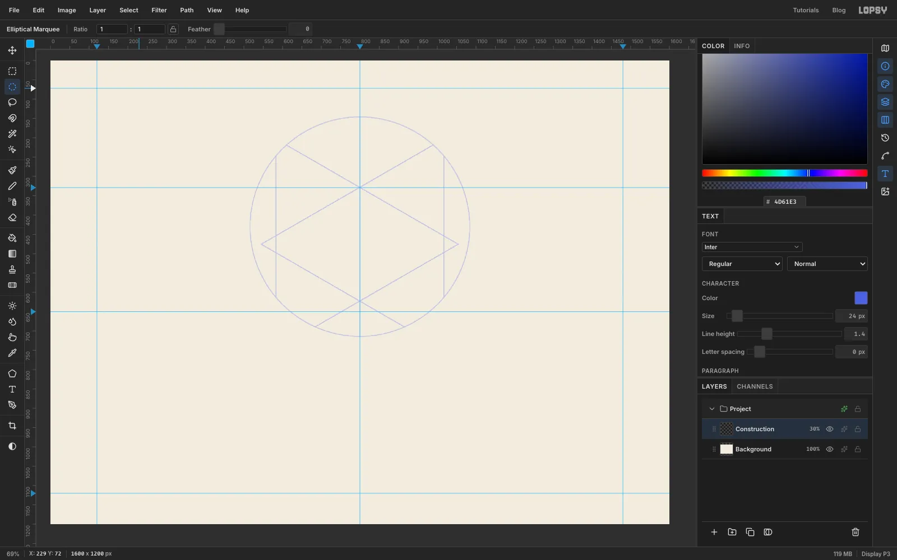

1. Click **Add Layer** and name it `Ring`.
2. Draw the same circle, from (515, 145) to (1085, 715), and fill it with `#4D61E3` (**Edit → Fill**).
3. Choose **Select → Shrink**, enter `2` px, and press [[Delete]]. That leaves a 2 px outline.
4. Deselect and choose **Layer → Merge Down** to fold the ring into `Construction`.
5. Set `Construction` to **30%** opacity with the opacity button on its row. The lines should whisper, not shout.

## Lasso the park slab

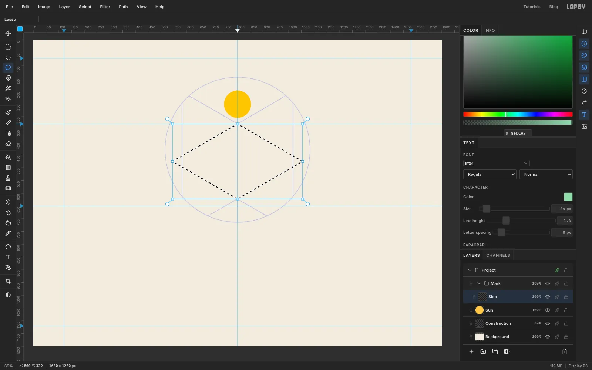

1. Add a layer named `Sun`. Drag an elliptical marquee from (747, 198) to (853, 304) and fill it with `#FFC845`.
2. With `Sun` selected, click **New Group** in the Layers panel and name it `Mark`. Then add a layer named `Slab` inside it.
3. Pick the **Lasso** and drag straight from corner to corner around the diamond: (800, 329), (1055, 476), (800, 623) and (545, 476). The construction rays run along its edges, so you can trace them. Fill it with `#8FDCA9`.
4. The slab is 26 px thick:
   - Lasso the left side, from (545, 476) down to (800, 623), then down to (800, 650) and back up to (545, 502). Fill it with `#3FAE73`.
   - Lasso the right side, (800, 623), (1055, 476), (1055, 502), (800, 650), and fill it with the darker `#237A4D`.

The light comes from the upper left, so left-facing sides are mid-tone and right-facing sides are darkest.

## Lay the paving and fountain

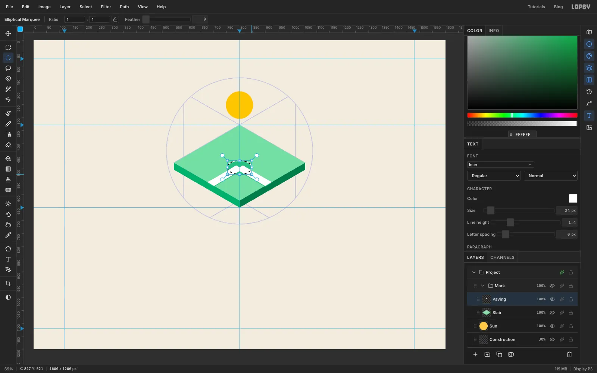

Add a `Paving` layer. Draw the curb first and the paving on top of it, so a sliver of curb shows under each path.

1. **Curb.** Set the colour to `#5DBE86`.
   - Lasso the right path 3 px lower than its final spot: (813, 489), (925, 554), (899, 569), (787, 504). Fill it.
   - Do the same for the left path at (787, 489), (813, 504), (701, 569), (675, 554).
   - Draw an ellipse from (753, 470) to (847, 524) and fill it too.
2. **Paving.** Switch to white `#FFFFFF`.
   - Lasso the paths again at their true positions: (813, 486), (925, 551), (899, 566), (787, 501), and (787, 486), (813, 501), (701, 566), (675, 551). Fill each.
   - Draw the plaza ellipse from (753, 467) to (847, 521) and fill it.
3. **Fountain.** Draw an ellipse from (775, 479) to (825, 509) and fill it with `#6FB6F2`.

An isometric circle is an ellipse 1.73 times as wide as it is tall. That's why the plaza is 94 × 54.

## Add the ground shadows

Shadows go only on the shade side, away from the light.

1. Add a layer named `Ground Shadows` and set the colour to `#1E5E3C`.
2. Lasso and fill two thin strips:
   - (774, 432), (785, 438), (645, 519), (634, 513), along the base of the left building's shaded facade
   - (1017, 483), (1027, 490), (976, 519), (966, 513), at the end of the right building
3. Fill three small ellipses for the tree shadows, offset to the right of where the trees will stand. Drag them from (769, 580) to (803, 600), (838, 580) to (872, 600), and (807, 596) to (834, 612).
4. Set the layer to **30%** opacity.

## Start with a tower

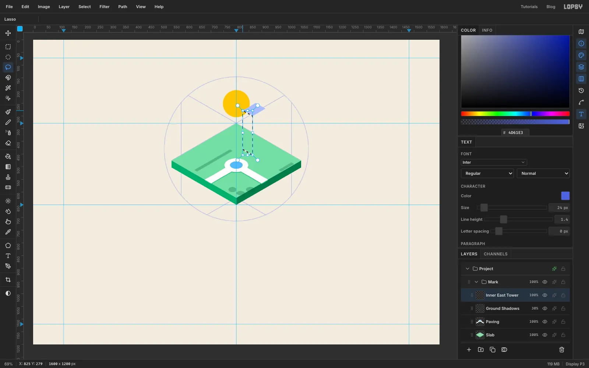

Each block gets its own layer, filled face by face with three colours:

- **Top:** `#AEBBFF` for towers, `#8A9CF5` for podiums
- **Left face:** `#4D61E3`
- **Right face:** `#232F92`

Top-face corners are listed back, right, front, left. The side faces drop straight down from the top's edges: **153 px** for towers and **47 px** for podiums.

Add a layer named `Inner East Tower`.

1. Lasso the top at (876, 249), (915, 271), (864, 301), (826, 279) and fill it.
2. Lasso the left face from the left corner (826, 279) to the front corner (864, 301), then down 153 px to (864, 454) and (826, 432). Fill it.
3. Lasso the right face from (864, 301) to (915, 271), then down to (915, 424) and (864, 454). Fill it.

## Add the inner towers

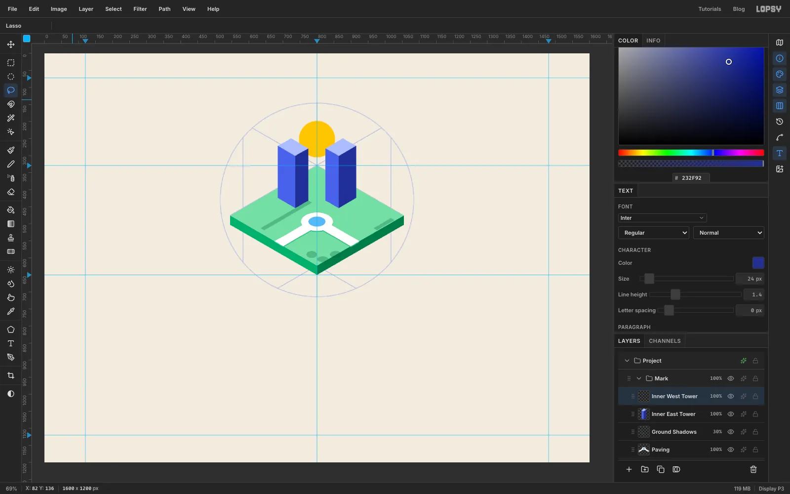

Add a layer named `Inner West Tower` and build it the same way. Its top is (724, 249), (774, 279), (736, 301), (685, 271).

The sun now peeks through the gap between the two towers. That gap is the heart of the logo.

## Add the podiums

Podiums are 47 px high, and their roofs use the slightly darker `#8A9CF5` so they don't merge with the tower tops.

- `East Podium` top: (915, 377), (978, 414), (928, 444), (864, 407).
- `West Podium` top: (685, 377), (736, 407), (672, 444), (622, 414).

Build the podiums *after* the inner towers. Each podium is nearer to you, so it should cover the bottom of its tower.

## Close the two U's

Add the outer towers last, because they're the nearest:

- `Outer East Tower` top: (978, 308), (1017, 330), (966, 360), (928, 338).
- `Outer West Tower` top: (622, 308), (672, 338), (634, 360), (583, 330).

Now each wing reads as a letter U: two equal towers with a low base and an open counter. The left U faces you in shadow; the right one catches the light.

## Draw flat window bands

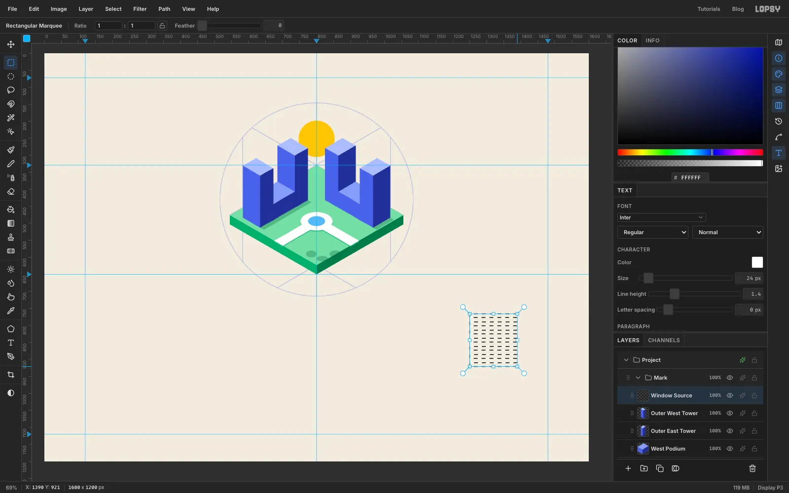

Windows are much easier to draw flat and then wrap onto a face.

1. Add a layer named `Window Source`.
2. With the **Rectangular Marquee**, drag a bar 140 px wide and 11 px tall in an empty spot, starting at (1250, 766).
3. Hold [[Shift]] and drag six more bars below it, one every 24 px.
4. Fill them all at once with white.

## Wrap the windows with Distort

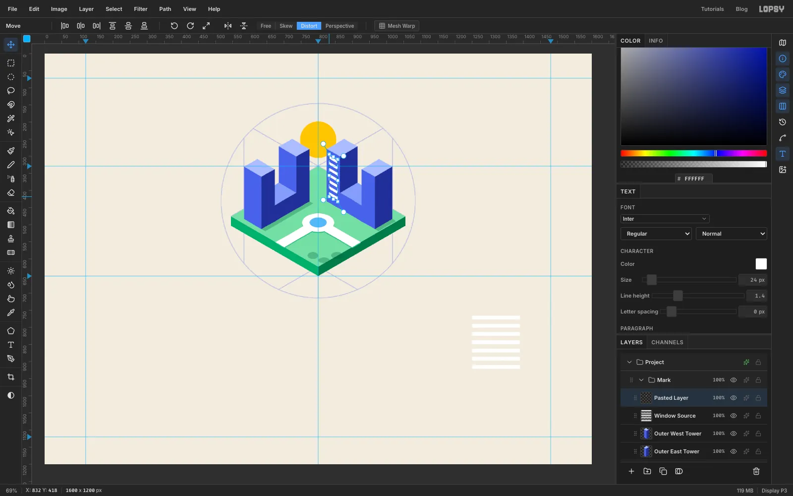

For each face:

1. On `Window Source`, marquee the bars you need, from (1248, 760) down to (1392, 928) for all seven. Press [[Cmd+C]] then [[Cmd+V]]. The paste lands in place on a new layer.
2. Re-draw the marquee around the pasted bars, from (1250, 760) to (1390, 928) (or to y `856` when you copied four bars), and pick the **Move** tool.
3. Click **Distort** in the options bar.
4. Drag each corner handle onto the matching corner of the face's window area.
5. Press [[Cmd+D]] to commit.

For the inner east tower's lit face, the corners are:

- top-left (832, 294)
- top-right (857, 309)
- bottom-right (857, 433)
- bottom-left (832, 418)

Distort maps the rectangle with a true perspective transform. On an isometric face that keeps the bands evenly spaced and parallel to the roofline.

## Window every tower face

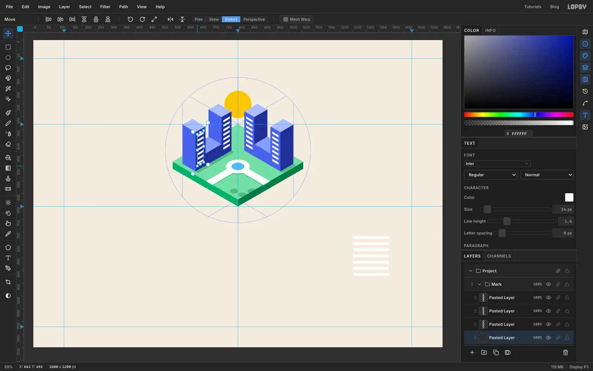

Repeat for the other faces, using seven bars for full-height faces. The window areas (top-left, top-right, bottom-right, bottom-left) are:

- Outer east tower, lit face: (934, 353), (959, 368), (959, 492), (934, 477).
- Inner west tower, dark face: (743, 309), (768, 294), (768, 418), (743, 433).
- Outer west tower, dark face: (641, 368), (666, 353), (666, 477), (641, 492).
- Outer east tower, end face: (973, 367), (1009, 346), (1009, 470), (973, 491).
- Outer west tower, end face: (591, 346), (627, 367), (627, 491), (591, 470).

The two inner towers also show a face above their podiums. Only four floors are visible there, so copy just the top four bars (down to y `856`). Map them to:

- Inner east tower: (871, 308), (907, 288), (907, 358), (871, 379).
- Inner west tower: (693, 288), (729, 308), (729, 379), (693, 358).

## Blend the windows into the faces

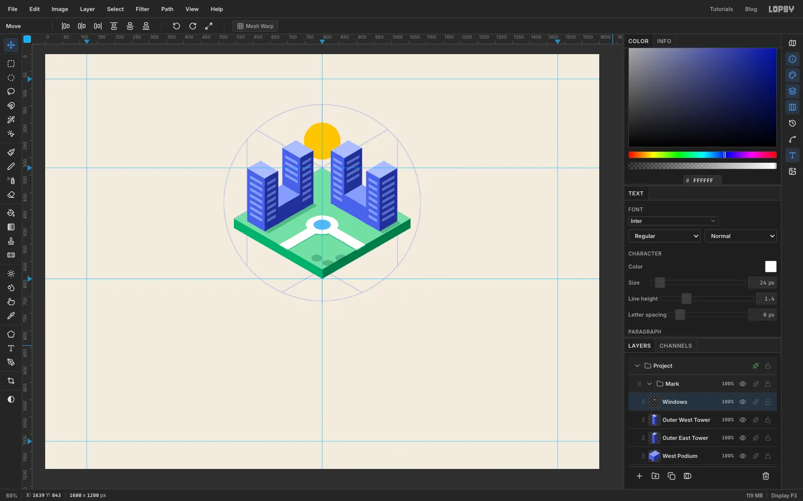

1. Select the top pasted layer and choose **Layer → Merge Down** seven times, stopping before it merges into `Window Source`. Name the result `Windows`.
2. Delete `Window Source`.
3. Open the layer's effects drawer and set **Blend** to **Soft Light**.

Soft Light lightens each face by an amount that suits its tone. The same white bars read as pale glass on the lit faces and as subtle reflections on the dark ones.

## Plant a small grove

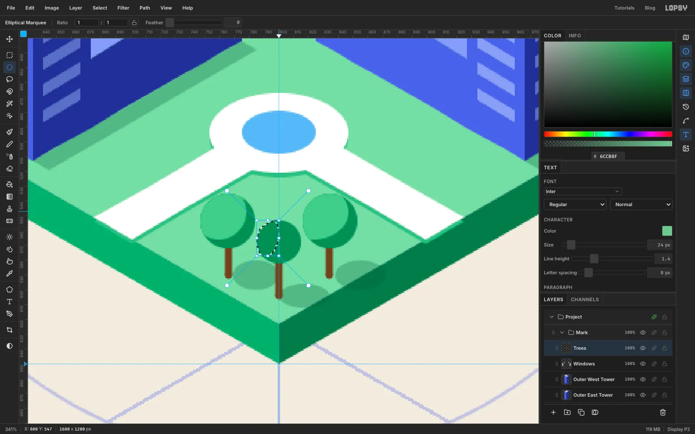

Add a layer named `Trees`. Pick the **Brush** at **Size 6**, **Hardness 100**. Then finish each tree in turn, left, right and front:

1. **Trunk.** In `#6B4423`, click the base and **Shift-click** 26 px straight up: (766, 590) to (766, 564) for the left tree, (834, 590) to (834, 564) for the right one, and (800, 604) to (800, 578) for the front one.
2. **Canopy.** Drag an elliptical marquee for the crown and fill it with `#2E8F5A`: (748, 535) to (784, 571) on the left, (816, 535) to (852, 571) on the right, and a smaller (785, 552) to (815, 582) in front.
3. **Highlight.** Keep the crown selected, hold [[Shift+Alt]] and drag the same-size circle again, 6 px up and to the left (5 px for the small tree). That keeps only the overlap. Fill it with `#6CCB8F`.

The crescent left in the dark green is the shade side, so the light matches the buildings.

## Set the wordmark

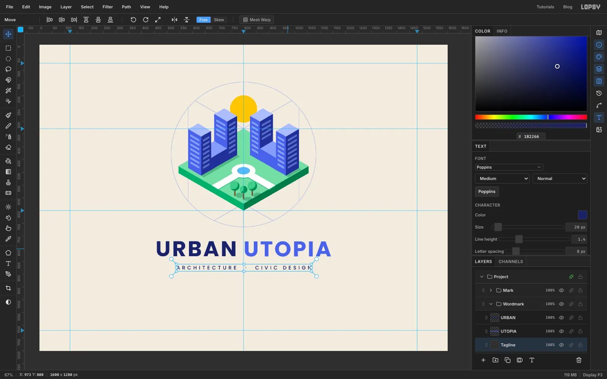

1. Select `Sun`, click **New Group** and name it `Wordmark`.
2. Add an empty layer called `Type Anchor`. Select it before you create each piece of text. That way a font change can't restyle the type you already set.
3. Pick the **Text** tool and choose **Poppins**, **Bold**, size `84`, colour `#1B2266`. Click in empty space, type `URBAN` and press [[Tab]] to commit.
4. Open the **Text** panel and set **Letter spacing** to `6`.
5. Make `UTOPIA` the same way in `#4D61E3`.
6. Make the tagline `ARCHITECTURE  ·  CIVIC DESIGN` in **Poppins Medium**, size `20`, letter spacing `8`. There are two spaces each side of the dot.
7. Move the words with the Move tool:
   - URBAN's first letter starts at x `459` and UTOPIA's at x `804`, both with their cap tops on y `770`. That leaves a 36 px word gap and centres the pair on the page.
   - The tagline's first letter starts at x `537` with its cap tops on y `866`, which centres it under the wordmark.

## Add the sheet labels

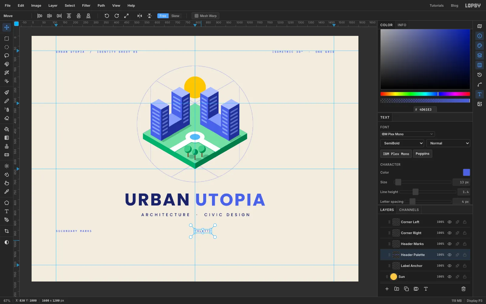

Make a `Labels` group the same way, with its own anchor layer. Set four labels in **IBM Plex Mono SemiBold**, size `13`, letter spacing `4`, colour `#4D61E3`:

- `URBAN UTOPIA  /  IDENTITY SHEET 01`, top left at (120, 72).
- `ISOMETRIC 30°  ·  ONE GRID`, top right, its last letter on the 1480 guide.
- `SECONDARY MARKS` at (120, 948).
- `PALETTE` at (800, 948).

> **Tip:** Position small labels with the arrow keys ([[Shift]] moves 10 px). On a 13 px label, dragging with the Move tool tends to catch a scale handle and stretch the text instead of moving it.

## Make the tiles

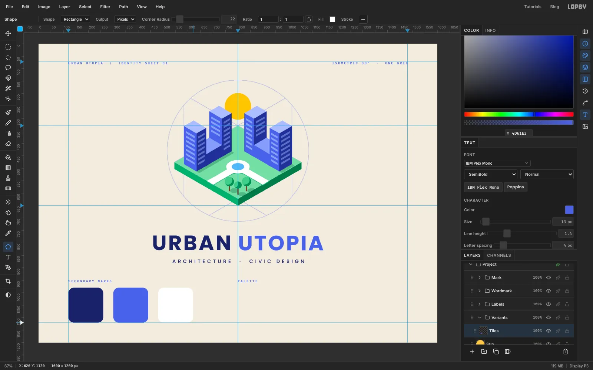

1. Select `Sun` again and make a `Variants` group with a `Tiles` layer.
2. Pick the **Shape** tool and set **Shape** to **Rectangle**, **Output** to **Pixels** and **Corner Radius** to `22`.
3. Shapes grow from where you press. Set the options bar's **Fill** swatch to `#1B2266` and drag from (190, 1050) to (260, 1120) for a 140 px tile.
4. Repeat from (370, 1050) with the Fill set to `#4D61E3`, and from (550, 1050) in white.
5. Add an empty layer called `Tile Suns` above `Tiles`. You'll use it shortly.

## Copy a simplified mark

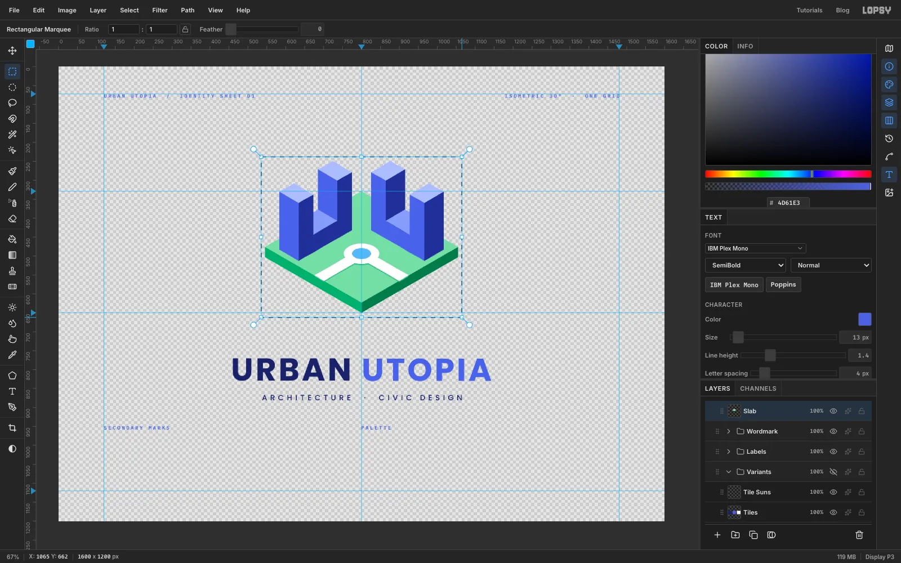

Small versions of a logo need less detail.

1. Hide `Background`, `Construction`, `Sun`, `Windows`, `Trees`, `Ground Shadows` and the `Variants` group.
2. Marquee around the buildings and slab, from (535, 238) to (1065, 662), and choose **Edit → Copy Merged**.
3. Show everything again.
4. Select `Tile Suns` and paste. Name the new layer `Mark Full Colour`.

## Scale it into the tile

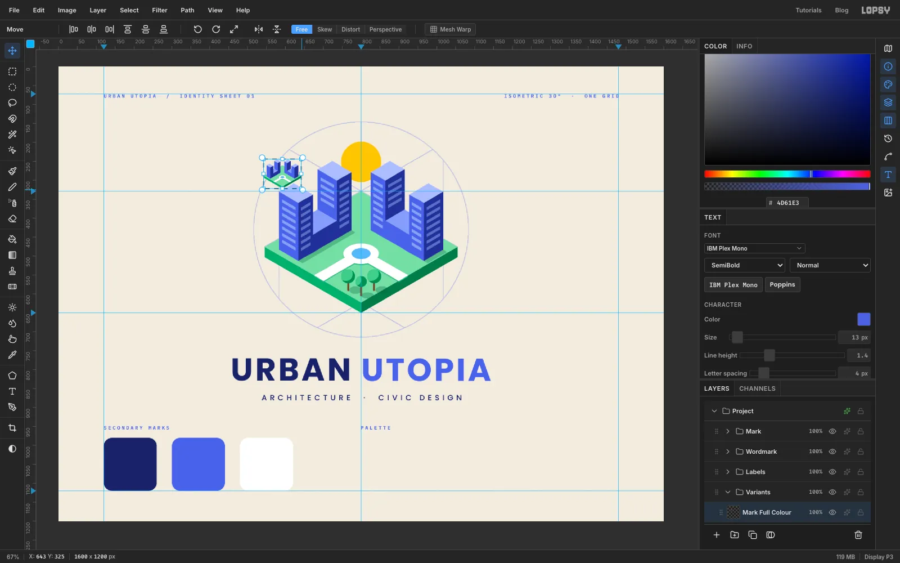

1. With the **Move** tool, hold [[Cmd]] (to keep the proportions) and drag the bottom-right corner handle in until the mark is about 98 px wide, roughly 19%. Press [[Cmd+D]].
2. Move it into the first tile, with its top-left at (141, 1016).
3. Select it with a marquee, copy, paste, and move the copy into the second tile at (321, 1016). Name it `Mark Reversed`.
4. Repeat for `Mark Mono` at (501, 1016).

## Reverse the mark with a Gradient Map

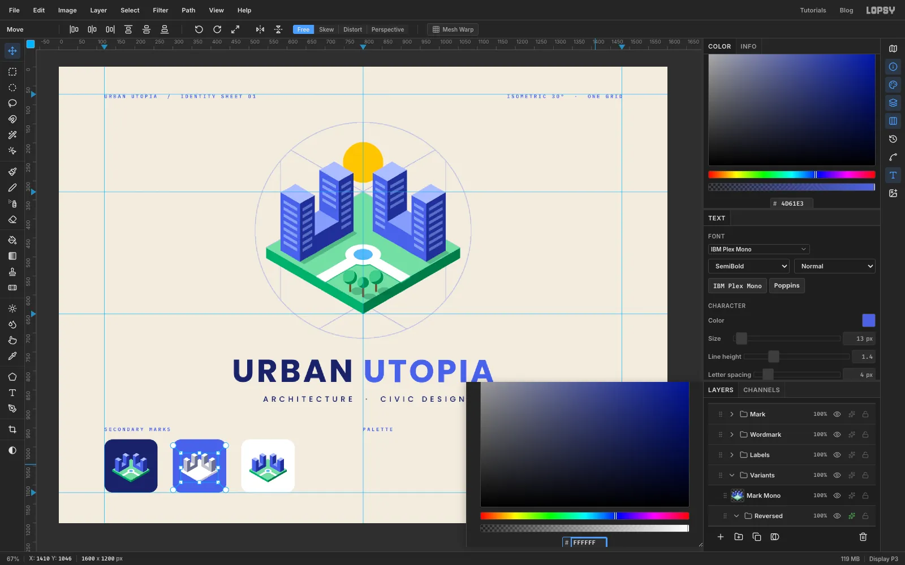

1. Select `Mark Reversed` and choose **Layer → Group Layers**. Name the group `Reversed`.
2. With the group selected, open its effects drawer and choose **Add Adjustment → Gradient Map**.
3. Set stop 1 to `#141A4A` and stop 2 to white with the hex field.
4. Click the gradient bar at about **55%** to add a third stop, and make it white as well.

Everything above about 55% brightness turns white, so the mark reads as a white building on the blue tile.

## Make a tonal mono version

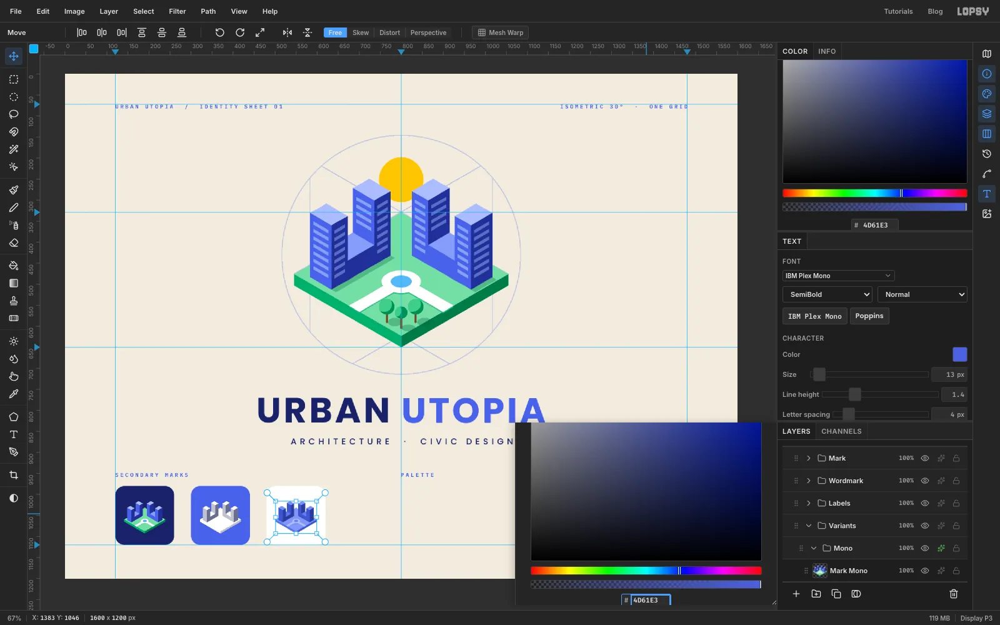

Group `Mark Mono` the same way, name the group `Mono`, and add a **Gradient Map** with three stops:

- `#1B2266` on the left
- `#4D61E3` at 50%
- `#AEBBFF` on the right

The faces keep their light and shade but use only the brand blues. That makes a one-colour version you could foil-stamp or embroider.

## Keep the suns yellow

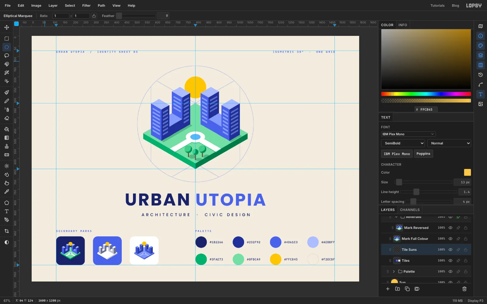

The Gradient Maps would turn a sun grey, so the suns live on `Tile Suns`, outside the mapped groups and underneath the marks. On that layer, fill a 20 px circle in `#FFC845` behind each mark, centred on (190, 1017), (370, 1017) and (550, 1017), just inside the gap between its inner towers.

## Lay out the palette

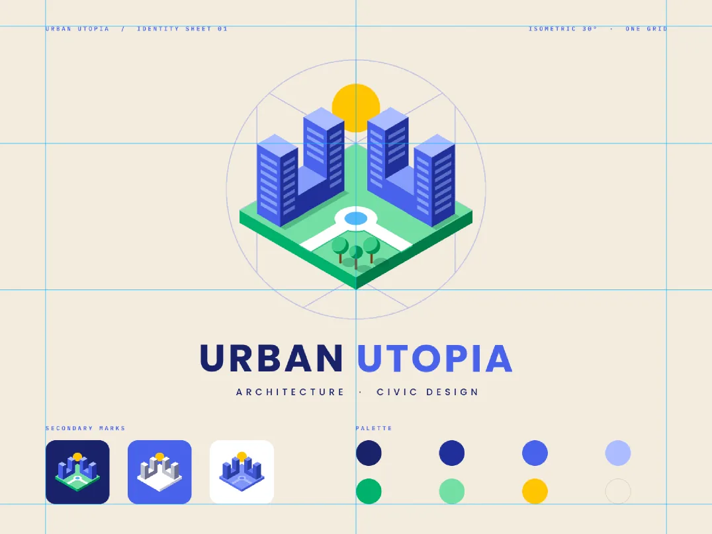

1. Select `Sun`, make a `Palette` group, and add a `Swatches` layer.
2. Fill eight 56 px circles in two rows of four. The left edges sit at x `800`, `982`, `1164` and `1346`, and the rows are centred on y `1008` and `1092`.
   - Top row: `#1B2266`, `#232F92`, `#4D61E3`, `#AEBBFF`.
   - Bottom row: `#3FAE73`, `#8FDCA9`, `#FFC845`, `#F2ECDF`.
3. The cream swatch would vanish on cream paper, so outline it:
   - Fill its circle with `#D9CFBE` first.
   - Choose **Select → Shrink** by `1` px and fill with `#F2ECDF`.

The swatch block sits level with the tiles, from 980 to 1120.

## Label the swatches

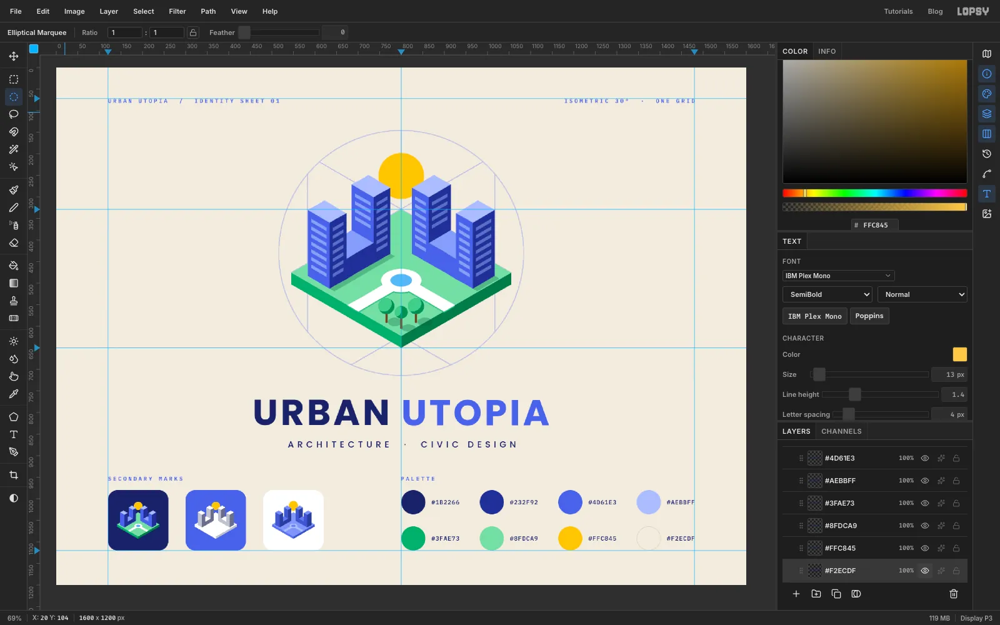

1. Select `Swatches` before you create each label. It's a plain pixel layer, so it works as the anchor here and no label gets restyled. Set each hex code in **IBM Plex Mono Medium**, size `14`, letter spacing `1`, colour `#1B2266`.
2. Place each label 14 px right of its swatch, centred on it vertically. The last column's labels end on the 1480 guide.
3. If a row of labels needs to move, click the first label in the Layers panel and **Shift-click** the last. The arrow keys then nudge all of them together.

## Add a paper grain

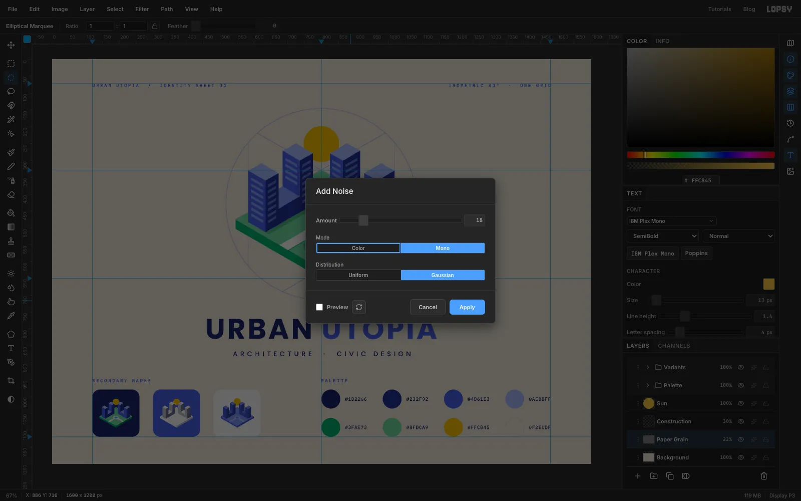

1. Select `Background` and add a layer named `Paper Grain`. Fill it with mid-grey `#808080`.
2. Choose **Filter → Add Noise** with **Amount** `18`, **Mono** and **Gaussian**, and click **Apply**.
3. Set the layer's blend mode to **Overlay** and its opacity to **22%**.

Overlay hides the grey and keeps only the speckle. The flat colours get a faint printed-paper feel without looking dirty.

Finally, choose **File → Quick Export PNG** for the sheet and **File → Save Project** to keep every layer editable.
