Isometric illustration draws a 3D scene with no vanishing point. Every edge runs along one of three axes, so a whole diorama can be built from flat polygons. A **cutaway** slices part of the object away to show what's inside.

This tutorial builds a flyer for *Mushroom Underground*, a made-up open house at a fungi farm. It's a floating block of earth with the following:
- A cabin on the grass.
- A lit grow cave cut into one face.
- Glowing mycelium threading through the other face, with the farm's name skewed onto the soil.

You'll draw everything with the **Lasso**, so it helps to know the one rule of 2:1 isometric: **every horizontal edge climbs 1 px for every 2 px across**. Vertical edges stay vertical. The block's corners in this tutorial are:
- **Top face:** back (600, 470), right (980, 660), front (600, 850) and left (220, 660).
- **Bottom corners:** left (220, 1070), front (600, 1260) and right (980, 1070).

Palette:

- Night sky `#15112A` → `#2A1E47` → `#3D2659`
- Lit soil `#B8683F` / `#8E4A33` / `#5C3A45`
- Shaded soil `#83452D` / `#633224` / `#422A36`
- Night grass `#3E8749` / `#4A955A`, turf `#2D6A3A` / `#235530`
- Glow mint `#7FF3C9`, lamp amber `#FFB547`
- Title cream `#FFF1D6`, extrusion red `#A3291F`, fly agaric red `#D63C2F`

## Paint the night sky

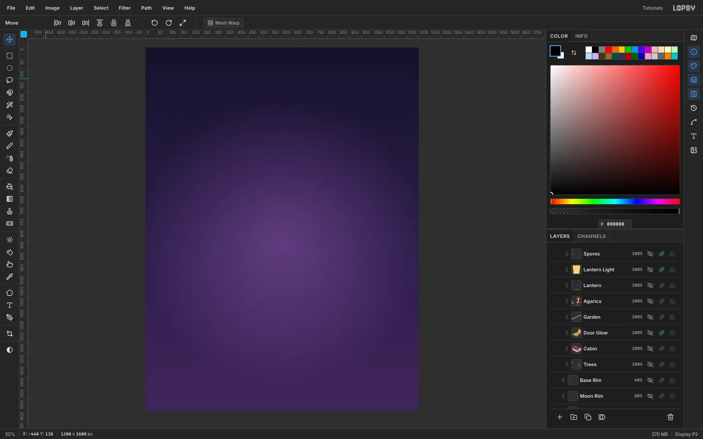

1. Create a **1200 × 1600 px** document with a white background.
2. Rename `Layer 1` to `Night Sky`.
3. Pick the **Gradient** tool and open **Advanced…**. Set three stops: `#15112A`, `#2A1E47` at 55%, and `#3D2659`.
4. Drag from the top of the canvas to the bottom.

Next, add the glow behind the island:
1. Add a layer named `Aura` and switch the gradient **Type** to **Radial**.
2. Use one colour, `#9B5FC0`, at 70% opacity fading to 0%.
3. Drag from (600, 860) down to (600, 1500).
4. Set the layer's **Blend** to **Screen** and its opacity to **55%**.

## Lasso the block's faces

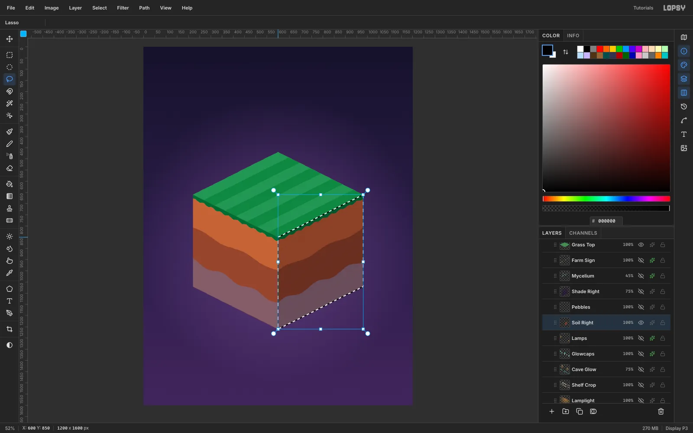

Click **New Group** and name it `Island`. Every block layer goes inside it.

1. **Soil Left:** lasso the left face and fill it with `#B8683F` (**Edit → Fill**). Then lasso two wavy bands down to the bottom edge: fill subsoil `#8E4A33` from about 140 px below the top edge, and bedrock `#5C3A45` from about 282 px below it.
2. **Soil Right:** do the same on the right face with the darker `#83452D`, `#633224` and `#422A36`. Start each wave where the left one ends, so the bands wrap around the corner.
3. **Grass Top:** lasso the diamond and fill `#3E8749`. Add four lighter `#4A955A` stripes, 48 px wide, running parallel to the right edge.
4. **Turf Edge:** lasso a scalloped band about 17 px deep under both top edges. Fill it `#2D6A3A` on the left and `#235530` on the right.

> **Tip:** Run the left face's bands 4 px past the front corner. The right face covers the overlap, so no bright seam shows down the corner. Make sure every band also reaches the far edges exactly, or a sliver of the base colour will peek through.

## Cut the grow cave

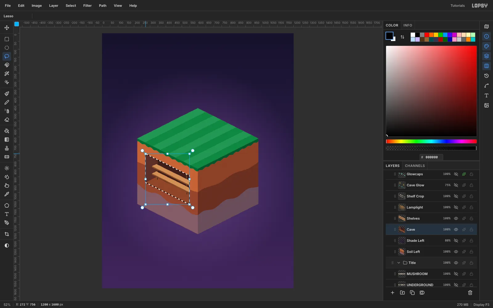

A recess in the left face shows three inner surfaces: the back wall, the floor, and the side wall nearest the left corner. The ceiling faces down, so you never see it.

1. Add a `Cave` layer above `Soil Left`. Lasso the opening at (272, 756), (548, 894), (548, 1074), (272, 936) and fill it `#3A1E1B` for the back wall.
2. Lasso the sliver along the left edge that slants up to the right and fill it `#57302A` for the side wall. Fill the strip along the bottom `#86492F` for the floor.
3. On a `Shelves` layer, lasso two planks parallel to the opening's top edge. Fill each plank's top `#C9925E` and its front edge `#7E5030`.
4. Back on `Cave`, fill two 6 px posts in `#4A2A1A` at x 346 and x 530. The planks cover them where they cross.

Depth in isometric pushes things *up and to the right*. A back wall 34 units deep shows up 68 px higher than the opening, so only its lower part is visible.

## Grow one shelf, then copy it

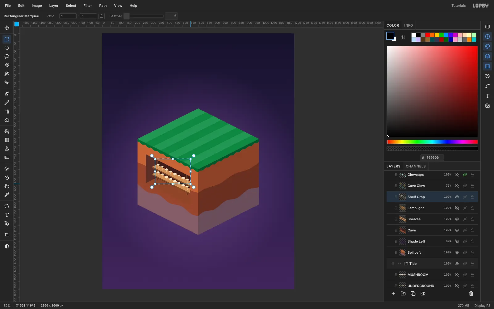

1. On a `Shelf Crop` layer, draw eight small button mushrooms along the upper shelf. Lasso each stem as a tapered quad in `#D8C09A`, then each cap as a half-dome in `#F4E4C4`.
2. Marquee the row from (330, 785) to (552, 942). Press [[Cmd+C]], wait a moment, then press [[Cmd+V]]. The paste lands in place on a new layer.
3. With the **Move** tool, press [[Shift]]+[[Down]] four times and [[Down]] six times. That's 46 px, exactly one shelf lower.
4. Choose **Layer → Merge Down**.

## Light the cave

**Glowcaps.**
1. On a `Glowcaps` layer, draw six mushrooms 16–36 px tall standing on the floor. Use `#D9FFF1` stems, `#7FF3C9` caps and a thin `#3FB894` gill band under each cap.
2. Give the layer an **Outer Glow** in `#3FF0B8`: **Size 26**, **Spread 10**, **Opacity 80**.

**Lamps.**
1. On a `Lamps` layer, hang two lamps from the opening's top edge at x 360 and x 500. Each is a 2 px cord, a dark shade and a `#FFD27A` bulb.
2. Add an **Outer Glow** in `#FFB547` with **Size 34** and **Spread 30**.

**Cave light.**
1. Add a `Lamplight` layer and lasso the cave opening. Drag a **Radial** gradient of `#FFB04A` at 55% fading to 0% across it, then set the layer to **Screen**. The selection keeps the light inside the cave.
2. On a `Cave Glow` layer, lasso a cone under each lamp. Fill it with a linear `#FFC46B` gradient that fades downward.
3. Put a flat ellipse under each glowcap and fill it with a radial `#5FF0C8` gradient.
4. Set the layer to **Screen** at **75%**.

## Grow the mycelium

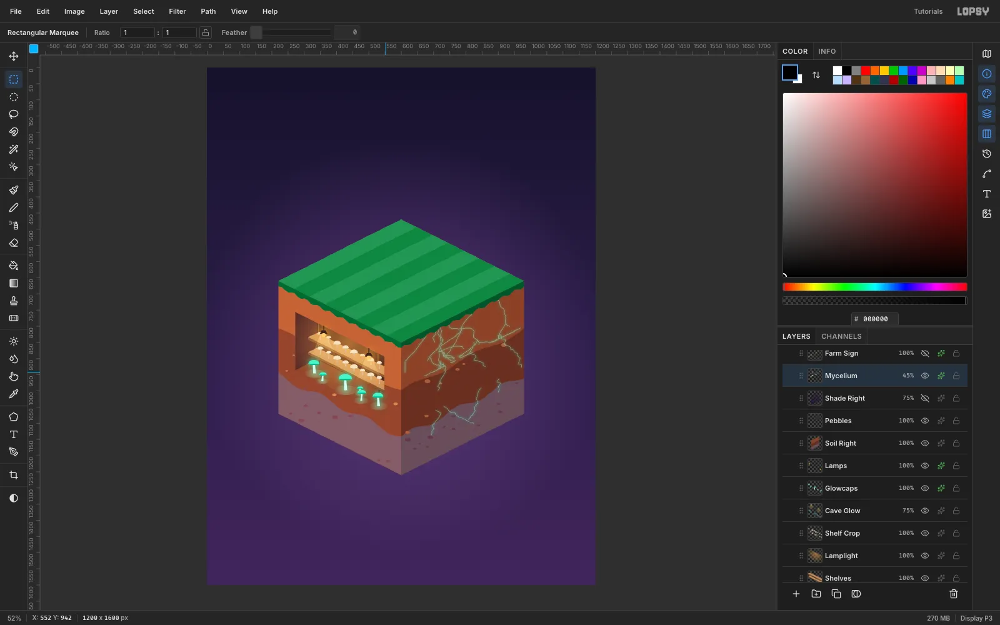

1. On a `Pebbles` layer, scatter small elliptical marquee fills a shade lighter than each band. Keep them out of the cave.
2. On a `Mycelium` layer, set the **Brush** to **Size 2** and **Hardness 90** in `#B6FFE6`. Drag branching, wandering strokes down from the right face's top edge. Start some right under where the fly agarics will stand, so the threads read as their roots. Carry a few deep into the bedrock, and wrap one around the front corner under the cave.
3. Add an **Outer Glow** in `#3FF0B8` at **Size 12**, **Opacity 70**.
4. Where strokes knot together, thin them out with the **Eraser** at Size 16.
5. Set the layer's opacity to **45%**, so the threads glow without turning into cracked glass.

## Skew the farm's name onto the soil

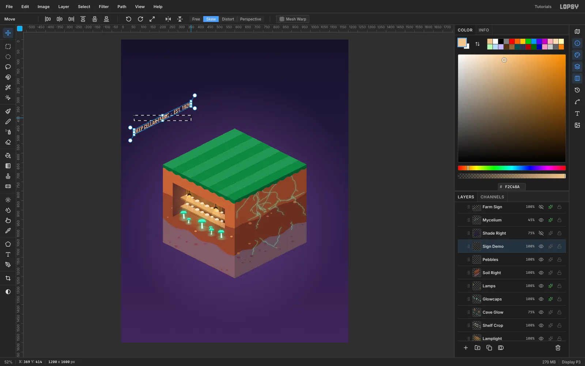

Text on the right face has to follow that face's plane. The baseline climbs 1 px per 2 px, but the letter stems stay vertical. That's a vertical shear, not a rotation.

1. In an empty patch of sky, type `DEEP CELLAR FARMS  ·  EST. 1926` in **Bebas Neue** at **30 px**, then click **Rasterize Layer**.
2. Marquee around it, switch to the **Move** tool, and click **Skew** in the options bar.
3. Drag the right-edge handle straight up by a quarter of the text's width (about 75 px for this line). Press [[Cmd+D]].
4. Name the layer `Farm Sign` and move it so its bottom-left corner sits at (642, 1065) on the right face.
5. Add a **Color Overlay** of `#F2C48A` and a hard **Drop Shadow** in `#2A1410`: **Offset 2 / 2**, **Blur 0**, **Opacity 80**. This gives a carved look.
6. Drag `Farm Sign` above `Mycelium`. Then lasso a band about 26 px above and below the lettering and delete it on `Mycelium`, so no threads cross the words.

> **Tip:** At the moment a Skew handle moves the edge twice as far as the pointer ([#1074](https://github.com/theseamusjames/lopsy.art/issues/1074)). That's why the drag is a quarter of the width rather than half. Check that the slope ends up at 1:2.

## Shade and texture the faces

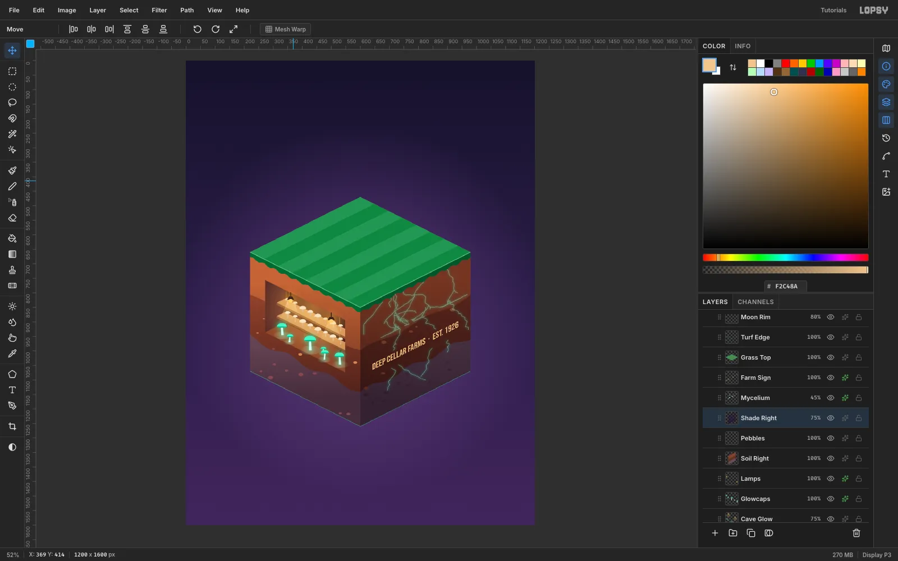

1. **Shade Left:** add this layer just above `Soil Left`, so it darkens the soil but not the cave. Lasso the left face and drag a linear gradient from `#24123A` at 0% to 70%, top to bottom. Set it to **Multiply** at **80%**.
2. **Shade Right:** add this layer above `Pebbles`. Do the same on the right face, but from 25% to 80%, so the shaded side stays darker all the way down. Set it to **Multiply** at **75%**.
3. On each soil layer, run **Filter → Add Noise…** with **Amount 10**, **Mono** and **Gaussian** for grain.
4. Lasso each bedrock band and run **Brightness/Contrast…** at **Brightness +14**, so the bottom of the block doesn't sink into the sky.
5. Brush a 3 px `#8FD6A0` line along the two front top edges on a `Moon Rim` layer at 80%. Hold [[Shift]] and click to draw straight lines. Add a 2 px `#5FF0C8` line along the bottom edges on a `Base Rim` layer at 40%.

## Build the cabin and trees

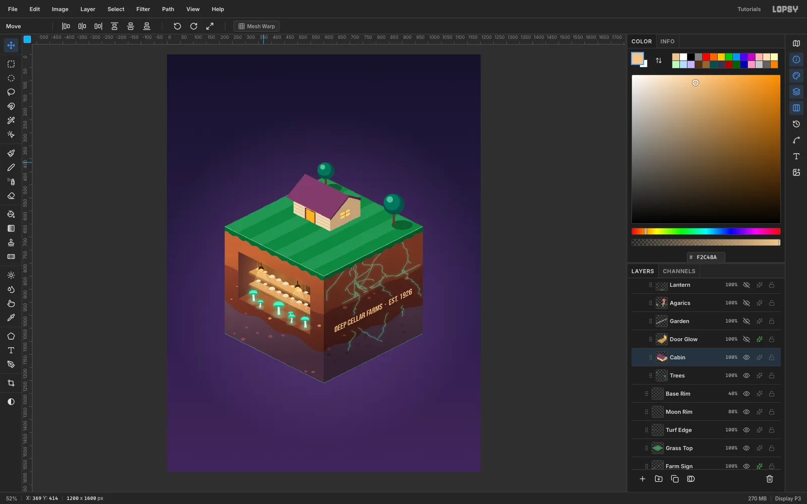

Make the grass layer active and click **New Group** for a `Topside` group.

**Cabin** layer:
1. Fill the long wall that faces left in `#EBD9B4` and the gable end in `#BFA27C`. Light comes from the upper left.
2. Brush 2 px `#CDB28A` siding lines parallel to the wall's bottom edge.
3. Fill the door `#6B3B2A` with a `#FFB547` inner panel, and fill the window `#FFD27A`.
4. Fill the front roof slope `#7A3F6A`, with a `#4A2742` fascia along the gable. The back slope faces away, so you never draw it.

**Trees** layer:
1. Each tree is a dark ellipse shadow on the grass to its right, then a `#5A3A2A` trunk.
2. Build the canopy from three circles: `#1F5247`, then `#2F7560` offset up and left, then a small `#6FC49A` highlight.
3. The trees stand behind the cabin, so drag `Trees` below `Cabin` in the Layers panel.

## Add the garden and fly agarics

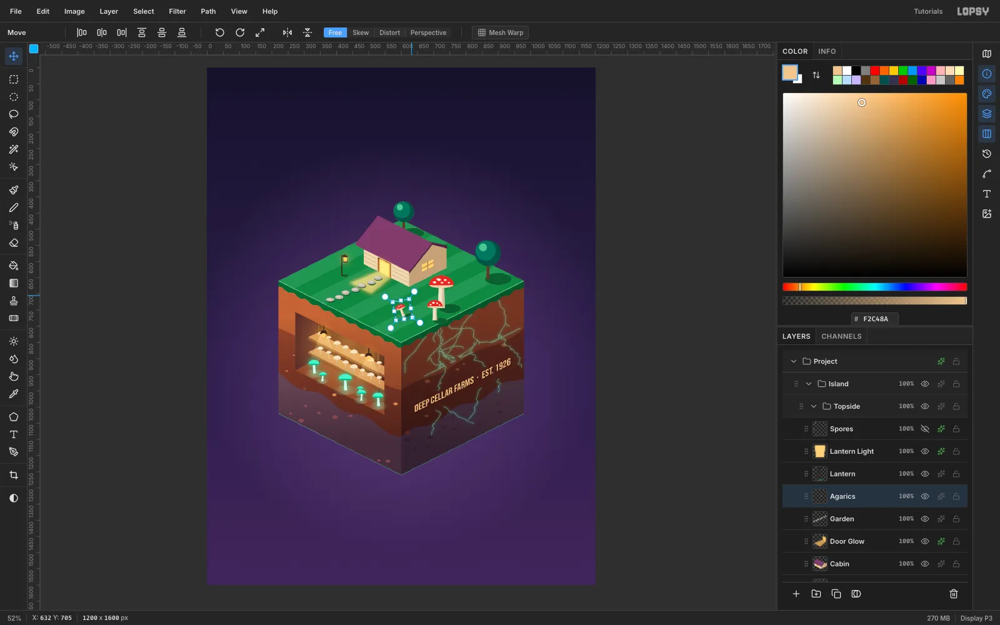

1. **Door Glow.** Lasso a trapezoid running out from the door toward the left edge. Fill it with a fading `#FFC060` gradient, run **Gaussian Blur** at **9**, and set the layer to **Screen**.
2. **Garden.** Lay seven stepping stones as 26 × 13 ellipses. Run them straight out of the door, down and to the left, which is the direction the door faces. Put a dark offset copy under each stone, then add a light highlight.
3. **Agarics.** Draw three fly agarics: `#EFE3CB` stems, `#D63C2F` domed caps, `#E8D2AE` gills and `#FFF6E4` spots. Give each a dark cast shadow.
4. **Lean the small agaric.** Marquee the smallest one, switch to **Move**, and drag its rotate handle about **−12°**. Press [[Cmd+D]].
5. **Lantern.** Draw a lantern post at the left. Marquee just the lamp head, cut it with [[Cmd+X]], and paste it with [[Cmd+V]], which puts it back in place on its own layer. Give only that layer an amber **Outer Glow**, so the post stays crisp.

## Set the title

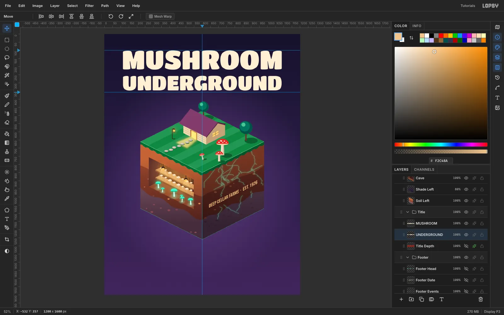

1. [[Cmd]]-click the top ruler near the middle to drop a guide at exactly half the width.
2. Click the left ruler at y 100 and y 357 to mark the title band.
3. Type `MUSHROOM` in **Titan One** at **162 px** and `UNDERGROUND` at **125 px**, both in `#FFF1D6`. Those sizes make both lines exactly **974 px** wide.
4. Move them so they're centred on the guide, with ink tops at **y 100** and **y 256**.

> **Tip:** Type each line in empty sky, then move it. A text click inside another text layer's box edits that layer instead.

## Extrude the title in 3D

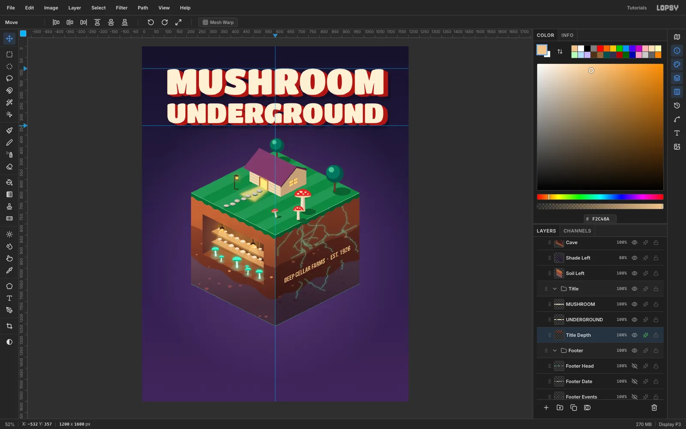

First, make a flat red copy of both lines:
1. Select each text line and click **Duplicate Layer**.
2. **Click the copy's row before doing anything else** ([#804](https://github.com/theseamusjames/lopsy.art/issues/804)). Otherwise, the next nudge moves the original too.
3. Rasterize each copy and move it back by −10 / −10, onto its source line.
4. Drag both copies under the text, then **Merge Down** into one layer named `Title Depth`.

Then build the depth by doubling:
1. Duplicate `Title Depth`, click the copy's row, and move it by **(+2, +1)**. That's the isometric direction.
2. Merge it down.
3. Repeat with **(+4, +2)**, **(+8, +4)** and **(+6, +3)**.

Four merges give a solid extrusion 20 px across and 10 px down.

Finish it:
1. Add a **Color Overlay** of `#A3291F` and click **Rasterize Layer Style** to bake it in.
2. Add a **Stroke** (Width 4, `#1C1030`) and a soft **Drop Shadow** (8 / 12, Blur 18, 65%).

## Set the event details on a grid

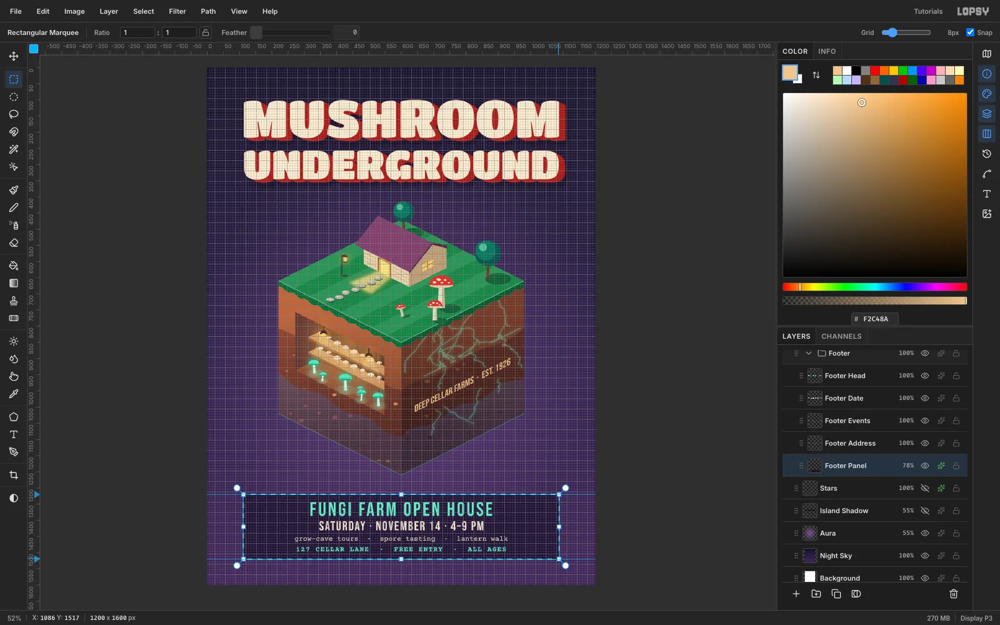

**Panel.**
1. Press [[Cmd+']] to show the grid and set **Grid size** to **8 px**. Snap turns on with it.
2. Drag a marquee from about (114, 1323) to (1086, 1517). It snaps to exactly (112, 1320) – (1088, 1520).
3. Run **Select → Shrink** by 14, then **Select → Grow** by 14 to round the corners.
4. Fill it `#140C28` on a `Footer Panel` layer at **78%**, and add a 2 px `#7FF3C9` **Stroke**.

**Lines.** Centre each line on x 600, leaving 23 px above the first line and below the last:
1. `FUNGI FARM OPEN HOUSE` in **Bebas Neue** 60 px, mint, letter spacing 6, ink top at y 1343.
2. `SATURDAY · NOVEMBER 14 · 4–9 PM` in **Bebas Neue** 40 px, cream, letter spacing 3, ink top at y 1402.
3. `grow-cave tours  ·  spore tasting  ·  lantern walk` in **Courier Prime** 22 px, cream, ink top at y 1448.
4. `127 CELLAR LANE  ·  FREE ENTRY  ·  ALL AGES` in **Courier Prime Bold** 22 px, mint, letter spacing 2, ink top at y 1483.

Set the letter spacing in the **Text** panel while each line is still the active layer.

## Release the spores

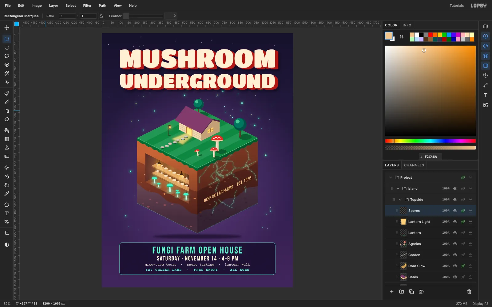

1. **Stars.** On a `Stars` layer, click single 2–4 px `#FFF1D6` brush dabs around the sky. Add a small cream **Outer Glow**.
2. **Spores.** On a `Spores` layer at the top of `Topside`, dab 3–12 px dots, mostly `#9BFFDA` with a few `#FFE9B8`. Cluster them above the agarics and around the block. Give them an **Outer Glow** in `#3FF0B8` at **Size 22**, **Spread 18**, **Opacity 90**.
3. Spores painted over the cabin or grass look like noise on the drawing. Lasso the island's silhouette on `Spores` and press [[Delete]].
4. **Shadow.** Under the `Island` group, fill a 560 × 30 ellipse centred on (600, 1280) with `#0B0618`. Run **Gaussian Blur** at **14** and set it to **55%**. The block now floats above the panel with some breathing room.

Export with **File → Quick Export PNG**, and save the project with **File → Save Project** so you can come back to any layer.
