A tattoo flash sheet is the page on a tattoo shop wall: a bordered set of
ready-to-go designs, each with a number a client can point at. In this
tutorial you'll draw one in **isometric** style. Every object is built from
flat parallelograms at 30°, and each has three tones: a light top, a mid left
face and a dark right face. Ink outlines and flat offset shadows give it the
bold look of flash.

The theme is **ZEN ENCLAVES**: four floating islands, each holding one
garden scene. You'll build the drafting paper from a pattern, draw every face
with the **Lasso**, then line, shade and number the designs.

The palette:

- Paper `#F2E6CB`, ink `#1C1A24`, grid `#7FB3AA`
- Vermilion `#EE6A4B` / `#D8452B` / `#8C2717` (top / left / right faces)
- Teal roofs `#4FA3A0` / `#2F7F7C` / `#174446`
- Grass top `#B4D98F` → `#8DBF6A`, grass sides `#5E9A4B` / `#3F6E3A`
- Earth `#B97A48` / `#80502F`, rock `#6E655E` / `#4A433F`
- Stone `#DDD8CC` / `#ABA597` / `#7E786C`

> **Tip:** Isometric in one sentence: one unit along x moves right and down
> at 30°, one unit along y moves left and down at 30°, and one unit of height
> moves straight up. Every island here uses the same block, so its top face
> is a diamond about 400 px wide and 230 px tall.

The Lasso draws freehand while you hold the mouse button, so for each face,
press on one corner and move in straight runs from corner to corner before
releasing. Zooming in makes straight edges much easier.

## Draw one tile of isometric graph paper

Choose **File → New**, enter **1200 × 1540** and click **Create**. Select
**Background**, set the foreground to `#F2E6CB` and choose **Edit → Fill**.

Rename **Layer 1** to **Grid Tile**. Pick the **Pencil** (N) at **Size 2**
in `#7FB3AA`. Click a point, then [[Shift]]-click the next one to draw each
straight line. Draw vertical lines 52 px apart, then diagonals at ±30°
(30 px of rise for every 52 px of run), each spaced 60 px apart
vertically. Make the patch a little bigger than one repeat.

Marquee exactly one repeat, **104 × 60**, placed so neither vertical line
sits on its edge. Choose **Edit → Define Pattern**.

> **Tip:** Hold [[Cmd]] as well as [[Shift]] when you click the end of a
> line, and it snaps to the nearest 15°, which makes the 30° diagonals
> easy. For the repeat, *click* (don't drag) with the Rectangular Marquee
> while nothing is selected, and type corners exactly 104 px apart
> horizontally and 60 px apart vertically.

## Fill the page with the pattern

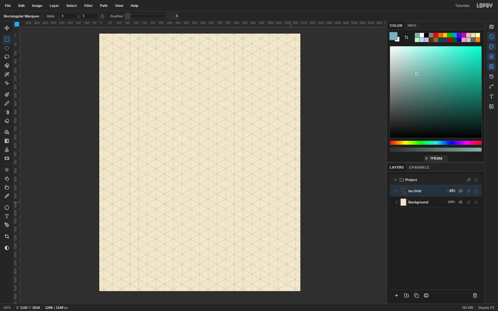

Delete **Grid Tile**; the pattern is saved. Select **Background**, add an
**Iso Grid** layer and choose **Edit → Fill with Pattern…**. Pick the new
104 × 60 pattern at **Scale 100** and click **Apply**. Set the layer's
opacity to **45%** so the grid reads as printed drafting paper.

## Rule a double ink border

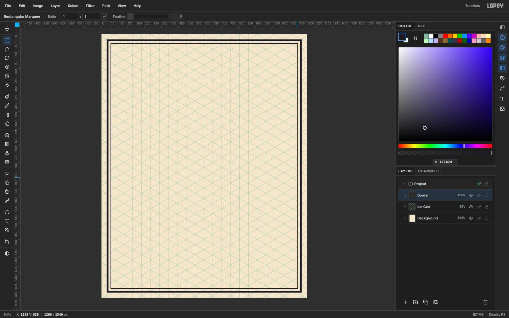

Add a **Border** layer. Marquee a rectangle **30 px** in from every edge,
fill it with `#1C1A24`, then marquee a rectangle **10 px** further in and
press [[Delete]]. That leaves a 10 px band.

For the hairline, marquee a rectangle **12 px** inside the band, fill it,
choose **Select → Shrink…** at **3 px** and press [[Delete]].

> **Tip:** Clicking with the Rectangular Marquee (nothing selected) lets you
> type these exactly: **From 30, 30 To 1170, 1510** for the band's outside,
> **From 40, 40 To 1160, 1500** for its inside, and **From 52, 52 To 1148,
> 1488** for the hairline.

## Set up guides for a 2 × 2 sheet

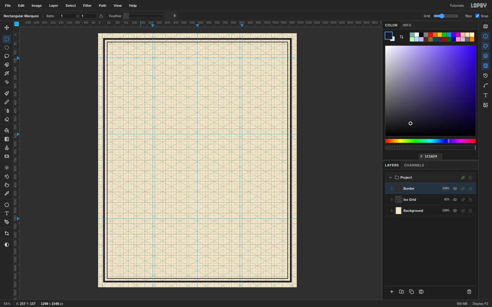

On the top ruler, click at about **330** and **870** for the two column
centres, and [[Cmd]]-click the middle of the ruler for an exact centre line.
On the left ruler, click at about **150** for the title line and about
**612** and **1124** for the two row centres. Turn on **View → Show Grid**
(16 px) to check the layout, then turn it off again. While the grid is
showing, marquees and moves snap to it; Lasso strokes don't.

## Build an extruded title plate

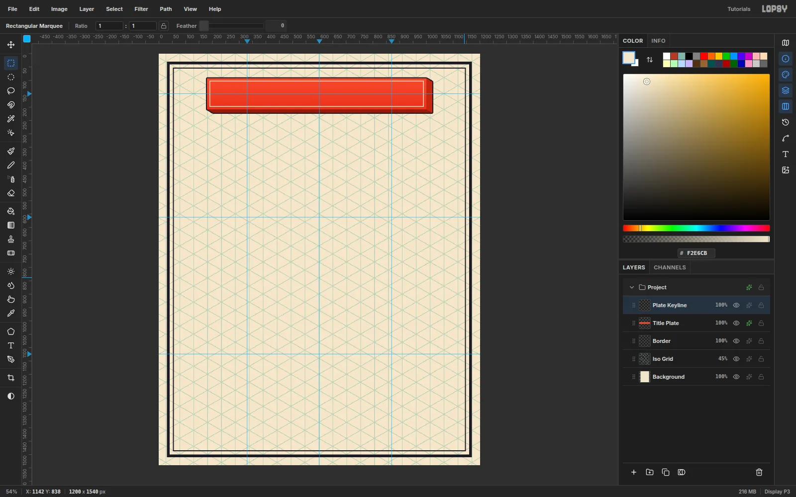

Add a **Title Plate** layer. The plate's face is a wide rectangle centred on
the title guide, about 820 × 116 px, running from about 180 px in on the
left to 200 px in on the right. It extrudes **22 px right and 13 px down**.
With the **Lasso** (L), draw the bottom face as a thin parallelogram: run
along the face's bottom edge, step 22 px right and 13 px down, run back the
same length, and close. Fill it `#8C2717`. Draw the right face the same way
down the face's right edge, and fill it `#B63722`.

Marquee the face and drag a **Linear** gradient from `#E4583A` at the top to
`#D8452B` at the bottom. Add a 4 px ink **Stroke**. On a **Plate Keyline**
layer, marquee the face inset by 9 px, fill it with paper, **Shrink** by
2 px and press [[Delete]]. The keyline has its own layer so clearing its
middle doesn't punch a hole in the plate.

## Type the title

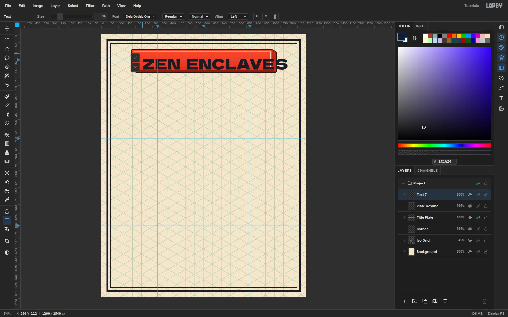

Pick the **Text** tool (T), set **Size 84** and choose **Dela Gothic One** in
the font browser. Its heavy, squared capitals look carved. With ink as the
foreground, click on the plate and type `ZEN  ENCLAVES` with **two** spaces.
A single space is barely wider than the gaps between letters. Press
[[Tab]] to commit.

## Fit and recolour the title

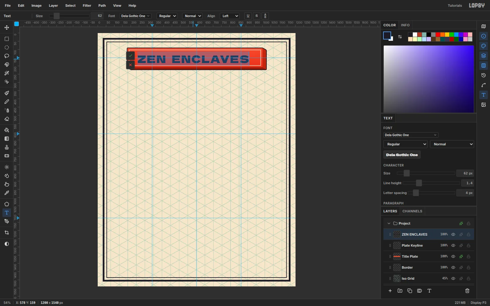

At 84 px it overruns the plate. With the title layer active and the Text
tool still selected, set **Size** to **62**. Open the **Text** panel from the
right-hand toolbar and set **Letter spacing** to **4 px**, so the heavy
letters don't crowd each other. Click into the text, press [[Cmd+A]] and set
the foreground to paper `#F2E6CB`. Press [[Tab]].

## Seat the title in the plate

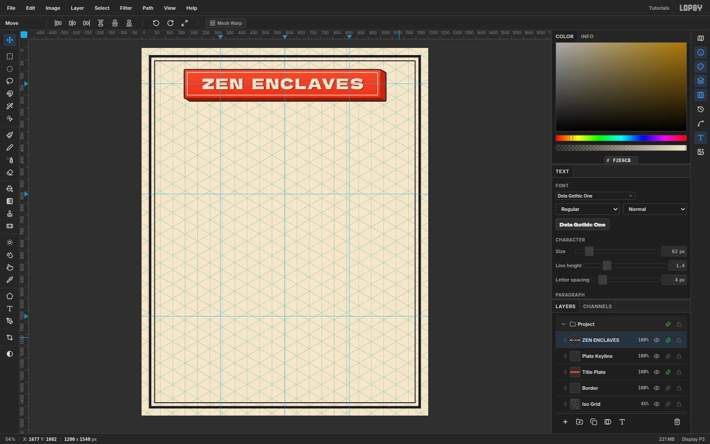

Switch to **Move** (V) and nudge with the arrow keys ([[Shift]] for 10 px)
until the letters sit in the middle of the face, with equal space at each
end and equal space above and below the caps. All caps have no descenders,
so centre the cap height itself. Add a `#8C2717` **Drop Shadow** at
**Offset 3 / 2**, **Blur 0**, **Opacity 100**, a small extrusion that
matches the plate's.

## Draw the first floating island

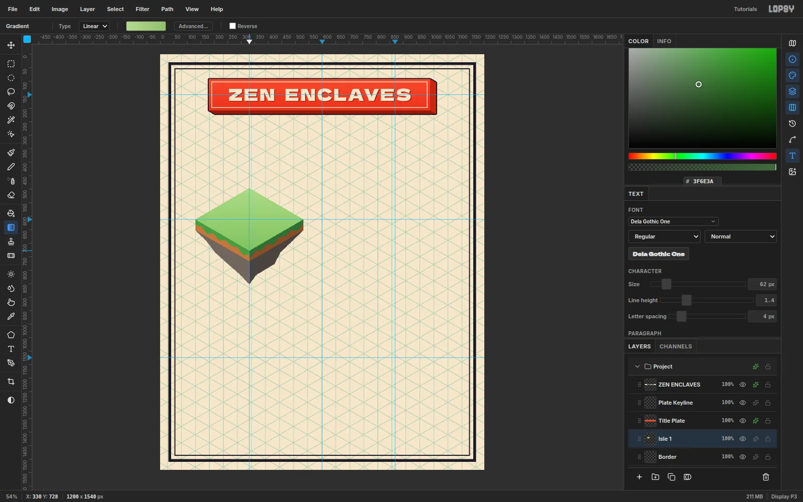

Every island is centred on its guide crossing. For island 1, on the top-left
crossing, the top diamond's left and right corners sit on the row guide about
**200 px** either side of the column guide, and its back and front corners
sit on the column guide about **115 px** above and below the row guide. The
sides drop 40 px. Add an **Isle 1** layer and lasso each face, back to front:

1. The rock underneath: two triangles from the bottom edge of each side down
   to a point on the column guide, about 240 px below the crossing. Zig-zag
   the outer edges a little. Fill the left one `#6E655E` and the right one
   `#4A433F`.
2. The two earth sides, `#B97A48` on the left and `#80502F` on the right.
3. A grass lip over the top 12 px of each side, with drips hanging down:
   `#5E9A4B` left, `#3F6E3A` right.
4. The top diamond, with a **Linear** gradient from `#B4D98F` at the back
   corner to `#8DBF6A` at the front.

## Raise the torii gate

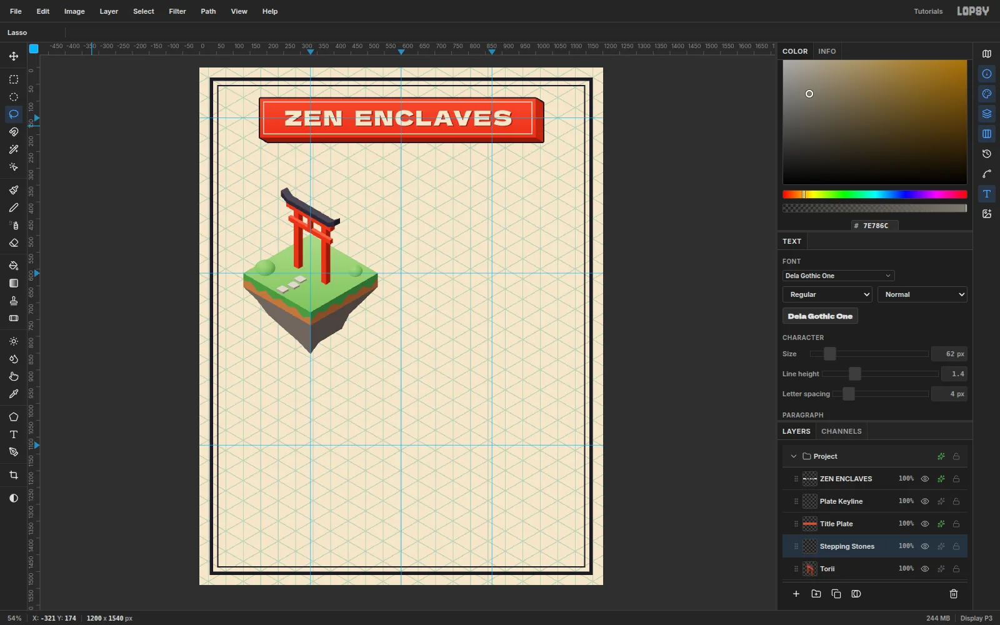

On a **Shrubs 1** layer, drag two **Radial** green gradients inside
elliptical marquees on the left and right corners of the island. On a
**Torii** layer, each post and beam is a box: lasso its three visible faces
and fill them `#EE6A4B` on top, `#D8452B` on the left and `#8C2717` on the
right. Build two posts about 165 px tall, the lower *nuki* beam, a short
centre strut and the top beam. Cap it with a black *kasagi* whose two ends
lift about 11 px, in `#4A4652` on top and `#2C2934` on the front. On a
**Stepping Stones** layer, lay three thin stone boxes leading up to the gate.

## Paint the rising sun's rays

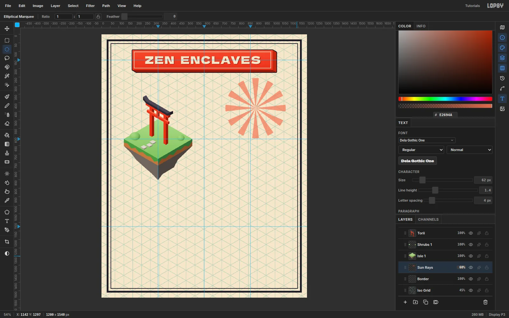

Select **Border** and add a **Sun Rays** layer so the rays sit behind
everything. With the **Elliptical Marquee**, [[Cmd]]-drag a circle about
**352 px** across, centred just right of the right column guide and about
180 px above the top row guide, and set the foreground to `#E2694A`. Choose
**Filter → Sunburst…** with **Rays 12**, **Width 42**, **Taper 0**,
**Fade 0**, and **Center X 75 / Center Y 28** (the circle's centre as a
percentage of the page). The selection clips the burst to a disc. Press
[[Cmd+D]] and set the layer to **60%**.

> **Tip:** To match the Sunburst centre exactly, click with the Elliptical
> Marquee (nothing selected) and enter **From 724, 256 To 1076, 608**.

## Add the sun disc

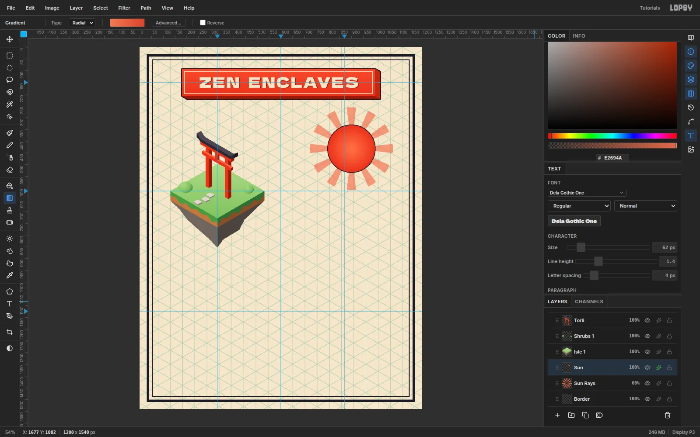

Add a **Sun** layer above the rays. Select a **200 px** circle on the same
centre (**From 800, 332 To 1000, 532** in the marquee dialog), drag a
**Radial** gradient from `#F07A52` to `#D8452B`, and add a 3 px ink
**Stroke**.

## Stack the pagoda

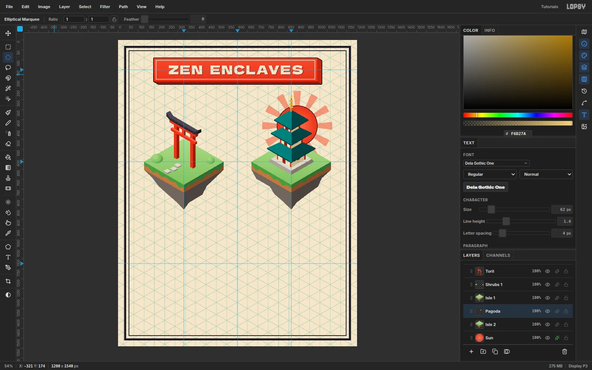

Draw island 2 on the top-right guide crossing exactly like island 1. On a
**Pagoda** layer, build from the bottom up, filling each face with the Lasso:

- A stone plinth, slightly tapered, 13 px tall.
- Three wall boxes, 84, 66 and 50 px across and 50, 42 and 35 px tall, in
  `#F3E3C0` / `#CBB48A`, with vermilion corner posts, a dark door slot on
  the left face and a small ink window on the right.
- Over each wall: a 5 px dark eave, then a hip roof. That's a tapered box
  whose base is much wider than its top, in the three teal tones. The top
  roof tapers to a point.
- A gold spire with three ring ellipses and a ball on top.

## Lay the sand island and rake it

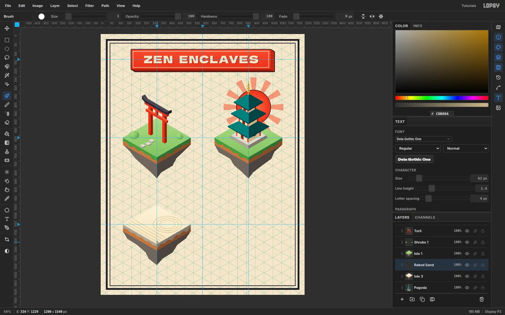

Draw island 3 on the bottom-left guide crossing with a sand top: fill the
lip in the stone tones and drag a `#FBF1D6` → `#F4E7C4` gradient across the
top. On a **Raked Sand** layer, use the **Brush** (B) at **Size 3**,
**Hardness 100**, in `#CDB88A`. Shift-click around three isometric circles
(flattened ellipses tilted to the diamond) for the rings, then click
straight rows across the front, parallel to the island's right edge.

## Set a faceted boulder

On a **Rocks** layer, lasso a four-sided crown in `#DDD8CC`, then the two
flanks down to the sand, `#ABA597` on the left and `#7E786C` on the right,
plus a sliver of the back flank. Keep the base flat on the sand so the rock
doesn't look like it's floating. Add a low stone slab in front of it.

## Grow a bonsai pine

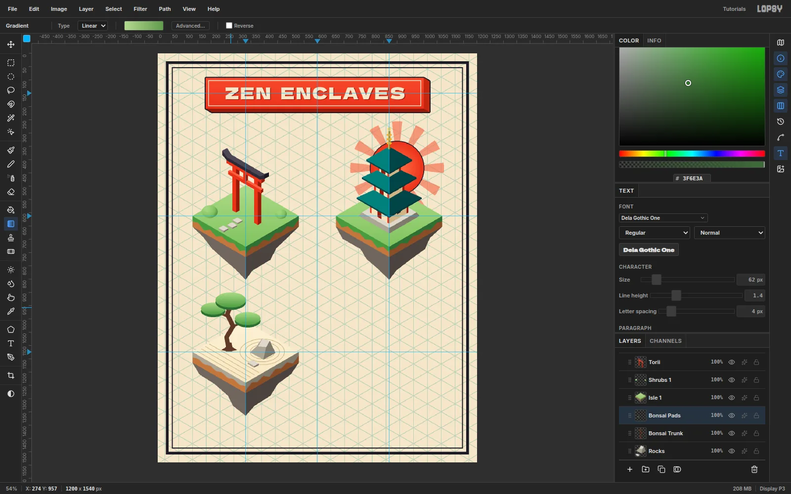

On a **Bonsai Trunk** layer, lasso a flared root plate in `#5B3A29`. Then use
the Brush at **Size 18**: click the base and Shift-click up an S-curve about
165 px tall. Drop to **Size 9** and add two branches. On a **Bonsai Pads**
layer, draw each pad as an isometric disc. First fill an ellipse in
`#3F6E3A` (the rim). Then fill a second ellipse 9 px higher with a
`#B4D98F` → `#5E9A4B` gradient. Make each ellipse half as tall as it is
wide.

## Sink a pond into the fourth island

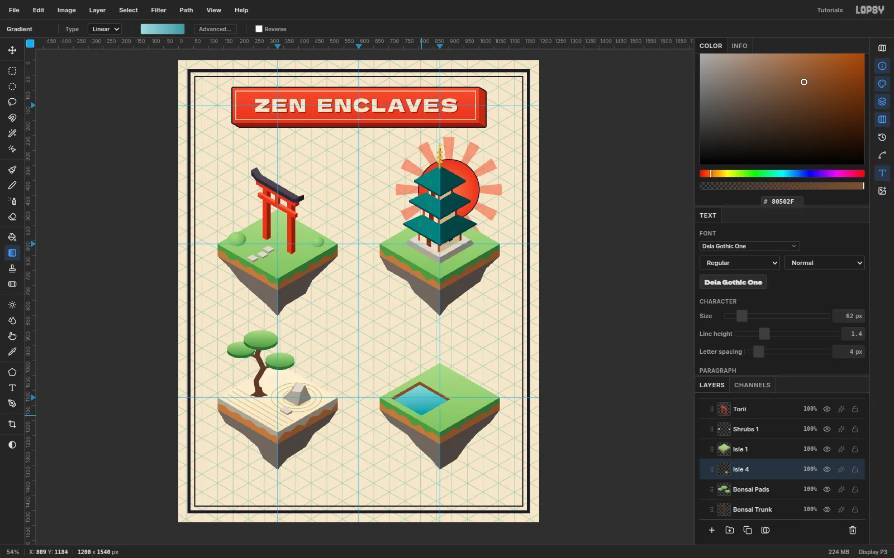

Draw island 4 on the bottom-right guide crossing. To sink the pond, lasso
the opening's diamond on the top and fill it `#80502F`. Then lasso the
water: the same diamond dropped 11 px, trimmed so it stays inside the
opening. Fill it with a `#9AD9DA` → `#3E97A6` gradient. The strip of dark
earth left at the back is the pond's inner wall.

## Swim a koi across the water

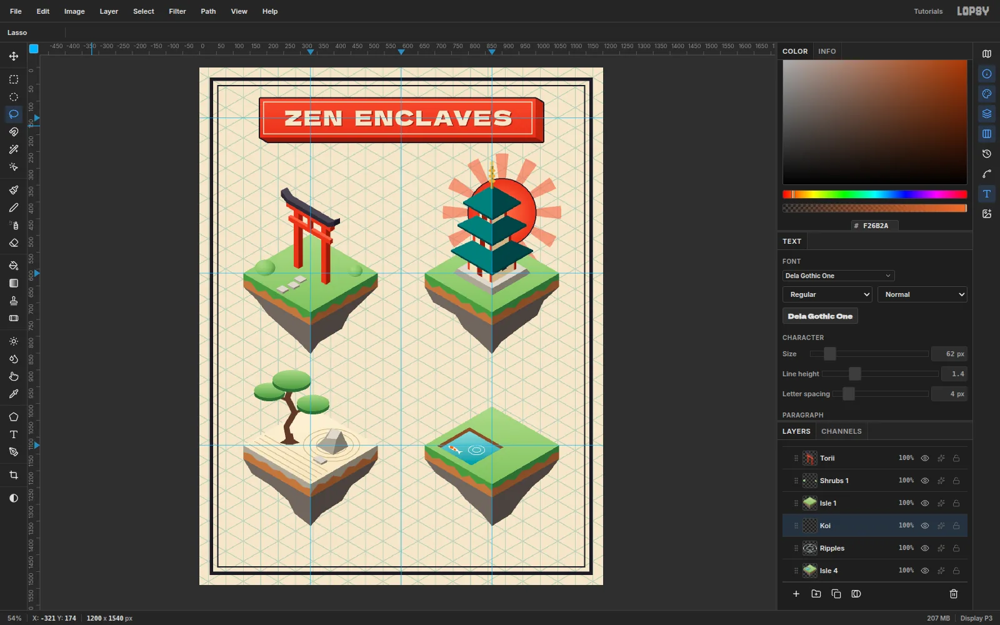

On a **Ripples** layer, Shift-click two small isometric rings in `#E8FAF8`
with a 2 px brush. On a **Koi** layer, lasso a slim teardrop body and a
forked tail in `#F7F2E8`, lying along the pond's diagonal so the fish sits on
the water plane rather than standing up in profile. Add two `#F26B2A` spots.

## Copy the koi and turn it

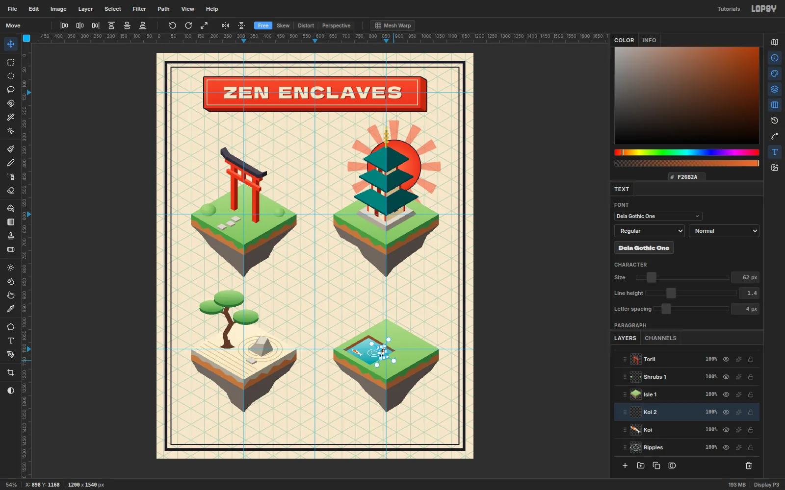

With **Koi** active, press [[Cmd+C]] then [[Cmd+V]]. Lopsy pastes in place
as a new layer, with the pasted koi selected and the **Move** tool active.
Rename it **Koi 2** and drag it across the pond, then drag the **rotation
handle** (the circle outside the top-right corner) about 75°. Press
[[Cmd+D]] to commit, so the two koi circle each other.

## Float lily pads

On a **Lily Pads** layer, fill two small flattened ellipses with `#6DAA55`.
Pick the **Eraser** (E) at **Size 5** and click from each pad's centre
outward, then Shift-click the rim to cut the classic notch.

## Light a stone lantern

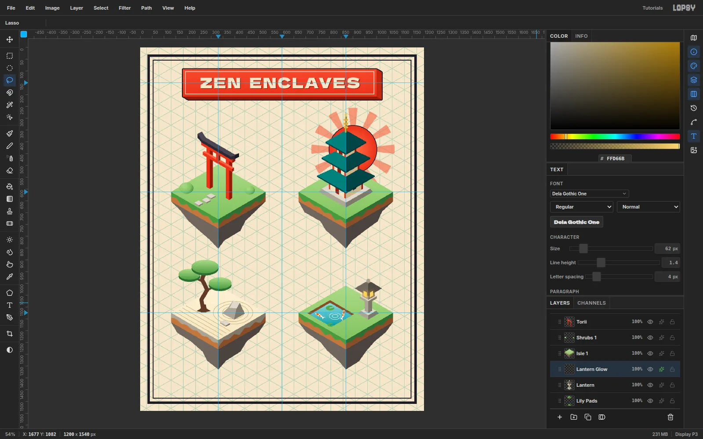

On a **Lantern** layer, stack stone boxes on the island's right corner: a
tapered base, a tall post, a platform, the firebox, then a wide tapered roof
in `#8F897D` / `#6F695F` / `#4F4A43` and a ball finial. Fill a window on each
visible face of the firebox. On a **Lantern Glow** layer, refill the windows
in `#FFD66B` and add a `#FFC24A` **Outer Glow** (**Size 26**, **Opacity 85**).

## Line every piece in ink

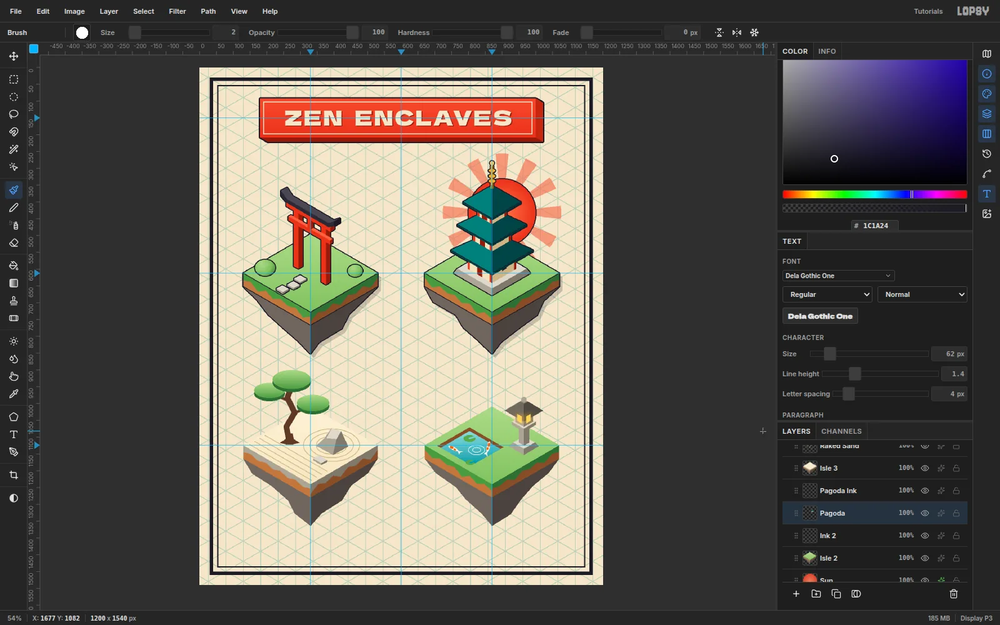

This is what makes it read as flash. Give every design layer a 3 px
`#1C1A24` **Stroke**. On each **Isle** layer, add a flat offset **Drop
Shadow**: **Offset 7 / 9**, **Blur 0**, **Opacity 20**, in ink.

The strokes only trace silhouettes. The edges where two faces meet need
drawing, so add an **Ink** layer above each island. Using a 3 px hard brush,
Shift-click the top diamond's front edges, the front vertical corner and the
rock's centre ridge. On the pagoda, a 2 px **Pagoda Ink** layer traces each
roof's eave and front hip.

## Group the four designs

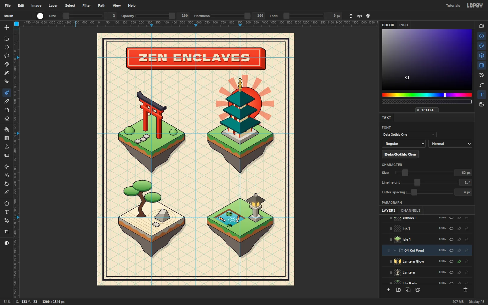

Click each design's bottom layer, [[Shift]]-click its top layer and choose
**Layer → Group Layers**. Name them **01 Torii**, **02 Pagoda** (including
the sun and rays), **03 Rock Garden** and **04 Koi Pond**. Each design can now
move as one piece.

## Float a cloud and copy it

Select the title layer and add a **Cloud** layer. At the top left, just
below the left end of the title plate, fill a flat marquee base about
140 × 64 px, then three overlapping elliptical marquees in `#FFF9EC` rising
from it. Separate fills on one layer merge into one silhouette. Add a 3 px
ink **Stroke** and click **Rasterize Layer Style**, so the outline becomes
pixels that travel with a copy.

Copy and paste the cloud. The paste arrives selected, with the Move tool
active. Rename the copy **Cloud 2**, drag it to the bottom-right corner,
then hold [[Cmd]] and drag the bottom-right scale handle inward to about
**75%**. Press [[Cmd+D]].

## Scatter cherry blossoms

On a **Blossoms** layer, on the centre guide just below the title plate,
lasso five teardrop petals in `#F3A5B6` around a gold centre, add a 2 px ink
**Stroke** and rasterize the style as you did for the cloud. Marquee the
blossom and press [[Cmd+X]] then [[Cmd+V]] to lift it onto its own layer.
Paste three more copies: one at the gutter crossing in the middle of the
sheet, scaled to 135%, a small one in the left margin and one in the right
margin. Rotate each a different amount so they don't look stamped.

## Drop the bottom row with snapping

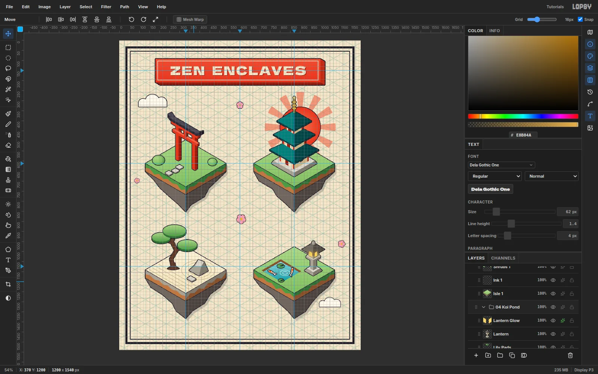

Select **03 Rock Garden**, [[Cmd]]-click **04 Koi Pond**, turn on **Show
Grid** and drag both groups down about 16 px with the **Move** tool. The
drag snaps to the grid, and both groups move by exactly the same amount.
Turn the grid off, then toggle [[Cmd+Z]] and [[Cmd+Shift+Z]] to compare the
spacing before and after.

## Number the designs

On a **Badges** layer, tuck a badge under the left flank of each island.
For each one, fill a **54 px** ink circle, then a **44 px** paper circle on
the same centre, then a **40 px** ink circle on top. That leaves a thin
cream ring. Type each number in **Dela Gothic One** at **26 px** in paper,
then nudge its glyph into the middle of its badge.

> **Tip:** Clicking with the Elliptical Marquee (nothing selected) opens a
> dialog for exact corners, which is the easy way to keep all three circles
> on one centre.

## Set the footer

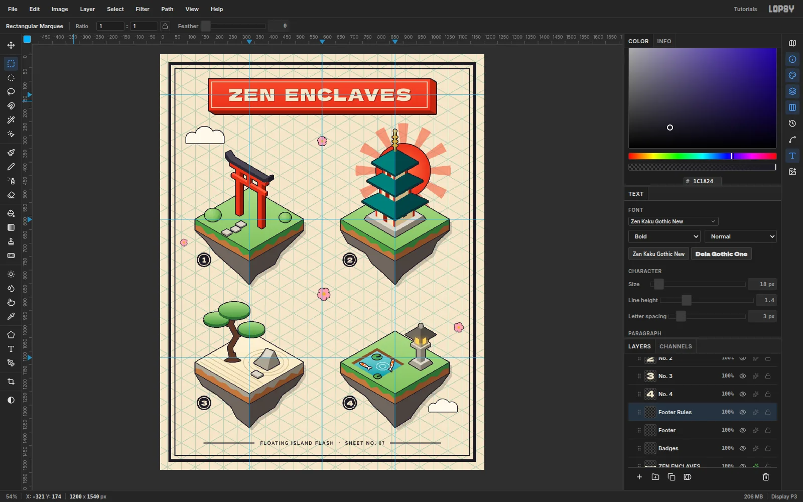

Select the **Badges** layer, then set up the text: **Zen Kaku Gothic New**,
weight **700**, **Size 18**. Type `FLOATING ISLAND FLASH  ·  SHEET NO. 07` in
ink. Give it **Letter spacing 3 px** and centre it on the centre guide, just
above the bottom border (**Align center horizontally** in the Move options
bar does the horizontal part). On **Footer Rules**, pick the **Pencil** at
**Size 3** in ink and draw a rule either side of the text: click one end,
then [[Cmd+Shift]]-click the other so it snaps level. Leave a 22 px gap to
the text. The 3 px weight matches the border's hairline.

## Stamp the seal

On a **Seal** layer, [[Cmd]]-drag a **64 × 64** square marquee at the right
end of the footer, level with the text, and fill it `#D8452B`. **Shrink** by
4 px and fill paper, then **Shrink** by 2 px and fill vermilion again. That
leaves a cream keyline. Type `ZEN` in Dela Gothic One at 14 px in paper and
centre it on the seal. Then click the **Seal** row, [[Cmd]]-click the ZEN
row and press [[Cmd+D]] so nothing is marqueed. With the **Move** tool, drag
a rotation handle about −6°, as if the stamp was pressed by hand, and press
[[Cmd+D]]. ZEN turns with the seal and stays in its middle.

## Shade the sun with dotwork

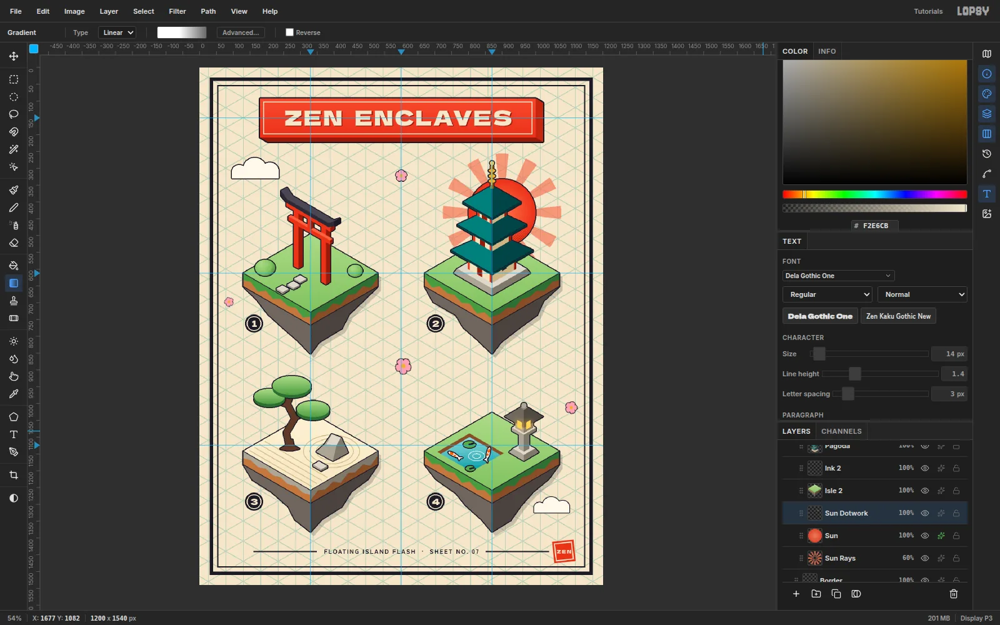

[[Cmd]]-click the **Sun** thumbnail, add a **Sun Dotwork** layer and drag a
**Linear** gradient from white (to 45%) down to `#6A6A6A` across the disc.
Press [[Cmd+D]] and run **Filter → Halftone…** at **Dot Size 5**. Set the
layer to **Multiply**. The white disappears, leaving dots that thicken
toward the bottom, like tattoo dotwork shading.

## Cut a shadow facet into each rock

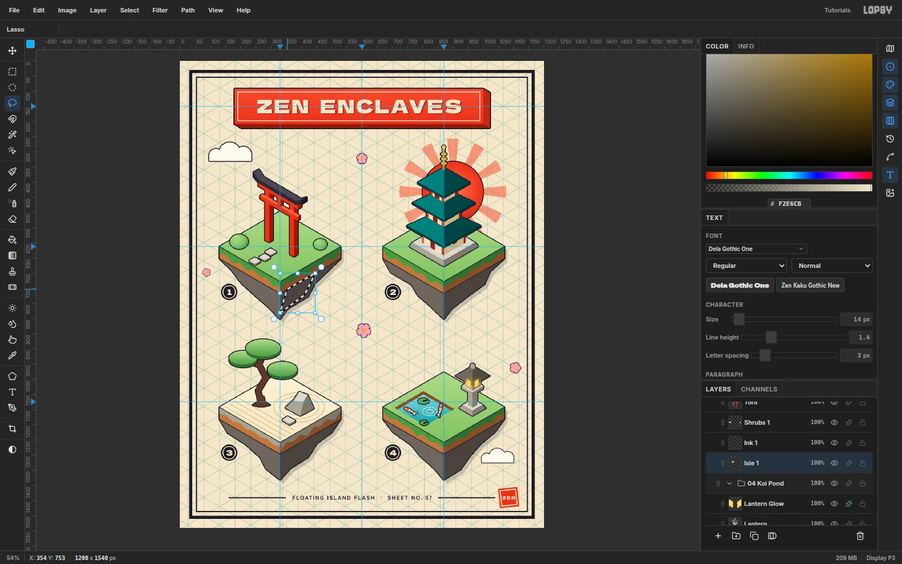

On each **Isle** layer, use the Lasso to select a facet on the right side of
the rock: from the bottom edge of the earth band, partway down the ridge and
back. Fill it with `#3D3733`. The hard edge reads as chiselled stone, which
suits a vector flash sheet better than a soft airbrushed shadow.

## Add paper grain and export

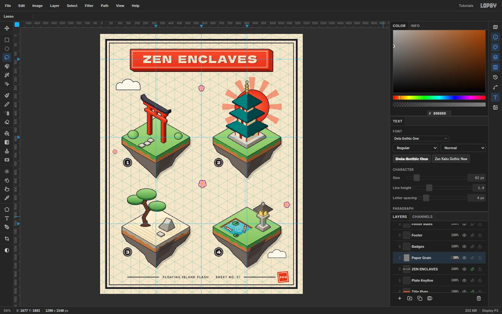

Select the title layer and add a **Paper Grain** layer. Fill it with
`#808080`, run **Filter → Add Noise…** (**Amount 20**, **Mono**,
**Gaussian**), and set it to **Overlay** at **30%**. Overlay leaves mid-grey
invisible, so only the grain shows.

Choose **File → Quick Export PNG** to save the sheet.
