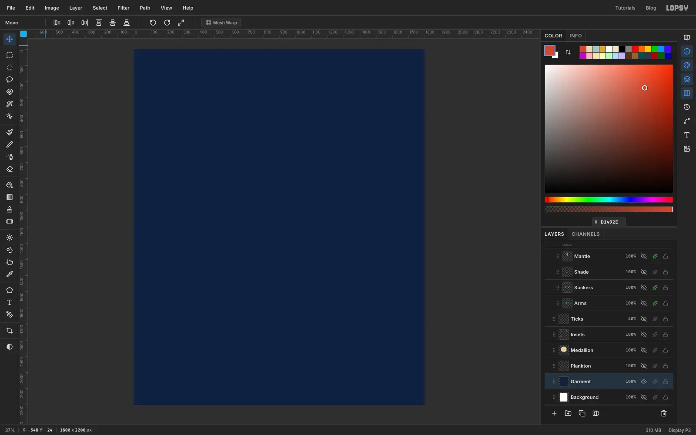
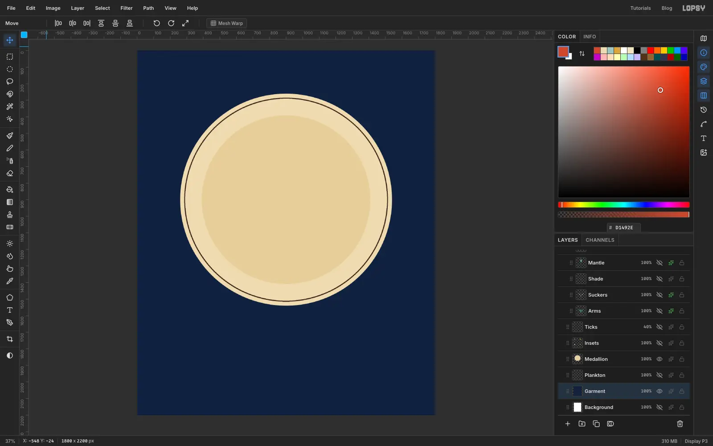
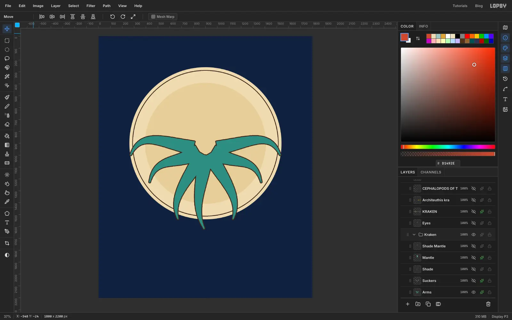
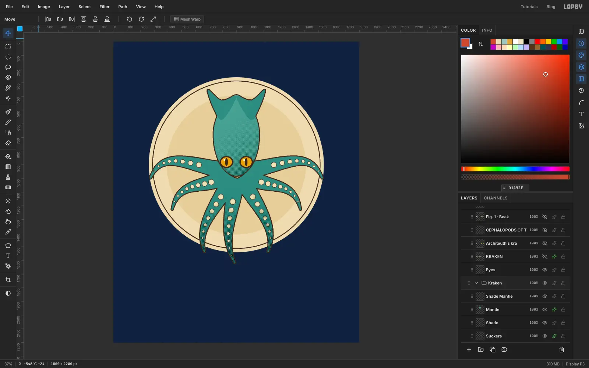
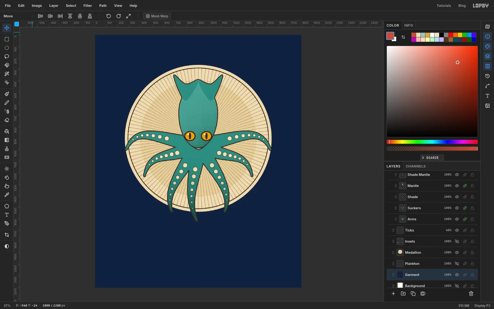
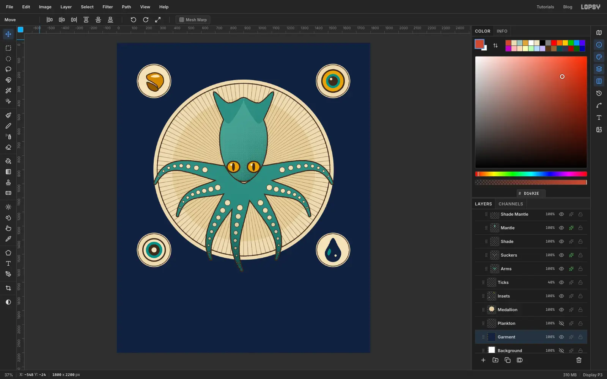
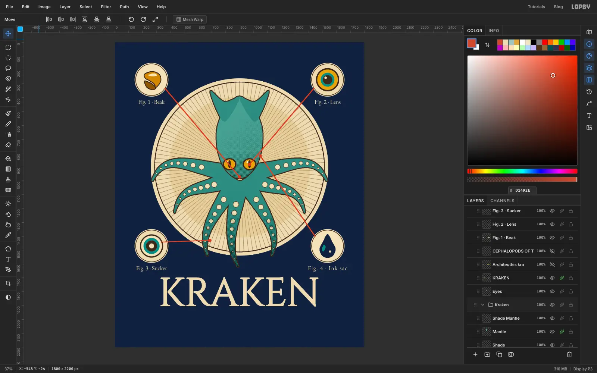
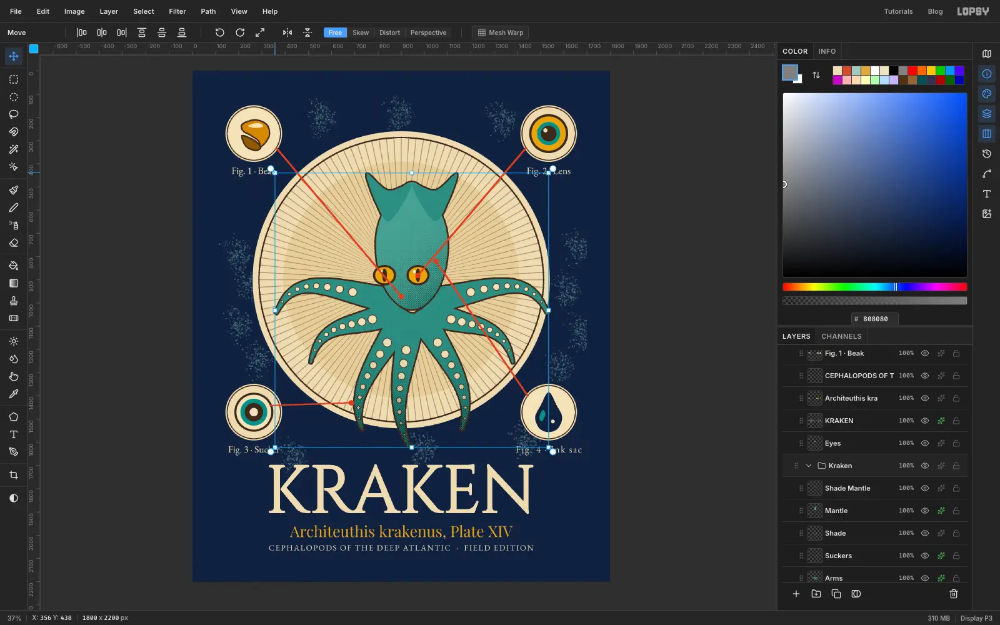
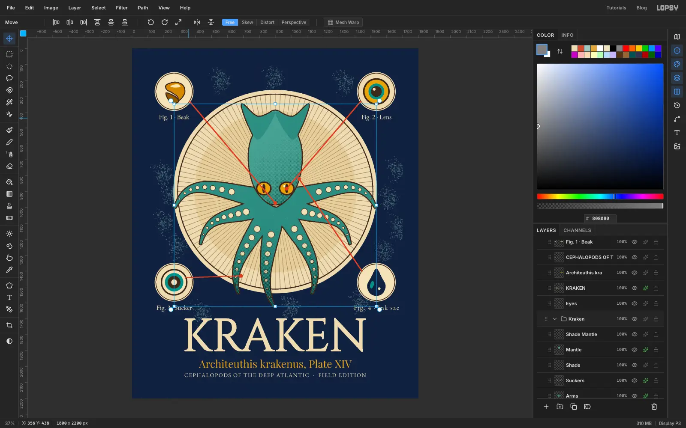

Victorian naturalists drew every new creature as a **plate**: one big,
carefully shaded specimen, a handful of numbered close-ups, and a Latin
name underneath. That layout works well on a T-shirt, because it is a
single bold centrepiece with small, charming details around it. This
tutorial builds a **KRAKEN** plate at 1800 × 2200 px, with the indigo
background standing in for the shirt itself.

Most of the drawing is lasso fills, outlined with a **Stroke** layer effect
so that every shape gets the same clean ink line. The engraved look comes
from one trick: paint a gradient on its own layer, set it to **Multiply**,
and run **Filter → Halftone** on it so the shadow turns into dots.

The tools you'll meet along the way:

- **Elliptical Marquee** and **Lasso** fills, plus **Select → Shrink** and **Select → Inverse**
- the **Magic Wand** to trace a drawing's outline
- **Filter → Sunburst**, **Filter → Halftone** and **Filter → Add Noise**
- the **Brush**, **Pencil** with [[Shift]]-click lines, and **Spray**
- **Cinzel**, **Playfair Display**, **EB Garamond** and **Space Mono** text, with a rotated live text layer
- **groups**, group scaling, and **undo / redo**

The palette is a shirt colour and six inks:

- Shirt indigo `#14213D`
- Parchment `#ECDCB5` / `#E3CF9F`
- Sepia ink `#3B2A1E`
- Verdigris `#4A8C82` / `#5F9F92` (the kraken)
- Ochre `#E0A63A` (the eyes and the Latin name)
- Cream `#F1E3BD` / `#FFF3D6` (suckers and eye highlights)
- Vermilion `#D1492E` (leader lines and the stamp)

## Set up the shirt

Choose **File → New**, set the units to **Pixels**, make the document
**1800 × 2200** and click **Create**. Double-click **Layer 1** and rename it
*Garment*. Click the foreground colour box, type `14213D` in the hex field, and choose **Edit → Fill**.
This is the shirt. Anything you leave unpainted shows it through, so the
colour is part of the design.

## Draw the medallion

Add a layer called *Medallion*. Pick the **Elliptical Marquee**, hold
[[Shift]] and drag a big circle in the middle of the canvas, leaving a good
margin on every side and room below it for the title. Fill it with parchment
`#ECDCB5`. Now stack the rings with **Select → Shrink**: shrink by **24**
and fill with sepia `#3B2A1E`, shrink by **6** and fill with parchment
again, then shrink by **150** and fill with the darker `#E3CF9F`. You end up
with a thin ink ring and a soft inner disc for the animal to sit on.

## Cut out the arms

Add a layer called *Arms*, set the foreground to `#4A8C82`, and pick the
**Lasso**. Draw each arm as a curved, tapering finger: click a point at the base, then click short steps along one side out to the tip, come back along the other side and click the first point to close it. Many small steps give a smooth curve. Start with the two long ones that sweep
out sideways, then fill in the five hanging below. After each shape choose
**Edit → Fill**. Let the lowest arms reach a little past the bottom of the
ring, so the animal breaks out of its frame.

Open the layer's **effects** drawer, switch on **Stroke**, set the colour to
sepia `#3B2A1E` and the width to **7**. All the arms get one tidy outline.

## Add the mantle

Add a layer called *Mantle* above *Arms* and set the foreground to `#5F9F92`. With the
Lasso, draw a tall teardrop that overlaps the top of the arms. Fill it, then
switch to `#4A8C82` and fill two pointed fins at its top corners. Give the
layer the same **Stroke**: sepia, width 7.

## Give it eyes

Add a layer called *Eyes*. If it lands beneath the Mantle, drag its row up
in the Layers panel until it sits on top. Use the **Elliptical Marquee** to
build each eye in four fills: sepia for the outer ring, ochre `#E0A63A`, a
tall thin ellipse of sepia for the slit pupil, and a tiny cream-white
`#FFF3D6` dot for the highlight. Each eye is about 100 px wide. Build the first, then make the second the same way a short distance to the right.

## Paint the suckers

Add a layer called *Suckers* above the Arms. Pick the **Brush** and the
colour `#F1E3BD`. Set the **Size** to roughly 40% of the arm's width at that
point, then click once for each sucker. Work from the body outwards, making
the Size a little smaller every click or two. About eight dots per arm is
plenty. Add a **Stroke** effect (sepia, width **3**) so each dot gets a ring.

## Shade it with halftone dots

Select the *Arms* layer and pick the **Magic Wand**. Click once on the empty
area outside the drawing, then choose **Select → Inverse** to select the
arms. Add a layer called *Shade*, pick the **Gradient** tool, and set a
linear gradient from white through grey-green to dark teal `#1B3A3F`. Keep the selection active and drag
from the middle of the animal down to the tips. To add the middle colour, double-click the gradient bar in the options bar. In the effects drawer set
the layer's **Blend** to **Multiply**.

Choose **Select → Deselect**, then **Filter → Halftone**. Set **Dot Size** to 6,
**Density** 1, **Angle** 45 and **Softness** 1. The smooth gradient turns
into the dots of an engraving. Repeat on a second layer called *Shade
Mantle*, wand-selecting the Mantle and using a white to `#2D5B57` gradient
over the head.

## Add the rays

Add a layer called *Ticks* above the Medallion and below the Arms. Set the
foreground to sepia and choose **Filter → Sunburst**. Set **Rays** to 120,
**Width** 12, and move **Center X** to 50 and **Center Y** to about 41 so the
burst starts at the middle of the medallion. Click **Apply**.

The rays fill the whole canvas, so trim them. Draw an **Elliptical
Marquee** just inside the sepia ring, choose **Select → Inverse**, press
[[Delete]], then deselect. Finally drop the layer's opacity to **40%**.

## Group the animal

Drag the *Eyes* layer to the top of the stack so the shading never covers the pupils. Then select the *Arms* row, [[Shift]]-click the *Shade Mantle* row to select the
range, and choose **Layer → Group Layers**. Rename the new group *Kraken*.
Now you can move or scale the whole animal in one go. We'll try that at the end.

## Draw four inset figures

Add a layer called *Insets*. Draw a circle in each corner with the
Elliptical Marquee, fill it with parchment, **Shrink** by 5 and fill with
sepia, **Shrink** by 4 and fill parchment again for a thin ring. Keep every
circle the same size and the same distance from the edges. The Marquee options show the size if you want to check.

Inside them, use the Lasso and the Marquee to draw: a hooked **beak** from two
sepia shapes shrunk by 6 and filled with ochre and brown, a **lens** from
an eye-sized circle filled sepia, then ochre after **Shrink 10**, teal after another **Shrink 24**, and sepia after another **Shrink 16**, with one tiny white Brush click for the glint, a
**sucker** from concentric rings, and an **ink sac** as a dark teardrop with a
small teal gleam.

## Label the figures and draw leader lines

Select any layer that is not text, then pick the **Text**
tool, choose **EB Garamond**, size 42, cream `#ECDCB5`, and click under each
circle to type *Fig. 1 · Beak*, *Fig. 2 · Lens*, *Fig. 3 · Sucker* and
*Fig. 4 · Ink sac*. Centre each label under its circle.

> **Tip:** Picking a font while a text layer is active restyles that layer.
> Select a layer that is *not* text before you start a new label.

Add a *Leaders* layer on top. Choose the **Pencil**, set the colour to
vermilion `#D1492E` and the size to **6**. Click on the edge of an inset,
then [[Shift]]-click the part of the animal it describes. The lines will cross the animal. That is the point, they are pointing into it. With the **Brush** at
size **26**, click once at the end of each line for the dot.

## Set the title

Pick the **Text** tool, choose **Cinzel**, set the size to about **285** and the
colour to cream `#ECDCB5`, then click below the medallion and type
*KRAKEN*. Leave a clear gap between the lowest arm tip and the top of the
letters. With the Move tool and the text layer selected, press **Align
center horizontally** in the options bar.

Cinzel's thin strokes can break up when printed on a shirt, so add a
**Stroke** effect in the same cream colour at width **4** to thicken them.

## Add the Latin name and the caption

Make a new text layer in **Playfair Display** at size **66** in ochre
`#E0A63A`, typed as *Architeuthis krakenus, Plate XIV*. Open the **Text**
panel and set **Font style** to **Italic**. Then add the caption in
**EB Garamond** at size **35**, cream, with **Letter spacing** set to **4**:
*CEPHALOPODS OF THE DEEP ATLANTIC · FIELD EDITION*. Centre both lines
and check that the descenders in the Latin name stay clear of the caption and
that the caption keeps a generous margin from the bottom edge.

## Stamp it

Make a text layer in **Space Mono** at size **56** in vermilion, typed as
*SPECIMEN Nº 8*, and set **Font weight** to **Bold**. Pick the **Move** tool and
hover just outside a corner of the text box until the cursor changes to a
rotation crosshair. Drag around the centre to tilt it anticlockwise; a modest angle is enough. The text
stays live, so it can still be edited. Drag it into the clear space at the top,
clear of the medallion ring and the figures.

## Sprinkle some marine snow

Select the *Garment* layer and add a layer above it called *Plankton*. Pick the
**Spray** tool, set the colour to `#9FC6C0`, **Size** 90, **Density** 20,
**Opacity** 60 and **Softness** 70, and drag short wiggly strokes in the empty
corners and margins. Keep the spray away from the labels so the type stays readable.

## Add paper grain

Add a layer called *Grain* above everything. Set the foreground to mid grey
`#808080` and fill the whole layer with **Edit → Fill**. Choose **Filter →
Add Noise**, switch to **Mono**, set **Amount** to 45 and apply. Then set the
layer's **Blend** to **Overlay** and drop its opacity to **35%**.

## Try resizing the animal

This is optional, and you can undo it. Select the *Kraken* group row and pick the **Move** tool. Hold [[Cmd]] and drag a corner handle inward to scale the whole group uniformly, then press [[Cmd]]+[[D]] to commit. Every layer in the group scales together. The eyes stay put because they sit outside the group, so drag the Eyes layer into it first if you ever want to resize the whole animal.

## Undo it and export

Press [[Cmd]]+[[Z]] and the group returns exactly to where it was. [[Cmd]]+[[Shift]]+[[Z]] redoes the scale. Undo once more, then export with **File → Quick Export PNG**, or save the project to keep the layers.
