Liquid metal has a simple recipe. You need a sky reflected as bands of light
and dark, a sharp dark "horizon" line through every shape, and edges that look
like they're still melting. In this tutorial you'll make a 3:1 roadside
billboard for an imaginary night race, **Xenon Drift**. You'll build 80s-style
chrome type that drips onto a mirror floor, a molten chrome sphere made with a
group **Gradient Map**, and glowing xenon headlight streaks. You'll use
gradients, the Magic Wand, Liquify, layer effects, filters, transforms and
guides.

## Paint a night sky with a hot horizon

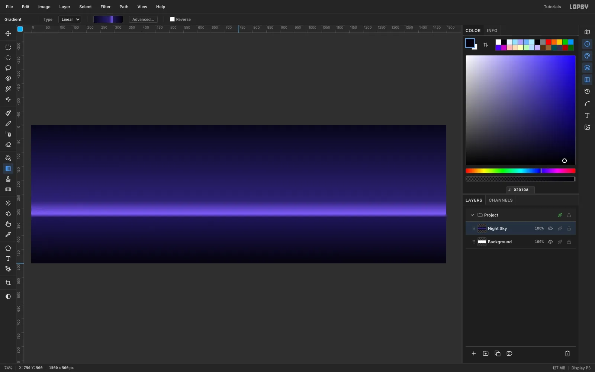

Open [Lopsy](/) and create a **1500 × 500** document. Double-click `Layer 1`
in the Layers panel and rename it `Night Sky`.

Pick the **Gradient** tool and click **Advanced…**. In the **Gradient Editor**,
click the bar to add stops, then set these colors from left to right:

1. `#07061A` at 0%
2. `#2C2170` at 55%
3. `#7A5CF0` at about 64%, the hot horizon
4. `#1C1552` at 67%, where the floor starts
5. `#04030C` at 100%

Click **Done**. Hold [[Cmd]] and drag from the top edge of the canvas straight
down to the bottom edge. Holding the key snaps the angle to vertical.

## Add ruler guides

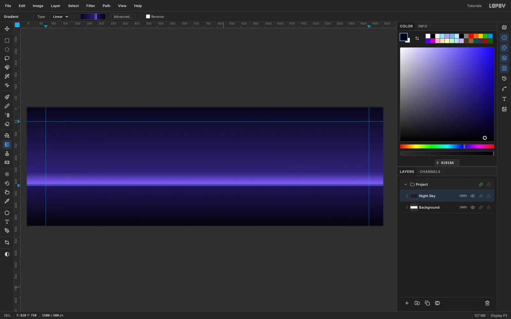

Click the top ruler above x = `80` and x = `1440` to drop two vertical guides,
one for each margin. Click the left ruler at y = `60` and y = `330` for two
horizontal guides. The 330 guide is the horizon, where the headline will stand.

## Draw the xenon streak cores

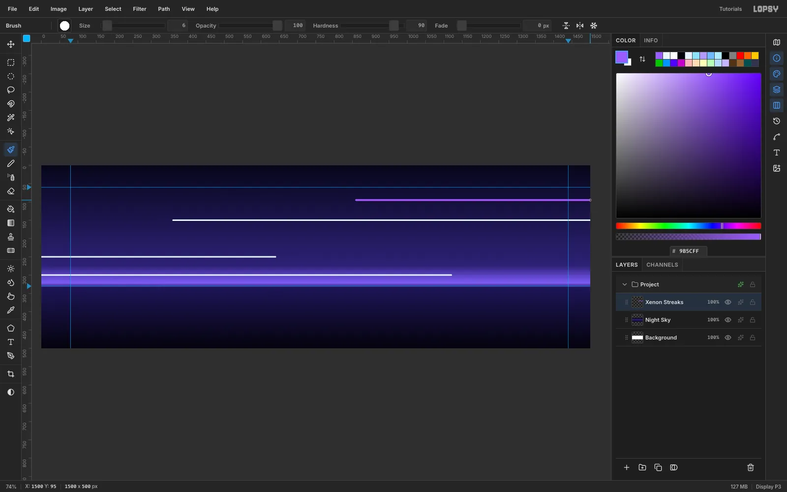

Click **Add Layer** and name it `Xenon Streaks`. Pick the **Brush** and set
**Size** `5`, **Hardness** `90` and **Opacity** `100`. Set the foreground to
`#EAF6FF`.

To draw a straight streak, click its start point, then [[Shift]]-click its end
point:

- (360, 150) to (1500, 150)
- (0, 300) to (1120, 300)
- (0, 250) to (640, 250)

Change the foreground to `#9B5CFF`, set Size to `6`, and draw one violet streak
from (860, 95) to (1500, 95).

## Blur and glow the streaks

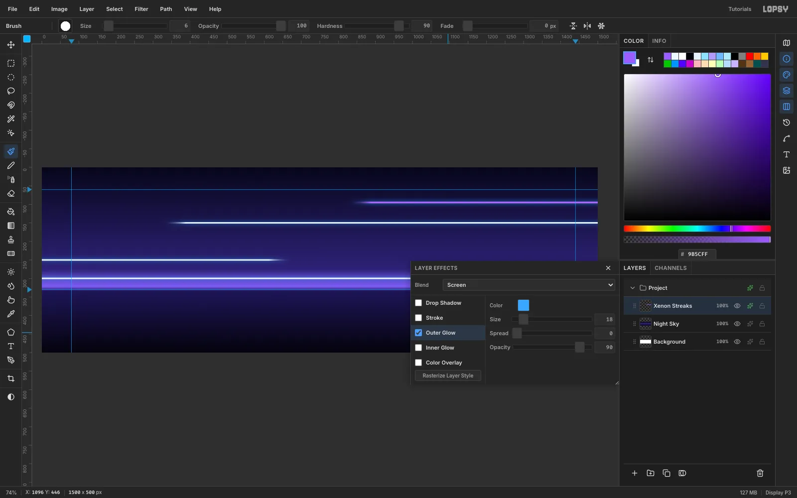

Choose **Filter → Motion Blur…** and set **Angle** `0` and **Distance** `60`,
then click **Apply**. The ends taper off like passing headlights.

Open the layer's effects (the sparkle button on the `Xenon Streaks` row). Set
**Blend** to **Screen** and turn on **Outer Glow** with color `#3AA6FF`,
**Size** `18`, **Spread** `0` and **Opacity** `90`.

## Set the headline lockup

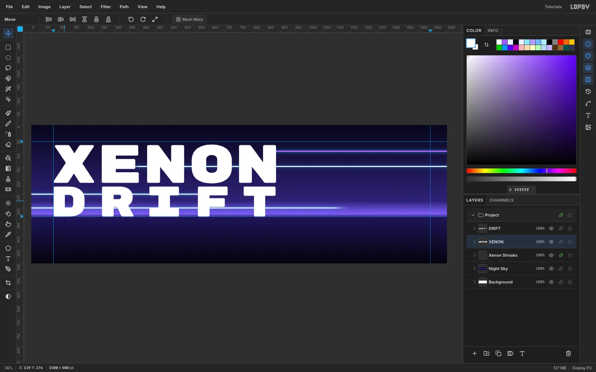

Pick the **Text** tool. Choose the **Rubik Mono One** font, set **Size** to
`195` and the color to white. Click near the top left, type `XENON`, and click
the check mark to commit.

Click the `Xenon Streaks` row before you set up the second line. If a text
layer is active when you change the size, Lopsy restyles *that* layer. Set Size
to `155`, click an empty spot on the right, type `DRIFT` and commit.

Open the **Text** panel and set **Letter spacing** to `40.5`. DRIFT now matches
XENON's width, about 803 px. Switch to the **Move** tool, drag DRIFT under
XENON, and use the arrow keys to line them up. Both left edges go on the
x = 80 guide, XENON's letter tops at y = 70, and DRIFT's baseline on the 330
horizon guide.

## Select the letters with the Magic Wand

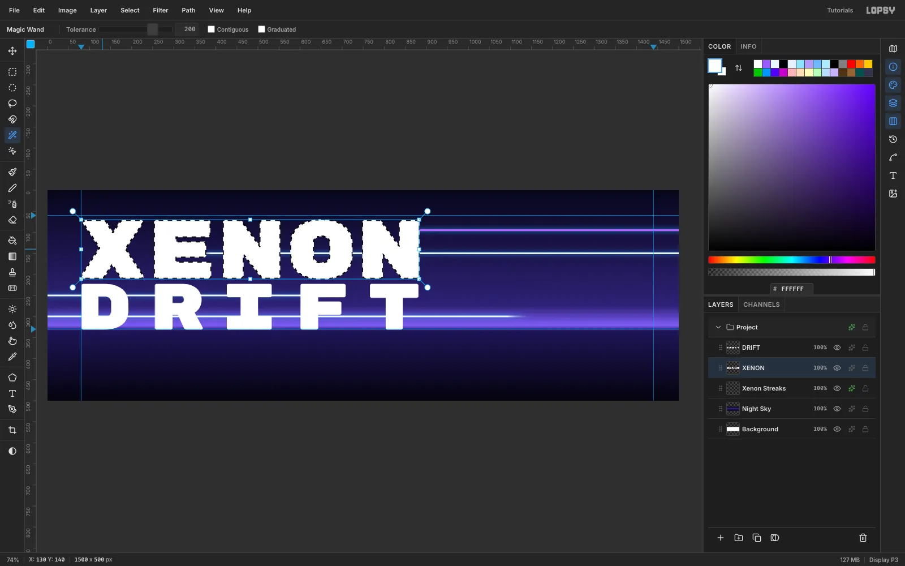

Select the `XENON` layer and click **Rasterize Layer** in the Layers footer.
Pick the **Magic Wand**, untick **Contiguous**, set **Tolerance** to `200`,
and click any letter. All five letters are selected, anti-aliased edges
included.

## Fill the letters with chrome

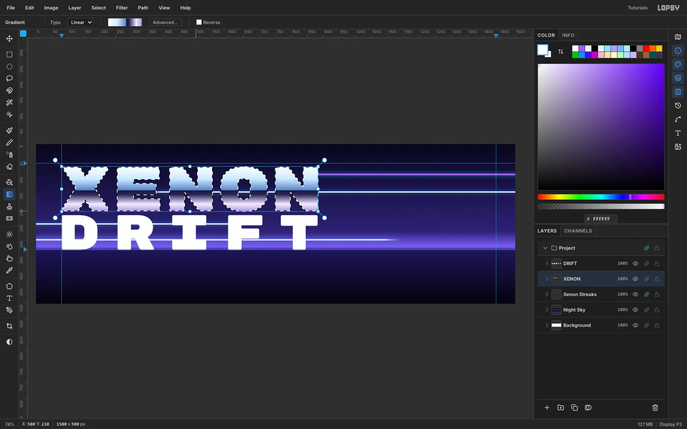

With the **Gradient** tool, open **Advanced…** and build a classic chrome
ramp:

1. `#FFFFFF` at 0%
2. `#CFE8FF` at 28%
3. `#6A86C8` at 52%
4. `#15183A` at 55%, the dark horizon line
5. `#2B2458` at 63%
6. `#F3EAFF` at 84%
7. `#A898E0` at 100%

Hold [[Cmd]] and drag from the top of XENON (y = 70) to its baseline
(y = 210). Repeat for DRIFT: rasterize it, Magic Wand one letter, and drag from
y = 222 to y = 330, so it gets its own sweep. Press [[Cmd+D]] when you're done.

## Melt the bottoms into drips

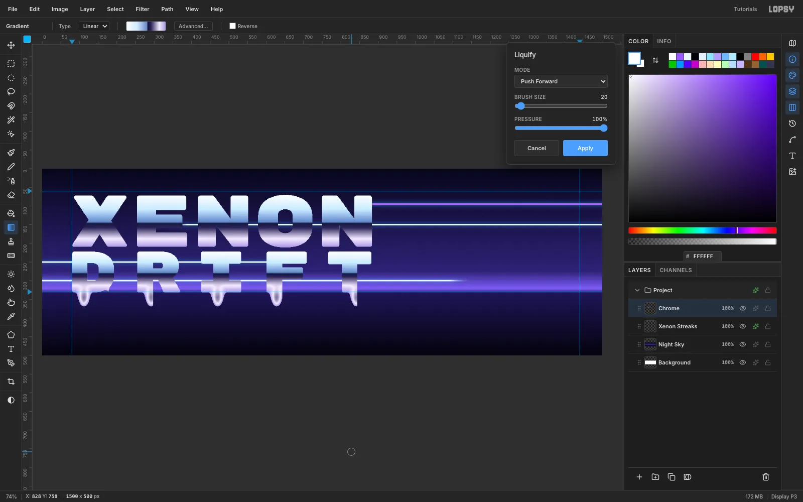

Select the `DRIFT` layer and choose **Layer → Merge Down**, then rename the
result `Chrome`. Open **Filter → Liquify…**, keep **Push Forward**, and set
**Brush Size** `30` and **Pressure** `100%`.

Start about 30 px below a stem and drag straight up into the letter. Do this
under each stem of DRIFT (x ≈ 112, 292, 470, 628 and 842), in three passes that
each start a little lower. Then use a 20 px brush to add a few shorter drips.
If the preview dents the letter instead of stretching it, drag the other way.
Click **Apply**.

## Add a 3D extrusion

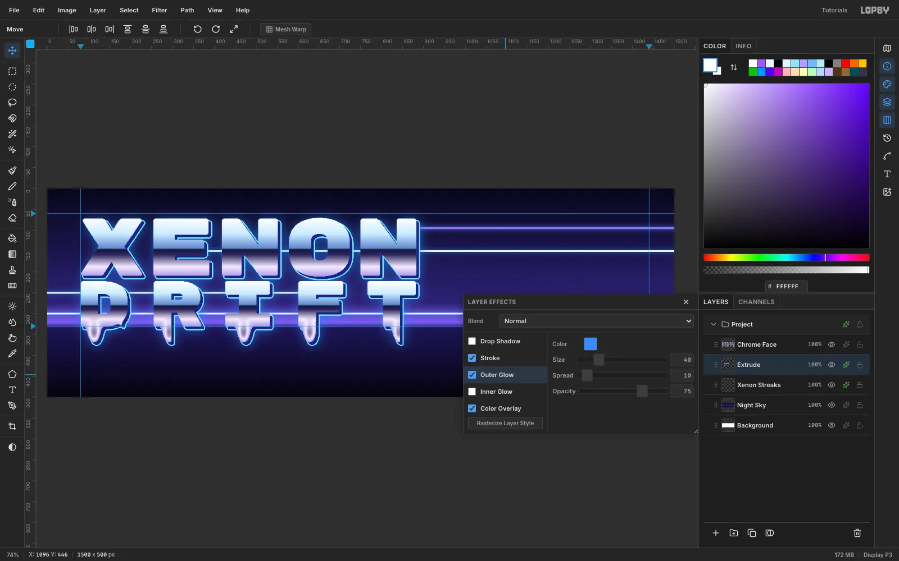

With the **Move** tool active, click **Duplicate Layer**. The copy is offset
10 px, so select it and press [[←]] and [[↑]] ten times each to put it back.
Rename the copy `Chrome Face` and the original `Extrude`.

Select `Extrude` and nudge it 6 px right and 6 px down. In its effects, turn on
these three:

- **Color Overlay** `#1A2380`
- **Stroke**: Width `3`, **outside**, color `#8FE3FF`
- **Outer Glow** `#3A8BFF`: Size `40`, Spread `10`, Opacity `75`

## Add a rim light and lens fringe

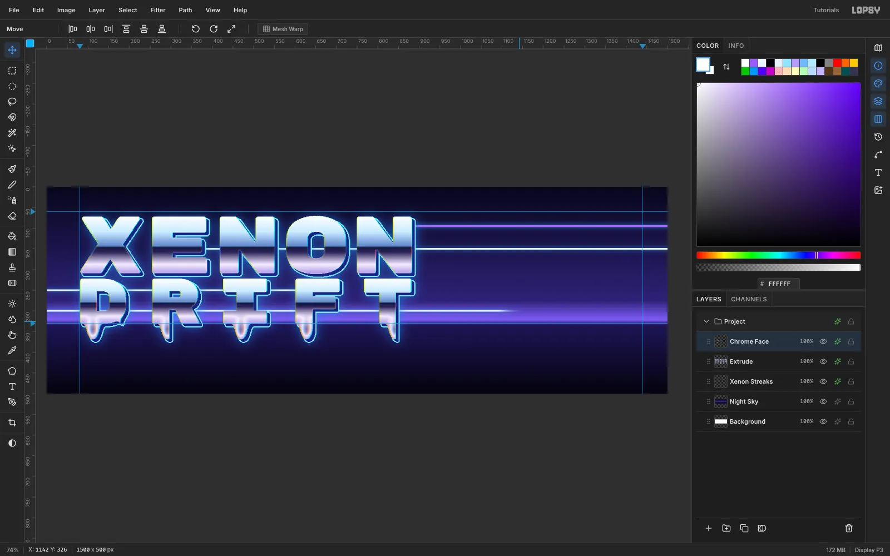

Select `Chrome Face`. Turn on **Inner Glow** with color `#FFFFFF`, **Size** `5`
and **Opacity** `70` for a bright rim. Then choose **Filter → Chromatic
Aberration…** with **Amount** `2` and **Direction** `0`, which splits the edges
like a real lens.

## Flip a copy for the reflection

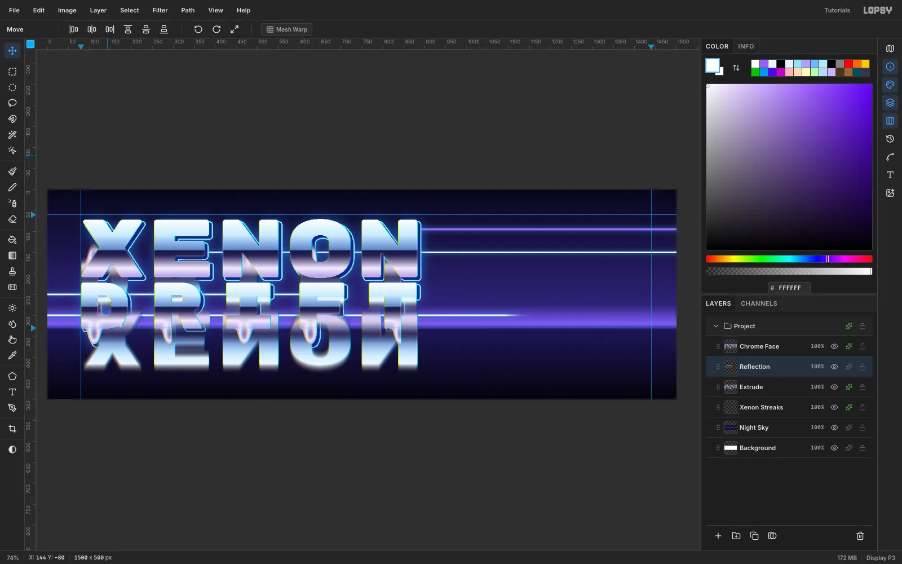

With `Chrome Face` still selected and the Move tool active, duplicate it again.
Nudge the copy back 10 px up and left, and rename it `Chrome Face`. Rename the
original underneath `Reflection` and turn off its Inner Glow.

On `Reflection`, choose **Filter → Motion Blur…** with **Angle** `90` and
**Distance** `24`. Blur it now, while it's still inside the canvas. Then choose
**Image → Flip Vertical**.

## Drop the reflection onto the floor

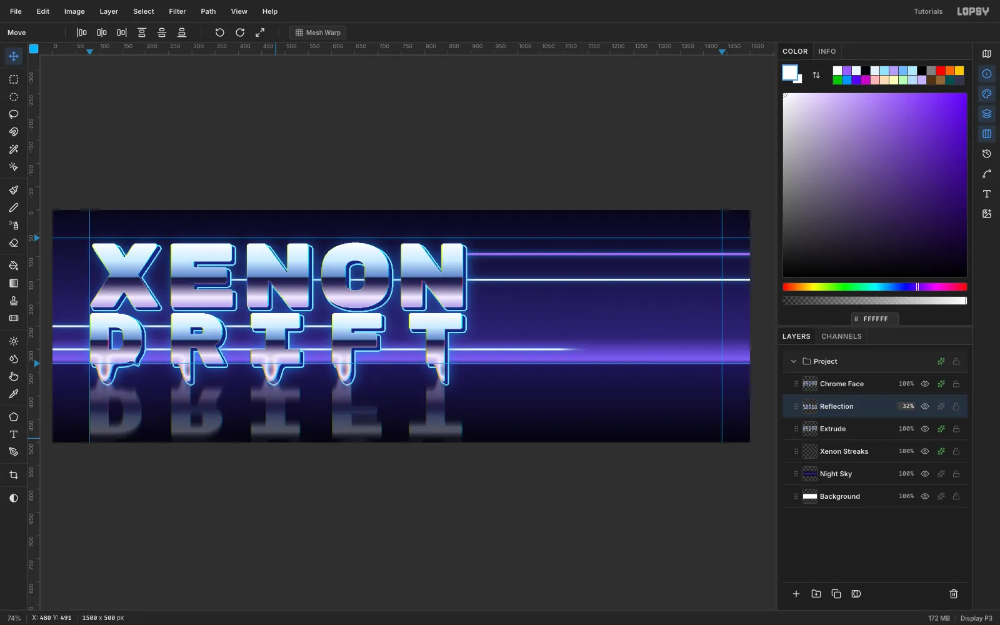

With the Move tool, drag the reflection straight down until its top edge meets
the 330 horizon guide. Set the layer's opacity to `32%` with the percentage
button on its row. The drips now hang toward their own mirrored tips, which
gives you a glossy floor.

## Set up the sphere

Add a layer called `Sphere Halo` above `Chrome Face`. Drag an **Elliptical
Marquee** from (1262, 62) to (1408, 208), set the foreground to `#4FB4FF` and
choose **Edit → Fill**. Press [[Cmd+D]], then give it an **Outer Glow** in
`#3A8BFF` with Size `34` and Opacity `80`.

Click **New Group** and name it `Mercury`. Click **Add Layer** to make a
`Sphere` layer inside it. Draw a circle marquee from (1260, 60) to
(1410, 210).

## Shade the sphere in grayscale

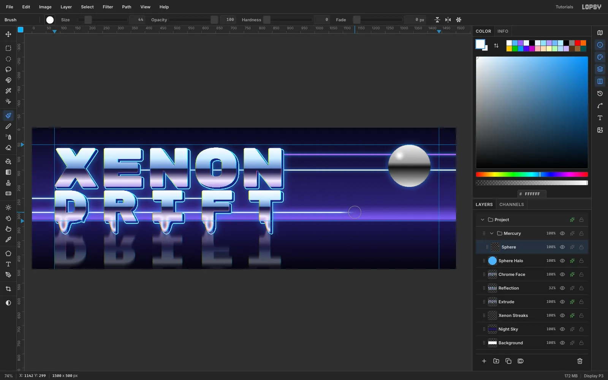

Build a gray gradient with these stops: `#F2F2F2` at 0%, `#9A9A9A` at 42%,
`#0E0E0E` at 53%, `#3C3C3C` at 62% and `#E6E6E6` at 100%. Hold [[Cmd]] and
drag from the top of the circle to the bottom.

Switch to the **Brush** and set **Size** `44`, **Hardness** `0` and a white
foreground. Click once at about (1300, 98) for the highlight. Press [[Cmd+D]]
and run **Filter → Gaussian Blur…** at radius `2` to soften the edge.

## Turn it into chrome with a Gradient Map

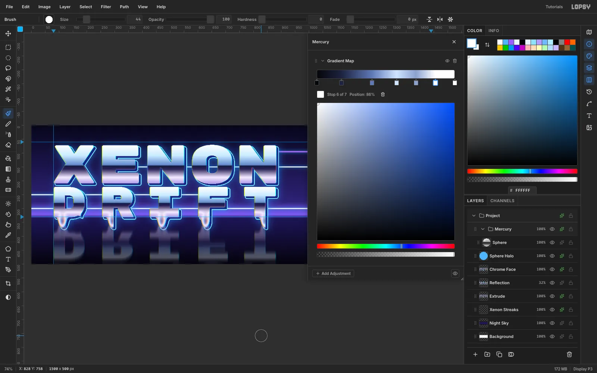

Open the `Mercury` group's effects and choose **Add Adjustment → Gradient
Map**. Set these stops:

1. `#05060C` at 0%
2. `#1D2340` at 18%
3. `#5F78B8` at 40%
4. `#CFE3FF` at 58%
5. `#8AA0D0` at 72%
6. `#FFFFFF` at 86%
7. `#FFFFFF` at 100%

The group maps every gray inside it to this palette. Anything you paint in
`Mercury` from now on comes out as chrome.

> **Tip:** Keep the glow on `Sphere Halo`, outside the group. Layer effects
> inside a group with adjustments don't show up.

## Swirl the sphere into liquid

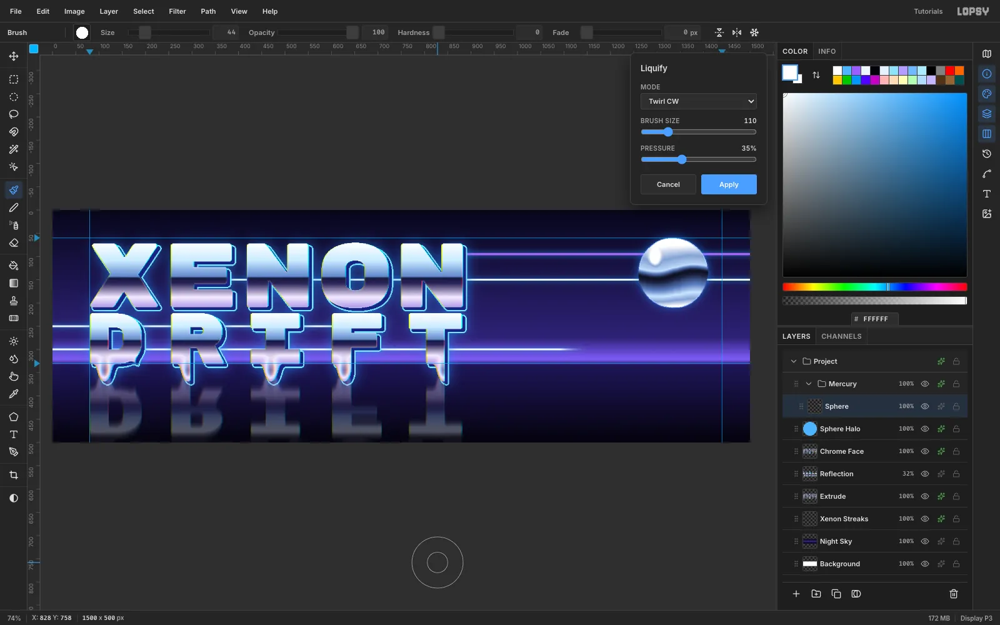

Select `Sphere` and open **Filter → Liquify…**. Set the mode to **Twirl CW**,
**Brush Size** `110` and **Pressure** `35%`. Draw one small circle over the
middle of the sphere. The horizon band bends into a wave, like mercury wobbling.
Click **Apply**.

## Scale a droplet from a copy

Draw an elliptical marquee just around the sphere, then press [[Cmd+C]] and
[[Cmd+V]]. The pasted layer lands inside `Mercury`. With the Move tool, drag
the bottom-right corner handle toward the top left until the copy is about
38 px wide.

Press [[Cmd+D]] to bake the scale in before you move it. If you drag inside the
box first, the scale is thrown away.

## Rotate the droplet

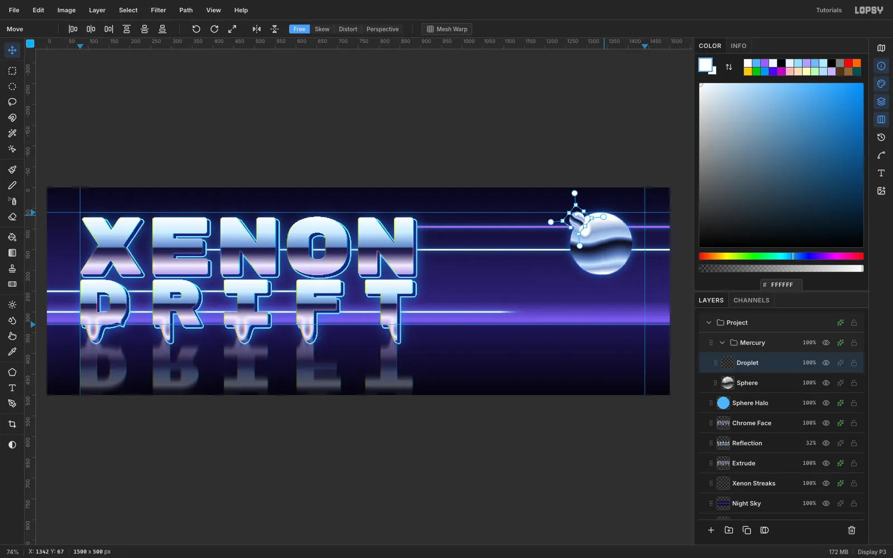

Name the layer `Droplet`. Draw a rectangular marquee around it, switch to the
Move tool, and drag the rotation handle just outside the top-right corner
around by about 40°. The wave on the droplet tilts, so it doesn't look like a
stamped copy. Press [[Cmd+D]].

## Use the droplet as a full stop

Draw a marquee around the droplet and drag it to the end of DRIFT, so it sits
on the baseline at about (902–940, 292–330). Press [[Cmd+D]]. It works as a
full stop and echoes the big sphere.

## Set the event details

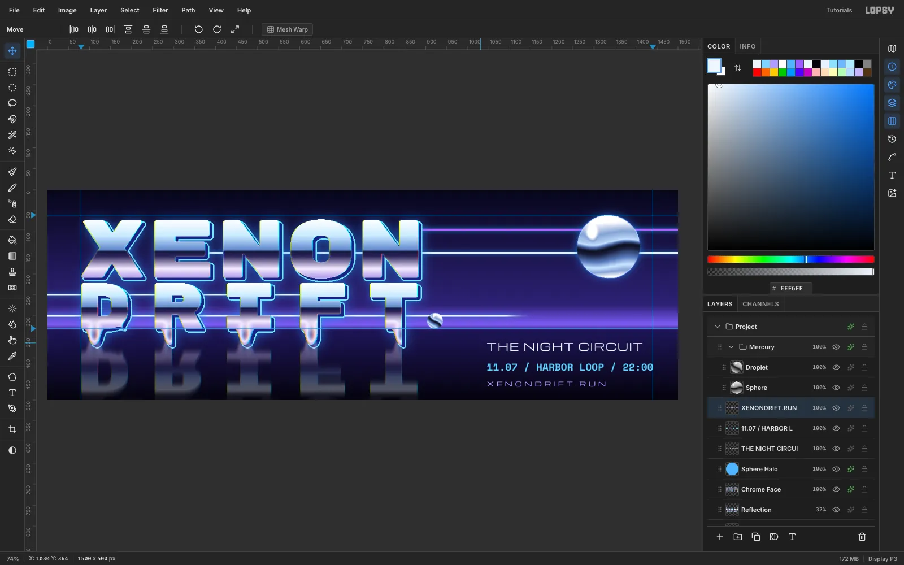

Select `Sphere Halo` first, so no text layer is active while you change the
settings. Create the three lines from the bottom up, so each click lands in
empty space:

- `XENONDRIFT.RUN`: **Michroma**, `16`, `#B39BFF`, letter spacing `6`
- `11.07 / HARBOR LOOP / 22:00`: **Space Mono Bold**, `24`, `#7FD3FF`, letter
  spacing `0`
- `THE NIGHT CIRCUIT`: **Michroma**, `25`, `#EEF6FF`, letter spacing `2`

Nudge all three lines by the same amount, so the widest one ends on the
x = 1440 guide and the URL sits just above the bottom edge.

## Build a soft vignette gradient

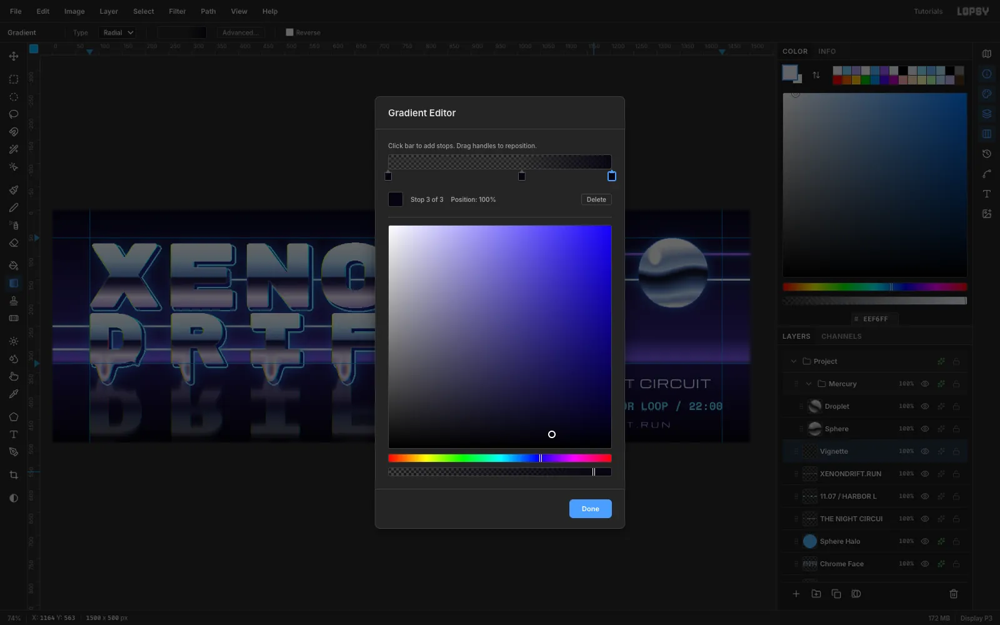

Select the top text layer and add a layer called `Vignette`. Set the Gradient
type to **Radial** and open **Advanced…**. Make three stops, all `#05040F`: 0%
and 60% with the opacity bar at **0**, and 100% with the opacity bar at about
**92%**.

## Darken the corners

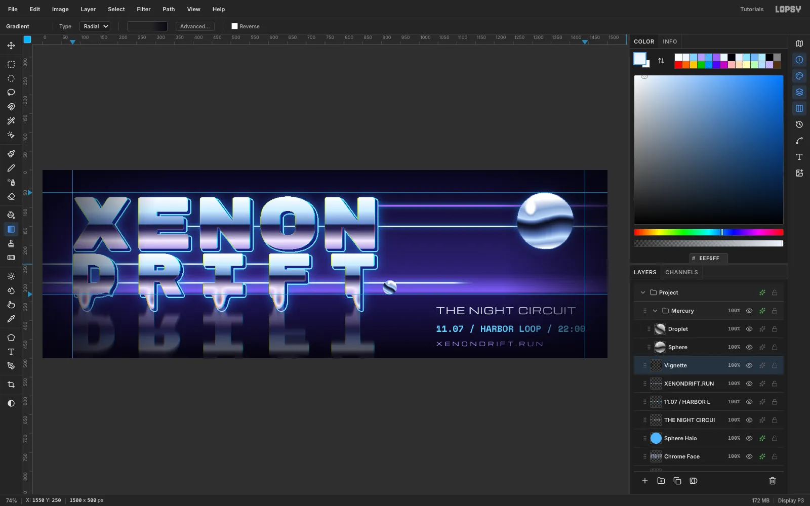

Drag from the center of the canvas (750, 250) out past the right edge to
(1550, 250). The fade starts well inside the frame, so no hard ellipse edge
shows. Set the layer's opacity to `65%` so the event text stays readable.

## Add film grain

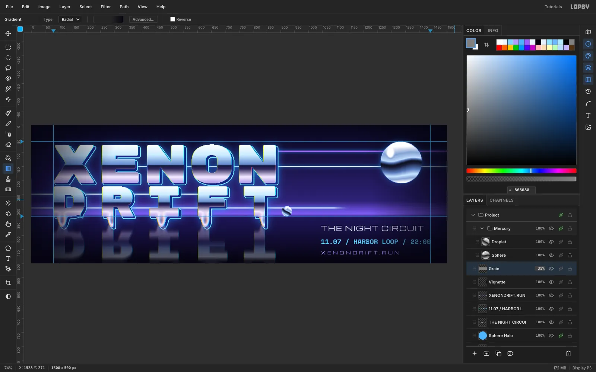

Add a layer called `Grain`. Set the foreground to `#808080` and choose **Edit →
Fill**. Run **Filter → Add Noise…** with **Amount** `22`, **Mono** and
**Gaussian**. Set the layer's blend mode to **Overlay** and its opacity to
`35%`. The grain hides gradient banding and gives the chrome some bite.

## Export the billboard

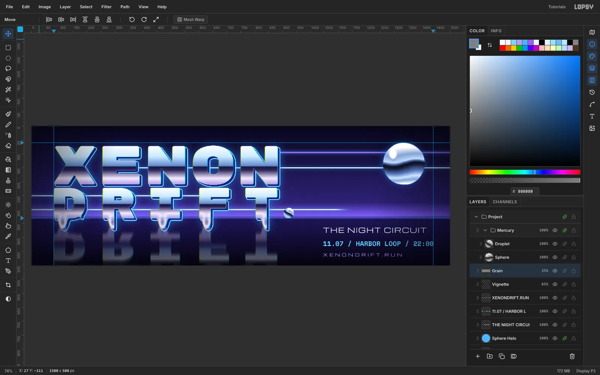

Choose **File → Quick Export PNG** to save the billboard, and **File → Save
Project** to keep every layer editable. To try other chrome, edit the
`Mercury` Gradient Map: warm golds and browns turn the sphere into molten
brass.
