Lo-fi art borrows from three places: **pixel art**, **old VHS tapes** and
**late-evening colour**. You get chunky pixels, scanlines, colour fringing,
a tracking glitch or two, camcorder text, and a dusk sky that runs from navy
to peach. This tutorial builds a T-shirt print for an imaginary "lo-fi beats
to fall asleep to" tape, **FIREFLY EVENINGS**, at 1800 × 2200 px. The dark
plum background stands in for the shirt.

The trick that makes it work is to **paint the scene cleanly first** and only
then make it look cheap. You'll draw a smooth vector-style dusk scene, flatten
it into one layer, and then push that copy through Pixelate, Lens Distortion,
Chromatic Aberration, Pixel Stretch and Add Noise. The originals stay hidden
underneath, so you can always go back.

The tools you'll meet along the way:

- **ruler guides**, the **Gradient** tool, the **Lasso** and **Elliptical Marquee**
- the **Pencil** with [[Shift]]-click lines, the **Pen** tool for sagging wires, and the **Brush** for grass and fireflies
- **Move**-tool scale and rotate handles, with [[Cmd]] to snap rotation to 15°
- **Edit → Copy Merged**, **Pixelate**, **Lens Distortion**, **Chromatic Aberration**, **Pixel Stretch** and **Add Noise**
- **Select → Shrink / Grow / Inverse** for a rounded screen
- **Edit → Define Pattern** and **Fill with Pattern** for scanlines
- the **Shape** tool, the **Clone Stamp**, **Merge Down** and **groups**
- **Silkscreen**, **VT323**, **DotGothic16** (vertical) and **Nanum Pen Script** text
- the **Outer Glow**, **Inner Glow**, **Stroke** and **Drop Shadow** layer effects

Name every layer as you make it (double-click its name in the Layers panel).
The steps refer to layers by name, and so do the screenshots. The later
screenshots come from the finished project file, with layers you haven't
made yet hidden, so the Layers panel sometimes lists one with its eye
switched off.

The palette is a dusk sky and a few inks:

- Shirt `#24212B` (the background, not an ink)
- Sky `#2B3463` → `#6A3F6F` → `#C46F7C` → `#F3B47D`
- Sun `#FBE3B4`, sun glow `#FFD39A`
- Hills `#5B3B66`, silhouettes `#2A1F37`
- Window light `#F7C66B`
- Fireflies `#EEF68E` / `#D4F05A`
- Cream `#F4E9D6` / `#E8DCC4`, plum shadow `#6A3F6F`
- Title green `#E9F28A`, peach `#F3B47D`
- Date stamp orange `#F7A04B`, rose `#F29BB0`
- Tape `#E6D9BE`, pencil ink `#3B2A4A`, OSD outline `#1A1420`
- Scanline ink `#140F1C`, tracking-line light `#F3E9D2`

## Set up the shirt and guides

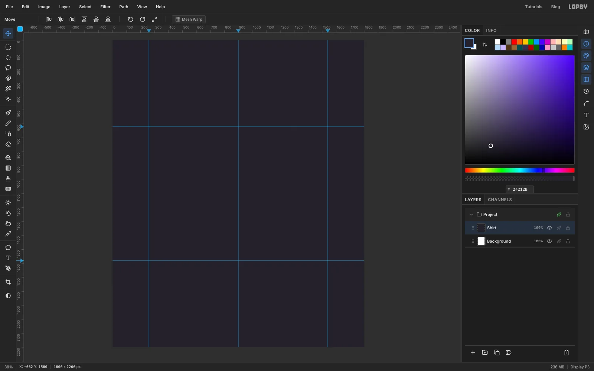

Choose **File → New**, keep the units on **Pixels**, make the document
**1800 × 2200** and click **Create**. Rename **Layer 1** to *Shirt* by
double-clicking its name, set the foreground colour to `#24212B` and choose
**Edit → Fill**.

The whole design hangs off a 1280 × 960 screen in the middle of the shirt.
Click the top ruler at **260**, **900** and **1540** to drop three vertical
guides, then click the left ruler at **620** and **1580** for the top and bottom
of the screen. **View → Snap to Guides** is on by default, which makes the
next marquee land exactly on them.

## Paint the dusk sky

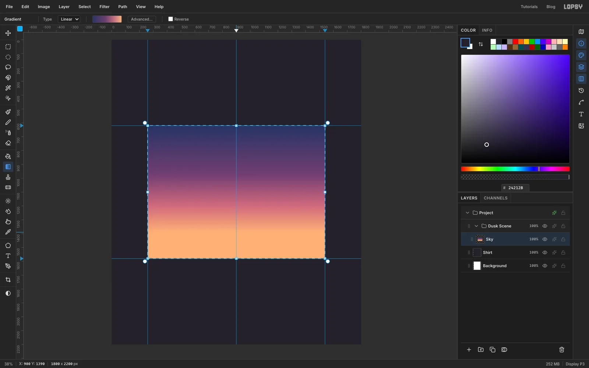

With *Shirt* selected, click **New Group** at the bottom of the Layers panel
and name it *Dusk Scene*. Everything in the picture goes inside it. Add a
layer called *Sky*.

Drag a **Rectangular Marquee** from guide to guide, top left to bottom right.
Pick the **Gradient** tool, set **Type** to **Linear** and click
**Advanced…**. Make four stops: `#2B3463` on the left, `#6A3F6F` at 45 %,
`#C46F7C` at 75 % and `#F3B47D` on the right. Then drag from the top of the
rectangle straight down to about two-thirds of the way, so the bottom third
is the warm horizon colour.

## Add the sun and the hills

Add a layer called *Sun*. With the **Elliptical Marquee**, hold [[Shift]] and
drag a circle about 250 px across, a little right of centre, sitting low
enough that its bottom will be hidden by the hills. Fill it with `#FBE3B4`.

Add a *Far Hills* layer. With the **Lasso**, draw a gently rolling line
across the screen just over the bottom of the sun, then go down past the
bottom guide and back along it to close the shape. Fill it with `#5B3B66`.

Add a *Meadow* layer and lasso a darker foreground in front: a round hill
on the left (the cat will sit on top of it), dipping in the middle and
rising slightly on the right. Fill it with `#2A1F37`. Keep the lasso inside
the left and right guides.

## Draw the house

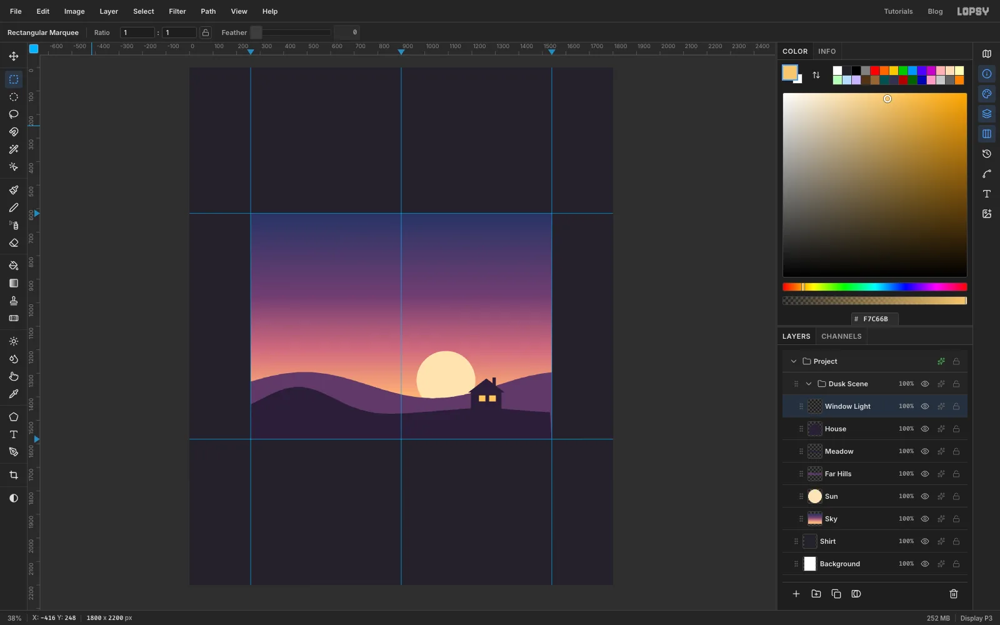

Add a *House* layer. With the **Lasso**, click around a simple house
outline on the right of the meadow: two walls, a gable roof with a little
overhang on each side, and a chimney. Fill it with the meadow colour
`#2A1F37`, so it reads as one silhouette with the hill.

Add a *Window Light* layer, draw two small square marquees side by side on
the house front and fill each with `#F7C66B`.

## Put up the power poles

Add a *Power Lines* layer and keep `#2A1F37` as the colour. Choose the
**Pencil**, set **Size** to 12, click at the foot of the first pole on the
right of the meadow, then hold [[Shift]] and click where its top should be.
That draws a perfectly straight upright. Draw the crossbar the same way.

Switch the Pencil to **Size 8** and draw a smaller pole and crossbar on the
far hills left of centre. The smaller pole reads as further away.

## Hang the wires with the Pen tool

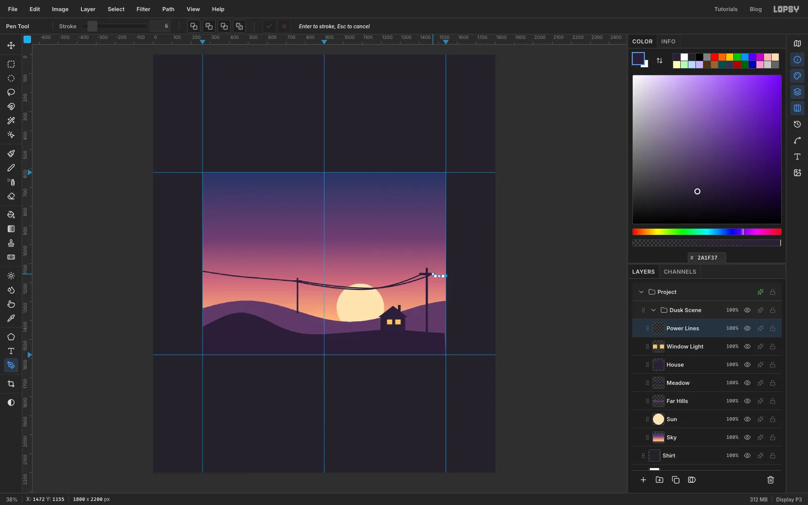

Wires sag, so draw them with the **Pen** tool rather than the pencil. Set its
**Stroke** to **6** in the options bar. Click the left end of the small
pole's crossbar, then **click and drag** a point halfway across, pulling
the handle sideways along the wire to make a smooth curve, and click the
right pole's crossbar. Press [[Enter]] to stroke the path with the
foreground colour.

Draw a second wire from the other end of the crossbars, slightly lower.
Then draw a third wire from the left edge of the screen to the small pole,
and a short one from the big pole to the right edge. Keep the left-hand
wire high: the cat sits under it in the next step.

> **Tip:** start a new wire away from the last one. The finished path stays selected, and a pen click right on top of it adds an anchor to it instead of starting a new path.

## Seat a cat on the hill

Add a *Cat* layer above *Power Lines*. With the **Lasso**, click around a
cat sitting with its back to you on top of the left hill: a pear-shaped
body, a round head and two pointed ears. Fill it with `#2A1F37`. Switch to
the **Brush** at **Size 10**, **Hardness 100**, and paint a tail curling
along the ground and up at the tip.

If the cat looks small against the poles, scale it up: draw a marquee around
it, switch to the **Move** tool, hold [[Cmd]] to keep its proportions and
drag the **top-left** corner handle up and out to about 125 %. Dragging the
top corner keeps the cat's base planted on the hill. Press [[Cmd+D]] to
commit.

## Grow grass and scatter stars

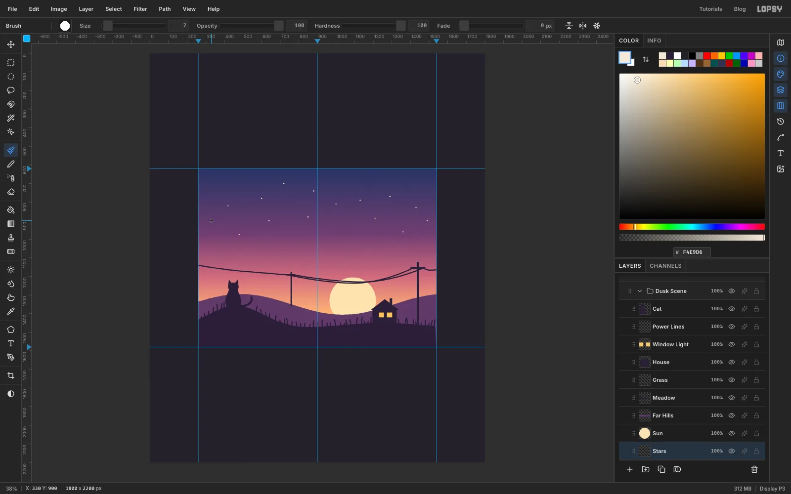

Add a *Grass* layer above *Meadow*. Keep the silhouette colour `#2A1F37`, set
the **Brush** to **Size 7**, **Hardness 100**, and flick short strokes upwards all along the meadow's top
edge, leaning some left and some right. Leave gaps around the cat and the
house.

Add a *Stars* layer above *Sky*, set the colour to `#F4E9D6` and click the
brush (still size 7) a dozen or so times across the upper sky. Keep a clear
band along the very top, where the VHS text will go later.

## Release the fireflies

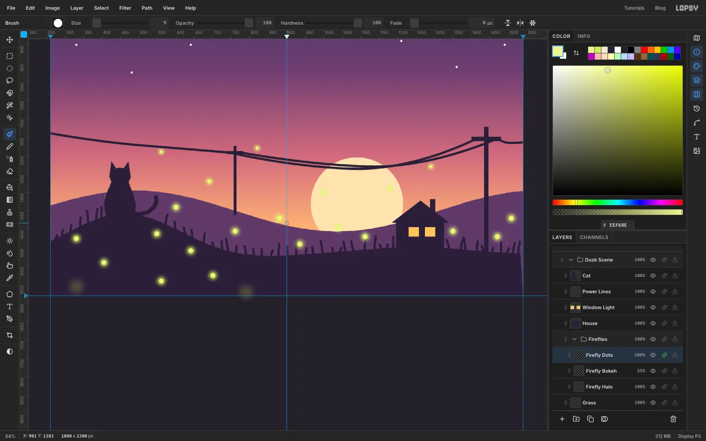

With *Grass* selected, click **New Group** and call it *Fireflies*. Inside
it, make three layers, from the bottom up:

1. *Firefly Halo*: set the brush to **Size 44**, **Hardness 0**, **Opacity 40 %** and colour `#D4F05A`, and click once wherever a firefly will be. Set the layer's **Blend** to **Screen** in the effects drawer.
2. *Firefly Bokeh*: with the same soft `#D4F05A` brush at **Size 64**, click two big dots right at the bottom edge, as if very close to the lens. Set the layer to **55 %** opacity.
3. *Firefly Dots*: brush back to **Opacity 100 %**, **Hardness 100**, **Size 14**, colour `#EEF68E`. Click on each halo, using a smaller size (9–11) for the ones high in the sky. Then enable **Outer Glow** with colour `#D4F05A`, **Size 10**, **Spread 40**, **Opacity 100**.

Keep about twenty, spread over the hills and low sky. Leave the bottom-right
corner clear, because the date stamp goes there.

## Make the sun and windows glow

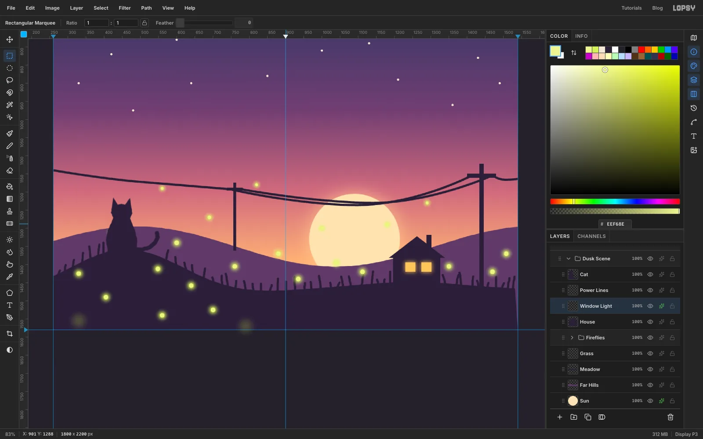

Select *Sun* and enable **Outer Glow** with `#FFD39A`, **Size 63**,
**Spread 10**, **Opacity 70**. Select *Window Light* and give it an
**Outer Glow** of `#F7C66B`, **Size 16**, **Spread 20**, **Opacity 85**.

The clean scene is done. Everything from here makes it look like a worn
videotape.

## Flatten a copy with Copy Merged

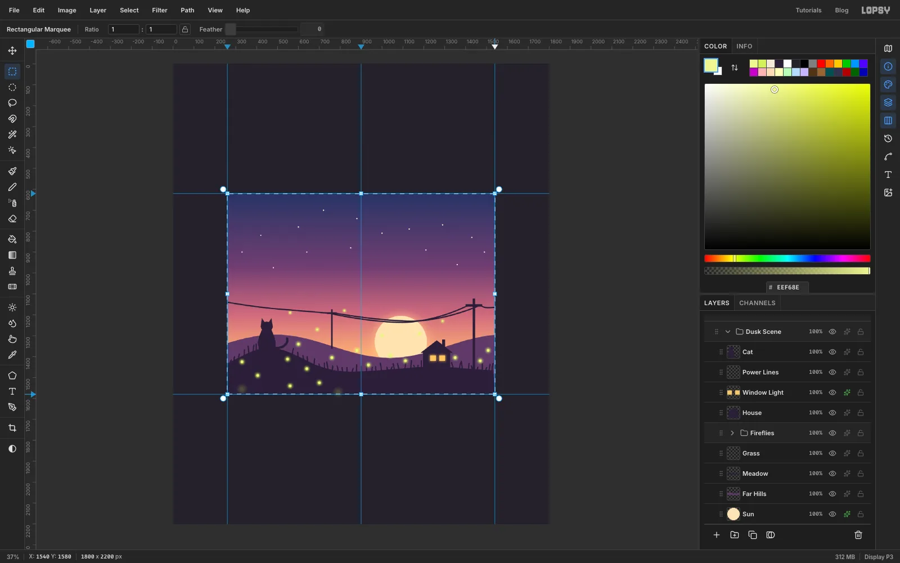

Select the *Dusk Scene* group, draw a marquee from guide to guide around the
screen, and choose **Edit → Copy Merged**. Then **Edit → Paste**. The
flattened copy lands in place, exactly over the original.

Rename the new layer *Screen*, drag it in the Layers panel so it sits
**above** the *Dusk Scene* group rather than inside it, and click the eye on
*Dusk Scene* to hide the originals.

## Pixelate the scene

Press [[Cmd+D]] to deselect, so the filters below hit the whole layer.
With *Screen* selected, choose **Filter → Pixelate…** and set **Block Size**
to **6**. Six-pixel blocks are coarse enough to read as pixel art across a
room, and fine enough to keep the cat's ears.

> **Tip:** skip Posterize here. It rounds each colour channel on its own, so on this sky the green steps up before the red and leaves a strange blue band across the purple.

## Bulge it and split the colours

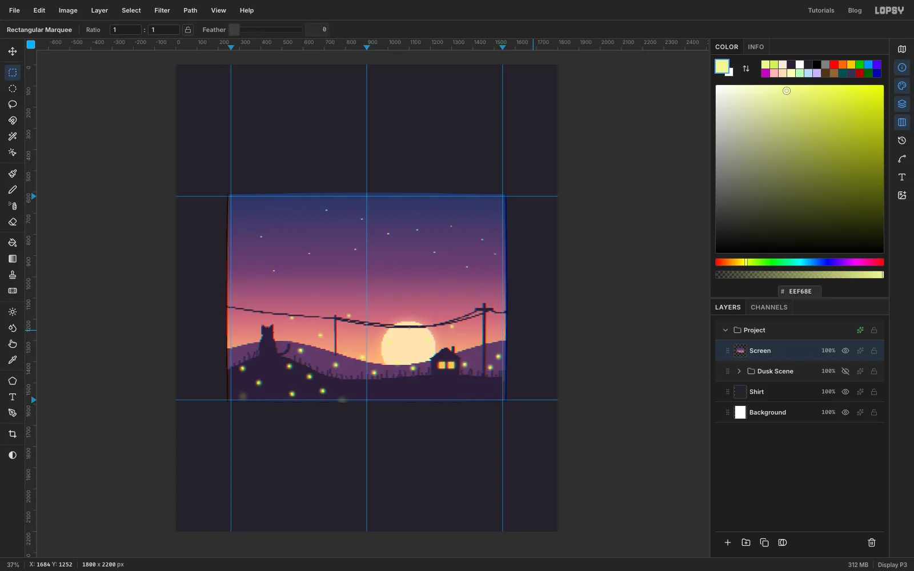

Choose **Filter → Lens Distortion…** and set **Strength 14**, **Zoom 104**
and **Chromatic Fringing 25**. That gives the gentle bulge of a curved CRT
tube. The screen is centred on the document, so the bulge is centred on it
too.

Then choose **Filter → Chromatic Aberration…** with **Amount 4** and
**Direction 0**. Every dark edge now has a red fringe on one side and a blue
one on the other, like a worn tape.

## Add a tracking glitch

A VHS tracking error is a horizontal band that slides sideways. With the
**Rectangular Marquee**, drag a thin band, about 50 px tall, across the upper
half of the sun, from just right of the cat to about three-quarters of the
way across. Choose **Filter → Pixel Stretch…** with **Amount 60**,
**Bands 3** and **RGB Split 0.8**.

Watch the preview and try a few **Seed** values until the sun is clearly
sliced. Some seeds barely shift anything; seed **42** moves the band about
36 px. Keep the band well away from the screen's edges: a shifted edge would
leave a notch in the frame.

Press [[Cmd+D]], then run **Filter → Add Noise…** with **Amount 12**,
**Mono** and **Gaussian** over the whole screen for tape grain.

## Round the screen's corners

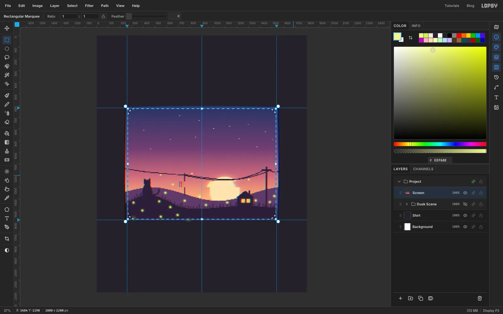

Now cut the rounded tube shape. Drag a marquee from guide to guide around
the screen, choose **Select → Shrink…** by **70**, then **Select → Grow…**
by **64**. Shrinking and growing back rounds the corners. Growing back 6 px
less than you shrank also pulls the edge 6 px inside the guides, which trims
the colour fringe the filters left along the edges.

## Trim to the CRT shape

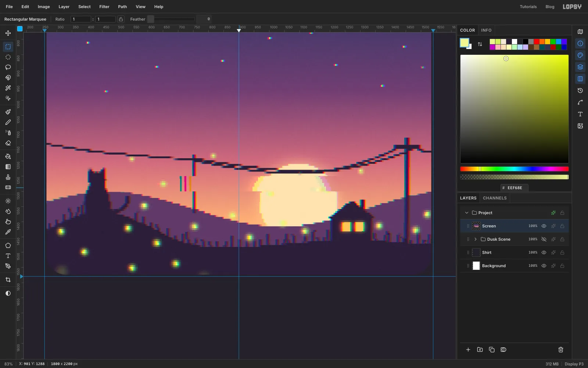

Choose **Select → Inverse** and press [[Delete]], then [[Cmd+D]]. Everything
outside the rounded rectangle is gone, and the screen now has clean, curved
corners.

## Make a scanline pattern

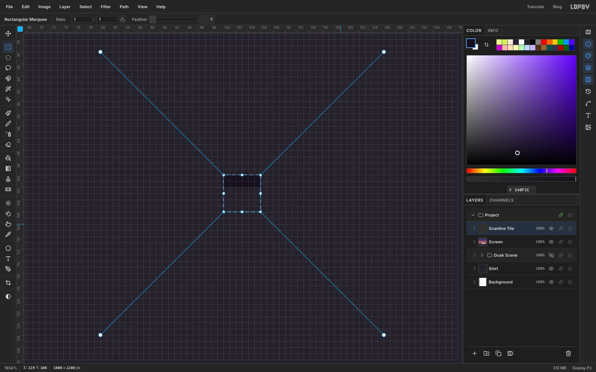

Scanlines are a repeating pattern of thin dark lines. Add a temporary layer,
zoom right in (about 1600 %) on an empty corner of the canvas, drag a marquee
6 pixels wide and 2 tall, and fill it with `#140F1C`. Then drag a **6 × 6 px**
square marquee starting at the same corner and choose
**Edit → Define Pattern**. You now have a tile that is 2 px dark and 4 px
clear. Delete the temporary layer.

## Lay scanlines over the screen and frame it

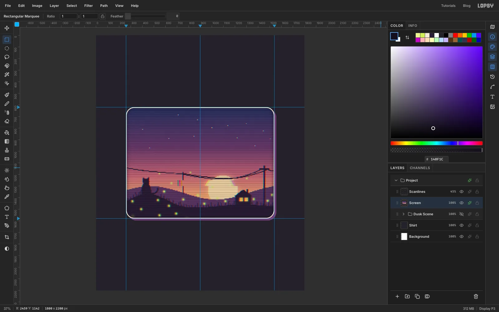

Add a *Scanlines* layer above *Screen*. [[Cmd]]-click the *Screen* thumbnail
to load its shape as a selection, choose **Edit → Fill with Pattern…**, pick
the 6 × 6 pattern and click **Apply**. Deselect, set the layer's **Blend** to
**Multiply** and its opacity to **45 %**.

Select *Screen* and add three effects:

- **Stroke**: **Width 7**, outside, `#F4E9D6`, for the cream bezel
- **Drop Shadow**: **Offset 16 / 16**, **Blur 1**, **Opacity 100**, `#6A3F6F`, a hard print-style offset
- **Inner Glow**: **Size 50**, **Opacity 65**, `#140F1C`, to darken the tube's corners

## Set the pixel title

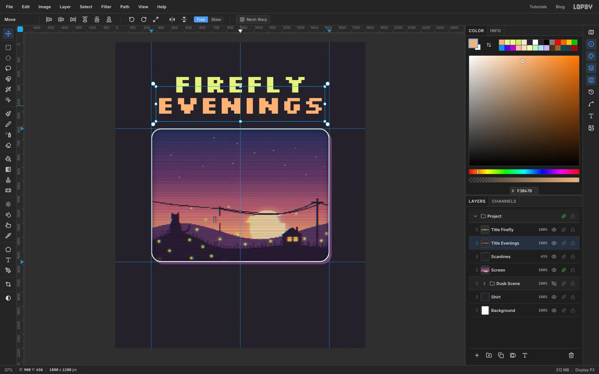

Select *Scanlines* so new layers land above it. Pick the **Text** tool,
choose **Silkscreen**, **Bold**, **Size 180**, and set the colour to
`#E9F28A`. Click in empty space above the screen, type `firefly` and press
[[Tab]] to commit. Silkscreen draws every letter as a capital. Rename the
layer *Title Firefly*.

Set the colour to `#F3B47D` and type `evenings` the same way in another empty
spot, and name it *Title Evenings*. Then drag both into place with the **Move** tool: centred on the middle
guide, with FIREFLY above EVENINGS and a gap of about 100 px between
EVENINGS and the top of the screen.

> **Tip:** choose the colour before you click to type. To recolour finished text, click into it with the Text tool, change the colour and press [[Tab]].

## Give the title a hard shadow and a glow

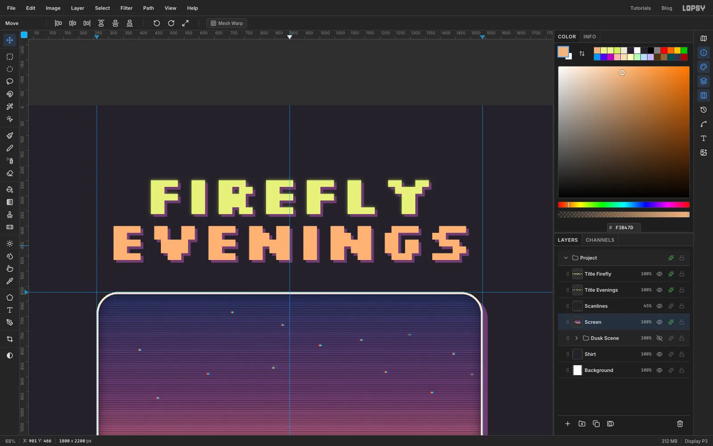

Give both title layers a **Drop Shadow** of `#6A3F6F`, **Offset 9 / 9**,
**Blur 1**, **Opacity 100**, the same hard shadow style as the screen. Give
*Title Firefly* an **Outer Glow** of `#D4F05A`, **Size 18**, **Opacity 55**, so
the word glows like the fireflies below it.

## Draw and rotate a play icon

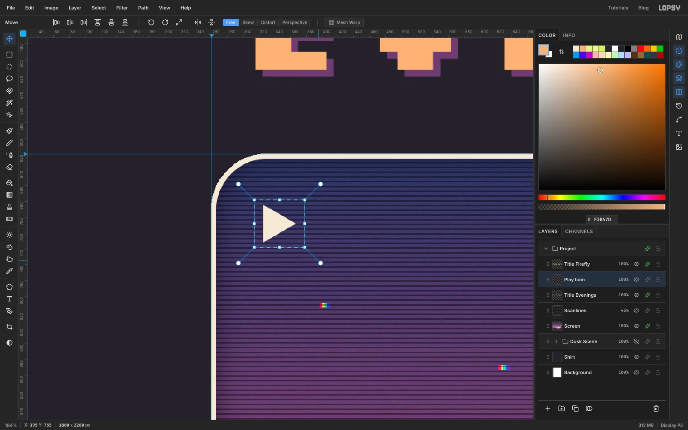

Add a *Play Icon* layer. Choose the **Shape** tool, set the shape to
**Polygon** with **3** sides, set **Fill** to `#F4E9D6`, and drag out a
triangle about 48 px across near the screen's top-left corner, about 58 px
in from each edge.

The polygon points up, so turn it: draw a marquee around it, switch to the
**Move** tool, hold [[Cmd]] and drag the round **rotate handle** off the
top-right corner a quarter-turn clockwise. [[Cmd]] snaps it to exactly 90°,
so it now points right like a ▶ button. Press [[Cmd+D]].

## Add the VHS on-screen display

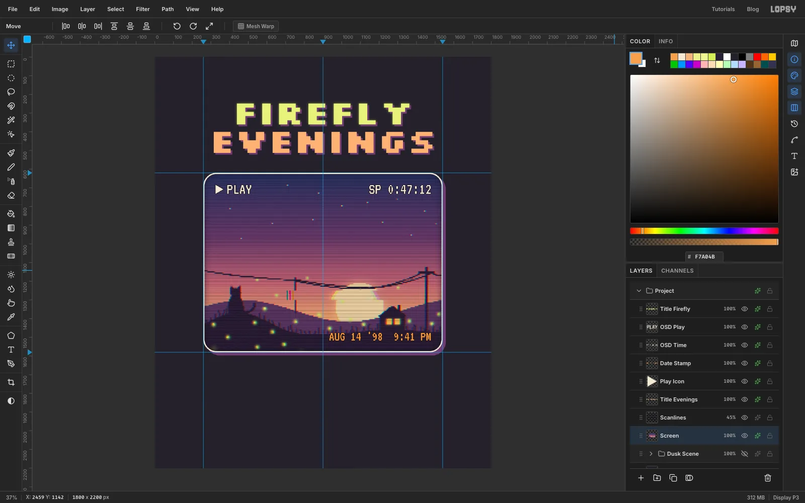

Choose **VT323** in the Text tool, the classic VCR font. At **Size 84** in
`#F4E9D6`, type `PLAY` and `SP 0:47:12` in empty space and name the layers
*OSD Play* and *OSD Time*. At **Size 72** in `#F7A04B`, type
`AUG 14 '98  9:41 PM` and name it *Date Stamp*. Drag them into place:

- **PLAY** just right of the triangle, with its capitals the same height as the triangle
- **SP 0:47:12** at the top right
- the **date stamp** at the bottom right

Keep about **58 px** between each one and the screen's edge, and line up
the right edges of the counter and the date. Give all three, and the
triangle, a 3 px **Stroke** of `#1A1420`. That dark outline is what keeps VHS
text readable over any picture.

> **Tip:** when you're about to type new text, select a non-text layer such as *Play Icon* first. Font, size and colour changes made while a text layer is selected restyle that layer.

## Clone out stars that crowd the text

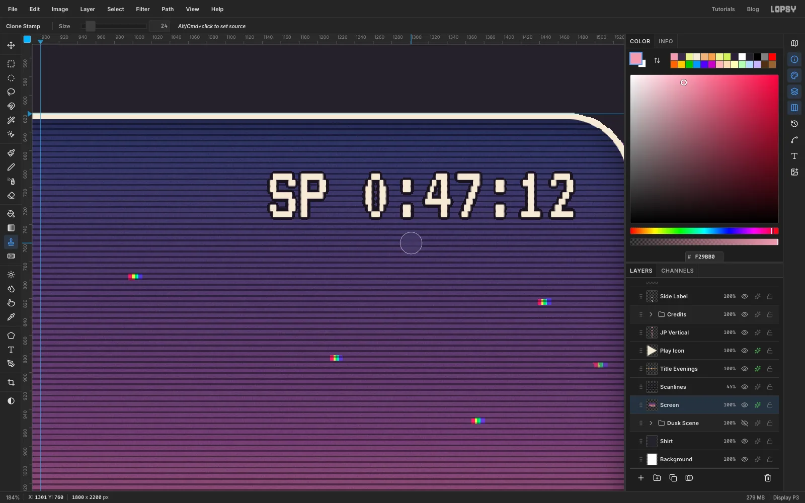

With the counter in place, two stars sit right under it and look like specks
stuck to the numbers. Select *Screen*, pick the **Clone Stamp**, set **Size**
to about 24, [[Alt]]-click a patch of plain sky a little to the left of a
star, and click once on the star. The sky's colour bands are horizontal, so
sky from the same height matches exactly. Do the same for the other star.

## Edge the glitch band

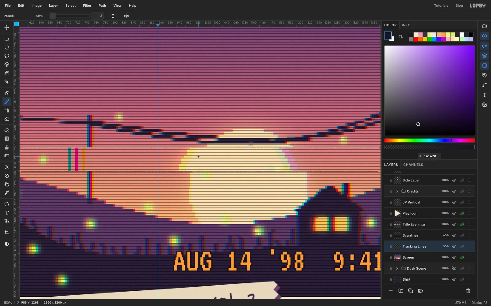

A real tracking error has a bright noisy line where the band starts and a
dark one where it ends. Those lines also make the band read as a band across
the flat sky. Add a *Tracking Lines* layer above *Screen*.

With the **Pencil** at **Size 3** in `#F3E9D2`, click at the left end of the
band's top edge and [[Shift]]-click at the right end. Switch to **Size 2** in
`#1A1420` and draw the bottom edge the same way. Run **Add Noise** at
**Amount 60**, **Mono**, **Uniform** so the lines break up like tape noise,
and set the layer to **55 %** opacity.

## Set the tagline and tracklist

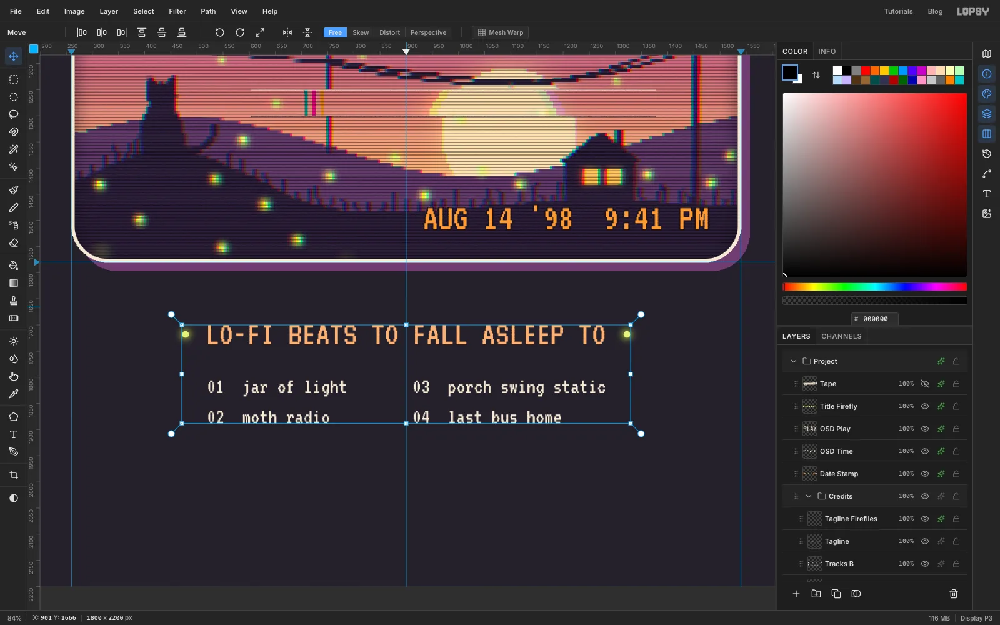

Below the screen, type `LO-FI BEATS TO FALL ASLEEP TO` in **VT323**,
**Size 66**, `#F3B47D`, name it *Tagline*, and centre it on the middle guide
about 120 px below the screen. Capitals matter: in lowercase, VT323 joins the
`f` and `i` of "lo-fi" into a single squeezed glyph.

For the tracklist, use **VT323** at **Size 42** in `#F4E9D6` and two text
layers, *Tracks A* and *Tracks B*, each with two lines (press [[Enter]]
between them):

- `01  jar of light` / `02  moth radio`
- `03  porch swing static` / `04  last bus home`

Line the first column's left edge up with the tagline's first letter and the
second column's right edge with its last letter. Select the tagline and both
columns, choose **New Group**, call it *Credits*, and drag all three inside.
Then add a *Tagline Fireflies* layer to the group and click two
**Size 14** `#E9F28A` brush dots, one on each side of the tagline about 35 px
from the text, with the same **Outer Glow** as the fireflies.

## Add a rotated side label

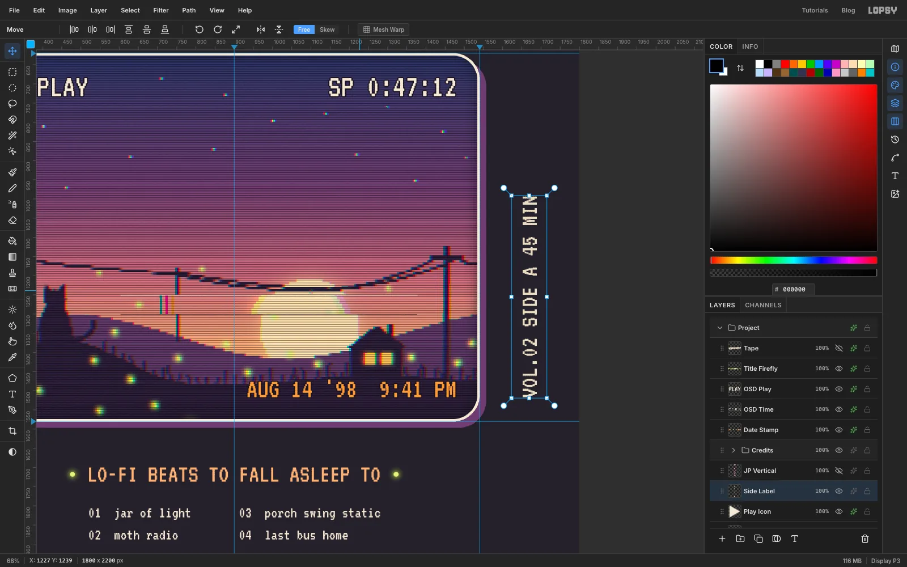

With *Play Icon* selected, use **VT323**, **Size 66** and `#E8DCC4` to type
`VOL.02 SIDE A 45 MIN` in an empty spot below the design, and name it
*Side Label*.

With the **Move** tool, hold [[Cmd]] and drag the round rotate handle off
the label's top-right corner a quarter-turn **anticlockwise**, so the label
reads from bottom to top. [[Cmd]] snaps it to exactly 90°. Then drag it into
the right margin, centred between the screen and the edge of the print, with
its bottom level with the date stamp's baseline.

## Set vertical Japanese in the left margin

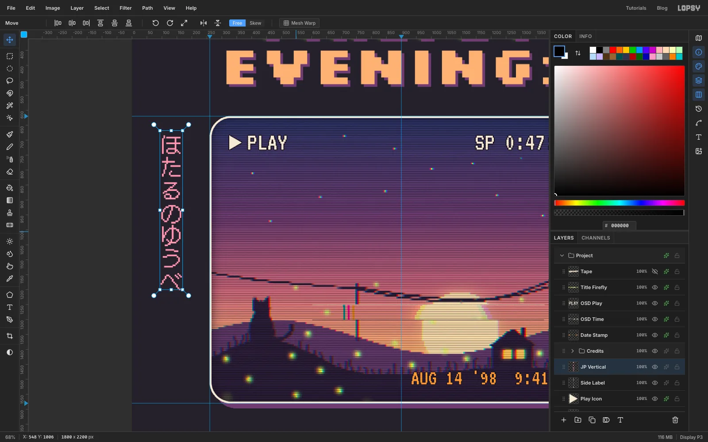

The left margin gets the title in Japanese: ほたるのゆうべ, "firefly
evening". Copy those characters from this page. With *Play Icon* selected,
choose **DotGothic16**, a pixel font with Japanese characters, at **Size 76**
in `#F29BB0`, and switch **vertical text** on in the options bar. Click in the
left margin, paste with [[Cmd+V]], press [[Tab]] and name the layer
*JP Vertical*.

Drag it so it's centred in the left margin, with its top level with the top
of PLAY. It's the same length as the side label, so the two mirror each other
corner to corner: one hangs from the top line of the screen text, the other
stands on the bottom line. When you're done, select a non-text layer and
switch vertical text back off, or your next text will be vertical too.

## Cut a strip of masking tape

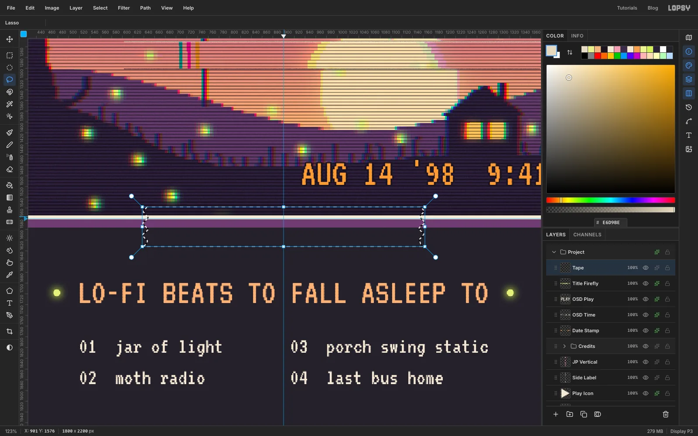

Select *Title Firefly* so the tape lands near the top of the stack, and add a
*Tape* layer. With the **Lasso**, click around a strip about 520 × 75 px
that straddles the screen's bottom edge in the middle. Zigzag the short ends
with five or six small clicks, so they look torn rather than cut. Fill it
with `#E6D9BE` and run **Add Noise** (**Amount 10**, **Mono**, **Gaussian**)
for a paper texture.

## Write on the tape

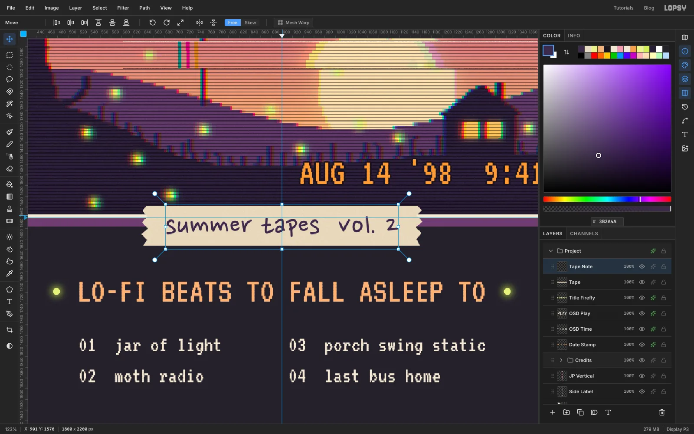

With *Tape* selected, so the new text lands directly above it, choose
**Nanum Pen Script** at **Size 60** in `#3B2A4A` and type
`summer tapes  vol. 2` in empty space. Drag it onto the tape, centred with
roughly 40 px to spare at each end. With the text layer selected, choose
**Layer → Merge Down** so the writing becomes part of the tape.

## Tilt the tape

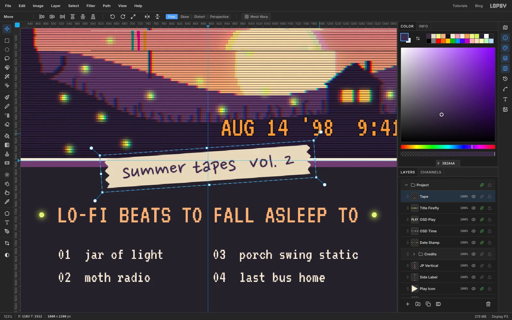

Draw a marquee around the tape, switch to the **Move** tool, and drag the
rotate handle about **4° anticlockwise**. Leave [[Cmd]] up this time: tape is
never stuck on straight. Press [[Cmd+D]] to commit. Check that the raised
corner still clears the date stamp.

Finish with a hard **Drop Shadow** on the tape: `#6A3F6F`, **Offset 6 / 6**,
**Blur 1**, matching the title and screen. Then save with **File → Save
Project** and export with **File → Quick Export PNG**.
