Maximalism isn't clutter. It's a lot of confident pieces, each with its own
job, held together by a small palette, one outline colour and a clear
hierarchy. In this tutorial you'll make a 1000 × 1400 cover for an imaginary
breakfast zine, **YOLK: The Xanadu Issue**. The idea is that a fried egg
becomes Kubla Khan's "stately pleasure-dome".

Along the way you'll use:

- pattern fills and Mesh Warp
- the radial-symmetry brush
- lasso and marquee fills
- Shape-tool paths with text on a path
- layer effects and blend modes
- the Halftone and Add Noise filters
- groups, transforms, and grid snapping

The palette:

- Cobalt `#2340C8` and cream `#FFF1D6` for the background
- Tomato `#E8412C`, orange `#FF7A1A` and bubblegum `#FF8FB8` for the sunburst
- Mint `#5ED3A0` and teal `#19C9A0` as accents
- Yolk `#FFB81C` and gold `#FFC21A`
- Ink navy `#1A1030` for every outline and hard shadow

## Create the zine document

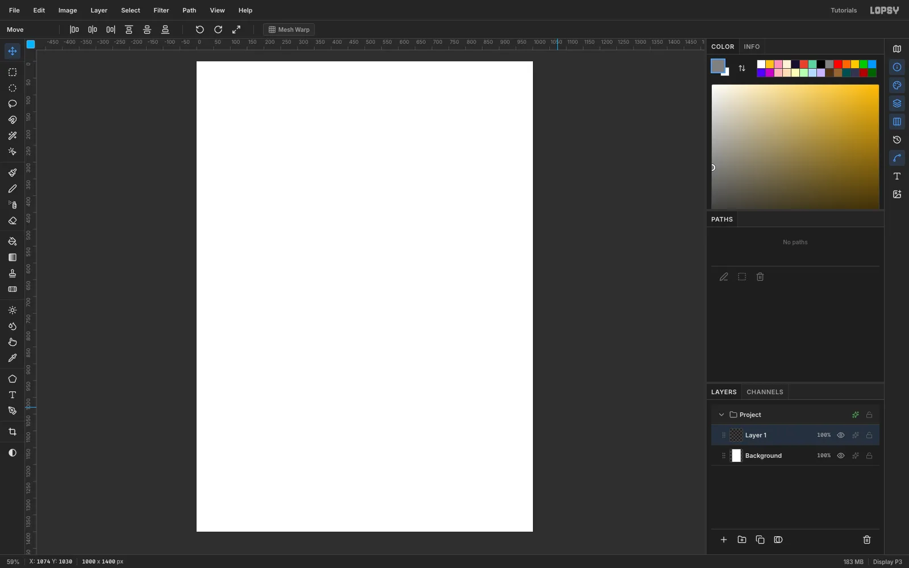

Choose **File → New**, type **1000** × **1400** px, and pick a **White**
background. That's close to A5 proportions, which suits a zine. Double-click
**Layer 1** and rename it **Tile**.

## Paint a checkerboard tile

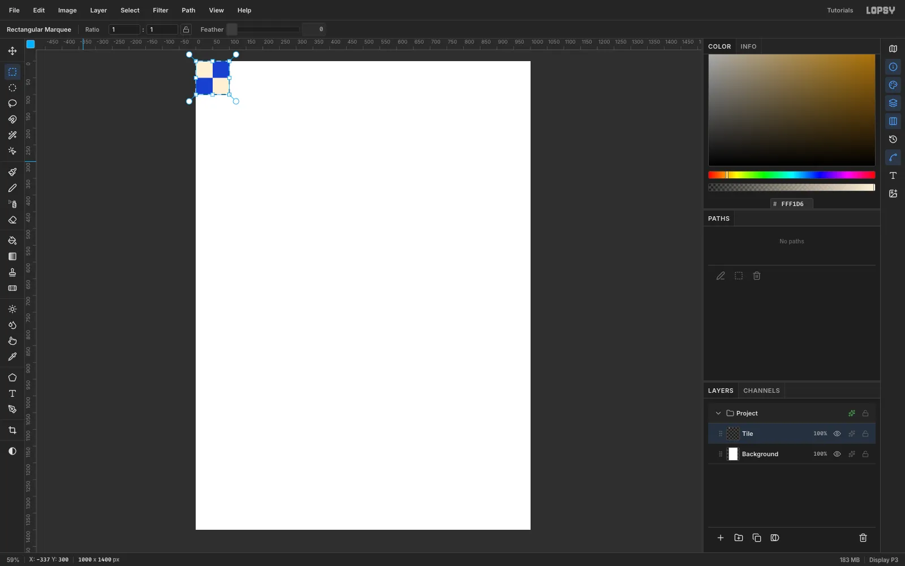

You'll build the background from one small tile.

1. With the Rectangular Marquee, drag a 100 × 100 selection at the top-left
   corner. Set the foreground to cobalt `#2340C8` and choose **Edit → Fill**.
2. Marquee the top-left 50 × 50 quarter and fill it with cream `#FFF1D6`.
3. Do the same for the bottom-right quarter.
4. Re-select the whole 100 × 100 tile and choose **Edit → Define Pattern**.

## Fill a layer with the pattern

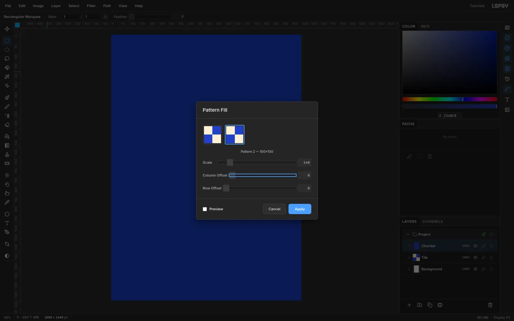

1. Press [[Cmd+D]] to deselect.
2. Click **Add Layer**, name it **Checker**, and give it a solid **Edit → Fill**
   first. Pattern Fill needs existing pixels to tile over.
3. Choose **Edit → Fill with Pattern…**, pick the checker, set **Scale** to
   **140**, and click **Apply**. That gives you 70 px squares.
4. Select the **Tile** layer and delete it.

## Swirl the checkerboard with Mesh Warp

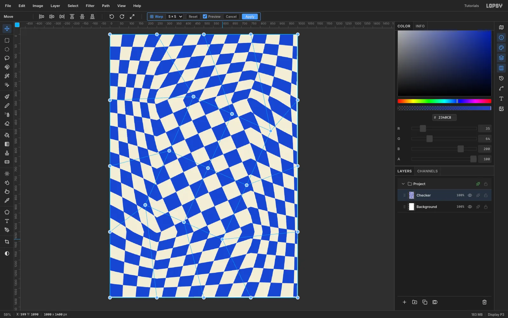

Select the Move tool and click **Mesh Warp** in the options bar. Set the grid
to **5 × 5** and tick **Preview**.

Drag each of the nine interior handles about a quarter-turn around the point
where the egg will sit (roughly x 500, y 760). Pull them slightly inward as
you go. The checks spiral in like a vortex, which pulls the eye straight to
the centre of the cover. Click **Apply** when you're happy.

> **Tip:** Leave the handles on the outer edge alone, so the corners stay
> square to the page.

## Add a halftone print screen

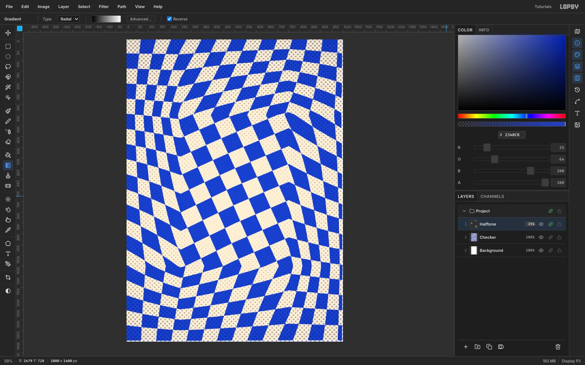

This layer gives the background a printed look.

1. Add a layer called **Halftone**.
2. Choose the **Gradient** tool, set Type to **Radial**, and tick **Reverse**.
3. Drag from the centre (500, 760) straight down past the bottom edge.
4. Run **Filter → Halftone…** with **Dot Size 14** and **Softness 1**.
5. Open the layer's effects. Turn on **Color Overlay** in deep navy
   `#0E1A6B`, set the blend mode to **Multiply**, and drop the layer opacity
   to **35%**.

## Stamp scallops with the radial-symmetry brush

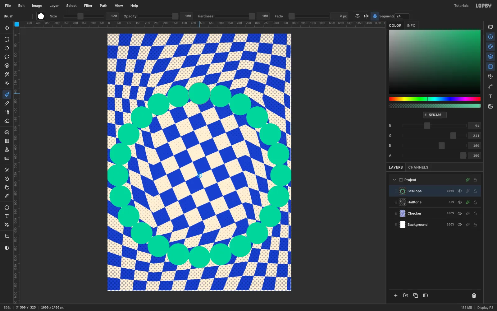

Add a layer called **Scallops**. Choose the Brush and set:

- Size **120**, Hardness **100**
- **Radial Symmetry** on, with **24** segments

[[Cmd]]-click at (500, 770) to set the symmetry centre, then click once 445 px
above it in mint `#5ED3A0`. One click stamps all 24 discs.

Give the layer these effects:

- **Stroke**: 7 px, ink navy
- **Drop Shadow**: navy, offset 12 / 14, Blur 0, Opacity 100

## Build a three-colour sunburst

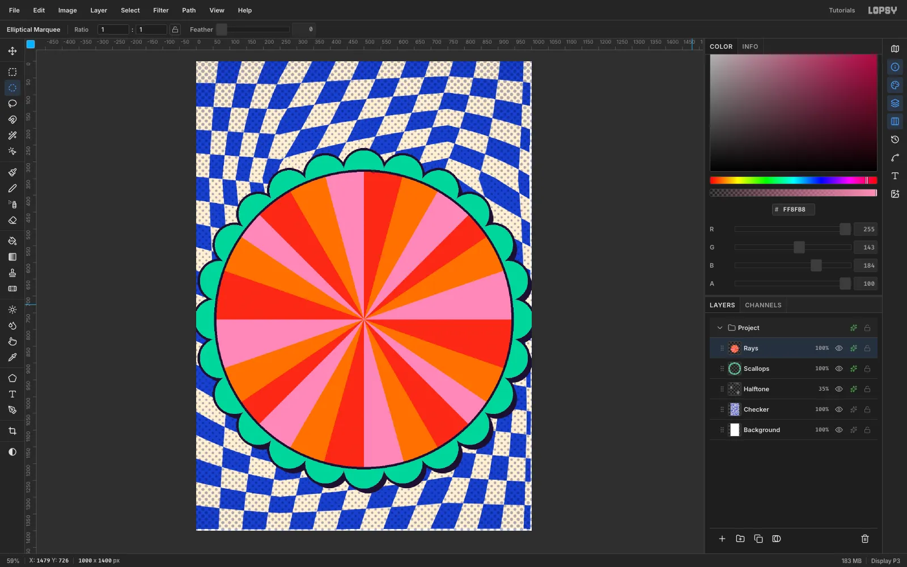

1. Add a **Rays** layer.
2. Ellipse-marquee a 880 px circle on the same centre and fill it orange
   `#FF7A1A`.
3. With the Lasso, draw thin wedges from the centre out past the edge. Fill
   every third wedge tomato `#E8412C`, and the next every-third bubblegum
   `#FF8FB8`. Three colours stop neighbouring wedges from blurring together.
4. Re-draw the 880 px circle marquee, choose **Select → Inverse**, and press
   [[Delete]] to clip the wedges.
5. Add a 7 px navy **Stroke** effect.

## Ring it with alternating dots

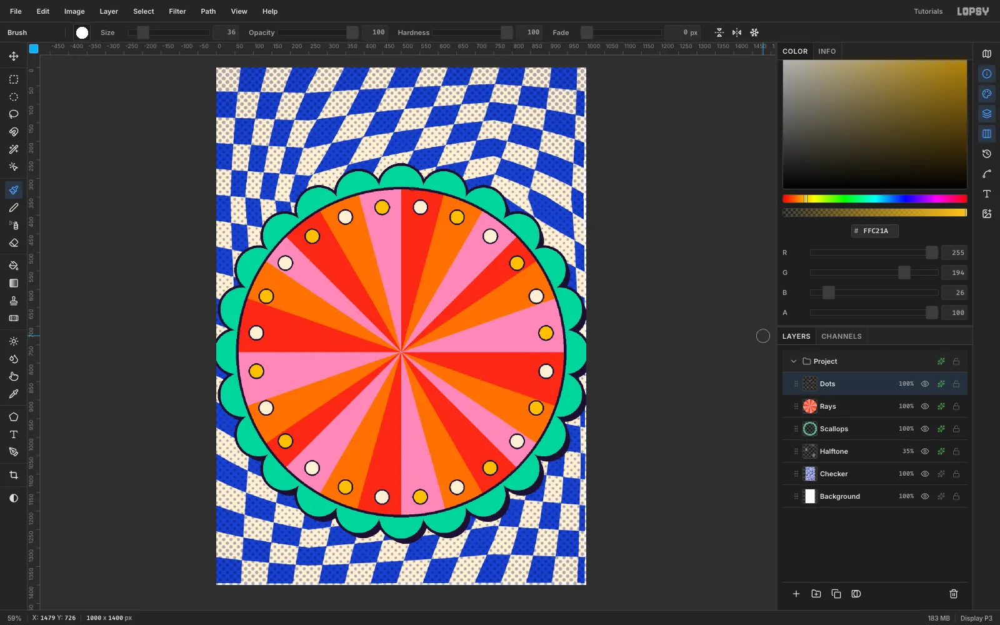

1. On a new **Dots** layer, set the brush to Size **36** and Radial Symmetry
   to **12** segments, with the same centre.
2. Click once in cream at 7.5° off vertical, 395 px out from the centre.
3. Switch to gold `#FFC21A` and click once at 22.5°.

That gives 24 dots that alternate colours. Turn symmetry off and add a 4 px
navy Stroke.

## Draw the River Alph

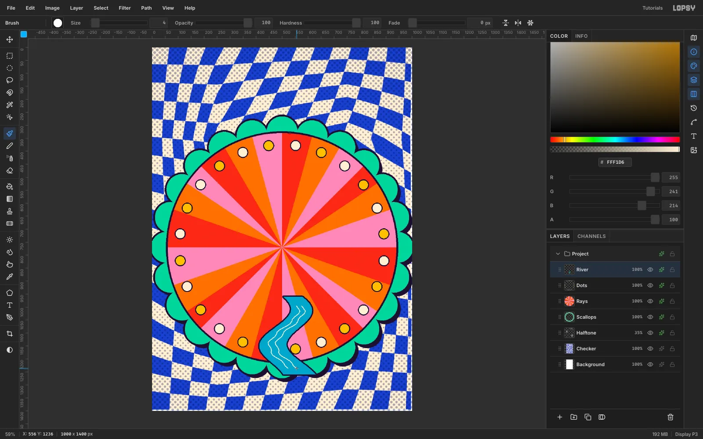

In Coleridge's poem, "Alph, the sacred river, ran" under the dome. On a
**River** layer:

1. Lasso a ribbon that snakes down from about y 960 to y 1260 and widens as
   it goes.
2. Fill it with teal `#1FA3C8` and add a 5 px navy Stroke.
3. Brush two 4 px cream wave lines along the current.

The top of the river will hide under the egg later.

## Raise the palace minarets

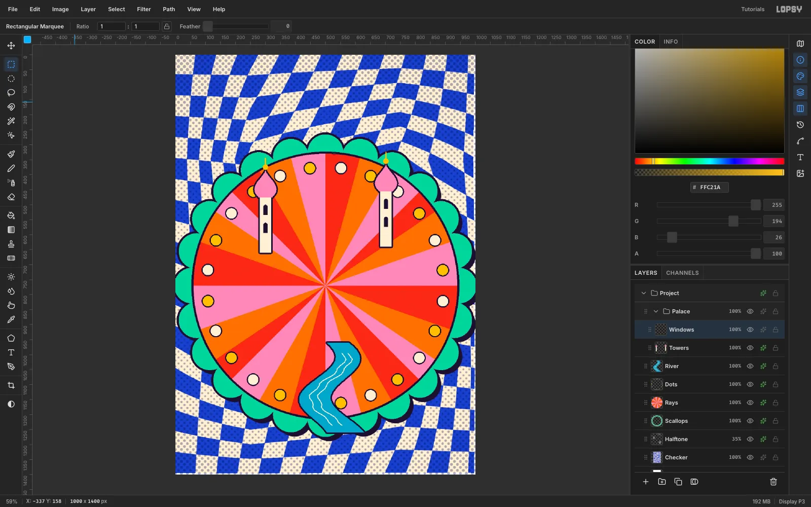

1. Click **New Group** and name it **Palace**.
2. On a **Towers** layer, marquee two 38 px-wide towers at x 300 and x 702 and
   fill them cream.
3. Lasso an onion-dome outline on top of each tower and fill it pink.
4. Add a 5 px navy Stroke.
5. On a **Windows** layer above, fill small navy arches (a rectangle plus an
   ellipse) and gold ball-and-spire finials.

The egg will cover the bases of the towers.

## Set and tilt the masthead

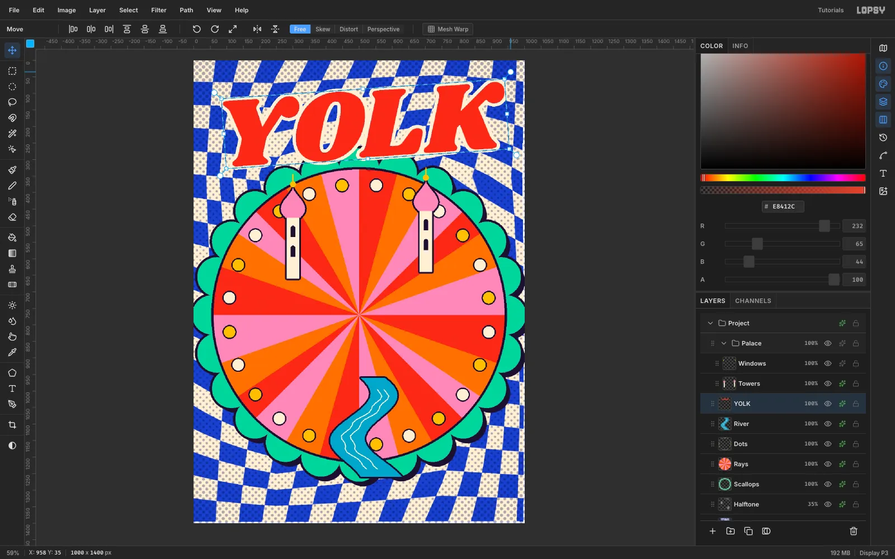

1. Select the **River** layer, so the new type goes above it. Choose the Text
   tool, set **Shrikhand** at **250**, and type **YOLK** in tomato.
2. Add a 10 px cream **Stroke**, then click **Rasterize Layer**.
3. Marquee the word and [[Cmd]]-drag a corner handle to scale it up by 20%.
   Press [[Cmd+D]] to commit.
4. Marquee it again and drag the rotate handle to **−4°**. Press [[Cmd+D]].
5. Drag it so it's centred with its top about 36 px from the edge.

## Give it a stepped extrusion

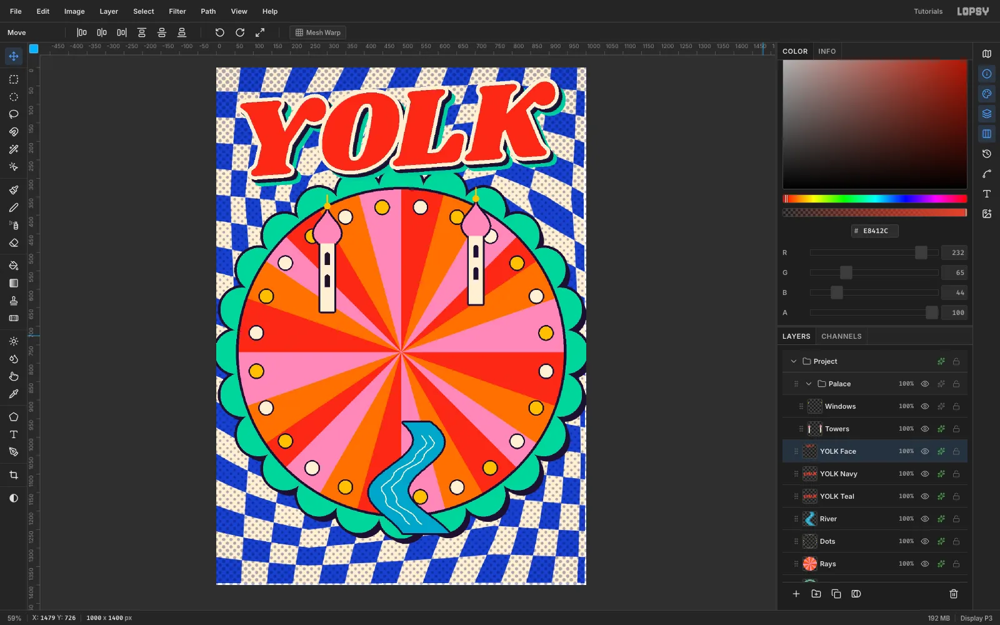

1. With the Move tool active, click **Duplicate Layer** twice. Name the
   layers **YOLK Teal** (bottom), **YOLK Navy** and **YOLK Face** (top).
2. Each copy lands 10 px down and right, so nudge them into place with the
   arrow keys ([[Shift]] + arrow moves 10 px):
   - Face back to 0 / 0
   - Navy to +9 / +9
   - Teal to +18 / +18
3. On Navy, add a navy **Color Overlay** and a 10 px navy Stroke.
4. On Teal, do the same in teal and add a small navy drop shadow.

## Bow a ribbon banner with Mesh Warp

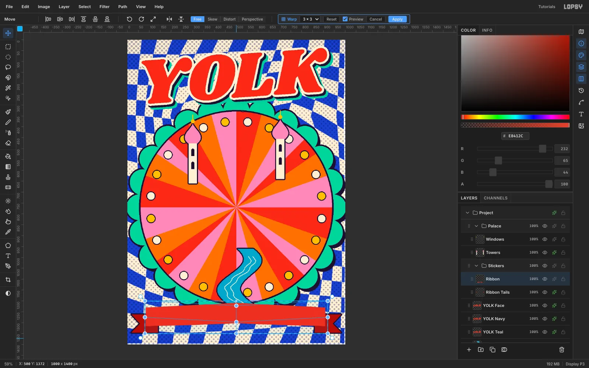

1. Select **YOLK Face** and create a **Stickers** group.
2. Inside it, lasso two notched **Ribbon Tails** in dark red `#A8261A`.
3. Above them, marquee and fill an 824 × 86 tomato **Ribbon**.
4. Draw a marquee around the ribbon, open **Mesh Warp** at **3 × 3**, and drag
   the three middle handles about 22 px vertically until the banner bows into
   an arch. Because of the marquee, the warp only affects the ribbon.
5. Add a navy Stroke, a hard navy shadow, and small dark fold triangles where
   the tails tuck behind.

> **Tip:** Mesh Warp currently moves pixels *against* the handle (#911). If
> the banner bends the wrong way, drag the handles the other way.

## Fry the egg

Select **YOLK Face** and create an **Egg** group. Build it from the bottom up:

1. **White:** lasso a wobbly oval about 600 × 500, tilted 5° so the cover
   isn't perfectly symmetrical. Fill it `#FFFDF5` and add a 7 px navy Stroke
   and a 14 / 16 hard shadow.
2. **Finial:** lasso a small gold onion dome with a spire and ball so it rises
   from behind the yolk.
3. **Yolk:** fill a 310 px circle in `#FFB81C`. Add an **Inner Glow** in
   orange `#F25C05` (Size 60, Spread 10, Opacity 90), a navy Stroke, and a
   small hard shadow.

## Rotate the highlight

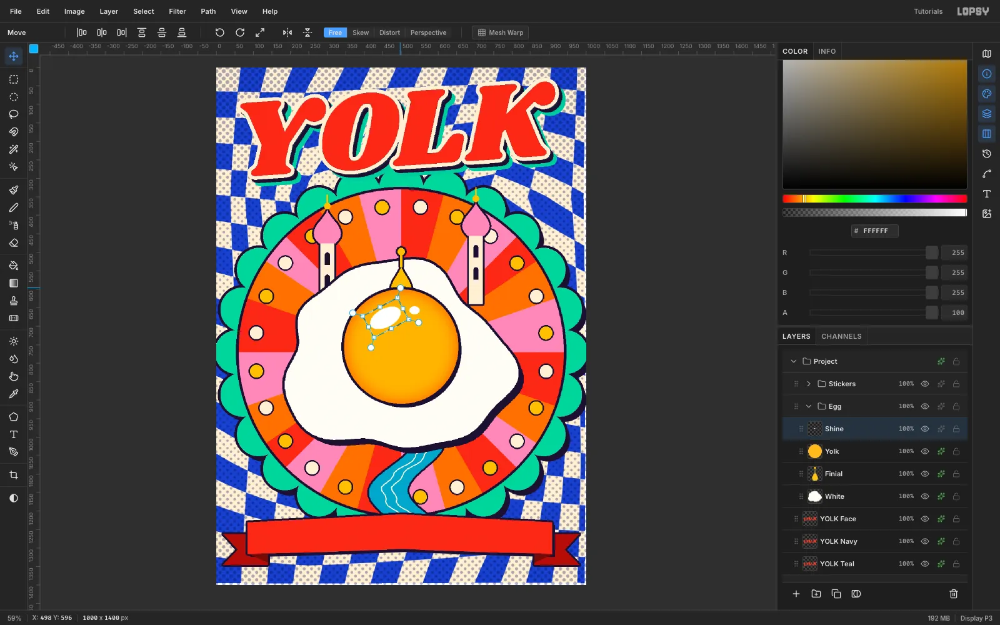

On a **Shine** layer, fill a white 90 × 50 ellipse and a small dot on the
upper left of the yolk. Marquee them and drag the rotate handle to **−28°** so
the highlight follows the curve of the yolk. Press [[Cmd+D]] to commit.

## Wrap the poem around the yolk

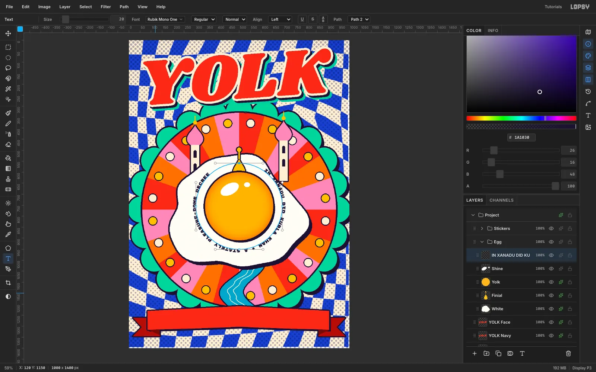

1. Choose the **Shape** tool, set Shape **Ellipse** and Output **Path**.
   [[Cmd]]-drag a 196 px-radius circle from the yolk's centre.
2. Select **Shine**, then choose the Text tool with **Rubik Mono One** at
   **20** in navy.
3. Paste `IN XANADU DID KUBLA KHAN ✦ A STATELY PLEASURE-DOME DECREE`. Start it
   with seven spaces so the text opens around the finial.
4. Press [[Tab]] and set **Path** in the options bar to your circle.

## Stick on the issue badge

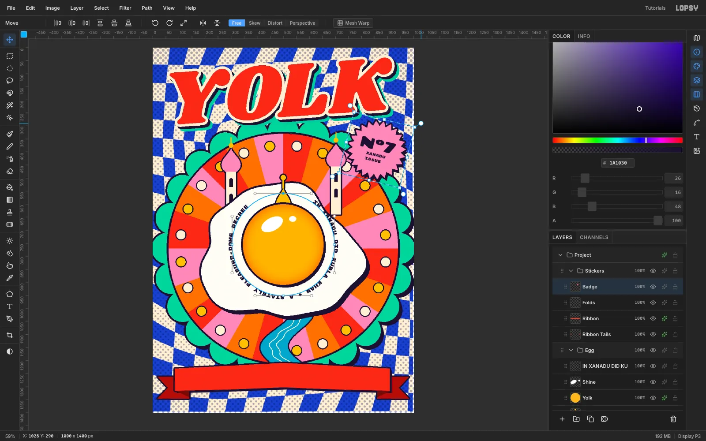

1. In **Stickers**, lasso a 48-point starburst (alternating radius 112 / 92)
   at (858, 392).
2. Fill it pink and add a navy Stroke and shadow.
3. Set **Nº7** in **Chango** 58 and **XANADU / ISSUE** in Rubik Mono One 15.
4. Rasterize both, **Merge Down** each into the badge, then rotate the badge
   **14°** so it overlaps the K.

## Add editorial cover lines

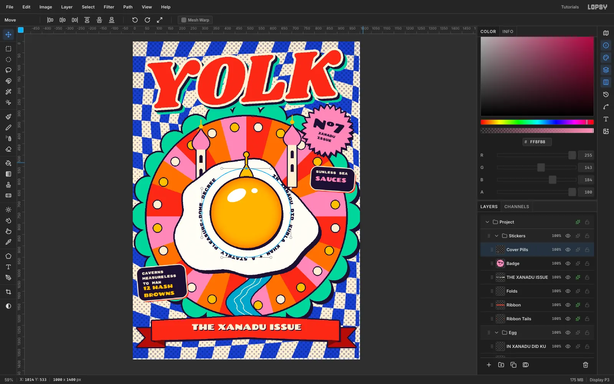

Maximalism needs editorial density, not just decoration.

1. On a **Cover Pills** layer, build two rounded navy rectangles. Fill two
   overlapping marquee rectangles, then fill four ellipse marquees for the
   corners.
2. Add a 4 px cream Stroke and a tomato hard shadow.
3. Set the cover lines in Rubik Mono One, with Chango for the punchlines in
   gold and pink.
4. Rasterize the lines and merge them into the pills.
5. Rotate the left pill **−5°** and the right one **+4°**.

## Scatter sparkles with a hierarchy

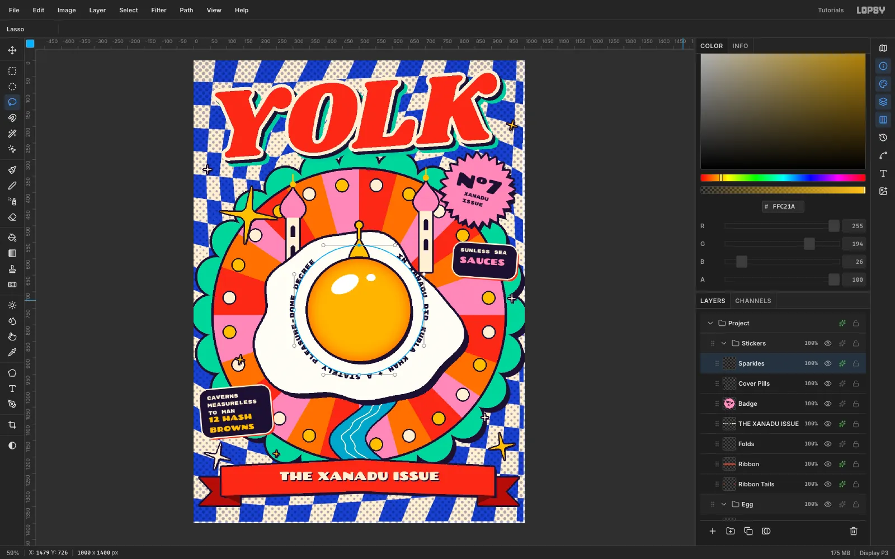

Evenly sized ornaments look like wallpaper, so vary the sizes. On a
**Sparkles** layer, lasso one **big** four-point star (radius 88), two
**medium** ones (radius about 40), and six **tiny** ones (radius about 15) in
the checker gaps. Alternate gold and cream, then add a 4 px navy Stroke and a
5 px hard shadow.

## Snap the price bar to the grid

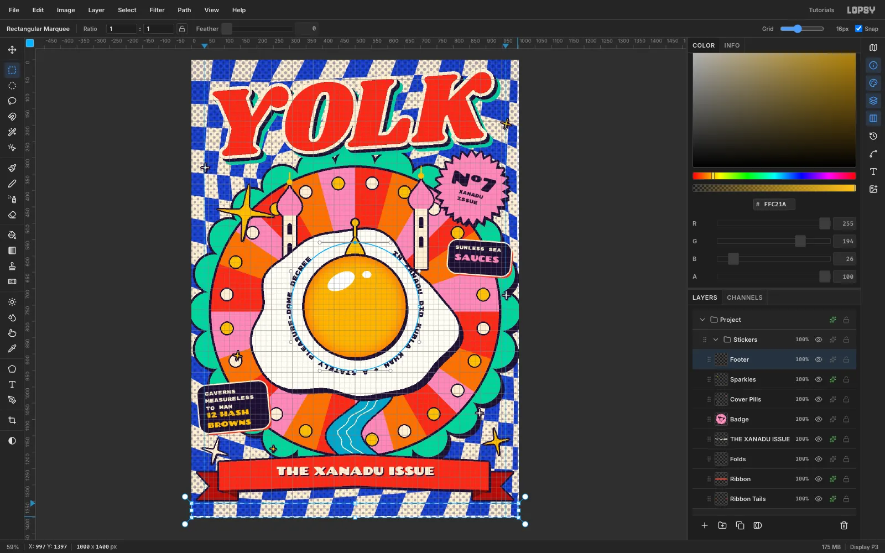

1. Turn on **View → Show Grid**. Snap turns on with it.
2. Click the top ruler at x 40 and x 960 to drop margin guides, and click the
   side ruler at y 1356.
3. Drag a footer marquee along the bottom. It snaps to the grid. Fill it navy.
4. Untick **Snap** and draw a small cream barcode with thin navy bars.
5. Set `$6 / AUTUMN 2026 / A QUARTERLY OF BREAKFAST & PARADISE` in cream
   Rubik Mono One 14 on the left guide.

## Unify everything with grain

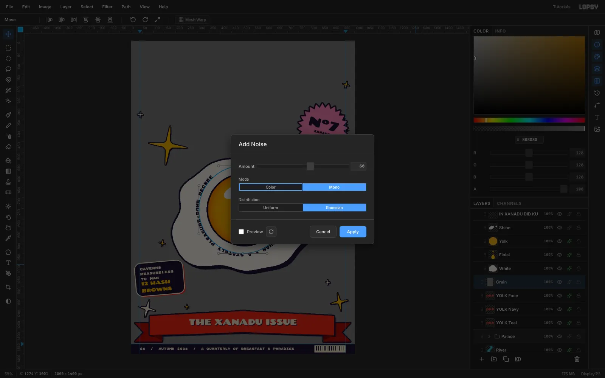

1. Add a **Grain** layer and fill it with mid-grey `#808080`.
2. Run **Filter → Add Noise…** with **Mono**, **Gaussian**, Amount **60**.
3. Set the layer to **Overlay** at **55%**.
4. Drag the layer to the very top of the Layers panel, above both groups.

The grain ties the flat vector-looking pieces to the printed halftone
background.

## Save and export

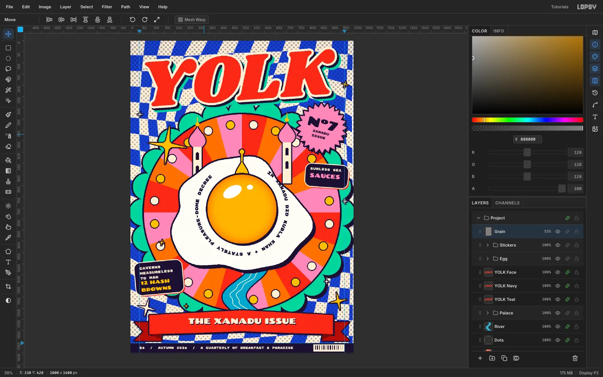

Before you export, open the **Paths** panel and click the circle path to
deselect it, so its outline doesn't show.

Save the editable file with **File → Save Project**, then export the cover
with **File → Quick Export PNG**. When you're ready for the next one, try a
calmer grid in the
[Swiss-style exhibition poster](/tutorials/swiss-style-exhibition-poster/).
