In the early 1980s the Milan collective **Memphis Group**, led by Ettore
Sottsass, threw out good taste on purpose. Their furniture and prints used
hot pink next to mint next to mustard, black-and-white checkerboards,
squiggly "Bacterio" prints and loose confetti of triangles and dashes. In
this tutorial you'll use that language to design a 1200 × 1600 menu for an
imaginary waffle bar, **Waffle Mambo**.

Along the way you'll use:

- Custom patterns with **Define Pattern** and **Fill with Pattern**
- Flat shape fills from marquees, lassos and the Shape tool
- **Stroke** and hard **Drop Shadow** layer effects
- Rotating with the Move tool's transform handles
- Copy and paste
- Groups, guides and area text

The palette is five flat colours on cream:

- Cream `#FFF1DC`
- Ink `#161616`
- Hot pink `#FF5FA2`
- Mint `#6FDCC0`
- Mustard `#F2B632`
- Cobalt `#2C4BD1`
- Lilac `#B9A6F0`

## Set up the canvas, guides and a lilac block

Choose **File → New** and create a **1200 × 1600** pixel document with a
**White** background. Click the **Background** row, set the foreground to
cream `#FFF1DC` and choose **Edit → Fill**.

Add guides by clicking the rulers (a single click drops a guide). On the
top ruler, click about 60 px in from each side for the outer margins, then
[[Cmd]]-click ([[Ctrl]]-click) the middle to drop a guide exactly on the
centre line. On the left ruler, click at about **740** and **1420**. Those
two mark the top and bottom of the menu cards.

Rename `Layer 1` to `Lilac Block`. With the **Rectangular Marquee**, drag
from just outside the bottom-left corner of the canvas up to a point about
680 px down and 540 px across, a little short of the centre guide. Fill it
with lilac `#B9A6F0` and press [[Cmd+D]]. Open its **Layer effects** (the
sparkle button on the layer row) and turn on a black **Stroke** of width
`6`. Letting the block bleed off the left and bottom edges makes it feel
like part of a bigger print.

## Draw a Bacterio squiggle tile

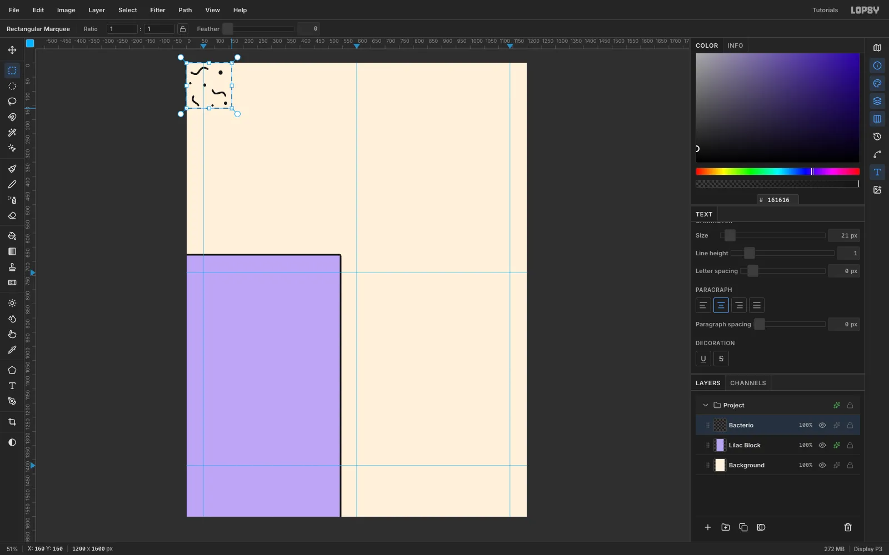

Add a new layer and name it `Bacterio`. Work in the top-left 160 × 160
corner of the canvas:

1. Choose the **Brush**, set **Size** `7`, **Hardness** `100` and ink
   `#161616`.
2. Paint three short squiggles at different angles. Two full S-curves
   about 50–60 px long and one half-wave work well.
3. Add five dots with single clicks of the same brush, changing **Size**
   between `8` and `14` as you go.
4. Press [[Cmd+D]], then select exactly the 160 × 160 tile. With nothing
   selected, a single click (no drag) with the **Rectangular Marquee**
   opens a dialog where you can type **From** `0`, `0` and **To** `160`,
   `160`.

Keep marks away from the edges of the tile so nothing is cut when it
repeats.

## Fill the lilac block with the pattern

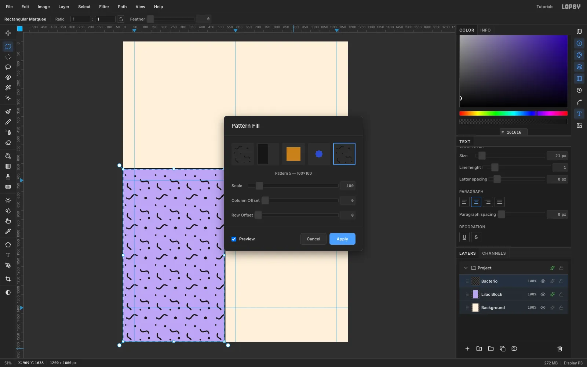

With the tile still selected, choose **Edit → Define Pattern**. Then press
[[Delete]] to clear the tile from the layer, and [[Cmd+D]].

[[Cmd]]-click the `Lilac Block` thumbnail in the Layers panel to select
the block's shape, then click the `Bacterio` row again so the pattern goes
on that layer. Choose **Edit → Fill with Pattern…**, pick the new
160 × 160 pattern and click **Apply**.

The pattern could go straight onto the lilac block, but keeping it on its
own layer above the block lets you trim or recolour the squiggles later
without touching the lilac.

## Add the big Memphis shapes

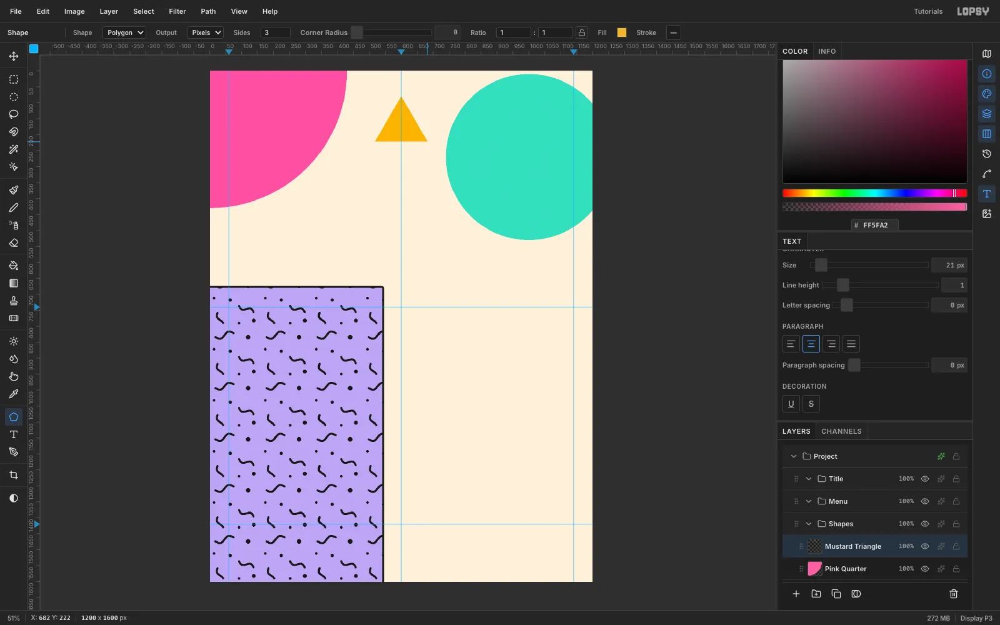

Click `Bacterio` and use **New Group** three times to make `Shapes`,
`Menu` and `Title` groups, with `Title` at the top. Click `Shapes` and add
three layers inside it:

- **Mint Circle:** hold [[Cmd]] while you drag with the **Elliptical
  Marquee** to get a true circle about 520 px across. Start it just below
  the top edge and about 140 px right of the centre guide, so it runs off
  the right edge. Fill it with mint `#6FDCC0`.
- **Pink Quarter:** with the **Lasso**, press at the top-left corner of the
  canvas, drag straight along the top edge to about 430 px, then sweep a
  smooth curve round to about 430 px down the left edge and back up to the
  corner, and let go. Fill it with hot pink
  `#FF5FA2`.
- **Mustard Triangle:** the **Shape** tool with **Polygon**, **Sides** `3`
  and a mustard fill. Shapes draw from the centre out, so start the drag
  near the top of the gap between the pink and mint shapes and pull out
  about 80 px.

Big, flat, overlapping primitives are the heart of Memphis. Don't outline
them; they should read like cut paper.

> **Tip:** A single click with the Shape tool, without dragging, opens a
> size dialog where you can type an exact **Width** and **Height**.

## Add a checkerboard quarter circle

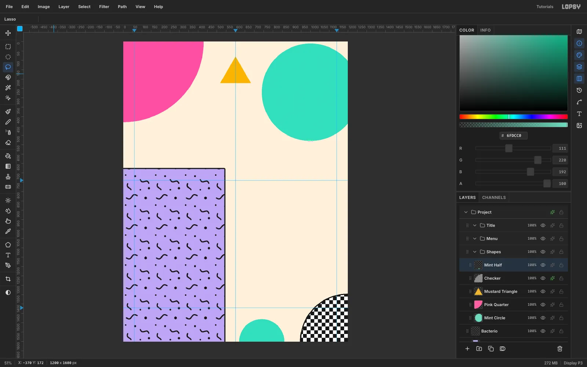

Add a `Checker` layer and build the tile in the top-left corner: fill a
40 × 40 white square, then fill two 20 × 20 ink squares in its top-left and
bottom-right quarters. Select the 40 × 40 square (the click-for-exact-corners
dialog helps again), choose **Define Pattern**, and press [[Delete]] to
clear it.

With the **Lasso**, drag a quarter circle of about 250 px radius into the
bottom-right corner: press at the corner itself, drag up the right edge to
about 250 px, sweep a curve round to about 250 px along the bottom edge, and
let go back at the corner. Choose
**Edit → Fill with Pattern…** with the checker tile, and give the layer
the same 6 px black **Stroke**.

On a `Mint Half` layer, lasso a half circle of about 120 px radius sitting
on the bottom edge, a little right of the centre guide, and fill it mint.

## Set the title

Click the `Title` group and choose the **Text** tool:

1. Choose **Rammetto One**, size **120**, ink `#161616`.
2. Click in the empty canvas and type `WAFFLE`. Press [[Tab]] to commit.
3. Click `Title` again, then click lower down and type `MAMBO`.
4. With the **Move** tool, stack them over the pink quarter circle near
   the top left, with `MAMBO` directly under `WAFFLE` and indented about
   30 px.

Give both layers a **Drop Shadow** in cobalt `#2C4BD1` with **Offset X**
`10`, **Offset Y** `10`, **Blur** `0` and **Opacity** `100`. A hard,
coloured shadow is a classic 80s lift. Finally, drag the mustard triangle
down so its point tucks behind the top of **WAFFLE**, which ties the shapes
to the type.

## Add a tracked tagline

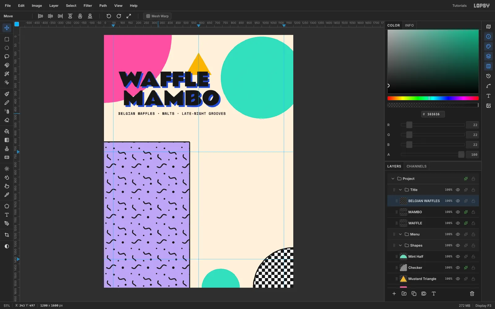

Open the **Text** panel and set **Letter spacing** to `2`. Choose
**Space Mono** Bold at **22** and type
`BELGIAN WAFFLES · MALTS · LATE-NIGHT GROOVES` (paste it if the `·`
characters don't come through). Move it so its left edge lines up with
the left edge of **WAFFLE**, about 40 px under **MAMBO**.

> **Tip:** Turn on **View → Snap to Layers** and the Move tool will catch
> the edge of **WAFFLE** as you drag.

## Build the waffle grid

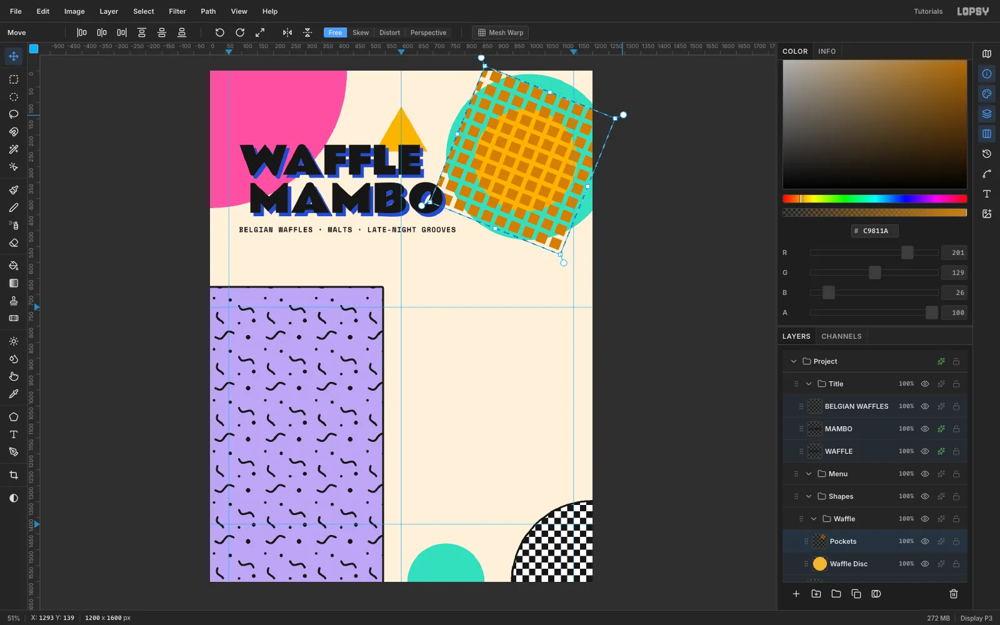

Click `Mint Half` and add a **New Group** called `Waffle`. Inside it:

1. On a `Waffle Disc` layer, [[Cmd]]-drag a 320 px circle centred in the
   mint circle and fill it with mustard.
2. On a `Pockets` layer, make a 46 × 46 tile in the top-left corner: fill
   a 32 × 32 square in toasted brown `#C9811A`, 7 px in from the top and
   left. Select the whole 46 × 46 tile and **Define Pattern**, then press
   [[Delete]] to clear it.
3. Marquee a square well beyond the disc on every side, so the grid still
   covers the disc after it's rotated, and **Fill with Pattern…** with the
   46 px tile.
4. Switch to the **Move** tool, drag the rotation handle outside the
   top-right corner about **22°**, then press [[Cmd+D]] to commit.

Rotating the grid keeps it from looking like graph paper.

## Clip the grid to the waffle

[[Cmd]]-click the `Waffle Disc` thumbnail to select the disc, then click the
`Pockets` row. Clicking the row straight away means the next [[Delete]]
clears only what's selected. Choose **Select → Shrink…** `18` so the
selection sits just inside the disc's edge, choose **Select → Inverse**, and
press [[Delete]].
Deselect, then choose **Layer → Merge Down** to merge the pockets into
`Waffle Disc`.

## Add syrup, butter, blueberries and outlines

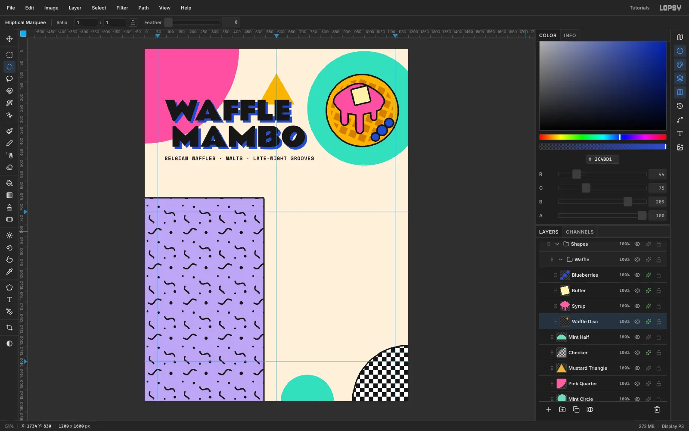

Add three more layers above the disc:

- **Syrup:** lasso a wavy pink blob over the upper half, with three
  finger-shaped drips. Round off each drip with one click of a hard Brush
  as wide as the drip.
- **Butter:** lasso a small square pat, about 68 px across and tilted
  slightly, in pale yellow `#FFF3B0`.
- **Blueberries:** three cobalt circles of 30–40 px in the lower right.

Give all four layers a black **Stroke** of width `7`. One consistent
outline weight makes the illustration read as a single sticker.

## Sprinkle confetti with copy and paste

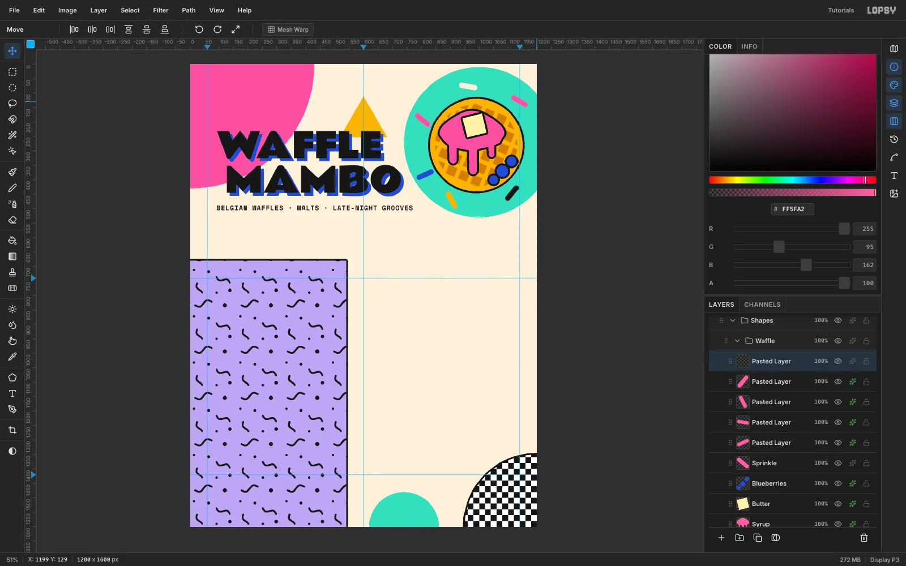

Add a `Sprinkle` layer and paint one pink capsule, 64 × 18. Pick the
**Brush** at **Size** `18`, **Hardness** `100`, click once, then
[[Cmd+Shift]]-click 46 px to the right. The round brush tip gives the
capsule its rounded ends. Marquee it and press [[Cmd+C]]. Then rotate the
original about 40° with the Move tool and press [[Cmd+D]].

For each extra sprinkle:

1. Press [[Cmd+V]]. The copy lands in place on a new layer.
2. Drag it with the **Move** tool to a spot around the waffle, rotate it to
   a new angle with the handle just outside a corner, and press [[Cmd+D]].
3. Recolour it with a **Color Overlay** effect in cobalt, cream, mustard
   or ink.

Five copies around the rim is plenty. Scattered confetti is very Memphis,
but it looks timid if it spreads over the whole page.

## Paint a squiggle and a zigzag

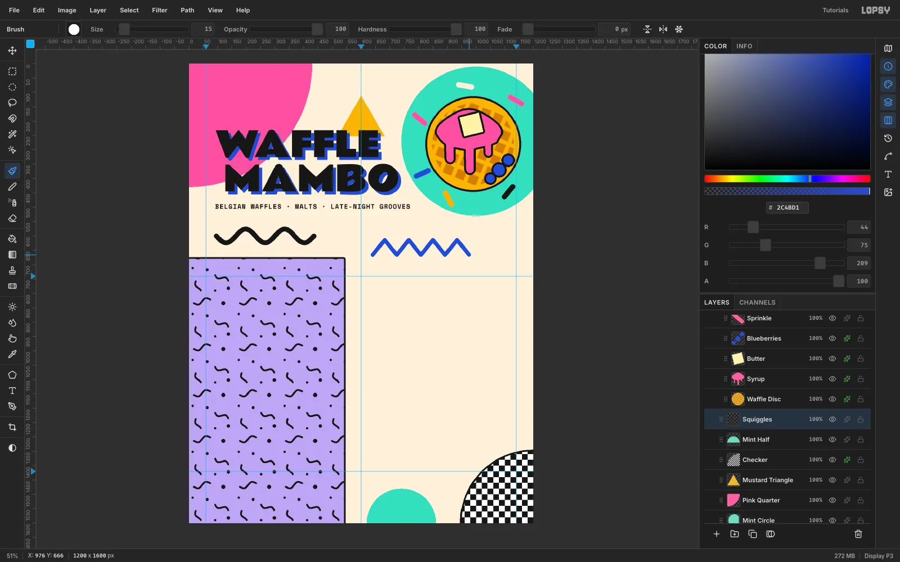

Click `Mint Half`, add a `Squiggles` layer and choose the **Brush** at
**Size** `18`, **Hardness** `100`. Under the tagline, paint one wide black
wave starting at the left margin and running about 340 px across. Move in
small, even steps to keep the wave steady.

Switch to **Size** `15` in cobalt and paint a zigzag of eight segments,
each about 42 px long, starting just right of the centre guide and a
little lower than the wave. Click the first point, then [[Shift]]-click
each corner in turn to get dead-straight segments.

## Make the menu cards

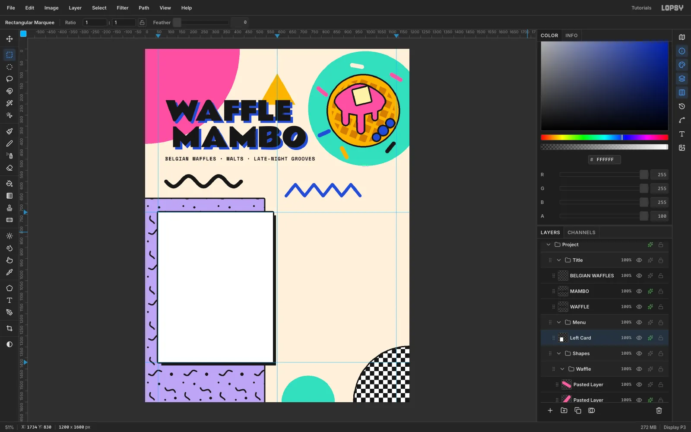

Click the `Menu` group and add a `Left Card` layer. Marquee from the left
margin guide to about 20 px short of the centre guide, with the top and
bottom on your two horizontal guides (a 520 × 680 card), and fill it
white. Give it:

- A black **Stroke** of width `6`.
- A black **Drop Shadow** with **Offset X** `14`, **Offset Y** `14`,
  **Blur** `0` and **Opacity** `100`.

Add `Right Card` the same way, from about 20 px right of the centre guide
to the right margin guide, with the same effects. Matching tops, bottoms
and shadows across both cards is what makes a busy Memphis page still feel
designed.

## Add header bands, a pill and a footer

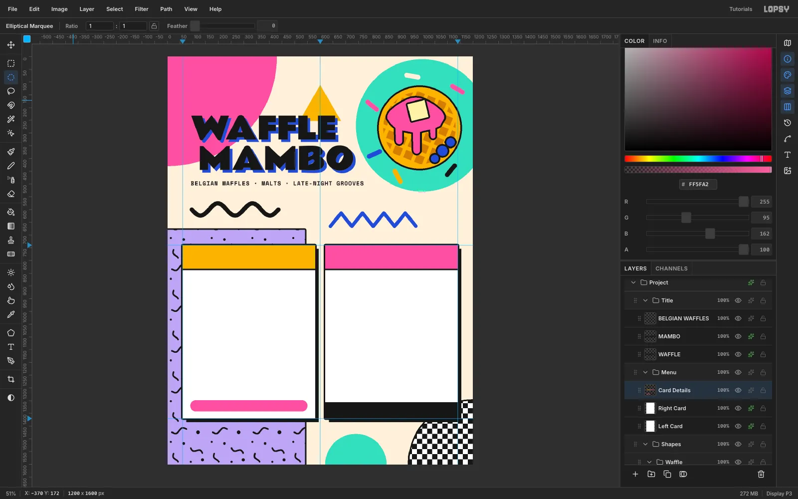

Add a `Card Details` layer and fill:

- A mustard band, 92 px tall, across the top of the left card.
- A pink band, 92 px tall, across the top of the right card.
- A black 64 px footer band along the bottom of the right card.

Then draw the rest with hard brushes:

- A 6 px ink rule under each band: the **Pencil** at **Size** `6`, a click
  at one edge of the card and a [[Cmd+Shift]]-click at the other.
- A 460 × 44 pink pill near the bottom of the left card, 30 px in from
  each side. Use the **Brush** at **Size** `44`, **Hardness** `100`: click
  52 px in from the left edge and [[Cmd+Shift]]-click 52 px in from the
  right.

## Set the menu items with area text

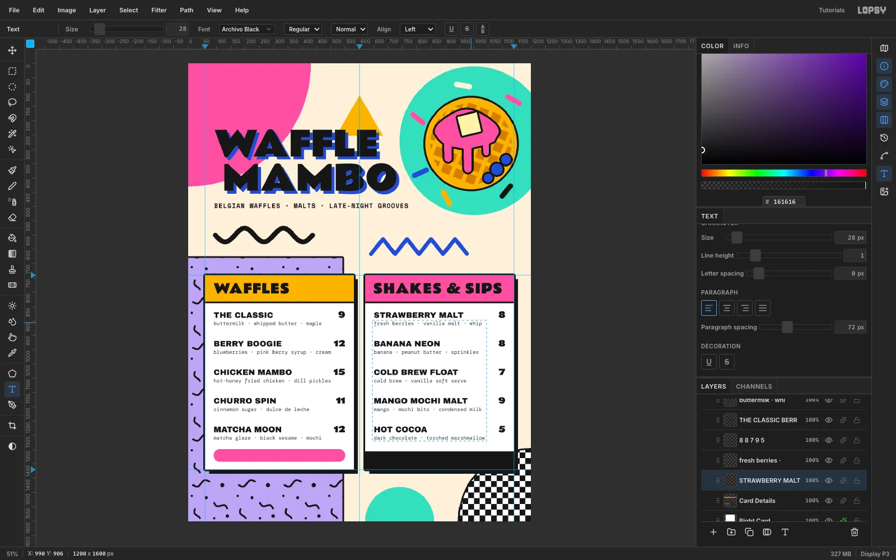

Put **WAFFLES** and **SHAKES & SIPS** in the bands in **Rammetto One**
**46**, 30 px in from the card edge and centred vertically in the band.

For the items, use **area text**: drag a text box instead of clicking.
Each column is one layer, so the rows stay perfectly spaced. In the
**Text** panel, set **Line height** `1`, and use **Paragraph spacing** to
control the gap between items:

- **Prices:** **Rammetto One** `28`, **Align right**, paragraph spacing
  `72`, in a 100 px wide box ending at the card's inner edge.
- **Descriptions:** **DM Mono** `18` in plum `#3A3340`, paragraph spacing
  `82`, starting 36 px below the prices.
- **Names:** **Archivo Black** `28`, paragraph spacing `72`, starting level
  with the prices.

Make them in that order: prices, descriptions, then names. A text click
or drag that lands inside an existing text box edits it instead of
starting a new layer, so start each new box in space that no text covers
yet.

Finish with the footer, `88 SQUIGGLE AVE · OPEN TIL 2AM`, in Space Mono
Bold `20`, cream, centred in the black band. Then add
`ADD-ONS +2 · bacon · nutella · sprinkles` in Space Mono Bold `16`,
centred in the pink pill.

## Make a rotated badge

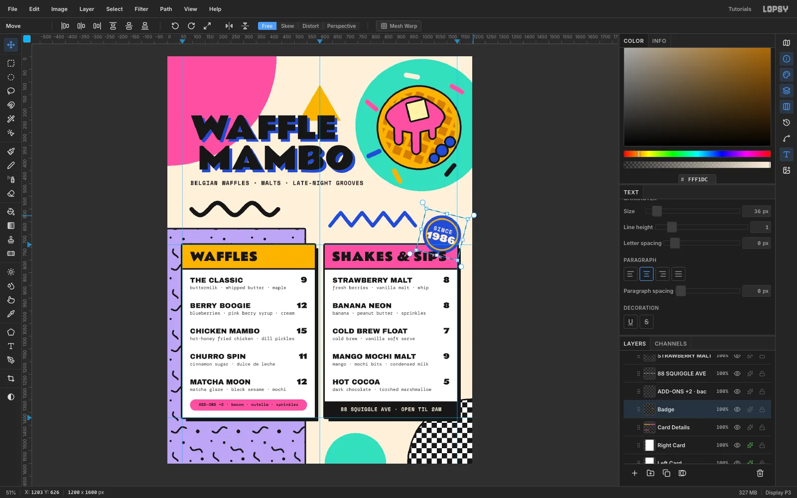

Build the badge above `Card Details`:

1. On a `Badge` layer, fill a 150 px cobalt circle.
2. On a `Badge Ring` layer, fill a 128 px mustard circle centred on it.
   Choose **Select → Shrink…** `5` and press [[Delete]] to leave a ring,
   then **Merge Down**.
3. Type `SINCE` (Space Mono Bold 22, letter spacing 2) and `1986`
   (Rammetto One 36) in cream in empty space. Move them onto the badge,
   **Rasterize** each, and **Merge Down** twice into `Badge`.
4. Marquee the badge, rotate it **14°** with the Move tool, and press
   [[Cmd+D]].

Park it above the top-right corner of the Shakes card, with at least
15 px of clear space above the band.

## Add print grain

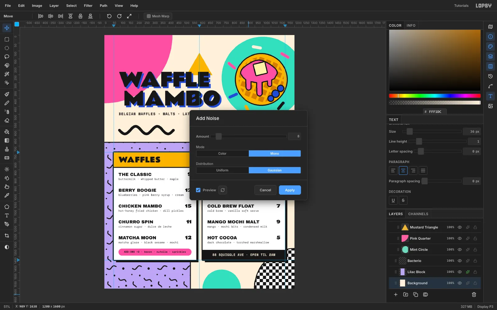

Click the **Background** row and choose **Filter → Add Noise…**. Set
**Amount** `8`, **Mono** and **Gaussian**, and click **Apply**. The grain
is subtle, but it takes the digital flatness off the cream so the menu
feels printed.

## Polish the details

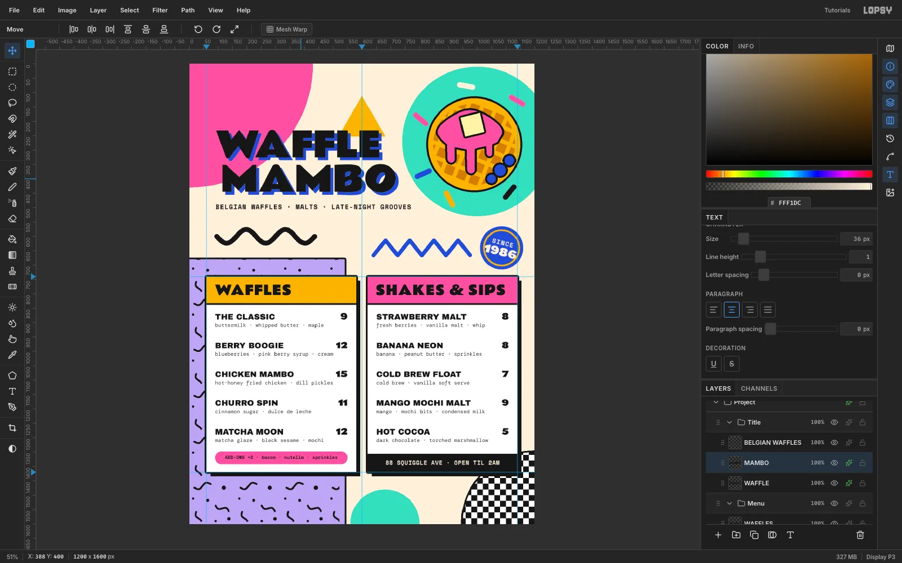

Step back and look for near-misses: things that almost touch read as
mistakes. In this piece that meant four fixes:

- **Badge:** moved up so it clears the Shakes card instead of grazing its
  corner.
- **Bacterio pattern:** on the pattern layer, marqueed a strip from about
  18 px inside the block's right edge to just past it and pressed
  [[Delete]], so no squiggle is sliced by the outline.
- **Mint half circle:** slid 60 px left so it tucks under the card
  shadows.
- **MAMBO:** nudged 12 px left so the **O** clears the mint circle.

> **Tip:** With the **Move** tool, the arrow keys nudge the active layer
> 1 px and [[Shift]]+arrow nudges 10 px, which is handy for exact moves like
> these.

## Export the menu

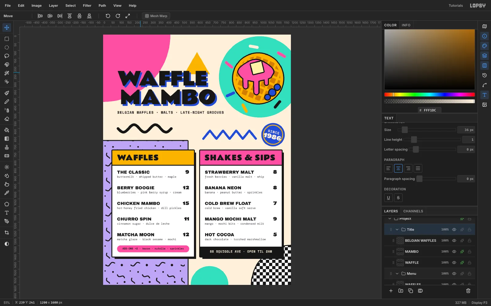

Choose **View → Show Guides** to hide the guides. Use **File → Quick
Export PNG** for the image and **File → Save Project** for an editable
`.lopsy` file with every group and effect intact.

To make your own Memphis piece, keep these rules:

- Flat colours that clash on purpose.
- At least one black-and-white pattern.
- Big geometric primitives that overlap the content.
- One outline weight.
- Hard shadows with zero blur.
