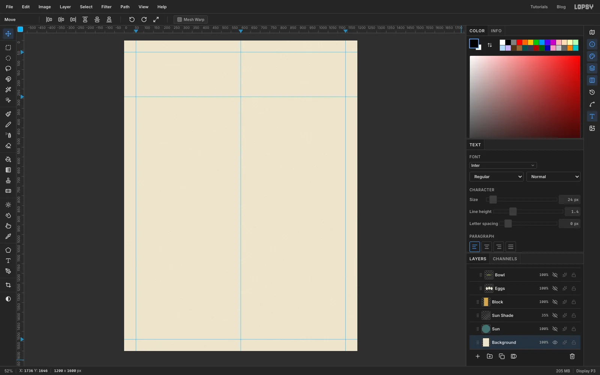
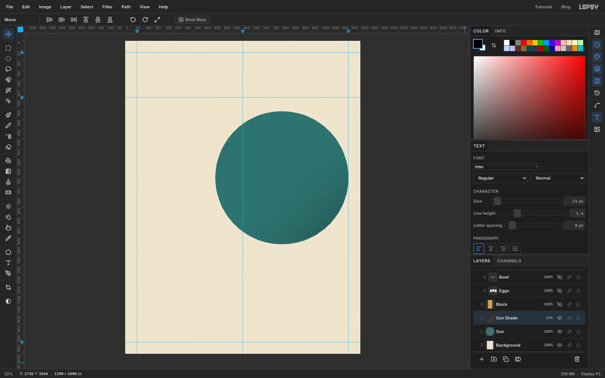
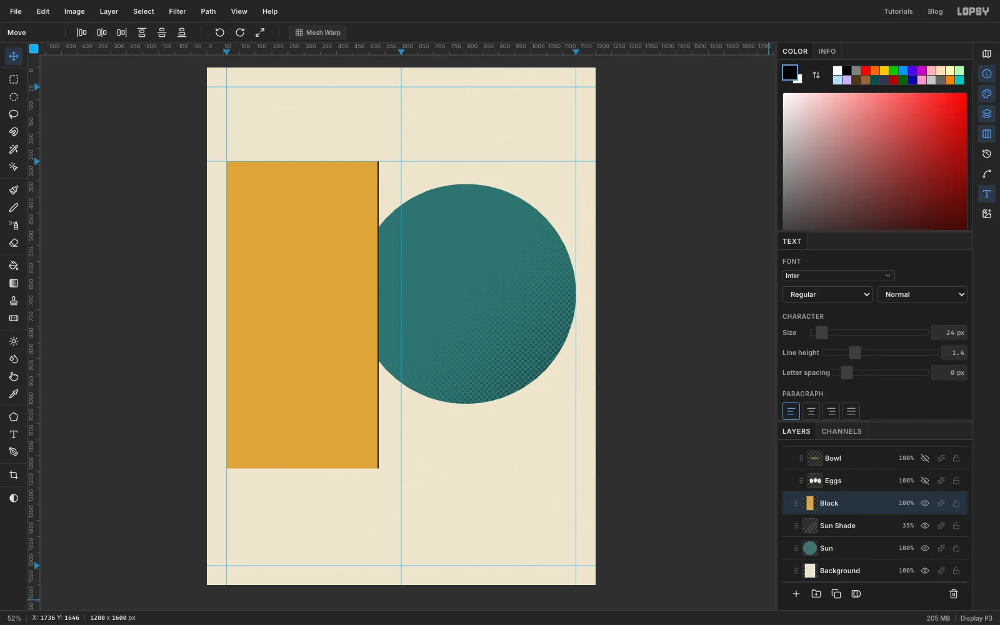
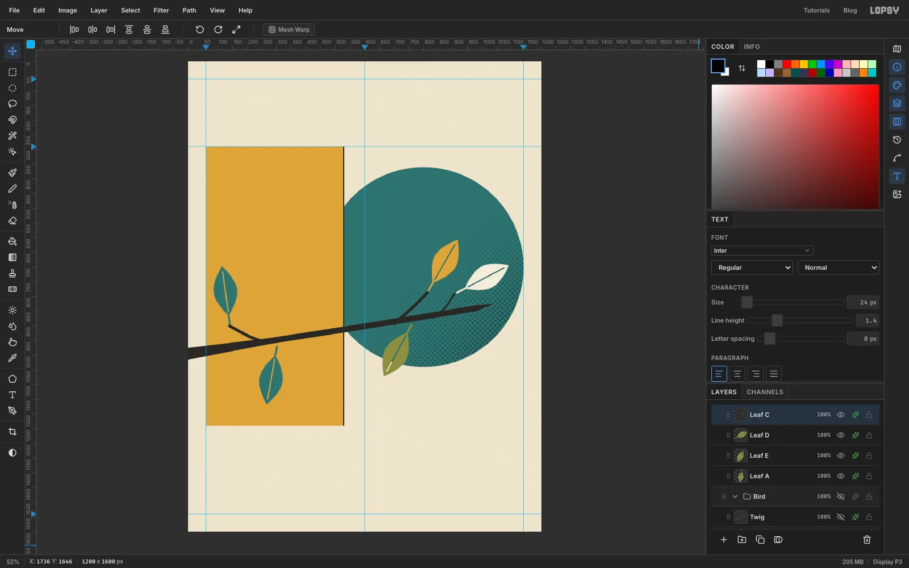
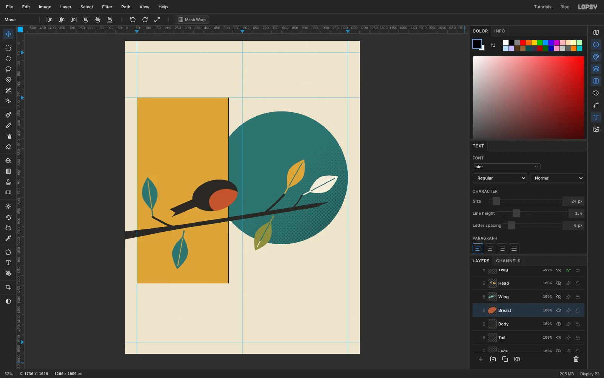
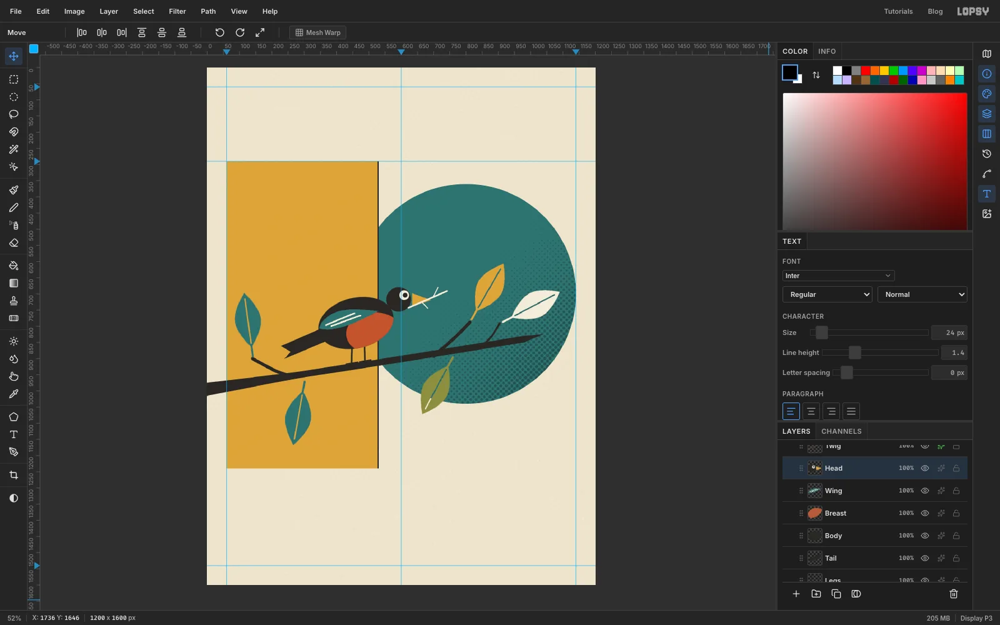
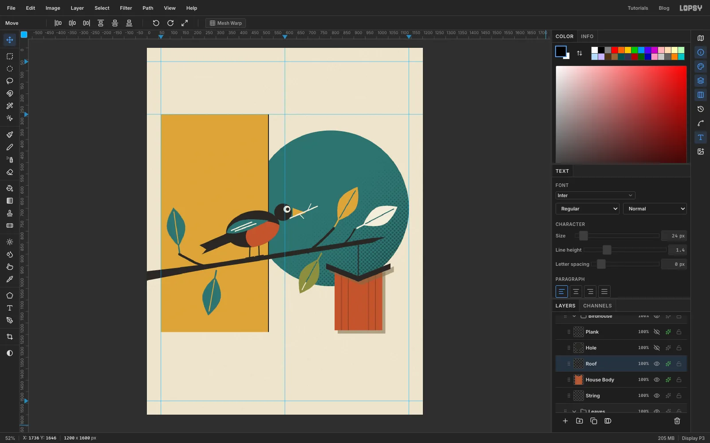
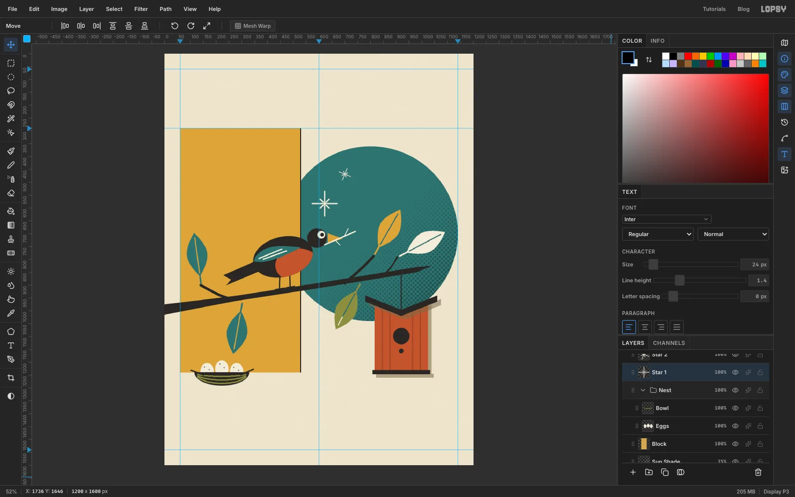
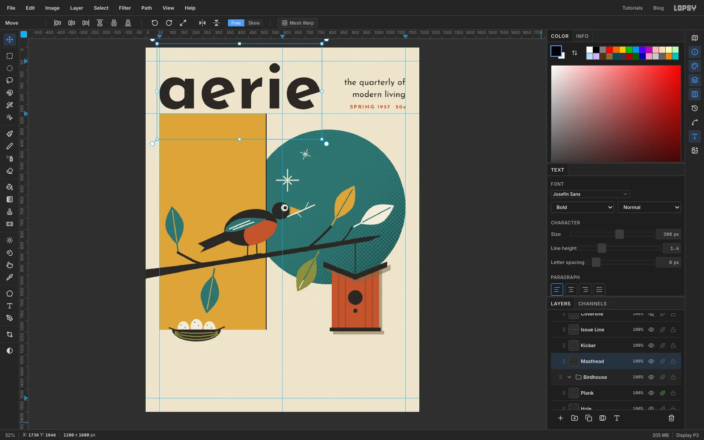
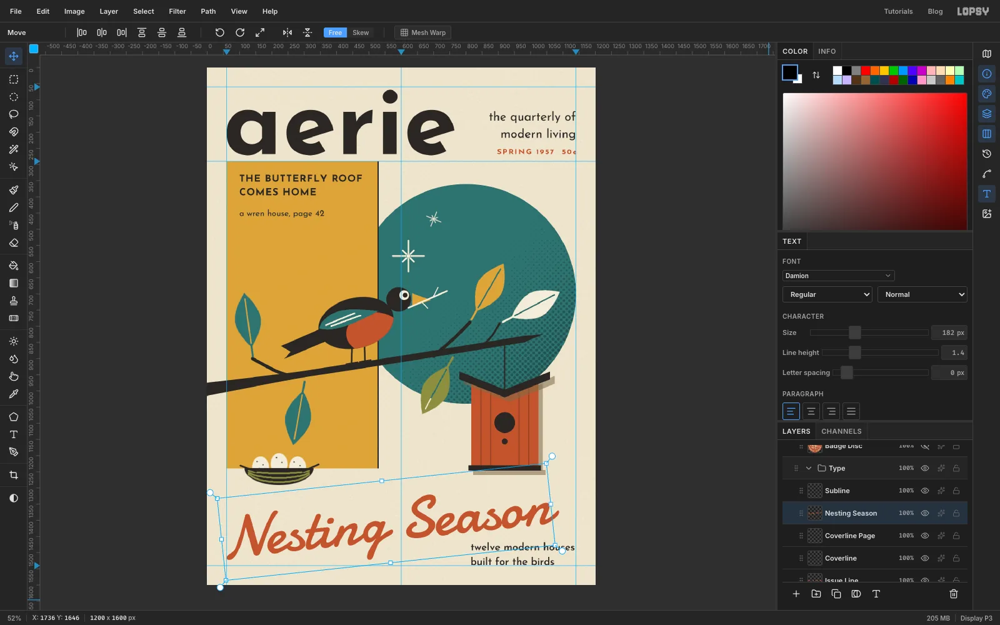

Mid-century magazine covers from the 1950s are full of flat shapes that
overlap, a short list of earthy colours, and type that mixes a heavy
geometric sans with a loose brush script. The wildlife illustrator
**Charley Harper** called his version of the look *minimal realism*: draw a
bird with the fewest circles, triangles and almond shapes that still read
as that bird. This tutorial uses that approach for the spring issue of an
imaginary design quarterly called *aerie*. The cover story is "Nesting
Season", so the cover shows a robin carrying a twig towards a modern
butterfly-roof birdhouse.

Everything is drawn in Lopsy, with no photos. Most shapes are **Lasso**,
**Elliptical Marquee** and **Shape tool** fills. The branch is a **Pen**
path, and the leaves are copied and pasted from one master leaf and turned
with the **Move** tool's rotate handle.

The tools you'll meet along the way:

- **Guides** from the rulers, plus **Show Grid** with snapping
- the **Shape** tool's ellipse, with both a fill and a stroke-only ring
- the **Gradient** tool and **Filter → Halftone** for printed shading
- the **Pen** tool and Enter to stroke a path
- **Lasso**, **Elliptical Marquee**, **Select → Inverse** and [[Alt]]-drag to subtract from a selection
- the **Brush**, **Pencil** and **Eraser**, with [[Shift]]-click straight lines
- **Copy** and **Paste**, the rotate handle and [[Cmd]]-drag scaling
- layer effects: **Color Overlay** and **Drop Shadow**
- **Josefin Sans** and **Damion** text, rotated while it is still live
- layer **groups**, **Merge Down**, blend modes, and **undo / redo**

The palette is warm paper, charcoal ink and five flat inks:

- Paper `#ECE4CE`, ink `#2A2724`
- Teal `#417270`
- Mustard `#D4A64D`
- Burnt orange `#B65A37`, siding `#914A2D`
- Olive `#8D8F4A`, cream `#F2ECDB`
- Shadow tan `#7A6A4A`

## Start with paper and guides

Choose **File → New**, keep the units on **Pixels**, type **1200** by
**1600** and click **Create**. Click the *Background* row, set the
foreground colour to paper `#ECE4CE` and choose **Edit → Fill**. Then open
**Filter → Add Noise**, pick **Mono** and **Gaussian**, set **Amount** to
22 and click **Apply**. You get a fine, even grain, like uncoated paper.

Now add guides. Click the top ruler at **60**, **600** and **1140** to drop
vertical guides, then click the left ruler at **60**, **290** and **1540**.
The outer four guides are the page margins. The one at 290 is where the
artwork starts under the masthead.

## Draw the teal sun

Rename *Layer 1* to *Sun*. Pick the **Shape** tool and set **Shape** to
**Ellipse** and **Output** to **Pixels**. Click the fill swatch in the
options bar and type `417270`.

The Shape tool grows from the point you press. Press about two-thirds of the
way across the page and a little above the middle, at roughly 800, 700.
Hold [[Cmd]] (or [[Ctrl]]) to keep it a perfect circle, and drag outwards
until the circle touches the right margin guide. It should be about 680 px
across.

## Shade it with halftone dots

Add a layer called *Sun Shade* just above *Sun*. [[Cmd]]-click the *Sun*
thumbnail to select the circle. Set the foreground to black and the
background to white, choose the **Gradient** tool (Linear), and drag from
the lower-right edge of the circle in towards its centre.

Keep the selection and choose **Filter → Halftone**. Set **Dot Size** to
12, **Angle** to 45 and **Softness** to 0.6, then apply. Deselect with
[[Cmd]]+[[D]]. Open the effects drawer, set this layer's **Blend** to
**Multiply** and drop its opacity to **35%**. The white disappears, and the
black dots turn into a dark teal screen on the shadow side of the sun.

## Add the mustard panel

Add a layer called *Block* above *Sun Shade*. Take the **Rectangular
Marquee** and drag from the point where the left margin meets the 290 guide.
Both edges snap to the guides. Drag down and right to about **x 530,
y 1240**, so the panel covers the left edge of the sun but stops well short
of the centre line. Fill it with mustard `#D4A64D` and deselect.

Overlapping flat shapes are what make this style work. The panel sits in
front of the sun, so its straight right edge cuts the circle into a crisp
chord. To make the cut look deliberate, pick the **Pencil** at **3 px** in
ink `#2A2724`. Click the top of the panel's right edge, then
[[Shift]]-click the bottom to draw a thin keyline down it.

## Draw the branch with the Pen tool

Add a layer called *Branch* and set the foreground to ink. Pick the **Pen**
tool and set **Stroke** to 20.

1. Click once over the right side of the sun, at about 990, 838, for the tip of the branch.
2. Press near the centre line, at roughly 620, 900, and drag a little down and to the left before releasing. This pulls out handles, so the branch bends gently.
3. Click on the grey pasteboard just past the left edge of the page, a little lower again.
4. Press [[Enter]]. Lopsy saves the path to the **Paths** panel and strokes it onto the layer.

Make the twigs the same way with a **Stroke** of 10. Start one from the
branch just right of the centre line and curve it up and to the right. Start
another from near the left end and send it up to the left. Then make one
more at **Stroke** 6, rising from the branch near the right-hand end. Press
[[Enter]] after each twig.

The stroke is the same width all the way along, and real branches aren't.
To thicken the base, use the **Lasso** to draw a long thin wedge. Make it
about 40 px tall at the left edge of the page and narrowing to a point just
right of the centre line, then fill it with ink. To sharpen the tip, marquee
the rounded end and press [[Delete]], then lasso a small triangle that
continues the branch's top and bottom edges to a point, and fill that too.

## Cut one leaf, and keep a copy

Click the *Branch* row and use the **New Group** button to make a group
called *Leaves*, then add a layer inside it called *Leaf A*. Draw the master
leaf in an empty part of the page. With the **Lasso**, draw an almond shape
about 170 px long and 80 px wide, lying flat, that comes to a point at the
left and right ends. Fill it with olive `#8D8F4A`.

Pick the **Brush** at **7 px** and add a short stem: click at the left-hand
point of the leaf, then [[Shift]]-click about 35 px further left. For the vein, take
the **Eraser** at **4 px**. Click just inside the stem end and
[[Shift]]-click near the far tip, so a thin line is cut through the middle
and the colour behind shows through.

Before you move it, drag a marquee around the leaf and press [[Cmd]]+[[C]].
You'll paste copies of it in the next step.

Now place it. With the marquee still round the leaf, switch to the **Move**
tool and drag the round rotate handle about 100° clockwise, so the stem is
at the top and the leaf hangs almost straight down. Press [[Cmd]]+[[D]] to commit, then drag it so the top of
the stem touches the underside of the branch on the mustard panel. Finally,
open the effects drawer and turn on **Color Overlay** in teal `#417270`.

## Paste, turn and recolour the other leaves

Press [[Cmd]]+[[V]]. The copy lands on a new layer in the same spot as the
original. Rename it, then turn it with the Move tool's rotate handle while
it is still in the open, and only then drag it to its twig. Turning it in
open space keeps it away from the edges of the page. Repeat for each leaf:

- *Leaf B* points straight up from the tip of the left-hand twig. Give it a teal Color Overlay.
- *Leaf C* points up and to the right from the tip of the tallest twig over the sun. Make it mustard.
- *Leaf D* points right from the end of the short twig. Make it cream `#F2ECDB`.
- *Leaf E* hangs down and to the left from under the branch, over the bottom of the sun. Leave it olive.

The erased veins let the background show through each leaf, so a teal leaf
on mustard and a cream leaf on teal both keep their centre line.

> **Tip:** if a leaf lands badly, [[Cmd]]+[[Z]] steps back through the
> paste, the turn and the move one at a time, and [[Cmd]]+[[Shift]]+[[Z]]
> steps forward again.

## Build the robin from simple shapes

Click the *Branch* row and make another group called *Bird*. Work from the
back of the bird to the front, with each part on its own layer inside the
group, all in ink unless stated:

- **Tail:** with the Lasso, draw a long wedge pointing down and left from where the body will be. Give it a notch cut into the end.
- **Body:** use the **Elliptical Marquee** to draw an oval about 236 × 156 px above the branch, just left of the panel's edge, and fill it. Then marquee around it, switch to the **Move** tool and turn it about 14° anticlockwise with the rotate handle, so the chest lifts. Commit with [[Cmd]]+[[D]].
- **Breast:** on a new layer, draw a smaller oval over the lower front of the body and fill it with burnt orange `#B65A37`. It will spill outside the body. To trim it, [[Cmd]]-click the *Body* thumbnail, choose **Select → Inverse** and press [[Delete]]. Only the part inside the body is left.

## Add the wing, head, beak and twig

- **Wing:** lasso a teardrop in teal along the top of the back, with the point towards the tail. Pick the **Pencil** at **4 px** in cream and add two feather lines along it with [[Shift]]-click.
- **Head:** pick the **Shape** tool's ellipse and set its fill swatch to ink `2A2724`, because it still holds the teal from the sun. With [[Cmd]] held, drag a circle about 76 px across that overlaps the front of the body, over the teal. Switch the swatch to cream `F2ECDB` for an eye about 30 px across, then back to ink for a small pupil just forward of its centre.
- **Beak:** lasso a mustard triangle that points right from the front of the head.
- **Twig:** on a *Twig* layer above the head, use the **Brush** at **6 px** to [[Shift]]-click a line running through the beak, then add two short forks at **4 px**. Paint it in cream `#F2ECDB`; a brown twig disappears against the teal.
- **Legs:** on a *Legs* layer, drag its row below *Tail* so the legs sit behind the body. Brush two 6 px legs down to the branch, and a 5 px line along the branch for each foot.

Click the *Bird* group row, choose the **Move** tool and drag on the canvas
to place the whole bird at once. Drag it right until the head and beak sit
clear of the panel, on the teal. The branch rises to the right, so move the
bird up a few pixels as you go to keep the feet on the bark.

## Hang a butterfly-roof birdhouse

Click the *Project* row at the top of the Layers panel and make a group
called *Birdhouse*, so it sits above everything you've drawn so far.

1. **String:** use the **Pencil** at **4 px** in ink. Click on the branch above the right-hand third of the page, then [[Shift]]-click straight down about 150 px.
2. **House Body:** lasso a box about 208 px wide and 270 px tall whose top dips into a shallow V, like the roof that will sit on it. Fill it with burnt orange.
3. **Siding:** pick the **Pencil** at **4 px** in siding `#914A2D` and [[Shift]]-click four vertical board lines, two on each side of the centre.
4. **Roof:** on a *Roof* layer, lasso a V-shaped slab about 24 px thick that is wider than the house. Make the low point of the V meet the bottom of the string, then fill it with ink. That's a butterfly roof, the most mid-century roof there is.

## Add the entrance, perch and plank

On a *Hole* layer, use the **Shape** tool's ellipse in ink to draw a circle
about 64 px across for the entrance and an 18 px dot below it for the
perch.

For the plank, choose **View → Show Grid**, which also turns on **Snap to
Grid**. On a *Plank* layer, marquee a strip about 16 px tall that's a little
wider than the house under its base. The corners snap to the grid, so the
plank comes out square. Fill it with ink, then turn the grid off again.

Give *House Body*, *Roof* and *Plank* the same **Drop Shadow**: **Offset X**
and **Offset Y** 14, **Blur** 1, **Opacity** 55 and colour `#7A6A4A`. A
blur of 1 keeps the edge hard, like an offset printed shadow. Selecting a
group opens its adjustments rather than layer effects, so set the shadow on
each layer.

## Tuck a nest into the corner

Click the *Block* row and make a group called *Nest*.

- **Eggs:** draw three upright ovals about 40 × 52 px side by side with the Elliptical Marquee, filling each one with cream. Then add a few ink speckles with 4 px **Brush** clicks.
- **Bowl:** on a *Bowl* layer above the eggs, use the **Elliptical Marquee** to draw a wider oval, about 164 × 80 px, centred on the bottom of the eggs. Switch to the **Rectangular Marquee**, hold [[Alt]] and drag a rectangle across the oval's top half to subtract it. That leaves a bowl shape; fill it with ink. While the selection is still active, drag three curved 5 px **Brush** strokes in olive across the bowl. The selection keeps them inside it. Switch the foreground back to ink, deselect, and [[Shift]]-click two short twig ends poking out of the rim.

Click the *Nest* group row, choose the **Move** tool and [[Cmd]]-drag the
bottom-right corner handle out to make the nest about 30% bigger, then
press [[Cmd]]+[[D]]. Place it so the bowl crosses the panel's bottom edge.

## Sprinkle atomic starbursts

Add a layer called *Star 1* above *Block*. Pick the **Brush** at **6 px**
in cream. Starting a little out from a centre point, [[Shift]]-click eight
rays: four long ones (about 48 px) straight up, down, left and right, and
four short ones (about 26 px) on the diagonals. Then click once in the
middle with a **12 px** brush.

Marquee it, copy and paste to make *Star 2*. With a marquee round the copy,
switch to the **Move** tool, [[Cmd]]-drag a corner handle to shrink it to
half size and commit, then turn it about 22°. Put the big star on the teal
just above the robin's head, on the centre line, and the small one near the
top of the sun.

## Set the masthead

Click the *Project* row and make a group called *Type*. Pick the **Text**
tool and choose **Josefin Sans**, **Bold**, at **300** px in ink. Click in
the space at the top and type `aerie`. With the **Move** tool, line its left
edge up with the left margin guide, and leave about a 20 px gap between the
bottom of the letters and the top of the mustard panel.

For the kicker, switch the Text tool to **Regular** at **38**, set
**Align** to **Right**, click in empty space and type `the quarterly of`,
press [[Enter]] and type `modern living`. Move it so its right edge sits on
the 1140 guide and its tallest letters line up with the tops of the short
letters in *aerie*.

Below it, set **Bold** at **24**, burnt orange, with **Letter spacing** 3
in the **Text** panel, right-aligned, and type `SPRING 1957`, two spaces,
then `50¢` (on a Mac the ¢ sign is [[Alt]]+[[4]]). Its baseline should line
up with the masthead's.

> **Tip:** click in clear space each time you start a new text layer. A
> click inside another text layer's box edits that layer instead.

## Add the coverline

Set the Text tool back to **Align Left**, **Bold** at **30**, letter
spacing **2**, in ink. Type `THE BUTTERFLY ROOF`, press [[Enter]], and type
`COMES HOME`. Move it so it sits 40 px in from both the left and top edges
of the mustard panel.

About 40 px below it, at **Regular** 26 with letter spacing 0, type
`a wren house, page 42`.

## Set the cover story in a brush script

Choose **Damion** at **182** px in burnt orange, set letter spacing to 0 and
type `Nesting Season` in the empty band below the birdhouse. Tracking pulls
script letters apart, so keep it at zero.

With the **Move** tool and nothing selected, drag the rotate handle a
little anticlockwise, about 6°, and press [[Cmd]]+[[D]]. The text stays
live, so you can still change its font or size. Move it so the *N* starts
on the left margin and the tail of the *g* finishes about 20 px above the
bottom guide.

For the subline, use **Josefin Sans SemiBold** at **32** in ink. Type
`twelve modern houses`, press [[Enter]], and type `built for the birds`.
Line its left edge up with the left side of the birdhouse, keep it about
40 px below the end of *Season*, and rest its bottom on the bottom guide.

## Stamp on a badge

Click *Project*, make a group called *Badge*, and add a layer called
*Badge Disc*. With the **Shape** tool's ellipse and [[Cmd]] held, draw a
burnt orange circle about 152 px across. For the inner ring, click
**Add stroke color**, type `F2ECDB` and set **Width** to 3. Then click the
fill swatch and choose **Remove fill**. Draw a second circle about 128 px
across from the same centre.

Pick the Text tool with **Align Center**, **Josefin Sans Bold** at **22** in
cream, and type `THE`, `GARDEN` and `ISSUE` on three lines. Set **Letter
spacing** to 2 and **Line height** to 1.15, then centre the text in the
disc. Click the **Rasterize Layer** button at the bottom of the Layers panel
(it appears while a text layer is selected), then choose **Layer → Merge
Down** to merge the text into the disc.

Marquee the badge and turn it about 12° clockwise with the Move tool's
handle, then commit. Move it so its right edge sits on the 1140 guide and
it clearly overlaps the top-right of the sun, by about 30 px. A badge that
only just touches the sun looks like a mistake.

## Finish with grain

Click *Project* and add a layer called *Grain* at the very top. Fill it
with mid grey `#808080`, then run **Filter → Add Noise** at **60**, with
**Mono** and **Gaussian**. In the effects drawer set its **Blend** to
**Soft Light**. The grey disappears, and only a fine grain is left over the
flat inks.

Save the project with **File → Save Project**, and export the cover with
**File → Quick Export PNG**.
