This tutorial builds an editorial cover for a fictional science monthly, *HELIOS*. The cover story is "Yellow Dwarf", about our Sun, told in a **liquid-metal** style. Everything is made in Lopsy with no photos:

- The sun is a Clouds texture folded into chrome bands with Solarize, tinted gold with a **Hard Light** layer, then swirled and melted with **Liquify**.
- The type uses a Didone masthead, an Anton headline with a chrome gradient and three drips, and a column of condensed cover lines.

The document is **1275 × 1650 px**, US Letter at 150 dpi.

## Paint a night-sky background with a sunburst

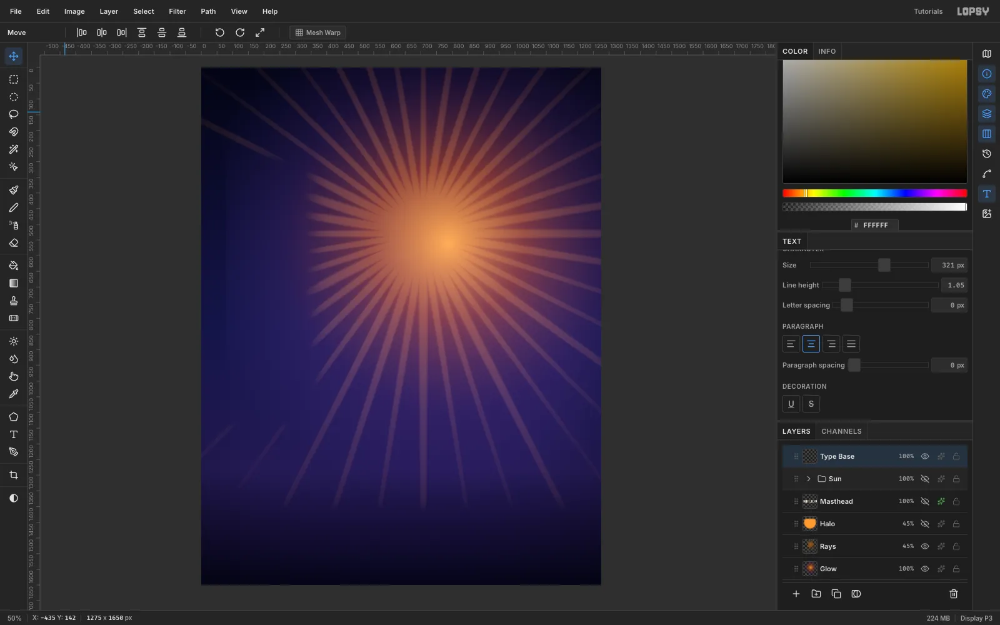

1. Create a **1275 × 1650** document and select the **Background** layer.
2. Pick the **Gradient** tool with **Type** set to **Linear**. Click **Advanced…** and set four stops:
   - `#04051A`
   - `#17164A` at 50%
   - `#231A52` at 78%
   - `#06051A` at 100%
3. Drag from the top edge to the bottom edge. Hold [[Cmd]] while you drag to keep it perfectly vertical.
4. Click **Add Layer** and name it **Glow**. Set **Type** to **Radial**, with stops fading from orange `#F0A030` to fully transparent indigo. Drag from where the sun will sit, a little right of centre and about a third of the way down, outward about 820 px. Set the layer to **Screen** in its **✦** effects drawer.
5. Add a **Rays** layer. Set the foreground to `#8A5418`, then choose **Filter → Sunburst…** with these settings:
   - **Rays** 40, **Width** 22, **Taper** 70, **Fade** 85, **Softness** 40
   - **Center X** 55.5, **Center Y** 32.1
   - **Jitter** 35
6. Set the Rays layer to **Screen** at 45% opacity.

Small type will sit down the left side and along the bottom, so clear the rays there. Marquee a column down the left side and a band across the bottom. For each, choose **Select → Feather…** (60–70 px) and press [[Delete]], then deselect. That keeps the rays from buzzing behind the cover lines.

## Fold clouds into metal bands

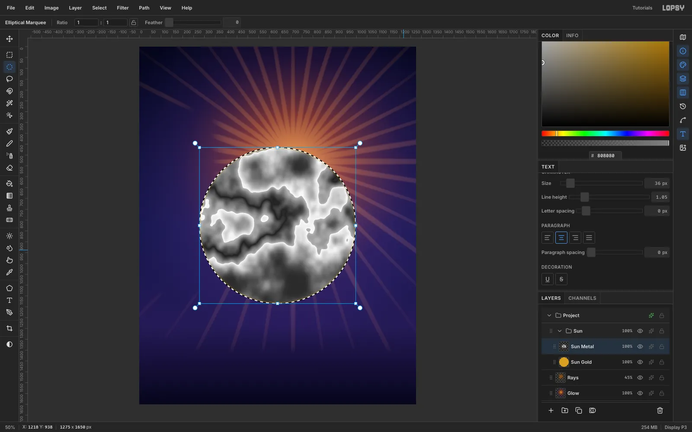

1. Click **New Group**, name it **Sun**, and add a **Sun Gold** layer inside it.
2. With the **Elliptical Marquee**, hold [[Cmd]] and drag a circle about 720 px across (a little over half the page width) in the middle of the canvas. Fill it with `#D9A020` (**Edit → Fill**).
3. Add a **Sun Metal** layer above it and fill the same circle with mid-grey `#808080`. Keep the selection active and run these filters in order:
   - **Filter → Clouds…** (**Scale** 3), then **Gaussian Blur…** (**Radius** 14).
   - If the result looks mostly dark, run **Invert**.
   - **Solarize…** (**Threshold** 128), then **Brightness/Contrast…** with **Brightness** +45 and **Contrast** +75.
   - **Solarize…** (**Threshold** 150), then **Brightness/Contrast…** with **Brightness** +35 and **Contrast** +60.

Each Solarize folds the bright half of the tones back down. Two passes turn soft clouds into the looping bands you see on liquid chrome.

> **Tip:** To place the circle exactly, deselect and click once with the Elliptical Marquee without dragging. Enter `278, 465` to `998, 1185`. You'll move the whole sun into position later, so the middle of the canvas is fine for now.

> **Tip:** Clouds is random every time. If one big region comes out flat, undo back to the grey fill and run the chain again. You want the tones spread evenly from black to white.

## Tint the folds gold with Hard Light

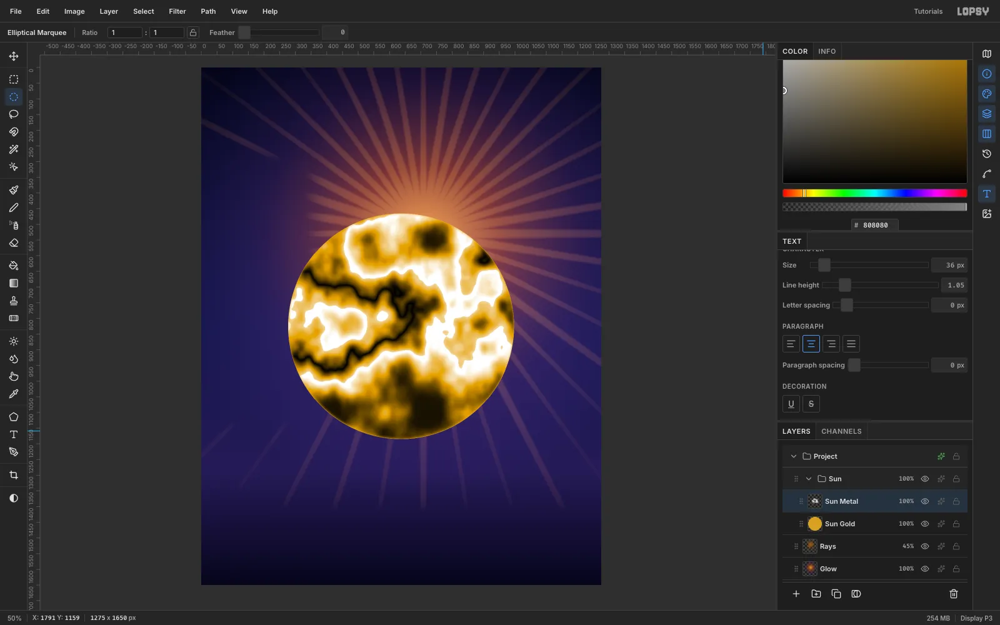

1. Still on **Sun Metal**, run **Gaussian Blur…** (**Radius** 2) and **Brightness/Contrast…** with **Contrast** +35 for crisper bands.
2. Set **Sun Metal** to the **Hard Light** blend mode. The grey bands now darken and lighten the gold disc underneath, giving near-black troughs and near-white crests.
3. With **Sun Metal** selected, choose **Layer → Merge Down** to bake it into the gold. Rename the result **Sun Core**.
4. Run **Filter → Surface Blur…** (**Radius** 8, **Threshold** 35) to smooth the mottling.
5. Run **Filter → Lens Distortion…** (**Strength** 65) to bulge the bands toward the centre.

## Swirl the metal with Liquify

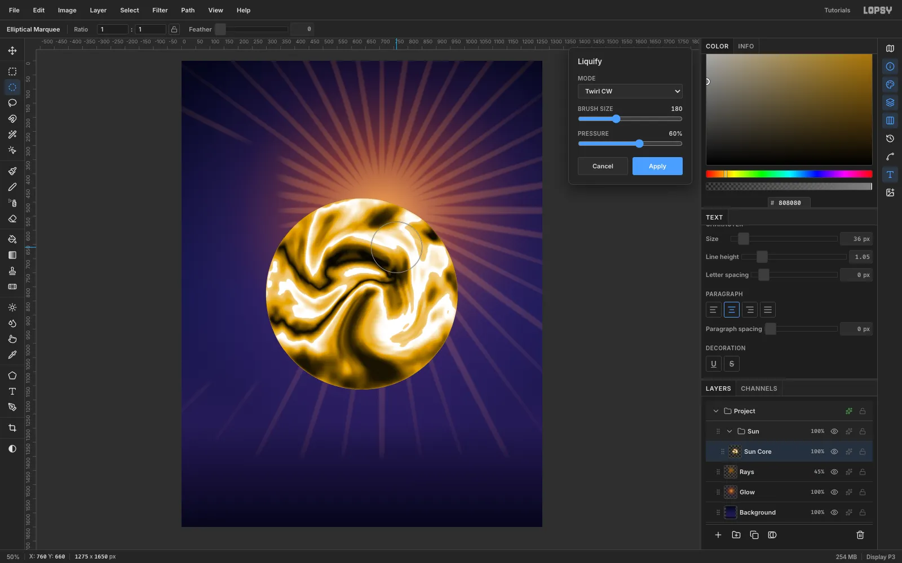

Choose **Filter → Liquify…**:

1. Set **Mode** to **Twirl CW**, **Brush Size** to 260 and **Pressure** to 60%. Circle the mouse twice in small loops left of centre.
2. Switch to **Twirl CCW** with **Brush Size** 240 and loop twice below and to the right of centre.
3. Add one smaller clockwise twirl (**Brush Size** 180) near the top.

Keep the twirl centres well inside the disc. A twirl that reaches the edge drags the silhouette into a dented blob.

## Pull drips with Liquify Push

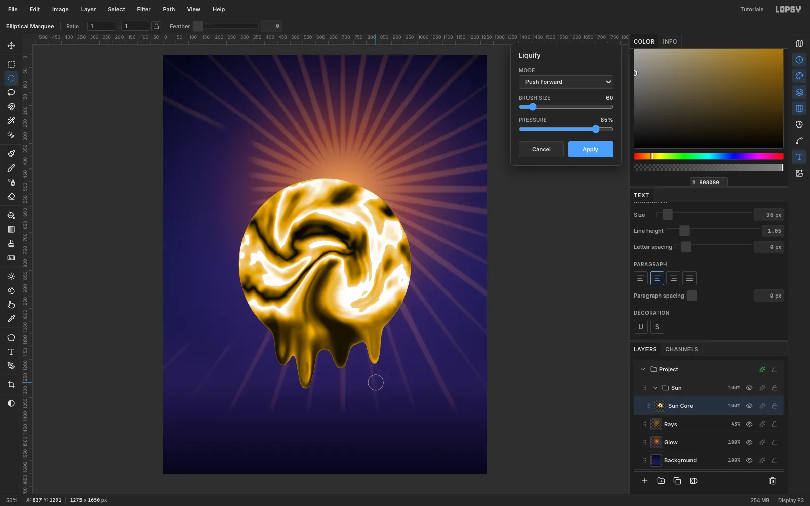

Stay in Liquify and switch **Mode** to **Push Forward** with **Pressure** at 85%. For each drip, start just inside the bottom edge of the sphere and drag straight down about 110 px. Repeat, starting each pass a little lower (about a third of the way down the last one), so the drip keeps growing.

Give the four drips different lengths (2–5 passes) and brush sizes (60–80) so they don't look stamped. Click **Apply**.

## Shade the sphere and add window highlights

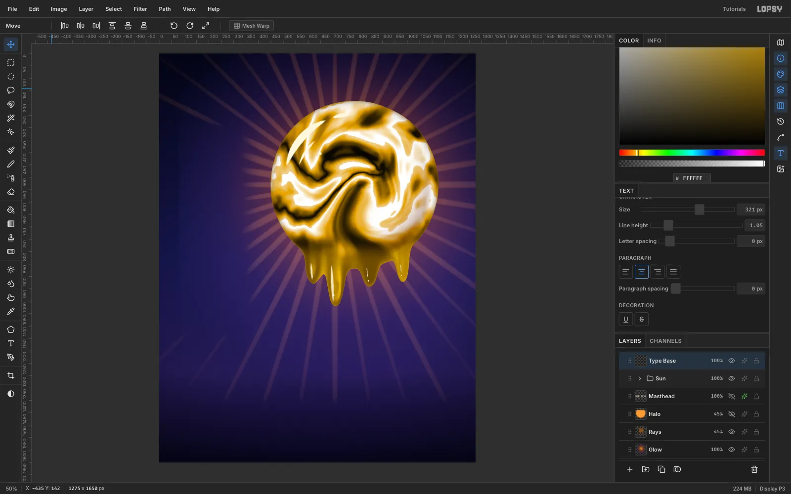

Add these layers inside the Sun group, above **Sun Core**:

- **Sun Shade**
  1. [[Cmd]]-click the Sun Core thumbnail to load its shape, then click the **Sun Shade** row so the selection belongs to the new layer.
  2. Drag a radial gradient from the upper left of the ball. It stays clear to about 60%, then goes brown and dark at the rim.
  3. Remove the shading from the drips: with the **Elliptical Marquee**, select a circle slightly smaller than the ball, choose **Select → Inverse**, **Feather** 30 and press [[Delete]].
  4. Set the layer to **Multiply**.
- **Sun Spec**
  1. Lasso thin crescent bands that follow the curve of the sphere at the upper left.
  2. **Feather** each one 2 px and fill it with `#FFF8E0`.
  3. Add one small dot highlight.

  Curved window reflections sell a sphere far better than a blurry oval.
- **Drip Light**
  1. [[Cmd]]-click the Sun Core thumbnail, click the **Drip Light** row, and fill the shape with `#E0A030`.
  2. Marquee everything above the drips, **Feather** it 45 px, and press [[Delete]], so only the drips stay filled.
  3. Set the layer to **Screen** at 40% so the drips match the bright ball.
- **Drip Glints**: lasso tapered vertical streaks down each drip, one bright and the rest thinner, plus a tiny hard white glint near each drip's bulb.

Finally, give Sun Core a dark **Inner Glow** (`#3A2200`, **Size** 40, **Opacity** 70) to deepen the edge.

## Tuck the sun in front of the masthead

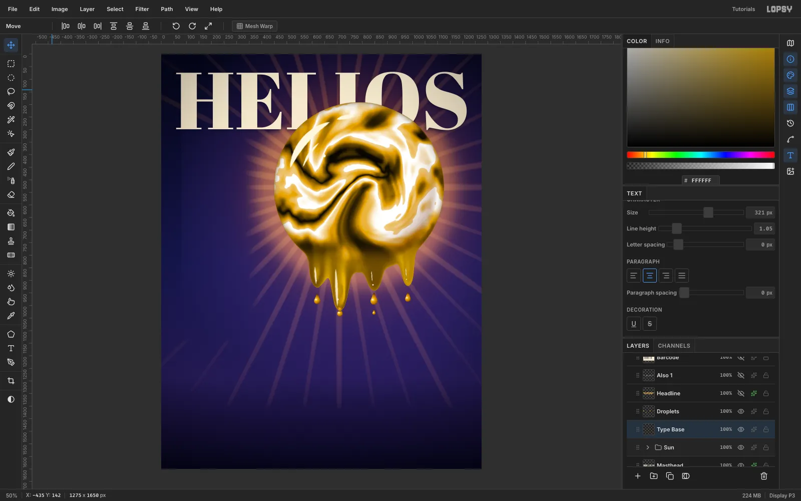

> **Tip:** Drop margin guides first: click the top ruler about 60 px in from each side. The masthead, the cover lines, the badge and the folio all line up on them.

1. Click a layer *below* the Sun group, such as **Rays**, so the masthead lands underneath the sun. Type **HELIOS** in **Abril Fatface** at 321 px, cream `#F4E9D0`, and name the layer **Masthead**. Drag it so it runs from the left margin to the right margin, about 60 px in from each side, with its top about 70 px down.
2. Select the **Sun** group and use the **Move** tool to drag everything into place. The group moves as one.
3. Position the ball so it covers the lower part of the **I** and **O** but leaves the **L**'s foot readable. Otherwise the name reads "HEI IOS".
4. Put a separate **Halo** layer under the masthead: marquee a disc a little larger than the ball, **Feather** it 60 px, and fill it orange. Set it to **Screen** at 45%. Then marquee from the top of the canvas down to just below the HELIOS letters, feather that too, and press [[Delete]], so the cream letters keep their contrast.
5. A soft dark **Drop Shadow** on the masthead helps too: `#07061C`, **Offset Y** 5, **Blur** 18, **Opacity** 55.

## Duplicate falling drops with copy, paste and scale

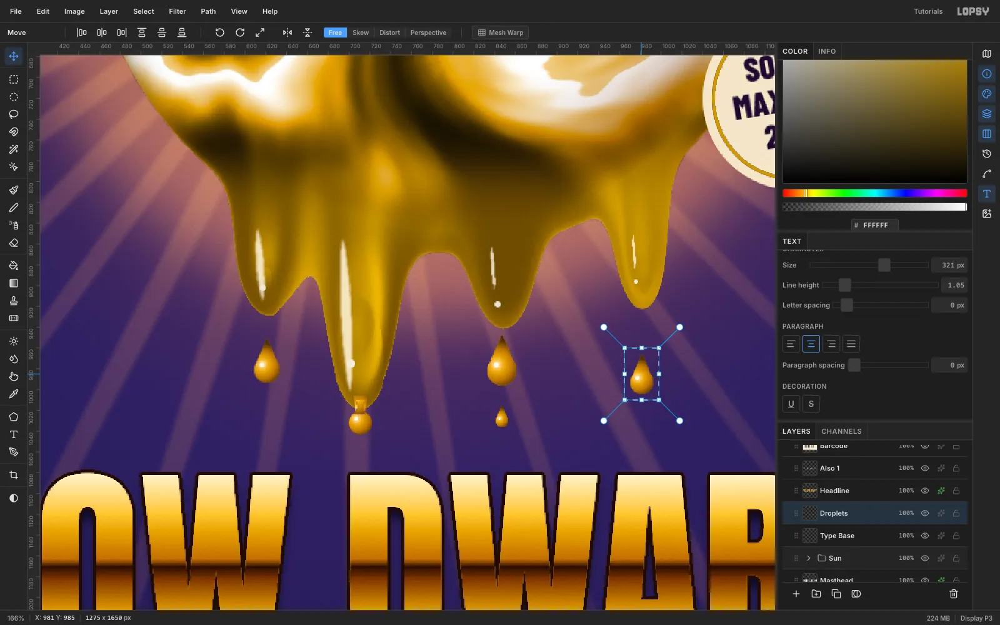

1. On a **Droplets** layer, build one teardrop under a drip tip: fill a small circle made with the **Elliptical Marquee**, then lasso a small triangle on top of it and fill that too.
2. [[Cmd]]-click the layer's thumbnail, then click the **Droplets** row. Drag a radial gradient from `#FFF4D0` through gold to `#4A2E08`, lit from the upper left. Add a white dot highlight.
3. Marquee the drop, then press [[Cmd+C]] and [[Cmd+V]].
4. Marquee the pasted drop and [[Cmd]]-drag a corner handle to scale it down to 70–86%. Press [[Cmd+D]] to commit, then drag it under the next drip tip with the **Move** tool and fine-tune with the arrow keys.
5. Choose **Layer → Merge Down** to fold it back into Droplets. Repeat for the other drips.

Leave 20–30 px between each tip and its drop. For one drip, draw a drop still attached by a thin neck.

> **Tip:** To adjust a drop after merging, marquee just that drop and drag it with the **Move** tool. Only the selected pixels move.

## Chrome the headline and drip three letters

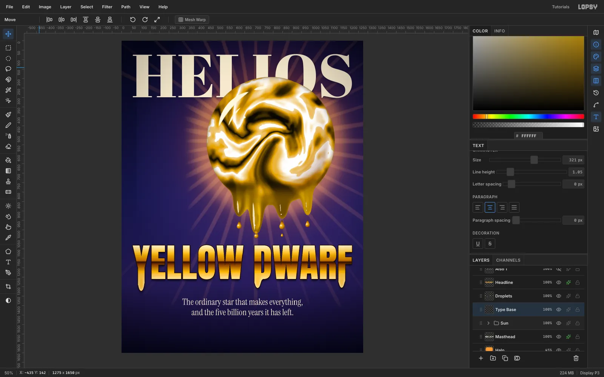

1. Click a raster layer (**Droplets**) so the new type doesn't edit the masthead. Type **YELLOW DWARF** in **Anton** at 206 px, about two-thirds of the way down the cover, so it spans the margins exactly. Name the layer **Headline** and click **Rasterize Layer**.
2. [[Cmd]]-click its thumbnail, then click the **Headline** row. Drag a vertical linear gradient over the cap height with these stops:
   - `#FFF6D0` → `#F6C850` at 22% → `#B8740E` at 46%
   - a dark horizon line at `#2A1003` 50%
   - `#7A3E08` at 57% → `#F2B838` at 78% → `#FFE9A8` at 100%
3. Deselect, then choose **Filter → Liquify…**, set **Mode** to **Push Forward** and **Brush Size** to 36, and pull drips from the **Y**, the **D**'s stem and the **F** only. Keep the L's and W clean so the word stays legible. Click **Apply**.
4. Add a dark **Stroke** (`#1E0C02`, **Width** 3, **Position** outside) and a soft **Drop Shadow** (**Offset Y** 10, **Blur** 14, **Opacity** 75).
5. Set the deck in **Instrument Serif** at 46 px, cream `#F4E9D0`, as two separate text layers: *The ordinary star that makes everything,* and *and the five billion years it has left.* Centre each one with **Align center horizontally** in the Move tool's options bar, about 40 px below the drips.

## Set the cover lines on a strict left edge

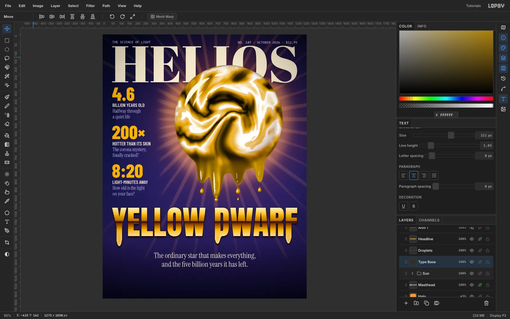

Each cover line is a stack of three text layers:

- a gold `#F2B630` **Barlow Condensed ExtraBold** number at 118 px
- a cream `#F4E9D0` **Barlow Condensed SemiBold** label at 30 px
- a two-line lavender `#C8BEEA` **Instrument Serif** caption at 31 px (press [[Enter]] for the line break)

Set the three stacks:

- **4.6** / **BILLION YEARS OLD** / *Halfway through* / *a quiet life*
- **200×** / **HOTTER THAN ITS SKIN** / *The corona mystery,* / *finally cracked?*
- **8:20** / **LIGHT-MINUTES AWAY** / *How old is the light* / *on your face?*

Set the caption's **Line height** to 1.16 in the Text panel *before* you create it (about 36 px leading). Line every block up on the left margin guide, start the first just under HELIOS, and space the blocks evenly, about 240 px apart from number to number.

Add the folio line in **IBM Plex Mono** Medium at 20 px, lavender `#C8BEEA`, about 40 px from the top: **THE SCIENCE OF LIGHT** on the left margin, and **NO. 147 · OCTOBER 2026 · $12.99** ending exactly on the right margin guide.

> **Tip:** Create new text in an empty part of the canvas, then move it into place. A click inside another text layer's box edits that layer instead.

## Add a rotated Solar Maximum badge

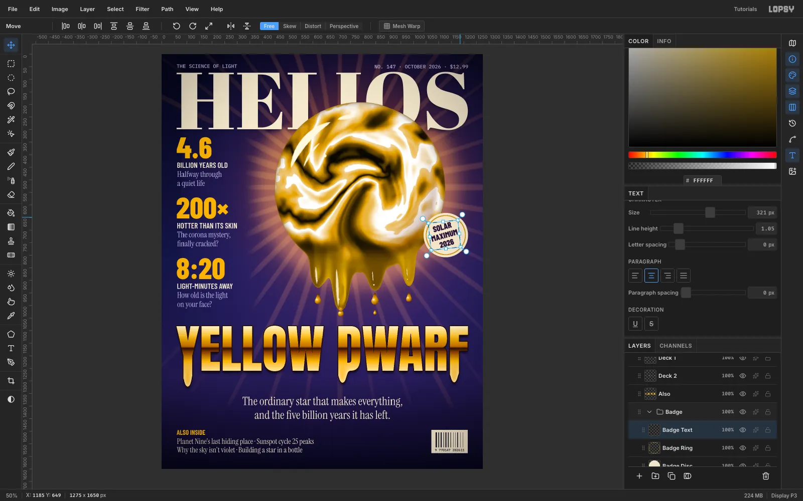

1. Make a **Badge** group:
   - a 176 px cream `#F3E6CC` disc ([[Cmd]]-drag with the Elliptical Marquee and fill)
   - a gold `#C99A2E` ring on its own layer: fill a circle a little smaller than the disc and centred on it, then choose **Select → Shrink…** with 3 and press [[Delete]]
2. Before creating the label, click **Align center** and set **Line height** to 1.05 in the Text panel.
3. Drag an area-text box and type **SOLAR** / **MAXIMUM** / **2026** on three lines in Barlow Condensed ExtraBold at 32 px. Nudge it until the ink is centred in the ring.
4. **Rasterize** the label.
5. Marquee it, then drag the Move tool's rotation handle about −10° and press [[Cmd+D]].

Let the badge overlap the sphere's edge, like a sticker on the photo, with its right edge on the right margin guide.

> **Tip:** Rasterize text before you rotate it. A rotated live text layer loses its rotation the next time you change its size or text.

## Finish the bottom band, barcode and grain

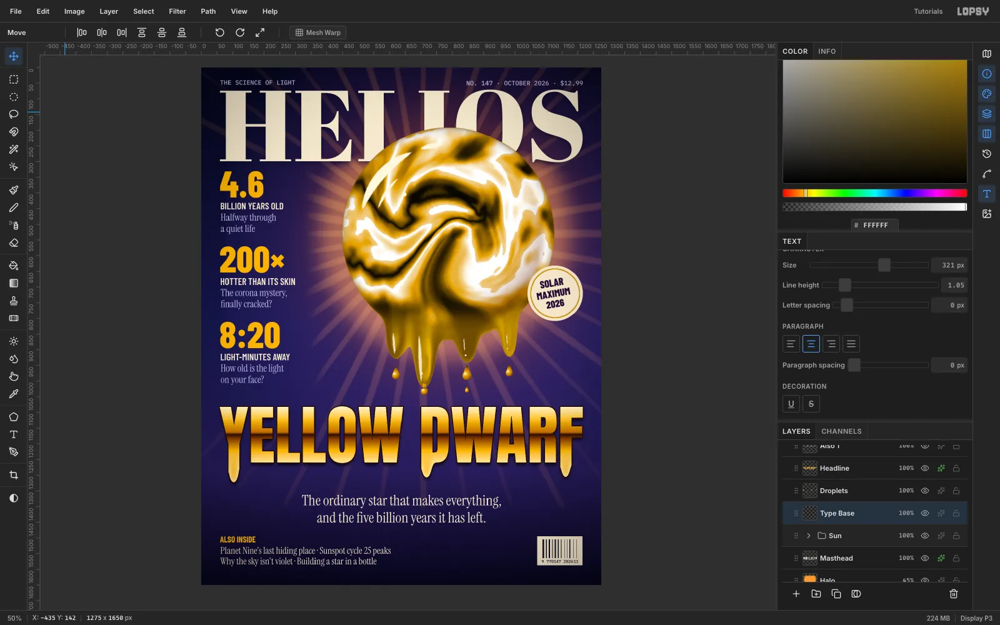

1. Set **ALSO INSIDE** in gold `#F2B630` **Barlow Condensed** Bold at 26 px on the left margin. Under it, add two lines of 30 px cream Instrument Serif, ending about 60 px above the bottom edge: *Planet Nine's last hiding place · Sunspot cycle 25 peaks* and *Why the sky isn't violet · Building a star in a bottle*.
2. For the barcode, choose **View → Show Grid** and set **Grid** to 4px; Snap turns on with it. On the right margin, marquee a cream box whose top lines up with the ALSO INSIDE caps and fill it. Untick **Snap** in the options bar, then fill thin dark bars of varying widths. Add the digits `9 770147 202611` in IBM Plex Mono 13 px under the bars.
3. Add a **Grain** layer on top: fill it grey `#808080`, run **Filter → Add Noise…** (**Amount** 40, **Mono**, **Gaussian**), and set it to **Overlay** at 22%.
4. Finish with a **Vignette** over the whole cover: click the **✦** button on the top **Project** group, choose **Add Adjustment → Vignette** and set it to 35.

Hide the grid and export with **File → Quick Export PNG**.
