Naive folk painters such as Maud Lewis paint the countryside the way a child
remembers it:

- bright flat colours with no shading
- simple rounded shapes, the same dark outline round everything
- tulips, daisies and a cheerful sun wherever there's room

Those rules suit a product label very well, because a label has to read
from across a shop. In this tutorial you'll make one for an invented
goat-cheese dairy, **Merry Goat Creamery**. It's a round, scalloped sticker
with a painted farm inside, an arched title, a curved ribbon and a little
gingham tablecloth to show it on.

Along the way you'll use:

- **Define Pattern** and **Fill with Pattern**
- the Brush's **Radial Symmetry**, plus a custom brush made with **Define Brush**
- **Sunburst**, **Fibers** and **Add Noise**
- copy, paste, scale and rotate
- a **group mask**, plus add, subtract and intersect selections
- the **Stroke** and **Drop Shadow** effects
- the Pen tool with **text on a path**

The palette is a set of folk brights on cream:

- Cobalt `#2D4FA3`
- Tomato red `#C8382F`
- Cream `#FFF4DC`
- Sunflower `#FFC83D` / `#FFD447`
- Sky `#4F8FD6` → `#BFDDF0`
- Greens `#3E7F5C` / `#74B04A` / `#8CC751`
- Sun orange `#F39C12`
- Barn roof `#7A2E25`, lane `#EED9A0`
- Outline ink `#3A2A20`
- Gingham `#C8362E` / `#EBA29B`

## Make a gingham tile

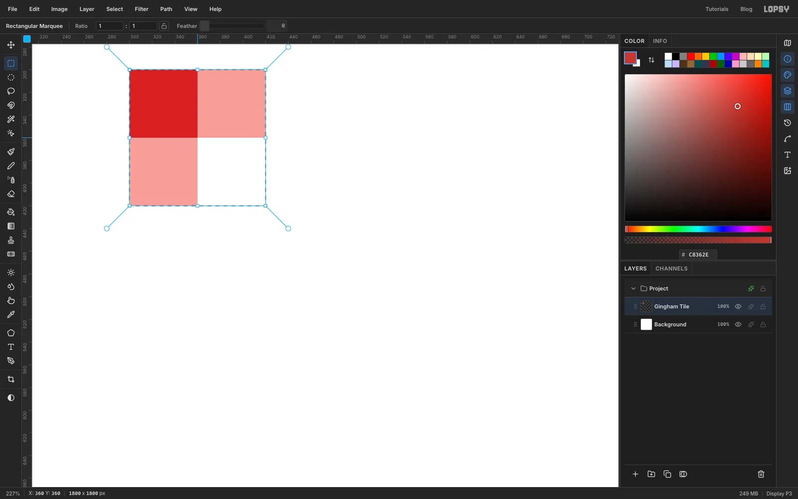

Open [Lopsy](/). In the **New Document** dialog, set **Width** and **Height**
to `1800`, leave **Background** on **White** and click **Create**.

Click the top ruler at `900` and the left ruler at `900` to add a vertical
and a horizontal guide through the centre. Then double-click **Layer 1** and
rename it `Gingham Tile`.

Press [[M]] for the **Rectangular Marquee** and click once on the canvas
without dragging. A **Rectangular Selection** dialog opens, so you can type
exact corners. Make four selections, filling each one with **Edit → Fill**
after setting the foreground colour in the Color panel's hex field:

1. From `300, 300` to `420, 420`: fill white `#FFFFFF`.
2. From `300, 300` to `360, 420`: fill pale red `#EBA29B`.
3. From `300, 300` to `420, 360`: fill pale red again.
4. From `300, 300` to `360, 360`: fill dark red `#C8362E`.

Where the two pale bands cross you get the dark square, just like woven
gingham.

## Turn the tile into a tablecloth

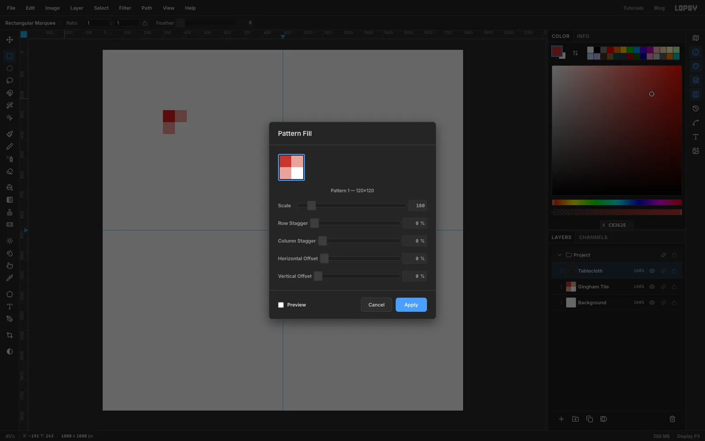

Select the whole tile again (from `300, 300` to `420, 420`) and choose
**Edit → Define Pattern**.

Click **Add Layer** at the bottom of the Layers panel and rename the new
layer `Tablecloth`. Press [[Cmd+D]] to deselect, then choose **Edit → Fill
with Pattern…**. Your tile is already picked, so leave **Scale** at `100`
and click **Apply**.

Select the **Gingham Tile** layer and delete it with the trash button in the
Layers panel.

## Soften the cloth

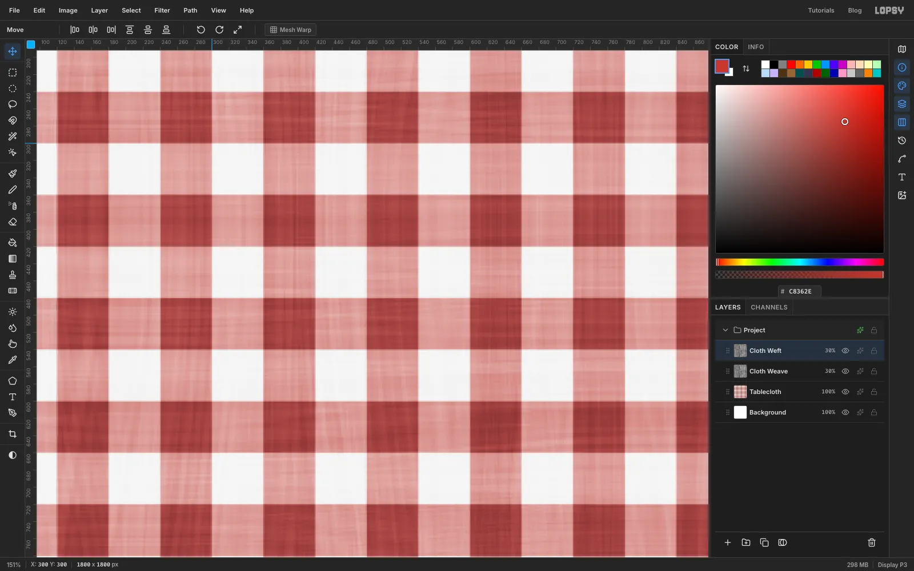

The cloth is only a backdrop, so it shouldn't shout. Select **Tablecloth**
and:

1. Choose **Filter → Hue/Saturation…**, set **Saturation** to `-40` and click **Apply**.
2. Choose **Filter → Gaussian Blur…**, set **Radius** to `2`, and click **Apply**. It now reads like a cloth slightly out of focus behind the label.

Now add a weave. Add a layer named `Cloth Weave` and choose **Filter →
Fibers…** with **Variance** `20` and **Strength** `40`. Fibers uses the
foreground colour, which is still the dark red. Open the layer's
effects drawer with the ✦ button on its row, set **Blend** to **Overlay**,
and lower the layer's opacity to `30%`.

Fibers only runs one way. To get crossing threads:

1. Choose **Layer → Duplicate Layer**, click the copy's row and rename it `Cloth Weft`.
2. Press [[V]] for the **Move** tool and click **Rotate 90° CW** in the options bar.

## Stamp the scalloped edge

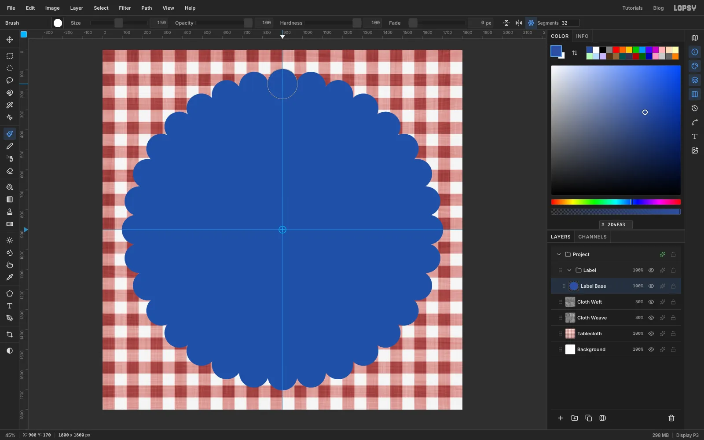

Make sure **Cloth Weft** is selected, click **New Group** and rename the group
`Label`. Add a layer inside it named `Label Base`.

Choose the **Elliptical Marquee** and click once without dragging. In the
**Elliptical Selection** dialog, enter From `170, 170` and To `1630, 1630`. That's
a circle of radius 730 around the centre. Fill it with cobalt `#2D4FA3`
and deselect.

Now for the scallops. Press [[B]] for the **Brush** and set **Size** `150`
and **Hardness** `100`. Click **Radial Symmetry** in the options bar and
set **Segments** to `32`. The symmetry centre starts in the middle of the
canvas. Click once on the top edge of the disc, where it meets the vertical
guide: one click paints 32 evenly spaced scallops.

## Add stitches and the cream ring

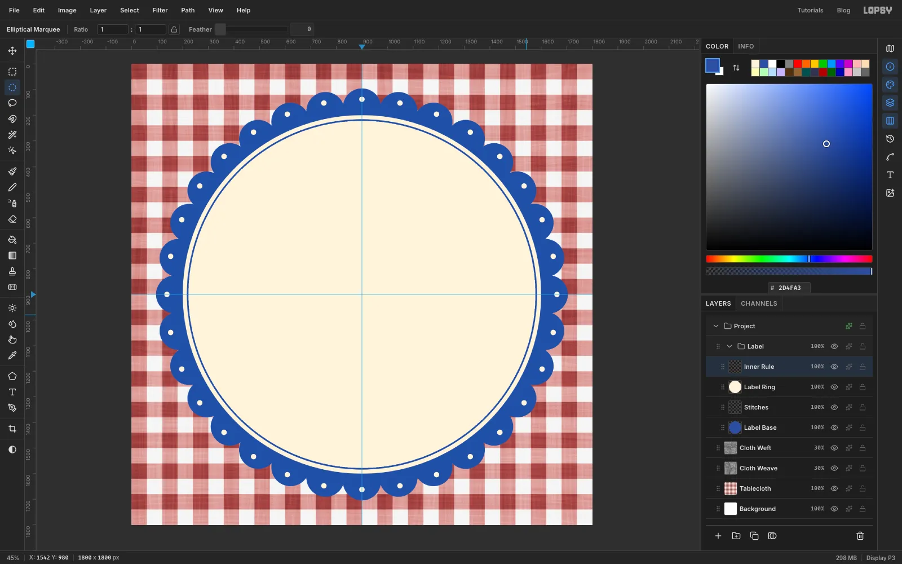

Add a layer named `Stitches`. Set the foreground to cream `#FFF4DC`, set
the brush **Size** to `22` and click once in the upper half of the top
scallop. The symmetry puts a dot in every scallop. Click **Radial
Symmetry** again to turn it off.

Add a layer named `Label Ring`. Make an exact elliptical selection from
`200, 200` to `1600, 1600` and fill it with cream.

For the thin rule:

1. Add a layer named `Inner Rule`.
2. Make an exact elliptical selection from `216, 216` to `1584, 1584` and fill it with cobalt.
3. Choose **Select → Shrink**, enter `6` and click **Apply**.
4. Press [[Delete]], then [[Cmd+D]].

You're left with a crisp 6 px ring.

## Paint the sky

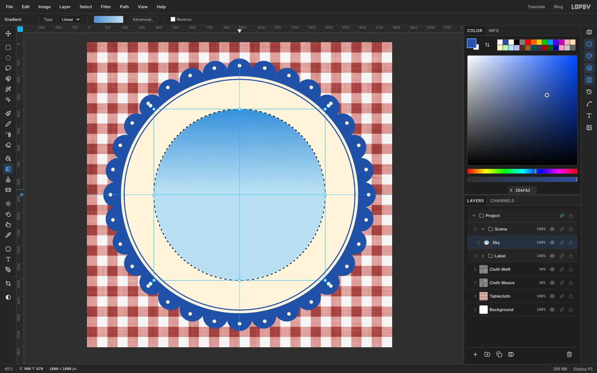

Collapse the **Label** group, select its row and click **New Group**. Rename
it `Scene`, then add a layer inside named `Sky`.

Make an exact elliptical selection from `394, 394` to `1406, 1406`. Choose the
**Gradient** tool, open **Advanced…** and set two stops, `#4F8FD6` and
`#BFDDF0`. Drag from the top of the circle down to the horizontal guide,
then press [[Cmd+D]].

## Make a folk sun with Sunburst

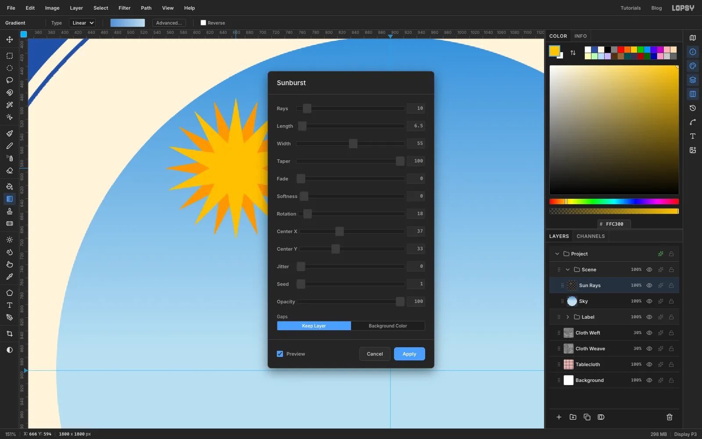

Add a layer named `Sun Rays` and set the foreground to orange `#F39C12`. Choose
**Filter → Sunburst…** and set:

- **Rays** `10`
- **Length** `6.5`
- **Width** `55`
- **Taper** `100`
- **Fade**, **Softness**, **Rotation** and **Jitter** all `0`
- **Center X** `37` and **Center Y** `33`

Click **Apply**. Then switch the foreground to yellow `#FFC300`, open
Sunburst again and change only **Rotation** to `18`. The second set of rays
lands in the gaps, so the colours alternate.

Add a layer named `Sun`. Make an exact elliptical selection from `604, 532`
to `728, 656` and fill it with `#FFC83D` to cover the middle, then deselect.

## Build the clouds from ellipses

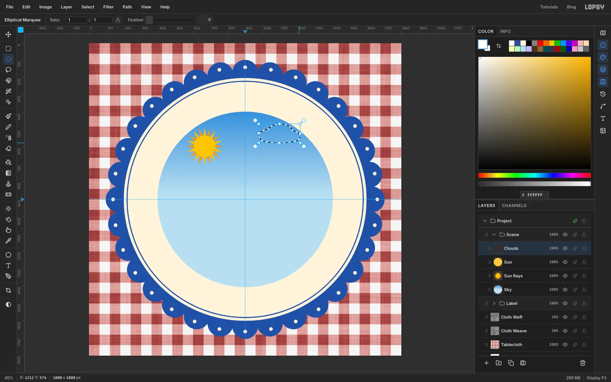

Add a layer named `Clouds`. With the **Elliptical Marquee**, drag a wide
oval for the base of the cloud, then hold [[Shift]] and drag three or four
rounder ovals across its top to add bumps. Fill the joined selection with
white. Make a second, smaller cloud lower down and to the right the same way.

## Lasso the far hills

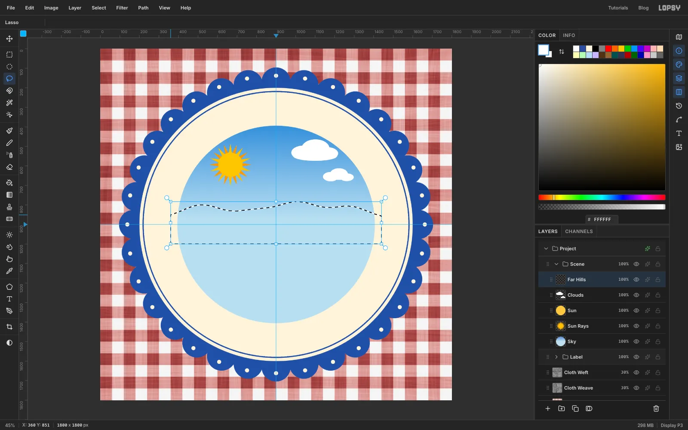

Add a layer named `Far Hills`. With the **Lasso** ([[L]]), trace a slow
rolling ridge across the circle, just above the horizontal guide. Close it
well below the guide. Don't worry about the parts outside the circle: the
group mask will hide them later. Fill with `#3E7F5C`.

## Paint one tree, then paste copies

Add a layer named `Tree`. On the left of the ridge, draw the trunk with
the brush:

1. Set **Size** `14` and colour `#6B4226`.
2. Click at the top of the trunk, then [[Shift]]-click about 70 px below it.

Then select a circle about 80 px across over the top of the trunk and fill it with
`#2F6E3A`.

Draw a rectangle round the tree and press [[Cmd+C]], then [[Cmd+V]]. The copy is pasted in place on a new layer. Rename it `Tree 2`.
Draw a marquee tightly round it, switch to the **Move** tool, and hold [[Cmd]] (it keeps the tree's proportions) while you drag the
bottom-right handle in, until the tree is about three-quarters of its size. Press [[Cmd+D]], then drag it just right of
the first tree and a little lower, so it looks further away.

## Tilt a third tree

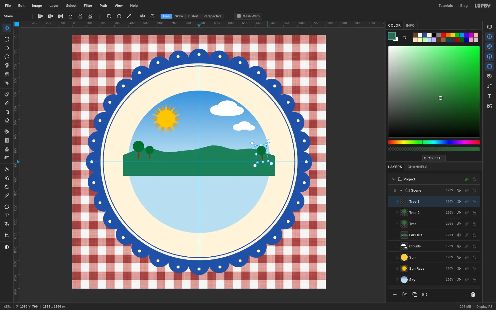

Paste again, rename the layer `Tree 3`, scale it to about 80% and drag it to
the right end of the ridge. Naive painters rarely stand everything straight,
so give it a lean:

1. Draw a marquee round it.
2. With the **Move** tool, hover just outside the top-right corner until the cursor turns into a curved arrow.
3. Drag up a little to rotate it about 7° to the left.
4. Press [[Cmd+D]].

## Plough the fields along the hills

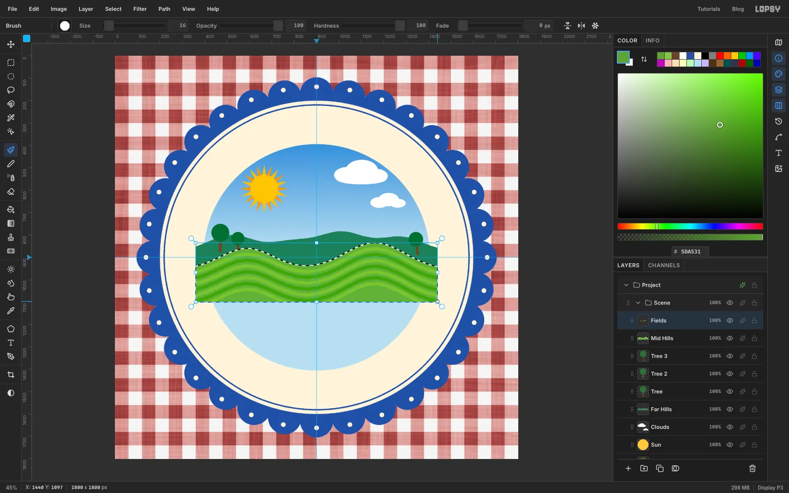

Add a layer named `Mid Hills`. Lasso one wide band in front of the
ridge whose top rises into two round hills, the right one taller. Fill with `#74B04A`.

Add a layer named `Fields`. [[Cmd]]-click the **Mid Hills** thumbnail to
select its shape, then click the **Fields** row. Set the brush **Size** to `16`.
Paint rows that follow the hill tops:

1. Drag a wavy line that follows the hilltop, about a brush-width below it, in `#8BC34A`.
2. Paint the next row the same gap lower in `#5DA531`.
3. Keep alternating the two greens all the way down.

The selection keeps every stroke inside the hills. Press [[Cmd+D]] when you're
done.

## Build the barn

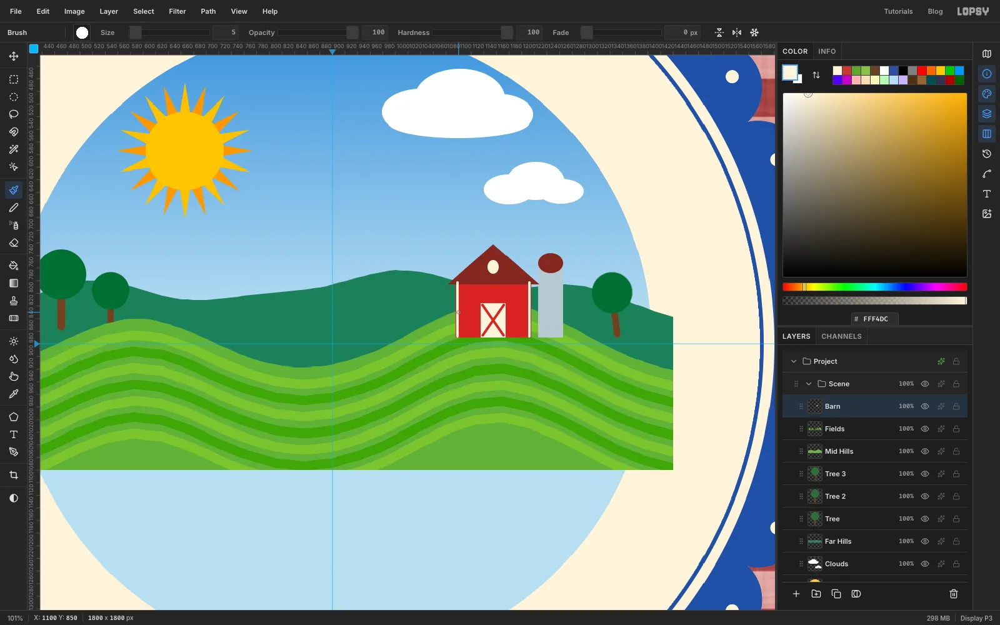

Add a layer named `Barn` and build it on the right hilltop:

- **Silo:** a rectangle about 40 × 120 px in pale grey `#B9C7CF`, with a dark red `#7A2E25` oval on top.
- **Barn:** a rectangle about 120 × 90 px in red `#C8382F` beside it.
- **Roof:** lasso a triangle over the barn and fill it with `#7A2E25`.
- **Door and loft window:** a cream `#FFF4DC` rectangle for the door, and a small cream oval in the gable.
- **Trim:** with a **Size** `5` brush, click one door corner and [[Shift]]-click the opposite one, then do the same with the other pair of corners to make a red X. Do the same in cream for a trim line down each side of the barn.

## Bring a tree to the front

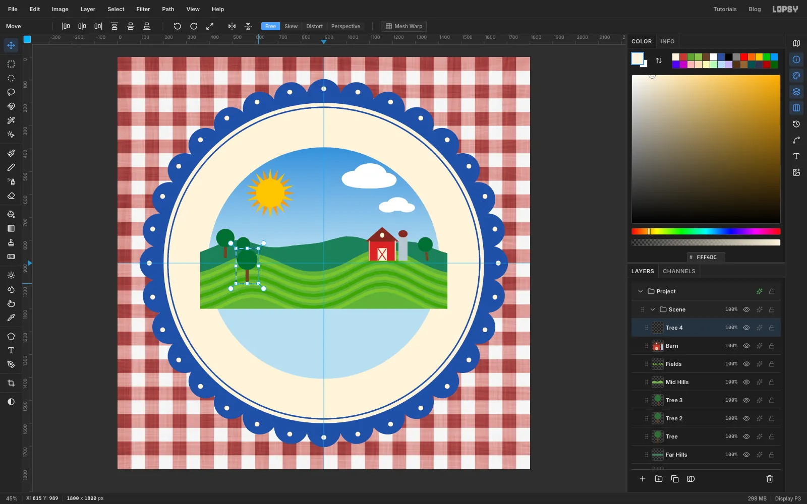

Paste the tree one more time and rename the layer `Tree 4`. This one is
closest to us, so it should be the **biggest** tree in the picture. Draw a
marquee round it, then with the **Move** tool [[Cmd]]-drag a corner handle
*outwards* until it's a little larger than the first tree. Then place it in
front of the left hill, between the far trees and the middle of the scene.

## Add the meadow and the lane

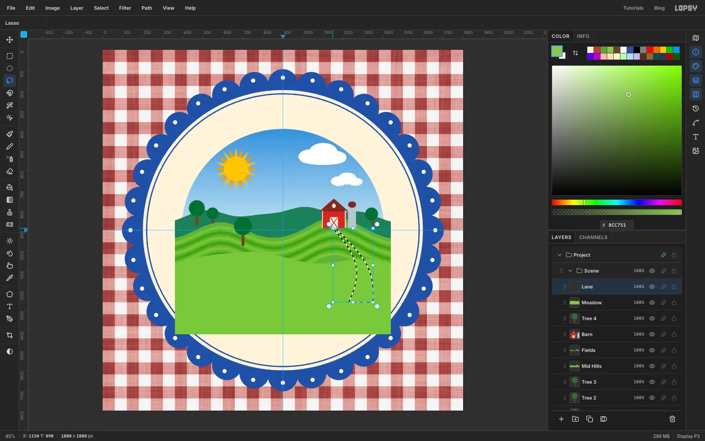

Add a layer named `Meadow`. Lasso a gentle front hill that covers the
bottom half of the circle, and fill it with `#8CC751`.

Add a layer named `Lane` above it. Lasso a path that starts as a thin line at
the barn door and widens as it winds down to the lower right, then fill it
with pale tan `#EED9A0`.

## Clip the scene to a circle with a group mask

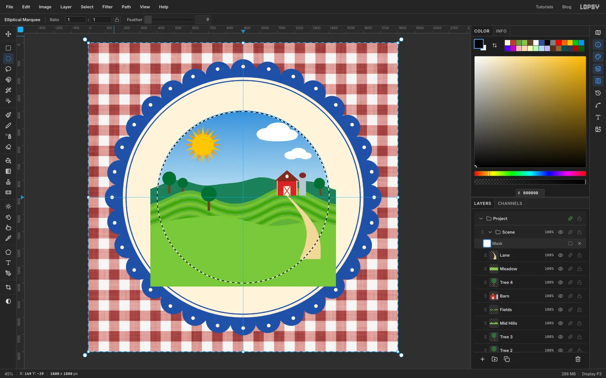

The hills and sky spill past the circle, so mask the whole group at once:

1. Select the **Scene** group row and click **Add Mask**.
2. Click the new mask thumbnail next to the **Scene** row to edit the mask.
3. Make an exact elliptical selection from `400, 400` to `1400, 1400`, then choose **Select → Inverse**.
4. Set the foreground to black and choose **Edit → Fill**.
5. Deselect, then click the **Scene** row to leave mask editing.

Everything in the group, including layers you add later, is now clipped
to a 1000 px circle.

## Lasso the goat's silhouette

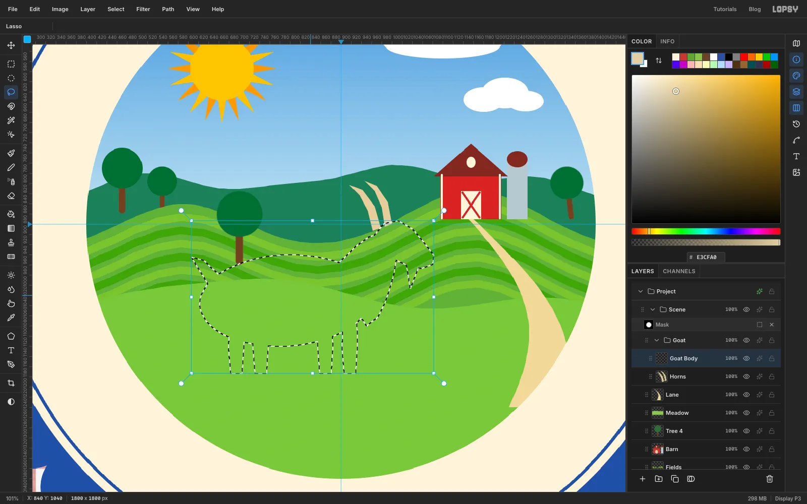

Select the **Lane** row and click **New Group**. Rename the group `Goat`.
Add a layer named `Horns` and lasso two long curved horns sweeping back
from where the head will be. Fill them with `#E3CFA0`.

Add a layer named `Goat Body`. Build the white silhouette from simple
pieces with the **Lasso**, holding [[Shift]] for each piece after the first
so they add together:

- a big oval for the body
- a thick neck rising to the right
- a wedge-shaped head pointing down and right
- four straight legs
- a little tuft of tail
- a beard under the chin

Fill with white.

## Add spots, ear, collar and face

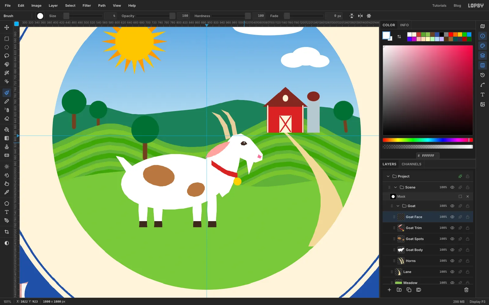

Add three more layers:

- **`Goat Spots`:** two soft brown `#B07A4A` ovals on the body.
- **`Goat Trim`:**
  - a drooping leaf-shaped ear in pink `#F4A6A0`
  - a red `#C8382F` collar band across the neck
  - a small yellow `#FFD23F` circle for the bell, hanging at the throat
- **`Goat Face`:**
  - an almond eye and four hooves in ink `#3A2A20`
  - a pink `#E77A97` nose
  - one click of a **Size** `4` white brush for the glint in the eye

If the neck and body leave a notch at the chest, lasso a small wedge on
**Goat Body** and fill it white to smooth it.

## Trim the collar to the neck

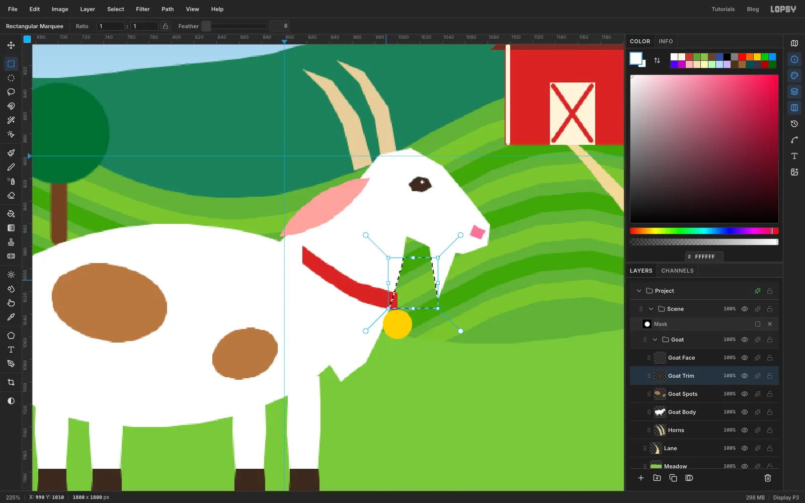

The collar's front end pokes out past the neck. To trim exactly that bit:

1. Select **Goat Trim** and [[Cmd]]-click the **Goat Body** thumbnail.
2. Choose **Select → Inverse**, so everything *outside* the goat is selected.
3. Hold [[Shift+Alt]] and drag a rectangle round the front end of the collar. This keeps only where the two selections overlap.
4. Press [[Delete]] and [[Cmd+D]].

The bell isn't touched because it's outside the rectangle.

## Plant the tulips

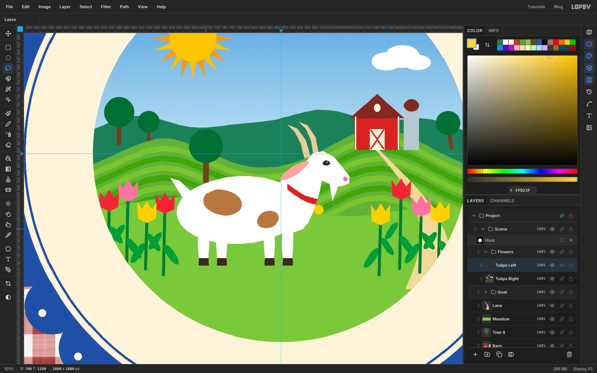

Collapse **Goat**, select its row and click **New Group**. Rename the group
`Flowers`, then add a layer named `Tulips Left`.

For each of four tulips:

1. Paint a stem with a **Size** `9` brush in `#2F7D3A`. Click the base, then [[Shift]]-click the top.
2. Lasso two narrow leaves in `#3E9A45`.
3. Lasso a crown-shaped head with three points in red `#E23D3D`, pink `#F27BA0` or yellow `#FFD23F`.

Vary the heights. Then select the **Goat** group's row, add a `Tulips Right` layer and plant four more tulips on the other
side of the goat. Use different heights and a different colour order, so the
clusters don't look mirrored.

## Paint daisies with radial symmetry

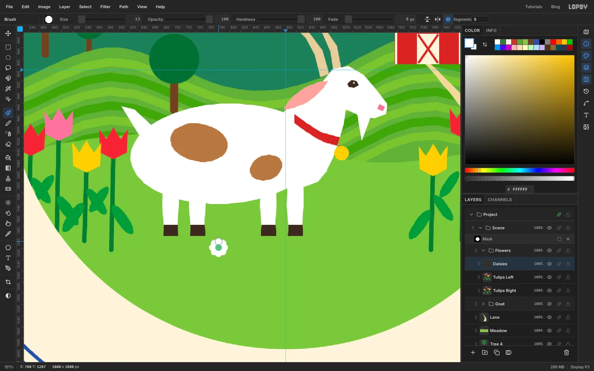

Add a layer named `Daisies`. Set the brush to white at **Size** `13`, turn
**Radial Symmetry** back on and set **Segments** to `8`.

For each daisy:

1. [[Cmd]]-click where the daisy's centre should be. This moves the symmetry centre there.
2. Click once just above it. Eight petals appear.

Make five or six daisies around the goat's legs. Then switch to `#FFC83D`
at **Size** `10` and do the same again, but click right on each centre
for the yellow middle. Turn **Radial Symmetry** off when you're done.

## Make a grass tuft brush

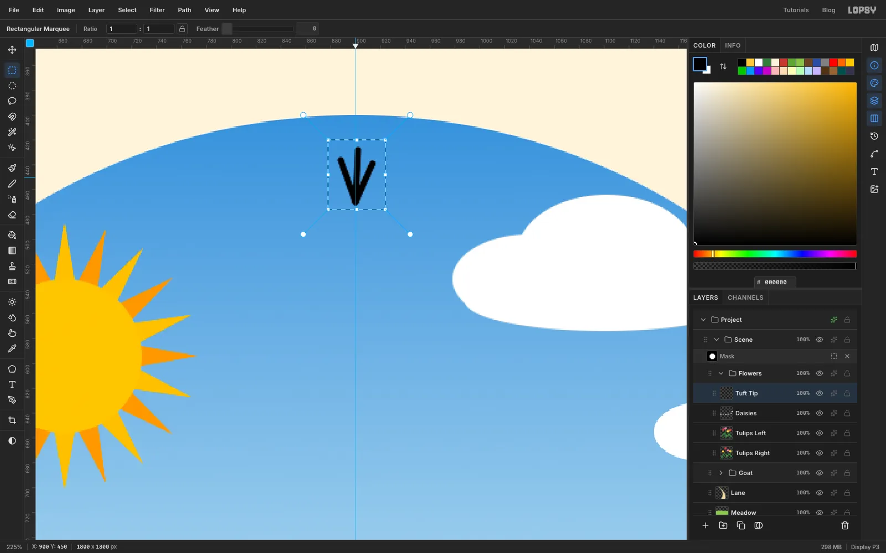

Grass is the one place a custom brush pays off. Add a temporary layer named
`Tuft Tip` and find an empty patch of sky:

1. With a black **Size** `6` brush, click a point.
2. [[Shift]]-click about 35 px above it and a little to the left.
3. Click the first point again and [[Shift]]-click straight up.
4. Repeat once more up and to the right.

You now have a three-blade tuft. Draw a rectangle round it and choose
**Edit → Define Brush…**. Name it `Grass Tuft`. The new tip becomes the
active brush. Delete the temporary layer.

## Scatter the tufts

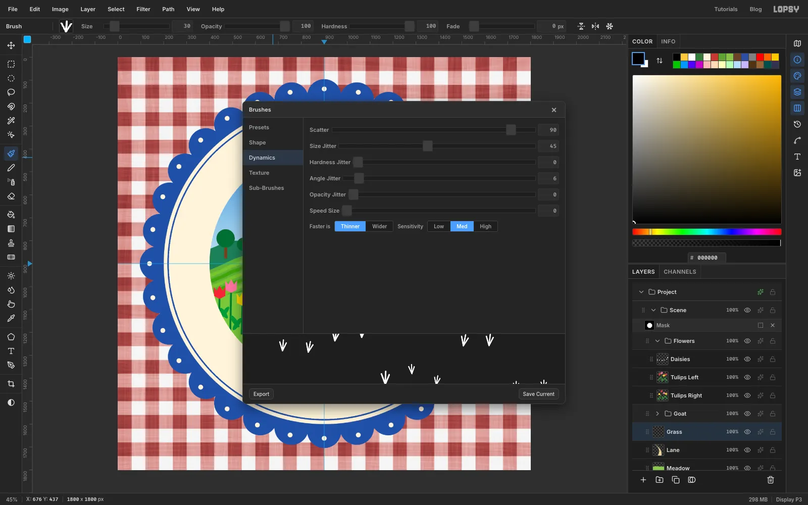

Click the brush-tip thumbnail at the left of the options bar to open the
**Brushes** modal:

- On the **Shape** tab, set **Size** `30` and **Spacing** `170`.
- On the **Dynamics** tab, set **Scatter** `90`, **Size Jitter** `45` and **Angle Jitter** `6`.

The preview strip at the bottom shows tufts of different sizes, leaning
slightly, spread along the stroke. Close the modal.

Now select the **Lane** row and add a layer named `Grass`. It goes between
the lane and the goat, so the goat's hooves stand in the grass.

## Keep the grass off the lane

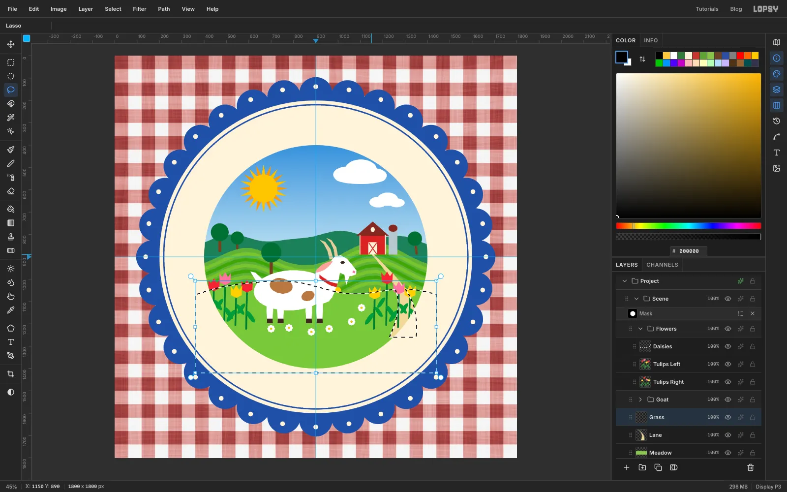

With **Grass** selected, [[Cmd]]-click the **Meadow** thumbnail, then
click the **Grass** row again. Hold [[Alt]] and lasso round the lower part of the lane to subtract it from
the selection.

## Paint the grass

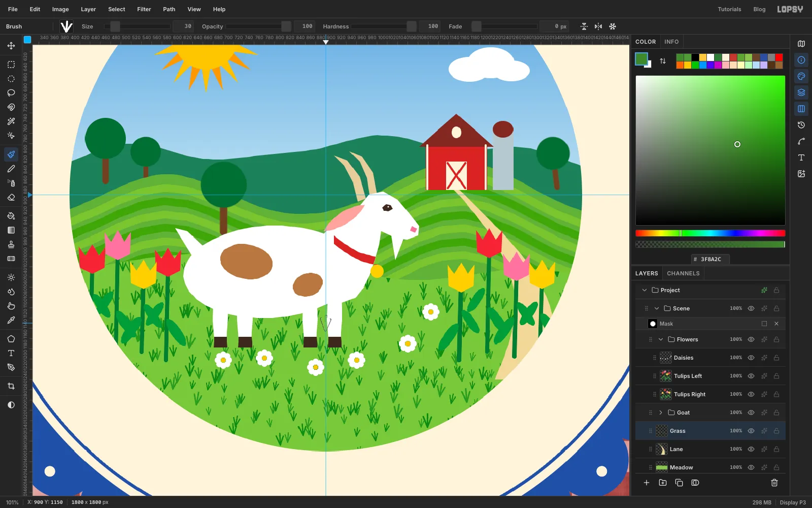

Set the foreground to `#4E9A36` and drag slow wavy strokes across the
meadow from left to right, a hand's width apart, from the top of the meadow to the bottom. Switch to the darker `#3F8A2C` and do a second set of strokes
in between. Press [[Cmd+D]].

## Spray dots into the tree tops

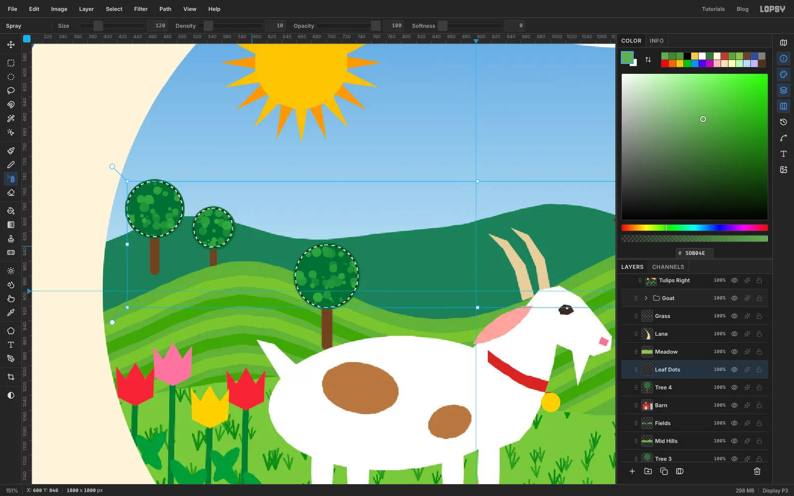

Spray paints with the Brush's current tip, so switch back first: open the
**Brushes** modal and click **Hard Round** on the **Presets** tab.

Select **Tree 4** and add a layer named `Leaf Dots`. Draw an elliptical marquee
just inside each canopy, holding [[Shift]] after the first to add the rest. Then:

1. Choose the **Spray** tool and set **Size** `120`, **Density** `10`, **Opacity** `100` and **Softness** `0`.
2. Set the foreground to `#5DB04E`.
3. Zig-zag once over each canopy.

The dots look like dabbed foliage, and they stay inside the canopies.

## Outline everything

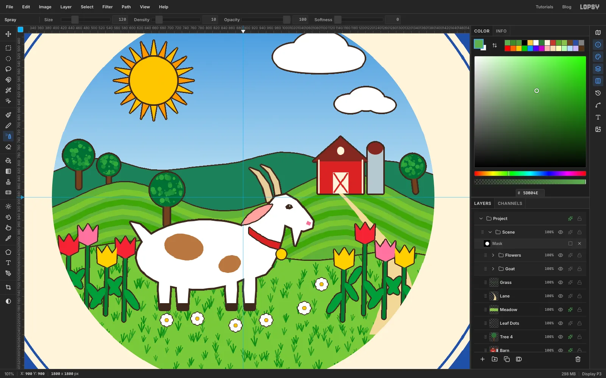

The dark outline is what makes this look like naive folk painting. For each
layer below, open its effects drawer with the ✦ button on the layer's
row, tick **Stroke**, set the colour to `#3A2A20` and set the **Width**:

- `5`: Goat Body
- `4`: Sun, Clouds, the four Tree layers, Barn, Horns
- `3`: Sun Rays, Far Hills, Mid Hills, Meadow, Goat Trim, both tulip layers
- `2`: Daisies

Leave **Sky**, **Fields**, **Lane**, **Grass**, **Leaf Dots** and **Goat
Spots** unoutlined. They're textures and details, not shapes.

## Hang a ribbon across the meadow

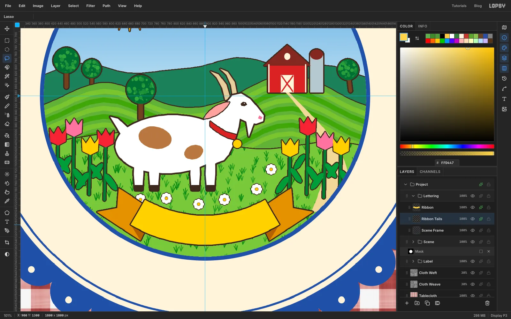

Collapse **Scene**, select its row, click **New Group** and rename it
`Lettering`.

First add a layer named `Scene Frame` for a ring round the picture.
Make an exact elliptical selection from `388, 388` to `1412, 1412`, fill it
with cobalt, choose **Select → Shrink** with `12`, press [[Delete]] and deselect.

Then build the ribbon:

1. Add a layer named `Ribbon Tails` and lasso a swallowtail end on each side, reaching out over the cream ring. Fill them with `#D9962B`.
2. Lasso a small triangle on **Ribbon Tails** at the inner corner of each tail and fill it with `#A8661C`, where it folds behind the banner.
3. Add a layer named `Ribbon` and lasso a curved band that smiles: the ends higher than the middle, following the bottom of the circle. Fill it with `#FFD447`.
4. Give **Ribbon** and **Ribbon Tails** a `4` px **Stroke** in `#3A2A20`.

## Set the ribbon text and draw its path

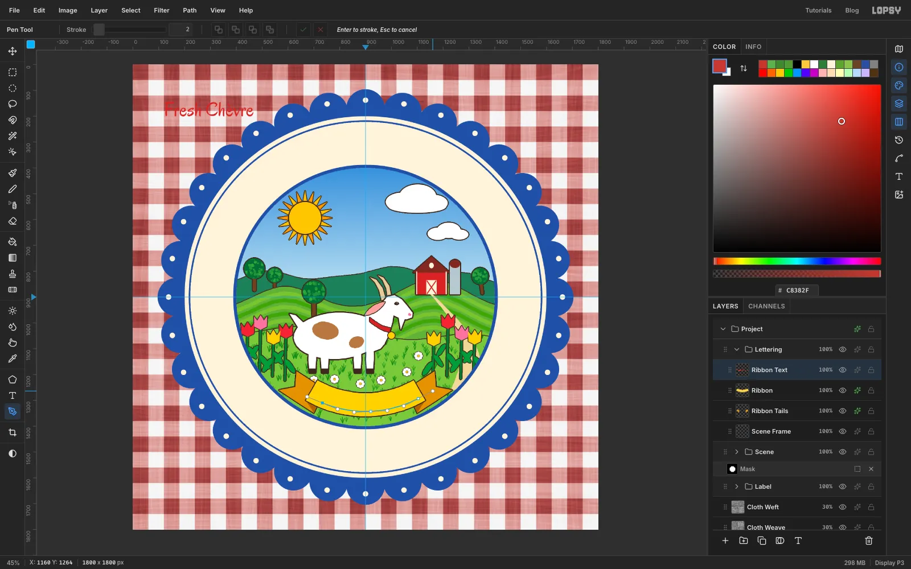

First set the text straight:

1. Select the **Ribbon** row, a plain picture layer. If a text layer were active, changing the font would restyle that layer instead.
2. Press [[T]], choose **Oregano** at size `78`, and set the colour to `#C8382F`.
3. Click in an empty corner of the canvas and type `Fresh Chèvre`.
4. Press [[Tab]] to commit, and rename the layer `Ribbon Text`.

Text on a path starts at the first anchor, so begin the path where you
want the first letter. With the **Pen** tool ([[P]]):

1. Press a little *below* the ribbon's centre line (letters sit on top of their path), a little in from its left end, and drag a short handle along the curve.
2. Do the same at the middle of the ribbon, dragging along the curve to the right.
3. Do the same just past where the text should end.
4. Click the **✓** (Commit path) button.

## Put the text on the path

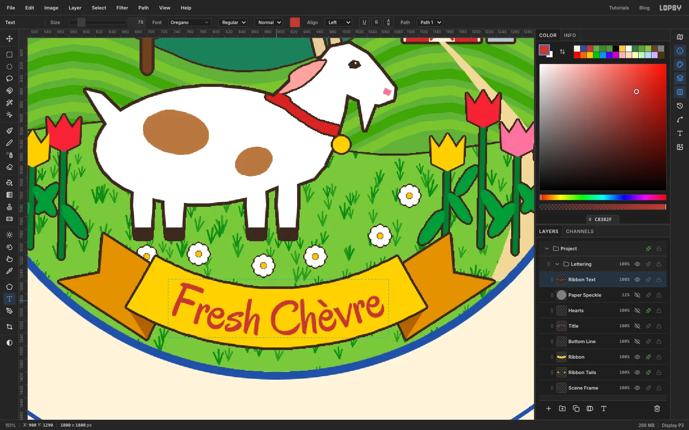

Select **Ribbon Text** and, with the Text tool active, choose the new path
in the **Path** menu of the options bar. The script bends along the
ribbon.

Check it sits in the middle of the band. The tops of the capitals and the
baseline should have about the same gap to the ribbon's edges. If they don't,
undo and draw the path a little higher or lower.

## Arch the title

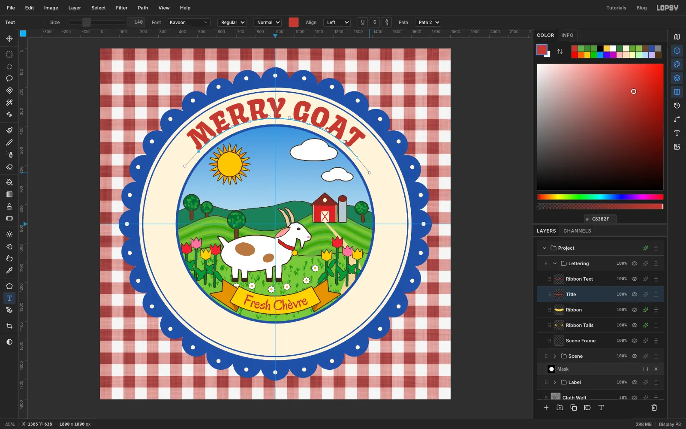

Select the **Ribbon** row again. Then:

1. Set the type to **Kavoon** at `140` in `#C8382F`, type `MERRY GOAT` in an empty corner, and rename the layer `Title`.
2. With the Pen tool, draw an arc across the top of the cream ring from left to right, about 30 px outside the blue frame ring. Use four anchors with handles dragged along the curve.
3. Commit the path, select **Title** and pick the path in the **Path** menu.

Let the arc span about 45° either side of the vertical guide. You'll match
that span for the bottom line.

Because the path runs left to right over the top, the letters stand
upright, leaning outwards.

## Curve the bottom line

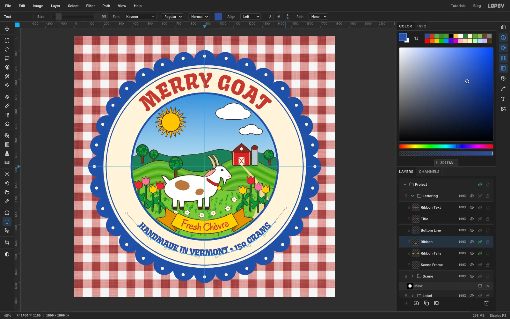

Select the **Ribbon** row again, then do the same for the bottom line, this
time in **Kavoon** `58`, cobalt `#2D4FA3`:

1. Type `HANDMADE IN VERMONT • 150 GRAMS` and rename the layer `Bottom Line`.
2. Draw the arc along the bottom of the cream ring, about 60 px inside the thin cobalt rule (**Inner Rule**), again from **left to right**. This way the letters stand upright with their tops towards the centre.
3. Bind the text to the new path.

Use the same span as the title, so the two lines balance each other.

## Add folk hearts

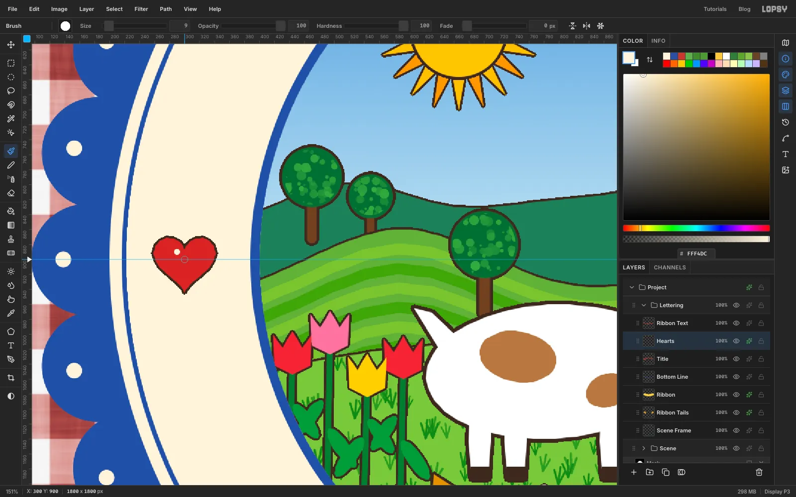

Add a layer named `Hearts`. Lasso a heart about 80 px wide on the
cream ring at nine o'clock and another at three o'clock, and fill them
with `#C8382F`. Then:

- Click once with a **Size** `9` cream brush near the top left of each heart for a highlight.
- Give the layer a `3` px **Stroke** in `#3A2A20`.

## Add a printed-paper speckle

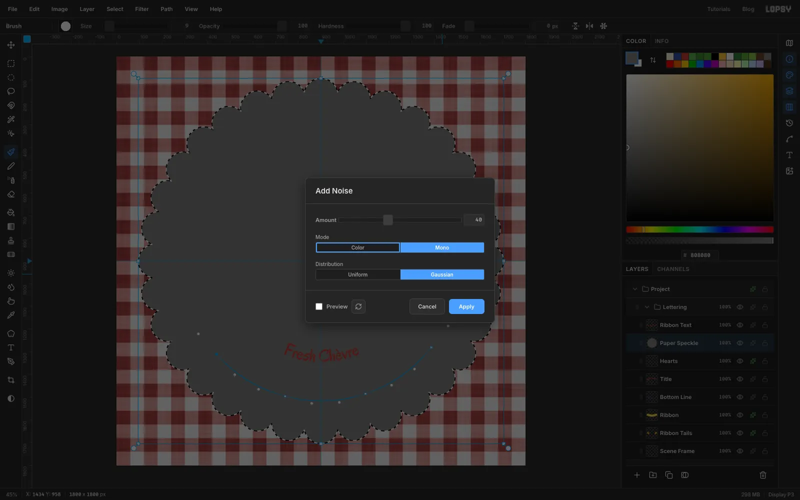

Select **Hearts** and add a layer above it named `Paper Speckle`.
Then:

1. Expand the **Label** group and [[Cmd]]-click the **Label Base** thumbnail.
2. Click the **Paper Speckle** row and fill the selection with mid grey `#808080`.
3. Choose **Filter → Add Noise…**, pick **Mono** and **Gaussian**, set **Amount** `40` and click **Apply**.
4. Choose **Filter → Gaussian Blur…** with **Radius** `1`.
5. Deselect, set the layer's **Blend** to **Overlay**, and lower its opacity to `22%`.

Grey disappears in Overlay, so only a fine, even tooth is left, like ink
on paper.

## Lift the label off the cloth

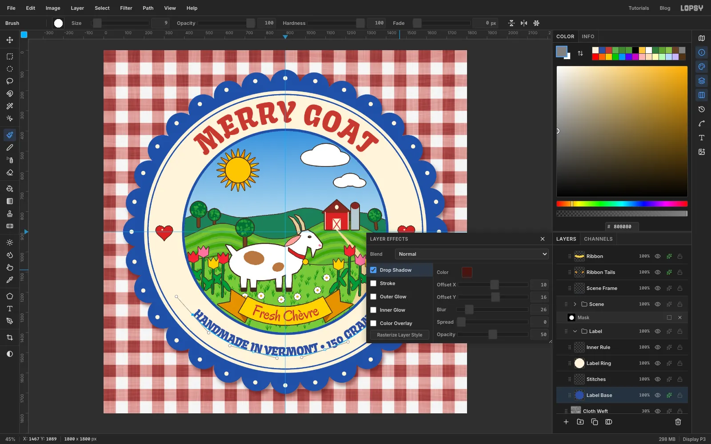

Select **Label Base** and open its effects drawer. Tick **Drop Shadow** and
set:

- colour `#4A1510`
- **Offset X** `10` and **Offset Y** `16`
- **Blur** `26`
- **Opacity** `50`

A warm shadow looks better on red cloth than grey or black.

## Fix the tangencies and export

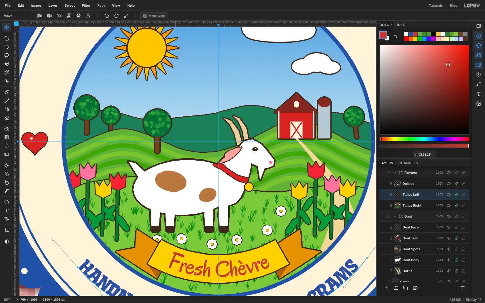

Zoom in and look for places where two shapes just touch. On a flat,
outlined picture they look like mistakes:

- **Near tree:** if its trunk lands on the goat's back, select **Tree 4** with the **Move** tool and nudge it up with [[Shift+Up]] until there's hill between the trunk and the goat. Draw a marquee round its canopy on **Leaf Dots** and nudge the dots up the same amount.
- **Collar:** if it stops short of the back of the neck, lasso a short extension on **Goat Trim** and trim it with the same intersect trick you used on the front.
- **Tulips:** if a tulip head touches the goat, nudge **Tulips Left** a couple of [[Shift+Left]] presses away.

Choose **File → Quick Export PNG** for the image and **File → Save
Project** to keep every layer, path and effect editable.

To make a whole range, swap the ribbon text and the tulip colours for
each cheese. For example, "Herbed Chèvre" with purple flowers.
