Hong Kong's neon signs used to be part of how people pictured the city at night, and most of them are gone. This tutorial turns that story into a data poster made of the thing it's about. The charts are drawn as neon tubes, the headline has a burnt-out letter, and the whole sheet hangs on a wall of the small square mosaic tiles you see on Hong Kong tenements.

The numbers come from a [Hong Kong Free Press report (April 2023)](https://hongkongfp.com/2023/04/16/its-disappearing-very-fast-hong-kongs-fading-neon-heritage-shines-a-spotlight-on-the-craft/):
- About 120,000 signboards were counted by the Buildings Department in 2011.
- About 400 neon signs are left, according to the Tetra Neon Exchange's estimate.
- Removal orders for overhanging signboards rose from under 700 in 2015 to 1,119 in 2022.
- Master Wu Chi-kai estimates that eight or nine neon masters are left.

Each dataset gets one colour: amber for all signboards, pink for surviving neon, cyan for removals and violet for the craftspeople. Every neon element uses the same recipe. Fill the shape with a very pale tint of its colour, add an **Inner Glow** in the full colour so the tube has a white-hot core, then add an **Outer Glow** for the halo.

## Tile a mosaic wall with a pattern

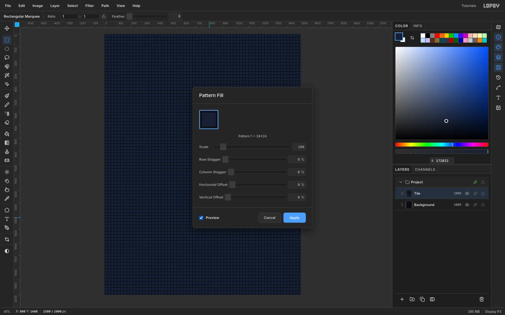

Create a **1500 × 2000** document and fill `Background` with `#0A0913`. On a new layer, make one tile at the top-left corner:
1. Marquee **0, 0 → 24, 24** and fill it with the grout colour `#0B0D15`.
2. Marquee **2, 2 → 22, 22** and fill it with the tile face colour `#172033`.
3. Marquee the full 24 × 24 square again and choose **Edit → Define Pattern**.

Clear the tile, choose **Edit → Fill with Pattern…**, tick **Preview**, and click **Apply**. Rename the layer `Mosaic`.

## Give every tile its own tone

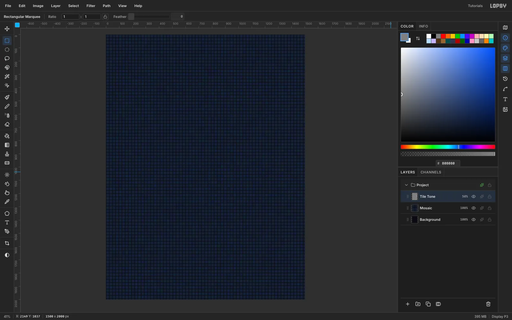

Real mosaic walls are never one flat colour. Add a `Tile Tone` layer, fill it with `#808080`, and run **Filter → Add Noise…** with **Amount 90** in **Color** mode. Then run **Filter → Pixelate** with **Block Size 24**.

Pixelate's blocks start at the document origin, just like the pattern tiles, so each block sits exactly on one tile. Set the layer to **Overlay** at **50%**, and every tile picks up its own slight shift in hue and brightness.

## Darken the edges and set up guides

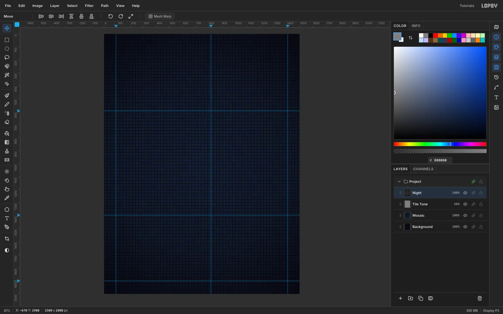

On a `Night` layer, pick the **Gradient** tool with **Type: Radial**. In **Advanced…**, set three stops, all `#05040A`:
- 0% opacity at the start.
- 25% opacity at the midpoint.
- 95% opacity at the end.

Drag from the centre (750, 1000) out to (1750, 1900).

Now click the top ruler at x **90**, **820** and **1410**, and the left ruler at y **592**, **1394** and **1900**:
- **x 90** is the left margin for everything.
- **x 820** is where the right-hand column starts.
- **x 1410** is the right margin.
- **y 592 / 1394** separate the three bands, and **y 1900** marks the footer.

## Set the headline in neon tubes

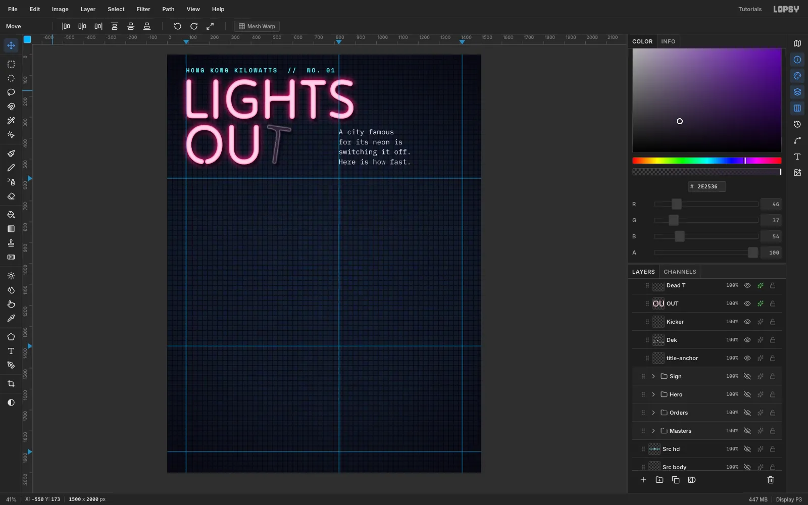

Click **New Group** in the Layers panel and name it `Title`. Tilt Neon is drawn like bent glass tubing, which suits this poster well. Type `LIGHTS` and `OUT` as two separate layers in **Tilt Neon** at **270 px**, in the pale pink `#FFD3E6`. Move their top-left corners to (90, 118) and (90, 336). Give both layers the same effects:
- **Inner Glow** `#FF2E88`: Size 9, Spread 20, Opacity 100.
- **Outer Glow** `#FF2E88`: Size 40, Spread 10, Opacity 95.
- **Drop Shadow** `#020106`: offset 10 / 14, Blur 12, Opacity 70.

Above the headline, type the kicker `HONG KONG KILOWATTS  //  NO. 01` in **Space Mono Bold** at **28 px**, with **Letter spacing 6** set in the **Text** panel, at (90, 62). For the intro, type four short lines in **IBM Plex Mono** at **34 px**, starting at x 820. Sit the last line's baseline level with the bottom of OUT (y 525).

> **Tip:** Create each new text layer in empty canvas and then move it. A click inside an existing text layer's box edits that layer instead of starting a new one.

## Burn out the T

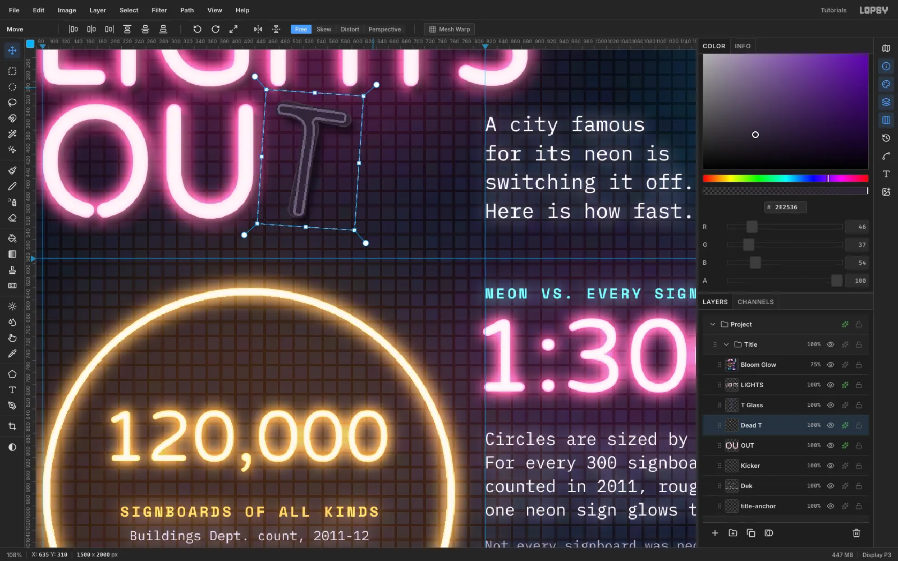

Select `OUT` and click **Rasterize Layer** at the bottom of the Layers panel. Marquee just the T (its left edge sits in the gap after the U), press [[Cmd+X]], wait a moment, then press [[Cmd+V]]. The T comes back in place on its own layer, which is now free of OUT's glow effects. Rename it `Dead T` and give it these effects:
- **Color Overlay** `#2E2533`, so it looks like unlit glass.
- **Inner Glow** `#9A90A8` at Size 3 and Opacity 80, for a faint rim.
- A softer **Drop Shadow**: offset 10 / 14, Blur 16, Opacity 60.

To give it some glass depth, add a `T Glass` layer and [[Cmd]]-click the `Dead T` thumbnail to select its shape. Then build the tube in three fills:
1. Fill with `#2A2230`.
2. **Select → Shrink…** by 3 and fill with `#6A5E78`.
3. Shrink by 3 again and fill with `#2E2536`.

That leaves a thin light line inside each edge. Finish with **Gaussian Blur** at radius 1.

Finally, marquee the T, switch to the **Move** tool and drag the rotation handle about **8°** clockwise, so the dead letter hangs loose. Press [[Cmd+D]] to commit.

## Hang a vertical sign

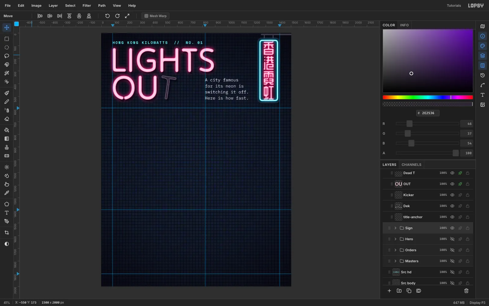

Hong Kong signs hang out over the street and read top to bottom. In a `Sign` group:
1. **Rounded plate.** Marquee **1236, 40 → 1410, 550**, then run **Select → Shrink…** 26 followed by **Select → Grow…** 26. Shrinking and then growing rounds off the corners. Fill the selection with `#140F1E`, and add a **Stroke** of 3 px in `#2E2838` and a soft Drop Shadow (Blur 30, 55%).
2. **Frame.** Repeat the rounded selection on a new layer at 1248, 52 → 1398, 538 with radius 20. Fill it `#D2F8FF`, **Shrink** by 9 and press **Delete** to hollow it out. Soften it with **Gaussian Blur 1.5** and apply the neon recipe in cyan `#19D8FF`.
3. **Arm.** Fill a `#3B3746` bar at 1262, 6 → 1400, 17 and two short rods down to the plate. Marquee the bar and use the **Move** tool to drag its right edge past the edge of the canvas, so the arm runs out of frame as if it's fixed to a wall.
4. **Characters.** Pick the Text tool, turn on **Toggle vertical text**, choose **ZCOOL QingKe HuangYou** at **118 px**, and paste `香港霓虹` (Hong Kong neon). Centre it on the plate at (1323, 295) and give it the neon recipe in `#FF2E6E`.

> **Tip:** Leave vertical mode by selecting another layer *first* and then clicking the toggle. If you click the toggle while the text layer is still active, the characters are laid out horizontally again.

## Draw the ring to scale

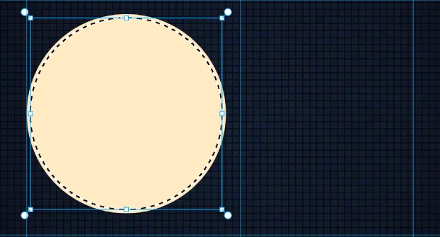

The hero chart compares two numbers by **area**, so compute the sizes instead of guessing them. With a large ring of radius 340, the 400 neon signs get a dot of radius 340 ÷ √(120,000 ÷ 400) ≈ **20 px**.

In a `Hero` group, on a `Big Ring` layer:
1. Draw an elliptical marquee centred on (430, 980) with a 340 px radius and fill it with `#FFEBC8`.
2. Choose **Select → Shrink…** 12 and press **Delete**, leaving a 12 px tube.
3. Run **Gaussian Blur 1.5** so the edges aren't jagged, then apply the neon recipe in amber `#FFA41C` (Outer Glow Size 44).

On a `Small Dot` layer, fill a 20 px radius disc at (430, 1225) and give it the pink neon. Keep it well inside the ring, so a dark gap shows between the two glows.

## Label the gap with a leader line

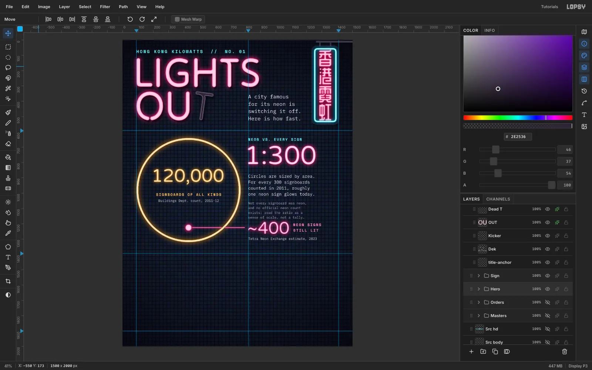

Add a `Leader` layer and pick the **Pen** tool. Click (456, 1225) and (796, 1225), then click **Commit path**. Set the foreground to `#FF7AB8`, open the **Paths** panel and click **Stroke Path** with **Width 4**. Where the line crosses the ring, marquee a 20 px gap and press **Delete**, so the two glows don't merge.

**Varela Round** keeps the tube feel but has closed zeros, which makes the numbers easier to read. Set the text layers:
- `120,000` at **118 px**, centred in the ring, with an amber glow. Under it, `SIGNBOARDS OF ALL KINDS` in Space Mono Bold and the source in IBM Plex Mono.
- The right column, all starting at x 820:
  1. A cyan header, `NEON VS. EVERY SIGN`.
  2. `1:300` at **170 px** in pink neon.
  3. Four lines of explanation.
  4. A dimmer caveat saying that not every signboard was neon.
  5. `~400` at **110 px**, centred on the leader line at y 1225, with `NEON SIGNS / STILL LIT` beside it.

> **Tip:** The two counts measure different things, so the caveat is part of the chart. Say plainly what a comparison can and can't show.

## Snap the bars to a grid

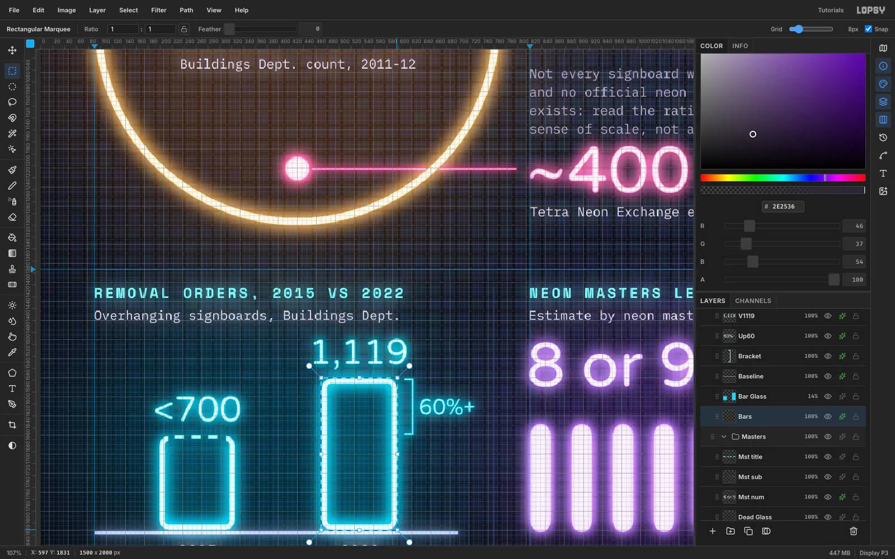

Make an `Orders` group with a `Bars` layer. Turn on **View → Show Grid**, set the grid to **8 px** and tick **Snap**. Scale the bars so that 1,119 orders is 255 px tall. Under 700 then works out at 160 px, and 255 ÷ 160 matches 1,119 ÷ 700.

Draw each bar as a rounded 8 px ring:
- 2015: marquee **199, 1673 → 325, 1831**.
- 2022: marquee **471, 1577 → 597, 1831**.

For each one, run **Shrink** 14 then **Grow** 14 to round the corners, fill with `#D2F8FF`, then **Shrink** 8 and **Delete**. Snap tidies the corners onto the grid.

The 2015 figure is only an upper bound ("below 700"), so don't draw a solid top on that bar. Marquee across the top edge between the corners and press **Delete**. Then untick Snap and fill three 16 × 6 px dashes where the top edge was. Blur by 1.5 and use the neon recipe in cyan.

## Label the bars and bracket the change

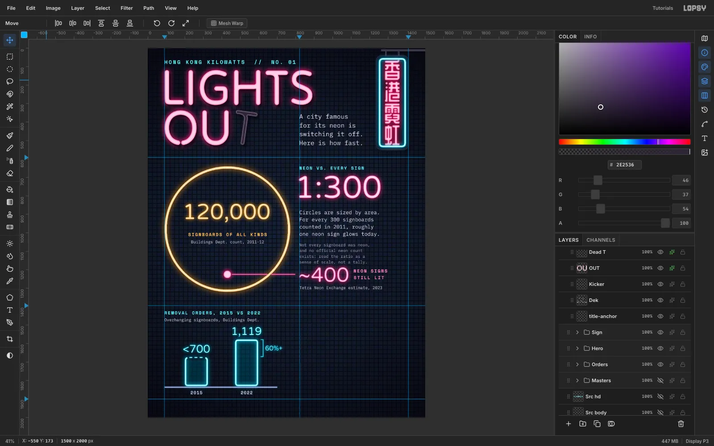

Add these layers:
- `Bar Glass` at 14% opacity, with a cyan fill inside each bar.
- A `Baseline`: a 6 px pale line from x 90 to 700.
- The header `REMOVAL ORDERS, 2015 VS 2022`, starting at x 90.

Centre `<700` and `1,119` (Varela Round, 60 px) over their bars and the years underneath.

To show the change, add a `Bracket` layer. Draw a 3 px line from the top of the 2022 bar down to the height of the 2015 bar, with short ticks at each end. Put `60%+` beside it, centred on the bracket. Use "60%+" rather than "+60%": the 2015 number is an upper bound, so the real rise is at least 60%.

## Count the neon masters in tubes

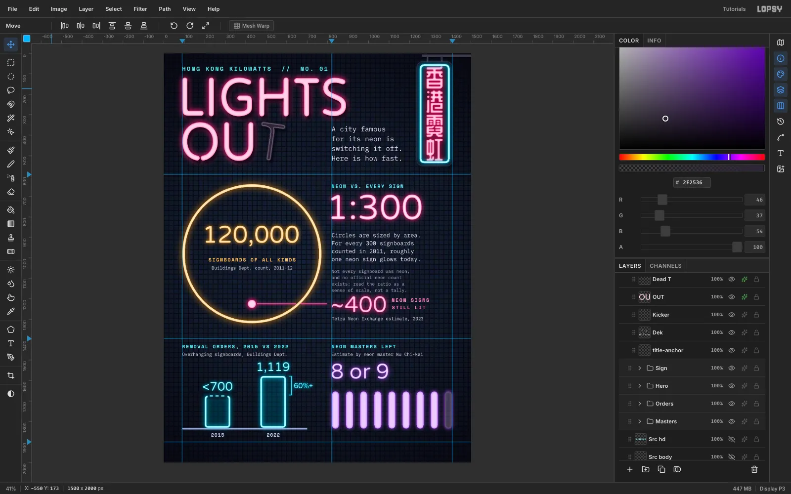

In a `Masters` group, fill eight 36 px wide rounded tubes from y 1652 to 1836, at x = 820 + 69 × n. Use `#E7CCFF` and Shrink/Grow 16 to round the ends. Blur them by 1.2 and apply the neon recipe in violet `#A64DFF` (Inner Glow Size 11).

The ninth tube stands for the "or 9". Put it on its own layer at **25%** opacity, and add a thin grey glass outline (fill `#5A5068`, **Shrink** 3, **Delete**) so it reads as a tube that's only flickering. Above the tubes, set `8 or 9` in Varela Round at 104 px with the same violet glow.

## Add light spill, rules and a footer

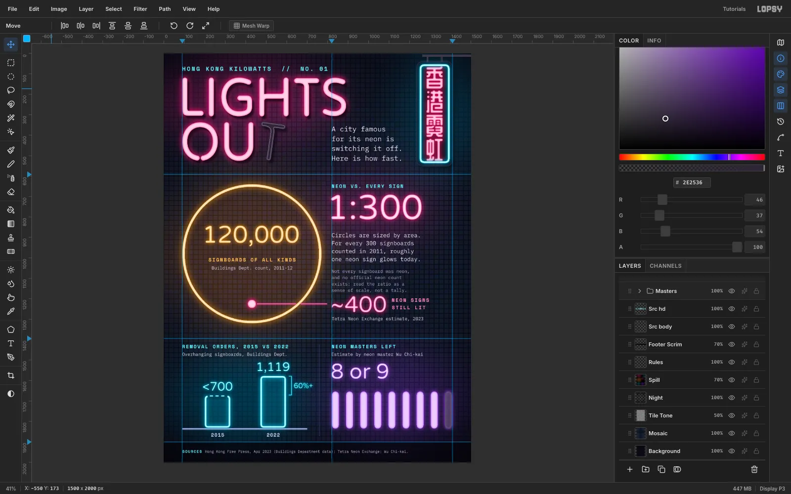

Neon lights up the wall behind it:
1. Add a `Spill` layer just above `Night` and fill it black.
2. Draw a feathered (60 px) ellipse behind each glowing element and fill it with a dark tint of that element's colour, such as `#5A1033` behind the title and `#4A2606` behind the ring.
3. Blur the layer by 90, then set it to **Screen** at 70%.

Starting from a black fill keeps the blur from leaving grey halos.

Draw 2 px rules in `#2B3658` along the band guides, plus a vertical rule at x 760 between the two bottom charts. Add a `Footer Scrim` over y 1900 → 2000 (`#05040A`, 70%) so the small source text stays readable over the tiles. Then set `SOURCES` in cyan Space Mono Bold, followed by the sources in IBM Plex Mono at 18 px.

## Finish with a Bloom pass

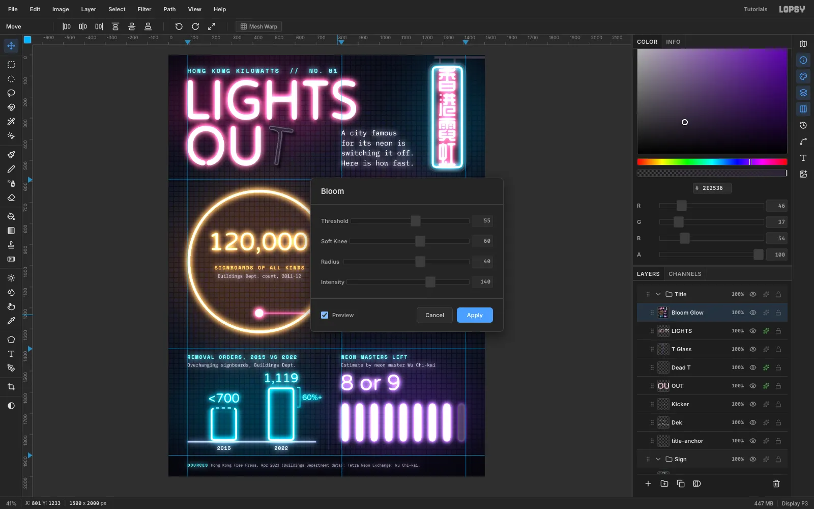

Select the `Title` group and choose **Edit → Copy Merged**. Wait a second, then press [[Cmd+V]]: a flattened copy lands at the top of the group. Rename it `Bloom Glow` and run **Filter → Bloom** with:
- **Threshold 55**
- **Soft Knee 60**
- **Radius 40**
- **Intensity 140**

Set the layer to **Lighten** at **75%**. The bright tubes now bleed light into each other the way real neon does, while the dark wall stays dark.

> **Tip:** Run Bloom on an opaque, flattened copy like this one. On a transparent layer the halo has nowhere to show.

The glow is baked into that copy. If you change anything underneath it later, delete `Bloom Glow` and redo this step. Export with **File → Quick Export PNG**.
