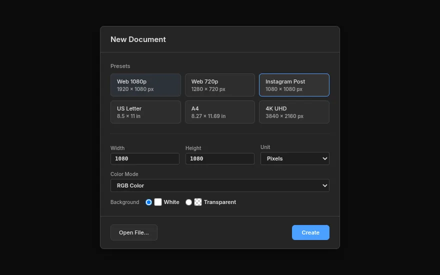
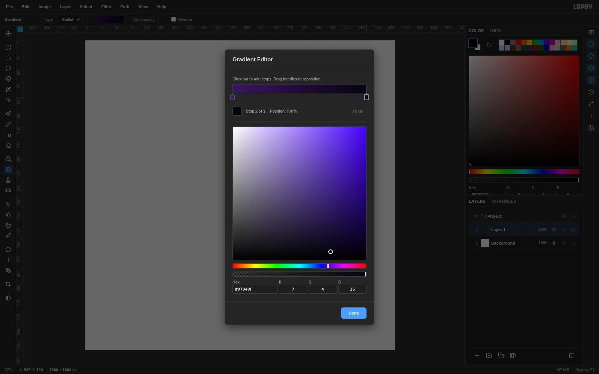
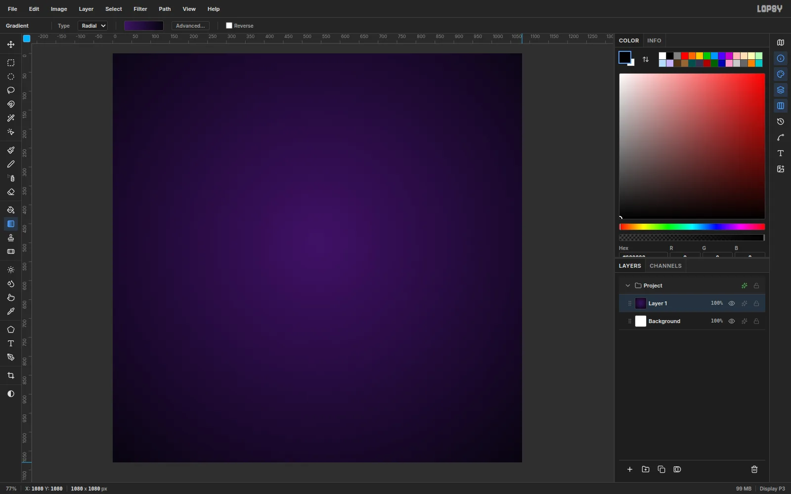
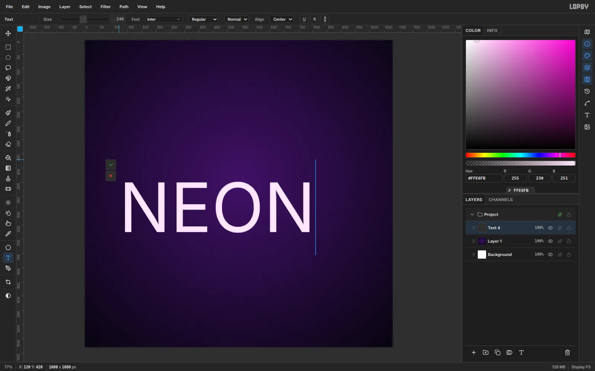
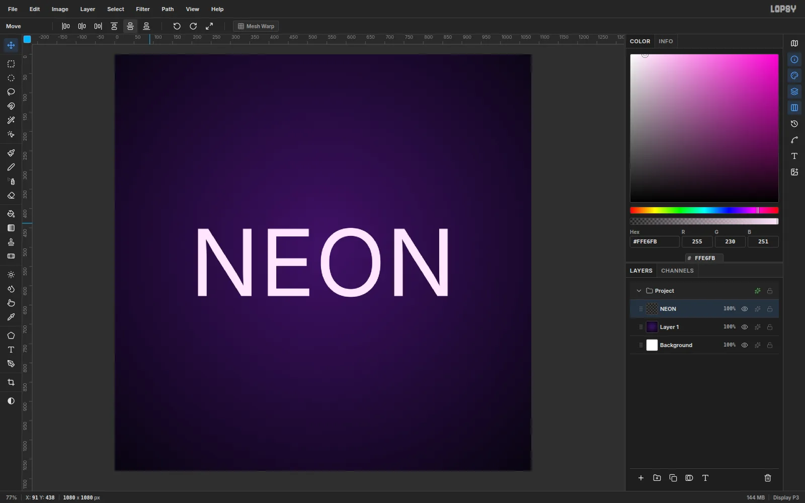
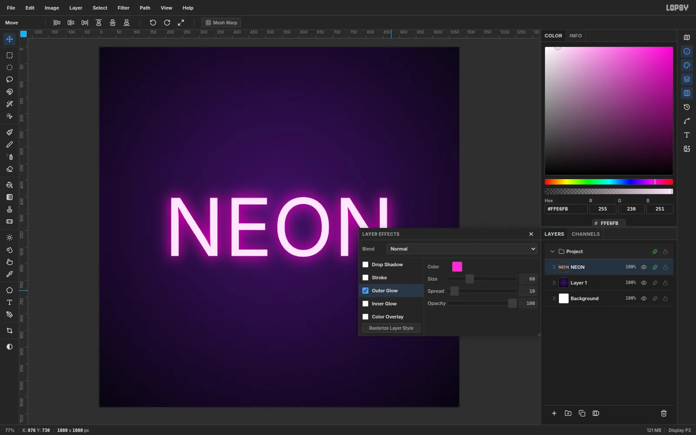
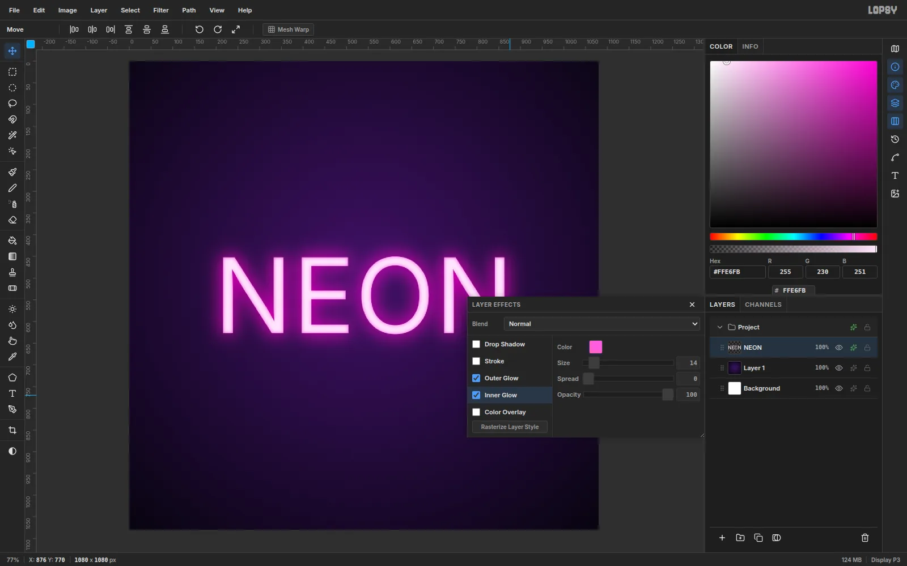
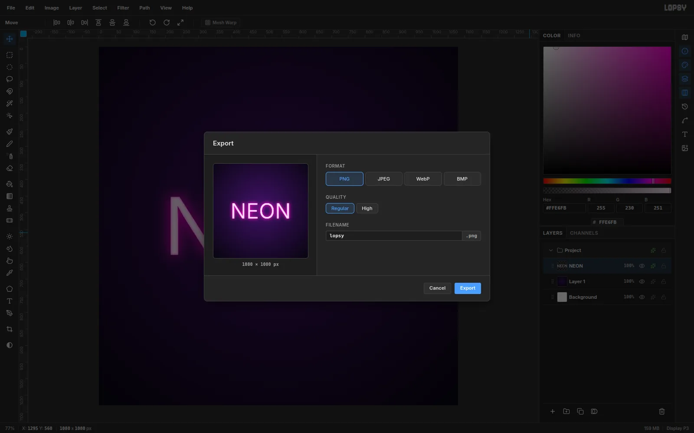

Neon signs are just bright text with light bleeding out around the edges. You
can get the same effect in a few minutes with a gradient, the Text tool and
two layer effects. The text stays fully editable, so you can change the words
or the color later without starting over.

## Create a square document

Open [Lopsy](/). The **New Document** dialog appears on its own. You can also
open it any time from **File → New**.

Choose the **Instagram Post** preset for a 1080 × 1080 px square, then click
**Create**.

## Pick dark gradient colors

Neon needs darkness to glow against. Select the **Gradient** tool in the
toolbox and set **Type** to **Radial** in the options bar along the top.

Click the gradient swatch next to it to open the **Gradient Editor**. Select
the left stop and enter `#3B1463` as its hex value, then select the right stop
and enter `#07040F`. Click **Done**.

## Paint the background

Make sure **Layer 1** is selected in the Layers panel. Then drag from just
above the middle of the canvas out to a corner.

The lighter center gives the sign something to sit in front of, and the dark
corners make the glow stand out.

> **Tip:** Didn't like the spread? Press [[Ctrl+Z]] ([[Cmd+Z]] on a Mac) and
> drag again. Shorter drags make a tighter spotlight.

## Type your text

In the **Color** panel, set the hex value to `#FFE6FB`, a very pale pink. Real
neon tubes look almost white at their core, and the glow will add the color.

Press [[T]] for the **Text** tool and set **Size** to `240` in the options
bar. Click near the left side of the canvas and type `NEON`. Then click the
green check mark to commit the text.

## Center it on the canvas

Press [[V]] for the **Move** tool. With the text layer selected, click **Align
center horizontally** and then **Align center vertically** in the options bar.
The text snaps to the exact middle of the canvas.

## Add an outer glow

In the Layers panel, click the sparkle icon on the **NEON** layer to open
**Layer Effects**. Tick **Outer Glow** and set:

- **Color:** `#FF2BD6` (hot pink)
- **Size:** `60`
- **Spread:** `10`
- **Opacity:** `100`

This is the light spilling out into the air around the tube.

## Add an inner glow

Tick **Inner Glow** in the same panel and set **Color** to `#FF5CE1`, **Size**
to `14` and **Opacity** to `100`.

The inner glow tints the edges of each letter while the center stays pale.
That's what gives the letters the rounded look of a real glass tube.

> **Tip:** Try other colors. Cyan (`#2BF3FF`) or lime (`#8CFF2B`) glows work
> just as well. Keep the text color pale and put the strong color in the
> glows.

## Export your image

Choose **File → Export…**, pick **PNG**, give the file a name and click
**Export**.

Want to keep editing later? Use **File → Save Project** instead. That keeps
the text and effects editable.
