A real neon sign is a thin glass tube with a white-hot core. Colored light
bleeds around it, it throws a shadow on the wall, and it tints everything
nearby. In this tutorial you'll fake all of that in Lopsy for **Saturn
Skate Night**, a 1200 × 1600 px flyer for a roller disco.

You'll draw tubes with marquee fills and **Select → Shrink**, and cut gaps
where tubes cross, just as a sign bender would. Each tube gets three layer
effects: Inner Glow, Outer Glow and Drop Shadow. Pools of blurred colored
light finish the effect.

The palette:

- Brick wall `#452738`, mortar `#0B070D`, background `#140E18`
- Hot pink `#FF2D95`, amber `#FF9A1F`, cyan `#16D9FF`, violet `#A64DFF`
- Tube cores `#FFD3EE` / `#FFE2B0` (pale tints, so the Inner Glow can color the edges)

## Draw a brick tile

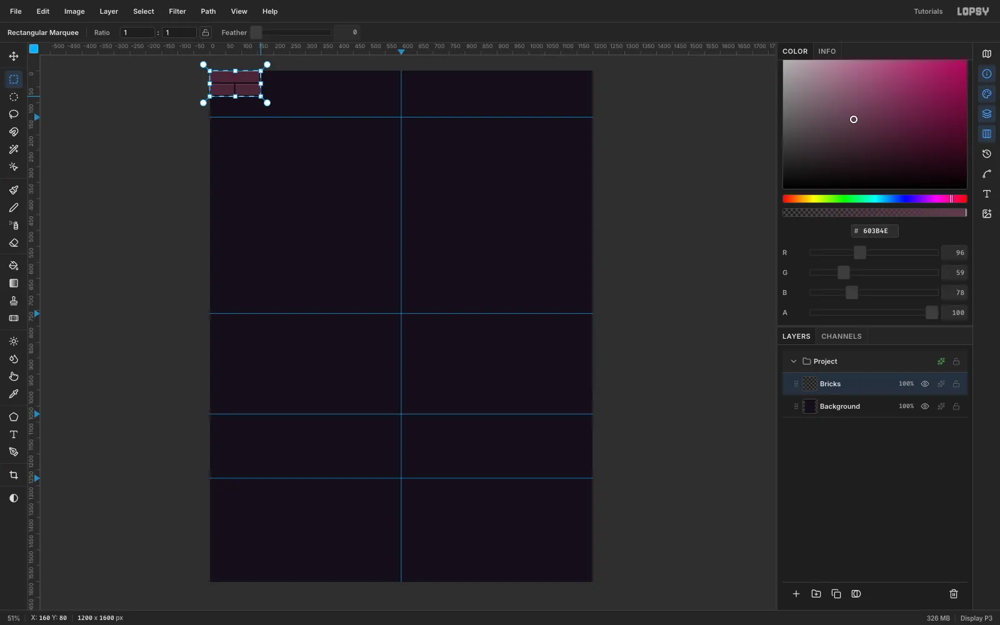

Choose **File → New**, set the unit to **Pixels**, and create a **1200 × 1600**
document. Add guides by clicking the rulers (a single click drops a guide):

- [[Cmd]]-click ([[Ctrl]]-click) the middle of the top ruler. Holding [[Cmd]]
  snaps the guide to the exact centre line.
- On the left ruler, click at about **145**, **760**, **1075** and **1276**.
  The ruler shows a readout as you hover, so you can land close to each
  one. These mark the top of the headline, the planet's centre, the top of
  SKATE NIGHT and the top of the information block.

Fill the **Background** with `#140E18`. On **Layer 1** (rename it
*Bricks*), build one 160 × 80 tile of a running bond in the top-left corner
using the **Rectangular Marquee** and **Edit → Fill**:

1. Fill the whole 160 × 80 rectangle with the mortar colour `#0B070D`.
2. Fill three bricks with `#452738`, leaving 4 px of mortar between them:
   a full 156 × 36 brick across the top row, then two half-bricks in the
   bottom row: 76 × 36 from the left edge, and 80 × 36 from the middle to
   the right edge.
3. Fill a 3 px strip of `#603B4E` along the top of each brick. This catches
   the light.

> **Tip:** Exact rectangles are easiest with the corner dialog. With
> nothing selected, click once (no drag) with the **Rectangular Marquee**
> and type **From** and **To** values, for example `0`, `40` → `76`, `76`
> for the left half-brick.

## Tile it across the wall

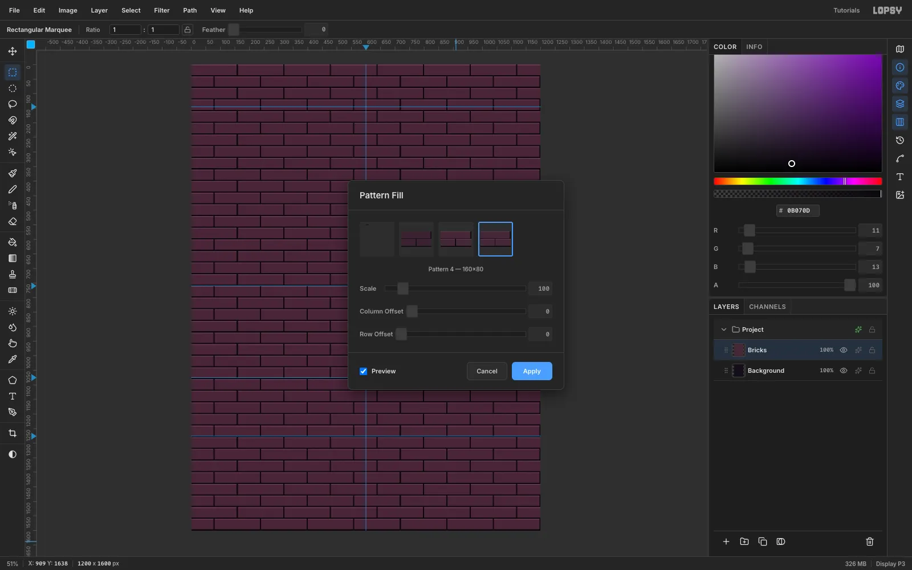

Select exactly the tile, **0, 0 → 160, 80**. Turn **Snap** off if the grid
is on. Choose **Edit → Define Pattern**.

Press [[Cmd+D]] to deselect, then choose **Edit → Fill with Pattern...**,
pick the 160 × 80 brick pattern and click **Apply**. With nothing selected,
the pattern covers the whole layer.

## Add grain to the bricks

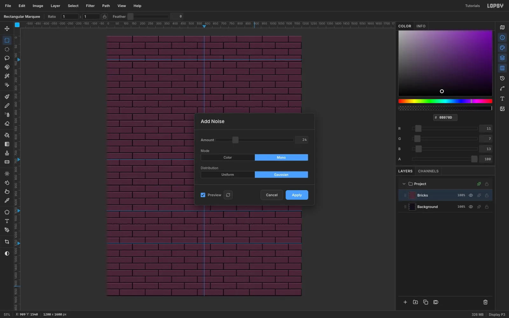

Flat bricks look like vector art. With **Bricks** active, choose **Filter → Add
Noise...**, click **Mono** and **Gaussian**, set **Amount** to **24** and
apply.

## Darken the wall

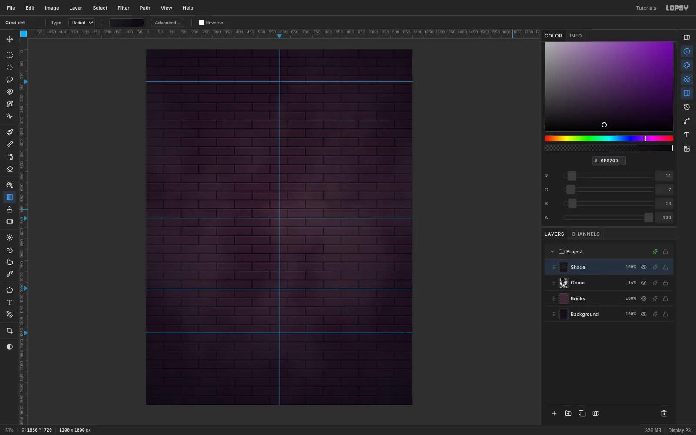

Neon only glows against darkness.

1. Add a layer called *Grime* and run **Filter → Clouds...**. Set its blend
   mode to **Screen** at **14%** opacity, which gives the bricks a faint uneven
   sheen.
2. Add a layer called *Shade* and select the **Gradient** tool with **Type**
   set to **Radial**.
3. In **Advanced...**, set both stops to `#0A0610`, with about **30%** opacity
   on the left stop and **93%** on the right.
4. Drag from the middle of the wall, near where the centre guide crosses the
   760 guide, about 1050 px outward, past a corner. The centre stays
   readable and the corners drop away.

## Bend the planet tube

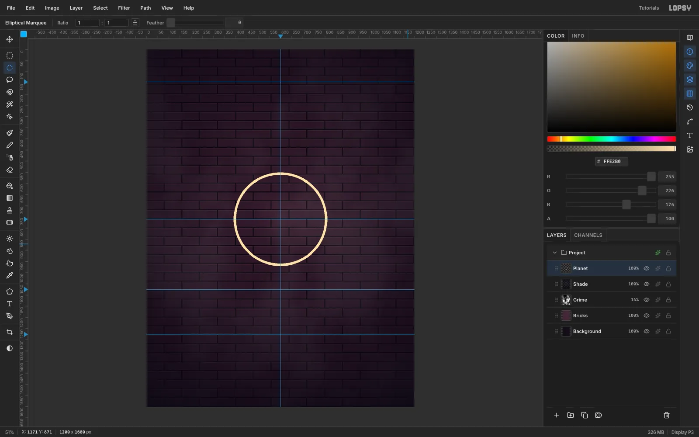

Every tube in this flyer is built the same way. Fill a shape, shrink the
selection by the tube width, then delete the middle.

Add a layer called *Planet*. With the **Elliptical Marquee**, hold [[Cmd]] and
drag a 420 px circle centred on the point where the centre guide crosses the
760 guide. Fill it with the pale amber core colour `#FFE2B0`. Choose
**Select → Shrink…**, set **10** px, click **Apply**, and press [[Delete]].
What's left is a 10 px ring.

## Clip each latitude band

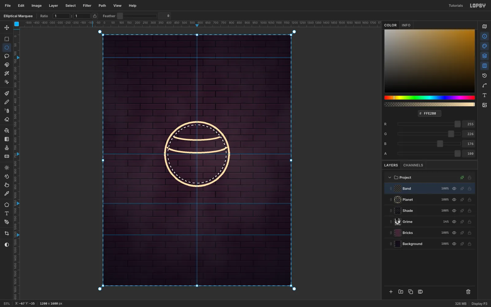

Saturn's bands should curve around the sphere instead of running straight
across it. For each band, add a new layer and draw a flat elliptical ring
the same way (fill, **Shrink 9**, [[Delete]]). Then:

1. Marquee the top half of that ellipse and press [[Delete]]. That leaves
   the lower arc, a "smile" that reads as a line of latitude.
2. [[Cmd]]-drag a 372 px circle centred on the planet, 24 px inside its
   outer edge, and choose **Select → Inverse**. Press [[Delete]] so the band
   stops 14 px inside the outline.
3. Choose **Layer → Merge Down** to merge the band into *Planet*.

Use three bands: two above the middle of the planet and one near the
bottom.

## Check the bands

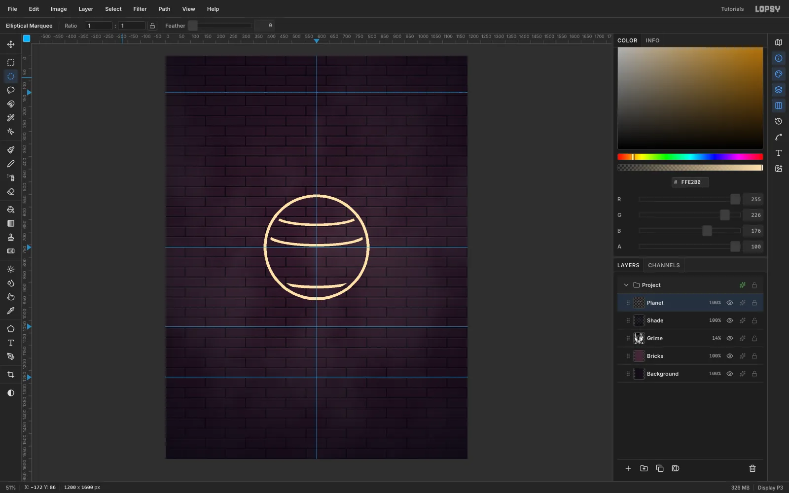

The bands follow the curve of the sphere and stop short of the outline at
both ends. The gap in front of them is where the ring will pass.

## Cut the ring's back arc

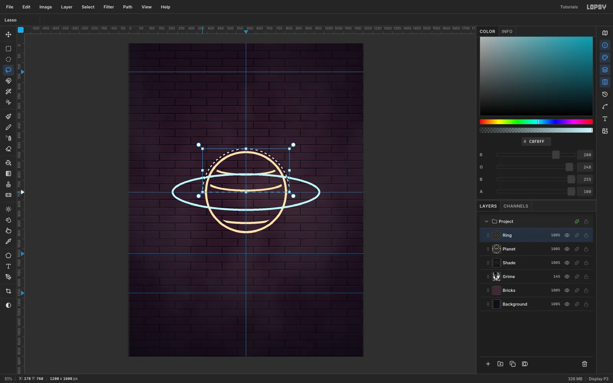

Add a layer called *Ring* and make a 760 × 192 elliptical tube (**Shrink 9**)
in pale cyan `#C8F8FF`, centred on the planet.

On a real sign the back of the ring is hidden behind the planet. With the
**Lasso**, trace a half-circle just outside the planet's outline over the top
half, then press [[Delete]]. The back arc disappears inside the planet, and
the ring ends leave a small gap before the outline.

## Leave gaps where tubes cross

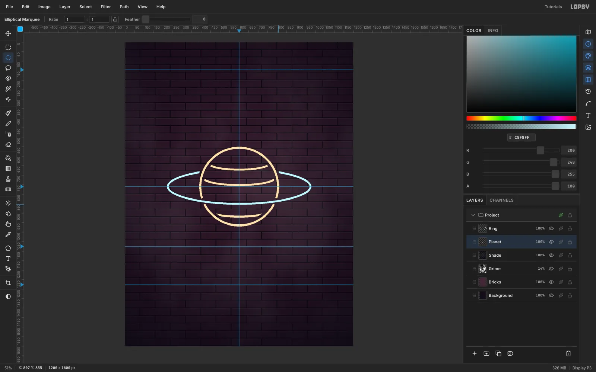

Neon tubes never overlap. A bender leaves a gap where one tube passes in front
of another. Click the *Planet* row, draw two small 34 px circles where the
front of the ring crosses the outline, and press [[Delete]] in each.

## Tilt the planet and ring together

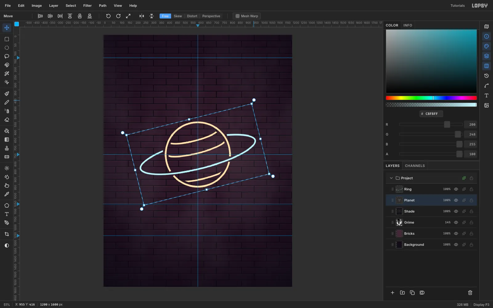

Rotate each layer with the same marquee so they share a pivot. Press
[[Cmd+D]], then click once with the **Rectangular Marquee** and enter
**From** `190`, `530` and **To** `1010`, `990`. That's an 820 × 460 box
centred on the planet. Select the **Move** tool, drag the rotate handle
outside the top-right corner **14°** counter-clockwise, and press [[Cmd+D]]
to commit. Click the other layer and repeat with the identical marquee.
The gaps you cut line up perfectly again.

## Smooth the tube edges

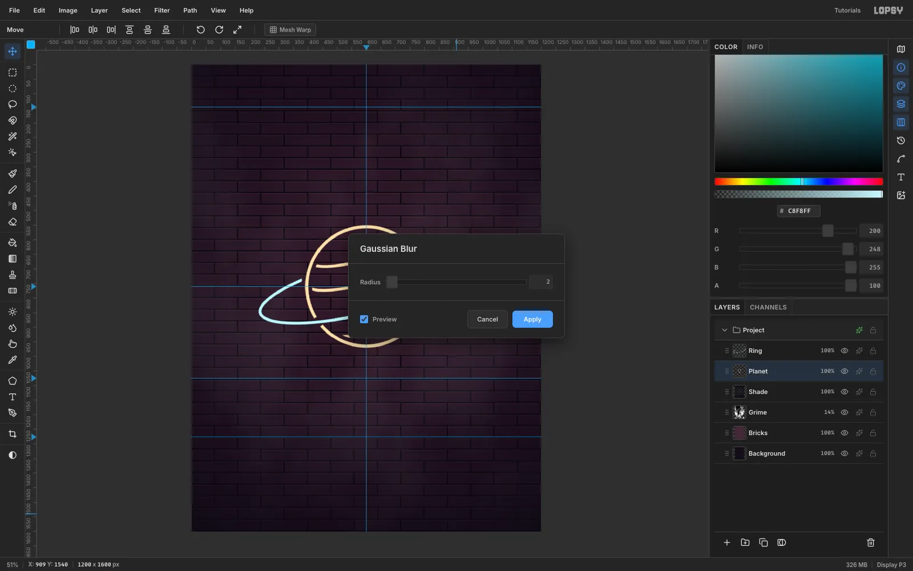

Marquee fills are hard-edged, so the tubes look slightly jagged. Run **Filter
→ Gaussian Blur...** at **Radius 2** on each tube layer. This works as
anti-aliasing without making the tube look blurry.

## Light the tubes

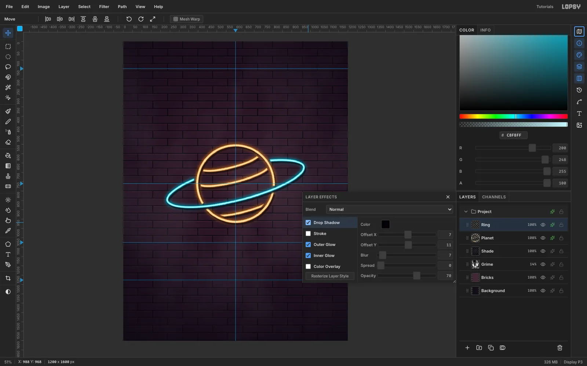

Open the layer effects (the sparkle button on the layer row) and enable
three effects:

- **Inner Glow:** the tube colour (`#FF9A1F` for the planet, `#16D9FF` for
  the ring), Size **5**, Spread **30**, Opacity **100**. This colours the
  edges and leaves the pale core looking white-hot.
- **Outer Glow:** the same colour, Size **26**, Spread **18**, Opacity
  **85**.
- **Drop Shadow:** near-black `#050208`, **Offset X** **7**, **Offset Y**
  **11**, Blur **7**, Opacity **70**. The tube now seems to stand off the
  wall.

## See the planet light up

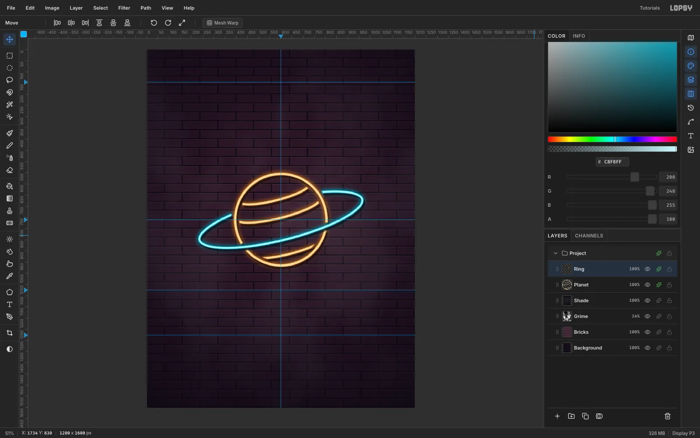

That's the whole neon recipe: a pale core, a coloured edge, a halo and a
shadow. Everything else in the flyer reuses it.

## Set the script headline

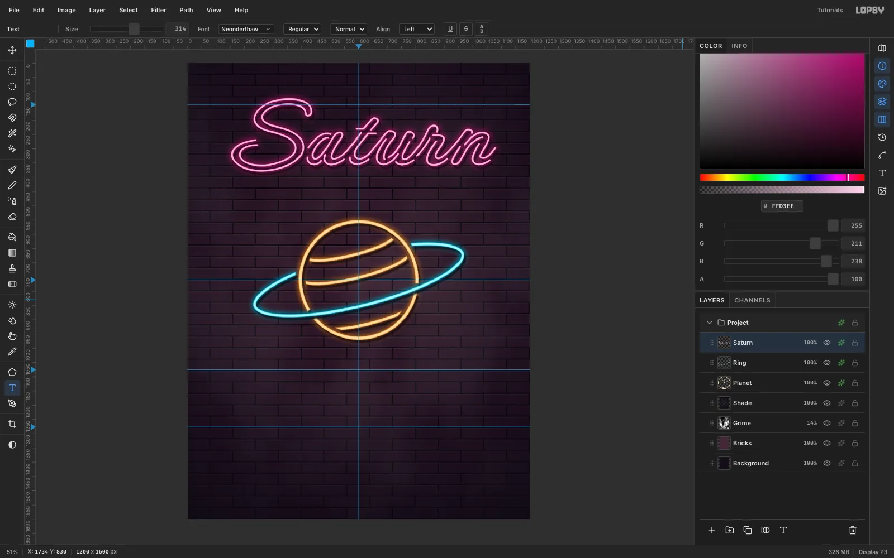

Click *Ring* first. The new text layer is added above the active layer, and
while a text layer is active, changing the Text settings restyles it. Select
the **Text** tool and choose **Neonderthaw** (a Google font drawn as single
tube strokes). Set **314** px and the colour `#FFD3EE`, then click in the
empty space at the top and type *Saturn*.

Give it the same three effects in hot pink `#FF2D95`: Inner Glow Size
**4**, Outer Glow Size **30**, Spread **20**.

## Tilt the script

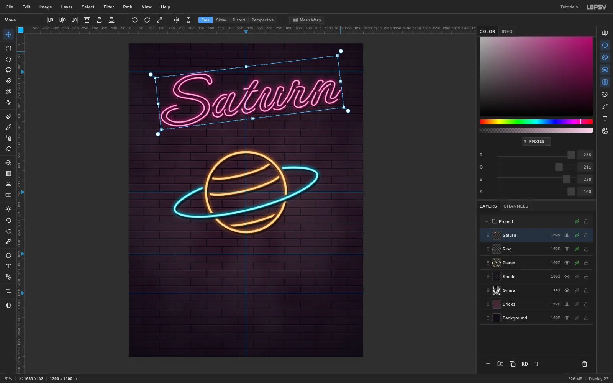

Script neon looks livelier with a slight upward lean. Marquee around the word,
switch to **Move**, and drag the rotate handle **7°** counter-clockwise. Press
[[Cmd+D]], then use the arrow keys to nudge it until the pink core is centred
on the centre guide with its top on the 145 guide. The text stays editable.

## Track out SKATE NIGHT

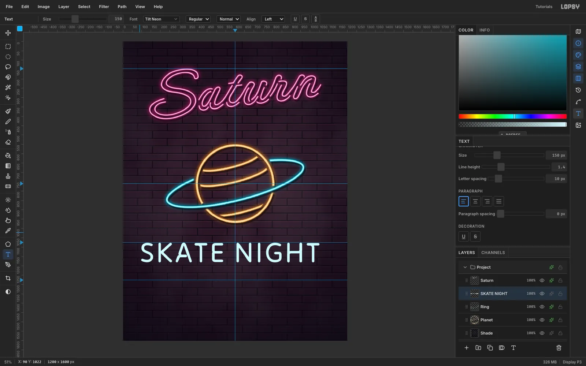

Click a raster layer such as *Ring* again, so your new settings don't
restyle *Saturn*. Type **SKATE NIGHT** in **Tilt Neon** at **150** px in
`#D8FBFF`, clicking just above the 1075 guide. In the **Text** panel, set
**Letter spacing** to **10** px so the capitals don't touch.

## Centre it and make it glow

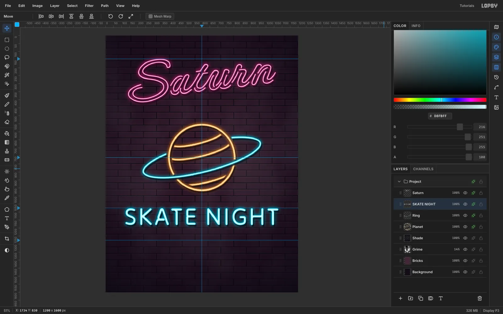

With the **Move** tool, click **Align center horizontally** in the options
bar. Add the tube effects in cyan `#12D6FF` (Inner Glow **6**, Outer Glow
**30** / Spread **20**).

## Draw the roller skate

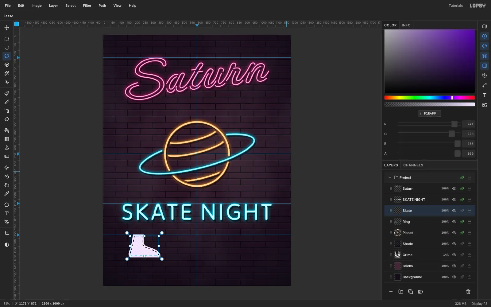

Add a layer called *Skate*. Trace the boot with the **Lasso**: a tall cuff, a
curved instep down to a rounded toe, and a flat sole. Fill it with lilac
`#F1E4FF`, then **Shrink 9** and press [[Delete]] to leave the outline.

Add two wheel rings (48 px circles, **Shrink 9**). Fill short 8 px stubs
joining each wheel to the sole. Fill capsules for two laces and a side
stripe: a rectangle with a circle at each end.

## Light the skate

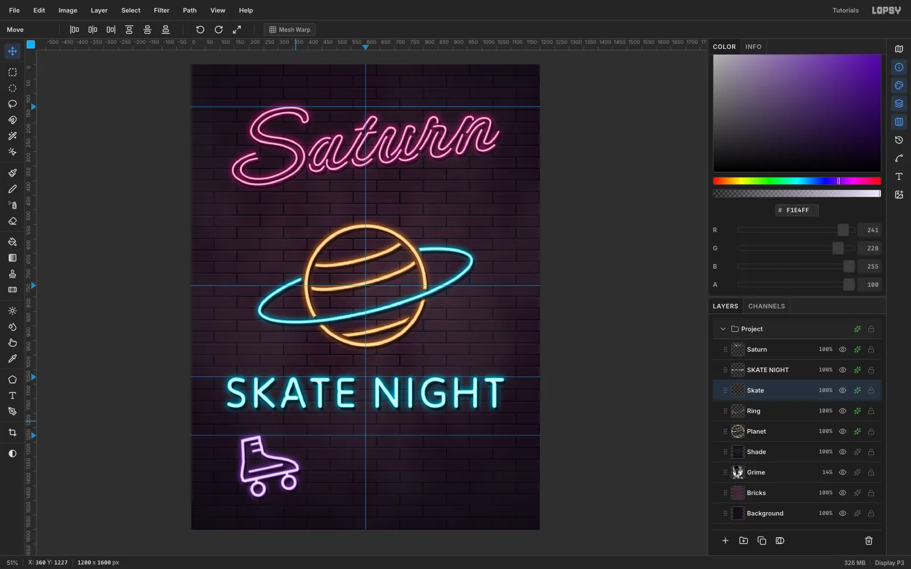

Run **Gaussian Blur** at **Radius 2** on the skate, then add the tube
effects in violet `#A64DFF`. Marquee it and rotate it **12°**
counter-clockwise with the **Move** tool so the toe kicks up, then press
[[Cmd+D]].

## Add the event details

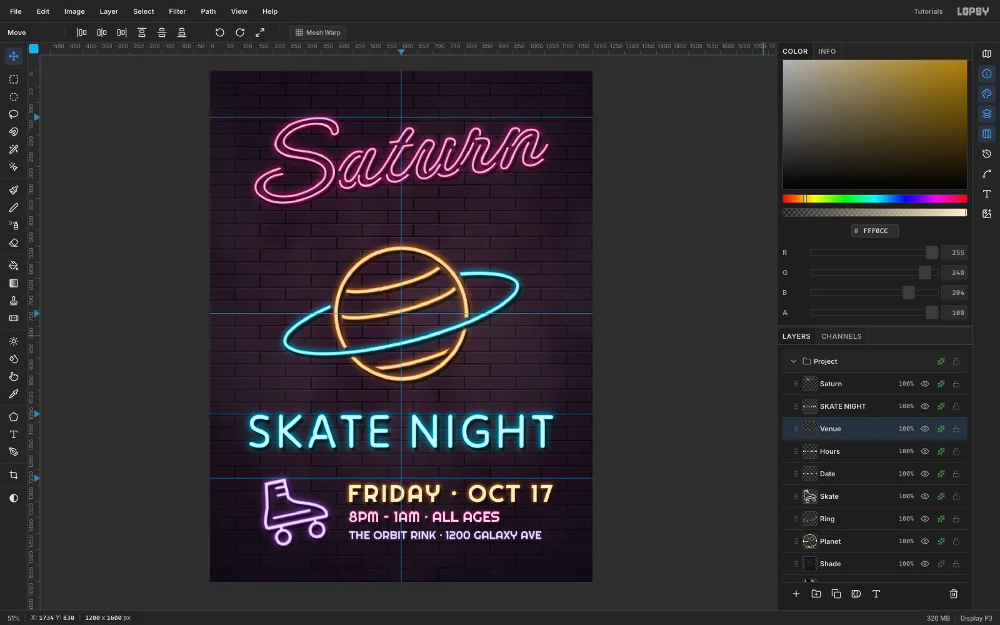

Create the lines **bottom-up** in empty canvas, so a new click doesn't land
inside an existing text box:

- `THE ORBIT RINK · 1200 GALAXY AVE`: Righteous **36** px, `#EDE3FF`
- `8PM – 1AM · ALL AGES`: Righteous **46** px, `#FFE0F2`
- `FRIDAY · OCT 17`: Righteous **76** px, `#FFF0CC`, Letter spacing **6**

> **Tip:** Type characters such as `·` and `–` by pasting them with
> [[Cmd+V]].

Line up the left edges, and nudge until the gaps between the lines are equal
(about 28 px). The block should sit centred on the skate icon. Give each line
a small tube in its colour: Inner Glow **2–3**, Outer Glow **10–18**.

## Group the information block

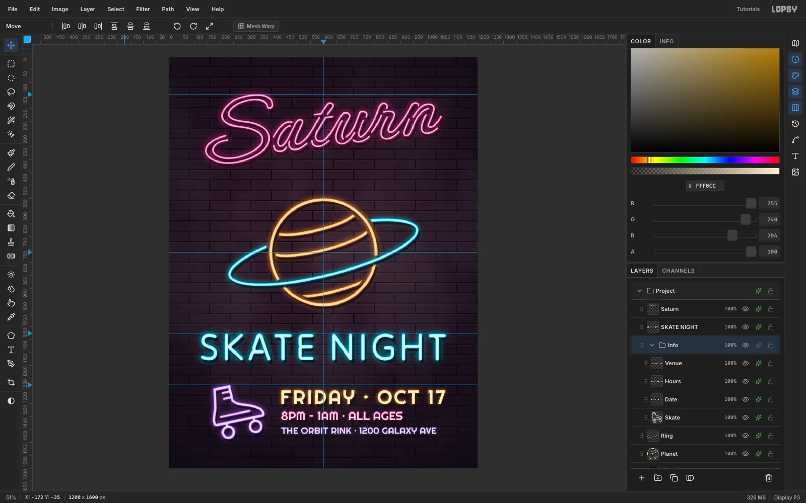

Click the top text layer, then [[Shift]]-click **Skate** to select all four.
Choose **Layer → Group Layers** and rename the group *Info*.

## Centre the group

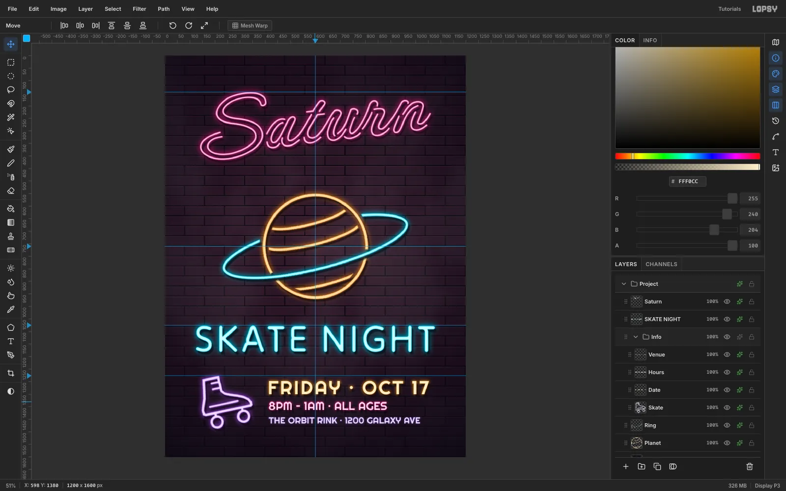

With *Info* active, drag with the **Move** tool to move the whole group at
once, until the block from the skate to the end of the date is centred on the
centre guide.

## Scatter a few stars

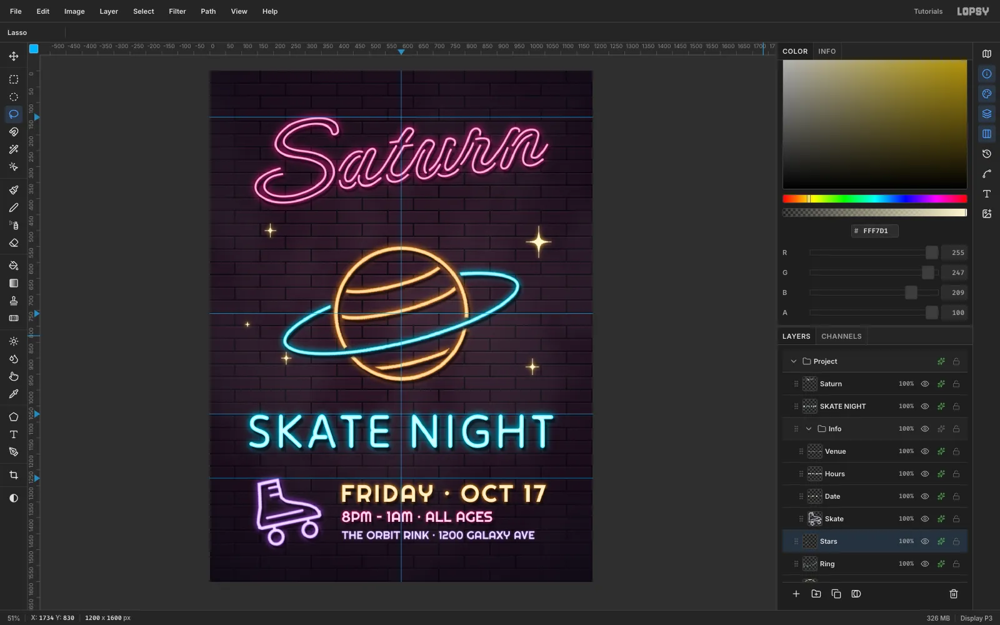

On a layer called *Stars* above the ring, lasso five four-pointed sparkles in
`#FFF7D1`. Make one large (about 100 px across) and the rest small. Place
them unevenly so no two mirror each other. Blur them by 2 and add an Outer
Glow in `#FFC93C`.

## Paint pools of colored light

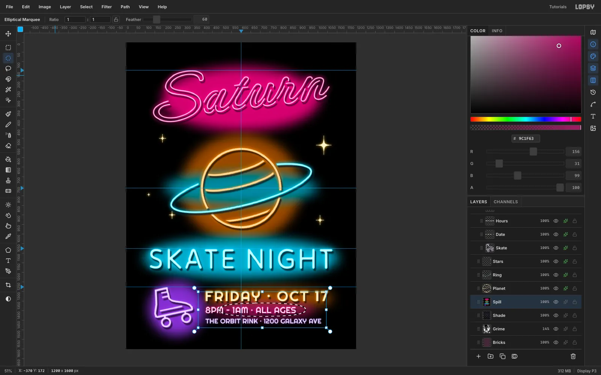

Neon tints the wall around it. Add a *Spill* layer above *Shade* and fill it
completely with **black**, which disappears in Screen mode. Set the
Elliptical Marquee's **Feather** to **60**. Fill ellipses behind each sign in
a darker version of its colour:

- dark pink behind *Saturn*
- brown-amber in a large pool around the planet
- teal along the ring and under SKATE NIGHT
- violet at the skate
- amber and pink behind the text

Reset Feather to **0** afterwards.

## Soften the light into the wall

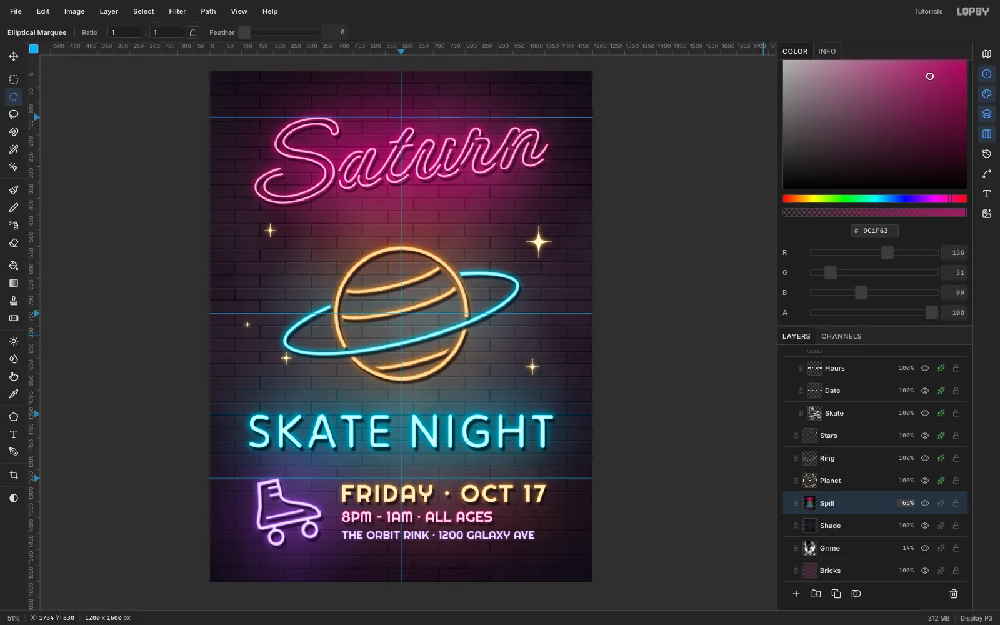

Run **Gaussian Blur** at **90** on *Spill*, set its blend mode to **Screen**
and its opacity to **65%**. Screen ignores the black completely, so only the
coloured light is added, and the heavy blur melts the pools into the bricks.

## Add a wide halo

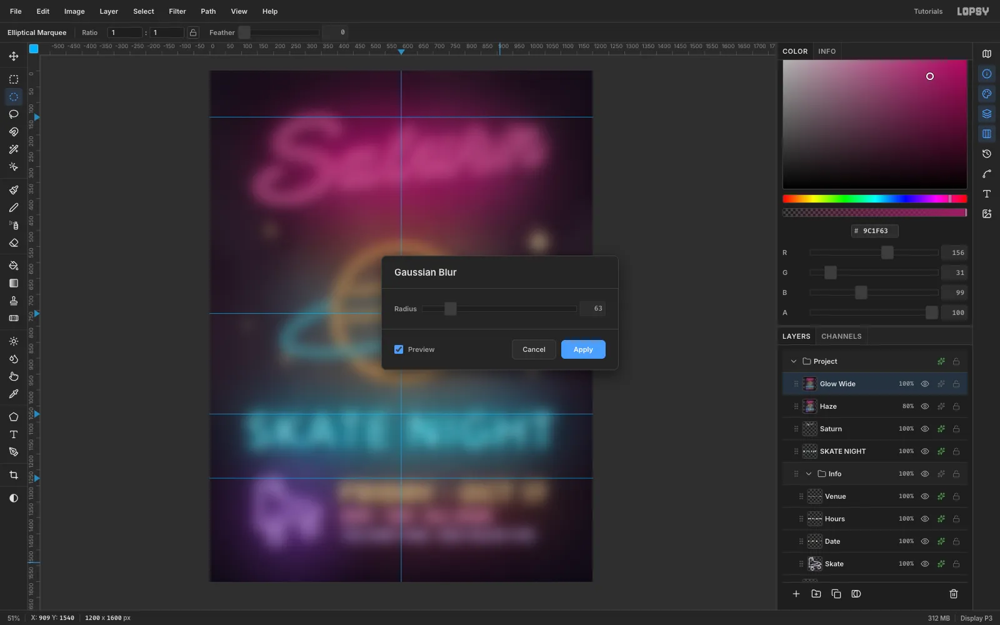

Click the top layer, choose **Edit → Copy Merged**, then press [[Cmd+V]].

1. Name the paste *Haze*. Blur it at **26**, set it to **Lighten** at
   **80%**.
2. Paste again and name it *Glow Wide*. Blur it at **63**, set it to
   **Screen** at **18%**.

This adds the soft bloom a camera sees around bright neon.

## Finish and export

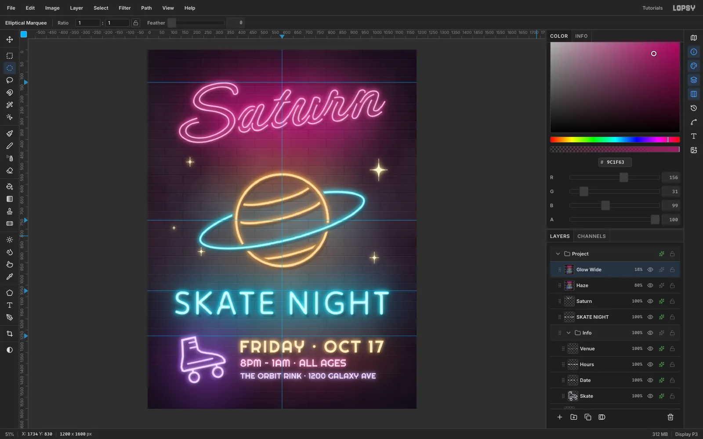

Hide the guides with **View → Show Guides** if you like, then choose
**File → Quick Export PNG** for the flyer and **File → Save Project** to keep
an editable `.lopsy` copy.

To make another night, double-click the date or venue text and retype it.
Then repeat the Copy Merged haze step so the glow matches the new words.
