Real neon is glass tube bent over a flame. It's one even line with rounded ends and a white-hot core, and its light washes over whatever it's mounted on. This tutorial fakes all of that for a poster advertising *Karaoke Cowboy*, a made-up Thursday open-mic night at the *Silver Spur Saloon*:
- a brick-wall photo graded down to night
- tubes drawn with the **Pen tool** and **Stroke Path**, or cut from selections with **Shrink**
- outline-tube lettering traced around painted letter faces
- **Inner Glow** for the hot core, **Outer Glow** for the halo, then light pools and a **Bloom** pass that make the bricks look lit

The wall is the CC0 photo `Red brick wall (Unsplash).jpg` from Wikimedia Commons. Crop its left 1400 × 1750 px and scale it to 1600 × 2000 px before you start.

The palette:

- Night tint `#3C4266`
- Amber tube `#FFE3AE`, amber glow `#FF9F1A` / `#FF8A12`
- Turquoise tube `#CFFBFF`, turquoise glow `#16D6E6`
- Pink tube `#FFD3E8`, pink glow `#FF2E93`
- Raceway `#2A2B33`, letter faces `#4A1C1A`
- Board `#5C1A1C`, cream paint `#EADBB8`, bulbs `#FFF3D1` / `#FF7A00`

Every tube is drawn in its **pale core colour**. The saturated colour only ever comes from the glow effects, and that's what makes it read as lit glass and not paint.

## Paste the brick wall photo

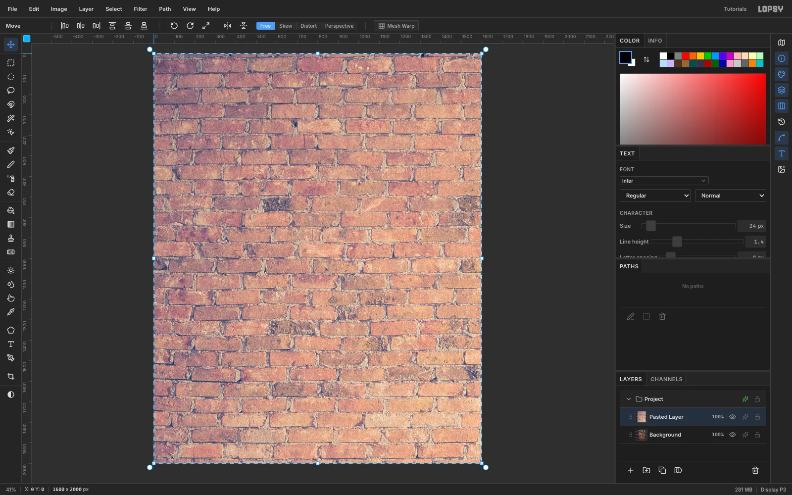

1. Create a **1600 × 2000 px** document (**File → New**, Unit = Pixels, White background).
2. Copy the cropped brick photo in your image viewer and press [[Cmd+V]] in Lopsy. A clipboard image is fitted to the canvas, centred and selected with the Move tool.
3. Press [[Cmd+D]] to drop the selection, and rename the layer `Brick Wall`.

## Grade the wall down to night

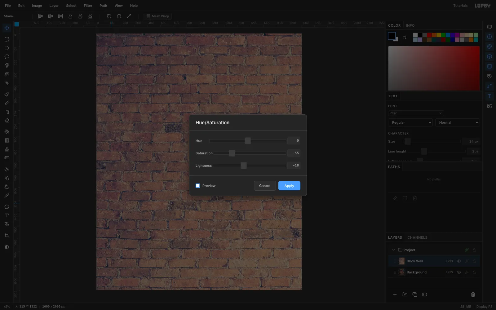

1. Run **Filter → Hue/Saturation** with Hue **0**, Saturation **−55**, Lightness **−18**.
2. Run **Filter → Brightness/Contrast** with Brightness **−10**, Contrast **+20**.

Go easy here. Lightness is added straight onto the HSL lightness, so −38 crushes mid-tone bricks to black. Brightness adds its value straight on as well.

## Add a night tint and guides

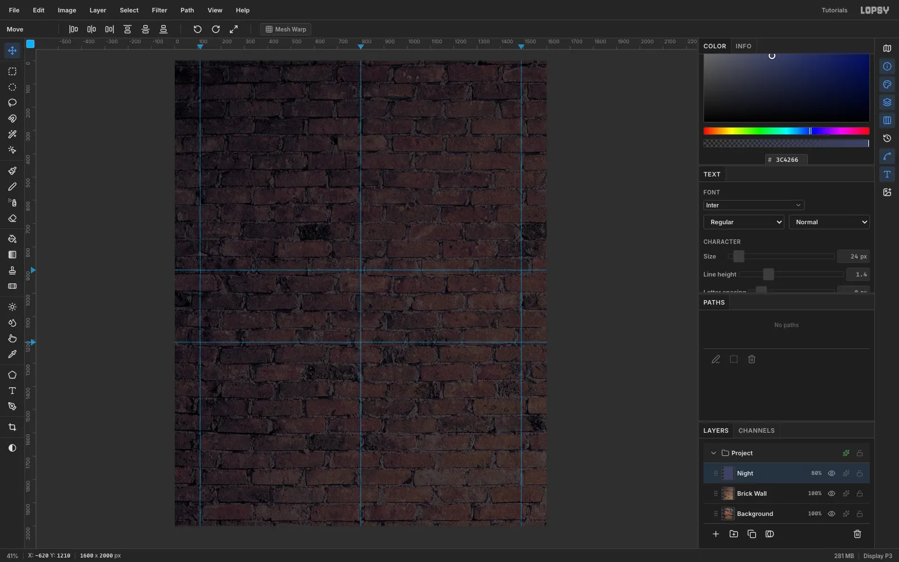

1. Add a layer named `Night`, fill it with `#3C4266` (**Edit → Fill** with nothing selected), set it to **Multiply** in the effects drawer's Blend menu, and drop the row opacity to **80%**.
2. Click the top ruler at x **110**, **800** and **1490** for vertical guides: the margins and the centre line. Click the left ruler at y **900** and **1210** for the top and bottom of the main sign.

## Draw the cowboy hat with the Pen tool

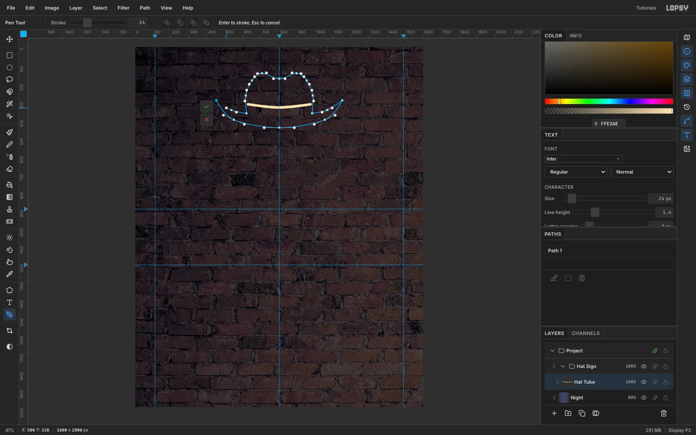

1. Make a group `Hat Sign` and inside it a layer `Hat Tube`. Set the foreground to `#FFE3AE`.
2. Pick the **Pen** tool and set **Stroke** to **14** in the options bar.
3. Draw the hat band first: click (626, 318), drag out a smooth point at (800, 336), click (974, 318), then press [[Enter]]. Enter adds the path *and* strokes it.
4. Now the outline. Click the brim tips (450, 296) and (1150, 296) and the crown corners (618, 368) and (982, 368). Every other point is a press-and-drag that pulls out handles. Go along the brim's underside, up the right side of the crown, across the dented top (dip to (800, 176)) and back down the left.

## Close and stroke the hat outline

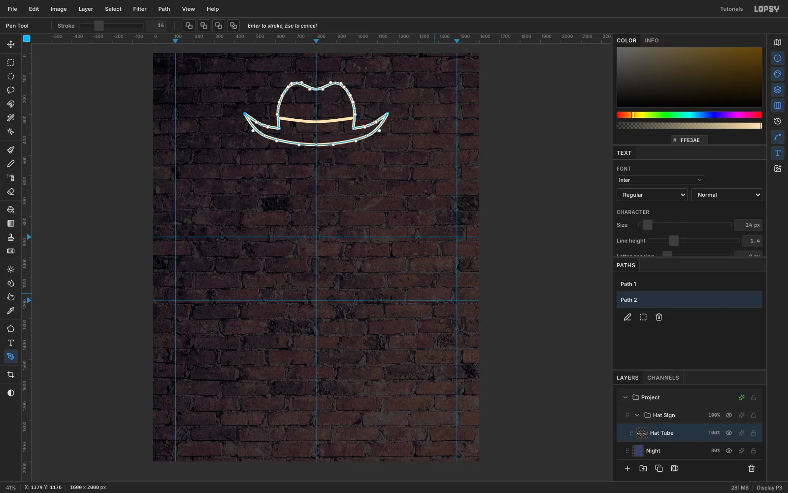

Click back on the first anchor to close the outline, then press [[Enter]] to stroke it at **14**. Deselect the path's row in the **Paths** panel afterwards to hide its anchors.

## Cut a lasso ring with Shrink

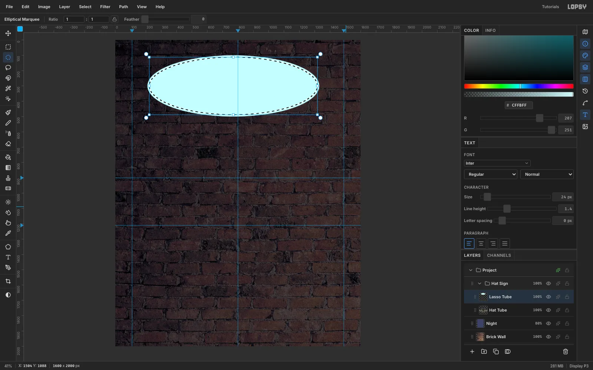

1. Add `Lasso Tube` and set the foreground to `#CFFBFF`.
2. Drag an **Elliptical Marquee** from (210, 100) to (1330, 500) and fill it.
3. Run **Select → Shrink** by **12** and press [[Delete]]. What's left is a ring of perfectly even width: a tube.

## Rotate the lasso

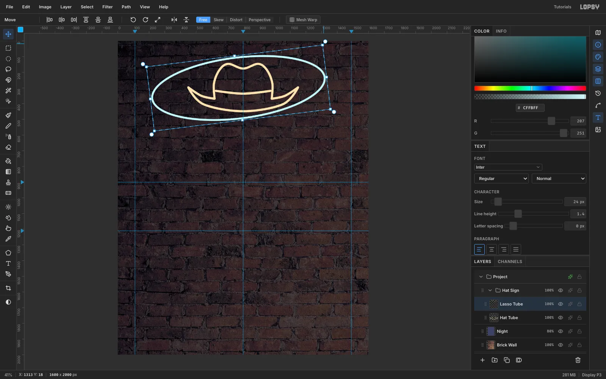

Drag a rectangular marquee just outside the ring, switch to the **Move** tool, and drag the rotation handle (just outside the top-right corner, where the cursor turns into a crosshair) by **−7°**. Press [[Cmd+D]] to commit. The tilt makes it read as a rope in motion and not a badge.

## Add the honda, the cord and the microphone

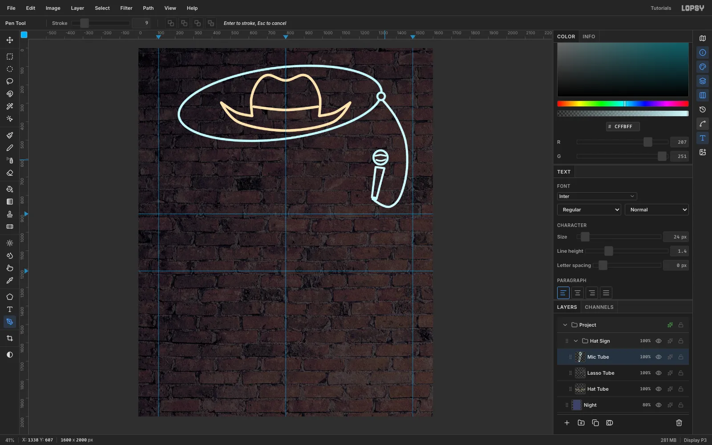

1. **Honda knot:** on `Lasso Tube`, marquee a 52 px circle centred at (1318, 262), fill it, **Shrink 11**, then Delete and deselect. The hole cuts through the loop, so the rope looks like it passes through the knot.
2. **Cord:** with the Pen at width **12**, click (1330, 287), drag smooth points through (1410, 400), (1458, 560), (1438, 760) and (1370, 860), click (1281, 826), and press [[Enter]].
3. **Microphone:** on a new layer `Mic Tube`, make an 88 px ring centred at (1315, 594) the same way (Shrink 11). Add two short Pen grille lines at width 9 across it, keeping a gap at each end. Then set **Stroke** to **11** and draw a closed four-point handle from (1288, 646) down to (1268, 810) / (1294, 814) and back up to (1336, 652). Click the first anchor to close it and press [[Enter]]. Finish with a small filled ellipse at the bottom as an end cap where the cord plugs in.

## Write "Karaoke" in a monoline script

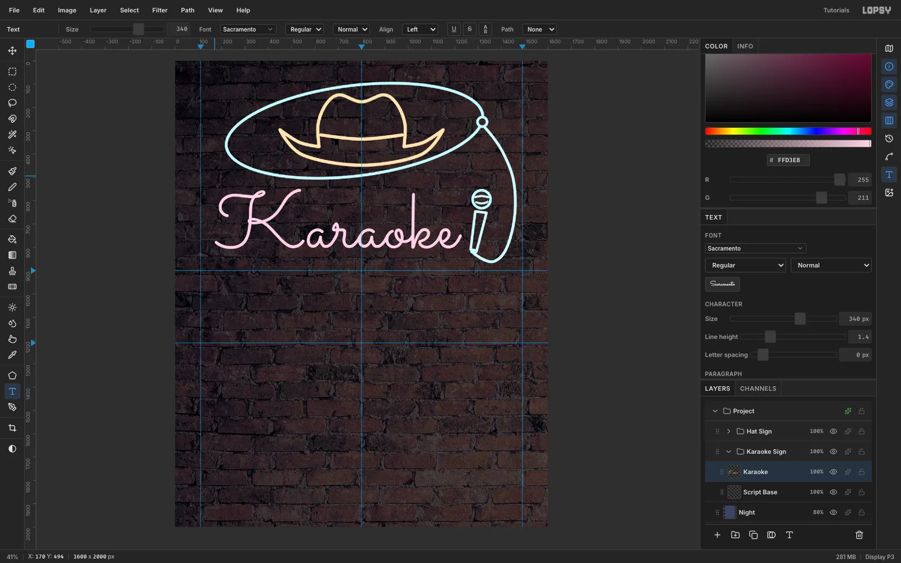

1. Select `Night`, then make a group `Karaoke Sign` and an empty layer `Script Base` inside it.
2. Pick the **Text** tool. Choose **Sacramento**, Size **340**, colour `#FFD3E8`, and click at (170, 494). Type `Karaoke` and press [[Tab]].

Sacramento is a monoline script, about 13 px wide at this size everywhere. That makes it a ready-made neon tube.

## Rasterize and tilt the script

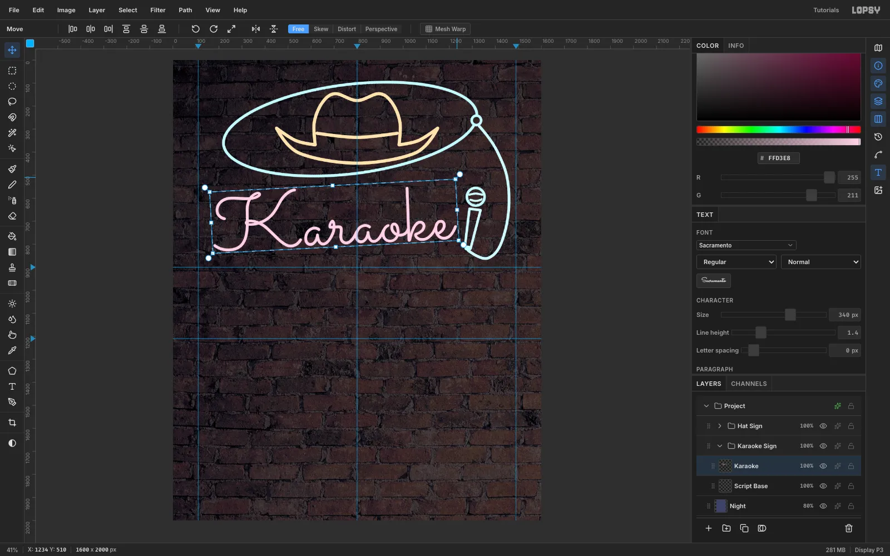

Click **Rasterize Layer** in the Layers footer *before* transforming, because rotating live text doesn't stick. Marquee the word, and rotate it **−3°** with the Move tool's rotation handle so it climbs towards the mic. Then [[Cmd+D]].

## Draw the raceway

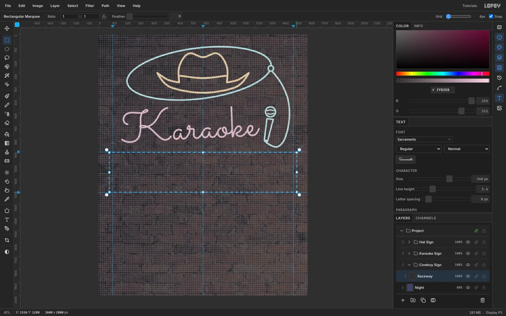

Neon letters are mounted on a metal box called a *raceway*.
1. Select `Night`, then make a group `Cowboy Sign` and a layer `Raceway`.
2. Pick the **Shape** tool. Set **Shape** to **Rectangle**, **Corner Radius** to **24**, the Fill to `#2A2B33` and no stroke, with **Output** on **Pixels**.
3. Click once at (800, 1056) and enter **1432 × 304**. The box runs from (84, 904) to (1516, 1208).

## Brush the metal

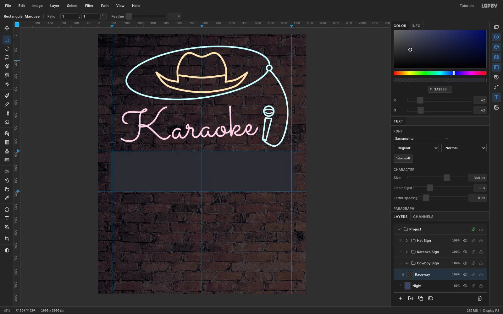

[[Cmd]]-click the `Raceway` thumbnail to select the box, then run **Filter → Add Noise** (Amount 22, Mono, Gaussian) and **Filter → Motion Blur** (Angle 0, Distance 60). The blur stretches the noise into brushed grain. Deselect.

## Paint the letter faces

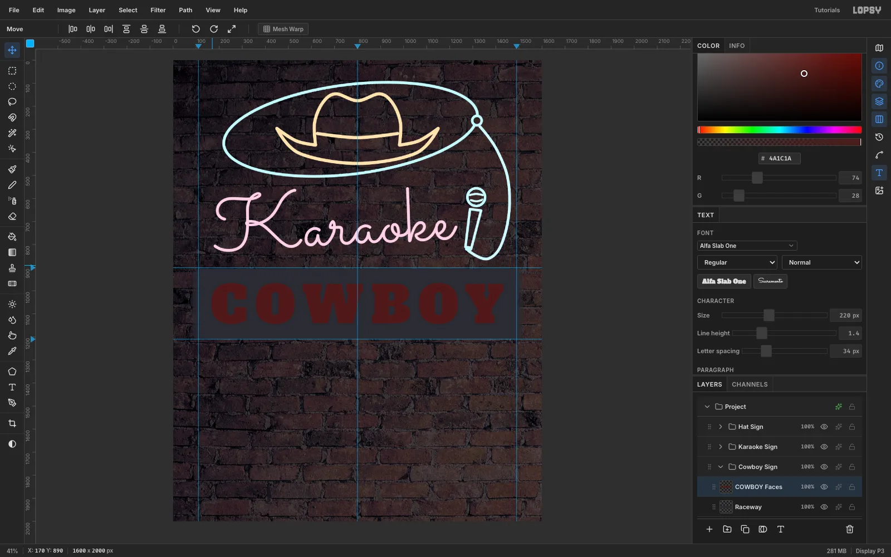

Set the Text panel's **Letter spacing** to **34** *before* clicking, so each letter gets room for its own tube. Then type `COWBOY` in **Alfa Slab One**, Size **220**, colour `#4A1C1A`, and name the layer `COWBOY Faces`. Use the Move tool's **Align center horizontally** with nothing selected, then arrow-nudge until the top of the ink sits at y **966**.

> **Tip:** Deselect before you Align. With a selection active, Align lines up the *selection's* bounds, not the layer.

## Trace outline tubes around the letters

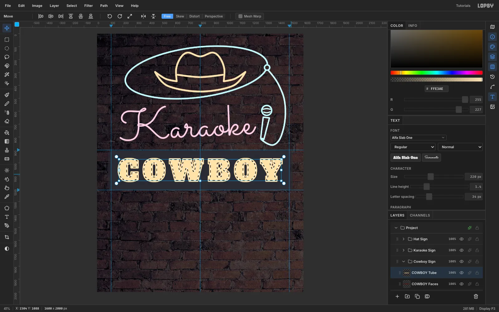

1. Add `COWBOY Tube` above the faces and set the foreground to `#FFE3AE`.
2. [[Cmd]]-click the `COWBOY Faces` thumbnail to select the letter shapes. Then **Select → Grow 6** and fill.
3. Deselect, [[Cmd]]-click the thumbnail again, **Select → Shrink 5**, and press [[Delete]].

You're left with an 11 px tube that straddles every letter edge and follows the W's notches and the Y's crotch. A large Grow bridges narrow notches with a straight tube, so keep the Grow small and let half the tube sit inside the letter.

## Light the raceway from behind the letters

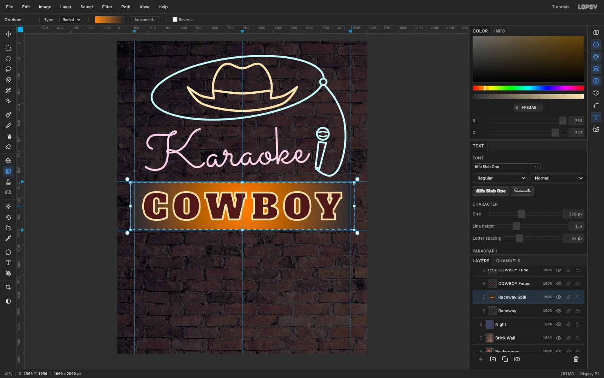

Add `Raceway Spill` just above `Raceway` and [[Cmd]]-click the raceway thumbnail. Open the **Gradient** tool's **Advanced…** editor, set **Radial** from `#FF8A12` at 100% to `#FF8A12` at 0%, and drag from (800, 1056) to (1500, 1056). Deselect, then set the layer to **Screen** at **40%**. Metal sitting a few centimetres behind lit tubes always picks up their colour.

## Copy, scale and rotate a sparkle

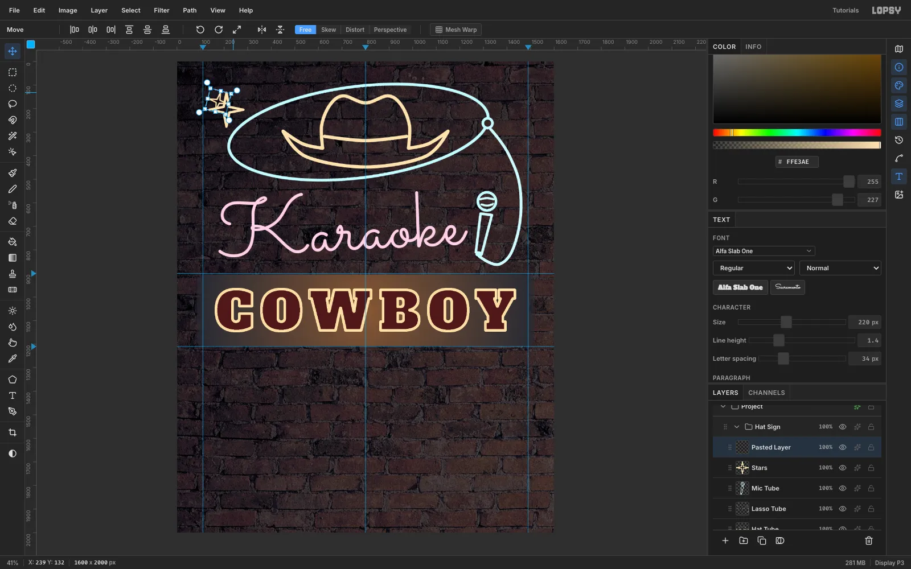

1. On a `Stars` layer in `Hat Sign`, Pen a closed 8-point sparkle at width **10**: tips 72 px from (210, 205), inner points 17 px. Click the first anchor to close it and press [[Enter]] to stroke it.
2. Marquee it, [[Cmd+C]], then [[Cmd+V]]. The paste lands in place on its own layer, selected, with the Move tool ready.
3. [[Cmd]]-drag a corner handle to scale it to **55%**.
4. Rotate it **15°**.
5. Drag it to (1405, 165), outside the loop, and press [[Cmd+D]]. Then **Layer → Merge Down** into `Stars`.

## Build the marquee board and its bulbs

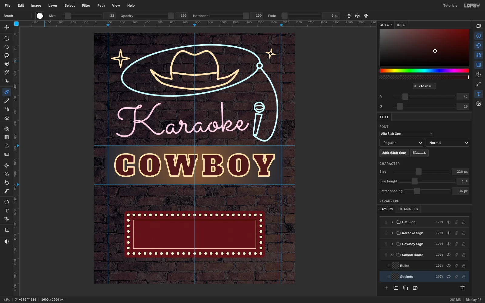

1. Select `Night` and make a new group `Saloon Board` with a layer `Board`. With the **Shape** tool (Rectangle, Corner Radius **22**, Fill `#5C1A1C`), click at (800, 1606) and enter **1120 × 372**, which fills (240, 1420)–(1360, 1792). [[Cmd]]-click the thumbnail and add Noise **10** for painted grain.
2. On `Pinstripe`, fill the rectangle (310, 1490)–(1290, 1722) with `#EADBB8`, then **Shrink 4** and Delete for a hairline frame.
3. On `Bulbs`, open the brush-tip thumbnail (the Brushes modal). On the **Shape** tab set Size **22**, Hardness **100** and **Spacing 200%**: one dab every 44 px.
4. Click (272, 1452), then [[Shift]]-click (1328, 1452), (1328, 1760), (272, 1760) and back to the start. The side lengths are multiples of 44, so a bulb lands exactly in every corner.
5. Under `Bulbs`, add `Sockets`. [[Cmd]]-click the bulbs thumbnail, **Grow 4**, and fill `#2A1010`.

## Set the board type, the tagline and the footer

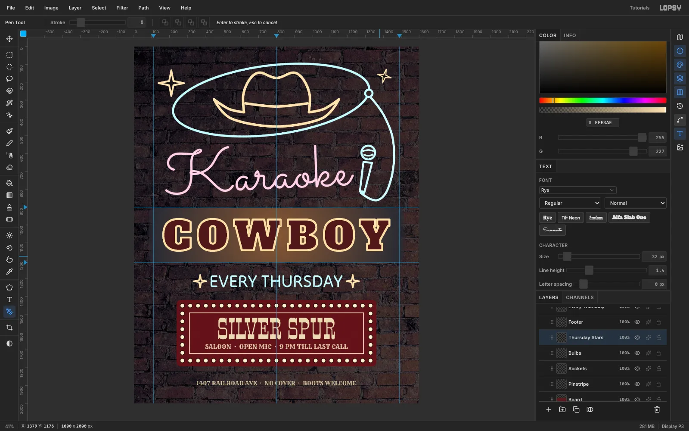

Before each line, click `Bulbs` and set up the text as listed, with **Letter spacing** **0**. Create each line in empty canvas, **Align center horizontally**, then nudge it to its top edge:
- `SILVER SPUR`: **Smokum** 160, `#EADBB8`, top at y **1519**
- `SALOON · OPEN MIC · 9 PM TILL LAST CALL`: **Rye** 34, top at **1667**. That gives even 25 px gaps between frame, headline, subline and frame.
- `EVERY THURSDAY`: **Tilt Neon** 96, `#CFFBFF`, top at **1281**, halfway between the raceway and the board. On a new `Thursday Stars` layer, Pen two small sparkles beside it at x 372 and 1228.
- `1407 RAILROAD AVE · NO COVER · BOOTS WELCOME`: **Rye** 32, `#D8CBAA`, top at **1872**

On a Mac, type the `·` characters with [[Option+Shift+9]].

## Clip the tubes to the wall

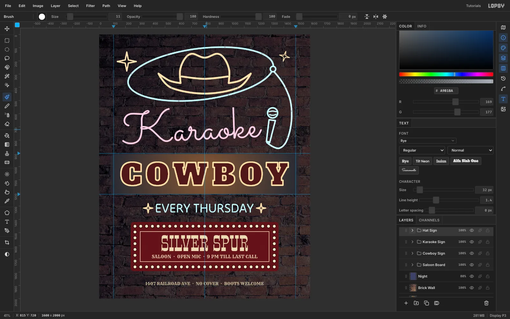

Real tubes hang on little glass standoffs. On a `Standoffs` layer at the top of `Hat Sign`, set a hard brush to Size **11** with colour `#A9B1BA`. Click once on the centre of a tube every 250–400 px along the lasso, the cord, the hat and the script. Give the layer a **Drop Shadow** (0, 3, blur 4, 70%) so the clips sit off the wall.

## Light the tubes with Inner and Outer Glow

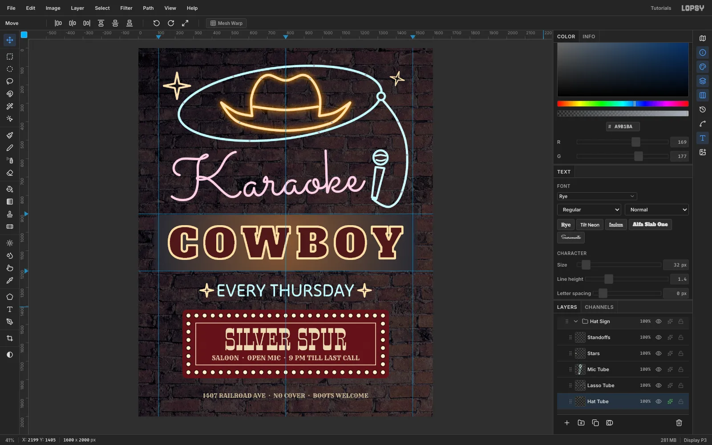

Open the effects drawer on `Hat Tube` and enable both glows in amber `#FF9F1A`:
- **Inner Glow:** Size **4**, Spread **30**, Opacity **100**. The edges turn saturated amber while the centre stays pale: the hot core.
- **Outer Glow:** Size **40**, Spread **14**, Opacity **85**. That's the halo.

## Switch on every sign

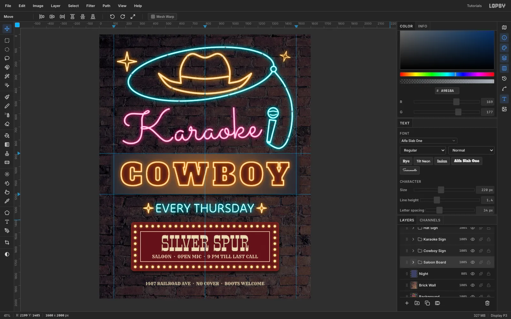

Repeat the same two glows on every tube layer in its own colour:
- `Lasso Tube`, `Mic Tube`: turquoise `#16D6E6`
- `Karaoke`: pink `#FF2E93`
- `COWBOY Tube`: `#FF8A12`
- `Stars`, `Thursday Stars`: amber
- `Every Thursday`: Inner Glow Size **3**, Spread **0**, which keeps a visible white core in the thinner strokes

Then the supporting cast:
- `COWBOY Faces`: a faint amber Inner Glow (12 / 0 / 30%).
- `Bulbs`: an Inner Glow in `#FF7A00` (9 / 10 / 100%) for hot centres, and an Outer Glow in `#FFB547` (18 / 16 / 80%).
- `Board`: an Inner Glow in `#FFB060` (30 / 0 / 22%) so the bulbs light the red, plus a Drop Shadow (0, 14, blur 28, 75%). `Raceway` gets the same shadow.
- `SILVER SPUR`: a tight 6 px cream Outer Glow and a 2 px dark Drop Shadow.

## Paint light spill on the bricks

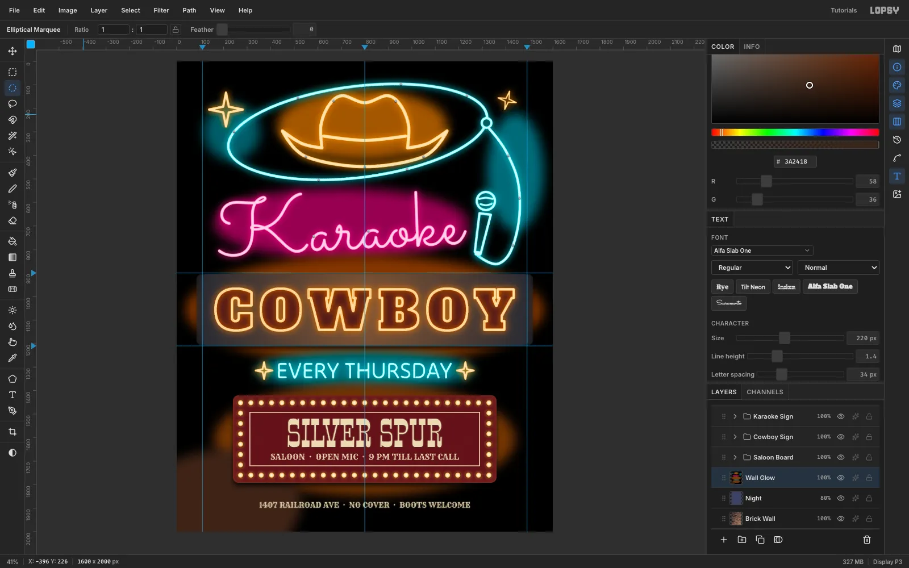

Add `Wall Glow` above `Night` and fill it black. For each sign, make an elliptical marquee around it, **Select → Feather 50**, and fill it with a dark version of that sign's colour:
- amber `#9A5A10` behind the hat
- teal `#0C6A78` beside the rope and under EVERY THURSDAY
- magenta `#8A1550` behind the script
- orange `#7A3A08` around COWBOY
- brown `#6A3812` around the board
- dim `#3A2418` in the bottom-left corner, so it doesn't die to black

Run **Gaussian Blur 70** and set the layer to **Screen** at **85%**. The black disappears, and the bricks light up in pools that match their sources.

## Finish with a Bloom pass

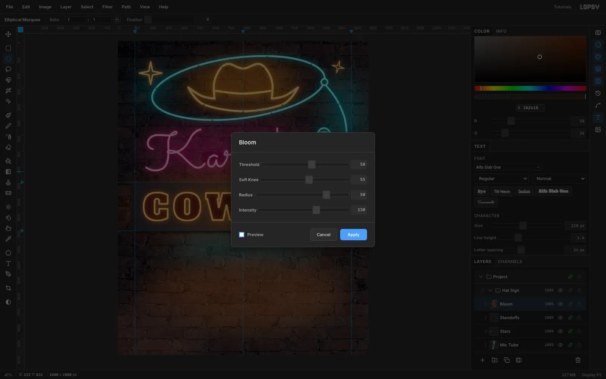

1. Hide `Saloon Board` and run **Edit → Copy Merged**, then paste at the top of `Hat Sign` and name the layer `Bloom`. Show the board again.
2. Run **Filter → Bloom** (Threshold **58**, Soft Knee **55**, Radius **50**, Intensity **130**). Set the layer to **Lighten** at **65%**.
3. Marquee the board area (236, 1416)–(1364, 1796) on `Bloom` and press [[Delete]]. The copy was made with the board hidden, so it holds bricks there, and Lighten would show them through the dark red paint.

Turn the guides off (**View → Show Guides**) and export. The bloom softens every tube's edge into the haze you see around real neon at night.
