Neubrutalism is the loud cousin of flat design. It uses saturated colour blocks, thick black outlines, hard shadows with no blur, and big plain type. It started on the web, so it works well when a card looks like a piece of software. In this tutorial you'll build a holiday card that pretends to be an app window called `upside-down-evergreen.png`. Inside the window, a Christmas tree hangs upside down from the ceiling. The New Year greeting is printed upside down too, with a sticker telling the reader to flip the card.

Two rules keep the style consistent. Every outline is **8 px** black (`#111111`). Every shadow is a **Drop Shadow** with **Offset 16 / 16**, **Blur 0**, **Opacity 100** in the same black. Set those numbers once and reuse them everywhere.

## Fill the background and draw two corner gradients

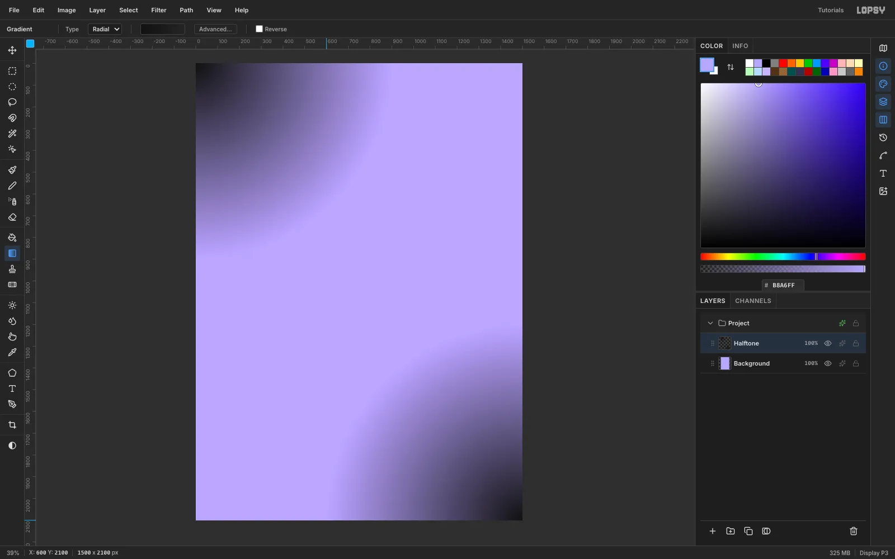

Create a **1500 × 2100** document (a 5 × 7 card) with a white background. Select `Background`, set the foreground to lavender `#B8A6FF`, and choose **Edit → Fill**.

Rename `Layer 1` to `Halftone`. Pick the **Gradient** tool, set **Type** to **Radial**, and use **Advanced…** to set both stops to black, the first at 100% opacity and the second at 0%. Drag one gradient from the top-left corner out about 900 px. Drag a second from the bottom-right corner.

Each drag lays its gradient over what's already on the layer, so the transparent end of the second fade leaves the first one untouched.

## Turn the gradients into halftone dots

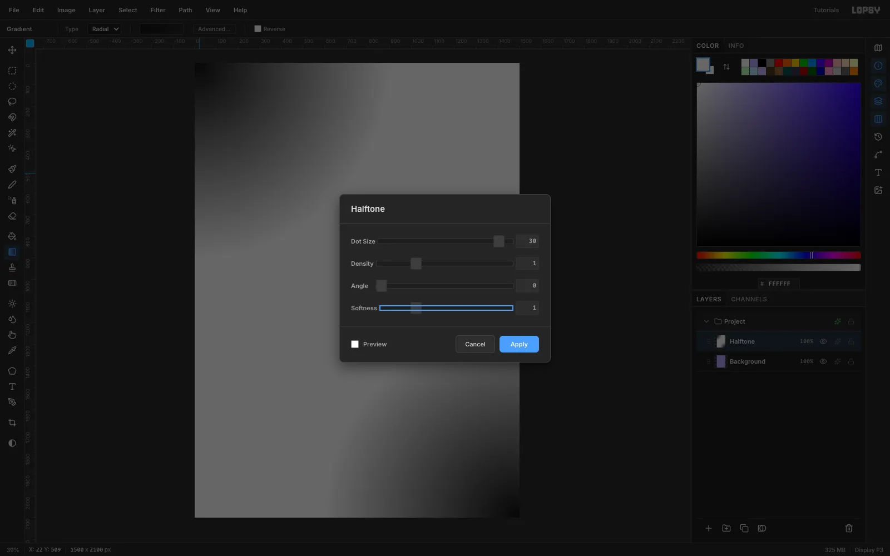

Halftone sizes each dot by the *brightness* underneath it, not by its transparency. So the gradients need something white behind them. Add a layer under `Halftone`, fill it white, then select `Halftone` and choose **Layer → Merge Down**.

Open **Filter → Halftone…** and set **Dot Size 30**, **Angle 0** and **Softness 1**, leaving **Density** at 1. At 0° the dots sit in neat rows, like a newspaper photo. The gaps between the dots come out transparent. Open the layer effects (the sparkle button on the layer row) and turn on **Color Overlay** in `#8F7AF5`, so the dots become a darker lavender.

## Draw the window with grid snapping

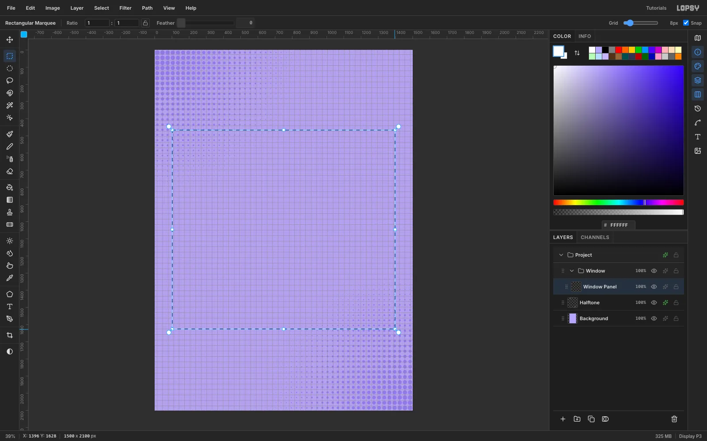

Turn on **View → Show Grid**, drag the **Grid** slider in the options bar to **8px**, and make sure **Snap** is ticked. Click **New Group** and name it `Window`, then add a layer inside it called `Window Panel`.

Drag a rectangular marquee for the window: from about 100 px in from the left edge and a little under a quarter of the way down, to about 100 px in from the right edge and about 470 px above the bottom. The grid's lines are centred on the page, so Snap pulls both sides onto matching lines and the window ends up exactly centred. Fill it black.

Now untick Snap and select a rectangle exactly 8 px inside that one. The easiest way is the exact-corner dialog: press [[Cmd+D]], click once (no drag) with the **Rectangular Marquee**, and enter **From** `110`, `474` and **To** `1390`, `1618`. Fill it cream `#FFF4E2`. That gives the window its 8 px outline. Finish with the standard Drop Shadow.

> **Tip:** Draw the border as pixels rather than with the Stroke effect. The Drop Shadow is built from the layer's own pixels, not from its effects, so a shadow on a stroked layer would start inside the outline and leave a notch.

## Tile graph paper into the window

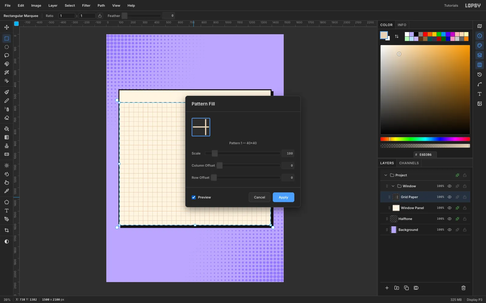

Make the tile on a temporary layer, in a 40 × 40 square at the top-left corner of the canvas. Fill a 3 px tan (`#E6D3B6`) vertical line 30 px in from the left of the square, and a 3 px horizontal line 18 px down from its top. Select the 40 × 40 square (**From** `0`, `0` **To** `40`, `40`) and choose **Edit → Define Pattern**, then delete the temporary layer.

Add a `Grid Paper` layer and select the window's inside below the title bar: **From** `110`, `578` **To** `1390`, `1618`. Choose **Edit → Fill with Pattern…**. Patterns tile from the top-left of the document, so those odd line offsets land a grid line exactly on each inside edge of the window. Full cells from border to border make the paper look deliberate.

## Build the title bar

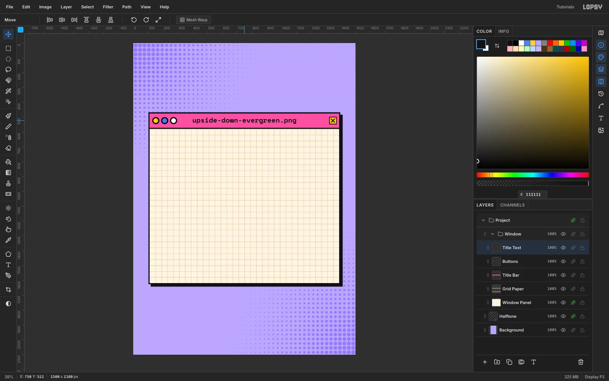

On a `Title Bar` layer, fill the top of the window's inside, 96 px tall (**From** `110`, `474` **To** `1390`, `570`), with pink `#FF5FA2`. Under it, fill a black 8 px strip across the window, down to where the graph paper starts.

For the window buttons, pick the **Shape** tool with **Shape: Ellipse** and **Output: Pixels**. Give it a fill and an 8 px black stroke. Shapes draw from the centre out, so start each drag on the bar's vertical middle and drag out about 20 px. Put the first about 40 px in from the bar's left end and space the three about 60 px apart, changing the fill to yellow, blue and white in between. At the right end, make the close box from a black square and a smaller yellow one, with two 7 px **Brush** lines for the ×.

Type `upside-down-evergreen.png` in **Space Mono Bold** at **46 px**. Then drag it with the **Move** tool until it's centred in the bar.

## Draw the first tier of the tree

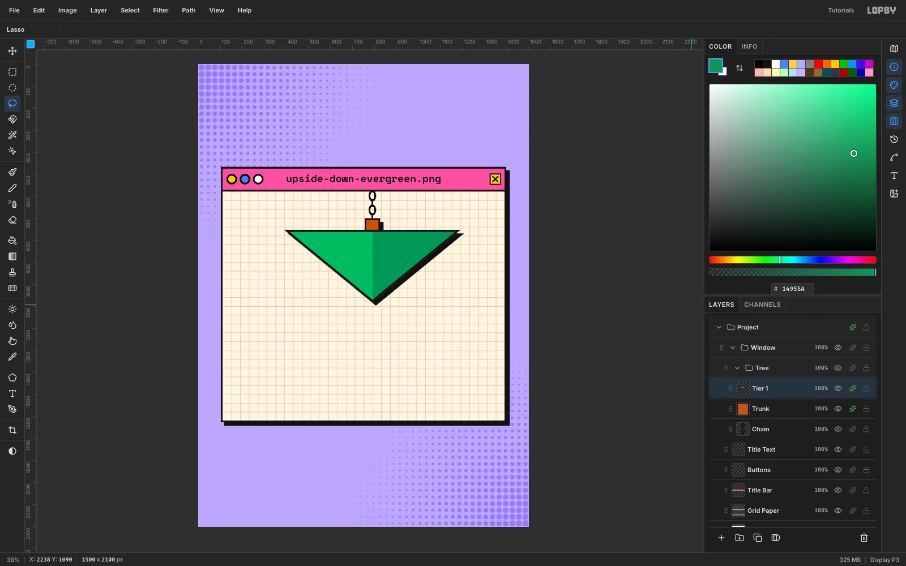

Make a `Tree` group inside `Window`. The tree hangs from the title bar on the window's centre line. On a `Chain` layer, draw two 13 × 21 px ellipses with the Shape tool (click the fill swatch and choose **Remove fill**, keeping the 8 px stroke), and join them with 8 px black bars. On a `Trunk` layer, draw a black rectangle with a burnt orange (`#C2561B`) one inside it.

A tree hanging upside down is widest at the top. On a `Tier 1` layer, use the **Lasso** to drag a downward triangle in three straight runs through its corners, letting go back at the start: two top corners about 400 px either side of the centre line, roughly 175 px below the title bar, and the tip on the centre line about 330 px lower. Choose **Select → Feather…** 1 px, so the diagonal edges are smooth, and fill it black.

Keep the selection, choose **Select → Shrink…** 8 px and Feather 1 px again, and fill it green `#1FB86A`. That leaves an 8 px black outline. For the shaded half, lasso the right half of the triangle, shrink and feather it the same way, and fill it `#14955A`. Add the standard Drop Shadow.

## Stack three tiers

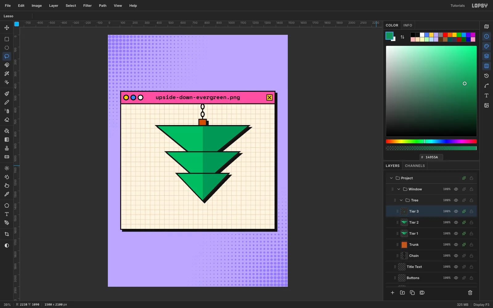

Repeat the same recipe on `Tier 2` and `Tier 3`, each on a new layer above the last:
- **Tier 2:** about 640 px wide, with its top edge about 220 px below Tier 1's, and its tip about 280 px lower.
- **Tier 3:** about 460 px wide, another 180 px down, with its tip about 240 px lower.

The smaller, lower tiers overlap the tip of the tier above, and their hard shadows fall across it. That gives the flat shapes depth without any gradients.

## Hang one bauble

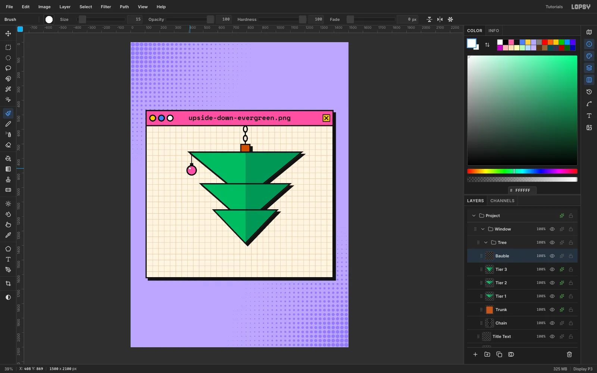

Add a `Bauble` layer above `Tier 3`. Draw the string with a 6 px **Brush**: click the start point on the tier's edge, then [[Shift]]-click about 60 px straight down. Add a small black cap rectangle. Then draw a 32 px Shape-tool ellipse in pink with the 8 px black stroke. A single white 15 px brush dab top-left of centre makes the highlight.

## Duplicate the bauble with copy and paste

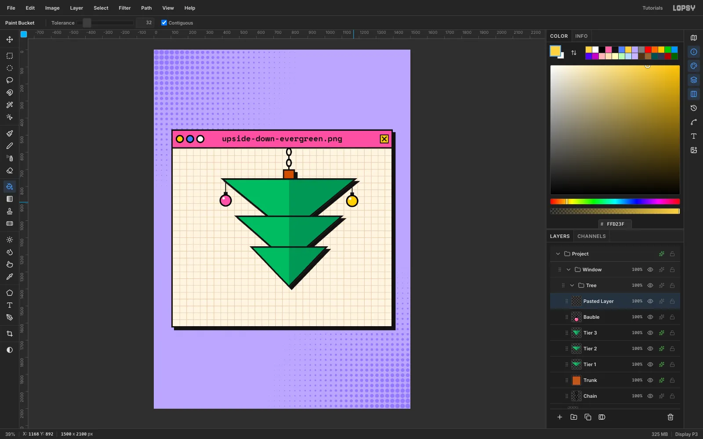

Marquee the bauble, press [[Cmd+C]] and then [[Cmd+V]]. The copy lands in place on a new `Pasted Layer`. Press [[Cmd+D]], then drag it with the **Move** tool to the next tier corner. Pick a new foreground colour and click the ball with the **Paint Bucket**: it only floods the flat fill, so the outline and highlight stay.

Place six baubles in all, one at each tier corner, in pink, yellow, blue and one holiday red `#E8202A`. Then select the top `Pasted Layer` and use **Layer → Merge Down** five times to fold them into one layer. Rename it `Ornaments`.

## Add the little lights

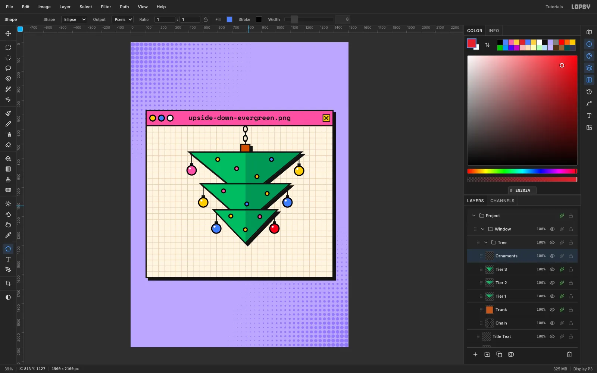

Still on `Ornaments`, draw ten small lights with the Shape tool, each about 26 px across, keeping the 8 px stroke. Draw all the yellow ones first, then the pink, then the blue, so you only change the fill colour three times. Keep each light at least 20 px clear of a tier edge, and spread them across both the light and dark halves.

## Hang the star upside down

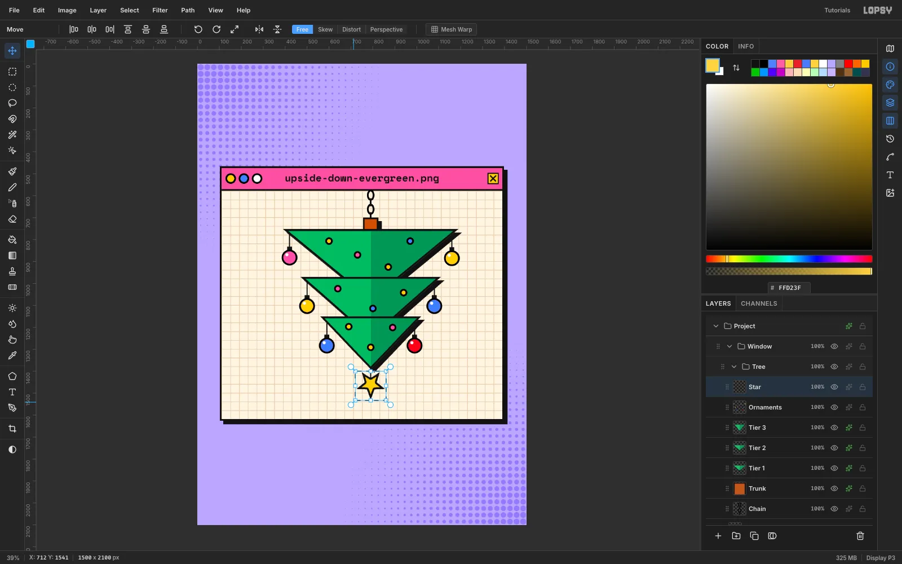

Brush a 6 px string down from the bottom tip of the tree. On a new `Star` layer, lasso an upright five-pointed star, then give it the same outline recipe: fill black, then Shrink 8, Feather 1 and fill yellow.

Marquee the star, switch to the **Move** tool, and drag the rotation handle past the top-right corner while holding [[Cmd]]. [[Cmd]] snaps the angle in 15° steps, so it's easy to land on exactly **180°**. Press [[Cmd+D]] to commit. The star now hangs point down from its string, clear of the tier's shadow.

## Move the whole tree as a group

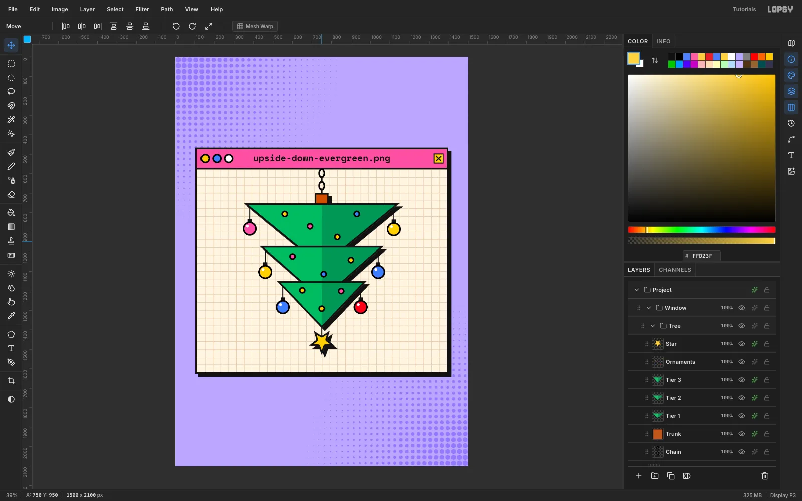

If the tree is off centre, you don't need to move the layers one at a time. Click the `Tree` group row, press [[Cmd+D]] so nothing is selected, and drag anywhere on the tree with the **Move** tool. The chain, trunk, tiers, ornaments and star all move together. Line the trunk up with the middle of the window. Undo and redo put everything back exactly.

## Build the gifts and flip one over

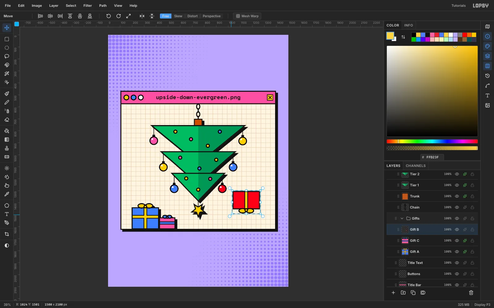

Make a `Gifts` group inside `Window`, below `Tree`. Each gift is a black rectangle with a coloured rectangle 8 px inside it. Add black ribbon bands with coloured centres, and a bow made of two Shape-tool ellipses and a knot.

Draw the red gift the right way up, then marquee it and rotate it exactly **180°** with [[Cmd]] held. Press [[Cmd+D]].

## Stand the gifts on the floor

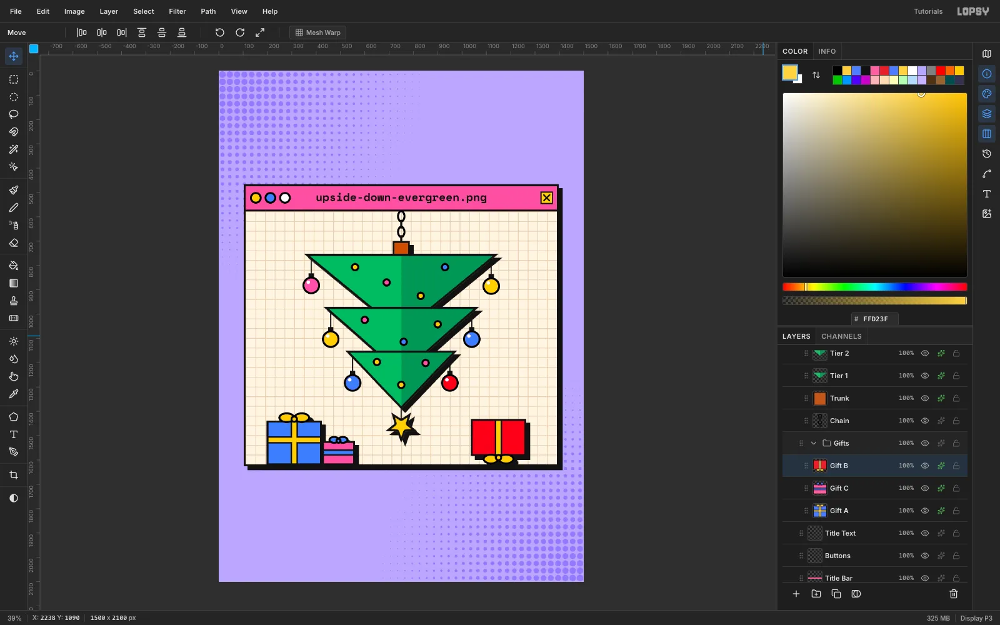

Drag each gift down with the **Move** tool until its lowest point touches the window's floor, the inside edge of the bottom border. That puts the upside-down gift on its bow. Give every gift the standard Drop Shadow. Next to two normal presents, the upside-down one looks like a deliberate joke rather than a mistake.

## Set the headline and select its shape

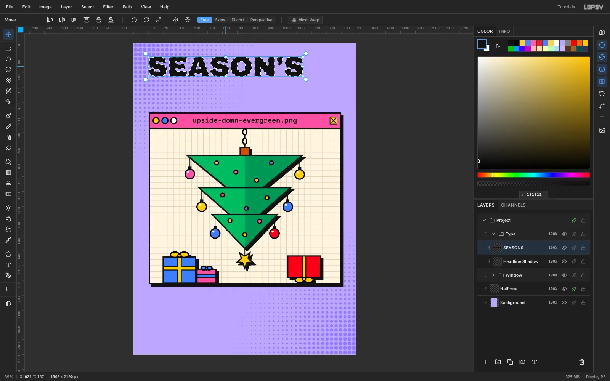

Collapse `Window`, select `Halftone`, and click **New Group**. Name the group `Type` and add a layer inside it called `Headline Shadow`. Then drag the `Type` group's grip above `Window` so all the type sits on top.

Type `SEASON'S` in **Archivo Black** at **188 px**. Then move it so the letters start on the window's left edge, about 90 px from the top of the card. [[Cmd]]-click its thumbnail in the Layers panel: the letters become a selection.

> **Tip:** Turn on **View → Snap to Layers** and the Move tool will catch the window's edge as you drag.

## Give the headline a pink offset shadow

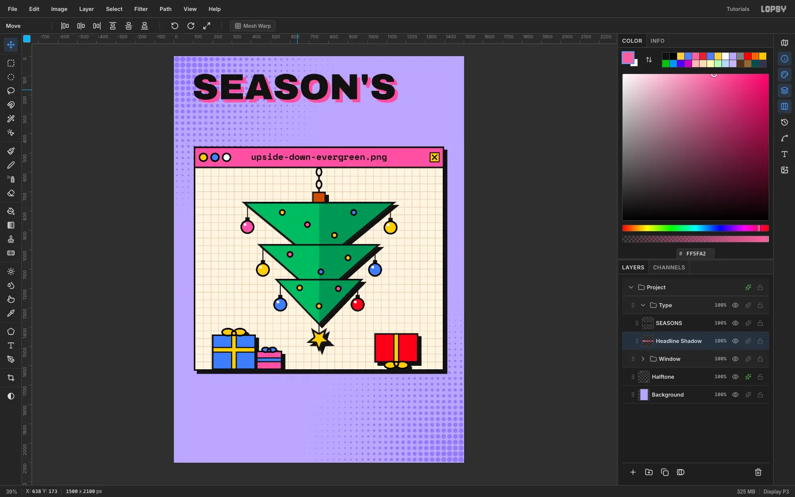

With the letter selection still active, click `Headline Shadow`, set the foreground to pink `#FF5FA2`, and choose **Edit → Fill**. Press [[Cmd+D]], then move the layer 16 px right and 16 px down. With the **Move** tool, [[Shift]]+arrow nudges 10 px and a plain arrow nudges 1 px, so one [[Shift]]+[[Right]] and six [[Right]] presses, then the same downwards, land it exactly. A coloured shadow like this is a neubrutalist favourite. It follows the same 16 / 16 rule as the black shadows.

## Stick GREETINGS on a tilted slab

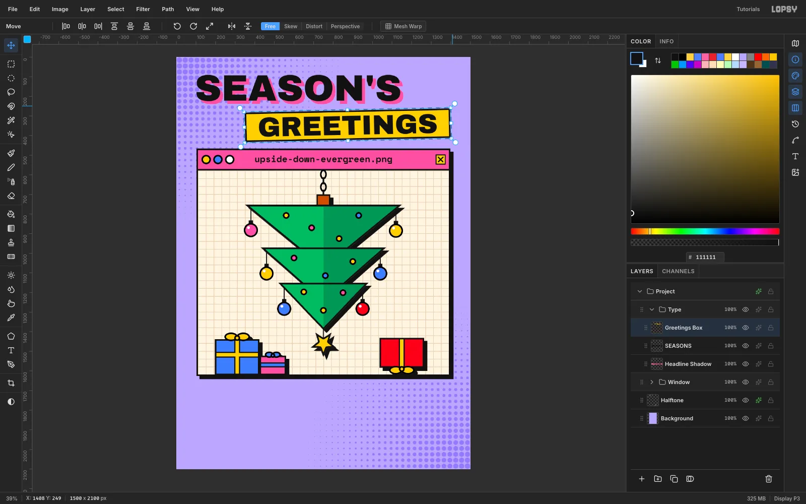

Add a `Greetings Box` layer. Under SEASON'S, fill a black box 150 px tall that starts in line with the tree's widest corner and ends on the window's right edge, then a yellow one 8 px inside it. Lining the box up with the tree ties the headline to the picture below.

Type `GREETINGS` in Archivo Black at **140 px**, well below the other text so the click doesn't land inside another text layer. Move it to the centre of the box.

Click **Rasterize Layer**, then **Layer → Merge Down** onto the box. Marquee the merged slab and drag the rotation handle to **−1.2°**. A small tilt reads as a sticker slapped on. A bigger one would crowd the window below it. Commit with [[Cmd+D]] and add the standard Drop Shadow.

## Add a sparkle

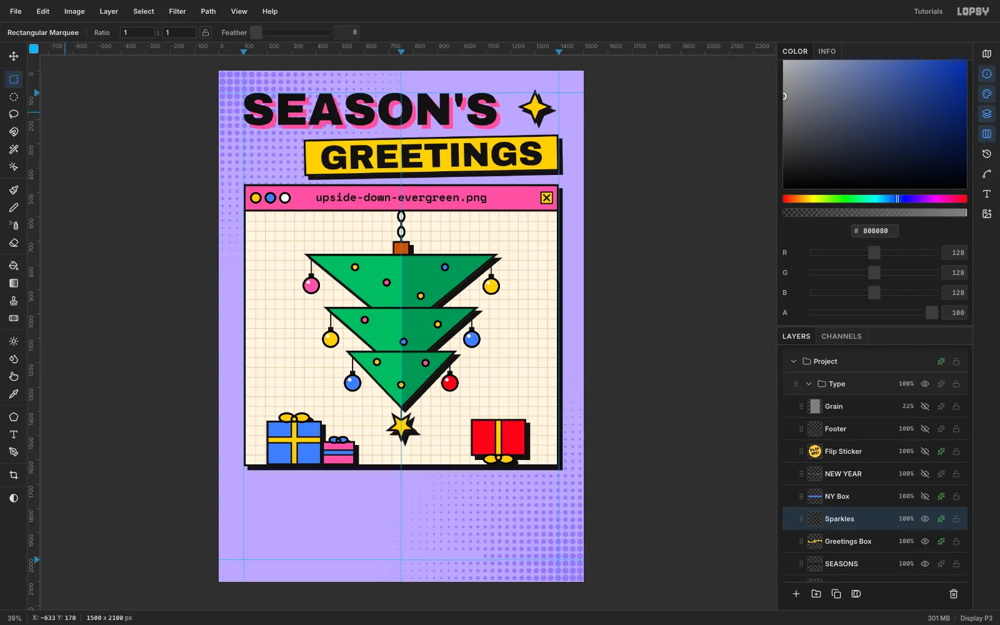

On a `Sparkles` layer, lasso a four-pointed star in the empty corner to the right of `SEASON'S`. Make the points about 72 px long from the centre, with the inner corners about 30 px out. Give it the fill black → Shrink 8 → fill yellow recipe with Feather 1, then the standard shadow. It fills the gap next to the headline and stays inside the 90 px margins.

## Print the New Year greeting upside down

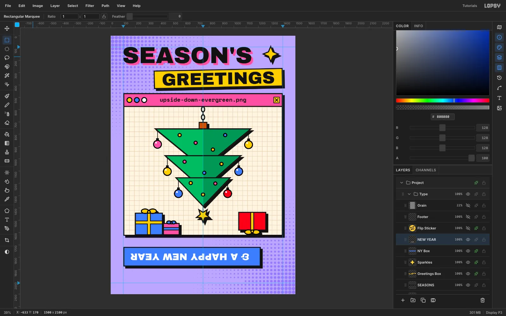

On an `NY Box` layer, fill a black box 160 px tall under the window, about 90 px below it. Start it on the window's left edge and stop about 180 px short of the right edge, where the sticker will go. Fill a blue (`#4D7CFE`) one 8 px inside it, then add the Drop Shadow. Type `& A HAPPY NEW YEAR` in white Archivo Black at **78 px** in empty space and click **Rasterize Layer**.

Marquee it, then [[Cmd]]-drag the rotation handle to **180°** and press [[Cmd+D]]. Move it to the centre of the part of the box that the sticker won't cover. This is the second half of the joke: the reader has to turn the card over to read it.

## Slap on a FLIP ME! sticker

On a `Flip Sticker` layer, draw a yellow Shape-tool circle about 184 px across, with the 8 px black stroke. Type `FLIP` and `ME!` on two lines in Archivo Black at **54 px**, then rasterize it. Point text doesn't centre each line, so marquee the `ME!` line and drag it until both lines are centred. Merge it into the circle.

Marquee the sticker, hold [[Cmd]], and drag the bottom-right handle out to scale it up about 17%. Then rotate it **−12°**. Place it at the right end of the blue box, centred on the box's height, so it overlaps the box by about 45 px and its right edge sits in line with the window's right edge. Then add the standard shadow.

## Sign the card

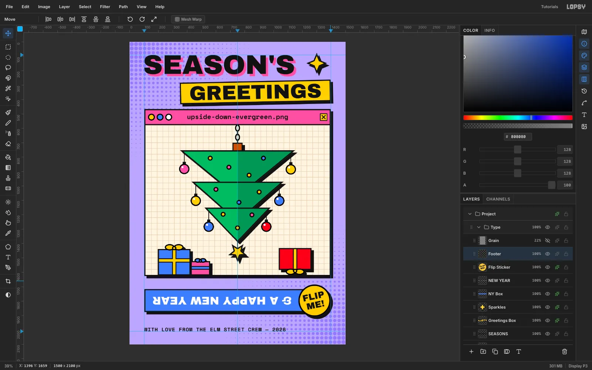

Open the **Text** panel and set **Letter spacing** to 2. Then type the footer in Space Mono Bold at **36 px**. It uses an em dash, so paste the text in rather than typing it. Move it so it starts on the window's left edge, with its baseline about 90 px from the bottom of the card, the same margin as at the top. The halftone corners stay clear of it, so it reads cleanly.

## Finish with print grain

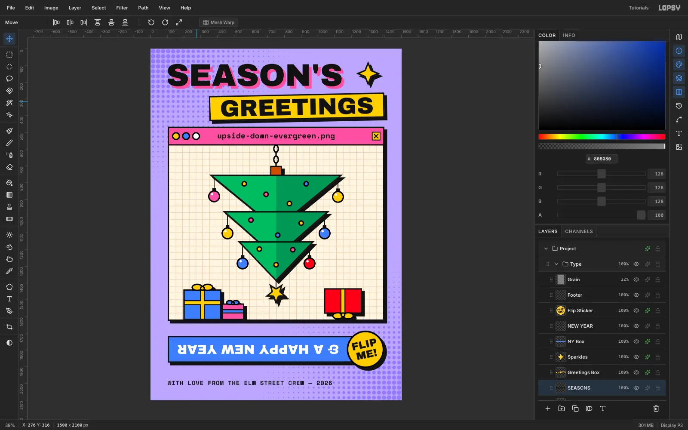

Add a `Grain` layer at the top of the `Type` group and fill it mid-grey `#808080`. Open **Filter → Add Noise…** and set **Amount 70**, **Mono** and **Gaussian**. Set the layer's blend mode to **Overlay** and its opacity to **22%**. Overlay grey is invisible on its own, so what's left is a faint print texture on the flat colours.

Finally, check the alignment with guides. [[Cmd]]-click the middle of the top ruler for a centre guide, click the top ruler on the window's left and right edges, and click the left ruler about 90 px from the top and bottom. Everything should line up with them. Then export with **File → Quick Export PNG**.
