Neubrutalism takes the flat colour of a web UI and gives it a body. Everything gets a thick black outline and a solid black shadow pushed down and to the right with no blur, so each element looks like a sticker stuck onto the page. It suits a t-shirt really well, because flat, outlined shapes are exactly what screen printing likes.

This tutorial builds the chest print for *Jackalope Xpress*, a made-up bike-courier club. It has:
- a jackalope mascot in courier goggles bursting out of a bicycle wheel
- a tilted graph-paper card, with speed lines streaking out behind the mascot
- a two-line logotype with a hand-built keyline
- pill buttons and sticker badges, all sharing one tilt and one shadow

Every shape gets the same 8 px black outline. The rounded rectangles and pills come straight from the Shape tool with an 8 px ink stroke. Everything you lasso uses one outline recipe: **fill the shape black, Shrink the selection 8 px, fill the colour**.

The palette is eight inks on a sand shirt:

- Shirt `#F1EADB` (the background, not an ink)
- Ink `#161616`, white `#FFFFFF`
- Lavender `#A98BFF`, lime `#C5F05A`, tangerine `#FF6A2B`
- Yellow `#FFD02E`, pink `#FF84BE`, tan `#E2A866`

## Set up the shirt, guides and grid

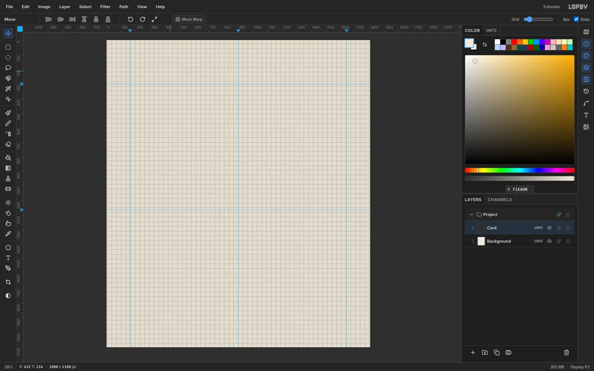

1. Create an **1800 × 2100 px** document (**File → New**, Unit = Pixels). Set the foreground to `#F1EADB` and run **Edit → Fill** on Background with nothing selected. That's the shirt colour. Hide it when you export for print.
2. Click the top ruler at x **160**, **900** and **1640** for the margins and centre line. Click the left ruler at y **300** and **1160** for the top and bottom of the hero card.
3. Turn on **View → Show Grid** and set the options-bar **Grid** slider to **8 px**. Snap comes on with the grid, so marquees land on whole grid steps.

## Draw a rounded card

Rename Layer 1 to `Card`. Pick the **Shape** tool (U) and set **Shape** to **Rectangle**, **Output** to **Pixels** and **Corner Radius** to **36**. Click the **Fill** swatch and type lavender `A98BFF` into its hex field. Add a **Stroke**, type ink `161616` into its hex field and set its **Width** to **8**. Click (don't drag) at the card's centre, (900, 730), and enter **1032 × 792**.

The Shape tool draws from the centre, and the stroke is centred on the rectangle's edge. So the card's outside edge runs from (380, 330) to (1420, 1130) with 40 px corners, and the lavender inside is 8 px in all round, with 32 px corners.

That 8 px ink rim is the outline. Use the same 8 px on every shape in the design.

## Fill the card with graph paper

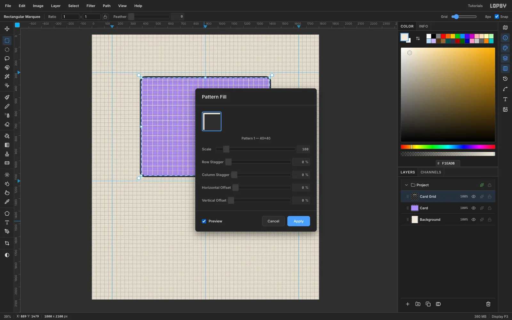

1. Add a temporary layer `Tile`. Fill two thin strips with `#F1EADB`: (0, 0)–(40, 3) and (0, 0)–(3, 40). Click once with the Rectangular Marquee and nothing selected to type exact corners.
2. Select (0, 0)–(40, 40) and run **Edit → Define Pattern**. Then delete the `Tile` layer.
3. Add a layer `Card Grid`. [[Cmd]]-click the `Card` thumbnail to select the card, then **Select → Shrink… 12** so the grid stays off the outline.
4. Run **Edit → Fill with Pattern…**, pick the 40 × 40 tile, tick **Preview** and **Apply**.
5. Drop `Card Grid` to **70%** with the row's opacity slider and **Layer → Merge Down** into `Card`.

The lines are the shirt colour, so on a print they're simply bare shirt. That costs no extra ink.

## Tilt the card

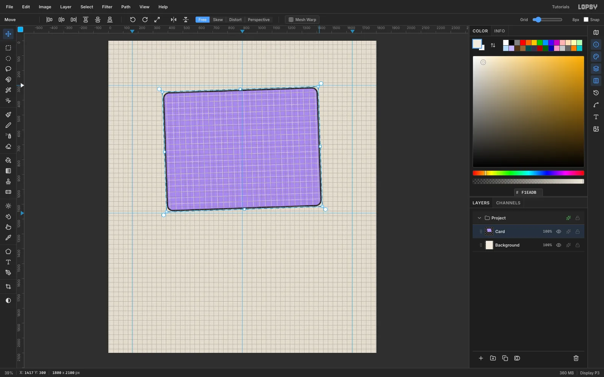

Untick **Snap** in the options bar first. With the grid showing, the rotate handle snaps in 15° steps.

Marquee a little outside the card, (376, 326)–(1424, 1134). Switch to the **Move** tool and drag the round rotate handle beside the top-right corner until the card has turned **−2°**, rising to the right. Press [[Cmd+D]] to commit.

Every tilted piece in this design uses the same direction. That's what makes the layout read as one bold system and not a scatter.

## Give it a hard offset shadow

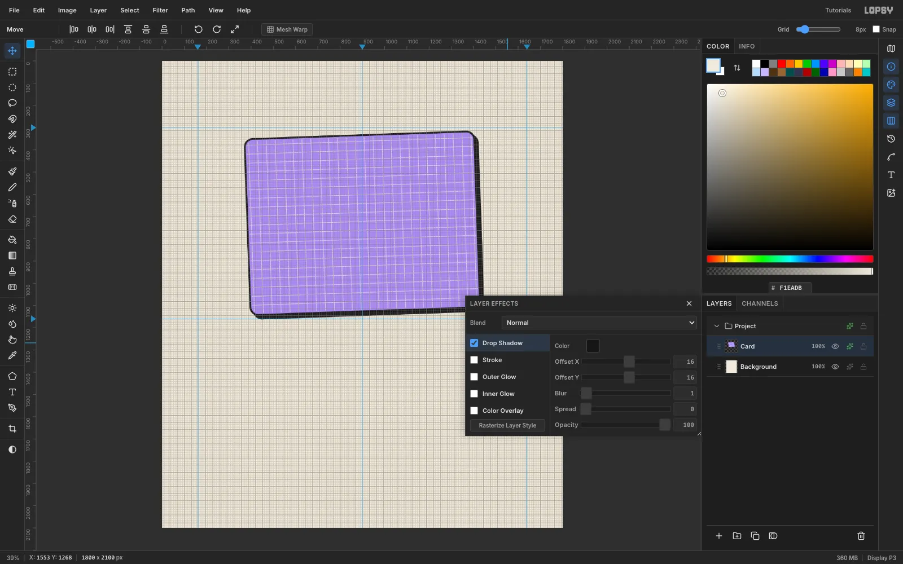

Open the layer effects drawer from the `Card` row, enable **Drop Shadow** and click its name to edit it:
- Colour `#161616`
- Offset X **16**, Offset Y **16**
- Blur **1**, Spread **0**, Opacity **100**

Every shadow in the design is 16 / 16 / 1.

## Paste a speed line in place

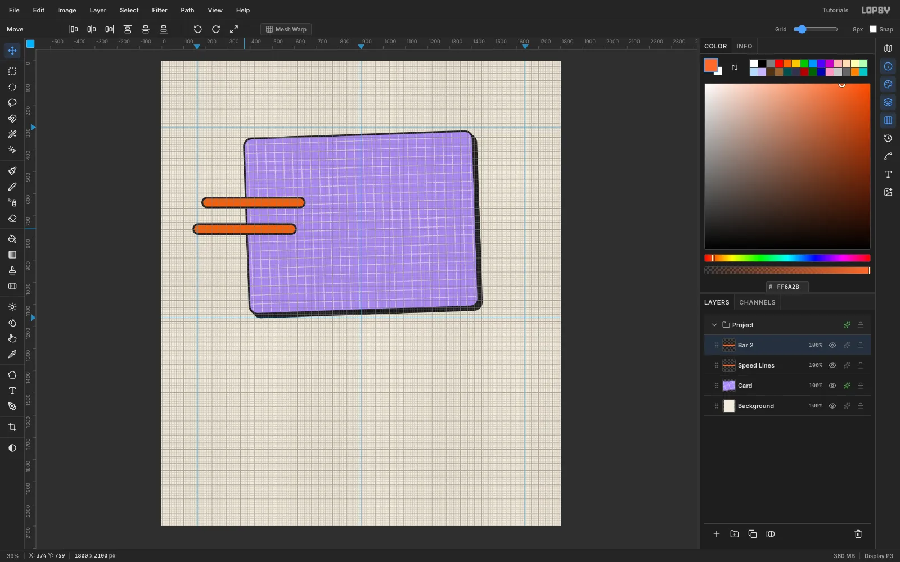

1. Add `Speed Lines`. With the Shape tool still set up the same way, change the Fill to tangerine `FF6A2B` and **Corner Radius** to **22** (half the height, for a fully rounded pill). Click at (415, 640) and enter **462 × 44**. With the stroke, the pill is 470 × 52 overall.
2. Marquee around the pill, press [[Cmd+C]], then [[Cmd+V]]. The paste lands in place on a new layer, selected, with the **Move** tool active. Rename it `Bar 2` and drag it so it starts at (140, 734).
3. Click `Speed Lines` and paste again. Name it `Bar 3` and move it to (220, 854).

## Merge the speed lines and add the shadow

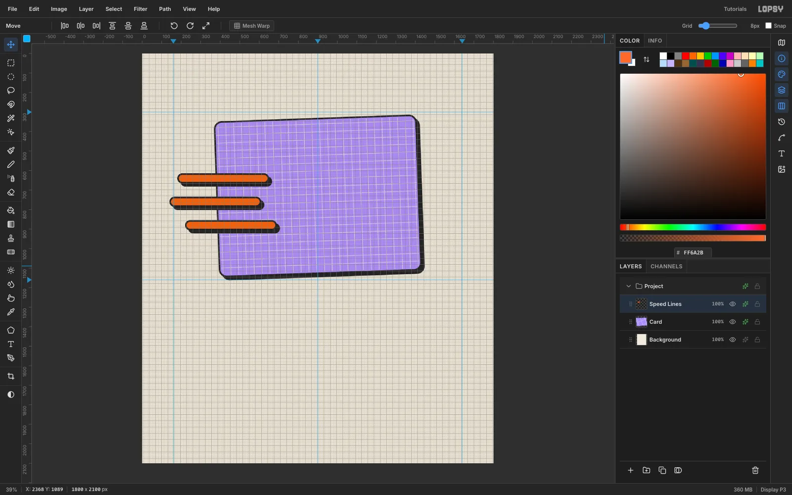

Click `Bar 2` and Merge Down twice, so all three pills end up on `Speed Lines`. Give the layer the same 16 / 16 / 1 shadow. The staggered ends read as motion. The right ends get tucked under the wheel next.

## Draw the wheel rings

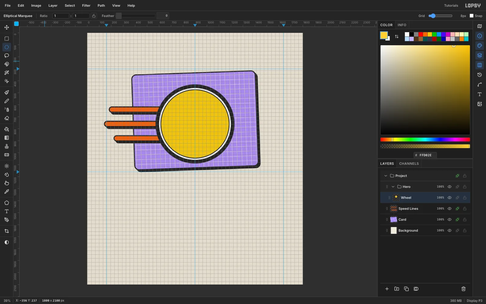

Click `Speed Lines` and press **New Group** in the Layers footer. Name the group `Hero` and add a layer `Wheel` inside it.

A click with the **Elliptical Marquee** opens an exact-corners dialog. Fill four circles centred on (900, 760):
- radius **330** with ink, for the tyre
- radius **300** with white
- radius **288** with ink
- radius **282** with yellow `#FFD02E`

Each circle covers the one before, which leaves the tyre, a white rim line and a thin black ring.

## Add the spokes and hub

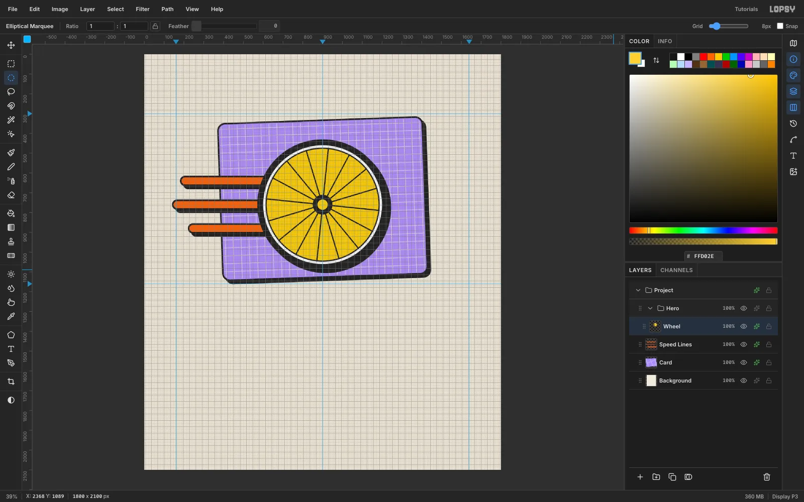

Pick the **Brush** at Size **7**, Hardness **100**, in ink. For each spoke, click a point 40 px out from the centre, then [[Shift]]-click the point 286 px out at the same angle. That's sixteen spokes, 22.5° apart.

Fill an ink circle of radius **50** and a yellow one of radius **26** for the hub, and give `Wheel` the 16 / 16 / 1 shadow.

## Draw the ears

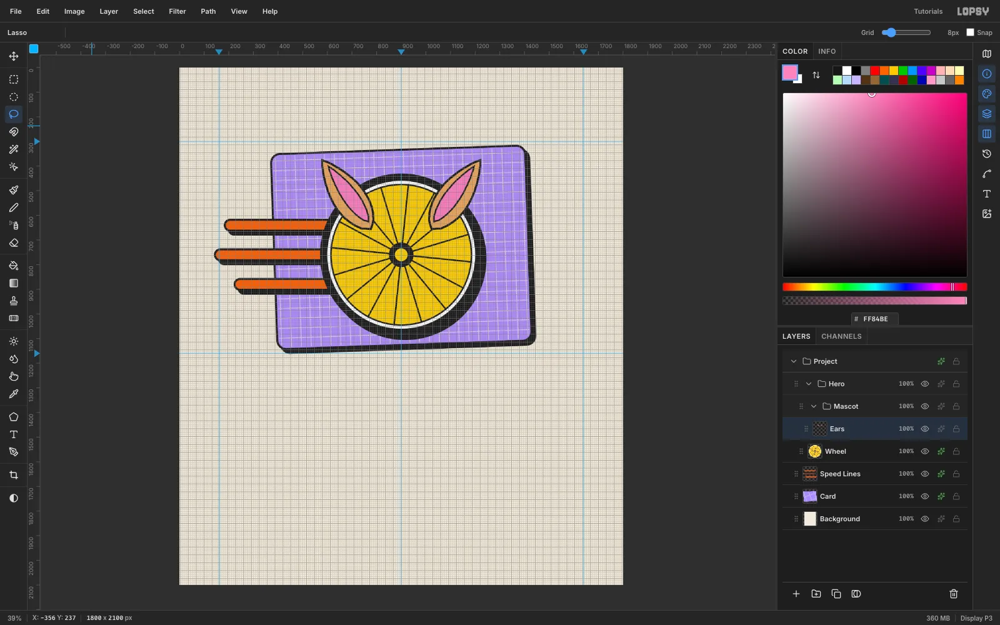

Click `Wheel` and press **New Group** again. The new `Mascot` group nests inside `Hero`. Add a layer `Ears`.

Each ear is a leaf shape:
- **Lasso** from the base at (780, 660) to the tip at (575, 370), about 140 px wide at its fattest.
- Apply the outline recipe with tan `#E2A866`.
- For the inner ear, lasso a narrower leaf from (770, 630) to (600, 395). Fill it ink, then **Shrink 6** and fill pink.
- Mirror both shapes across x 900 for the right ear.

## Add the antlers

On a new `Antlers` layer, each antler is three tapered ribbons:
- **Main beam:** from (858, 645), bowing outwards through about (770, 440), to a tip at (808, 228). It's 60 px wide at the base and 30 px at the tip.
- **Outward tine:** branching from about halfway up towards (688, 372).
- **Inward tine:** branching higher up towards (852, 318).

Lasso every ribbon and fill them all ink first. Then lasso each one again, **Shrink 7** and fill white. Fill the black on every ribbon before any white, so the white never covers an outline where the ribbons cross. Mirror the set for the right antler.

The ears and antlers break out of the wheel. That edge-breaking is what makes the mascot pop off the badge.

## Shape the head and bandana

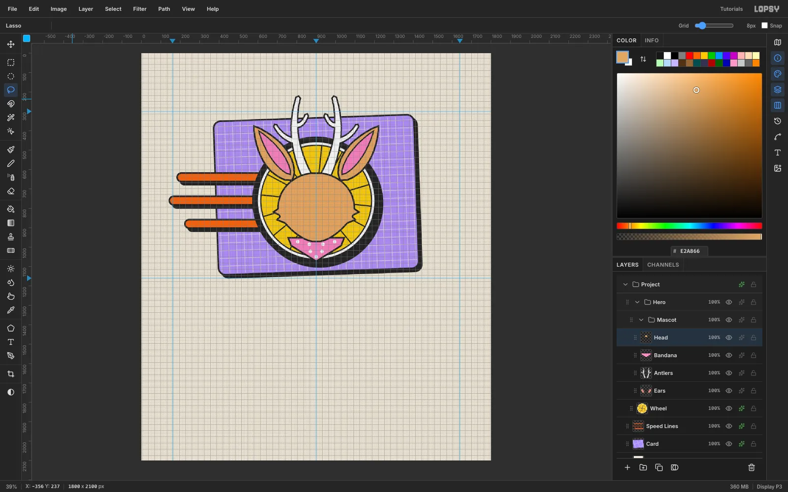

1. **Bandana layer:** lasso the band (750, 948)–(1050, 948)–(1032, 995)–(900, 1078)–(768, 995). Apply the outline recipe in pink. With the selection still active, click white polka dots with the **Brush** at Size **18**, Hardness **100**.
2. **Head layer** (above `Bandana`): lasso a rounded head centred on (900, 795), 400 px wide and 364 px tall. Narrow the chin, and zig-zag the outline at the cheeks between y 800 and 880 for fur tufts. Apply the outline recipe in tan.

The head covers the base of the antlers and the top of the bandana, so both seem to grow out from behind it.

## Build the muzzle

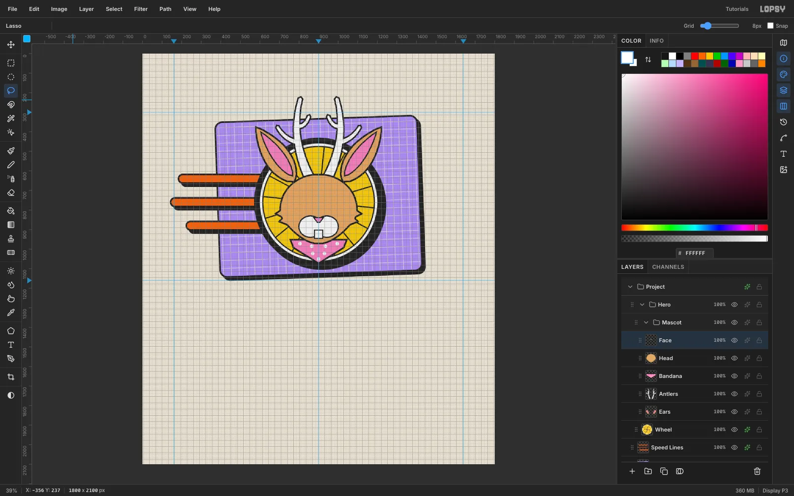

Add a `Face` layer. Fill two outlined white ellipses, 124 × 116 px, centred at (858, 885) and (942, 885), using a 6 px Shrink for the finer face details. Then fill a plain white rectangle (860, 850)–(940, 925) across the middle. It erases the inner outlines, so the two lobes read as one muzzle with a soft dip on top.

## Finish the face

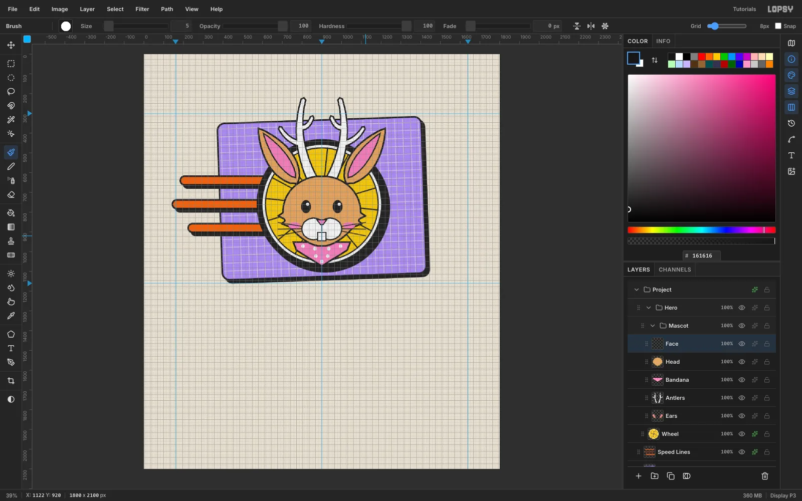

Still on `Face`:
- **Nose:** a trapezoid (870, 836)–(930, 836)–(908, 866)–(892, 866), outlined with a 5 px Shrink and filled pink.
- **Teeth:** an outlined white rectangle (876, 900)–(924, 948), with a 5 px brush line down the middle.
- **Mouth:** a 6 px line from the nose to the teeth.
- **Blush:** pink ellipses 60 × 34 at (762, 868) and (1038, 868), with no outline.
- **Eyes:** ink ellipses 50 × 66 at (820, 772) and (980, 772). Click a white glint up and to the right of each with a hard Brush at Size **16**.
- **Whiskers:** three 5 px brush lines a side, fanning out from the muzzle edge to about 220 px from centre.

## Strap on the courier goggles

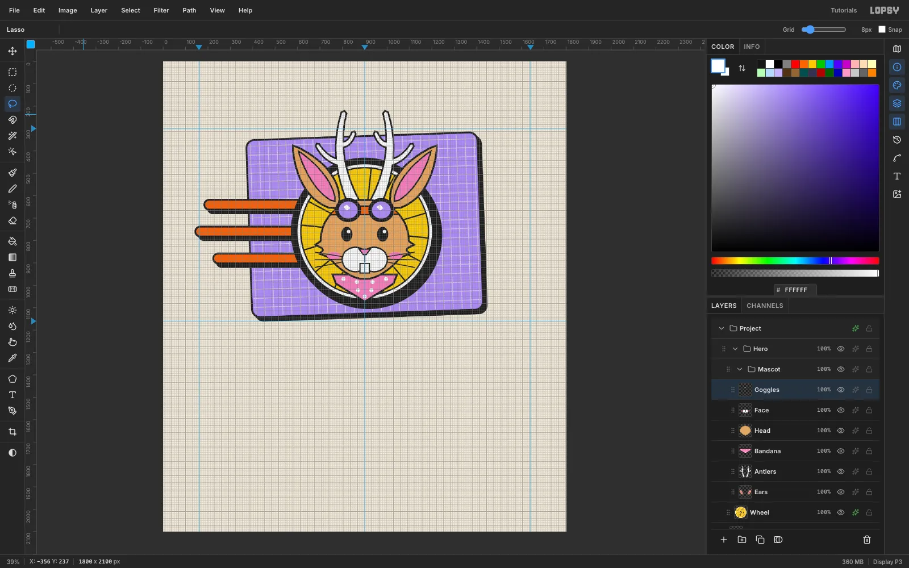

On a `Goggles` layer:
1. Lasso the strap as a band from y 642 to 688 that follows the edge of the head. Apply the outline recipe in tangerine, with a 6 px Shrink.
2. Fill ink ellipses 116 × 108 at (826, 664) and (974, 664) for the rims, then lavender 84 × 76 lenses inside them.
3. Lasso a small white diamond glint at the upper left of each lens.

## Shadow the mascot parts

Give `Ears`, `Antlers`, `Bandana` and `Head` the same 16 / 16 / 1 shadow. Leave `Face` and `Goggles` flat: they're details inside the head, and shadows there would just make clutter.

## Move the whole hero as one group

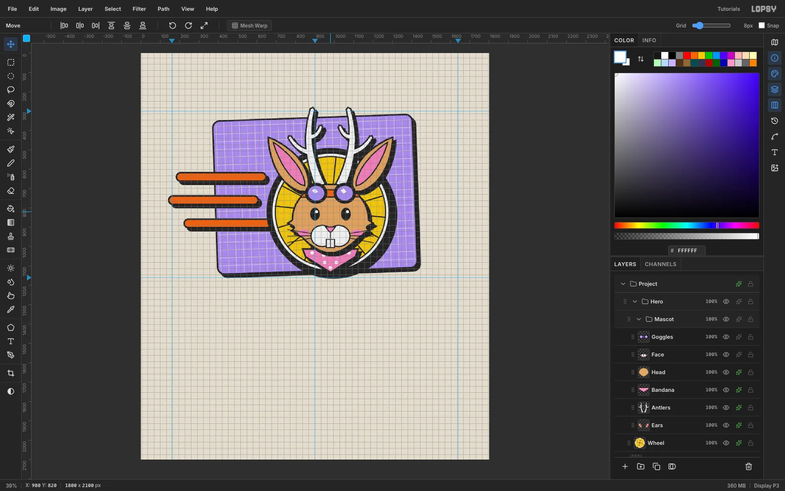

Click the `Hero` group row and drag on the canvas with the **Move** tool. The wheel and every mascot layer travel together. That's handy for nudging the composition later.

The hero is already where it belongs, so press [[Cmd+Z]] to put it back.

## Set JACKALOPE on a lime bar

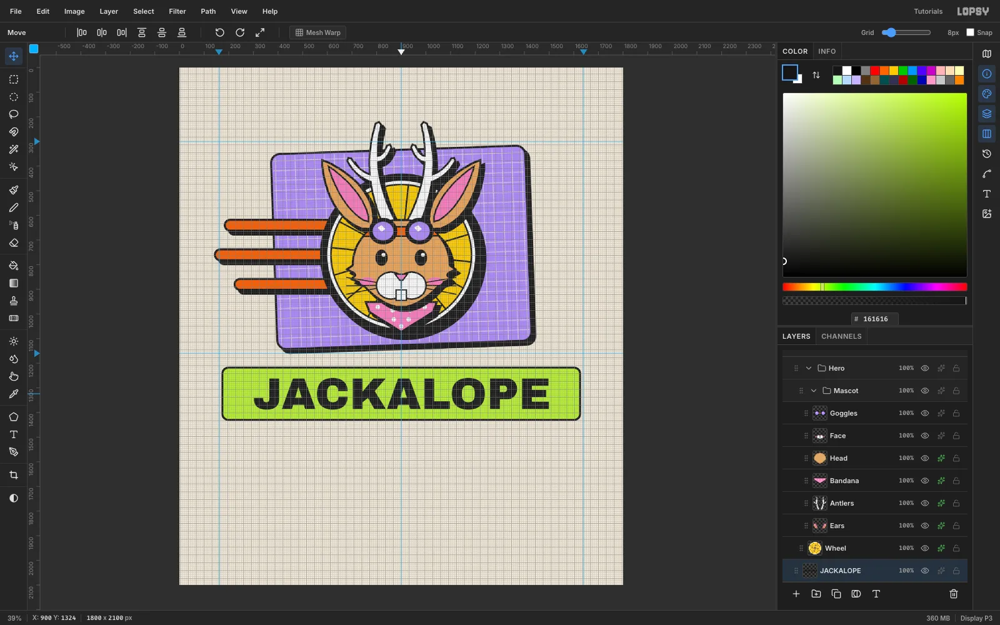

1. Click `Speed Lines` and add `Name Bar`. With the Shape tool, set the Fill to lime `C5F05A` and **Corner Radius** to **24**, click at (900, 1324) and enter **1452 × 212**. With the stroke, the bar is 1460 × 220 overall.
2. Pick the **Text** tool, choose **Archivo Black**, Size **180** and ink colour. Click in an empty area near the bottom of the canvas and type `JACKALOPE`, then press [[Tab]].
3. Move it so its letters are centred on (900, 1324). That leaves about 35 px of lime above and below and 120 px at each end.

## Space out XPRESS

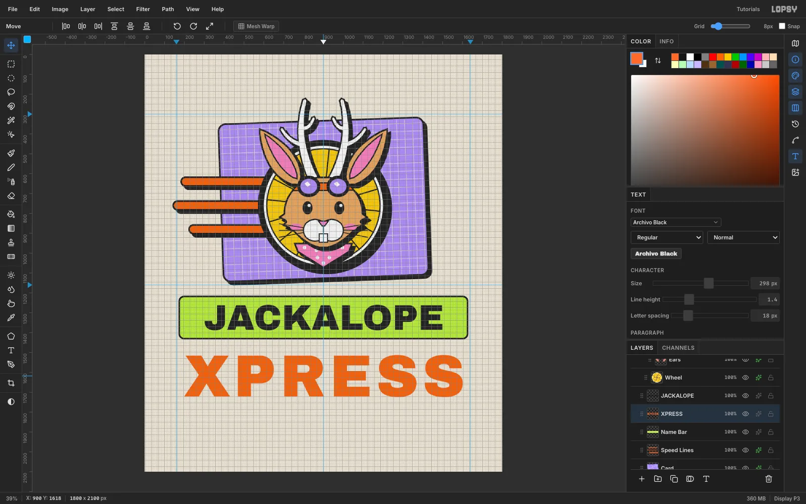

Select `Name Bar`, then set up the text: Archivo Black **300** in tangerine. Click in empty canvas and type `XPRESS`. With the new layer active, set **Letter spacing** to **18** in the Text panel, then bring the Size down to **298** so it spans 1400 px. Move it so it's centred on x 900, with its top at y 1512.

The extra spacing matters for the next step. Without it, the 10 px keylines of neighbouring letters run together into muddy black joins.

## Build the keyline with Grow

1. Click **Rasterize Layer** in the Layers footer, so XPRESS becomes pixels.
2. Click `Name Bar` and add a layer `XPRESS Ink`. It lands under XPRESS.
3. [[Cmd]]-click the XPRESS thumbnail and run **Select → Grow… 10**. Grow measures true distance from the edge, so the keyline is anti-aliased and even all the way round.
4. Fill with ink and deselect.
5. Merge XPRESS down into `XPRESS Ink` and rename the result `XPRESS`.

## Tilt the type to match the card

1. Drag `JACKALOPE`'s row down so it sits directly above `Name Bar`, and **Merge Down**.
2. For `Name Bar`, and then `XPRESS`: marquee just outside it, drag the rotate handle to **−2°**, and press [[Cmd+D]].
3. Give both layers the 16 / 16 / 1 shadow.

Card, bar and logotype now share one angle, so the gaps between them stay even.

## Recolour pasted buttons with the Magic Wand

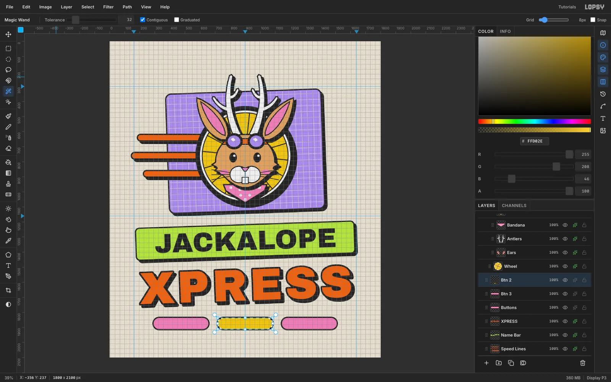

1. Add `Buttons` above `XPRESS`. With the Shape tool, set the Fill to pink `FF84BE` and **Corner Radius** to **41**, click at (474, 1874) and enter **372 × 82**. With the stroke, the pill is 380 × 90 overall.
2. Copy it and paste it twice as `Btn 2` and `Btn 3`, and move them to x 710 and x 1136.
3. Click `Btn 2` and take the **Magic Wand** (Tolerance 32, Contiguous on). Click the pink, run **Select → Grow… 1** so the anti-aliased rim is caught too, and fill yellow.
4. Do the same on `Btn 3` with lime.
5. Merge both copies down into `Buttons` and add the shadow.

## Label the buttons

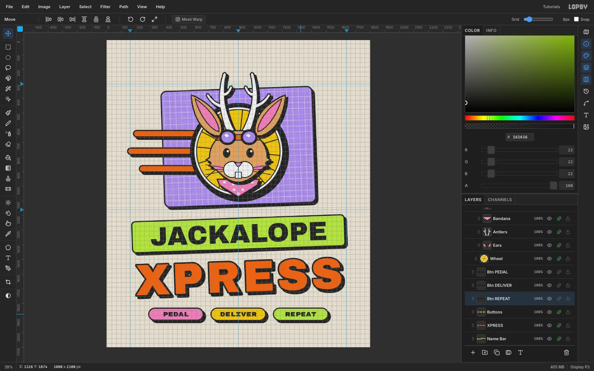

Select `Buttons`, then set up the text: **Rubik Mono One 42** in ink, Letter spacing **0**. Set `PEDAL`, `DELIVER` and `REPEAT`, creating each one in empty canvas, then move it so its letters are centred on its pill: x 474, 900 and 1326, all at y 1874.

## Add the club tab

1. Select `Buttons`, set the Size to **34** and type `BIKE COURIER CLUB` in empty canvas. It's about 490 px wide.
2. Click `Card` and add a `Tab` layer. With the Shape tool, set the Fill to white `FFFFFF` and **Corner Radius** to **36**, click at (450, 308) and enter **571 × 72**. With the stroke, the tab is 579 × 80 overall.
3. Centre the text on (450, 308), drag its row directly above `Tab` and Merge Down.
4. Rotate the tab **−5°** and give it the shadow.

It's tilted a little more than the card, in the same direction, so it reads as a sticker slapped on top.

## Lasso a starburst

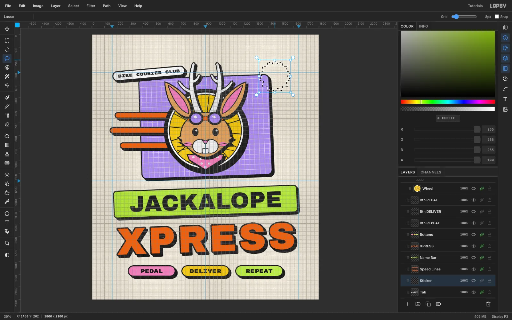

Add `Sticker` above `Tab`. Lasso a 14-point star centred on (1450, 330), with its points alternating between radius 128 and radius 100. Apply the outline recipe in pink.

## Scale the star up

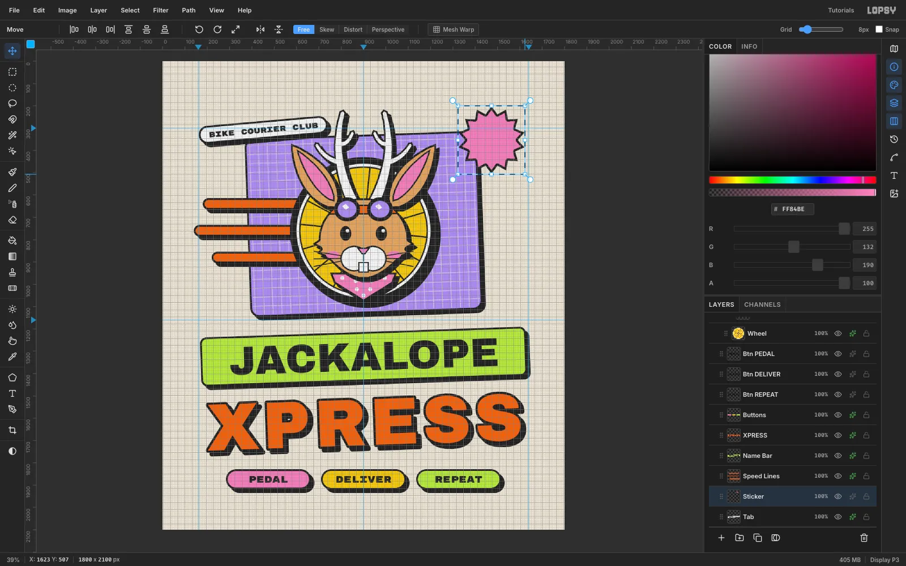

The label will need more room. Marquee the star, switch to **Move**, and hold [[Cmd]] while dragging the bottom-right handle out. [[Cmd]] keeps the scale uniform. Stop at about **118%**, drag the star so it's centred on (1450, 330) again, and press [[Cmd+D]].

## Label and rotate the sticker

1. Type `No.07` in Rubik Mono One **38** (the font draws it in capitals), centre it on the star and Merge Down.
2. Rotate the sticker **−8°** and add the shadow.

## Trim the bandana corners with the Eraser

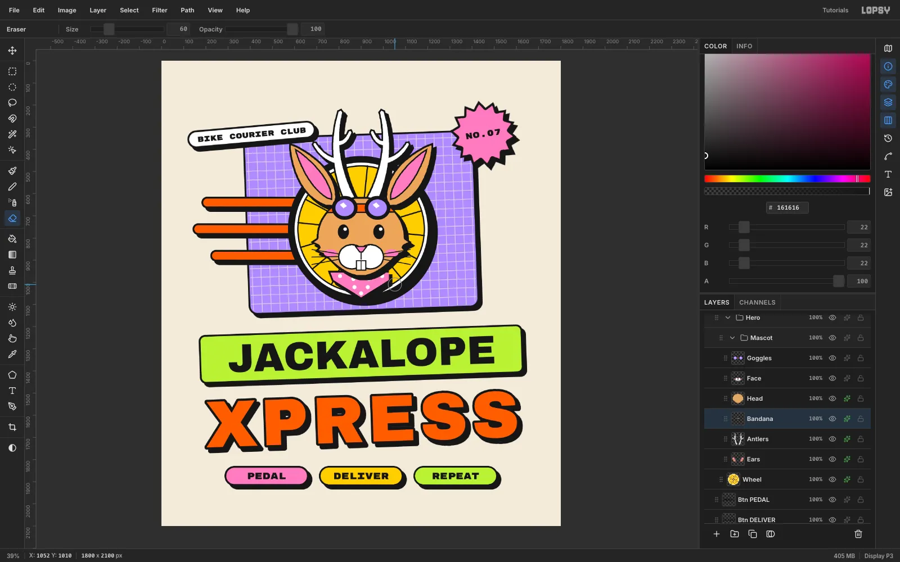

The bandana's top corners stuck out past the jaw, and their shadows read as little hooks.
1. On `Bandana`, pick the **Eraser** at Size **60**. Click at (1052, 925) and [[Shift]]-click (1052, 1010) to cut the right corner off with a straight edge. Do the same at x 748 on the left.
2. Re-ink each cut edge with an 8 px brush line: (1020, 953) to (1020, 996), and (780, 953) to (780, 996).
3. The Eraser's soft edge leaves a faint pink fade outside the new line. Marquee a thin box just outside each line, (1023, 930)–(1070, 1015) and its mirror, and press [[Delete]] for a crisp edge.

## Nudge everything up together

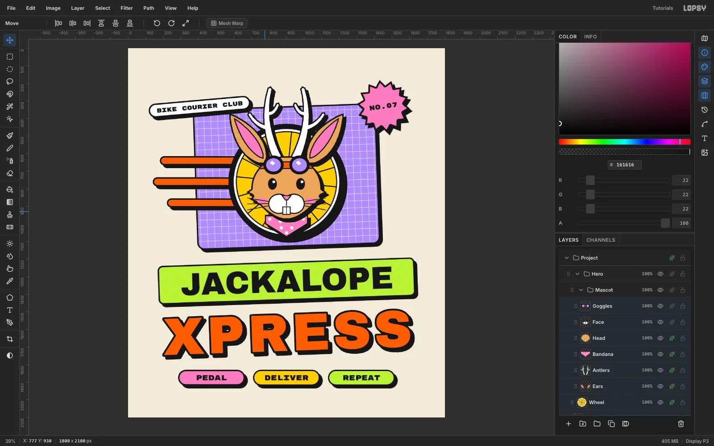

1. Move the `Tab` 45 px left and 25 px down, so it overlaps the card's corner clearly and clears the antler tip.
2. The bottom margin is a little short, so even it out. Click `Card`, then [[Shift]]-click the `Hero` group row. That selects every layer except Background.
3. With the **Move** tool, nudge them up **25 px** with the arrow keys ([[Shift]] + arrow moves 10 px). The whole design rises together.

Hide the grid and guides (**View → Show Grid**, **View → Show Guides**) and export. For a print file, hide `Background` first, so the sand stays bare shirt.
