Neubrutalism takes the flat colour blocks of web UI and makes them loud:
thick black outlines, hard offset shadows with no blur, saturated fills and
chunky type, all slightly askew like stickers slapped on a page. In this
tutorial you'll design a 1080 × 1350 invitation for an imaginary axolotl
pool party, **Axolotl Xtravaganza**. You'll use a pattern fill, layer
effects, rotate and scale transforms, copy and paste, groups, the snap grid
and a filter.

The palette is five flat colours plus near-black:

- Ink `#141414`
- Cream `#FFF1DC`
- Bubblegum `#FF7EC8`
- Cobalt `#3D4BFF`
- Acid lime `#C6FF3D`
- Sun yellow `#FFD93D`

Almost every shape in this piece is a **rounded rectangle**. Lopsy doesn't
have a rounded-rectangle tool, so you'll build one from selections: fill a
rectangle inset by the corner radius horizontally, fill another inset
vertically, then fill a circle with a diameter of twice the radius in each
corner. It takes six quick fills and gives you a crisp, exact shape.

## Create the invitation document

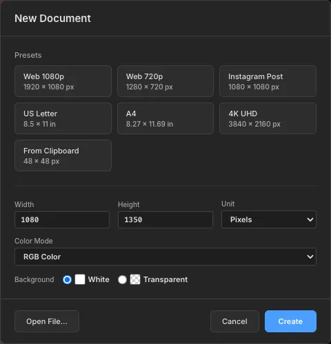

Open [Lopsy](/) and choose **File → New**. Set **Width** `1080` and
**Height** `1350` in pixels, pick a **White** background and click
**Create**. At 4:5 this fits an Instagram post and prints nicely as a
postcard.

## Tile a dot-grid background

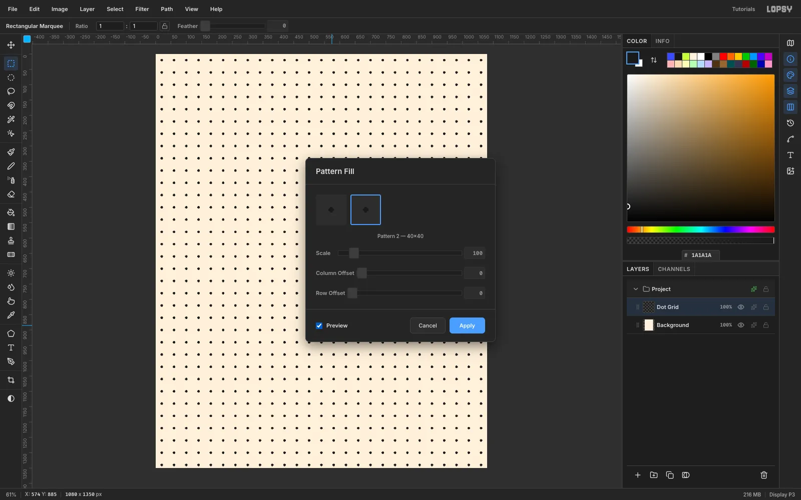

Click the **Background** row, set the foreground to cream `#FFF1DC` and
choose **Edit → Fill**. Then double-click `Layer 1` and rename it
`Dot Grid`.

1. With the **Elliptical Marquee**, drag an 8 px circle at (16, 16) and fill
   it with `#1A1A1A`.
2. With the **Rectangular Marquee**, select the 40 × 40 square from (0, 0)
   and choose **Edit → Define Pattern**.
3. Press [[Cmd+D]], choose **Edit → Fill with Pattern…**, pick the new
   40 × 40 pattern and click **Apply**.

Set the layer's opacity to `22%` so the dots read as graph paper. Then
click the top ruler at 60, 540 and 1020, and the left ruler at 60 and 1290,
to drop margin and centre guides.

## Add a soft pink glow

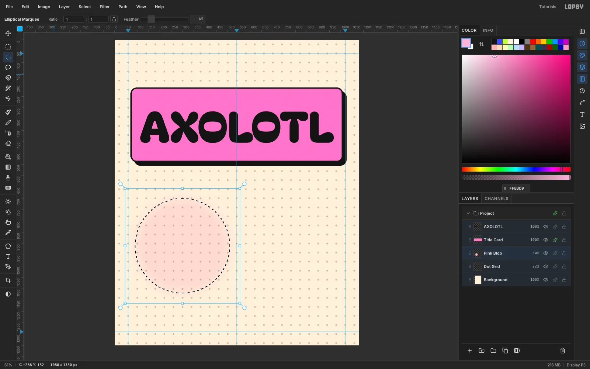

Click **Add Layer** and name the new layer `Pink Blob`. Choose the
**Elliptical Marquee**, set **Feather** to `45` in the options bar, and
drag from (90, 700) to (510, 1120). Fill it with `#FFB3D9`, then deselect.

Open the layer's effects (✦ on the row), set **Blend** to **Multiply**,
and drop the row opacity to `30%`. This faint halo sits behind the mascot
later. Set **Feather** back to `0` before you draw anything else.

> **Tip:** A feathered selection gives a cleaner soft edge here than
> blurring a hard circle.

## Build the title slab with a stroke and hard shadow

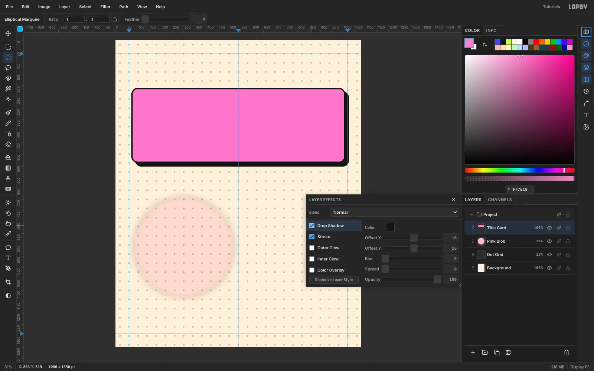

Add a layer called `Title Card` and set the foreground to `#FF7EC8`. Build
a rounded rectangle at (70, 210), 940 × 330 with a 28 px radius, using the
six-fill trick from the intro.

Open the layer's effects and set:

- **Stroke**: colour `#141414`, **Width** `6`, position **Inside**
- **Drop Shadow**: colour `#141414`, **Offset X** `16`, **Offset Y** `16`,
  **Blur** `0`, **Spread** `0`, **Opacity** `100`

That zero-blur shadow is the signature neubrutalist look. It reads as a
second, solid slab sitting behind the first. You'll reuse these two
effects, at smaller sizes, on nearly every shape in the design.

## Set the headline

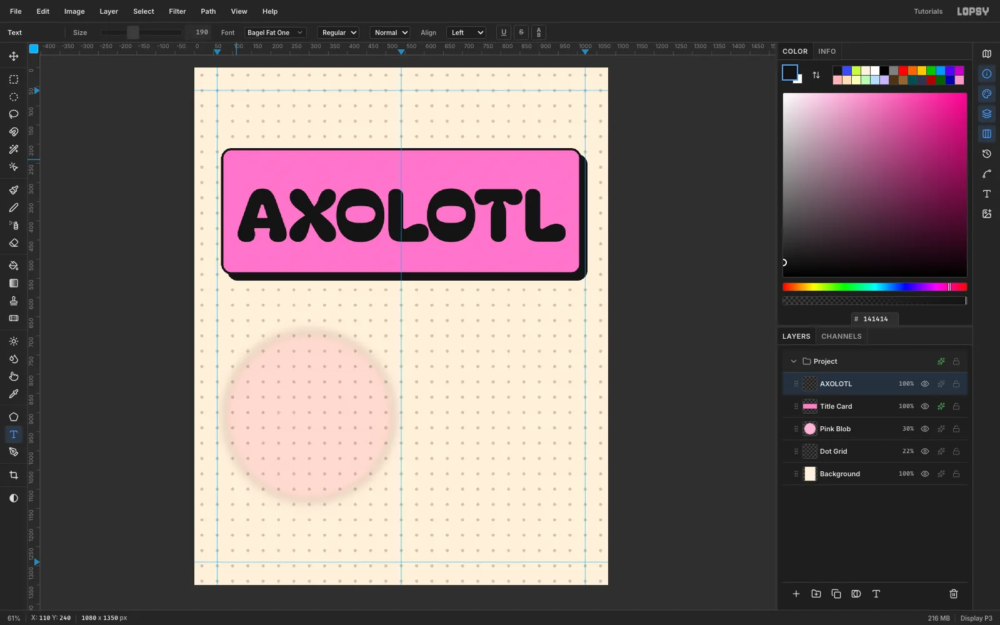

Choose the **Text** tool. In the options bar set **Size** `190` and pick
**Bagel Fat One** from the font browser. Set the foreground to `#141414`,
click at about (110, 240) and type `AXOLOTL`. Press [[Tab]] to commit.

Bagel Fat One's soft, blobby letters match the mascot. The line is about
860 px wide, which fills the slab with a comfortable margin.

## Tilt a contrasting band across the slab

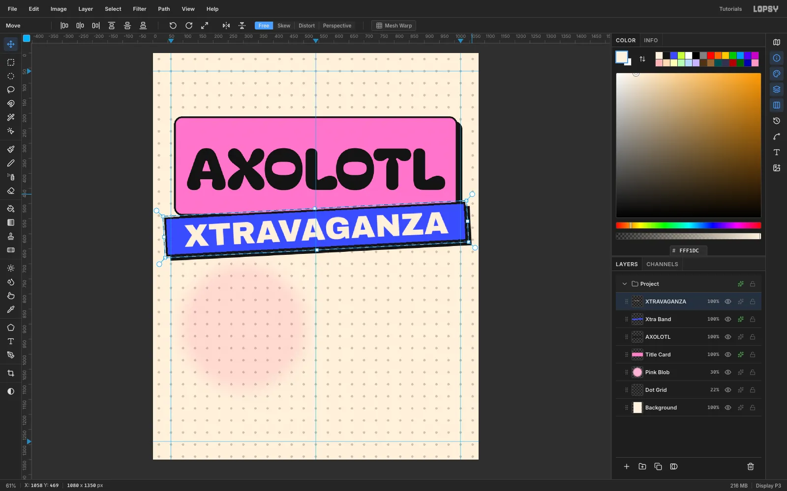

Add a layer called `Xtra Band`. Select the rectangle (40, 520) to
(1040, 650), fill it with cobalt `#3D4BFF`, and give it an Inside
**Stroke** of `6` and a hard **Drop Shadow** of `14` / `14`.

Type `XTRAVAGANZA` in **Archivo Black** at size `104` in cream `#FFF1DC`.
Drag it with the **Move** tool until it's centred on the band, then click
**Rasterize Layer** in the Layers footer.

Now tilt both layers the same way:

1. Click the `Xtra Band` row and draw a marquee from (36, 516) to
   (1044, 654).
2. Switch to the **Move** tool and drag the rotate handle (just outside the
   top-right corner) until the band tilts about **−3°**. Press [[Cmd+D]] to
   commit.
3. Click the `XTRAVAGANZA` row, draw the *same* marquee and rotate it by the
   same amount, then press [[Cmd+D]].

Using an identical marquee for both layers means they pivot around the
same centre, so the type stays locked to its band.

## Add the RSVP pill

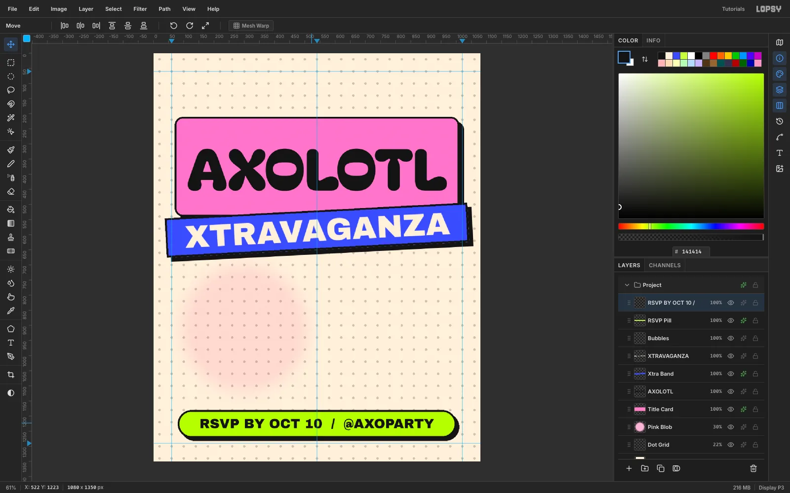

Click **Add Layer** twice. Name the first layer `Bubbles` and leave it
empty for now. Name the second `RSVP Pill`. Build a pill at (80, 1180),
920 × 92, with a 46 px radius (half the height), and fill it with lime
`#C6FF3D`. Give it an Inside **Stroke** of `6` and a **Drop Shadow** of
`10` / `10`.

Type `RSVP BY OCT 10  /  @AXOPARTY` in **Archivo Black** at size `44` in
ink, centre it on the pill, and rasterize it.

## Make the stickers

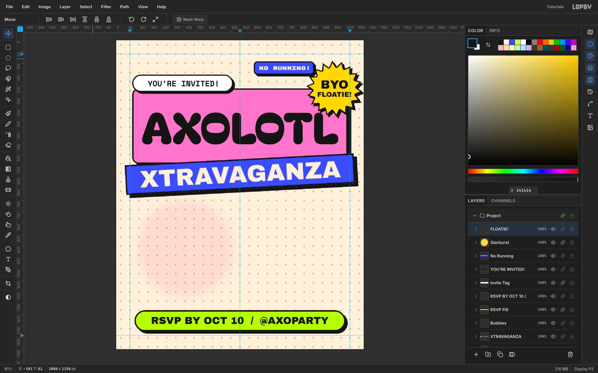

Stickers overlap the edges of other shapes, which gives the layout its
collage energy. Each one is a filled shape with a thinner stroke (`5`) and
a smaller shadow (`8` / `8`):

- **Invite tag**: a white pill at (70, 150), 440 × 76 (radius 38). Its
  bottom edge overlaps the slab. Add `YOU'RE INVITED!` in **Space Mono**
  Bold at `34`.
- **No Running**: a cobalt rounded rectangle at (600, 92), 264 × 58
  (radius 16). Add `NO RUNNING!` in **Rubik Mono One** at `24` in cream,
  rasterize it, and **Merge Down** onto the sticker.
- **Starburst**: with the **Lasso**, click an 18-point star centred on
  (952, 212), alternating between radius 122 and 95, then fill it with
  `#FFD93D`. Add `BYO` (Archivo Black, `52`) and `FLOATIE!` (`30`),
  rasterize both, and Merge Down one text layer onto the other.

## Rotate the stickers

Rotate each sticker and its text together, the same way you did the band:
the same marquee for both layers, then drag the rotate handle and press
[[Cmd+D]].

- Invite tag: marquee (64, 144) to (520, 236), **−4°**
- No Running: marquee (590, 82) to (880, 166), **+6°**
- Starburst: marquee (826, 86) to (1078, 338), **+12°**

> **Tip:** Merge Down bakes the lower layer's stroke and shadow into its
> pixels, so the No Running sticker's shadow is now real pixels. Make the
> marquee big enough to include the shadow, or a thin strip of it stays
> behind when you rotate.

## Blow bubbles with copy, paste and scale

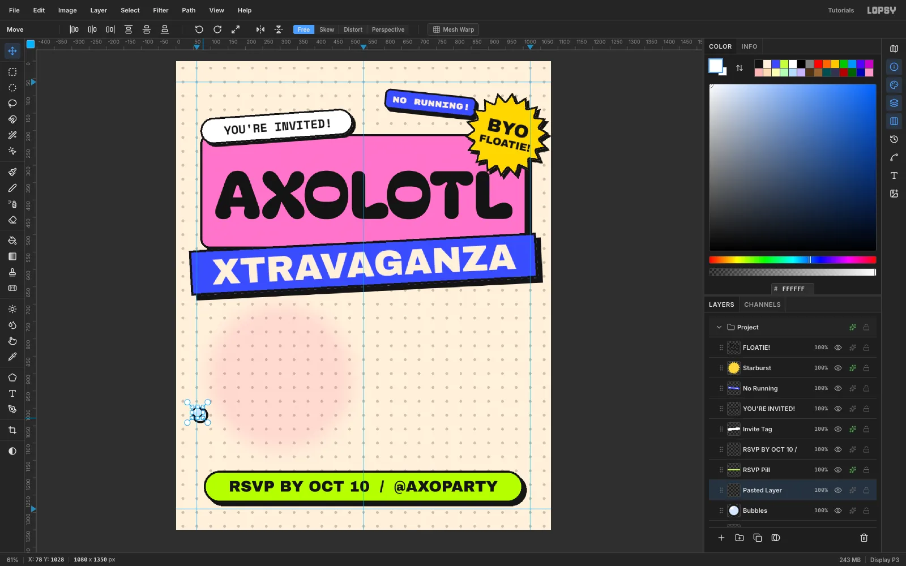

Click the `Bubbles` layer. Make a 46 px black circle at (47, 997), choose
**Select → Shrink** by `5`, and fill the smaller circle with pale blue
`#D6E6FF`. Add a 13 × 11 white highlight near its top left.

Now make smaller copies:

1. Marquee the bubble, press [[Cmd+C]], then [[Cmd+V]]. The copy is pasted in
   place on a new layer.
2. Marquee it again, switch to the **Move** tool, and [[Cmd]]-drag the
   bottom-right handle inward to about 66%. Press [[Cmd+D]].
3. Marquee the smaller bubble, drag it up and to the right, press
   [[Cmd+D]], and choose **Layer → Merge Down**.

Repeat at 45% and 60% to get a rising trail: one bubble beside the head and
one between the gills.

## Draw the axolotl

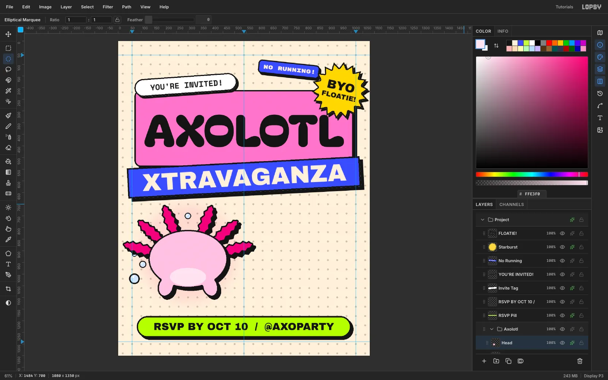

Click the `Bubbles` row, click **New Group** and name it `Axolotl`. The
group lands above `Bubbles`, and new layers now go inside it.

- **Gills**: Add a layer. With the **Lasso**, click six feathery fronds
  around the top half of an imaginary head centred on (300, 935). Make each
  frond a long zigzag oval, about 156 × 40, fanning outward. Fill them with
  `#E0287A`.
- **Head**: Add a layer above. Fill an elliptical marquee 340 × 250 around
  (300, 935) with `#FFC4E1`. Lasso two small tilted ovals under it for arms,
  then fill a 156 × 78 belly ellipse in `#FFE3F0`.

Give both layers an Inside **Stroke** of `6` and a **Drop Shadow** of
`12` / `12`. The head's outline cuts cleanly across the base of the gills.

## Add a face and drop it in a pool

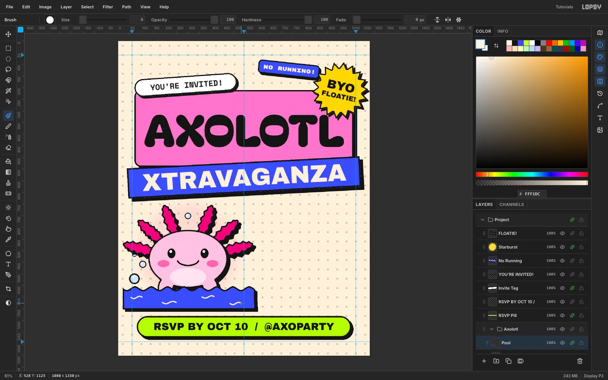

On a new `Face` layer:

- Blush: two 50 × 30 ellipses in `#FF6FAE`.
- Eyes: two 34 × 42 black ovals.
- Highlights: a 12 px white dot in each eye.
- Smile: a **Brush** arc at size `7`, hardness `100`.

Add a `Pool` layer on top. With the **Lasso**, click a wavy line from
(20, 1060) to (590, 1060) that rises and falls about 8 px every 70 px. Then
click down to (590, 1152) and (20, 1152) to close the shape. Fill it with
cobalt, and give it an Inside **Stroke** of `6` and a **Drop Shadow** of
`10` / `10`.

Finish with four short cream brush squiggles for ripples. The pool covers
the bottom of the head and the arms, so the axolotl is sitting in the
water.

## Lay out the info cards on the snap grid

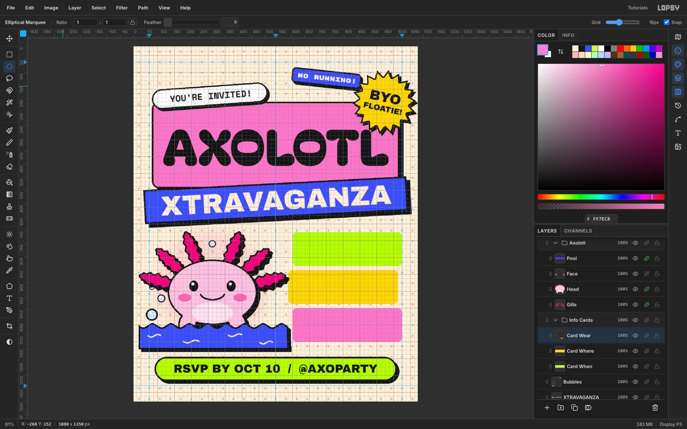

Click `Bubbles` again and create a **New Group** called `Info Cards`.
Choose **View → Show Grid**. The grid defaults to 16 px, with **Snap**
turned on. Marquee corners snap to the grid lines, so the cards line up
perfectly.

Add three layers and build a 416 × 128 card (radius 16) on each:

- `Card When`: lime, at (604, 707)
- `Card Where`: yellow, at (588, 851)
- `Card Wear`: pink, at (604, 995)

The middle card sits 16 px to the left, which breaks up the stack. Hide
the grid again, then add a black 112 × 36 tab (radius 10) to each card at
its top-left, 18 px in and hanging 18 px above the edge.

## Write the card details

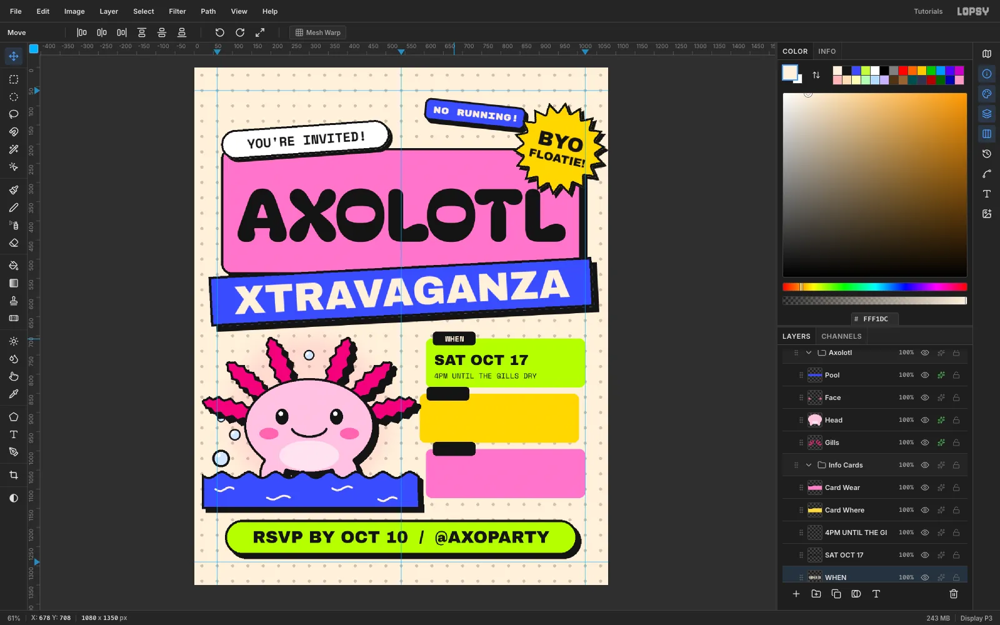

Each card gets three lines. Click the card's row before creating each one
so the text lands in the group:

1. The detail line in **Space Mono** Regular `19`, e.g.
   `4PM UNTIL THE GILLS DRY`.
2. The value in **Archivo Black** `38`, e.g. `SAT OCT 17`.
3. The label in **Space Mono** Bold `20` in cream, centred on the tab, e.g.
   `WHEN`.

Create them **bottom line first**. A text-tool click just below an existing
line of text edits that line instead of starting a new one.

Rasterize all three, click the top text layer and press **Merge Down**
three times so everything ends up in the card layer. Stop there: the card
is the bottom layer of its group, so a fourth Merge Down would pull it out
of the group. Then give the card an Inside **Stroke** of `5` and a
**Drop Shadow** of `10` / `10`.

## Tilt the cards

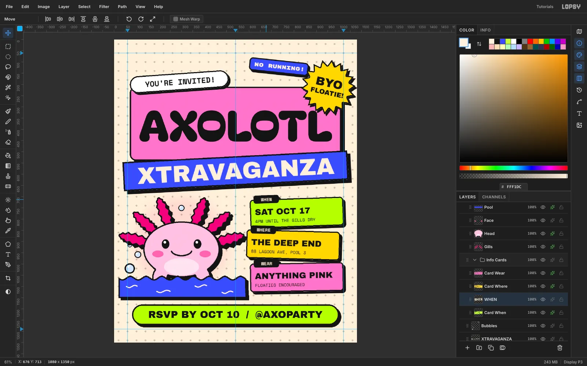

Identical upright cards read like a form. Tilt them a little in
alternating directions. For each card, draw a marquee that covers the card
and its tab with a few pixels to spare, rotate with the **Move** tool, and
press [[Cmd+D]]:

- `Card When`: **−2°**
- `Card Where`: **+1.5°**
- `Card Wear`: **−1°**

## Finish with sparkles and print grain

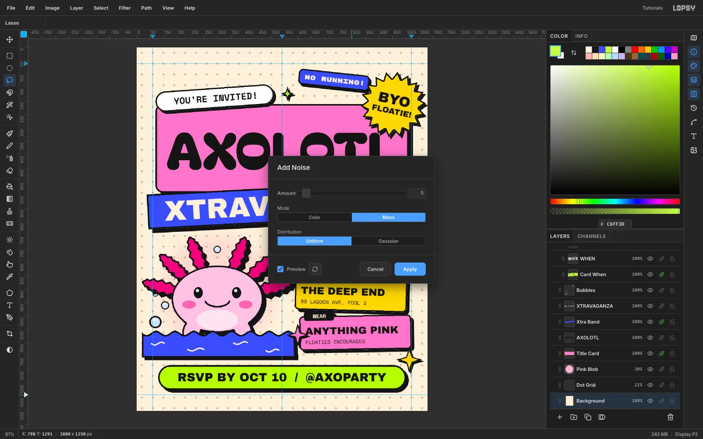

Click the top layer and add a `Sparkles` layer. Lasso three four-pointed
stars (inner radius about 30% of the outer) and fill them:

- Sun yellow, 48 px, on the corner of the RSVP pill
- Bubblegum, 42 px, on the pool's corner
- Acid lime, 26 px, between the tag and the sticker

Give them a `4` px Inside **Stroke** and a `6` / `6` shadow.

Finally, click the **Background** row and choose **Filter → Add
Noise…**. Set **Amount** `5` and **Mono**, then click **Apply**. The grain
is barely visible, but it takes the digital flatness off the cream and
makes the piece feel printed.

## Export the invitation

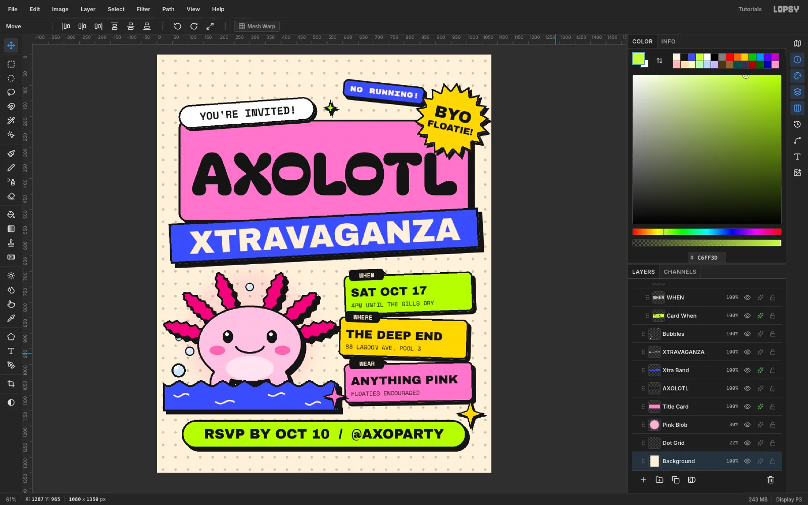

Choose **View → Show Guides** to hide the guides. Then use **File → Quick
Export PNG** for a shareable image and **File → Save Project** to keep an
editable `.lopsy` file with every layer, group and effect intact.

To make your own version, swap the mascot and the copy, and keep the rules
that make it neubrutalist:

- Flat fills only
- One outline colour
- Hard shadows with zero blur
- Every sticker a few degrees off square
