Neubrutalism takes the flat colour blocks of web UI and makes them loud:
thick black outlines, hard offset shadows with no blur, saturated fills and
chunky type, all slightly askew like stickers slapped on a page. In this
tutorial you'll design a 1080 × 1350 invitation for an imaginary axolotl
pool party, **Axolotl Xtravaganza**. You'll use a pattern fill, layer
effects, rotate and scale transforms, copy and paste, groups, the snap grid
and a filter.

The palette is five flat colours plus near-black:

- Ink `#141414`
- Cream `#FFF1DC`
- Bubblegum `#FF7EC8`
- Cobalt `#3D4BFF`
- Acid lime `#C6FF3D`
- Sun yellow `#FFD93D`

Almost every shape in this piece is a **rounded rectangle**, drawn with the
**Shape** tool (U). In the options bar, set **Shape** to **Rectangle** and
**Output** to **Pixels**, set the **Corner Radius**, click the **Fill**
swatch and type the colour into its hex field, and remove the stroke (the
outlines come from a Stroke effect instead). Then click (don't drag) where
the shape's centre should go and type its **Width** and **Height**. The
Shape tool draws from the centre out.

> **Tip:** For a pill, set the Corner Radius to half the height.

## Create the invitation document

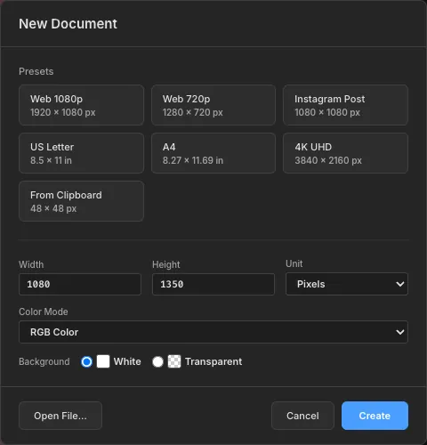

Open [Lopsy](/) and choose **File → New**. Set **Width** `1080` and
**Height** `1350` in pixels, pick a **White** background and click
**Create**. At 4:5 this fits an Instagram post and prints nicely as a
postcard.

## Tile a dot-grid background

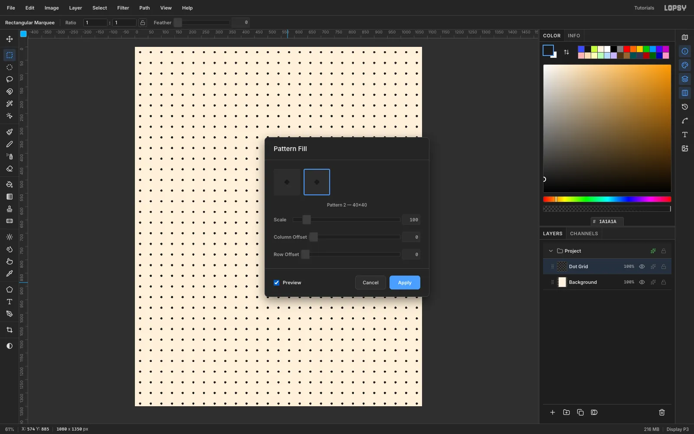

Click the **Background** row, set the foreground to cream `#FFF1DC` and
choose **Edit → Fill**. Then double-click `Layer 1` and rename it
`Dot Grid`.

1. Pick the **Brush** at **Size 8**, **Hardness 100**, in `#1A1A1A`, and
   click once in the middle of the top-left 40 × 40 corner of the canvas
   (at about 20, 20) to leave a single dot.
2. With the **Rectangular Marquee**, select exactly that 40 × 40 square:
   a single click (no drag) opens a dialog where you type **From** `0`,
   `0` and **To** `40`, `40`. Choose **Edit → Define Pattern**.
3. Press [[Cmd+D]], choose **Edit → Fill with Pattern…**, pick the new
   40 × 40 pattern and click **Apply**.

Set the layer's opacity to `22%` so the dots read as graph paper. Then add
margin and centre guides by clicking the rulers: on the top ruler, click
60 px in from each side and [[Cmd]]-click ([[Ctrl]]-click) the middle for
an exact centre line. On the left ruler, click 60 px from the top and from
the bottom.

## Add a soft pink glow

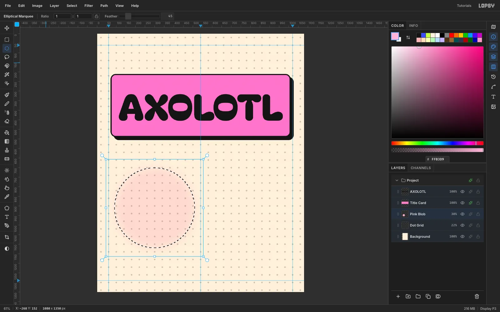

Click **Add Layer** and name the new layer `Pink Blob`. Choose the
**Elliptical Marquee**, set **Feather** to `45` in the options bar, and
hold [[Cmd]] while you drag a 420 px circle in the lower left, starting
about 90 px in from the left edge and a little above halfway down. Fill it
with `#FFB3D9`, then deselect.

Open the layer's effects (the sparkle button on the layer row), set
**Blend** to **Multiply**, and drop the row opacity to `30%`. This faint
halo sits behind the mascot later. Set **Feather** back to `0` before you
draw anything else.

> **Tip:** A feathered selection gives a cleaner soft edge here than
> blurring a hard circle.

## Build the title slab with a stroke and hard shadow

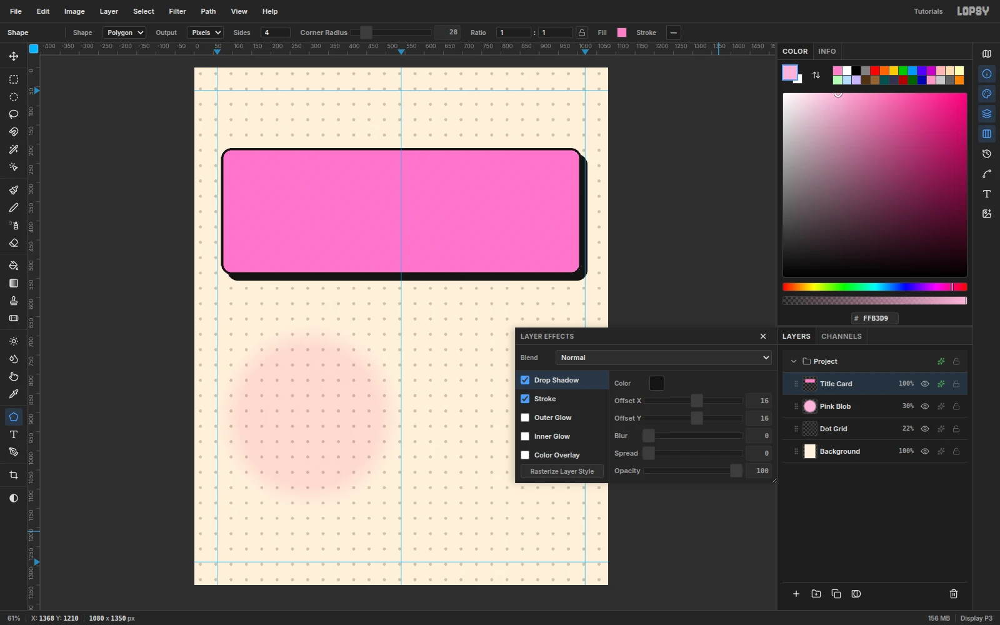

Add a layer called `Title Card`. Using the method from the intro, draw a
940 × 330 rounded rectangle in `#FF7EC8` with a 28 px radius, 70 px in from
each side (just outside the margin guides) and about 210 px from the top.
Its centre is at about **540, 375**.

Open the layer's effects and set:

- **Stroke**: colour `#141414`, **Width** `6`, **Position** set to **inside**
- **Drop Shadow**: colour `#141414`, **Offset X** `16`, **Offset Y** `16`,
  **Blur** `0`, **Spread** `0`, **Opacity** `100`

That zero-blur shadow is the signature neubrutalist look. It reads as a
second, solid slab sitting behind the first. You'll reuse these two
effects, at smaller sizes, on nearly every shape in the design.

## Set the headline

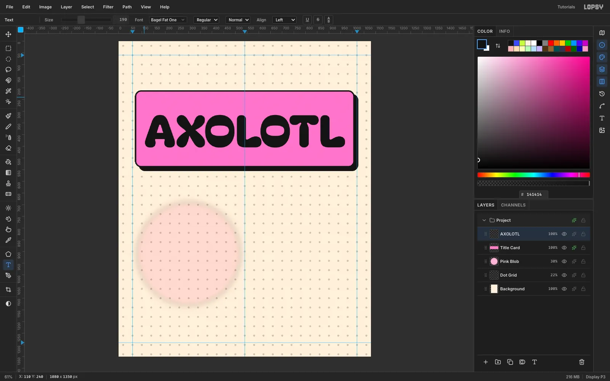

Choose the **Text** tool. In the options bar set **Size** `190` and pick
**Bagel Fat One** from the font browser. Set the foreground to `#141414`,
click near the top-left of the slab and type `AXOLOTL`. Press [[Tab]] to
commit, then move it with the **Move** tool until it's centred on the slab.

Bagel Fat One's soft, blobby letters match the mascot. The line is about
860 px wide, which fills the slab with a comfortable margin.

## Tilt a contrasting band across the slab

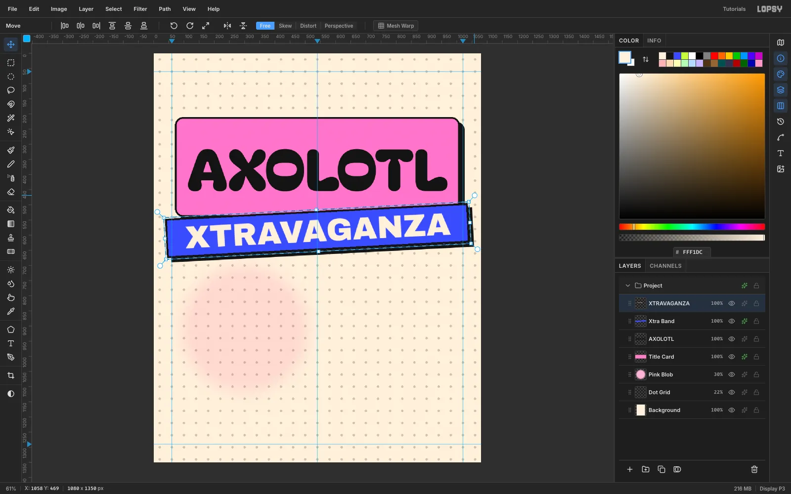

Add a layer called `Xtra Band`. Select a band 130 px tall that runs from
40 px in from the left edge to 40 px in from the right, overlapping the
bottom of the pink slab by about 20 px. Fill it with cobalt `#3D4BFF`, and
give it an inside **Stroke** of `6` and a hard **Drop Shadow** of `14` /
`14`.

Type `XTRAVAGANZA` in **Archivo Black** at size `104` in cream `#FFF1DC`.
Drag it with the **Move** tool until it's centred on the band, then click
**Rasterize Layer** in the Layers footer.

Now tilt both layers together:

1. Click the `Xtra Band` row and [[Shift]]-click the `XTRAVAGANZA` row so
   both are selected. Press [[Cmd+D]] so nothing is marqueed.
2. Switch to the **Move** tool. One transform box frames the band and its
   type. Drag the rotate handle (just outside the top-right corner) until
   the band tilts about **−3°**. Press [[Cmd+D]] to commit.

Both layers turn around the band's centre, so the type stays locked to its
band.

## Add the RSVP pill

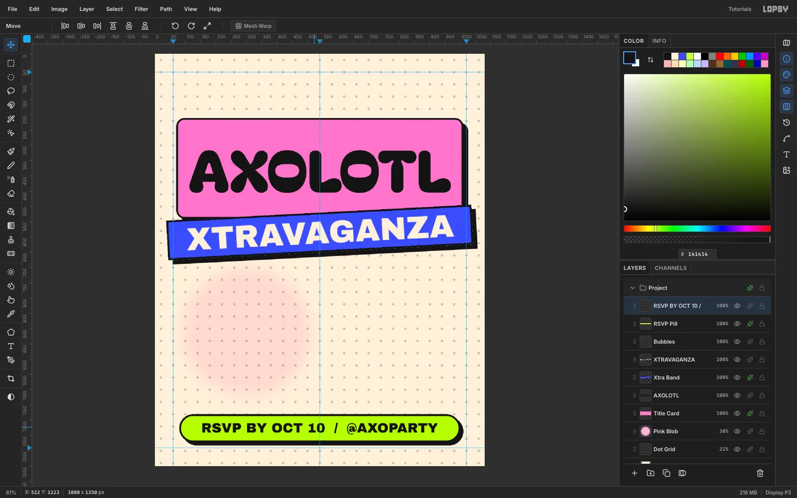

Click **Add Layer** twice. Name the first layer `Bubbles` and leave it
empty for now. Name the second `RSVP Pill`. Draw a 920 × 92 pill in lime
`#C6FF3D` with a 46 px radius (half the height), centred across the page
and sitting just above the bottom margin guide. Give it an
inside **Stroke** of `6` and a **Drop Shadow** of `10` / `10`.

Type `RSVP BY OCT 10  /  @AXOPARTY` in **Archivo Black** at size `44` in
ink, centre it on the pill, and rasterize it.

## Make the stickers

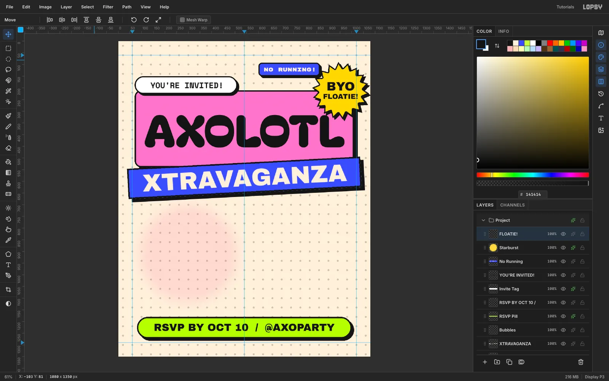

Stickers overlap the edges of other shapes, which gives the layout its
collage energy. Each one is a filled shape with a thinner stroke (`5`) and
a smaller shadow (`8` / `8`):

- **Invite tag**: a white 440 × 76 pill (radius 38), lined up with the
  slab's left edge and sitting just above it, so its bottom edge overlaps
  the slab by about 16 px. Add `YOU'RE INVITED!` in **Space Mono** Bold at
  `34`.
- **No Running**: a cobalt 264 × 58 rounded rectangle (radius 16), up and
  to the right of the tag, just right of the centre guide. Add
  `NO RUNNING!` in **Rubik Mono One** at `24` in cream and **Merge Down**
  onto the sticker.
- **Starburst**: with the **Lasso**, drag an 18-pointed star over the
  slab's top-right corner. Go round a centre point through 36 corners in
  straight runs, alternating between the tips, about 122 px out, and the
  valleys, about 95 px out, and let go back at the start. Fill it with
  `#FFD93D`. Add `BYO` (Archivo Black, `52`) and
  `FLOATIE!` (`30`), and Merge Down one text layer onto the other.

## Rotate the stickers

Rotate each sticker and its text together, the same way you did the band:
click the sticker's row, [[Cmd]]-click its text row and press [[Cmd+D]].
Then drag the **Move** tool's rotate handle and press [[Cmd+D]]. No Running
is already one layer, so marquee it with a little room for its shadow and
rotate that.

- Invite tag: **−4°**
- No Running: **+6°**
- Starburst: **+12°**

## Blow bubbles with copy, paste and scale

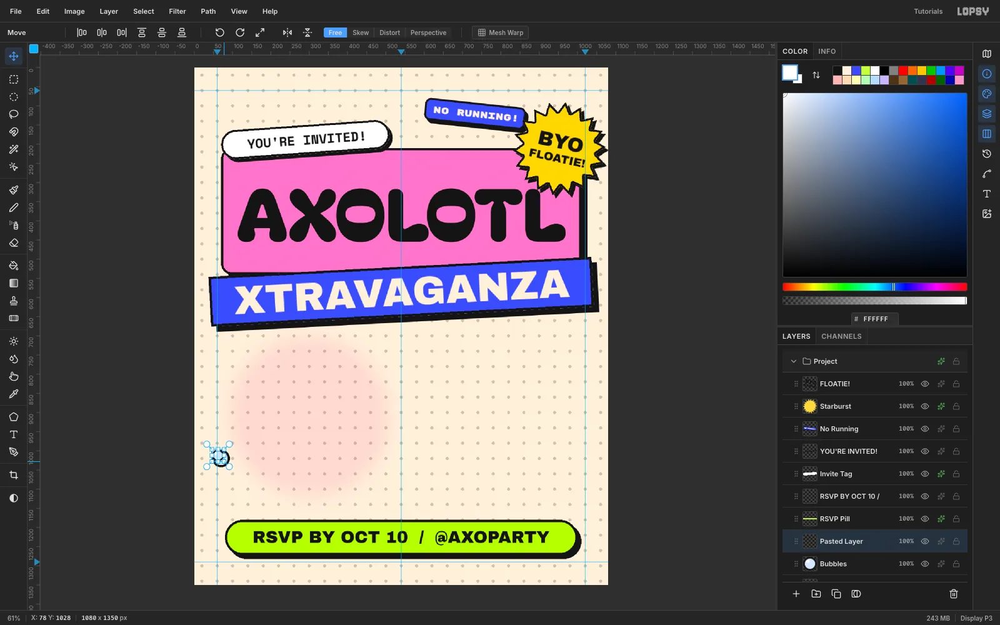

Click the `Bubbles` layer. Near the left edge, just above where the pool
will go (a little under three-quarters of the way down), make a 46 px black
circle. Choose **Select → Shrink…** by `5`, and fill the smaller circle
with pale blue `#D6E6FF`. Add a 13 × 11 white highlight near its top left.

Now make smaller copies:

1. Marquee the bubble, press [[Cmd+C]], then [[Cmd+V]]. The copy is pasted in
   place on a new layer, selected, with the **Move** tool active.
2. [[Cmd]]-drag the bottom-right handle inward to about 66%, then drag the
   smaller bubble up and to the right.
3. Press [[Cmd+D]] and choose **Layer → Merge Down**.

Repeat at 45% and 60% to get a rising trail: one bubble beside the head and
one between the gills.

## Draw the axolotl

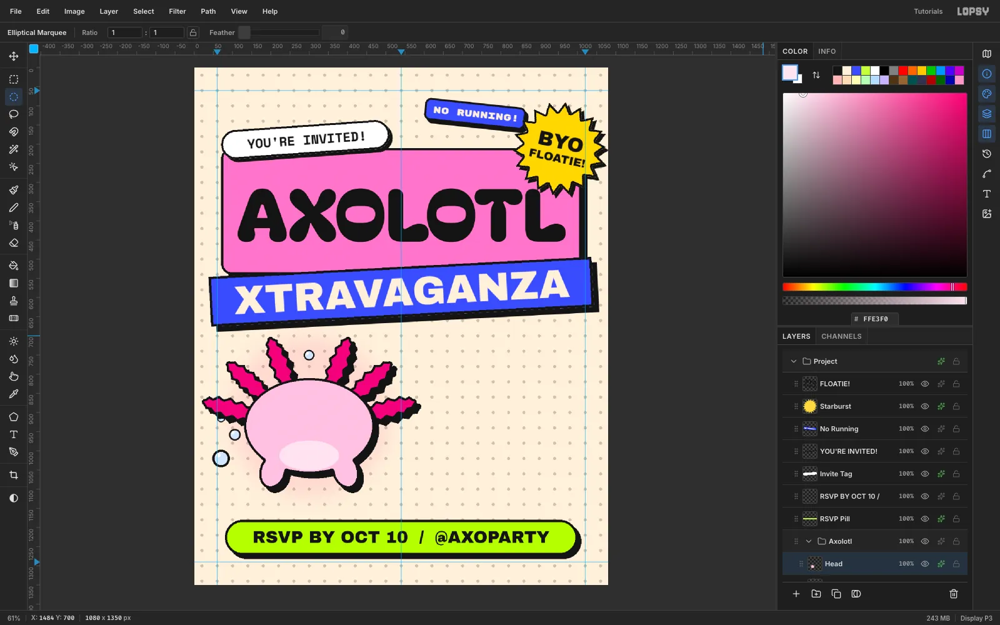

Click the `Bubbles` row, click **New Group** and name it `Axolotl`. The
group lands above `Bubbles`, and new layers now go inside it.

- **Gills**: Add a layer. With the **Lasso**, drag six feathery fronds
  around the top half of an imaginary head centred on the pink glow. Make
  each frond a long zigzag oval, about 156 × 40, fanning outward. Fill them
  with `#E0287A`.
- **Head**: Add a layer above. Fill a 340 × 250 elliptical marquee centred
  on the same point with `#FFC4E1`. Lasso two small tilted ovals under it
  for arms, then fill a 156 × 78 belly ellipse in `#FFE3F0`.

Give both layers an inside **Stroke** of `6` and a **Drop Shadow** of
`12` / `12`. The head's outline cuts cleanly across the base of the gills.

## Add a face and drop it in a pool

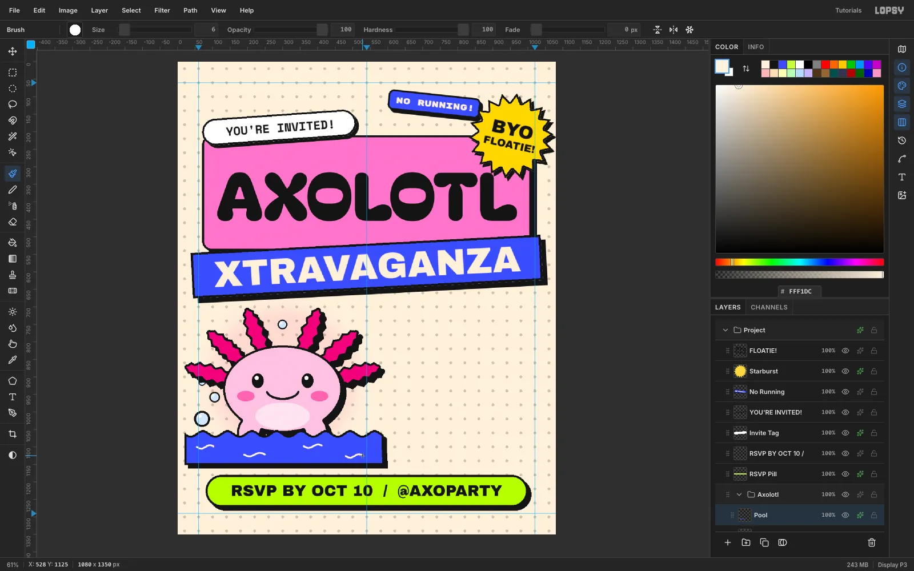

On a new `Face` layer:

- Blush: two 50 × 30 ellipses in `#FF6FAE`.
- Eyes: two 34 × 42 black ovals.
- Highlights: one click in each eye with a white **Brush** at size `12`,
  hardness `100`.
- Smile: a **Brush** arc at size `7`, hardness `100`.

Add a `Pool` layer on top. With the **Lasso**, press just inside the left edge,
level with the bottom of the head, and drag a wavy line to about 570 px
across, rising and falling about 8 px every 70 px. Then drag about 90 px
straight down and back across to the start, and let go to close the shape. Fill it
with cobalt, and give it an inside **Stroke** of `6` and a **Drop Shadow**
of `10` / `10`.

Finish with four short cream brush squiggles for ripples. The pool covers
the bottom of the head and the arms, so the axolotl is sitting in the
water.

## Lay out the info cards on the snap grid

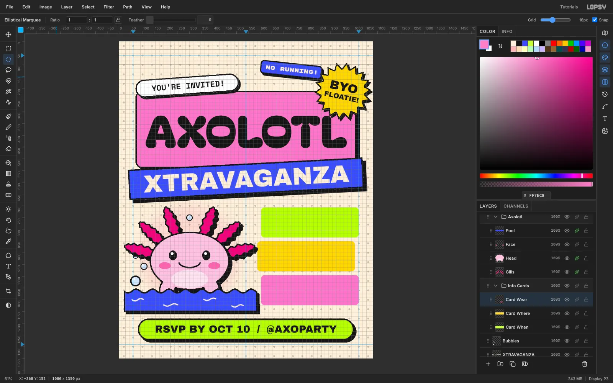

Click `Bubbles` again and create a **New Group** called `Info Cards`.
Choose **View → Show Grid** (16 px) to check the spacing as you go.

Add three layers and draw a 416 × 128 card (radius 16) on each, stacked
one grid square (16 px) apart on the right-hand side, with their right
edges on the right margin guide. Start the top card a little over halfway
down the page:

- `Card When`: lime, at the top, centred at **812, 768**
- `Card Where`: yellow, in the middle, shifted one grid square to the left,
  centred at **796, 912**
- `Card Wear`: pink, at the bottom, centred at **812, 1056**

The shifted middle card breaks up the stack. Hide the grid again, then add
a black 112 × 36 tab (radius 10) to each card at its top-left, 18 px in and
hanging 18 px above the edge.

## Write the card details

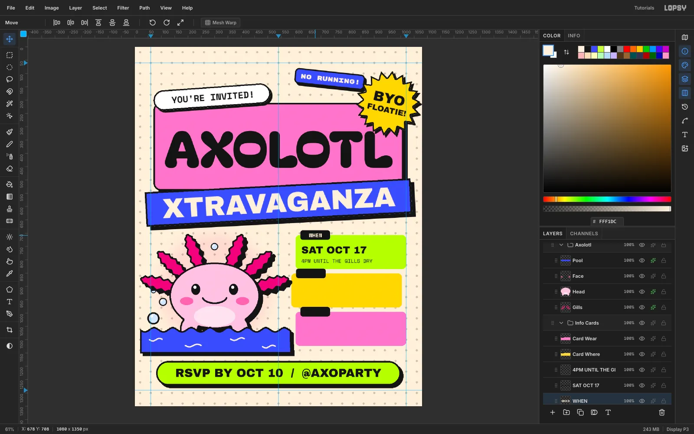

Each card gets three lines. Click the card's row before creating each one
so the text lands in the group:

1. The detail line in **Space Mono** Regular `19`, e.g.
   `4PM UNTIL THE GILLS DRY`.
2. The value in **Archivo Black** `38`, e.g. `SAT OCT 17`.
3. The label in **Space Mono** Bold `20` in cream, centred on the tab, e.g.
   `WHEN`.

Create them **bottom line first**, each in empty space above the last.

Click the top text layer and press **Merge Down** three times so everything ends up in the card layer. The card is the
bottom layer of its group, so that's as far as the merges go. Then give
the card an inside **Stroke** of `5` and a **Drop Shadow** of `10` / `10`.

## Tilt the cards

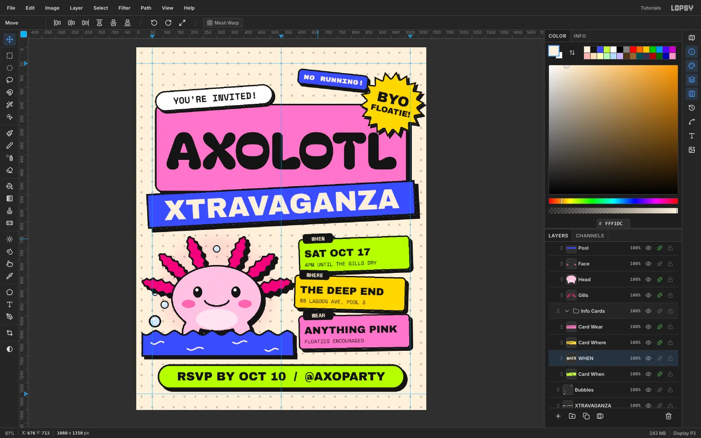

Identical upright cards read like a form. Tilt them a little in
alternating directions. For each card, draw a marquee that covers the card
and its tab with a few pixels to spare, rotate with the **Move** tool, and
press [[Cmd+D]]:

- `Card When`: **−2°**
- `Card Where`: **+1.5°**
- `Card Wear`: **−1°**

## Finish with sparkles and print grain

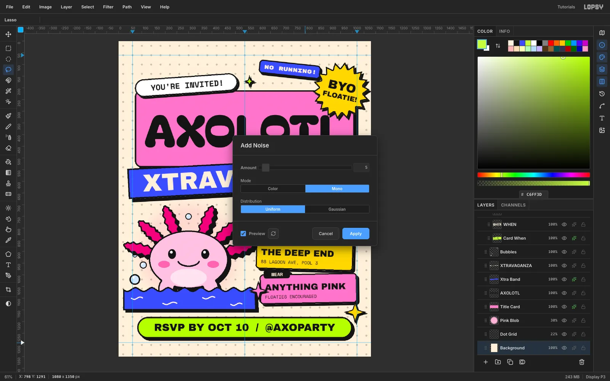

Click the top layer and add a `Sparkles` layer. Lasso three four-pointed
stars (inner radius about 30% of the outer) and fill them:

- Sun yellow, 48 px, on the corner of the RSVP pill
- Bubblegum, 42 px, on the pool's corner
- Acid lime, 26 px, between the tag and the sticker

Give them a `4` px inside **Stroke** and a `6` / `6` shadow.

Finally, click the **Background** row and choose **Filter → Add
Noise…**. Set **Amount** `5` and **Mono**, then click **Apply**. The grain
is barely visible, but it takes the digital flatness off the cream and
makes the piece feel printed.

## Export the invitation

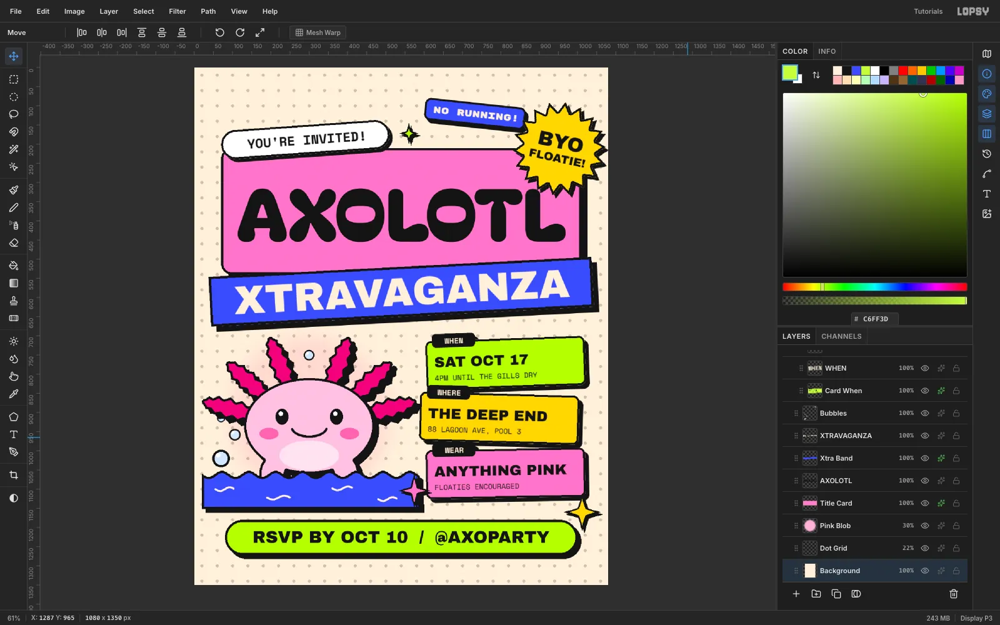

Choose **View → Show Guides** to hide the guides. Then use **File → Quick
Export PNG** for a shareable image and **File → Save Project** to keep an
editable `.lopsy` file with every layer, group and effect intact.

To make your own version, swap the mascot and the copy, and keep the rules
that make it neubrutalist:

- Flat fills only
- One outline colour
- Hard shadows with zero blur
- Every sticker a few degrees off square
