## Look at the finished painting

**Op-pop** mixes two 1960s movements:

- **Op art** (Bridget Riley, Victor Vasarely): black-and-white patterns that seem to bulge, swirl and vibrate
- **Pop art** (Roy Lichtenstein): flat primary colours, thick black outlines and printed Ben-Day dots

In this tutorial you'll paint a 1200 × 1500 px **Dizzy Yeti**. The op-art stripes do the dizzying and the pop-art character sits on top. Along the way you'll use:

- **Define Pattern** and **Pattern Fill** for the stripes
- **Lens Distortion** and **Liquify** Twirl to warp them
- **Radial** and **Linear** gradients turned into dots with **Halftone**
- **Select → Shrink** for even rings
- lasso fur, layer effects, **Duplicate** + **Flip Horizontal**
- **Vertical symmetry** brush marks
- **Bangers** type, rotated with the Move tool

The palette is a strict pop trio plus ink:

- cobalt `#2233E0`
- lemon `#FFE14D`
- pop red `#E8202A`
- ink `#14142A`, navy `#0B1570` and fur white `#F4F6FF`

## Make a two-stripe tile

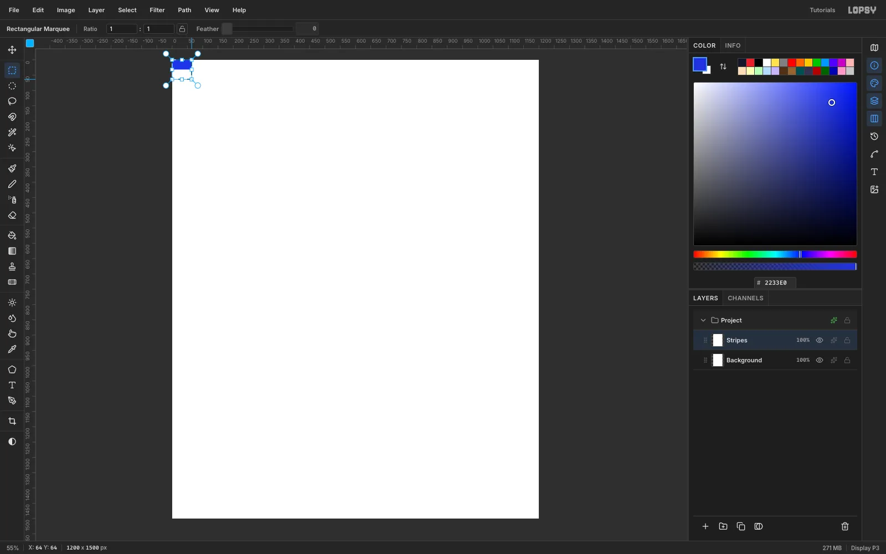

1. **File → New**, 1200 × 1500 px, white background. Rename *Layer 1* to **Stripes**.
2. Set the foreground to white and choose **Edit → Fill** to fill the whole layer.
3. With the **Rectangular Marquee**, select 0,0 → 64 × 32 and fill it with cobalt `#2233E0`.
4. Select 0,0 → 64 × 64. That's one cobalt stripe and one white stripe.

> **Tip:** Untick **Snap** in the options bar first. The grid lattice is centred on the document, so with Snap on a marquee from the corner lands on odd sizes like 56 × 78.

## Tile the stripes with Pattern Fill

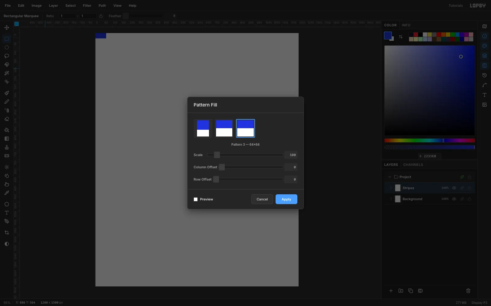

Choose **Edit → Define Pattern** to capture the tile. Press [[Cmd+D]] to deselect, then choose **Edit → Fill with Pattern…**, pick the new tile and click **Apply**. The whole layer fills with crisp 32 px stripes.

Select the **Background** layer and pattern-fill it too. Liquify can pull transparent pixels in from past the canvas edge later on, and the striped background makes those spots look like torn stripes instead of blank holes.

## Bulge the stripes with Lens Distortion

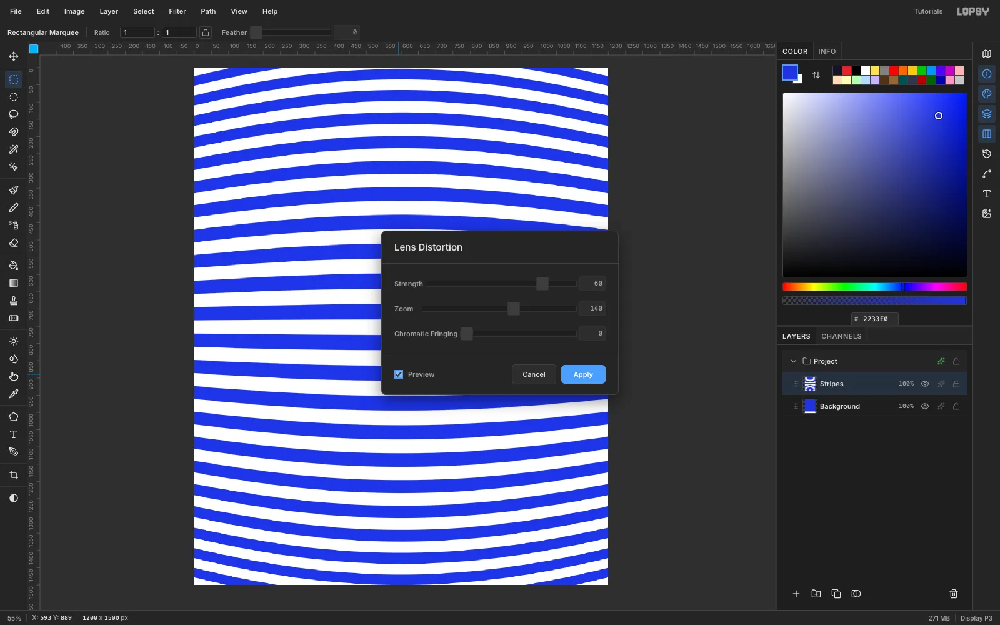

Select **Stripes** and choose **Filter → Lens Distortion…**. Tick **Preview**, then set:

- **Strength 60** (barrel)
- **Zoom 140**, which pulls the corners back inside the frame
- **Chromatic Fringing 0**

The stripes swell outward from the middle, like the start of a Riley painting.

## Twirl the corners with Liquify

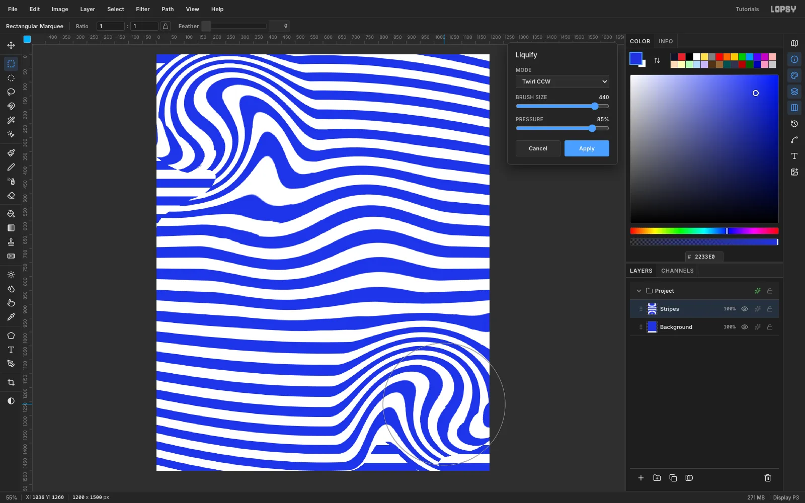

Press [[Cmd+Shift+X]] for **Liquify**. Three twirls make the background feel dizzy:

1. **Twirl CW**, Brush Size 500, Pressure 35. Hold the mouse in the middle of the canvas and circle it slowly for a gentle swirl.
2. Raise the Pressure to 85 and the size to 440. Circle in the top-left corner.
3. Switch to **Twirl CCW** and circle in the bottom-right corner.

Keep the mouse moving in tiny circles. The twirl builds up the longer you hold. Click **Apply** when you're done.

## Draw the halo and its dot gradient

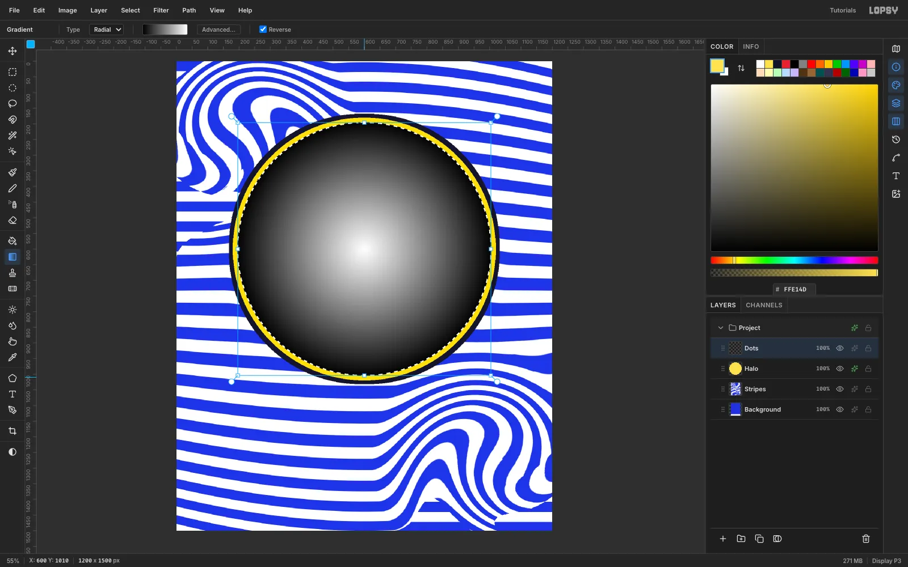

1. Add a layer called **Halo**. With the **Elliptical Marquee**, select 180,180 → 840 × 840 and fill it with lemon `#FFE14D`.
2. Open the layer's effects (✦) and turn on **Stroke**: 12 px, outside, ink `#14142A`.
3. Add a layer called **Dots** and select a slightly smaller circle (196,196 → 808 × 808).
4. Pick the **Gradient** tool, set **Radial**, and tick **Reverse**. Drag from the centre (600,600) down to the rim. You get white in the middle and black at the edge.

## Turn the gradient into Ben-Day dots

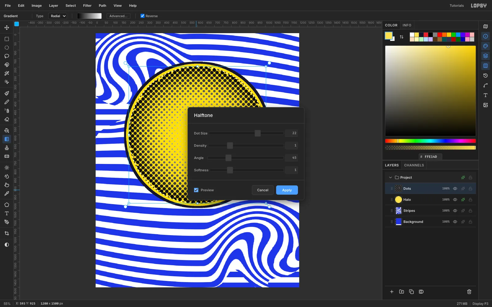

Choose **Filter → Halftone…** and set Dot Size **22**, Density **1**, Angle **45** and Softness **1**. Dark areas become big dots and light areas become small ones, so the dots swell toward the rim like a Lichtenstein print.

Deselect, turn on **Color Overlay** with pop red `#E8202A`, and set the layer opacity to **80%**.

## Cut an even orbit ring with Shrink

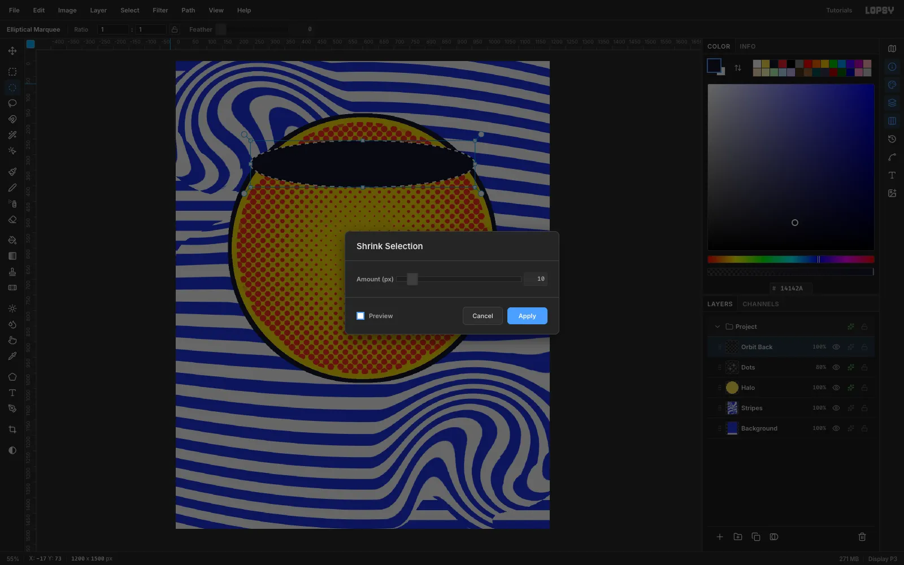

The stars need an orbit around the yeti's head.

1. Add a layer called **Orbit Back**. Select an ellipse at 240,255 → 720 × 150 and fill it with ink.
2. Choose **Select → Shrink…**, set **Amount 10** and apply.
3. Press [[Delete]]. What's left is a ring exactly 10 px thick all the way round.

> **Tip:** The Shape tool's ellipse stroke comes out much thicker at the long ends of a flat ellipse. Shrink gives an even line.

## Check the background

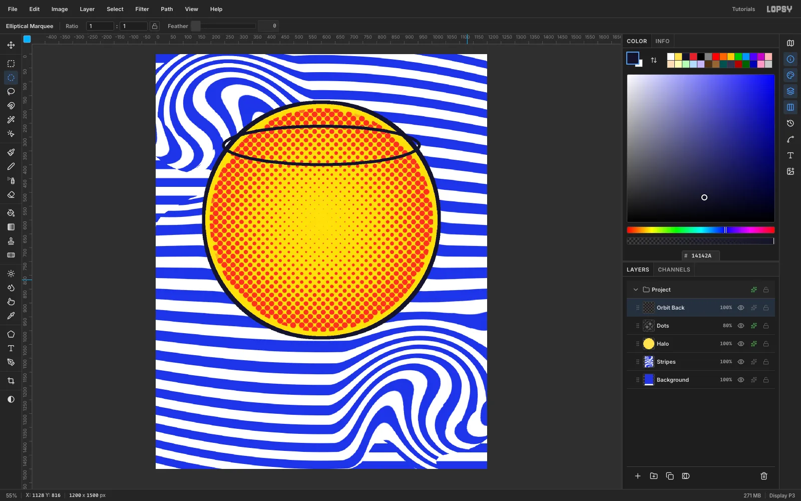

That's the whole op-art stage: striped, bulging, twirled, with a pop-art sun behind where the head will go. Everything from here goes in front of it.

## Lasso a shaggy body

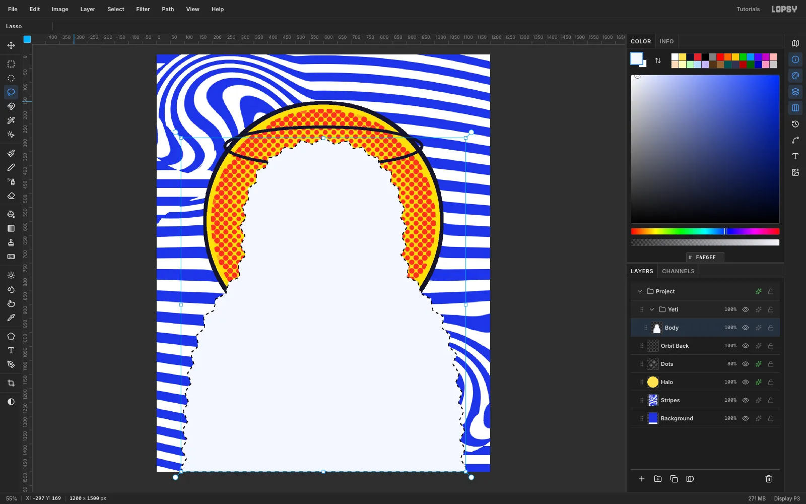

Click **New Group** in the Layers panel and name it **Yeti**. Add a layer called **Body** inside it.

With the **Lasso**, trace a tall dome for the head that widens into shoulders and runs off the bottom of the canvas. Along every edge, zig-zag roughly every 34 px, pushing every other point about 18 px outward. This makes the shaggy fur. Fill it with `#F4F6FF`.

## Give the body pop-art edges

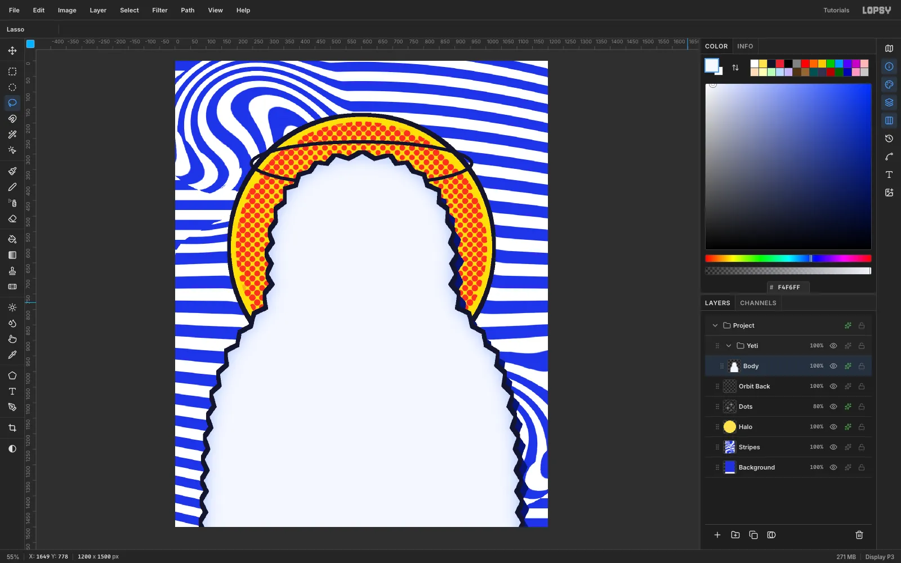

Open **Body**'s effects and set:

- **Stroke**: 12 px, outside, ink
- **Drop Shadow**: navy `#0B1570`, offset 30 / 24, **Blur 0**, Opacity 100. The zero blur gives the hard comic shadow.
- **Inner Glow**: `#9DB6FF`, Size 70, Opacity 80, a cool shade just inside the outline

## Shade the fur with a gradient

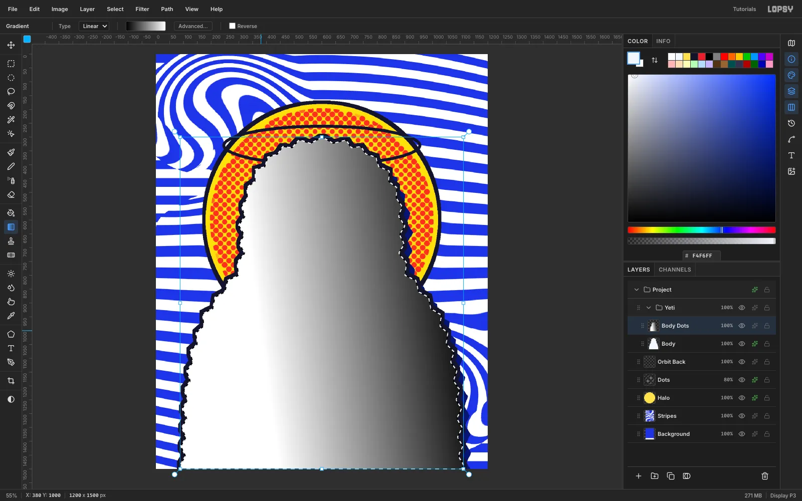

A flat white body looks like a ghost. We'll shade it with dots instead.

1. Pick the **Magic Wand** (Contiguous on) and click inside the body.
2. Add a layer called **Body Dots**.
3. Switch the Gradient tool to **Linear**, untick **Reverse**, and drag from the right edge of the body toward the left.

## Convert the shading to blue dots

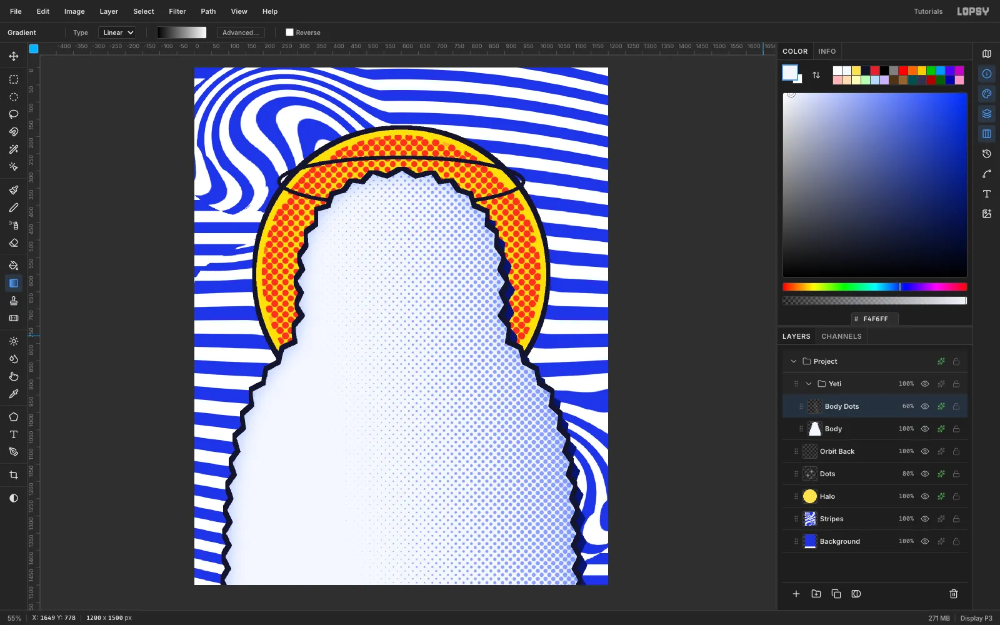

Run **Filter → Halftone…** again, this time with Dot Size **16**. Deselect, turn on **Color Overlay** with `#4A63F0`, and lower the layer to **60%**. The shaded side now reads as a printed half-tone.

## Add flailing arms with claws

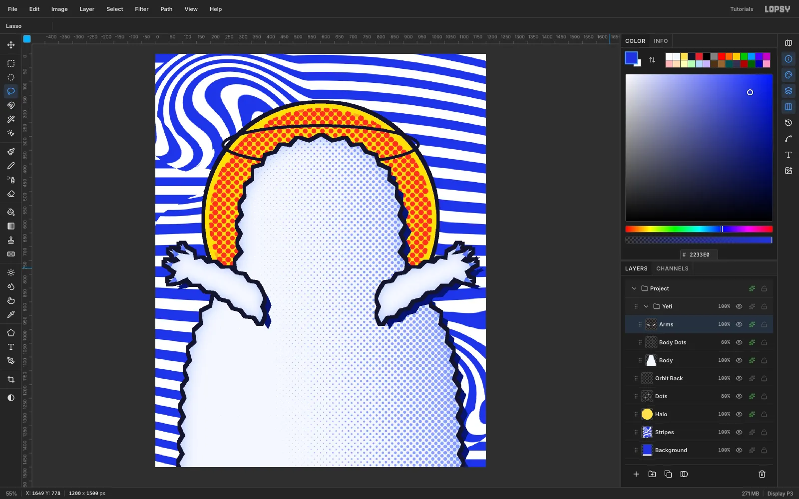

Add a layer called **Arms**. Lasso one arm from the shoulder out to a three-fingered hand near the left edge, again with small fur zig-zags, and fill it white. Lasso the mirror image on the right and fill that too.

For the claws, lasso a small triangle at each fingertip and fill it cobalt. Then give the layer the same **Stroke**, **Drop Shadow** and **Inner Glow** as the body. The arms sit in front of the torso, so their outline separates them.

## Cut fur bangs into the face

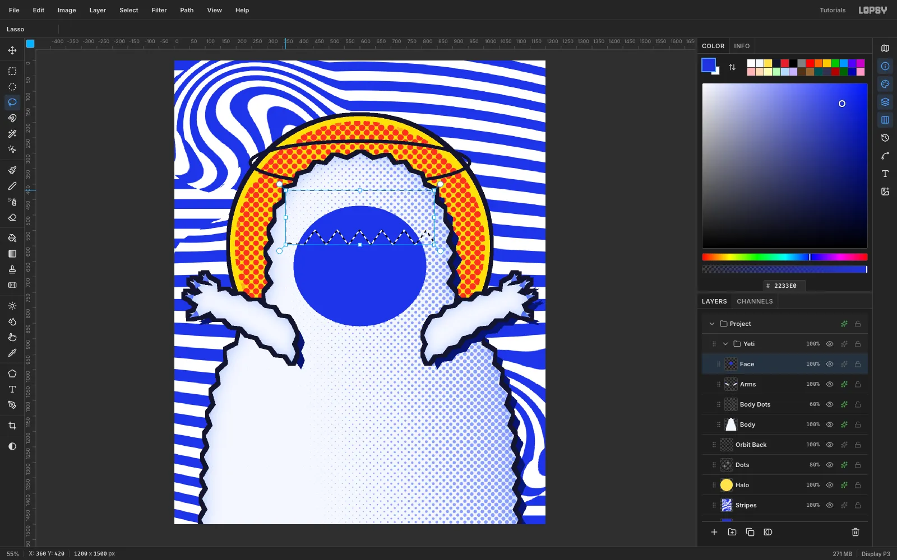

Add a layer called **Face**. Select an ellipse at 385,470 → 430 × 390 and fill it cobalt.

Next, lasso a band across the top of the face whose bottom edge zig-zags between y 548 and y 596 every 36 px. Press [[Delete]]. The white fur now hangs over the forehead in spiky bangs.

## Outline the face

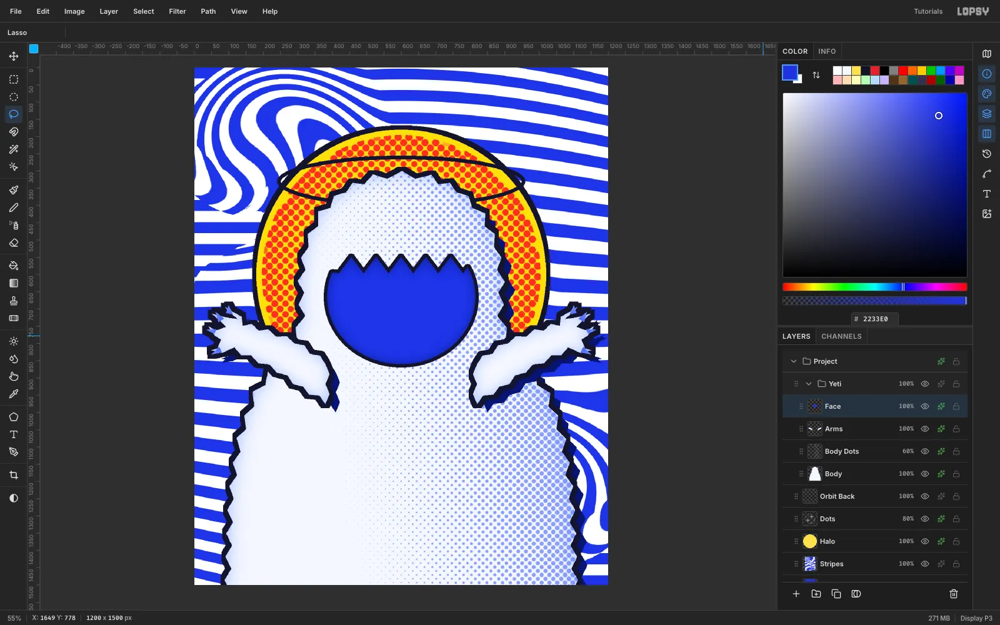

Give **Face** a 10 px ink **Stroke** and a navy **Inner Glow** (Size 40, Opacity 70) so it looks recessed into the fur.

## Paint stripes for the first eye

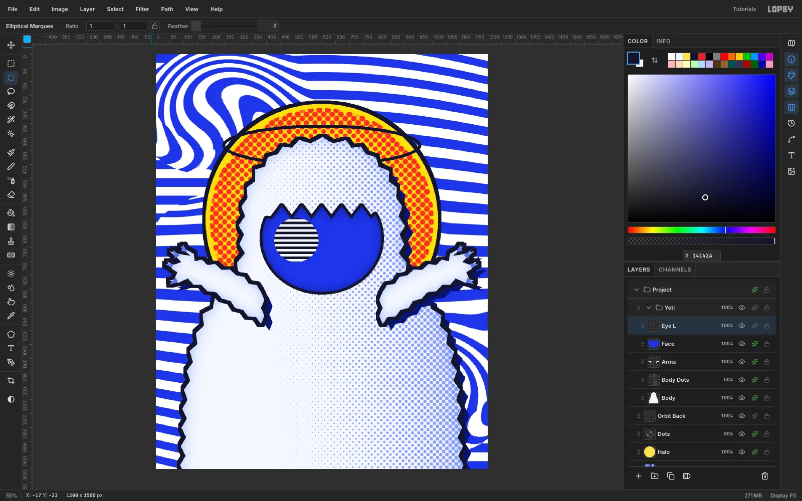

Add a layer called **Eye L**.

1. Fill a white circle, radius 84, centred at 508,672.
2. Fill black bars across it with the rectangular marquee: 9 px tall, every 18 px.
3. Select a circle of radius 80, choose **Select → Inverse**, and press [[Delete]] to trim the bars to the circle.

> **Tip:** Don't use concentric rings here. A twirl rotates circles onto themselves, so rings stay rings. Straight bars twist into a spiral.

## Twirl the stripes into a spiral

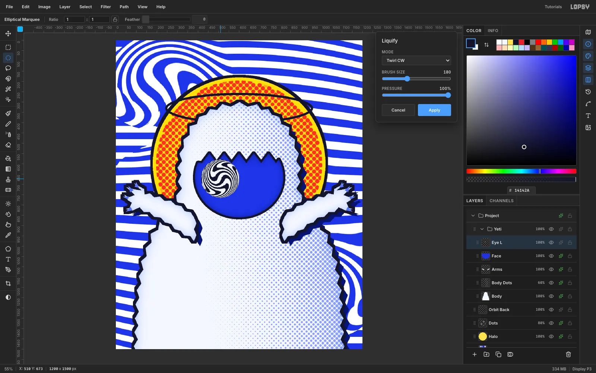

Open **Liquify** again. Set **Twirl CW**, Brush Size **180** and Pressure **100**. Hold the brush over the eye's centre and circle it in 1 px loops until the bars wind into a pinwheel spiral. Click **Apply**.

## Trim the eye and ring it in yellow

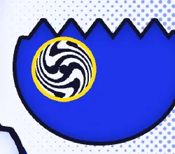

The twirl leaves the eye's outline wobbly. Select a clean circle of radius 74, choose **Select → Inverse**, and press [[Delete]].

Fill a small black pupil in the centre. Then give the layer a 10 px outside **Stroke** in lemon. The yellow ring makes the spiral pop against the blue face.

## Duplicate and flip for the right eye

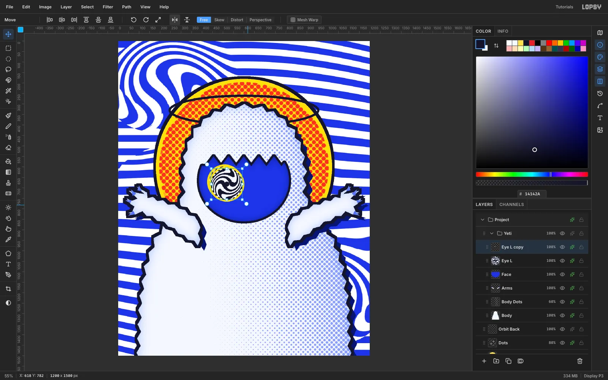

Click **Duplicate Layer**, then click the copy's row. Draw a marquee around the copy, switch to the **Move** tool and click **Flip Horizontal**. Now the right eye spins the opposite way, which is extra dizzy.

Press [[Cmd+D]] to commit.

## Nudge the eye into place

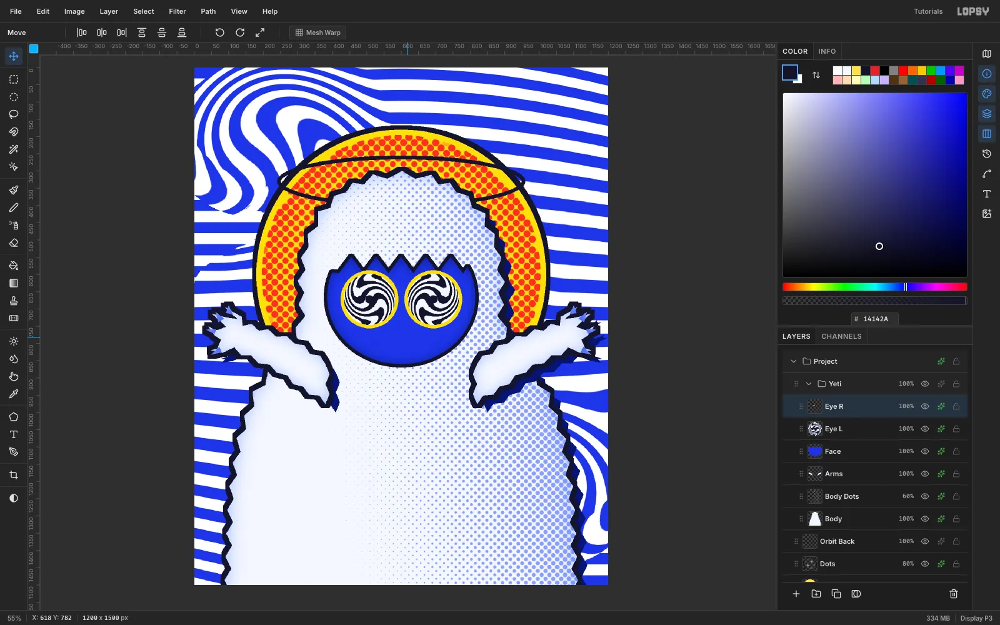

Move the copy with arrow-key nudges, since they're exact. [[Shift]]+arrow moves 10 px and a plain arrow moves 1 px. Nudge it until it mirrors the left eye across the centre line (x 600). Rename it **Eye R**.

## Add a fanged grin

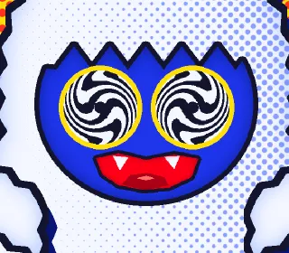

Add a layer called **Mouth**. Use lasso fills for each part:

- a lopsided red `#E8202A` grin
- a dark `#9E0F1F` tongue
- a small `#FF7A6E` highlight
- two white fang triangles on the top lip

Give the layer a 7 px ink **Stroke** and a dark **Inner Glow** (Size 14) for depth inside the mouth.

## Bring the orbit in front of the head

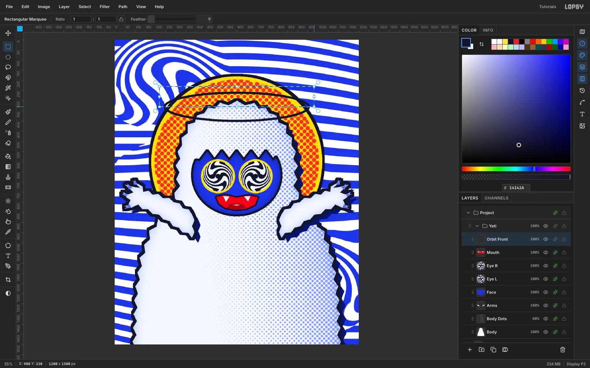

Add a layer called **Orbit Front** at the top of the group and rebuild the same ring: ellipse fill, **Shrink 10**, [[Delete]]. Then marquee the top half of the ellipse and delete it.

The back half of the ring stays behind the head on **Orbit Back** and the front half crosses in front. Now the orbit wraps around the yeti in 3D.

## Add the dizzy stars

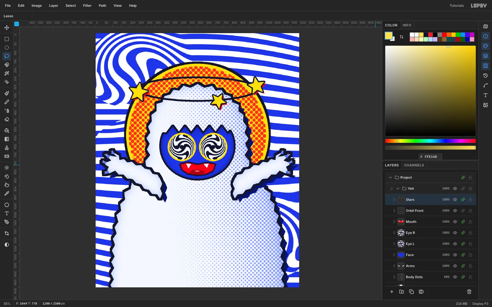

Add a layer called **Stars**. Lasso three five-point stars of different sizes (radius 46–58 px) on the orbit ring and fill them lemon. Give the layer a 7 px ink **Stroke** and a hard red **Drop Shadow** (offset 10 / 10, Blur 0).

Three bigger stars read better than lots of small ones.

## Paint wobble marks with symmetry

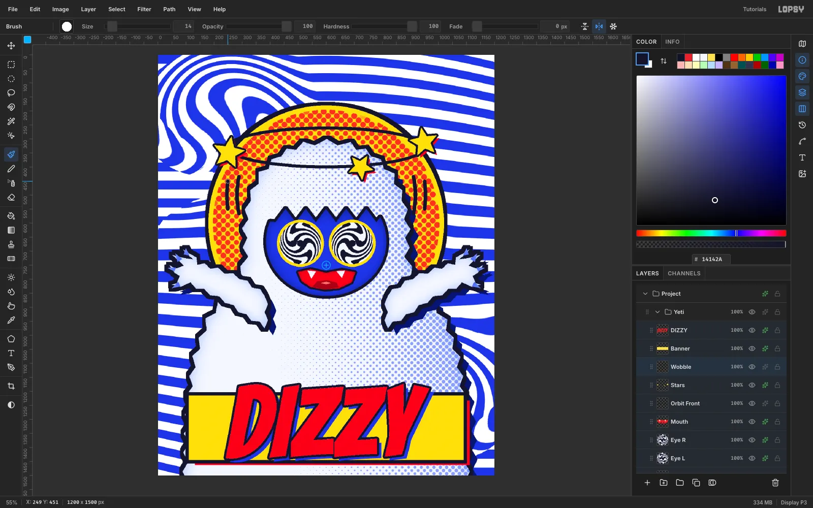

Add a layer called **Wobble**. Pick the **Brush** (Size 14, Hardness 100, ink) and turn on **Symmetry Vertical**, which mirrors across the vertical centre line.

Paint two short curved strokes beside the left side of the head. Each stroke is mirrored onto the right side automatically. Turn symmetry off when you're done.

## Set the title on a banner

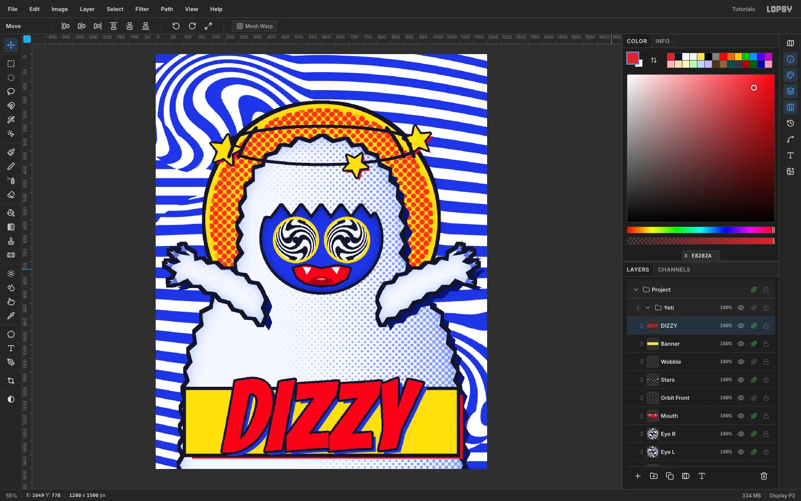

1. Add a layer called **Banner** and fill a 980 × 230 rectangle near the bottom with lemon. Give it a 12 px ink **Stroke** and a hard red **Drop Shadow** (22 / 18).
2. Pick the **Text** tool. Set **Bangers** at **360 px** and pop red, click above the banner and type **DIZZY**.
3. Give the text an 8 px ink **Stroke** and a hard cobalt **Drop Shadow** (16 / 14).

## Tilt the banner and title together

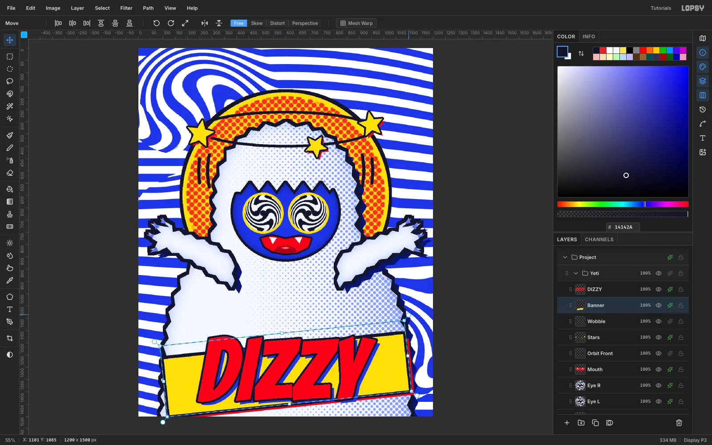

1. Select **Banner**. Draw a marquee from 100,1160 to 1100,1450, switch to **Move**, and drag the rotation handle about **−6°**. Press [[Cmd+D]] to commit.
2. Select **DIZZY** and click **Rasterize**.
3. Draw the *same* marquee and make the same −6° rotation. Press [[Cmd+D]].

Because both use the same marquee, they share a pivot and stay locked together.

## Admire the finished painting

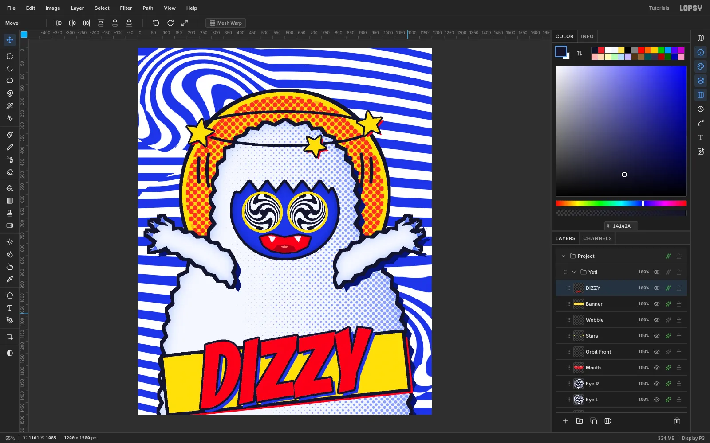

Step through a few [[Cmd+Z]] / [[Cmd+Shift+Z]] to check the transforms come back exactly. Then use **File → Quick Export PNG** for the image and **File → Save Project** to keep the layers.

Ideas to take it further:

- Try the same stripes-plus-twirl background behind a different creature.
- Swap the palette for pure black and white to go full Riley.
- Run **Filter → Chromatic Aberration** on the Stripes layer for a vibrating red/cyan fringe.
