American **outsider art** is made by painters with no formal training. Bill
Traylor drew flat silhouettes in poster paint on scraps of cardboard, with
his pencil lines still showing. Howard Finster filled every border with
hand-lettered sayings, stars and dots, and numbered each piece. This
tutorial borrows from both for **Leftover Turkey**, a 1200 × 1500 px
Thanksgiving card. A man in a top hat chases the dinner, and the turkey
isn't having it.

The look depends on three things:

- **Flat house paint.** Every shape is a **Lasso** fill or a thick **brush** stroke in one of six colours, with no gradients and no shading.
- **Real cardboard.** A corrugated **pattern**, **Clouds** mottle and noise grain sit under the paint, and a faint copy of the corrugation sits over it.
- **Wear.** Dry-brush gaps, a pencil underdrawing and a coffee ring make it look handled.

Along the way you'll also use:

- **Define Pattern** and **Fill with Pattern**, **Clouds**, **Add Noise**, **Motion Blur**, **Threshold** and **Gaussian Blur**
- **groups**, a group **Move**, layer reordering and **Duplicate Layer**
- the transform handles to **scale** and **rotate**, including the [[Cmd]] 15° rotation snap
- **Select → Grow**, **Selection → Path** and **Stroke Path**
- the Brushes modal's **Spacing**, **Size Jitter** and **Scatter**
- the **Magic Wand** with Contiguous off, and **Select → Inverse**
- **text** in two Google fonts, rasterized and rotated, with colour-coded speech

The palette is house paint on kraft:

- Cardboard `#B98E5F`
- Ink black `#1D1915`, brick `#A8381F`, cobalt `#2B4A8E`
- Ochre `#D9A23A`, umber `#6B4424`, chalk `#EDE3CC`
- Graphite pencil `#4A4744`

## Paint the kraft ground

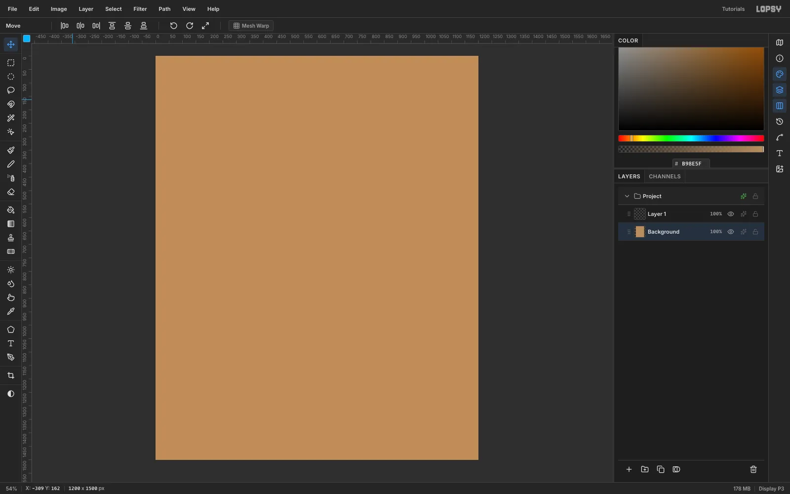

Choose **File → New** and make a **1200 × 1500** px document with a white
background. Select **Background**, set the foreground to `#B98E5F` and
choose **Edit → Fill** with nothing selected. The whole canvas is now plain
brown cardboard.

## Make a corrugation pattern

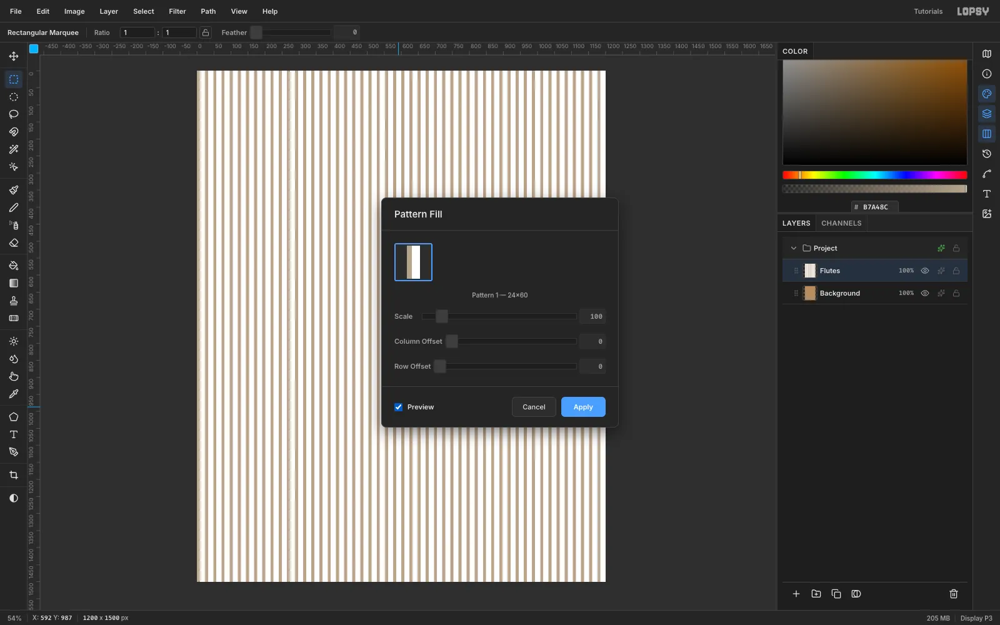

Corrugated board shows faint ridges where the flutes sit under the face
paper. You'll draw one ridge as a tile and repeat it.

The tile has to be an exact size, so let the marquee's corner dialog do the measuring. With nothing selected, a single click (no drag) with the **Rectangular Marquee** ([[M]]) opens fields for the **From X / From Y** and **To X / To Y** corners.

1. Rename **Layer 1** to *Flutes*. Click once with the marquee, enter a tile from **0, 0** to **24, 60** and **Edit → Fill** it with white.
2. Press [[Cmd+D]], click again and enter **0, 0** to **9, 60**. Fill that strip with `#B7A48C`. That's the ridge.
3. Select the full 24 × 60 tile again the same way and choose **Edit → Define Pattern**.
4. Press [[Cmd+D]], then choose **Edit → Fill with Pattern…**. Pick the new 24×60 tile, tick **Preview**, and click **Apply**.

The stripes are much too strong for now. The next step softens them.

## Soften the stripes and add mottle and grain

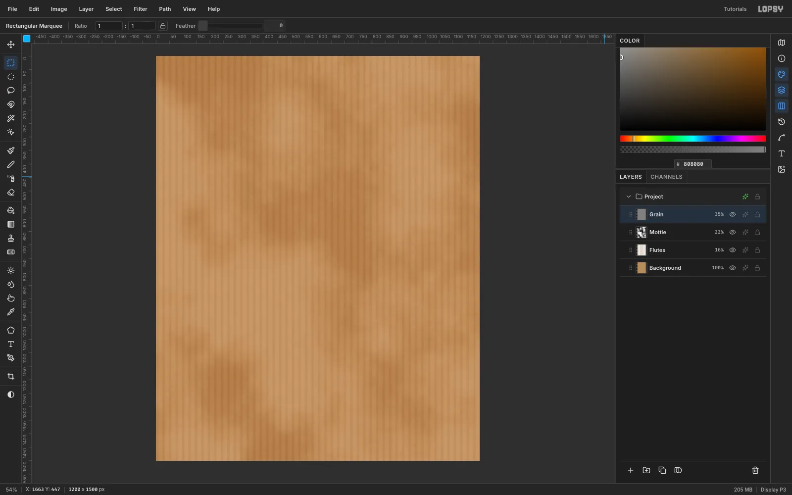

1. On *Flutes*, run **Filter → Gaussian Blur…** at **Radius 3**. Set the layer to **Multiply** at **16%**.
2. Add a layer called *Mottle*, run **Filter → Clouds…**, and set it to **Soft Light** at **22%**. Real cardboard is never one even colour.
3. Add *Grain*, fill it with mid gray `#808080`, then run **Filter → Add Noise…** at **Amount 60** with **Mono** on. Run **Filter → Motion Blur…** at **Angle 90**, **Distance 10** to pull the noise into fibres. Set it to **Overlay** at **35%**.

## Paint a Finster frame

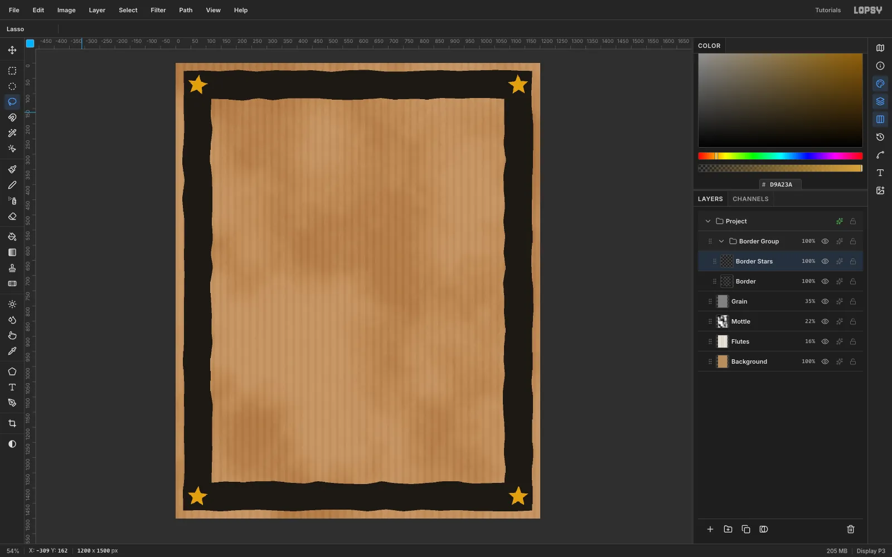

With *Grain* selected, click **New Group** and name it *Border Group*. Add a
layer inside it called *Border*.

1. With the **Lasso** ([[L]]), drag around a rectangle a finger's width (about 26 px) in from the canvas edge and let go back at the start. Kink the line off course once or twice partway along each side, so the edges wobble. Fill it with ink `#1D1915`.
2. Lasso a second wobbly rectangle about 118 px in from the edge and press [[Delete]]. You're left with a black band a little under 100 px wide.
3. Add a *Border Stars* layer and lasso a five-point star, about 68 px across, in each corner of the band. Fill them with ochre `#D9A23A`.

Hand-cut, slightly uneven edges matter more than any other detail here.
Perfectly straight lines instantly look digital.

## Fan out the turkey's tail

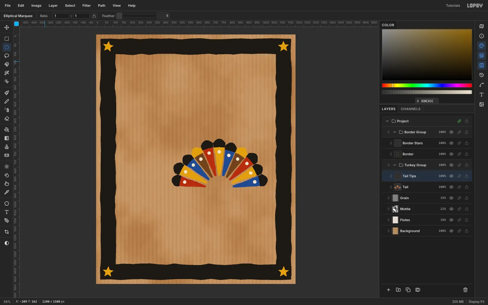

Select *Grain* again and make a **New Group** called *Turkey Group*. Traylor
built animals from a few bold, flat shapes, and the fan tail is the biggest.

1. Add a *Tail* layer. Pick a point about three-fifths of the way across and three-fifths of the way down the card, where the turkey's rump will sit. Lasso eleven long feathers that radiate from it like a half-open fan, each narrow at the centre, about 295 px long and rounded at the tip. Spread them from just below the left horizontal round to just below the right. Fill them in turn with brick `#A8381F`, ochre, cobalt `#2B4A8E` and umber `#6B4424`, and leave a sliver of cardboard between neighbours.
2. Add *Tail Tips*. Lasso a rounded cap over the outer 50 px of every feather and fill it with ink. The umber feathers get ochre caps. Make each cap a little wider than its feather, so none of the feather colour peeks around it.
3. Drop a chalk `#EDE3CC` dot into each feather just inside its cap: one click each with the **Brush** ([[B]]) at **Size 20**, **Hardness 100**.

## Paint the body, wing, legs and head

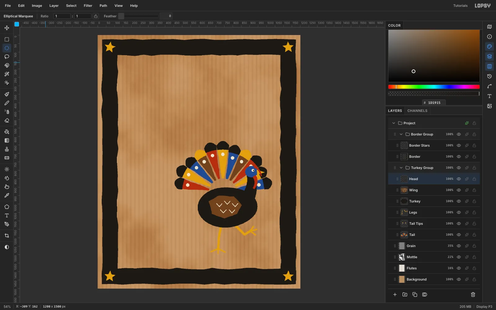

Add each part on its own layer inside *Turkey Group*, in this order:

1. *Legs*: select the **Brush** ([[B]]) at **Size 15**, **Hardness 100** in ochre. Paint one straight leg down to the ground with three toes. Paint the other leg bent back and raised, so the bird is clearly running.
2. *Turkey*: lasso a big pear-shaped body over the base of the fan, a bit wider than it is tall and leaning forward to the right. Fill it with ink.
3. *Wing*: lasso an irregular wing on the body and fill it with umber. With the brush at **Size 5** in chalk, add five little chevrons for feathers.
4. *Head*: lasso a curved, tapering neck up from the breast in ink. Then add a cobalt head circle about 74 px across, an ochre beak, brick snood and wattle ribbons, and a chalk eye with an ink pupil.

## Paint the man in the top hat

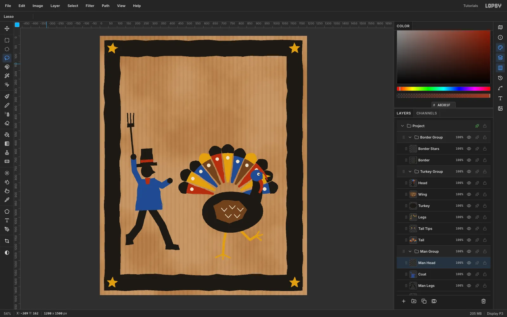

Select *Grain* and make a third group, *Man Group*. Build him from the back
forward: *Fork*, *Man Legs*, *Coat*, *Man Head*.

- **Fork:** brush a 10 px ink handle up from his hand, lasso a crossbar, and brush three 7 px tines.
- **Legs:** a **Size 44** ink brush makes the trousers in two strokes, a long stride forward and one leg kicked back. Lasso a flat shoe on the end of each.
- **Coat:** lasso a boxy cobalt coat. Brush the arms at **Size 34**, one reaching forward and one raised to hold the fork. Finish with ink hands and a small brick tie.
- **Head:** an ink oval with a pointed nose, a lassoed top hat and a brick hat band.

Traylor's people are nearly all profile and silhouette. Resist adding facial
features.

## Add the dog, the pie and star clusters

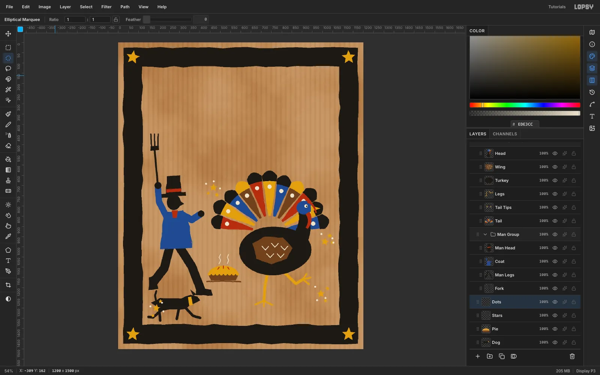

Select *Grain* and add these layers above it:

- **Dog:** lasso a long, low dog running right in the lower left corner, about 265 px long. Brush the four legs and an upright tail, and lasso an ochre collar. It's a little big and in the wrong place for now. You'll fix that with the transform handles next.
- **Pie:** brush a short umber ground stroke in the gap between the man and the turkey, about three-quarters of the way down. Lasso a pie tin in umber on it and a domed crust in ochre. Click a row of small ochre brush dots along the rim for the crimp, three brick steam vents and two wavy chalk wisps of steam.
- **Stars** and **Dots:** Finster packed his skies. Scatter four clusters through the empty space, each one big ochre star (about 38 px across) with two small ones and three chalk dots.

## Scale the dog down

Select *Dog* and drag a marquee a little bigger than the dog. Switch to
the **Move** tool ([[V]]) so the transform handles appear. Hold [[Cmd]] and
drag the bottom-right corner handle up and to the left until the box is
about **78%** of its size. [[Cmd]] keeps the scale uniform. Press
[[Cmd+D]] to commit.

## Move the dog to the turkey's heel

Marquee the smaller dog and drag it with the **Move** tool until its nose
touches the turkey's planted toes, with its paws just above the bottom of the
frame. Press [[Cmd+D]]. The dog now has a job in the story: it's nipping at
the escaping bird.

## Nudge the whole man as a group

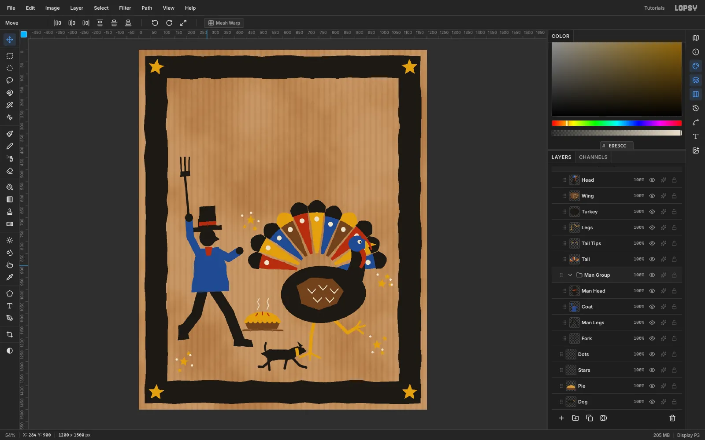

Click the *Man Group* row and drag anywhere on the canvas with the **Move**
tool. Every layer in the group moves together. Move him a short way right,
about 14 px, away from the frame, so he has room to run.

## Draw a pencil underdrawing

Traylor pencilled his shapes first, and the lines still show at the edges.
You'll turn each silhouette into a path and stroke it.

1. In *Turkey Group*, add a *Pencil* layer above *Head*.
2. [[Cmd]]-click the *Turkey* thumbnail to load the body as a selection. Choose **Select → Grow…** at **6** px, then **Select → Selection → Path**, and press [[Cmd+D]].
3. Set the foreground to graphite `#4A4744`. In the **Paths** panel, click the new path, click **Stroke Path**, set **Width 2** and click **Stroke**.
4. Brush one short 3 px line along the breast that runs past the body, like a construction line.
5. Add a *Dog Pencil* layer above *Dog* and repeat steps 2 and 3 with **Grow 3**.

Set both pencil layers to **Multiply** at **80%**. Delete the paths in the
Paths panel, then drag *Pencil* just below *Head*, so the neck covers the
line where it joins the body.

## Paint and tilt the title

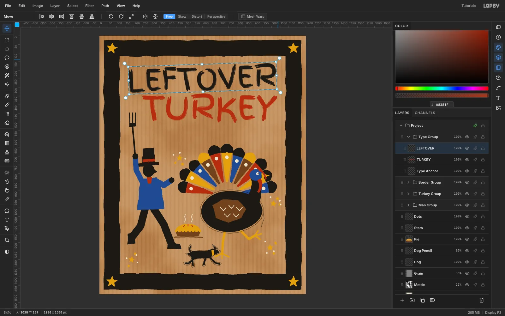

Select *Dots* and make a **New Group** called *Type Group*, then drag it to
the top of the Layers panel. Add an empty *Type Anchor* layer inside it. New
type lands just above the active layer, so select *Type Anchor* before you
start each new text layer.

Pick the **Text** tool ([[T]]) and the Google font **Finger Paint**. Its
letters have brush streaks built in, so they look like house paint. Choose the
font and size before you click, so each word is set right the first time.

1. At **Size 172** in ink, click in an empty spot, type `LEFTOVER` and press [[Tab]] to commit. Move it to the top left, about 50 px inside the black band on both sides.
2. At **Size 190** in brick, type `TURKEY` and move it just under *LEFTOVER*, with its right end about 50 px short of the band. Pushing one word left and one right looks more hand-made than centring both.
3. Select *LEFTOVER* and click **Rasterize Layer** at the bottom of the Layers panel, so the tilt is baked into the paint and a later text edit can't straighten it. Marquee the word with a little room to spare, switch to **Move**, and drag the round rotation handle at the top-right corner a hair upward, to about **−2°**. Press [[Cmd+D]]. Do the same for *TURKEY*.

A sign painter's 2° tilt is enough. Much more and it starts to look like a
mistake.

## Letter the frame

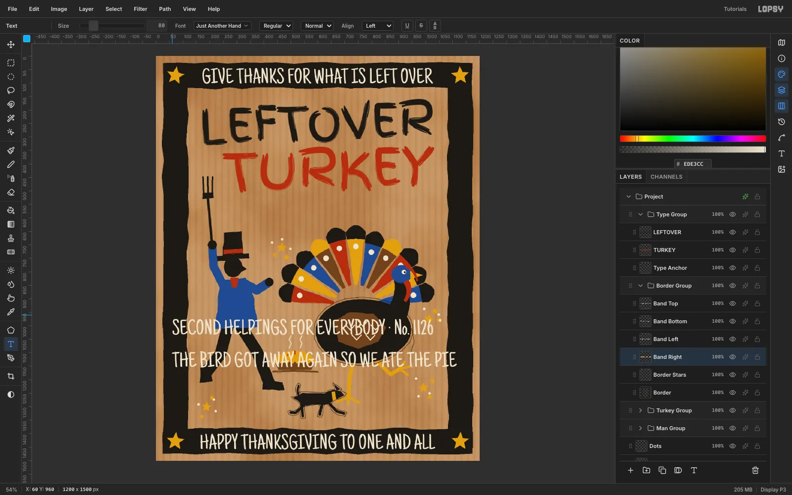

Expand *Border Group* and select *Border Stars*, so the new text lands inside
the frame's group. Switch the font to **Just Another Hand**, a tall,
narrow hand, at **Size 80** in chalk `#EDE3CC`.

[[Cmd]]-click (Ctrl-click) the middle of the top ruler to drop a guide exactly on the centre line. It makes centring the lines below easy.

1. Type `GIVE THANKS FOR WHAT IS LEFT OVER`. Move it so it's centred on the guide and sits in the middle of the top band, with an even strip of black above and below the capitals.
2. Type `HAPPY THANKSGIVING TO ONE AND ALL` and centre it the same way in the bottom band.
3. Type the two side lines in empty space for now: `THE BIRD GOT AWAY AGAIN SO WE ATE THE PIE` and `SECOND HELPINGS FOR EVERYBODY · No. 1126`. Paste the middle dot · from the clipboard. The number is a nod to Finster, who numbered every piece.

## Turn the side lines to fit the frame

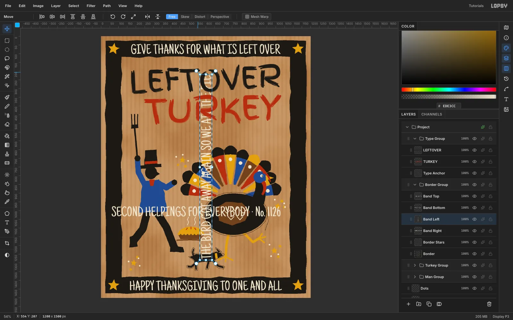

A long line is easiest to turn in the middle of the card, where the whole
thing stays in view while you work:

1. Move the left line so it sits roughly in the centre of the card. Click **Rasterize Layer**.
2. Marquee it, switch to **Move**, and hold [[Cmd]] as you drag the rotation handle. [[Cmd]] snaps to 15° steps, so stop at exactly **−90°**. The text now reads from bottom to top. Press [[Cmd+D]].
3. Drag it left until it sits in the middle of the left band, with equal black on either side.

Repeat with the right line, rotating **+90°** so it reads top to bottom, and
centre it in the right band.

## Colour-code who's talking

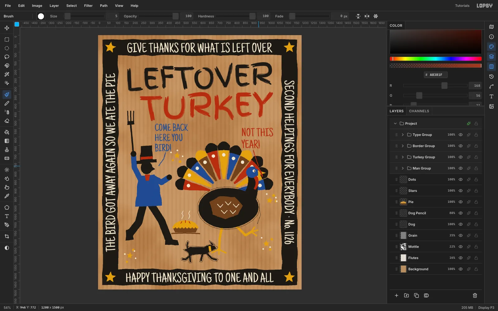

Outsider pictures often talk. Colour tells you who's speaking, with the man in
his coat colour and the turkey in its wattle colour.

1. Select *Type Anchor*. At **Size 60** in cobalt, type `COME BACK`, [[Enter]], `HERE YOU`, [[Enter]], `BIRD!`. Open the **Text** panel and set **Line height** to **1.0**. Move the block just above the man's hat.
2. At **Size 70** in brick, type `NOT THIS`, [[Enter]], `YEAR!` with line height 1.0 and move it above the turkey's head.
3. Add a *Speech Tails* layer. With a **Size 5** brush, paint a short curved line from under each block to the speaker's mouth, each in the speaker's colour.

## Hand-dot the frame

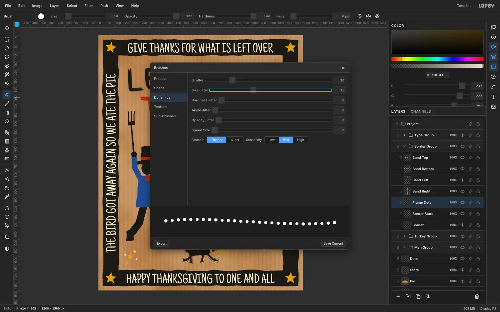

Finster loved rows of dots. A brush with wide spacing makes them, and jitter
makes them look hand-dotted rather than stamped.

1. In *Border Group*, add a *Frame Dots* layer above *Border Stars*. Pick the brush at **Size 10**, **Hardness 100**, in chalk.
2. Open the Brushes modal. On the **Shape** tab, set **Spacing** to **200**, which is the maximum. On the **Dynamics** tab, set **Size Jitter** to **35** and **Scatter** to **20**.
3. Drag four slightly wavy lines all the way round, about 18 px inside the inner edge of the black band: across the top and bottom, then down each side.

Set Spacing, Size Jitter and Scatter back to their old values afterwards.
The Brushes modal remembers them for every later stroke.

## See the finished frame

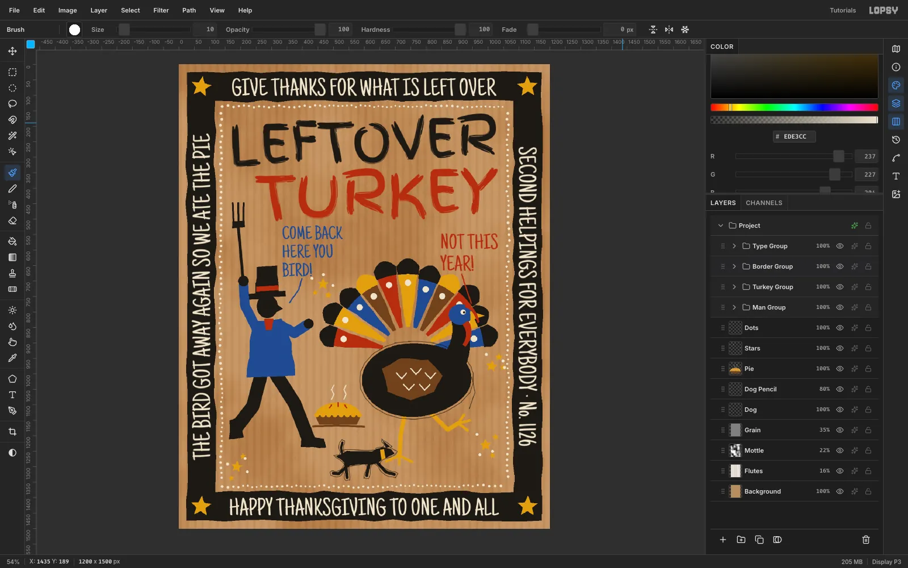

The dots vary in size and wobble off the line, just like Finster's. Check
that they clear the title, the star clusters and the turkey's fan tail. If a
cluster crowds them, marquee it on the *Stars* layer and drag it away with
the **Move** tool.

## Let the corrugation show through the paint

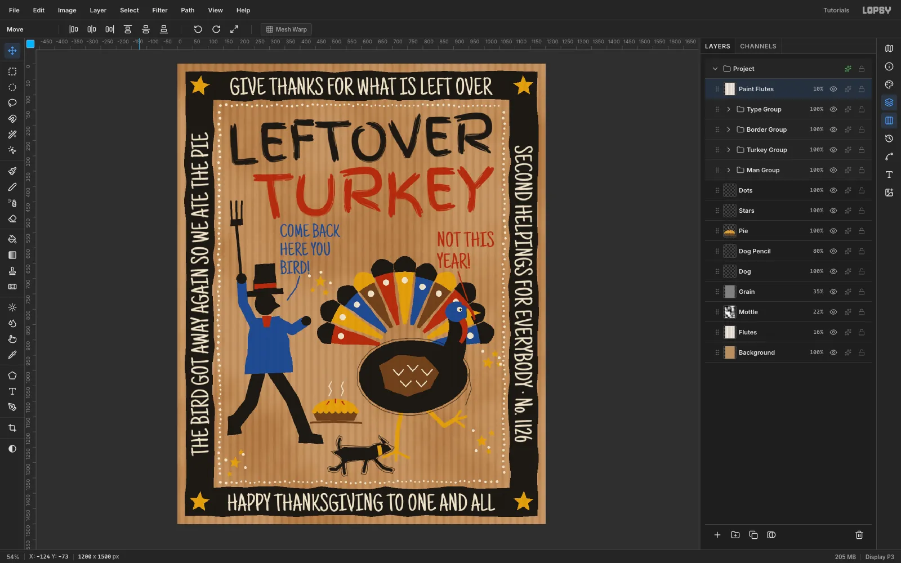

Paint on corrugated board sinks into the ridges too. Select *Flutes* and
choose **Layer → Duplicate Layer**. Rename the copy *Paint Flutes*, drag it
to the very top of the Layers panel, and set its opacity to **10%** (it keeps
Multiply). If a long drag won't drop, close the **Color** and **Info**
panels so the Layers list has room, or drag it up a few groups at a time.

## Knock back the paint with dry-brush wear

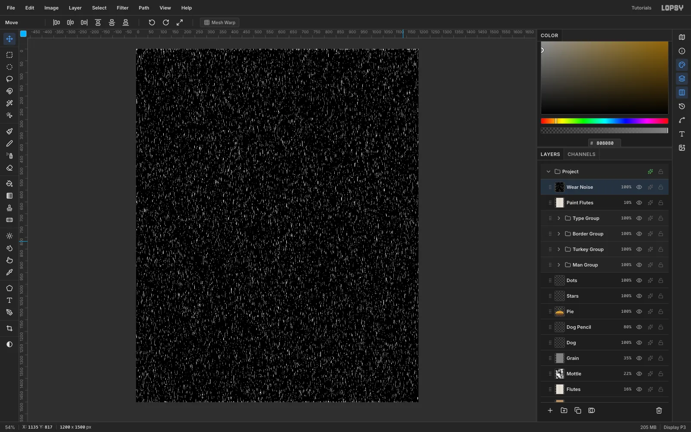

House paint skips over the ridges and leaves little gaps of bare board.
You'll make those gaps from noise.

1. Add a *Wear Noise* layer at the top and fill it with `#808080`. Run **Add Noise** at **Amount 100**, **Mono**, **Gaussian**, then **Motion Blur** at **Angle 90**, **Distance 12**.
2. Run **Filter → Threshold…** at about **136**. Only the brightest 4 – 5% of the streaks stay white.
3. Pick the **Magic Wand** ([[W]]) with **Contiguous** off. Click a solid black area, then choose **Select → Inverse**. Every white streak is now selected.

## Fill the wear with cardboard colour

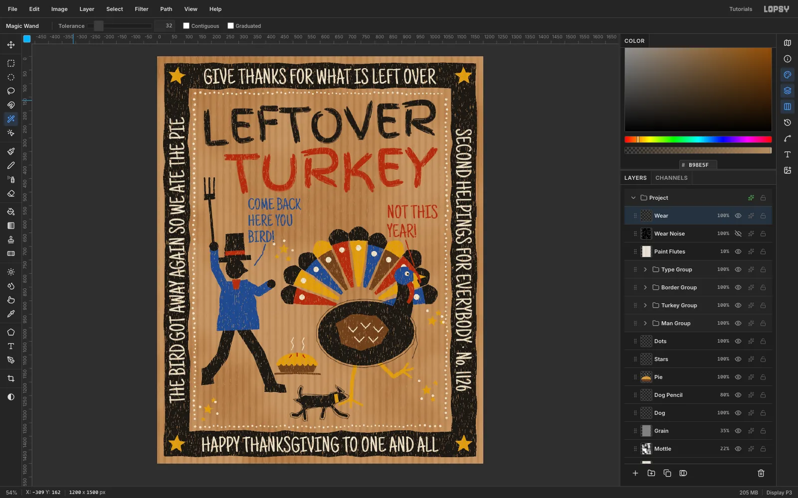

Click **Add Layer**, name it *Wear*, and **Edit → Fill** the selection with
the cardboard colour `#B98E5F`. Press [[Cmd+D]] and hide *Wear Noise*. On
bare cardboard the scuffs disappear. On the paint they read as dry-brush
gaps.

> **Tip:** A Magic Wand selection of thousands of tiny streaks can make the marching ants slow. Fill and deselect straight away.

## Set down a coffee ring

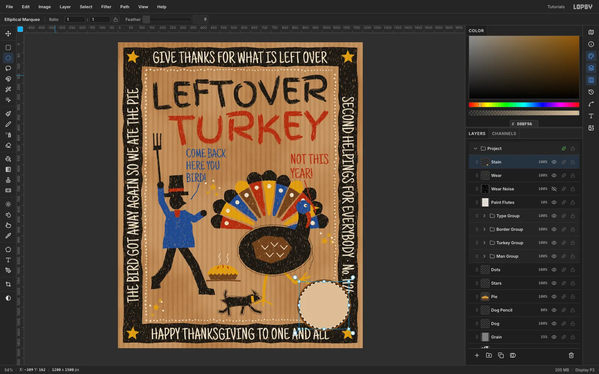

Every card that sat on a kitchen table has one.

1. Add a *Stain* layer. Drag an **Elliptical Marquee** about 260 px across, a touch wider than it is tall, over the lower-right corner so it overlaps the frame. Fill it with `#7A4A22`.
2. Choose **Select → Shrink…** at **9** px and fill the smaller ellipse with a pale `#D8BF9A`. That leaves a dark rim with a faint tint inside.
3. Press [[Cmd+D]], lasso across one part of the rim, and press [[Delete]] to break it. Coffee rings are never complete.
4. Run **Gaussian Blur** at **Radius 2**, then set the layer to **Multiply** at **55%**.

## Cluster the wear

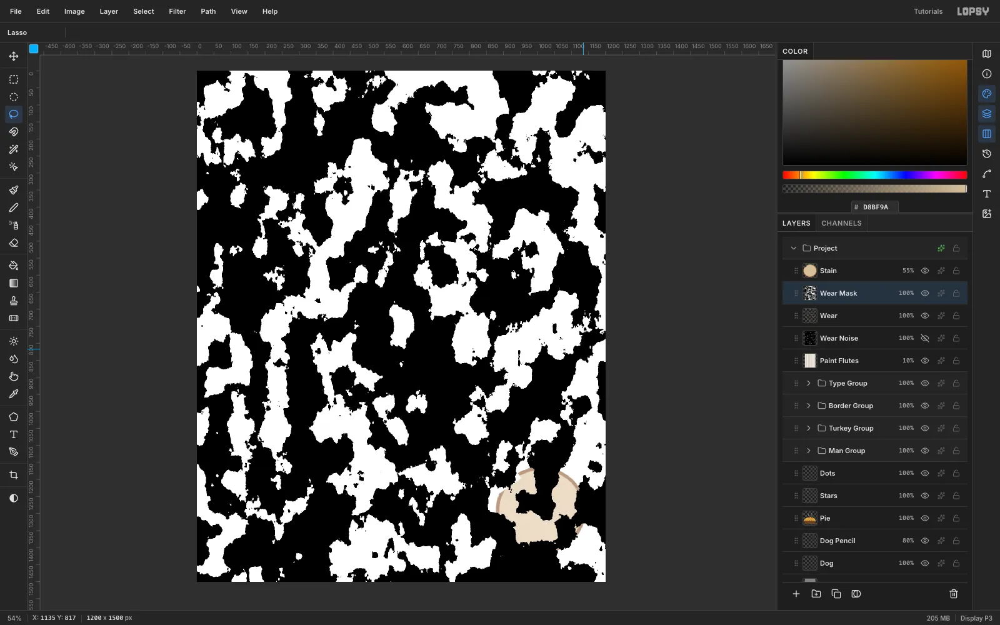

Even wear looks like a filter, and real wear bunches up where hands touch the
card. Thin it out with a Clouds mask:

1. Add a *Wear Mask* layer, run **Clouds**, and **Threshold** it so about 40% of the canvas is white (around level 154).
2. With the **Magic Wand** (Contiguous off), click a black area.
3. Click the *Wear* row and press [[Delete]]. Only the wear under the white blobs survives. Press [[Cmd+D]] and hide *Wear Mask*.

## Save and export the card

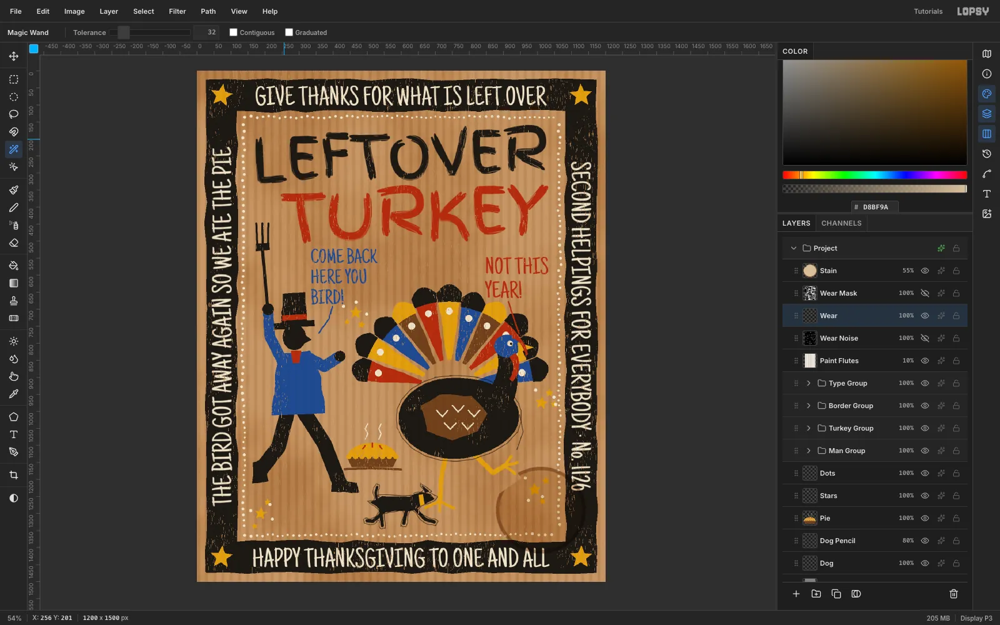

Press [[Cmd+0]] to fit the card and look it over at full size. The wear now
gathers in patches along the frame and fades across the middle. Make one
last pass over the text: each block needs clear space around it, and the
frame lettering should sit in the middle of the band.

Choose **File → Save Project** to keep a `.lopsy` with every layer, then
**File → Quick Export PNG**.
