Old shop manuals explained machines with **cutaways**. The part is sliced down the middle, the cut metal is hatched, and every piece gets a numbered balloon. It's a great format for a poster. Here you'll draw one of the best mechanisms to explain that way: the **pin-tumbler lock**, shown locked and then open.

The whole idea fits in one line: the plug only turns when every gap between a key pin and a driver pin sits on the **shear line**. So the poster shows two sections of the same lock:

- **Fig. 1, locked:** with no key, the driver pins straddle the shear line.
- **Fig. 2, open:** the right key lifts every gap onto it.

Everything is drawn from marquees, lassos and fills. There are no photos. Along the way you'll use:

- **Define Pattern** and **Fill with Pattern** (for section hatching, a dashed line and grid paper)
- the **Magic Wand** with Contiguous off
- copy, paste in place, Move and **Merge Down** to clone parts
- a ⌘-snapped **rotate** transform
- the **Stroke** effect for ink outlines and leader halos
- **Grid** and **Snap**, ruler guides and groups
- two Google fonts: **Bebas Neue** and **IBM Plex Mono**

The palette is a period brass-and-steel one, with a single accent colour:

- paper `#EDE6D3`
- ink `#1F1D1A`
- brass `#C8973A` / `#DDB255` (housing and plug)
- cavity `#2A2622`
- steel `#6C757A` / `#A9B1B5` / `#DCE2E4`
- safety orange `#E4572E`, used **only** for the shear line

## Set up a portrait sheet

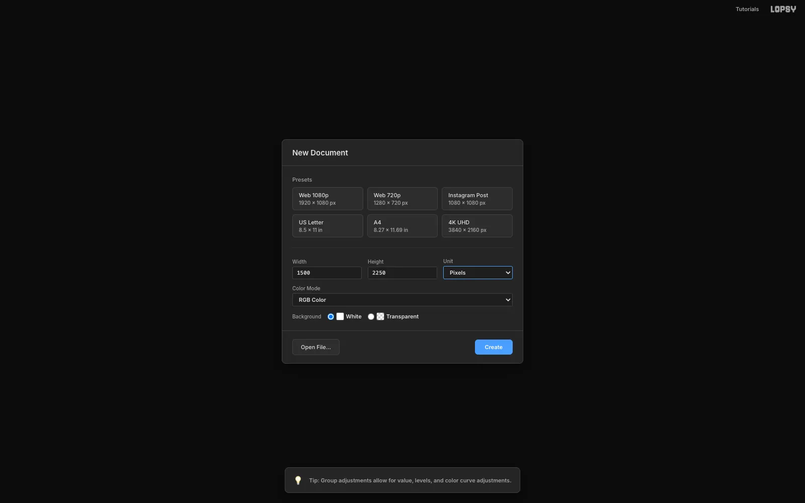

Create a **1500 × 2250** px document (a 2:3 poster) with a **White** background. Set the foreground to paper `#EDE6D3`, then choose **Edit → Fill** on Layer 1 and rename it `Paper`.

> **Tip:** Keep the Unit on **Pixels**. Every size in this tutorial is in pixels.

## Draw the hatch, dash and grid tiles

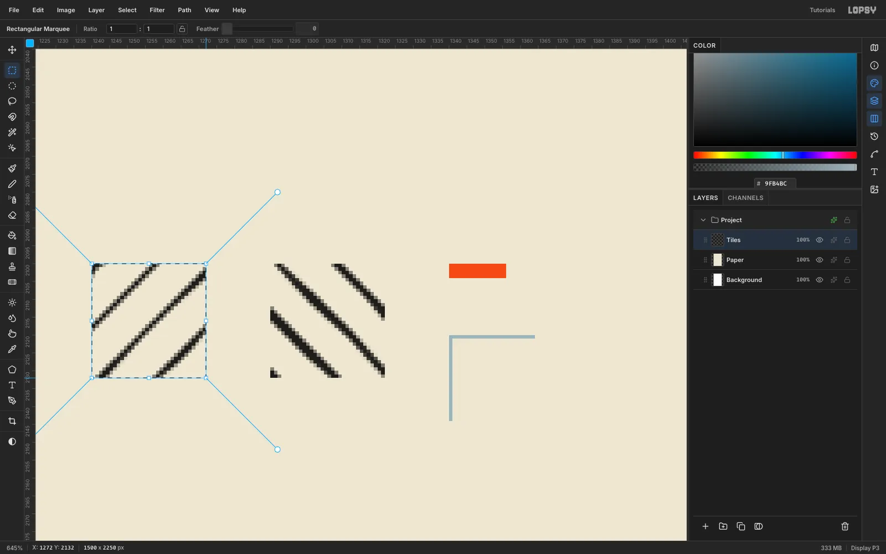

Three repeating textures do most of the drafting work. Add a temporary layer called `Tiles`, zoom in to about 600% on an empty corner, and draw them:

- **Housing hatch:** a 32 × 32 square with 3 px ink lines at 45°, one every 16 px. Marquee the square first, so the selection keeps the lines inside it. Pick the **Brush** at Size 3 and Hardness 100 in ink. For each line, click just outside the square and [[Cmd+Shift]]-click past the opposite side, so the line snaps to 45° and runs right across. Space the lines 16 px apart along the edge, and include the short ones that only clip a corner, so each line leaving the square comes back in on the opposite edge and the tiles meet.
- **Plug hatch:** the same tile mirrored, with the lines leaning the other way. Adjacent parts in a section drawing are always hatched in opposite directions.
- **Dash:** a 16 × 4 orange block inside a 24 × 4 marquee. The 8 px transparent tail becomes the gap.
- **Grid:** a 24 × 24 square with a 1 px `#9FB4BC` line along its top and left edges. Draw it with the **Pencil** ([[N]]) at Size 1: click the bottom-left corner, [[Shift]]-click the top-left, then [[Shift]]-click the top-right.

Marquee each tile exactly and choose **Edit → Define Pattern**. Then delete the `Tiles` layer.

> **Tip:** Tiles have to be exact, so type them instead of dragging. With nothing selected, a single click (no drag) with the **Rectangular Marquee** opens a dialog with **From X / Y** and **To X / Y** fields.

## Tile the grid paper

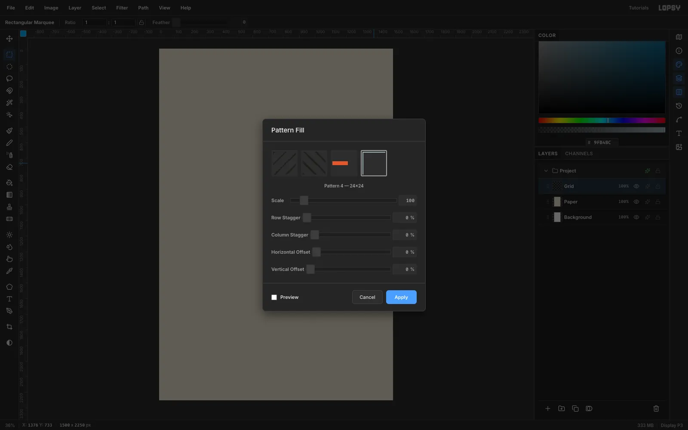

Add a layer called `Grid` above Paper. With nothing selected, choose **Edit → Fill with Pattern…**, pick the grid thumbnail and click **Apply**. Then finish the layer:

1. Marquee a rectangle about 56 px in from every edge (From **56, 56** To **1444, 2194** if you type it), choose **Select → Inverse**, press [[Delete]], then [[Cmd+D]]. That keeps the grid just inside the border you'll draw next.
2. Set the layer's **Blend** to **Multiply** (in the ✦ effects drawer).
3. Set its opacity to **32%**.

## Add the border and margin guides

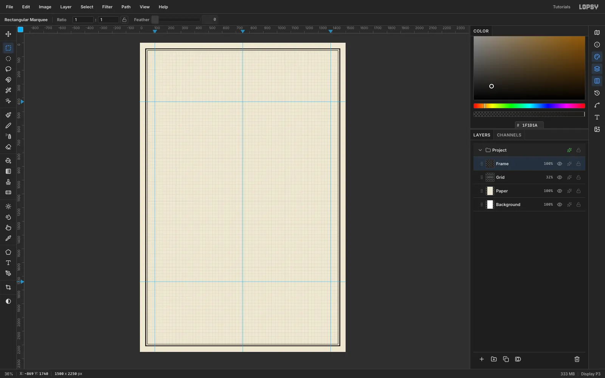

On a `Frame` layer, draw two rules. For each one, fill a marquee, run **Select → Shrink…** and press [[Delete]]:

- an outer rule 40 px in from every edge, shrunk by **6**
- an inner rule 54 px in from every edge, shrunk by **2**

Press [[Cmd+D]] after each one.

> **Tip:** For exact rules, click once with the marquee (nothing selected) and type the corners: From **40, 40** To **1460, 2210** for the outer rule and From **54, 54** To **1446, 2196** for the inner one.

Then drop **guides**. A single click on a ruler adds one:

- on the top ruler, about 110 px in from each side for the margins, and a [[Cmd]]-click near the middle, which snaps a guide to the centre
- on the left ruler, at about 428 (under the title) and about 1740 (above the bottom band)

Everything in the poster stays between the two margin guides.

## Cut the housing and plug

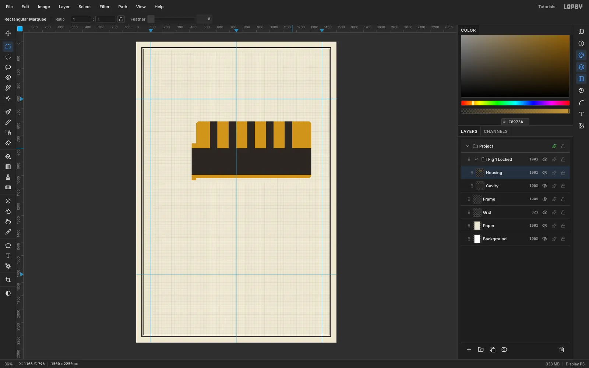

Click **New Group** and name it `Fig 1 Locked`. Build the section from the back forward, one layer per part. The lock sits in the right-hand part of the top band, leaving a column on the left for notes:

1. **Cavity:** fill the whole cylinder outline with `#2A2622`, one piece at a time. Overlapping fills merge into one shape. The outline is the **housing**, an 860 × 424 px block with 14 px chamfered corners, plus a narrow **front lip** on its left end. Place the housing about 340 px right of the left margin guide, so its right edge ends about 80 px short of the right margin guide, with its top about 170 px below the title guide. The lip is 34 px wide and 276 px tall, sticking out from the housing's left edge and running from a little below its middle to just past its bottom. Anything you cut out of the brass layers above will show this dark "air".
2. **Housing:** fill the same outline in brass `#C8973A`. Delete the plug's space: a 200 px-tall strip that starts 200 px below the housing's top and runs from the front of the lip to the housing's right edge. Then delete five **56 px-wide pin chambers** from the housing's top edge down to the plug. Space them **140 px** apart, centre to centre, with the first centred 130 px in from the housing's left edge.
3. **Plug:** fill the plug's space with `#DDB255`. Delete a 96 px-tall **keyway** slot along its whole length, starting 50 px below the plug's top. Then delete five 56 px pin holes, in line with the chambers, from the plug's top down to the keyway.
4. **Cap & Cam:** add a 14 px-tall steel `#A9B1B5` retainer strip sitting on top of the housing, 10 px in from each end, and a small cam tab behind the plug.

> **Tip:** Every part has to line up with the ones above and below it, so type the rectangles rather than dragging them. Click once with the **Rectangular Marquee** (with nothing selected) and enter the corners. The housing runs From **450, 596** To **1310, 1020** and the lip From **416, 760** To **450, 1036**. The plug is From **416, 796** To **1310, 996** and the keyway From **416, 846** To **1310, 942**. The chambers are centred on x **580, 720, 860, 1000** and **1140**, and the cap runs From **460, 582** To **1300, 596**. For the chamfered corners, draw the whole outline, lip included, with the **Pen**, click **Commit path**, then choose **Path to Selection** in the Paths panel.

> **Tip:** Keep the plug a **solid** cylinder with a slot through it. If the keyway takes up most of the plug, the drawing reads as two thin rails and "the plug turns" stops making sense.

## Select the plug with the Magic Wand

Hatching has to stop at each part's edge, so select the part first. Click the **Housing** row, choose the **Magic Wand**, untick **Contiguous**, and click the housing's brass. Contiguous off matters here: the chambers split the housing into separate islands, and you want them all.

Click the **Add Layer** button, name the new layer `Housing Hatch`, and check the marching ants are still there. The selection survives the row change. Hatch it (next step) before you make the next selection. Then do the same for the plug: click the **Plug** row, click its brass with the wand, and add a `Plug Hatch` layer above it.

## Fill the section hatching

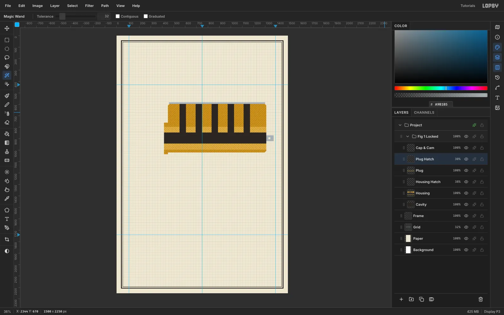

With each part's selection live and its hatch layer active, choose **Edit → Fill with Pattern…**, pick the tile and click **Apply**:

- **Housing Hatch:** the first hatch tile. Set **Blend** to **Multiply** and opacity to **38%**.
- **Plug Hatch:** the mirrored tile. Set **Blend** to **Multiply** and opacity to **30%**.

The pattern is anchored to the document, so the lines stay continuous across every island. Multiply lets the brass colour show through.

## Draw the springs and the first driver pin

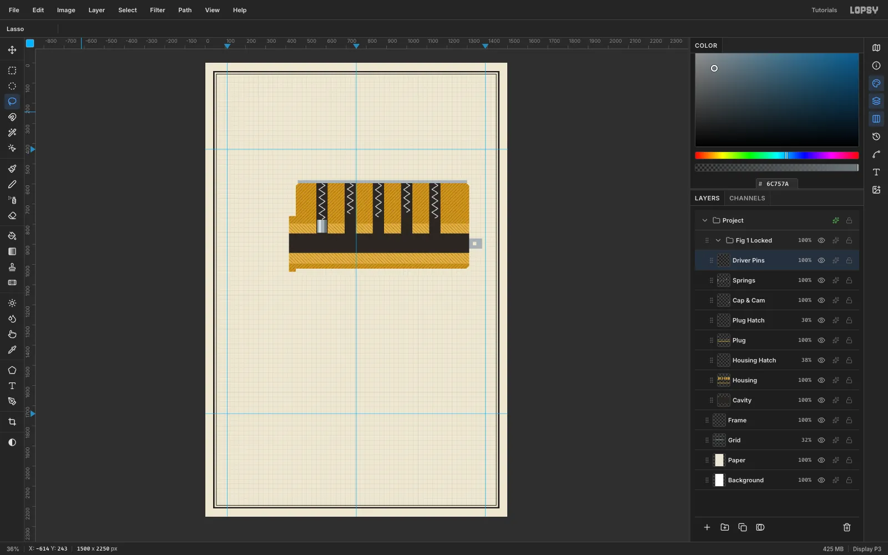

Press [[Cmd+D]], then add a `Springs` layer. Pick the **Brush** at size **5** and hardness **100** in `#C9D0D3`. Draw a zigzag down each chamber, about 30 px wide with a turn every 20 px. Stop each one where its driver pin will start.

> **Tip:** For crisp zigzags, click once at the top of the spring, then [[Shift]]-click each turn in order. Every Shift-click draws a straight line from the last point.

On a `Driver Pins` layer, draw the first pin in the first chamber as a **48 × 64** rectangle in three flat tones. That's how period manuals shaded round parts:

- mid `#A9B1B5` for the whole pin
- a 10 px light band `#DCE2E4` just left of centre
- a 13 px dark band `#6C757A` down the right edge

Skip gradients here. Flat bands read as printed ink.

## Clone the pins and dash the shear line

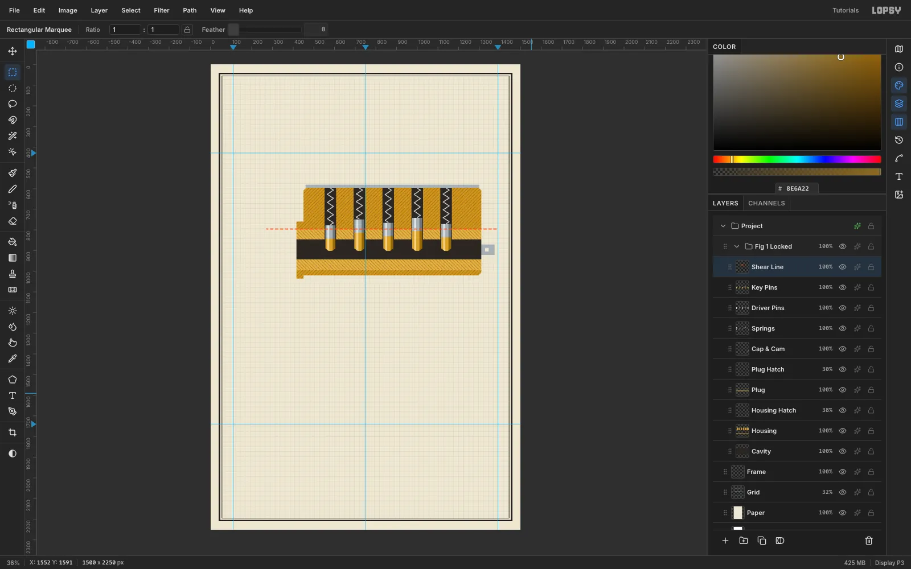

Clone the driver pin instead of redrawing it:

1. Marquee it and press [[Cmd+C]], then [[Cmd+V]]. The paste lands in place on a new layer, selected, with the **Move** tool active.
2. Drag it one chamber (140 px) to the right. Finish with the arrow keys: [[Shift+→]] moves 10 px and [[→]] moves 1 px.
3. Press [[Cmd+D]], then choose **Layer → Merge Down**.

Repeat for the other chambers. In the locked view each driver sits at a different height, because it rests on a different length of key pin.

On a `Key Pins` layer, fill five brass pins in `#D2A443`, 60, 88, 72, 96 and 66 px long. Give each a 12 px pointed tip, a `#F0D38A` light band and a `#8E6A22` dark band. With no key they all hang to the same depth, their tips level just below the middle of the keyway, so their tops land at different heights. Sit each driver pin on top of its key pin, and every driver **crosses** the shear line.

Finally add a `Shear Line` layer. Marquee a 4 px-tall strip centred on the plug's top edge, from about 160 px right of the left margin guide to the right margin guide, and fill it with the dash pattern using **Edit → Fill with Pattern…**.

> **Tip:** To type the strip, click once with the marquee and enter From **270, 794** To **1390, 798**.

## Insert the key

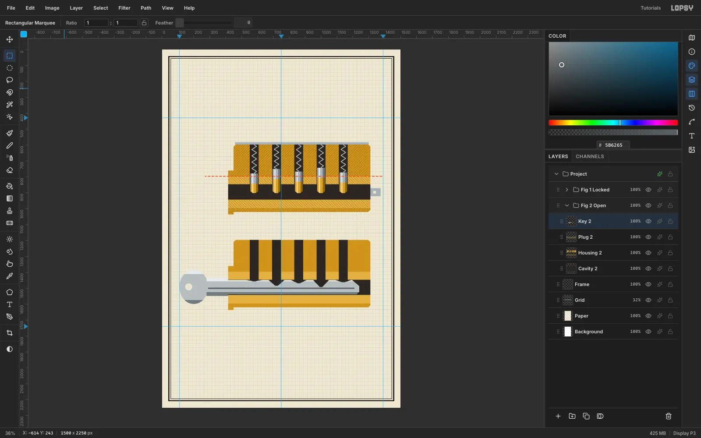

Fig. 2 uses the same housing, plug and cavity. Click the `Fig 1 Locked` group row and choose **Layer → Duplicate Layer**. Rename the copy `Fig 2 Open` and delete its `Springs`, `Driver Pins`, `Key Pins` and `Shear Line` layers. Then click the `Fig 2 Open` row and drag the group **600 px** straight down with the **Move** tool, so the housing's top sits at y 1196. Use the arrow keys for the last few pixels.

The key goes on its own `Key 2` layer, above the plug:

- **Blade:** fill it with nickel `#B7BDBF` inside the keyway. Cut its top edge into **V notches**. Each notch bottom sits one key-pin length below the shear line, so the notch under the 96 px pin is the deepest.
- **Bow:** a 90 × 108 ellipse-marquee fill outside the lock, with a 22 px hole deleted.
- **Tone:** add a light `#E6EAEA` strip along the top, a shadow `#737B7F` strip along the bottom and a dark warding groove `#5B6265` down the middle.

## Lift every gap to the shear line

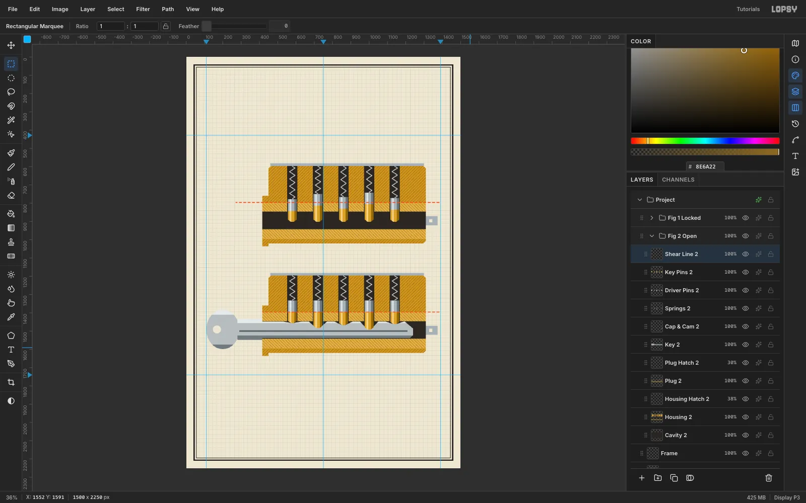

Draw one spring and one driver pin, then clone them four times, one chamber (140 px) to the right each time, with **no** vertical offset. With the key in, every driver sits at the same height.

The key pins come next. Each one's top sits exactly on the shear line, and its point rests in its notch. Add the dashed shear line across this figure too, starting at the front of the lock.

Compare the two figures: in Fig. 2, not one pin crosses the orange line. That's the whole poster.

## Rotate the keyway 30° for the face views

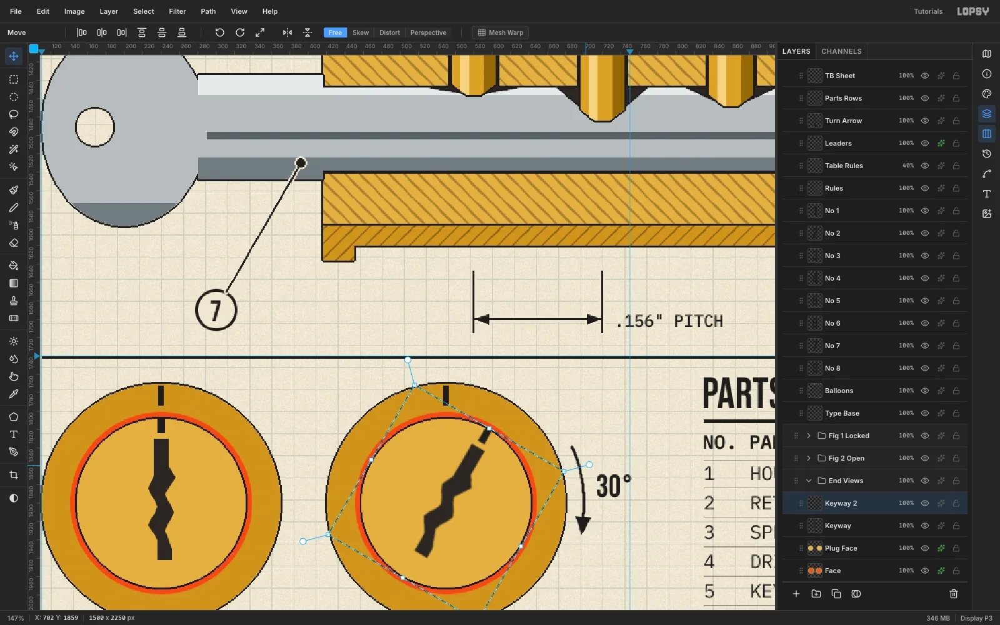

In an `End Views` group, draw the lock's front face twice in the bottom band, on the left: one centred about 240 px from the left edge and 160 px below the bottom-band guide, the other 310 px to its right. Each face is three circles on the same centre:

- a brass circle 260 px across (radius 130), with an ink tick at 12 o'clock
- an orange shear ring, radius 99
- a lighter plug circle, radius 92

> **Tip:** Circles on one centre are easiest with the exact-corners dialog. Click once with the **Elliptical Marquee** and type a box of the circle's width around the centre. For radius *r* on the left face that's From **240 − r, 1900 − r** To **240 + r, 1900 + r**.

On a `Keyway` layer, lasso a zigzag keyway slot and a small index notch on the left face.

To turn the right face:

1. Click the `Keyway` row and marquee a **square** about 188 px across, centred on the left face (From **146, 1806** To **334, 1994** if you type it). Copy, paste in place and move it 310 px right, onto the right face.
2. Re-marquee it, square and centred on that face, so the rotation pivots on the face's centre.
3. With the Move tool, hold [[Cmd]] and drag the **rotate handle** clockwise. Cmd snaps in 15° steps, so it stops at exactly **30°**.
4. Press [[Cmd+D]] to commit.

Only the keyway turns. The plug's shading stays put, because light doesn't rotate with the part.

Add a black arc arrow on the same centre as the right face (radius 150) and a `30°` label.

## Set the title and track the subtitle

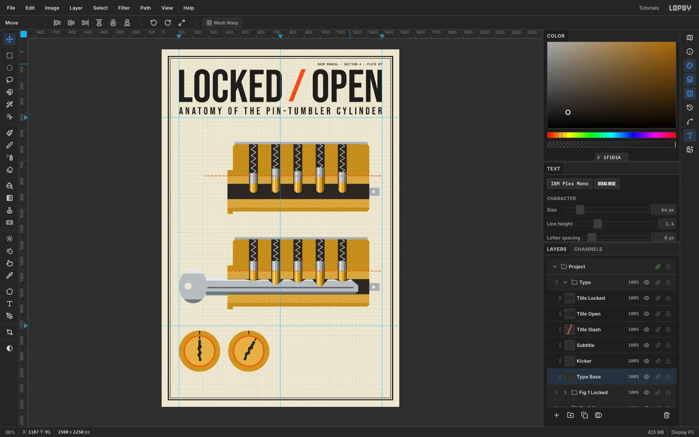

Make a `Type` group and drag it above the figure groups. Create each text in an empty spot, then move it into place.

- **Title:** `LOCKED` and `OPEN` in **Bebas Neue 290**, as two separate text layers. Put `LOCKED` flush with the left margin guide and `OPEN` flush with the right one, both with their tops about 124 px from the top of the sheet. Centre an orange `/` in the gap between them.
- **Subtitle:** `ANATOMY OF THE PIN-TUMBLER CYLINDER` in **Bebas Neue 64**, sitting just above the title guide. Then raise its **Letter spacing** in the Text panel until it runs from margin guide to margin guide. About **14.3** does it.
- **Kicker:** `SHOP MANUAL · SECTION 4 · PLATE 07` in **IBM Plex Mono Medium 20** with **Letter spacing** back to 0, flush with the right margin above the title, about 84 px from the top.

Before you set up each new text layer, click a layer that isn't text. Nudge each block into place with the **Move** tool and the arrow keys.

## Add captions, notes and the parts list

Set the rest of the text in two faces only:

- **Figure captions:** `FIG. 1 — LOCKED` and `FIG. 2 — OPEN` in **Bebas Neue 64**, at the left margin.
- **Notes:** four short lines under each caption in **IBM Plex Mono 21**.
- **Shear line label:** `SHEAR LINE` in orange Bebas 40, centred vertically on the dashed line.
- **Face captions:** Bebas 36, centred under each circle.

For the parts list, use monospace columns. IBM Plex Mono has the same advance width in every weight, so spaces line up the columns exactly:

1. Type a header row, `NO. PART  QTY  MATERIAL`, in **SemiBold 21**.
2. Click a layer that isn't text and set **Line height** to **1.52** in the Text panel. Then type eight rows in **Regular 21**, padding every part name to the same length (e.g. `3   SPRING           5    STAINLESS STEEL`).

## Snap the heavy rule to the grid

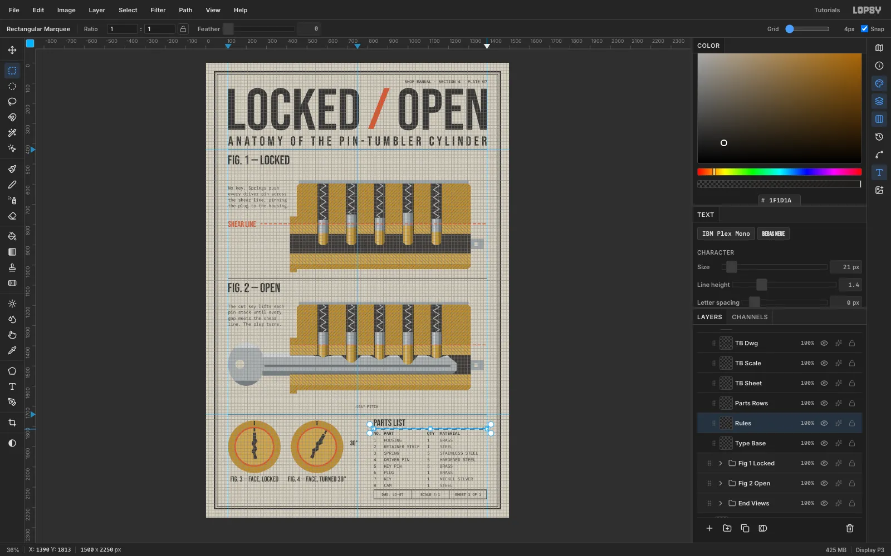

Choose **View → Show Grid** and set **Grid** to **4px** in the options bar. Showing the grid also ticks **Snap**; leave it on. On a `Rules` layer, drag a marquee under the **PARTS LIST** heading, from the left edge of the parts-list column to the right margin guide. It snaps to a clean 560 × 4 px bar. Fill it with ink and choose **View → Show Grid** again to hide the grid.

The table's other lines go on their own layers:

- **Table rules:** 1 px lines between the rows, on a `Table Rules` layer at **40%**. Use the **Pencil** at Size 1: click at one end of each line and [[Cmd+Shift]]-click at the other to keep it level.
- **Title block:** a 48 px-tall box with a 2 px outline, as wide as the heavy rule, near the bottom of the sheet under the parts list. Draw the outline with the Pencil at Size 2, clicking one corner and [[Shift]]-clicking round the other three and back to the start, then add two short vertical lines to split it into three cells: `DWG. LO-07`, `SCALE 4:1` and `SHEET 1 OF 1`.
- **Band rules:** full-width 3 px Pencil rules on the title guide, in the gap between the two figures, and on the bottom-band guide.

## Add balloons and leaders

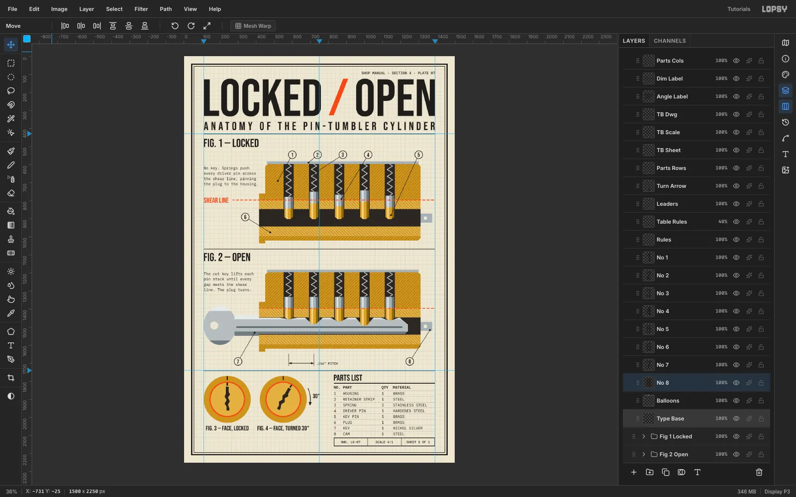

Drafting conventions to follow:

- **Numbers run in reading order.** Balloons **1–5** sit in a row above Fig. 1: housing, retainer strip, spring, driver pin, key pin. **6** is the plug, **7** the key and **8** the cam.
- **Leaders are angled** between 30° and 60°. They must never run along a spring or an edge. Each is a 3 px ink line ending in a 5 px dot on its part. Draw them on a `Leaders` layer with a hard **Brush**: at Size 3, click at the balloon and [[Shift]]-click on the part, then click once at Size 5 for the dot.
- **Balloons** are ink circles 46 px across with a 40 px paper centre, on a layer directly **below** the number text. Each number is **Bebas 32**, centred in its balloon. Nudge with the arrow keys until it sits in the middle.
- **The pitch dimension** has 2 px extension lines on the centres of pins 1 and 2, arrowheads on the line, and `.156" PITCH` set outside the extension lines so it doesn't crowd them.

## Outline the parts and finish the paper

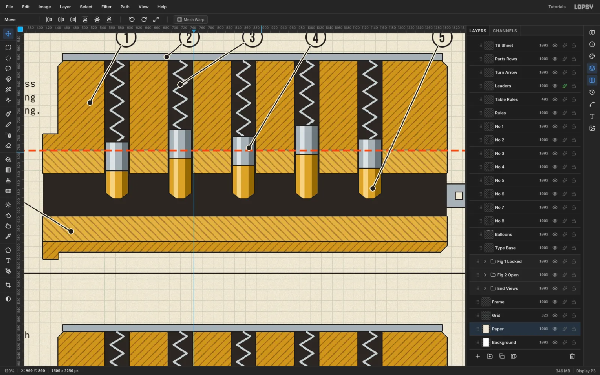

Finish with the outlines, the leader halos and the paper grain:

- **Ink outlines:** on every part layer (housing, plug, cap & cam, pins, key and faces), open ✦ and turn on **Stroke**: ink `#1F1D1A`, **Width 2**, **Position** set to **outside**.
- **Leader halos:** on the **Leaders** layer, add a **Stroke** in the paper colour instead. The halo keeps the black leaders readable where they cross the dark chambers.
- **Paper grain:** select **Paper** and run **Filter → Add Noise…** at **Amount 12** with Mode **Mono**.

Export with **File → Quick Export PNG**, and choose **File → Save Project** so you can come back to it.
