Soviet constructivist posters by Rodchenko, Klutsis and the Stenberg brothers
use very few ingredients. There's a radiating sunburst, one big red disc, black
silhouettes, and slogans set in heavy condensed type on steep diagonals. There
are only three inks: red, black and cream.

In this tutorial you'll use that vocabulary to make something much less
serious: an invitation to a garden tea party called **Tea Insurrection**. You'll
draw everything from lasso and marquee selections, rotate artwork and type with
the transform handles, fake a hard offset shadow, and finish with halftone dots
and paper grain.

The palette is: cream `#F1E4C8`, kraft `#E2CCA4`, red `#C8102E` and black
`#1A1A1A`.

## Create a portrait poster canvas

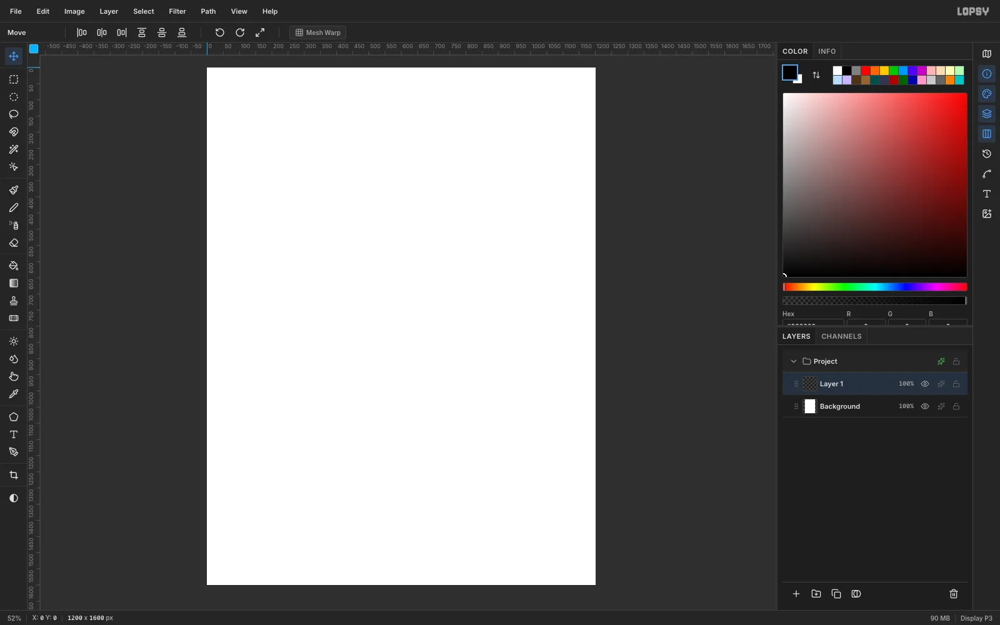

Open [Lopsy](/). In the **New Document** dialog, type `1200` for **Width** and
`1600` for **Height**, choose a **White** background, and click **Create**.
That's a 3:4 portrait sheet, a classic poster proportion.

Select the **Background** layer, set the foreground colour to `#F1E4C8` in the
Color panel's hex field, press [[G]] for the **Paint Bucket** and click the
canvas. Double-click **Layer 1** and rename it `Rays`.

## Lasso the first sunburst ray

The sunburst radiates from the point where the teacup's saucer will sit, at
about (300, 1150). Press [[L]] for the **Lasso**. Press the mouse down at that
point, drag out to the canvas edge, follow the edge for a short way, and come
back to the centre. The result is a thin wedge about 10° wide.

Set the foreground to `#E2CCA4`, press [[G]] and click inside the wedge, then
press [[Cmd+D]] to deselect.

## Complete the sunburst

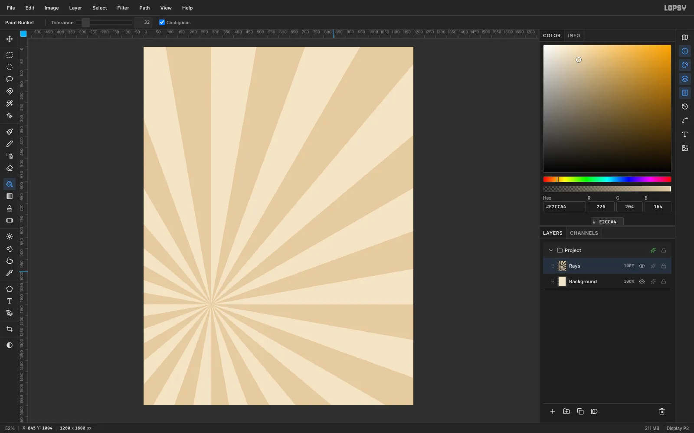

Repeat the wedge all the way round. Skip one 10° slice each time, so you get
18 kraft rays with cream gaps between them. Keep the rays low contrast. They're
background texture, and the strong red is saved for the disc and the headline.

> **Tip:** The lasso always replaces the selection, so fill each wedge before
> you draw the next one.

## Add the red disc

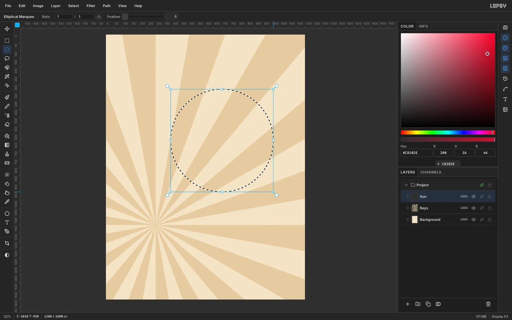

Click **Add Layer**, name it `Sun`, and pick the **Elliptical Marquee**. Hold
[[Cmd]] while you drag to get a perfect circle 620 px across, centred at about
(700, 640). Set the foreground to `#C8102E` and fill it with the Paint Bucket.

## Build the teapot body and lid

Click **New Group** in the Layers panel and name it `Teapot`. Add a layer
called `Handle`. Fill a black (`#1A1A1A`) ellipse on the right of the disc,
then draw a smaller ellipse inside it and press [[Delete]] to punch out a ring.

Add a layer called `Pot` above it. Fill it with these black shapes:

- a wide ellipse for the body, about 408 × 312 px, centred on the disc;
- a rectangle for the foot below it;
- a small ellipse for the knob on top.

For the lid, press [[U]] for the **Shape** tool. Set **Shape** to **Polygon**,
**Sides** to `4` and **Corner Radius** to `14`, then click the Fill swatch and
enter `1A1A1A`. Shapes draw from the centre out, so start the drag in the middle
of the lid.

## Draw the spout

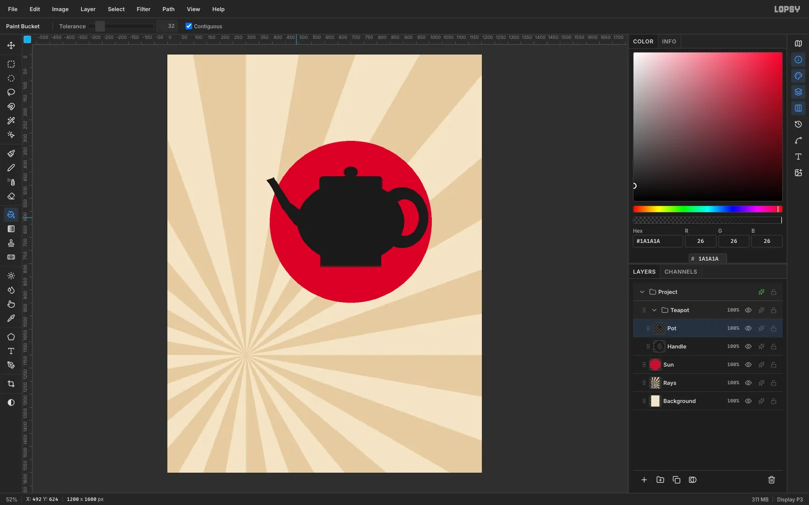

On the same `Pot` layer, use the **Lasso** to trace a spout. Start inside the
body, run up and to the left, give it a flat cut tip, and come back down the
other side. Fill it black.

## Decorate the pot with a star and bands

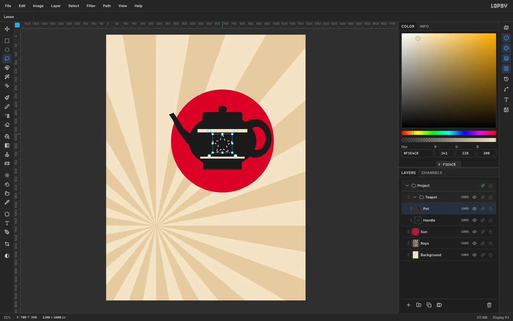

Switch the foreground to cream. With the **Rectangular Marquee** ([[M]]), make
two thin horizontal bands across the body and bucket-fill each one. The bucket
only fills the black pixels inside the selection, so the bands stop at the
teapot's edge.

Then draw a five-pointed star with the Lasso by clicking through its ten points,
and fill it cream. That's your first propaganda star.

## Tilt the teapot into a pour

Select `Pot` and choose **Layer → Merge Down** to merge it into `Handle`, then
rename the result `Teapot Art`. Draw a rectangular marquee around the whole
teapot and press [[V]] for **Move**. Drag one of the round rotation handles
outside a corner to turn the pot about **−16°**, so the spout tips down. Press
[[Enter]] to commit and [[Cmd+D]] to deselect.

> **Tip:** Keep the artwork inside the canvas before you rotate. Pixels pushed
> past the edge are cropped when the transform is committed.

## Cut the teacup from a circle

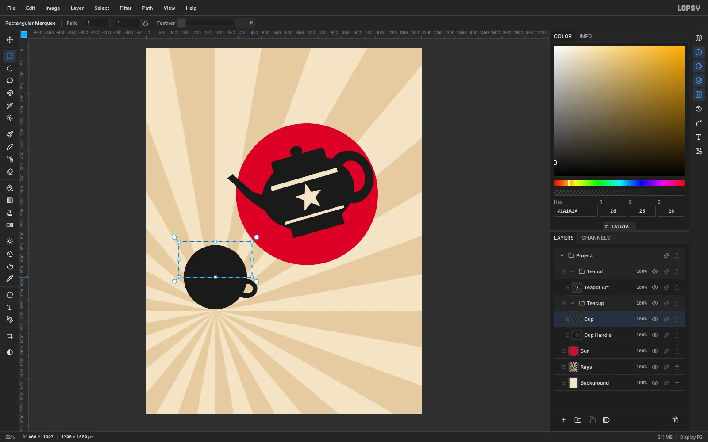

Select the `Sun` layer and create a **New Group** called `Teacup`. In it, add a
`Cup Handle` layer with a small black ring, made the same way as the teapot
handle.

Then add a `Cup` layer. Fill a black circle about 280 px across, drag a
rectangular marquee over its top half and press [[Delete]]. What's left is a
bowl. Add a wide, flat ellipse underneath it for the saucer, centred on the
sunburst's focal point, and a red star on the front of the cup.

## Pour the tea with a Shift-click line

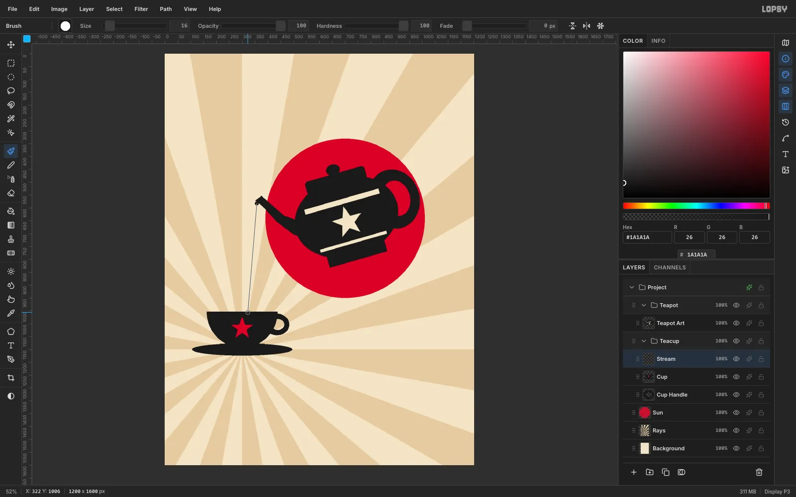

Add a layer called `Stream`, press [[B]] for the **Brush**, and set **Size** to
`16`, **Hardness** to `100` and **Opacity** to `100`. Click once at the spout
tip. Then hold [[Shift]] and click inside the cup to draw a perfectly straight
stream. A straight, fairly thick pour reads as liquid. A thin wobbly one looks
like wire.

## Add halftone print dots

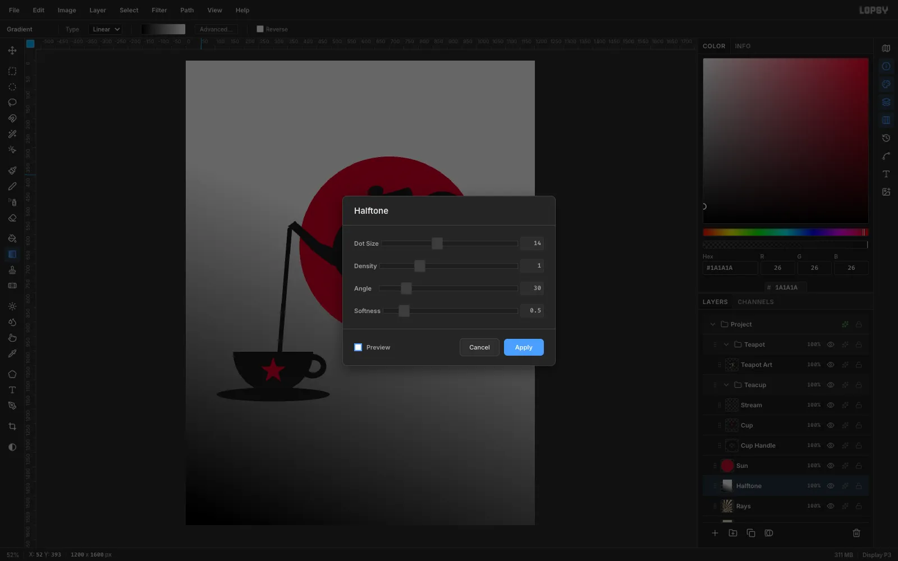

Select `Rays` and add a layer above it called `Halftone`. With the **Gradient**
tool, drag from the bottom-left corner up towards the middle of the canvas to
fill it black to white. Then choose **Filter → Halftone…** and set **Dot Size**
to `14`, **Angle** to `30` and **Softness** to `0.5`. Click **Apply**. You get
dots that get bigger towards the bottom-left corner.

## Tint the dots and multiply them in

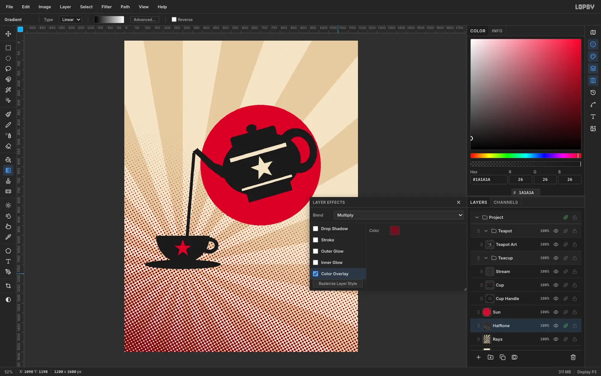

Open the Halftone layer's **Layer Effects** (the sparkle icon on its row). Set
the blend mode to **Multiply** and turn on **Color Overlay** in maroon
`#7A0C1E`. Close the panel and drop the layer opacity to about **30%**. The
dots now read as ink texture, not as a pattern on top.

## Lasso the diagonal band

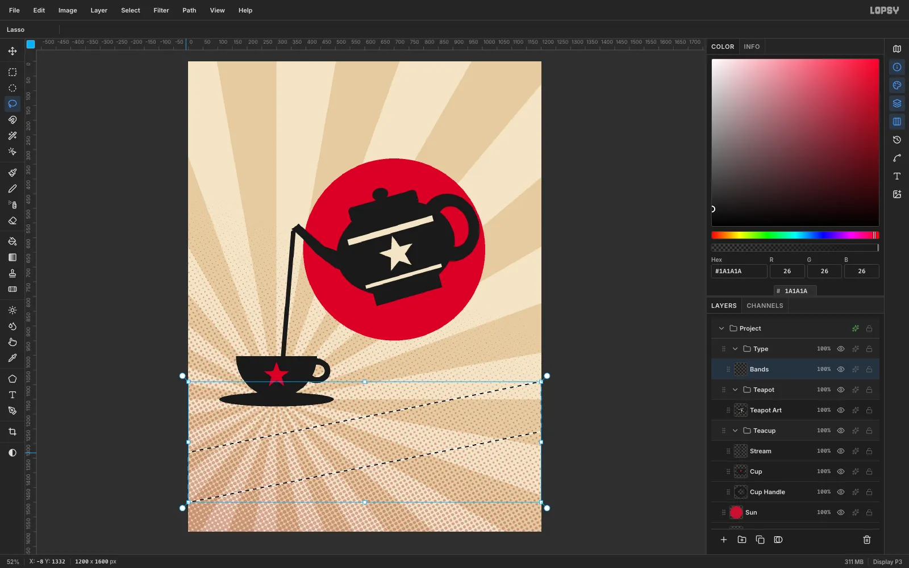

Click the top-level **Project** group and create a **New Group** called
`Type`. Add a `Bands` layer inside it.

Constructivism is built on the diagonal. Lasso a band that rises about
**11°** from left to right, with corners at (0, 1332), (1200, 1088),
(1200, 1298) and (0, 1542). Fill it black. Then add these on the same layer:

- a black rectangle from y = 1410 to the bottom, for the event details;
- a black banner across the top that rises about **6°**;
- thin red rules just above the diagonal band and just below the top banner.

## Check the composition

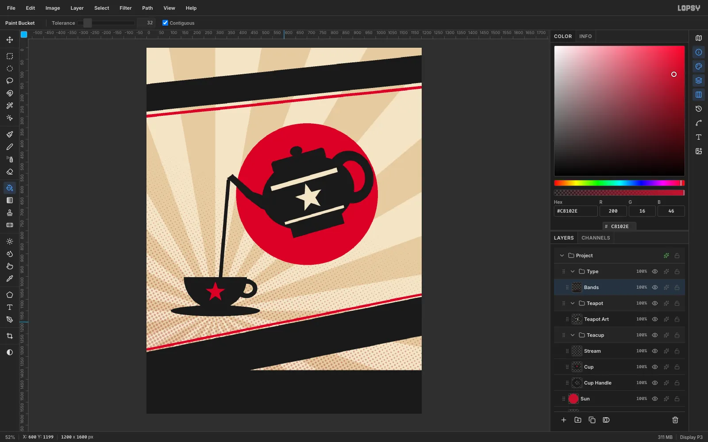

The page now has a strong zig-zag. The top banner and the big band slope the
same way at different angles, which gives the layout its movement. The black
footer gives the eye somewhere to land.

## Set and rotate the banner type

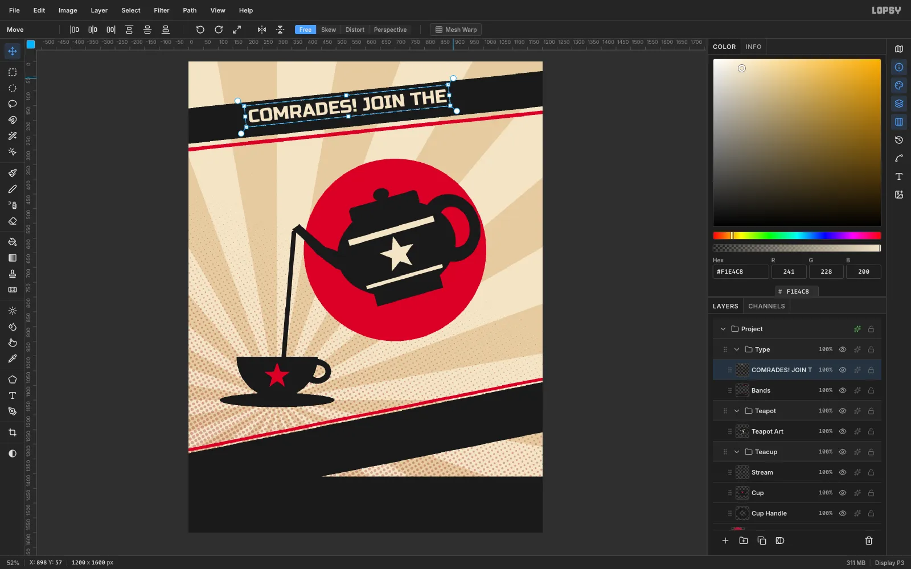

Set the foreground to cream. Press [[T]], open the font picker, search for
**Russo One** and set the Size to `62`. Click near the top of the canvas and
type `COMRADES! JOIN THE`. Press [[Tab]] to commit.

Click the **Rasterize Layer** button at the bottom of the Layers panel. Marquee
the words, drag a rotation handle to **−6°**, press [[Enter]], and move the
line so it sits centred in the banner.

## Add stars with copy and paste

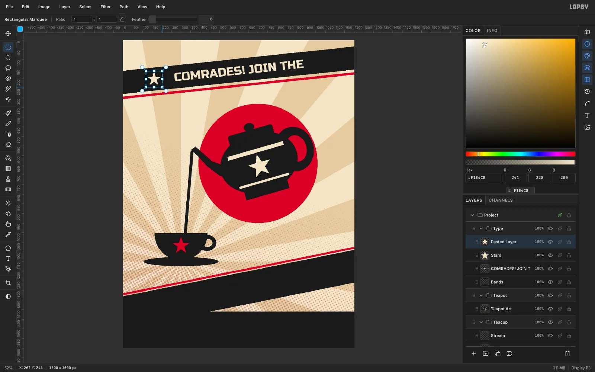

Add a `Stars` layer and lasso-fill a cream star at the left end of the banner.
Marquee it, press [[Cmd+C]] then [[Cmd+V]], and drag the pasted copy with
**Move** to the right end of the banner. Choose **Layer → Merge Down** to put
both stars on one layer.

## Rotate the TEA headline

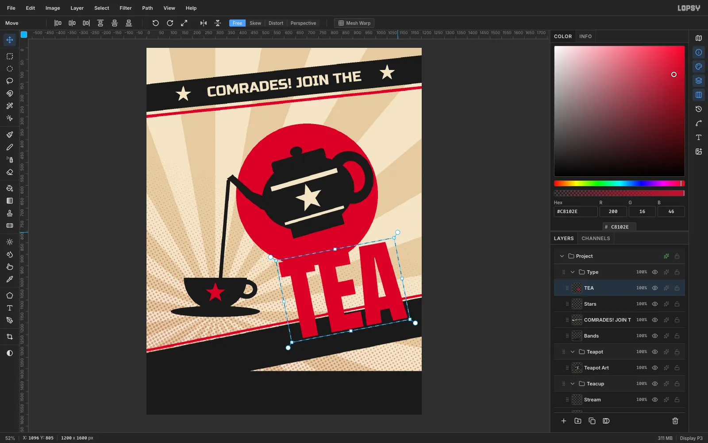

Set the foreground to red, switch the font to **Anton** and set the Size to
`400`. Type `TEA` on the right-hand side and commit with [[Tab]]. Rasterize it,
marquee it, and rotate it **−11°** so it matches the diagonal band. Press
[[Enter]], then move it up until its baseline sits on the red rule above the
band.

## Outline the headline in black

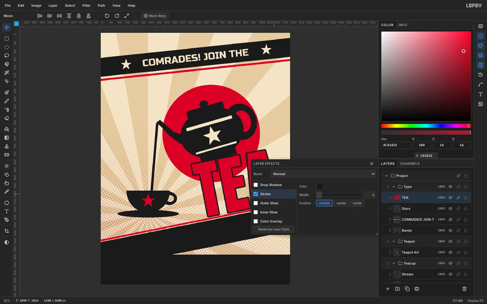

The red letters overlap the red disc, so they need an edge. Open the TEA
layer's **Layer Effects**, turn on **Stroke**, set **Width** to `8` and set the
colour to `#1A1A1A`.

## Build a hard offset shadow

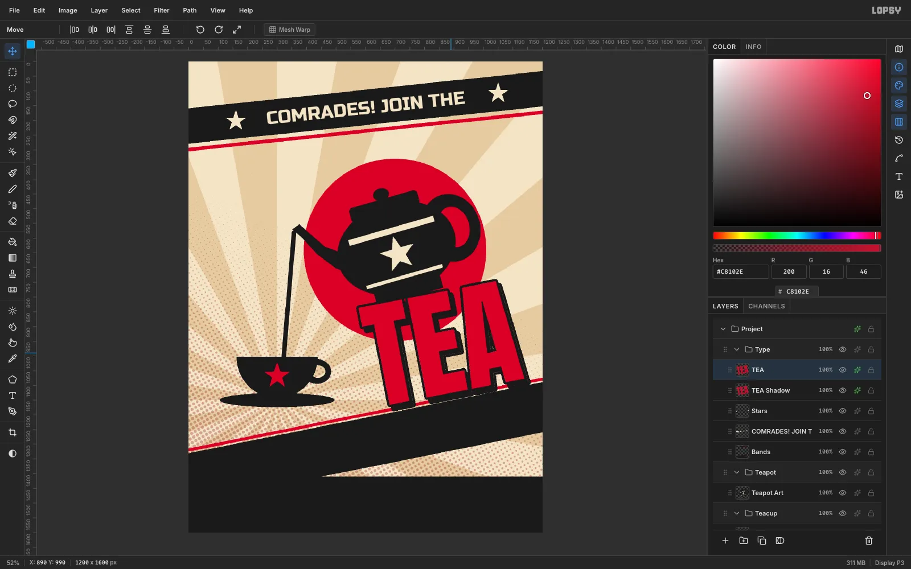

Click **Duplicate Layer**. Duplicate puts the copy **10 px right and 10 px
down**, so move the copy back by (−10, −10). Rename the original, which is
underneath, `TEA Shadow`. On `TEA Shadow`, turn on **Color Overlay** in
`#1A1A1A` and move it **14 px right and 14 px down**.

This gives a crisp, fully opaque print shadow. The Drop Shadow effect tops out
at 75% opacity, which looks grey instead of black.

## Set and rotate INSURRECTION

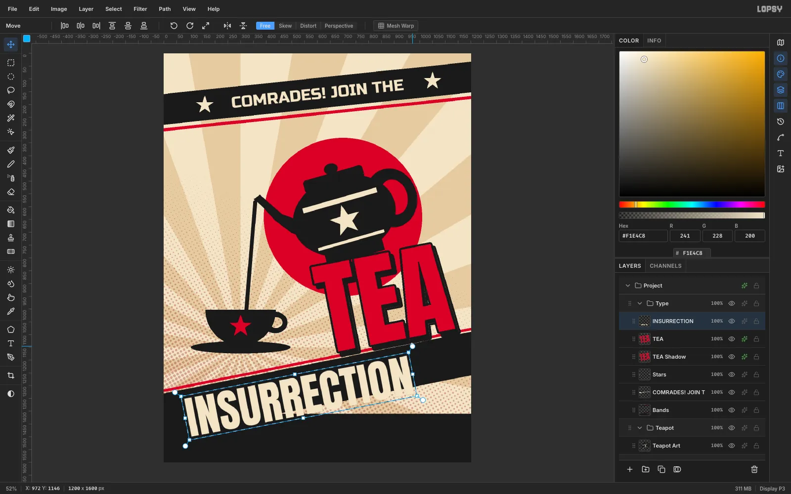

Switch to cream, **Anton**, Size `176`. Type `INSURRECTION` in the black
footer, commit, and rasterize it. Move it up so none of it hangs off the bottom
of the canvas. Then marquee it and rotate it **−11°**.

## Seat the word inside the band

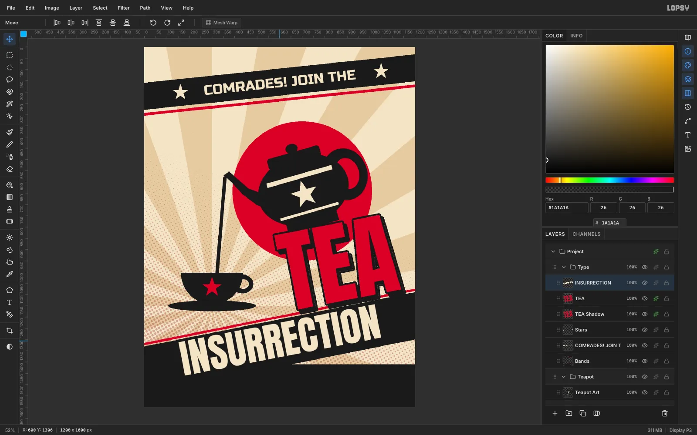

Move the word so it's centred in the diagonal band, directly under TEA. If the
letters touch the band's lower edge, select `Bands` and lasso-fill a strip
about 40 px thick along the bottom of the band to give the type room to
breathe.

## Make the details readable

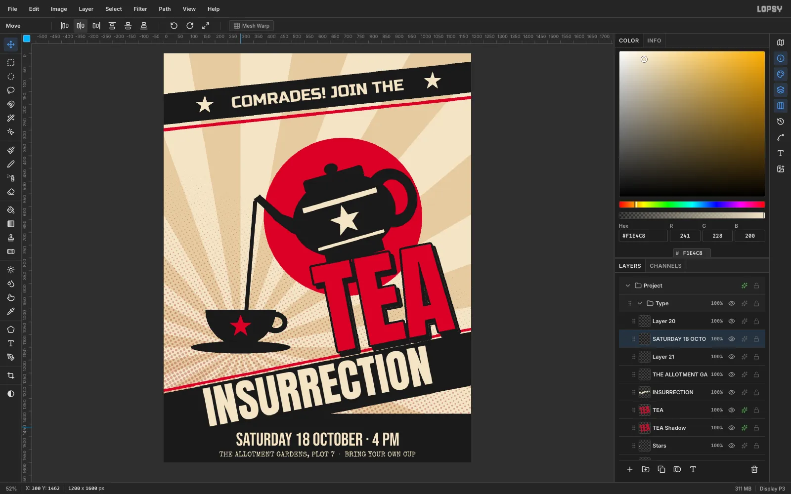

An invitation fails if nobody can read the when and the where. Set these two
lines in cream, and centre each one with **Align center horizontally** in the
Move tool's options bar:

1. Special Elite, Size `28`: `THE ALLOTMENT GARDENS, PLOT 7 · BRING YOUR OWN CUP`, near the bottom of the canvas.
2. Bebas Neue, Size `72`: `SATURDAY 18 OCTOBER · 4 PM`, above it.

> **Tip:** Type the lower line first. Then click **Add Layer** before you
> change the font for the next line. A text click just below an existing line
> edits that line instead of starting a new one. Changing the font while a
> text layer is active restyles that layer.

## Stamp a FREE SCONES badge

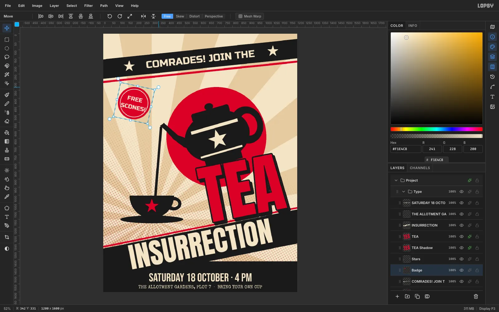

Add a `Badge` layer. With the **Shape** tool set to **Ellipse**, hold [[Cmd]]
and drag a red circle 200 px across, centred at (190, 430). Remove its fill,
add a cream stroke with **Width** `2`, and draw a slightly smaller ring inside
it.

Type `FREE`, press [[Enter]], type `SCONES!` in cream **Russo One** at Size
`36`, and rasterize. Marquee just the `FREE` line and nudge it right until it's
centred over `SCONES!`. Merge the text down into `Badge`, marquee the badge
and rotate it **+12°** so it looks hand-stamped.

## Add paper grain

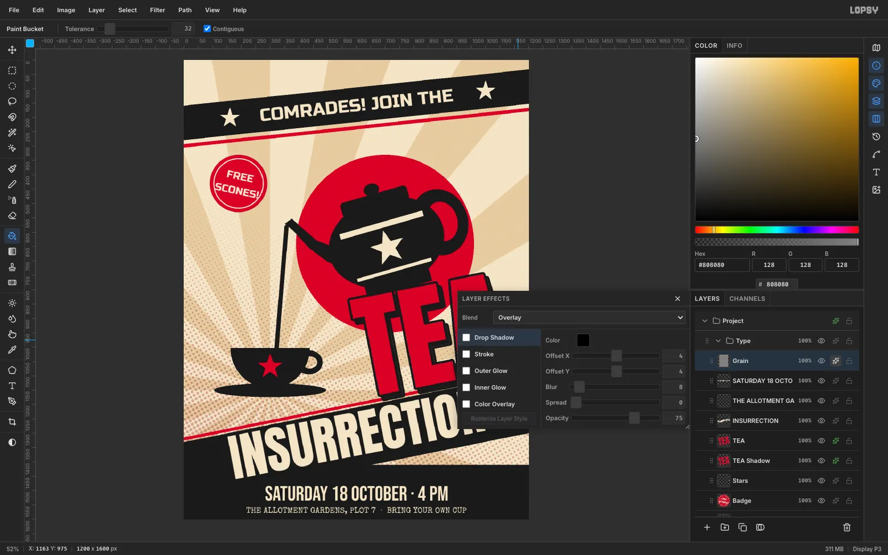

Add a `Grain` layer at the top of the `Type` group and fill it with `#808080`.
Choose **Filter → Add Noise…**, then pick **Mono** and **Gaussian**, set
**Amount** to `40` and click **Apply**. Set the layer's blend mode to
**Overlay** and its opacity to about **40%**. Mid-grey disappears in Overlay,
so only the speckle remains, which is enough to make the flat inks look
printed.

## Export the finished invitation

Choose **File → Quick Export PNG** to export the poster, and **File → Save
Project** to keep an editable `.lopsy` copy with all the layers and groups.

For the next one, try a different slogan, a different silhouette in the disc,
or a second diagonal running the opposite way.
