1950s drive-in posters sold a double feature from across a parking lot.
They used all-caps titles that seem to rush toward you, a saucer or monster
mid-attack, a starburst promising some new "-SCOPE" process, and cheap ink on
paper that has been folded into a glovebox ever since.

In this tutorial you'll build **Invaders from Yuggoth**, a 1200 × 1600 px
flier for the Moonlight Drive-In. Everything is drawn in Lopsy with marquee
and lasso fills, gradients, a few filters and layer effects. You won't need
any photos.

The palette:

- Sky: `#120A2E` → `#3B1553` → `#B23A6B` → `#F7953F`
- Planet teal `#9BF0DC` → `#124A5E`, ring `#F4C77E` and `#E8795A`
- Title yellow `#FFD83A`, ink `#1A0B24`, extrusion red `#C8102E`
- Beam green `#F6FFC0` / `#C8FF6A`, badge teal `#1FA59A`

## Set up the page and paint the sky

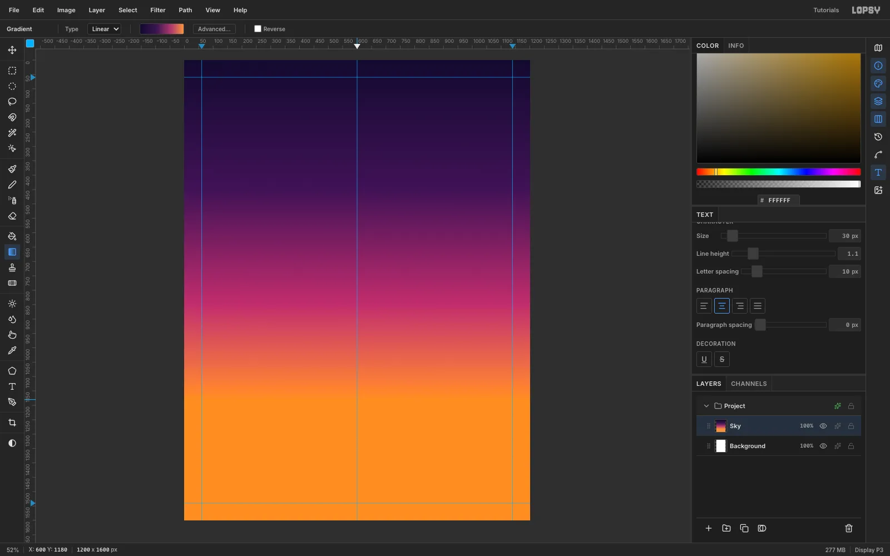

Choose **File → New**, set the unit to **Pixels**, and create a
**1200 × 1600** document with a white background.

Add a 60 px safe zone so nothing crowds the trim:

1. Click the top ruler about 60 px in from the left and right edges. Then [[Cmd]]-click (Ctrl-click) the middle of the ruler, which snaps a guide exactly to the centre line.
2. Click the left ruler about 60 px from the top and 60 px from the bottom.

A single click on a ruler drops a guide; you don't need to drag.

Rename **Layer 1** to *Sky*. Pick the **Gradient** tool, open
**Advanced…** and set four stops:

- `#120A2E` at 0%
- `#3B1553` at 38%
- `#B23A6B` at 72%
- `#F7953F` at 100%

Then drag a **Linear** gradient from the top of the page straight down to
about three-quarters of the way down (around 1180 on the left ruler). That's
where the horizon will be, so the orange sits right behind the landscape.

## Posterize the sky into ink bands

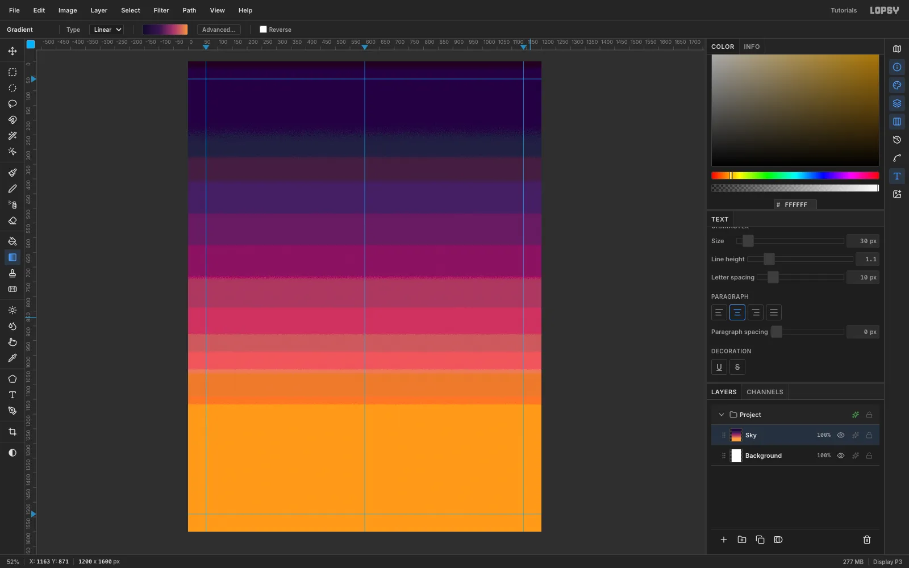

A smooth gradient looks digital. Choose **Filter → Posterize…**, set
**Levels** to **9** and apply. The sky breaks into flat bands, like a
limited run of spot inks. The dithered edges between bands help the print
feel, so leave them.

## Make a starfield with Noise and Threshold

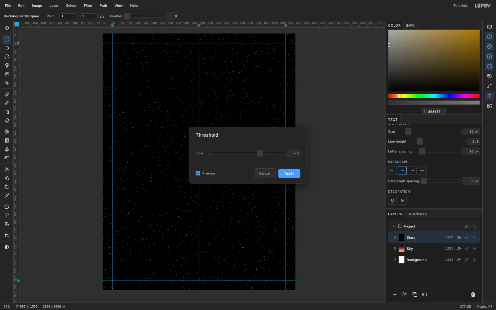

Add a layer called *Stars* and fill it with mid-grey `#808080`
(**Edit → Fill** with nothing selected).

1. Choose **Filter → Add Noise…** with **Amount 100**, **Mono** and
   **Gaussian**.
2. Choose **Filter → Threshold…** at **173**. Only the brightest noise
   survives, which gives you about half a percent of white specks.

Set the layer's blend mode to **Screen** so the black disappears.

## Fade the stars and add sparkles

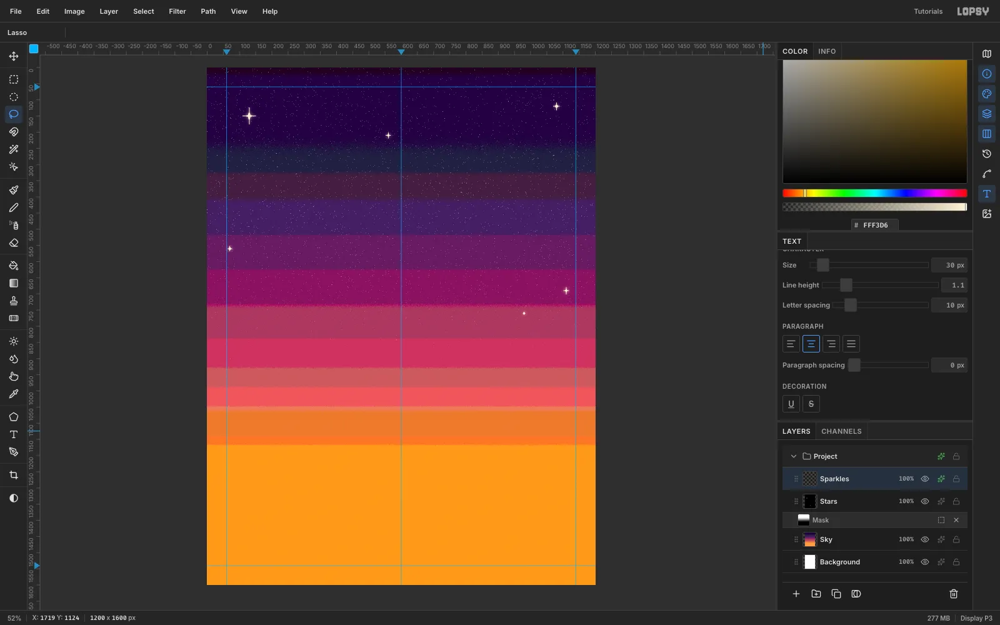

Stars shouldn't show near the glowing horizon:

1. Click **Add Mask** on *Stars*, then click the mask thumbnail to edit it.
2. Drag a white-to-black **Linear** gradient from about 450 on the left ruler down to about 1000, a little above the middle of the page to a little below it.

Add a layer called *Sparkles*. With the **Lasso**, draw a few thin
four-point stars and fill them with cream `#FFF3D6`. Give the layer an
**Outer Glow** in the same cream (Size 14, Opacity 70).

## Build the planet and its craters

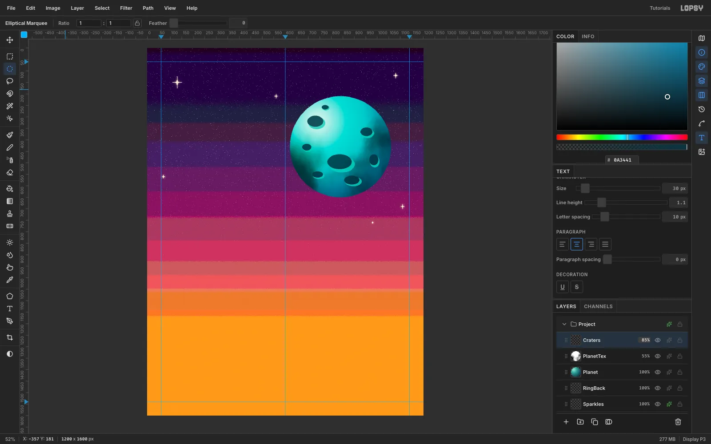

Add *RingBack* (leave it empty for now), then *Planet*:

1. **Elliptical Marquee** a circle about 440 px across in the upper right, [[Cmd]]-dragging to keep it round. Leave a little space between it and the right guide.
2. Fill it with a **Radial** gradient from `#9BF0DC` through `#2FA39A` and
   `#124A5E` to `#081028`, dragged from the upper-left of the circle so the
   light comes from there.
3. On a *PlanetTex* layer, select the same circle and run
   **Filter → Clouds** (Scale 6). Set it to **Overlay** at **55%** for
   weather.

For craters that catch the light, work on a *Craters* layer. Fill each crater
ellipse with light teal `#5CCFBE`. Then fill a slightly smaller dark ellipse
`#0A3441`, shifted up and to the left. That leaves a bright crescent on the
lower-right rim, the wall that faces the light.

## Shade the night side

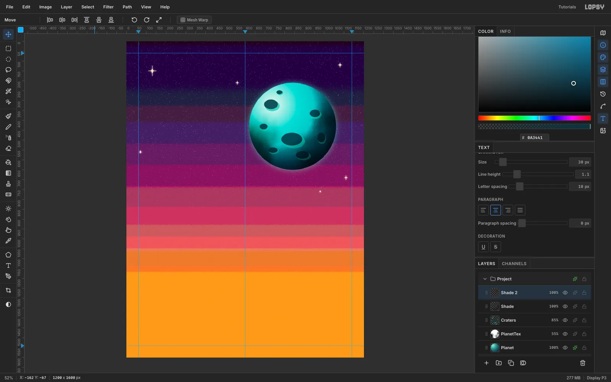

Add a *Shade* layer. Select the planet circle again and drag a **Radial**
gradient of `#050818`, transparent up to about 42% and 95% opaque at the
edge. Start from the lit upper-left and drag toward the lower-right. Set it
to **Multiply**.

One pass is too gentle, so **Layer → Duplicate Layer** it. The copy lands
exactly on top and doubles the shadow.

Finally, give *Planet* an **Outer Glow** in `#6FF0D8` (Size 44, Opacity 55).

## Draw the rings in two halves

A ring passes behind the planet at the top and in front of it at the bottom.
Draw it twice:

1. On *RingBack* (below the planet), fill a flat ellipse about 600 × 150 px, centred on the planet, with
   `#F4C77E`. Choose **Select → Shrink…** by 22 px and press
   [[Delete]]. Add a thin inner ring in `#E8795A` the same way.
2. Add *RingFront* above the shade layers and draw the identical rings.
3. On *RingFront*, marquee the top half of the ring and press [[Delete]].

Only the front half is left on top of the planet.

## Tilt both rings together

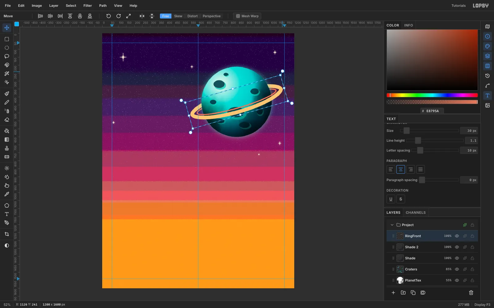

Rotate both ring layers at once so they turn around the same centre. Click
*RingBack* and [[Cmd]]-click *RingFront* so both are selected, press
[[Cmd+D]] so nothing is marqueed, and switch to the **Move** tool. One box
frames the whole ring. Drag just outside a corner handle to rotate about
**−16°**, then press [[Cmd+D]] to commit.

## Build a chrome flying saucer

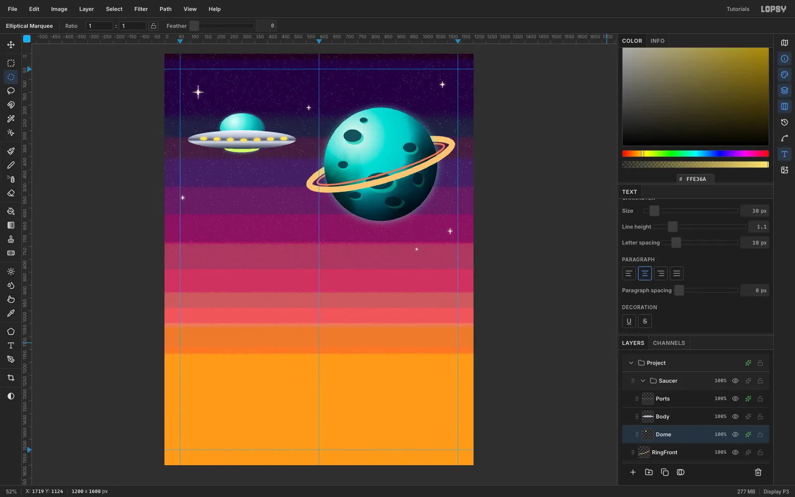

Create a group called *Saucer* and three layers inside it:

- **Dome:** a 170 × 116 ellipse with a radial gradient from `#E6FFF8` to
  `#0C4660`. Add a lime ellipse `#D9FF7A` under where the body will sit for
  the engine glow.
- **Body:** a 420 × 72 ellipse with a vertical chrome gradient:
  `#F4F7FF`, `#AEB6CC`, a dark band `#4E546C` at 50%, `#D9DEEA`, then
  `#2A2E42`.
- **Ports:** seven small `#FFE36A` ellipses along the rim, with an
  **Outer Glow** in the same yellow.

Give *Dome* a soft cyan Outer Glow too.

## Merge and tilt the saucer

Click *Dome* and click **Rasterize Layer Style**, so its glow stays round
the dome. Then click *Ports* and choose **Layer → Merge Down**, and do the
same on *Body*. Merging bakes the port glows into the pixels, so the saucer
turns as one piece.
Rename the result *UFO*. Marquee it with a little room to spare, then rotate
it **−12°** with the Move tool and press [[Cmd+D]].

## Add the landscape and the drive-in screen

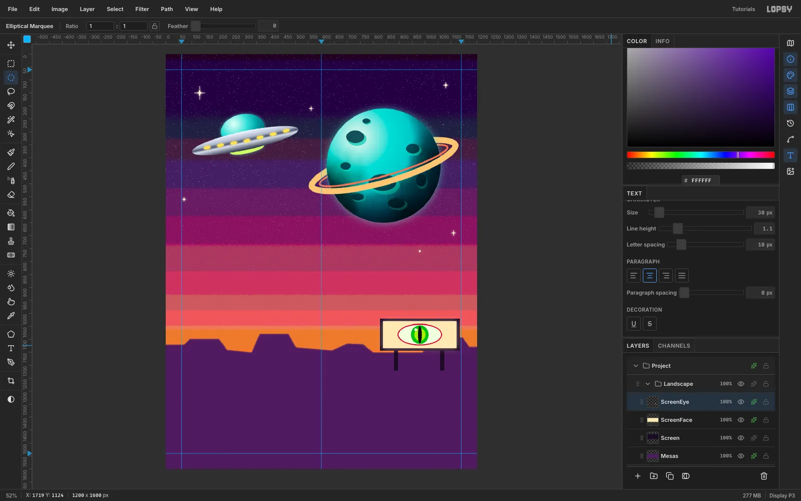

Make a *Landscape* group and drag it above *Saucer* in the Layers panel.

1. **Mesas:** lasso a flat-topped mesa skyline from the horizon down to the
   bottom of the page. Fill it with `#4B1E5E` and add an orange **Inner
   Glow** (`#FF9A4A`, Size 7) to rim-light the tops.
2. **Screen:** on the right, just above the horizon, marquee a wide frame about 308 × 124 px and two posts under it, and
   fill them with ink `#1A0B24`. On *ScreenFace*, fill a cream panel
   `#FFE9B8` inside it and give it a soft Outer Glow.
3. **The movie:** on *ScreenEye*, stack ellipses to paint an alien eye:
   pale sclera, green iris `#3FBF3A`, a lighter inner ring `#B8F020`, a
   black slit pupil and a white glint. Give it a red **Stroke** of 4 px.

## Park the cars with copy and paste

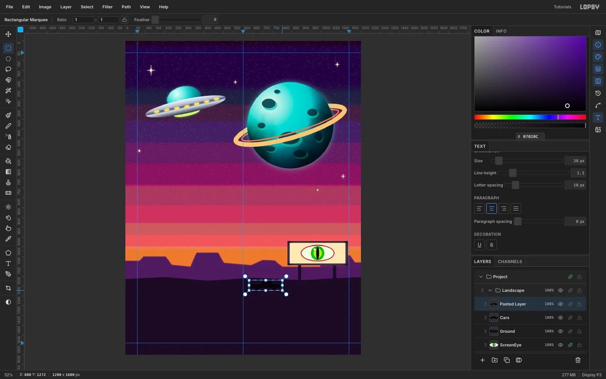

Add a *Ground* layer (a lassoed band in `#1A0B24`) and a *Cars* layer. Lasso
one tail-finned sedan silhouette in near-black `#07020C` and add two round
wheels.

Marquee the car, press [[Cmd+C]] and then [[Cmd+V]]. The paste lands in
place on a new layer above. Drag it into the next spot with the **Move**
tool, press [[Cmd+D]], and **Merge Down**. Repeat for a third car.

## Rim-light the silhouettes

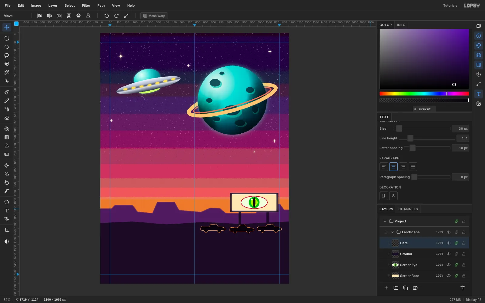

Black cars on dark ground disappear. Give *Cars* a 2 px **Stroke** in
`#FF9A4A` so the sunset catches their edges. You'll lift them onto the
horizon line in the last step.

## Lift a car into the sky

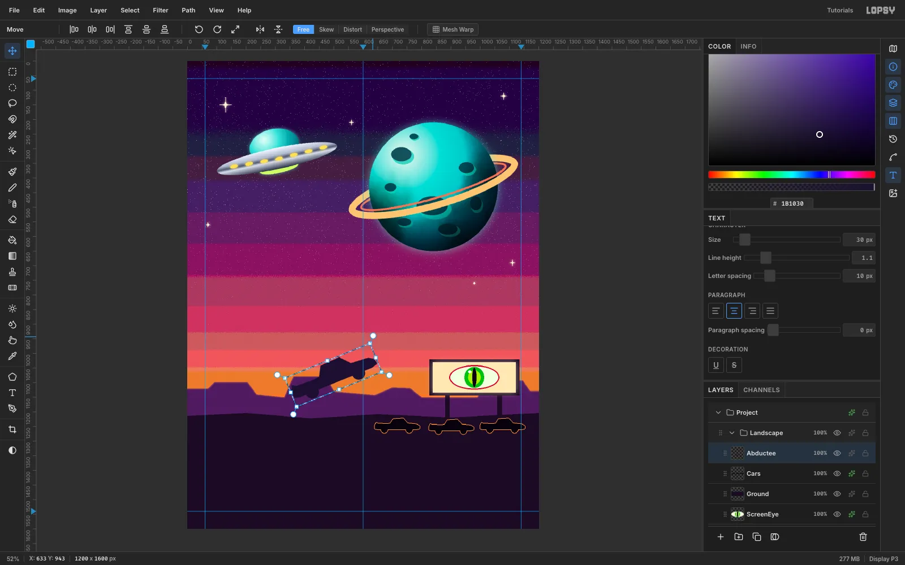

On a new *Abductee* layer, draw the same car at almost twice the size. Keep
it under the saucer, about halfway between the saucer and the ground, in the
left part of the page. Rotate it **−22°** so it tips nose-up, and press
[[Cmd+D]]. Add a pale green **Inner Glow** (`#D9FF7A`, Size 8) so the beam
seems to light its edges.

## Fire the tractor beam

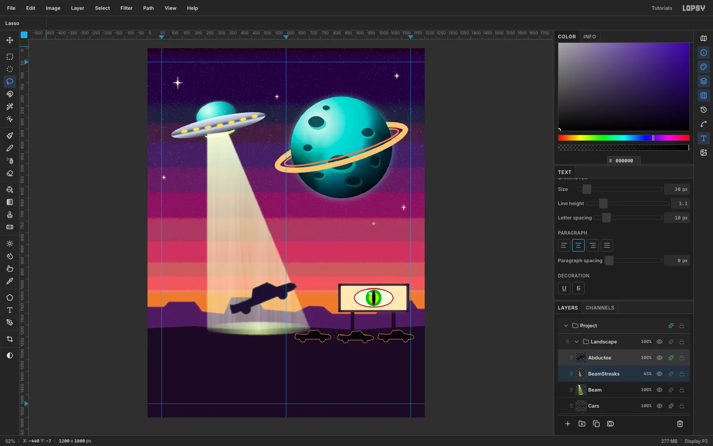

On a *Beam* layer:

1. Lasso a cone from the saucer's underside down to the ground, widening to
   about 450 px across at the bottom.
2. Fill it with a **Linear** gradient from `#F6FFC0` at 95% opacity to
   `#B8FF5A` at 25%.
3. Add a radial glow ellipse where it hits the ground.
4. Run **Gaussian Blur** at 6 px and set the layer to **Screen**.

For light streaks, add *BeamStreaks*. Fill the same cone with black, then
run **Filter → Fibers** (Variance 30, Strength 40) and **Motion Blur**
(Angle 78, Distance 40) along the beam. Set it to **Screen** at **45%**.

Drag *Abductee* above both beam layers so the car stays a crisp silhouette.

## Set the title

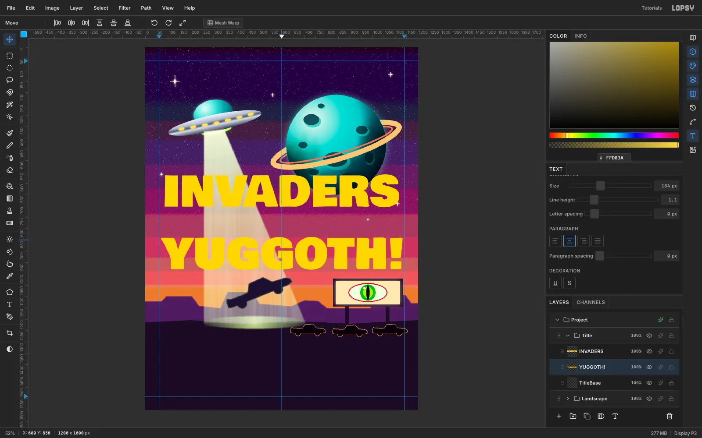

Create a *Title* group and drag it above *Landscape*. Add a raster layer
*TitleBase* inside it, and keep it active whenever you create new text.

With the **Text** tool, set **Bowlby One SC** at **184 px** in `#FFD83A`.
Set **Letter spacing** to 0 in the Text panel. Type `INVADERS`, and in a
separate layer, `YUGGOTH!`.

Centre both lines on the middle guide with the **Move** tool (**Align center
horizontally** in the options bar does it in one click):

- INVADERS: its tops about a third of the way down the page, just below the planet
- YUGGOTH!: about 275 px lower, leaving a gap between the lines for the word *from*

## Make the title recede in perspective

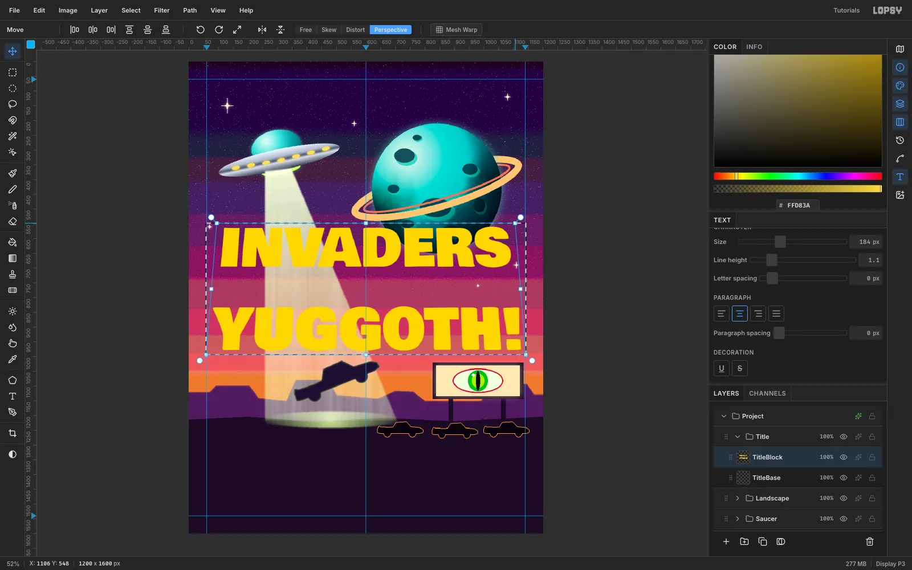

1. Merge *INVADERS* down onto *YUGGOTH!*. Merge Down turns the text into
   pixels. Rename the result *TitleBlock*.
2. Marquee the whole block. Switch to **Move**, click **Perspective** in the
   options bar, and drag the top-right corner inward about 36 px.

The top-left corner follows symmetrically, and INVADERS foreshortens as if
it were further away. Press [[Cmd+D]] to commit.

## Ink and extrude the title

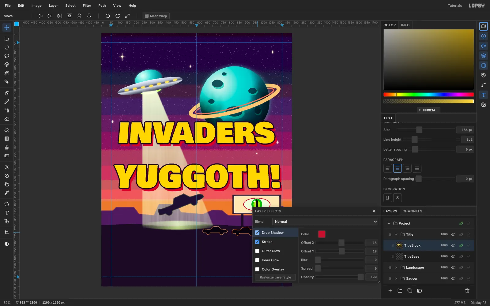

Style the merged block once so both lines match:

- **Stroke:** `#1A0B24`, Width **7**
- **Drop Shadow:** `#C8102E`, Offset X **7**, Offset Y **12**,
  Blur **0**, Spread **0**, Opacity **100**

A hard shadow offset well past the outline reads as a chunky extrusion.

## Tuck in the script "from"

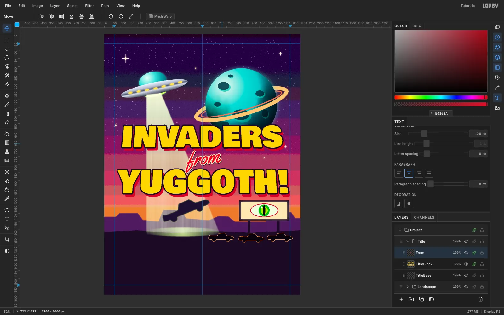

With *TitleBase* active, type `from` in **Yellowtail** at **120 px** in red
`#E0102A`. Centre it on the middle guide, in the gap between the two title lines.

Then:

1. **Rasterize** it.
2. Add a cream **Stroke** (`#F4E6C0`, 5 px) and a small hard ink **Drop
   Shadow**.
3. Rotate it **−8°**.
4. Drag it above *TitleBlock* in the Layers panel.

Always rasterize text before you rotate it. That bakes the angle into the
pixels, so a later edit can't straighten it again.

## Add a Shock-O-Scope starburst

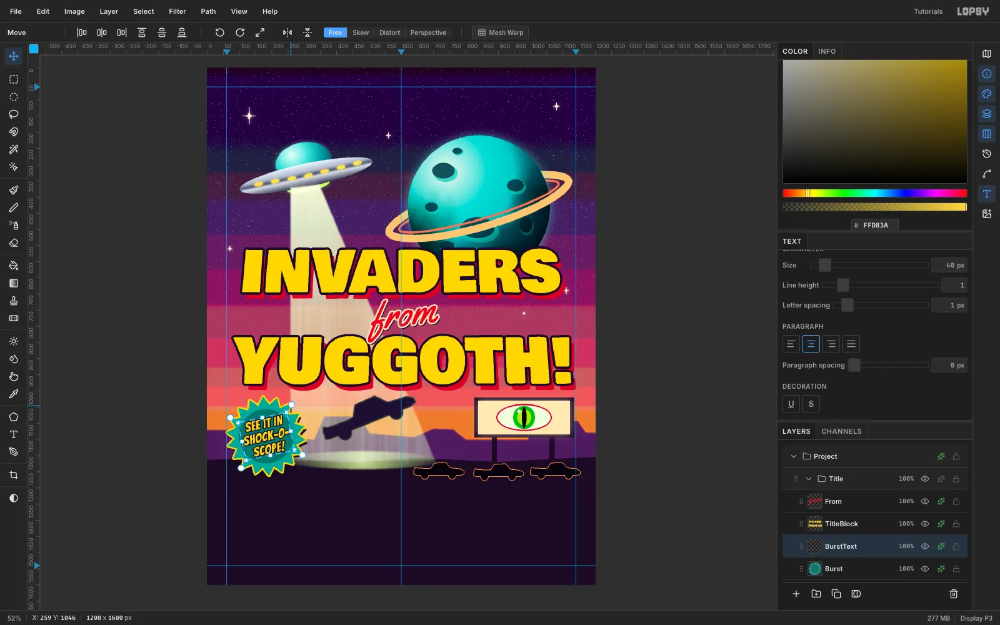

On a *Burst* layer under the title, lasso an 18-point star in the lower left,
between the left guide and the beam:

- Drag round a centre through 36 corners and let go back at the start, alternating between about 122 px out for the tips and about 96 px out for the notches. Short, blunt points read as a price-sticker burst
- Fill `#1FA59A`, with a darker `#14786F` disc in the middle
- Yellow Stroke (5 px) and a hard ink Drop Shadow

Keep the points clear of YUGGOTH's red shadow.

Drag an area text box and type `SEE IT IN / SHOCK-O- / SCOPE!` on three
lines in **Bangers** 40 px, centre-aligned, in `#FFD83A`. Move it until it's
centred on the disc. Then **Rasterize** it, add a 3 px ink Stroke,
and rotate it **−12°**.

## Set the top line and the info block

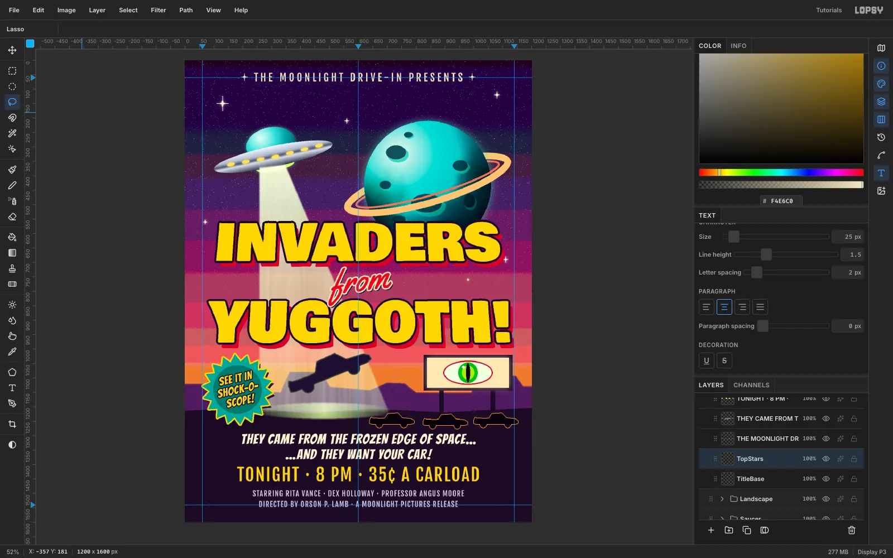

Use centre-aligned area text boxes that span the safe zone, from the left guide to the right one:

- **Top line:** **Fjalla One** 36 px, letter spacing 8, in `#F4E6C0`,
  flanked by two small lassoed stars.
- **Tagline:** **Bangers** 48 px, letter spacing 2, in cream, two lines.
- **Showtime:** `TONIGHT · 8 PM · 35¢ A CARLOAD` in **Fjalla One** 60 px,
  letter spacing 4, in title yellow.
- **Credits:** Fjalla One 25 px, letter spacing 2, two lines.

Start each new box in clear space. Space the blocks evenly, about 24 px apart, and keep the last line above the bottom
guide.

## Screen-print the sky with halftone

Duplicate *Sky* as *SkyDots*. Run
**Filter → Halftone…** with Dot Size **12**, Angle **45** and Softness
**1**, then set it to **Multiply** at **30%**. The dots read as coarse
printing without fighting the art.

## Age the paper

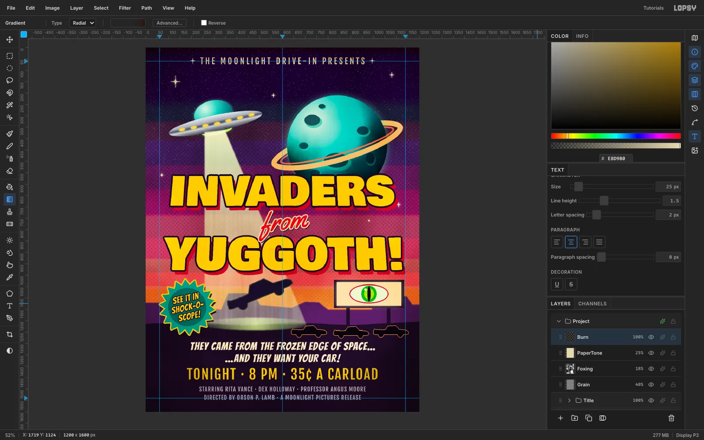

Stack these layers at the very top of the document, above the *Title* group:

1. **Grain:** mid-grey fill, **Add Noise** 30 (Mono, Uniform), **Overlay**
   at **40%**.
2. **Foxing:** **Filter → Clouds** (Scale 4), **Overlay** at **18%**.
3. **PaperTone:** fill with cream `#E8D9B0`, **Multiply** at **25%**.
4. **Burn:** a **Radial** gradient from the centre outward, transparent to
   62% and then `#2A1004` at 60% at the edges, set to **Multiply**.

## Fold it

Folds cross at the centre of the page. On a *Creases* layer, draw two 4 px
**Brush** lines in black, one down the page just right of the centre guide
and one across it just below the halfway point. Draw two in white a few
pixels to the left of and above them. Click at one end and [[Shift]]-click
the other to keep each line dead straight. Run **Gaussian Blur** at 2 px and
set the layer to **Soft Light** at **55%**. It looks as if the flier spent a summer folded in quarters.

## Refine the layout

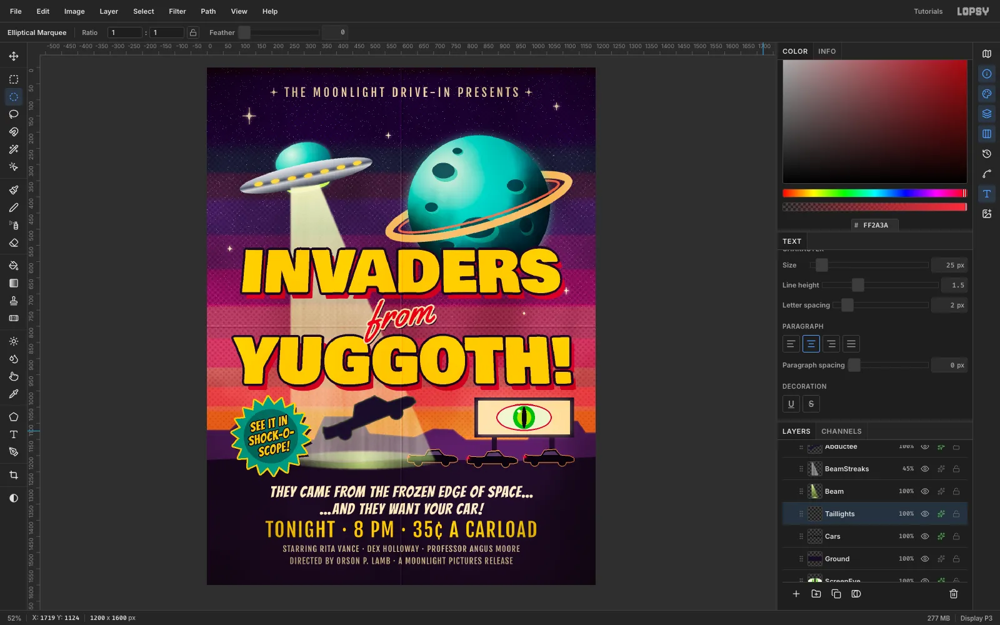

Step back and check every element against the guides:

- **Top line and stars:** nudge them down until their caps sit inside the
  top guide, about 18 px.
- **Badge:** nudge both layers about 15 px right.
- **Showtime and credits:** nudge them up a few pixels so the credits end
  just inside the bottom guide.
- **Credits colour:** add a cream `#E2D3AA` **Color Overlay** so they read
  on the dark ground.
- **Cars:** move them up about 40 px onto the horizon, so they read as silhouettes
  against the mesas. Lasso a purple `#4A3560` window into each. On a
  *Taillights* layer, add red `#FF2A3A` dots with a red Outer Glow.

With the **Move** tool, arrow keys nudge 1 px and [[Shift]]+arrow keys
10 px, which makes these small moves exact.

Hide the guides with **View → Show Guides** and export with
**File → Quick Export PNG**. Choose **File → Save Project** too, to keep every
layer editable.
