This poster is a photo collage of three photos: a raccoon's head on a kung
fu fighter, in front of an ancient stone temple on Wudang Mountain. A
raccoon's natural mask makes him a born superhero. Cutting the pieces out is
the easy part. Most of the steps here are about making them look like one
photo: matching scale and light, shadows that touch the ground, haze
between near and far, and a single muted teal-and-amber grade over
everything, like *The Dark Knight* and the Avengers posters.

Download the three photos first:

- **The temple:** a Wudang Mountains ruin from the
  [ChinaHeritaQA dataset](https://github.com/boleima/ChinaHeritaQA)
  (`DATA/Images/Image_data/Ancient_Building_Complex_in_the_Wudang_Mountains/5182767886762148_5.jpg`).
- **The fighter:** a wushu athlete in a drunken-fist pose from the
  [KungfuAthlete project](https://github.com/NPCLEI/KungFuAthleteBot)
  (`docs/xyh_1.jpg`).
- **The raccoon:** the public-domain (CC0)
  [raccoon on Pixnio](https://pixnio.com/fauna-animals/raccoons/raccoon-procyon-lotor).

The temple and fighter photos come from research projects and aren't
licensed for commercial use. They're fine for practice. For anything you
publish, swap in your own or public-domain photos.

> **Tip:** When you pick your own photos, match the light. The subject
> should be lit from the same side as the background, and the head should
> face the camera at the same angle as the body you put it on.

## Set up the poster canvas

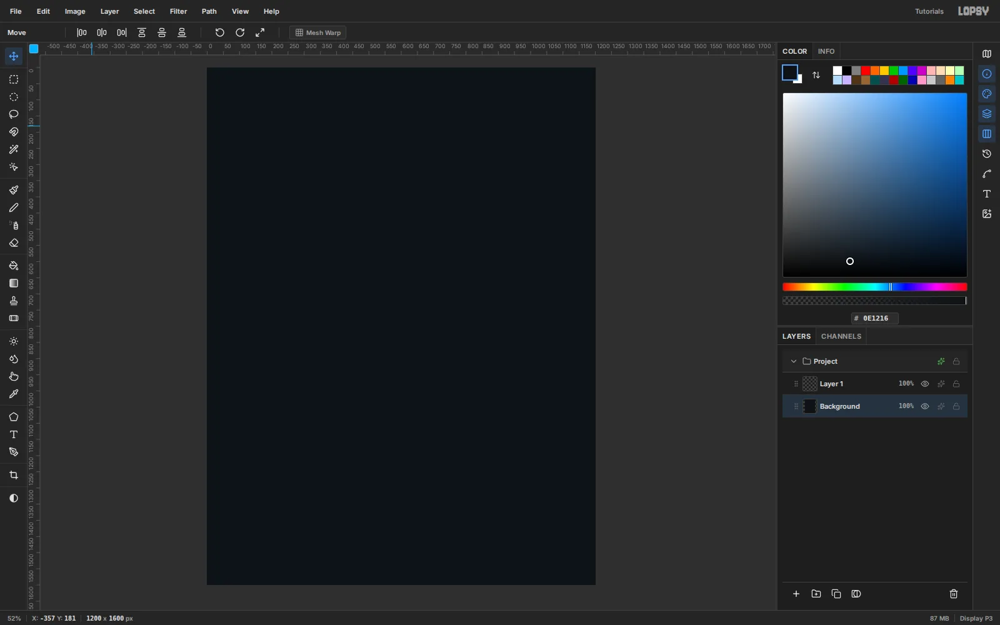

Choose **File → New**, enter **1200 × 1600** (a 3:4 one-sheet) and click
**Create**. Click the **Background** row, set the foreground to `#0E1216` and
choose **Edit → Fill**. The dark base shows through wherever later layers are
transparent, so the edges never flash white.

## Drop in the temple

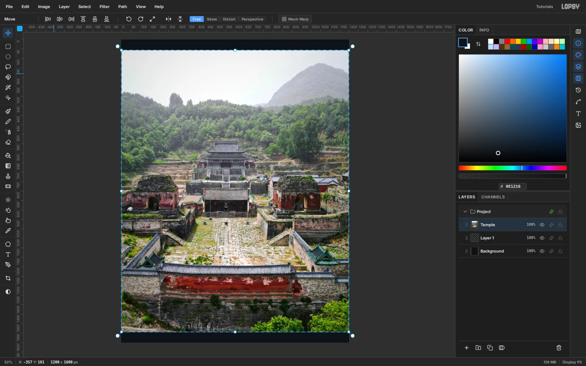

A new document comes with an empty **Layer 1**. Click it, then drag the
temple photo from your file browser onto the canvas. Lopsy adds the photo as
a new layer above the one you clicked. Because the photo is bigger than the
canvas, Lopsy shrinks it to fit (**1200 × 1488**) and switches to the
**Move** tool with transform handles ready. Double-click the layer name and
rename it **Temple**.

## Scale the temple into a stage

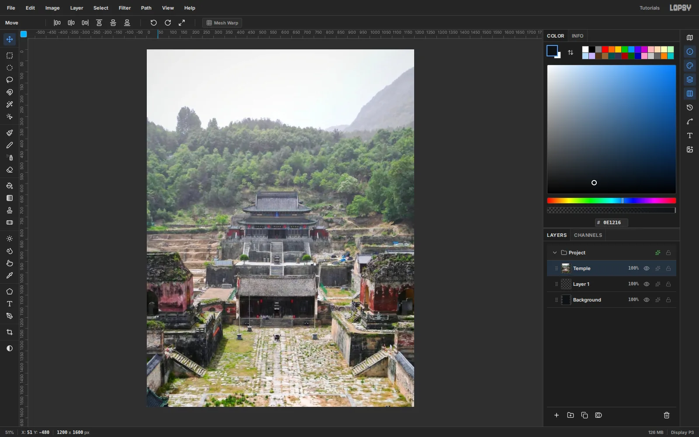

At the fitted size the courtyard is tiny, and anyone standing in it looks
like a giant hovering over the wall. Make the ground big enough to stand on.
Press [[Cmd+-]] twice to zoom out so you can reach the corners. Hold
[[Cmd]] (which keeps the proportions) and drag the bottom-right handle out
until the box is about **1800 × 2232**, 1.5 times the fitted size.

Now drag inside the box to move the photo **244 px left** and **138 px up**.
The **X / Y** readout in the status bar shows where the pointer is, so you
can measure the drag. The front of the courtyard should meet the bottom
edge, with the central hall in the middle of the poster. Press [[Cmd+D]] to
apply the transform (it also clears the selection), then [[Cmd+0]] to fit the
view.

## Brew a storm over the ridge

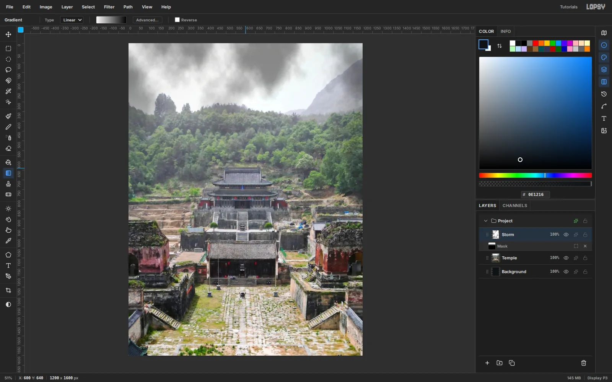

Select the empty **Layer 1** and click the trash can to delete it. Select
**Temple** and add a layer named **Storm**. Run **Filter → Clouds…** at
**Scale 5**. Clouds is always greyscale; click **Regenerate** until you like
the pattern. Then run **Filter → Brightness/Contrast…** with
**Brightness 30** and **Contrast −50**. That squeezes the clouds into
greys, so they darken the sky without going black. Set the blend mode to
**Multiply**.

Click **Add Mask**, then click the new mask thumbnail so you paint on the
mask, not the layer. Pick the **Gradient** tool, set a white-to-black linear
gradient in **Advanced…**, and drag from **y 200** down to **y 640**. The
storm stays in the sky and fades out before the forest.

## Cut out the fighter with the Lasso

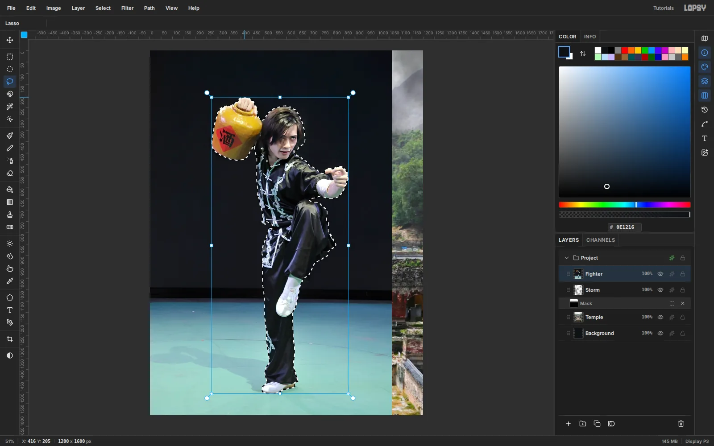

Select **Storm** and drop the fighter photo on the canvas. Rename it
**Fighter**. Press [[Cmd+D]] to clear the automatic selection, pick the
**Lasso** (L), and trace around him: the wine jar, the fist, the raised
knee, and down both trouser legs to the shoes. Zoom in for the fingers and
the gap under his knee.

Choose **Select → Feather…** at **1 px** to soften the cut, then
**Select → Inverse** ([[Cmd+Shift+I]]) and press [[Delete]]. Press
[[Cmd+D]].

> **Tip:** Keep the lasso a pixel *inside* the edge. A cut that grabs a
> sliver of the old backdrop leaves a halo that no grade will hide.

## Stand him on the temple steps

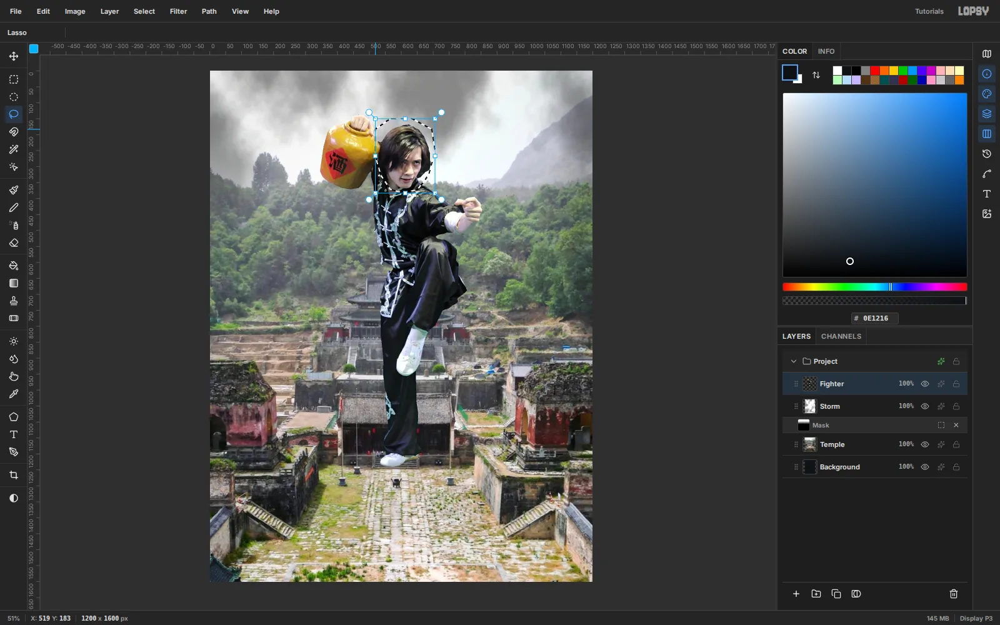

With **Move** (V), drag the fighter **28 px** right and **40 px** down.
[[Cmd]]-click the **Fighter** thumbnail to select his pixels, which gives
transform handles around just his body. [[Cmd]]-drag the bottom-right
handle in to **85%**, press [[Cmd+D]], and nudge him with the arrow keys
until his planted shoe rests on the hall steps at about **y 1240**. There it
sits in the photo's perspective, above where the title will go.

Now lasso around his hair and face, stopping at the top of the collar, and
press [[Delete]]. The raccoon's head will sit in that gap. His shoulders,
collar and the wine jar stay.

## Cut out the raccoon's head

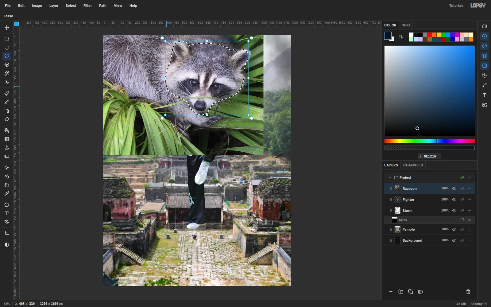

Select **Fighter** and drop the raccoon photo. Rename it **Raccoon**. Lasso
the head: both ears, the crown, the fluffy cheek ruffs and the white chin
under the nose. Leave the leaves under the chin outside the loop. Feather
**1 px**, then press [[Cmd+Shift+I]], [[Delete]] and [[Cmd+D]].

## Clone out the grass blade

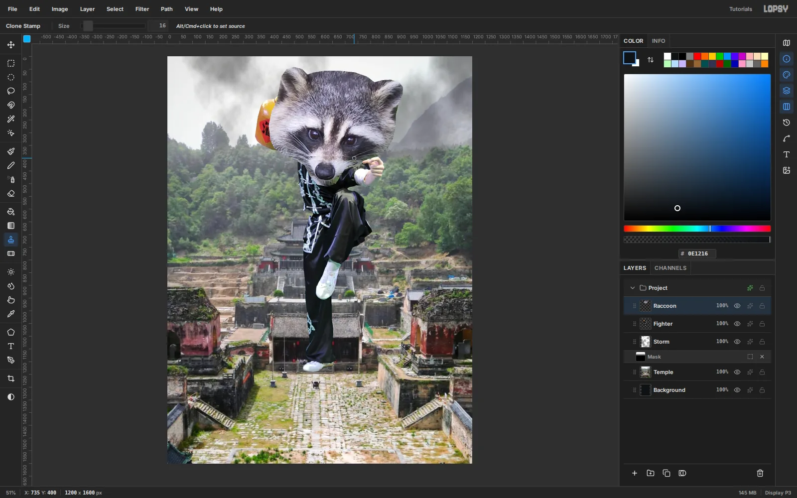

A blade of grass cuts across the raccoon's muzzle. Pick the **Clone Stamp**
(S) at **Size 16**, [[Alt]]-click the fur about **18 px** above the blade,
then paint along the blade in one stroke. The source moves with your brush,
so every dab copies the fur just above it.

> **Tip:** The **Healing Brush** is the usual tool for blemishes, but it
> matches the tone of whatever it covers. Over a green blade it leaves a
> green line. For a thin object in a different colour, clone instead.

## Seat the head on the collar

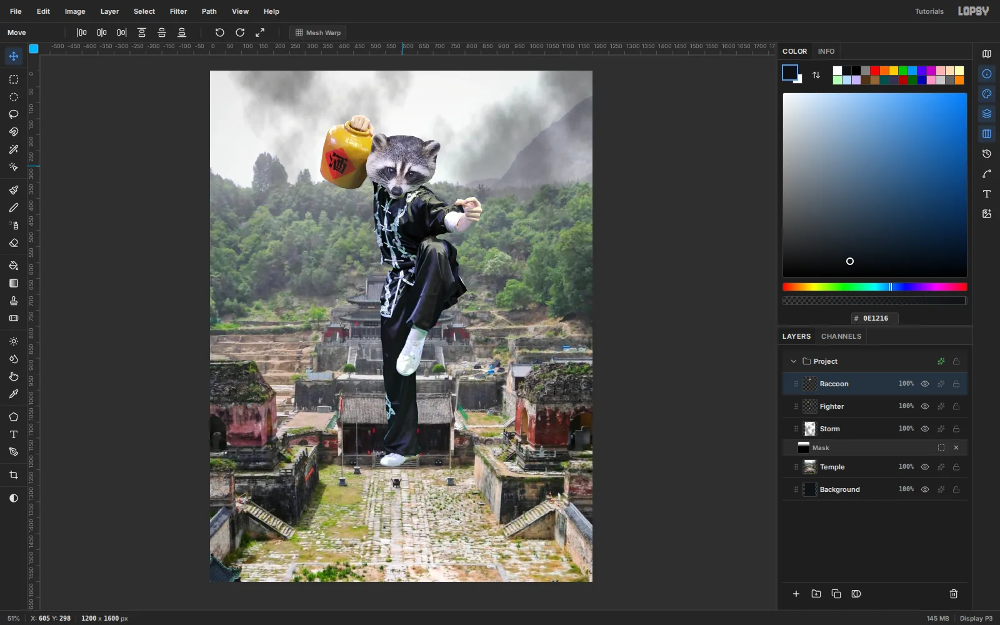

[[Cmd]]-click the **Raccoon** thumbnail to get handles around the head.
[[Cmd]]-drag the bottom-right handle in to **44%** of the photo's head,
about **233 px** wide. Drag it onto the collar, centred near
**(605, 298)**. The cheek ruffs and chin should overlap the collar, so there
is no gap at the neck. Press [[Cmd+D]].

## Match the head to the body

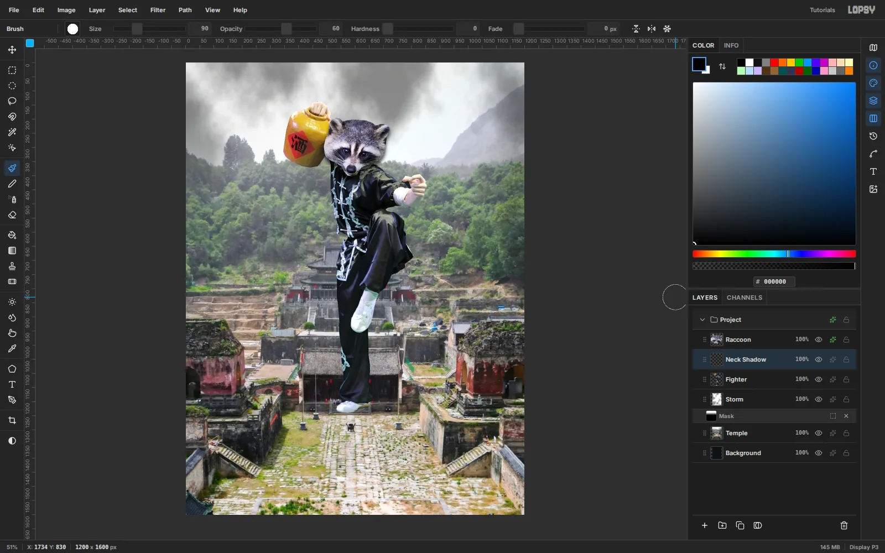

The raccoon was shot in flat daylight and the fighter under stage lights.
With **Raccoon** selected, run **Brightness/Contrast…** at
**Brightness −6**, **Contrast 12**. More than that and the fur turns
crunchy. Add a **Drop Shadow** (**Offset Y 10**, **Blur 18**,
**Opacity 70**).

Then select **Fighter**, add a **Neck Shadow** layer, and paint one stroke
along the collar just under the chin with a black **Hardness 0** brush at
**Size 90**, **Opacity 60**. Set it to **Multiply**. The collar now sits in
the head's shade.

## Drape a saffron kasaya

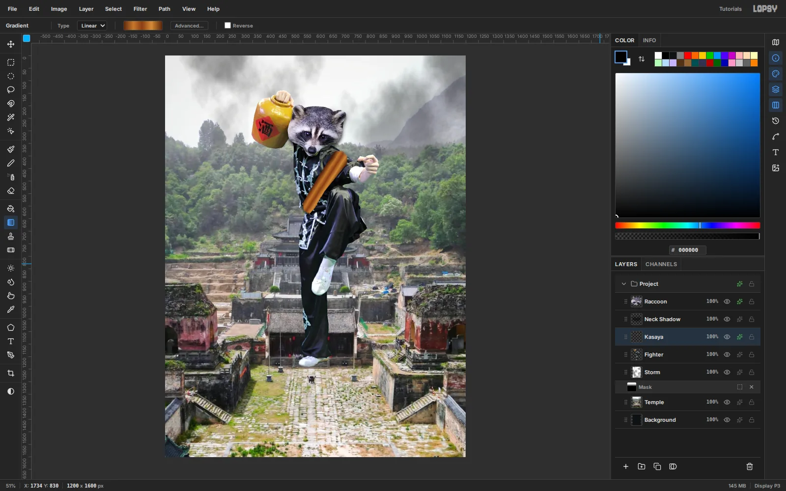

Select **Fighter** and add a **Kasaya** layer. Lasso a band about 50 px wide
from his left shoulder, around **(702, 387)**, down to his right hip at
**(566, 620)**. Set a five-stop linear gradient: `#5E250C`, `#C9772A`,
`#8A3A14`, `#D98A34`, `#5A230A`. Drag it a short way *across* the band,
from **(612, 489)** to **(665, 523)**. The stripes run the length of the sash
and read as creases in the cloth.

Run **Add Noise…** (**Amount 14**, **Mono**) and **Motion Blur…**
(**Angle 124**, **Distance 14**) for a woven texture. Then run
**Hue/Saturation…** with **Saturation −20**, so the orange doesn't shine
like brass. Deselect and add a **Drop Shadow** (**X −4**, **Y 6**,
**Blur 10**, **Opacity 60**).

## String the prayer beads

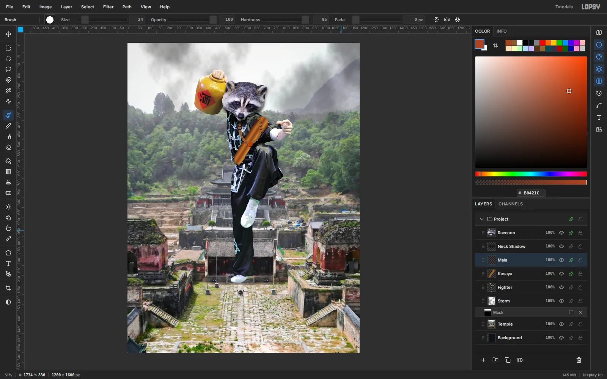

Add a **Mala** layer. Pick the **Brush** (B) at **Size 15**, **Hardness
95**, in light walnut `#8A5A30`. Beads darker than that disappear against
the black jacket. Click once for each bead around a U that starts at the
collar, dips to about **y 515**, and comes back up: 21 clicks. Add one
**Size 24** guru bead in `#B0421C` at the bottom of the loop.

Give the layer a pale **Inner Glow** (`#F7C98F`, **Size 5**,
**Opacity 70**) for a polished highlight, and a tight **Drop Shadow**
(**X 2**, **Y 4**, **Blur 5**, **Opacity 75**).

## Wrap the hands and shoes

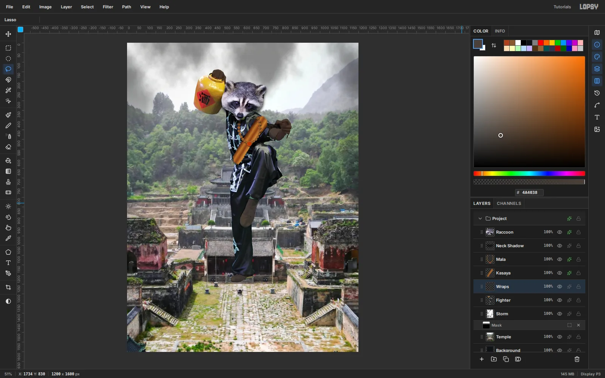

Pale human hands and white stage-lit trainers give the collage away. Select
**Fighter** and add a **Wraps** layer. Set the foreground to `#4A4038`.
Lasso each hand and each shoe, just inside the edge, and choose
**Edit → Fill** after each one. Then deselect and set the layer to
**Multiply**. Multiply keeps the knuckles and folds but turns them dark,
so the fists read as wrapped and the trainers as black cloth kung fu
shoes.

## Light the hero from behind

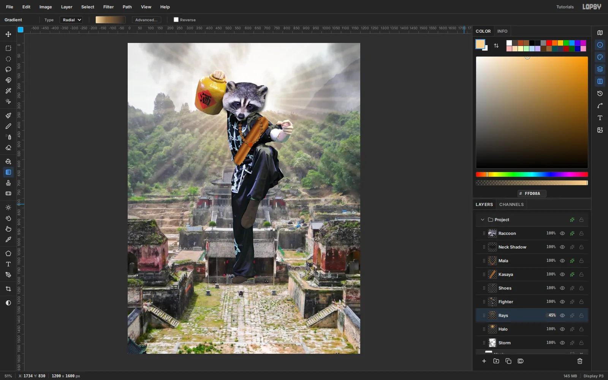

Superhero posters light the hero from behind. Select **Storm** and add a
**Halo** layer. Set a three-stop radial gradient: `#FFE0AE` at 0%,
`#F7A955` at **55%** opacity at the 35% mark, and `#F7A955` at **0%**
opacity at 100%. Drag it from the head, about **(605, 285)**, 480 px out.
Set the layer to **Screen**.

Add a **Rays** layer, set the foreground to `#FFD08A`, and run
**Filter → Sunburst…** with **Rays 44**, **Length 95**, **Width 30**,
**Fade 85**, **Softness 70**, **Jitter 35**, **Opacity 60**, and the centre
at **50%, 18%**. Set the layer to **Screen**. Then lower the layer's own
opacity to **45%**, which you can tune later without re-running the filter.

## Push the temple back and add a rim light

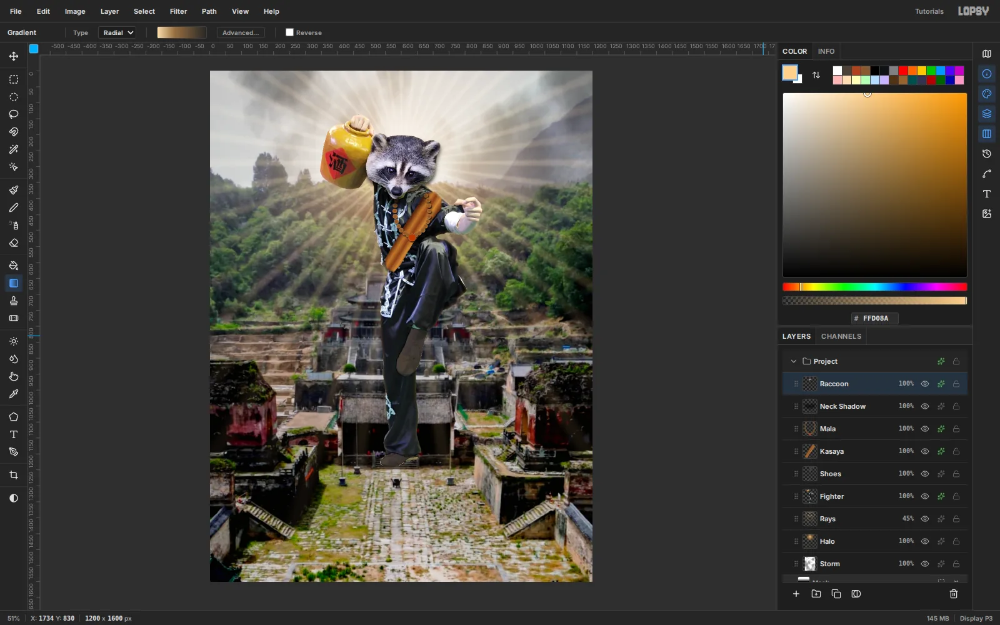

Select **Temple** and run **Gaussian Blur…** at **Radius 3**, then
**Brightness/Contrast…** at **Brightness −18**, **Contrast 10**. A slightly
soft, darker background reads as further away than the sharp fighter.

Backlight also wraps around a subject's edges. Give **Fighter** a warm
**Inner Glow** (`#FFB766`, **Size 14**, **Opacity 45**), and **Raccoon** the
same glow at **Size 10**, **Opacity 35**.

## Throw sparks into the air

Select **Raccoon** and add a **Sparks** layer. With a **Hardness 100** brush
in `#FFC166`, click about 45 dots of **6–13 px** on both sides of the
fighter, from his feet up to his shoulders. Space them further apart
higher up. Run **Motion Blur…** at **Angle 80**, **Distance 8** to streak
them upward. Add an orange **Outer Glow** (`#FF6A1A`, **Size 10**,
**Opacity 90**) and set the layer to **Screen**.

Last, click **Rasterize Layer Style** at the bottom of the layer effects
drawer to bake the glow into pixels. Live effects are redrawn every frame,
and the poster has plenty of them.

## Ground the fighter in the scene

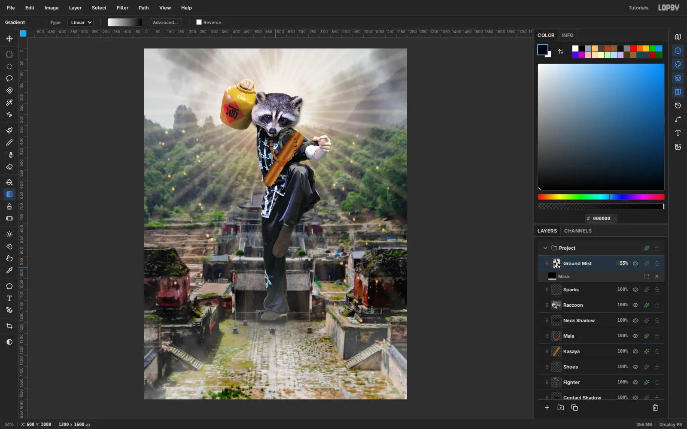

Three things make him stand *in* the courtyard rather than on top of it:

- **Haze in the distance:** select **Temple**, add a **Haze** layer, fill it
  with `#8FA3B3` and set it to **Screen** at **22%**. Add a mask and drag a
  white-to-black gradient on it from **y 300** down to **y 1250**. Far
  things turn paler and bluer, while the steps at his feet keep their
  contrast.
- **Contact shadow:** select **Rays** and add a **Contact Shadow** layer set
  to **Multiply**. Use a **Hardness 0** black brush: one wide pass at
  **Size 240**, **Opacity 40** under both feet, then a tight pass at
  **Size 60**, **Opacity 85** right under the planted shoe.
- **Ground mist:** select **Sparks** and add a **Ground Mist** layer. Run
  **Clouds…** at **Scale 6** and set it to **Screen**. Add a mask and drag a
  white-to-black gradient on it from the bottom edge up to **y 1000**, then
  set the layer to **55%**.

## Set the title block

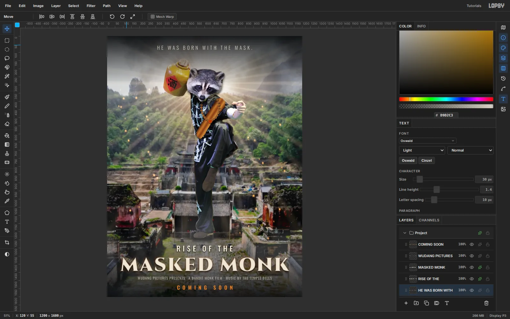

Select **Ground Mist** and add a **Title Shade** layer. Set a gradient from
`#05070A` at 92% opacity to fully clear. The gradient tool fills the whole
layer, so fence each band with a marquee first. Marquee the bottom
**420 px** and drag from the bottom edge up to **y 1180**. Then marquee the
top **300 px** and drag from the top edge down.

Type each line with the **Text** tool. The options bar edits whichever text
layer is active, so click **Title Shade** in the Layers panel before you set
up each new line. Work from the bottom up, so a click never lands inside an
earlier text box. Set the letter spacing in the **Text** panel, then centre
each line on x 600 with **Move** and the arrow keys:

- `COMING SOON`: Oswald SemiBold 32, spacing 16, `#D9843A`, centred on
  **y 1542**.
- `WUDANG PICTURES PRESENTS · A BANDIT MONK FILM · MUSIC BY THE TEMPLE BELLS`:
  Oswald 22, spacing 2, `#B8B0A2`, on **y 1484**.
- `MASKED MONK`: Cinzel Black 116, spacing 6, `#EFE7D6`, on **y 1400**. Add
  an **Inner Glow** (`#4A4038`, **Size 6**, **Opacity 75**) for a
  stamped-metal edge, an **Outer Glow** (`#FF8A2A`, **Size 26**,
  **Opacity 40**), and a **Drop Shadow** (**Y 6**, **Blur 14**,
  **Opacity 85**).
- `RISE OF THE`: Oswald Medium 44, spacing 14, `#F2EADA`, on **y 1304**, with
  a **Drop Shadow** (**Y 3**, **Blur 10**, **Opacity 95**).
- `HE WAS BORN WITH THE MASK.`: Oswald Light 30, spacing 10, `#D9D2C3`, on
  **y 70**.

## Grade it like a blockbuster

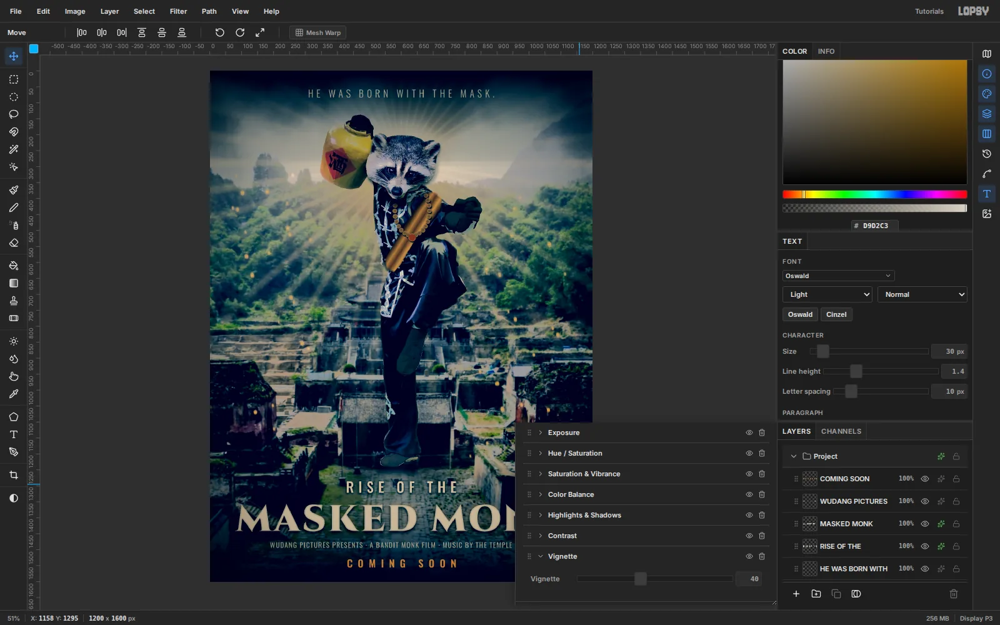

A single grade over every layer is what makes three photos read as one
film still. Choose **Layer → Adjustment Layer…** to open the document's
adjustment stack. It already holds four nodes that do nothing yet:
**Levels**, **Curves**, **Exposure** and **Hue / Saturation**.

1. **Levels:** expand it and drag the input black handle to **14** and the
   white handle to **242**. That sets a firm black point, so the image isn't
   milky.
2. Click **Add Adjustment** → **Saturation & Vibrance**: Saturation **−40**,
   Vibrance **6**. Muted colour is the core of the look.
3. **Color Balance:** on the Shadows tab, Cyan–Red **−18** and Yellow–Blue
   **+12**. On Midtones, Cyan–Red **−4**. On Highlights, Cyan–Red **+12**
   and Yellow–Blue **−12**. That gives steel-teal shadows and warm
   highlights.
4. **Highlights & Shadows:** Highlights **−30**, to tame the sky.
5. **Contrast:** **22**.
6. **Vignette:** **40**, to pull the eye to the hero.

Leave Curves, Exposure and Hue / Saturation as they are.

> **Tip:** Toggle the eye on each node to compare before and after. If the
> sash or the wraps go muddy, ease Color Balance before you touch
> saturation.

## Finish with film grain

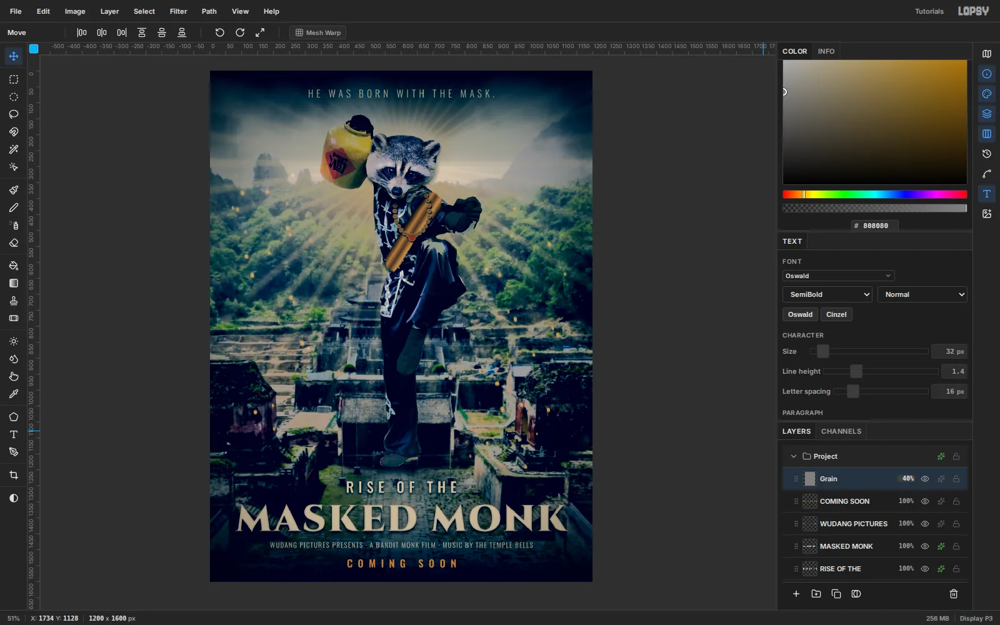

The three photos each have their own noise. One grain layer on top gives
them the same texture. Close the adjustments drawer, select the topmost
layer (**COMING SOON**) and add a **Grain** layer. Fill it with `#808080` and
run **Add Noise…** with **Amount 28**, **Mono** and **Gaussian**. Set it to
**Overlay** at **40%**. Export with **File → Quick Export PNG**.

> **Tip:** Save a `.lopsy` project as well. The Wraps, Neck Shadow and
> Contact Shadow layers are the ones to revisit if you swap in a different
> head or body.
