In the early 1960s, the space race was on every newsstand. Mass-market paperbacks sold for 35 or 40 cents, and their covers promised the future in a very particular style. Finned rockets climbed through dusk skies. Ringed planets hung over cities of saucer-topped towers and swooping "Googie" arches. Everything was painted in flat gouache and printed on cheap paper with a visible dot screen. Today that look is called **retro-futurism**: the future as people imagined it sixty years ago.

In this tutorial you'll design a cover for an imaginary novel, *Kestrel Nine*, from an imaginary imprint, Comet Line Books. Nearly every shape is a selection filled with a flat colour, so the main skill is building selections. You'll draw a shape, then Shift-drag to add to it, Alt-drag to subtract and Shift+Alt-drag to intersect. Along the way you'll also use:

- **Gradients**, including one painted into a **layer mask**.
- **Noise and Threshold** to make a starfield.
- The **Move tool's rotate handle**, on a selection and on a **whole group at once**.
- **Copy, paste, scale and Merge Down**.
- The **Pen tool** with **Stroke Path**.
- **Define Pattern** and **Fill with Pattern** for rows of lit windows.
- **Effects:** Drop Shadow and Outer Glow.
- **Halftone** and **Add Noise** for the printed finish.

The fonts are free Google Fonts that come with Lopsy:

- **Righteous**, a rounded 1960s display face, for the title, NINE, the author and the hull number
- **Federo**, a slim Art Deco sans, for the imprint and price
- **Yellowtail**, a 1950s brush script, for the tagline

The palette:

- Dusk sky `#0F2236` → `#1C4A57` → `#2C7A78` → `#5B9A8C` → `#A9BC9C` → `#F0B98A` → `#EFA07E` → `#F6D3A2`
- Navy ink `#13283A`, hull navy `#172636`
- Hull cream `#F3E6C8` / `#FFF9EC` / `#D9C29A` / `#B59873`
- Rocket coral `#E2714E` / `#B9473A` / `#8E3333`, rule coral `#DD6748`
- Planet ochre `#E0A24E` / `#C47838` / `#8E4628`, bands `#A3532E`, highlight `#F4CD8A`
- Ring `#F1E2C0` / `#D8A867`, ring division `#9C6A3C`
- Title gold `#EDB24C`, window gold `#F4C65E`
- Flame `#D9503A` / `#F39A42` / `#FFE08A`
- Porthole brass `#E0A93E`, glass `#2F7C7A`

> **Tip:** Keep the **Info** panel open. It shows the cursor position in document pixels, which makes "about 200 px from the top" easy to hit.

## Create a 1600 × 2400 document

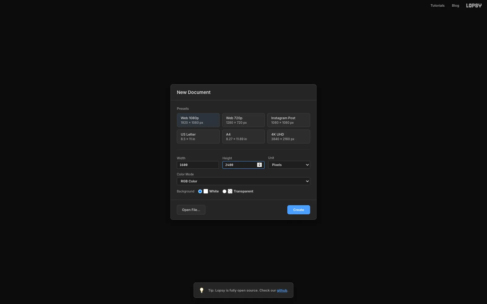

Open [Lopsy](/). In the **New Document** dialog, set **Width** to `1600` and **Height** to `2400` pixels and click **Create**. That's a 2:3 portrait page, close to a mass-market paperback.

## Add guides and turn off guide snapping

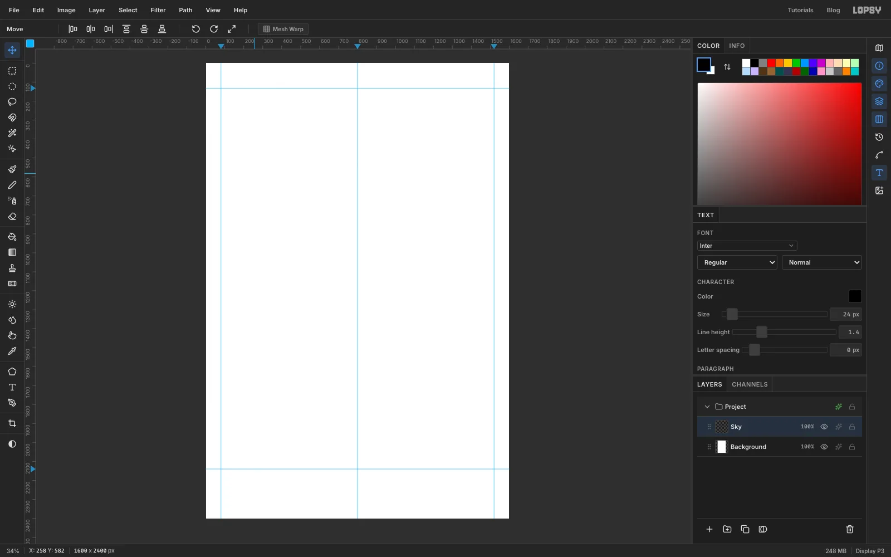

First rename **Layer 1** to *Sky* by double-clicking its name. Guides mark the margins and the two bands of the cover's "trade dress". Click on the top ruler to add vertical guides at about `80`, `800` (the centre) and `1520`. Then click on the left ruler to add horizontal guides at `132` (the bottom of the top band) and `2140` (the top of the bottom band).

Then open the **View** menu and untick **Snap to Guides**. You'll draw lots of small marquees close to these guides later, and snapping would pull their edges onto the guide lines.

## Paint the dusk sky

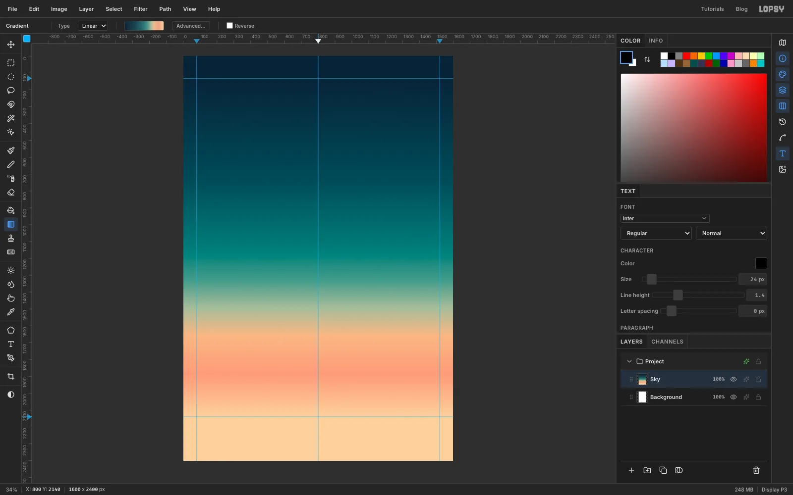

With *Sky* selected, pick the **Gradient** tool, set **Type** to **Linear** and click **Advanced…**. Click on the gradient bar to add stops until you have eight. Then give them the dusk-sky colours from the palette, at positions of about 0, 30, 50, 60, 68, 76, 88 and 100%.

Drag from the top guide straight down to the bottom guide. The pale sage stop between the teal and the peach matters: without it, a blend from teal to salmon passes through a dull grey.

## Make a starfield from noise

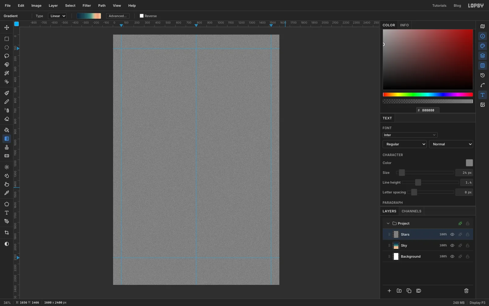

Add a layer called *Stars* and fill it with `#808080` (**Edit → Fill**). Run **Filter → Add Noise…** with Amount `100`, **Mono** and **Gaussian**. Gaussian noise piles most pixels up near the middle grey, so only a few land near white. Those few will be your stars.

## Threshold the stars and add a few bright ones

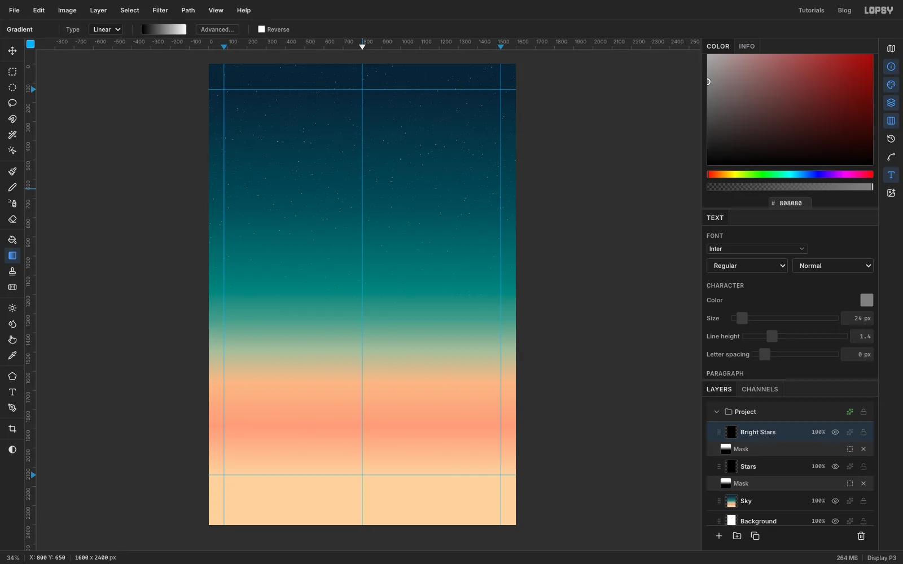

1. Run **Filter → Threshold…** at `182`. Only the brightest specks survive, as single white pixels on black.
2. Open the layer effects drawer and set the blend mode to **Screen**. The black disappears and only the stars show.

For a few bigger stars, add a *Bright Stars* layer and repeat the grey fill and the noise. Then run these four filters in order:

1. **Threshold** `190`
2. **Gaussian Blur** `2`
3. **Threshold** `22`
4. **Gaussian Blur** `1`

The blur and the second threshold swell each surviving speck into a small, soft dot. Set this layer to **Screen** too. (The screenshot already shows the fade you'll add in the next step.)

## Fade the stars out with a mask

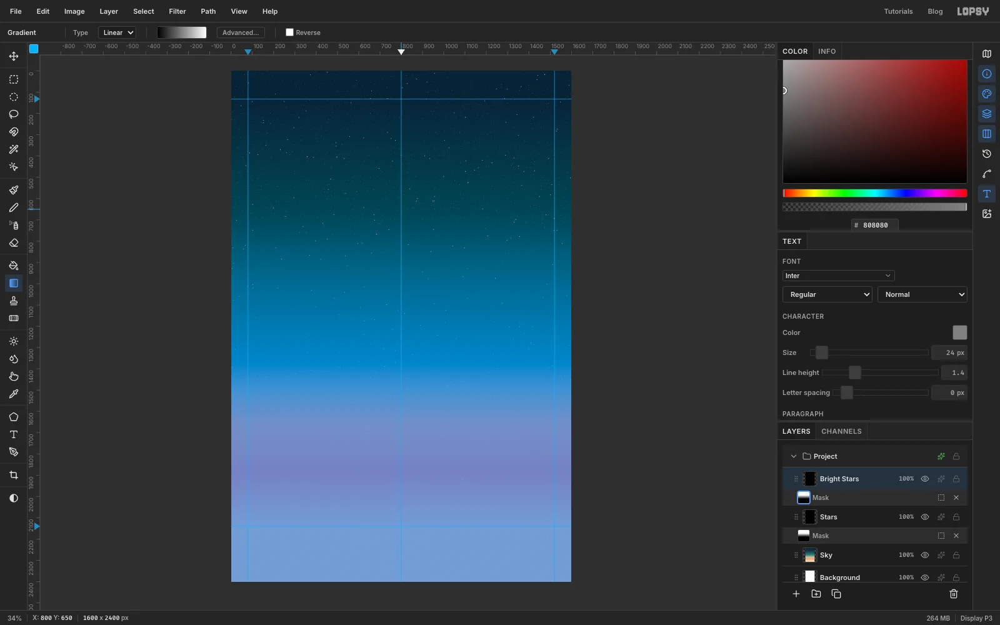

Stars shouldn't show in the sunset. With *Stars* selected:

1. Click **Add Mask** at the bottom of the Layers panel, then click the mask's thumbnail to edit the mask.
2. Set the gradient to two stops, black → white.
3. Drag from just above the peach part of the sky (about y `1400`) up to about y `650`.

While you're editing a mask, Lopsy tints the hidden part blue, as in the screenshot. Do the same on *Bright Stars*, then click a layer name to leave mask editing. The stars are now dense at the top and thin out towards the horizon.

## Shade the planet with crescents

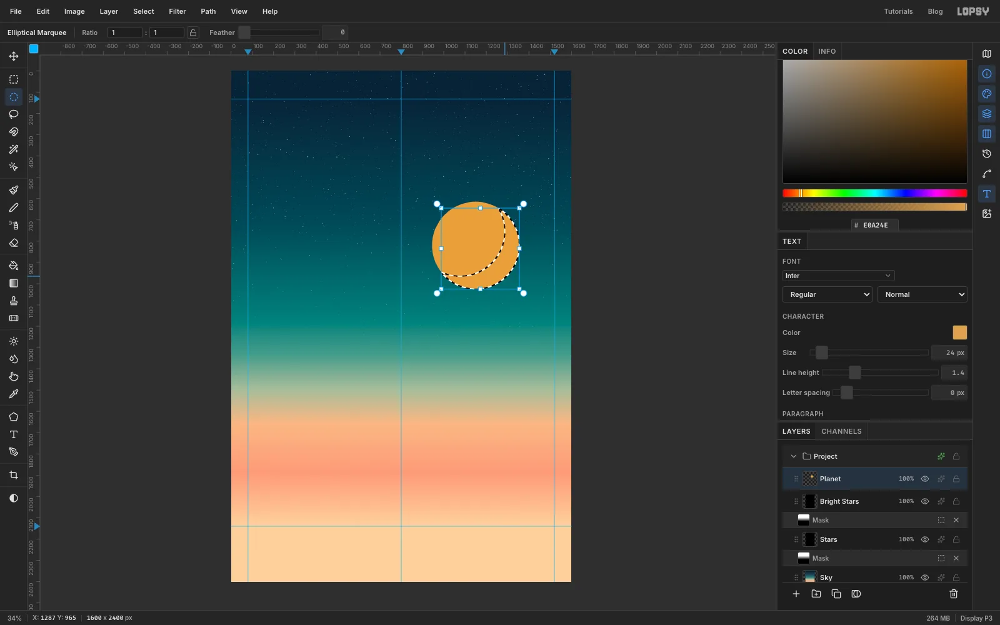

The whole cover uses flat, gouache-style shading: two or three solid tones instead of smooth airbrushing. Light comes from the upper left.

1. Add a layer called *Planet*. With the **Elliptical Marquee**, hold [[Cmd]] and drag a perfect circle about a quarter of the page wide (410 px) in the upper right, centred around x `1150`, y `820`. Leave a clear band of sky under the title area. Fill it with `#E0A24E`.
2. [[Cmd]]-click the *Planet* thumbnail in the Layers panel to load the circle as a selection again. Then Alt-drag a slightly larger circle, shifted about 75 px up and to the left, to subtract it. What's left is a crescent on the lower right (shown above). Fill it with `#C47838`.
3. Load the circle again and repeat with an offset of about 30 px. Fill the thinner crescent with `#8E4628`.

## Draw curved bands

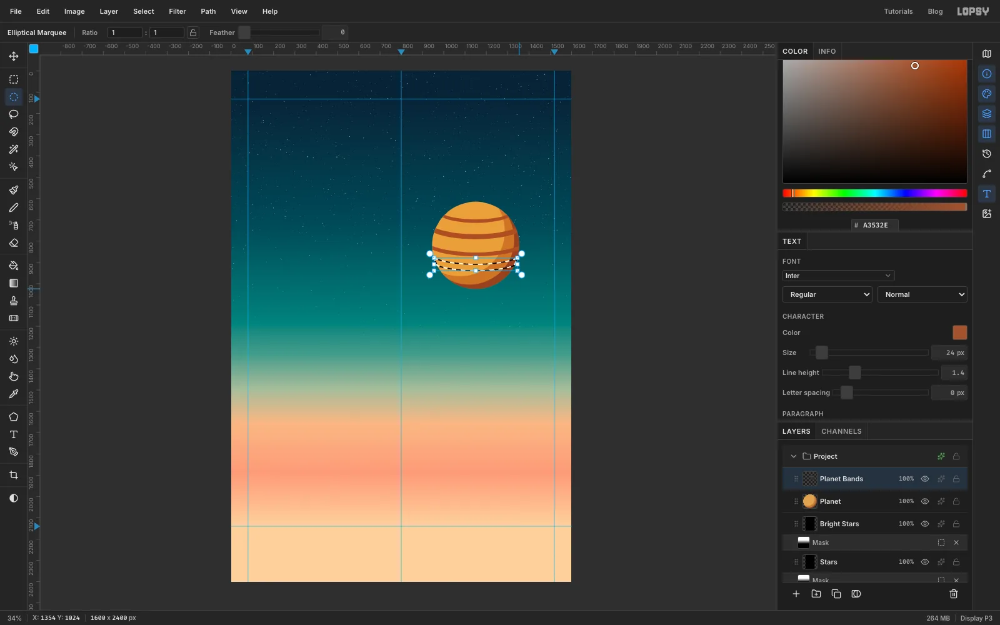

Bands on a sphere curve like lines of latitude, so draw them as thin crescents too. Add a *Planet Bands* layer and set the foreground to `#A3532E`. For each band:

1. [[Cmd]]-click the *Planet* thumbnail to load the circle.
2. Shift+Alt-drag a wide, flat ellipse across it, a little wider than the planet and about a quarter as tall as it is wide. Only the part inside both shapes stays selected, so nothing spills off the edge.
3. Alt-drag an ellipse of the same size, 16 to 30 px higher. What's left is a thin "smile". Fill it.

Make five bands, of different thicknesses, spread from near the top of the planet to near the bottom.

## Tilt the bands

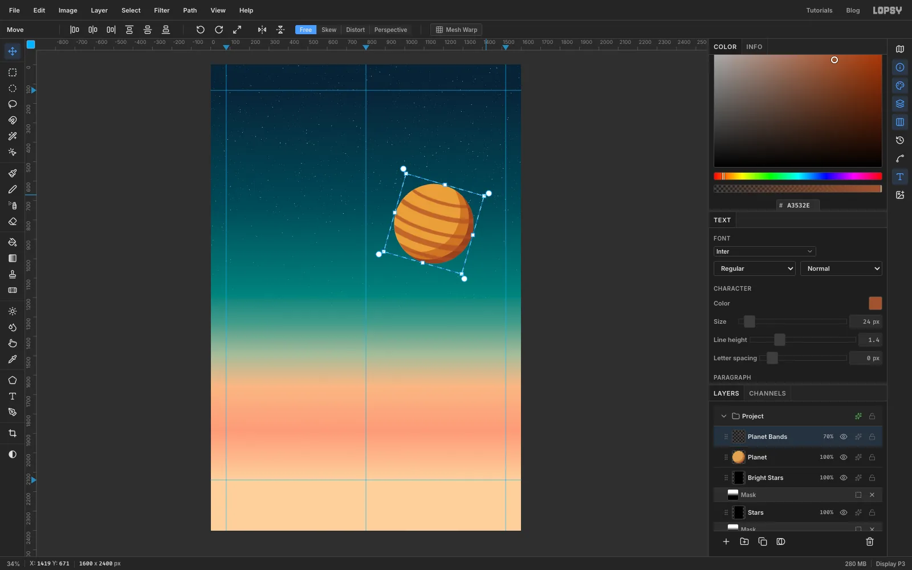

[[Cmd]]-click the *Planet* thumbnail again, run **Filter → Gaussian Blur…** at `3` to soften the bands inside it, and set the layer's opacity to `70%`.

Now draw a rectangular marquee around the planet and switch to the **Move** tool. Drag just outside a corner handle (the cursor turns into a crosshair) to rotate the bands about 16° clockwise. This matches the tilt the ring will have. Press [[Cmd+D]] to commit.

## Add a flat highlight

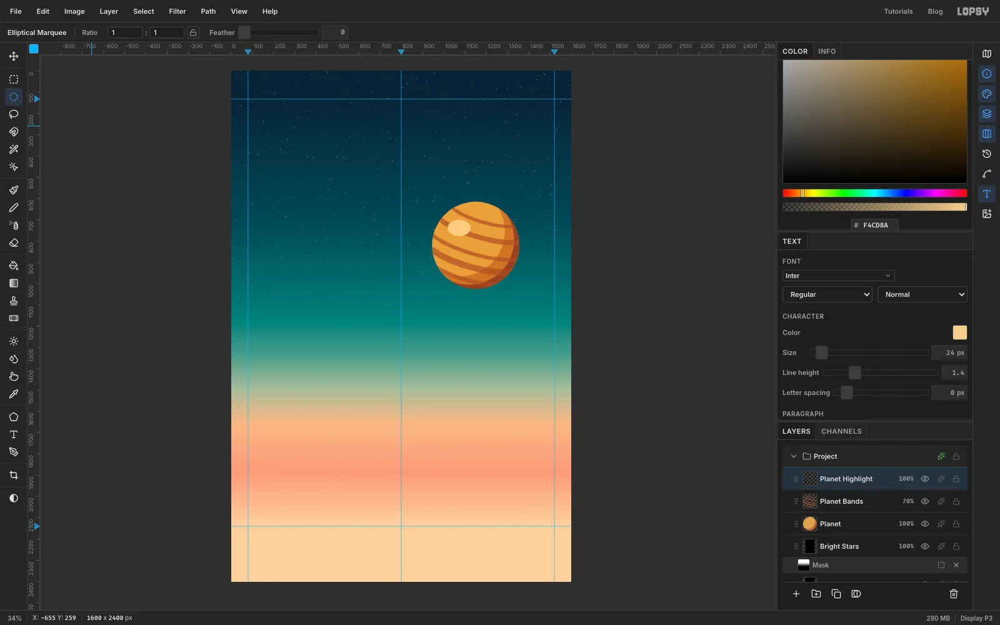

Add a *Planet Highlight* layer above the bands. Draw a small ellipse, about 110 × 75 px, on the upper left of the planet and fill it with `#F4CD8A`. Putting it on its own layer keeps the bands from showing through it.

## Select the ring

The ring is a set of ellipses that all share the planet's centre, so add two temporary guides through it first: click the top ruler at x `1150` and the left ruler at y `820`. Start and end each drag the same distance either side of where they cross; the Info panel shows exactly where you are.

1. Add a *Ring* layer. Draw a wide ellipse almost twice the planet's width and about a fifth as tall (760 × 168 px).
2. Alt-drag a smaller ellipse inside it, three-quarters the size (584 × 120 px), to cut out the middle. Fill the ring with `#F1E2C0`.
3. Draw the big ellipse again and Alt-drag one just inside it (692 × 150 px), leaving the outer edge. Fill that outer band with `#D8A867`.
4. Draw that 692 × 150 ellipse once more, Alt-drag a slightly smaller one (668 × 144 px) inside it, and press [[Delete]]. This cuts a thin gap between the two bands, like Saturn's Cassini Division.

Drag the two temporary guides back onto the rulers when you're done.

## Tilt the ring

Draw a rectangle around the ring, switch to the **Move** tool and rotate it 16° clockwise, the same as the bands. Press [[Cmd+D]].

## Tuck the back of the ring behind the planet

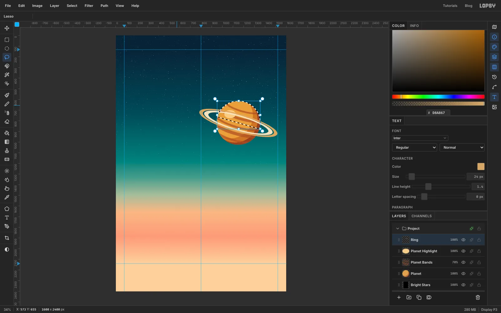

For now the whole ring sits in front of the planet. The half that should pass behind is the part above the ring's centre line:

1. [[Cmd]]-click the *Planet* thumbnail.
2. Switch to the **Lasso**. Shift+Alt-drag a polygon whose bottom edge runs along the tilted centre line of the ring and whose top is well above the planet.
3. The intersection is the planet's upper half, cut at the ring's angle (shown above). With *Ring* active, press [[Delete]].

## Add a cratered moon

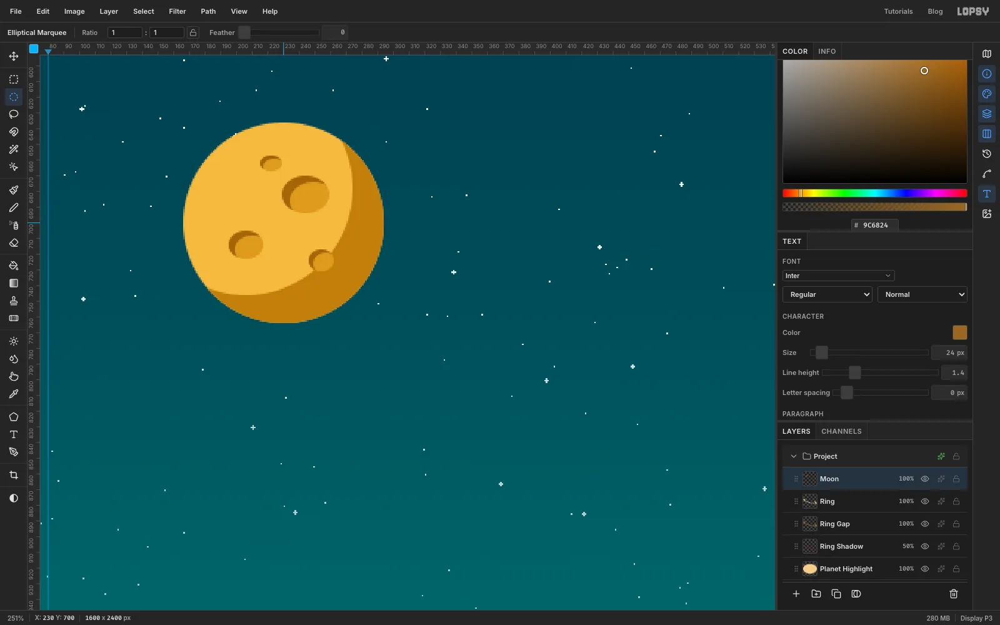

Select *Ring*, add a *Moon* layer above it, and [[Cmd]]-drag a circle about 128 px across in the upper left, around x `230`, y `700`. Fill it with `#EDBC57`, then use the crescent trick again with `#B9822E`: load the moon's thumbnail, Alt-drag an offset circle, and fill.

For each crater, fill a small ellipse with `#D49E3D`. Then draw the same ellipse again, Alt-drag a copy nudged slightly down and right, and fill the leftover sliver with `#9C6824`. That puts the shadow on each crater's upper-left wall, the side facing away from the light.

## Close the gap and cast the ring's shadow

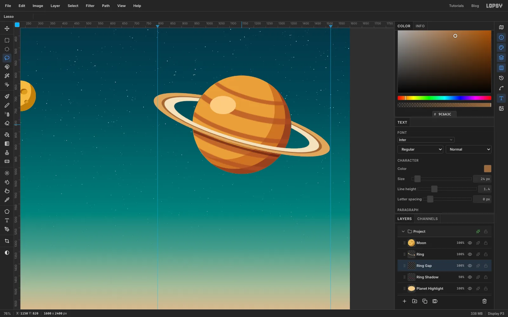

Where the ring crosses the planet, the gap you cut shows the planet through it, which looks like a mistake. Fill it in with a darker tone instead:

1. Add a *Ring Gap* layer and drag it below *Ring*.
2. [[Cmd]]-click the *Ring* thumbnail to load its shape. Run **Select → Grow…** `8`, then **Select → Shrink…** `8`. Growing merges the two bands across the gap, and shrinking brings the outer edges back where they were.
3. Fill the selection on *Ring Gap* with `#9C6A3C`, then delete the back half again with the same circle-and-lasso selection as before.

For the shadow, add a *Ring Shadow* layer below *Ring Gap*:

1. Load the ring's shape again. With the **Rectangular Marquee** active, nudge the selection 16 px down and 5 px right with the arrow keys, and fill it with `#5A2232`.
2. [[Cmd]]-click the *Planet* thumbnail, choose **Select → Inverse** and press [[Delete]], so the shadow only falls on the planet.
3. Lasso any shadow that lands above the front of the ring and delete it too.
4. Set the layer to **Multiply** at `50%`.

## Lasso the rocket's hull

You'll draw the rocket standing upright, then tilt the whole group at the end.

1. Select *Moon*, click **New Group** and name it *Rocket*.
2. Inside it, add four layers from bottom to top: *Flame*, *Fins*, *Hull* and *Trim*.
3. On *Hull*, use the **Lasso** to draw a cigar shape about 180 px wide and 800 px tall, centred on x `500`. Give it a pointed nose at the top, straight sides, and a tail that narrows slightly at the bottom.
4. Fill it with `#F3E6C8`.

## Shade the hull in flat tones

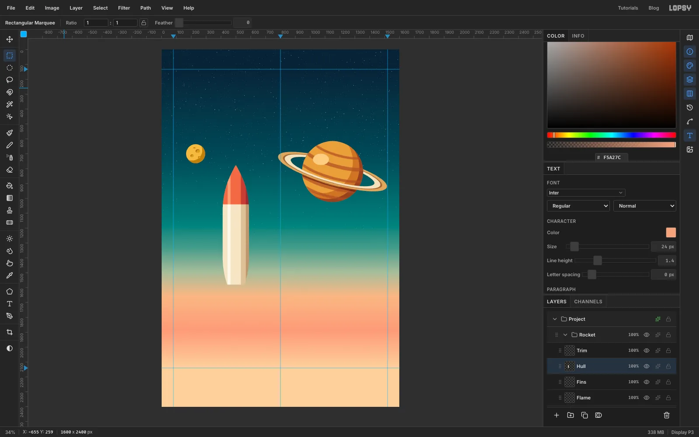

A cylinder in gouache is just vertical stripes of flat colour. For each tone, lasso the hull again, then Shift+Alt-drag a tall rectangle to intersect:

1. The right 30% of the hull: `#D9C29A`.
2. A narrow strip at the right edge: `#B59873`.
3. A thin highlight stripe left of centre: `#FFF9EC`.

For the nose cone, lasso the top 270 px of the hull and fill it with `#E2714E`. Then shade it the same way with `#B9473A`, `#8E3333` and `#F5A27C`.

## Add fins, nozzle and a band

1. On *Fins*, lasso two swept-back fins, one on each side of the tail. Each starts on the hull about two-thirds of the way down and sweeps out and down past the tail. Fill the left fin with `#E2714E` and the right one with the shadow coral `#B9473A`. The flat light from the upper left does the rest.
2. Still on *Fins*, lasso a short trapezoid nozzle under the tail. Fill it with `#172636`, then give its left third a lighter `#4F6170` face.
3. On *Trim*, lasso the hull, Shift+Alt-drag a 30 px horizontal band about two-thirds of the way down, and fill it with `#172636`.
4. Lasso the hull once more, then pick the **Brush** at Size `5` and Shift-click a line across the bottom of the nose cone. The selection keeps the seam inside the hull.

## Add portholes, the flame and the hull number

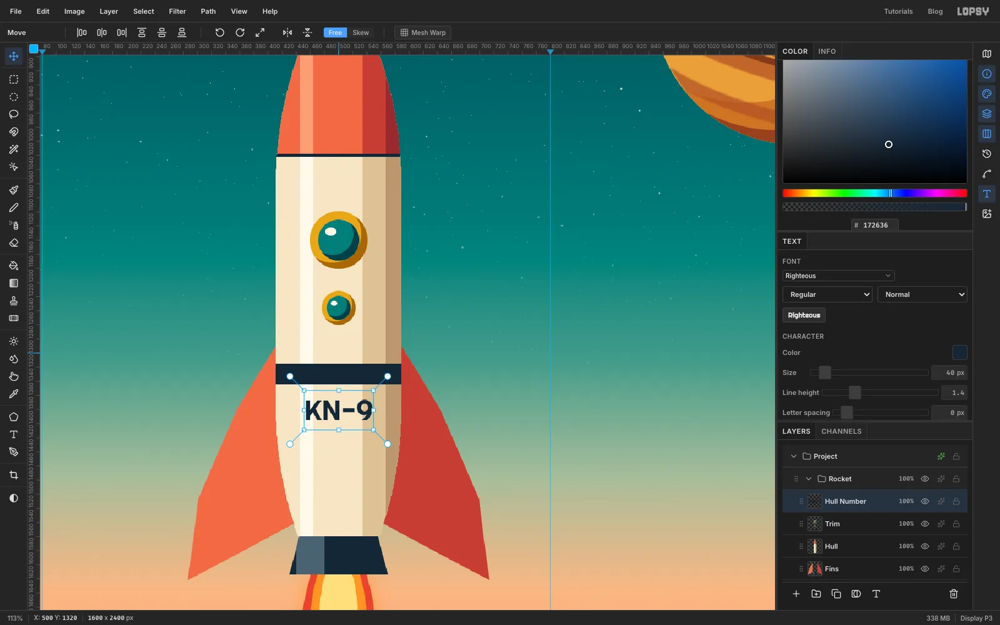

**Portholes.** On *Trim*, centred on the hull between the nose seam and the navy band, fill a circle about 80 px across with brass `#E0A93E`, then use the crescent trick to darken its lower right with `#A06A24`. Fill a smaller circle inside it with `#2F7C7A`, shade it with `#154048`, and add a tiny cream glint `#FFF8EA`. Add a second porthole about half the size just below the first, the same way.

**Flame.** On *Flame*, lasso three nested teardrops hanging from the nozzle and fill them from the outside in:

- the longest, about 480 px, with `#D9503A`
- the middle one with `#F39A42`
- the short core with `#FFE08A`

Then turn on **Outer Glow** in the effects drawer: colour `#F39A42`, Size `40`, Opacity `75`.

**Number.** With the **Text** tool, set **Righteous** at `40` px in `#172636` and type *KN-9* just below the navy band. Centre it on the hull with the arrow keys.

## Tilt the whole rocket at once

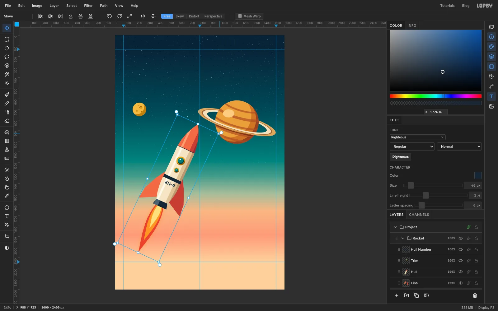

Click the *Rocket* group's row in the Layers panel and make sure nothing is selected on the canvas. With the **Move** tool, one box now frames every layer in the group. Drag just outside its top-right corner to rotate the whole rocket about 25° clockwise, so it points up at the planet, then press [[Enter]]. (Earlier you committed with [[Cmd+D]], which also drops the marquee. There's no marquee here, so [[Enter]] is all you need.)

Every layer turns around the same centre, and the *KN-9* text stays editable.

## Draw a four-point sparkle

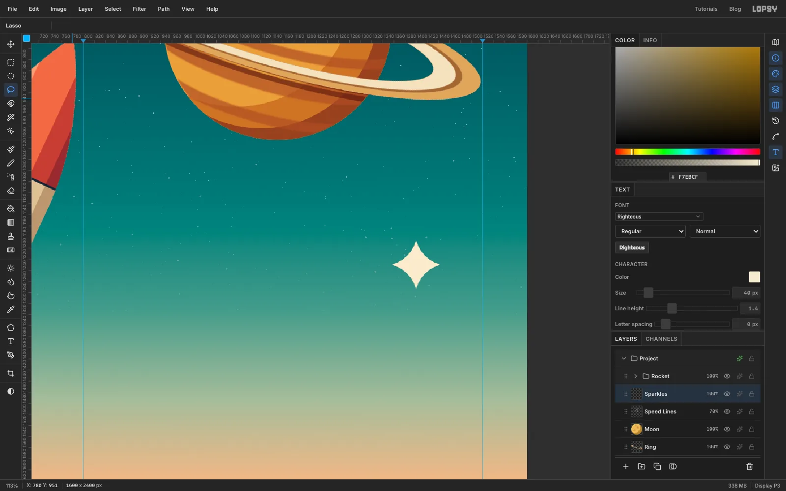

Select *Moon* and add a *Sparkles* layer. Zoom in on the lower right of the sky and lasso a four-point star with concave sides, about 90 px tall: click its four tips, and between each pair of tips click a point about a fifth of the way out from the centre, so the sides curve inwards. More clicks make smoother curves. Fill it with `#F7EBCF`. Sparkles like this, sometimes called "atomic stars", are all over 1950s design.

## Paste and scale more sparkles

Draw a rectangle around the sparkle and press [[Cmd+C]]. For each copy:

1. Press [[Cmd+V]]. The paste lands in place on a new layer.
2. Drag it somewhere else with the **Move** tool.
3. Draw a marquee around it and [[Cmd]]-drag a corner handle to scale it down evenly, to somewhere between a third and two-thirds of its size.
4. Press [[Cmd+D]].

Make five copies of different sizes. Keep them in the dark part of the sky, away from the ring's tips and the rocket's nose.

## Merge the sparkles and add speed lines

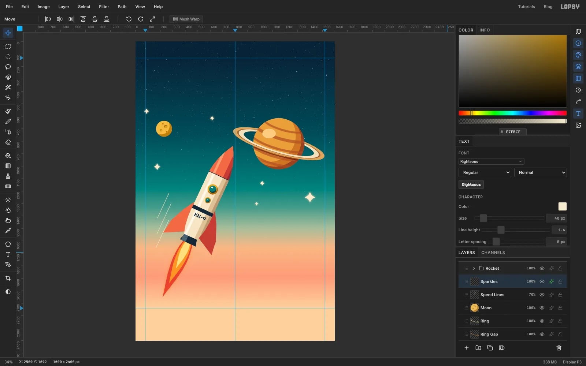

Select the top sparkle copy and choose **Layer → Merge Down**, repeating until only *Sparkles* is left. Then add an **Outer Glow** in `#FFE9B8` at Size `22` and Opacity `65`, so they twinkle.

For a sense of speed, select *Moon* and add a *Speed Lines* layer. With the Brush at Size `5` in `#F7EBCF`, Shift-click three long lines parallel to the rocket, trailing back along its left side, and set the layer's opacity to `70%`.

## Build the far skyline

Select *Sparkles* and click **New Group**. Name it *City*. It sits below *Rocket*, so the rocket will fly in front of the buildings. Add a *Far City* layer inside it.

1. Draw a rectangle standing on the bottom guide.
2. Shift-drag more rectangles along the guide, 60 to 120 px wide and 150 to 330 px tall, with small gaps between them.
3. Shift-drag two elliptical domes and one thin rectangle for an antenna.
4. Paint the selection with a vertical linear gradient from `#2C6A70` at the rooftops, through `#4E7A80`, to a hazy `#9A8288` at the horizon. The haze pushes the far towers back.

## Build the Googie skyline in one selection

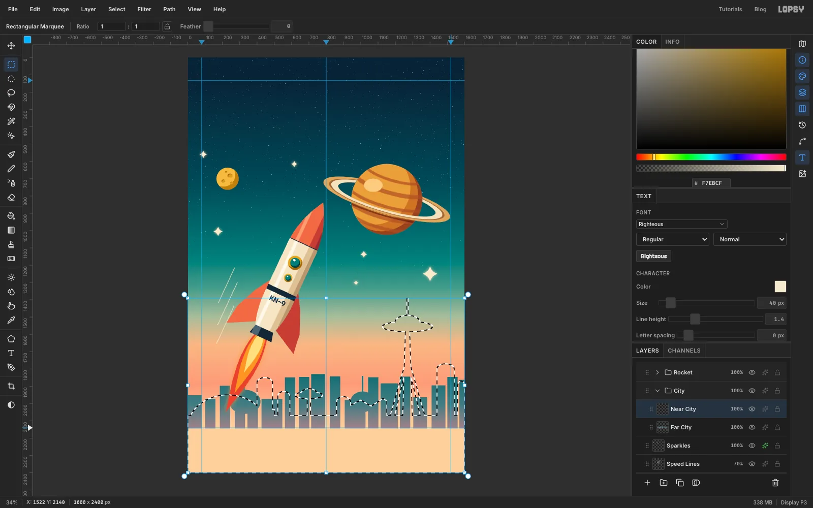

Add a *Near City* layer. You'll build the whole near skyline as one big selection, Shift-adding one piece at a time, and fill it once at the end. Work left to right:

1. **Bottom band and podium.** Draw a rectangle from the bottom guide to the bottom of the canvas, then Shift-drag a 70 px tall strip across the full width, sitting on the guide.
2. **Dome.** Near the left edge, Shift-drag a big ellipse about 460 × 380 px centred on the guide, so only its top half shows.
3. **Towers.** Shift-drag five rectangles, 60 to 100 px wide and 180 to 370 px tall: two left of centre and three on the right. Give each a rounded roof by Shift-dragging an ellipse as wide as the tower across its top edge.
4. **Saucer building.** In the middle, Shift-drag a thin 20 px stalk up from the podium, a flat ellipse about 160 × 40 px on top of it, and a small dome on top of that.
5. **Boomerang building.** Right of centre, use the **Lasso** with Shift to click out a low building about 250 px wide whose roof zig-zags up and down.
6. **Space needle.** Right of the boomerang building, Shift+Lasso a tall, narrow tapered stem (about 570 px) and two splayed legs reaching out to the guide on either side. Then Shift-drag a wide flat saucer (about 290 × 60 px) near the top, a smaller domed cap on it, and a thin rectangle for the spire.
7. **Pylons.** Shift-drag three thin rectangles, about 22 px wide, rising from the guide to just above the podium. They'll hold up the monorail track.

Fill it all with navy `#13283A`. Because everything is one colour, the overlaps merge into one silhouette.

## Draw the parabolic arch with the Pen

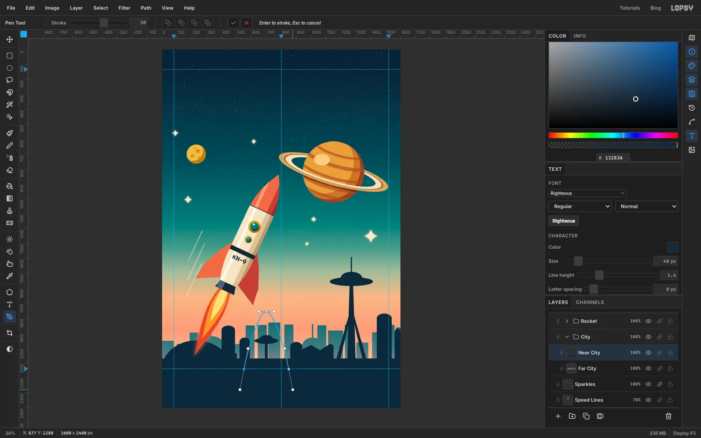

A hand-drawn lasso arch looks wobbly. The **Pen** tool gives a smooth curve. Pick the Pen, set **Stroke** to `30` in the options bar, and keep navy as the foreground colour. Then click-drag three anchor points:

1. **Left foot:** start on the bottom guide just left of the saucer building and drag up and slightly right.
2. **Apex:** about 385 px above the guide, drag horizontally to the right.
3. **Right foot:** on the guide on the other side, drag down and slightly right.

Press [[Enter]]. Lopsy saves the path and strokes it onto *Near City* in one go, and the arch frames the little saucer building, like a 1960s airport landmark.

## Lay the monorail track with Stroke Path

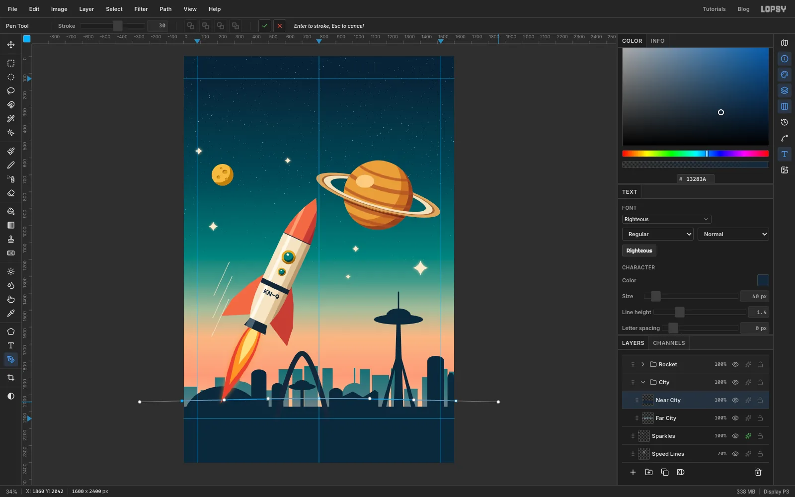

Draw the track the same way, but stroke it from the Paths panel this time:

1. Click-drag three anchors across the full width, just above the podium: start off the left edge on the pasteboard, put the middle anchor slightly higher, and end off the right edge.
2. Click the **✓ Commit path** button in the options bar. That keeps the path without stroking it.
3. Open the **Paths** panel, select the path and click **Stroke Path**. Set the Width to `24` and click **Stroke**.

The track arches gently and sits clear of the saucer.

## Define a window pattern

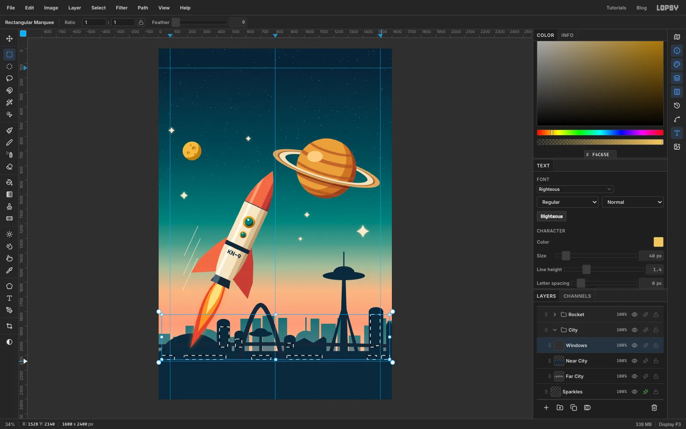

Rows of lit windows are a job for a pattern.

1. On a scratch layer, fill an 8 × 12 px rectangle with `#F4C65E`.
2. Draw a 22 × 28 px marquee around it, with the window 7 px from the left and 8 px from the top, and choose **Edit → Define Pattern**.
3. Delete the scratch layer. The pattern stays available.

Add a *Windows* layer above *Near City*. Shift-drag rectangles over each tower face, the boomerang building and stretches of the podium. Then Alt-drag over the pylons to leave them dark.

> **Tip:** The pattern tiles from the top-left corner of the canvas, so a window starts every 22 px across and every 28 px down. If you start and end your rectangles on multiples of 22 and 28, using the Info panel, almost no window gets sliced at the edge of a building. A stray half window or two looks fine at print size.

## Light the windows

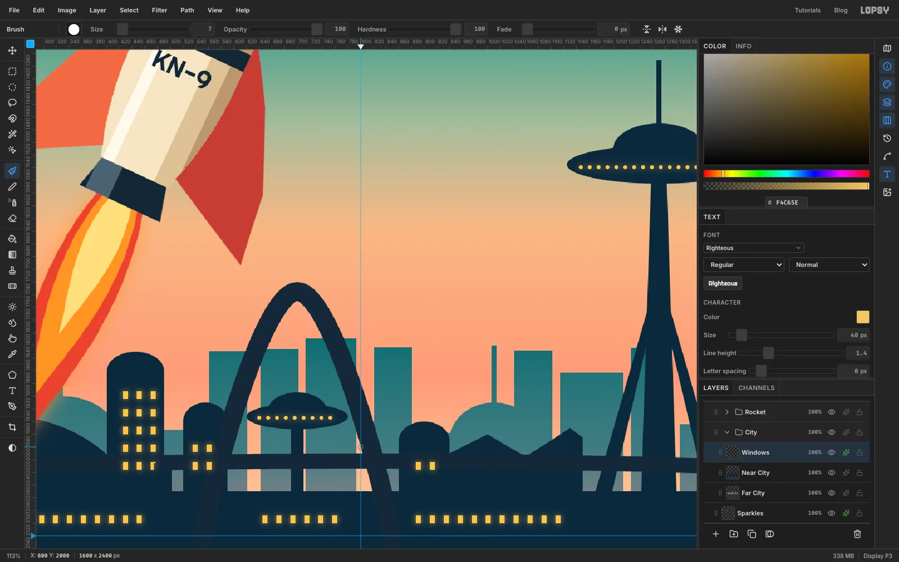

Choose **Edit → Fill with Pattern…**, pick your 22×28 pattern at `100%` scale and click **Apply**.

For the saucer lights, open the brush presets, go to **Shape** and set **Spacing** to `200`. Then, with a Size `7` brush in `#F4C65E`, Shift-click a line across each saucer's rim. The wide spacing turns each line into a row of separate bulbs. Set Spacing back to normal afterwards.

Finally, give *Windows* an **Outer Glow** in `#F4C65E` at Size `14` and Opacity `70`.

## Seat a monorail train on the track

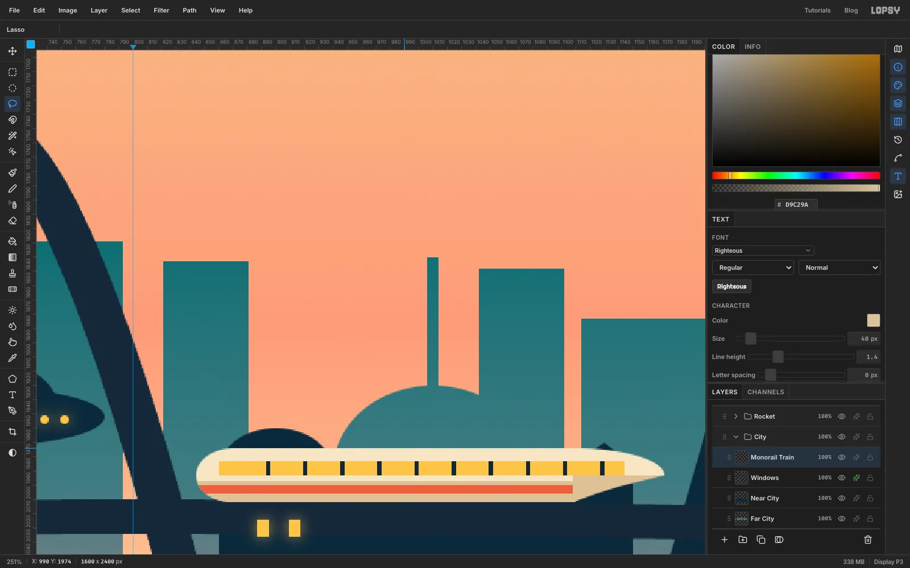

Add a *Monorail Train* layer and build a 38 px tall capsule standing on the track, between the arch and the needle tower:

1. Draw a rectangle about 240 px long, then Shift-add a small ellipse at the back and a longer ellipse at the front.
2. Alt-drag away the lower half of the front ellipse to make a sloped bullet nose, and fill the capsule with `#F3E6C8`.
3. [[Cmd]]-click the layer thumbnail, intersect with a rectangle over the lower half, and fill it with `#D9C29A`.
4. Do the same with a thin rectangle for a coral `#DD6748` stripe, and with a 10 px band near the top for gold windows `#F4C65E`.
5. With the **Pencil** at Size `3` in navy, Shift-click short vertical dividers across the window band.
6. Cutting away the lower front leaves a small notch under the nose. Lasso a thin wedge there and fill it with `#D9C29A`, so the nose sweeps back in one clean line.

## Billow the launch smoke

With *Monorail Train* selected, add an *Exhaust Trail* layer. It goes inside *City*, at the top, so the smoke sits in front of the buildings.

1. Lasso a tapering plume from the tip of the flame down to the lower-left corner.
2. Shift-add about nine circles along it, growing larger towards the bottom left, and fill with `#F7EDDA`.
3. [[Cmd]]-click the *Exhaust Trail* thumbnail to load the shape again. Then Alt-drag each circle a little up and to the left, which leaves a crescent on the lower right of every puff. Fill those with `#E6C2AA`.
4. Select everything below the bottom guide and press [[Delete]], so the smoke stops at the band.

The flame now ends in the smoke, so the rocket looks as if it has just cleared the rooftops.

## Lay out the trade dress

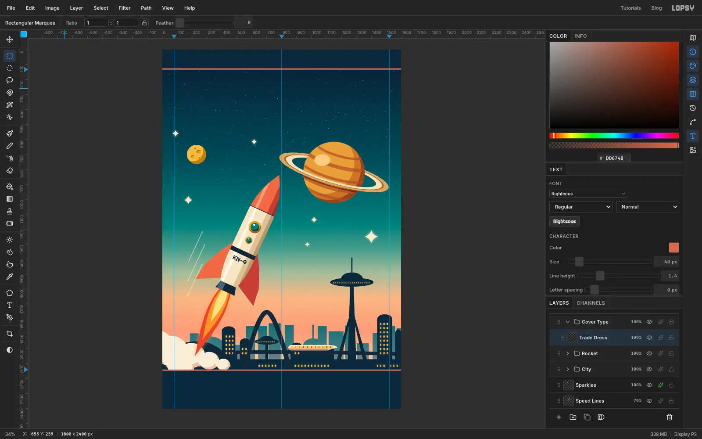

Select the *Rocket* group, click **New Group** and name it *Cover Type*. Add a *Trade Dress* layer inside it.

1. Fill a rectangle across the top, 124 px tall, with `#13283A`.
2. Fill an 8 px coral `#DD6748` rule just below it.
3. Fill a matching rule along the bottom guide.

## Set the title with a block shadow

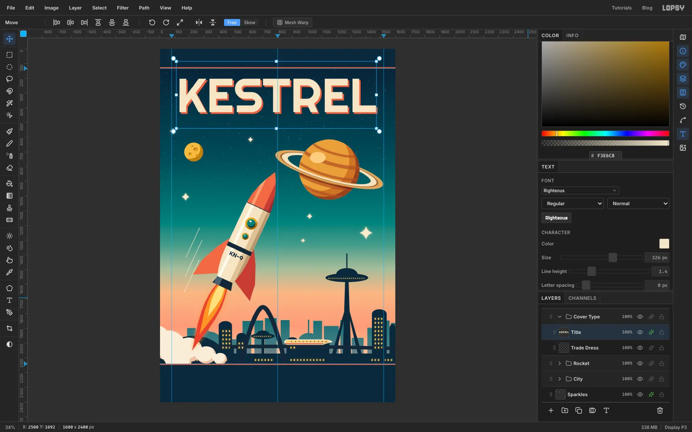

Pick the **Text** tool. Set **Righteous** at `326` px in `#F3E6C8`, click on the sky and type *KESTREL*. Switch to the **Move** tool and use the arrow keys to centre it, leaving about 70 px of sky under the coral rule.

Add a **Drop Shadow** in coral `#DD6748`:

- Offset X `10`, Offset Y `11`
- Blur `1`
- Opacity `100`

A Blur of `1` keeps the shadow's edge crisp, like a second ink printed slightly out of register.

> **Tip:** Settings you change in the **Text** panel, such as Letter spacing, also become the Text tool's defaults. Check them before you start each new piece of type.

## Add NINE between rules

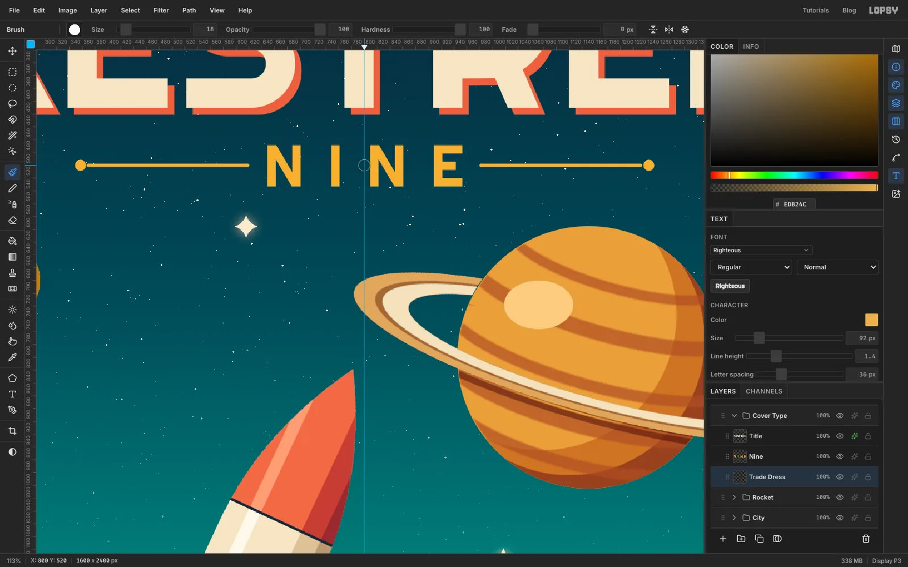

Set **Righteous** at `92` px in `#EDB24C`, type *NINE*, and in the **Text** panel set **Letter spacing** to `36`. Centre it under the title.

On *Trade Dress*, use a Size `6` brush in the same gold to Shift-click a 250 px rule on each side, leaving a 30 px gap to the letters. Then click once with a Size `18` brush at each outer end to add a dot. Check that there's still a clear band of sky between NINE and the top of the planet.

## Fill the top band

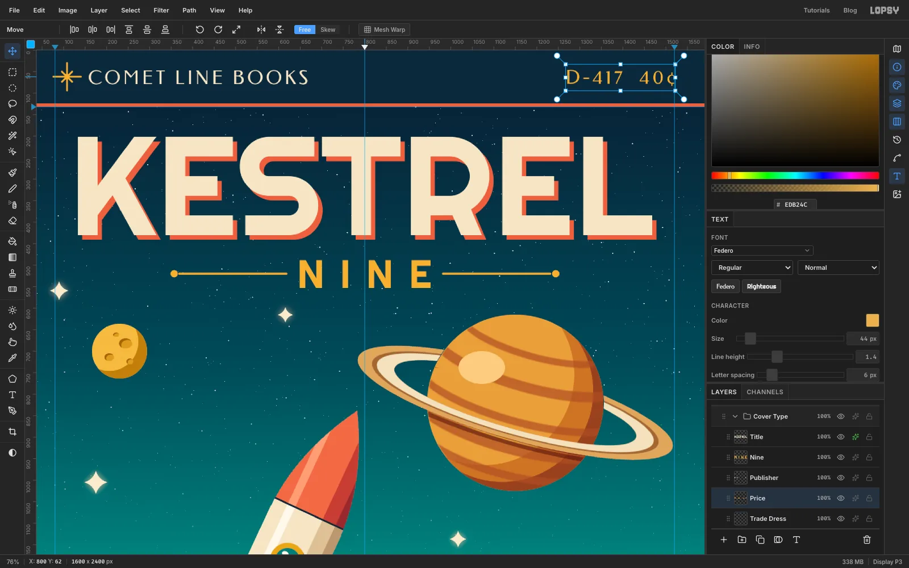

**Starburst.** On *Trade Dress*, draw the imprint's starburst near the left guide with a Size `5` gold brush. Shift-click four lines that cross at one point, two long (horizontal and vertical) and two short diagonals, which gives eight rays. Add a dot in the middle with a Size `14` brush.

**Imprint and price.**

1. Set **Federo** at `44` px in cream with Letter spacing `6` and type *COMET LINE BOOKS* to the right of the starburst.
2. Type *D-417  40¢* in gold and line its right edge up with the right guide.
3. Centre both vertically in the band.

## Set the tagline and author

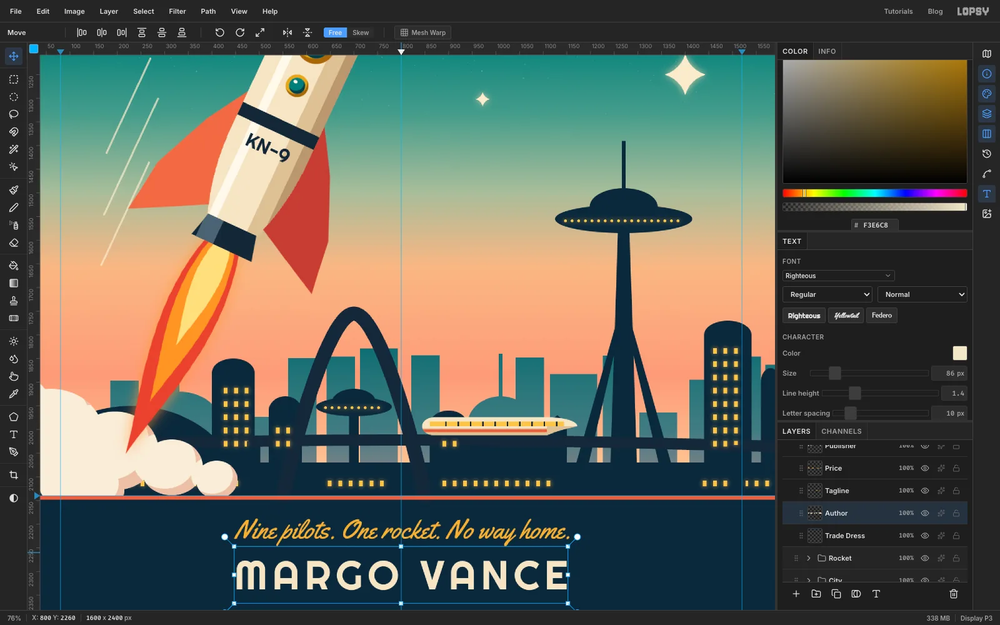

1. Set **Yellowtail** at `56` px in gold, with Letter spacing back at `0`.
2. Type *Nine pilots. One rocket. No way home.* and centre it about 40 px below the coral rule.
3. Below it, set the author's name, *MARGO VANCE*, in **Righteous** at `86` px in cream with Letter spacing `10`.

Period paperbacks set the author's name big. Leave at least 60 px between the name and the bottom edge.

## Darken the edges with a vignette

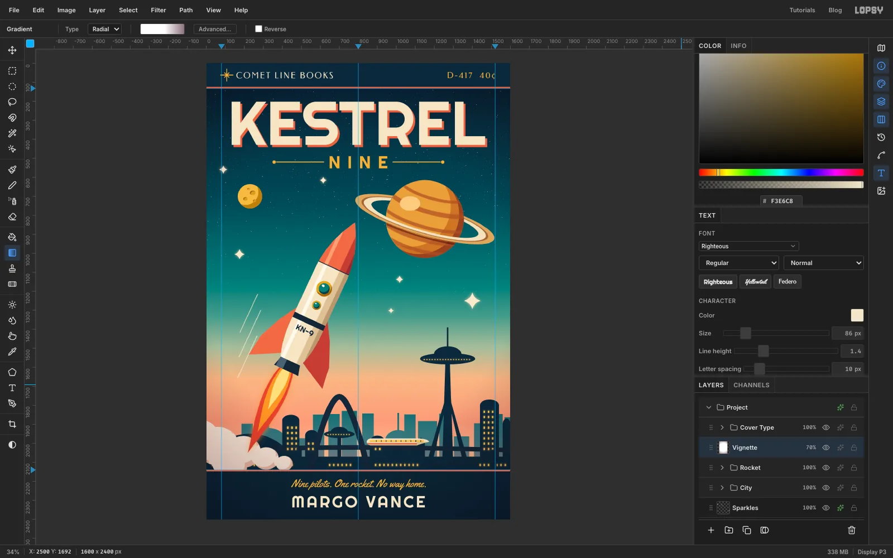

Select *Sparkles* (a layer outside the groups) and add a *Vignette* layer. Set the gradient to **Radial** with stops of white at 0% and 55% and `#8E7280` at 100%. Drag from the middle of the cover to a bottom corner.

Set the layer to **Multiply** at `70%`. Then drag it up the Layers panel, one row at a time, until it sits just above *Rocket* and below *Cover Type*. That darkens the art but not the type.

## Add a halftone screen and paper grain

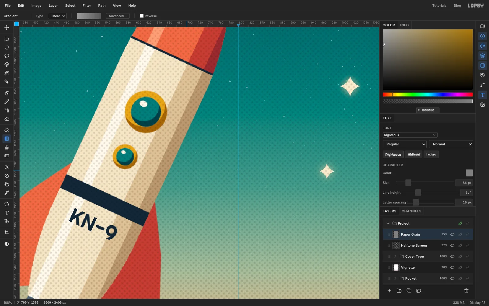

**Halftone screen.**

1. Add a *Halftone Screen* layer and fill it with a vertical grey gradient from `#9A9A9A` to `#5A5A5A`.
2. Run **Filter → Halftone…** with Dot Size `7` and Angle `45`. The gaps between the dots become transparent.
3. Set the layer to **Multiply** at `22%`.

**Paper grain.**

1. Add a *Paper Grain* layer and fill it with `#808080`.
2. Run **Add Noise…** at `40`, **Mono**, **Gaussian**.
3. Set it to **Overlay** at `35%`.

Drag both layers to the very top of the stack. Zoom in and you'll see the cover now looks printed rather than rendered, like a paperback that's been in a spinner rack since 1962.

When you're happy, choose **File → Quick Export PNG** to save the cover, and **File → Save Project** to keep a `.lopsy` file with every layer, group, path and effect still editable. Want a different book? Retype the title, change the hull number, or swap the planet's ochre for a pale lavender.
