A risograph prints one ink at a time through a stencil drum. That gives riso prints a recognisable look:
- The translucent inks overprint each other to make a third colour.
- Type is often *knocked out*, cut out of one ink so another ink or the paper shows through.
- Each colour lands a few pixels away from the others.
- Some ink fails to take, leaving small specks of bare paper.

In this tutorial you'll design a riso-style brand mark for a made-up bike repair co-op, **Tortoise Bicycles**, whose motto is "Slow & Steady". The tortoise's shell is half a bicycle wheel. You'll build a badge, a horizontal lockup, a sticker with a monogram, and the ink chips you'd hand to a printer.

The trick is to work like a riso printer. Everything orange goes in an **Orange Plate** group and everything teal goes in a **Teal Plate** group. The Teal Plate group is set to **Multiply**, so wherever it crosses orange, the two inks mix into a dark green-black, just as real ink does.

Along the way you'll use:
- **Intersect selections** (Shift+Alt) for half circles, and **Select → Shrink** for rings.
- The **Gradient** tool and **Filter → Halftone** for a dotted sunset.
- **Knockout type**: ⌘-click a text layer's thumbnail, then Delete from another layer.
- **Copy, paste, scale and rotate** to reuse the tortoise at smaller sizes.
- **Group nudges** for misregistration.
- **Add Noise, Threshold and Clouds** on a **layer mask** for clumpy ink dropouts.

The fonts are free Google Fonts:
- **Bowlby One** for the heavy capitals
- **Shrikhand** for the script
- **Space Mono** Bold for the small print

The palette is two inks and one paper:

- Paper `#F2EBDC`
- Riso teal `#00838A`
- Riso orange `#FF6C2F`
- Overprint `#003719` (teal over orange, never mixed by hand)

## Set up the paper and the two plates

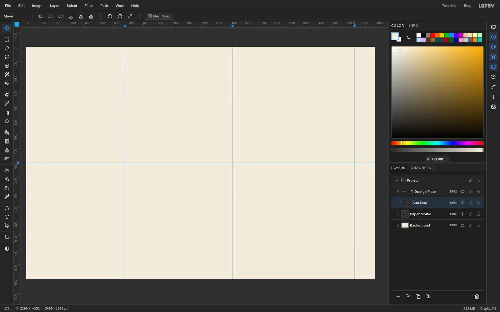

1. Create a **2400 × 1600 px** document with a White background.
2. Set the foreground colour to the paper colour `#F2EBDC`, select the **Background** layer and choose **Edit → Fill**.
3. Click the top ruler to add vertical guides at **680** (the badge's centre), **1420** and **2260** (the edges of the right-hand column). Click the left ruler to add a horizontal guide at **800**.
4. Rename **Layer 1** to `Paper Mottle`. You'll use it at the very end.
5. With `Paper Mottle` selected, click **New Group** at the bottom of the Layers panel and name it `Orange Plate`. Then click **Add Layer** to add a layer inside it, and name that layer `Sun Disc`.

## Draw the sun setting on the horizon

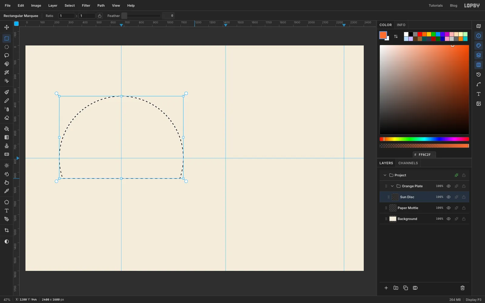

The sun is a big orange circle, sliced flat where it meets the ground.

1. Pick the **Elliptical Marquee**. Hold [[Cmd]] to keep it round, and drag an **880 px** circle centred where the guides cross. It runs from about (240, 360) to (1120, 1240).
2. Switch to the **Rectangular Marquee**. Hold [[Shift+Alt]] and drag a rectangle over the top of the circle, stopping about 140 px below the horizontal guide (y 944). Shift+Alt keeps only the overlap. That leaves most of the circle, cut flat at the horizon.
3. Set the foreground colour to orange `#FF6C2F` and choose **Edit → Fill**. Press [[Cmd+D]] to deselect.

> **Tip:** For an exact circle, click once with the Elliptical Marquee (don't drag) while nothing is selected. A dialog opens where you can type the corners.

## Lay down a short gradient for the halftone

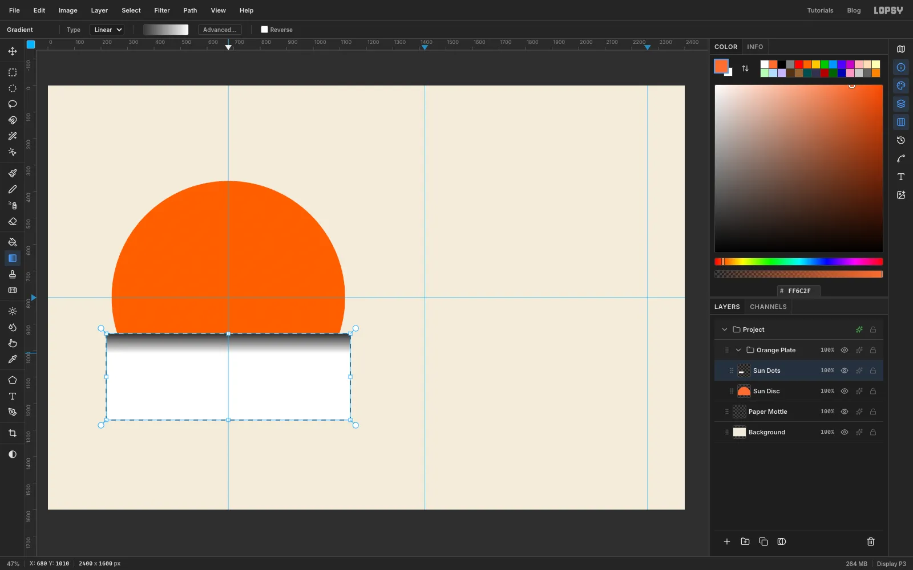

Under the horizon, the sun breaks up into dots that fade out. Halftone turns dark tones into big dots and light tones into small ones. So you'll make a gradient first.

1. Click **Add Layer** and name the new layer `Sun Dots`.
2. Drag a rectangular marquee from a few pixels above the flat bottom of the sun (so there's no gap) down past the bottom of the circle. Make it a little wider than the circle on both sides.
3. Pick the **Gradient** tool, click **Advanced…** and set the two stops to dark grey `#383838` and white `#FFFFFF`.
4. Drag a short gradient straight down, from the horizon (**y 940**) to about **y 1010**. Below that point the rectangle is pure white, and white prints no dots.

## Halftone the band, then trim it to the circle

1. Press [[Cmd+D]] to deselect, then choose **Filter → Halftone**. Set **Dot Size** to `12`, **Angle** to `15` and **Softness** to `1`, and click **Apply**.
2. Reselect the 880 px circle with the **Elliptical Marquee**, exactly as before.
3. Choose **Select → Inverse** and press [[Delete]]. Now the dots stop at the edge of the sun.

> **Tip:** Halftone the plain rectangle first and trim it afterwards. If you run Halftone on an already-round shape, a few cells on its soft edge print pale oversized dots.

## Recolour the dots orange

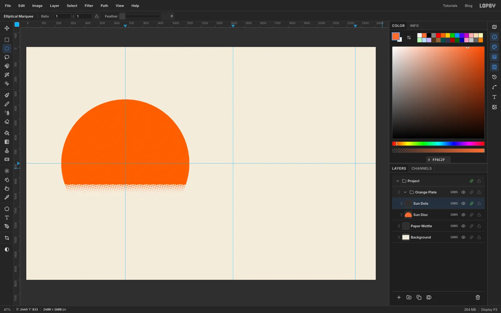

The dots are grey. Press [[Cmd+D]], open the **Layer effects** (✦) for `Sun Dots` and turn on **Color Overlay** with the same orange `#FF6C2F`. Now the band reads as the sun dissolving into the ground.

## Make the teal plate overprint

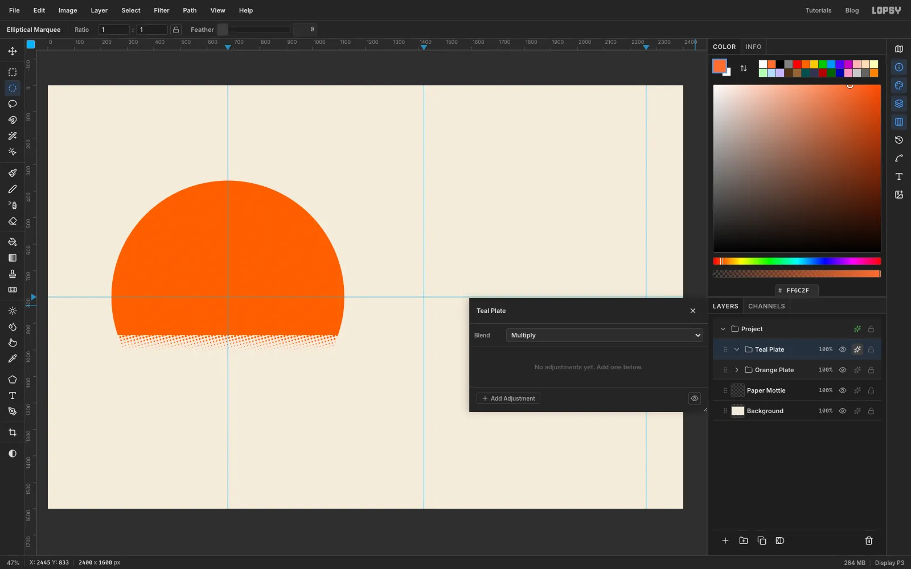

1. Collapse the `Orange Plate` group and select its row.
2. Click **New Group** and name it `Teal Plate`. Because the collapsed group was selected, the new group lands above it, not inside it.
3. Click the group's **Group effects** button and set **Blend** to **Multiply**.

Everything you put in this group now multiplies over the orange plate, like a second pass through the printer.

## Draw the double ring

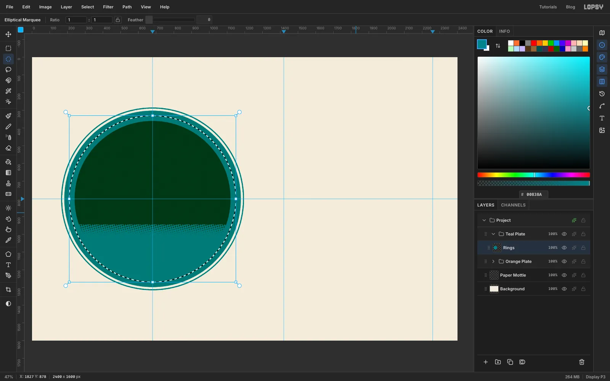

Click **Add Layer** inside `Teal Plate`, name it `Rings`, and set the foreground to teal `#00838A`.

1. Drag a **1032 px** circle centred on the guides, choose **Edit → Fill**, then **Select → Shrink** by `6` and press [[Delete]]. That leaves a thin outer ring.
2. Drag a **996 px** circle centred on the guides, **Edit → Fill**, **Select → Shrink** by `28`, then [[Delete]]. That leaves the thick inner ring.

Press [[Cmd+D]] when you're done. The rings sit on cream paper, so they print pure teal.

## Start the shell as a half circle

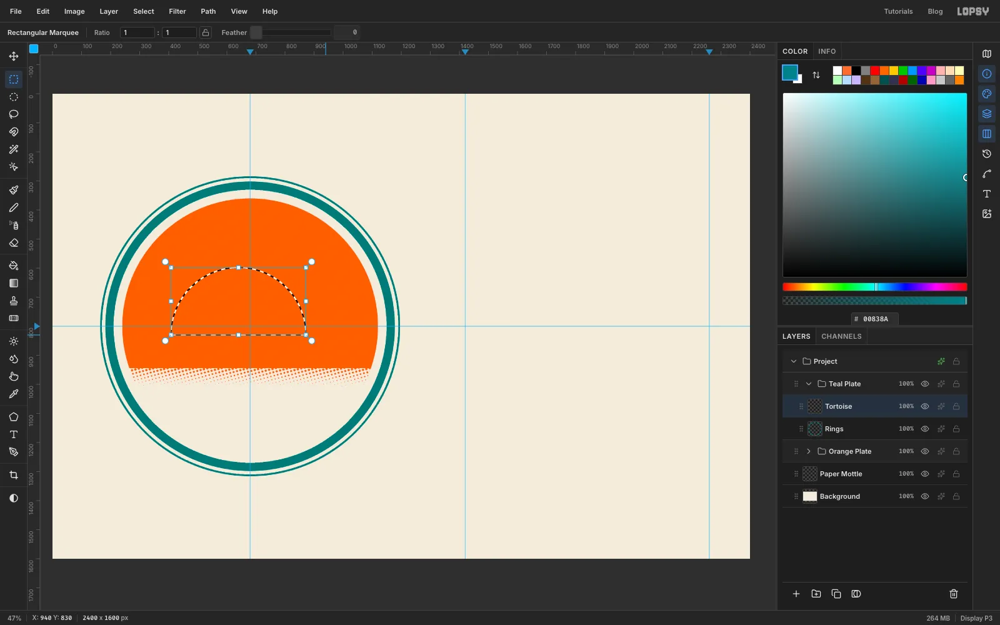

The tortoise's shell is the top half of a bicycle wheel. Its hub sits at **(640, 830)**, a little left of centre, so the head has room on the right.

1. Click **Add Layer** and name the new layer `Tortoise`.
2. Drag a **464 px** circle centred on (640, 830).
3. With the **Rectangular Marquee**, hold [[Shift+Alt]] and drag over the top half, stopping exactly at y 830. That gives a half circle.
4. Fill it with teal. Where the teal crosses the orange sun it prints dark green.

> **Tip:** Small marquees near a guide snap to it. If an edge jumps, turn off **View → Snap to Guides** while you draw the tortoise.

## Hollow it into a tyre and a rim

Repeat the same half-circle trick three more times, all centred on (640, 830):

1. **408 px** half circle → [[Delete]]. That hollows out the tyre.
2. **392 px** half circle → **Edit → Fill**. That adds the rim.
3. **372 px** half circle → [[Delete]]. That hollows out the rim.

You now have a thick tyre and a thin rim, with the sun showing through. Press [[Cmd+D]].

## Add spokes and a hub

1. Press [[Cmd+D]]. Pick the **Brush**, set **Size** to `10` and **Hardness** to `100`.
2. For each spoke, click just outside the hub, then [[Shift]]-click at the rim. Shift-click draws a straight line from your last click. Space seven spokes evenly, roughly every 22.5° from left to right.
3. Drag a **64 px** circle on the hub, fill it and press [[Cmd+D]].

## Give the shell a base

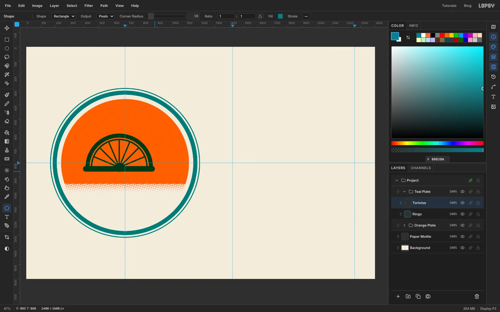

1. Pick the **Shape** tool and set it to **Rectangle**. Set **Corner Radius** to `18` and the fill colour to teal.
2. Shapes grow out from where you press. Press just under the hub and drag out a pill about 38 px tall that runs a little past both ends of the wheel.

## Draw the head, legs and tail

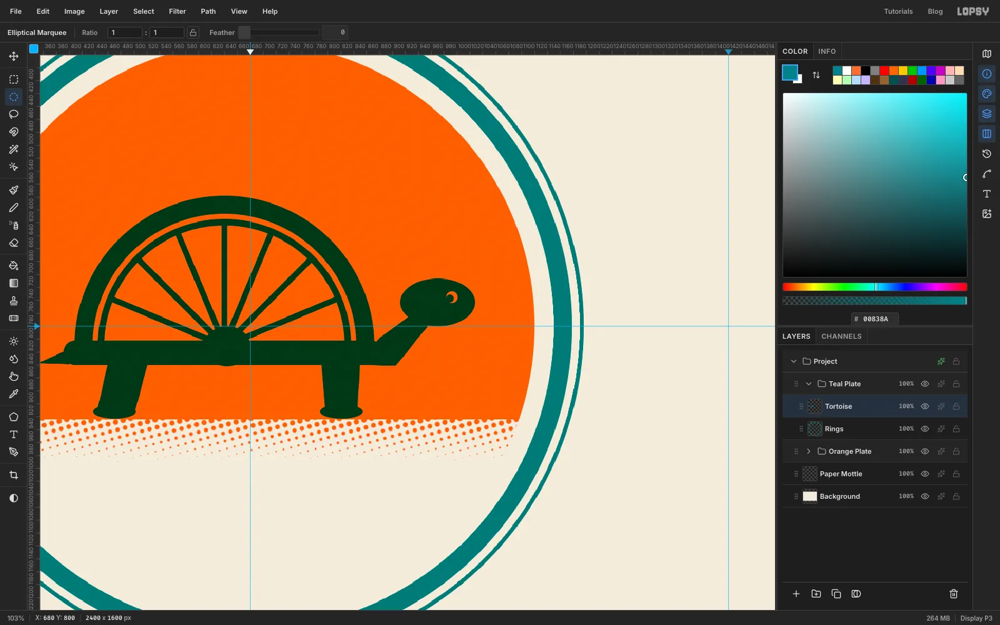

Keep working on the `Tortoise` layer with teal, and fill each selection as you make it.

1. **Neck:** With the **Lasso**, draw a tapered shape from the front of the base up and to the right. Make it about 60 px wide where it meets the shell and about 30 px wide at the head.
2. **Head:** Drag an oval marquee about **116 × 84 px** over the top of the neck, a little higher than the shell's halfway point, and fill it.
3. **Eye:** Drag an **18 px** circle near the front of the head and press [[Delete]], so the orange shows through. Then fill a **12 px** circle slightly behind its centre. A crescent of orange is left as a catch-light.
4. **Tail:** Lasso a small triangle pointing back from the left end of the base.
5. **Legs:** Lasso two tapered legs, about 60 px wide at the top and 50 px at the foot, running from the base down to just above the flat bottom of the sun. Angle the back leg backwards and keep the front leg straight, so it looks like a stride. Under each one, fill a flat **66 × 22 px** ellipse for a foot.

Press [[Cmd+D]] when the tortoise is done. Otherwise the next brush strokes are clipped to the last selection.

## Add the ground and speed lines

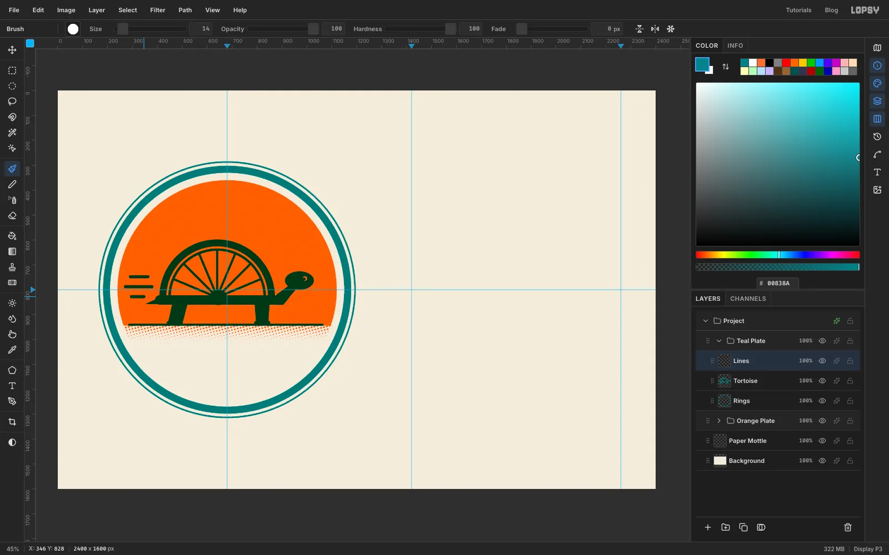

1. Click **Add Layer** and name it `Lines`.
2. With the **Brush** at Size `10`, click about 25 px inside the sun's left edge, level with the soles of the feet. [[Shift]]-click the same distance inside the right edge.
3. Change the Size to `14` and draw three short horizontal speed lines behind the tail. Keep them inside the sun, and make the middle one the longest. It's a tortoise, so the joke only works if they're short.

## Draw the ribbon banner

1. Click **Add Layer** and name it `Banner`.
2. Drag a rectangular marquee **130 px** tall, from (140, 1030) to (1220, 1160). It's longer than the rings on both sides.
3. Switch to the **Lasso**. Hold [[Alt]] and draw a small triangle over each end, about 40 px deep, to cut a V-notch. Alt subtracts from the selection.
4. Fill it with teal and press [[Cmd+D]]. Where it crosses the rings and the paper, it prints teal.

## Knock TORTOISE out of the banner

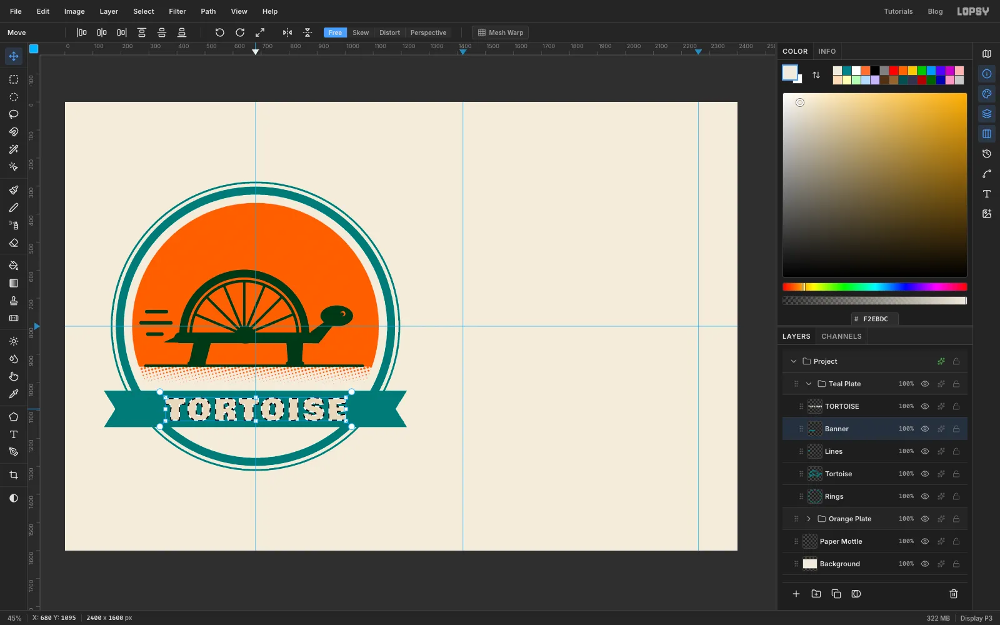

A knockout is a hole cut in one ink so the next ink shows through.

1. Pick the **Text** tool and choose **Bowlby One** at **104 px**. The colour doesn't matter, because this layer is only a stencil. Click in an empty corner of the canvas, type `TORTOISE` and press [[Tab]] to finish.
2. In the **Text** panel, set **Letter spacing** to `12`.
3. Use the **Move** tool to centre the word on the banner.
4. [[Cmd]]-click the text layer's thumbnail to load the letters as a selection. Click the `Banner` row, press [[Delete]], then [[Cmd+D]].
5. Hide the `TORTOISE` text layer with its eye icon. The letters are now holes in the banner.

## Print the letters in orange

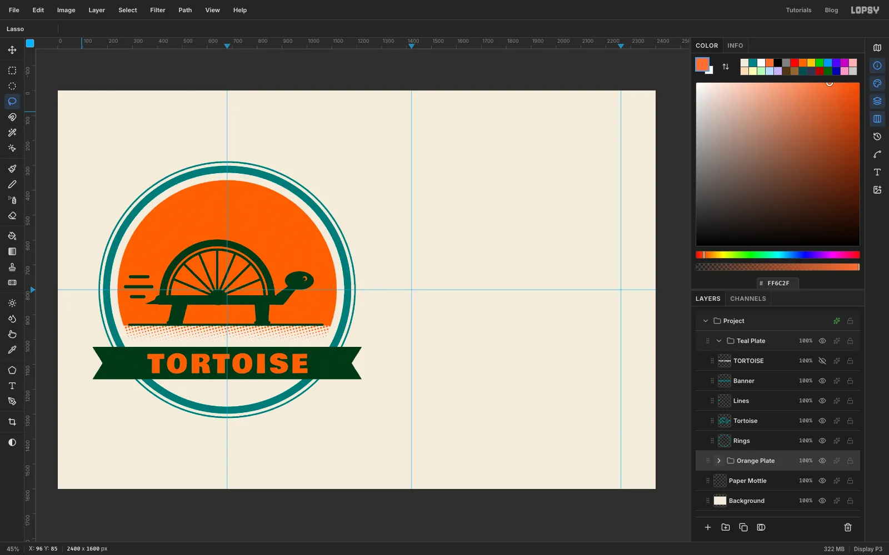

Through the holes you can see bare paper. Give the letters their own ink:

1. Expand `Orange Plate`, select `Sun Dots` and click **Add Layer**. Name the new layer `Banner Ink`.
2. Make the same notched ribbon selection again: the same rectangle, then Alt-lasso the two notches. Fill it with orange and press [[Cmd+D]].

Now the banner prints dark green where the two inks overlap, and TORTOISE prints in pure orange.

## Set the motto and the date

Both lines go on the teal plate, so collapse `Orange Plate` and select the `Banner` row before each one.

1. **Motto:** Set **Shrikhand** at **66 px**, with **Letter spacing** back at `0`. Type `Slow & Steady` in an empty area and press [[Tab]]. Like TORTOISE, this layer will only be a stencil, so any colour works. With the **Move** tool, centre it on the badge about 60 px below the top of the sun, leaving at least 50 px of orange on either side.
2. **Date:** Set **Space Mono** Bold at **38 px**, with **Letter spacing** `6`, and the colour to teal. Type `EST.2026`, press [[Tab]], and centre it in the cream space between the banner and the ring.

Typing `EST.2026` without a space works because Space Mono gives the full stop a whole character cell, so it already looks spaced.

## Reverse the motto out of the sun

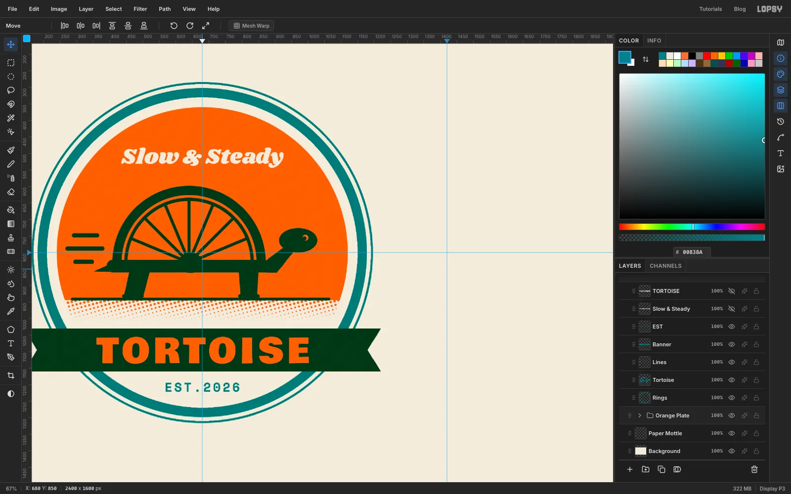

1. [[Cmd]]-click the `Slow & Steady` thumbnail to load its letters.
2. Expand `Orange Plate`, click `Sun Disc`, press [[Delete]], then press [[Cmd+D]].
3. Hide the `Slow & Steady` text layer.

The motto now prints as bare paper, cut out of the orange. The teal ink never touches it, so it stays crisp even after you knock the plates out of register later.

## Start the brand sheet column

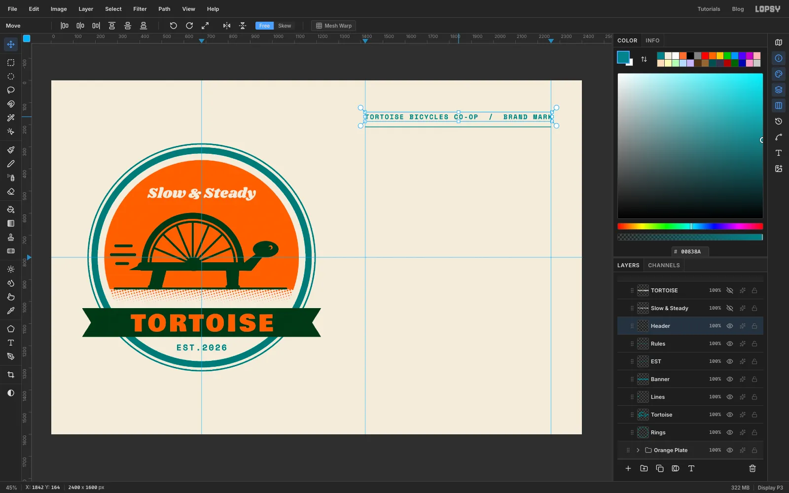

The right half of the sheet shows the mark in other forms. It sits between the 1420 and 2260 guides.

1. Select `EST`, click **Add Layer** and name the new layer `Rules`.
2. With a **4 px** Brush, click on the 1420 guide at y 210 and [[Shift]]-click on the 2260 guide.
3. Select `Rules` and type `TORTOISE BICYCLES CO-OP  /  BRAND MARK` in teal Space Mono Bold at **30 px**, with **Letter spacing** `4`. Press [[Tab]] and rename the layer `Header`. With the Move tool, place it so it starts at the left guide, about 60 px above the rule. Its right end should line up with the end of the rule.

## Reuse the tortoise as an icon

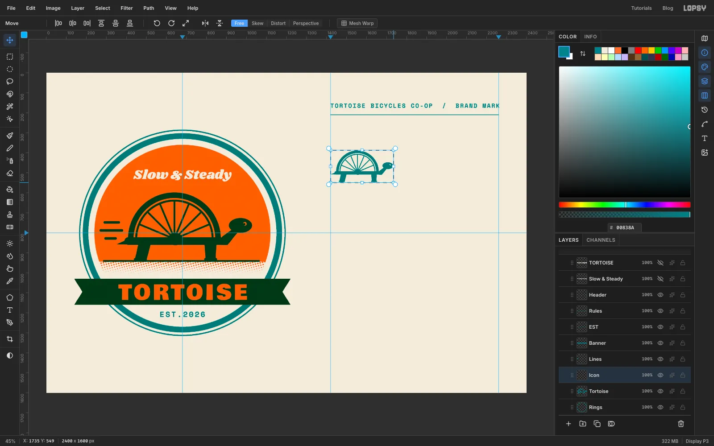

1. On the `Tortoise` layer, drag a rectangular marquee around the whole tortoise. Press [[Cmd+C]], then [[Cmd+V]].
2. Rename the pasted layer `Icon`. With the **Move** tool, drag it to the left guide of the column, about 180 px below the rule.
3. Drag a rectangular marquee tightly around it, then switch back to the **Move** tool. With the Marquee still active, its handles would only resize the selection outline.
4. Hold [[Cmd]] and drag the bottom-right handle in until the icon is about **46 %** of its size, roughly **310 px** wide.
5. Press [[Cmd+D]] to commit the scale.

Off the orange disc, it prints as a clean teal line drawing.

## Set the wordmark lockup

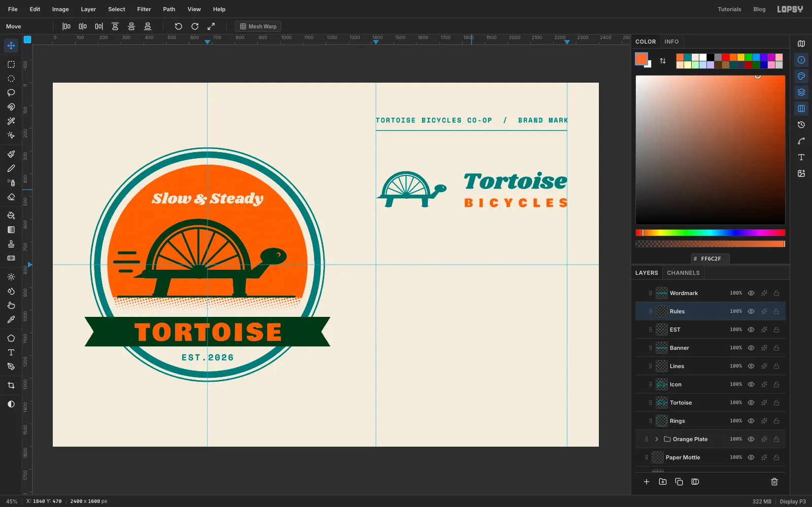

1. Select `Rules` and type `Tortoise` in **Shrikhand** at **100 px** in teal. Press [[Tab]] and rename the layer `Wordmark`. Place it so its right edge sits on the 2260 guide and its top lines up with the top of the icon.
2. Expand `Orange Plate`, select `Banner Ink`, and type `BICYCLES` in **Bowlby One** at **50 px** in orange. It goes on the orange plate.
3. Raise its **Letter spacing** until it's the same width as `Tortoise`. That's about `26`. Then move it so its baseline lines up with the bottom of the icon's feet and its right edge sits on the guide.

## Make the sticker and the monogram

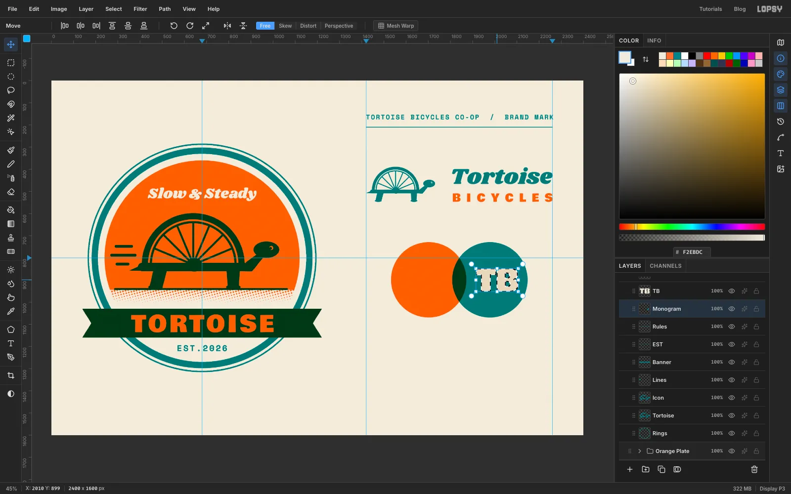

Two overlapping circles show off the overprint.

1. On the orange plate, select `Banner Ink`, add a layer called `Sticker`, and fill a **340 px** orange circle in the middle of the column, about 350 px below the lockup.
2. On the teal plate, select `Rules`, add a layer called `Monogram`, and fill a **340 px** teal circle level with it. Overlap the two by about a fifth of their width, and centre the pair on the column. The lens where they overlap prints dark green.
3. Press [[Cmd+D]]. Type `TB` in **Bowlby One** at **136 px**, press [[Tab]], and centre it on the plain teal part of the right-hand circle, to the right of the dark lens.
4. [[Cmd]]-click its thumbnail, select `Monogram`, press [[Delete]] and [[Cmd+D]], and hide the text.

## Put a small tortoise on the sticker

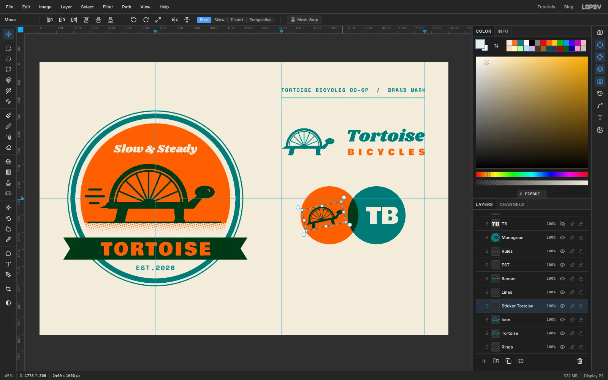

1. Select `Icon` and choose **Layer → Duplicate Layer**. Rename the copy `Sticker Tortoise`.
2. Move it into the orange circle. Marquee it, switch to the **Move** tool, and [[Cmd]]-drag a corner to scale it to about **74 %**. Press [[Cmd+D]].
3. Marquee it again and switch to the **Move** tool. Hover just outside a corner until the cursor turns into a rotate arrow, and drag about **12°** anticlockwise so it climbs uphill. Press [[Cmd+D]].
4. Nudge it with the arrow keys until it sits in the middle of the plain orange part of the circle, clear of the dark lens.

## Add ink chips for the printer

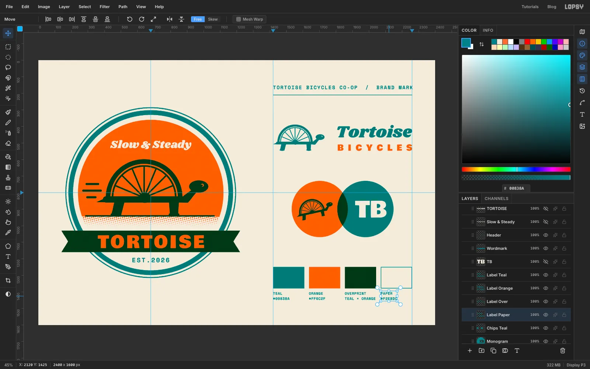

The four chips are **189 × 130 px** with 28 px gaps, so they start at x 1420, 1637, 1854 and 2071. Their tops sit at about y 1250.

1. On the teal plate, add a layer called `Chips Teal`. Drag the first chip's rectangle, hold [[Shift]] and add the third chip's rectangle, then fill both with teal.
2. Drag the fourth chip's rectangle, fill it, choose **Select → Shrink** by `3`, and press [[Delete]]. That leaves a teal outline for the paper chip.
3. On the orange plate, select `Sticker` and add `Chips Orange`. Select the second and third chips the same way and fill them with orange. The third chip now shows the overprint. Press [[Cmd+D]].
4. Under each chip, type a two-line label in teal Space Mono Bold at **22 px**: `TEAL / #00838A`, `ORANGE / #FF6C2F`, `OVERPRINT / TEAL × ORANGE` and `PAPER / #F2EBDC`, with the line break where the slash is.

## Knock the plates out of register

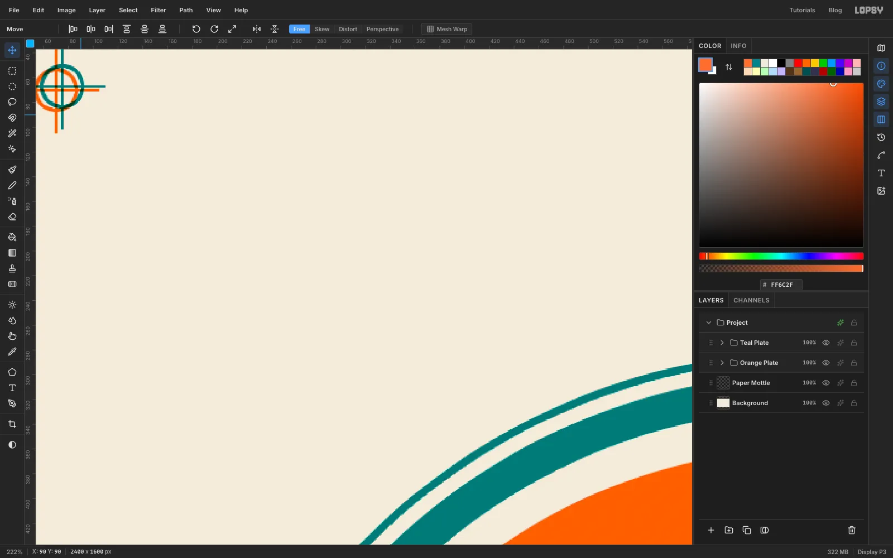

1. Add a `Reg Marks Teal` layer in `Teal Plate` and a `Reg Marks Orange` layer in `Orange Plate`. On each, draw the same mark in the top-left corner, about 70 px in from each edge, and in the bottom-right corner.
2. For each ring, fill a **36 px** circle, **Shrink** it by `3`, press [[Delete]], then [[Cmd+D]]. Draw a 3 px Brush crosshair through it with two Shift-click lines.
3. Collapse `Teal Plate` and click its row. Press [[Cmd+D]] so nothing is selected. With the **Move** tool, press [[ArrowRight]] **5** times and [[ArrowUp]] **3** times.

The whole teal plate shifts as one piece. The marks show the offset, the knockouts gain a thin edge, and the sheet looks printed rather than drawn.

## Add ink dropouts

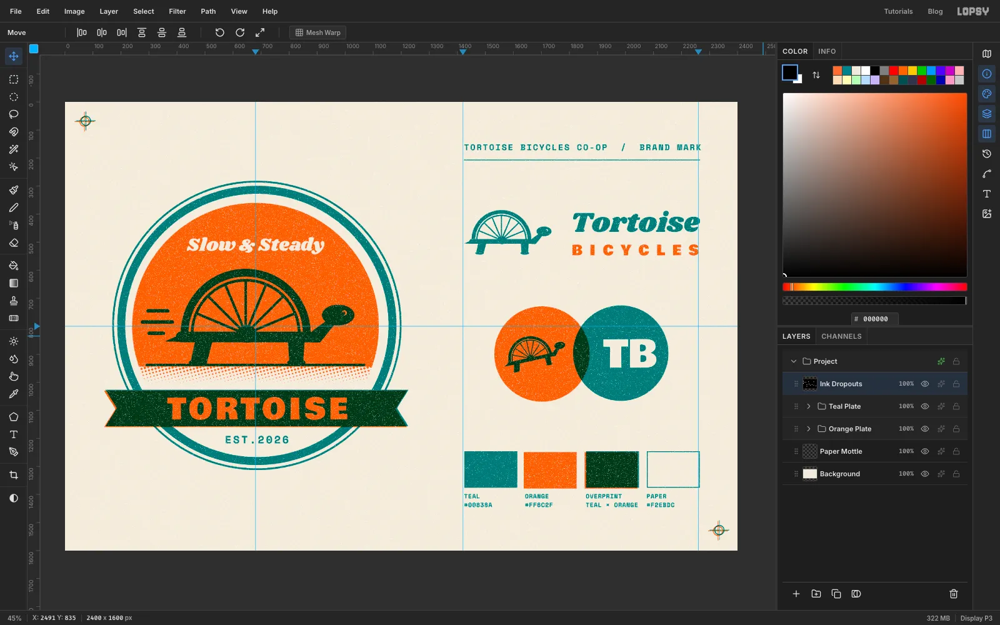

Riso ink often fails to take in tiny spots.

1. With `Teal Plate` selected, click **Add Layer** and name it `Ink Dropouts`. It lands at the top of the stack, outside both plates.
2. Set the foreground colour to black and choose **Edit → Fill**.
3. Run **Filter → Add Noise**: Amount `100`, **Mono**, **Uniform**.
4. Run **Filter → Gaussian Blur** at `1.5`, then **Filter → Threshold** at Level `45`. You're left with sparse white specks on black.
5. Set the layer's blend mode to **Lighten**. The black disappears and only the specks show.

## Make the dropouts clump

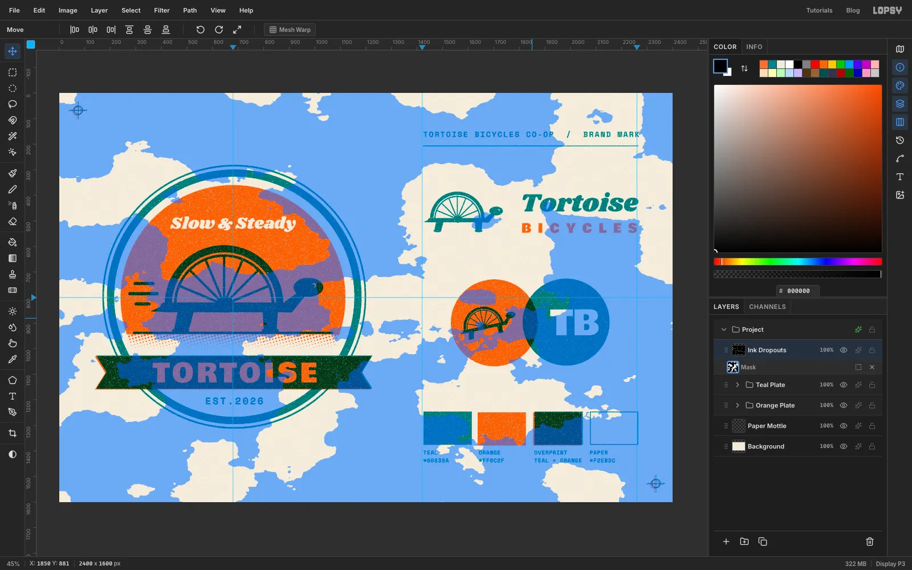

Real dropouts gather in patches, so you'll hide the specks in some places with a mask.

1. Click **Add Mask**, then click the mask thumbnail to edit it.
2. Run **Filter → Clouds** at Scale `8`, then **Filter → Threshold** at `128`. In mask edit mode these filters change the mask, not the specks.
3. Click the layer row to stop editing the mask, and set the layer's opacity to **55 %**.

## Finish the paper

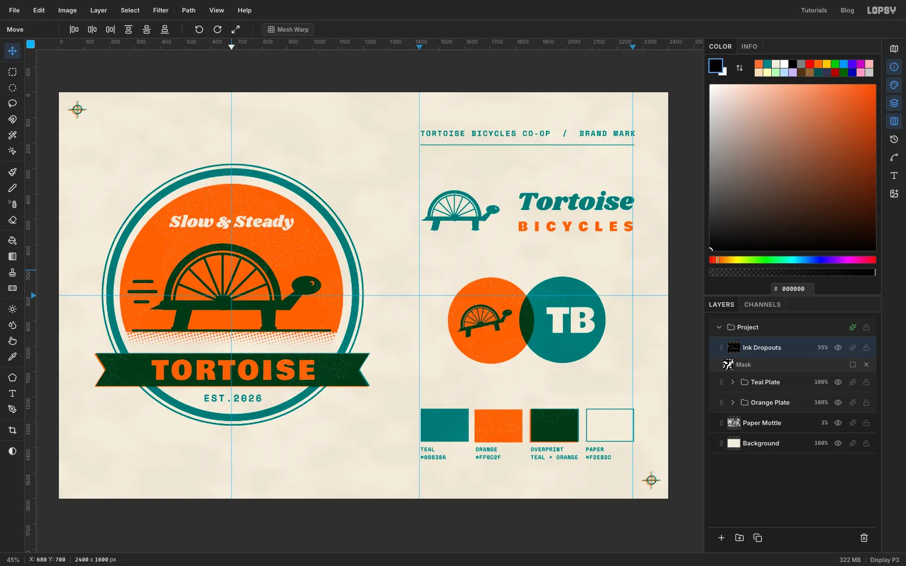

1. Select `Background` and run **Filter → Add Noise**: Amount `8`, **Mono**, **Gaussian**.
2. Select `Paper Mottle` and run **Filter → Clouds** at Scale `18`.
3. Set `Paper Mottle` to **Multiply** at **3 %** opacity. That's just enough to make the paper look less flat.

Export with **File → Quick Export PNG** and save the project with **File → Save Project**. Because every element sits on its plate, you can hide one plate to check that ink on its own, just like proofing a single drum.
