A risograph prints one spot colour at a time through a stencil drum, so riso magazines and zines have a recognisable look:
- A couple of translucent inks overprint each other to make new colours.
- Photos are broken into halftone dots.
- Each colour lands slightly off from the others.
- The ink has specks where it didn't take.

This tutorial fakes that whole process for a made-up ocean-travel quarterly, *MERIDIAN*. The cover story is "The Long Swim", about humpbacks migrating from Antarctica to Tonga.

The photo is a public-domain NOAA image from Wikimedia Commons: `HIHWNMS - humpback whale breaching (31458927013).jpg`, from the Hawaiian Islands Humpback Whale National Marine Sanctuary. Download it and scale it to **2400 px** wide before you start.

Use three inks and one paper, nothing else:

- Paper `#F3EEE3`
- Riso Blue `#0078BF`
- Fluorescent Pink `#FF48B0`
- Yellow `#FFE800`

Every ink layer is set to **Multiply**, so wherever two inks overlap they mix the way real riso ink does. Blue over pink gives indigo, and yellow under blue gives green.

## Paste and scale the photo

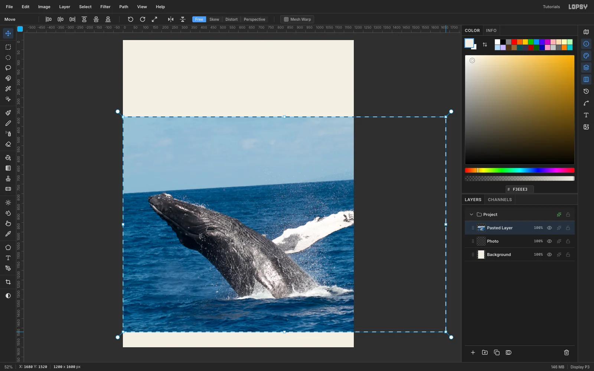

1. Create a **1200 × 1600 px** document with a white background.
2. Fill the Background with the paper colour `#F3EEE3` (**Edit → Fill**).
3. Copy the whale photo and press [[Cmd+V]]. Lopsy fits the paste to the canvas width, centres it, and switches to the **Move** tool with the transform box live.
4. Hold [[Cmd]] and drag the bottom-right handle until the photo is **1680 × 1120**. The top-left corner stays pinned.

The photo may run off the canvas. That's fine; you'll crop it with the plates later.

## Straighten the horizon

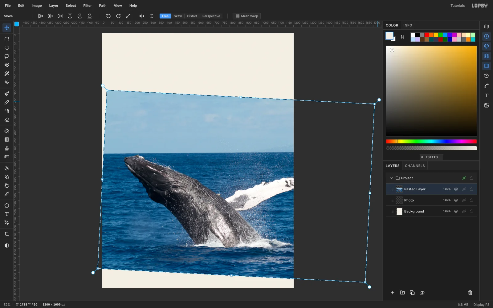

The horizon in the photo falls about 3° to the left. While the transform is still live:
1. Move the pointer just outside the top-right corner until it becomes a rotate cursor.
2. Drag clockwise until the horizon is level.
3. Press [[Cmd+D]] to commit the transform.
4. With the Move tool still active, drag the photo about **60 px left** and **120 px down**. This leaves the whale in the lower half and fills the bottom edge with sea.

Rename the layer `Photo`.

## Remove the sky with the Magic Wand

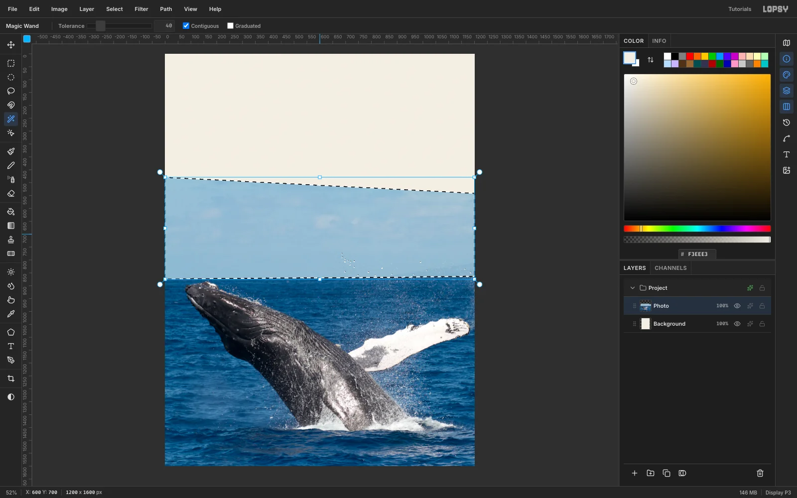

1. Pick the **Magic Wand** and set **Tolerance** to **40**, with **Contiguous** on.
2. Click the sky once. It selects cleanly, because the whale's head sits just below the horizon.
3. Press [[Delete]].

The rotated photo's soft top edge can leave a faint line of pixels behind. To clear them, marquee everything above **y 856** and delete again.

## Trace the whale and lighten the sea

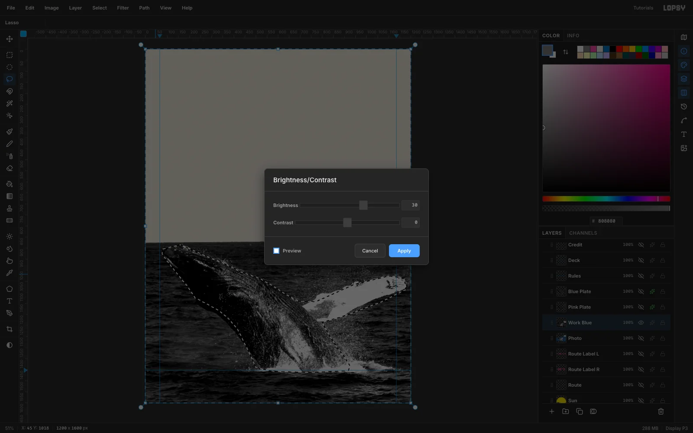

Each riso ink needs its own plate. Start with blue:
1. Duplicate `Photo`, name the copy `Blue Plate`, and hide `Photo`.
2. Run **Filter → Desaturate**.
3. Run **Filter → Brightness/Contrast…** at **Brightness −5**, **Contrast 45**.

If you halftoned it now, the dark sea would print as heavily as the whale and the two would merge. So lighten the sea only:
1. With the **Lasso**, trace around the whale's body *and* its raised pectoral fin in one polygon.
2. Choose **Select → Inverse**.
3. Run **Brightness/Contrast…** at **Brightness +30**, **Contrast 0**. Filters only change the selected pixels.

## Burn the sea around the fin

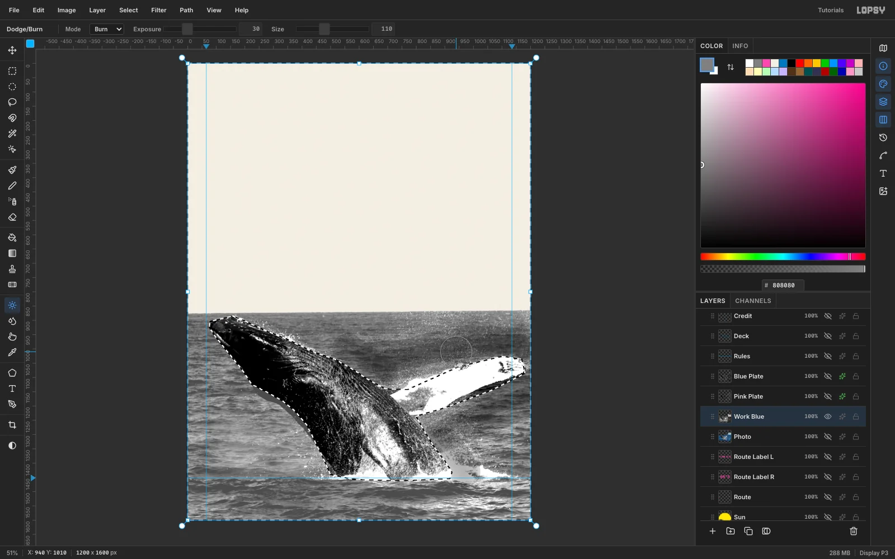

The pectoral fin is white, so against a lighter sea it disappears. Keep the sea selection active and darken the water around it:
1. Pick the **Dodge/Burn** tool.
2. Set **Mode** to **Burn**, **Exposure** to **30** and **Size** to **110**.
3. Paint two passes above the fin, two below it, and one each along the whale's back and near the splash.

The selection keeps the burn off the whale itself. This is the old darkroom move of burning in the background to lift the subject. Press [[Cmd+D]] when you're done.

## Halftone the blue plate

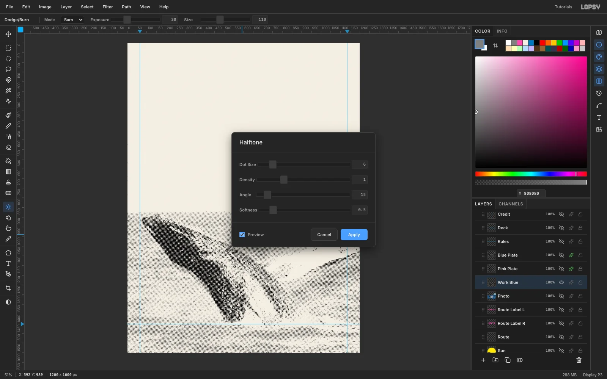

Run **Filter → Halftone…** with these settings:
- **Dot Size** 6
- **Density** 1
- **Angle** 15
- **Softness** 0.5

Turn on **Preview** to check it on the canvas. Dark areas become large dots and light areas become tiny ones.

The gaps come out transparent, which is exactly what a plate needs. The paper will show through them.

## Ink the blue plate

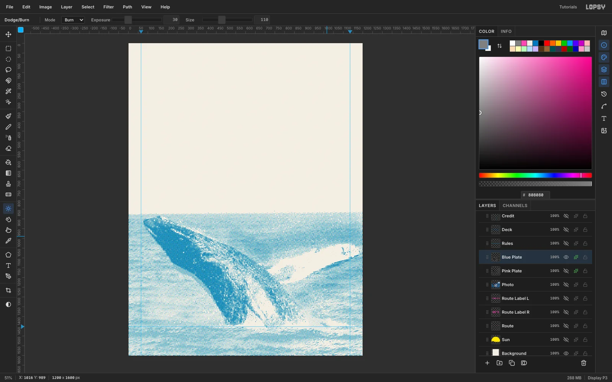

Open the layer's effects drawer:
1. Enable **Color Overlay**.
2. Click the **Color Overlay** label to show its settings.
3. Set the colour to riso blue `#0078BF`.
4. Set the layer's **Blend** to **Multiply**.

The dots now look like blue ink on paper.

Then clear any stray dots along the canvas edges in the sky: marquee a 10 px strip at each side, above the horizon, and delete it.

## Separate the pink plate

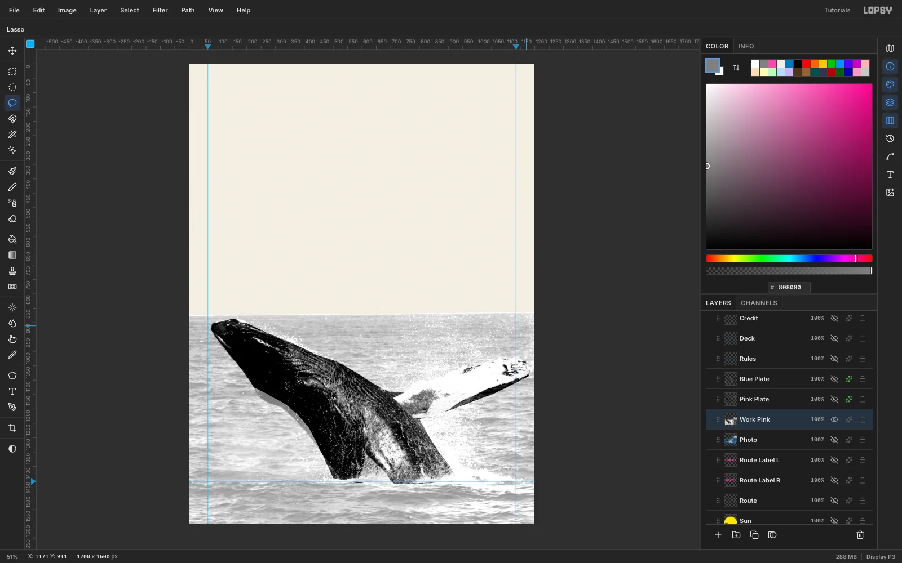

Pink should print heavily on the whale and only lightly in the sea, like a real colour separation.
1. Duplicate `Photo` again and name the copy `Pink Plate`.
2. Run **Filter → Hue/Saturation…** at **Saturation +100**, then **Filter → Desaturate**. Boosting saturation first pushes the blue sea much lighter than the grey whale when it's desaturated.
3. Lasso the whale again and run **Brightness/Contrast…** at **−15 / +40**.
4. Choose **Select → Inverse** and run it again at **+50 / +10** on the sea.
5. Run **Halftone…** with **Dot Size 6**, **Angle 75** and **Softness 0.5**.
6. Add a **Color Overlay** of `#FF48B0` and set the layer to **Multiply**.

Keep the plates at different screen angles (blue 15°, pink 75°). That's how real separations avoid muddy moiré.

## Overprint the plates and misregister them

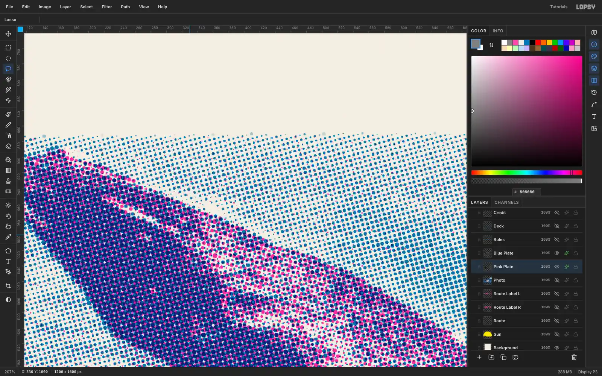

1. Drag `Blue Plate` above `Pink Plate` in the Layers panel.
2. Because both are **Multiply**, the whale prints indigo where the inks overlap. The sea stays blue with a faint lilac tint.
3. Select `Pink Plate`, pick the **Move** tool, and nudge it **7 px right** and **4 px down** with the arrow keys. That's the slight miss of a hand-fed second pass. Look for the pink fringe along the whale's back.

Then marquee the first 9 px of the sea on `Pink Plate` and delete them, so the left edge doesn't show a dense pink stripe.

## Set a yellow sun behind the whale

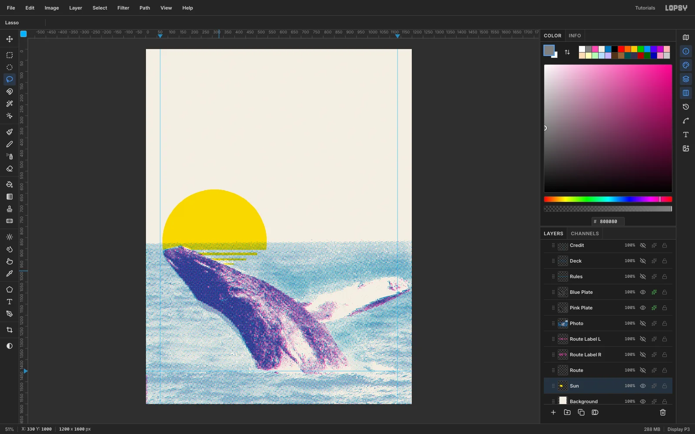

1. Add a layer named `Sun` *below* the plates.
2. Draw an **Elliptical Marquee** 470 px across, centred on (310, 868), and fill it with `#FFE800`.
3. Marquee everything below **y 905** and delete it. The sun now dips 37 px into the sea, and the blue plate overprints it to make a green band.
4. Fill three thin marquees below it as reflection bars: 384 × 12, 284 × 8 and 176 × 5 px.
5. Lasso the whale's head again and press [[Delete]], so the sun doesn't print on the whale.
6. Set the layer to **Multiply**.

## Set the masthead, dateline and headline

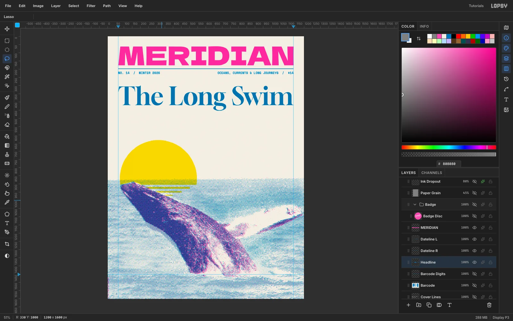

Keep everything on a **65 / 1135 px** margin.

- **Masthead:** `MERIDIAN` in **Dela Gothic One** at **157 px**, `#FF48B0`, with its ink box from x 65 to 1135 and its top at y 60.
- **Rule:** on a `Rules` layer, take the **Pencil** ([[N]]) at **Size 3** in blue, click at (65, 197) and [[Cmd+Shift]]-click at (1135, 197) for a straight, level rule.
- **Dateline:** **Space Mono Bold** at 19 px, blue. Put `NO. 14 / WINTER 2026` on the left margin and `OCEANS, CURRENTS & LONG JOURNEYS / $14` flush right, both with their tops at y 213.
- **Headline:** `The Long Swim` in **Gloock** at **151 px**, blue, spanning the full measure with its top at y 300.

Set the masthead, rule and headline to **Multiply**.

> **Tip:** Create each text layer in an empty patch of canvas and then move it into place.

## Add the deck, route arc and photo credit

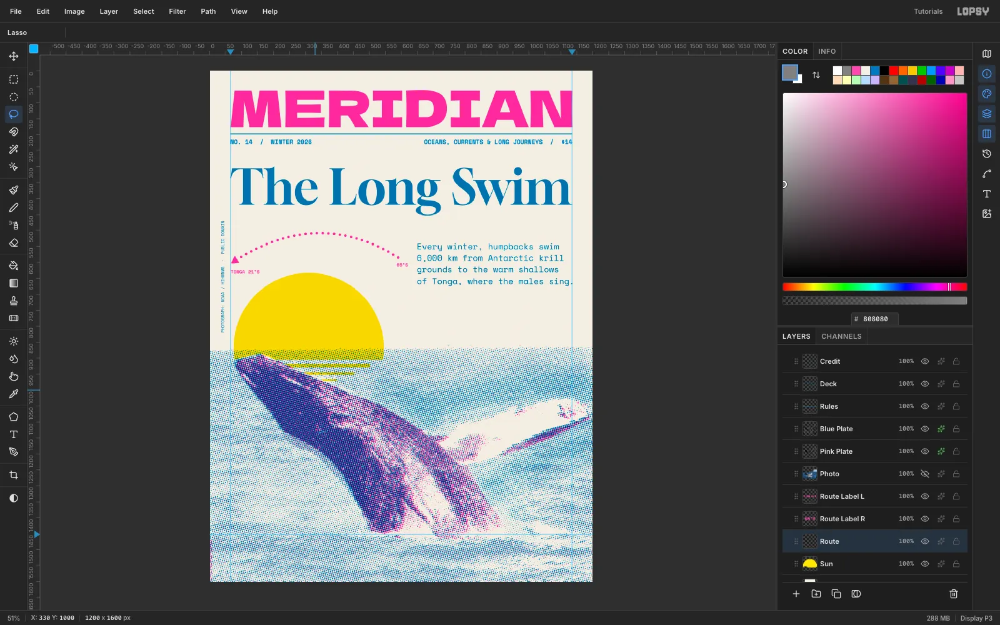

**Deck.** Type four lines in **Space Mono** at 26 px, blue, pressing [[Enter]] between lines:
1. `Every winter, humpbacks swim`
2. `6,000 km from Antarctic krill`
3. `grounds to the warm shallows`
4. `of Tonga, where the males sing.`

Align it flush right to 1135, with its top at y 540.

**Route arc.** On a `Route` layer above `Sun`:
1. Set the **Brush** to **Size 9** and **Hardness 100**.
2. Open **Brushes** and set **Spacing** to **200**. The stroke now paints separate dots instead of a line.
3. Drag one arc from (590, 585), up through about (340, 505), and down to (74, 598).
4. Lasso a small triangle at the left end and fill it pink for the arrowhead.
5. Label the ends in **Space Mono Bold** 15 px pink: `TONGA 21°S` on the 65 px margin, and `65°S` ending 30 px short of the deck.

**Credit.**
1. Type `PHOTOGRAPH: NOAA / HIHWNMS - PUBLIC DOMAIN` in Space Mono 13 px.
2. Click **Rasterize Layer** at the bottom of the Layers panel.
3. Marquee it and switch to the **Move** tool.
4. Hold [[Cmd]] while you drag the rotate handle, so the angle snaps to exactly −90°.
5. Press [[Cmd+D]], then nudge it into the left margin at x 34.

## Stick on a rotated badge

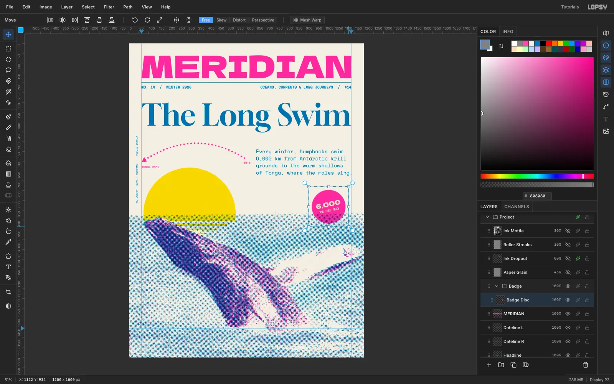

1. Click **New Group** and name it `Badge`. Add a `Badge Disc` layer inside it.
2. Fill a 172 px circle centred on (1020, 832) with pink. It deliberately overlaps the horizon by about 50 px.
3. Type `6,000` in **Dela Gothic One** 33 px and `KM ONE WAY` in **Space Mono Bold** 17 px, both in the paper colour.
4. Centre the two lines as one block on the disc.
5. Use **Layer → Merge Down** twice so the sticker is a single layer. Merge Down rasterizes the text for you.
6. Marquee the disc and rotate it **−12°** with the Move tool's rotate handle. Press [[Cmd+D]].
7. Set the disc to **Multiply**, so the sea's dots show through its lower edge like real overprinted ink.

## Print the footer band and barcode

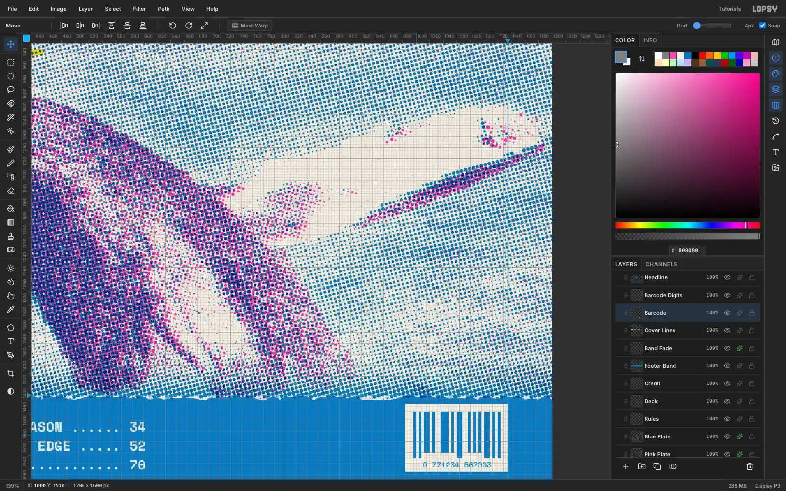

1. Click the top ruler at **x 65** and **x 1135**, and the left ruler at **y 1452**, to add guides.
2. On a `Footer Band` layer, fill everything below the 1452 guide with flat blue (Normal mode).
3. Lasso a zig-zag 0–7 px deep along the band's top and delete it, so the edge looks roller-printed rather than ruled.
4. For a soft transition above the band, add a `Band Fade` layer:
   - Fill an 80 px strip above the band with a black-to-white **Gradient**, black at the bottom.
   - Run **Halftone** at 6 / 15° and give it the blue overlay. Set it to Multiply.

**Cover lines.** Type them in **Space Mono Bold** 20 px, paper-coloured. Because the font is monospace, padding each line with dots to 44 characters lines up the page numbers exactly, as in `THE SONG THAT CHANGES EVERY SEASON ...... 34`.

Drag the layer above the band in the Layers panel.

**Barcode.**
1. Turn on **View → Show Grid**, set the **Grid** to **4 px**, and tick **Snap**.
2. Snap a 152 × 100 cream box.
3. Snap 4, 8 and 12 px bars into it and fill them blue.
4. Add the digits in Space Mono 11 px.
5. Untick **Snap** before you nudge anything, so the arrow keys move 1 px at a time.

## Add riso ink texture

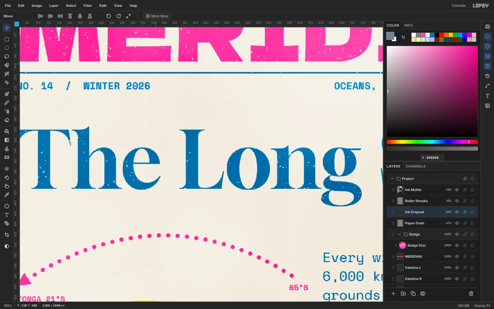

Real riso ink never lies perfectly flat. Add four layers at the top of the stack:

1. **Paper Grain.** Fill with `#808080`, then run **Add Noise** at **22**, **Mono**, **Gaussian**. Set it to **Overlay** at **45%**.
2. **Ink Dropout.**
   - Fill grey, then run **Add Noise** at **100**, **Mono**, **Uniform**.
   - Run **Gaussian Blur** at **3.5**, then **Threshold** at **146**. This leaves about 1% round white clumps.
   - With the **Magic Wand** (**Contiguous** off), click the black and press [[Delete]].
   - Give the specks a **Color Overlay** in the paper colour and set the layer to **80%**. The voids are invisible on paper but punch holes in the ink.
   - Delete them over the cover lines and barcode.
3. **Roller Streaks.** Fill grey, run **Add Noise** at 70, **Motion Blur** at **Angle 0**, **Distance 300**, and **Brightness/Contrast** at **Contrast +70**. Set it to **Soft Light** at **30%** to get faint horizontal banding in the solids.
4. **Ink Mottle.** Fill grey, run **Filter → Clouds…** at **Scale 3**, and set it to **Soft Light** at **30%** for uneven ink density.

Export with **File → Quick Export PNG**, and save the layered file with **File → Save Project**.
