Science magazines love a cover that is half photograph and half diagram. The animal is the hook, and a chain of magnified figures explains what you're looking at. This tutorial builds one for a made-up natural-history quarterly, *SPECIMEN*. The cover story is "The blue that isn't there": a kingfisher's back has no blue pigment. Its colour comes from a sponge of keratin and air that scatters blue light.

The bird is a real photo, pushed towards a hand-coloured engraving. Everything else is drawn in Lopsy with selections, filters and the Pen tool.

The photo is `Perched blue and orange bird (Unsplash).jpg` by Vincent van Zalinge on Wikimedia Commons, released under **CC0**. Download the **1920 px** wide version.

The palette is warm paper, one ink, one blue and one accent:

- Paper `#EFE8D8`, disc `#F6F1E6`
- Microscope field `#F8F4EA` → `#F1EBDD` → `#DDD2BC`
- Ink `#2B2420`
- Cobalt `#1D5F9E` (headline and every structural blue)
- Loupe orange `#C8552A`, section heads `#C0582A`
- Keratin `#EEE7D5`, cortex `#E2D3B6`, melanin `#5A3B2B`

## Set up the paper

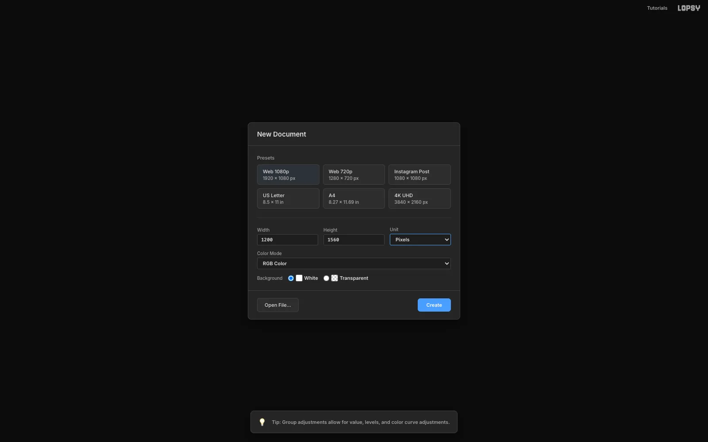

1. Choose **File → New**, set the **Unit** to **Pixels**, and enter **1200 × 1560**.
2. Rename `Background` to `Paper` and fill it with `#EFE8D8` (**Edit → Fill**).
3. Run **Filter → Add Noise…** at **Amount 5**, **Mono**, **Gaussian**. It's barely visible, but it stops the paper looking like a flat screen colour.

## Paste and scale the photo

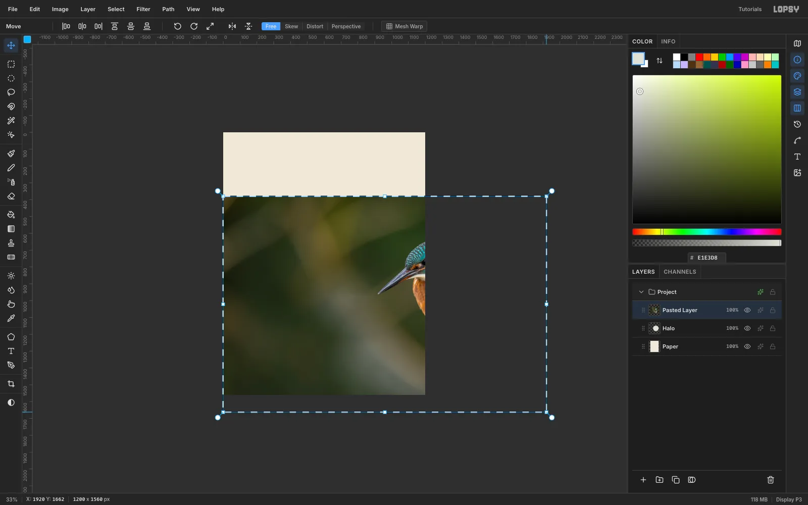

1. Copy the photo and press [[Cmd+V]]. Lopsy fits the paste to the canvas width, centres it, and switches to the **Move** tool with the transform box live.
2. Press [[Cmd+-]] twice to zoom out to 33%, so you can see past the canvas edge.
3. Hold [[Cmd]] and drag the bottom-right handle until the photo is back at its native **1920 × 1282**. [[Cmd]] keeps the proportions, and the top-left corner stays pinned.
4. Press [[Cmd+D]] to commit, then drag the photo so its top-left corner sits at **(−482, 308)**.

The bird's crown now sits about 560 px down, and the twig runs off the bottom edge. Rename the layer `Photo`.

## Select the background with the Magic Wand

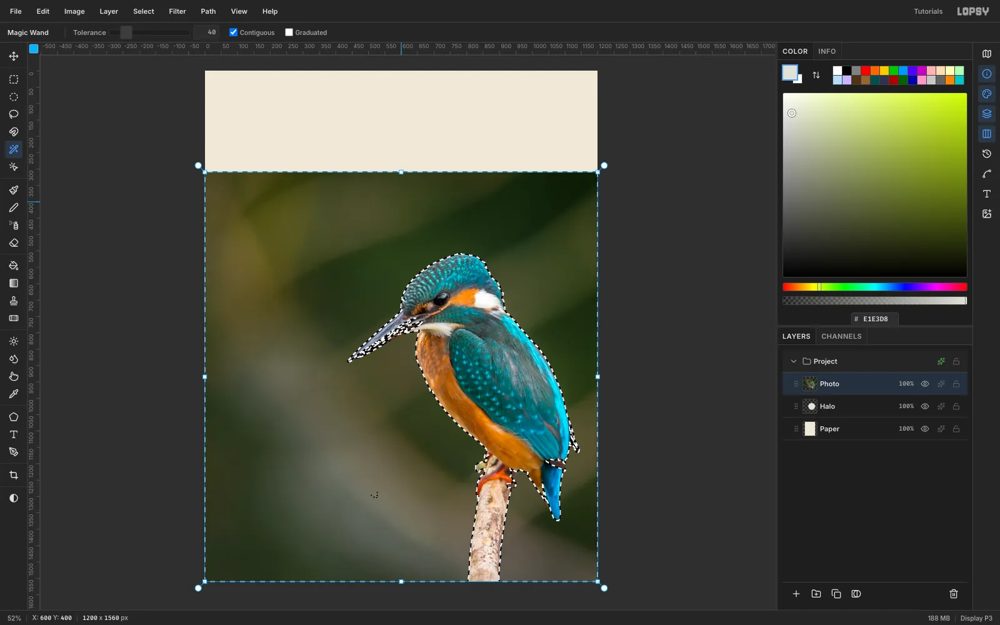

The soft bokeh background is easy to select and the bird is not, so select the background and invert.

1. Pick the **Magic Wand** with **Tolerance 40** and **Contiguous** on.
2. Click the background once. Then [[Shift]]-click seven more spots, including the corners and the patches beside the twig, until the ants hug the bird.
3. Choose **Select → Inverse**.
4. Choose **Select → Shrink…** 1 px, then **Select → Feather…** 1 px. This drops the green fringe and softens the edge.

## Cut out the bird and clean the edges

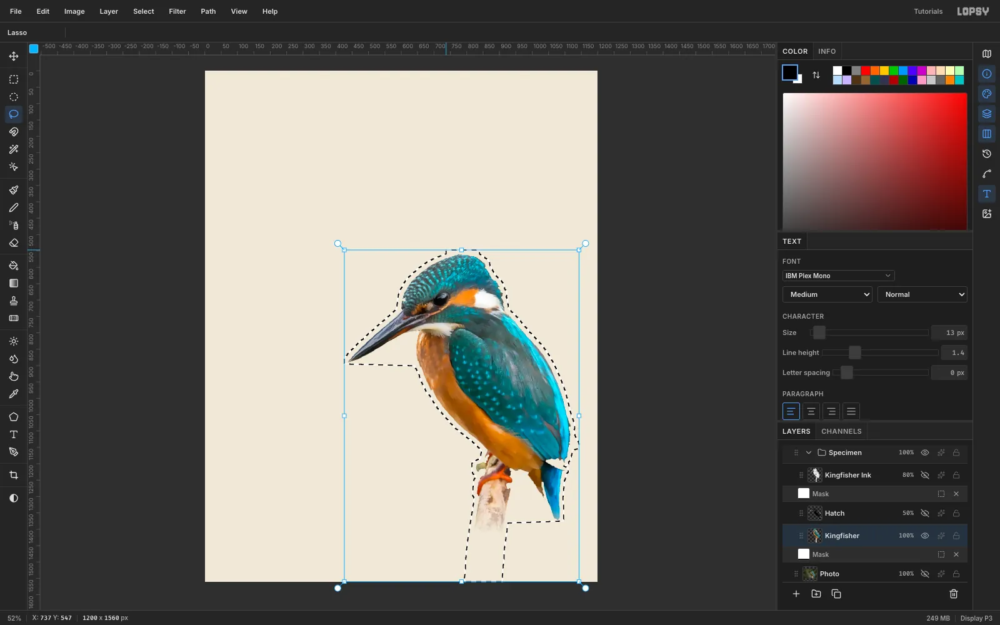

1. Press [[Cmd+C]], then [[Cmd+V]]. The paste lands in place on a new layer above the photo. Name it `Kingfisher` and hide `Photo`.
2. The feathered selection leaves a faint 1 px line along the photo's old edges. Draw a generous **Lasso** around the bird and twig, choose **Select → Inverse**, and press [[Delete]].

## Patch the beak from the photo

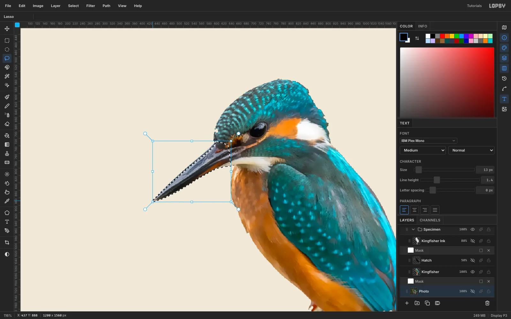

The lower mandible is nearly black, the same as the dark bokeh, so the wand took half of it.

1. Click the hidden `Photo` row and lasso the whole beak, from the tip back into the face feathers.
2. Choose **Select → Feather…** 1 px. Copy, then paste. The patch lands between `Photo` and `Kingfisher`.
3. Click `Kingfisher` and choose **Layer → Merge Down**. The bird is now whole. Rename the merged layer `Kingfisher`.

Do the same for any other holes, such as the gap under the chin.

## Draw ink linework with Find Edges

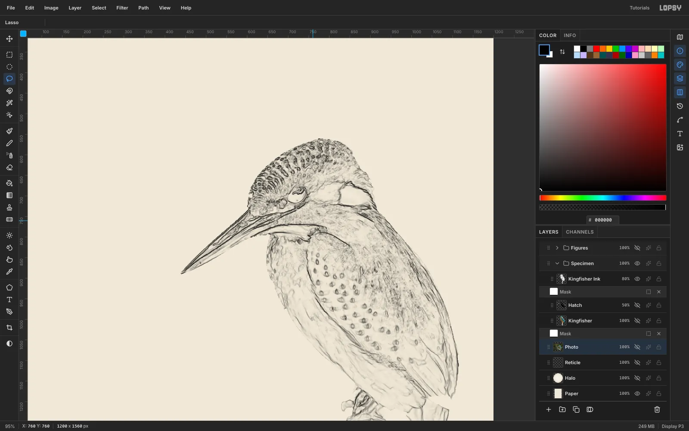

1. Lasso the bird again, then copy and paste it in place. Name the copy `Kingfisher Ink`.
2. Run **Filter → Surface Blur…** at **Radius 8**, **Threshold 28**. This removes feather noise but keeps the edges.
3. Run **Filter → Find Edges**, **Filter → Invert** and **Filter → Desaturate**. None of these has a dialog. You now have dark pen lines on white.
4. Set the layer's **Blend** to **Multiply** and its **Opacity** to **80%**. The white disappears and only the linework prints.

## Flatten the colour and add engraved hatching

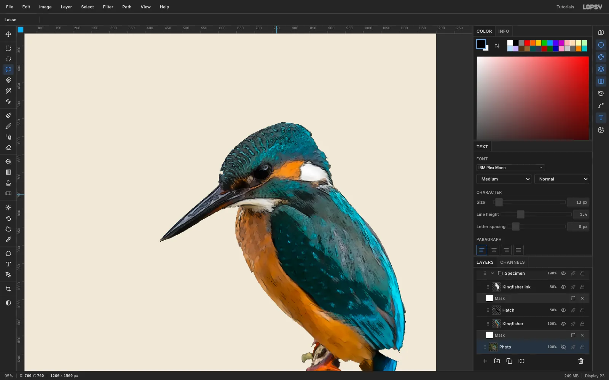

1. Select `Kingfisher` and run **Surface Blur…** at **Radius 10**, **Threshold 30**. The photo flattens into washes, like a hand-coloured plate.
2. For hatching, paste another copy of the bird between the two layers and name it `Hatch`. Run these filters on it:
   - **Desaturate**
   - **Add Noise…** at **Amount 70**, **Mono**, **Uniform**
   - **Motion Blur…** at **Angle 45**, **Distance 22**
   - **Threshold…** at **72**

   Now the darker the feathers, the more diagonal strokes they get.
3. Magic Wand a white area with **Contiguous** off and **Tolerance 20**, then press [[Delete]]. Marquee everything below **y 1300** and delete it too, so no strokes sit where the twig will fade. Set the layer to **Multiply** at **50%**.
4. The blur smears strokes past the silhouette. On `Kingfisher`, Magic Wand the empty area with **Contiguous** off, then click the `Hatch` row and press [[Delete]].

To trim any leftover grey fringe, reuse that same wand selection. Choose **Select → Grow…** 2 px, then press [[Delete]] on each bird layer. Clean up stray wing-tip pixels with a small **Eraser**.

> **Tip:** Don't trim a fringe by ⌘-clicking a layer's own thumbnail and then using Shrink, Inverse and Delete. A known bug makes that wipe the whole layer. The wand route above is safe.

## Fade the twig with a layer mask

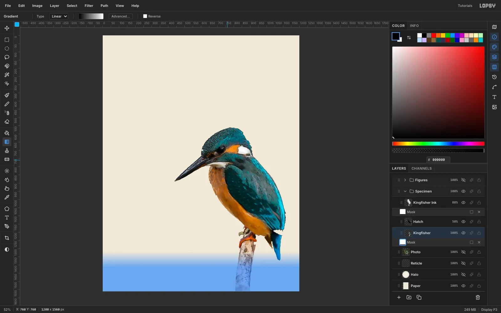

1. Select `Kingfisher` and click **Add Mask** in the Layers panel, then click the **Mask** row to edit it.
2. Pick the **Gradient** tool. Open **Advanced…**, set the stops to white then black, and drag from **y 1318** down to **y 1412**. The blue overlay shows the hidden part.
3. Repeat on `Kingfisher Ink`. The `Hatch` layer has nothing that low.
4. Click the `Kingfisher` row to leave mask editing.

[[Shift]]-click to select all three bird layers and choose **Layer → Group Layers**. Name the group `Specimen`.

## Build the microscope field

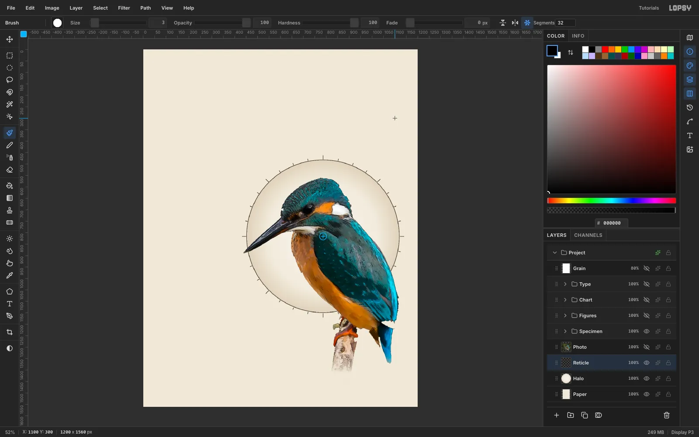

1. Add a `Halo` layer below `Specimen`. Draw an **Elliptical Marquee** 665 px across, centred on **(785, 815)**.
2. Pick the **Gradient** tool and set it to **Radial**. Set the stops to `#F8F4EA` at 0%, `#F1EBDD` at 72% and `#DDD2BC` at 100%. Drag from the centre out to the rim.

Add a `Reticle` layer for the tick marks:
1. Pick the **Brush** at **Size 3** with ink `#2B2420`.
2. Click **Radial Symmetry**, set **Segments** to **32**, and [[Cmd]]-click the disc centre to move the symmetry centre there.
3. Drag one short tick at 12 o'clock, from 4 px to 12 px outside the rim. You get 32 ticks at once.
4. Change **Segments** to **8** and drag a longer tick, out to 20 px.
5. Turn Radial Symmetry off. While it's on, it takes over every [[Cmd]]-click.
6. Finish with a 2 px rim. Fill a circle 669 px across, choose **Select → Shrink…** 2, and press [[Delete]].

The beak and tail break out of the field, which keeps the bird from looking pasted into a porthole.

## Draw Fig. 1: a barb in cross-section

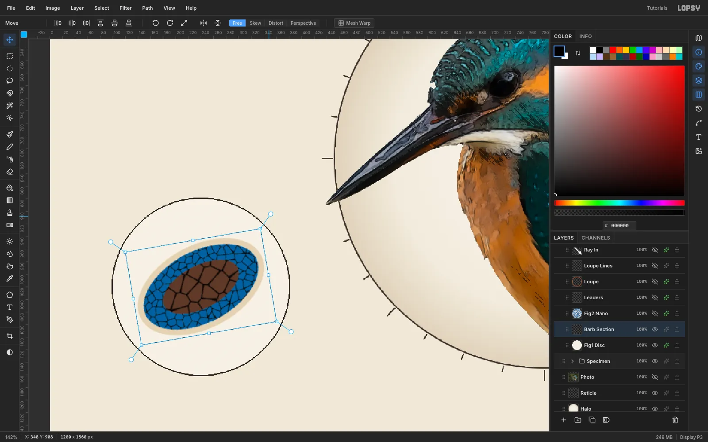

1. Click a root layer below `Specimen` and click **New Group**. Name the group `Figures` and drag it above `Specimen`. New Group nests inside whichever group is active, so start from a root layer.
2. Add `Fig1 Disc` inside it: a circle of radius **140** at **(240, 1020)** in `#F6F1E6`, with a 2 px ink **Stroke** effect.

Draw the barb on three layers, all centred on the disc:
1. **Cortex:** a 216 × 132 ellipse filled `#E2D3B6`.
2. **Spongy layer:** fill a rectangle a little larger than the ellipse with blue. Run **Filter → Voronoi…** at **Cells 130**, **Edge Width 2**. Then select the same ellipse, **Shrink…** it 9 px, **Inverse**, and **Delete**. Filling a block first keeps the edge smooth, because Voronoi gives every cell its own alpha.
3. **Core:** do the same with a `#5A3B2B` block, **Voronoi** at **Cells 70**, **Edge Width 3**, clipped to a 132 × 68 ellipse.

Merge the three layers down into `Barb Section`. Then marquee it, drag the rotate handle to about **−18°**, and press [[Cmd+D]].

Finally, recolour the blue cells to the headline cobalt. Magic Wand one cell with **Contiguous** off, then **Edit → Fill** with `#1D5F9E`.

## Grow Fig. 2's nanostructure

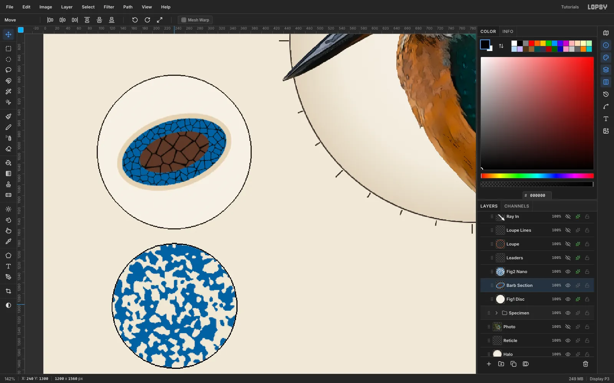

1. Add `Fig2 Nano` and fill a circle of radius **113** at **(240, 1302)** with cobalt.
2. On a second layer, fill a slightly bigger circle with mid-grey. Run these filters on it:
   - **Add Noise…** at **100**, **Mono**, **Uniform**
   - **Gaussian Blur…** at **Radius 10**
   - **Threshold…** at **128**

   The blurred noise splits into a connected labyrinth, which is surprisingly close to real TEM images of the spongy keratin.
3. Magic Wand the black with **Contiguous** off and press [[Delete]]. Then [[Cmd]]-click the layer's thumbnail and **Edit → Fill** what's left with `#EEE7D5`.
4. Trim it to the disc: select the disc's circle, choose **Inverse**, and **Delete**.
5. Merge it down onto `Fig2 Nano` and give the layer a 2 px ink **Stroke**.

## Connect the zoom chain

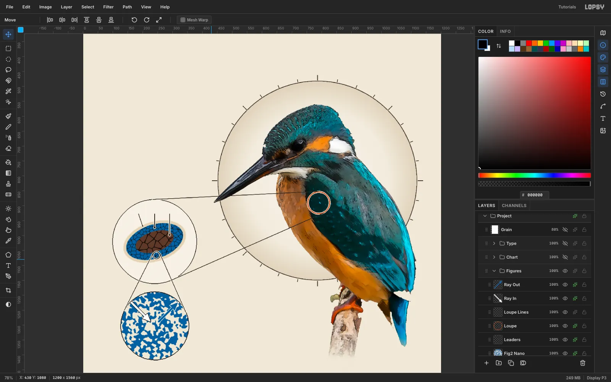

Each magnification needs a visible link to the one before it.

**Loupe.** On a `Loupe` layer, make a 3 px orange ring (`#C8552A`) of radius 38 at **(790, 890)**, on the spangled wing coverts. Fill the circle, **Shrink…** 3, then **Delete**. Give it a 2 px cream **Stroke** so it reads on the dark wing.

**Loupe lines.** On a plain `Loupe Lines` layer, set the Brush to **Size 2.6**. Click one end, then [[Shift]]-click the other to draw each tangent line:
- (788, 852) → (233, 879)
- (805, 925) → (297, 1149)

**Leaders.** On `Leaders`:
1. Draw a small ring on the barb's lower blue band at **(246, 1066)**.
2. Draw its two tangent lines down to Fig. 2's rim.
3. Draw three vertical leaders from the numerals 1, 2 and 3 above the barb. End each with a 5–7 px dot inside the cortex, the blue layer and the core.
4. Give `Leaders` a 2 px cream **Stroke** so the lines stay crisp where they cross colour.

**Arrows.** Inside Fig. 2, draw a white arrow pointing in from the upper-left and a cobalt arrow pointing out to the upper-right. Draw each shaft with a Brush [[Shift]]-click line, and lasso-fill a triangle for the head. Give the white arrow an ink Stroke and the blue arrow a cream Stroke.

## Plot the reflectance curve

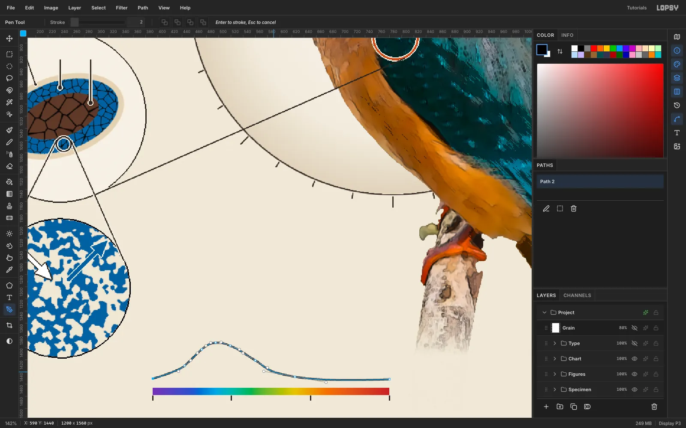

1. Make a `Chart` group with a `Spectrum` layer.
2. In the **Gradient** tool's **Advanced…** editor, set eight stops:
   - 0% `#6E35B0`
   - 17% `#2F4FC8`
   - 27% `#1FA2DE`
   - 33% `#20B8B0`
   - 43% `#57B04A`
   - 60% `#E0C834`
   - 73% `#E57A2E`
   - 100% `#B8302E`
3. Drag across a 388 × 12 marquee at **(392, 1466)**.
4. On a `Reflectance` layer, draw 6 px ticks under the bar at 400, 500, 600 and 700 nm. Those are x 392, 521, 651 and 780.

Draw the curve with the **Pen** tool:
1. Set **Stroke** to 3 and the foreground to ink.
2. Click the first anchor at (392, 1451). Then *drag* each middle anchor along the curve's direction to pull out smooth handles. Peak at **(496, 1392)**, over 480 nm, and fall to a long tail at (780, 1452).
3. Press [[Enter]]. The path is committed to the Paths panel and stroked onto the active layer in one step.

## Set the type

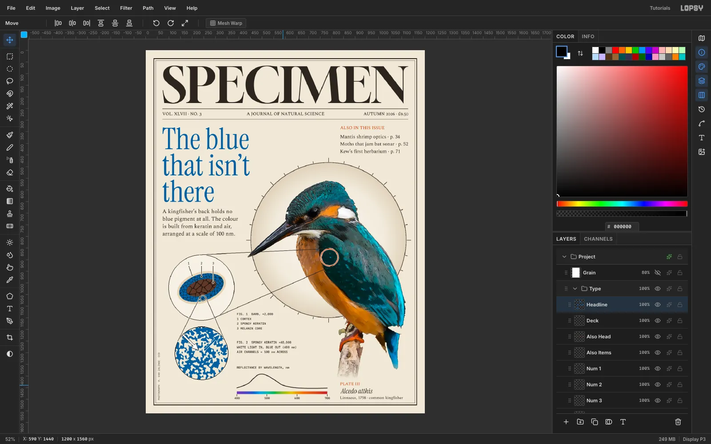

Everything hangs off four edges: **x 72** and **x 1128** for the full measure, **x 392** for the captions, and **x 836** for the right column.

- **Masthead:** `SPECIMEN` in **Gloock** at **210 px**, ink, spanning x 72 to 1128 and centred between the frame and a 2 px rule at y 250.
- **Dateline:** **Spectral SC Medium**, 19 px, between that rule and a hairline at y 295. It has three parts:
  - `VOL. XLVII · NO. 3` on the left
  - `A JOURNAL OF NATURAL SCIENCE`, centred with **Align center horizontally**
  - `AUTUMN 2026 · £9.50` flush right
- **Headline:** `The blue / that isn't / there` in **Instrument Serif** at **128 px**, cobalt, with **Line height 0.88** set in the Text panel *before* you click. Its top is at y 330.
- **Deck:** **Spectral** at 24 px with line height 1.32. Put four lines at x 72 with the top at y 682, clear of the field's 9 o'clock tick.
- **Contents:** `ALSO IN THIS ISSUE` in Spectral SC 19 px, `#C0582A`, over three lines of Spectral 21 px, all at x 836.
- **Captions:** **IBM Plex Mono Medium**, 13 px, at x 392:
  - Fig. 1's number and key
  - Fig. 2's three lines
  - `REFLECTANCE BY WAVELENGTH, nm` above the chart
- **Axis labels:** `400`, `500`, `600` and `700`, each centred on its tick.
- **Plate block:** `PLATE III` in Spectral SC 18 px orange. Below it, `Alcedo atthis` in Instrument Serif **Italic** at 30 px, then `Linnaeus, 1758 · common kingfisher` in Spectral 17 px.
- **Frame:** two keylines, 3 px at a 34 px inset and 1 px at 43 px. For each, fill a rectangle, **Shrink** it, and **Delete**.

> **Tip:** Create every text layer in an empty patch of canvas, then move it. A click inside an existing text layer's box edits that layer. The masthead's box is much wider and taller than its letters.

## Add the credit and paper grain

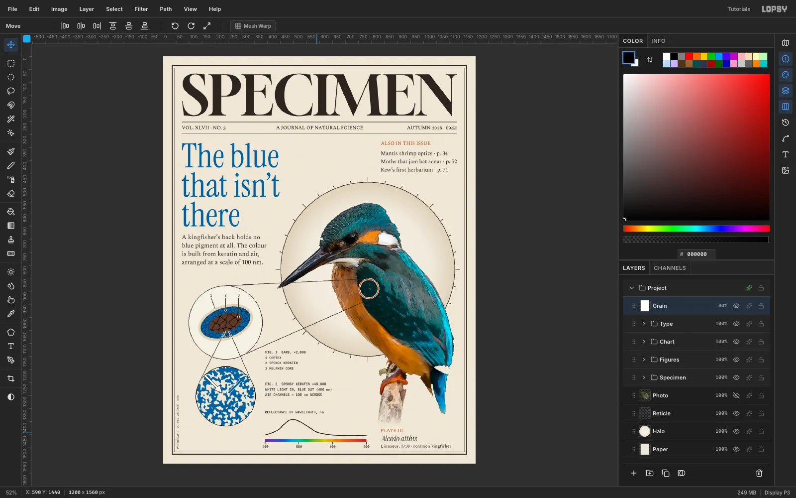

**Credit.**
1. Type `PHOTOGRAPH  V. VAN ZALINGE  CC0` in Plex Mono 11 px in a warm grey.
2. Click **Rasterize Layer**.
3. Marquee it, switch to the **Move** tool, and hold [[Cmd]] while you drag the rotate handle. The angle snaps to exactly −90°.
4. Press [[Cmd+D]] and move it into the left margin at x 53.

**Grain.**
1. Add a `Grain` layer at the very top.
2. Fill it white and run **Add Noise…** at **30**, **Mono**, **Gaussian**.
3. Set it to **Multiply** at **80%**. The type and diagrams now look printed rather than rendered.

Save with **File → Save Project**, and export with **File → Quick Export PNG**.
