Screen-printed cards from the 1970s have a look you can spot across a room. Every colour is a flat ink, shading is a field of halftone dots and nothing is blended with a soft brush. That makes them a good fit for Lopsy: you only need a handful of inks and the right filters.

This tutorial makes *Ursa Solstice*, a made-up card for the longest night of the year. It has:
- an arched night sky with a sunburst, aurora ribbons and a sprayed starfield
- a gold Big Dipper and a huge moon with a halftone shadow
- a bear drawn with the Pen tool, with a red scarf and an offset "misprint" ghost
- teal hills, pines copied across with copy and paste, and a tiny cabin
- a snowy foreground printed in halftone dots
- chunky slab type with a red shadow, a seal with text set around a circle, and print marks

The palette is a cream paper and four inks (navy, teal, gold and vermilion), with a darker or lighter tint of a few of them:

- Paper `#F1E7CF` and snow `#F6EEDA`
- Navy `#1B2762` and deep navy `#0D1236` (the bear and pines, nearly black)
- Teal `#2EA89C` and dark teal `#1F7F84`
- Gold `#F4B633`
- Vermilion `#E2472B`
- Ray blue `#2B3C94` (the sunburst only)

Take your time with the first few steps. Most of the shapes in the card are clipped to the arch you draw in step 2.

## Start a portrait card on cream paper

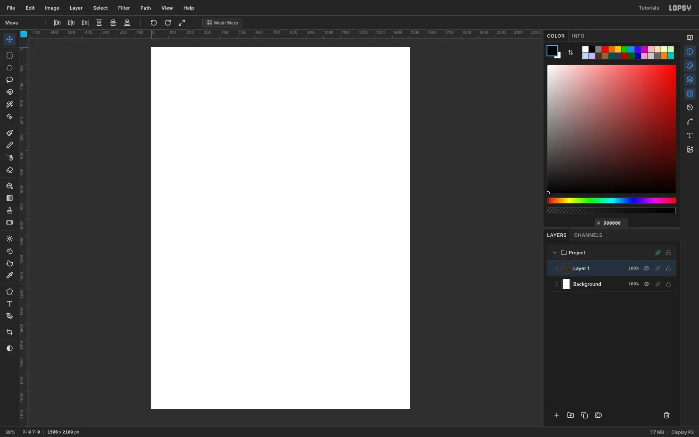

1. Choose **File → New** and make a **1500 × 2100 px** document (Unit = Pixels).
2. Set the foreground to `#F1E7CF`, select the `Background` layer and run **Edit → Fill**. That's the paper.
3. Select `Layer 1` and rename it `Sky Navy`.

Everything after this goes on its own layer, so you can change one ink without touching the rest.

## Draw the arch and fill it navy

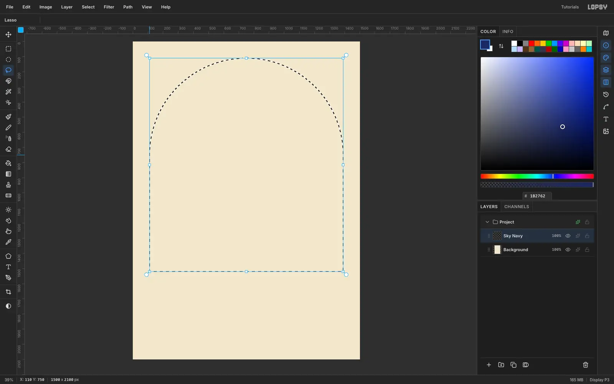

Set the foreground to navy `#1B2762`. Pick the **Lasso** and drag one smooth outline: up the left side, a half-circle over the top, down the right side and back along the bottom to where you started. Leave a generous margin of paper, roughly a tenth of the card's width, on the left, right and top. Go slowly on the dome, because the gold keyline in step 23 is built from this exact selection and it will copy every wobble. Run **Edit → Fill**.

If the dome looks lumpy, press [[Cmd+Z]] and redraw it. A redo is cheap.

## Add a sunburst of rays

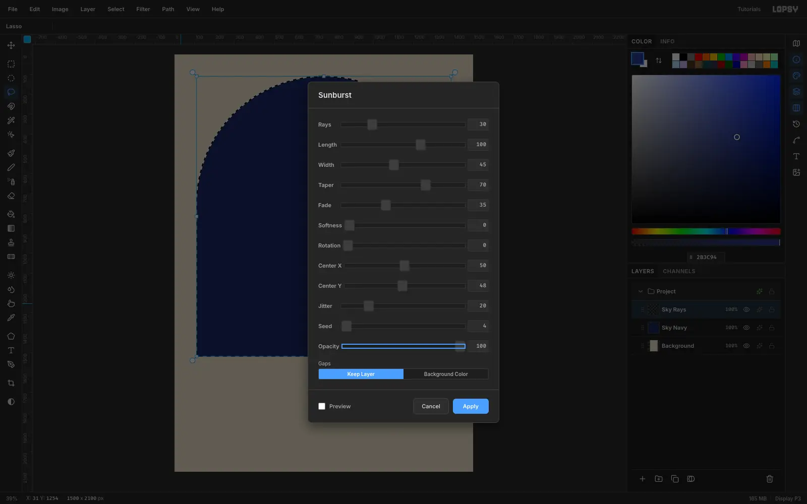

1. Add a layer above `Sky Navy` named `Sky Rays`.
2. [[Cmd]]-click the `Sky Navy` thumbnail to select the arch again.
3. Set the foreground to ray blue `#2B3C94` and open **Filter → Sunburst**.
4. Try **Rays 30**, **Length 100**, **Width 45**, **Taper 70**, **Fade 35**, **Jitter 20** and **Center Y 48**. Nudge **Seed** until you like the gaps between the rays, then **Apply**.

Center X and Center Y are percentages of the card, so Y 48 puts the burst's hub 48% of the way down, right where the moon will sit.

## Lasso an aurora ribbon

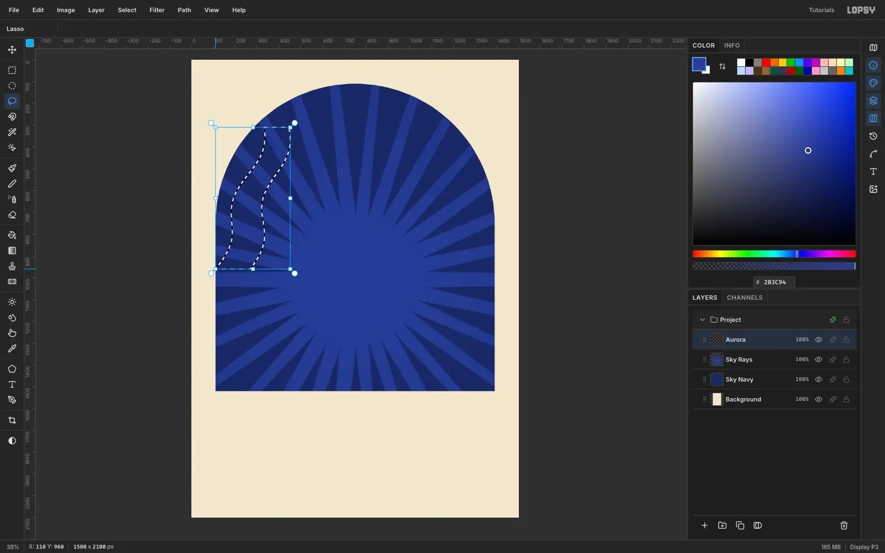

Add a layer called `Aurora`. Choose the **Gradient** tool, click the gradient preview in its options bar and set the two stops to teal `#2EA89C` and the same teal with its alpha at 0. Lasso a tall, wavy ribbon up the left side of the arch, thinner at the top than the bottom, and drag the gradient from the bottom of the ribbon to the top. Do a second ribbon, slightly different, up the right side.

Because the gradient fades out, each ribbon dissolves into the sky as it rises.

## Turn the aurora into halftone dots

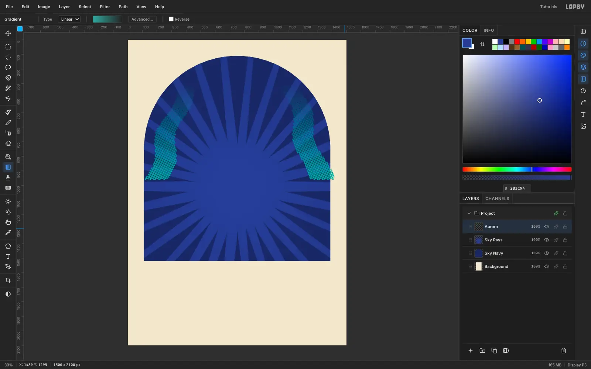

With nothing selected, run **Filter → Halftone…** on `Aurora` with **Dot Size 22**, **Density 2** and **Angle 20**, then **Apply**.

A halftone turns the soft fade into one-ink dots that grow and shrink. That's the whole trick behind a screen-print gradient.

## Paint the moon

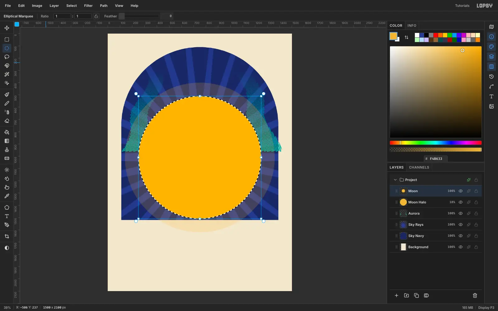

1. Add a layer `Moon`. Use the **Elliptical Marquee** to drag a big circle in the middle of the arch and fill it gold `#F4B633`. Hold [[Shift]] while you drag to keep it a true circle.
2. Click the `Aurora` layer and add a layer `Moon Halo`, so it sits just under `Moon`.
3. With the circle still selected, run **Select → Grow…** with about 40 px, fill it gold and set the layer to **18%**.

The halo is a ring of pale gold around the disc, which is what makes the moon look like it's glowing.

## Shade the moon with halftone

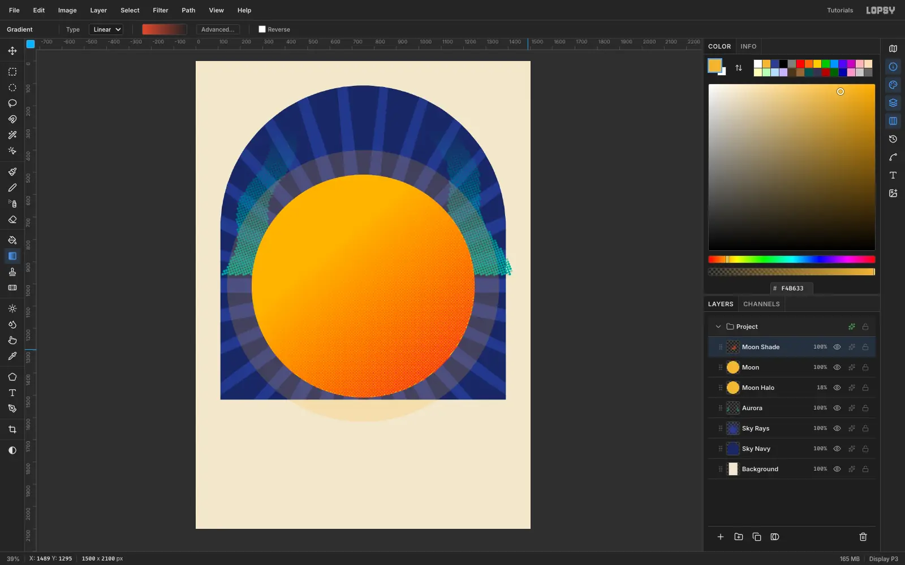

1. Add a layer `Moon Shade` on top and [[Cmd]]-click the `Moon` thumbnail to select the same circle again.
2. Pick a linear gradient from vermilion `#E2472B` to vermilion at 0% alpha. Drag from the moon's lower right toward its upper left.
3. Deselect and run **Filter → Halftone…** with **Dot Size 18**, **Density 2** and **Angle 45**.
4. Set the layer to **60%** so the red dots warm the gold without taking it over.

## Clip the halo to the arch

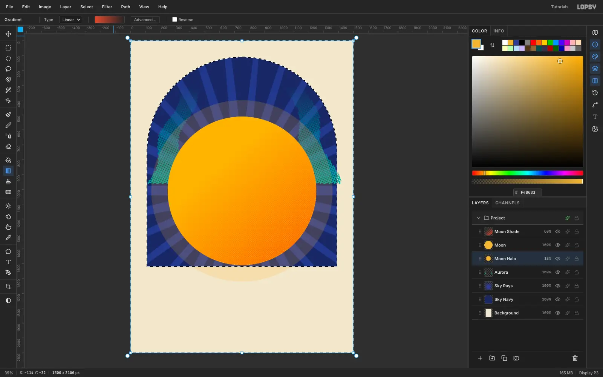

The halo spills out of the arch onto the paper. Select `Moon Halo`, [[Cmd]]-click the `Sky Navy` thumbnail, then choose **Select → Inverse** and press [[Delete]]. Deselect.

Now click the small sparkle icon at the right of the `Moon Halo` row to open its effects drawer and set its blend mode to **Screen**. It brightens the sky behind the moon into a gold-tinged ring. Raise `Moon Halo` to **28%** and drop `Moon Shade` to **42%** while you're here, so the moon glows without looking dirty.

## Spray a starfield

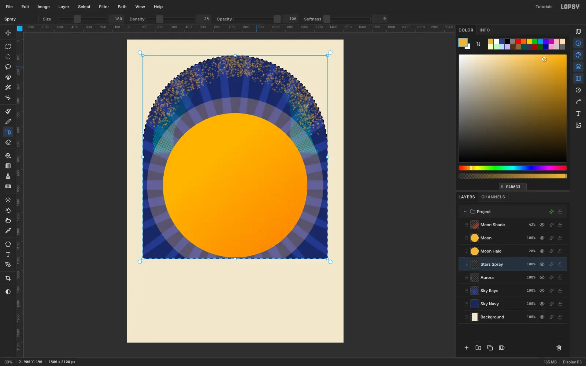

1. Add a layer `Stars Spray` above `Aurora`.
2. [[Cmd]]-click the `Sky Navy` thumbnail so the spray stays inside the arch.
3. Set the foreground to gold. Choose the **Spray** tool and set **Size 180**, **Density 25**, **Softness 0** and **Opacity 100**. Softness is backwards on this tool: 0 is the softest setting.
4. Drag a slow arc down the left edge of the dome, another down the right, and a short one across the top.

Keep the middle of the sky clear. Quiet space makes the Big Dipper pop.

## Join the Big Dipper with lines

Add a layer `Big Dipper`, set the foreground to paper `#F1E7CF` and pick the **Pencil** at **Size 5**. The Dipper is a four-sided bowl with a handle of three stars curving away to the upper left. Click the first star of the bowl, then [[Shift]]-click each of the others to draw straight lines between them. Close the bowl by clicking back on the first point, then click the end of the handle and Shift-click its stars in turn.

Shift-click lines are far cleaner than dragging, and you can undo a bad one without losing the rest.

## Turn the dots into sparkles

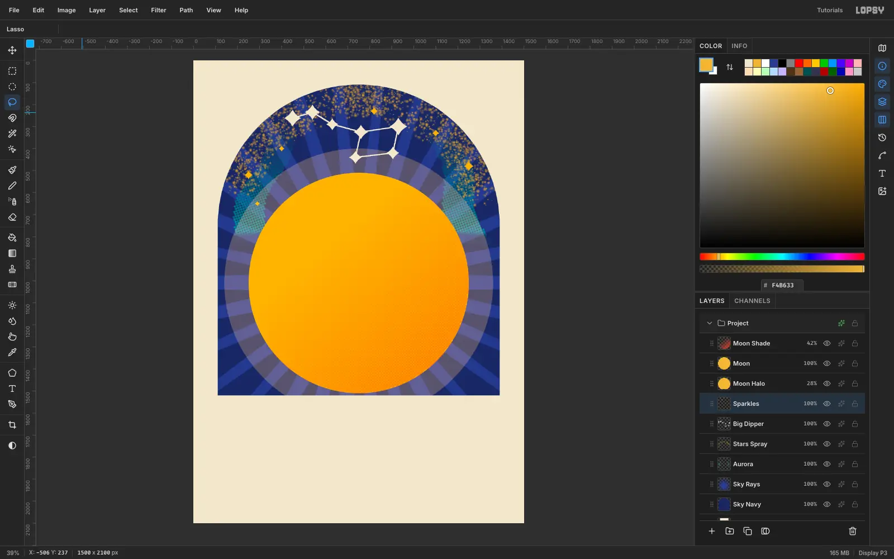

Lasso a small four-pointed star on each of the Dipper's points and fill it with paper. Click the lasso in a plus shape: a point top, bottom, left and right, with the corners pulled in. Then add a layer `Sparkles` and scatter eight or nine smaller gold ones around the sky, varying their size.

Make the Dipper stars bigger than the loose sparkles. The eye follows size, so this is how you lead the viewer to the constellation.

## Roll out two teal hills

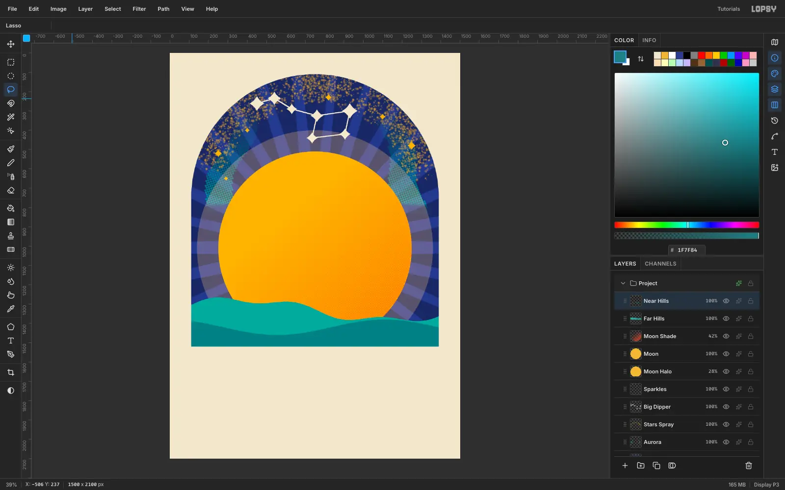

1. Add `Far Hills` above `Moon Shade` and lasso a gentle ridge across the bottom of the moon, running well past the edges of the arch. Fill it with teal `#2EA89C`.
2. Add `Near Hills` and lasso a lower, flatter ridge, filling it with the darker teal `#1F7F84`.
3. To trim both to the arch, [[Cmd]]-click the `Sky Navy` thumbnail, choose **Select → Inverse**, and press [[Delete]] on each hills layer in turn. Deselect.

## Draw the bear with the Pen tool

Add `Bear` above `Near Hills` and pick the **Pen** tool. Click once for a corner, or click and drag to pull out a curve handle. Start at the tip of the nose, curve up over the forehead and along the long humped back, drop down the rump and the back leg, tuck up into the belly, then down and back up the front leg and under the chin to the nose again. Close the shape by clicking the first anchor.

Keep the pose simple, a chunky bear in profile walking left, with a flat belly, two stubby legs and no tail. Take as many points as you need. The Pen keeps every anchor editable, so it's much easier to refine than a lasso.

## Turn the path into a navy bear

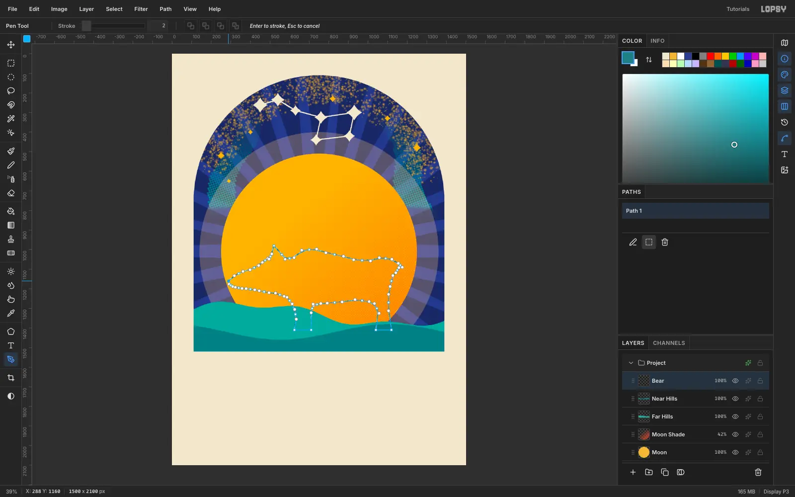

1. Open the **Paths** panel and press **Path to Selection**.
2. Set the foreground to deep navy `#0D1236`, select the `Bear` layer and run **Edit → Fill**.
3. Deselect, then delete `Path 1` so the panel stays tidy.

## Add an offset ghost under the bear

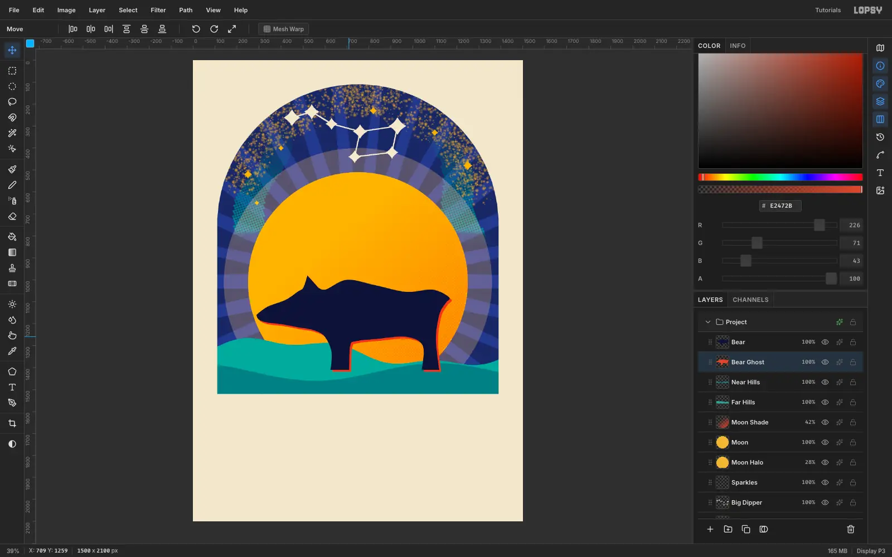

1. [[Cmd]]-click the `Bear` thumbnail to select its shape.
2. Select `Near Hills`, add a layer called `Bear Ghost` and fill it vermilion.
3. Deselect, pick the **Move** tool and nudge the ghost down and to the right until just a thin sliver of red shows along the bear's belly and back.

That sliver of red is a deliberate misregistration, the kind you get when the second ink is printed slightly off. It gives the bear a rim of light on one side.

## Wrap a scarf around its neck

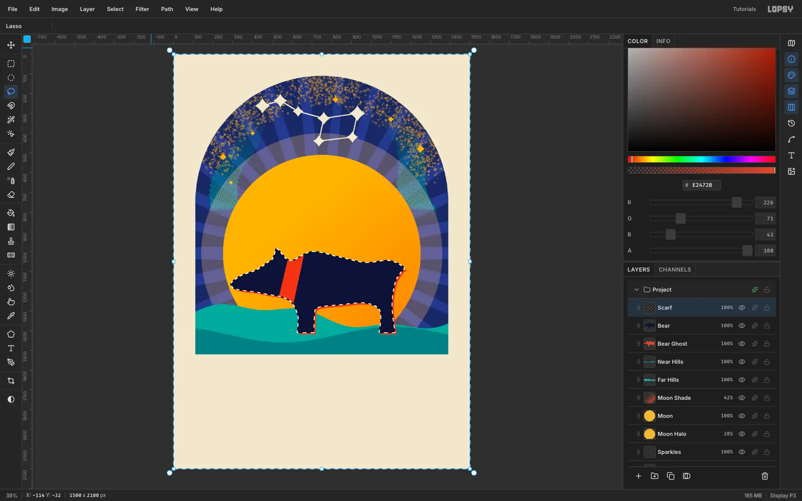

1. Add a layer `Scarf` above `Bear`. Lasso a slanted band across the neck, from the top of the shoulders down to the throat, and fill it vermilion.
2. [[Cmd]]-click the `Bear` thumbnail, run **Select → Inverse** and press [[Delete]], so the band can't spill past the bear.
3. Deselect and lasso two long, tapering tails streaming back from the knot on the same `Scarf` layer. Fill them vermilion.

A moving scarf tells the viewer the air is cold and the bear is walking.

## Copy a cluster of pines

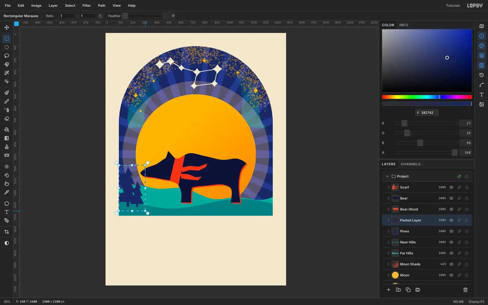

1. Add `Pines` above `Near Hills` and lasso two different-height pine trees in deep navy `#0D1236` on the left of the hills.
2. Use the **Rectangular Marquee** to box the whole cluster and press [[Cmd+C]] then [[Cmd+V]].

The paste lands on a new layer, which is exactly what you want.

## Move the copy to the other side

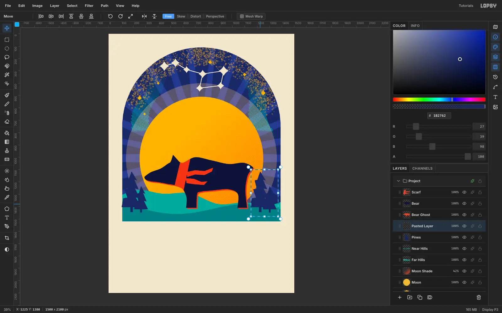

Pick the **Move** tool and drag the pasted layer across to the right edge, then rename it `Pines Right`. Both clusters should already be the same navy because they're copies of one another. If one looks lighter, [[Cmd]]-click its thumbnail and fill the selection again with deep navy.

Using the same trees on both sides is how screen printers frame a picture without drawing twice.

## Lay down a snowy foreground

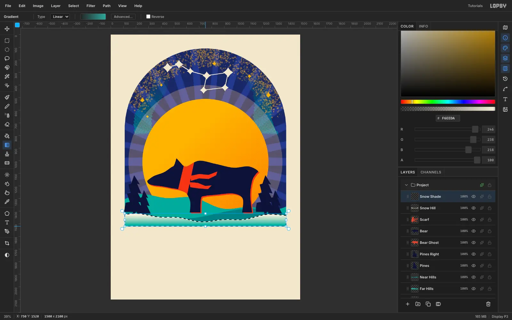

1. Add `Snow Hill` above `Near Hills` and lasso a wavy snow ridge in snow `#F6EEDA`, running past the arch's bottom edge.
2. [[Cmd]]-click its thumbnail, add a layer `Snow Shade`, and drag a teal gradient (full teal at the start, 0% alpha at the end) from the bottom of the snow up to its crest.

## Print the snow shading in dots

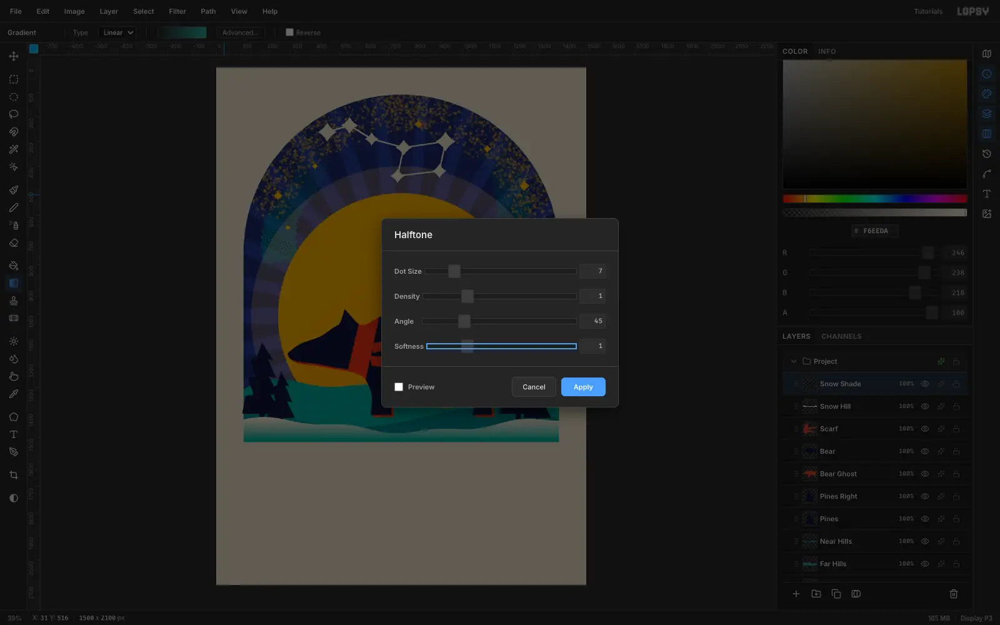

With nothing selected, run **Filter → Halftone…** on `Snow Shade` with **Dot Size 7** and **Angle 45**, then **Apply**. A smaller dot than the aurora gives the snow a finer grain.

## Build a tiny cabin

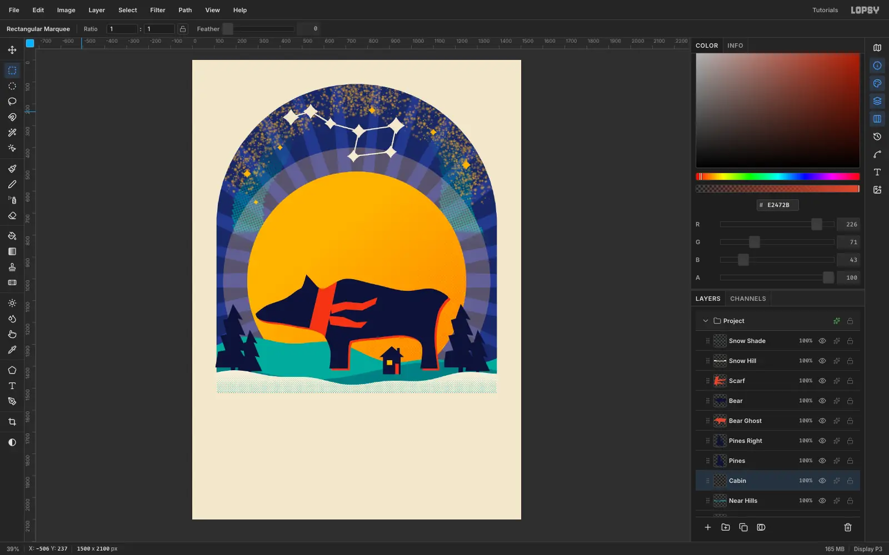

Add `Cabin` above `Near Hills`. Place it on the teal ridge to the right of the bear's back leg, small enough that the bear dwarfs it. Use the marquee to fill a deep navy rectangle, then lasso a triangle for the roof and a thin rectangle for the chimney. Fill a gold window and a vermilion door.

A lit window is the story in this card: somewhere on the longest night, someone's home.

## Let the chimney smoke drift

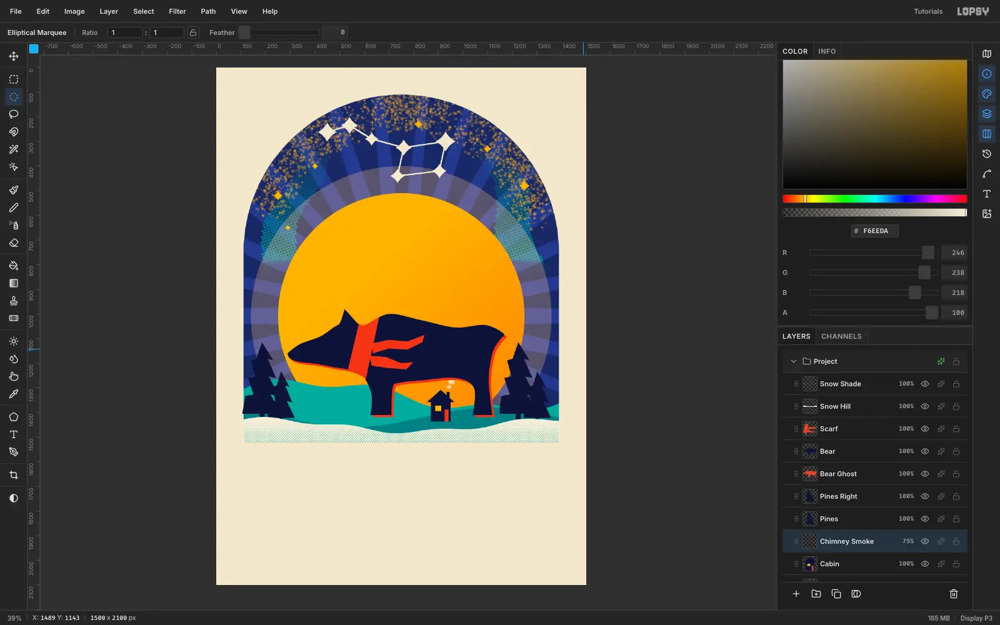

On a layer `Chimney Smoke`, fill four ellipses in snow `#F6EEDA`, getting bigger and more spaced as they rise. Set the layer to **75%** and run **Filter → Gaussian Blur…** at **Radius 3** to soften the puffs.

Everything else in the card is a hard-edged ink, so this is one of the few soft shapes in it.

## Trace a gold keyline around the arch

1. [[Cmd]]-click the `Sky Navy` thumbnail, then select `Snow Shade` and add a layer `Keyline`, so it sits above the scenery.
2. Run **Select → Shrink…** with **22** and fill with gold.
3. Run **Select → Shrink…** with **5** and press [[Delete]].
4. Deselect.

The thin ring that's left is the keyline. It echoes the arch and gives the picture a frame.

## Set URSA in a slab face

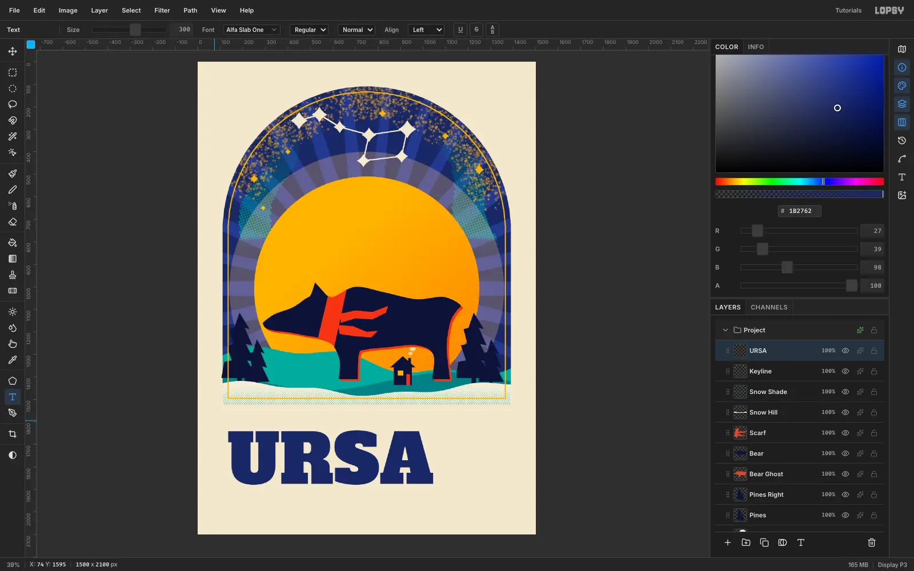

Set the foreground to navy, pick the **Text** tool and choose **Alfa Slab One** at **Size 300**. Click under the arch, type `URSA` and press the **Commit text** checkmark. Pressing [[Esc]] cancels the text, so use the checkmark.

## Set SOLSTICE beneath it

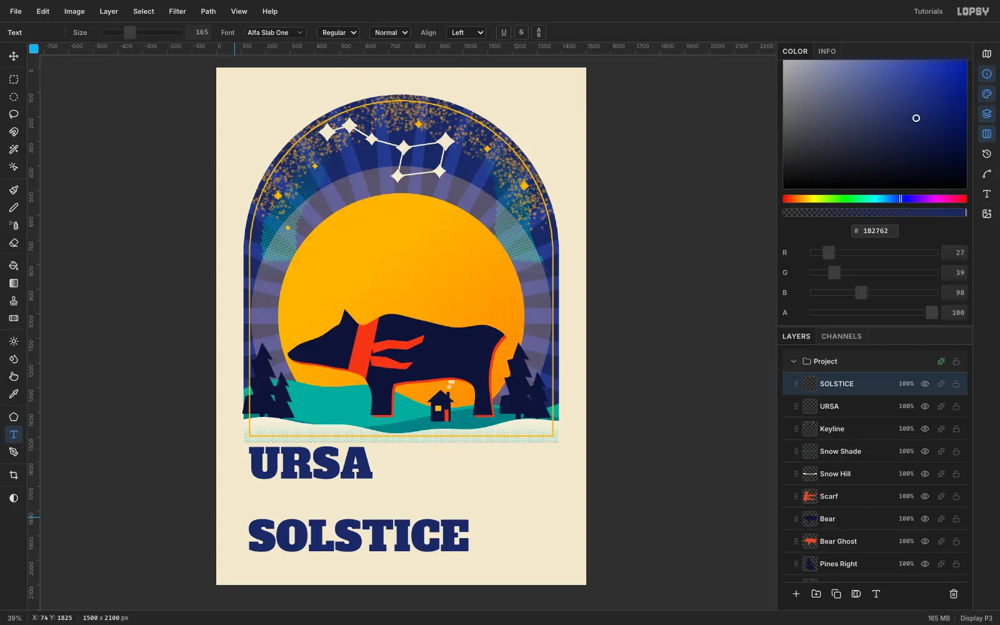

Make the second word the same width as the first by lowering the size: **Size 165** is right for SOLSTICE. Click below URSA, type the word and commit.

Move SOLSTICE up until the two words are nearly touching, with just a sliver of paper between the baseline of URSA and the tops of the next line.

## Give the type a vermilion misprint

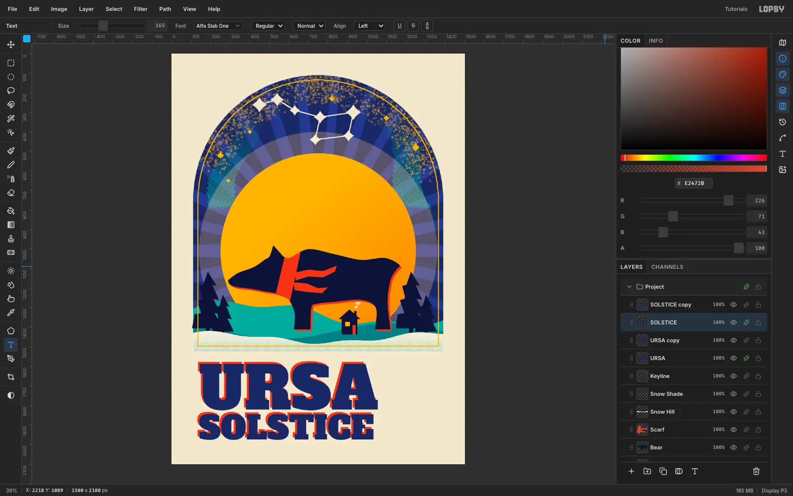

1. With a title layer selected, press **Duplicate Layer**. The copy lands slightly down and to the right.
2. Select the lower layer, click the small sparkle icon on its row to open the effects drawer and turn on **Color Overlay**. Set the colour to vermilion `#E2472B`.
3. Do the same for `URSA`.

The red layer sits behind the navy one, and the offset gives a screen-print look for free.

## Draw the seal

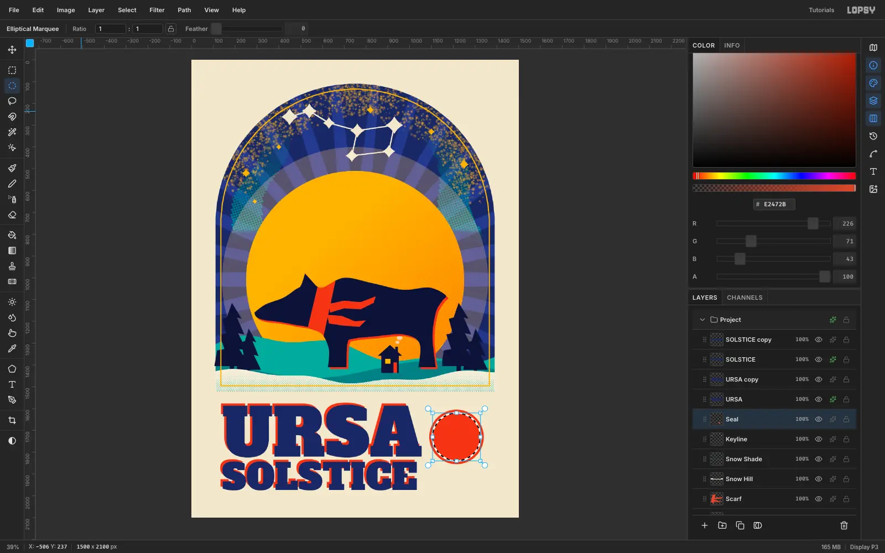

1. Add a layer `Seal`. Use the Elliptical Marquee, holding [[Shift]], to make a circle beside the title and fill it vermilion.
2. Run **Select → Shrink…** with **10** and fill paper.
3. **Select → Shrink…** with **5** and fill vermilion again.
4. **Select → Shrink…** with **28**, then run **Select → Selection → Path** to turn the selection into a circular path.
5. Deselect.

That one thin paper ring is all the seal needs to feel stamped.

## Set text around the ring

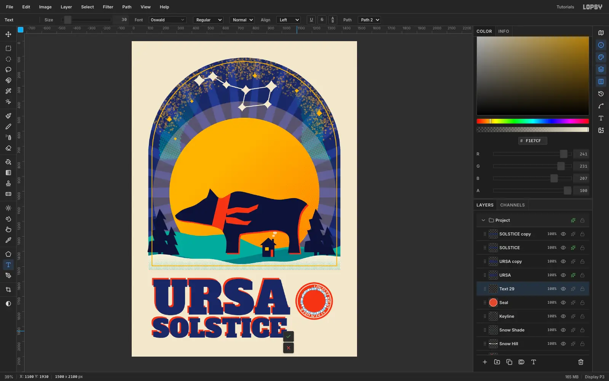

Pick the **Text** tool, set the foreground to paper, choose **Oswald** at **Size 30**, click near the seal and type `LONGEST NIGHT · 21 DECEMBER · `. While the text is still open, pick the path in the **Path** dropdown in the options bar. The words bend around the circle. Commit the text.

If the words don't meet at the join, add or remove a space at the end.

## Put a star in the middle

Select the `Seal` layer first so the star ends up on it. Lasso an eight-pointed star in the middle of the seal and fill it paper. Then fill a small vermilion circle in the centre.

## Add a small credit line

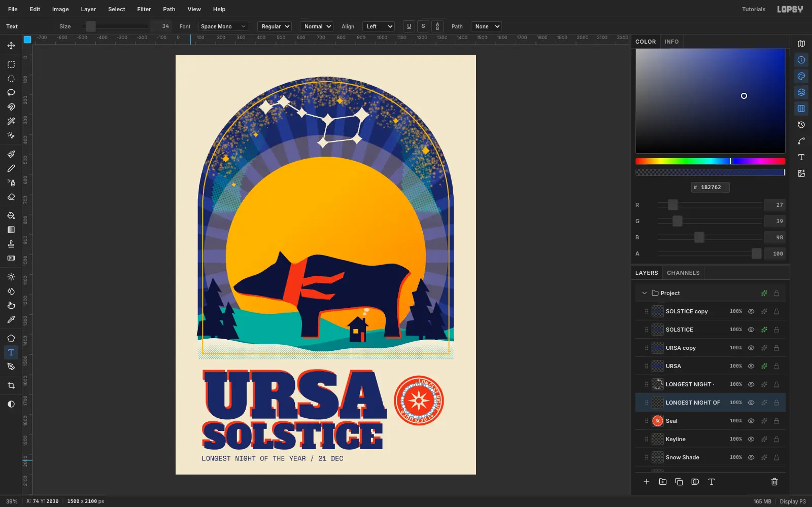

Set the foreground to navy, pick **Space Mono** at **Size 34**, click in the bottom left margin and type `LONGEST NIGHT OF THE YEAR / 21 DEC`. Commit.

A tiny monospaced line against heavy slab type is a classic mix of one loud voice and one quiet one.

## Set guides for the print area

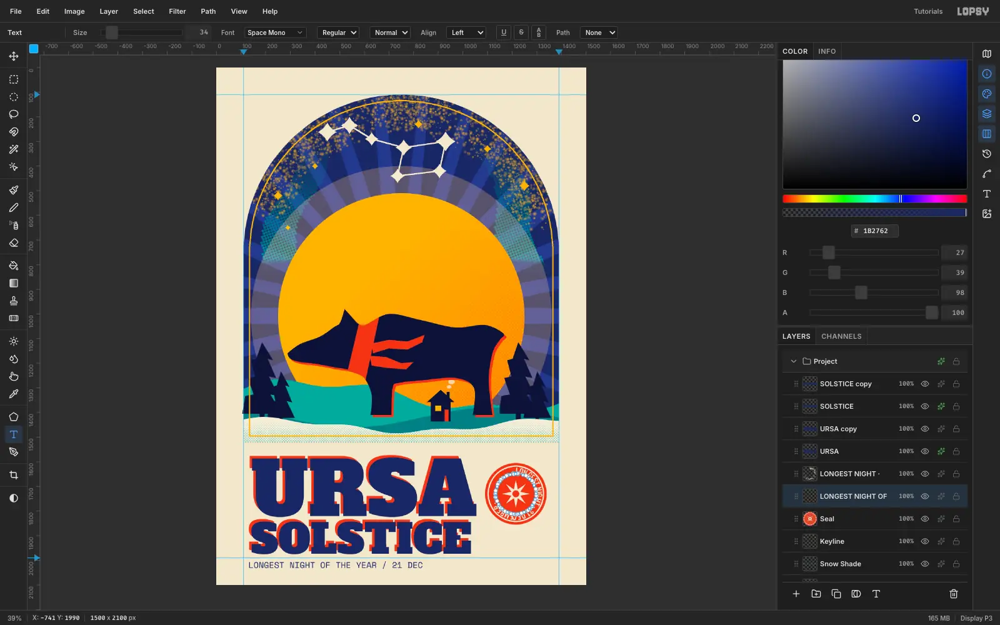

Click once on the left ruler, a little in from the card's left edge, to drop a vertical guide, and click again near the right edge for the other side. Do the same on the top ruler for the top and bottom. Each click is a guide, so there's no dragging. These mark where the live area ends and the crop marks begin.

## Draw crop marks

Add a layer `Print Marks`, set the foreground to deep navy and pick the **Pencil** at **Size 3**. At each corner, click just outside where two guides cross, then [[Shift]]-click along the guide to draw a short line. Draw one horizontal and one vertical line per corner, so each corner gets a small L.

Add a small circle with a cross through it, centred above the arch, for a registration target.

## Add an ink-swatch bar

Fill four small rectangles in a row, bottom right, in navy, teal, gold and vermilion. Printers add this bar so they can check each ink.

## Group the bear and move it as one

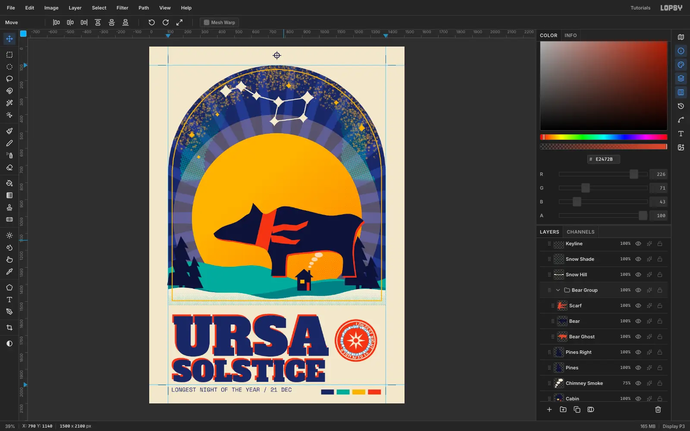

The bear sits a little low against the moon. Click `Bear Ghost` in the layers panel, [[Shift]]-click `Scarf` to select the three bear layers, and press **Group Layers**. Rename the group `Bear Group`. With the Move tool active and the group selected, drag the whole bear up and a touch to the right so it stands in the middle of the moon. Check the move with [[Cmd+Z]] and [[Cmd+Shift+Z]].

Moving a group moves every layer inside it together, so the ghost and the scarf keep their alignment.

## Add a layer of paper fibres

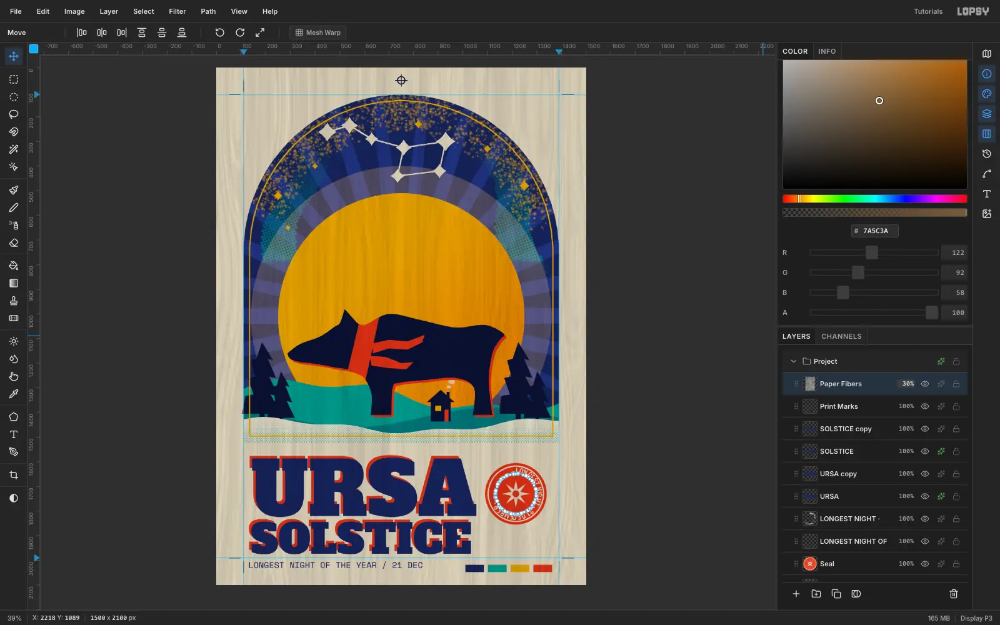

1. Add a layer `Paper Fibers` at the very top.
2. Run **Filter → Fibers…** and **Apply**. This filter picks its own colours and ignores the foreground.
3. Set the layer's blend mode to **Multiply** and its opacity to about **14%**.

At full strength fibres look like wood grain. Keep them faint enough that you'd only notice them if they weren't there.

## Fix the scarf and the ear

Zoom out and look at the card as a whole. Two things are off: the scarf tails look detached from the knot, and the ear is a flat block. Fix both:

1. Select `Scarf` inside `Bear Group` and add a layer `Scarf Tail`, which lands inside the group. Lasso a wedge that starts at the knot and tapers into one long tail, and fill it vermilion. Use the lasso and [[Delete]] on the `Scarf` layer to clear the old detached tail stubs.
2. Select `Bear`, lasso a small round ear on top of the head and fill it deep navy.

Looking at the whole piece from a distance is the best editing tool you have.

## Final polish

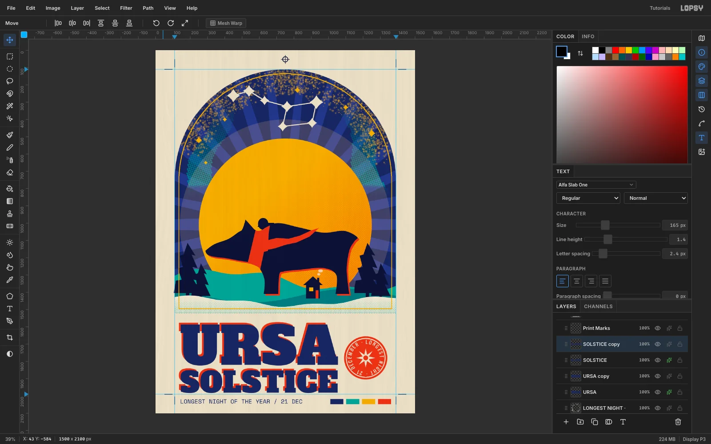

- Select `Paper Fibers` and lower its opacity to **8%**.
- Select `Moon Halo` and bring it back down to **18%**.
- SOLSTICE and its copy sit slightly left of URSA. Select each and tap the right arrow with the Move tool until the left edges line up.

Then choose **File → Quick Export PNG**.
