A screen print is made one ink at a time, each one pushed through its own stencil onto the paper. That process gives the style its look, and you can copy every part of it in Lopsy:

- **A few flat inks.** Here there are four: mustard, teal, red and a navy "key" ink for the line work.
- **Overprints.** Inks are slightly see-through, so where two of them cross you get a third, darker colour for free.
- **Knockouts.** You can't print a light colour over a dark one, so anything that should be paper-coloured is cut out of the inks underneath.
- **Halftone dots** instead of smooth shading.
- **Misregistration.** The stencils never line up perfectly, so each ink sits a few pixels off from the others.

In this tutorial you'll use all five on a flier for an imaginary small business, **Tandem Espresso**, a coffee bar that travels on a tandem bicycle. The visual joke is that the bike's wheels are two coffee cups seen from above, with saucers, handles and latte-art hearts. The flier also does a small business's job: name, what it is, when and where, plus a reason to bring the flier along.

The fonts are free Google Fonts:

- **Alfa Slab One** for TANDEM and the stamp's FREE
- **Bebas Neue** for ESPRESSO, MOBILE COFFEE BAR and CORTADO
- **Oswald** for the small print
- **Pacifico** for the tagline

The palette:

- Paper `#F0E4C8`
- Mustard ink `#F2A93B`
- Teal ink `#2B8C8A`
- Red ink `#E0452F`
- Navy key ink `#24263B`

Each ink gets its own group in the Layers panel, called a **plate**. Every plate is set to **Multiply**, so the inks overprint just like real ink. Lopsy keeps everything inside a top-level **Project** group, so the plates sit inside it. New layers land above whichever layer is selected, and inside a group if that group or a layer in it is selected, so before each step pick a layer in the right plate.

> **Note:** From the saucer step on, the screenshots were taken from the finished project with later layers hidden, so you'll see the inks already slightly out of register (slightly offset cut-outs and coloured fringes round the hearts). You'll add that misregistration near the end.

## Create a 1200 × 1600 document

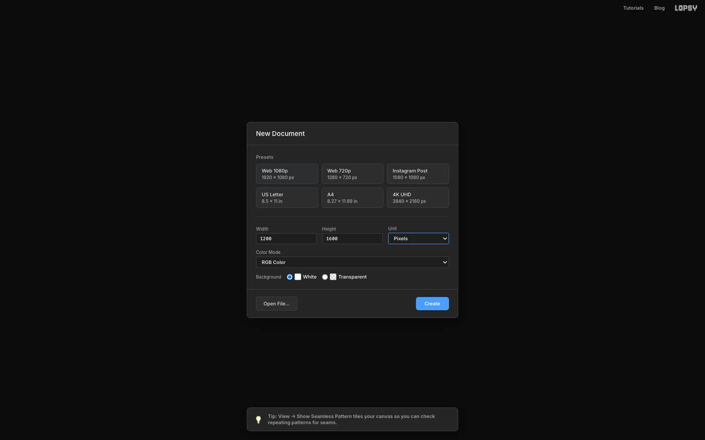

Open [Lopsy](/). In the **New Document** dialog, set **Width** to `1200` and **Height** to `1600` pixels, keep the **White** background and click **Create**. That's a 3:4 portrait, a good shape for a letter-size or A4 flier.

## Lay down the paper and the guides

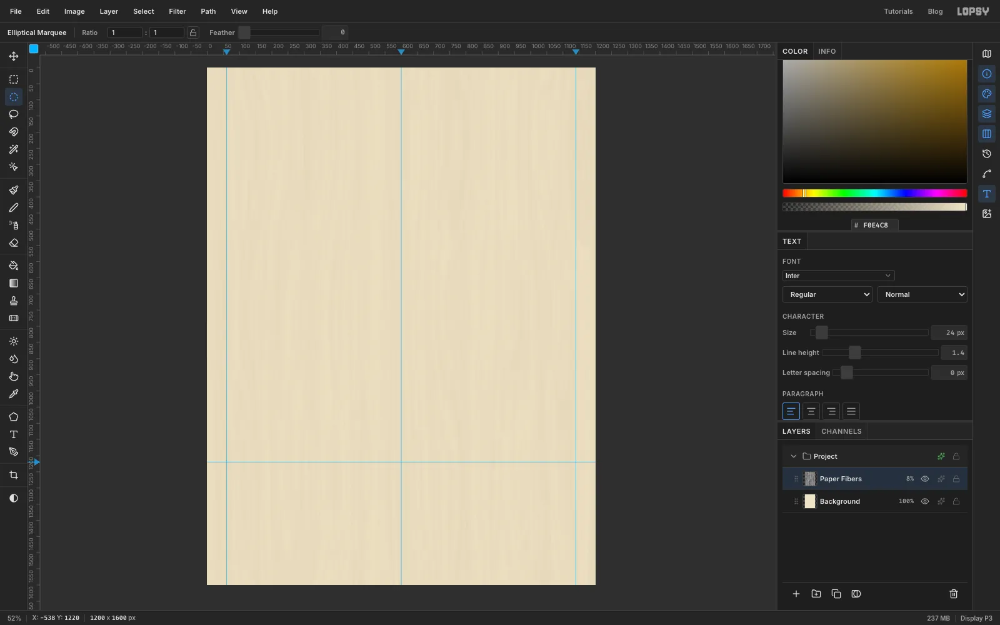

Select **Background**, set the foreground colour to `#F0E4C8` and choose **Edit → Fill**. Add a little tooth with **Filter → Add Noise…**: Amount `5`, **Mono**.

Rename **Layer 1** to `Paper Fibers` and run **Filter → Fibers…** with the default settings. Fibers draws a strong grey grain, so set the layer's blend mode to **Multiply** and its opacity to about `8%`. That's just enough to read as paper.

Now the guides. Each one is a single click on a ruler:

- [[Cmd]]-click (Ctrl-click) the middle of the top ruler. Cmd snaps the guide to an exact fraction of the page, so it lands at the centre, 600.
- Click the top ruler at **60** and **1140** for the side margins.
- Click the left ruler at **1220**. This is the ground line the bike's wheels will stand on.

## Make four ink plates

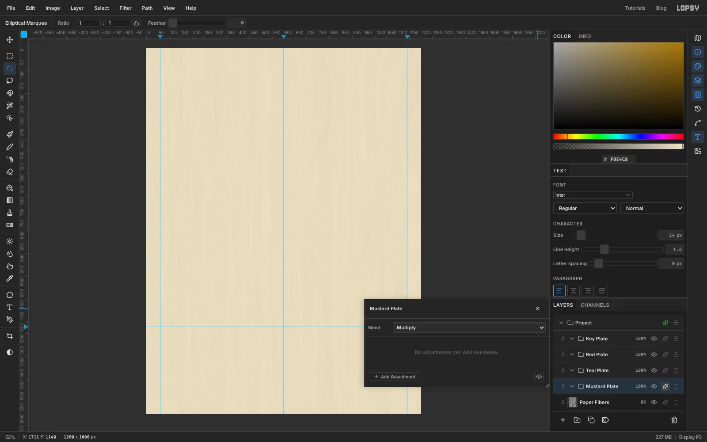

Select **Paper Fibers** and click **New Group** at the bottom of the Layers panel. Rename it `Key Plate`. Select **Paper Fibers** again before each new group, so the groups sit side by side instead of nesting inside each other, and make `Red Plate`, `Teal Plate` and `Mustard Plate`. You should end up with Key at the top and Mustard at the bottom, just above the paper.

Select each group, open its drawer with the effects button on its row, and set **Blend** to **Multiply**. From now on, wherever two inks overlap they darken each other, like real ink: red over teal turns almost black, and teal over mustard turns olive.

## Shade the sun with a gradient

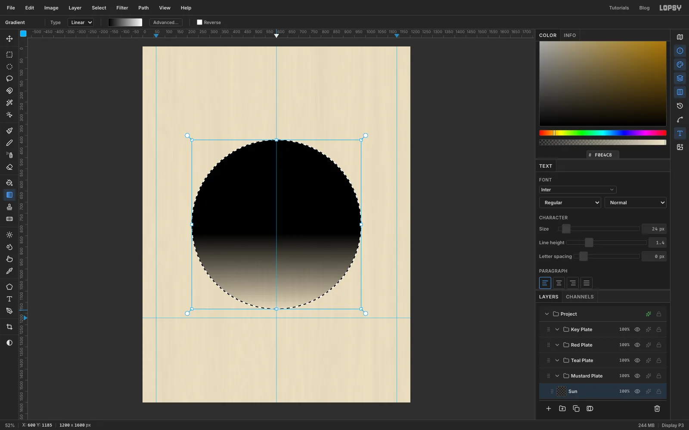

Select **Mustard Plate**, click **Add Layer** (it lands inside the group) and rename it `Sun`.

With the **Elliptical Marquee**, hold [[Cmd]] (Ctrl) to keep it a perfect circle and drag one about 760 px across, centred on the middle guide: from about 220, 420 to 980, 1180.

Pick the **Gradient** tool, set it to **Linear**, click **Advanced…** and make the stops plain black to white. Drag from a little below the middle of the circle (around y 840) straight down to its bottom edge. The top of the sun becomes solid black and the bottom fades to white.

The black isn't the final colour. It's a tone map that tells the halftone filter where to put big dots and where to put small ones.

## Turn it into halftone dots

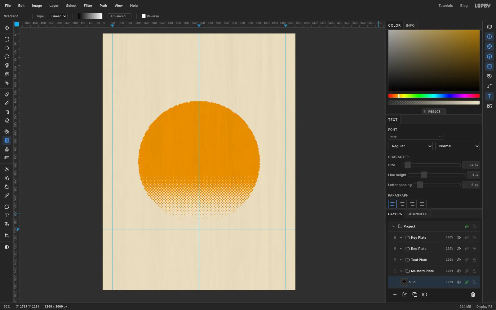

With the circle still selected, choose **Filter → Halftone…** and set **Dot Size** `18`, **Density** `1.5`, **Angle** `45` and **Softness** `0.6`. Density 1.5 packs the dots tightly enough that the black area closes up into solid ink, and the dots shrink and vanish through the fade.

Press [[Cmd+D]] to deselect. Then open the effects drawer for **Sun**, turn on **Color Overlay** and set it to mustard `#F2A93B`. The overlay recolours every dot without touching their shapes.

## Trim the sun's rim

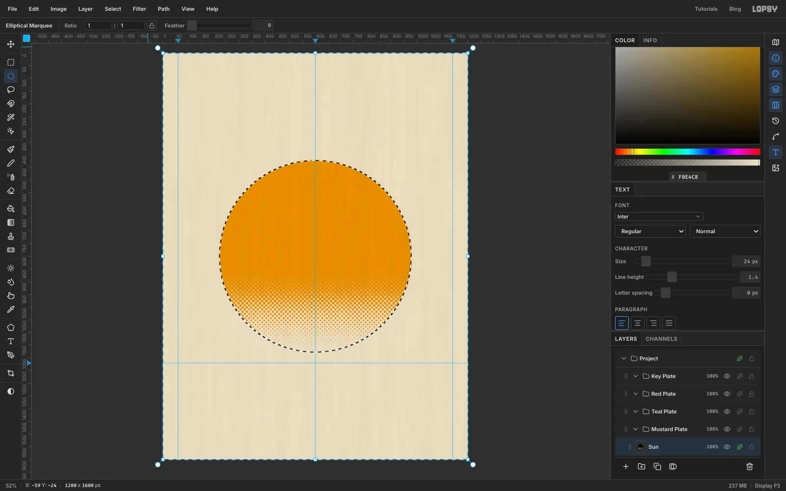

The halftone leaves the top of the sun's edge a little ragged. With nothing selected, click once with the **Elliptical Marquee** without dragging. That opens the **Elliptical Selection** dialog, where you can type exact corners. Enter **From** `223, 423` and **To** `977, 1177`: the same circle, 3 px smaller all round. Choose **Select → Inverse** and press [[Delete]]. The sun now has a clean, round edge.

## Draw a rolling hill

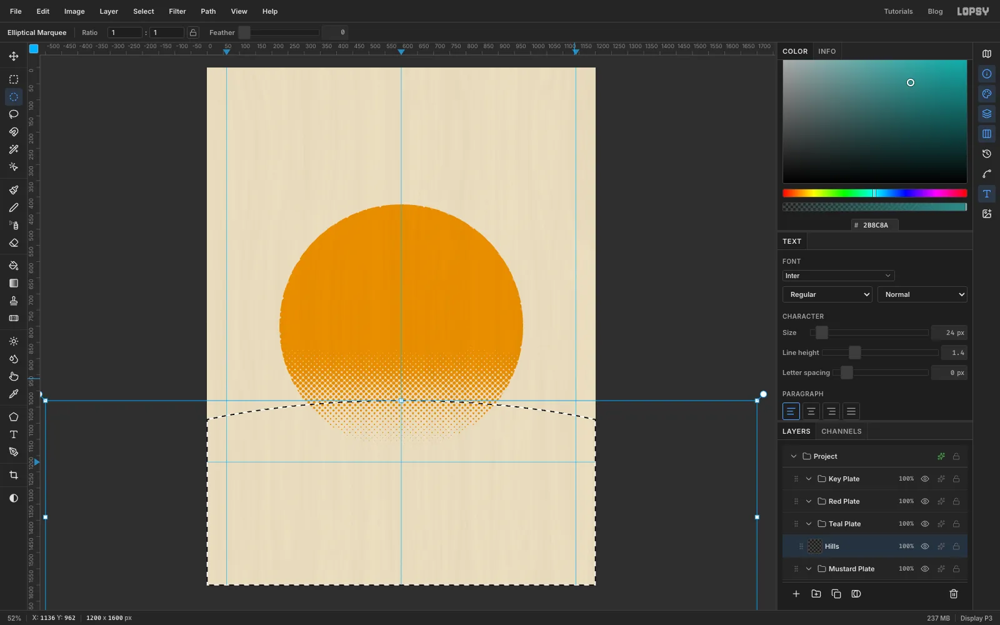

Select **Teal Plate**, click **Add Layer** and name it `Hills`. Set the foreground to teal `#2B8C8A`.

The hill is a very wide, flat ellipse that runs off both sides of the page, so it's easiest to type. With nothing selected, click once with the **Elliptical Marquee** to open the **Elliptical Selection** dialog and enter **From** `-500, 1030` and **To** `1700, 1750`. The top of the curve sits 1030 px down at the centre guide and drops to about 1090 px at the edges of the paper. Choose **Edit → Fill**.

The ellipse runs off the bottom of the page, and the ground needs a straight bottom edge that tucks just under the info band you'll add later. Click once with the **Rectangular Marquee** and enter **From** `0, 1359` and **To** `1200, 1600`, then press [[Delete]] and [[Cmd+D]].

The teal crosses the halftone dots at the bottom of the sun and overprints them dark green. That's the Multiply plate doing its job.

## Knock out the wheels

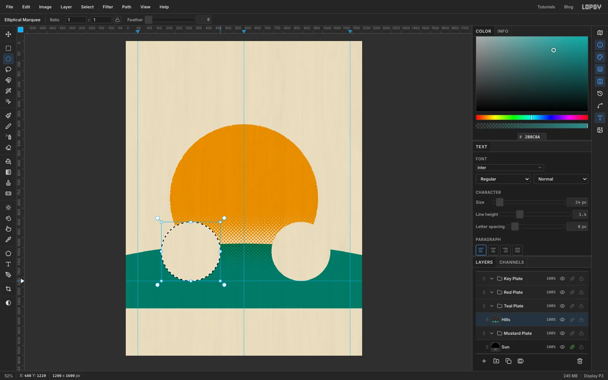

First turn off **View → Snap to Guides**. Several circles from here on end within a few pixels of the ground guide, and snapping would pull them onto it.

The wheels are paper-coloured saucers, and a Multiply plate can only make things darker. So, like a real printer, cut the shapes out of the inks underneath. [[Cmd]]-drag a 300 px circle for the back wheel from 180, 920 to 480, 1220, so it sits on the ground guide (or type those corners into the dialog). Select **Sun** and press [[Delete]], then select **Hills** and press [[Delete]] again.

Do the same for the front wheel: a 300 px circle from 740, 920 to 1040, 1220.

## Draw the saucer, cup and handle

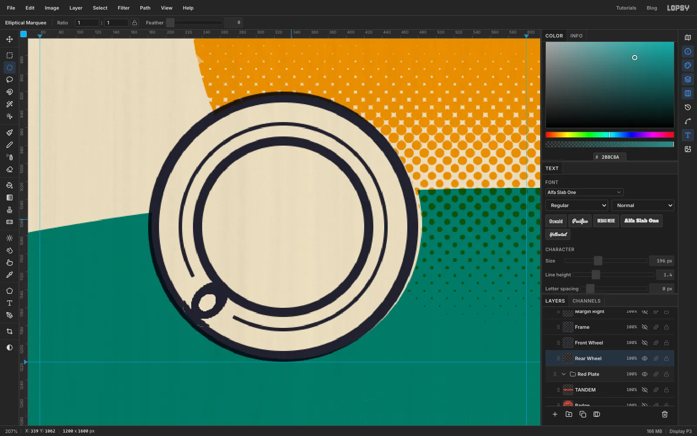

Select **Key Plate**, add a layer named `Rear Wheel` and set the foreground to navy `#24263B`.

Each ring is two circles with the same centre: select the bigger one and **Fill** it, then select the smaller one and press [[Delete]]. The circles have to be concentric, so type them into the **Elliptical Selection** dialog rather than dragging. The dialog only opens when nothing is selected, so press [[Cmd+D]] after each fill or delete, then click once with the marquee for the next circle. The back wheel's centre is 330, 1070:

- **Saucer rim:** fill `180, 920` → `480, 1220`, delete `192, 932` → `468, 1208`. That leaves a 12 px rim on the knockout's edge.
- **Saucer groove:** fill `214, 954` → `446, 1186`, delete `218, 958` → `442, 1182`, for a thin 4 px line.
- **Cup rim:** fill `230, 970` → `430, 1170`, delete `240, 980` → `420, 1160`.

For the handle, first break the groove where it will go: with the **Lasso**, loosely circle the stretch of groove at the lower left of the cup (about 7:30 on a clock face) and press [[Delete]]. Then lasso a small oval, about 45 px long and 35 px wide, that overlaps the cup's rim and points out towards the lower left, and **Fill** it. Lasso a smaller oval inside it and press [[Delete]] to open up the loop. From above, that's exactly what a cup handle looks like.

## Copy and paste the front wheel

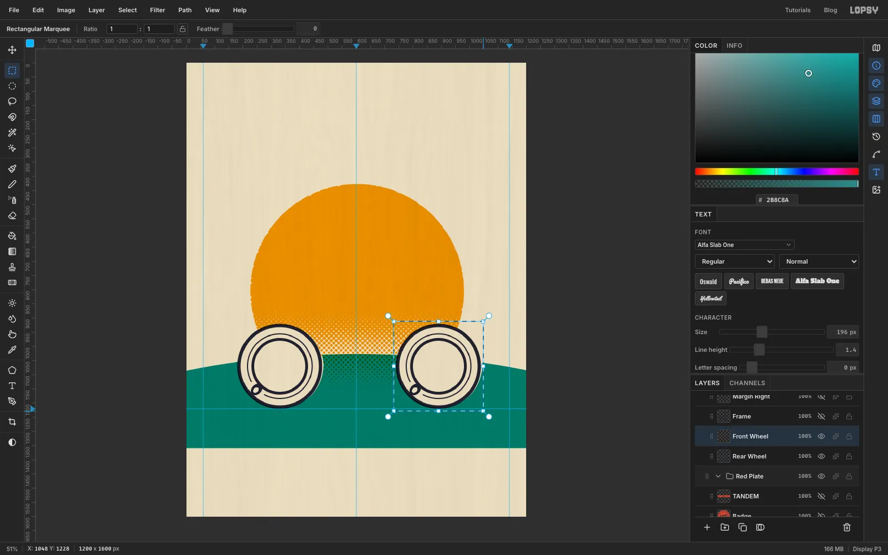

Drag a **Rectangular Marquee** around the whole back wheel, leaving a few pixels to spare. Press [[Cmd+C]], give it a second or two to reach the clipboard, then press [[Cmd+V]]. The copy is pasted in place as a new layer, right on top of the original. Rename it `Front Wheel` and press [[Cmd+D]].

Switch to the **Move** tool ([[V]]) and drag the copy 560 px to the right, onto the second knockout. Fine-tune it with the arrow keys until its saucer sits exactly on the cut-out circle and its bottom touches the ground guide.

## Pour the coffee and cut a latte heart

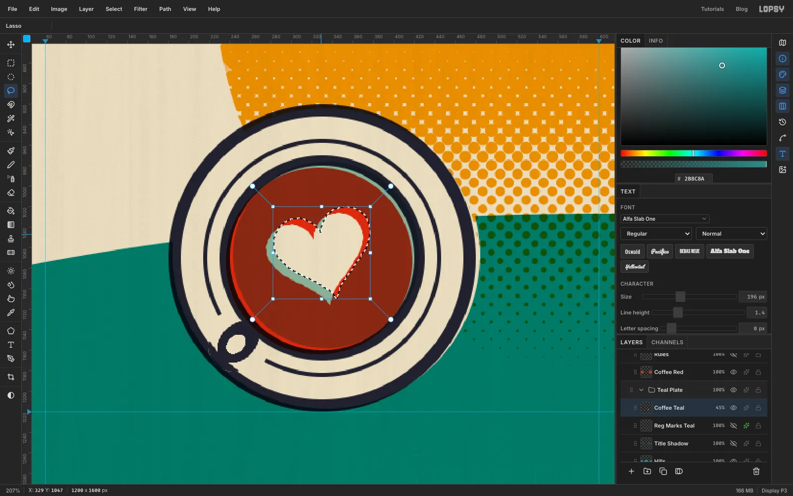

The coffee is an overprint. Select the **Red Plate** group, click **Add Layer** and name it `Coffee Red`. Set the foreground to red `#E0452F` and fill a 182 px circle inside each cup rim (`239, 979` → `421, 1161` for the back cup and `799, 979` → `981, 1161` for the front). Then select **Hills**, add a layer named `Coffee Teal` (it lands in **Teal Plate**) and fill the same two circles with teal `#2B8C8A`.

Red over solid teal is almost black, which is too dark for coffee. Turn **Coffee Teal**'s opacity down to `45%`, and the overlap becomes a warm espresso brown.

For the latte art, use the **Lasso** to draw a heart over each cup, about 100 px wide. Tilt the back one a little to the left and the front one a little to the right. With the heart selected, press [[Delete]] on **Coffee Teal**, then on **Coffee Red**. The cream paper shows through as milk foam.

## Draw the tandem frame

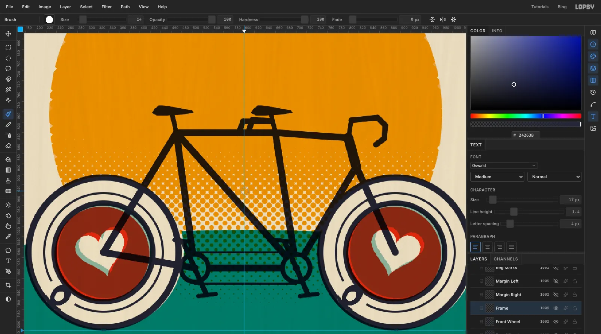

Select **Front Wheel** and add a layer named `Frame`. Set the foreground back to navy `#24263B`, pick the **Brush** ([[B]]), and set **Size** to `14` and **Hardness** to `100`.

Every tube is a straight line. Click where it starts, then hold [[Shift]] and click where it ends. Draw them in this order:

1. **Chainstay:** from the back cup's centre to the back bottom bracket, just outside the back saucer (about 505, 1100).
2. **Seat stay:** from the back cup's centre up to the back seat cluster, at about 470, 840.
3. **Back seat tube:** from the back bottom bracket up to the back seat cluster.
4. **Front seat tube:** from the front bottom bracket, about 700, 1100, up to the front seat cluster at about 660, 840.
5. **Top tube:** from one seat cluster to the other, and on to the head tube at about 800, 850.
6. **Fork:** from the bottom of the head tube, about 815, 905, down to the front cup's centre.
7. **Down tube:** from the bottom of the head tube to the front bottom bracket.
8. **Boom tube:** joining the two bottom brackets.
9. **Diagonal:** from the back seat cluster to the front bottom bracket. This brace is what makes it look like a tandem.

Draw the head tube itself at Brush Size `20`. Then add the small parts:

- **Seat posts and stem:** short Shift-click lines, about 35 px long, at Brush Size `10`.
- **Chainrings:** one ring at each bottom bracket. Fill a 62 px circle, delete a 44 px circle from the same centre, then fill a 14 px dot in the middle. Deleting the inner circle also clears the tube ends inside the ring, so the chainring reads as sitting in front of the frame.
- **Timing chain:** two straight lines at Brush Size `5`, joining the tops and the bottoms of the two chainrings.
- **Cranks:** at Brush Size `11`, one crank about 55 px long on each chainring pointing down and one pointing up.
- **Pedals:** short bars, about 35 px long, at Brush Size `9` across the ends of the cranks.
- **Saddles:** small wedge shapes drawn with the **Lasso** and filled.
- **Drop handlebars:** four or five short Shift-click segments at Brush Size `12`, curling forward and down from the stem.
- **Stoker bar:** at the same size, a short horizontal bar off the front seat post with a little drop at the end. This is what the back rider holds.

## Clear the tubes out of the cups

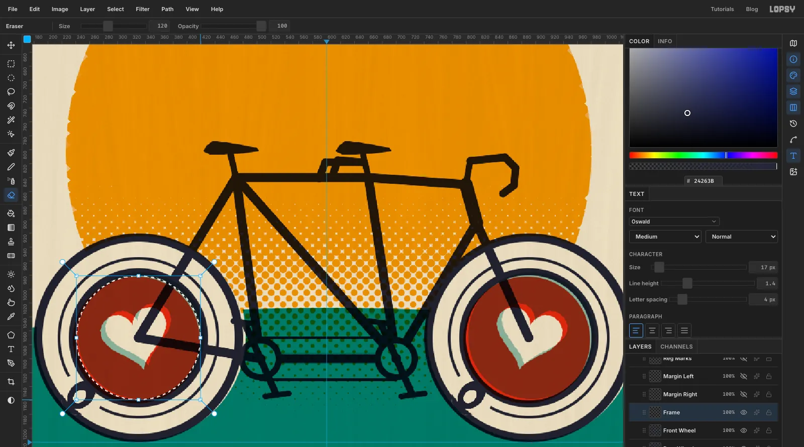

The chainstay and the fork cross the coffee and spoil the hearts. Select the circle just inside the back cup's rim, about 178 px across (`241, 981` → `419, 1159`). Pick the **Eraser** ([[E]]), set it to a large size such as `120`, and scrub over the circle. The selection stops it from touching anything outside the circle.

Do the same on the front cup. The tubes now stop at the cup rims, as if each cup were the wheel's hub cover.

## Set the TANDEM headline

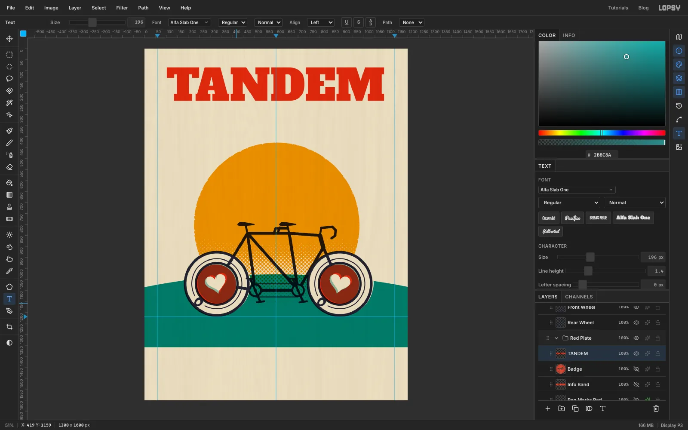

Select **Coffee Red** so the text lands in **Red Plate**. Pick the **Text** tool ([[T]]), choose **Alfa Slab One**, set the size to `196`, set the colour to red `#E0452F`, click near the top left and type `TANDEM`. Press [[Tab]] to finish.

Switch to the **Move** tool and click **Align center horizontally** in the options bar. Then nudge it with the arrow keys until the top of the letters is about 80 px from the top edge. At this size the word fills the space between the two margin guides almost exactly.

## Print a teal shadow with a trap

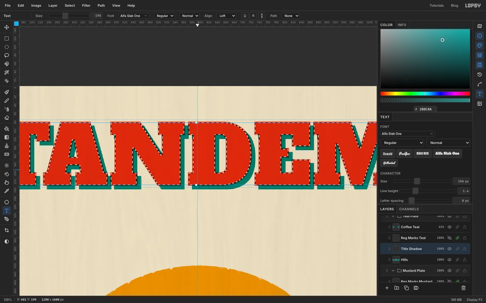

Gig posters love a solid offset shadow. Print it as its own ink, not as a layer effect:

1. Select **Hills** and add a layer named `Title Shadow`, so it sits in **Teal Plate**.
2. [[Cmd]]-click (Ctrl-click) the **TANDEM** thumbnail in the Layers panel to select the shape of the letters. Set the foreground to teal `#2B8C8A` and **Fill**. Press [[Cmd+D]].
3. With the **Move** tool, press [[Right]] nine times and [[Down]] nine times.
4. [[Cmd]]-click the **TANDEM** thumbnail again, choose **Select → Shrink…** by `2` px, and press [[Delete]] on **Title Shadow**.

Step 4 knocks the shadow out from under the red letters, but leaves a 2 px overlap all the way round. Printers call that a **trap**: it hides small registration errors. Where red and teal overlap they overprint a thin, dark line, which gives the letters a crisp edge.

## Add ESPRESSO and two rules

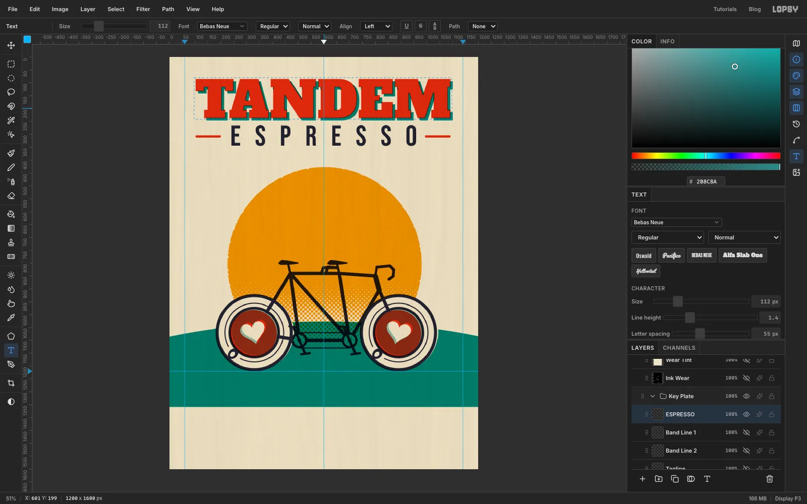

Select **Frame** so the text lands in **Key Plate**. With the **Text** tool, choose **Bebas Neue** at `112` in navy, and type `ESPRESSO`. Open the **Text** panel and set **Letter spacing** to `55` px. Centre it with **Align center horizontally**, then nudge it up so it sits about 30 px under TANDEM.

Add a layer in **Red Plate** named `Rules` and set the foreground to red `#E0452F`. With the **Brush** at Size `9`, Shift-click a short line on each side of ESPRESSO, halfway up the letters. Start each rule at the edge of TANDEM, so the whole title block lines up on both sides.

## Knock the info out of a red band

Add a layer named `Info Band` in **Red Plate**. With the **Rectangular Marquee**, click once on the canvas without dragging. That opens fields for exact corners. Enter **From** `0, 1352` and **To** `1200, 1600`, then **Fill** it with red. It overlaps the bottom of the teal hill by a few pixels, so another thin dark trap line appears where the two inks meet.

Select **Frame** and type two lines of text in navy. Each one is its own text layer:

- `MOBILE COFFEE BAR` in **Bebas Neue** at `96`, letter spacing `14`.
- `SATURDAYS 7AM–1PM   •   FERRIS STREET MARKET, STALL 12` in **Oswald Medium** at `24`, letter spacing `3`.

Centre both with **Align center horizontally**. Then nudge them so the pair sits in the middle of the band, with about 60 px above the first line and below the second, and about 30 px between them. The small line comes out exactly as wide as ESPRESSO, so the top and bottom of the flier echo each other.

[[Cmd]]-click the first line's thumbnail, select **Info Band** and press [[Delete]]. Do the same for the second line. Then hide both text layers with their eye icons. The words are now bare paper showing through the red, like a real knockout, and the text layers stay editable if you need them.

## Cut the tagline out of the hill

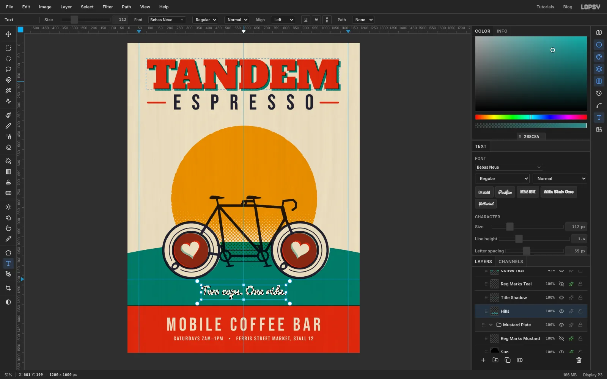

Select **Frame** and type `Two cups. One ride.` in **Pacifico** at `54`. Pacifico is a joined-up script, so make sure **Letter spacing** is `0`, or the letters come apart.

Centre it, then nudge it so it sits halfway between the bottoms of the saucers and the top of the red band, with about 30 px above and below it. [[Cmd]]-click its thumbnail, select **Hills**, press [[Delete]], and hide the text layer.

## Set type around a circle

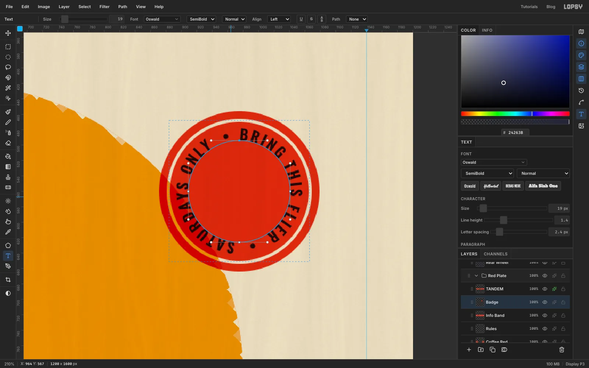

Now for the offer. Build the stamp at a generous size over the sun's top-right edge. It overlaps the sun for now, which doesn't matter, because you'll shrink it and move it onto bare paper in a moment. Add a layer named `Badge` in **Red Plate** and, with the **Elliptical Selection** dialog again, make three circles around a centre of 975, 560 (press [[Cmd+D]] between them so the dialog opens each time):

1. Fill `871, 456` → `1079, 664` (208 px) with red.
2. Delete `881, 466` → `1069, 654` (188 px).
3. Fill `885, 470` → `1065, 650` (180 px).

That leaves a thin paper keyline just inside the edge.

For the ring of text, pick the **Shape** tool, choose **Ellipse** and set **Output** to **Path**. Shapes grow from the point you press, so press at the stamp's centre (975, 560) and drag diagonally to 1041, 626, holding [[Cmd]] to keep it round. That gives a circular path 132 px across, which starts at 12 o'clock.

Select **Frame** and type `BRING THIS FLIER  •  SATURDAYS ONLY  •` in **Oswald SemiBold** at `19`, in navy. Press [[Tab]], then pick **Path 1** from the **Path** menu in the Text options bar. The words wrap around the circle with their feet on the path.

Adjust **Letter spacing** in the Text panel until the gap after the last bullet matches the other gaps. It's `2.4` here. If the last bullet disappears, the text is too long for the circle, so reduce the spacing.

## Knock the stamp's text out

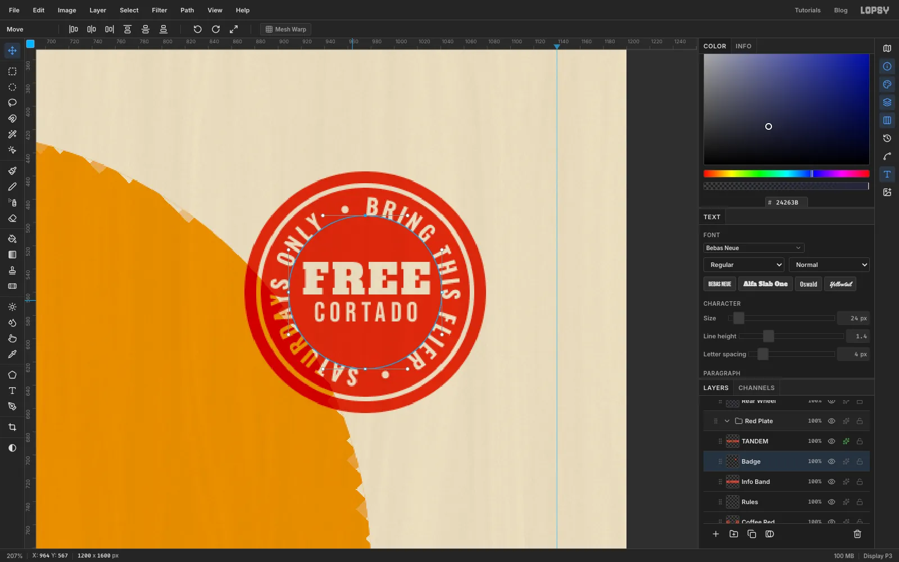

In the middle of the stamp, type `FREE` in **Alfa Slab One** at `36` and `CORTADO` in **Bebas Neue** at `24` with letter spacing `4`. Move them so the pair is centred in the disc. Keep at least 6 px between FREE's corners and the ring of text.

Then [[Cmd]]-click each of the three text thumbnails in turn, select **Badge** and press [[Delete]] each time. Hide the three text layers.

## Shrink the stamp and move it into the corner

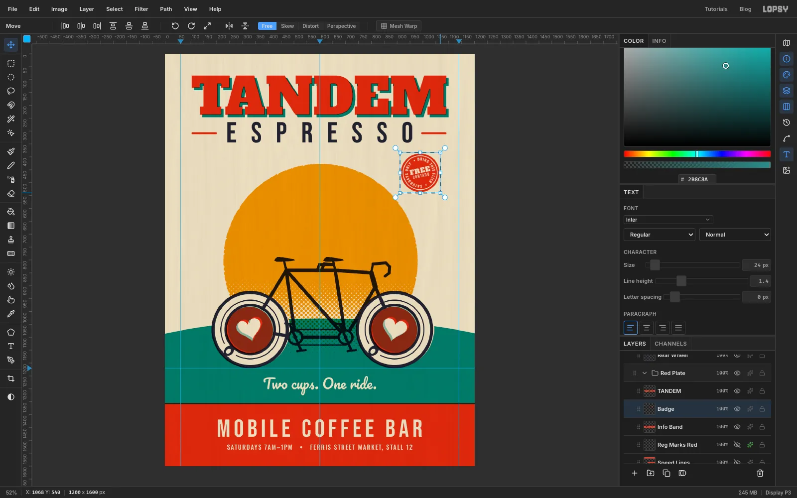

The stamp shouldn't compete with the bike, so make it smaller. Draw a **Rectangular Marquee** around it, switch to the **Move** tool, hold [[Cmd]] and drag the bottom-right handle inwards until it's about 172 px across. Cmd keeps it perfectly round. Press [[Cmd+D]] to apply the scale.

Then drag it up into the empty paper in the top right, under the end of the right-hand rule, so it sits clear of the sun and the margin.

## Tilt the stamp

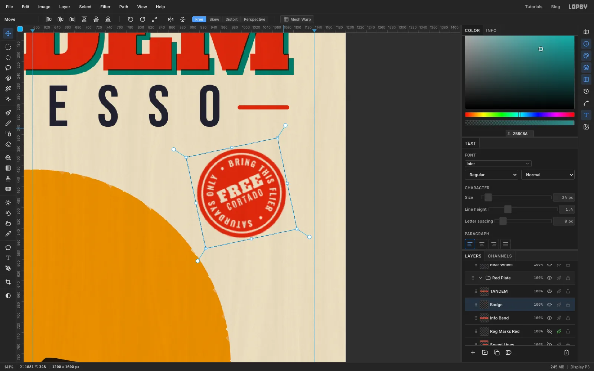

Draw a marquee around the stamp again. With the **Move** tool, hover just outside a corner handle until the cursor changes to rotate, then drag anticlockwise about 12°. Press [[Cmd+D]].

A rubber stamp is never quite straight, and the tilt makes it feel added by hand.

## Add speed lines on the grid

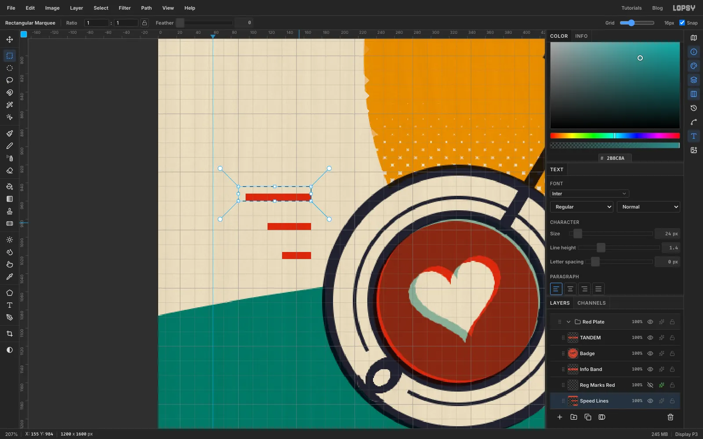

Add a layer named `Speed Lines` in **Red Plate**. Turn on **View → Show Grid**. With the **Rectangular Marquee** active, set **Grid** to `8px` in the options bar and make sure **Snap** is ticked.

Draw three bars, each one grid square tall and four grid squares (32 px) apart, all ending at the same point about 10 px behind the back saucer: 72, 48 and 32 px long, from top to bottom. **Fill** each one in red. The grid keeps them perfectly level and evenly spaced. Turn the grid off again when you're done.

## Add registration marks and knock the plates out of register

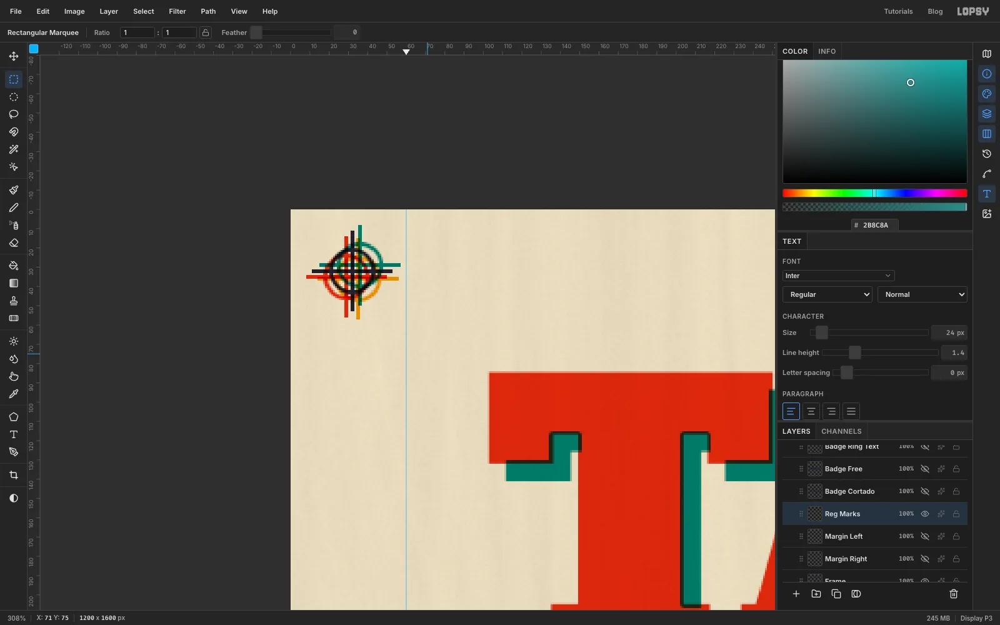

Real prints carry little crosshair targets in the margins so the printer can line the inks up. Add a layer named `Reg Marks` in **Key Plate** and draw one in each top corner, about 32 px in from the edges. Each one is a 24 px ring (fill a 24 px circle, delete a 20 px circle) with a crosshair of two 40 px **Pencil** lines at Size `2`.

Copy the marks with a marquee over the top strip and [[Cmd+C]]. Then select a layer in each of the other three plates in turn and press [[Cmd+V]], which pastes the marks into that plate. Give each copy a **Color Overlay** in that plate's ink.

Now knock the plates out of register. Select a plate group, switch to the **Move** tool, and nudge the whole group with the arrow keys:

- **Teal Plate:** 4 px right, 3 px up
- **Red Plate:** 3 px left, 3 px down
- **Mustard Plate:** 3 px right, 4 px down

Leave **Key Plate** where it is. The marks fan out into four colours, thin cream and coloured fringes appear round the hearts, and the knockouts no longer line up exactly. That's what makes it look hand-pulled.

## Run small print up the margins

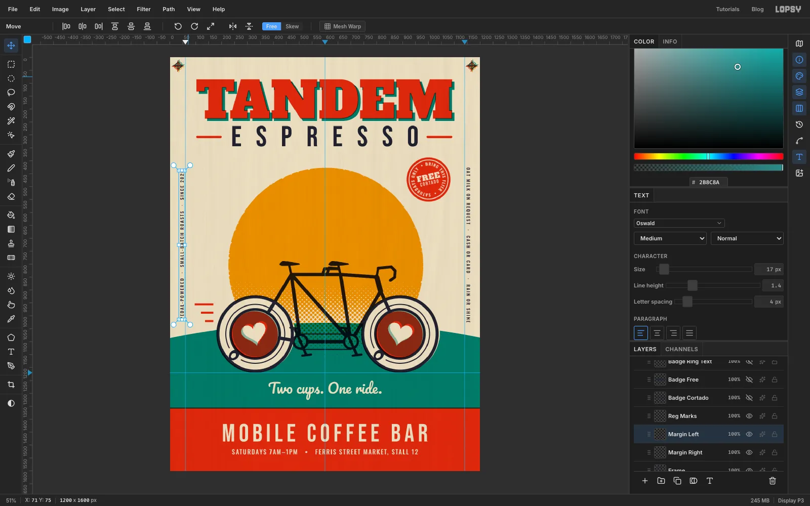

Select **Frame** and type `PEDAL-POWERED  ·  SMALL-BATCH ROASTS  ·  SINCE 2026` in **Oswald Medium** at `17`, letter spacing `4`. With the **Move** tool, click **Rotate 90° CCW** in the options bar. The text stays live, now reading from bottom to top.

Type a second line, `OAT MILK ON REQUEST  ·  CASH OR CARD  ·  RAIN OR SHINE`, and click **Rotate 90° CW**.

Drag each one to about 40 px from its edge of the paper. Grab it a third of the way along rather than in the middle, so you don't catch a transform handle. Keep both on the bare paper above the hill, running from about y 430 down to 1015, level with the stamp and the sun.

## Wear the ink with paper specks

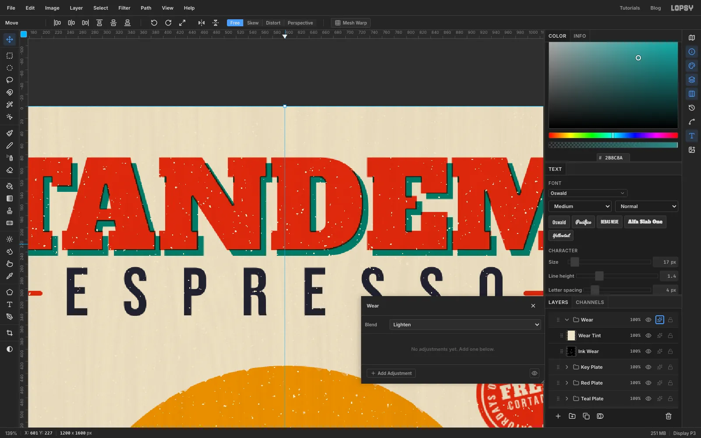

Ink never covers perfectly. To add tiny gaps:

1. Select **Paper Fibers**, add a layer named `Ink Wear`, and drag it to the very top of the Layers panel, above **Key Plate**.
2. Fill it with mid grey `#808080`, then run **Add Noise…** at `100` (**Mono**, **Uniform**), **Gaussian Blur…** at `3` px, and **Threshold…** at `147`. That leaves about one pixel in a hundred white, in small clumps, on black.
3. With **Ink Wear** selected, choose **Layer → Group Layers** and rename the group `Wear`.
4. Add a layer above **Ink Wear** inside the group, name it `Wear Tint`, fill it with the paper colour `#F0E4C8`, and set it to **Multiply**. That turns the white specks paper-coloured and leaves the black black.
5. Set the **Wear** group's **Blend** to **Lighten**.

Lighten ignores the black completely and only lets the paper-coloured specks through where the ink underneath is darker than paper. So the specks show on the red, teal, mustard and navy, and disappear on bare paper, just like real ink dropout.

> **Tip:** Save the project with **File → Save Project** before you export. Then use **File → Quick Export PNG** for the finished flier.
