A screen print is built one ink at a time, each pushed through its own stencil onto the paper. That limit is also the style's charm, and it suits a data visualization surprisingly well. A chart needs a few flat, honest colours, and a screen print has nothing else.

In this tutorial you'll make **Jumbo Yolks**, a poster that compares the eggs of eight birds by drawing each one as a fried egg. The white of each egg is sized so that its **area** is proportional to the egg's weight, from a 9 g quail egg to a 1,400 g ostrich egg. Along the way you'll use the classic screen-print moves:

- **A flood of ink with knockouts.** The blue panel is one solid ink with the egg whites cut out of it, so they show the bare paper.
- **Overprints.** The yellow and pink inks are set to **Multiply**, so pink over yellow prints a hot orange-red, and pink over blue prints a dark violet shadow.
- **Halftone dots** for shading.
- **Misregistration**, where each ink sits a couple of pixels off from the others.

The weights are typical whole-egg weights, rounded: quail 9 g, pigeon 17 g, chicken 58 g, duck 70 g, turkey 80 g, goose 145 g, emu 600 g and ostrich 1,400 g.

The fonts are free Google Fonts:

- **Bowlby One** for the headline and the stamp
- **Alfa Slab One** for the weights
- **Courier Prime** (Bold and Regular) for labels and small print
- **Reenie Beanie** for the pencilled edition number

The palette:

- Paper `#F3EDE0`
- Ultramarine ink `#2B35A8`
- Yolk ink `#FFC21A`
- Fluorescent pink ink `#FF4F8B`
- Graphite `#5E5A55` (pencil, not an ink)

Lopsy keeps everything inside a top-level **Project** group, so the plates you make below all sit inside it. New layers land just above whichever layer is selected, and inside a group if that group is selected.

## Create a 1500 × 2000 document

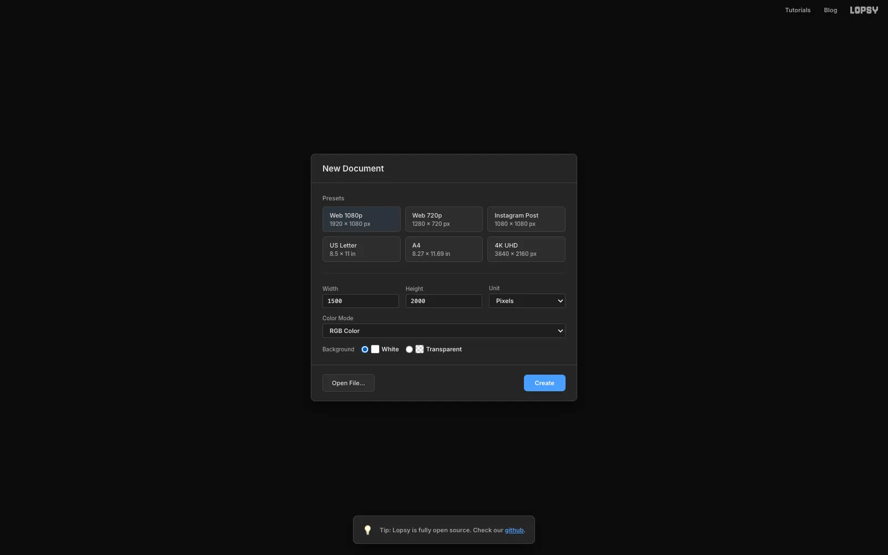

Open [Lopsy](/). In the **New Document** dialog, set **Width** to `1500` and **Height** to `2000` pixels, keep the **White** background and click **Create**. That's a 3:4 portrait, which prints well at 18 × 24 inches.

## Lay down the paper and the guides

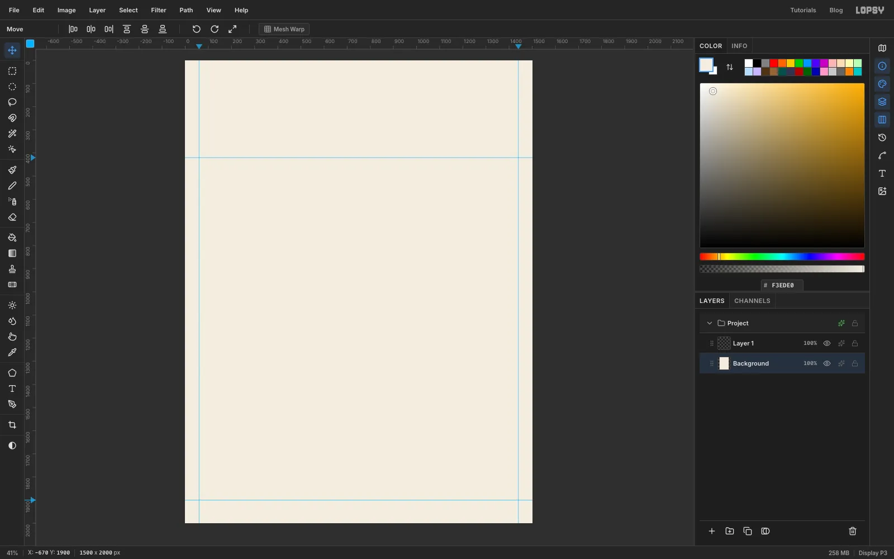

Select **Background**, set the foreground colour to `#F3EDE0` and choose **Edit → Fill**. Give the paper a little tooth with **Filter → Add Noise…**: Amount `4`, **Mono**.

Now add four guides. Each one is a single click on a ruler:

- Click the top ruler at **60** and **1440**. These are the side margins.
- Click the left ruler at **420** and **1900**. These are the top and bottom of the blue panel.

## Flood the panel with blue

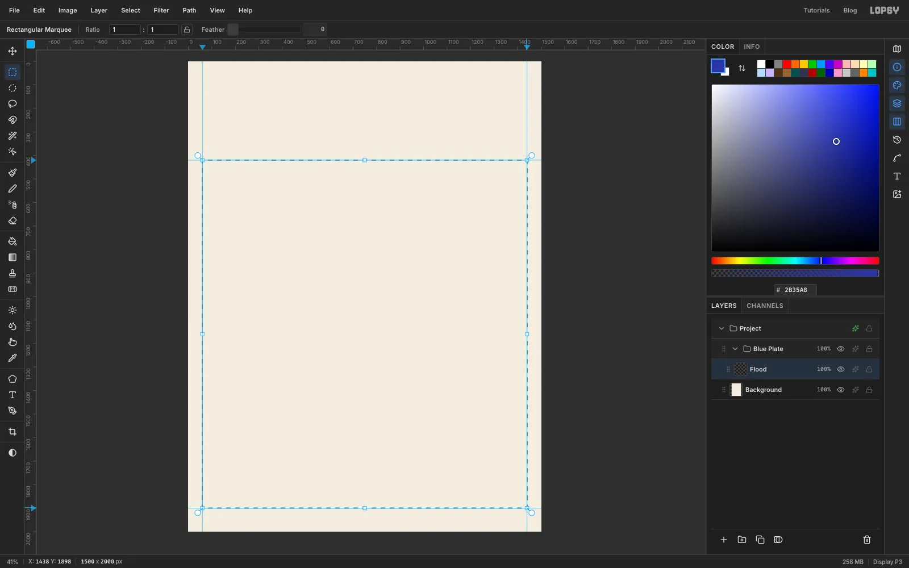

Each ink gets its own group in the Layers panel, called a **plate**. Select **Layer 1**, click **New Group** at the bottom of the Layers panel and rename the group `Blue Plate`. With **Blue Plate** selected, click **Add Layer**. The new layer lands inside the group. Rename it `Flood`. You can delete the empty **Layer 1** now.

Pick the **Rectangular Marquee** and drag from the top-left guide crossing to the bottom-right one. With **Snap to Guides** on (it is by default), the marquee locks onto the guides. Set the foreground to `#2B35A8`, choose **Edit → Fill**, and then, with the selection still active, run **Add Noise…** at Amount `6`, **Mono**. The noise gives the ink a fine grain. Press [[Cmd+D]] to deselect.

## Sketch the egg whites as circles

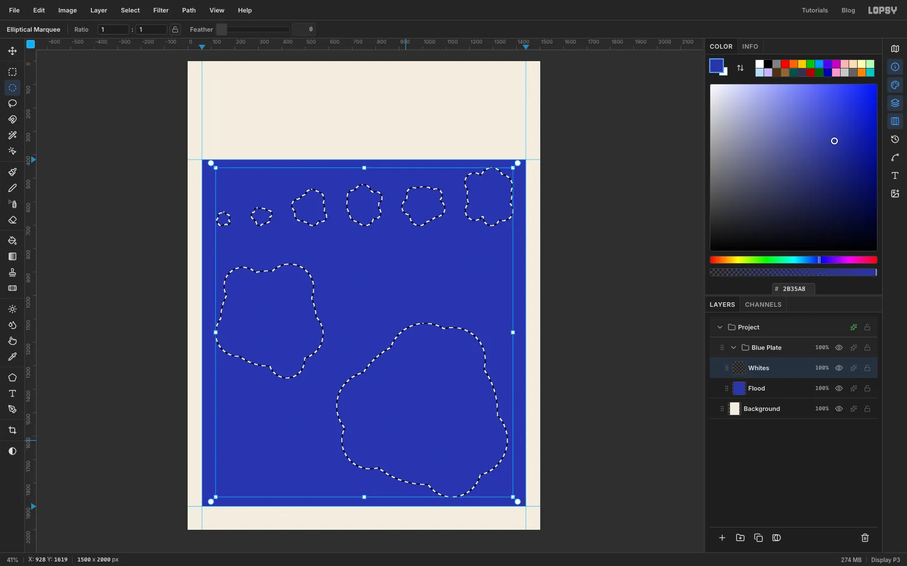

This is where the data comes in. To make an egg's **area** proportional to its weight, its radius has to grow with the **square root** of the weight. With the ostrich egg at a radius of 350 px, each egg's radius is 350 × √(weight ÷ 1400):

- Quail 28 px, pigeon 39, chicken 71, duck 78
- Turkey 84, goose 113, emu 229, ostrich 350

Select **Blue Plate**, add a layer and name it `Whites`. A fried egg white isn't a circle, so build each one from several overlapping circles:

1. With the **Elliptical Marquee**, hold [[Cmd]] (Ctrl) to keep the shape a circle and drag a main circle about 1.7 times the egg's radius across. That works out to roughly 48 px for the quail, 66 for the pigeon, 121 for the chicken, 133 for the duck, 143 for the turkey, 192 for the goose, 389 for the emu and 595 for the ostrich.
2. Hold [[Shift]] as well and drag five or six smaller circles around its rim, each about 0.6–0.9 times the radius across. Let some poke out and some stay tucked in. Shift adds each one to the selection.

Lay the eggs out like this:

- The six small eggs go in a row near the top of the panel, smallest on the left. Line up their **bottoms**, about 280 px below the top of the panel, not their centres.
- The emu goes on the left, about a third of the way down the panel.
- The ostrich goes at the bottom right.

Leave the bottom-left corner and the space right of the emu free for labels.

> **Tip:** Marquees snap to guides within a few screen pixels. If a small circle near the panel edge jumps, turn off **View → Snap to Guides** while you draw the eggs.

## Round the outlines with Grow and Shrink

Where two circles meet there's a sharp notch. Choose **Select → Grow…** and enter `20`, then **Select → Shrink…** by the same `20`. Growing fills the notches, and shrinking brings the outline back to its original size, so the selection keeps its lobes but loses the sharp corners. Because the shape barely changes size, the areas stay close to the data.

Set the foreground to the paper colour `#F3EDE0` and choose **Edit → Fill**.

## Smooth the two big eggs a little more

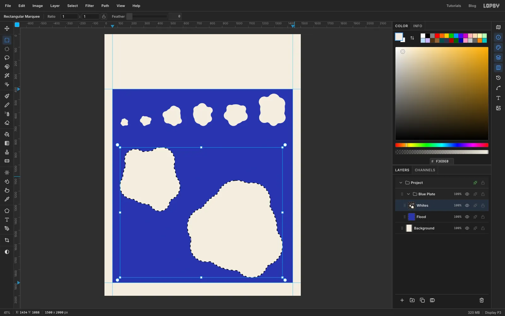

A 20 px rounding is right for the small eggs but too subtle on the giants. [[Cmd]]-click the **Whites** thumbnail to select everything on the layer. Then, with the **Rectangular Marquee**, hold [[Shift+Alt]] and drag a box around the emu and the ostrich. Shift+Alt **intersects**, so only the two big eggs stay selected.

Now **Grow** by `45` and **Shrink** by `45`, then **Edit → Fill** again. Doing this separately keeps the small eggs from merging into each other: a 45 px grow would bridge the gaps between them.

## Paint 24 hen's eggs with brush spacing

The poster's punchline is that one ostrich egg weighs as much as 24 hen's eggs (1,400 ÷ 58 ≈ 24), so draw that as a little 6 × 4 grid of icons.

Select the **Brush**, open the brush presets and go to the **Shape** tab. Choose **Hard Round** and set **Size** `44`, **Hardness** `100`, **Opacity** `100` and **Spacing** `136`. Spacing is a percentage of the size, so the dabs land 44 × 1.36 ≈ 60 px apart.

On the **Whites** layer, still painting in the paper colour, click once in the bottom-left corner of the panel, about 80 px in from the left edge and about 260 px above the bottom of the panel. Then [[Shift]]-click 300 px to the right. The brush draws a straight line from the first click to the second, and the spacing turns it into exactly six dots. Repeat for three more rows, each 60 px lower.

## Knock the whites out of the flood

You can't print cream over blue, so the whites have to be holes in the blue ink. [[Cmd]]-click the **Whites** thumbnail, select **Flood**, and press [[Delete]]. Then hide **Whites** with its eye icon. The eggs now show the bare paper, grain and all. Keep the Whites layer, because you'll load its outline several more times.

## Make the yellow and pink plates

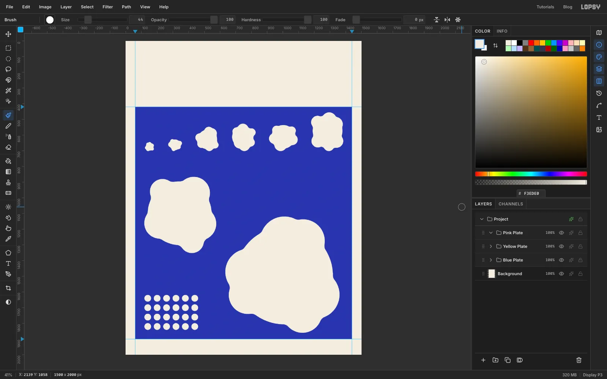

Collapse **Blue Plate** with its arrow, select it, and click **New Group**. Name it `Yellow Plate`. Collapse that, select it, and make one more group called `Pink Plate`. Collapsing the selected group first makes each new group a sibling instead of nesting it inside.

Select **Yellow Plate**, open its effects drawer with the button on its row, and set **Blend** to **Multiply**. Do the same for **Pink Plate**. Now wherever yellow or pink lands on another ink, it darkens it the way real transparent ink does.

## Print a pink shadow behind every egg

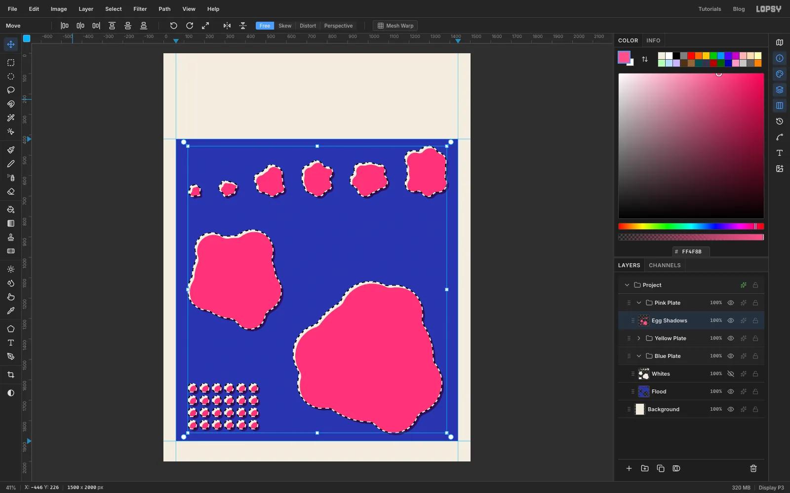

Select **Pink Plate** and add a layer named `Egg Shadows`. [[Cmd]]-click the **Whites** thumbnail (expand Blue Plate to reach it), select **Egg Shadows**, set the foreground to `#FF4F8B` and choose **Edit → Fill**. Deselect.

With the **Move** tool, press [[Shift+→]] and [[Shift+↓]] once each. Shift makes the arrow keys move 10 px, so the pink shifts 10 px down and to the right. Then [[Cmd]]-click **Whites** again, select **Egg Shadows** and press [[Delete]]. Only a thin crescent of pink is left, just outside each egg. Because the plate multiplies, pink over blue prints a dark violet, which reads as a shadow.

## Add the yolks with the Shape tool

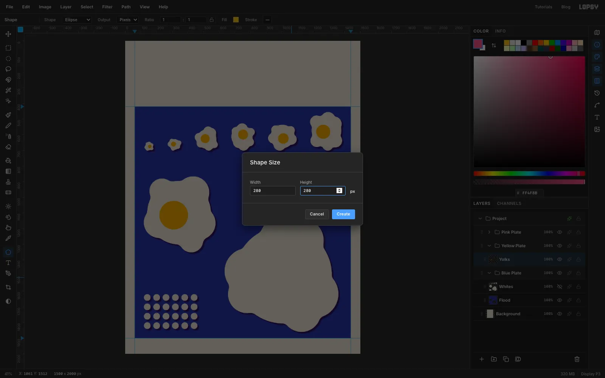

Select **Yellow Plate** and add a layer named `Yolks`. Choose the **Shape** tool, set **Shape** to **Ellipse** and **Output** to **Pixels**. Click the **Fill** swatch and type `FFC21A` into its hex field. If a stroke swatch is showing, click it and choose **Remove stroke**.

Instead of dragging, **click** where a yolk should go. A click opens the **Shape Size** dialog, where you can type an exact width and height. The shape is centred on the spot you clicked. Make each yolk about 80% of its egg's radius across, set a little off-centre the way a real yolk slides:

- Quail `22`, pigeon `31`, chicken `57`, duck `63`
- Turkey `67`, goose `90`, emu `183`, ostrich `280`

## Give the hen's eggs tiny yolks

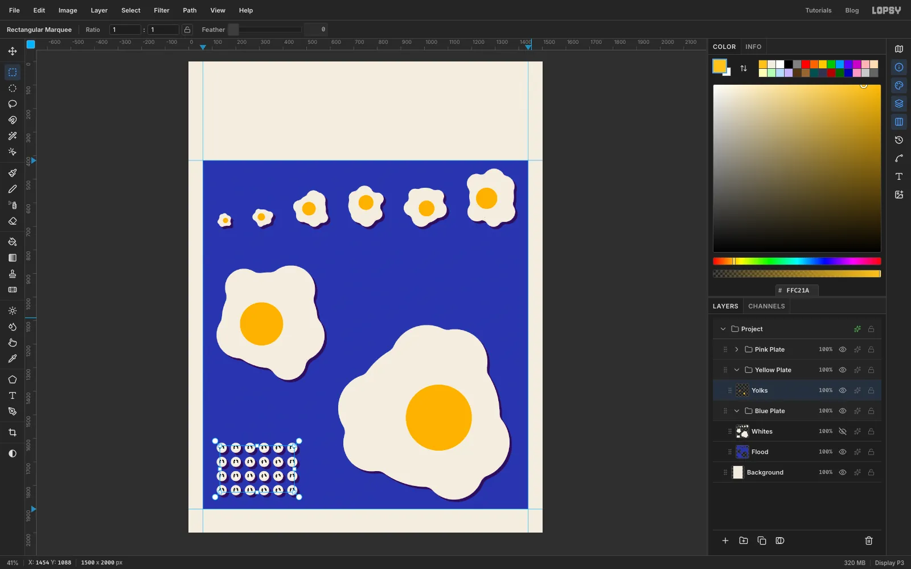

The 24 icons need yolks too, and Shrink can make all of them at once. [[Cmd]]-click **Whites**, then hold [[Shift+Alt]] and drag a rectangle around just the grid to keep only the 24 dots. **Select → Shrink…** by `13` turns each 44 px dot into an 18 px circle, centred where the dot was.

Select **Yolks**, set the foreground to `#FFC21A`, choose **Edit → Fill** and deselect.

## Map out where the yolks are shaded

Real yolks are domes, so give them a shaded edge on the lower right. First you'll make a black-and-white map of the shading, then turn it into halftone dots.

Select **Egg Shadows** in the Pink Plate and add a layer named `Yolk Shade`. [[Cmd]]-click **Yolks**, set the foreground to black and **Edit → Fill**. The yolks turn black.

Now cut the black back to a crescent. Set the foreground to white. [[Cmd]]-click **Yolks** again, then with the **Rectangular Marquee** [[Shift+Alt]]-drag a box around the chicken, duck, turkey and goose to keep just those four. With the marquee tool still active, tap [[←]] and [[↑]] to slide the **selection outline** about 7 px up and to the left. Select **Yolk Shade** and **Edit → Fill**. White covers everything except a crescent at the lower right.

Repeat for the ostrich and the emu, nudging the selection about 20 px this time, so the bigger yolks get thicker crescents. The quail, pigeon and hen yolks stay solid black for now. You'll deal with them in the next two steps.

The white areas are invisible on the poster because white multiplied by anything changes nothing.

## Turn the shading into halftone dots

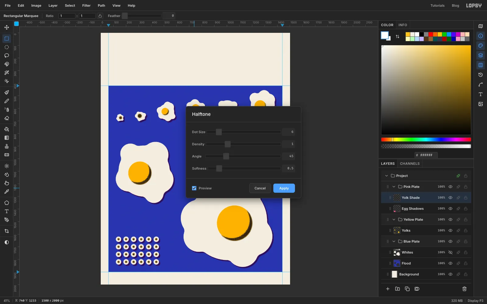

With **Yolk Shade** selected, run **Filter → Gaussian Blur…** with a radius of `7` to soften the crescents into a gradient. Then choose **Filter → Halftone…** and set **Dot Size** `6`, **Angle** `45` and **Softness** `0.5`, and leave **Density** at `1`. Turn on **Preview** to check the dots, then **Apply**. Dense black becomes big dots and the fade becomes small ones. White areas become transparent.

The blur spread the dots a little past the yolks, so trim them: [[Cmd]]-click **Yolks**, choose **Select → Inverse**, select **Yolk Shade** and press [[Delete]]. Then drag a marquee around the 24-egg grid and press [[Delete]] again, so those icons stay clean.

## Finish the small yolks and ink the dots pink

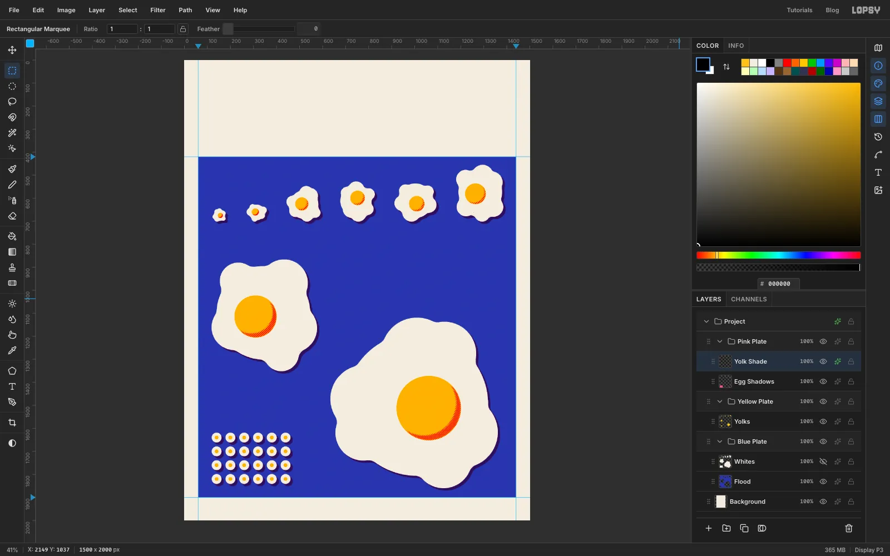

The two smallest yolks are only a few dots wide, so give them a solid crescent instead. Set the foreground to black. [[Cmd]]-click **Yolks**, [[Shift+Alt]]-drag a box around just the quail and pigeon, and **Edit → Fill** on **Yolk Shade**. Then nudge the selection outline about 4 px up and to the left with the arrow keys and press [[Delete]]. A thin black crescent remains on each.

Now open the effects drawer for **Yolk Shade**, enable **Color Overlay** and set it to `#FF4F8B`. Every dot turns pink, and because the Pink Plate multiplies, pink on yellow prints a hot orange-red.

## Knock out the yolk highlights

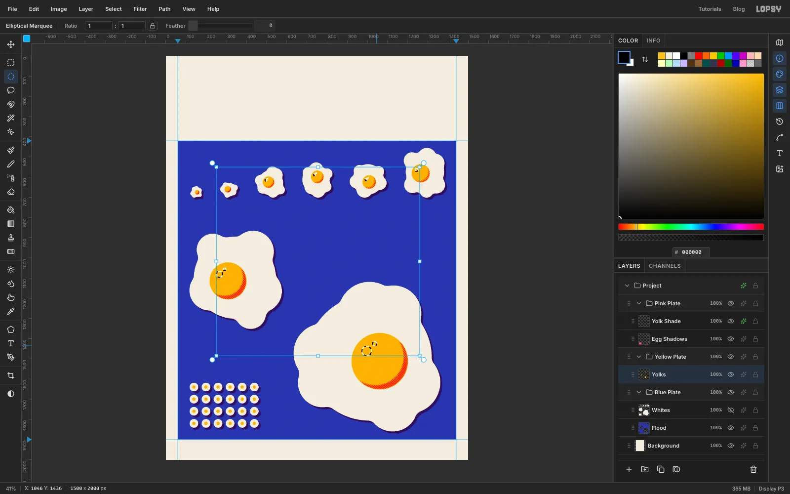

A wet yolk catches the light. With the **Elliptical Marquee**, [[Cmd]]-drag a small circle on the upper left of the chicken's yolk, about a third of the yolk's radius across. Then [[Cmd+Shift]]-drag a tiny one just above and to the right of it. Do the same on the duck, turkey, goose, emu and ostrich yolks, adding to the selection each time.

Select **Yolks** and press [[Delete]]. The highlights are holes in the yellow ink, so they show the paper, just like the whites.

## Set the headline

Select **Yolk Shade** so the headline lands in the Pink Plate. Choose the **Text** tool, pick **Bowlby One**, set **Size** to `170` and the colour to `#FF4F8B`, then click in the top margin and type `JUMBO YOLKS`. Press [[Tab]] to commit.

Switch to the **Move** tool and drag the headline so its left edge sits on the left guide, a little below the top margin. At 170 px it runs almost exactly from guide to guide, which makes the page feel deliberate.

## Fill the O's with yolk

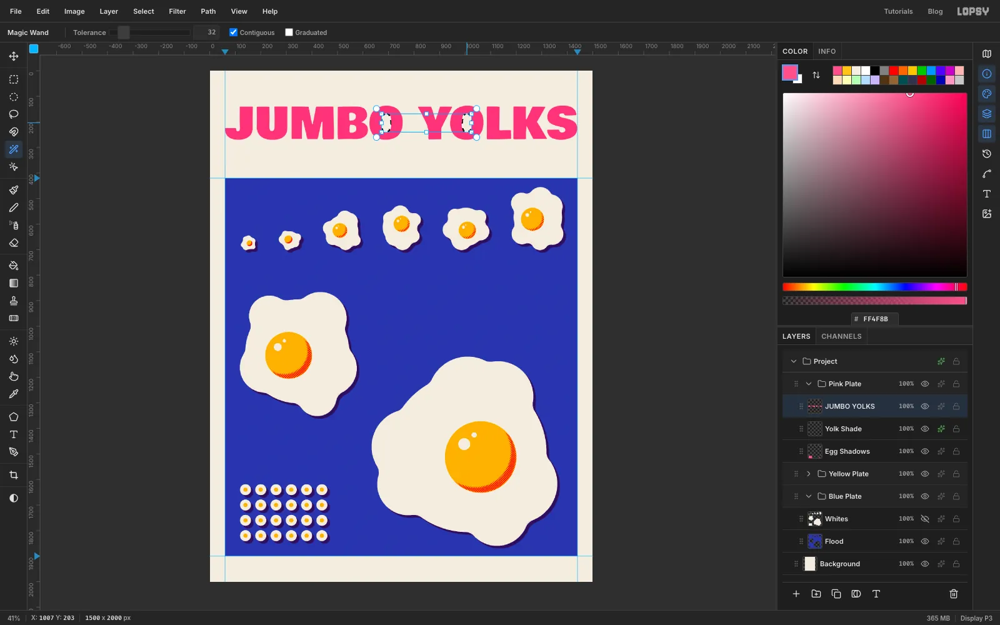

Turn the two O's into eggs. Select the headline layer, choose the **Magic Wand** with **Contiguous** on, and click inside the first O. [[Shift]]-click inside the second O to add it. Then **Select → Grow…** by `6`, so the yellow will tuck under the pink letter.

Expand **Yellow Plate**, select **Yolks**, add a layer named `Title Yolks`, set the foreground to `#FFC21A` and choose **Edit → Fill**. Where the grown yellow overlaps the pink letter, the overprint makes a thin orange-red rim. Printers call that overlap a **trap**.

## Add a blue offset shadow to the headline

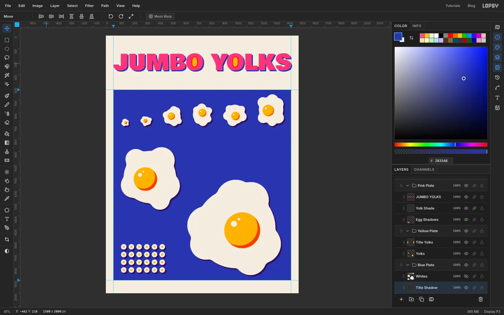

[[Cmd]]-click the headline's thumbnail, expand **Blue Plate**, select **Flood** and add a layer named `Title Shadow`. Set the foreground to `#2B35A8`, choose **Edit → Fill** and deselect. With the **Move** tool, nudge the layer about 9 px down and to the right with the arrow keys.

If you left it there, the pink would print over the blue and the headline would turn a muddy violet. Knock the letters out of the shadow: [[Cmd]]-click the headline thumbnail again, select **Title Shadow** and press [[Delete]]. Then [[Cmd]]-click **Title Yolks** and delete that too. Now only the blue offset shows, and the pink stays pink.

## Label the row of eggs

Labels print in **opaque** ink, so they sit on top of everything. Strictly, a printer would knock these out of the blue too. Keeping the type opaque and on top means it stays editable, and at this size nobody can tell. Collapse the three plates, select **Pink Plate**, click **New Group** and name it `Type`. Select **Type** and add a layer called `Leaders` to hold the lines you'll draw later.

With **Leaders** selected, set the text to **Courier Prime**, weight **Bold**, size `24`, colour `#F3EDE0`. Type each bird's name in capitals. Make the weights in **Alfa Slab One** at size `34` in `#FFC21A`, for example `9 g`.

> **Tip:** Clicking inside an existing line of text edits it instead of starting a new one. Create each label in an empty patch of the canvas, then move it into place.

Centre each name under its egg, about 45 px below the row's common bottom line, and each weight just below its name. Use the **Move** tool, with the arrow keys for the last few pixels. Because the eggs share a bottom line, every label sits the same distance from its egg.

## Label the emu and ostrich

The two giants get bigger labels: the name in Courier Prime Bold at `34`, the weight in Alfa Slab One at `84`.

- Put **EMU** and **600 g** in the open blue to the right of the emu.
- Put **OSTRICH** and **1,400 g** at the left edge of the panel, under the emu and above the grid. Set `= 24 HEN'S EGGS` in Courier Prime Bold at `24` just above the grid.

Each big label needs a line pointing at its egg. Select **Leaders**, choose the **Pencil**, set **Size** to `3` and the colour to the paper cream. Click just left of **600 g**, level with the middle of the number, then [[Shift]]-click on the emu's edge to draw a straight line. Do the same from the end of **1,400 g** to the ostrich's edge. Finish each line with a single click of the **Brush** at size `14` right on the egg's edge. The dot shows exactly which egg the label belongs to.

## Draw a size legend

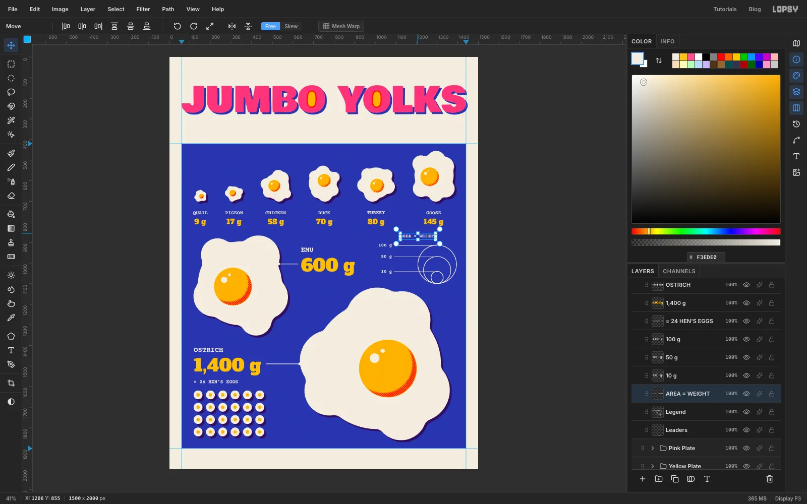

A bubble chart needs a key showing what a size means. Select **Leaders** and click **Add Layer**, then name the new layer `Legend`. Choose the **Shape** tool, click the **Fill** swatch and choose **Remove fill**, then add a stroke in `#F3EDE0` with **Width** `3`.

Use the same formula as the eggs: 100 g is 187 px across, 50 g is 132 px and 10 g is 59 px. Click to create each ring with the **Shape Size** dialog, placing their centres so all three rings share one bottom edge, in the open blue under the goose, to the right of the emu label.

With the **Pencil** at size `2`, click at the top of each ring, then [[Shift]]-click about 200 px to its left to draw a straight line. Then add the labels `100 g`, `50 g` and `10 g` in Courier Prime Bold at `22`, right-aligned at the end of each line. Centre the heading `AREA = WEIGHT` in Courier Prime Bold at `22` above the legend, with clear space between it and the row of weights above.

## Add the blue type

The small print is part of the blue plate. Select **Title Shadow** and set **Courier Prime** in `#2B35A8`:

- `THE GREAT EGG CENSUS` (Bold, `26`) flush with the left guide near the top edge, and `PLATE NO. 7` flush with the right guide on the same line.
- `How much does an egg weigh?` (Regular, `40`) on the left, halfway between the headline and the panel.
- `Typical whole-egg weights, rounded. Each white's area is proportional to weight.` (Regular, `22`) in the bottom margin, under the panel.

The footnote matters: a data poster should say where its numbers come from and how to read them.

## Give the blue ink some texture

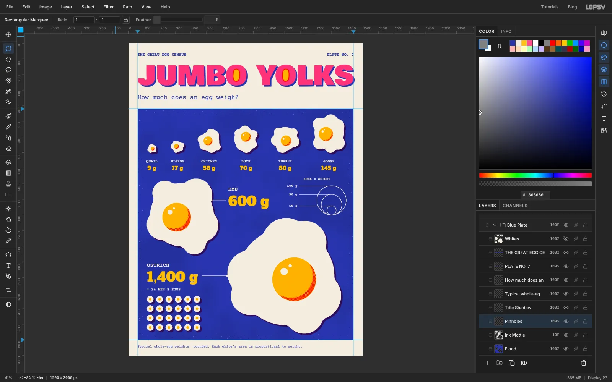

Flat digital blue looks like a screen, not ink. Two layers fix it, both in **Blue Plate**, directly above **Flood**:

1. **Uneven ink.** Select **Flood**, click **Add Layer** and name the new layer `Ink Mottle`. Run **Filter → Clouds…** with a **Scale** of `6`. Set its blend mode to **Multiply** and its opacity to `10%`. Then [[Cmd]]-click **Flood**, choose **Select → Inverse** and press [[Delete]], so the clouds touch only the blue.
2. **Pinholes.** Add a layer named `Pinholes`, fill it with mid-grey `#808080`, and run **Add Noise…** at `100` **Mono**, then **Gaussian Blur…** at `1`. Run **Filter → Threshold…** at about `176`, so only a few specks of noise turn white. Set the layer's blend mode to **Screen**, which hides the black.

Real screens get pinholes near the edges of the stencil. Marquee the whole panel, **Shrink** the selection by `36` and press [[Delete]] to clear the middle. Then [[Cmd]]-click **Flood**, choose **Select → Inverse** and delete again. That leaves specks only on the blue, in a band along its edges.

## Make a stamp

Expand **Pink Plate**, select the headline and add a layer named `Stamp`. With the **Shape** tool, set the fill to `#FF4F8B` and remove the stroke, then click to create a `136` × `136` circle to the right of the subtitle. Switch to a cream `3` px stroke with no fill and click the same spot without moving the mouse for a `120` × `120` ring.

Type `DRAWN`, `TO` and `SCALE` as three separate text layers in **Bowlby One** at `24` in the paper colour, and centre them in the ring. Then select each word's layer in turn, from the bottom up, and choose **Layer → Merge Down** until they're all part of **Stamp**.

## Scale and tilt the stamp

At 136 px the stamp crowds the panel. Draw a rectangular marquee just around it and switch to the **Move** tool. Hold [[Cmd]] and drag the bottom-right handle in toward the centre until the box is about 80% of its size. Cmd keeps the proportions.

Next, move the pointer just outside a corner until it shows the rotate cursor, and drag counter-clockwise about 12°. Press [[Enter]] to apply and [[Cmd+D]] to deselect. Nudge the stamp with the arrow keys until it sits in the paper margin, clear of both the headline above and the blue panel below.

## Pencil the edition and misregister the plates

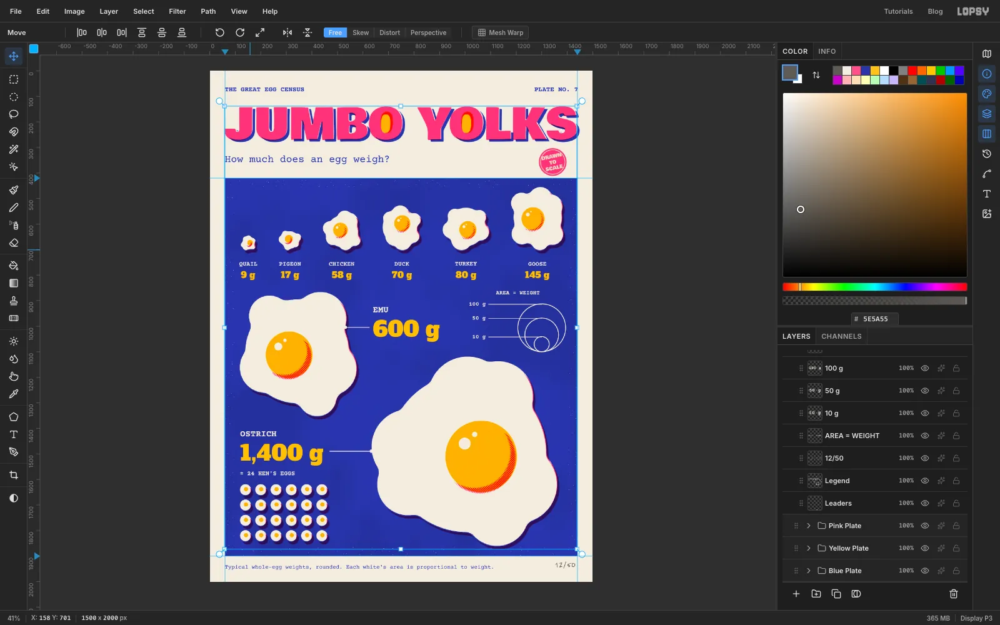

Hand-pulled prints are signed and numbered in pencil. Select **Legend** and type `12/50` in **Reenie Beanie** at `48` in `#5E5A55`. Line it up with the right guide, sitting on the same baseline as the footnote. Click **Rasterize Layer** (the T button at the bottom of the Layers panel), then run **Add Noise…** at `35` **Mono**, so the grey picks up a graphite grain.

Last, knock the inks out of register, as if the screens shifted between passes. Select the **Yellow Plate** group and, with the **Move** tool, nudge it about 2 px right and 2 px up with the arrow keys. Select **Pink Plate** and nudge it about 2 px left and 3 px down. Now the pink shadows peek out on one side of each egg, the orange-red trap shows in the title's O's, and the halftone sits a hair off the yolks. Keep it to two or three pixels. Any more and it reads as a mistake rather than a print.

Save with **File → Save Project**, and export with **File → Quick Export PNG**.
