A screen print is built one ink at a time. Each ink is pushed through its own
stencil, so the look comes from a few simple habits:

- a small, fixed set of inks
- overprints, where two inks overlap and make a third, darker colour
- halftone dots standing in for shading
- plates that never line up perfectly (misregistration)

In this tutorial you'll use those habits to make a menu for **Nomad Kebab**, a
late-night kebab shop. At the top, a döner spit stands in front of a desert
sunrise. Under it sits a chunky two-colour headline and a two-column menu with
dotted leaders.

Along the way you'll use:

- lasso, marquee and ellipse fills
- the **Halftone** and **Add Noise** filters
- **Multiply** blend modes and **Color Overlay** / **Stroke** effects
- Google fonts, letter spacing and right-aligned area text
- brush spacing for dotted lines
- scale and rotate handles, copy and paste, and layer groups

There are only three inks, on cream paper:

- tomato `#E0452B`
- mustard `#F2B233`
- deep teal `#1D4E57`
- paper `#EFE4CC`

## Set up the paper and a double-rule border

Open [Lopsy](/). In the **New Document** dialog, set **Width** `1000` and
**Height** `1400`, choose a **White** background and click **Create**.

Select **Background**, type `EFE4CC` into the Color panel's hex field and
choose **Edit → Fill**. Click the top ruler at x `50`, `500` and `950`, and the
left ruler at y `50`, `640` and `1350`, to drop six guides.

Rename **Layer 1** to `Border` and set the foreground to teal `#1D4E57`. With
the **Rectangular Marquee** ([[M]]), build two frames:

1. Drag from (30, 30) to (970, 1370), choose **Edit → Fill**, then marquee
   (42, 42) to (958, 1358) and press [[Delete]]. That leaves a 12 px rule.
2. Marquee (50, 50) to (950, 1350), **Fill**, then marquee (55, 55) to
   (945, 1345) and press [[Delete]]. That leaves a thin 5 px inner rule.

## Lasso a sunburst

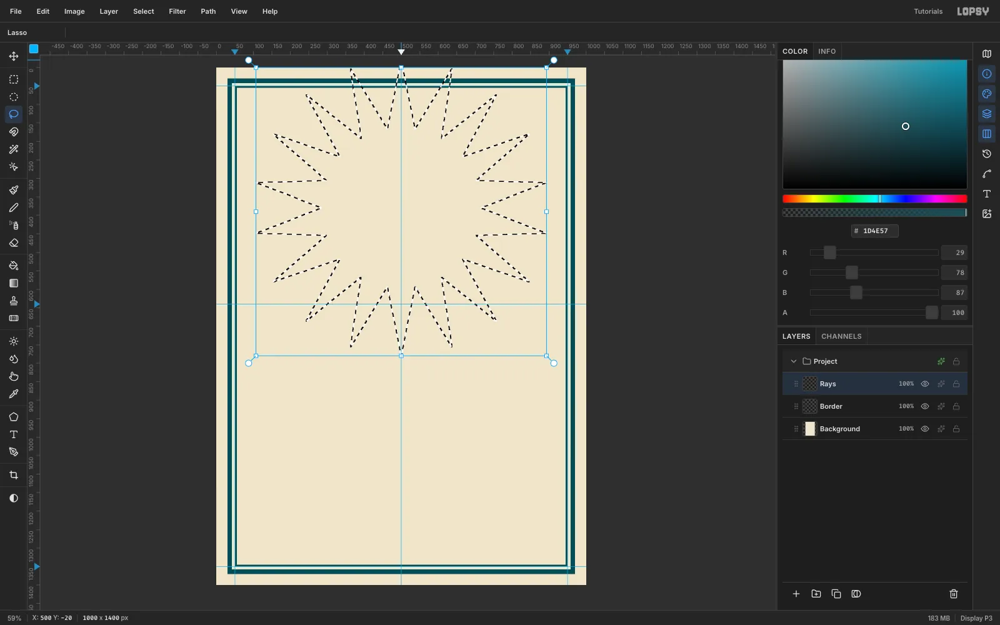

Click **Add Layer** and name it `Rays`. With the **Lasso** ([[L]]), click
around a star centred on (500, 380). Alternate between points 400 px out and
215 px out, 18 of each, so the tips run off the top of the scene.

Fill it with mustard `#F2B233`. Then trim the rays to the scene:

1. Marquee (55, 55) to (945, 640).
2. Choose **Select → Inverse** and press [[Delete]].
3. Click the layer's opacity and set it to `60%`.

## Overprint a red sun with Multiply

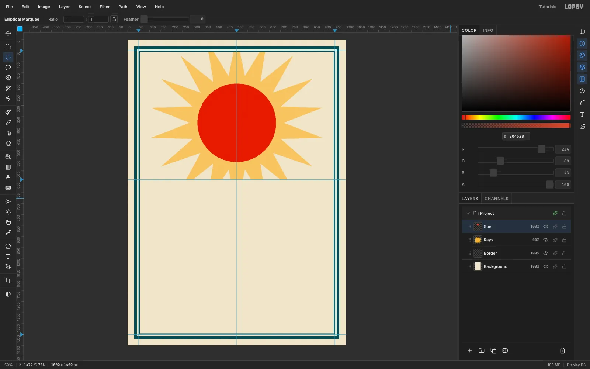

Add a layer called `Sun`. With the **Elliptical Marquee**, drag a 360 × 360
circle from (320, 200). Fill it with tomato `#E0452B`, then press [[Cmd+D]].

Click the layer's **✦** (Layer effects) button and set **Blend** to
**Multiply**. In screen printing, a second ink on top of the first darkens it.
Multiply gives you that overprint for free, and everything you stack from now
on reads as real ink on paper.

## Draw a gradient for the sun's dots

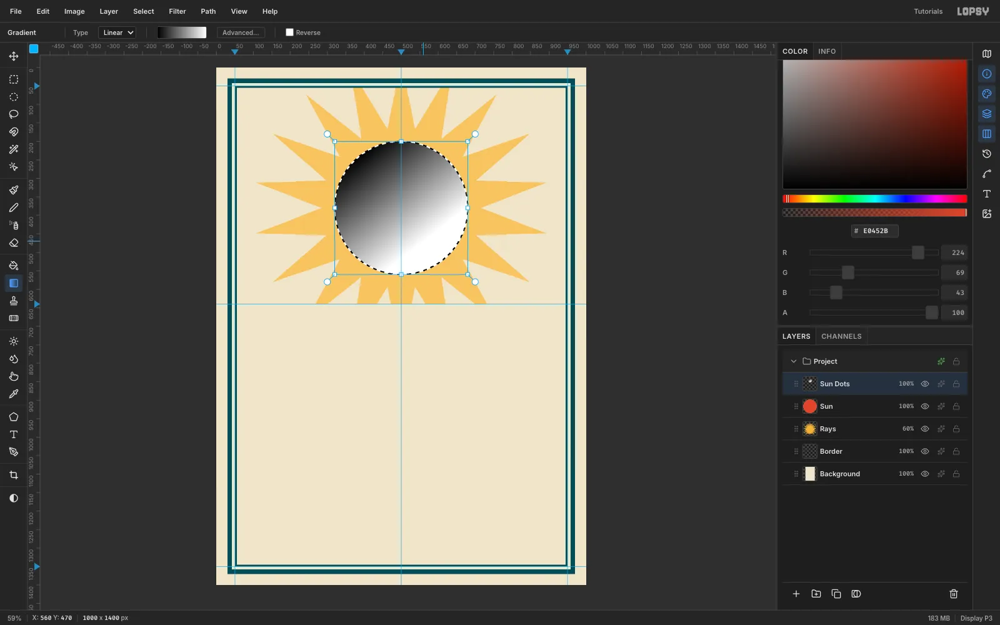

Add a layer called `Sun Dots` and marquee the same 360 px circle again. Pick
the **Gradient** tool. It starts black to white, so drag from the upper left
(380, 240) to the lower right (560, 470).

The dark end of the gradient becomes big dots and the light end becomes small
ones.

## Turn the gradient into halftone

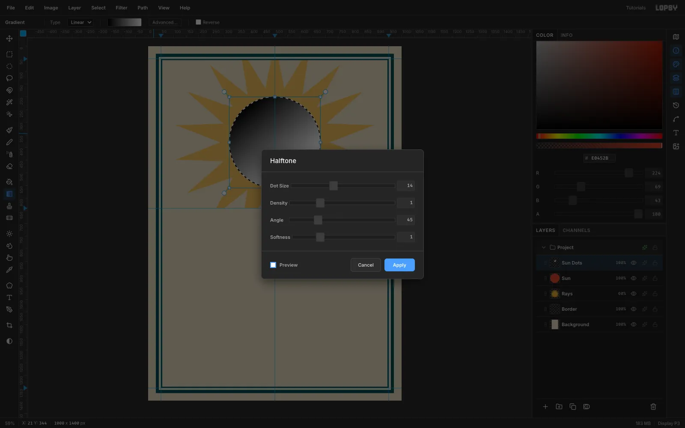

Choose **Filter → Halftone…** and set:

- **Dot Size** `14`
- **Density** `1`
- **Angle** `45`
- **Softness** `1`

Click **Apply**, then press [[Cmd+D]]. The filter keeps each cell's colour as
the dot and makes the gaps transparent.

> **Tip:** Leave Softness at 1 or more. At 0, light areas stay solid instead
> of breaking into small dots.

## Colour the dots mustard

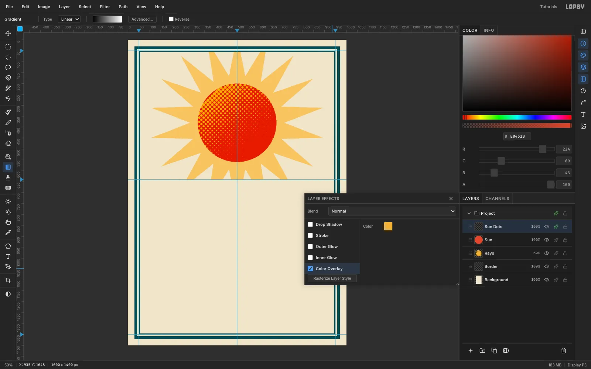

Open **✦** on `Sun Dots`, tick **Color Overlay** and set its colour to
`#F2B233`. The grey dots become a mustard highlight printed over the red sun,
which is the classic two-ink halftone blend.

## Add teal dunes on Multiply

Add a layer called `Dunes`. With the **Lasso**, click a gently rolling
horizon from (50, 500) across to (950, 460), then down to (950, 640) and back
along the bottom to (50, 640). Fill it with teal.

Set the layer to **Multiply**. Where the teal crosses the rays and the sun,
you now get darker olive and brown overprints, and no fourth ink.

## Print a dotted foreground dune

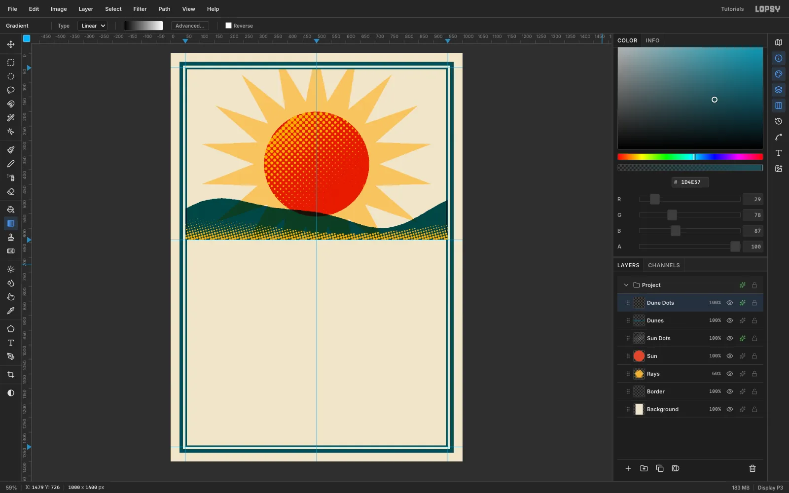

Add a layer called `Dune Dots` and lasso a lower, shallower wave between about
y 566 and 640. Drag the **Gradient** from the bottom (500, 640) up to
(500, 570).

Run **Filter → Halftone…** with **Dot Size** `9`, **Angle** `15` and
**Softness** `1`, press [[Cmd+D]], then add a mustard **Color Overlay**. The
dots swell toward the bottom edge like sand in the foreground.

## Lasso the döner cone

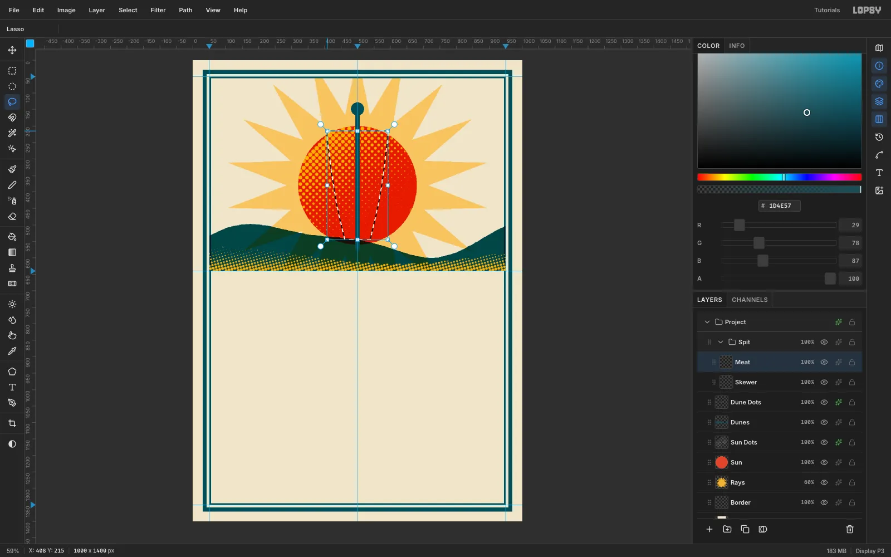

In the Layers panel, click **Dune Dots**, click **New Group** and name the
group `Spit`. Inside it:

1. Add a layer called `Skewer`. Fill a 14 px wide teal bar from (493, 150)
   down to y 575, and a 40 px teal disc on top at (480, 128).
2. Add a layer called `Meat` and lasso a cone that's 184 px wide at y 215 and
   tapers to about 76 px at y 545.
3. Fill it with mustard, and keep the selection active.

## Paint stripes inside the selection

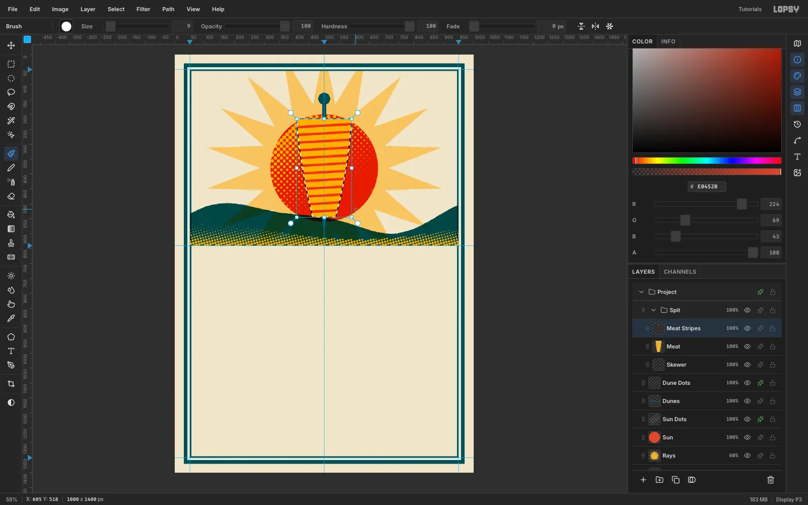

Add a layer called `Meat Stripes`. Pick the **Brush** ([[B]]) and set
**Size** `9`, **Hardness** `100`, and tomato as the colour.

Starting at y 238 and moving down every 26 px, click on the left of the cone,
then [[Shift]]-click on the right, a little higher, to draw a slanted line.
The active selection clips every stroke to the cone.

Press [[Cmd+D]] and set the layer to **Multiply**. The red over mustard turns
the colour of seared meat.

## Shade and outline the cone

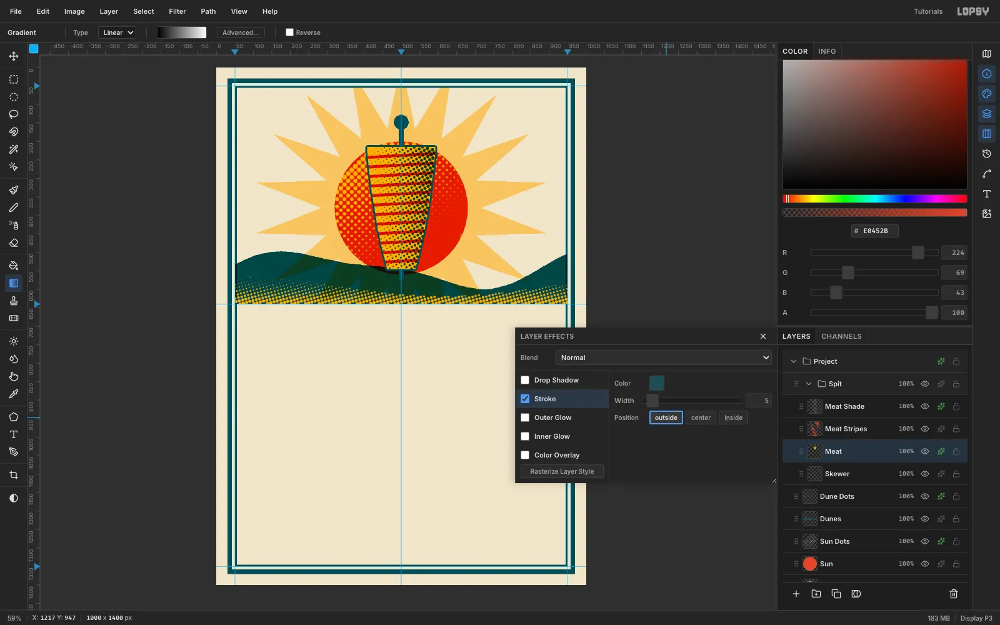

Add `Meat Shade` and lasso the cone again. Drag a gradient from the right
edge (600, 380) to the left edge (395, 380), then run **Halftone** with
**Dot Size** `10`, **Angle** `30` and **Softness** `1`. Give it a teal
**Color Overlay** and set it to **Multiply**. The dots grow toward the right
edge, so the cone looks round.

Select `Meat`, open **✦**, tick **Stroke**, and set the colour to teal,
**Width** `5` and position **outside**. That gives a printed keyline.

## Move the whole spit as a group

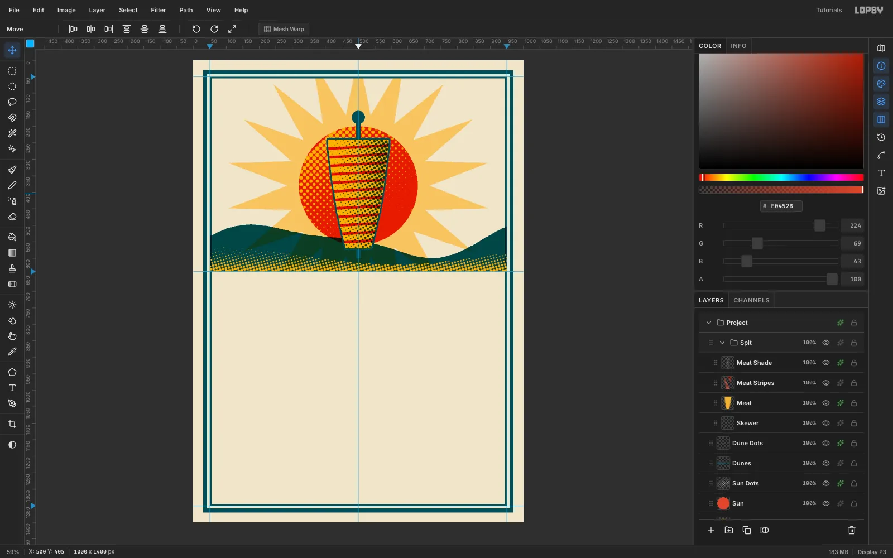

Click the **Spit** group row, press [[V]] for **Move**, and drag the spit
25 px down so the skewer sinks into the dunes. All four layers move together.

Try [[Cmd+Z]] and [[Cmd+Shift+Z]]. The group jumps back and forth exactly.

## Set the headline in Shrikhand

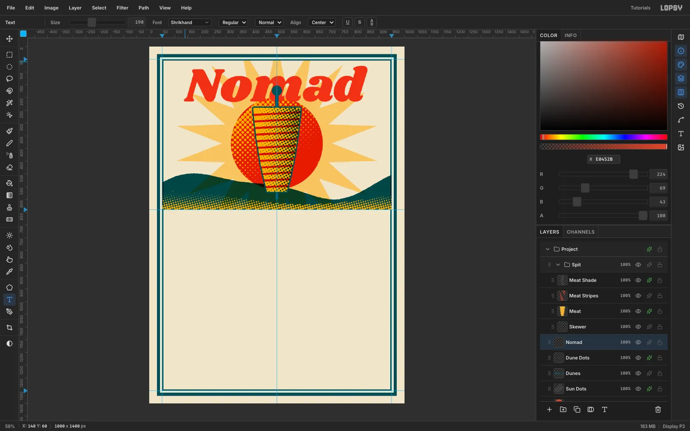

Click **Dune Dots**, so the new text is anchored on a raster layer. Press
[[T]] for **Text**, then set:

- **Size** `190`
- **Font** **Shrikhand** (search for it in the font menu)
- tomato as the colour

Click in empty space near the top of the canvas, type `Nomad` and press
[[Tab]] to commit. Switch to **Move** and drag the word down so its letters
start at about y 670, centred on the 500 guide.

## Misregister the headline

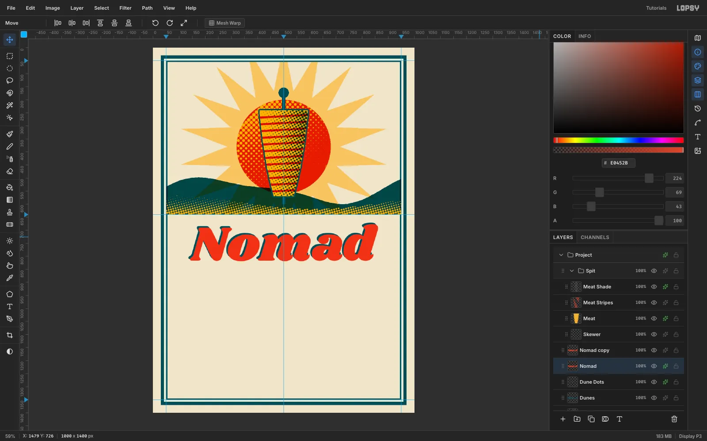

Click **Duplicate Layer** in the Layers panel, then **click the copy's row**
so only the copy is selected. The copy lands 10 px down and right. Nudge it
back with [[←]] and [[↑]] four times each, which leaves it 6 px off the
original.

Now select the original **Nomad** layer and give it a teal **Color Overlay**.
The red copy prints on top, and the teal plate peeks out at the top left, just
like a loose screen.

## Add KEBAB with a red offset

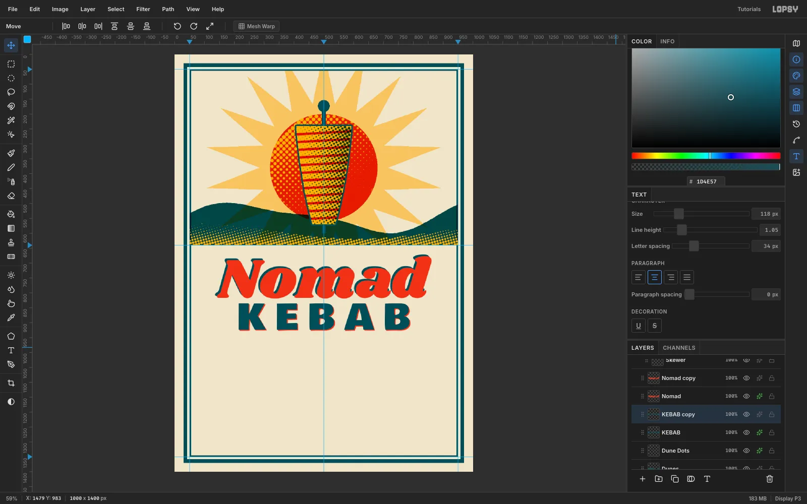

Click **Dune Dots** again and open the **Text** panel. Set **Letter spacing**
to `34`. Type `KEBAB` in **Bowlby One** at `118` px in teal, then move it
under the headline, centred.

Repeat the misregistration the other way round:

1. **Duplicate Layer**, click the copy's row, and press [[Shift+←]] and
   [[Shift+↑]] to put it back in place.
2. Give the original a tomato **Color Overlay**.
3. Nudge the original 3 px right and 3 px down.

A thin red edge now shows at the lower right of each letter.

## Print the tagline banner

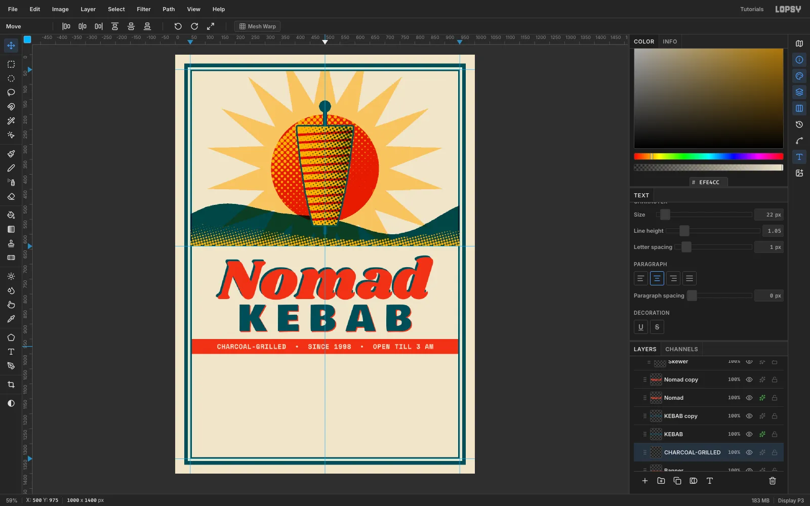

Add a layer called `Banner`, marquee (55, 950) to (945, 1000) and fill it with
tomato. Set the Text panel's **Letter spacing** back to `1`, then type
`CHARCOAL-GRILLED • SINCE 1998 • OPEN TILL 3 AM`. Use **Space Mono**,
**Bold**, `22` px, in paper cream `#EFE4CC`.

Paste the bullets from the clipboard if your keyboard can't type them. Then
**Move** the line so it sits centred in the band.

## Build the left menu column

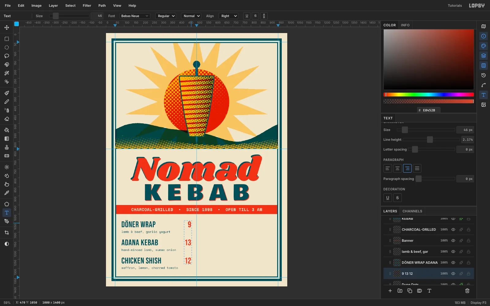

The column is three separate area-text layers, all anchored on
**Dune Dots**. Create an area-text box by **dragging** with the Text tool.
Make the descriptions first, so later drags never start inside an existing
text box.

1. **Descriptions:** Space Mono Regular, `17` px, teal. Set **Line height**
   `1.4` and **Paragraph spacing** `76`. Drag a box from (85, 1086) to
   x 405 and type the three lines:
   - `lamb & beef, garlic yogurt`
   - `hand-minced lamb, sumac onion`
   - `saffron, lemon, charred tomato`
2. **Items:** Bebas Neue, `46` px, teal, **Line height** `2.174` (a 100 px
   pitch). Drag from (85, 1010) to x 390 and type `DÖNER WRAP`,
   `ADANA KEBAB` and `CHICKEN SHISH`, one per line.
3. **Prices:** Bebas Neue, `46` px, tomato, **Align right**. Drag a narrow box
   from (408, 1010) to x 470 and type `9`, `13` and `12`.

## Build the right menu column

Repeat the three layers on the right half:

1. Descriptions from (530, 1086):
   - `hummus, tahini, parsley salad`
   - `sliced döner, butter tomato`
   - `salted yogurt drink, black tea`
2. Items from (530, 1010): `FALAFEL PLATE`, `İSKENDER` and `AYRAN & ÇAY`.
3. Right-aligned prices from (853, 1010) to x 915: `11`, `15` and `4`.

The 100 px pitch lines every price up with its item.

## Space out the brush for dots

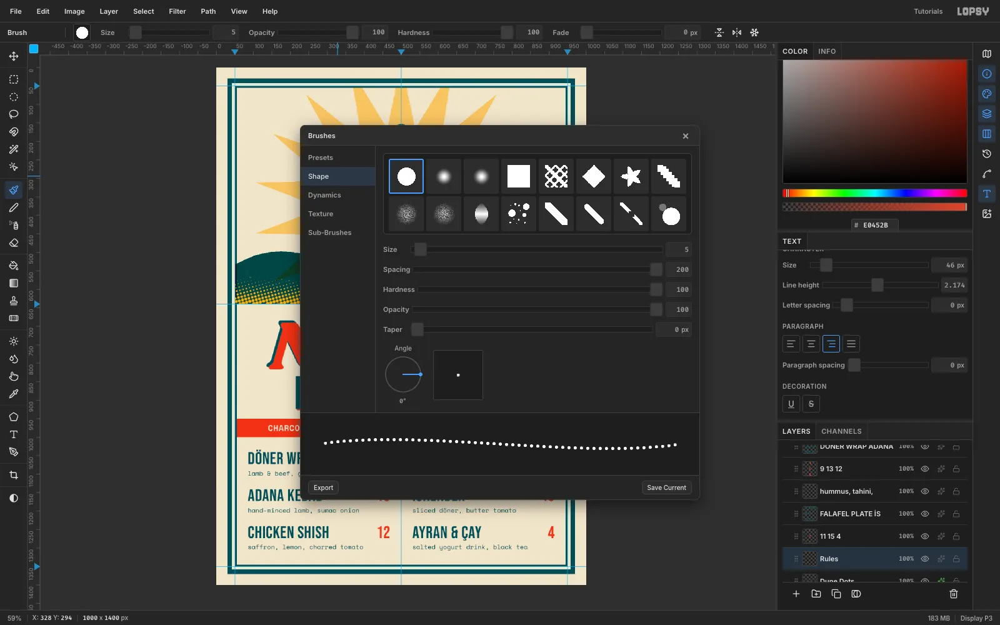

Click **Dune Dots**, then add a layer called `Rules`. Pick the **Brush**, set
**Size** `5` and **Hardness** `100`, and open the brush presets. On the
**Shape** tab, set **Spacing** to `260`.

Each dab now lands well apart from the last, so a stroke becomes a row of
round dots.

## Draw dotted leaders and a divider

In teal, click at (500, 1038) and [[Shift]]-click at (500, 1300) to draw the
column divider. Then do the same for each leader, just above the baseline,
from the end of each item to its price:

- left column at y 1070, 1169 and 1270
- right column at y 1069, 1170 and 1270

Leave a gap after `ADANA KEBAB` for the chilli.

## Lasso a chilli

Add a layer called `Chili`. Working at double size is easier, so lasso a
curved pod about 30 × 60 px starting near (306, 1110), and fill it with
tomato. Lasso a thin stem on top and fill it with teal.

Keep it to two inks, so it reads as part of the print rather than an emoji.

## Scale the chilli down

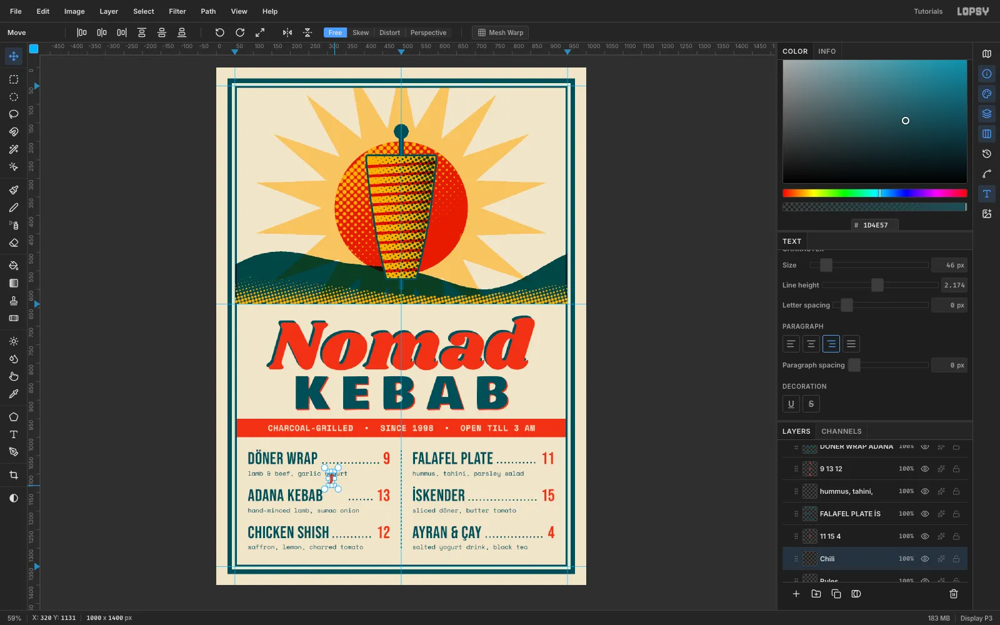

Marquee around the chilli and switch to **Move**. Hold [[Shift]] and drag the
bottom-right handle up and left until the chilli is about half size. Press
[[Cmd+D]] to commit the scale.

Then drag it into the gap after `ADANA KEBAB`, so it lines up with the
capitals.

## Paste and rotate a second chilli

Marquee the chilli and press [[Cmd+C]], then [[Cmd+V]]. The paste lands in
place on a new layer.

1. **Move** the paste 24 px to the right, then press [[Cmd+D]].
2. Marquee it again. Drag just outside the top-right corner (the cursor turns
   into a crosshair) to rotate it about 22°, then press [[Cmd+D]].
3. Choose **Layer → Merge Down** to fold it into `Chili`.

Two chillies mean *extra hot*.

## Build the badge seal

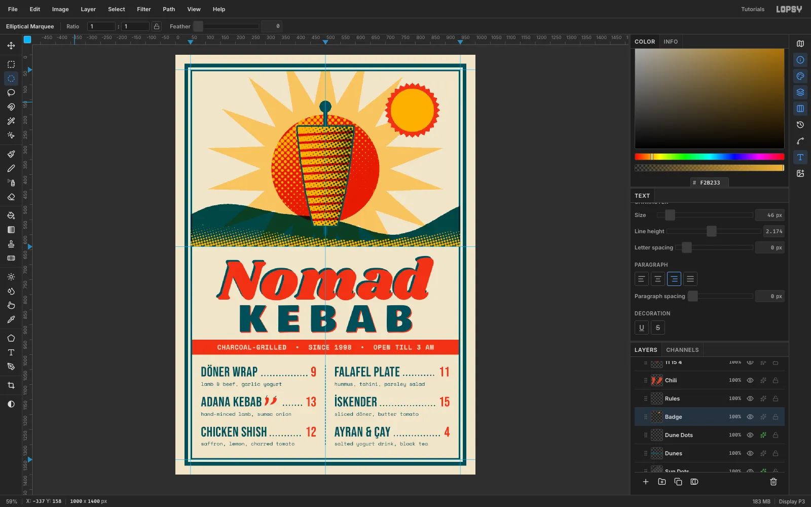

Click **Dune Dots** and add a layer called `Badge`. Lasso a 28-point seal
around (790, 185), alternating 92 px and 83 px from the centre. Fill it with
tomato. Then drag a 144 px ellipse from (718, 113) and fill it with mustard.

Drag an area-text box across the disc and type `HOT` / `OFF THE` / `SPIT`,
one word group per line. Use **Bowlby One**, `26` px, teal, **Align center**
and **Line height** `1.05`. Centre it on the disc, click **Rasterize Layer**,
then **Layer → Merge Down**.

## Tilt the badge

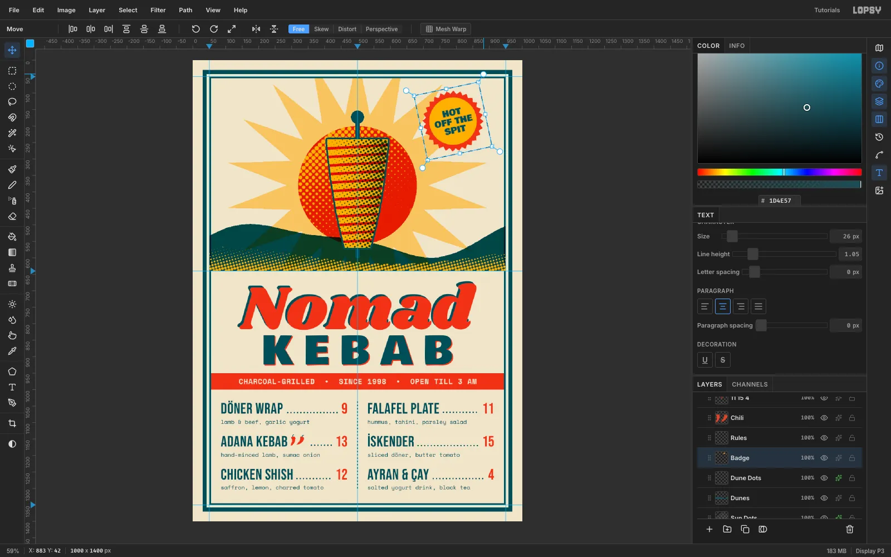

Marquee around the badge and switch to **Move**. Drag the rotate handle
anticlockwise about 12°, then press [[Cmd+D]]. A slight tilt makes it feel
slapped on after printing.

> **Tip:** If the badge ever snaps back upright on screen, press [[Cmd+Z]] and
> then [[Cmd+Shift+Z]] to bring the rotation back before you export.

## Select the menu layers

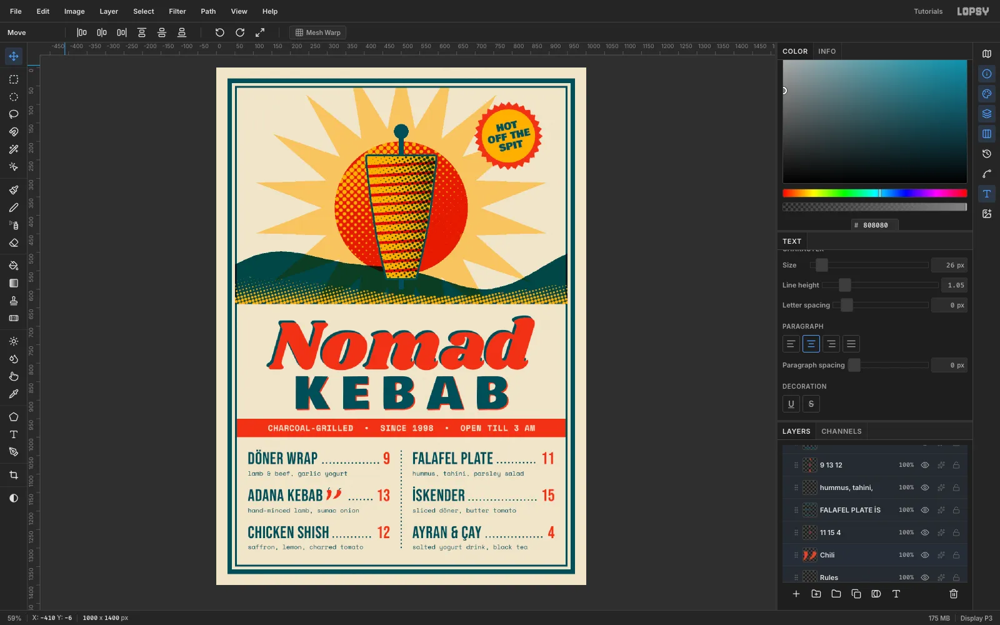

Click the top description layer, then [[Cmd]]-click each of the other menu
layers: both item columns, both price columns, the other description layer,
`Rules` and `Chili`.

## Group and nudge the menu

Choose **Layer → Group Layers** and rename the group `Menu`. Press [[V]], then
[[Shift+↑]] once and [[↓]] four times. That lifts the whole menu 6 px, so the
space above and below the columns is even.

## Add paper grain and ink texture

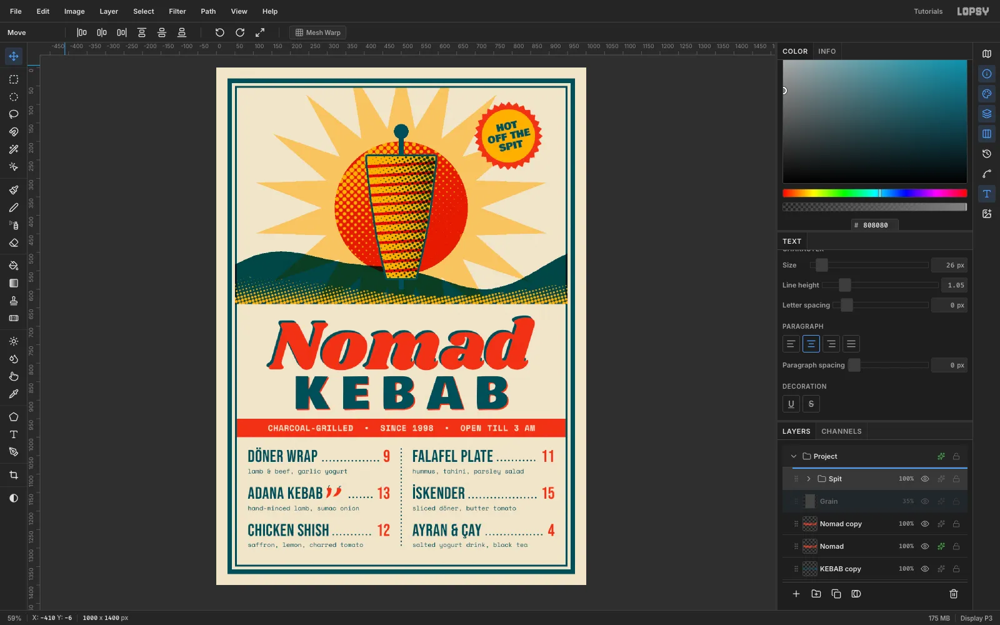

Real prints are never flat. Pick **Filter → Add Noise…** with **Mono** and
**Gaussian** on these layers:

- **Background**: Amount `8`, for paper tooth
- **Sun** and **Banner**: Amount `12`, for ink texture

Then click the top headline layer and add a layer called `Grain`. Fill it with
`#808080` and run **Add Noise** at `40`. Set it to **Overlay** at `35%`
opacity. Drag its row above the collapsed **Spit** group so the grain covers
everything.

## Export the finished menu

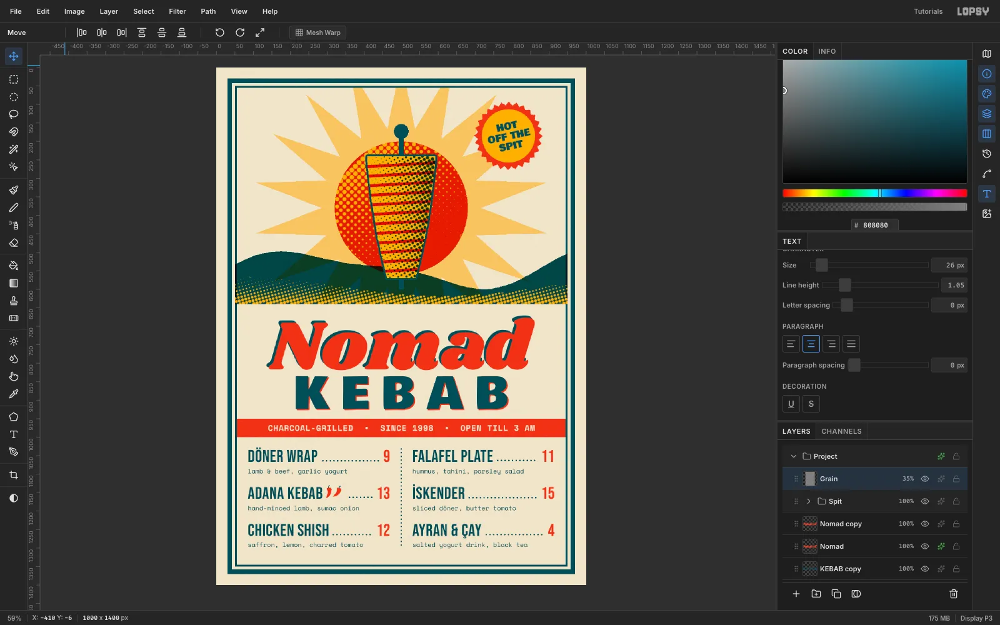

Hide the guides with **View → Show Guides**. Then use **File → Quick Export
PNG** for the image and **File → Save Project** to keep every layer editable.

Try the same method on a gig poster or a beer label. Pick three inks, let
Multiply make the fourth, and put dots wherever you would normally shade.
