A screen print is built one ink at a time. Each ink is pushed through its own
stencil, so the look comes from a few simple habits:

- a small, fixed set of inks
- overprints, where two inks overlap and make a third, darker colour
- halftone dots standing in for shading
- plates that never line up perfectly (misregistration)

In this tutorial you'll use those habits to make a menu for **Nomad Kebab**, a
late-night kebab shop. At the top, a döner spit stands in front of a desert
sunrise. Under it sits a chunky two-colour headline and a two-column menu with
dotted leaders.

Along the way you'll use:

- lasso, marquee and ellipse fills
- the **Halftone** and **Add Noise** filters
- **Multiply** blend modes and **Color Overlay** / **Stroke** effects
- Google fonts, letter spacing and right-aligned area text
- brush spacing for dotted lines
- scale and rotate handles, copy and paste, and layer groups

There are only three inks, on cream paper:

- tomato `#E0452B`
- mustard `#F2B233`
- deep teal `#1D4E57`
- paper `#EFE4CC`

## Set up the paper and a double-rule border

Open [Lopsy](/). In the **New Document** dialog, set **Width** `1000` and
**Height** `1400`, choose a **White** background and click **Create**.

Select **Background**, type `EFE4CC` into the Color panel's hex field and
choose **Edit → Fill**. Then drop six guides with single clicks on the rulers:

- On the top ruler, click about 50 px in from each side, and [[Cmd]]-click (Ctrl-click) the middle to snap a guide exactly to the centre.
- On the left ruler, click about 50 px from the top and from the bottom, and once a little under halfway down, around 640. That one marks the bottom of the picture at the top of the menu.

Rename **Layer 1** to `Border` and set the foreground to teal `#1D4E57`. The
rules need to be even all the way round, so let the marquee dialog place
them. With nothing selected, a single click (no drag) with the **Rectangular
Marquee** ([[M]]) opens fields for the **From** and **To** corners.

1. Click once and enter **From** `30, 30` **To** `970, 1370`. Choose **Edit → Fill**, then **Select → Shrink…** by `12` px and press [[Delete]]. That leaves a 12 px rule 30 px in from the edge.
2. Press [[Cmd+D]], click again and enter `50, 50` to `950, 1350`, so the box sits right on the guides. **Fill**, **Shrink** by `5` px and press [[Delete]]. That leaves a thin 5 px inner rule.

## Lasso a sunburst

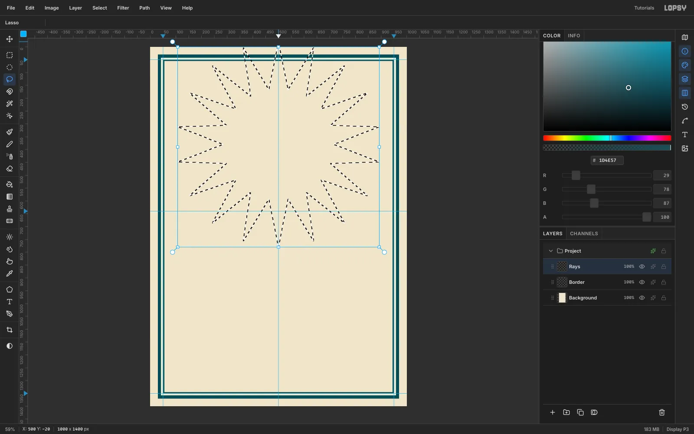

Click **Add Layer** and name it `Rays`. The sun will sit on the centre guide,
a little over a quarter of the way down the page, so that's the star's centre
too. With the **Lasso** ([[L]]), drag round it in straight runs, alternating
between long points about 400 px out and short ones about 215 px out, 18 of
each, and let go back at the start. The long tips run off the top of the
scene.

> **Tip:** For perfectly straight rays, click the 36 corners with the
> **Pen Tool** instead, click **Commit path**, then **Path to Selection** in
> the Paths panel.

Fill it with mustard `#F2B233`. Then trim the rays to the scene:

1. Marquee the inside of the inner rule, from its top-left corner down to the guide at 640.
2. Choose **Select → Inverse** and press [[Delete]].
3. Click the layer's opacity and set it to `60%`.

> **Tip:** **Filter → Sunburst…** makes even rays in one go. Set the
> foreground to mustard and use **Rays** `18`, **Center X** `50` and
> **Center Y** `27`, with **Gaps: Keep Layer**, then trim it the same way.

## Overprint a red sun with Multiply

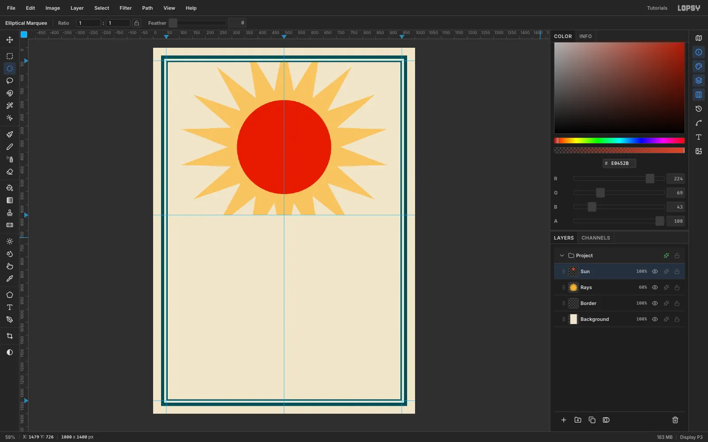

Add a layer called `Sun`. With the **Elliptical Marquee**, [[Cmd]]-drag a
circle about 360 px across, centred on the middle guide where the rays meet.
For an exact one, click once instead and enter **From** `320, 200` **To**
`680, 560`. Fill it with tomato `#E0452B`, then press [[Cmd+D]].

Click the layer's **✦** (Layer effects) button and set **Blend** to
**Multiply**. In screen printing, a second ink on top of the first darkens it.
Multiply gives you that overprint for free, and everything you stack from now
on reads as real ink on paper.

## Draw a gradient for the sun's dots

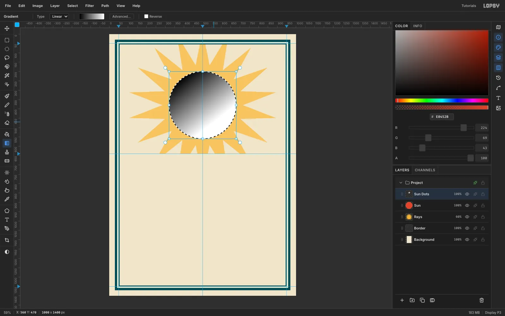

Add a layer called `Sun Dots` and [[Cmd]]-click the `Sun` thumbnail to load
the same circle as a selection. Pick the **Gradient** tool. It starts black
to white, so drag from just inside the circle's upper-left edge to a little
past its centre, towards the lower right.

The dark end of the gradient becomes big dots and the light end becomes small
ones.

## Turn the gradient into halftone

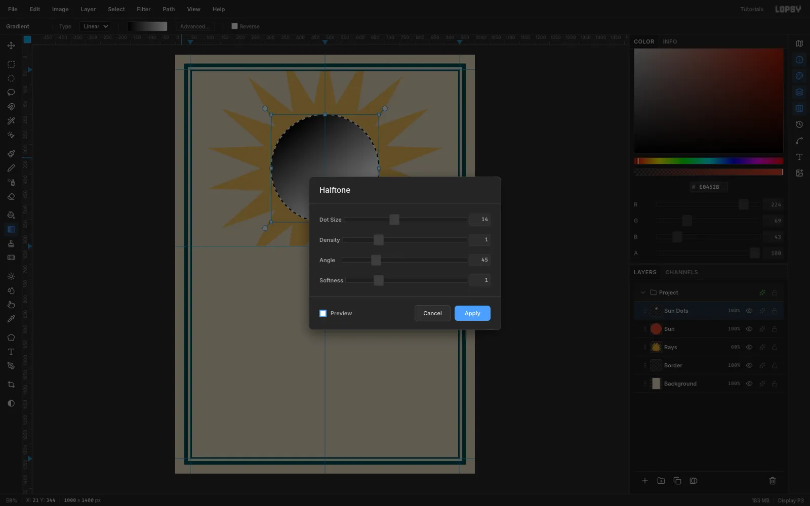

Choose **Filter → Halftone…** and set:

- **Dot Size** `14`
- **Density** `1`
- **Angle** `45`
- **Softness** `1`

Click **Apply**, then press [[Cmd+D]]. The filter keeps each cell's colour as
the dot and makes the gaps transparent.

> **Tip:** Leave Softness at 1 or more. At 0, light areas stay solid instead
> of breaking into small dots.

## Colour the dots mustard

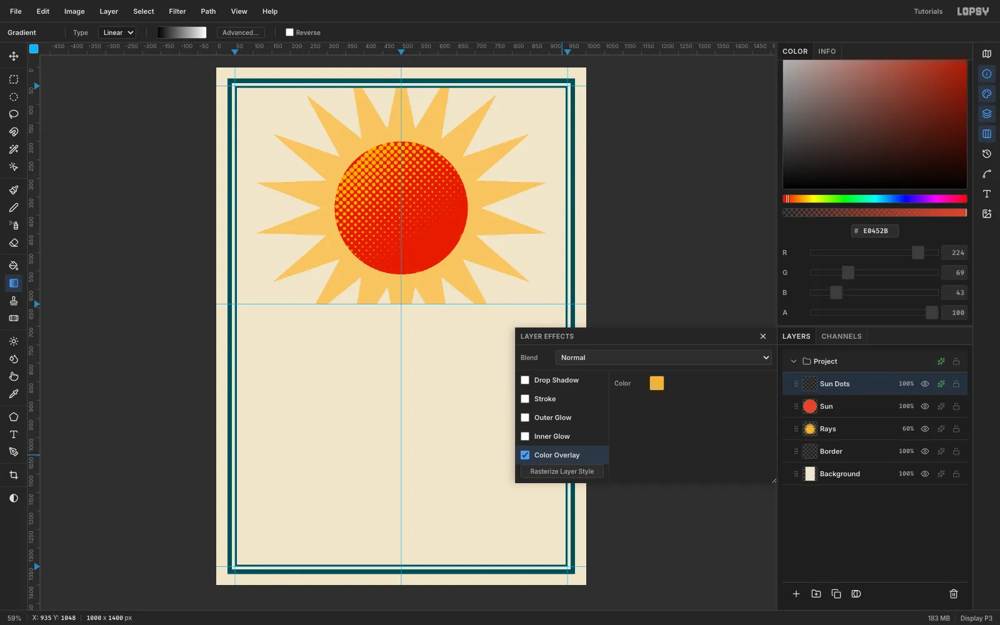

Open **✦** on `Sun Dots`, tick **Color Overlay** and set its colour to
`#F2B233`. The grey dots become a mustard highlight printed over the red sun,
which is the classic two-ink halftone blend.

## Add teal dunes on Multiply

Add a layer called `Dunes`. With the **Lasso**, drag a gently rolling
horizon from the left guide, about 140 px above the 640 guide, across to the
right guide a little higher. Then drag down to the 640 guide and back along
it, and let go where you started. Fill it with teal.

Set the layer to **Multiply**. Where the teal crosses the rays and the sun,
you now get darker olive and brown overprints, and no fourth ink.

## Print a dotted foreground dune

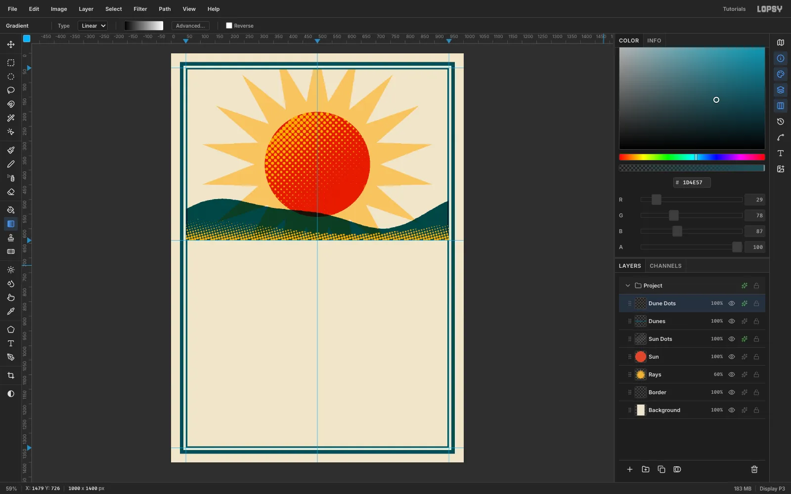

Add a layer called `Dune Dots` and lasso a lower, shallower wave in the
bottom 70 px or so of the scene, ending on the 640 guide. Drag the
**Gradient** from that guide straight up to the top of the wave.

Run **Filter → Halftone…** with **Dot Size** `9`, **Angle** `15` and
**Softness** `1`, press [[Cmd+D]], then add a mustard **Color Overlay**. The
dots swell toward the bottom edge like sand in the foreground.

## Lasso the döner cone

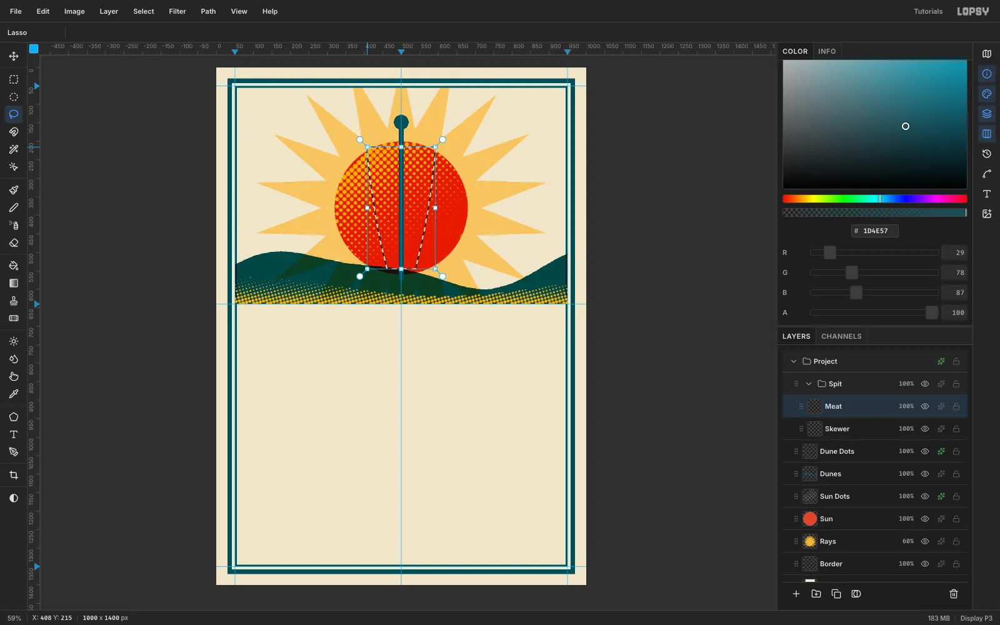

In the Layers panel, click **Dune Dots**, click **New Group** and name the
group `Spit`. Inside it:

1. Add a layer called `Skewer`. Fill a 14 px wide teal bar centred on the middle guide, from above the top of the sun down into the dunes. Add a 40 px teal disc on its top end.
2. Add a layer called `Meat` and lasso a cone that's about 184 px wide near the top of the sun and tapers to about 76 px just above the dunes.
3. Fill it with mustard, and keep the selection active.

## Paint stripes inside the selection

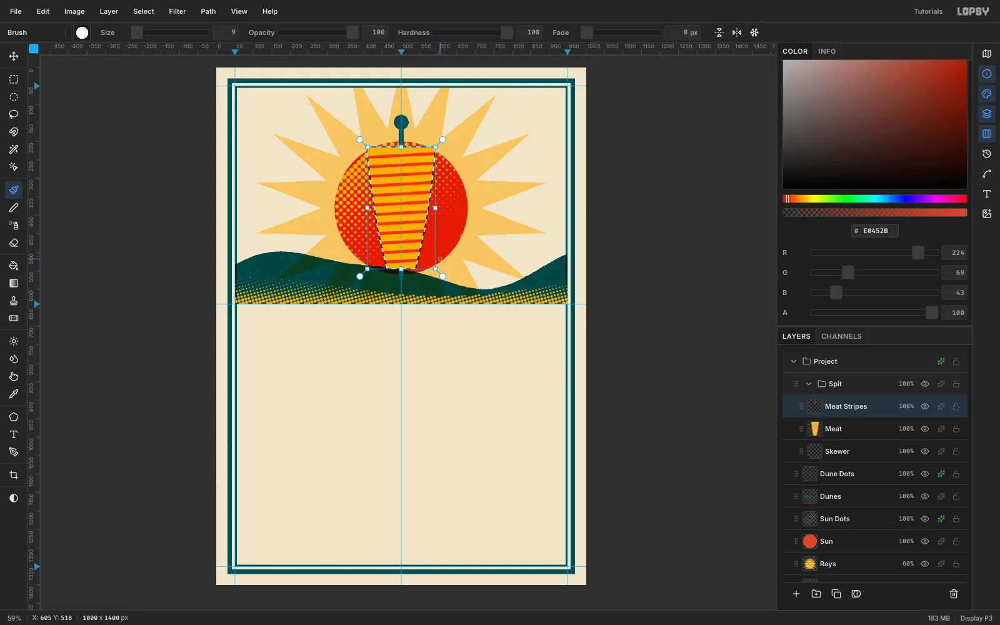

Add a layer called `Meat Stripes`. Pick the **Brush** ([[B]]) and set
**Size** `9`, **Hardness** `100`, and tomato as the colour.

Starting just below the top of the cone and working down about every 26 px,
click just outside the left of the cone, then [[Shift]]-click just outside
the right, a little higher, to draw a slanted line. The active selection
clips every stroke to the cone.

Press [[Cmd+D]] and set the layer to **Multiply**. The red over mustard turns
the colour of seared meat.

## Shade and outline the cone

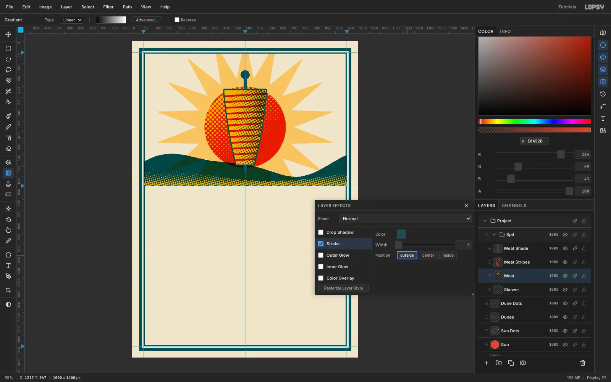

Add `Meat Shade` and [[Cmd]]-click the `Meat` thumbnail to select the cone
again. Drag a gradient straight across from just past the cone's right edge
to its left edge, then run **Halftone** with
**Dot Size** `10`, **Angle** `30` and **Softness** `1`. Give it a teal
**Color Overlay** and set it to **Multiply**. The dots grow toward the right
edge, so the cone looks round.

Select `Meat`, open **✦**, tick **Stroke**, and set the colour to teal,
**Width** `5` and position **outside**. That gives a printed keyline.

## Move the whole spit as a group

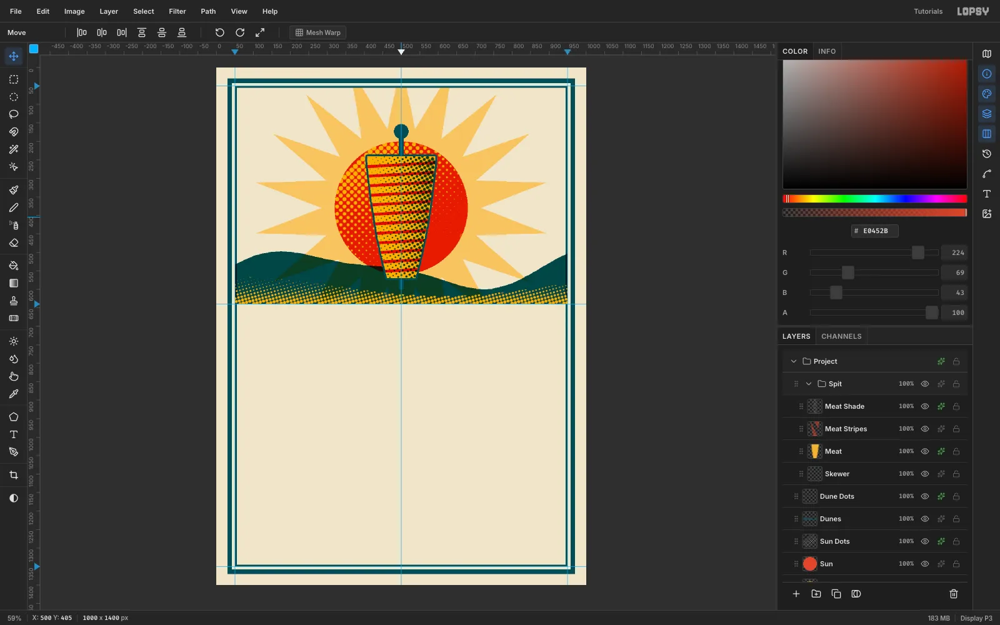

Click the **Spit** group row, press [[V]] for **Move**, and drag the spit
about 25 px down so the skewer sinks into the dunes. All four layers move
together.

## Set the headline in Shrikhand

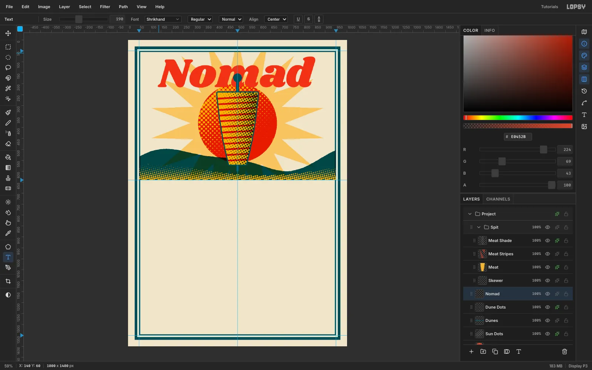

Click **Dune Dots**. Press [[T]] for **Text**, then set:

- **Size** `190`
- **Font** **Shrikhand** (search for it in the font menu)
- tomato as the colour

Click in empty space near the top of the canvas, type `Nomad` and press
[[Tab]] to commit. Switch to **Move** and drag the word down until its
letters start just below the 640 guide. Click **Align center horizontally**
in the options bar to centre it on the middle guide.

## Misregister the headline

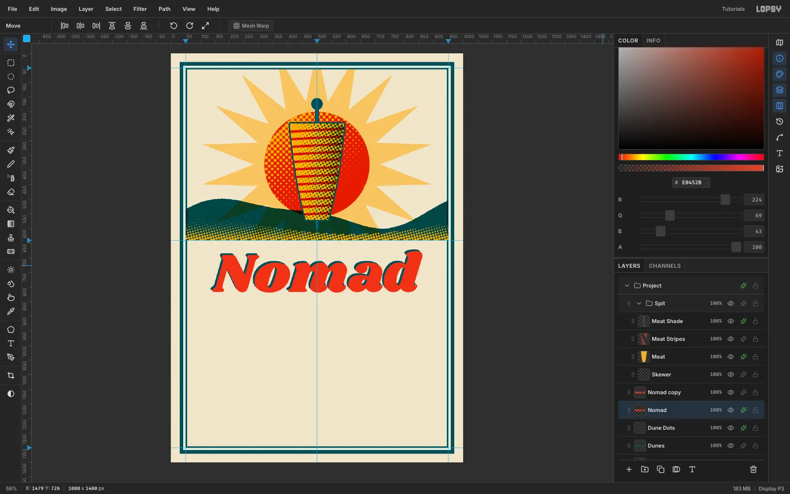

Click **Duplicate Layer** in the Layers panel. The copy lands exactly on top
and is selected. With **Move**, nudge it 6 px down and right with [[↓]] and
[[→]], six times each.

Now select the original **Nomad** layer and give it a teal **Color Overlay**.
The red copy prints on top, and the teal plate peeks out at the top left, just
like a loose screen.

## Add KEBAB with a red offset

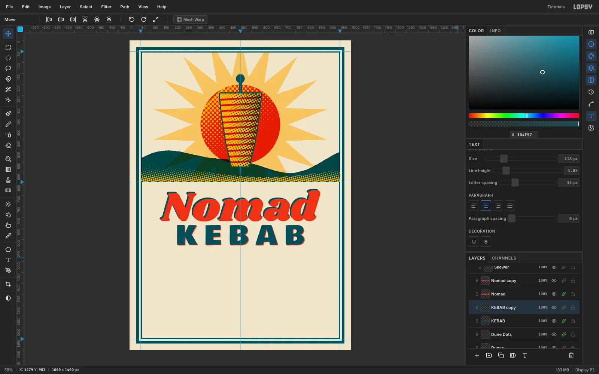

Click **Dune Dots** again and open the **Text** panel. Set **Letter spacing**
to `34`. Type `KEBAB` in **Bowlby One** at `118` px in teal, then move it
under the headline, centred.

Repeat the misregistration the other way round:

1. **Duplicate Layer**. The copy lands exactly on top.
2. Give the original a tomato **Color Overlay**.
3. Nudge the original 3 px right and 3 px down.

A thin red edge now shows at the lower right of each letter.

## Print the tagline banner

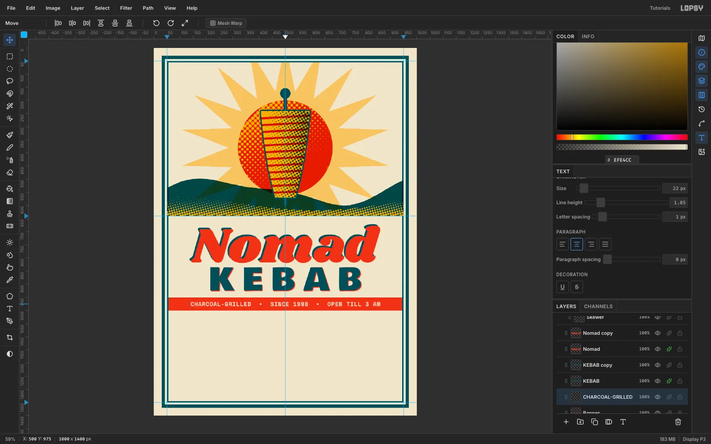

Add a layer called `Banner`. Below `KEBAB`, marquee a 50 px band right across
the page between the inner rules and fill it with tomato. Set the Text panel's **Letter spacing** to `1`, then type
`CHARCOAL-GRILLED • SINCE 1998 • OPEN TILL 3 AM`. Use **Space Mono**,
**Bold**, `22` px, in paper cream `#EFE4CC`.

Paste the bullets from the clipboard if your keyboard can't type them. Then
**Move** the line so it sits centred in the band.

## Build the left menu column

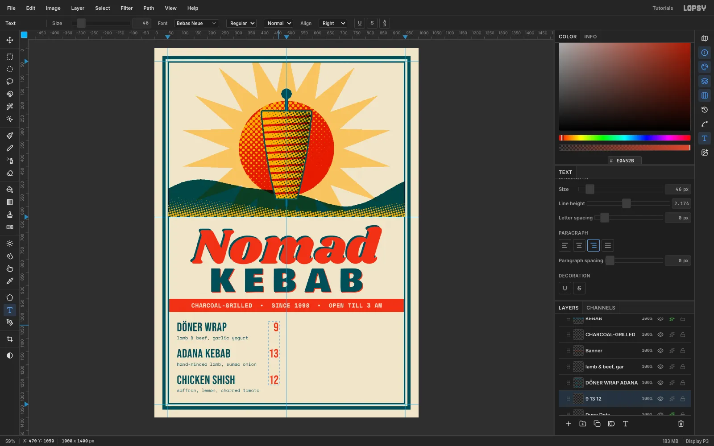

The column is three separate area-text layers. Click **Dune Dots** before
you set up each one, and create each box by **dragging** with the Text tool.
Make the descriptions first, so the later drags start in clear space.

The item and price boxes start just below the banner, about 10 px under it.
The description box starts about 76 px lower, so each description tucks under
its item. All three left boxes start about 30 px inside the inner rule.

1. **Descriptions:** Space Mono Regular, `17` px, teal, **Letter spacing**
   `0`. Set **Line height** `1.4` and **Paragraph spacing** `76`. Drag a box from about 76 px below the
   banner across to just short of the middle guide (around 405 on the top
   ruler) and type the three lines:
   - `lamb & beef, garlic yogurt`
   - `hand-minced lamb, sumac onion`
   - `saffron, lemon, charred tomato`
2. **Items:** Bebas Neue, `46` px, teal, **Letter spacing** `1`, **Line
   height** `2.174` (a 100 px pitch). Drag from just under the banner across to about 390 on the top
   ruler and type `DÖNER WRAP`, `ADANA KEBAB` and `CHICKEN SHISH`, one per
   line.
3. **Prices:** Bebas Neue, `46` px, tomato, **Letter spacing** `0`, **Align
   right**. Drag a narrow
   box, about 60 px wide, at the same height, ending about 30 px short of the
   middle guide. Type `9`, `13` and `12`.

## Build the right menu column

Repeat the three layers on the right half, starting each box about 30 px
right of the middle guide, at the same heights as on the left:

1. Descriptions:
   - `hummus, tahini, parsley salad`
   - `sliced döner, butter tomato`
   - `salted yogurt drink, black tea`
2. Items: `FALAFEL PLATE`, `İSKENDER` and `AYRAN & ÇAY`.
3. Right-aligned prices, in a narrow box ending about 30 px inside the right inner rule: `11`, `15` and `4`.

The 100 px pitch lines every price up with its item.

## Space out the brush for dots

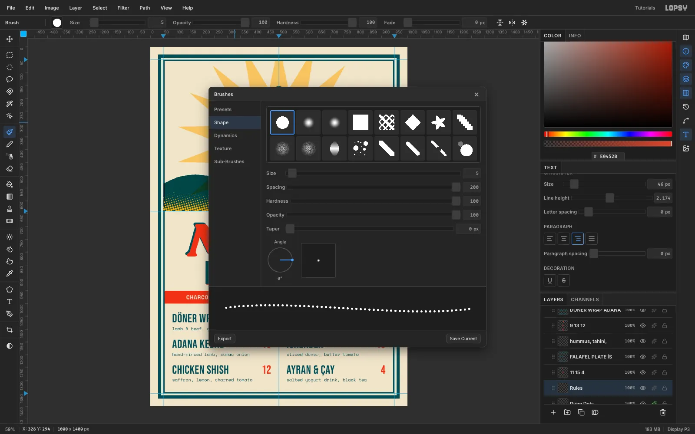

Click **Dune Dots**, then add a layer called `Rules`. Pick the **Brush**, set
**Size** `5` and **Hardness** `100`, and open the brush presets to get the
**Brushes** window. On the **Shape** tab, set **Spacing** to `200`, the
maximum.

Each dab now lands well apart from the last, so a stroke becomes a row of
round dots.

## Draw dotted leaders and a divider

In teal, click on the middle guide level with the first item and
[[Shift]]-click on it again just below the last description, to draw the
column divider. Then do the same for each leader, just above the item's
baseline, from the end of each item to just before its price. Keep the
leaders in each row at the same height on both sides.

Leave a gap after `ADANA KEBAB` for the chilli.

## Lasso a chilli

Add a layer called `Chili`. Working at double size is easier, so lasso a
curved pod about 30 × 60 px in the empty space near `ADANA KEBAB`, and fill
it with tomato. Lasso a thin stem on top and fill it with teal.

Keep it to two inks, so it reads as part of the print rather than an emoji.

## Scale the chilli down

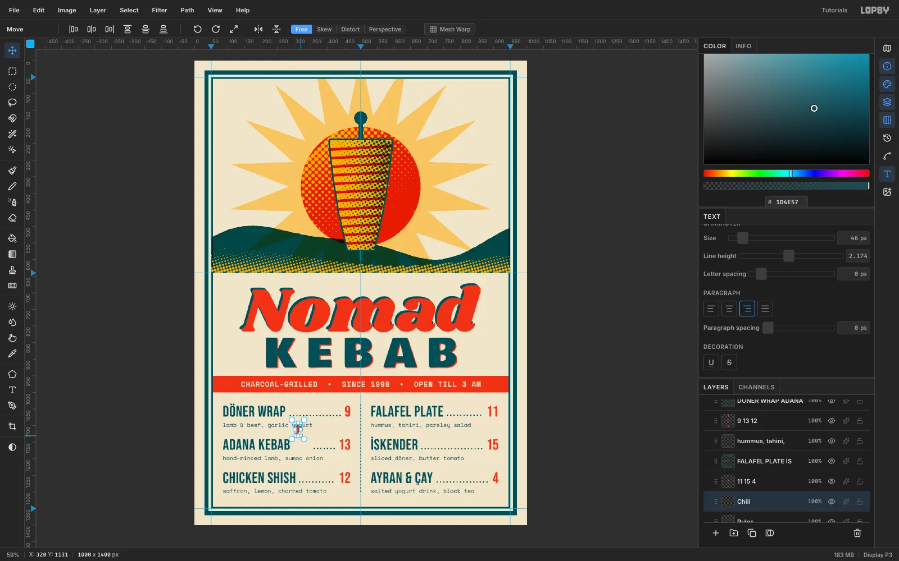

Marquee around the chilli and switch to **Move**. Hold [[Cmd]] to keep its
proportions and drag the bottom-right handle up and left until the chilli is
about half size.

Then drag it into the gap after `ADANA KEBAB`, so it lines up with the
capitals, and press [[Cmd+D]] to commit.

## Paste and rotate a second chilli

Marquee the chilli and press [[Cmd+C]], then [[Cmd+V]]. The paste lands in
place on a new layer, selected and ready to move.

1. Drag the paste about 24 px to the right.
2. Drag just outside the top-right corner of its box (the cursor turns into a
   crosshair) to rotate it about 22°, then press [[Cmd+D]].
3. Choose **Layer → Merge Down** to fold it into `Chili`.

Two chillies mean *extra hot*.

## Build the badge seal

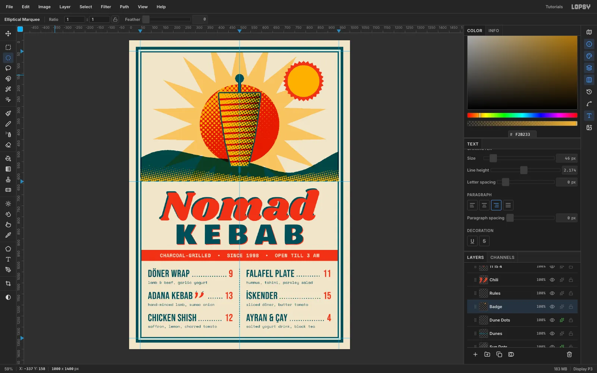

Click **Dune Dots** and add a layer called `Badge`. In the top-right corner
of the scene, lasso a 28-point seal: drag
round a centre point, alternating about 92 px and 83 px out, and let go back
at the start for a shallow scalloped edge. Fill it with tomato. Then [[Cmd]]-drag a circle about 144 px
across with the **Elliptical Marquee**, centred on the seal, and fill it with
mustard.

Drag an area-text box across the disc and type `HOT` / `OFF THE` / `SPIT`,
one word group per line. Use **Bowlby One**, `26` px, teal, **Align center**
and **Line height** `1.05`. Centre it on the disc, then choose **Layer → Merge Down**.

## Tilt the badge

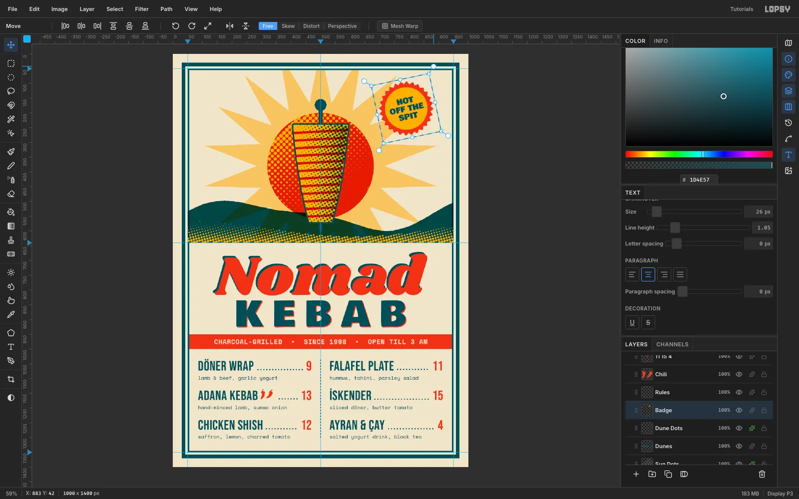

Marquee around the badge and switch to **Move**. Drag the rotate handle
anticlockwise about 12°, then press [[Cmd+D]]. A slight tilt makes it feel
slapped on after printing.

## Select the menu layers

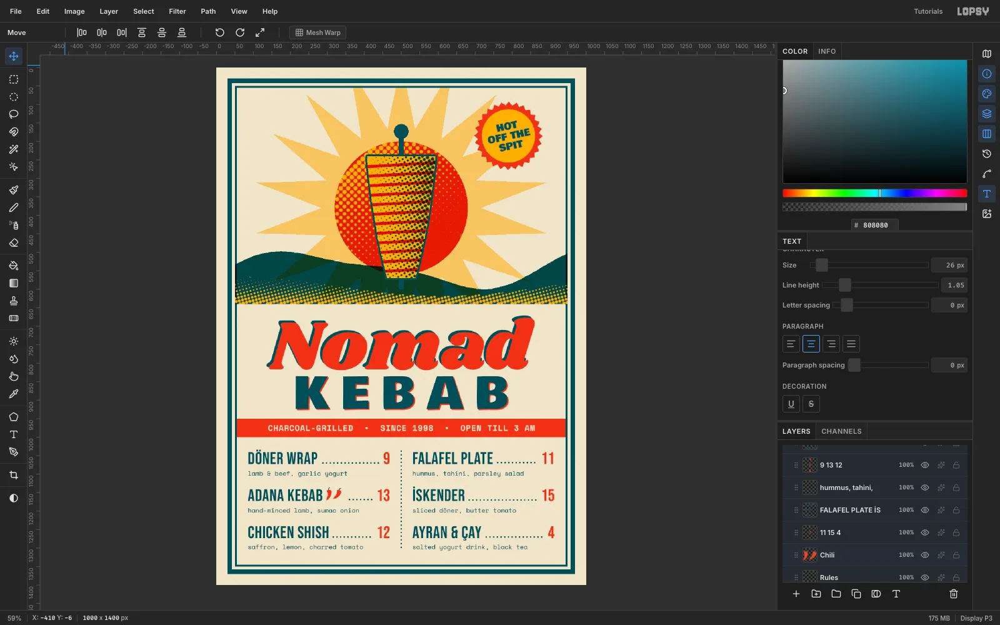

Click the top description layer, then [[Cmd]]-click each of the other menu
layers: both item columns, both price columns, the other description layer,
`Rules` and `Chili`.

## Group and nudge the menu

Choose **Layer → Group Layers** and rename the group `Menu`. Press [[V]] and
nudge the group up 6 px with [[↑]], so the space above and below the columns
is even.

## Add paper grain and ink texture

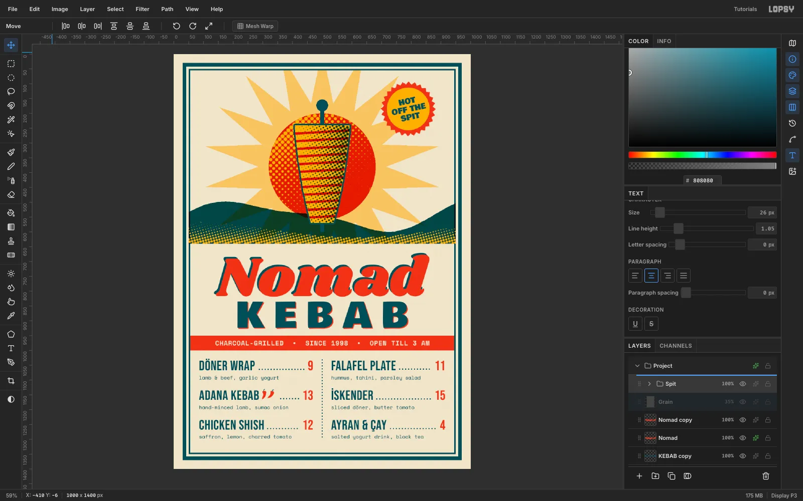

Real prints are never flat. Pick **Filter → Add Noise…** with **Mono** and
**Gaussian** on these layers:

- **Background**: Amount `8`, for paper tooth
- **Sun** and **Banner**: Amount `12`, for ink texture

Then click the top headline layer and add a layer called `Grain`. Fill it with
`#808080` and run **Add Noise** at `40`. Set it to **Overlay** at `35%`
opacity. Drag its row above the collapsed **Spit** group so the grain covers
everything.

## Export the finished menu

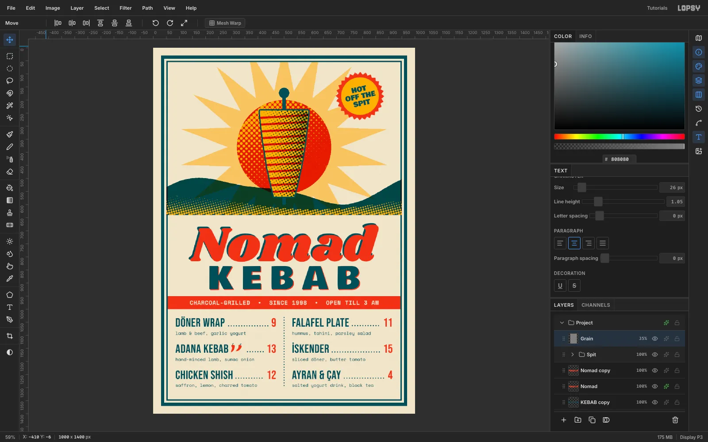

Hide the guides with **View → Show Guides**. Then use **File → Quick Export
PNG** for the image and **File → Save Project** to keep every layer editable.

Try the same method on a gig poster or a beer label. Pick three inks, let
Multiply make the fourth, and put dots wherever you would normally shade.
