Skate graphics come from the shop wall and the grip tape:

- Vans-style checkerboards
- chunky brush lettering
- stickers slapped on at an angle
- a hard offset shadow instead of a soft one

In this tutorial you'll use that look for a menu for **Ollie Eats**, a burger
shack at the skatepark. The logo is a tilted skateboard deck. Under it sit two
columns of trick-named burgers and sides, with prices in marker.

Along the way you'll use:

- **Define Pattern** and **Fill with Pattern**
- marquee, ellipse and lasso fills
- rotation handles, layer effects and a layer group
- Google fonts, including right-aligned area text
- the **Spray** tool and a noise overlay

The palette is grip-tape charcoal `#1C1C1F`, cream `#F4EBD3`, orange
`#FF5A1F`, teal `#1FB5A6`, mustard `#FFC93C` and pink `#FF4F8B`.

## Make a grip-tape background

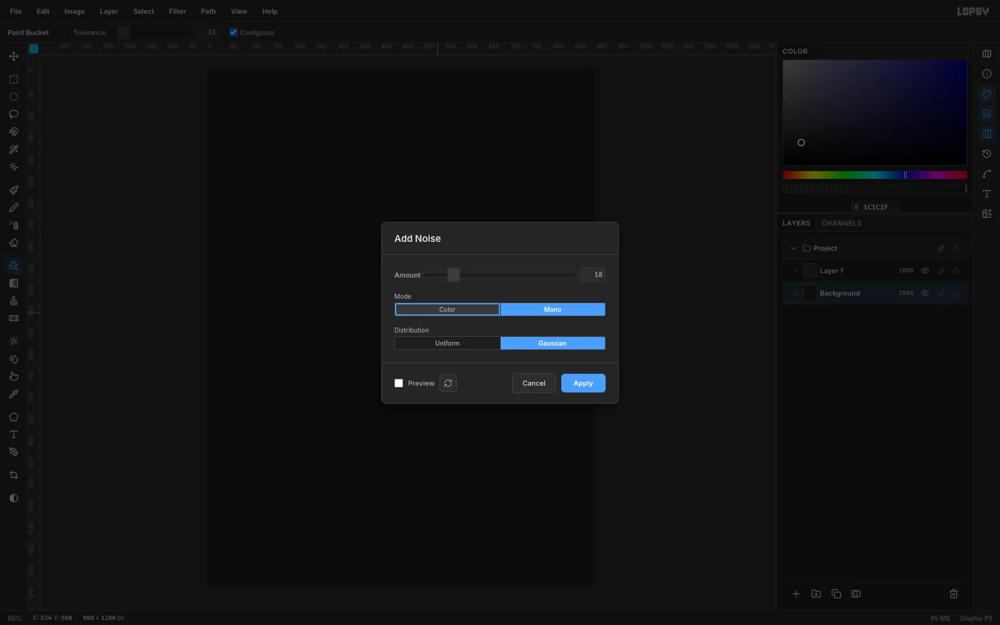

Open [Lopsy](/). In the **New Document** dialog, set **Width** `900` and
**Height** `1200`, then click **Create**.

Select **Background**, set the foreground to `#1C1C1F` in the Color panel's
hex field, press [[G]] for the **Paint Bucket** and click the canvas. Then
choose **Filter → Add Noise…**, pick **Mono** and **Gaussian**, set **Amount**
to `18` and click **Apply**. The fine grain reads as grip tape.

## Paint a checker tile and define a pattern

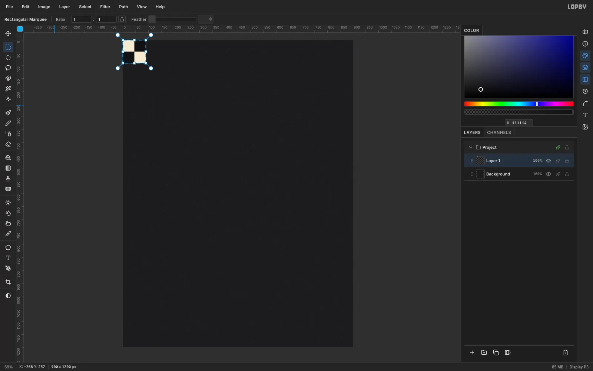

Select **Layer 1**. With the **Rectangular Marquee** ([[M]]), draw four 45 px
squares and fill each with **Edit → Fill**:

- cream `#F4EBD3` at (0, 0) and (45, 45)
- near-black `#111114` at (45, 0) and (0, 45)

Marquee the whole 90 × 90 tile from (0, 0) to (90, 90) and choose
**Edit → Define Pattern**. Then press [[Delete]] to clear the tile and rename
the layer `Checker Top`.

## Fill the top band with the pattern

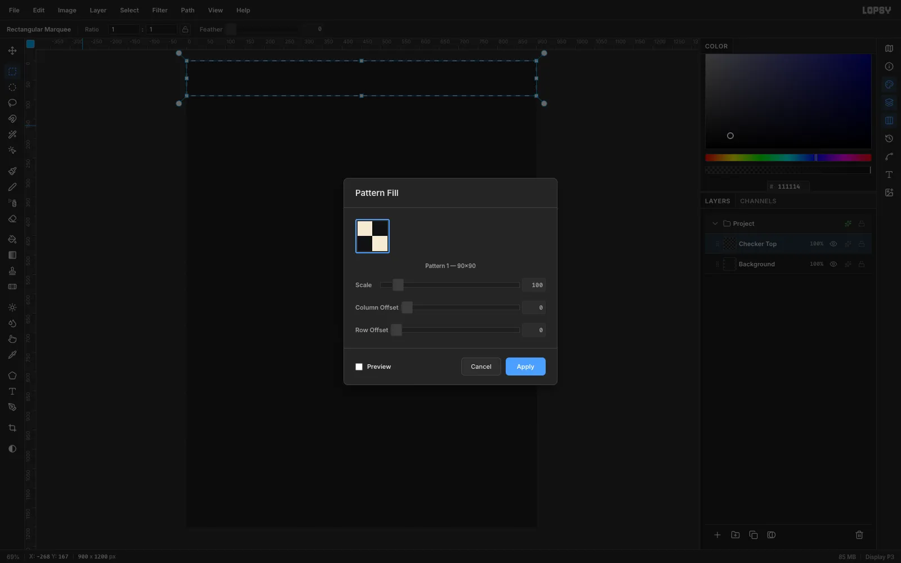

Marquee from (0, 0) to (900, 90) and choose **Edit → Fill with Pattern…**.
Leave **Scale** and the offsets alone and click **Apply**. Ten tiles fill
the band exactly.

## Copy the band to the bottom

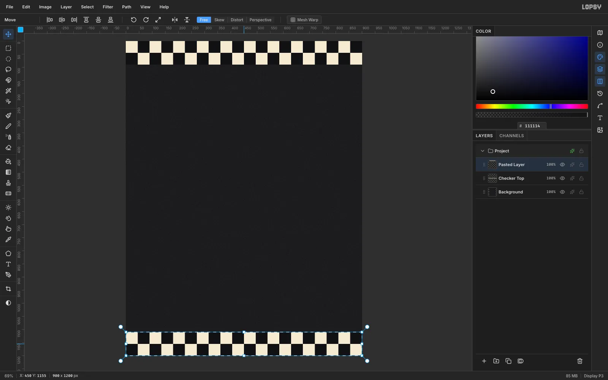

With the band still selected, press [[Cmd+C]] and then [[Cmd+V]]. The paste
lands in place on a new layer. Press [[V]] for the **Move** tool and drag it
straight down by 1110 px so it sits on the bottom edge. Rename it
`Checker Bottom`.

## Add guides

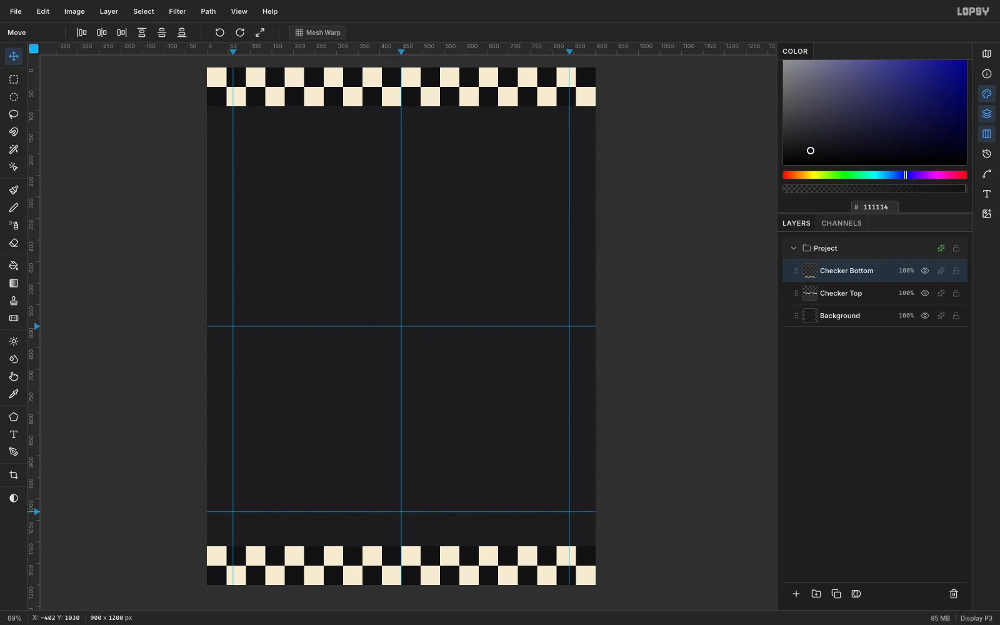

Click the top ruler at `60`, `450` and `840` for vertical guides: the two
margins and the gutter between the menu columns. Click the left ruler at `600`,
where the menu starts, and at `1030`, where the footer starts.

## Build the skateboard deck

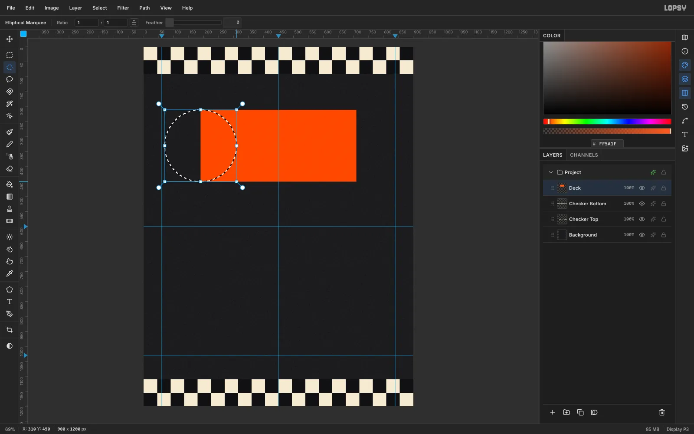

Click **Add Layer** and name it `Deck`. Set the foreground to orange `#FF5A1F`.

1. Marquee from (190, 210) to (710, 450) and use **Edit → Fill**.
2. Choose the **Elliptical Marquee**, drag a 240 × 240 circle from (70, 210) and fill it. That's the nose.
3. Drag another 240 × 240 circle from (590, 210) and fill it for the tail.

> **Tip:** The Shape tool's polygon is always regular, so a 4-sided polygon gives a square, not a long rectangle. A marquee rectangle with two circle caps is the quickest way to get a deck shape.

## Punch the bolt holes

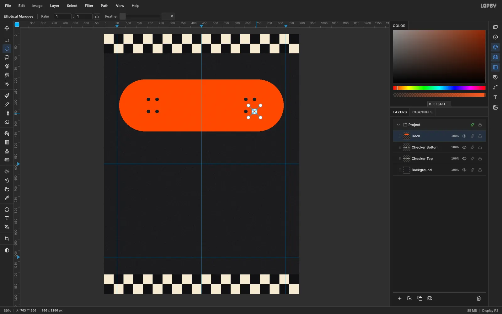

Trucks bolt on with four holes at each end. With the Elliptical Marquee, drag
a 16 px circle centred on each of these points and press [[Delete]]. The grip
tape shows through.

- x `205` and `245`, at y `302` and `358`
- x `655` and `695`, at y `302` and `358`

Press [[Cmd+D]] when you're done.

## Tilt the deck

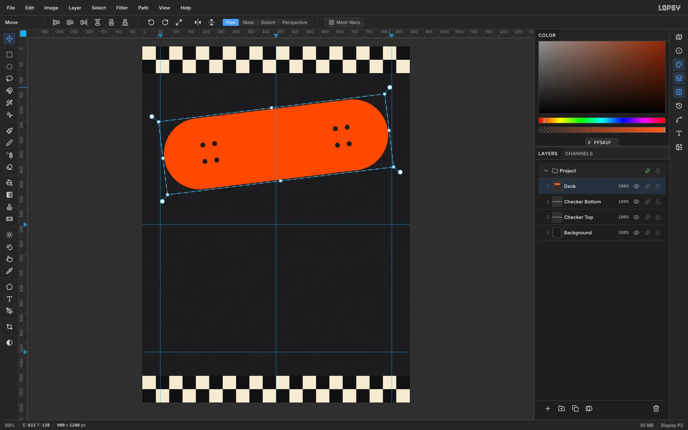

Marquee around the whole deck, from (66, 206) to (834, 454), and press [[V]].
Round handles appear just outside the corners. Drag the top-right one upward
to rotate the deck about **7° counter-clockwise**, so it climbs to the right.
Press [[Enter]] to commit and [[Cmd+D]] to deselect.

## Give the deck a stroke and a hard shadow

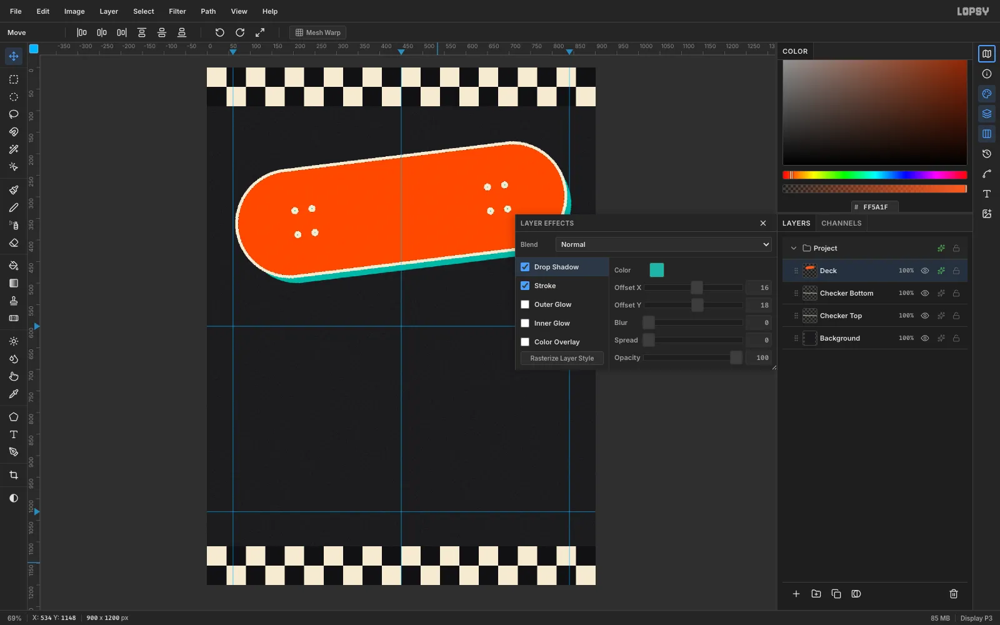

Open the deck's effects with the ✦ button on its layer row.

- Tick **Stroke**. Set the colour to cream `#F4EBD3` and **Width** to `7`.
- Tick **Drop Shadow**. Set the colour to teal `#1FB5A6`, **Offset X** `16`, **Offset Y** `18`, **Blur** `0` and **Opacity** `100`.

A zero-blur shadow is the retro sticker look. The stroke also rings each bolt
hole, like hardware.

## Set the title in Knewave

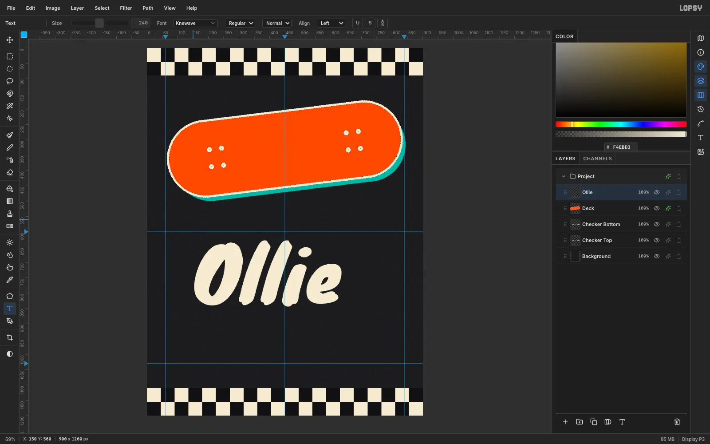

With **Deck** selected, press [[T]]. Set the foreground to cream. Pick
**Knewave** in the **Font** browser and type `240` in **Size**.

Then click empty canvas at (150, 560), type `Ollie` and press [[Tab]].

> **Tip:** Set the size before you click. Typing a new size into a text layer that already exists changes it, but that change can't be undone on its own.

## Rotate the title

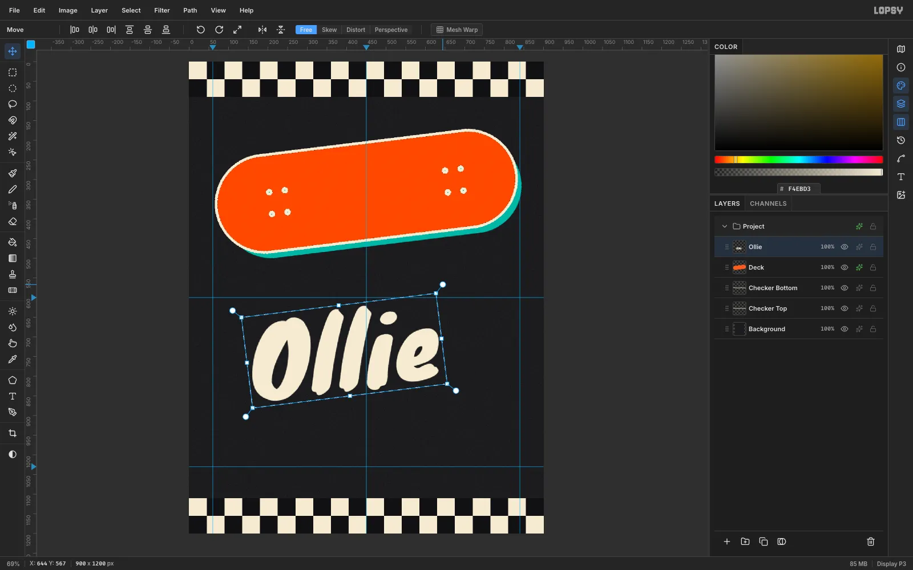

Click **Rasterize Layer** at the bottom of the Layers panel. Marquee around the
word, press [[V]], and drag a corner rotation handle to turn it the same
**7° counter-clockwise** as the deck. Press [[Enter]], then [[Cmd+D]].

## Put the title on the deck

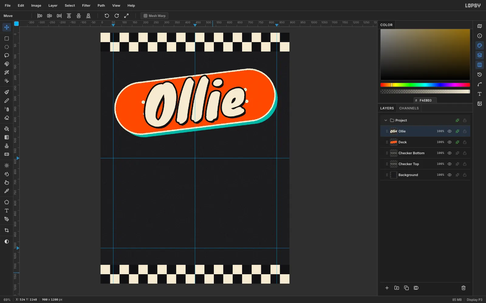

With the Move tool, drag the word up onto the deck so it sits in the middle.
In its effects, add:

- **Stroke** in ink `#111114`, **Width** `7`
- **Drop Shadow** in ink, offset `7` / `9`, **Blur** `0`, **Opacity** `100`

The black outline keeps the cream letters clear of the orange and the bolt
holes behind them.

## Add EATS in Rubik Mono One

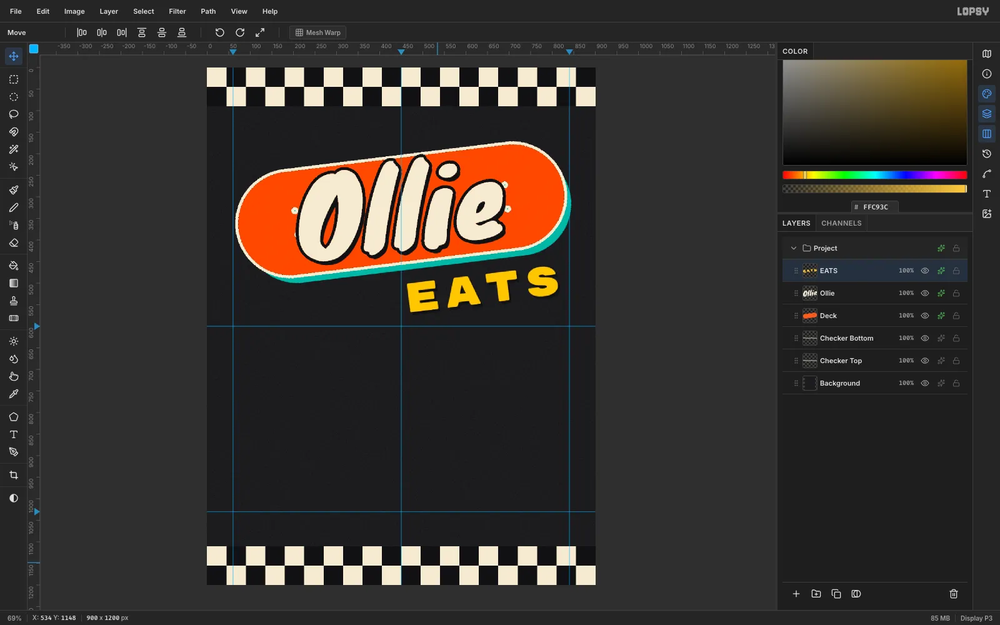

Select **Ollie** and press [[T]]. Set the foreground to mustard `#FFC93C`, the
font to **Rubik Mono One** and the size to `96`. In the **Text** panel, set
**Letter spacing** to `12`. Click empty canvas, type `EATS` and press [[Tab]].

Rasterize it and rotate it **7° counter-clockwise** like the deck. Then drag
it under the deck's right half so it's centred at about (638, 512). Give it a
**Drop Shadow** in ink, offset `5` / `6`, **Blur** `0`.

## Start a burger in a group

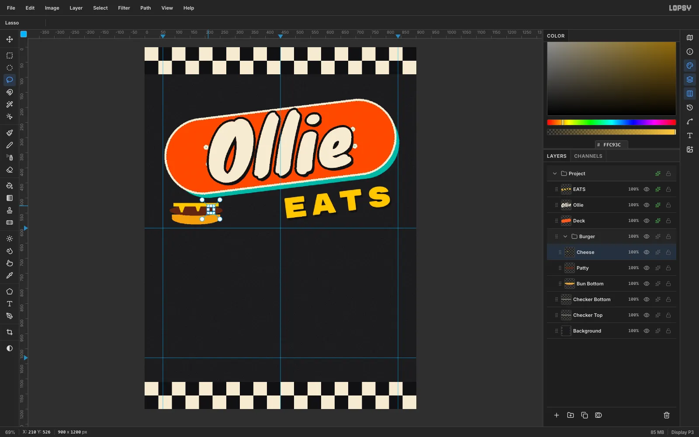

Select **Checker Bottom** and click **New Group**. Name it `Burger`. Starting
from that layer puts the group *under* the deck in the stack, so the bun can
tuck behind it later.

With the group selected, **Add Layer** puts each new layer inside it. Build the
burger bottom-up, each part on its own layer:

1. **Bun Bottom** (`#E9A23B`): fill a 161 × 40 ellipse at (90, 548). Marquee from (82, 531) to (258, 564) and press [[Delete]] to flatten its top. Then fill a 161 × 10 strip at (90, 555).
2. **Patty** (`#5B2A17`): fill a 176 × 35 ellipse at (82, 524).
3. **Cheese** (mustard): fill a 150 × 11 bar at (95, 517). Then use the **Lasso** ([[L]]) to draw three downward-pointing drips under it, filling each with **Edit → Fill**.

## Finish the burger

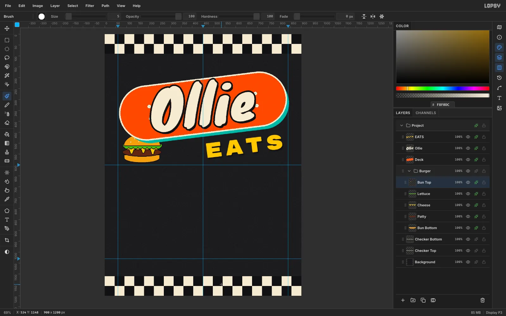

4. **Lettuce** (`#6BBF3B`): press [[B]]. In the brush presets, set **Size** `14`, **Hardness** `100` and **Spacing** `10`. Drag a zigzag from (89, 510) to (256, 510), about 8 px high.
5. **Bun Top** (`#E9A23B`): fill a 165 × 106 ellipse at (88, 460). Marquee from (82, 511) to (258, 577) and press [[Delete]] to keep only the dome.
6. **Seeds:** set the brush **Size** to `5` and the colour to `#F8F0DC`, then click eight dots on the dome.

Finally, give each of the five layers a **Stroke** in ink, **Width** `3`, for
a cartoon outline.

## Move the whole group

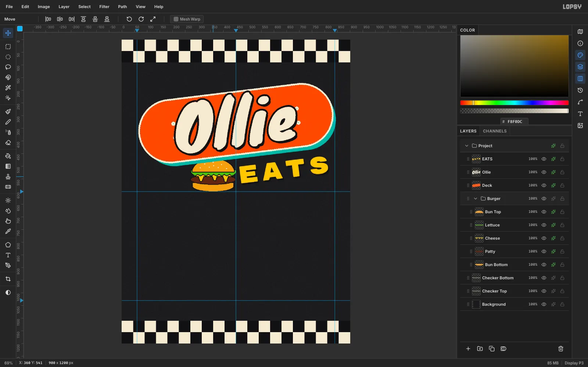

Click the **Burger** group row, press [[V]], and drag anywhere on the burger.
All five parts move together. Drop it about 190 px right and 11 px down, so its
right edge sits about 10 px from the **E** and the top of the bun hides under
the deck's teal shadow. The burger and EATS now read as one logo.

## Slap on a sticker

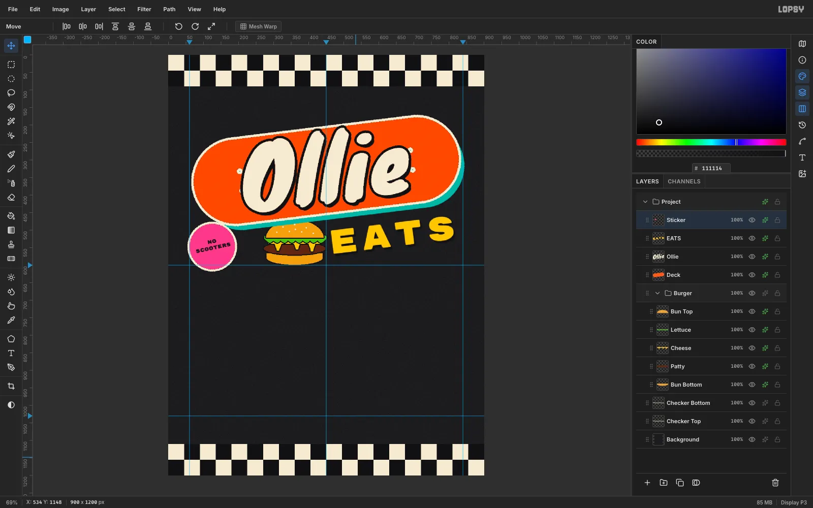

Select **EATS**, add a layer named `Sticker`, and fill a 130 × 130 circle at
(60, 482) with pink `#FF4F8B`.

Type the label in **Rubik Mono One** `15`, ink, **Line height** `1.2`. Click at
(76, 525) and type three spaces, `NO`, [[Enter]], `SCOOTERS`, then [[Tab]].
The spaces centre the short word, because every letter in a mono font is the
same width.

Choose **Layer → Merge Down** to merge the words into the circle. Rotate the
sticker **12° counter-clockwise**, then add a **Stroke** in cream `6` and an
ink **Drop Shadow** at `5` / `6`, blur `0`.

## Add the tagline and stars

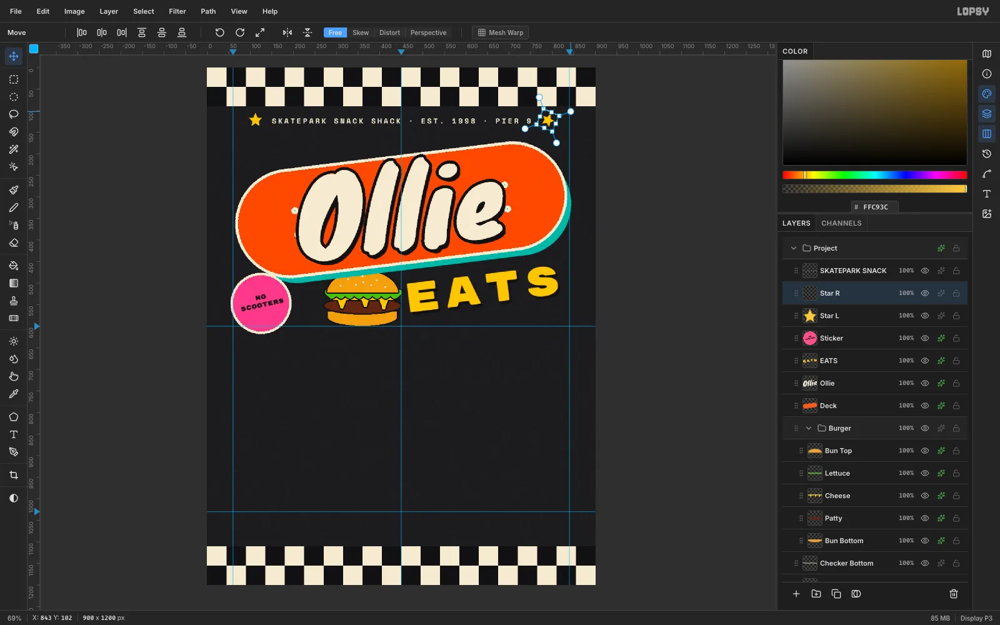

Set **Space Mono** **Bold** `17`, cream, **Letter spacing** `4`. Click at
(150, 112) and type `SKATEPARK SNACK SHACK · EST. 1998 · PIER 9`. If the
middle dots won't type, paste the line in with [[Cmd+V]].

Add a layer named `Star L`. With the Lasso, draw a five-point star around
(112, 122), about 32 px across, and fill it with mustard. Press [[Cmd+C]] and
[[Cmd+V]], rename the paste `Star R`, and drag it to (790, 122).

A paste in place has no selection, so marquee around the star again before you
rotate it. Turn it about **24° clockwise** so the pair doesn't look copy-pasted,
then press [[Enter]].

## Set the footer and a graffiti tag

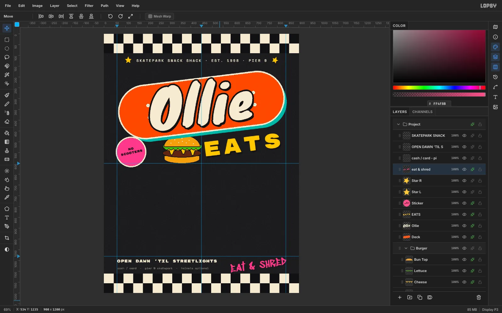

Set the footer now, before the menu columns (see the tip in the menu columns step).

- `OPEN DAWN 'TIL STREETLIGHTS` in Rubik Mono One `19`, cream, **Letter spacing** `1`, clicked at (60, 1040).
- `cash / card  -  pier 9 skatepark  -  helmets optional` in Space Mono **Regular** `13`, `#B9B09C`, at (62, 1076).

For the tag, set **Sedgwick Ave Display** `56` in pink. Click in empty space
and type `eat & shred`. Rasterize it, drag it into open canvas, rotate it
**8° counter-clockwise**, and drop it bottom-right, centred at about (712, 1066).
A **Stroke** in `#1C1C1F` `4` plus an ink shadow at `4` / `4` makes it look
like a sticker on the wall.

> **Tip:** Rotate after moving the tag clear of the canvas edge. Pixels that cross the edge during a rotation are cropped when you commit.

## Tape up the section headers

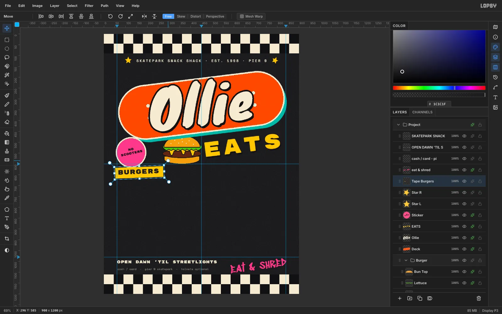

Add a layer named `Tape Burgers` and fill a 222 × 50 rectangle at (52, 614)
with mustard. Type `BURGERS` on it in Rubik Mono One `30`, `#1C1C1F`,
**Letter spacing** `2`, clicked at (64, 616). Then **Merge Down** and rotate
the strip **2° counter-clockwise**.

Do the same for `Tape Sides`: a 352 × 50 strip at (462, 614) reading
`SIDES+SHAKES`, rotated **2° clockwise**. Tilting the two strips opposite ways
looks hand-taped.

## Draw dotted rules

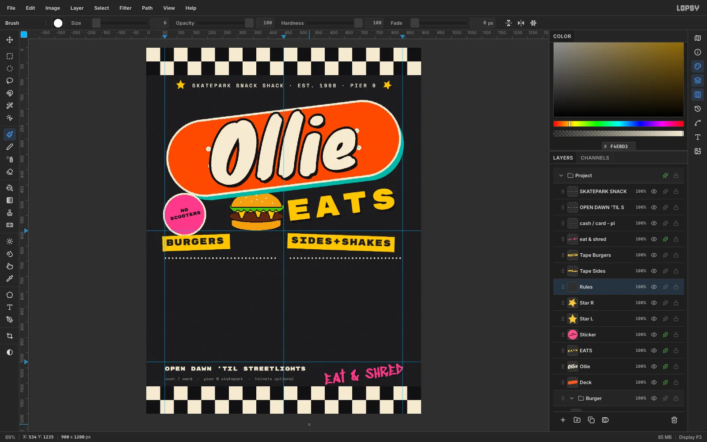

Add a layer named `Rules` and press [[B]]. In the brush presets, set **Size**
`6`, **Hardness** `100` and **Spacing** `260`. With spacing that wide, the
brush stamps separate dots.

With cream as the foreground, click (62, 690) and [[Shift]]-click (428, 690).
Then click (472, 690) and [[Shift]]-click (838, 690). Set **Spacing** back to
`10` afterwards.

## Set the menu columns

Each column is two multi-line text layers. The item names are one layer and
the descriptions another, spaced to the same 82 px rhythm:

- **Descriptions:** Space Mono Regular `15`, `#B9B09C`, **Line height** `1.4`, **Paragraph spacing** `61`.
- **Names:** Space Mono Bold `24`, cream, **Line height** `3.42`, **Paragraph spacing** `0`.

Create the right column first: descriptions at (472, 756), then names at
(470, 698). Then do the left column: descriptions at (62, 756), names at
(60, 698). The descriptions end up 14 px under their names, so each pair
reads as one item.

> **Tip:** A Text-tool click inside an existing multi-line text layer's area edits that layer instead of starting a new one, and that area can be much wider than the visible text. Creating the right column first keeps every click clear of earlier layers.

## Right-align the prices

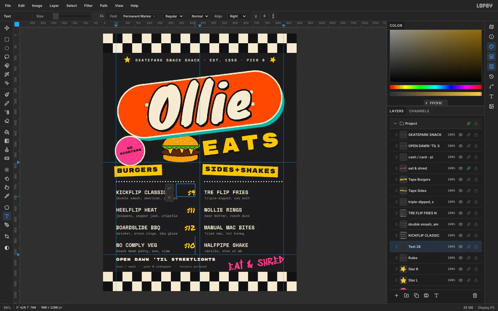

Point text ignores alignment, so the prices use **area text**. Set
**Permanent Marker** `34`, mustard, **Line height** `2.41`, and set **Align**
to **Right**. Then *drag* a box with the Text tool from (340, 700) to
(428, 760), type the four prices on separate lines, and press [[Tab]].

Drag a second box from (750, 700) to (838, 760) for `$4`, `$5`, `$6`, `$6`.
The right column now ends exactly on the 840 guide. Use the Move tool and
[[Up]] to nudge each price layer until the numbers sit on the item names'
baselines.

## Spray some overspray

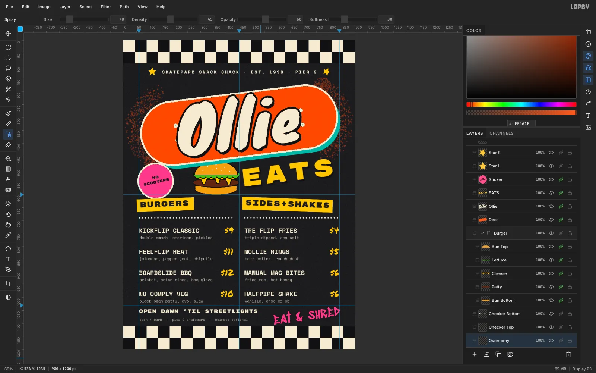

Select **Background** and add a layer named `Overspray`. Press [[J]] for the
**Spray** tool and set **Size** `70`, **Density** `45` and **Opacity** `60`.
With orange as the foreground, spray one arc around the deck's nose and
another around its tail. Use long, sweeping drags, because very short moves
lay down almost nothing.

Set the layer's row opacity to `45%`. The speckle then looks like paint that
missed the deck.

## Add a grain overlay

Select the top layer in the stack and add a layer named `Grain`. Set the
foreground to `#808080` and choose **Edit → Fill**. Then use **Filter → Add
Noise…** with **Amount** `40`, **Mono** and **Gaussian**.

In the layer's effects, set **Blend** to **Overlay**, then set the row opacity
to `35%`. Mid-grey disappears in Overlay, so only the noise shows, as a
printed-paper grain over everything.

## Export the menu

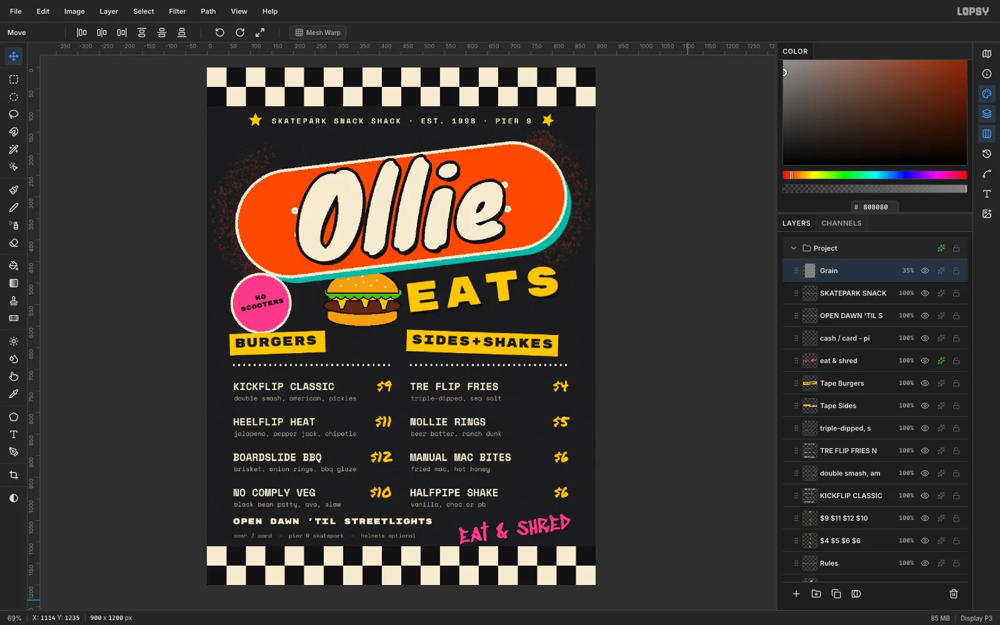

Turn off **View → Show Guides** to check the layout. Then choose
**File → Quick Export PNG** for the image, and **File → Save Project** to keep
every layer, group and effect editable for next season's menu.

To keep going, swap in your own trick-named dishes, or recolour the deck and
its shadow for a night-session version.
