Skate graphics come from the shop wall and the grip tape:

- Vans-style checkerboards
- chunky brush lettering
- stickers slapped on at an angle
- a hard offset shadow instead of a soft one

In this tutorial you'll use that look for a menu for **Ollie Eats**, a burger
shack at the skatepark. The logo is a tilted skateboard deck. Under it sit two
columns of trick-named burgers and sides, with prices in marker.

Along the way you'll use:

- **Define Pattern** and **Fill with Pattern**
- marquee, ellipse and lasso fills
- rotation handles, layer effects and a layer group
- Google fonts, including right-aligned area text
- the **Spray** tool and a noise overlay

The palette:

- Grip-tape charcoal `#1C1C1F`
- Cream `#F4EBD3`
- Orange `#FF5A1F`
- Teal `#1FB5A6`
- Mustard `#FFC93C`
- Pink `#FF4F8B`

## Make a grip-tape background

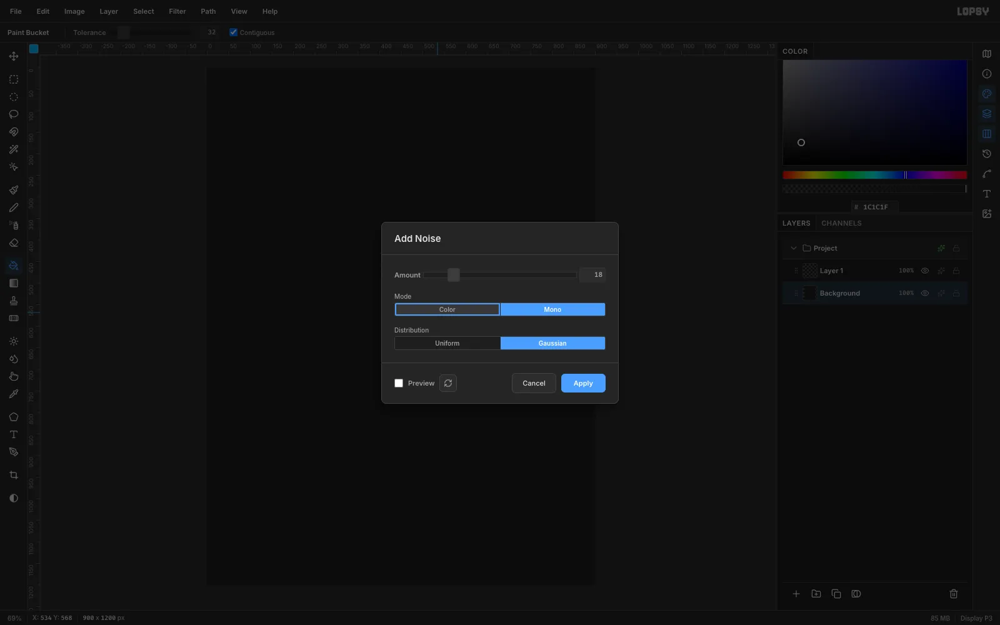

Open [Lopsy](/). In the **New Document** dialog, set **Width** `900` and
**Height** `1200`, then click **Create**.

Select **Background**, set the foreground to `#1C1C1F` in the Color panel's
hex field, press [[G]] for the **Paint Bucket** and click the canvas. Then
choose **Filter → Add Noise…**, pick **Mono** and **Gaussian**, set **Amount**
to `18` and click **Apply**. The fine grain reads as grip tape.

## Paint a checker tile and define a pattern

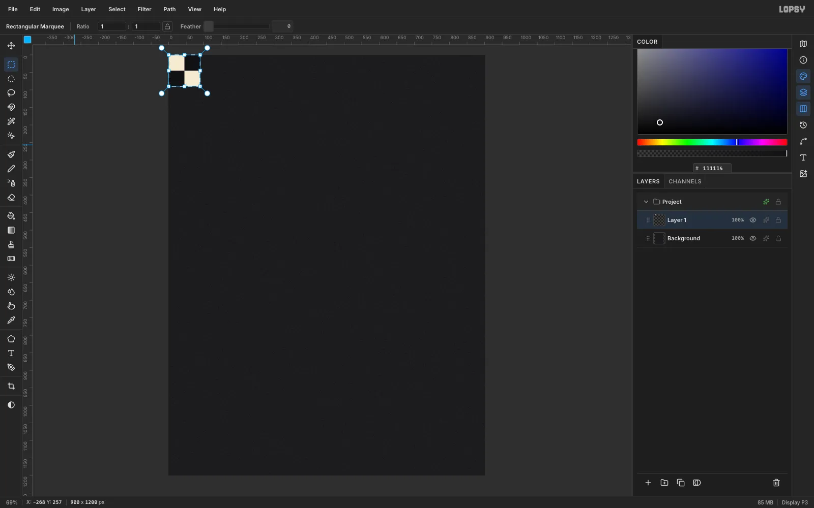

A pattern tile has to be exact, or the checks won't line up when they
repeat. With nothing selected, a single click (no drag) with the
**Rectangular Marquee** ([[M]]) opens a dialog with **From** and **To**
corner fields, which makes that easy.

Select **Layer 1** and build a 90 px tile in the top-left corner from four
45 px squares, filling each with **Edit → Fill** and pressing [[Cmd+D]]
before the next click:

- cream `#F4EBD3`: `0, 0` to `45, 45`, and `45, 45` to `90, 90`
- near-black `#111114`: `45, 0` to `90, 45`, and `0, 45` to `45, 90`

Select the whole tile, `0, 0` to `90, 90`, and choose
**Edit → Define Pattern**. Then press [[Delete]] to clear the tile and rename
the layer `Checker Top`.

## Fill the top band with the pattern

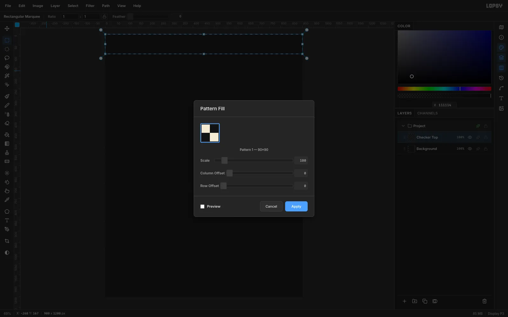

Select a band 90 px tall right across the top (`0, 0` to `900, 90` in the
marquee dialog) and choose **Edit → Fill with Pattern…**.
Leave **Scale** and the offsets alone and click **Apply**. Ten tiles fill
the band exactly.

## Copy the band to the bottom

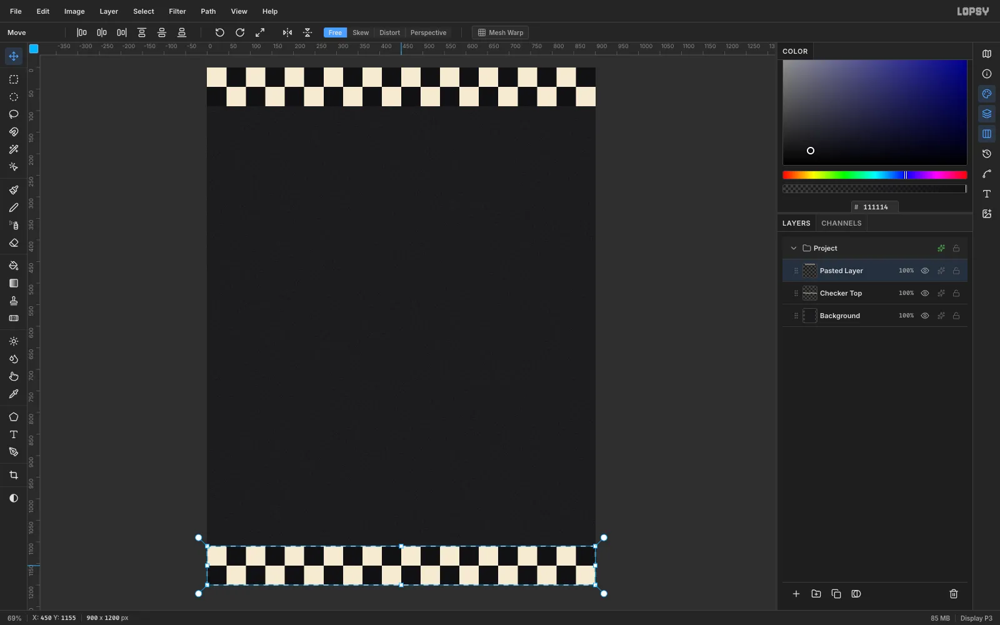

With the band still selected, press [[Cmd+C]] and then [[Cmd+V]]. The paste
lands in place on a new layer. Press [[V]] for the **Move** tool and drag it
straight down until it sits flush on the bottom edge. Rename it
`Checker Bottom`.

> **Tip:** Click **Align bottom** in the Move tool's options bar to drop it
> exactly onto the bottom edge.

## Add guides

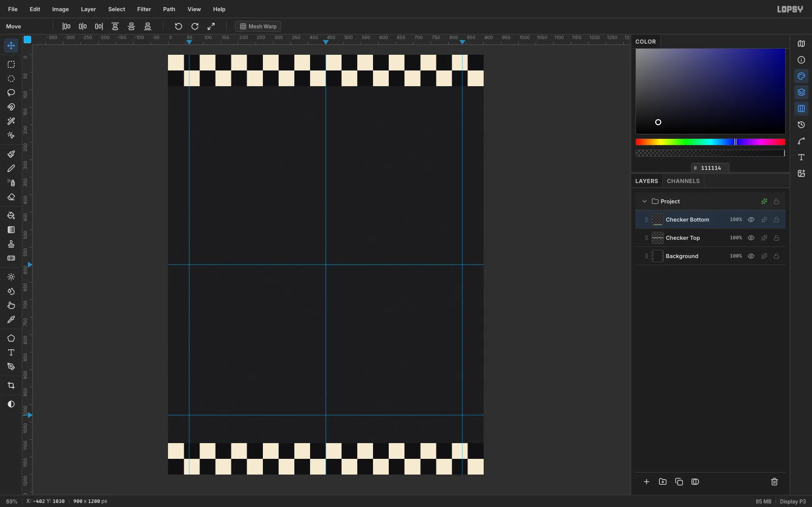

A single click on a ruler drops a guide, and [[Cmd]]-click (Ctrl-click) snaps
it to a fraction of the page such as the half.

- On the top ruler, click about 60 px in from each side for the margins, and [[Cmd]]-click the middle for the gutter between the menu columns.
- On the left ruler, [[Cmd]]-click halfway down, where the menu starts. Click again about 170 px from the bottom (around 1030), where the footer starts.

## Build the skateboard deck

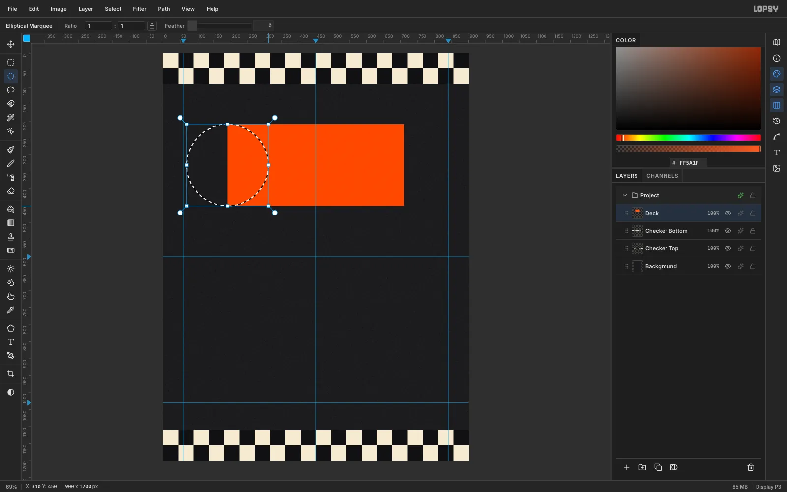

Click **Add Layer** and name it `Deck`. Set the foreground to orange `#FF5A1F`.

The round ends have to meet the straight edges exactly, so use the corner
dialog again (click once with each marquee while nothing is selected):

1. **Rectangular Marquee** from `190, 210` to `710, 450`. Use **Edit → Fill**, then press [[Cmd+D]].
2. **Elliptical Marquee** from `70, 210` to `310, 450`, a 240 px circle overlapping the left end. Fill it. That's the nose.
3. Another circle from `590, 210` to `830, 450`, and fill it for the tail.

> **Tip:** The Shape tool's four-sided polygon draws a square, so a marquee rectangle with two circle caps is the quickest way to a long deck shape.

## Punch the bolt holes

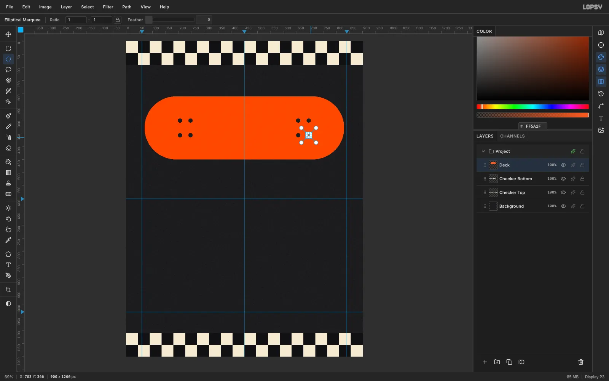

Trucks bolt on with four holes at each end. Near each end, just inside where
the round cap meets the straight edges, the holes form a small rectangle:
two pairs about 40 px apart along the deck and 56 px apart across it,
centred on the deck's midline. With the Elliptical Marquee, [[Cmd]]-drag a
16 px circle for each hole and press [[Delete]]. The grip tape shows through.
Keep both ends mirror images of each other.

Press [[Cmd+D]] when you're done.

## Tilt the deck

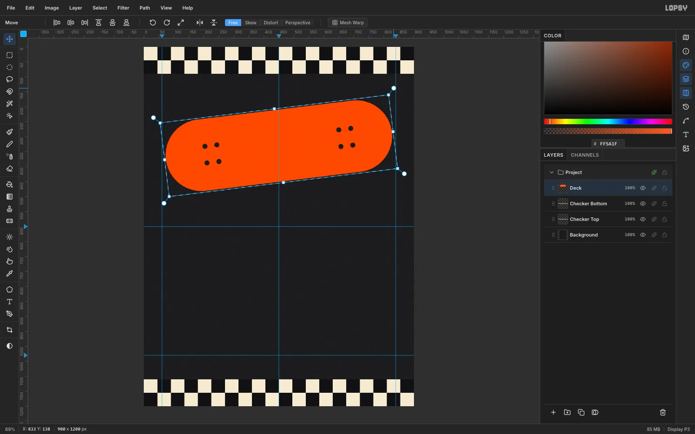

Marquee around the whole deck with a few pixels to spare, and press [[V]].
Round handles appear just outside the corners. Drag the top-right one upward
to rotate the deck about **7° counter-clockwise**, so it climbs to the right.
Press [[Cmd+D]] to commit and deselect.

## Give the deck a stroke and a hard shadow

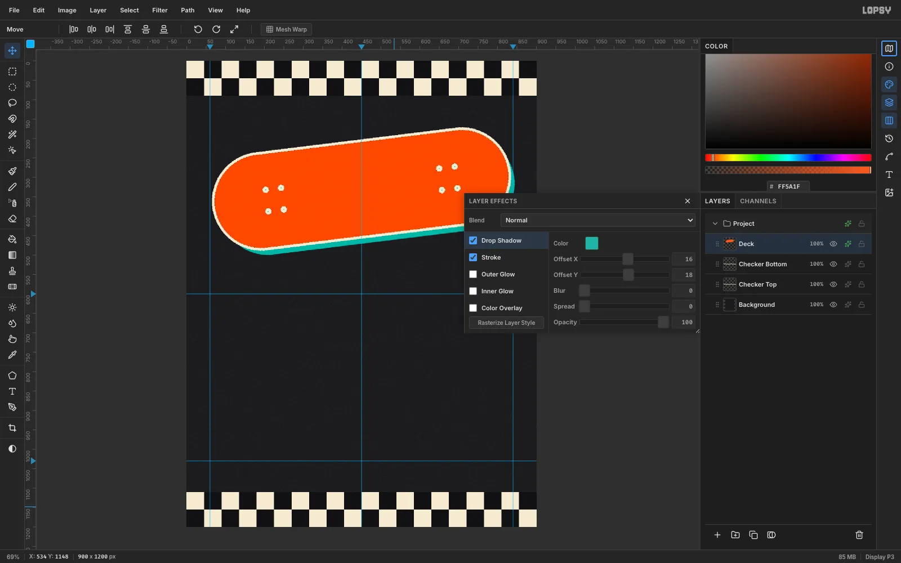

Open the deck's effects with the ✦ button on its layer row.

- Tick **Stroke**. Set the colour to cream `#F4EBD3` and **Width** to `7`.
- Tick **Drop Shadow**. Set the colour to teal `#1FB5A6`, **Offset X** `16`, **Offset Y** `18`, **Blur** `0` and **Opacity** `100`.

A zero-blur shadow is the retro sticker look. The stroke also rings each bolt
hole, like hardware.

## Set the title in Knewave

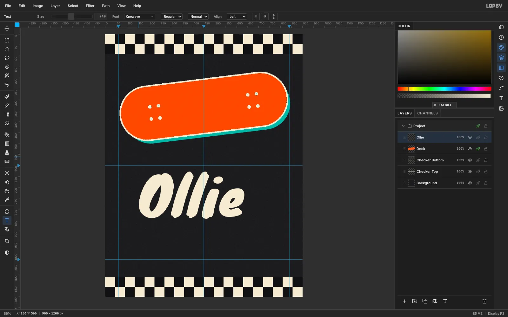

With **Deck** selected, press [[T]]. Set the foreground to cream. Pick
**Knewave** in the **Font** browser and type `240` in **Size**.

Then click empty canvas below the deck, type `Ollie` and press [[Tab]].

> **Tip:** Set the font and size before you click, so the word comes out right the first time.

## Rotate the title

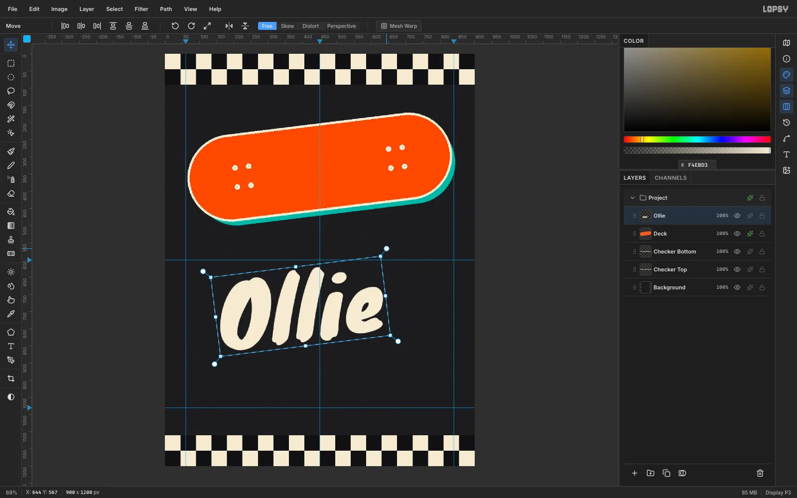

Click **Rasterize Layer** at the bottom of the Layers panel, so the rotation
is baked into the pixels and a later text edit can't straighten it. Marquee
around the word, press [[V]], and drag a corner rotation handle to turn it
the same **7° counter-clockwise** as the deck. Press [[Cmd+D]] to commit.

## Put the title on the deck

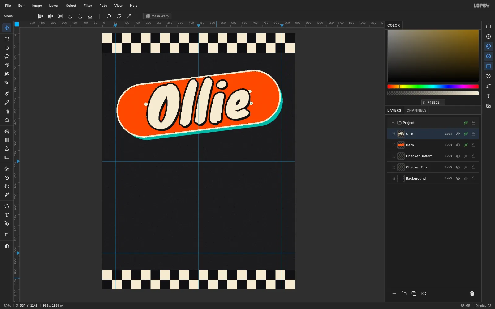

With the Move tool, drag the word up onto the deck so it sits in the middle.
In its effects, add:

- **Stroke** in ink `#111114`, **Width** `7`
- **Drop Shadow** in ink, offset `7` / `9`, **Blur** `0`, **Opacity** `100`

The black outline keeps the cream letters clear of the orange and the bolt
holes behind them.

## Add EATS in Rubik Mono One

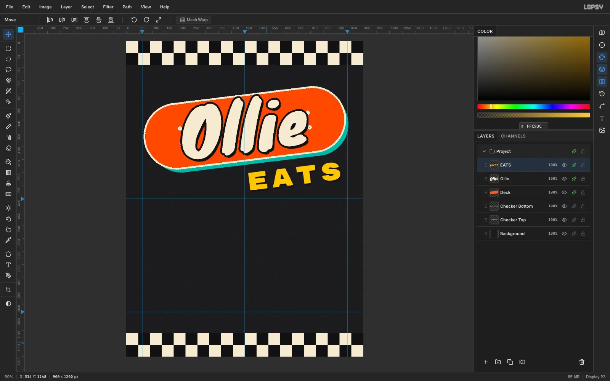

Select **Ollie** and press [[T]]. Set the foreground to mustard `#FFC93C`, the
font to **Rubik Mono One** and the size to `96`. In the **Text** panel, set
**Letter spacing** to `12`. Click empty canvas, type `EATS` and press [[Tab]].

Rasterize it and rotate it **7° counter-clockwise** like the deck. Then drag
it under the deck's right half, tucked just below the tail. Give it a
**Drop Shadow** in ink, offset `5` / `6`, **Blur** `0`.

## Start a burger in a group

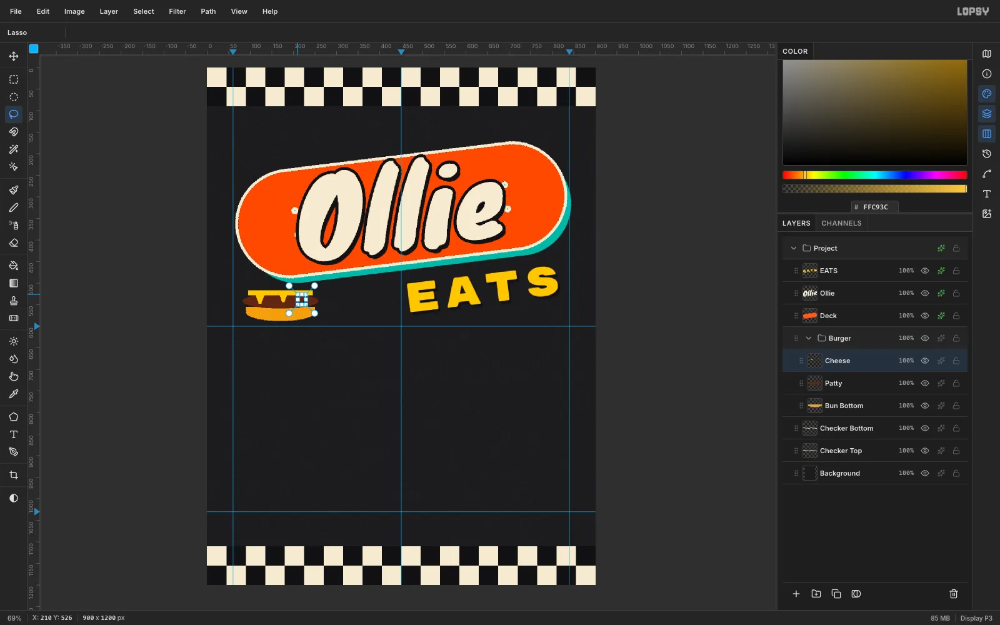

Select **Checker Bottom** and click **New Group**. Name it `Burger`. Starting
from that layer puts the group *under* the deck in the stack, so the bun can
tuck behind it later.

With the group selected, **Add Layer** puts each new layer inside it. Build the
burger in the empty space at the left, just below the deck. You'll move the
finished group into place later. Work bottom-up, each part on its own layer,
stacking each piece so it slightly overlaps the one below:

1. **Bun Bottom** (`#E9A23B`): fill an ellipse about 161 × 40 px. Marquee across its top 16 px or so and press [[Delete]] to flatten it. Then fill a strip the same width and about 10 px tall sitting on the flat top.
2. **Patty** (`#5B2A17`): fill a slightly wider ellipse, about 176 × 35 px, overlapping the top of the bun.
3. **Cheese** (mustard): fill a thin bar, about 150 × 11 px, across the top of the patty. Then use the **Lasso** ([[L]]) to draw three downward-pointing drips under it, filling each with **Edit → Fill**.

## Finish the burger

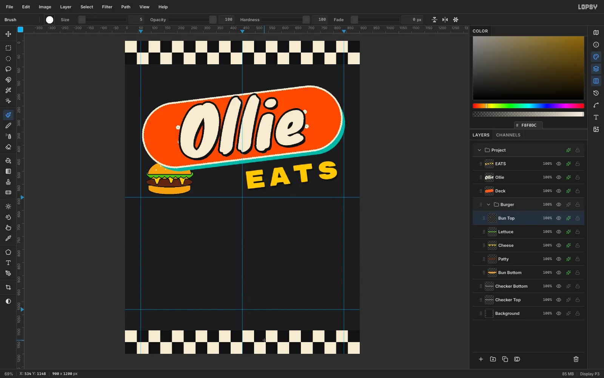

4. **Lettuce** (`#6BBF3B`): press [[B]]. In the brush presets, set **Size** `14`, **Hardness** `100` and **Spacing** `10`. Drag a zigzag about 8 px high along the top of the cheese, as wide as the patty.
5. **Bun Top** (`#E9A23B`): fill an ellipse about 165 × 106 px above the lettuce. Marquee its lower half, from just above the lettuce down, and press [[Delete]] to keep only the dome.
6. **Seeds:** set the brush **Size** to `5` and the colour to `#F8F0DC`, then click eight dots on the dome.

Finally, give each of the five layers a **Stroke** in ink, **Width** `3`, for
a cartoon outline.

## Move the whole group

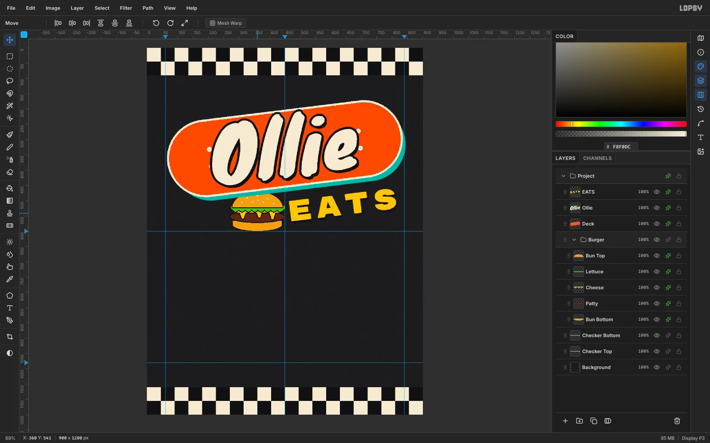

Click the **Burger** group row, press [[V]], and drag anywhere on the burger.
All five parts move together. Drop it to the right and a touch lower, so its
right edge sits about 10 px from the **E** and the top of the bun hides under
the deck's teal shadow. The burger and EATS now read as one logo.

## Slap on a sticker

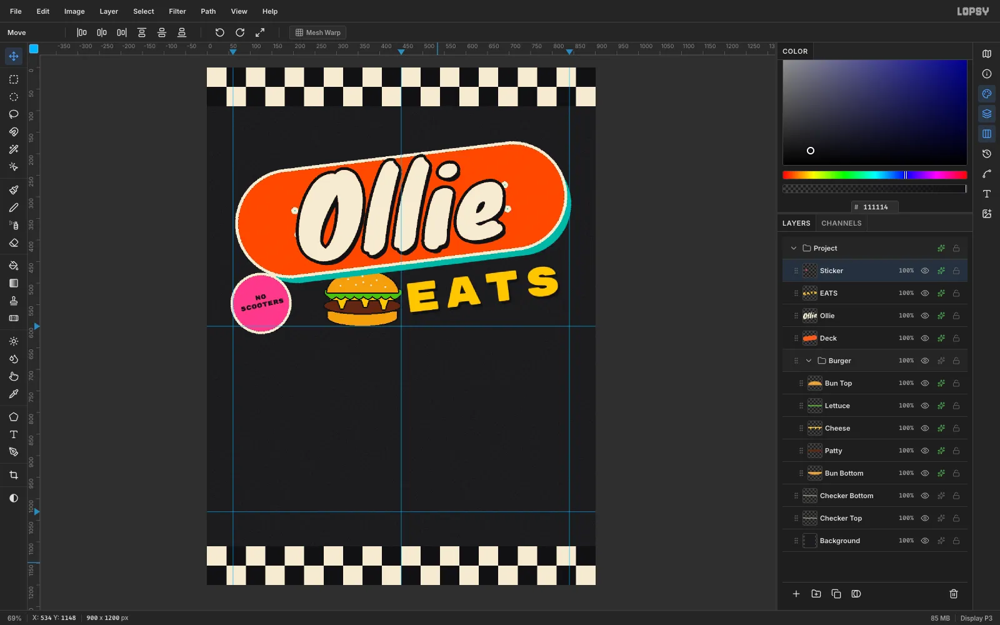

Select **EATS**, add a layer named `Sticker`, and [[Cmd]]-drag a circle about
130 px across on the left margin, left of the burger and just under the
deck's nose. Fill it with pink `#FF4F8B`.

Type the label in **Rubik Mono One** `15`, ink, **Line height** `1.2`. Click
inside the circle, a little in from its left edge and just above its middle,
and type three spaces, `NO`, [[Enter]], `SCOOTERS`, then [[Tab]].
The spaces centre the short word, because every letter in a mono font is the
same width.

Choose **Layer → Merge Down** to merge the words into the circle. Marquee the
sticker, rotate it **12° counter-clockwise** with the **Move** tool and press
[[Cmd+D]]. Then add a **Stroke** in cream `6` and an
ink **Drop Shadow** at `5` / `6`, blur `0`.

## Add the tagline and stars

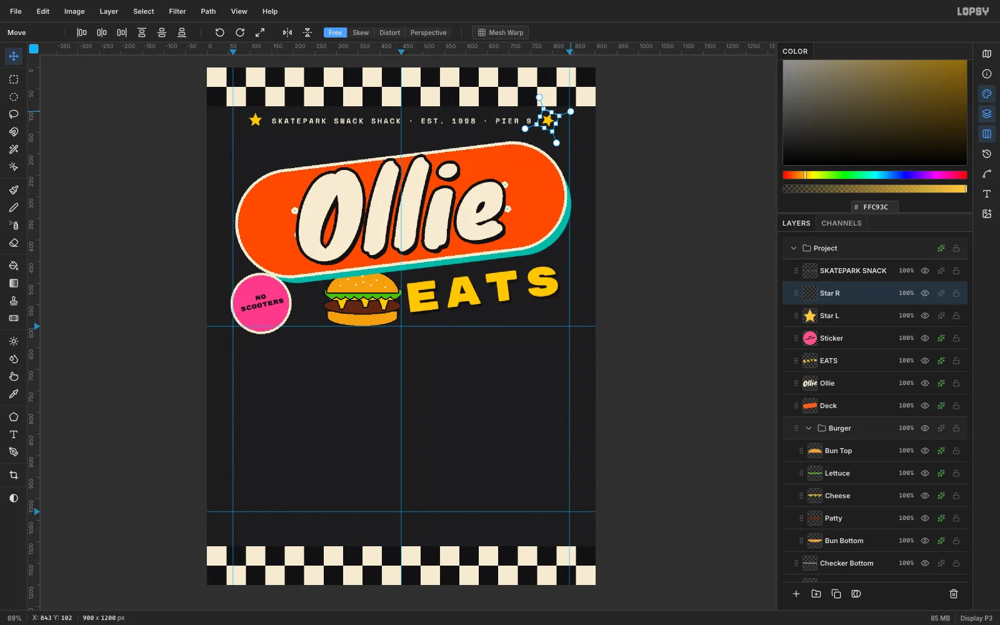

Set **Space Mono** **Bold** `17`, cream, **Letter spacing** `4`. Click just
under the top checkerboard and type
`SKATEPARK SNACK SHACK · EST. 1998 · PIER 9`. If the middle dots won't type,
paste the line in with [[Cmd+V]]. Commit it and click **Align center
horizontally** in the Move tool's options bar to centre it.

Add a layer named `Star L`. With the Lasso, draw a five-point star about 32 px
across just left of the tagline, and fill it with mustard. Press [[Cmd+C]] and
[[Cmd+V]], rename the paste `Star R`, and drag it to the same height just
right of the tagline.

A paste in place has no selection, so marquee around the star again before you
rotate it. Turn it about **24° clockwise** so the pair doesn't look copy-pasted,
then press [[Cmd+D]].

## Set the footer and a graffiti tag

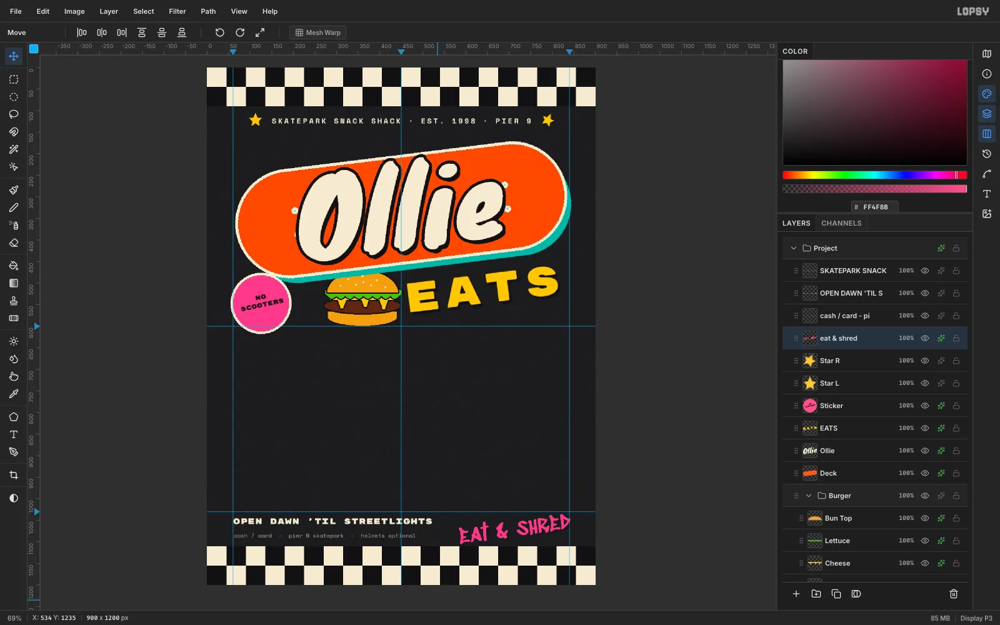

Set the footer now, before the menu columns (see the tip in the menu columns step).

- `OPEN DAWN 'TIL STREETLIGHTS` in Rubik Mono One `19`, cream, **Letter spacing** `1`, clicked on the left margin guide just below the footer guide.
- `cash / card  -  pier 9 skatepark  -  helmets optional` in Space Mono **Regular** `13`, `#B9B09C`, clicked just below the first line.

For the tag, set **Sedgwick Ave Display** `56` in pink. Click in empty space
and type `eat & shred`. Rasterize it, rotate it **8° counter-clockwise**, and
drop it at the bottom right, over the footer and just above the bottom
checkerboard. A **Stroke** in `#1C1C1F` `4` plus an ink shadow at `4` / `4`
makes it look like a sticker on the wall.

## Tape up the section headers

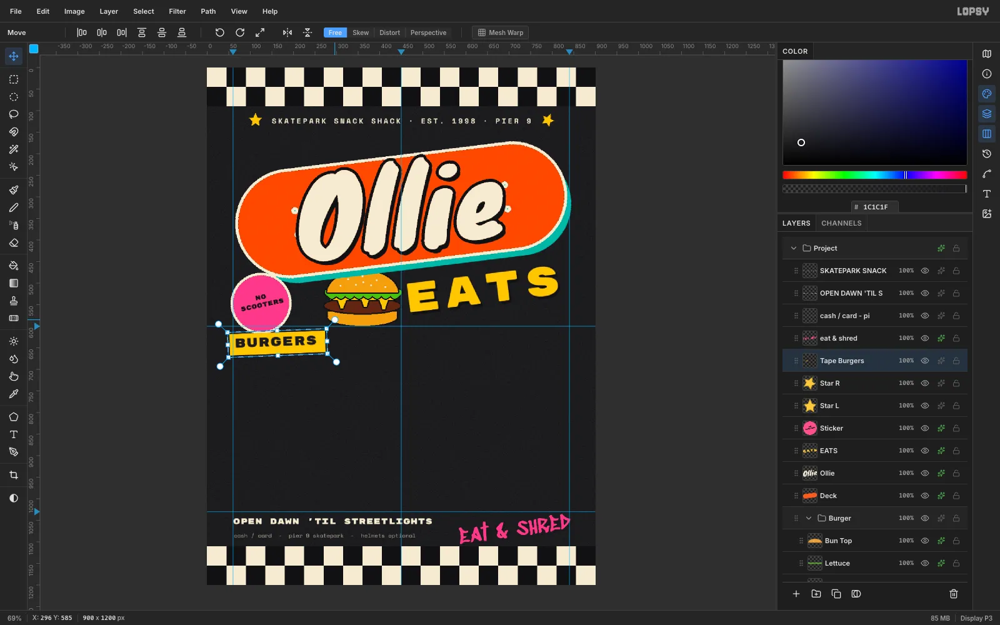

Add a layer named `Tape Burgers`. Just below the menu guide, fill a rectangle
about 222 × 50 px with mustard, starting a few pixels left of the left
margin. Type `BURGERS` on it in Rubik Mono One `30`, `#1C1C1F`,
**Letter spacing** `2`, clicking near the strip's top-left corner. Then
**Merge Down** and rotate the strip **2° counter-clockwise**.

Do the same for `Tape Sides`: a strip about 352 × 50 px starting just right
of the gutter, reading `SIDES+SHAKES`, rotated **2° clockwise**. Tilting the two strips opposite ways
looks hand-taped.

## Draw dotted rules

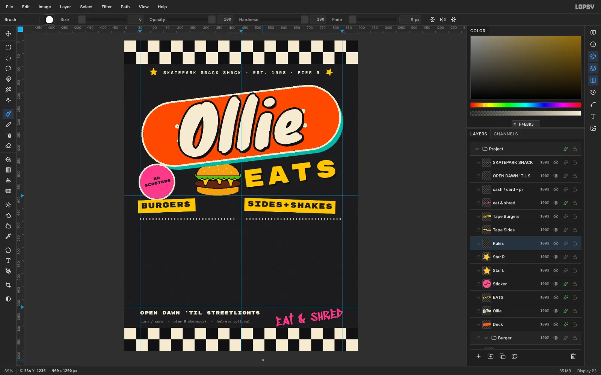

Add a layer named `Rules` and press [[B]]. In the brush presets, set **Size**
`6`, **Hardness** `100` and **Spacing** `200`, the maximum. With spacing that
wide, the brush stamps separate dots.

With cream as the foreground, click on the left margin guide about 25 px
below the tape and [[Shift]]-click level with it just short of the gutter.
Then click just past the gutter and [[Shift]]-click on the right margin guide
at the same height. Set **Spacing** back to `10` afterwards.

## Set the menu columns

Each column is two multi-line text layers. The item names are one layer and
the descriptions another, spaced to the same 82 px rhythm:

- **Descriptions:** Space Mono Regular `15`, `#B9B09C`, **Line height** `1.4`, **Paragraph spacing** `61`.
- **Names:** Space Mono Bold `24`, cream, **Line height** `3.42`, **Paragraph spacing** `0`.

Start the names just under the dotted rule, on the left margin guide for the
left column and just right of the gutter for the right one. Start each
description block about 58 px lower than its names, so every description
sits about 14 px under its name and each pair reads as one item.

Create the right column first, descriptions then names, and then the left
column the same way.

> **Tip:** A Text-tool click on an existing text layer edits that layer instead of starting a new one. Making the descriptions before the names, and the right column before the left, keeps each click in clear space.

## Right-align the prices

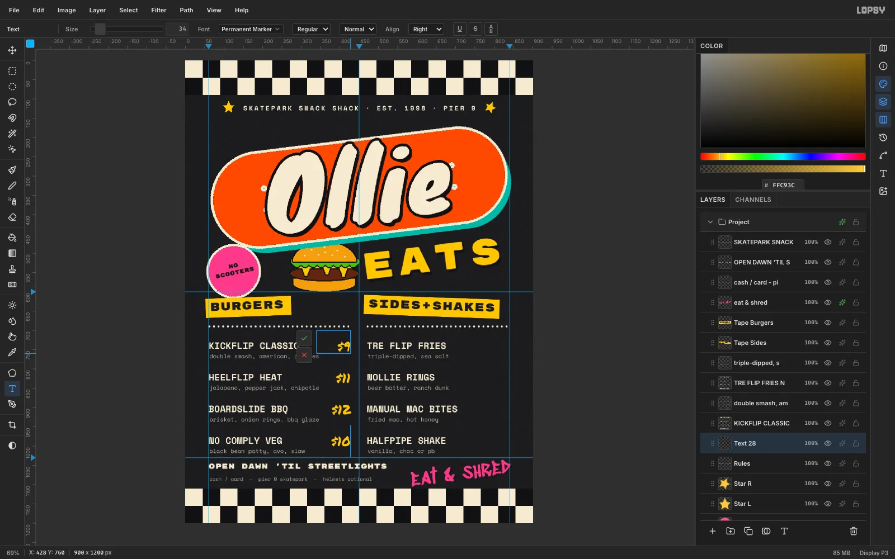

Point text ignores alignment, so the prices use **area text**. Set
**Permanent Marker** `34`, mustard, **Line height** `2.41`, and set **Align**
to **Right**. Then *drag* a box with the Text tool, about 90 px wide, level
with the first item name and ending just short of the gutter. Type the four
prices on separate lines and press [[Tab]].

Drag a second box the same size ending on the right margin guide for `$4`,
`$5`, `$6`, `$6`. Right alignment makes the prices end exactly at the box
edge, so the right column lines up with the margin. Use the Move tool and
[[Up]] to nudge each price layer until the numbers sit on the item names'
baselines.

## Spray some overspray

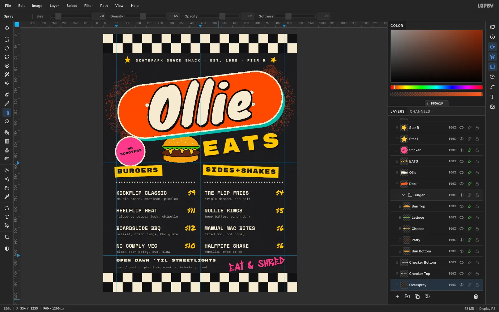

Select **Background** and add a layer named `Overspray`. Press [[J]] for the
**Spray** tool and set **Size** `70`, **Density** `45` and **Opacity** `60`.
With orange as the foreground, spray one arc around the deck's nose and
another around its tail. Long, sweeping drags give the most even mist.

Set the layer's row opacity to `45%`. The speckle then looks like paint that
missed the deck.

## Add a grain overlay

Select the top layer in the stack and add a layer named `Grain`. Set the
foreground to `#808080` and choose **Edit → Fill**. Then use **Filter → Add
Noise…** with **Amount** `40`, **Mono** and **Gaussian**.

In the layer's effects, set **Blend** to **Overlay**, then set the row opacity
to `35%`. Mid-grey disappears in Overlay, so only the noise shows, as a
printed-paper grain over everything.

## Export the menu

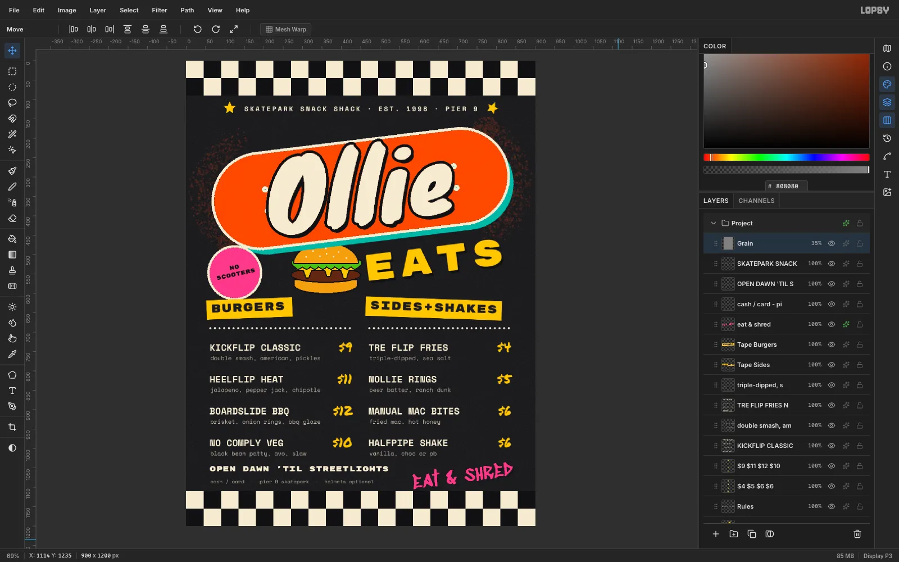

Turn off **View → Show Guides** to check the layout. Then choose
**File → Quick Export PNG** for the image, and **File → Save Project** to keep
every layer, group and effect editable for next season's menu.

To keep going, swap in your own trick-named dishes, or recolour the deck and
its shadow for a night-session version.
