Victorian engineers lived by their gauges. Every boiler room had a brass
pressure gauge with a cream dial, a black needle and a knurled rim. This
tutorial uses one of those gauges as a chart.

The poster is called *Juggernaut Horsepower*. It compares seven famous
steam engines, from Thomas Newcomen's 1712 mine pump to the Union Pacific
*Big Boy* locomotive of 1941. Each engine is one ring on the dial, and
the ring's length shows its power. The oldest engine is the innermost ring
and the newest is the outermost, so the rings grow outwards like a tree.

The numbers run from about 5 hp to 46,000 hp. On an ordinary scale the
small engines would be invisible, so the dial uses a **logarithmic** scale:
every 54° of sweep is a tenfold rise in power, and five tenfold steps fill
270°. The angle for any engine is:

> **Angle** = 54 × log₁₀(horsepower)

- **Newcomen engine**, 1712: 5.5 hp, 40.0° (mine & mill)
- **Boulton & Watt**, 1788: 10 hp, 54.0° (mine & mill)
- **SS Great Eastern**, 1858: 8,000 hp, 210.8° (steamship)
- **Corliss Centennial**, 1876: 1,400 hp, 169.9° (mine & mill)
- **Turbinia**, 1897: 2,000 hp, 178.3° (steamship)
- **RMS Titanic**, 1912: 46,000 hp, 251.8° (steamship)
- **Big Boy**, 1941: 6,290 hp, 205.1° (railway)

The figures are the usual approximate rated or indicated horsepower. The
poster is 1500 × 2000 px. You'll use:

- **Filter → Sunburst** to cut gear teeth and the knurled bezel
- **Define Pattern** and **Fill with Pattern** for rivets and stitching
- the **Elliptical Marquee** with [[Shift]], [[Alt]] and
  [[Shift]]+[[Alt]] to add, subtract and intersect rings
- the **Brush** with **Radial Symmetry** for evenly spaced screws
- the **Move** tool's rotate handle, **Copy** and **Paste**
- **Clouds**, **Add Noise**, **Emboss**, **Brightness/Contrast**,
  **Gaussian Blur** and **Hue/Saturation**
- **Drop Shadow**, **Inner Glow** and **Stroke** effects, plus **Overlay**,
  **Multiply** and **Screen** blend modes
- the **Text** tool with **Cinzel Decorative** and **Old Standard TT**

The palette is brass and enamel on oxblood leather:

- Leather `#2B1B17`, iron `#3A302B`, thread `#C9B287`
- Brass `#5E3F14` → `#E9C877` → `#9C6E27` → `#F7E4A8` → `#86591F` → `#3E280C`
- Copper gears `#8A4A25`, `#A8823A`, `#7A4A22`
- Dial `#EADFC3`, ring tracks `#D4C29A`, ink `#2A1A0C`
- Mine & mill `#6B1E18`, steamship `#4A8573`, railway `#2C3E55`
- Needle `#1C2733`, footnotes `#D9C49A`

> **Tip:** Almost everything here is a circle around the gauge centre at
> **750, 1080**. A circle of radius *r* around *x, y* fits a box from
> *x − r, y − r* to *x + r, y + r*. With nothing selected, a single click
> with the **Rectangular** or **Elliptical Marquee** opens a dialog where
> you can type those corners exactly. To add, subtract or intersect a
> second shape, drag it while holding [[Shift]], [[Alt]] or
> [[Shift]]+[[Alt]], and watch the X/Y readout at the bottom left of the
> window.

## Create the document and set guides

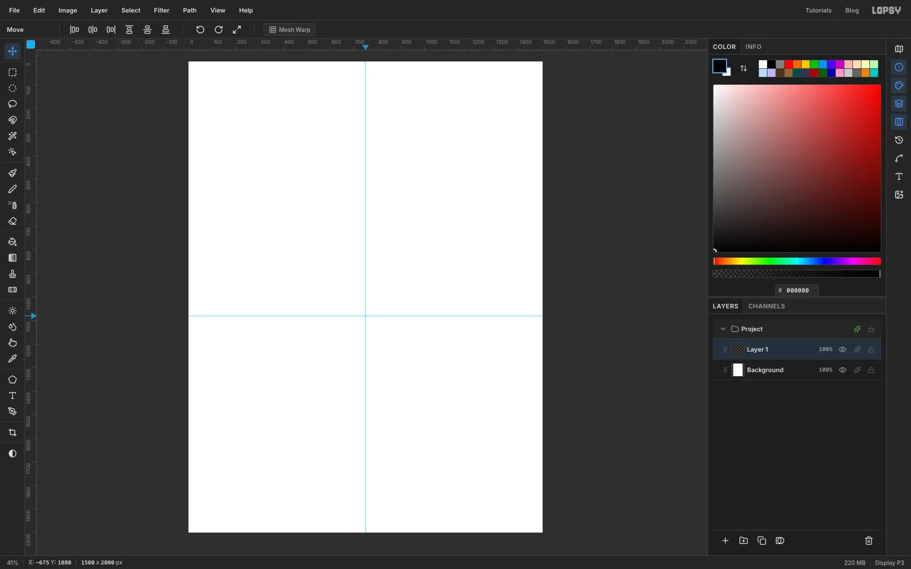

Choose **File → New**, set **Unit** to **Pixels**, and enter **1500** by
**2000**. Keep the **White** background and click **Create**.

Click the top ruler at **750** to make a vertical guide down the centre.
Then click the left ruler at **1080** to make a horizontal guide. The
gauge will sit where they cross.

## Lay down the leather

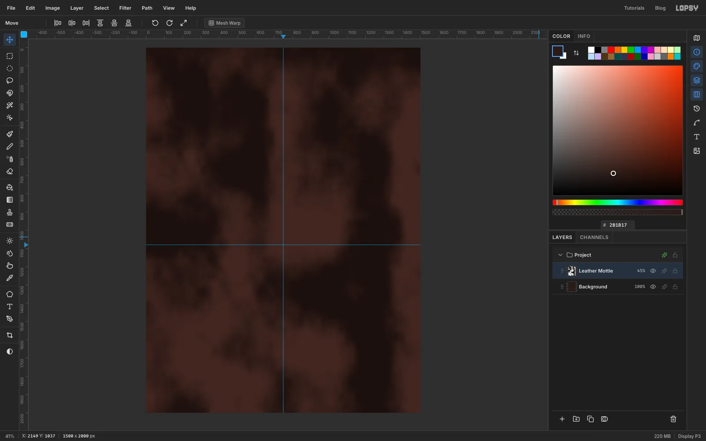

Select the *Background* layer, set the foreground colour to `#2B1B17` and
choose **Edit → Fill**. With nothing selected it fills the whole layer.

A new document also comes with an empty *Layer 1*. Double-click its name
and rename it *Leather Mottle*, then choose **Filter → Clouds…** with
**Scale 6**. Open the layer's effects with the ✦ button, set the blend
mode to **Overlay**, and lower the layer's opacity to **45%**. The grey
clouds now just lighten and darken the brown.

## Add pebble grain

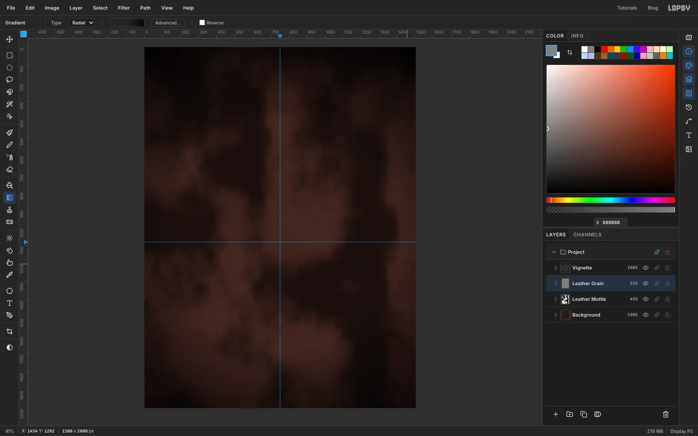

Click **Add Layer**, name it *Leather Grain*, fill it with mid grey
`#808080`, and run these filters in order:

1. **Add Noise**: **Amount 100**, **Mono**, **Gaussian**.
2. **Gaussian Blur**: **Radius 3**. This turns single-pixel noise into
   small bumps.
3. **Emboss**: **Angle 135**, **Strength 100**. The bumps are now lit
   from the top left.
4. **Brightness/Contrast**: **Contrast 100**. Apply it twice, because
   the emboss on its own is very faint.

Set the layer to **Overlay** at **40%**. It reads as pebbled hide.

## Darken the edges

Add a layer called *Vignette*. Pick the **Gradient** tool, set **Type**
to **Radial** and click **Advanced…**. Make three black stops:

- the left end fully transparent
- a second stop at **50%**, also transparent
- the right end `#0A0503` at **90%** opacity

Drag from the middle of the page out past the right edge, then set the
layer to **Multiply**.

## Build the iron frame

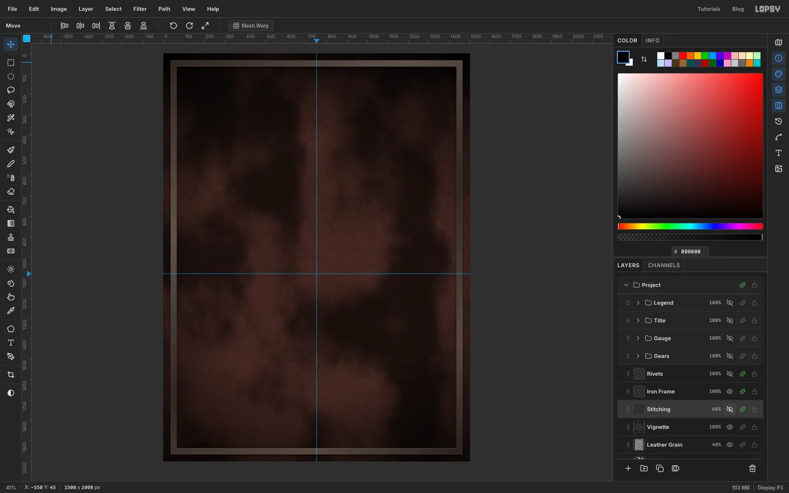

Add a layer called *Iron Frame*. Select a rectangle from **35, 35** to
**1465, 1965** and fill it with `#3A302B`. Choose **Select → Shrink…** by
**30** and press [[Delete]]. That leaves a 30 px band round the page.

[[Cmd]]-click the layer's thumbnail to select the band. Drag a linear
gradient from the top-left corner to the bottom-right corner with five
stops: `#2A2320`, `#5C514A`, `#2E2622`, `#544840` and `#221C19`. The
alternating stops make the iron catch the light unevenly. Deselect, then:

- add **Mono** noise at **10**
- add **Inner Glow** in `#B2A08A` with **Size 4** and **Opacity 60**
- add **Drop Shadow** with **Offset 0 / 6**, **Blur 14** and **Opacity
  75**

## Rivet it with a pattern

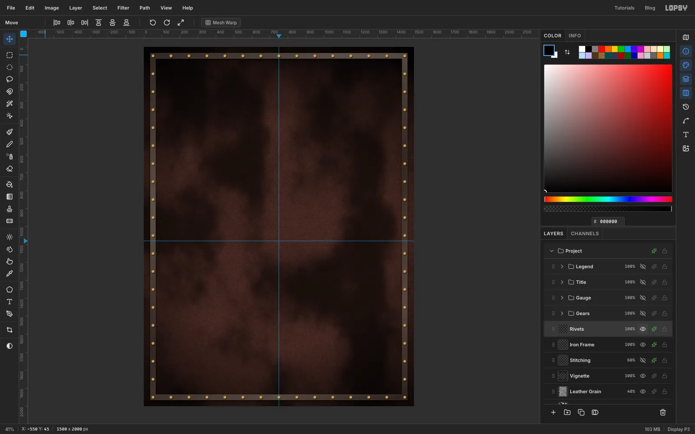

Add a layer called *Rivets*:

1. Select a 16 px circle from **42, 42** to **58, 58** and fill it with
   `#C9A15A`.
2. Press [[Cmd+D]] so your next click opens the corners dialog instead of
   just deselecting. Select **0, 0** to **100, 100** and choose **Edit →
   Define Pattern**.
   That captures one rivet in a 100 px tile.
3. Press [[Delete]] to clear the tile.
4. Select the outside of the frame (**35, 35** to **1465, 1965**), then
   [[Alt]]-drag the inside (**65, 65** to **1435, 1935**) to subtract it.
5. Choose **Edit → Fill with Pattern…** and click **Apply**.

The tiles line up with the page corner, so a rivet lands every 100 px,
right on the middle of the band. Deselect, and give the layer an **Inner
Glow** in `#4A2E10` (**Size 4**, **Opacity 85**) and a small **Drop
Shadow** (**Offset 2 / 3**, **Blur 3**, **Opacity 75**). The rivets now
look domed.

## Stitch the leather

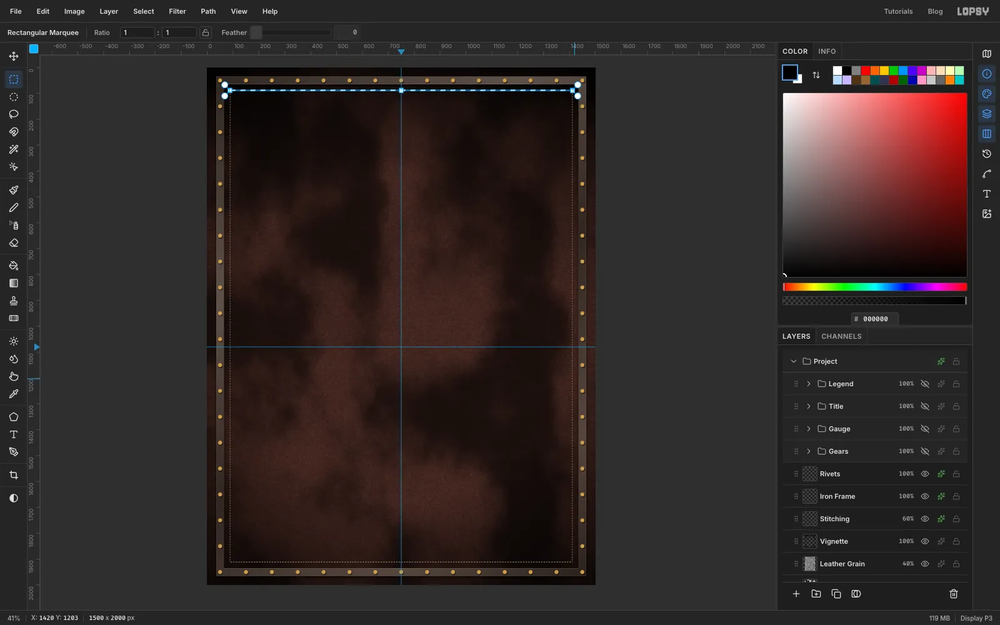

Patterns make dashed thread too. First make two tiny tiles on a scratch
layer, using the click-to-type marquee dialog. Press [[Cmd+D]] before
each click so the dialog opens instead of the click just deselecting:

1. Fill **0, 0 → 6, 3** with `#C9B287`. Select **0, 0 → 10, 3** and
   choose **Define Pattern**. That's a 6 px dash with a 4 px gap.
2. Fill **0, 10 → 3, 16**, select **0, 10 → 3, 20** and **Define
   Pattern** again for the up-and-down version.
3. Delete the scratch layer.

Add a layer called *Stitching* and drag it below *Iron Frame*. Then:

1. Select a 3 px strip from **88, 87** to **1412, 90**.
2. Choose **Fill with Pattern** and pick the horizontal tile.
3. Repeat for the bottom strip, **88, 1910 → 1412, 1913**.
4. Do the two sides with the vertical tile: **87, 88 → 90, 1912** and
   **1410, 88 → 1413, 1912**.

Add a **Drop Shadow** in near-black (**Offset 1 / 1**, **Opacity 85**)
to tuck the thread into the leather, and set the layer to **60%**.

## Cut the first gear with Sunburst

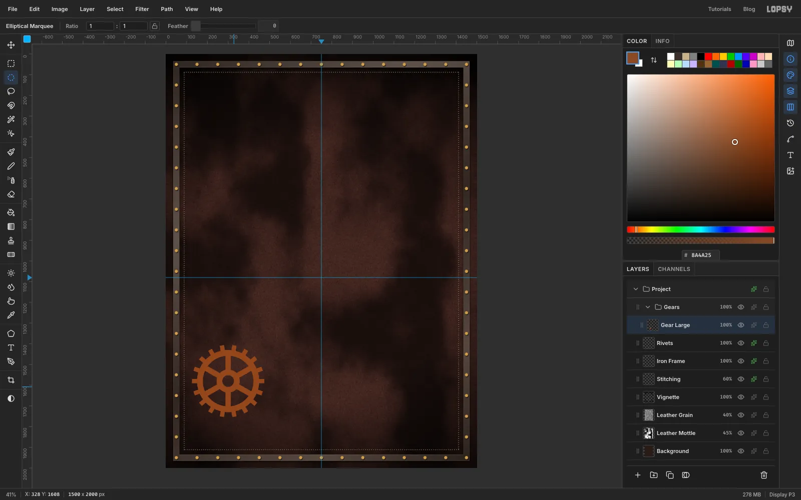

Choose **Layer → New Group** and name it *Gears*. Add a layer inside it
called *Gear Large* and set the foreground colour to copper `#8A4A25`.
The gear is centred on **300, 1580**.

1. **Teeth.** Select a circle of radius **175** (corners **125, 1405**
   to **475, 1755**). Choose **Filter → Sunburst…** and set:
   - **Rays 18**, **Length 12**, **Width 50**, **Taper 50**
   - **Center X 20**, **Center Y 79**

   A Taper of 50 gives parallel-sided rays, which look like gear teeth.
   Sunburst's centre is a percentage of the page: 300 is 20% of 1500,
   and 1580 is 79% of 2000. The selection trims the rays to the tooth
   tips.
2. **Body.** Select a circle of radius **150** on the same centre and
   choose **Edit → Fill**.
3. **Spokes.** Select a circle of radius **122**, then [[Alt]]-drag a
   circle of radius **56** to subtract the middle. Hold [[Alt]] and lasso
   six thin bars, about 26 px wide, from the hub out to the rim, to take
   them out of the selection too. Press [[Delete]]. What's left are six
   spokes.
4. **Axle hole.** Select a circle of radius **28** and press [[Delete]].

## Add three more gears

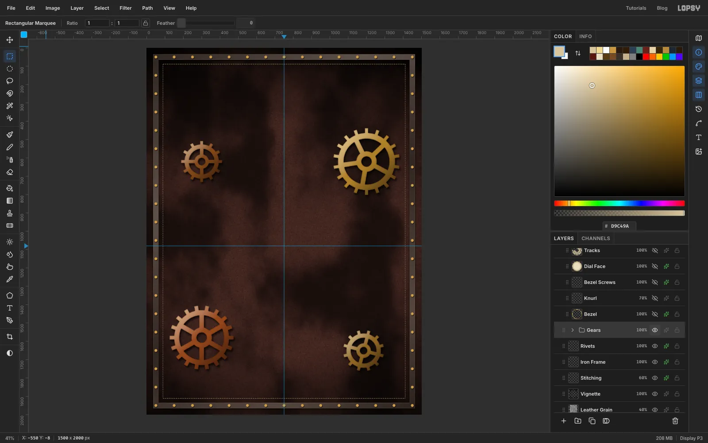

Make two more gears the same way, each on its own layer:

- *Gear Small*: brass `#A8823A`, centred on **1200, 620** (**Center X
  80**, **Center Y 31**). Teeth to radius **182**, body radius **156**,
  **18** rays, **Length 10**, **Width 55**, **Rotation 10**, five spokes.
- *Gear Pinion*: dark copper `#7A4A22`, centred on **300, 620** (**20**,
  **31**). Teeth to radius **112**, body radius **94**, **12** rays,
  **Length 7**, **Width 55**, four spokes.

For the fourth gear, copy the pinion:

1. Select a square around the pinion and press [[Cmd+C]], then
   [[Cmd+V]]. The paste lands in place on a new layer. Rename it *Gear
   Tiny*.
2. With the **Move** tool, drag it down so its centre sits at about
   **1185, 1650**.
3. Select a square around it, hold [[Cmd]] and drag a rotate handle round
   by one 15° step, so its teeth don't match the pinion's.
4. Press [[Cmd+D]] to deselect and commit the rotation.
5. Use **Filter → Hue/Saturation…** with **Hue +10**, **Saturation
   −15** and **Lightness +6** to shift it towards brass.

Now shade each gear the same way:

1. [[Cmd]]-click its thumbnail to select it.
2. Drag a linear gradient diagonally across it with four stops: cream
   `#FFF1C9` at **55%**, clear, clear, then dark `#1A0A02` at **55%**.
3. Add **Inner Glow** in `#2A1206` (**Size 8**, **Opacity 70**).
4. Add **Drop Shadow** with **Offset 6 / 10**, **Blur 16**, **Opacity
   75**.

Keep the same shadow on every gear so the light comes from one place.

## Select the bezel ring

Make a new group called *Gauge* and drag it above *Gears* in the Layers
panel. Add a layer called *Bezel* inside it.

With the **Elliptical Marquee**, select a circle from **130, 460** to
**1370, 1700**. That's radius 620 around the gauge centre; hold [[Cmd]]
while dragging to keep it round. Then hold [[Alt]] and drag a second
circle from **190, 520** to **1310, 1640** (radius 560) to cut out the
middle.

Every gear overlaps this ring, so they'll look as though they turn
behind the gauge.

## Fill it with brass

Pick the **Gradient** tool, set **Linear** and open **Advanced…**. Brass
looks polished when light and dark bands alternate, so use six stops:

- **0%** `#5E3F14`
- **22%** `#E9C877`
- **42%** `#9C6E27`
- **60%** `#F7E4A8`
- **80%** `#86591F`
- **100%** `#3E280C`

Drag across the ring from its upper left to its lower right.

For a stepped inner lip, select a thinner ring (radius **575**, minus
radius **560**). Drag the same gradient the opposite way, lower right to
upper left. The reversed bands read as a bevel.

Deselect and add **Drop Shadow**: **Offset 8 / 14**, **Blur 26**,
**Opacity 80**.

## Knurl the rim

Add a layer called *Knurl*. Select a ring from radius **617** in to
radius **599**, and set the foreground to `#3E280C`.

Run **Filter → Sunburst…** with **Rays 120**, **Length 50**, **Width
38**, **Taper 50**, **Center X 50** and **Center Y 54**. Inside the
narrow ring, 120 parallel rays become machined grooves.

Deselect, set the layer to **Multiply** and lower it to **70%**.

## Add slotted screws with Radial Symmetry

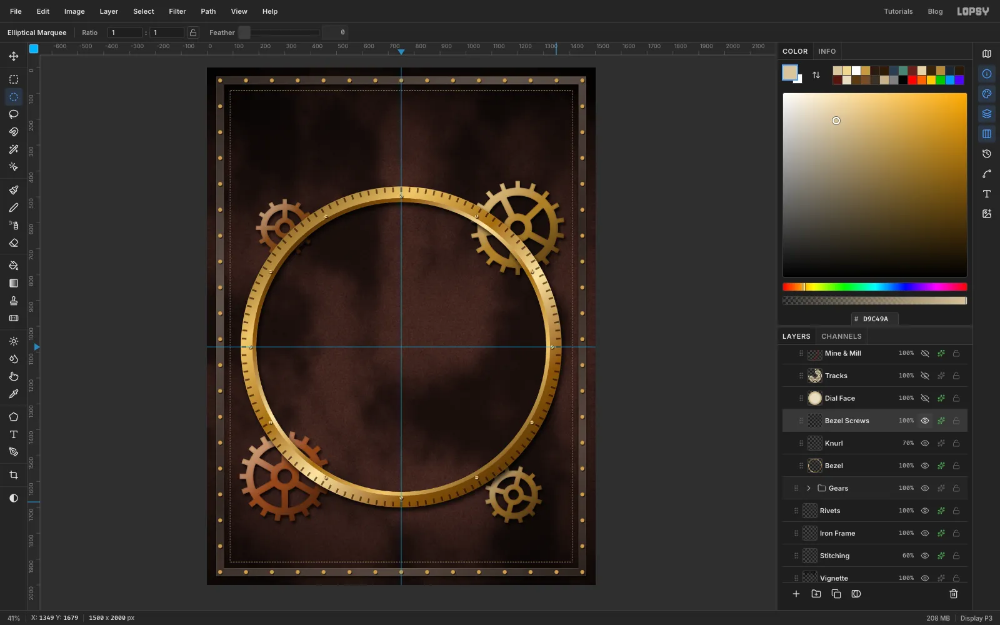

Add a layer called *Bezel Screws*. Pick the **Brush** with **Size 15**
and **Hardness 100**, and set the foreground to pale brass `#F2D892`.

1. Turn on **Radial Symmetry** in the options bar and set **Segments**
   to **12**.
2. [[Cmd]]-click the centre of the gauge, where the guides cross. That
   moves the symmetry centre there.
3. Click once at **750, 497**, just inside the knurling. You get twelve
   screw heads.
4. Set the brush to **Size 3** and the colour to `#5A3A10`. Click at
   **745, 492** and [[Shift]]-click at **755, 502** to draw a short
   diagonal line across the top screw. Every screw gets a slot.

Turn Radial Symmetry off. Add **Inner Glow** in `#4A2E10` (**Size 5**,
**Opacity 85**) and a small **Drop Shadow** (**Offset 2 / 3**, **Blur
3**).

## Paint the enamel dial

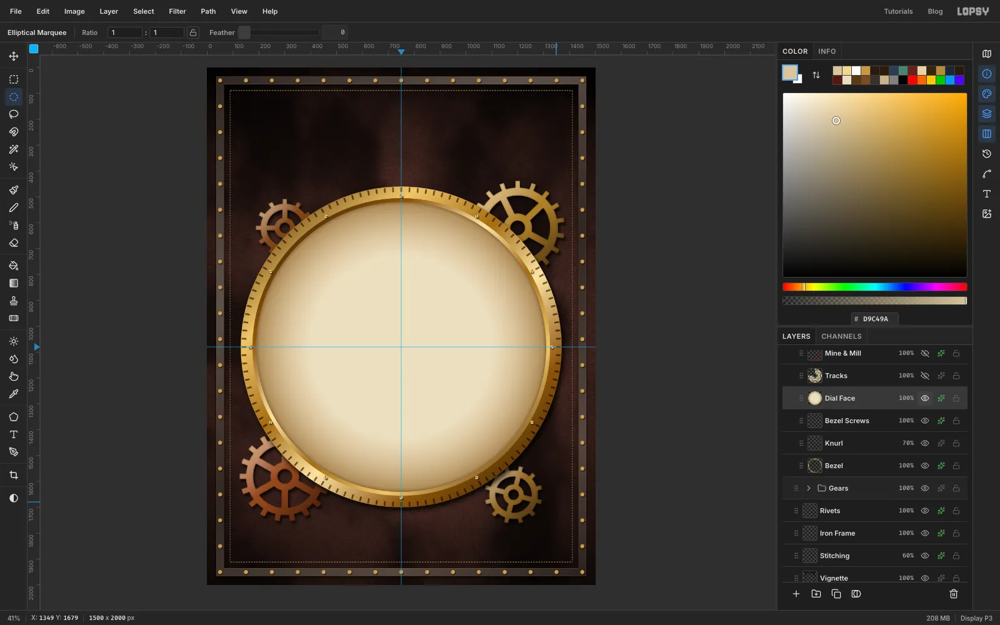

Add a layer called *Dial Face*. Select a circle of radius **560** and
fill it with cream `#EADFC3`.

Age it with a radial gradient inside the selection:

- clear at the centre
- `#C9AE78`, still clear, at **62%**
- `#8E6A36` at **75%** opacity at the rim

Drag from the centre to the rim.

Add **Mono** noise at **6** and an **Inner Glow** in `#3A2408` (**Size
22**, **Opacity 60**). The glow is the shadow the bezel casts onto the
dial.

## Lay the ring tracks

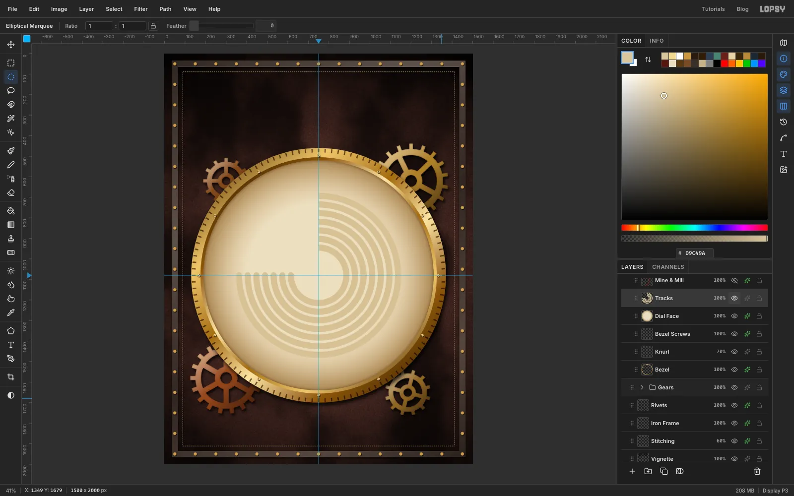

First switch off **View → Snap to Guides**. Small circles drawn right on
the guides would otherwise snap flat.

Add a layer called *Tracks* and set the foreground to `#D4C29A`. Each
ring is 30 px wide with a 12 px gap, so its middle radius is 15 px in
from the outside:

- Ring 1, Newcomen: radius 150 to 120
- Ring 2, Boulton & Watt: 192 to 162
- Ring 3, Great Eastern: 234 to 204
- Ring 4, Corliss: 276 to 246
- Ring 5, Turbinia: 318 to 288
- Ring 6, Titanic: 360 to 330
- Ring 7, Big Boy: 402 to 372

For each ring:

1. Select the outer circle, then [[Alt]]-drag the inner one to subtract
   it.
2. Switch to the **Rectangular Marquee**, hold [[Alt]] and drag a
   rectangle from **330, 660** to the guide
   crossing at **750, 1080**. That removes the top-left quarter.
3. Choose **Edit → Fill**.
4. Round off the 9 o'clock end with a filled 30 px circle centred on the
   horizontal guide, at **x = 750 − the middle radius**. For ring 1
   that's **615, 1080**; for ring 7 it's **363, 1080**.

The empty top-left quarter is where the labels will go.

## Select a data ring

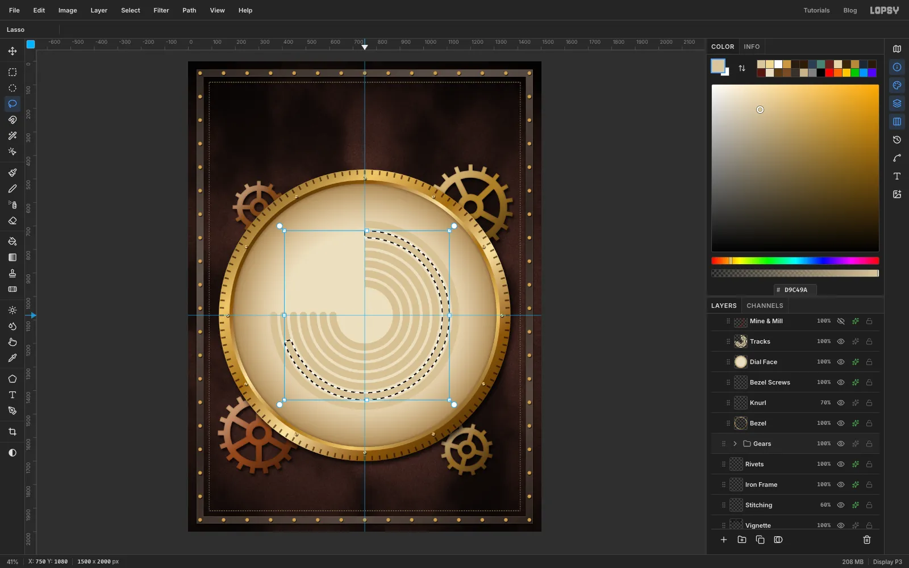

The coloured rings are made the same way, except each one stops at its
engine's angle. Select the ring, then hold [[Shift]]+[[Alt]] and lasso a
wedge that keeps only the part you want. [[Shift]]+[[Alt]] *intersects*,
so only the overlap stays selected.

Draw the wedge like this:

1. Start at the gauge centre, **750, 1080**, and go straight up past the
   rim.
2. Sweep round clockwise outside the dial.
3. Come back in through the end point below, and finish at the centre.

The end points sit on the line from the centre at each engine's angle,
480 px out:

- Newcomen **1059, 712**
- Boulton & Watt **1138, 798**
- Corliss **834, 1553**
- Turbinia **764, 1560**
- Big Boy **546, 1515**
- Great Eastern **504, 1492**
- Titanic **294, 1230**

For your own data, a point *r* px out at angle *θ* is at *x = 750 + r ×
sin θ*, *y = 1080 − r × cos θ*. The picture shows the Titanic ring at
251.8°.

## Fill the data rings

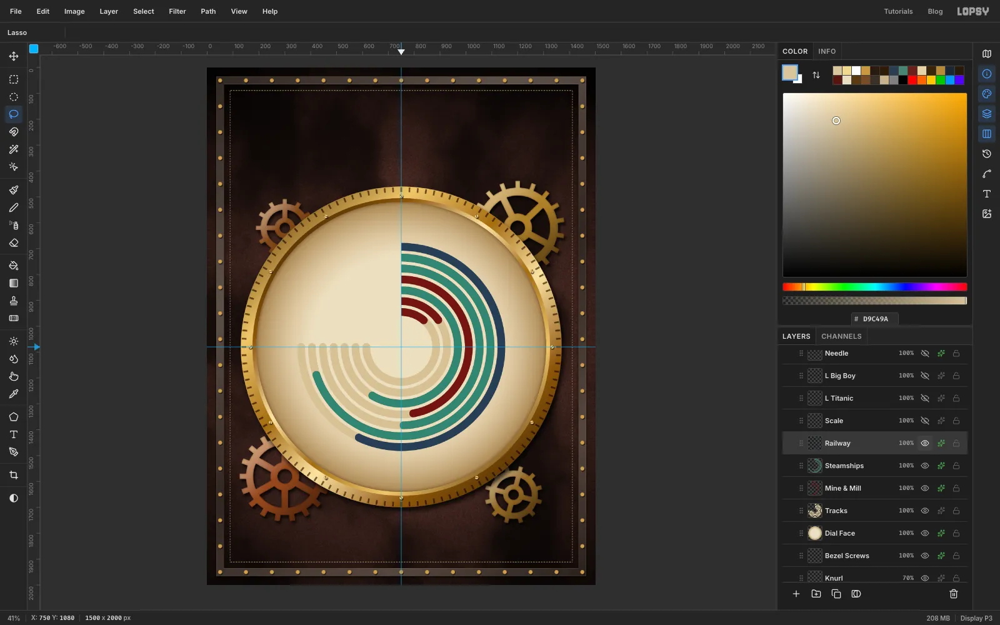

Make one layer per category and fill its rings, rounding each ring's end
with a 30 px circle centred on the middle radius at that angle. Use
the formula from the previous step with *r* = the ring's middle radius;
the Titanic cap, for example, is centred on **422, 1188**:

- *Mine & Mill* in oxblood `#6B1E18`: Newcomen, Boulton & Watt and
  Corliss
- *Steamships* in verdigris `#4A8573`: Great Eastern, Turbinia and
  Titanic
- *Railway* in blued steel `#2C3E55`: Big Boy

To make each layer read as fired enamel rather than flat colour, add
**Mono** noise at **5** and an **Inner Glow** in `#1A0D06` (**Size 3**,
**Opacity 55**).

## Draw the scale and numerals

Add a layer called *Scale* and set the foreground to `#2A1A0C`.

**Rule.** Select a ring from radius **556** to **552**, [[Alt]]-subtract
the top-left quarter as before, and fill.

**Major ticks.** Use the **Brush** at **Size 7**. For each tick, click
the inner point and [[Shift]]-click the outer one:

- 1 hp (0°): **750, 568** to **750, 528**
- 10 hp (54°): **1164, 779** to **1197, 756**
- 100 hp (108°): **1237, 1238** to **1275, 1251**
- 1,000 hp (162°): **908, 1567** to **921, 1605**
- 10,000 hp (216°): **449, 1494** to **426, 1527**
- 100,000 hp (270°): **238, 1080** to **198, 1080**

**Minor ticks.** Switch to **Size 3** and draw shorter ticks from radius
535 out to the rule, using the same *x = 750 + r × sin θ*,
*y = 1080 − r × cos θ* formula with *r* = 535 and 552. Inside each decade they sit this many degrees past
the major tick: ×2 at 16.3°, ×3 at 25.8°, ×4 at 32.5°, ×5 at 37.7°, ×6
at 42.0°, ×7 at 45.6°, ×8 at 48.8° and ×9 at 51.5°. Start the ×5 tick a
little further in, at 526, so it stands out. Being off by a pixel here
won't show. What matters is that the gaps shrink across each decade,
which is how a reader can tell the scale is logarithmic.

**Numerals.** Pick the **Text** tool, choose **Old Standard TT**,
**Bold**, **Size 28**, colour `#2A1A0C`. Type *1*, *10*, *100*,
*1,000*, *10,000* and *100,000* as separate layers. Keep them upright
and nudge each one with the arrow keys until it sits just inside its
major tick. (The *1* at 12 o'clock hides under the centre guide in this
picture.) *100,000* is the widest, so drop it to **25** px and centre it
on the 9 o'clock guide, between the tick and the ring caps.

## Label each ring

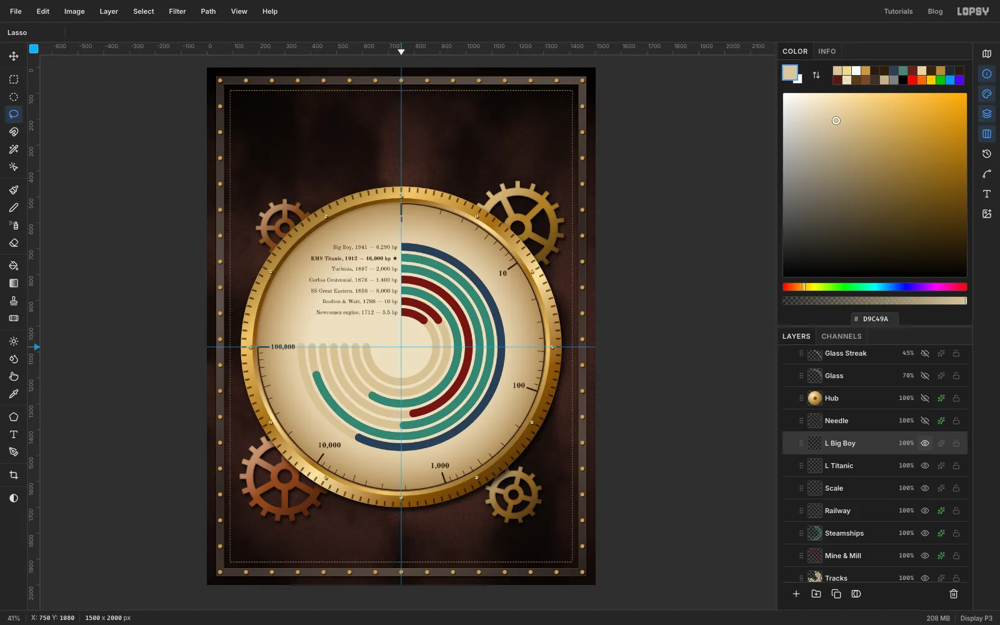

With the **Text** tool still on **Old Standard TT**, set **Regular**,
**Size 21**. Type one label per ring, from *Newcomen engine, 1712 — 5.5
hp* to *Big Boy, 1941 — 6,290 hp*.

Each label's right edge sits **16 px** left of the vertical guide, at
x 734. Its capitals are centred on the middle of its ring, which crosses
the guide at:

- Big Boy **693**
- Titanic **735**
- Turbinia **777**
- Corliss **819**
- Great Eastern **861**
- Boulton & Watt **903**
- Newcomen **945**

Use the **Move** tool's arrow keys for the last few pixels.

Titanic is the record, so set its label in **Bold**, in near-black
`#2B1A10`, with a ★ at the end. Don't use a ring colour for emphasis:
oxblood would make the Titanic look like a mill engine.

## Fit the needle and hub

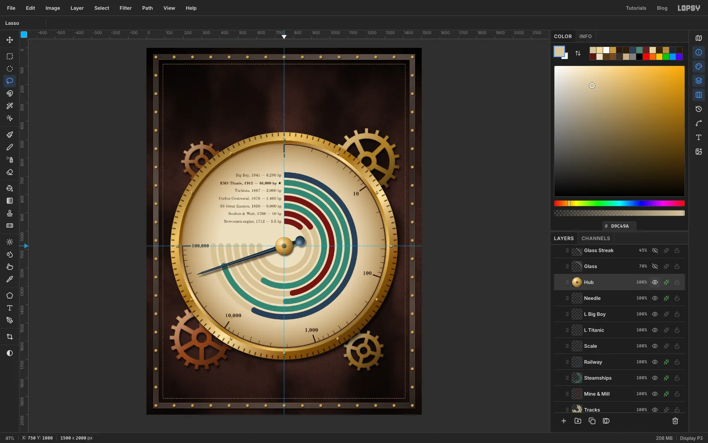

Add a layer called *Needle* and set the foreground to `#1C2733`. Draw it
pointing straight up from the centre, then turn it into place.

1. **Shaft.** Lasso a slim tapered shape from the centre up to the point
   at **750, 575**, about 26 px wide at the hub. Add a short tail
   reaching 70 px below the centre, and fill it.
2. **Counterweight.** Fill a 52 px circle centred on **750, 1172**. Give
   it a radial gradient from `#8FA6BF` through `#3A4E66` to `#141C26` so
   it looks like turned steel.
3. **Highlight.** Lasso a thin sliver up the middle of the shaft and fill
   it with `#5B7088`.

To rotate it about the hub, select a tall box centred on the gauge
centre, **710, 560** to **790, 1600**. With the **Move** tool, drag a
rotate handle until the needle points at the end of the Titanic ring:
251.8° clockwise, or about 108° anticlockwise. Press [[Cmd+D]] to
commit. Add a **Drop Shadow** with **Offset 9 / 12**, **Blur 10** and
**Opacity 55**.

**Hub.** Add a layer called *Hub*:

1. Fill a circle of radius **48** with `#B8893A`.
2. Drag a radial gradient from `#FFF4CF` through `#E2B865` to
   `#6E4815`, starting a little above-left of centre.
3. Select a cap of radius **14** and drag a small radial gradient from
   `#3B260C` to `#C99A4A`.
4. Give the hub a **Drop Shadow** (**Offset 5 / 8**, **Blur 10**) and an
   **Inner Glow** in `#4A2E10` (**Size 5**, **Opacity 60**).

## Put glass over the dial

Add a layer called *Glass*.

1. Select a circle of radius **548** on the gauge centre.
2. [[Alt]]-drag a second circle of radius 560 centred on **690, 1155**
   (corners **130, 595** to **1250, 1715**), 60 px left and 75 px down. That leaves a crescent at the upper right.
3. Drag a linear gradient from the upper right towards the centre: white
   at **45%**, then **5%**, then clear.
4. Set the layer to **Screen** at **70%**.

The crescent stays clear of the labels, so they keep their contrast.

For a rim reflection, add a layer called *Glass Streak*:

1. Select a ring from radius **571** to **563**. Intersect it with a
   wedge from about 1 o'clock to 2 o'clock.
2. Fill it with white and **Gaussian Blur** it by **5**.
3. Set the layer to **Screen** at **45%**.
4. Take the **Eraser** at **Size 80**, **Opacity 60%** and click once on
   each end so the streak fades out.

## Engrave the title plate

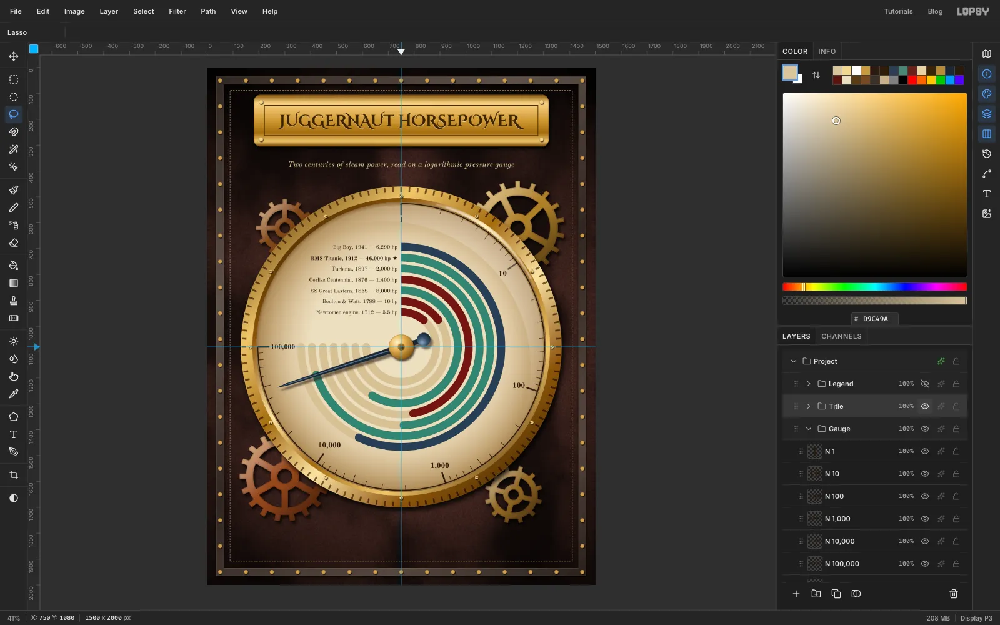

Make a group called *Title* above *Gauge* and add a layer called *Title
Plate*.

1. **Plate.** Pick the **Shape** tool with **Rectangle** and **Corner
   Radius 26**. Shapes draw from the centre, so drag from **750, 205**
   to **1320, 305**.
2. **Brass.** [[Cmd]]-click the thumbnail and drag a gradient from the
   top edge to the bottom edge, holding [[Cmd]] to keep it straight. Use
   stops `#7A5418`, `#F2D58C`, `#C79A45`, `#9C6E27`, `#E7C676` and
   `#6B4614`. Add a **Drop Shadow** (**Offset 6 / 10**, **Blur 18**,
   **Opacity 80**) and an **Inner Glow** in `#3B2608` (**Size 6**,
   **Opacity 70**).
3. **Engraved border.** On a new layer, [[Cmd]]-click the plate
   thumbnail, **Shrink** by **40**, fill with `#4A300C`, **Shrink** by
   **3** more and press [[Delete]].
4. **Rivets.** On another new layer, click four brush dabs (**Size 18**,
   `#F2D892`) at **208, 133**, **1292, 133**, **208, 277** and **1292,
   277**. Give them the same glow and shadow as the frame rivets.

Type *JUGGERNAUT HORSEPOWER* in **Cinzel Decorative**, **Bold**, **Size
60**, colour `#3A2408`, and centre it in the plate. A **Drop Shadow** in
pale `#FFF1C4` with **Offset 0 / 2** and **Blur 1** gives the letters a
pressed-in look.

Under the plate, type the subtitle in **Old Standard TT** **Italic**,
size **30**, in `#E6D3A6`, centred on the guide at about y 376.

> **Tip:** Choose **Italic** in the **Style** menu *before* you click to
> type. Changing the font settings while a text layer is selected
> restyles that layer.

## Add the legend and notes

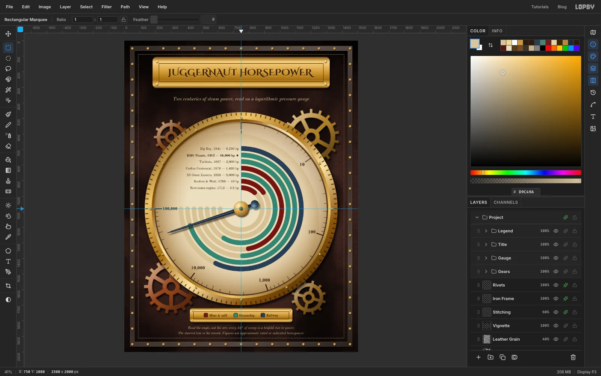

Make a group called *Legend* above *Title*.

1. **Plate.** Draw a second plate with the Shape tool: drag from the
   centre at **750, 1764** to **1080, 1810**, with **Corner Radius 18**.
2. **Finish.** Use the same brass gradient and effects as the title
   plate. Add an engraved border **22** px in, and four **Size 11**
   rivets about 15 px in from each corner.
3. **Chips.** On a *Legend Chips* layer, draw three 24 px rounded
   squares (**Corner Radius 4**) in the three ring colours, centred on
   y 1764. Give the layer a **Stroke** of **Width 2** in `#2E1C06`.
4. **Labels.** Type *Mine & mill*, *Steamship* and *Railway* beside the
   chips in **Old Standard TT Bold** **22**. Leave 10 px between each
   chip and its word and 44 px between pairs, and centre the row on the
   guide.

Below the plate, add two centred footnotes in **Old Standard TT Italic**
**22**, colour `#D9C49A`, about 33 px apart:

- *Read the angle, not the arc: every 54° of sweep is a tenfold rise in
  power.* An outer ring draws a longer arc for the same angle, so this
  line tells the reader how to compare them.
- *The starred line is the record. Figures are approximate rated or
  indicated horsepower.*

> **Tip:** Type the lower footnote first. A click just under a line of
> text can land inside that line's box and add to it instead of starting
> a new layer.

Export with **File → Quick Export PNG** and save the project with **File
→ Save Project**.
