A roadside billboard gets about five seconds of a driver's attention. So the rules are strict: one bold picture, high contrast, and **seven words or fewer**. This tutorial fits those rules to a steampunk theme. You'll make **Gaslamp Noodles**, a 2400 × 800 billboard for an imaginary ramen bar where the broth arrives through copper plumbing.

Everything is drawn in Lopsy. The pieces you'll build:

- **Pipe work:** copper pipe shaded with gradients so it looks like a cylinder, including the bend.
- **Bowl:** a red lacquer bowl with a Greek-key band bent to fit by **Mesh Warp**.
- **Steam:** made with the **Smoke** filter and a layer mask.
- **Headline:** Victorian woodtype set on a curved **Pen** path and gilded with a gradient.

The copy is six words: *Gaslamp Noodles*, *Steam-Pressed Ramen*, *Exit 14*.

The palette:

- Wall green `#21614F` → `#123F35` → `#071C17`
- Copper `#4A1E0A` → `#F2B07A` → `#C4652C` → `#7A3412` → `#3A1606`
- Brass `#5A3C0E` → `#FFE7A3` → `#D4A243` → `#7C5716` → `#3E2A08`, bronze `#9C7A3C`
- Lacquer red `#2E0503` → `#E86452` → `#7E140F`, valve red `#9A2418`
- Broth `#F2B657` → `#C27222` → `#6A300C`, noodles `#F5DE95`
- Cream type `#F6E3B4`, keyline `#2B0B07`, woodtype shadow `#A8231C`
- Gold type `#FFF8DC` → `#FFE08A` → `#E0A238` → `#FFE7A0` → `#B07A22`
- Lamp glow `#FF9A3A`, nori `#16241A`

> **Tip:** Make a group for each part of the picture (pipe, bowl, chopsticks, lamp, type). It keeps the Layers panel readable, and a whole part can be moved in one drag later.

## Set up the billboard

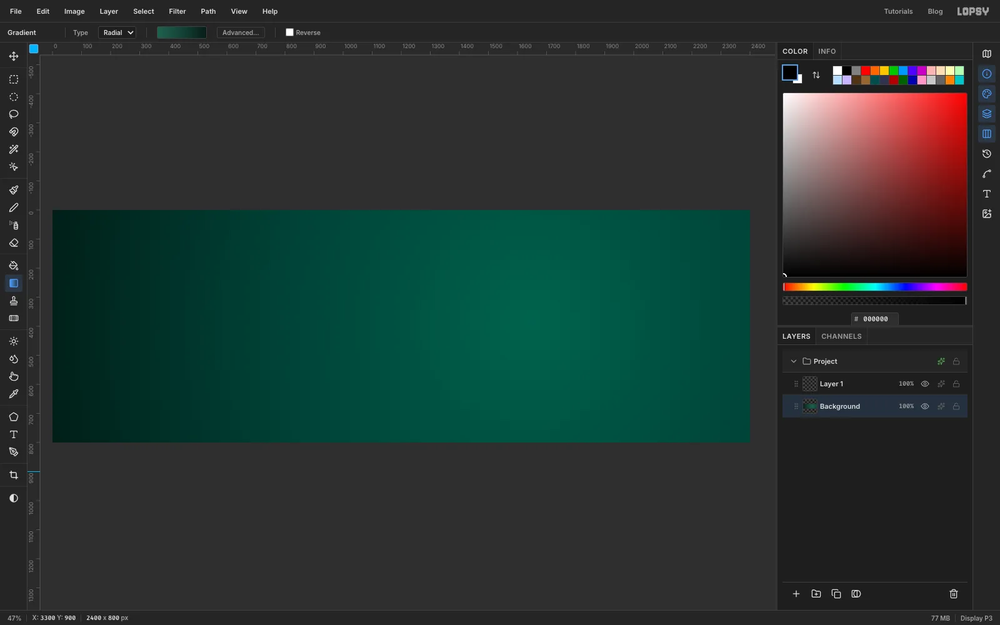

Open [Lopsy](/). In the **New Document** dialog, choose **Pixels** and enter `2400` × `800`. That's a 3:1 shape, close to a standard roadside board. Choose a **White** background and click **Create**.

Select the **Background** layer and pick the **Gradient** tool. Set **Type** to **Radial** and click **Advanced…**. Give it three stops: `#21614F`, `#123F35` at about 55% and `#071C17`.

Drag from just right of the canvas centre out past the bottom-right corner. The light falls on the right half, where the headline will go, and the left edge drops into shadow.

## Paper the wall with a pattern

Rename **Layer 1** to `Wallpaper`. You'll draw one wallpaper tile in the top-left corner, save it as a pattern, then fill the wall with it.

1. With black as the foreground colour, marquee a narrow strip about 20 px wide down the left side of a 64 × 64 square in the very top-left corner. Fill it with **Edit → Fill**.
2. Lasso a small diamond in the empty half of that square and fill it too.
3. Marquee the whole 64 × 64 tile and choose **Edit → Define Pattern**. Press [[Delete]] to clear the tile, then [[Cmd+D]].
4. Choose **Edit → Fill with Pattern…**, pick the tile, set **Row Stagger** to `50`% and click **Apply**.

Set the layer's blend mode to **Multiply** and its opacity to about 15%. Wallpaper should whisper, not shout.

## Bend a copper pipe

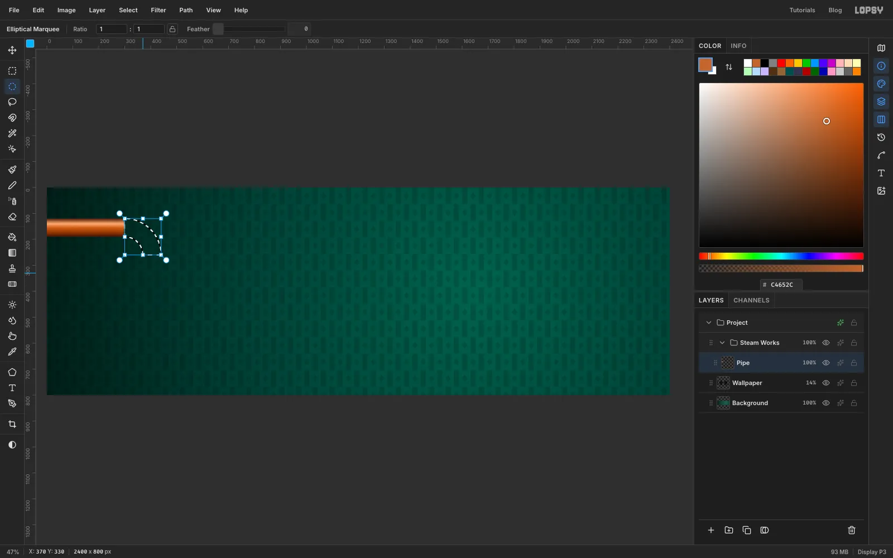

Click **New Group** and name it `Steam Works`. Add a layer inside it called `Pipe`.

**The straight run.**
1. Marquee a 70 px tall bar from the left edge about 300 px into the canvas, near the top.
2. With the selection still live, drag a **Linear** gradient straight down across it. Use the copper stops `#4A1E0A`, `#F2B07A` at 28%, `#C4652C` at 50%, `#7A3412` at 82% and `#3A1606`. A bright band near the top and dark edges make the bar read as a round pipe.

**The elbow.** Click the rulers to drop two guides first: a vertical one through the pipe's right end, and a horizontal one about 70 px below the pipe's bottom edge. They cross at the centre of the bend, and marquees snap to them, which makes the next part much easier.

1. With the **Elliptical Marquee**, drag a circle centred on that crossing point, sized so its top edge lines up with the top of the pipe.
2. Hold [[Shift+Alt]] and drag a rectangle over the circle's top-right quarter to keep only that quarter.
3. Hold [[Alt]] and drag a smaller circle on the same centre, with its top on the pipe's bottom edge. That cuts out the hole and leaves a quarter ring.

Now fill the ring with a **Radial** gradient dragged from the circle's centre out to its rim. Use the same colours, but squeeze them into the outer half of the bar: dark at 50% and 59%, mid-copper at 75%, highlight at 86%, dark again at 100%. The highlight now curves around the bend and lines up with the straight run.

Finish with a short vertical pipe dropping out of the elbow, shaded with the same linear gradient dragged sideways.

## Add brass fittings and rivets

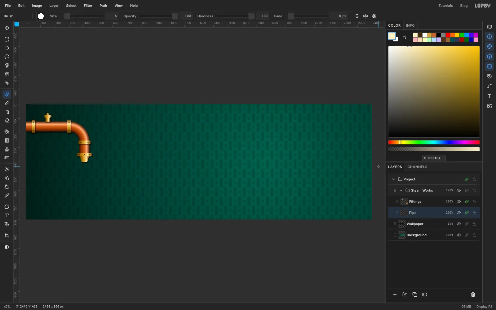

Add a layer called `Fittings`. Every brass part is a selection filled with the brass gradient `#5A3C0E`, `#FFE7A3`, `#D4A243`, `#7C5716` and `#3E2A08`, always dragged *across* the part:

- **Collars:** a collar at the pipe's left end, one where the run meets the elbow, and one partway down the drop.
- **Nozzle:** a wide flange at the bottom, then a lassoed trapezoid that narrows into a nozzle.
- **Safety valve:** a small cylinder on top of the pipe, capped with a flat ellipse and a ball.

For the rivets, use the **Brush** at size `9` and hardness `100` in dark brown, and click twice on each collar. Then click again with a size `4` brush in pale cream, a hair up and to the left of each one, to add a highlight.

Give `Fittings` and `Pipe` a soft **Drop Shadow** in the Layer effects drawer, so the pipe stands off the wall.

## Bolt on a valve wheel

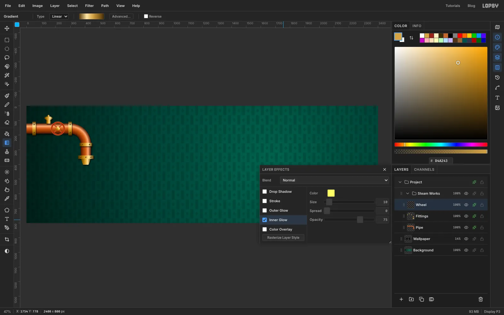

Add a layer called `Wheel`. The wheel is a ring, an X of spokes and a hub:

1. **Ring:** set the foreground to `#9A2418`. Draw a circle about 96 px across over the pipe, between the left collar and the elbow, and fill it. Draw a smaller circle with the same centre and press [[Delete]] to hollow it out.
2. **Spokes:** with the **Brush** at size `9`, click on the ring, then [[Shift]]-click directly opposite. Do this twice to make an X.
3. **Hub:** draw a small circle in the middle and fill it with the brass gradient.

Open the Layer effects drawer, tick **Inner Glow** and set its colour to `#FFB07A`, **Size** `5`, **Opacity** `70`. The edge highlight makes the flat red read as painted iron. Add a **Drop Shadow** to match the fittings.

## Shape the lacquer bowl

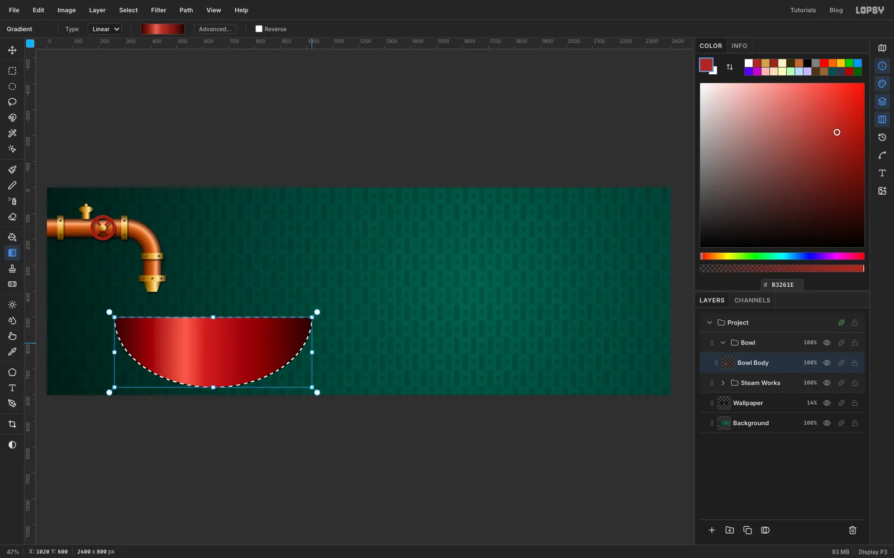

Click **New Group**, name it `Bowl`, and add a layer called `Bowl Body`.

With the **Elliptical Marquee**, draw an ellipse about 760 px wide and 540 px tall, centred a little to the right of the nozzle. Then hold [[Shift+Alt]] and drag a rectangle over its lower half, so only the bottom half stays selected.

Drag a horizontal **Linear** gradient straight into that selection, from its left edge to its right edge, with these stops:

- `#2E0503` at the left edge
- `#8E1A14`
- `#E86452` at about 36%
- `#C2342A`
- `#7E140F`
- `#240302` at the right edge

The off-centre highlight is what makes it look like glossy lacquer.

## Fill a Greek-key band

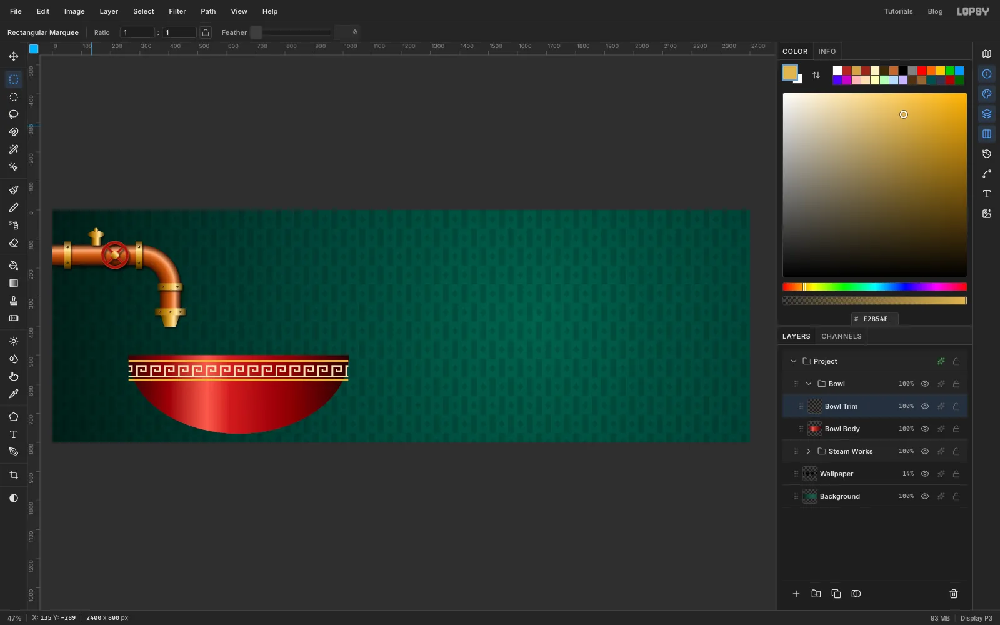

Ramen bowls often have a *raimon* (Greek-key) border. Add a layer called `Bowl Trim`.

**Make the tile.** In the top-left corner, build one key unit inside a 48 × 48 square from 6 px wide bars of cream `#F3E2B8`, using small rectangle marquees and **Edit → Fill**:

- a bar along the bottom
- a post up the left side
- an arm along the top, stopping short of the right side
- a short drop down from the end of that arm
- a short arm back to the left, ending in a little hook

Marquee the 48 × 48 square and choose **Edit → Define Pattern**, then press [[Delete]] and [[Cmd+D]].

**Fill the band.** Marquee a 48 px band from the bowl's left edge to its right edge, a little below the bowl's flat top. Choose **Edit → Fill with Pattern…**, pick the new tile and set **Row Stagger** to `0`. Then fill a thin gold `#E2B54E` line just above the band and another just below it.

> **Tip:** Start the band on a multiple of the tile height (48, 96, ...) from the top of the canvas. Then every key in the row comes out whole.

## Bend the band with Mesh Warp

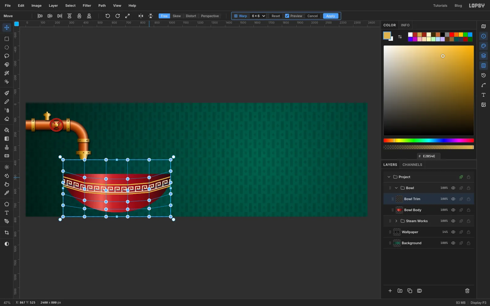

A straight band looks pasted on, so it has to follow the bowl's curve.

1. Marquee a box around the band that is much **taller** than the band, reaching from a little above it down to the bottom of the bowl.
2. Choose the **Move** tool and click **Mesh Warp** in the options bar. Set the grid to **6 × 6** and tick **Preview**.
3. Leave the outer columns and the bottom row alone. Drag the inner points down so the band sags into a gentle smile: the middle columns most (roughly the depth of the band), easing off toward the sides. Pull the row of points just under the band about half as far.
4. Click **Apply**.

The tall box matters. If the box is only as tall as the band, the grid cells under it get squashed, and thin lines break up into dashes.

If the curve still looks kinked near the ends, marquee just the left third of the band and run a second, smaller warp, nudging its inner points down a little to round the curve. Do the same on the right. Finish with a 1 px **Gaussian Blur** on the band to smooth any jagged edges.

## Add the rim and the broth

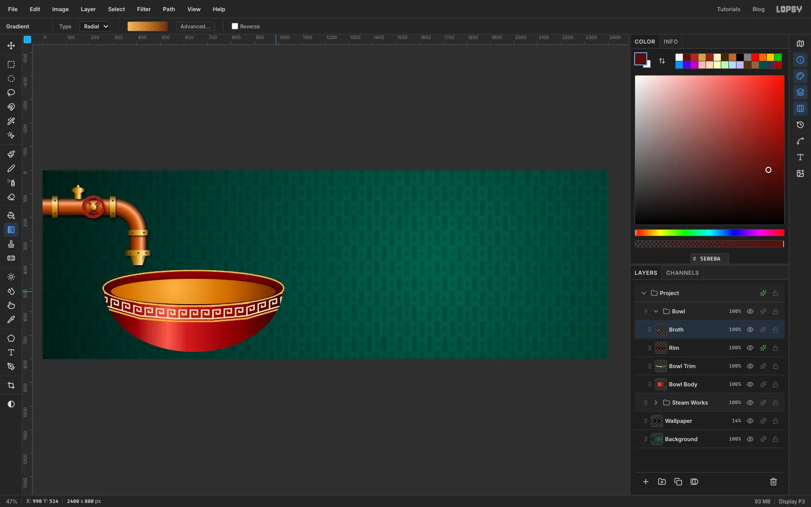

**Rim.** Add a layer called `Rim`. Draw a flat ellipse across the top of the bowl, the full width and about 144 px tall. Fill it with a vertical gradient from `#8A1A12` down to `#240302`. This is the inside wall. Give the layer a 6 px **Stroke** in `#E8BE5A`, which becomes a gold lip all the way around.

**Broth.** Add a layer called `Broth`. Draw a slightly smaller ellipse a little lower inside the rim, so a sliver of back wall still shows. Fill it with a **Radial** gradient of `#F2B657`, `#C27222` and `#6A300C`, starting just left of centre.

## Fill the bowl

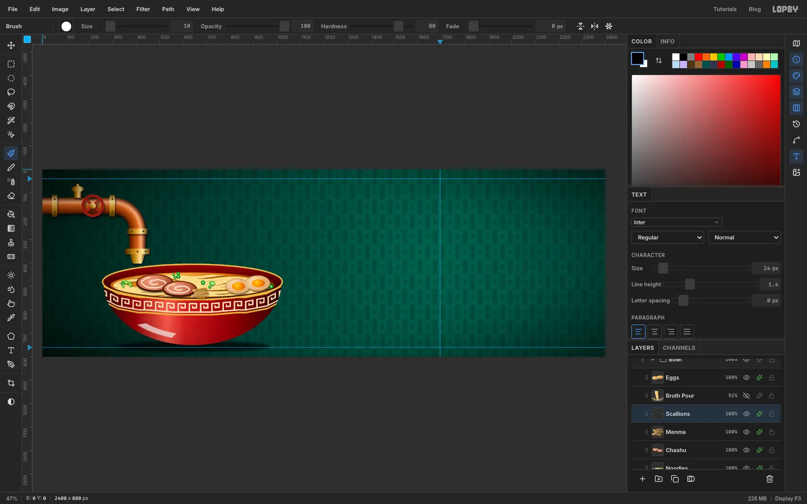

Put each topping on its own layer above `Broth`, all inside the **Bowl** group.

- **Noodles:** [[Cmd]]-click the `Broth` thumbnail to select the broth. On a `Noodles` layer, drag a size `11` brush across it in loose wavy lines of `#F5DE95`, about a dozen rows. Add a 1 px **Stroke** in `#C9974E` and a small **Drop Shadow**.
- **Chashu:** make two overlapping slices on a `Chashu` layer.
  1. For each slice, fill an ellipse with a dark brown gradient for the rind.
  2. Fill a slightly smaller ellipse inside it with a pink-brown radial gradient (`#E3A084` → `#94492E`).
  3. Paint one wobbly spiral of fat in cream with a size `7` brush. Rolled pork belly shows its fat as a spiral.
- **Eggs:** on an `Eggs` layer, fill two white ovals and add an orange radial yolk in each. Then click the whites with the **Magic Wand** and fill them with a tan gradient (`#F3DDB6` → `#D9AE78`) so they look soy-marinated. Add a thin **Stroke** and **Drop Shadow**.
- **Menma (bamboo shoots):** lasso three short tan strips and draw thin darker lines along them for the fibres.
- **Scallions:** click brush dabs of 12–20 px in two greens (`#3E9A35`, `#7DC24A`), grouped into three or four little clusters. Then click a smaller pale dab inside each one to turn them into rings.

**Gloss and shadow.**
- **Gloss:** add a `Bowl Gloss` layer above `Bowl Trim`. Lasso a thin crescent low on the left of the bowl that follows its curve, fill it white, blur it 3 px and set it to about 70%.
- **Shadow:** add a `Bowl Shadow` layer under `Bowl Body`. Fill a flat black ellipse just under the bowl, blur it about 16 px, and set it to **Multiply** at 70%.

Finally, select the **Bowl** group row and drag the bowl up about 20 px with the **Move** tool, so it sits at least 50 px clear of the bottom edge.

## Lean a sheet of nori

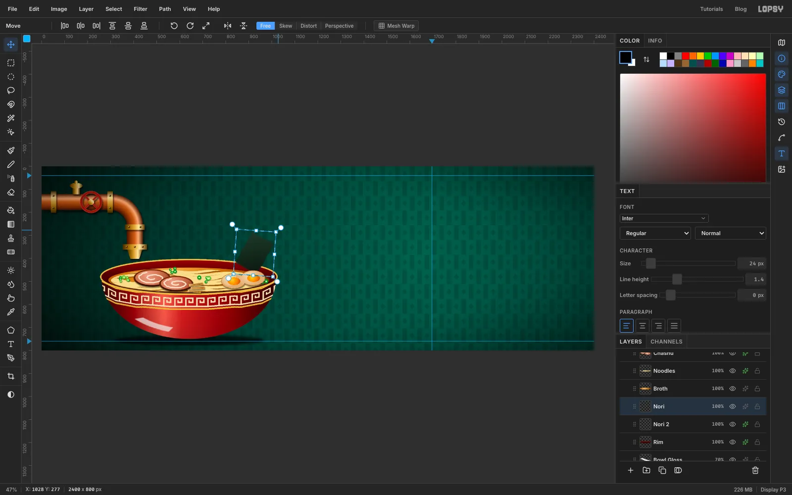

Add a layer called `Nori` *below* `Broth`, so the broth covers the sheet's bottom edge.

1. Lasso a sheet about 110 × 155 px with slightly wobbly edges. Fill it with a diagonal gradient from `#24382A` to `#0E1611`.
2. For the papery texture, run **Filter → Add Noise** at `12`, then **Filter → Motion Blur** at angle `60` and distance `16`.
3. Marquee around the sheet and switch to the **Move** tool. Drag a rotation handle (just outside a corner) about 25° clockwise, so the sheet leans against the back-right rim. Press [[Cmd+D]] to commit.

## Pour the broth

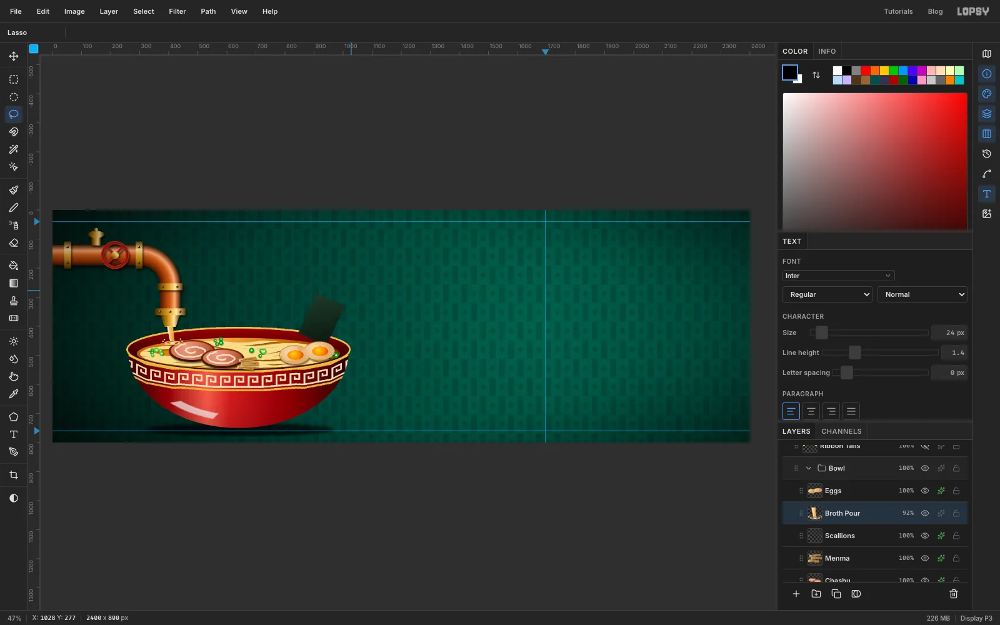

Add a `Broth Pour` layer at the top of the **Bowl** group.

1. Lasso a stream that starts at the nozzle, curves very slightly and tapers to about two-thirds of its width where it meets the broth.
2. Fill it with a sideways gradient from `#FFF1C2` to `#E39A3C`.
3. With a size `3` white brush, draw a highlight down the left side.
4. Where it lands, draw a flat ellipse, fill it pale gold and cut a smaller ellipse out of its middle to leave a splash ring. Click a few small droplets around it.

Make sure the stream lands on bare broth, not on a topping. If a topping is in the way, select its layer and drag it aside with the **Move** tool.

## Make brass chopsticks

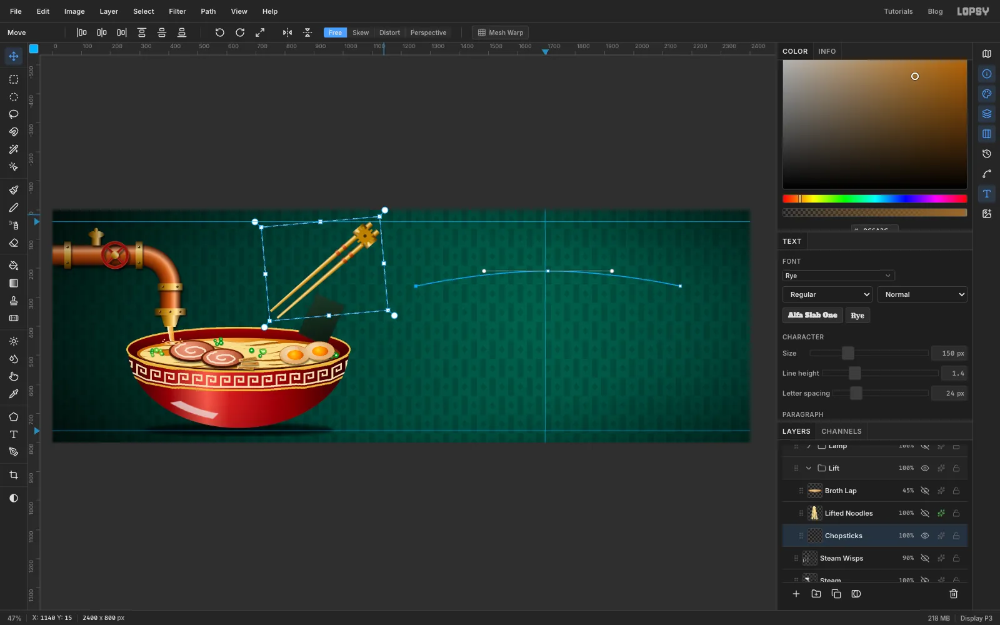

Add a **New Group** called `Lift` above the bowl, and a layer inside it called `Chopsticks`.

**Draw them flat.** It's easier to draw the sticks lying horizontally and rotate them afterwards.
1. Lasso two long sticks, one above the other, with the thin tips on the **left** and the thick ends on the **right**. Fill each with the brass gradient dragged across its width.
2. Add two thin copper bands near the thick ends with small marquee fills.
3. Fill a brass plate that joins the thick ends.
4. **The gear:** choose the **Shape** tool, set **Shape** to **Ellipse**, and draw a small circle on the plate. Then add twelve teeth around it with [[Shift]]-click brush lines (size `8`) radiating out from its edge. Click a dark dot in the middle.

**Rotate them into place.** Marquee around the sticks and drag a rotation handle about 36° counter-clockwise, so the tips point down into the bowl. Press [[Cmd+D]], then drag them with the **Move** tool until the tips sit over the noodles. Keep the gear at least 50 px from the top edge.

## Pull up the noodles

Add a layer called `Lifted Noodles` above the chopsticks.

**The bundle.** With a size `9` brush, draw about fourteen strands from the chopstick tips down to the broth.
- Wiggle each one with small, regular side-to-side kinks to make ramen's crinkle.
- Give each strand a slightly different sway, so the bundle doesn't look combed.
- Make every third strand a darker `#E6C46E`, for depth.
- Draw a few short arcs over the tips, so the noodles drape over the sticks.

**Join it to the bowl.** Add a layer called `Broth Lap` above the noodles. Fill a flat ellipse of broth colour where the bundle meets the soup, add a thin pale ripple ring, blur it 2 px and set it to 45%. The noodles now look as if they come up out of the broth rather than hovering over it.

Give `Lifted Noodles` the same **Stroke** and **Drop Shadow** as the noodles in the bowl.

## Raise the steam

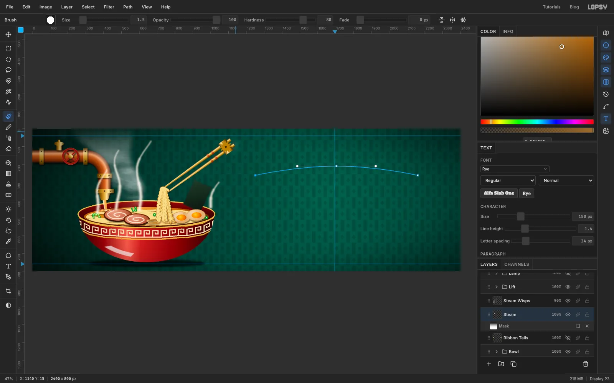

**The haze.** Add a layer called `Steam` between the **Bowl** and **Lift** groups.
1. Lasso a tall, wavy plume rising from the bowl. Choose **Select → Feather…** with `34` px, then **Filter → Smoke…** with Scale `5` and Turbulence `60`.
2. Repeat for a second plume on the right of the bowl, and a narrow one rising from the pipe's safety valve.
3. Set the layer to **Screen**, so the black parts of the smoke disappear.

**Fade it as it rises.** Click **Add Mask**, then **Edit mask for Steam**. Open the Gradient tool's **Advanced…** editor and set it back to plain white → black, because it still holds the last gradient's colours. Drag from the broth straight up past the top edge. Click the layer thumbnail to leave mask editing.

**The wisps.** Add a layer called `Steam Wisps` and choose a soft brush (hardness `0`). Paint each wisp as three overlapping S-strokes that get thinner as they rise: about 30 px at the broth, then 20, then 11 near the top. Blur the layer 9 px and set it to **Screen** at about 90%.

Keep steam off the nori and away from the headline. Lasso any stray wisp, feather it and press [[Delete]].

## Hang a gas lantern

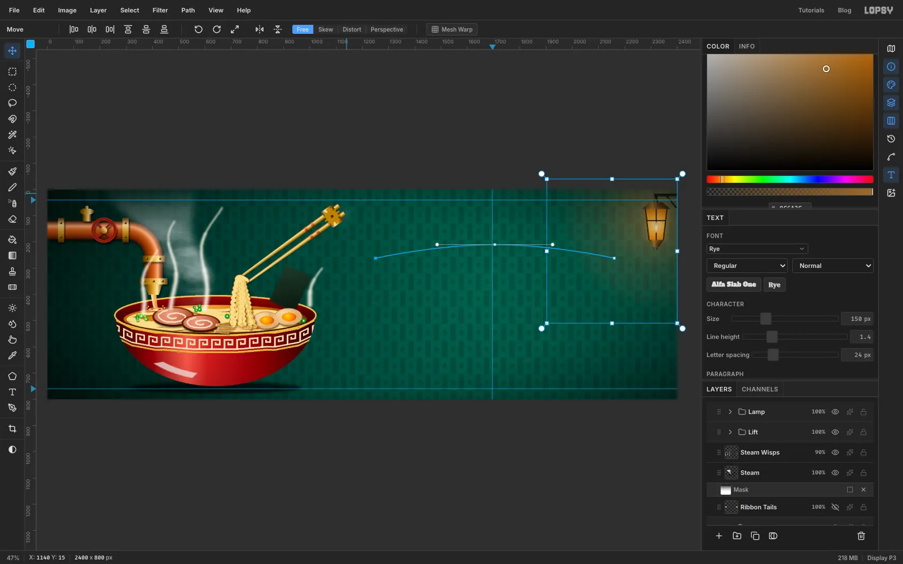

Make a **Lamp** group in the top-right corner. The lantern is about 120 px wide and 250 px tall, hanging from a bracket at the right edge. It has four layers:

- **Lantern:** the metal parts, each lassoed and filled with a bronze gradient (`#20180E`, `#9C7A3C`, `#4A3820`, `#17110A`) dragged across it.
  - A straight wall bracket and a short hanger, in near-black `#1A1D1B`.
  - A wide trapezoid roof with a small ball on top.
  - A short cone under the glass with a little finial ball.
- **Lantern Glass:**
  1. Lasso a pane that narrows toward the bottom and fill it with a radial gradient: `#FFF6CF` in the centre to `#D06A18` at the edge.
  2. Lasso a teardrop flame in the middle and fill it white to `#FF9E2C`.
  3. Add an **Outer Glow** in `#FFB547`.
- **Lantern Bars:** dark brush lines over the glass for the frame: one down each side, one across and one down the middle.
- **Lamp Glow:** a **Radial** gradient from `#FF9A3A` at about 45% opacity to fully transparent, set to **Screen**. Keep it tight around the lantern; a big glow turns the green muddy.

To resize all the layers at once, select the **Lamp** group's row and choose the **Move** tool without a marquee. The handles then frame the whole group. Drag the bottom-left corner in to about 85%, then drag the group up into the corner. Leave at least 40 px between the lantern and the headline.

## Set an arched headline on a path

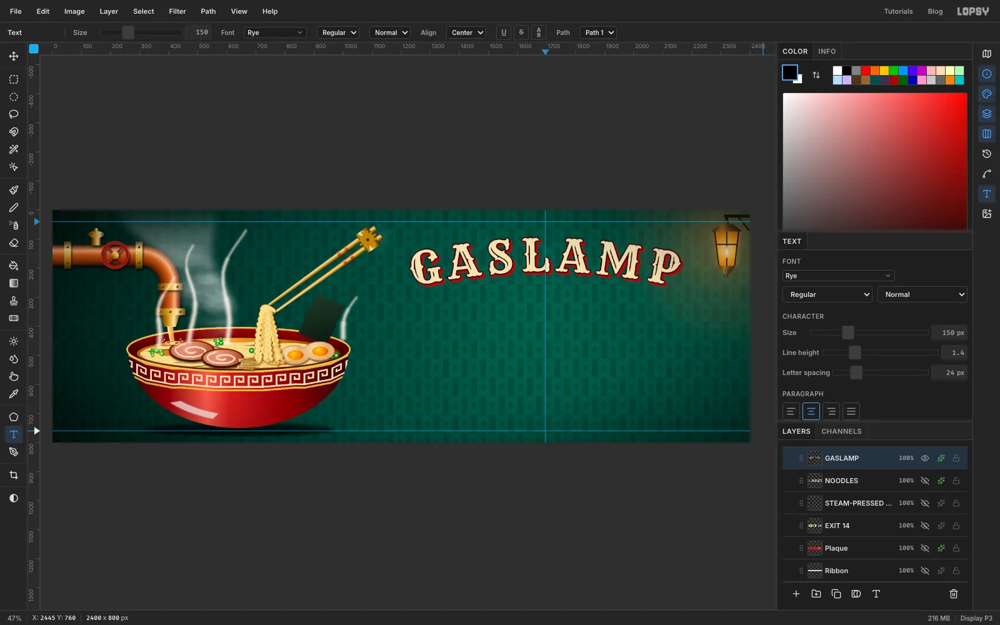

**The arch.** Add a **New Group** called `Type`. Choose the **Pen** tool. Keep the arch shallow: the middle only about 50–70 px higher than the ends.
1. Click at the left end of where the headline will go.
2. Click-and-drag at the middle, pulling the handle out sideways, to make a smooth top.
3. Click at the right end, level with the first point.
4. Click **✓** (**Commit path**) in the options bar.

**The word.** Pick the **Text** tool and choose the font **Rye** at size `150`, colour `#F6E3B4`. Click in an empty part of the canvas, type `GASLAMP` and press [[Tab]] to commit. Then set **Path** in the options bar to **Path 1**, and the word jumps onto the arch.

Path text always starts at the path's first point, so to centre it, open the **Text** panel and raise **Letter spacing** until the word fills the whole arch (about `24` px here).

To flatten the arch later, select **Path 1** in the Paths panel and drag its middle point down with the **Pen** tool. The text reflows along it.

On the **GASLAMP** layer, add a 4 px **Stroke** in `#2B0B07`. Then add a **Drop Shadow** in `#A8231C` with **Offset X** and **Offset Y** `7`, **Blur** `1` and **Opacity** `100`.

## Gild the headline

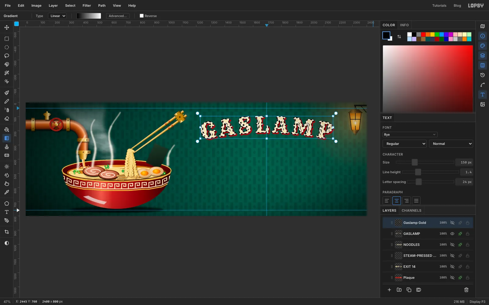

1. [[Cmd]]-click the **GASLAMP** layer's thumbnail to select the letter shapes.
2. Add a layer called `Gaslamp Gold` above it.
3. Drag a vertical **Linear** gradient over the letters with these stops:
   - `#FFF8DC` at the top
   - `#FFE08A`
   - `#E0A238` near the middle
   - `#FFE7A0`
   - `#B07A22` at the bottom
4. Press [[Cmd+D]].

The text stays editable underneath the gold, and its stroke and shadow still show around the edges.

> **Tip:** If you change the text or the path, delete the gold and redo this step, because the gold doesn't follow the letters.

## Set NOODLES in woodtype

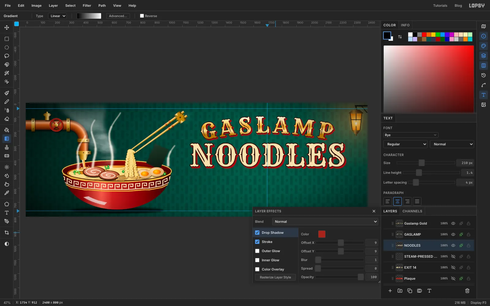

Click the `Gaslamp Gold` layer first. It's an ordinary layer inside **Type**, so the new text lands in the group and doesn't restyle GASLAMP.

Set the **Text** tool to Rye, size `210`, letter spacing `4`. Click in empty canvas, type `NOODLES` and press [[Tab]] to commit. With the **Move** tool, drag it under the arch so it's centred on the same vertical line as GASLAMP. A guide clicked onto the top ruler at the centre line helps.

Give NOODLES a 5 px **Stroke** in `#2B0B07`. Then add a **Drop Shadow** in `#A8231C` with **Offset X** and **Offset Y** `9`, **Blur** `1` and **Opacity** `100`. That hard offset shadow is the classic look of a woodtype circus or theatre poster.

## Add the ribbon and exit plaque

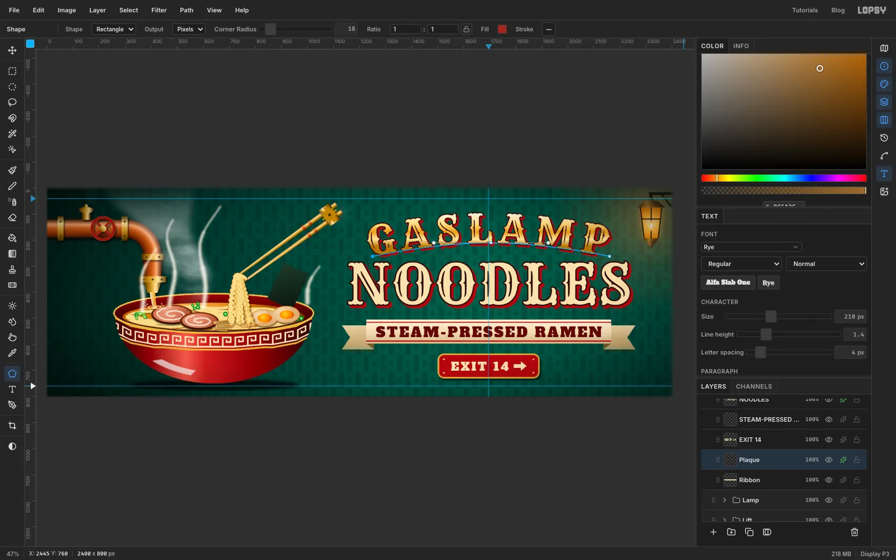

**Ribbon.** On a `Ribbon` layer in **Type**, marquee a band as wide as GASLAMP and about 92 px tall. Fill it with a vertical cream gradient (`#FFF4DA` → `#CDB68A`) and add a thin red `#A8231C` rule just inside the top and bottom edges.

On a layer under it, lasso two notched tails a little lower than the band. Fill them with a darker tan and add a small dark triangle for each fold.

**Tagline.** Type `STEAM-PRESSED RAMEN` in **Alfa Slab One** at about size `54`, colour `#5A120C`, with letter spacing `6`. Move it so the space above and below the letters, between the red rules, is equal.

**Plaque.**
1. With the **Shape** tool set to **Rectangle**, a corner radius of `18` and fill `#A8231C`, drag out a plaque centred under the ribbon.
2. Give it a 6 px **Stroke** in `#D9AE4E` and a soft **Drop Shadow**, and click a brass rivet into each corner.
3. Type `EXIT 14` in Alfa Slab One at `44` in cream. Lasso an arrow after it and fill it in the same cream.
4. Centre the word and arrow together on the plaque.

> **Tip:** The Shape tool snaps to guides. If the plaque comes out lopsided, move the centre guide to the true middle of the text, or turn snapping off.

## Finish with grain, seams and a vignette

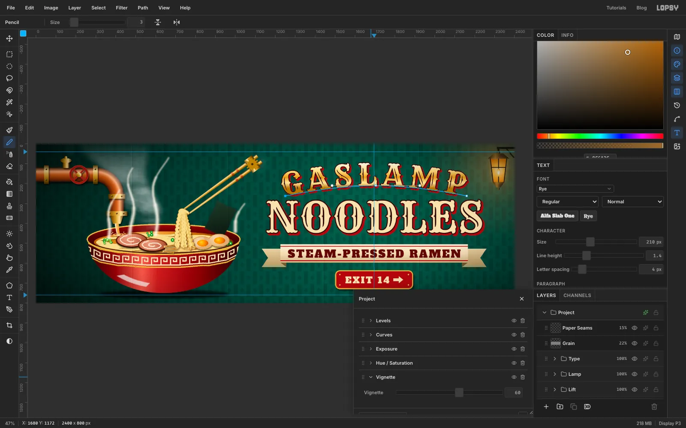

Real billboards are printed on paper sheets and pasted up in panels. A little texture sells it:

- **Grain:** add a layer called `Grain` at the top and fill it with mid grey `#808080`. Run **Filter → Add Noise** at `40`. Set it to **Overlay** at about 20%.
- **Paper seams:** add a layer called `Paper Seams`. With the **Pencil** at size `3`, click at the top edge and [[Shift]]-click at the bottom to draw a white line every 480 px. Draw a black line just to the right of each. Set the layer to **Overlay** at 15%, so they only just show.
- **Vignette:** select the top-level **Project** group, open its Layer effects drawer, click **Add Adjustment → Vignette** and set it to `60`.

Choose **File → Save Project**, then **File → Quick Export PNG**.

> **Tip:** Before you export, step back from the screen, or zoom right out, and read the board in under five seconds. If a word takes longer than that, make it bigger or cut it.
